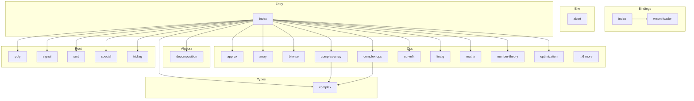

# @danielsimonjr/mathts-wasm - Dependency Graph

**Version**: 0.1.5 | **Last Updated**: 2026-06-25

This document provides a comprehensive dependency graph of all files, components, imports, functions, and variables in the codebase.

---

## Table of Contents

1. [Overview](#overview)
2. [Package Dependencies](#package-dependencies)
3. [Algebra Dependencies](#algebra-dependencies)
4. [Bindings Dependencies](#bindings-dependencies)
5. [Env Dependencies](#env-dependencies)
6. [Entry Dependencies](#entry-dependencies)
7. [Ops Dependencies](#ops-dependencies)
8. [Root Dependencies](#root-dependencies)
9. [Types Dependencies](#types-dependencies)
10. [Dependency Matrix](#dependency-matrix)
11. [Circular Dependency Analysis](#circular-dependency-analysis)
12. [Visual Dependency Graph](#visual-dependency-graph)
13. [Summary Statistics](#summary-statistics)

---

## Overview

The codebase is organized into the following modules:

- **algebra**: 1 file
- **bindings**: 2 files
- **env**: 1 file
- **entry**: 1 file
- **ops**: 16 files
- **root**: 5 files
- **types**: 1 file

---

## Algebra Dependencies

### `src/algebra/decomposition.ts` - Dense matrix decompositions: LU, QR, Cholesky, inverse, determinant.

**Exports:**
- Functions: `matrix_lu_decompose`, `matrix_qr_decompose`, `matrix_cholesky`, `matrix_inverse`, `matrix_determinant`

---

## Bindings Dependencies

### `src/bindings/index.ts` - MathTS WASM Bindings

**Internal Dependencies:**
| File | Imports | Type |
|------|---------|------|
| `./wasm-loader.js` | `MathTSWasm, loadWasm, loadWasmSync` | Re-export |

**Exports:**
- Re-exports: `MathTSWasm`, `loadWasm`, `loadWasmSync`

---

### `src/bindings/wasm-loader.ts` - WASM Module Loader

**Exports:**
- Classes: `MathTSWasm`
- Interfaces: `MathTSWasmExports`, `MathTSWasmInstance`
- Functions: `loadWasm`, `loadWasmSync`
- Default: `MathTSWasm`

---

## Env Dependencies

### `src/env/abort.ts` - Custom abort handler for AssemblyScript

**Exports:**
- Functions: `abort`

---

## Entry Dependencies

### `src/index.ts` - MathTS AssemblyScript Entry Point

**Internal Dependencies:**
| File | Imports | Type |
|------|---------|------|
| `./types/complex` | `Complex, complex, complexFromPolar` | Re-export |
| `./ops/scalar` | `add_f64, sub_f64, mul_f64, div_f64, mod_f64, neg_f64, sqrt_f64, pow_f64, square_f64, cube_f64, cbrt_f64, nthRoot_f64, exp_f64, expm1_f64, log_f64, log1p_f64, log10_f64, log2_f64, sin_f64, cos_f64, tan_f64, asin_f64, acos_f64, atan_f64, atan2_f64, sinh_f64, cosh_f64, tanh_f64, asinh_f64, acosh_f64, atanh_f64, abs_f64, floor_f64, ceil_f64, round_f64, trunc_f64, sign_f64, min_f64, max_f64, clamp_f64, isNaN_f64, isFinite_f64, PI, E, PHI, SQRT2, SQRT1_2, LN2, LN10, LOG2E, LOG10E, EPSILON` | Re-export |
| `./ops/array` | `array_sum, array_product, array_mean, array_variance, array_stddev, array_min, array_max, array_argmin, array_argmax, array_norm, array_norm_l1, array_norm_linf, array_dot, array_add, array_sub, array_mul, array_div, array_scale, array_add_scalar, array_neg, array_abs, array_sqrt, array_square, array_exp, array_log, array_sin, array_cos, array_axpby, array_distance, array_cosine_similarity, array_scale_inplace, array_add_scalar_inplace, array_add_inplace, array_clamp_inplace, array_fill, array_copy` | Re-export |
| `./ops/matrix` | `matrix_zeros, matrix_ones, matrix_fill, matrix_identity, matrix_diag, matrix_get, matrix_set, matrix_get_row, matrix_get_col, matrix_get_diag, matrix_add, matrix_sub, matrix_mul_elementwise, matrix_div_elementwise, matrix_scale, matrix_add_scalar, matrix_neg, matrix_multiply, matrix_vector_multiply, vector_matrix_multiply, matrix_outer, matrix_transpose, matrix_sum, matrix_mean, matrix_min, matrix_max, matrix_norm_frobenius, matrix_trace, matrix_sum_rows, matrix_sum_cols, matrix_is_square, matrix_is_symmetric, matrix_is_diagonal, matrix_is_identity, matrix_scale_inplace, matrix_add_scalar_inplace, matrix_add_inplace, matrix_copy, matrix_axpy, matrix_gemm, matrix_gemv` | Re-export |
| `./ops/svd` | `matrix_svd, matrix_singular_values` | Re-export |
| `./algebra/decomposition` | `matrix_lu_decompose, matrix_qr_decompose, matrix_cholesky, matrix_inverse, matrix_determinant` | Re-export |
| `./ops/special` | `chebyshevT, hermiteH, laguerreL, legendreP, erfi, expIntegralEi, sinIntegral, cosIntegral, logIntegral` | Re-export |
| `./ops/number-theory` | `eulerPhi, divisorSigma, moebiusMu, carmichaelLambda, jacobiSymbol, harmonicNumber, partitions, primeFactors, divisors, integerDigits, chineseRemainder` | Re-export |
| `./ops/polynomial` | `polyadd, polynomialQuotient, polynomialRemainder, polynomialGCD, polynomialLCM, discriminant, resultant` | Re-export |
| `./ops/signal` | `resample, medfilt, windowFunction` | Re-export |
| `./signal` | `apply_window_f64, welch_psd_f64, bartlett_psd_f64, goertzel_f64, chirp_z_transform_f64` | Re-export |
| `./ops/linalg` | `rowReduce, characteristicPolynomial` | Re-export |
| `./ops/curvefit` | `expfit, logfit, powerfit` | Re-export |
| `./ops/optimization` | `quadprog, linprog, nullspace` | Re-export |
| `./ops/approx` | `residue, padeApproximant` | Re-export |
| `./ops/tensor` | `tensorTranspose` | Re-export |
| `./ops/complex-ops` | `complex_add, complex_sub, complex_mul, complex_div, complex_neg, complex_conj, complex_reciprocal, complex_abs, complex_arg, complex_abs_squared, complex_sqrt, complex_pow, complex_cpow, complex_square, complex_cube, complex_exp, complex_log, complex_log10, complex_log2, complex_sin, complex_cos, complex_tan, complex_asin, complex_acos, complex_atan, complex_sinh, complex_cosh, complex_tanh, complex_asinh, complex_acosh, complex_atanh, complex_equals, complex_approx_equals, complex_is_zero, complex_is_real, complex_is_imaginary, complex_is_nan, complex_is_finite, complex_from_real, complex_from_imag, complex_from_polar, complex_to_polar, complex_axpby, complex_distance` | Re-export |
| `./ops/bitwise` | `bitAnd_i32_array, bitOr_i32_array, bitXor_i32_array, bitNot_i32_array, leftShift_i32_array, rightArithShift_i32_array, rightLogShift_i32_array` | Re-export |
| `./poly` | `poly_mul_f64, poly_div_mod_f64, poly_fit_f64, cheb_fit_f64, legendre_fit_f64` | Re-export |
| `./tridiag` | `tridiag_solve_f64, divided_difference_f64` | Re-export |
| `./special` | `bessel_j0_f64, bessel_j1_f64, bessel_jn_f64, bessel_y0_f64, bessel_y1_f64, bessel_yn_f64, airy_ai_f64, airy_bi_f64, elliptic_k_f64, elliptic_e_f64, lgamma_f64, carlson_rc_f64, carlson_rf_f64, carlson_rd_f64, carlson_rj_f64, elliptic_f_incomplete_f64, elliptic_e_incomplete_f64, elliptic_pi_incomplete_f64` | Re-export |
| `./sort` | `sort_f64, argsort_f64, rank_f64` | Re-export |
| `./ops/complex-array` | `complex_array_zeros, complex_array_ones, complex_array_fill, complex_array_get, complex_array_set, complex_array_set_parts, complex_array_get_re, complex_array_get_im, complex_array_length, complex_array_add, complex_array_sub, complex_array_mul, complex_array_div, complex_array_scale_real, complex_array_scale_complex, complex_array_neg, complex_array_conj, complex_array_abs, complex_array_arg, complex_array_abs_squared, complex_array_real, complex_array_imag, complex_array_exp, complex_array_log, complex_array_sqrt, complex_array_sum, complex_array_mean, complex_array_dot, complex_array_norm, complex_array_scale_inplace, complex_array_conj_inplace, complex_array_add_inplace, complex_array_copy` | Re-export |

**Exports:**
- Re-exports: `Complex`, `complex`, `complexFromPolar`, `add_f64`, `sub_f64`, `mul_f64`, `div_f64`, `mod_f64`, `neg_f64`, `sqrt_f64`, `pow_f64`, `square_f64`, `cube_f64`, `cbrt_f64`, `nthRoot_f64`, `exp_f64`, `expm1_f64`, `log_f64`, `log1p_f64`, `log10_f64`, `log2_f64`, `sin_f64`, `cos_f64`, `tan_f64`, `asin_f64`, `acos_f64`, `atan_f64`, `atan2_f64`, `sinh_f64`, `cosh_f64`, `tanh_f64`, `asinh_f64`, `acosh_f64`, `atanh_f64`, `abs_f64`, `floor_f64`, `ceil_f64`, `round_f64`, `trunc_f64`, `sign_f64`, `min_f64`, `max_f64`, `clamp_f64`, `isNaN_f64`, `isFinite_f64`, `PI`, `E`, `PHI`, `SQRT2`, `SQRT1_2`, `LN2`, `LN10`, `LOG2E`, `LOG10E`, `EPSILON`, `array_sum`, `array_product`, `array_mean`, `array_variance`, `array_stddev`, `array_min`, `array_max`, `array_argmin`, `array_argmax`, `array_norm`, `array_norm_l1`, `array_norm_linf`, `array_dot`, `array_add`, `array_sub`, `array_mul`, `array_div`, `array_scale`, `array_add_scalar`, `array_neg`, `array_abs`, `array_sqrt`, `array_square`, `array_exp`, `array_log`, `array_sin`, `array_cos`, `array_axpby`, `array_distance`, `array_cosine_similarity`, `array_scale_inplace`, `array_add_scalar_inplace`, `array_add_inplace`, `array_clamp_inplace`, `array_fill`, `array_copy`, `matrix_zeros`, `matrix_ones`, `matrix_fill`, `matrix_identity`, `matrix_diag`, `matrix_get`, `matrix_set`, `matrix_get_row`, `matrix_get_col`, `matrix_get_diag`, `matrix_add`, `matrix_sub`, `matrix_mul_elementwise`, `matrix_div_elementwise`, `matrix_scale`, `matrix_add_scalar`, `matrix_neg`, `matrix_multiply`, `matrix_vector_multiply`, `vector_matrix_multiply`, `matrix_outer`, `matrix_transpose`, `matrix_sum`, `matrix_mean`, `matrix_min`, `matrix_max`, `matrix_norm_frobenius`, `matrix_trace`, `matrix_sum_rows`, `matrix_sum_cols`, `matrix_is_square`, `matrix_is_symmetric`, `matrix_is_diagonal`, `matrix_is_identity`, `matrix_scale_inplace`, `matrix_add_scalar_inplace`, `matrix_add_inplace`, `matrix_copy`, `matrix_axpy`, `matrix_gemm`, `matrix_gemv`, `matrix_svd`, `matrix_singular_values`, `matrix_lu_decompose`, `matrix_qr_decompose`, `matrix_cholesky`, `matrix_inverse`, `matrix_determinant`, `chebyshevT`, `hermiteH`, `laguerreL`, `legendreP`, `erfi`, `expIntegralEi`, `sinIntegral`, `cosIntegral`, `logIntegral`, `eulerPhi`, `divisorSigma`, `moebiusMu`, `carmichaelLambda`, `jacobiSymbol`, `harmonicNumber`, `partitions`, `primeFactors`, `divisors`, `integerDigits`, `chineseRemainder`, `polyadd`, `polynomialQuotient`, `polynomialRemainder`, `polynomialGCD`, `polynomialLCM`, `discriminant`, `resultant`, `resample`, `medfilt`, `windowFunction`, `apply_window_f64`, `welch_psd_f64`, `bartlett_psd_f64`, `goertzel_f64`, `chirp_z_transform_f64`, `rowReduce`, `characteristicPolynomial`, `expfit`, `logfit`, `powerfit`, `quadprog`, `linprog`, `nullspace`, `residue`, `padeApproximant`, `tensorTranspose`, `complex_add`, `complex_sub`, `complex_mul`, `complex_div`, `complex_neg`, `complex_conj`, `complex_reciprocal`, `complex_abs`, `complex_arg`, `complex_abs_squared`, `complex_sqrt`, `complex_pow`, `complex_cpow`, `complex_square`, `complex_cube`, `complex_exp`, `complex_log`, `complex_log10`, `complex_log2`, `complex_sin`, `complex_cos`, `complex_tan`, `complex_asin`, `complex_acos`, `complex_atan`, `complex_sinh`, `complex_cosh`, `complex_tanh`, `complex_asinh`, `complex_acosh`, `complex_atanh`, `complex_equals`, `complex_approx_equals`, `complex_is_zero`, `complex_is_real`, `complex_is_imaginary`, `complex_is_nan`, `complex_is_finite`, `complex_from_real`, `complex_from_imag`, `complex_from_polar`, `complex_to_polar`, `complex_axpby`, `complex_distance`, `bitAnd_i32_array`, `bitOr_i32_array`, `bitXor_i32_array`, `bitNot_i32_array`, `leftShift_i32_array`, `rightArithShift_i32_array`, `rightLogShift_i32_array`, `poly_mul_f64`, `poly_div_mod_f64`, `poly_fit_f64`, `cheb_fit_f64`, `legendre_fit_f64`, `tridiag_solve_f64`, `divided_difference_f64`, `bessel_j0_f64`, `bessel_j1_f64`, `bessel_jn_f64`, `bessel_y0_f64`, `bessel_y1_f64`, `bessel_yn_f64`, `airy_ai_f64`, `airy_bi_f64`, `elliptic_k_f64`, `elliptic_e_f64`, `lgamma_f64`, `carlson_rc_f64`, `carlson_rf_f64`, `carlson_rd_f64`, `carlson_rj_f64`, `elliptic_f_incomplete_f64`, `elliptic_e_incomplete_f64`, `elliptic_pi_incomplete_f64`, `sort_f64`, `argsort_f64`, `rank_f64`, `complex_array_zeros`, `complex_array_ones`, `complex_array_fill`, `complex_array_get`, `complex_array_set`, `complex_array_set_parts`, `complex_array_get_re`, `complex_array_get_im`, `complex_array_length`, `complex_array_add`, `complex_array_sub`, `complex_array_mul`, `complex_array_div`, `complex_array_scale_real`, `complex_array_scale_complex`, `complex_array_neg`, `complex_array_conj`, `complex_array_abs`, `complex_array_arg`, `complex_array_abs_squared`, `complex_array_real`, `complex_array_imag`, `complex_array_exp`, `complex_array_log`, `complex_array_sqrt`, `complex_array_sum`, `complex_array_mean`, `complex_array_dot`, `complex_array_norm`, `complex_array_scale_inplace`, `complex_array_conj_inplace`, `complex_array_add_inplace`, `complex_array_copy`

---

## Ops Dependencies

### `src/ops/approx.ts` - Rational approximation — AssemblyScript fallback mirroring

**Exports:**
- Functions: `residue`, `padeApproximant`

---

### `src/ops/array.ts` - Array Operations for AssemblyScript

**Exports:**
- Functions: `array_sum`, `array_product`, `array_mean`, `array_variance`, `array_stddev`, `array_min`, `array_max`, `array_argmin`, `array_argmax`, `array_norm`, `array_norm_l1`, `array_norm_linf`, `array_dot`, `array_add`, `array_sub`, `array_mul`, `array_div`, `array_scale`, `array_add_scalar`, `array_neg`, `array_abs`, `array_sqrt`, `array_square`, `array_exp`, `array_log`, `array_sin`, `array_cos`, `array_axpby`, `array_distance`, `array_cosine_similarity`, `array_scale_inplace`, `array_add_scalar_inplace`, `array_add_inplace`, `array_clamp_inplace`, `array_fill`, `array_copy`

---

### `src/ops/bitwise.ts` - Bitwise Operations for AssemblyScript

**Exports:**
- Functions: `bitAnd_i32_array`, `bitOr_i32_array`, `bitXor_i32_array`, `bitNot_i32_array`, `leftShift_i32_array`, `rightArithShift_i32_array`, `rightLogShift_i32_array`

---

### `src/ops/complex-array.ts` - Complex Array Operations for AssemblyScript

**Internal Dependencies:**
| File | Imports | Type |
|------|---------|------|
| `../types/complex` | `Complex` | Import |

**Exports:**
- Functions: `complex_array_zeros`, `complex_array_ones`, `complex_array_fill`, `complex_array_get`, `complex_array_set`, `complex_array_set_parts`, `complex_array_get_re`, `complex_array_get_im`, `complex_array_length`, `complex_array_add`, `complex_array_sub`, `complex_array_mul`, `complex_array_div`, `complex_array_scale_real`, `complex_array_scale_complex`, `complex_array_neg`, `complex_array_conj`, `complex_array_abs`, `complex_array_arg`, `complex_array_abs_squared`, `complex_array_real`, `complex_array_imag`, `complex_array_exp`, `complex_array_log`, `complex_array_sqrt`, `complex_array_sum`, `complex_array_mean`, `complex_array_dot`, `complex_array_norm`, `complex_array_scale_inplace`, `complex_array_conj_inplace`, `complex_array_add_inplace`, `complex_array_copy`

---

### `src/ops/complex-ops.ts` - Complex Number Operations for AssemblyScript

**Internal Dependencies:**
| File | Imports | Type |
|------|---------|------|
| `../types/complex` | `Complex, complexFromPolar` | Import |

**Exports:**
- Functions: `complex_add`, `complex_sub`, `complex_mul`, `complex_div`, `complex_neg`, `complex_conj`, `complex_reciprocal`, `complex_abs`, `complex_arg`, `complex_abs_squared`, `complex_sqrt`, `complex_pow`, `complex_cpow`, `complex_square`, `complex_cube`, `complex_exp`, `complex_log`, `complex_log10`, `complex_log2`, `complex_sin`, `complex_cos`, `complex_tan`, `complex_asin`, `complex_acos`, `complex_atan`, `complex_sinh`, `complex_cosh`, `complex_tanh`, `complex_asinh`, `complex_acosh`, `complex_atanh`, `complex_equals`, `complex_approx_equals`, `complex_is_zero`, `complex_is_real`, `complex_is_imaginary`, `complex_is_nan`, `complex_is_finite`, `complex_from_real`, `complex_from_imag`, `complex_from_polar`, `complex_to_polar`, `complex_axpby`, `complex_distance`

---

### `src/ops/curvefit.ts` - Log-linearized curve fitting — AssemblyScript fallback mirroring

**Exports:**
- Functions: `expfit`, `logfit`, `powerfit`

---

### `src/ops/linalg.ts` - Extra linear-algebra kernels — AssemblyScript fallback mirroring

**Exports:**
- Functions: `rowReduce`, `characteristicPolynomial`

---

### `src/ops/matrix.ts` - Matrix Operations for AssemblyScript

**Exports:**
- Functions: `matrix_zeros`, `matrix_ones`, `matrix_fill`, `matrix_identity`, `matrix_diag`, `matrix_get`, `matrix_set`, `matrix_get_row`, `matrix_get_col`, `matrix_get_diag`, `matrix_add`, `matrix_sub`, `matrix_mul_elementwise`, `matrix_div_elementwise`, `matrix_scale`, `matrix_add_scalar`, `matrix_neg`, `matrix_multiply`, `matrix_vector_multiply`, `vector_matrix_multiply`, `matrix_outer`, `matrix_transpose`, `matrix_sum`, `matrix_mean`, `matrix_min`, `matrix_max`, `matrix_norm_frobenius`, `matrix_trace`, `matrix_sum_rows`, `matrix_sum_cols`, `matrix_is_square`, `matrix_is_symmetric`, `matrix_is_diagonal`, `matrix_is_identity`, `matrix_scale_inplace`, `matrix_add_scalar_inplace`, `matrix_add_inplace`, `matrix_copy`, `matrix_axpy`, `matrix_gemm`, `matrix_gemv`

---

### `src/ops/number-theory.ts` - Number-theory functions — AssemblyScript fallback mirroring

**Exports:**
- Functions: `eulerPhi`, `divisorSigma`, `moebiusMu`, `carmichaelLambda`, `jacobiSymbol`, `harmonicNumber`, `partitions`, `primeFactors`, `divisors`, `integerDigits`, `chineseRemainder`

---

### `src/ops/optimization.ts` - Optimization kernels — AssemblyScript fallback mirroring

**Exports:**
- Functions: `quadprog`, `linprog`, `nullspace`

---

### `src/ops/polynomial.ts` - Polynomial algebra — AssemblyScript fallback mirroring

**Exports:**
- Functions: `polyadd`, `polynomialQuotient`, `polynomialRemainder`, `polynomialGCD`, `polynomialLCM`, `discriminant`, `resultant`

---

### `src/ops/scalar.ts` - Scalar Operations for AssemblyScript

**Exports:**
- Functions: `add_f64`, `sub_f64`, `mul_f64`, `div_f64`, `mod_f64`, `neg_f64`, `sqrt_f64`, `pow_f64`, `square_f64`, `cube_f64`, `cbrt_f64`, `nthRoot_f64`, `exp_f64`, `expm1_f64`, `log_f64`, `log1p_f64`, `log10_f64`, `log2_f64`, `sin_f64`, `cos_f64`, `tan_f64`, `asin_f64`, `acos_f64`, `atan_f64`, `atan2_f64`, `sinh_f64`, `cosh_f64`, `tanh_f64`, `asinh_f64`, `acosh_f64`, `atanh_f64`, `abs_f64`, `floor_f64`, `ceil_f64`, `round_f64`, `trunc_f64`, `sign_f64`, `min_f64`, `max_f64`, `clamp_f64`, `isNaN_f64`, `isFinite_f64`
- Constants: `PI`, `E`, `PHI`, `SQRT2`, `SQRT1_2`, `LN2`, `LN10`, `LOG2E`, `LOG10E`, `EPSILON`

---

### `src/ops/signal.ts` - Signal windowing / resampling kernels — AssemblyScript fallback mirroring

**Exports:**
- Functions: `resample`, `medfilt`, `windowFunction`

---

### `src/ops/special.ts` - Orthogonal polynomials and integral special functions — AssemblyScript

**Exports:**
- Functions: `chebyshevT`, `hermiteH`, `laguerreL`, `legendreP`, `erfi`, `expIntegralEi`, `sinIntegral`, `cosIntegral`, `logIntegral`

---

### `src/ops/svd.ts` - Singular Value Decomposition via the one-sided Jacobi algorithm.

**Exports:**
- Functions: `matrix_svd`, `matrix_singular_values`

---

### `src/ops/tensor.ts` - Rank-N tensor operations — AssemblyScript fallback mirroring

**Exports:**
- Functions: `tensorTranspose`

---

## Root Dependencies

### `src/poly.ts` - Polynomial hot-loop kernels — AssemblyScript parity port.

**Exports:**
- Functions: `poly_mul_f64`, `poly_div_mod_f64`, `poly_resultant_f64`, `poly_fit_f64`, `cheb_fit_f64`, `legendre_fit_f64`, `poly_discriminant_f64`

---

### `src/signal.ts` - Spectral-windowing WASM kernels — AssemblyScript parity port (Slice 5.6).

**Exports:**
- Functions: `apply_window_f64`, `welch_psd_f64`, `bartlett_psd_f64`, `goertzel_f64`, `chirp_z_transform_f64`

---

### `src/sort.ts` - Sort hot-loop kernels — AssemblyScript parity port (Slice 5.7a).

**Exports:**
- Functions: `sort_f64`, `argsort_f64`, `rank_f64`

---

### `src/special.ts` - Bessel J/Y, Airy Ai/Bi, lgamma — AssemblyScript parity port.

**Exports:**
- Functions: `lgamma_f64`, `bessel_j0_f64`, `bessel_j1_f64`, `bessel_jn_f64`, `bessel_y0_f64`, `bessel_y1_f64`, `bessel_yn_f64`, `airy_ai_f64`, `airy_bi_f64`, `elliptic_k_f64`, `elliptic_e_f64`, `carlson_rc_f64`, `carlson_rf_f64`, `carlson_rd_f64`, `carlson_rj_f64`, `elliptic_f_incomplete_f64`, `elliptic_e_incomplete_f64`, `elliptic_pi_incomplete_f64`

---

### `src/tridiag.ts` - Tridiagonal-solve kernel — AssemblyScript parity port (Slice 3.10b).

**Exports:**
- Functions: `tridiag_solve_f64`, `divided_difference_f64`

---

## Types Dependencies

### `src/types/complex.ts` - AssemblyScript-compatible Complex Number Implementation

**Exports:**
- Classes: `Complex`
- Functions: `complex`, `complexFromPolar`, `complexFromReal`, `complexFromImaginary`
- Constants: `COMPLEX_ZERO`, `COMPLEX_ONE`, `COMPLEX_I`, `COMPLEX_NEG_ONE`

---

## Dependency Matrix

### File Import/Export Matrix

| File | Imports From | Exports To |
|------|--------------|------------|
| `src/index` | 23 files | 0 files |
| `src/types/complex` | 0 files | 3 files |
| `src/ops/complex-array` | 1 file | 1 file |
| `src/ops/complex-ops` | 1 file | 1 file |
| `src/algebra/decomposition` | 0 files | 1 file |
| `src/bindings/index` | 1 file | 0 files |
| `src/bindings/wasm-loader` | 0 files | 1 file |
| `src/ops/approx` | 0 files | 1 file |
| `src/ops/array` | 0 files | 1 file |
| `src/ops/bitwise` | 0 files | 1 file |
| `src/ops/curvefit` | 0 files | 1 file |
| `src/ops/linalg` | 0 files | 1 file |
| `src/ops/matrix` | 0 files | 1 file |
| `src/ops/number-theory` | 0 files | 1 file |
| `src/ops/optimization` | 0 files | 1 file |
| `src/ops/polynomial` | 0 files | 1 file |
| `src/ops/scalar` | 0 files | 1 file |
| `src/ops/signal` | 0 files | 1 file |
| `src/ops/special` | 0 files | 1 file |
| `src/ops/svd` | 0 files | 1 file |
| `src/ops/tensor` | 0 files | 1 file |
| `src/poly` | 0 files | 1 file |
| `src/signal` | 0 files | 1 file |
| `src/sort` | 0 files | 1 file |
| `src/special` | 0 files | 1 file |
| `src/tridiag` | 0 files | 1 file |
| `src/env/abort` | 0 files | 0 files |

---

## Circular Dependency Analysis

**No circular dependencies detected.**
---

## Visual Dependency Graph

---

## Summary Statistics

| Category | Count |
|----------|-------|
| Total TypeScript Files | 27 |
| Total Modules | 7 |
| Total Lines of Code | 7611 |
| Total Exports | 609 |
| Total Re-exports | 300 |
| Total Classes | 2 |
| Total Interfaces | 2 |
| Total Functions | 293 |
| Total Type Guards | 2 |
| Total Enums | 0 |
| Type-only Imports | 0 |
| Runtime Circular Deps | 0 |
| Type-only Circular Deps | 0 |

---

*Last Updated*: 2026-06-25
*Version*: 0.1.5
