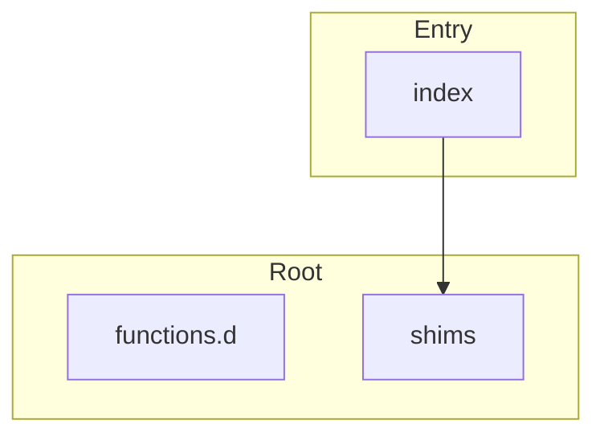

# @mathts/compat - Dependency Graph

**Version**: 0.1.0 | **Last Updated**: 2026-02-06

This document provides a comprehensive dependency graph of all files, components, imports, functions, and variables in the codebase.

---

## Table of Contents

1. [Overview](#overview)
2. [Root Dependencies](#root-dependencies)
3. [Entry Dependencies](#entry-dependencies)
4. [Dependency Matrix](#dependency-matrix)
5. [Circular Dependency Analysis](#circular-dependency-analysis)
6. [Visual Dependency Graph](#visual-dependency-graph)
7. [Summary Statistics](#summary-statistics)

---

## Overview

The codebase is organized into the following modules:

- **root**: 2 files
- **entry**: 1 file

---

## Root Dependencies

### `src/functions.d.ts` - Type declarations for @mathts/functions

**External Dependencies:**
| Package | Import |
|---------|--------|
| `@mathts/core` | `Complex, Fraction, BigNumber` |

**Exports:**
- Functions: `add`, `add`, `add`, `add`, `add`, `subtract`, `subtract`, `subtract`, `subtract`, `subtract`, `multiply`, `multiply`, `multiply`, `multiply`, `multiply`, `divide`, `divide`, `divide`, `divide`, `divide`, `pow`, `pow`, `pow`, `pow`, `sqrt`, `sqrt`, `sqrt`, `abs`, `abs`, `abs`, `exp`, `exp`, `exp`, `log`, `log`, `log`, `sin`, `sin`, `sin`, `cos`, `cos`, `cos`, `tan`, `tan`, `tan`, `sum`, `mean`, `min`, `max`, `gcd`, `lcm`, `round`, `floor`, `ceil`

---

### `src/shims.ts` - mathjs Compatibility Shims

**External Dependencies:**
| Package | Import |
|---------|--------|
| `@mathts/core` | `Complex, Fraction, BigNumber, I, COMPLEX_ZERO, isComplex, isFraction, isBigNumber, isNumber` |
| `@mathts/functions` | `add, subtract, multiply, divide, pow, sqrt, abs, exp, log, sin, cos, tan, sum, mean, min, max, gcd, lcm, round, floor, ceil` |
| `@mathts/matrix` | `DenseMatrix, SparseMatrix` |

**Exports:**
- Functions: `complex`, `fraction`, `bignumber`, `matrix`, `sparse`, `asin`, `acos`, `atan`, `atan2`, `conj`, `re`, `im`, `arg`, `transpose`, `det`, `identity`, `zeros`, `ones`, `size`, `isComplex_`, `isFraction_`, `isBigNumber_`, `isNumber_`, `isMatrix`
- Constants: `add`, `subtract`, `multiply`, `divide`, `pow`, `sqrt`, `abs`, `exp`, `log`, `sin`, `cos`, `tan`, `sum`, `mean`, `min`, `max`, `gcd`, `lcm`, `round`, `floor`, `ceil`, `i`, `pi`, `e`, `phi`, `tau`, `LN2`, `LN10`, `LOG2E`, `LOG10E`, `SQRT2`, `SQRT1_2`, `Infinity_`, `NaN_`, `shims`

---

## Entry Dependencies

### `src/index.ts` - Provides a mathjs-compatible API for gradual migration to MathTS.

**External Dependencies:**
| Package | Import |
|---------|--------|
| `@mathts/compat` | `create, all` |
| `@mathts/compat` | `create, all` |

**Internal Dependencies:**
| File | Imports | Type |
|------|---------|------|
| `./shims.js` | `shims` | Import |
| `./shims.js` | `*` | Re-export |
| `@mathts/core` | `Complex, Fraction, BigNumber, I, COMPLEX_ZERO, COMPLEX_ONE, FRACTION_ZERO, FRACTION_ONE, BIGNUMBER_ZERO, BIGNUMBER_ONE, BIGNUMBER_PI, BIGNUMBER_E` | Re-export |
| `@mathts/matrix` | `DenseMatrix, SparseMatrix` | Re-export |
| `@mathts/parallel` | `computePool` | Re-export |

**Exports:**
- Interfaces: `MathJSConfig`, `MathInstance`
- Functions: `create`
- Constants: `all`
- Re-exports: `* from ./shims.js`, `Complex`, `Fraction`, `BigNumber`, `I`, `COMPLEX_ZERO`, `COMPLEX_ONE`, `FRACTION_ZERO`, `FRACTION_ONE`, `BIGNUMBER_ZERO`, `BIGNUMBER_ONE`, `BIGNUMBER_PI`, `BIGNUMBER_E`, `DenseMatrix`, `SparseMatrix`, `computePool`

---

## Dependency Matrix

### File Import/Export Matrix

| File | Imports From | Exports To |
|------|--------------|------------|
| `functions.d` | 0 files | 0 files |
| `index` | 4 files | 0 files |
| `shims` | 0 files | 1 files |

---

## Circular Dependency Analysis

**No circular dependencies detected.**
---

## Visual Dependency Graph

---

## Summary Statistics

| Category | Count |
|----------|-------|
| Total TypeScript Files | 3 |
| Total Modules | 2 |
| Total Lines of Code | 883 |
| Total Exports | 97 |
| Total Re-exports | 16 |
| Total Classes | 0 |
| Total Interfaces | 2 |
| Total Functions | 79 |
| Total Type Guards | 5 |
| Total Enums | 0 |
| Type-only Imports | 0 |
| Runtime Circular Deps | 0 |
| Type-only Circular Deps | 0 |

---

*Last Updated*: 2026-02-06
*Version*: 0.1.0
