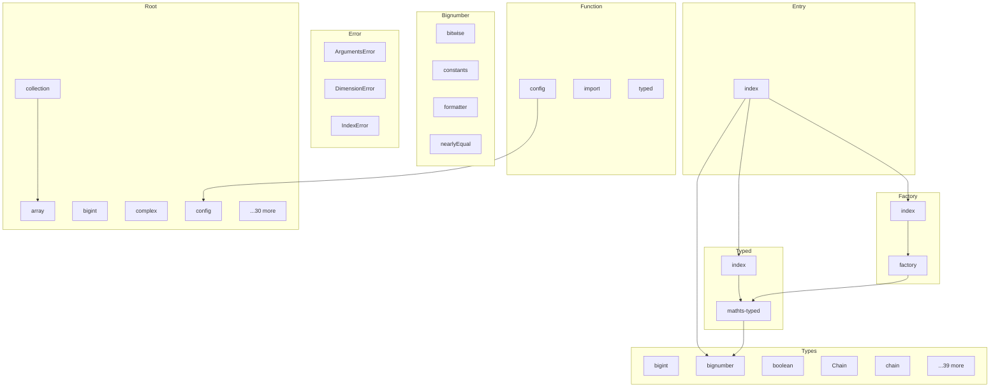

# @mathts/core - Dependency Graph

**Version**: 0.1.0 | **Last Updated**: 2026-02-06

This document provides a comprehensive dependency graph of all files, components, imports, functions, and variables in the codebase.

---

## Table of Contents

1. [Overview](#overview)
2. [Root Dependencies](#root-dependencies)
3. [Bignumber Dependencies](#bignumber-dependencies)
4. [Error Dependencies](#error-dependencies)
5. [Factory Dependencies](#factory-dependencies)
6. [Function Dependencies](#function-dependencies)
7. [Entry Dependencies](#entry-dependencies)
8. [Typed Dependencies](#typed-dependencies)
9. [Types Dependencies](#types-dependencies)
10. [Dependency Matrix](#dependency-matrix)
11. [Circular Dependency Analysis](#circular-dependency-analysis)
12. [Visual Dependency Graph](#visual-dependency-graph)
13. [Summary Statistics](#summary-statistics)

---

## Overview

The codebase is organized into the following modules:

- **root**: 35 files
- **bignumber**: 4 files
- **error**: 3 files
- **factory**: 2 files
- **function**: 3 files
- **entry**: 1 file
- **typed**: 2 files
- **types**: 44 files

---

## Root Dependencies

### `src/array.ts` - Calculate the size of a multi dimensional array.

**Internal Dependencies:**
| File | Imports | Type |
|------|---------|------|
| `./number.js` | `isInteger` | Import |
| `./is.js` | `isNumber, isBigNumber, isArray, isString, BigNumber, Index, Matrix` | Import |
| `./string.js` | `format` | Import |
| `../error/DimensionError.js` | `DimensionError` | Import |
| `../error/IndexError.js` | `IndexError` | Import |
| `./object.js` | `deepStrictEqual` | Import |

**Exports:**
- Interfaces: `IdentifiedValue`
- Functions: `arraySize`, `validate`, `validateIndexSourceSize`, `validateIndex`, `isEmptyIndex`, `resize`, `reshape`, `processSizesWildcard`, `squeeze`, `unsqueeze`, `flatten`, `map`, `forEach`, `filter`, `filterRegExp`, `join`, `identify`, `generalize`, `getArrayDataType`, `last`, `initial`, `concat`, `broadcastSizes`, `checkBroadcastingRules`, `broadcastTo`, `broadcastArrays`, `stretch`, `get`, `deepMap`, `deepForEach`, `clone`

---

### `src/bigint.ts` - Build a bigint logarithm function from a number logarithm,

**Exports:**
- Functions: `promoteLogarithm`

---

### `src/collection.ts` - Test whether an array contains collections

**Internal Dependencies:**
| File | Imports | Type |
|------|---------|------|
| `./is.js` | `isCollection, isMatrix` | Import |
| `../error/IndexError.js` | `IndexError` | Import |
| `./array.js` | `arraySize, deepMap, deepForEach` | Import |
| `./switch.js` | `_switch` | Import |

**Exports:**
- Functions: `containsCollections`, `deepForEach`, `deepMap`, `reduce`, `scatter`

---

### `src/complex.ts` - Test whether two complex values are equal provided a given relTol and absTol.

**Internal Dependencies:**
| File | Imports | Type |
|------|---------|------|
| `./number.js` | `nearlyEqual` | Import |

**Exports:**
- Functions: `complexEquals`

---

### `src/config.ts` - Configuration interface for math.js

**Exports:**
- Interfaces: `ConfigOptions`
- Constants: `DEFAULT_CONFIG`

---

### `src/constants.ts` - golden ratio, (1+sqrt(5))/2

**Internal Dependencies:**
| File | Imports | Type |
|------|---------|------|
| `./utils/factory.js` | `factory` | Import |
| `./version.js` | `version` | Import |
| `./utils/bignumber/constants.js` | `createBigNumberE, createBigNumberPhi, createBigNumberPi, createBigNumberTau` | Import |
| `./plain/number/index.js` | `pi, tau, e, phi` | Import |

**Exports:**
- Constants: `createTrue`, `createFalse`, `createNull`, `createInfinity`, `createNaN`, `createPi`, `createTau`, `createE`, `createPhi`, `createLN2`, `createLN10`, `createLOG2E`, `createLOG10E`, `createSQRT1_2`, `createSQRT2`, `createI`, `createUppercasePi`, `createUppercaseE`, `createVersion`

---

### `src/create.ts` - Type for the mathjs instance

**External Dependencies:**
| Package | Import |
|---------|--------|
| `typed-function` | `typedFunction` |

**Internal Dependencies:**
| File | Imports | Type |
|------|---------|------|
| `../error/ArgumentsError.js` | `ArgumentsError` | Import |
| `../error/DimensionError.js` | `DimensionError` | Import |
| `../error/IndexError.js` | `IndexError` | Import |
| `../utils/factory.js` | `factory, isFactory, FactoryFunction, LegacyFactory` | Import |
| `../utils/is.js` | `isAccessorNode, isArray, isArrayNode, isAssignmentNode, isBigInt, isBigNumber, isBlockNode, isBoolean, isChain, isCollection, isComplex, isConditionalNode, isConstantNode, isDate, isDenseMatrix, isFraction, isFunction, isFunctionAssignmentNode, isFunctionNode, isHelp, isIndex, isIndexNode, isMap, isMatrix, isNode, isNull, isNumber, isObject, isObjectNode, isObjectWrappingMap, isOperatorNode, isParenthesisNode, isPartitionedMap, isRange, isRangeNode, isRegExp, isRelationalNode, isResultSet, isSparseMatrix, isString, isSymbolNode, isUndefined, isUnit` | Import |
| `../utils/object.js` | `deepFlatten, isLegacyFactory` | Import |
| `./../utils/emitter.js` | `* as emitter` | Import |
| `./config.js` | `ConfigOptions, DEFAULT_CONFIG, MathJsConfig` | Import |
| `./function/config.js` | `configFactory` | Import |
| `./function/import.js` | `importFactory` | Import |

**Exports:**
- Interfaces: `MathJsInstance`, `ImportOptions`
- Functions: `create`

---

### `src/customs.d.ts` - Type definitions for customs utility functions

**Exports:**
- Functions: `getSafeProperty`, `setSafeProperty`, `isSafeProperty`, `getSafeMethod`, `isSafeMethod`, `isPlainObject`

---

### `src/customs.ts` - Get a property of a plain object

**Internal Dependencies:**
| File | Imports | Type |
|------|---------|------|
| `./shared.js` | `hasOwnProperty` | Import |

**Exports:**

---

### `src/emitter.ts` - Extend given object with emitter functions `on`, `off`, `once`, `emit`

**External Dependencies:**
| Package | Import |
|---------|--------|
| `tiny-emitter` | `Emitter` |

**Exports:**
- Interfaces: `EmitterMixin`
- Functions: `mixin`

---

### `src/factory.ts` - Type for a factory function that creates instances

**Internal Dependencies:**
| File | Imports | Type |
|------|---------|------|
| `./object.js` | `pickShallow` | Import |

**Exports:**
- Interfaces: `FactoryFunction`, `LegacyFactory`, `FactoryMeta`
- Functions: `factory`, `sortFactories`, `create`, `isFactory`, `assertDependencies`, `isOptionalDependency`, `stripOptionalNotation`
- Constants: `createLog`

---

### `src/function.ts` - Memoize a given function by caching the computed result.

**Internal Dependencies:**
| File | Imports | Type |
|------|---------|------|
| `./lruQueue.js` | `lruQueue` | Import |

**Exports:**
- Functions: `memoize`, `memoizeCompare`

---

### `src/is.ts` - Test whether a value is a collection: an Array or Matrix

**Exports:**
- Interfaces: `BigNumber`, `Complex`, `Fraction`, `Unit`, `Matrix`, `DenseMatrix`, `SparseMatrix`, `Range`, `Index`, `ResultSet`, `Help`, `Chain`, `Node`, `AccessorNode`, `ArrayNode`, `AssignmentNode`, `BlockNode`, `ConditionalNode`, `ConstantNode`, `FunctionAssignmentNode`, `FunctionNode`, `IndexNode`, `ObjectNode`, `OperatorNode`, `ParenthesisNode`, `RangeNode`, `RelationalNode`, `SymbolNode`, `PartitionedMap`
- Functions: `isNumber`, `isBigNumber`, `isBigInt`, `isComplex`, `isFraction`, `isUnit`, `isString`, `isMatrix`, `isCollection`, `isDenseMatrix`, `isSparseMatrix`, `isRange`, `isIndex`, `isBoolean`, `isResultSet`, `isHelp`, `isFunction`, `isDate`, `isRegExp`, `isObject`, `isMap`, `isPartitionedMap`, `isObjectWrappingMap`, `isNull`, `isUndefined`, `isAccessorNode`, `isArrayNode`, `isAssignmentNode`, `isBlockNode`, `isConditionalNode`, `isConstantNode`, `rule2Node`, `isFunctionAssignmentNode`, `isFunctionNode`, `isIndexNode`, `isNode`, `isObjectNode`, `isOperatorNode`, `isParenthesisNode`, `isRangeNode`, `isRelationalNode`, `isSymbolNode`, `isChain`, `typeOf`
- Constants: `isArray`

---

### `src/latex.d.ts` - Type definitions for latex utility functions

**Exports:**
- Functions: `escapeLatex`, `toSymbol`
- Constants: `latexSymbols`, `latexOperators`, `latexFunctions`, `defaultTemplate`

---

### `src/latex.ts` - @ts-expect-error - escape-latex has no type declarations

**External Dependencies:**
| Package | Import |
|---------|--------|
| `escape-latex` | `escapeLatexLib` |

**Internal Dependencies:**
| File | Imports | Type |
|------|---------|------|
| `./object.js` | `hasOwnProperty` | Import |

**Exports:**
- Functions: `escapeLatex`, `toSymbol`
- Constants: `latexSymbols`, `latexOperators`, `latexFunctions`, `defaultTemplate`

---

### `src/log.ts` - Log a console.warn message only once

**Exports:**
- Constants: `warnOnce`

---

### `src/lruQueue.ts` - (c) 2018, Mariusz Nowak

**Exports:**
- Functions: `lruQueue`

---

### `src/map.ts` - A map facade on a bare object.

**Internal Dependencies:**
| File | Imports | Type |
|------|---------|------|
| `./customs.js` | `getSafeProperty, isSafeProperty, setSafeProperty` | Import |
| `./is.js` | `isMap, isObject` | Import |

**Exports:**
- Classes: `ObjectWrappingMap`, `PartitionedMap`
- Functions: `createEmptyMap`, `createMap`, `toObject`, `assign`

---

### `src/node.ts` - Type definitions for Math.js AST nodes

---

### `src/noop.ts` - noop module

**Exports:**
- Functions: `noBignumber`, `noFraction`, `noMatrix`, `noIndex`, `noSubset`

---

### `src/number.ts` - Split value representation with sign, coefficients, and exponent

**Internal Dependencies:**
| File | Imports | Type |
|------|---------|------|
| `./is.js` | `isBigNumber, isNumber, isObject` | Import |

**Exports:**
- Interfaces: `SplitValue`, `NumberTypeConfig`, `FormatOptions`, `NormalizedFormatOptions`
- Functions: `isInteger`, `safeNumberType`, `format`, `normalizeFormatOptions`, `splitNumber`, `toEngineering`, `toFixed`, `toExponential`, `toPrecision`, `roundDigits`, `digits`, `nearlyEqual`, `copysign`
- Constants: `sign`, `log2`, `log10`, `log1p`, `cbrt`, `expm1`, `acosh`, `asinh`, `atanh`, `cosh`, `sinh`, `tanh`

---

### `src/object.ts` - Clone an object

**Internal Dependencies:**
| File | Imports | Type |
|------|---------|------|
| `./is.js` | `isBigNumber, isObject, BigNumber` | Import |
| `./shared.js` | `hasOwnProperty` | Import |

**Exports:**
- Functions: `clone`, `mapObject`, `extend`, `deepExtend`, `deepStrictEqual`, `deepFlatten`, `canDefineProperty`, `lazy`, `traverse`, `isLegacyFactory`, `get`, `set`, `pick`, `pickShallow`

---

### `src/optimizeCallback.ts` - Simplifies a callback function by reducing its complexity and potentially improving its performance.

**External Dependencies:**
| Package | Import |
|---------|--------|
| `typed-function` | `typed` |

**Internal Dependencies:**
| File | Imports | Type |
|------|---------|------|
| `./array.js` | `get, arraySize` | Import |
| `./is.js` | `typeOf` | Import |

**Exports:**
- Functions: `optimizeCallback`

---

### `src/print.ts` - print module

**Exports:**
- Constants: `printTemplate`

---

### `src/product.ts` - product module

**Exports:**
- Functions: `product`

---

### `src/scope.ts` - Create a new scope which can access the parent scope,

**Internal Dependencies:**
| File | Imports | Type |
|------|---------|------|
| `./map.js` | `ObjectWrappingMap, PartitionedMap` | Import |

**Exports:**
- Functions: `createSubScope`

---

### `src/shared.ts` - Shared utility functions used across core utility modules.

**Exports:**
- Functions: `hasOwnProperty`

---

### `src/snapshot.ts` - This file contains helper methods to create expected snapshot structures

**Node.js Built-in Dependencies:**
| Module | Import |
|--------|--------|
| `assert` | `assert` |

**Internal Dependencies:**
| File | Imports | Type |
|------|---------|------|
| `./is.js` | `* as allIsFunctions` | Import |
| `../core/create.js` | `create` | Import |
| `./string.js` | `endsWith` | Import |

**Exports:**
- Functions: `validateBundle`, `createSnapshotFromFactories`
- Constants: `validateTypeOf`

---

### `src/string.d.ts` - Type definitions for string utility functions

**Exports:**
- Functions: `endsWith`, `format`, `stringify`, `escape`, `compareText`

---

### `src/string.ts` - Check if a text ends with a certain string.

**Internal Dependencies:**
| File | Imports | Type |
|------|---------|------|
| `./is.js` | `isBigNumber, isString, typeOf` | Import |
| `./number.js` | `format` | Import |
| `./bignumber/formatter.js` | `format` | Import |

**Exports:**
- Functions: `endsWith`, `format`, `stringify`, `escape`, `compareText`

---

### `src/switch.ts` - Transpose a matrix

**Exports:**
- Functions: `_switch`

---

### `src/typed-function.d.ts` - Type declarations for typed-function v5.0

**Exports:**
- Interfaces: `TypeDef`, `ConversionDef`, `Type`, `Param`, `Signature`, `TypedFunctionData`, `TypedFunction`, `ReferTo`, `ReferToSelf`, `FindSignatureOptions`, `AddConversionOptions`, `TypedErrorData`, `TypedError`, `TypedInstance`
- Functions: `create`, `isTypedFunction`
- Default: `typed`

---

### `src/types.ts` - Type definitions re-exported for internal use

---

### `src/utils.ts` - Utility functions for MathTS

**Internal Dependencies:**
| File | Imports | Type |
|------|---------|------|
| `./types` | `ComplexNumber` | Import (type-only) |

**Exports:**
- Functions: `isNumeric`, `isComplex`, `isMatrix`

---

### `src/version.ts` - Note: This file is automatically generated when building math.js.

**Exports:**
- Constants: `version`

---

## Bignumber Dependencies

### `src/bignumber/bitwise.ts` - Bitwise and for Bignumbers

**Exports:**
- Functions: `bitAndBigNumber`, `bitNotBigNumber`, `bitOrBigNumber`, `bitwise`, `bitXor`, `leftShiftBigNumber`, `rightArithShiftBigNumber`

---

### `src/bignumber/constants.ts` - Calculate BigNumber e

**Internal Dependencies:**
| File | Imports | Type |
|------|---------|------|
| `../function.js` | `memoize` | Import |

**Exports:**
- Constants: `createBigNumberE`, `createBigNumberPhi`, `createBigNumberPi`, `createBigNumberTau`

---

### `src/bignumber/formatter.ts` - Formats a BigNumber in a given base

**Internal Dependencies:**
| File | Imports | Type |
|------|---------|------|
| `../is.js` | `isBigNumber, isNumber` | Import |
| `../number.js` | `isInteger, normalizeFormatOptions` | Import |

**Exports:**
- Functions: `format`, `toEngineering`, `toExponential`, `toFixed`

---

### `src/bignumber/nearlyEqual.ts` - Compares two BigNumbers.

**Exports:**
- Functions: `nearlyEqual`

---

## Error Dependencies

### `src/error/ArgumentsError.ts` - Custom error type for wrong number of arguments

**Exports:**
- Classes: `ArgumentsError`
- Functions: `createArgumentsError`

---

### `src/error/DimensionError.ts` - Create a range error with the message:

**Exports:**
- Classes: `DimensionError`

---

### `src/error/IndexError.ts` - Custom error type for index out of range errors

**Exports:**
- Classes: `IndexError`
- Functions: `createIndexError`

---

## Factory Dependencies

### `src/factory/factory.ts` - MathTS Function Factory

**Internal Dependencies:**
| File | Imports | Type |
|------|---------|------|
| `../typed/mathts-typed.js` | `TypedFunction, TypedInstance, SignatureFunction, ReferTo, ReferToSelf` | Import (type-only) |
| `../typed/mathts-typed.js` | `mathTyped` | Import |

**Exports:**
- Classes: `FunctionRegistry`
- Interfaces: `MathTSConfig`, `FactoryFunction`, `FactoryDependencies`
- Functions: `createFactory`, `createTypedFunction`
- Constants: `DEFAULT_CONFIG`, `addFactory`, `add`, `registry`, `math`

---

### `src/factory/index.ts` - Factory pattern exports

**Internal Dependencies:**
| File | Imports | Type |
|------|---------|------|
| `./factory.js` | `FunctionRegistry, createFactory, createTypedFunction, registry, math, DEFAULT_CONFIG` | Re-export |

**Exports:**
- Re-exports: `FunctionRegistry`, `createFactory`, `createTypedFunction`, `registry`, `math`, `DEFAULT_CONFIG`

---

## Function Dependencies

### `src/function/config.ts` - Type for partial config options

**External Dependencies:**
| Package | Import |
|---------|--------|
| `mathjs` | `create, all` |

**Internal Dependencies:**
| File | Imports | Type |
|------|---------|------|
| `../../utils/object.js` | `clone, deepExtend` | Import |
| `../config.js` | `DEFAULT_CONFIG, MathJsConfig` | Import |

**Exports:**
- Interfaces: `ConfigFunction`
- Functions: `configFactory`
- Constants: `MATRIX_OPTIONS`, `NUMBER_OPTIONS`

---

### `src/function/import.ts` - Import functions from an object or a module.

**External Dependencies:**
| Package | Import |
|---------|--------|
| `mathjs` | `create, all` |
| `numbers` | `* as numbers` |

**Internal Dependencies:**
| File | Imports | Type |
|------|---------|------|
| `../../utils/is.js` | `isBigNumber, isComplex, isFraction, isMatrix, isObject, isUnit` | Import |
| `../../utils/factory.js` | `isFactory, stripOptionalNotation` | Import |
| `../../utils/object.js` | `hasOwnProperty, lazy` | Import |
| `../../error/ArgumentsError.js` | `ArgumentsError` | Import |
| `../../types.js` | `TypedFunction` | Import |

**Exports:**
- Functions: `importFactory`
- Constants: `path`

---

### `src/function/typed.ts` - Create a typed-function which checks the types of the arguments and

**External Dependencies:**
| Package | Import |
|---------|--------|
| `typed-function` | `typedFunction` |

**Internal Dependencies:**
| File | Imports | Type |
|------|---------|------|
| `../../utils/factory.js` | `factory` | Import |
| `../../utils/is.js` | `isAccessorNode, isArray, isArrayNode, isAssignmentNode, isBigInt, isBigNumber, isBlockNode, isBoolean, isChain, isCollection, isComplex, isConditionalNode, isConstantNode, isDate, isDenseMatrix, isFraction, isFunction, isFunctionAssignmentNode, isFunctionNode, isHelp, isIndex, isIndexNode, isMap, isMatrix, isNode, isNull, isNumber, isObject, isObjectNode, isOperatorNode, isParenthesisNode, isRange, isRangeNode, isRegExp, isRelationalNode, isResultSet, isSparseMatrix, isString, isSymbolNode, isUndefined, isUnit` | Import |
| `../../utils/number.js` | `digits` | Import |

**Exports:**
- Interfaces: `TypedFunction`
- Constants: `createTyped`

---

## Entry Dependencies

### `src/index.ts` - =============================================================================

**Internal Dependencies:**
| File | Imports | Type |
|------|---------|------|
| `./types/complex.js` | `Complex, isComplex, I, COMPLEX_ZERO, COMPLEX_ONE, COMPLEX_NEG_ONE` | Re-export |
| `./types/fraction.js` | `Fraction, isFraction, FRACTION_ZERO, FRACTION_ONE, FRACTION_NEG_ONE, FRACTION_HALF, FRACTION_THIRD, FRACTION_QUARTER` | Re-export |
| `./types/bignumber.js` | `BigNumber, isBigNumber, BIGNUMBER_ZERO, BIGNUMBER_ONE, BIGNUMBER_NEG_ONE, BIGNUMBER_TEN, BIGNUMBER_PI, BIGNUMBER_E, BIGNUMBER_LN2, BIGNUMBER_LN10` | Re-export |
| `./typed/index.js` | `// typed-function instance and factory
  mathTyped, createMathTSTyped, typed, create, createTypedFunction, TypeRegistry, // Type definitions and conversions for runtime dispatch
  MATHTS_TYPES, MATHTS_CONVERSIONS, // Primitive type test functions
  isNumber, isBoolean, isString, isBigInt, isArray, isFunction, isObject, isNull, isUndefined, // Matrix type test functions (duck typing until Matrix class)
  isMatrix, isDenseMatrix, isSparseMatrix, // Unit type test function
  isUnit, // WASM support for typed-function
  initTypedWasm, isTypedWasmAvailable` | Re-export |
| `./factory/index.js` | `FunctionRegistry, createFactory, registry, math, DEFAULT_CONFIG` | Re-export |

**Exports:**
- Constants: `VERSION`
- Re-exports: `Complex`, `isComplex`, `I`, `COMPLEX_ZERO`, `COMPLEX_ONE`, `COMPLEX_NEG_ONE`, `Fraction`, `isFraction`, `FRACTION_ZERO`, `FRACTION_ONE`, `FRACTION_NEG_ONE`, `FRACTION_HALF`, `FRACTION_THIRD`, `FRACTION_QUARTER`, `BigNumber`, `isBigNumber`, `BIGNUMBER_ZERO`, `BIGNUMBER_ONE`, `BIGNUMBER_NEG_ONE`, `BIGNUMBER_TEN`, `BIGNUMBER_PI`, `BIGNUMBER_E`, `BIGNUMBER_LN2`, `BIGNUMBER_LN10`, `// typed-function instance and factory
  mathTyped`, `createMathTSTyped`, `typed`, `create`, `createTypedFunction`, `TypeRegistry`, `// Type definitions and conversions for runtime dispatch
  MATHTS_TYPES`, `MATHTS_CONVERSIONS`, `// Primitive type test functions
  isNumber`, `isBoolean`, `isString`, `isBigInt`, `isArray`, `isFunction`, `isObject`, `isNull`, `isUndefined`, `// Matrix type test functions (duck typing until Matrix class)
  isMatrix`, `isDenseMatrix`, `isSparseMatrix`, `// Unit type test function
  isUnit`, `// WASM support for typed-function
  initTypedWasm`, `isTypedWasmAvailable`, `FunctionRegistry`, `createFactory`, `registry`, `math`, `DEFAULT_CONFIG`

---

## Typed Dependencies

### `src/typed/index.ts` - typed-function integration exports

**Internal Dependencies:**
| File | Imports | Type |
|------|---------|------|
| `./mathts-typed.js` | `// typed-function instance and factory
  mathTyped, createMathTSTyped, typed, create, createTypedFunction, TypeRegistry, // Type definitions and conversions
  MATHTS_TYPES, MATHTS_CONVERSIONS, // Primitive type test functions
  isNumber, isBoolean, isString, isBigInt, isArray, isFunction, isObject, isNull, isUndefined, // MathTS type test functions (re-exported from types for convenience)
  isComplex, isFraction, isBigNumber, // TypedArray test functions (for parallel-first operations)
  isFloat64Array, isFloat32Array, isInt32Array, isUint32Array, isUint8Array, // Matrix type test functions (duck typing until Matrix class is implemented)
  isMatrix, isDenseMatrix, isSparseMatrix, // Unit type test function
  isUnit, // WASM support
  initTypedWasm, isTypedWasmAvailable` | Re-export |

**Exports:**
- Re-exports: `// typed-function instance and factory
  mathTyped`, `createMathTSTyped`, `typed`, `create`, `createTypedFunction`, `TypeRegistry`, `// Type definitions and conversions
  MATHTS_TYPES`, `MATHTS_CONVERSIONS`, `// Primitive type test functions
  isNumber`, `isBoolean`, `isString`, `isBigInt`, `isArray`, `isFunction`, `isObject`, `isNull`, `isUndefined`, `// MathTS type test functions (re-exported from types for convenience)
  isComplex`, `isFraction`, `isBigNumber`, `// TypedArray test functions (for parallel-first operations)
  isFloat64Array`, `isFloat32Array`, `isInt32Array`, `isUint32Array`, `isUint8Array`, `// Matrix type test functions (duck typing until Matrix class is implemented)
  isMatrix`, `isDenseMatrix`, `isSparseMatrix`, `// Unit type test function
  isUnit`, `// WASM support
  initTypedWasm`, `isTypedWasmAvailable`

---

### `src/typed/mathts-typed.ts` - MathTS typed-function Integration

**External Dependencies:**
| Package | Import |
|---------|--------|
| `typed-function` | `create, typed` |
| `typed-function` | `TypedFunction, TypedInstance, SignatureFunction, ReferTo, ReferToSelf` |
| `@mathts/core` | `mathTyped, Complex, Fraction, BigNumber` |

**Internal Dependencies:**
| File | Imports | Type |
|------|---------|------|
| `../types/complex.js` | `Complex, isComplex` | Import |
| `../types/fraction.js` | `Fraction, isFraction` | Import |
| `../types/bignumber.js` | `BigNumber, isBigNumber` | Import |

**Exports:**
- Classes: `TypeRegistry`
- Interfaces: `TypeDef`, `ConversionDef`, `MathTSTypeDef`
- Functions: `initTypedWasm`, `isTypedWasmAvailable`, `createMathTSTyped`, `createTypedFunction`
- Constants: `isNumber`, `isBoolean`, `isString`, `isBigInt`, `isArray`, `isFunction`, `isObject`, `isNull`, `isUndefined`, `isFloat64Array`, `isFloat32Array`, `isInt32Array`, `isUint32Array`, `isUint8Array`, `isComplex`, `isFraction`, `isBigNumber`, `isMatrix`, `isDenseMatrix`, `isSparseMatrix`, `isUnit`, `MATHTS_TYPES`, `MATHTS_CONVERSIONS`, `mathTyped`

---

## Types Dependencies

### `src/types/bigint.ts` - Create a bigint or convert a string, boolean, or unit to a bigint.

**Internal Dependencies:**
| File | Imports | Type |
|------|---------|------|
| `../utils/factory.js` | `factory` | Import |
| `../utils/collection.js` | `deepMap` | Import |
| `../types.js` | `TypedFunction, BigNumber, Fraction` | Import |

**Exports:**
- Constants: `createBigint`

---

### `src/types/bignumber.ts` - BigNumber (arbitrary precision decimal) implementation

**Internal Dependencies:**
| File | Imports | Type |
|------|---------|------|
| `./interfaces` | `Scalar, MathTSValue` | Import (type-only) |

**Exports:**
- Classes: `BigNumber`
- Interfaces: `BigNumberConfig`
- Functions: `isBigNumber`
- Constants: `BIGNUMBER_ZERO`, `BIGNUMBER_ONE`, `BIGNUMBER_NEG_ONE`, `BIGNUMBER_TEN`, `BIGNUMBER_PI`, `BIGNUMBER_E`, `BIGNUMBER_LN2`, `BIGNUMBER_LN10`

---

### `src/types/boolean.ts` - Create a boolean or convert a string or number to a boolean.

**External Dependencies:**
| Package | Import |
|---------|--------|
| `decimal.js` | `Decimal` |

**Internal Dependencies:**
| File | Imports | Type |
|------|---------|------|
| `../utils/factory.js` | `factory` | Import |
| `../utils/collection.js` | `deepMap` | Import |

**Exports:**
- Constants: `createBoolean`

---

### `src/types/chain/Chain.ts` - Wrap any value in a chain, allowing to perform chained operations on

**Internal Dependencies:**
| File | Imports | Type |
|------|---------|------|
| `../../utils/is.js` | `isChain` | Import |
| `../../utils/string.js` | `format` | Import |
| `../../utils/object.js` | `hasOwnProperty, lazy` | Import |
| `../../utils/factory.js` | `factory` | Import |

**Exports:**
- Constants: `createChainClass`

---

### `src/types/chain/function/chain.ts` - Wrap any value in a chain, allowing to perform chained operations on

**Internal Dependencies:**
| File | Imports | Type |
|------|---------|------|
| `../../../utils/factory.js` | `factory` | Import |
| `../../../types.js` | `TypedFunction` | Import |

**Exports:**
- Constants: `createChain`

---

### `src/types/complex.ts` - Complex number implementation

**Internal Dependencies:**
| File | Imports | Type |
|------|---------|------|
| `./interfaces` | `Scalar, IComplex` | Import (type-only) |

**Exports:**
- Classes: `Complex`
- Functions: `isComplex`
- Constants: `I`, `COMPLEX_ZERO`, `COMPLEX_ONE`, `COMPLEX_NEG_ONE`

---

### `src/types/fraction.ts` - Fraction (rational number) implementation

**Internal Dependencies:**
| File | Imports | Type |
|------|---------|------|
| `./interfaces` | `Scalar, IFraction` | Import (type-only) |

**Exports:**
- Classes: `Fraction`
- Functions: `isFraction`
- Constants: `FRACTION_ZERO`, `FRACTION_ONE`, `FRACTION_NEG_ONE`, `FRACTION_HALF`, `FRACTION_THIRD`, `FRACTION_QUARTER`

---

### `src/types/index.ts` - MathTS Core Types

**Internal Dependencies:**
| File | Imports | Type |
|------|---------|------|
| `./complex` | `Complex, isComplex, I, COMPLEX_ZERO, COMPLEX_ONE, COMPLEX_NEG_ONE` | Re-export |
| `./fraction` | `Fraction, isFraction, FRACTION_ZERO, FRACTION_ONE, FRACTION_NEG_ONE, FRACTION_HALF, FRACTION_THIRD, FRACTION_QUARTER` | Re-export |
| `./bignumber` | `BigNumber, isBigNumber, BIGNUMBER_ZERO, BIGNUMBER_ONE, BIGNUMBER_NEG_ONE, BIGNUMBER_TEN, BIGNUMBER_PI, BIGNUMBER_E, BIGNUMBER_LN2, BIGNUMBER_LN10` | Re-export |

**Exports:**
- Re-exports: `Complex`, `isComplex`, `I`, `COMPLEX_ZERO`, `COMPLEX_ONE`, `COMPLEX_NEG_ONE`, `Fraction`, `isFraction`, `FRACTION_ZERO`, `FRACTION_ONE`, `FRACTION_NEG_ONE`, `FRACTION_HALF`, `FRACTION_THIRD`, `FRACTION_QUARTER`, `BigNumber`, `isBigNumber`, `BIGNUMBER_ZERO`, `BIGNUMBER_ONE`, `BIGNUMBER_NEG_ONE`, `BIGNUMBER_TEN`, `BIGNUMBER_PI`, `BIGNUMBER_E`, `BIGNUMBER_LN2`, `BIGNUMBER_LN10`

---

### `src/types/interfaces.ts` - Base interfaces for MathTS types

---

### `src/types/matrix/DenseMatrix.ts` - Dense Matrix implementation. A regular, dense matrix, supporting multi-dimensional matrices. This is the default matrix type.

**Internal Dependencies:**
| File | Imports | Type |
|------|---------|------|
| `../../utils/is.js` | `isArray, isBigNumber, isCollection, isIndex, isMatrix, isNumber, isString, typeOf` | Import |
| `../../utils/array.js` | `arraySize, getArrayDataType, processSizesWildcard, reshape, resize, unsqueeze, validate, validateIndex, broadcastTo, get` | Import |
| `../../utils/string.js` | `format` | Import |
| `../../utils/number.js` | `isInteger` | Import |
| `../../utils/object.js` | `clone, deepStrictEqual` | Import |
| `../../error/DimensionError.js` | `DimensionError` | Import |
| `../../utils/factory.js` | `factory` | Import |
| `../../utils/optimizeCallback.js` | `optimizeCallback` | Import |

**Exports:**
- Constants: `createDenseMatrixClass`

---

### `src/types/matrix/FibonacciHeap.ts` - Fibonacci Heap implementation, used internally for Matrix math.

**Internal Dependencies:**
| File | Imports | Type |
|------|---------|------|
| `../../utils/factory.js` | `factory` | Import |

**Exports:**
- Interfaces: `FibonacciHeapNode`
- Constants: `createFibonacciHeapClass`

---

### `src/types/matrix/function/index.ts` - Create an index. An Index can store ranges having start, step, and end

**External Dependencies:**
| Package | Import |
|---------|--------|
| `decimal.js` | `Decimal` |

**Internal Dependencies:**
| File | Imports | Type |
|------|---------|------|
| `../../../utils/is.js` | `isBigNumber, isMatrix, isArray` | Import |
| `../../../utils/factory.js` | `factory` | Import |

**Exports:**
- Constants: `createIndex`

---

### `src/types/matrix/function/matrix.ts` - Create a Matrix. The function creates a new `math.Matrix` object from

**Internal Dependencies:**
| File | Imports | Type |
|------|---------|------|
| `../../../utils/factory.js` | `factory` | Import |

**Exports:**
- Constants: `createMatrix`

---

### `src/types/matrix/function/sparse.ts` - Create a Sparse Matrix. The function creates a new `math.Matrix` object from

**Internal Dependencies:**
| File | Imports | Type |
|------|---------|------|
| `../../../utils/factory.js` | `factory` | Import |

**Exports:**
- Constants: `createSparse`

---

### `src/types/matrix/ImmutableDenseMatrix.ts` - Type for nested array data structures

**Internal Dependencies:**
| File | Imports | Type |
|------|---------|------|
| `../../utils/is.js` | `isArray, isMatrix, isString, typeOf` | Import |
| `../../utils/object.js` | `clone` | Import |
| `../../utils/factory.js` | `factory` | Import |

**Exports:**
- Interfaces: `ImmutableDenseMatrixJSON`
- Constants: `createImmutableDenseMatrixClass`

---

### `src/types/matrix/Matrix.ts` - Formatting options for matrix display

**Internal Dependencies:**
| File | Imports | Type |
|------|---------|------|
| `../../utils/factory.js` | `factory` | Import |

**Exports:**
- Interfaces: `MatrixFormatOptions`, `Index`
- Constants: `createMatrixClass`

---

### `src/types/matrix/MatrixIndex.ts` - Type representing a single dimension in an Index

**Internal Dependencies:**
| File | Imports | Type |
|------|---------|------|
| `../../utils/is.js` | `isArray, isMatrix, isRange, isNumber, isString` | Import |
| `../../utils/object.js` | `clone` | Import |
| `../../utils/number.js` | `isInteger` | Import |
| `../../utils/factory.js` | `factory` | Import |

**Exports:**
- Interfaces: `IndexJSON`
- Constants: `createIndexClass`

---

### `src/types/matrix/Range.ts` - Callback function for Range forEach operations

**Internal Dependencies:**
| File | Imports | Type |
|------|---------|------|
| `../../utils/is.js` | `isBigInt, isBigNumber` | Import |
| `../../utils/number.js` | `format, sign, nearlyEqual` | Import |
| `../../utils/factory.js` | `factory` | Import |

**Exports:**
- Interfaces: `RangeFormatOptions`, `RangeJSON`
- Constants: `createRangeClass`

---

### `src/types/matrix/Spa.ts` - An ordered Sparse Accumulator is a representation for a sparse vector that includes a dense array

**Internal Dependencies:**
| File | Imports | Type |
|------|---------|------|
| `../../utils/factory.js` | `factory` | Import |

**Exports:**
- Constants: `createSpaClass`

---

### `src/types/matrix/SparseMatrix.ts` - Sparse Matrix implementation. This type implements

**Internal Dependencies:**
| File | Imports | Type |
|------|---------|------|
| `../../utils/is.js` | `isArray, isBigNumber, isCollection, isIndex, isMatrix, isNumber, isString, typeOf` | Import |
| `../../utils/number.js` | `isInteger` | Import |
| `../../utils/string.js` | `format` | Import |
| `../../utils/object.js` | `clone, deepStrictEqual` | Import |
| `../../utils/array.js` | `arraySize, getArrayDataType, processSizesWildcard, unsqueeze, validateIndex` | Import |
| `../../utils/factory.js` | `factory` | Import |
| `../../error/DimensionError.js` | `DimensionError` | Import |
| `../../utils/optimizeCallback.js` | `optimizeCallback` | Import |

**Exports:**
- Constants: `createSparseMatrixClass`

---

### `src/types/matrix/utils/broadcast.ts` - Broadcasts two matrices, and return both in an array

**Internal Dependencies:**
| File | Imports | Type |
|------|---------|------|
| `../../../utils/array.js` | `broadcastSizes, broadcastTo` | Import |
| `../../../utils/object.js` | `deepStrictEqual` | Import |

**Exports:**
- Functions: `broadcast`

---

### `src/types/matrix/utils/matAlgo01xDSid.ts` - Iterates over SparseMatrix nonzero items and invokes the callback function f(Dij, Sij).

**Internal Dependencies:**
| File | Imports | Type |
|------|---------|------|
| `../../../utils/factory.js` | `factory` | Import |
| `../../../error/DimensionError.js` | `DimensionError` | Import |

**Exports:**
- Constants: `createMatAlgo01xDSid`

---

### `src/types/matrix/utils/matAlgo02xDS0.ts` - Iterates over SparseMatrix nonzero items and invokes the callback function f(Dij, Sij).

**Internal Dependencies:**
| File | Imports | Type |
|------|---------|------|
| `../../../utils/factory.js` | `factory` | Import |
| `../../../error/DimensionError.js` | `DimensionError` | Import |

**Exports:**
- Constants: `createMatAlgo02xDS0`

---

### `src/types/matrix/utils/matAlgo03xDSf.ts` - Iterates over SparseMatrix items and invokes the callback function f(Dij, Sij).

**Internal Dependencies:**
| File | Imports | Type |
|------|---------|------|
| `../../../utils/factory.js` | `factory` | Import |
| `../../../error/DimensionError.js` | `DimensionError` | Import |

**Exports:**
- Constants: `createMatAlgo03xDSf`

---

### `src/types/matrix/utils/matAlgo04xSidSid.ts` - Iterates over SparseMatrix A and SparseMatrix B nonzero items and invokes the callback function f(Aij, Bij).

**Internal Dependencies:**
| File | Imports | Type |
|------|---------|------|
| `../../../utils/factory.js` | `factory` | Import |
| `../../../error/DimensionError.js` | `DimensionError` | Import |

**Exports:**
- Constants: `createMatAlgo04xSidSid`

---

### `src/types/matrix/utils/matAlgo05xSfSf.ts` - Iterates over SparseMatrix A and SparseMatrix B nonzero items and invokes the callback function f(Aij, Bij).

**Internal Dependencies:**
| File | Imports | Type |
|------|---------|------|
| `../../../utils/factory.js` | `factory` | Import |
| `../../../error/DimensionError.js` | `DimensionError` | Import |

**Exports:**
- Constants: `createMatAlgo05xSfSf`

---

### `src/types/matrix/utils/matAlgo06xS0S0.ts` - Iterates over SparseMatrix A and SparseMatrix B nonzero items and invokes the callback function f(Aij, Bij).

**Internal Dependencies:**
| File | Imports | Type |
|------|---------|------|
| `../../../utils/factory.js` | `factory` | Import |
| `../../../error/DimensionError.js` | `DimensionError` | Import |
| `../../../utils/collection.js` | `scatter` | Import |

**Exports:**
- Constants: `createMatAlgo06xS0S0`

---

### `src/types/matrix/utils/matAlgo07xSSf.ts` - Iterates over SparseMatrix A and SparseMatrix B items (zero and nonzero) and invokes the callback function f(Aij, Bij).

**Internal Dependencies:**
| File | Imports | Type |
|------|---------|------|
| `../../../utils/factory.js` | `factory` | Import |
| `../../../error/DimensionError.js` | `DimensionError` | Import |

**Exports:**
- Constants: `createMatAlgo07xSSf`

---

### `src/types/matrix/utils/matAlgo08xS0Sid.ts` - Iterates over SparseMatrix A and SparseMatrix B nonzero items and invokes the callback function f(Aij, Bij).

**Internal Dependencies:**
| File | Imports | Type |
|------|---------|------|
| `../../../utils/factory.js` | `factory` | Import |
| `../../../error/DimensionError.js` | `DimensionError` | Import |

**Exports:**
- Constants: `createMatAlgo08xS0Sid`

---

### `src/types/matrix/utils/matAlgo09xS0Sf.ts` - Iterates over SparseMatrix A and invokes the callback function f(Aij, Bij).

**Internal Dependencies:**
| File | Imports | Type |
|------|---------|------|
| `../../../utils/factory.js` | `factory` | Import |
| `../../../error/DimensionError.js` | `DimensionError` | Import |

**Exports:**
- Constants: `createMatAlgo09xS0Sf`

---

### `src/types/matrix/utils/matAlgo10xSids.ts` - Iterates over SparseMatrix S nonzero items and invokes the callback function f(Sij, b).

**Internal Dependencies:**
| File | Imports | Type |
|------|---------|------|
| `../../../utils/factory.js` | `factory` | Import |

**Exports:**
- Constants: `createMatAlgo10xSids`

---

### `src/types/matrix/utils/matAlgo11xS0s.ts` - Iterates over SparseMatrix S nonzero items and invokes the callback function f(Sij, b).

**Internal Dependencies:**
| File | Imports | Type |
|------|---------|------|
| `../../../utils/factory.js` | `factory` | Import |

**Exports:**
- Constants: `createMatAlgo11xS0s`

---

### `src/types/matrix/utils/matAlgo12xSfs.ts` - Iterates over SparseMatrix S nonzero items and invokes the callback function f(Sij, b).

**Internal Dependencies:**
| File | Imports | Type |
|------|---------|------|
| `../../../utils/factory.js` | `factory` | Import |

**Exports:**
- Constants: `createMatAlgo12xSfs`

---

### `src/types/matrix/utils/matAlgo13xDD.ts` - Iterates over DenseMatrix items and invokes the callback function f(Aij..z, Bij..z).

**Internal Dependencies:**
| File | Imports | Type |
|------|---------|------|
| `../../../utils/factory.js` | `factory` | Import |
| `../../../error/DimensionError.js` | `DimensionError` | Import |

**Exports:**
- Constants: `createMatAlgo13xDD`

---

### `src/types/matrix/utils/matAlgo14xDs.ts` - Iterates over DenseMatrix items and invokes the callback function f(Aij..z, b).

**Internal Dependencies:**
| File | Imports | Type |
|------|---------|------|
| `../../../utils/factory.js` | `factory` | Import |
| `../../../utils/object.js` | `clone` | Import |

**Exports:**
- Constants: `createMatAlgo14xDs`

---

### `src/types/matrix/utils/matrixAlgorithmSuite.ts` - Return a signatures object with the usual boilerplate of

**Internal Dependencies:**
| File | Imports | Type |
|------|---------|------|
| `../../../utils/factory.js` | `factory` | Import |
| `../../../utils/object.js` | `extend` | Import |
| `./matAlgo13xDD.js` | `createMatAlgo13xDD` | Import |
| `./matAlgo14xDs.js` | `createMatAlgo14xDs` | Import |
| `./broadcast.js` | `broadcast` | Import |

**Exports:**
- Constants: `createMatrixAlgorithmSuite`

---

### `src/types/number.ts` - Separates the radix, integer part, and fractional part of a non decimal number string

**Internal Dependencies:**
| File | Imports | Type |
|------|---------|------|
| `../utils/factory.js` | `factory` | Import |
| `../utils/collection.js` | `deepMap` | Import |

**Exports:**
- Constants: `createNumber`

---

### `src/types/resultset/ResultSet.ts` - A ResultSet contains a list or results

**Internal Dependencies:**
| File | Imports | Type |
|------|---------|------|
| `../../utils/factory.js` | `factory` | Import |

**Exports:**
- Constants: `createResultSet`

---

### `src/types/string.ts` - Create a string or convert any object into a string.

**Internal Dependencies:**
| File | Imports | Type |
|------|---------|------|
| `../utils/factory.js` | `factory` | Import |
| `../utils/collection.js` | `deepMap` | Import |
| `../utils/number.js` | `format` | Import |

**Exports:**
- Constants: `createString`

---

### `src/types/unit/function/createUnit.ts` - Create a user-defined unit and register it with the Unit type.

**Internal Dependencies:**
| File | Imports | Type |
|------|---------|------|
| `../../../utils/factory.js` | `factory` | Import |

**Exports:**
- Constants: `createCreateUnit`

---

### `src/types/unit/function/splitUnit.ts` - Split a unit in an array of units whose sum is equal to the original unit.

**Internal Dependencies:**
| File | Imports | Type |
|------|---------|------|
| `../../../utils/factory.js` | `factory` | Import |

**Exports:**
- Constants: `createSplitUnit`

---

### `src/types/unit/function/unit.ts` - Create a unit. Depending on the passed arguments, the function

**Internal Dependencies:**
| File | Imports | Type |
|------|---------|------|
| `../../../utils/factory.js` | `factory` | Import |
| `../../../utils/collection.js` | `deepMap` | Import |

**Exports:**
- Constants: `createUnitFunction`

---

### `src/types/unit/physicalConstants.ts` - Source: https://en.wikipedia.org/wiki/Physical_constant

**Internal Dependencies:**
| File | Imports | Type |
|------|---------|------|
| `../../utils/factory.js` | `factory` | Import |

**Exports:**
- Constants: `createSpeedOfLight`, `createGravitationConstant`, `createPlanckConstant`, `createReducedPlanckConstant`, `createMagneticConstant`, `createElectricConstant`, `createVacuumImpedance`, `createCoulomb`, `createCoulombConstant`, `createElementaryCharge`, `createBohrMagneton`, `createConductanceQuantum`, `createInverseConductanceQuantum`, `createMagneticFluxQuantum`, `createNuclearMagneton`, `createKlitzing`, `createJosephson`, `createBohrRadius`, `createClassicalElectronRadius`, `createElectronMass`, `createFermiCoupling`, `createFineStructure`, `createHartreeEnergy`, `createProtonMass`, `createDeuteronMass`, `createNeutronMass`, `createQuantumOfCirculation`, `createRydberg`, `createThomsonCrossSection`, `createWeakMixingAngle`, `createEfimovFactor`, `createAtomicMass`, `createAvogadro`, `createBoltzmann`, `createFaraday`, `createFirstRadiation`, `createLoschmidt`, `createGasConstant`, `createMolarPlanckConstant`, `createMolarVolume`, `createSackurTetrode`, `createSecondRadiation`, `createStefanBoltzmann`, `createWienDisplacement`, `createMolarMass`, `createMolarMassC12`, `createGravity`, `createPlanckLength`, `createPlanckMass`, `createPlanckTime`, `createPlanckCharge`, `createPlanckTemperature`

---

### `src/types/unit/Unit.ts` - A unit can be constructed in the following ways:

**Internal Dependencies:**
| File | Imports | Type |
|------|---------|------|
| `../../utils/is.js` | `isComplex, isUnit, typeOf` | Import |
| `../../utils/factory.js` | `factory` | Import |
| `../../utils/function.js` | `memoize` | Import |
| `../../utils/string.js` | `endsWith` | Import |
| `../../utils/object.js` | `clone, hasOwnProperty` | Import |
| `../../utils/bignumber/constants.js` | `createBigNumberPi` | Import |
| `../../../types/index.js` | `MathJsStatic` | Import (type-only) |

**Exports:**
- Constants: `createUnitClass`

---

## Dependency Matrix

### File Import/Export Matrix

| File | Imports From | Exports To |
|------|--------------|------------|
| `array` | 6 files | 2 files |
| `bigint` | 0 files | 0 files |
| `bitwise` | 0 files | 0 files |
| `constants` | 1 files | 0 files |
| `formatter` | 2 files | 1 files |
| `nearlyEqual` | 0 files | 0 files |
| `collection` | 4 files | 0 files |
| `complex` | 1 files | 0 files |
| `config` | 0 files | 2 files |
| `constants` | 4 files | 0 files |
| `create` | 10 files | 0 files |
| `customs.d` | 0 files | 0 files |
| `customs` | 1 files | 1 files |
| `emitter` | 0 files | 0 files |
| `ArgumentsError` | 0 files | 0 files |
| `DimensionError` | 0 files | 12 files |
| `IndexError` | 0 files | 0 files |
| `factory` | 1 files | 1 files |
| `index` | 1 files | 1 files |
| `factory` | 1 files | 0 files |
| `config` | 2 files | 1 files |
| `import` | 5 files | 1 files |
| `typed` | 3 files | 0 files |
| `function` | 1 files | 1 files |
| `index` | 5 files | 0 files |
| `is` | 0 files | 9 files |
| `latex.d` | 0 files | 0 files |
| `latex` | 1 files | 0 files |
| `log` | 0 files | 0 files |
| `lruQueue` | 0 files | 1 files |

---

## Circular Dependency Analysis

**No circular dependencies detected.**
---

## Visual Dependency Graph

---

## Summary Statistics

| Category | Count |
|----------|-------|
| Total TypeScript Files | 94 |
| Total Modules | 8 |
| Total Lines of Code | 23142 |
| Total Exports | 512 |
| Total Re-exports | 113 |
| Total Classes | 10 |
| Total Interfaces | 82 |
| Total Functions | 188 |
| Total Type Guards | 58 |
| Total Enums | 0 |
| Type-only Imports | 6 |
| Runtime Circular Deps | 0 |
| Type-only Circular Deps | 0 |

---

*Last Updated*: 2026-02-06
*Version*: 0.1.0
