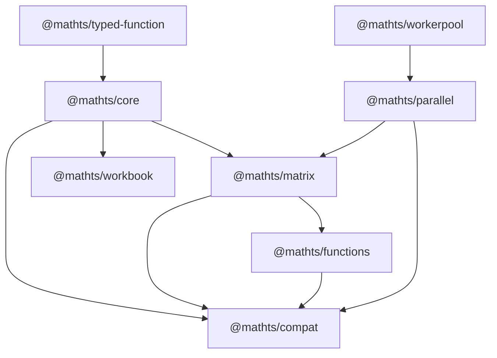

# MathTS Architecture

**Generated**: 2026-02-06

## System Overview

MathTS is organized as an npm workspaces monorepo with 10 packages.
All packages are ESM-only, target ES2022, and use tsup for bundling.
Turborepo orchestrates builds and tests across the workspace.

## Package Dependency Graph

## Core Systems

### 1. Type Dispatch

The `typed-function` package provides runtime type checking and multiple dispatch.
`TypeRegistry` manages type definitions and conversions. `MathTSTyped` creates
typed function instances that select implementations based on argument types.

Supported types: number, boolean, string, BigInt, Complex, Fraction, BigNumber,
DenseMatrix, SparseMatrix, Array.

### 2. Factory Pattern

Functions are registered via factories with explicit dependencies.
`FunctionRegistry` stores factory registrations, `createFactory` resolves
dependencies and creates instances, and the `math` singleton provides
the fully configured instance.

### 3. Matrix Backends

Three computation backends with automatic selection via BackendManager:

| Backend | Implementation | Threshold |
|---------|---------------|-----------|
| JSBackend | Pure TypeScript | Always (default) |
| WASMBackend | AssemblyScript + SIMD | > 1,000 elements |
| GPUBackend | WebGPU compute shaders | > 100,000 elements |

BackendManager selects based on data size, backend availability, and
optional adaptive performance tuning with profiling support.

### 4. Parallel Execution

ComputePool manages a pool of Web Workers for parallel operations.
Chunk strategies determine optimal data partitioning. ThresholdDispatcher
decides whether to parallelize based on data size.

Operations include elementwise (add, subtract, multiply, divide, scale,
abs, negate, square, sqrt, exp, log, sin, cos, tan) and matrix operations
(matmul, matvec, transpose, outer, dot).

Results are wrapped in `ParallelResult<T>` containing the result data,
execution duration, chunk count, and parallelization flag.

### 5. Workbook Runtime

YAML-based reactive notebooks (.mtsw files):

- **Parser**: YAML to Workbook with typed cells
- **Graph**: Dependency resolution via topological sort with cycle detection
- **Executor**: Three execution modes - reactive (auto-recompute on change),
  sequential (topological order), manual (on-demand)

## Two-Layer Architecture in Functions

### Active Layer

Located in `functions/src/typed/`. New TypeScript implementations using
@mathts/core typed dispatch. These are the only files exported from the
package entry point.

Files: `arithmetic.ts`, `trigonometry.ts`, `statistics.ts`, `signal.ts`

### Dormant Layer

Approximately 20 category directories in functions/src/ containing
factory-pattern functions synced from the mathjs fork.
These are NOT exported from the package and not in the build entry point.

## Build System

All packages use `tsup src/index.ts --format esm --dts --clean` with exceptions:

- **functions**: No `--dts` flag (complex typed function signatures)
- **workbook**: Two entry points (`src/index.ts` and `src/cli.ts`)
- **expression**: Build is skipped (incomplete package)

## Module Summary

| Module | Files | Key Exports |
|--------|-------|-------------|
| core/types | 4 | Complex, Fraction, BigNumber, type guards, constants |
| core/typed | 2 | mathTyped, TypeRegistry, type tests |
| core/factory | 2 | createFactory, FunctionRegistry, registry |
| matrix/backends | 18 | BackendManager, JSBackend, WASMBackend, GPUBackend |
| matrix/types | 4 | DenseMatrix, SparseMatrix, Matrix base class |
| matrix (config) | 4 | getConfig, setConfig, backend preference |
| functions/typed | 5 | add, subtract, multiply, sin, cos, fft, mean |
| parallel | 2 | ComputePool, Transfer |
| parallel/operations | 5 | parallelAdd, parallelMatmul, etc. |
| parallel/strategies | 3 | Chunking, thresholds, dispatch |
| workbook | 5 | Parser, executor, graph, serializer |
| expression | 8 | Parser, Node types |
| compat | 2 | create, all |
