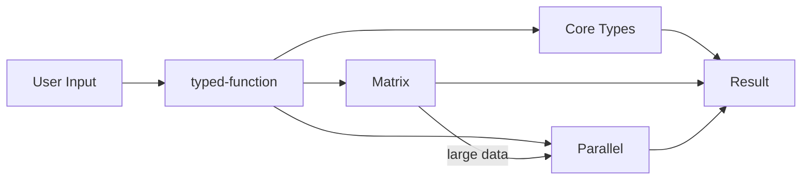

# MathTS Data Flow

**Generated**: 2026-02-06

## Overview

This document describes how data flows through the MathTS system,
from user input through type dispatch, backend selection, and
parallel execution.

## 1. Typed Function Dispatch

```text
User call: add(a, b)
  1. typed-function receives arguments
  2. Inspects runtime types of a and b
  3. Matches against registered signatures:
     (number, number) -> number
     (Complex, Complex) -> Complex
     (Matrix, Matrix) -> Matrix
     (Array, Array) -> Array
  4. Dispatches to matched implementation
  5. Returns typed result
```

Type conversions are applied automatically when an exact match is not found.
For example, number can be converted to Complex or BigNumber.

## 2. Matrix Backend Selection

```text
matrix.multiply(other)
  1. BackendManager receives operation request
  2. Checks data size (rows * cols)
  3. Selects backend:
     size < 1,000      -> JSBackend (always available)
     size 1K - 100K    -> WASMBackend (if available)
     size > 100,000    -> GPUBackend (if available)
  4. Falls back to JSBackend if selected backend unavailable
  5. Executes operation on selected backend
  6. Returns result as DenseMatrix or SparseMatrix
```

Adaptive tuning can override thresholds based on runtime profiling data.

## 3. Parallel Execution Flow

```text
parallelAdd(a, b)  // a, b: Float64Array
  1. ThresholdDispatcher checks if parallelization is worthwhile
     - Below threshold: execute synchronously, return immediately
  2. calculateOptimalChunks(data, workerCount)
     - Splits data into chunks based on worker count and data size
  3. ComputePool.exec(workerFunction, chunks)
     - Distributes chunks to Web Workers
     - Each worker processes its chunk independently
  4. mergeFloat64Chunks(results)
     - Combines worker results into single output array
  5. Returns ParallelResult<Float64Array>
     - .result: the computed data
     - .duration: execution time in ms
     - .chunks: number of chunks used
     - .parallelized: boolean (true if workers were used)
```

## 4. Workbook Execution Flow

```text
workbook.mtsw (YAML file)
  1. parseWorkbook(yaml)
     - YAML string -> Workbook object with typed cells
  2. buildDependencyGraph(cells)
     - Analyzes cell references (e.g., =A1 + B2)
     - Builds directed graph of dependencies
  3. topologicalSort(graph)
     - Computes execution order respecting dependencies
     - detectCycles() validates no circular references
  4. WorkbookExecutor.execute(mode)
     - reactive: re-execute downstream cells on any change
     - sequential: execute all cells in topological order
     - manual: execute only on explicit request
  5. Results written to cell output fields
```

## 5. Cross-Package Data Flow



## 6. Configuration Flow

| Config | Target | Effect |
|--------|--------|--------|
| MatrixConfig | BackendManager | Backend selection thresholds |
| ComputePoolConfig | ComputePool | Worker count, task queue |
| WorkbookConfig | WorkbookExecutor | Execution mode, reactivity |
| BackendPreference | BackendManager | Override automatic selection |
| ProfilingConfig | BackendManager | Enable runtime profiling |
| AdaptiveTuningConfig | BackendManager | Auto-adjust thresholds |
