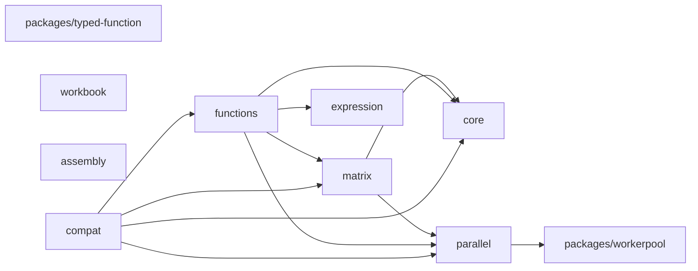

# mathts - Dependency Graph

**Version**: 0.1.0 | **Last Updated**: 2026-04-10

This document provides a comprehensive dependency graph of all files, components, imports, functions, and variables in the codebase.

---

## Table of Contents

1. [Overview](#overview)
2. [Package Dependencies](#package-dependencies)
3. [Packages/typed function Dependencies](#packages-typed-function-dependencies)
4. [Packages/workerpool Dependencies](#packages-workerpool-dependencies)
5. [Core Dependencies](#core-dependencies)
6. [Core/bignumber Dependencies](#core-bignumber-dependencies)
7. [Core/error Dependencies](#core-error-dependencies)
8. [Core/factory Dependencies](#core-factory-dependencies)
9. [Core/function Dependencies](#core-function-dependencies)
10. [Core/typed Dependencies](#core-typed-dependencies)
11. [Core/types Dependencies](#core-types-dependencies)
12. [Matrix/backends Dependencies](#matrix-backends-dependencies)
13. [Matrix Dependencies](#matrix-dependencies)
14. [Matrix/operations Dependencies](#matrix-operations-dependencies)
15. [Matrix/types Dependencies](#matrix-types-dependencies)
16. [Functions/algebra Dependencies](#functions-algebra-dependencies)
17. [Functions/arithmetic Dependencies](#functions-arithmetic-dependencies)
18. [Functions/bitwise Dependencies](#functions-bitwise-dependencies)
19. [Functions/combinatorics Dependencies](#functions-combinatorics-dependencies)
20. [Functions/complex Dependencies](#functions-complex-dependencies)
21. [Functions Dependencies](#functions-dependencies)
22. [Functions/core Dependencies](#functions-core-dependencies)
23. [Functions/error Dependencies](#functions-error-dependencies)
24. [Functions/expression Dependencies](#functions-expression-dependencies)
25. [Functions/factories Dependencies](#functions-factories-dependencies)
26. [Functions/geometry Dependencies](#functions-geometry-dependencies)
27. [Functions/logical Dependencies](#functions-logical-dependencies)
28. [Functions/matrix Dependencies](#functions-matrix-dependencies)
29. [Functions/numeric Dependencies](#functions-numeric-dependencies)
30. [Functions/plain Dependencies](#functions-plain-dependencies)
31. [Functions/probability Dependencies](#functions-probability-dependencies)
32. [Functions/relational Dependencies](#functions-relational-dependencies)
33. [Functions/set Dependencies](#functions-set-dependencies)
34. [Functions/shared Dependencies](#functions-shared-dependencies)
35. [Functions/signal Dependencies](#functions-signal-dependencies)
36. [Functions/special Dependencies](#functions-special-dependencies)
37. [Functions/statistics Dependencies](#functions-statistics-dependencies)
38. [Functions/string Dependencies](#functions-string-dependencies)
39. [Functions/trigonometry Dependencies](#functions-trigonometry-dependencies)
40. [Functions/type Dependencies](#functions-type-dependencies)
41. [Functions/typed Dependencies](#functions-typed-dependencies)
42. [Functions/unit Dependencies](#functions-unit-dependencies)
43. [Functions/utils Dependencies](#functions-utils-dependencies)
44. [Functions/wasm Dependencies](#functions-wasm-dependencies)
45. [Expression/compiler Dependencies](#expression-compiler-dependencies)
46. [Expression/embeddedDocs Dependencies](#expression-embeddeddocs-dependencies)
47. [Expression/error Dependencies](#expression-error-dependencies)
48. [Expression/evaluator Dependencies](#expression-evaluator-dependencies)
49. [Expression/function Dependencies](#expression-function-dependencies)
50. [Expression Dependencies](#expression-dependencies)
51. [Expression/node Dependencies](#expression-node-dependencies)
52. [Expression/transform Dependencies](#expression-transform-dependencies)
53. [Expression/utils Dependencies](#expression-utils-dependencies)
54. [Parallel Dependencies](#parallel-dependencies)
55. [Parallel/operations Dependencies](#parallel-operations-dependencies)
56. [Parallel/strategies Dependencies](#parallel-strategies-dependencies)
57. [Parallel/workers Dependencies](#parallel-workers-dependencies)
58. [Workbook Dependencies](#workbook-dependencies)
59. [Assembly/bindings Dependencies](#assembly-bindings-dependencies)
60. [Assembly/env Dependencies](#assembly-env-dependencies)
61. [Assembly Dependencies](#assembly-dependencies)
62. [Assembly/ops Dependencies](#assembly-ops-dependencies)
63. [Assembly/types Dependencies](#assembly-types-dependencies)
64. [Compat Dependencies](#compat-dependencies)
65. [Dependency Matrix](#dependency-matrix)
66. [Circular Dependency Analysis](#circular-dependency-analysis)
67. [Visual Dependency Graph](#visual-dependency-graph)
68. [Summary Statistics](#summary-statistics)

---

## Overview

The codebase is organized into the following modules:

- **packages/typed-function**: 2 files
- **packages/workerpool**: 3 files
- **core**: 36 files
- **core/bignumber**: 4 files
- **core/error**: 3 files
- **core/factory**: 2 files
- **core/function**: 3 files
- **core/typed**: 3 files
- **core/types**: 44 files
- **matrix/backends**: 22 files
- **matrix**: 6 files
- **matrix/operations**: 5 files
- **matrix/types**: 5 files
- **functions/algebra**: 45 files
- **functions/arithmetic**: 40 files
- **functions/bitwise**: 8 files
- **functions/combinatorics**: 4 files
- **functions/complex**: 4 files
- **functions**: 6 files
- **functions/core**: 5 files
- **functions/error**: 3 files
- **functions/expression**: 314 files
- **functions/factories**: 4 files
- **functions/geometry**: 2 files
- **functions/logical**: 5 files
- **functions/matrix**: 44 files
- **functions/numeric**: 1 file
- **functions/plain**: 12 files
- **functions/probability**: 14 files
- **functions/relational**: 13 files
- **functions/set**: 10 files
- **functions/shared**: 1 file
- **functions/signal**: 5 files
- **functions/special**: 2 files
- **functions/statistics**: 14 files
- **functions/string**: 5 files
- **functions/trigonometry**: 26 files
- **functions/type**: 50 files
- **functions/typed**: 12 files
- **functions/unit**: 2 files
- **functions/utils**: 46 files
- **functions/wasm**: 63 files
- **expression/compiler**: 2 files
- **expression/embeddedDocs**: 311 files
- **expression/error**: 3 files
- **expression/evaluator**: 2 files
- **expression/function**: 4 files
- **expression**: 7 files
- **expression/node**: 18 files
- **expression/transform**: 30 files
- **expression/utils**: 14 files
- **parallel**: 5 files
- **parallel/operations**: 7 files
- **parallel/strategies**: 3 files
- **parallel/workers**: 1 file
- **workbook**: 6 files
- **assembly/bindings**: 2 files
- **assembly/env**: 1 file
- **assembly**: 1 file
- **assembly/ops**: 5 files
- **assembly/types**: 1 file
- **compat**: 3 files

---

## Package Dependencies

| Package | Depends On | Files (Active) | Files (Dormant) |
|---------|------------|----------------|-----------------|
| `@danielsimonjr/mathts-typed-function` (`packages/typed-function/`) | (none) | 1 | 1 |
| `@danielsimonjr/mathts-workerpool` (`packages/workerpool/`) | (none) | 1 | 2 |
| `@danielsimonjr/mathts-core` (`core/`) | (none) | 10 | 85 |
| `@danielsimonjr/mathts-matrix` (`matrix/`) | `@danielsimonjr/mathts-parallel`, `@danielsimonjr/mathts-core` | 34 | 4 |
| `@danielsimonjr/mathts-functions` (`functions/`) | `@danielsimonjr/mathts-expression`, `@danielsimonjr/mathts-matrix`, `@danielsimonjr/mathts-core`, `@danielsimonjr/mathts-parallel` | 341 | 419 |
| `@danielsimonjr/mathts-expression` (`expression/`) | (none) | 45 | 346 |
| `@danielsimonjr/mathts-parallel` (`parallel/`) | `@danielsimonjr/mathts-workerpool` | 12 | 4 |
| `@danielsimonjr/mathts-workbook` (`workbook/`) | (none) | 5 | 1 |
| `@danielsimonjr/mathts-wasm` (`assembly/`) | (none) | 7 | 3 |
| `@danielsimonjr/mathts-compat` (`compat/`) | `@danielsimonjr/mathts-core`, `@danielsimonjr/mathts-matrix`, `@danielsimonjr/mathts-parallel`, `@danielsimonjr/mathts-functions` | 2 | 1 |

### Package Dependency Diagram

---

## Packages/typed function Dependencies

### `packages/typed-function/src/index.ts` - Utility helpers for typed-function integration in MathTS.

**Internal Dependencies:**
| File | Imports | Type |
|------|---------|------|
| `typed-function` | `default, create` | Re-export |

**Exports:**
- Classes: `NoMatchingSignatureError`, `TypeConversionError`
- Interfaces: `TypeDef`, `ExtendedTypeDef`, `ConversionDef`
- Types: `SignatureMap`, `TypeTest`, `TypeConverter`
- Functions: `parseSignature`, `buildSignature`, `createSymbolTypeTest`, `createRobustTypeTest`, `createRobustSubtypeTest`, `createSafeConversion`, `createSafeConversionDef`, `createSymbolTypeDef`, `createRobustTypeDef`
- Constants: `TYPED_FUNCTION_TYPE`, `isNumber`, `isBoolean`, `isString`, `isBigInt`, `isArray`, `isFunction`, `isObject`, `isNull`, `isUndefined`, `isNullOrUndefined`, `isFiniteNumber`, `isInteger`, `isPositiveInteger`, `isNonNegativeInteger`, `isNaN`, `isTypedArray`, `isFloat64Array`, `isFloat32Array`, `isInt32Array`, `isUint32Array`, `isArrayBuffer`
- Re-exports: `default`, `create`

---

### `packages/typed-function/src/typed-function.d.ts` - Type declarations for typed-function v5.0

**Exports:**
- Interfaces: `TypeDef`, `ConversionDef`, `Type`, `Param`, `Signature`, `TypedFunctionData`, `TypedFunction`, `ReferTo`, `ReferToSelf`, `FindSignatureOptions`, `AddConversionOptions`, `TypedErrorData`, `TypedError`, `TypedInstance`
- Types: `SignatureFunction`, `TypeTest`, `SignatureTest`, `ArgConverter`, `MismatchHandler`
- Functions: `create`, `isTypedFunction`
- Default: `typed`

---

## Packages/workerpool Dependencies

### `packages/workerpool/src/index.ts` - Worker pool management for MathTS parallel computations.

**External Dependencies:**
| Package | Import |
|---------|--------|
| `workerpool` | `pool, Pool, Transfer, PoolOptions, ExecOptions, PoolStats` |

**Exports:**
- Classes: `MathWorkerPool`
- Interfaces: `WorkerpoolCapabilities`, `WasmFeatureStatus`, `WorkerPoolConfig`, `ParallelResult`, `PoolMetrics`, `EnhancedPoolStats`, `TaskOptions`
- Functions: `canUseWasm`, `canUseSharedMemory`, `transferFloat64`, `transferArrayBuffer`, `transferTypedArray`, `createSharedFloat64Array`, `createSharedBuffer`, `isSharedBuffer`, `getCapabilities`, `initWorkerWasm`, `isWorkerWasmAvailable`, `getWasmFeatures`, `initializePool`, `terminatePool`, `getPoolStats`
- Constants: `DEFAULT_WORKER_CONFIG`, `mathWorkerPool`

---

### `packages/workerpool/src/worker.ts` - Worker functions for parallel MathTS computations.

**External Dependencies:**
| Package | Import |
|---------|--------|
| `workerpool` | `worker` |

---

### `packages/workerpool/src/workerpool.d.ts` - Type declarations for workerpool (danielsimonjr fork)

**Exports:**
- Classes: `Transfer`
- Interfaces: `PoolOptions`, `WorkerArg`, `ExecOptions`, `PoolStats`, `WorkerpoolPromise`, `Pool`
- Types: `WorkerType`, `QueueStrategy`
- Functions: `pool`, `worker`, `isMainThread`
- Constants: `platform`, `cpus`

---

## Core Dependencies

### `core/src/array.ts` - Calculate the size of a multi dimensional array.

**Internal Dependencies:**
| File | Imports | Type |
|------|---------|------|
| `./number.js` | `isInteger` | Import |
| `./is.js` | `isNumber, isBigNumber, isArray, isString, BigNumber, Index, Matrix` | Import |
| `./string.js` | `format` | Import |
| `../error/DimensionError.js` | `DimensionError` | Import |
| `../error/IndexError.js` | `IndexError` | Import |
| `./object.js` | `deepStrictEqual` | Import |

**Exports:**
- Interfaces: `IdentifiedValue`
- Types: `NestedArray`, `ArrayOrScalar`
- Functions: `arraySize`, `validate`, `validateIndexSourceSize`, `validateIndex`, `isEmptyIndex`, `resize`, `reshape`, `processSizesWildcard`, `squeeze`, `unsqueeze`, `flatten`, `map`, `forEach`, `filter`, `filterRegExp`, `join`, `identify`, `generalize`, `getArrayDataType`, `last`, `initial`, `concat`, `broadcastSizes`, `checkBroadcastingRules`, `broadcastTo`, `broadcastArrays`, `stretch`, `get`, `deepMap`, `deepForEach`, `clone`

---

### `core/src/bigint.ts` - Build a bigint logarithm function from a number logarithm,

**Exports:**
- Functions: `promoteLogarithm`

---

### `core/src/collection.ts` - Test whether an array contains collections

**Internal Dependencies:**
| File | Imports | Type |
|------|---------|------|
| `./is.js` | `isCollection, isMatrix` | Import |
| `../error/IndexError.js` | `IndexError` | Import |
| `./array.js` | `arraySize, deepMap, deepForEach` | Import |
| `./switch.js` | `_switch` | Import |

**Exports:**
- Functions: `containsCollections`, `deepForEach`, `deepMap`, `reduce`, `scatter`

---

### `core/src/complex.ts` - Test whether two complex values are equal provided a given relTol and absTol.

**Internal Dependencies:**
| File | Imports | Type |
|------|---------|------|
| `./number.js` | `nearlyEqual` | Import |

**Exports:**
- Functions: `complexEquals`

---

### `core/src/config.ts` - Configuration interface for math.js

**Exports:**
- Interfaces: `ConfigOptions`
- Types: `MathJsConfig`
- Constants: `DEFAULT_CONFIG`

---

### `core/src/constants.ts` - golden ratio, (1+sqrt(5))/2

**Internal Dependencies:**
| File | Imports | Type |
|------|---------|------|
| `./utils/factory.js` | `factory` | Import |
| `./version.js` | `version` | Import |
| `./utils/bignumber/constants.js` | `createBigNumberE, createBigNumberPhi, createBigNumberPi, createBigNumberTau` | Import |
| `./plain/number/index.js` | `pi, tau, e, phi` | Import |

**Exports:**
- Constants: `createTrue`, `createFalse`, `createNull`, `createInfinity`, `createNaN`, `createPi`, `createTau`, `createE`, `createPhi`, `createLN2`, `createLN10`, `createLOG2E`, `createLOG10E`, `createSQRT1_2`, `createSQRT2`, `createI`, `createUppercasePi`, `createUppercaseE`, `createVersion`

---

### `core/src/create.ts` - Type for the mathjs instance

**External Dependencies:**
| Package | Import |
|---------|--------|
| `typed-function` | `typedFunction` |

**Internal Dependencies:**
| File | Imports | Type |
|------|---------|------|
| `../error/ArgumentsError.js` | `ArgumentsError` | Import |
| `../error/DimensionError.js` | `DimensionError` | Import |
| `../error/IndexError.js` | `IndexError` | Import |
| `../utils/factory.js` | `factory, isFactory, FactoryFunction, LegacyFactory` | Import |
| `../utils/is.js` | `isAccessorNode, isArray, isArrayNode, isAssignmentNode, isBigInt, isBigNumber, isBlockNode, isBoolean, isChain, isCollection, isComplex, isConditionalNode, isConstantNode, isDate, isDenseMatrix, isFraction, isFunction, isFunctionAssignmentNode, isFunctionNode, isHelp, isIndex, isIndexNode, isMap, isMatrix, isNode, isNull, isNumber, isObject, isObjectNode, isObjectWrappingMap, isOperatorNode, isParenthesisNode, isPartitionedMap, isRange, isRangeNode, isRegExp, isRelationalNode, isResultSet, isSparseMatrix, isString, isSymbolNode, isUndefined, isUnit` | Import |
| `../utils/object.js` | `deepFlatten, isLegacyFactory` | Import |
| `./../utils/emitter.js` | `* as emitter` | Import |
| `./config.js` | `ConfigOptions, DEFAULT_CONFIG, MathJsConfig` | Import |
| `./function/config.js` | `configFactory` | Import |
| `./function/import.js` | `importFactory` | Import |

**Exports:**
- Interfaces: `MathJsInstance`, `ImportOptions`
- Types: `FactoriesInput`
- Functions: `create`

---

### `core/src/customs.d.ts` - Type definitions for customs utility functions

**Exports:**
- Functions: `getSafeProperty`, `setSafeProperty`, `isSafeProperty`, `getSafeMethod`, `isSafeMethod`, `isPlainObject`

---

### `core/src/customs.ts` - Get a property of a plain object

**Internal Dependencies:**
| File | Imports | Type |
|------|---------|------|
| `./shared.js` | `hasOwnProperty` | Import |

**Exports:**

---

### `core/src/emitter.ts` - Extend given object with emitter functions `on`, `off`, `once`, `emit`

**External Dependencies:**
| Package | Import |
|---------|--------|
| `tiny-emitter` | `Emitter` |

**Exports:**
- Interfaces: `EmitterMixin`
- Functions: `mixin`

---

### `core/src/factory.ts` - Type for a factory function that creates instances

**Internal Dependencies:**
| File | Imports | Type |
|------|---------|------|
| `./object.js` | `pickShallow` | Import |

**Exports:**
- Interfaces: `FactoryFunction`, `LegacyFactory`, `FactoryMeta`
- Types: `DependencyName`, `CreateFunction`
- Functions: `factory`, `sortFactories`, `create`, `isFactory`, `assertDependencies`, `isOptionalDependency`, `stripOptionalNotation`

---

### `core/src/function.ts` - Memoize a given function by caching the computed result.

**Internal Dependencies:**
| File | Imports | Type |
|------|---------|------|
| `./lruQueue.js` | `lruQueue` | Import |

**Exports:**
- Functions: `memoize`, `memoizeCompare`

---

### `core/src/index.ts` - Core types and utilities for MathTS

**Internal Dependencies:**
| File | Imports | Type |
|------|---------|------|
| `./types/complex.js` | `Complex, isComplex, I, COMPLEX_ZERO, COMPLEX_ONE, COMPLEX_NEG_ONE` | Re-export |
| `./types/fraction.js` | `Fraction, isFraction, FRACTION_ZERO, FRACTION_ONE, FRACTION_NEG_ONE, FRACTION_HALF, FRACTION_THIRD, FRACTION_QUARTER` | Re-export |
| `./types/bignumber.js` | `BigNumber, isBigNumber, BIGNUMBER_ZERO, BIGNUMBER_ONE, BIGNUMBER_NEG_ONE, BIGNUMBER_TEN, BIGNUMBER_PI, BIGNUMBER_E, BIGNUMBER_LN2, BIGNUMBER_LN10` | Re-export |
| `./typed/index.js` | `mathTyped, createMathTSTyped, typed, create, createTypedFunction, TypeRegistry, MATHTS_TYPES, MATHTS_CONVERSIONS, isNumber, isBoolean, isString, isBigInt, isArray, isFunction, isObject, isNull, isUndefined, isMatrix, isDenseMatrix, isSparseMatrix, isUnit, initTypedWasm, isTypedWasmAvailable, registerNativeTypes` | Re-export |
| `./factory/index.js` | `FunctionRegistry, createFactory, registry, math, DEFAULT_CONFIG` | Re-export |

**Exports:**
- Constants: `VERSION`
- Re-exports: `Complex`, `isComplex`, `I`, `COMPLEX_ZERO`, `COMPLEX_ONE`, `COMPLEX_NEG_ONE`, `Fraction`, `isFraction`, `FRACTION_ZERO`, `FRACTION_ONE`, `FRACTION_NEG_ONE`, `FRACTION_HALF`, `FRACTION_THIRD`, `FRACTION_QUARTER`, `BigNumber`, `isBigNumber`, `BIGNUMBER_ZERO`, `BIGNUMBER_ONE`, `BIGNUMBER_NEG_ONE`, `BIGNUMBER_TEN`, `BIGNUMBER_PI`, `BIGNUMBER_E`, `BIGNUMBER_LN2`, `BIGNUMBER_LN10`, `mathTyped`, `createMathTSTyped`, `typed`, `create`, `createTypedFunction`, `TypeRegistry`, `MATHTS_TYPES`, `MATHTS_CONVERSIONS`, `isNumber`, `isBoolean`, `isString`, `isBigInt`, `isArray`, `isFunction`, `isObject`, `isNull`, `isUndefined`, `isMatrix`, `isDenseMatrix`, `isSparseMatrix`, `isUnit`, `initTypedWasm`, `isTypedWasmAvailable`, `registerNativeTypes`, `FunctionRegistry`, `createFactory`, `registry`, `math`, `DEFAULT_CONFIG`

---

### `core/src/is.ts` - Test whether a value is a collection: an Array or Matrix

**Exports:**
- Interfaces: `BigNumber`, `Complex`, `Fraction`, `Unit`, `Matrix`, `DenseMatrix`, `SparseMatrix`, `Range`, `Index`, `ResultSet`, `Help`, `Chain`, `Node`, `AccessorNode`, `ArrayNode`, `AssignmentNode`, `BlockNode`, `ConditionalNode`, `ConstantNode`, `FunctionAssignmentNode`, `FunctionNode`, `IndexNode`, `ObjectNode`, `OperatorNode`, `ParenthesisNode`, `RangeNode`, `RelationalNode`, `SymbolNode`, `PartitionedMap`
- Functions: `isNumber`, `isBigNumber`, `isBigInt`, `isComplex`, `isFraction`, `isUnit`, `isString`, `isMatrix`, `isCollection`, `isDenseMatrix`, `isSparseMatrix`, `isRange`, `isIndex`, `isBoolean`, `isResultSet`, `isHelp`, `isFunction`, `isDate`, `isRegExp`, `isObject`, `isMap`, `isPartitionedMap`, `isObjectWrappingMap`, `isNull`, `isUndefined`, `isAccessorNode`, `isArrayNode`, `isAssignmentNode`, `isBlockNode`, `isConditionalNode`, `isConstantNode`, `rule2Node`, `isFunctionAssignmentNode`, `isFunctionNode`, `isIndexNode`, `isNode`, `isObjectNode`, `isOperatorNode`, `isParenthesisNode`, `isRangeNode`, `isRelationalNode`, `isSymbolNode`, `isChain`, `typeOf`
- Constants: `isArray`

---

### `core/src/latex.d.ts` - Type definitions for latex utility functions

**Exports:**
- Functions: `escapeLatex`, `toSymbol`
- Constants: `latexSymbols`, `latexOperators`, `latexFunctions`, `defaultTemplate`

---

### `core/src/latex.ts` - @ts-expect-error - escape-latex has no type declarations

**External Dependencies:**
| Package | Import |
|---------|--------|
| `escape-latex` | `escapeLatexLib` |

**Internal Dependencies:**
| File | Imports | Type |
|------|---------|------|
| `./object.js` | `hasOwnProperty` | Import |

**Exports:**
- Functions: `escapeLatex`, `toSymbol`
- Constants: `latexSymbols`, `latexOperators`, `latexFunctions`, `defaultTemplate`

---

### `core/src/log.ts` - Log a console.warn message only once

**Exports:**
- Constants: `warnOnce`

---

### `core/src/lruQueue.ts` - (c) 2018, Mariusz Nowak

**Exports:**
- Functions: `lruQueue`

---

### `core/src/map.ts` - A map facade on a bare object.

**Internal Dependencies:**
| File | Imports | Type |
|------|---------|------|
| `./customs.js` | `getSafeProperty, isSafeProperty, setSafeProperty` | Import |
| `./is.js` | `isMap, isObject` | Import |

**Exports:**
- Classes: `ObjectWrappingMap`, `PartitionedMap`
- Functions: `createEmptyMap`, `createMap`, `toObject`, `assign`

---

### `core/src/node.ts` - Type definitions for Math.js AST nodes

---

### `core/src/noop.ts` - noop module

**Exports:**
- Functions: `noBignumber`, `noFraction`, `noMatrix`, `noIndex`, `noSubset`

---

### `core/src/number.ts` - Split value representation with sign, coefficients, and exponent

**Internal Dependencies:**
| File | Imports | Type |
|------|---------|------|
| `./is.js` | `isBigNumber, isNumber, isObject` | Import |

**Exports:**
- Interfaces: `SplitValue`, `NumberTypeConfig`, `FormatOptions`, `NormalizedFormatOptions`
- Functions: `isInteger`, `safeNumberType`, `format`, `normalizeFormatOptions`, `splitNumber`, `toEngineering`, `toFixed`, `toExponential`, `toPrecision`, `roundDigits`, `digits`, `nearlyEqual`, `copysign`
- Constants: `sign`, `log2`, `log10`, `log1p`, `cbrt`, `expm1`, `acosh`, `asinh`, `atanh`, `cosh`, `sinh`, `tanh`

---

### `core/src/object.ts` - Clone an object

**Internal Dependencies:**
| File | Imports | Type |
|------|---------|------|
| `./is.js` | `isBigNumber, isObject, BigNumber` | Import |
| `./shared.js` | `hasOwnProperty` | Import |

**Exports:**
- Functions: `clone`, `mapObject`, `extend`, `deepExtend`, `deepStrictEqual`, `deepFlatten`, `canDefineProperty`, `lazy`, `traverse`, `isLegacyFactory`, `get`, `set`, `pick`, `pickShallow`

---

### `core/src/optimizeCallback.ts` - Simplifies a callback function by reducing its complexity and potentially improving its performance.

**External Dependencies:**
| Package | Import |
|---------|--------|
| `typed-function` | `typed` |

**Internal Dependencies:**
| File | Imports | Type |
|------|---------|------|
| `./array.js` | `get, arraySize` | Import |
| `./is.js` | `typeOf` | Import |

**Exports:**
- Functions: `optimizeCallback`

---

### `core/src/print.ts` - print module

**Exports:**
- Constants: `printTemplate`

---

### `core/src/product.ts` - product module

**Exports:**
- Functions: `product`

---

### `core/src/scope.ts` - Create a new scope which can access the parent scope,

**Internal Dependencies:**
| File | Imports | Type |
|------|---------|------|
| `./map.js` | `ObjectWrappingMap, PartitionedMap` | Import |

**Exports:**
- Functions: `createSubScope`

---

### `core/src/shared.ts` - Shared utility functions used across core utility modules.

**Exports:**
- Functions: `hasOwnProperty`

---

### `core/src/snapshot.ts` - This file contains helper methods to create expected snapshot structures

**Node.js Built-in Dependencies:**
| Module | Import |
|--------|--------|
| `assert` | `assert` |

**Internal Dependencies:**
| File | Imports | Type |
|------|---------|------|
| `./is.js` | `* as allIsFunctions` | Import |
| `../core/create.js` | `create` | Import |
| `./string.js` | `endsWith` | Import |

**Exports:**
- Functions: `validateBundle`, `createSnapshotFromFactories`
- Constants: `validateTypeOf`

---

### `core/src/string.d.ts` - Type definitions for string utility functions

**Exports:**
- Functions: `endsWith`, `format`, `stringify`, `escape`, `compareText`

---

### `core/src/string.ts` - Check if a text ends with a certain string.

**Internal Dependencies:**
| File | Imports | Type |
|------|---------|------|
| `./is.js` | `isBigNumber, isString, typeOf` | Import |
| `./number.js` | `format` | Import |
| `./bignumber/formatter.js` | `format` | Import |

**Exports:**
- Functions: `endsWith`, `format`, `stringify`, `escape`, `compareText`

---

### `core/src/switch.ts` - Transpose a matrix

**Exports:**
- Functions: `_switch`

---

### `core/src/typed-function.d.ts` - Type declarations for typed-function v5.0

**Exports:**
- Interfaces: `TypeDef`, `ConversionDef`, `Type`, `Param`, `Signature`, `TypedFunctionData`, `TypedFunction`, `ReferTo`, `ReferToSelf`, `FindSignatureOptions`, `AddConversionOptions`, `TypedErrorData`, `TypedError`, `TypedInstance`
- Types: `SignatureFunction`, `TypeTest`, `SignatureTest`, `ArgConverter`, `MismatchHandler`
- Functions: `create`, `isTypedFunction`
- Default: `typed`

---

### `core/src/types.ts` - Type definitions re-exported for internal use

**Exports:**
- Interfaces: `SparseMatrix`, `Unit`, `MatrixConstructor`
- Types: `BigNumber`, `Complex`, `Fraction`

---

### `core/src/utils.ts` - Utility functions for MathTS

**Internal Dependencies:**
| File | Imports | Type |
|------|---------|------|
| `./types` | `ComplexNumber` | Import (type-only) |

**Exports:**
- Functions: `isNumeric`, `isComplex`, `isMatrix`

---

### `core/src/version.ts` - Note: This file is automatically generated when building math.js.

**Exports:**
- Constants: `version`

---

## Core/bignumber Dependencies

### `core/src/bignumber/bitwise.ts` - Bitwise and for Bignumbers

**Exports:**
- Functions: `bitAndBigNumber`, `bitNotBigNumber`, `bitOrBigNumber`, `bitwise`, `bitXor`, `leftShiftBigNumber`, `rightArithShiftBigNumber`

---

### `core/src/bignumber/constants.ts` - Calculate BigNumber e

**Internal Dependencies:**
| File | Imports | Type |
|------|---------|------|
| `../function.js` | `memoize` | Import |

**Exports:**
- Constants: `createBigNumberE`, `createBigNumberPhi`, `createBigNumberPi`, `createBigNumberTau`

---

### `core/src/bignumber/formatter.ts` - Formats a BigNumber in a given base

**Internal Dependencies:**
| File | Imports | Type |
|------|---------|------|
| `../is.js` | `isBigNumber, isNumber` | Import |
| `../number.js` | `isInteger, normalizeFormatOptions` | Import |

**Exports:**
- Functions: `format`, `toEngineering`, `toExponential`, `toFixed`

---

### `core/src/bignumber/nearlyEqual.ts` - Compares two BigNumbers.

**Exports:**
- Functions: `nearlyEqual`

---

## Core/error Dependencies

### `core/src/error/ArgumentsError.ts` - Custom error type for wrong number of arguments

**Exports:**
- Classes: `ArgumentsError`
- Functions: `createArgumentsError`

---

### `core/src/error/DimensionError.ts` - Create a range error with the message:

**Exports:**
- Classes: `DimensionError`

---

### `core/src/error/IndexError.ts` - Custom error type for index out of range errors

**Exports:**
- Classes: `IndexError`
- Functions: `createIndexError`

---

## Core/factory Dependencies

### `core/src/factory/factory.ts` - MathTS Function Factory

**Internal Dependencies:**
| File | Imports | Type |
|------|---------|------|
| `../typed/mathts-typed.js` | `TypedFunction, TypedInstance, SignatureFunction, ReferTo, ReferToSelf` | Import (type-only) |
| `../typed/mathts-typed.js` | `mathTyped` | Import |

**Exports:**
- Classes: `FunctionRegistry`
- Interfaces: `MathTSConfig`, `FactoryFunction`, `FactoryDependencies`
- Types: `FactoryImport`
- Functions: `createFactory`, `createTypedFunction`
- Constants: `DEFAULT_CONFIG`, `registry`, `math`

---

### `core/src/factory/index.ts` - Factory pattern exports

**Internal Dependencies:**
| File | Imports | Type |
|------|---------|------|
| `./factory.js` | `FunctionRegistry, createFactory, createTypedFunction, registry, math, DEFAULT_CONFIG` | Re-export |

**Exports:**
- Re-exports: `FunctionRegistry`, `createFactory`, `createTypedFunction`, `registry`, `math`, `DEFAULT_CONFIG`

---

## Core/function Dependencies

### `core/src/function/config.ts` - Type for partial config options

**Internal Dependencies:**
| File | Imports | Type |
|------|---------|------|
| `../../utils/object.js` | `clone, deepExtend` | Import |
| `../config.js` | `DEFAULT_CONFIG, MathJsConfig` | Import |

**Exports:**
- Interfaces: `ConfigFunction`
- Types: `MatrixOption`, `NumberOption`, `ConfigOptions`, `EmitFunction`
- Functions: `configFactory`
- Constants: `MATRIX_OPTIONS`, `NUMBER_OPTIONS`

---

### `core/src/function/import.ts` - Import functions from an object or a module.

**Internal Dependencies:**
| File | Imports | Type |
|------|---------|------|
| `../../utils/is.js` | `isBigNumber, isComplex, isFraction, isMatrix, isObject, isUnit` | Import |
| `../../utils/factory.js` | `isFactory, stripOptionalNotation` | Import |
| `../../utils/object.js` | `hasOwnProperty, lazy` | Import |
| `../../error/ArgumentsError.js` | `ArgumentsError` | Import |
| `../../types.js` | `TypedFunction` | Import |

**Exports:**
- Functions: `importFactory`
- Constants: `path`

---

### `core/src/function/typed.ts` - Create a typed-function which checks the types of the arguments and

**External Dependencies:**
| Package | Import |
|---------|--------|
| `typed-function` | `typedFunction` |

**Internal Dependencies:**
| File | Imports | Type |
|------|---------|------|
| `../../utils/factory.js` | `factory` | Import |
| `../../utils/is.js` | `isAccessorNode, isArray, isArrayNode, isAssignmentNode, isBigInt, isBigNumber, isBlockNode, isBoolean, isChain, isCollection, isComplex, isConditionalNode, isConstantNode, isDate, isDenseMatrix, isFraction, isFunction, isFunctionAssignmentNode, isFunctionNode, isHelp, isIndex, isIndexNode, isMap, isMatrix, isNode, isNull, isNumber, isObject, isObjectNode, isOperatorNode, isParenthesisNode, isRange, isRangeNode, isRegExp, isRelationalNode, isResultSet, isSparseMatrix, isString, isSymbolNode, isUndefined, isUnit` | Import |
| `../../utils/number.js` | `digits` | Import |

**Exports:**
- Interfaces: `TypedFunction`
- Constants: `createTyped`

---

## Core/typed Dependencies

### `core/src/typed/index.ts` - typed-function integration exports

**Internal Dependencies:**
| File | Imports | Type |
|------|---------|------|
| `./mathts-typed.js` | `mathTyped, createMathTSTyped, typed, create, createTypedFunction, TypeRegistry, MATHTS_TYPES, MATHTS_CONVERSIONS, isNumber, isBoolean, isString, isBigInt, isArray, isFunction, isObject, isNull, isUndefined, isComplex, isFraction, isBigNumber, isFloat64Array, isFloat32Array, isInt32Array, isUint32Array, isUint8Array, isMatrix, isDenseMatrix, isSparseMatrix, isUnit, initTypedWasm, isTypedWasmAvailable` | Re-export |
| `./type-bridge.js` | `registerNativeTypes` | Re-export |

**Exports:**
- Re-exports: `mathTyped`, `createMathTSTyped`, `typed`, `create`, `createTypedFunction`, `TypeRegistry`, `MATHTS_TYPES`, `MATHTS_CONVERSIONS`, `isNumber`, `isBoolean`, `isString`, `isBigInt`, `isArray`, `isFunction`, `isObject`, `isNull`, `isUndefined`, `isComplex`, `isFraction`, `isBigNumber`, `isFloat64Array`, `isFloat32Array`, `isInt32Array`, `isUint32Array`, `isUint8Array`, `isMatrix`, `isDenseMatrix`, `isSparseMatrix`, `isUnit`, `initTypedWasm`, `isTypedWasmAvailable`, `registerNativeTypes`

---

### `core/src/typed/mathts-typed.ts` - MathTS typed-function Integration

**External Dependencies:**
| Package | Import |
|---------|--------|
| `typed-function` | `create, typed` |
| `typed-function` | `TypedFunction, TypedInstance, SignatureFunction, ReferTo, ReferToSelf` |

**Internal Dependencies:**
| File | Imports | Type |
|------|---------|------|
| `../types/complex.js` | `Complex, isComplex` | Import |
| `../types/fraction.js` | `Fraction, isFraction` | Import |
| `../types/bignumber.js` | `BigNumber, isBigNumber` | Import |

**Exports:**
- Classes: `TypeRegistry`
- Interfaces: `TypeDef`, `ConversionDef`, `MathTSTypeDef`
- Functions: `initTypedWasm`, `isTypedWasmAvailable`, `createMathTSTyped`, `createTypedFunction`
- Constants: `isNumber`, `isBoolean`, `isString`, `isBigInt`, `isArray`, `isFunction`, `isObject`, `isNull`, `isUndefined`, `isFloat64Array`, `isFloat32Array`, `isInt32Array`, `isUint32Array`, `isUint8Array`, `isComplex`, `isFraction`, `isBigNumber`, `isMatrix`, `isDenseMatrix`, `isSparseMatrix`, `isUnit`, `MATHTS_TYPES`, `MATHTS_CONVERSIONS`, `mathTyped`

---

### `core/src/typed/type-bridge.ts` - Type compatibility bridge for mathjs duck-typing.

**Internal Dependencies:**
| File | Imports | Type |
|------|---------|------|
| `../types/complex.js` | `Complex` | Import |
| `../types/fraction.js` | `Fraction` | Import |
| `../types/bignumber.js` | `BigNumber` | Import |

**Exports:**
- Functions: `registerNativeTypes`

---

## Core/types Dependencies

### `core/src/types/bigint.ts` - Create a bigint or convert a string, boolean, or unit to a bigint.

**Internal Dependencies:**
| File | Imports | Type |
|------|---------|------|
| `../utils/factory.js` | `factory` | Import |
| `../utils/collection.js` | `deepMap` | Import |
| `../types.js` | `TypedFunction, BigNumber, Fraction` | Import |

**Exports:**
- Constants: `createBigint`

---

### `core/src/types/bignumber.ts` - BigNumber (arbitrary precision decimal) implementation

**Internal Dependencies:**
| File | Imports | Type |
|------|---------|------|
| `./interfaces` | `Scalar, MathTSValue` | Import (type-only) |

**Exports:**
- Classes: `BigNumber`
- Interfaces: `BigNumberConfig`
- Types: `RoundingMode`
- Functions: `isBigNumber`
- Constants: `BIGNUMBER_ZERO`, `BIGNUMBER_ONE`, `BIGNUMBER_NEG_ONE`, `BIGNUMBER_TEN`, `BIGNUMBER_PI`, `BIGNUMBER_E`, `BIGNUMBER_LN2`, `BIGNUMBER_LN10`

---

### `core/src/types/boolean.ts` - Create a boolean or convert a string or number to a boolean.

**External Dependencies:**
| Package | Import |
|---------|--------|
| `decimal.js` | `Decimal` |

**Internal Dependencies:**
| File | Imports | Type |
|------|---------|------|
| `../utils/factory.js` | `factory` | Import |
| `../utils/collection.js` | `deepMap` | Import |

**Exports:**
- Constants: `createBoolean`

---

### `core/src/types/chain/Chain.ts` - Wrap any value in a chain, allowing to perform chained operations on

**Internal Dependencies:**
| File | Imports | Type |
|------|---------|------|
| `../../utils/is.js` | `isChain` | Import |
| `../../utils/string.js` | `format` | Import |
| `../../utils/object.js` | `hasOwnProperty, lazy` | Import |
| `../../utils/factory.js` | `factory` | Import |

**Exports:**
- Constants: `createChainClass`

---

### `core/src/types/chain/function/chain.ts` - Wrap any value in a chain, allowing to perform chained operations on

**Internal Dependencies:**
| File | Imports | Type |
|------|---------|------|
| `../../../utils/factory.js` | `factory` | Import |
| `../../../types.js` | `TypedFunction` | Import |

**Exports:**
- Constants: `createChain`

---

### `core/src/types/complex.ts` - Complex number implementation

**Internal Dependencies:**
| File | Imports | Type |
|------|---------|------|
| `./interfaces` | `Scalar, IComplex` | Import (type-only) |

**Exports:**
- Classes: `Complex`
- Functions: `isComplex`
- Constants: `I`, `COMPLEX_ZERO`, `COMPLEX_ONE`, `COMPLEX_NEG_ONE`

---

### `core/src/types/fraction.ts` - Fraction (rational number) implementation

**Internal Dependencies:**
| File | Imports | Type |
|------|---------|------|
| `./interfaces` | `Scalar, IFraction` | Import (type-only) |

**Exports:**
- Classes: `Fraction`
- Functions: `isFraction`
- Constants: `FRACTION_ZERO`, `FRACTION_ONE`, `FRACTION_NEG_ONE`, `FRACTION_HALF`, `FRACTION_THIRD`, `FRACTION_QUARTER`

---

### `core/src/types/index.ts` - MathTS Core Types

**Internal Dependencies:**
| File | Imports | Type |
|------|---------|------|
| `./complex` | `Complex, isComplex, I, COMPLEX_ZERO, COMPLEX_ONE, COMPLEX_NEG_ONE` | Re-export |
| `./fraction` | `Fraction, isFraction, FRACTION_ZERO, FRACTION_ONE, FRACTION_NEG_ONE, FRACTION_HALF, FRACTION_THIRD, FRACTION_QUARTER` | Re-export |
| `./bignumber` | `BigNumber, isBigNumber, BIGNUMBER_ZERO, BIGNUMBER_ONE, BIGNUMBER_NEG_ONE, BIGNUMBER_TEN, BIGNUMBER_PI, BIGNUMBER_E, BIGNUMBER_LN2, BIGNUMBER_LN10` | Re-export |

**Exports:**
- Re-exports: `Complex`, `isComplex`, `I`, `COMPLEX_ZERO`, `COMPLEX_ONE`, `COMPLEX_NEG_ONE`, `Fraction`, `isFraction`, `FRACTION_ZERO`, `FRACTION_ONE`, `FRACTION_NEG_ONE`, `FRACTION_HALF`, `FRACTION_THIRD`, `FRACTION_QUARTER`, `BigNumber`, `isBigNumber`, `BIGNUMBER_ZERO`, `BIGNUMBER_ONE`, `BIGNUMBER_NEG_ONE`, `BIGNUMBER_TEN`, `BIGNUMBER_PI`, `BIGNUMBER_E`, `BIGNUMBER_LN2`, `BIGNUMBER_LN10`

---

### `core/src/types/interfaces.ts` - Base interfaces for MathTS types

**Exports:**
- Interfaces: `MathTSValue`, `Scalar`, `MatrixBackend`, `IMatrix`, `IComplex`, `IFraction`, `IBigNumber`, `MatrixDimensions`
- Types: `BackendType`, `NumericType`

---

### `core/src/types/matrix/DenseMatrix.ts` - Dense Matrix implementation. A regular, dense matrix, supporting multi-dimensional matrices. This is the default matrix 

**Internal Dependencies:**
| File | Imports | Type |
|------|---------|------|
| `../../utils/is.js` | `isArray, isBigNumber, isCollection, isIndex, isMatrix, isNumber, isString, typeOf` | Import |
| `../../utils/array.js` | `arraySize, getArrayDataType, processSizesWildcard, reshape, resize, unsqueeze, validate, validateIndex, broadcastTo, get` | Import |
| `../../utils/string.js` | `format` | Import |
| `../../utils/number.js` | `isInteger` | Import |
| `../../utils/object.js` | `clone, deepStrictEqual` | Import |
| `../../error/DimensionError.js` | `DimensionError` | Import |
| `../../utils/factory.js` | `factory` | Import |
| `../../utils/optimizeCallback.js` | `optimizeCallback` | Import |

**Exports:**
- Constants: `createDenseMatrixClass`

---

### `core/src/types/matrix/FibonacciHeap.ts` - Fibonacci Heap implementation, used internally for Matrix math.

**Internal Dependencies:**
| File | Imports | Type |
|------|---------|------|
| `../../utils/factory.js` | `factory` | Import |

**Exports:**
- Interfaces: `FibonacciHeapNode`
- Constants: `createFibonacciHeapClass`

---

### `core/src/types/matrix/function/index.ts` - Create an index. An Index can store ranges having start, step, and end

**External Dependencies:**
| Package | Import |
|---------|--------|
| `decimal.js` | `Decimal` |

**Internal Dependencies:**
| File | Imports | Type |
|------|---------|------|
| `../../../utils/is.js` | `isBigNumber, isMatrix, isArray` | Import |
| `../../../utils/factory.js` | `factory` | Import |

**Exports:**
- Constants: `createIndex`

---

### `core/src/types/matrix/function/matrix.ts` - Create a Matrix. The function creates a new `math.Matrix` object from

**Internal Dependencies:**
| File | Imports | Type |
|------|---------|------|
| `../../../utils/factory.js` | `factory` | Import |

**Exports:**
- Constants: `createMatrix`

---

### `core/src/types/matrix/function/sparse.ts` - Create a Sparse Matrix. The function creates a new `math.Matrix` object from

**Internal Dependencies:**
| File | Imports | Type |
|------|---------|------|
| `../../../utils/factory.js` | `factory` | Import |

**Exports:**
- Constants: `createSparse`

---

### `core/src/types/matrix/ImmutableDenseMatrix.ts` - Type for nested array data structures

**Internal Dependencies:**
| File | Imports | Type |
|------|---------|------|
| `../../utils/is.js` | `isArray, isMatrix, isString, typeOf` | Import |
| `../../utils/object.js` | `clone` | Import |
| `../../utils/factory.js` | `factory` | Import |

**Exports:**
- Interfaces: `ImmutableDenseMatrixJSON`
- Constants: `createImmutableDenseMatrixClass`

---

### `core/src/types/matrix/Matrix.ts` - Formatting options for matrix display

**Internal Dependencies:**
| File | Imports | Type |
|------|---------|------|
| `../../utils/factory.js` | `factory` | Import |

**Exports:**
- Interfaces: `MatrixFormatOptions`, `Index`
- Types: `MatrixForEachCallback`, `MatrixMapCallback`, `MatrixData`
- Constants: `createMatrixClass`

---

### `core/src/types/matrix/MatrixIndex.ts` - Type representing a single dimension in an Index

**Internal Dependencies:**
| File | Imports | Type |
|------|---------|------|
| `../../utils/is.js` | `isArray, isMatrix, isRange, isNumber, isString` | Import |
| `../../utils/object.js` | `clone` | Import |
| `../../utils/number.js` | `isInteger` | Import |
| `../../utils/factory.js` | `factory` | Import |

**Exports:**
- Interfaces: `IndexJSON`
- Types: `IndexDimension`, `IndexForEachCallback`
- Constants: `createIndexClass`

---

### `core/src/types/matrix/Range.ts` - Callback function for Range forEach operations

**Internal Dependencies:**
| File | Imports | Type |
|------|---------|------|
| `../../utils/is.js` | `isBigInt, isBigNumber` | Import |
| `../../utils/number.js` | `format, sign, nearlyEqual` | Import |
| `../../utils/factory.js` | `factory` | Import |

**Exports:**
- Interfaces: `RangeFormatOptions`, `RangeJSON`
- Types: `RangeForEachCallback`, `RangeMapCallback`
- Constants: `createRangeClass`

---

### `core/src/types/matrix/Spa.ts` - An ordered Sparse Accumulator is a representation for a sparse vector that includes a dense array

**Internal Dependencies:**
| File | Imports | Type |
|------|---------|------|
| `../../utils/factory.js` | `factory` | Import |

**Exports:**
- Constants: `createSpaClass`

---

### `core/src/types/matrix/SparseMatrix.ts` - Sparse Matrix implementation. This type implements

**Internal Dependencies:**
| File | Imports | Type |
|------|---------|------|
| `../../utils/is.js` | `isArray, isBigNumber, isCollection, isIndex, isMatrix, isNumber, isString, typeOf` | Import |
| `../../utils/number.js` | `isInteger` | Import |
| `../../utils/string.js` | `format` | Import |
| `../../utils/object.js` | `clone, deepStrictEqual` | Import |
| `../../utils/array.js` | `arraySize, getArrayDataType, processSizesWildcard, unsqueeze, validateIndex` | Import |
| `../../utils/factory.js` | `factory` | Import |
| `../../error/DimensionError.js` | `DimensionError` | Import |
| `../../utils/optimizeCallback.js` | `optimizeCallback` | Import |

**Exports:**
- Constants: `createSparseMatrixClass`

---

### `core/src/types/matrix/utils/broadcast.ts` - Broadcasts two matrices, and return both in an array

**Internal Dependencies:**
| File | Imports | Type |
|------|---------|------|
| `../../../utils/array.js` | `broadcastSizes, broadcastTo` | Import |
| `../../../utils/object.js` | `deepStrictEqual` | Import |

**Exports:**
- Functions: `broadcast`

---

### `core/src/types/matrix/utils/matAlgo01xDSid.ts` - Iterates over SparseMatrix nonzero items and invokes the callback function f(Dij, Sij).

**Internal Dependencies:**
| File | Imports | Type |
|------|---------|------|
| `../../../utils/factory.js` | `factory` | Import |
| `../../../error/DimensionError.js` | `DimensionError` | Import |

**Exports:**
- Constants: `createMatAlgo01xDSid`

---

### `core/src/types/matrix/utils/matAlgo02xDS0.ts` - Iterates over SparseMatrix nonzero items and invokes the callback function f(Dij, Sij).

**Internal Dependencies:**
| File | Imports | Type |
|------|---------|------|
| `../../../utils/factory.js` | `factory` | Import |
| `../../../error/DimensionError.js` | `DimensionError` | Import |

**Exports:**
- Constants: `createMatAlgo02xDS0`

---

### `core/src/types/matrix/utils/matAlgo03xDSf.ts` - Iterates over SparseMatrix items and invokes the callback function f(Dij, Sij).

**Internal Dependencies:**
| File | Imports | Type |
|------|---------|------|
| `../../../utils/factory.js` | `factory` | Import |
| `../../../error/DimensionError.js` | `DimensionError` | Import |

**Exports:**
- Constants: `createMatAlgo03xDSf`

---

### `core/src/types/matrix/utils/matAlgo04xSidSid.ts` - Iterates over SparseMatrix A and SparseMatrix B nonzero items and invokes the callback function f(Aij, Bij).

**Internal Dependencies:**
| File | Imports | Type |
|------|---------|------|
| `../../../utils/factory.js` | `factory` | Import |
| `../../../error/DimensionError.js` | `DimensionError` | Import |

**Exports:**
- Constants: `createMatAlgo04xSidSid`

---

### `core/src/types/matrix/utils/matAlgo05xSfSf.ts` - Iterates over SparseMatrix A and SparseMatrix B nonzero items and invokes the callback function f(Aij, Bij).

**Internal Dependencies:**
| File | Imports | Type |
|------|---------|------|
| `../../../utils/factory.js` | `factory` | Import |
| `../../../error/DimensionError.js` | `DimensionError` | Import |

**Exports:**
- Constants: `createMatAlgo05xSfSf`

---

### `core/src/types/matrix/utils/matAlgo06xS0S0.ts` - Iterates over SparseMatrix A and SparseMatrix B nonzero items and invokes the callback function f(Aij, Bij).

**Internal Dependencies:**
| File | Imports | Type |
|------|---------|------|
| `../../../utils/factory.js` | `factory` | Import |
| `../../../error/DimensionError.js` | `DimensionError` | Import |
| `../../../utils/collection.js` | `scatter` | Import |

**Exports:**
- Constants: `createMatAlgo06xS0S0`

---

### `core/src/types/matrix/utils/matAlgo07xSSf.ts` - Iterates over SparseMatrix A and SparseMatrix B items (zero and nonzero) and invokes the callback function f(Aij, Bij).

**Internal Dependencies:**
| File | Imports | Type |
|------|---------|------|
| `../../../utils/factory.js` | `factory` | Import |
| `../../../error/DimensionError.js` | `DimensionError` | Import |

**Exports:**
- Constants: `createMatAlgo07xSSf`

---

### `core/src/types/matrix/utils/matAlgo08xS0Sid.ts` - Iterates over SparseMatrix A and SparseMatrix B nonzero items and invokes the callback function f(Aij, Bij).

**Internal Dependencies:**
| File | Imports | Type |
|------|---------|------|
| `../../../utils/factory.js` | `factory` | Import |
| `../../../error/DimensionError.js` | `DimensionError` | Import |

**Exports:**
- Constants: `createMatAlgo08xS0Sid`

---

### `core/src/types/matrix/utils/matAlgo09xS0Sf.ts` - Iterates over SparseMatrix A and invokes the callback function f(Aij, Bij).

**Internal Dependencies:**
| File | Imports | Type |
|------|---------|------|
| `../../../utils/factory.js` | `factory` | Import |
| `../../../error/DimensionError.js` | `DimensionError` | Import |

**Exports:**
- Constants: `createMatAlgo09xS0Sf`

---

### `core/src/types/matrix/utils/matAlgo10xSids.ts` - Iterates over SparseMatrix S nonzero items and invokes the callback function f(Sij, b).

**Internal Dependencies:**
| File | Imports | Type |
|------|---------|------|
| `../../../utils/factory.js` | `factory` | Import |

**Exports:**
- Constants: `createMatAlgo10xSids`

---

### `core/src/types/matrix/utils/matAlgo11xS0s.ts` - Iterates over SparseMatrix S nonzero items and invokes the callback function f(Sij, b).

**Internal Dependencies:**
| File | Imports | Type |
|------|---------|------|
| `../../../utils/factory.js` | `factory` | Import |

**Exports:**
- Constants: `createMatAlgo11xS0s`

---

### `core/src/types/matrix/utils/matAlgo12xSfs.ts` - Iterates over SparseMatrix S nonzero items and invokes the callback function f(Sij, b).

**Internal Dependencies:**
| File | Imports | Type |
|------|---------|------|
| `../../../utils/factory.js` | `factory` | Import |

**Exports:**
- Constants: `createMatAlgo12xSfs`

---

### `core/src/types/matrix/utils/matAlgo13xDD.ts` - Iterates over DenseMatrix items and invokes the callback function f(Aij..z, Bij..z).

**Internal Dependencies:**
| File | Imports | Type |
|------|---------|------|
| `../../../utils/factory.js` | `factory` | Import |
| `../../../error/DimensionError.js` | `DimensionError` | Import |

**Exports:**
- Constants: `createMatAlgo13xDD`

---

### `core/src/types/matrix/utils/matAlgo14xDs.ts` - Iterates over DenseMatrix items and invokes the callback function f(Aij..z, b).

**Internal Dependencies:**
| File | Imports | Type |
|------|---------|------|
| `../../../utils/factory.js` | `factory` | Import |
| `../../../utils/object.js` | `clone` | Import |

**Exports:**
- Constants: `createMatAlgo14xDs`

---

### `core/src/types/matrix/utils/matrixAlgorithmSuite.ts` - Return a signatures object with the usual boilerplate of

**Internal Dependencies:**
| File | Imports | Type |
|------|---------|------|
| `../../../utils/factory.js` | `factory` | Import |
| `../../../utils/object.js` | `extend` | Import |
| `./matAlgo13xDD.js` | `createMatAlgo13xDD` | Import |
| `./matAlgo14xDs.js` | `createMatAlgo14xDs` | Import |
| `./broadcast.js` | `broadcast` | Import |

**Exports:**
- Constants: `createMatrixAlgorithmSuite`

---

### `core/src/types/number.ts` - Separates the radix, integer part, and fractional part of a non decimal number string

**Internal Dependencies:**
| File | Imports | Type |
|------|---------|------|
| `../utils/factory.js` | `factory` | Import |
| `../utils/collection.js` | `deepMap` | Import |

**Exports:**
- Constants: `createNumber`

---

### `core/src/types/resultset/ResultSet.ts` - A ResultSet contains a list or results

**Internal Dependencies:**
| File | Imports | Type |
|------|---------|------|
| `../../utils/factory.js` | `factory` | Import |

**Exports:**
- Constants: `createResultSet`

---

### `core/src/types/string.ts` - Create a string or convert any object into a string.

**Internal Dependencies:**
| File | Imports | Type |
|------|---------|------|
| `../utils/factory.js` | `factory` | Import |
| `../utils/collection.js` | `deepMap` | Import |
| `../utils/number.js` | `format` | Import |

**Exports:**
- Constants: `createString`

---

### `core/src/types/unit/function/createUnit.ts` - Create a user-defined unit and register it with the Unit type.

**Internal Dependencies:**
| File | Imports | Type |
|------|---------|------|
| `../../../utils/factory.js` | `factory` | Import |

**Exports:**
- Constants: `createCreateUnit`

---

### `core/src/types/unit/function/splitUnit.ts` - Split a unit in an array of units whose sum is equal to the original unit.

**Internal Dependencies:**
| File | Imports | Type |
|------|---------|------|
| `../../../utils/factory.js` | `factory` | Import |

**Exports:**
- Constants: `createSplitUnit`

---

### `core/src/types/unit/function/unit.ts` - Create a unit. Depending on the passed arguments, the function

**Internal Dependencies:**
| File | Imports | Type |
|------|---------|------|
| `../../../utils/factory.js` | `factory` | Import |
| `../../../utils/collection.js` | `deepMap` | Import |

**Exports:**
- Constants: `createUnitFunction`

---

### `core/src/types/unit/physicalConstants.ts` - Source: https://en.wikipedia.org/wiki/Physical_constant

**Internal Dependencies:**
| File | Imports | Type |
|------|---------|------|
| `../../utils/factory.js` | `factory` | Import |

**Exports:**
- Constants: `createSpeedOfLight`, `createGravitationConstant`, `createPlanckConstant`, `createReducedPlanckConstant`, `createMagneticConstant`, `createElectricConstant`, `createVacuumImpedance`, `createCoulomb`, `createCoulombConstant`, `createElementaryCharge`, `createBohrMagneton`, `createConductanceQuantum`, `createInverseConductanceQuantum`, `createMagneticFluxQuantum`, `createNuclearMagneton`, `createKlitzing`, `createJosephson`, `createBohrRadius`, `createClassicalElectronRadius`, `createElectronMass`, `createFermiCoupling`, `createFineStructure`, `createHartreeEnergy`, `createProtonMass`, `createDeuteronMass`, `createNeutronMass`, `createQuantumOfCirculation`, `createRydberg`, `createThomsonCrossSection`, `createWeakMixingAngle`, `createEfimovFactor`, `createAtomicMass`, `createAvogadro`, `createBoltzmann`, `createFaraday`, `createFirstRadiation`, `createLoschmidt`, `createGasConstant`, `createMolarPlanckConstant`, `createMolarVolume`, `createSackurTetrode`, `createSecondRadiation`, `createStefanBoltzmann`, `createWienDisplacement`, `createMolarMass`, `createMolarMassC12`, `createGravity`, `createPlanckLength`, `createPlanckMass`, `createPlanckTime`, `createPlanckCharge`, `createPlanckTemperature`

---

### `core/src/types/unit/Unit.ts` - A unit can be constructed in the following ways:

**Internal Dependencies:**
| File | Imports | Type |
|------|---------|------|
| `../../utils/is.js` | `isComplex, isUnit, typeOf` | Import |
| `../../utils/factory.js` | `factory` | Import |
| `../../utils/function.js` | `memoize` | Import |
| `../../utils/string.js` | `endsWith` | Import |
| `../../utils/object.js` | `clone, hasOwnProperty` | Import |
| `../../utils/bignumber/constants.js` | `createBigNumberPi` | Import |
| `../../../types/index.js` | `MathJsStatic` | Import (type-only) |

**Exports:**
- Constants: `createUnitClass`

---

## Matrix/backends Dependencies

### `matrix/src/backends/Backend.ts` - Matrix Backend Interface

**Internal Dependencies:**
| File | Imports | Type |
|------|---------|------|
| `../types/DenseMatrix.js` | `DenseMatrix` | Import |

**Exports:**
- Classes: `BackendRegistry`
- Interfaces: `BackendHints`, `MatrixBackend`
- Types: `BackendType`
- Constants: `DEFAULT_BACKEND_HINTS`, `backendRegistry`

---

### `matrix/src/backends/BackendManager.ts` - Backend Manager

**Internal Dependencies:**
| File | Imports | Type |
|------|---------|------|
| `../types/DenseMatrix.js` | `DenseMatrix` | Import |
| `./Backend.js` | `MatrixBackend, BackendType, BackendHints` | Import (type-only) |
| `./Backend.js` | `backendRegistry, DEFAULT_BACKEND_HINTS` | Import |
| `./JSBackend.js` | `jsBackend` | Import |
| `../config.js` | `getConfig, onConfigChange, MatrixConfig` | Import |

**Exports:**
- Classes: `BackendManager`
- Interfaces: `ExtendedBackendHints`
- Types: `OperationType`
- Functions: `createBackendManager`
- Constants: `DEFAULT_EXTENDED_HINTS`, `backendManager`

---

### `matrix/src/backends/gpu/BatchExecutor.ts` - GPU Batch Executor

**Internal Dependencies:**
| File | Imports | Type |
|------|---------|------|
| `./GPUContext.js` | `GPUContext` | Import (type-only) |
| `./ShaderManager.js` | `ShaderManager` | Import (type-only) |
| `./BufferPool.js` | `BufferPool` | Import (type-only) |

**Exports:**
- Classes: `BatchExecutor`
- Interfaces: `BatchOperation`, `BatchResult`, `BatchOptions`
- Types: `BatchOperationType`

---

### `matrix/src/backends/gpu/BufferPool.ts` - GPU Buffer Pool

**Internal Dependencies:**
| File | Imports | Type |
|------|---------|------|
| `./GPUContext.js` | `GPUContext` | Import |

**Exports:**
- Classes: `BufferPool`
- Interfaces: `BufferPoolOptions`

---

### `matrix/src/backends/gpu/detect.ts` - WebGPU Detection and Capability Checking

**Exports:**
- Interfaces: `GPUAdapterInfo`, `GPUCapabilities`
- Functions: `hasWebGPU`, `isBrowser`, `getGPUAdapter`, `detectGPUCapabilities`, `isGPUSuitableForMatrixOps`, `getRecommendedWorkgroupSize`, `getMaxMatrixSize`

---

### `matrix/src/backends/gpu/GPUContext.ts` - WebGPU Context Management

**Internal Dependencies:**
| File | Imports | Type |
|------|---------|------|
| `./detect.js` | `hasWebGPU, getGPUAdapter, detectGPUCapabilities, GPUCapabilities` | Import |

**Exports:**
- Classes: `GPUContext`
- Interfaces: `GPUContextOptions`, `DeviceLostEvent`
- Types: `GPUContextStatus`
- Functions: `getGlobalGPUContext`, `initializeGlobalGPU`, `destroyGlobalGPU`

---

### `matrix/src/backends/gpu/index.ts` - GPU Backend Exports

**Internal Dependencies:**
| File | Imports | Type |
|------|---------|------|
| `./detect.js` | `hasWebGPU, isBrowser, getGPUAdapter, detectGPUCapabilities, isGPUSuitableForMatrixOps, getRecommendedWorkgroupSize, getMaxMatrixSize, GPUAdapterInfo, GPUCapabilities` | Re-export |
| `./GPUContext.js` | `GPUContext, getGlobalGPUContext, initializeGlobalGPU, destroyGlobalGPU, GPUContextOptions, GPUContextStatus, DeviceLostEvent` | Re-export |
| `./BufferPool.js` | `BufferPool, BufferPoolOptions` | Re-export |
| `./ShaderManager.js` | `ShaderManager, BUILTIN_SHADERS, ShaderSource, PipelineConfig` | Re-export |
| `./BatchExecutor.js` | `BatchExecutor, BatchOperation, BatchOperationType, BatchResult, BatchOptions` | Re-export |
| `./Sync.js` | `SyncManager, createSyncManager, SyncStrategy, TransferDirection, TransferRequest, TransferResult, SyncConfig` | Re-export |

**Exports:**
- Re-exports: `hasWebGPU`, `isBrowser`, `getGPUAdapter`, `detectGPUCapabilities`, `isGPUSuitableForMatrixOps`, `getRecommendedWorkgroupSize`, `getMaxMatrixSize`, `GPUAdapterInfo`, `GPUCapabilities`, `GPUContext`, `getGlobalGPUContext`, `initializeGlobalGPU`, `destroyGlobalGPU`, `GPUContextOptions`, `GPUContextStatus`, `DeviceLostEvent`, `BufferPool`, `BufferPoolOptions`, `ShaderManager`, `BUILTIN_SHADERS`, `ShaderSource`, `PipelineConfig`, `BatchExecutor`, `BatchOperation`, `BatchOperationType`, `BatchResult`, `BatchOptions`, `SyncManager`, `createSyncManager`, `SyncStrategy`, `TransferDirection`, `TransferRequest`, `TransferResult`, `SyncConfig`

---

### `matrix/src/backends/gpu/ShaderManager.ts` - GPU Shader Manager

**Internal Dependencies:**
| File | Imports | Type |
|------|---------|------|
| `./GPUContext.js` | `GPUContext` | Import |

**Exports:**
- Classes: `ShaderManager`
- Interfaces: `ShaderSource`, `PipelineConfig`
- Constants: `BUILTIN_SHADERS`

---

### `matrix/src/backends/gpu/Sync.ts` - GPU-CPU Synchronization Strategy

**Internal Dependencies:**
| File | Imports | Type |
|------|---------|------|
| `./GPUContext.js` | `GPUContext` | Import (type-only) |
| `./BufferPool.js` | `BufferPool` | Import (type-only) |

**Exports:**
- Classes: `SyncManager`
- Interfaces: `TransferRequest`, `TransferResult`, `SyncConfig`
- Types: `SyncStrategy`, `TransferDirection`
- Functions: `createSyncManager`

---

### `matrix/src/backends/GPUBackend.ts` - GPU Backend for Matrix Operations

**Internal Dependencies:**
| File | Imports | Type |
|------|---------|------|
| `./gpu/index.js` | `GPUContext, GPUContextOptions, getGlobalGPUContext, BufferPool, ShaderManager, hasWebGPU, detectGPUCapabilities, getRecommendedWorkgroupSize, GPUCapabilities` | Import |

**Exports:**
- Classes: `GPUBackend`
- Interfaces: `GPUBackendOptions`
- Types: `GPUBackendStatus`
- Functions: `getGlobalGPUBackend`, `initializeGlobalGPUBackend`, `destroyGlobalGPUBackend`

---

### `matrix/src/backends/GPUMatrixBackend.ts` - GPU Matrix Backend Adapter

**Internal Dependencies:**
| File | Imports | Type |
|------|---------|------|
| `./Backend.js` | `MatrixBackend, BackendType` | Import (type-only) |
| `../types/DenseMatrix.js` | `DenseMatrix` | Import |
| `./JSBackend.js` | `jsBackend` | Import |
| `./GPUBackend.js` | `GPUBackend, getGlobalGPUBackend, initializeGlobalGPUBackend, GPUBackendOptions` | Import |
| `./gpu/index.js` | `hasWebGPU, detectGPUCapabilities, GPUCapabilities` | Import |

**Exports:**
- Classes: `GPUMatrixBackend`
- Interfaces: `GPUMatrixBackendConfig`
- Functions: `createGPUMatrixBackend`
- Constants: `gpuMatrixBackend`

---

### `matrix/src/backends/index.ts` - Matrix Backend Exports

**Internal Dependencies:**
| File | Imports | Type |
|------|---------|------|
| `./Backend.js` | `backendRegistry` | Import |
| `./JSBackend.js` | `jsBackend` | Import |
| `./Backend.js` | `BackendRegistry, backendRegistry, DEFAULT_BACKEND_HINTS` | Re-export |
| `./JSBackend.js` | `JSBackend, jsBackend` | Re-export |
| `./ParallelBackend.js` | `ParallelBackend, parallelBackend, createParallelBackend, ParallelBackendConfig` | Re-export |
| `./WASMBackend.js` | `WASMBackend, wasmBackend, createWASMBackend, WASMBackendConfig` | Re-export |
| `./GPUMatrixBackend.js` | `GPUMatrixBackend, gpuMatrixBackend, createGPUMatrixBackend, GPUMatrixBackendConfig` | Re-export |
| `./GPUBackend.js` | `GPUBackend, getGlobalGPUBackend, initializeGlobalGPUBackend, destroyGlobalGPUBackend, GPUBackendOptions, GPUBackendStatus` | Re-export |
| `./RustWASMBackend.js` | `RustWASMBackend, rustWasmBackend, createRustWASMBackend, RustWASMBackendConfig` | Re-export |
| `./RustWasmLoader.js` | `RustWasmLoader, rustWasmLoader, initRustWasm, RustWasmExports, RustLoadingMetrics` | Re-export |
| `./BackendManager.js` | `BackendManager, backendManager, createBackendManager, DEFAULT_EXTENDED_HINTS, ExtendedBackendHints, OperationType` | Re-export |
| `./wasm/index.js` | `detectWasmFeatures, isWasmAvailable, isSharedMemoryAvailable, isAtomicsAvailable, clearFeatureCache, getCachedFeatures` | Re-export |
| `./gpu/index.js` | `hasWebGPU, detectGPUCapabilities, getRecommendedWorkgroupSize, GPUContext, getGlobalGPUContext, destroyGlobalGPU, BufferPool, ShaderManager, BUILTIN_SHADERS, BatchExecutor, SyncManager, createSyncManager` | Re-export |

**Exports:**
- Re-exports: `BackendRegistry`, `backendRegistry`, `DEFAULT_BACKEND_HINTS`, `JSBackend`, `jsBackend`, `ParallelBackend`, `parallelBackend`, `createParallelBackend`, `ParallelBackendConfig`, `WASMBackend`, `wasmBackend`, `createWASMBackend`, `WASMBackendConfig`, `GPUMatrixBackend`, `gpuMatrixBackend`, `createGPUMatrixBackend`, `GPUMatrixBackendConfig`, `GPUBackend`, `getGlobalGPUBackend`, `initializeGlobalGPUBackend`, `destroyGlobalGPUBackend`, `GPUBackendOptions`, `GPUBackendStatus`, `RustWASMBackend`, `rustWasmBackend`, `createRustWASMBackend`, `RustWASMBackendConfig`, `RustWasmLoader`, `rustWasmLoader`, `initRustWasm`, `RustWasmExports`, `RustLoadingMetrics`, `BackendManager`, `backendManager`, `createBackendManager`, `DEFAULT_EXTENDED_HINTS`, `ExtendedBackendHints`, `OperationType`, `detectWasmFeatures`, `isWasmAvailable`, `isSharedMemoryAvailable`, `isAtomicsAvailable`, `clearFeatureCache`, `getCachedFeatures`, `hasWebGPU`, `detectGPUCapabilities`, `getRecommendedWorkgroupSize`, `GPUContext`, `getGlobalGPUContext`, `destroyGlobalGPU`, `BufferPool`, `ShaderManager`, `BUILTIN_SHADERS`, `BatchExecutor`, `SyncManager`, `createSyncManager`

---

### `matrix/src/backends/JSBackend.ts` - Pure TypeScript Matrix Backend

**Internal Dependencies:**
| File | Imports | Type |
|------|---------|------|
| `../types/DenseMatrix.js` | `DenseMatrix` | Import |
| `./Backend.js` | `MatrixBackend, BackendType` | Import (type-only) |

**Exports:**
- Classes: `JSBackend`
- Constants: `jsBackend`

---

### `matrix/src/backends/MatrixWasmBridge.ts` - Matrix WASM Bridge - Integrates WASM operations with mathts Matrix types

**Internal Dependencies:**
| File | Imports | Type |
|------|---------|------|
| `./WasmLoader.js` | `wasmLoader, WasmModule` | Import |

**Exports:**
- Classes: `MatrixWasmBridge`
- Interfaces: `MatrixOptions`
- Constants: `WasmThresholds`

---

### `matrix/src/backends/ParallelBackend.ts` - Parallel Matrix Backend

**Internal Dependencies:**
| File | Imports | Type |
|------|---------|------|
| `../types/DenseMatrix.js` | `DenseMatrix` | Import |
| `./Backend.js` | `BackendType` | Import (type-only) |

**Exports:**
- Classes: `ParallelBackend`
- Interfaces: `ParallelBackendConfig`
- Functions: `createParallelBackend`
- Constants: `parallelBackend`

---

### `matrix/src/backends/RustWASMBackend.ts` - Rust WASM Matrix Backend

**Internal Dependencies:**
| File | Imports | Type |
|------|---------|------|
| `./Backend.js` | `MatrixBackend, BackendType` | Import (type-only) |
| `../types/DenseMatrix.js` | `DenseMatrix` | Import |
| `./JSBackend.js` | `jsBackend` | Import |
| `./RustWasmLoader.js` | `rustWasmLoader, RustWasmExports` | Import |

**Exports:**
- Classes: `RustWASMBackend`
- Interfaces: `RustWASMBackendConfig`
- Functions: `createRustWASMBackend`
- Constants: `rustWasmBackend`

---

### `matrix/src/backends/RustWasmLoader.ts` - Rust WASM Loader

**Exports:**
- Classes: `RustWasmLoader`
- Interfaces: `RustWasmExports`, `RustLoadingMetrics`
- Functions: `initRustWasm`
- Constants: `rustWasmLoader`

---

### `matrix/src/backends/wasm/detect.ts` - WASM Feature Detection

**Exports:**
- Interfaces: `WasmFeatures`
- Functions: `detectWasmFeatures`, `isWasmAvailable`, `isSharedMemoryAvailable`, `isAtomicsAvailable`, `clearFeatureCache`, `getCachedFeatures`

---

### `matrix/src/backends/wasm/fft-wasm.ts` - WASM-Accelerated FFT Operations

**Internal Dependencies:**
| File | Imports | Type |
|------|---------|------|
| `../WasmLoader.js` | `wasmLoader` | Import |

**Exports:**
- Interfaces: `FFTResult`, `FFTConfig`
- Types: `FFTBackend`
- Functions: `isPowerOf2`, `nextPowerOf2`, `fftJS`, `isWasmFFTAvailable`, `fft`, `ifft`, `rfft`, `powerSpectrum`, `magnitudeSpectrum`, `phaseSpectrum`, `convolve`

---

### `matrix/src/backends/wasm/index.ts` - WASM Utilities Index

**Internal Dependencies:**
| File | Imports | Type |
|------|---------|------|
| `./detect.js` | `detectWasmFeatures, isWasmAvailable, isSharedMemoryAvailable, isAtomicsAvailable, clearFeatureCache, getCachedFeatures` | Re-export |
| `./fft-wasm.js` | `fft, ifft, rfft, fftJS, convolve, powerSpectrum, magnitudeSpectrum, phaseSpectrum, isPowerOf2, nextPowerOf2, isWasmFFTAvailable` | Re-export |

**Exports:**
- Re-exports: `detectWasmFeatures`, `isWasmAvailable`, `isSharedMemoryAvailable`, `isAtomicsAvailable`, `clearFeatureCache`, `getCachedFeatures`, `fft`, `ifft`, `rfft`, `fftJS`, `convolve`, `powerSpectrum`, `magnitudeSpectrum`, `phaseSpectrum`, `isPowerOf2`, `nextPowerOf2`, `isWasmFFTAvailable`

---

### `matrix/src/backends/WASMBackend.ts` - WASM Matrix Backend

**Internal Dependencies:**
| File | Imports | Type |
|------|---------|------|
| `./Backend.js` | `MatrixBackend, BackendType` | Import (type-only) |
| `../types/DenseMatrix.js` | `DenseMatrix` | Import |
| `./JSBackend.js` | `jsBackend` | Import |
| `./WasmLoader.js` | `wasmLoader, WasmModule` | Import |
| `./wasm/detect.js` | `detectWasmFeatures, WasmFeatures` | Import |

**Exports:**
- Classes: `WASMBackend`
- Interfaces: `WASMBackendConfig`
- Functions: `createWASMBackend`
- Constants: `wasmBackend`

---

### `matrix/src/backends/WasmLoader.ts` - WASM Loader - Loads and manages WebAssembly modules

**Exports:**
- Classes: `WasmLoader`
- Interfaces: `WasmModule`, `LoadingMetrics`
- Functions: `initWasm`
- Constants: `wasmLoader`

---

## Matrix Dependencies

### `matrix/src/config.ts` - MathTS Matrix Configuration

**Internal Dependencies:**
| File | Imports | Type |
|------|---------|------|
| `./backends/Backend.js` | `BackendType` | Import (type-only) |
| `./backends/BackendManager.js` | `OperationType` | Import (type-only) |

**Exports:**
- Interfaces: `BackendConfig`, `AdaptiveTuningConfig`, `ProfilingConfig`, `MatrixConfig`
- Types: `BackendPreference`
- Functions: `getConfig`, `setConfig`, `resetConfig`, `onConfigChange`, `setBackendPreference`, `setBackendThreshold`, `setBackendEnabled`, `getRecommendedBackend`, `forceBackend`, `enableProfiling`, `disableProfiling`, `enableAdaptiveTuning`, `disableAdaptiveTuning`, `configureAdaptiveTuning`
- Constants: `DEFAULT_CONFIG`

---

### `matrix/src/index.ts` - Matrix operations for MathTS with pluggable backends

**Internal Dependencies:**
| File | Imports | Type |
|------|---------|------|
| `./types/index.js` | `*` | Re-export |
| `./backends/index.js` | `*` | Re-export |
| `./operations/index.js` | `*` | Re-export |
| `./typed-operations.js` | `*` | Re-export |
| `./parallel-matrix.js` | `*` | Re-export |

**Exports:**
- Re-exports: `* from ./types/index.js`, `* from ./backends/index.js`, `* from ./operations/index.js`, `* from ./typed-operations.js`, `* from ./parallel-matrix.js`

---

### `matrix/src/matrix.ts` - Base Matrix class

**Internal Dependencies:**
| File | Imports | Type |
|------|---------|------|
| `./types` | `MatrixLike, MatrixOptions` | Import (type-only) |

---

### `matrix/src/parallel-matrix.ts` - Parallel-First Matrix Operations

**Internal Dependencies:**
| File | Imports | Type |
|------|---------|------|
| `./types/DenseMatrix.js` | `DenseMatrix` | Import |

**Exports:**
- Functions: `initializeParallelMatrix`, `terminateParallelMatrix`
- Constants: `parallelMatrix`, `parallelIdentity`, `parallelZeros`, `parallelOnes`, `parallelDiag`, `parallelRandom`, `parallelMatrixAdd`, `parallelMatrixSubtract`, `parallelMatrixMultiply`, `parallelDotMultiply`, `parallelMatrixDivide`, `parallelUnaryMinus`, `parallelMatrixTranspose`, `parallelMatrixSum`, `parallelMatrixMean`, `parallelMatrixMin`, `parallelMatrixMax`, `parallelMatrixVariance`, `parallelMatrixStd`, `parallelMatrixNorm`, `parallelMatrixDot`, `parallelMatrixTrace`, `parallelMatrixDistance`, `parallelMatrixAbs`, `parallelMatrixSqrt`, `parallelMatrixSquare`, `parallelMatrixExp`, `parallelMatrixLog`, `parallelMatrixSin`, `parallelMatrixCos`, `parallelMatrixTan`, `parallelMatrixSize`, `parallelMatrixSubset`, `parallelMatrixRow`, `parallelMatrixColumn`, `parallelMatrixDiagonal`, `parallelMatrixMatvec`, `parallelMatrixOuter`, `parallelMatrixHistogram`, `parallelMatrixOperations`

---

### `matrix/src/typed-operations.ts` - Typed Matrix Operations

**Internal Dependencies:**
| File | Imports | Type |
|------|---------|------|
| `./types/DenseMatrix.js` | `DenseMatrix` | Import |

**Exports:**
- Constants: `matrix`, `identity`, `zeros`, `ones`, `diag`, `random`, `add`, `subtract`, `multiply`, `dotMultiply`, `divide`, `unaryMinus`, `transpose`, `sum`, `mean`, `min`, `max`, `norm`, `trace`, `abs`, `sqrt`, `square`, `exp`, `log`, `pow`, `size`, `subset`, `row`, `column`, `diagonal`, `typedMatrixOperations`

---

### `matrix/src/types.ts` - Matrix type definitions

**Exports:**
- Interfaces: `MatrixOptions`
- Types: `MatrixLike`, `StorageFormat`

---

## Matrix/operations Dependencies

### `matrix/src/operations/eig-wasm.ts` - WASM-accelerated Eigendecomposition

**Internal Dependencies:**
| File | Imports | Type |
|------|---------|------|
| `./eig.js` | `eig, EigResult, EigOptions` | Import |
| `../backends/WasmLoader.js` | `wasmLoader` | Import |

**Exports:**
- Functions: `eigWasm`, `eigvalsWasm`, `spectralRadiusWasm`

---

### `matrix/src/operations/eig.ts` - Eigenvalue and Eigenvector Decomposition

**Exports:**
- Interfaces: `EigResult`, `EigOptions`
- Functions: `eig`, `eigvals`, `powerIteration`

---

### `matrix/src/operations/index.ts` - Matrix Operations

**Internal Dependencies:**
| File | Imports | Type |
|------|---------|------|
| `./eig.js` | `eig, eigvals, powerIteration, EigResult, EigOptions` | Re-export |
| `./svd.js` | `svd, singularValues, pinv, lowRankApprox, cond, norm2, normFro, SVDResult, SVDOptions` | Re-export |
| `./eig-wasm.js` | `eigWasm, eigvalsWasm, spectralRadiusWasm` | Re-export |
| `./svd-wasm.js` | `svdWasm` | Re-export |

**Exports:**
- Re-exports: `eig`, `eigvals`, `powerIteration`, `EigResult`, `EigOptions`, `svd`, `singularValues`, `pinv`, `lowRankApprox`, `cond`, `norm2`, `normFro`, `SVDResult`, `SVDOptions`, `eigWasm`, `eigvalsWasm`, `spectralRadiusWasm`, `svdWasm`

---

### `matrix/src/operations/svd-wasm.ts` - WASM-accelerated Singular Value Decomposition

**Internal Dependencies:**
| File | Imports | Type |
|------|---------|------|
| `./svd.js` | `svd, SVDResult, SVDOptions` | Import |
| `./eig-wasm.js` | `eigWasm` | Import |

**Exports:**
- Functions: `svdWasm`

---

### `matrix/src/operations/svd.ts` - Singular Value Decomposition (SVD)

**Exports:**
- Interfaces: `SVDResult`, `SVDOptions`
- Functions: `svd`, `singularValues`, `pinv`, `lowRankApprox`, `cond`, `norm2`, `normFro`

---

## Matrix/types Dependencies

### `matrix/src/types/DenseMatrix.ts` - Dense Matrix Implementation

**Internal Dependencies:**
| File | Imports | Type |
|------|---------|------|
| `./Matrix.js` | `Matrix, MatrixEntry, SliceSpec` | Import |
| `./SparseMatrix.js` | `SparseMatrix` | Import (type-only) |

**Exports:**
- Classes: `DenseMatrix`
- Functions: `isDenseMatrix`

---

### `matrix/src/types/index.ts` - Matrix Type Exports

**Internal Dependencies:**
| File | Imports | Type |
|------|---------|------|
| `./Matrix.js` | `Matrix, isMatrix` | Re-export |
| `./DenseMatrix.js` | `DenseMatrix, isDenseMatrix` | Re-export |
| `./SparseMatrix.js` | `SparseMatrix, isSparseMatrix` | Re-export |

**Exports:**
- Re-exports: `Matrix`, `isMatrix`, `DenseMatrix`, `isDenseMatrix`, `SparseMatrix`, `isSparseMatrix`

---

### `matrix/src/types/Matrix.ts` - Matrix Base Class

**Exports:**
- Interfaces: `MatrixDimensions`, `MatrixIndex`, `SliceSpec`, `MatrixEntry`
- Types: `MatrixType`
- Functions: `isMatrix`

---

### `matrix/src/types/parallel.d.ts` - Type declarations for @danielsimonjr/mathts-parallel package

**Exports:**
- Classes: `ComputePool`
- Interfaces: `ComputePoolConfig`, `ParallelResult`, `PoolStats`
- Constants: `computePool`

---

### `matrix/src/types/SparseMatrix.ts` - Sparse Matrix Implementation (CSR Format)

**Internal Dependencies:**
| File | Imports | Type |
|------|---------|------|
| `./Matrix.js` | `Matrix, MatrixEntry, SliceSpec` | Import |
| `./DenseMatrix.js` | `DenseMatrix` | Import |

**Exports:**
- Classes: `SparseMatrix`
- Functions: `isSparseMatrix`

---

## Functions/algebra Dependencies

### `functions/src/algebra/decomposition/lup.ts` - Check if a 2D array contains only plain numbers

**Internal Dependencies:**
| File | Imports | Type |
|------|---------|------|
| `../../utils/object.js` | `clone` | Import |
| `../../utils/factory.js` | `factory` | Import |
| `../../wasm/WasmLoader.js` | `wasmLoader` | Import |

**Exports:**
- Constants: `createLup`

---

### `functions/src/algebra/decomposition/qr.ts` - Check if a 2D array contains only plain numbers

**Internal Dependencies:**
| File | Imports | Type |
|------|---------|------|
| `../../utils/factory.js` | `factory` | Import |
| `../../wasm/WasmLoader.js` | `wasmLoader` | Import |

**Exports:**
- Constants: `createQr`

---

### `functions/src/algebra/decomposition/schur.ts` - Check if a 2D array contains only plain numbers

**Internal Dependencies:**
| File | Imports | Type |
|------|---------|------|
| `../../utils/factory.js` | `factory` | Import |
| `../../wasm/WasmLoader.js` | `wasmLoader` | Import |

**Exports:**
- Constants: `createSchur`

---

### `functions/src/algebra/decomposition/slu.ts` - Calculate the Sparse Matrix LU decomposition with full pivoting. Sparse Matrix `A` is decomposed in two matrices (`L`, `

**Internal Dependencies:**
| File | Imports | Type |
|------|---------|------|
| `../../utils/number.js` | `isInteger` | Import |
| `../../utils/factory.js` | `factory` | Import |
| `../sparse/csSqr.js` | `createCsSqr` | Import |
| `../sparse/csLu.js` | `createCsLu` | Import |

**Exports:**
- Constants: `createSlu`

---

### `functions/src/algebra/derivative.ts` - Takes the derivative of an expression expressed in parser Nodes.

**Internal Dependencies:**
| File | Imports | Type |
|------|---------|------|
| `../utils/is.js` | `isConstantNode, typeOf` | Import |
| `../utils/factory.js` | `factory` | Import |
| `../utils/number.js` | `safeNumberType` | Import |
| `../utils/node.js` | `MathNode, ConstantNode, SymbolNode, ParenthesisNode, FunctionNode, OperatorNode, FunctionAssignmentNode` | Import (type-only) |
| `../core/function/typed.js` | `TypedFunction` | Import (type-only) |
| `../core/config.js` | `ConfigOptions` | Import (type-only) |

**Exports:**
- Constants: `createDerivative`

---

### `functions/src/algebra/leafCount.ts` - Gives the number of "leaf nodes" in the parse tree of the given expression

**Internal Dependencies:**
| File | Imports | Type |
|------|---------|------|
| `../utils/factory.js` | `factory` | Import |
| `../utils/node.js` | `MathNode` | Import (type-only) |
| `../core/function/typed.js` | `TypedFunction` | Import (type-only) |

**Exports:**
- Constants: `createLeafCount`

---

### `functions/src/algebra/lyap.ts` - Solves the Continuous-time Lyapunov equation AP+PA'+Q=0 for P, where

**Internal Dependencies:**
| File | Imports | Type |
|------|---------|------|
| `../utils/factory.js` | `factory` | Import |
| `../core/function/typed.js` | `TypedFunction` | Import (type-only) |

**Exports:**
- Constants: `createLyap`

---

### `functions/src/algebra/polynomialRoot.ts` - Finds the numerical values of the distinct roots of a polynomial with real or complex coefficients.

**Internal Dependencies:**
| File | Imports | Type |
|------|---------|------|
| `../utils/factory.js` | `factory` | Import |
| `../core/function/typed.js` | `TypedFunction` | Import (type-only) |

**Exports:**
- Constants: `createPolynomialRoot`

---

### `functions/src/algebra/rationalize.ts` - Transform a rationalizable expression in a rational fraction.

**Internal Dependencies:**
| File | Imports | Type |
|------|---------|------|
| `../utils/number.js` | `isInteger` | Import |
| `../utils/factory.js` | `factory` | Import |
| `../utils/node.js` | `MathNode, ConstantNode, SymbolNode, OperatorNode, ParenthesisNode` | Import (type-only) |
| `../core/function/typed.js` | `TypedFunction` | Import (type-only) |
| `../core/config.js` | `ConfigOptions` | Import (type-only) |

**Exports:**
- Constants: `createRationalize`

---

### `functions/src/algebra/resolve.ts` - resolve(expr, scope) replaces variable nodes with their scoped values

**Internal Dependencies:**
| File | Imports | Type |
|------|---------|------|
| `../utils/map.js` | `createMap` | Import |
| `../utils/is.js` | `isFunctionNode, isNode, isOperatorNode, isParenthesisNode, isSymbolNode` | Import |
| `../utils/factory.js` | `factory` | Import |
| `../utils/node.js` | `MathNode` | Import (type-only) |
| `../core/function/typed.js` | `TypedFunction` | Import (type-only) |

**Exports:**
- Constants: `createResolve`

---

### `functions/src/algebra/simplify/util.ts` - Merge the given contexts, with primary overriding secondary

**Internal Dependencies:**
| File | Imports | Type |
|------|---------|------|
| `../../utils/is.js` | `isFunctionNode, isOperatorNode, isParenthesisNode` | Import |
| `../../utils/factory.js` | `factory` | Import |
| `../../utils/object.js` | `hasOwnProperty` | Import |
| `../../utils/node.js` | `MathNode, FunctionNode, OperatorNode` | Import (type-only) |

**Exports:**
- Constants: `createUtil`

---

### `functions/src/algebra/simplify/wildcards.ts` - wildcards module

**Internal Dependencies:**
| File | Imports | Type |
|------|---------|------|
| `../../utils/is.js` | `isConstantNode, isFunctionNode, isOperatorNode, isParenthesisNode` | Import |
| `../../utils/node.js` | `MathNode` | Import (type-only) |
| `../../utils/is.js` | `isConstantNode, isSymbolNode` | Re-export |

**Exports:**
- Functions: `isNumericNode`, `isConstantExpression`
- Re-exports: `isConstantNode`, `isSymbolNode`

---

### `functions/src/algebra/simplify.ts` - Simplify an expression tree.

**Internal Dependencies:**
| File | Imports | Type |
|------|---------|------|
| `../utils/is.js` | `isParenthesisNode` | Import |
| `./simplify/wildcards.js` | `isConstantNode, isVariableNode, isNumericNode, isConstantExpression` | Import |
| `../utils/factory.js` | `factory` | Import |
| `./simplify/util.js` | `createUtil` | Import |
| `../utils/object.js` | `hasOwnProperty` | Import |
| `../utils/map.js` | `createEmptyMap, createMap` | Import |
| `../utils/node.js` | `MathNode, SymbolNode, ConstantNode, OperatorNode, ParenthesisNode, ArrayNode, AccessorNode, IndexNode, ObjectNode` | Import (type-only) |
| `../core/function/typed.js` | `TypedFunction` | Import (type-only) |

**Exports:**
- Constants: `createSimplify`

---

### `functions/src/algebra/simplifyConstant.ts` - simplifyConstant() takes a mathjs expression (either a Node representing

**Internal Dependencies:**
| File | Imports | Type |
|------|---------|------|
| `../utils/is.js` | `isFraction, isMatrix, isNode, isArrayNode, isConstantNode, isIndexNode, isObjectNode, isOperatorNode` | Import |
| `../utils/factory.js` | `factory` | Import |
| `../utils/number.js` | `safeNumberType` | Import |
| `./simplify/util.js` | `createUtil` | Import |
| `../utils/noop.js` | `noBignumber, noFraction` | Import |
| `../utils/node.js` | `MathNode, ConstantNode, ArrayNode, AccessorNode, IndexNode, ObjectNode, OperatorNode, FunctionNode, ParenthesisNode` | Import (type-only) |

**Exports:**
- Constants: `createSimplifyConstant`

---

### `functions/src/algebra/simplifyCore.ts` - simplifyCore() performs single pass simplification suitable for

**Internal Dependencies:**
| File | Imports | Type |
|------|---------|------|
| `../utils/is.js` | `isAccessorNode, isArrayNode, isConstantNode, isFunctionNode, isIndexNode, isObjectNode, isOperatorNode` | Import |
| `../expression/operators.js` | `getOperator` | Import |
| `./simplify/util.js` | `createUtil` | Import |
| `../utils/factory.js` | `factory` | Import |
| `../utils/node.js` | `MathNode` | Import (type-only) |

**Exports:**
- Constants: `createSimplifyCore`

---

### `functions/src/algebra/solver/lsolve.ts` - Check if a 2D array contains only plain numbers

**Internal Dependencies:**
| File | Imports | Type |
|------|---------|------|
| `../../utils/factory.js` | `factory` | Import |
| `./utils/solveValidation.js` | `createSolveValidation` | Import |
| `../../wasm/WasmLoader.js` | `wasmLoader` | Import |

**Exports:**
- Constants: `createLsolve`

---

### `functions/src/algebra/solver/lsolveAll.ts` - Finds all solutions of a linear equation system by forwards substitution. Matrix must be a lower triangular matrix.

**Internal Dependencies:**
| File | Imports | Type |
|------|---------|------|
| `../../utils/factory.js` | `factory` | Import |
| `./utils/solveValidation.js` | `createSolveValidation` | Import |

**Exports:**
- Constants: `createLsolveAll`

---

### `functions/src/algebra/solver/lusolve.ts` - Check if a 2D array contains only plain numbers

**Internal Dependencies:**
| File | Imports | Type |
|------|---------|------|
| `../../utils/is.js` | `isArray, isMatrix` | Import |
| `../../utils/factory.js` | `factory` | Import |
| `./utils/solveValidation.js` | `createSolveValidation` | Import |
| `../sparse/csIpvec.js` | `csIpvec` | Import |
| `../../wasm/WasmLoader.js` | `wasmLoader` | Import |

**Exports:**
- Constants: `createLusolve`

---

### `functions/src/algebra/solver/usolve.ts` - Check if a 2D array contains only plain numbers

**Internal Dependencies:**
| File | Imports | Type |
|------|---------|------|
| `../../utils/factory.js` | `factory` | Import |
| `./utils/solveValidation.js` | `createSolveValidation` | Import |
| `../../wasm/WasmLoader.js` | `wasmLoader` | Import |

**Exports:**
- Constants: `createUsolve`

---

### `functions/src/algebra/solver/usolveAll.ts` - Finds all solutions of a linear equation system by backward substitution. Matrix must be an upper triangular matrix.

**Internal Dependencies:**
| File | Imports | Type |
|------|---------|------|
| `../../utils/factory.js` | `factory` | Import |
| `./utils/solveValidation.js` | `createSolveValidation` | Import |

**Exports:**
- Constants: `createUsolveAll`

---

### `functions/src/algebra/solver/utils/solveValidation.ts` - Validates matrix and column vector b for backward/forward substitution algorithms.

**Internal Dependencies:**
| File | Imports | Type |
|------|---------|------|
| `../../../utils/is.js` | `isArray, isMatrix, isDenseMatrix, isSparseMatrix` | Import |
| `../../../utils/array.js` | `arraySize` | Import |
| `../../../utils/string.js` | `format` | Import |

**Exports:**
- Functions: `createSolveValidation`

---

### `functions/src/algebra/sparse/csAmd.ts` - Try WASM-accelerated AMD ordering for large sparse matrices

**Internal Dependencies:**
| File | Imports | Type |
|------|---------|------|
| `../../utils/factory.js` | `factory` | Import |
| `./csFkeep.js` | `csFkeep` | Import |
| `./csFlip.js` | `csFlip` | Import |
| `./csTdfs.js` | `csTdfs` | Import |
| `../../wasm/WasmLoader.js` | `wasmLoader` | Import |
| `../../core/function/typed.js` | `TypedFunction` | Import (type-only) |

**Exports:**
- Constants: `createCsAmd`

---

### `functions/src/algebra/sparse/csChol.ts` - Computes the Cholesky factorization of matrix A. It computes L and P so

**Internal Dependencies:**
| File | Imports | Type |
|------|---------|------|
| `../../utils/factory.js` | `factory` | Import |
| `./csEreach.js` | `csEreach` | Import |
| `./csSymperm.js` | `createCsSymperm` | Import |
| `../../core/function/typed.js` | `TypedFunction` | Import (type-only) |

**Exports:**
- Constants: `createCsChol`

---

### `functions/src/algebra/sparse/csCounts.ts` - Computes the column counts using the upper triangular part of A.

**Internal Dependencies:**
| File | Imports | Type |
|------|---------|------|
| `../../utils/factory.js` | `factory` | Import |
| `./csLeaf.js` | `csLeaf` | Import |
| `../../wasm/WasmLoader.js` | `wasmLoader` | Import |
| `../../core/function/typed.js` | `TypedFunction` | Import (type-only) |

**Exports:**
- Constants: `createCsCounts`

---

### `functions/src/algebra/sparse/csCumsum.ts` - It sets the p[i] equal to the sum of c[0] through c[i-1].

**Exports:**
- Functions: `csCumsum`

---

### `functions/src/algebra/sparse/csDfs.ts` - Depth-first search computes the nonzero pattern xi of the directed graph G (Matrix) starting

**Internal Dependencies:**
| File | Imports | Type |
|------|---------|------|
| `./csMarked.js` | `csMarked` | Import |
| `./csMark.js` | `csMark` | Import |
| `./csUnflip.js` | `csUnflip` | Import |

**Exports:**
- Functions: `csDfs`

---

### `functions/src/algebra/sparse/csEreach.ts` - Find nonzero pattern of Cholesky L(k,1:k-1) using etree and triu(A(:,k))

**Internal Dependencies:**
| File | Imports | Type |
|------|---------|------|
| `./csMark.js` | `csMark` | Import |
| `./csMarked.js` | `csMarked` | Import |

**Exports:**
- Functions: `csEreach`

---

### `functions/src/algebra/sparse/csEtree.ts` - Computes the elimination tree of Matrix A (using triu(A)) or the

**Exports:**
- Functions: `csEtree`

---

### `functions/src/algebra/sparse/csFkeep.ts` - Keeps entries in the matrix when the callback function returns true, removes the entry otherwise

**Exports:**
- Functions: `csFkeep`

---

### `functions/src/algebra/sparse/csFlip.ts` - This function "flips" its input about the integer -1.

**Exports:**
- Functions: `csFlip`

---

### `functions/src/algebra/sparse/csIpvec.ts` - Permutes a vector; x = P'b. In MATLAB notation, x(p)=b.

**Exports:**
- Functions: `csIpvec`

---

### `functions/src/algebra/sparse/csLeaf.ts` - This function determines if j is a leaf of the ith row subtree.

**Exports:**
- Functions: `csLeaf`

---

### `functions/src/algebra/sparse/csLu.ts` - Computes the numeric LU factorization of the sparse matrix A. Implements a Left-looking LU factorization

**Internal Dependencies:**
| File | Imports | Type |
|------|---------|------|
| `../../utils/factory.js` | `factory` | Import |
| `./csSpsolve.js` | `createCsSpsolve` | Import |
| `../../core/function/typed.js` | `TypedFunction` | Import (type-only) |

**Exports:**
- Constants: `createCsLu`

---

### `functions/src/algebra/sparse/csMark.ts` - Marks the node at w[j]

**Internal Dependencies:**
| File | Imports | Type |
|------|---------|------|
| `./csFlip.js` | `csFlip` | Import |

**Exports:**
- Functions: `csMark`

---

### `functions/src/algebra/sparse/csMarked.ts` - Checks if the node at w[j] is marked

**Exports:**
- Functions: `csMarked`

---

### `functions/src/algebra/sparse/csPermute.ts` - Permutes a sparse matrix C = P * A * Q

**Exports:**
- Functions: `csPermute`

---

### `functions/src/algebra/sparse/csPost.ts` - Post order a tree of forest

**Internal Dependencies:**
| File | Imports | Type |
|------|---------|------|
| `./csTdfs.js` | `csTdfs` | Import |

**Exports:**
- Functions: `csPost`

---

### `functions/src/algebra/sparse/csReach.ts` - The csReach function computes X = Reach(B), where B is the nonzero pattern of the n-by-1

**Internal Dependencies:**
| File | Imports | Type |
|------|---------|------|
| `./csMarked.js` | `csMarked` | Import |
| `./csMark.js` | `csMark` | Import |
| `./csDfs.js` | `csDfs` | Import |

**Exports:**
- Functions: `csReach`

---

### `functions/src/algebra/sparse/csSpsolve.ts` - The function csSpsolve() computes the solution to G * x = bk, where bk is the

**Internal Dependencies:**
| File | Imports | Type |
|------|---------|------|
| `./csReach.js` | `csReach` | Import |
| `../../utils/factory.js` | `factory` | Import |
| `../../core/function/typed.js` | `TypedFunction` | Import (type-only) |

**Exports:**
- Constants: `createCsSpsolve`

---

### `functions/src/algebra/sparse/csSqr.ts` - Symbolic ordering and analysis for QR and LU decompositions.

**Internal Dependencies:**
| File | Imports | Type |
|------|---------|------|
| `./csPermute.js` | `csPermute` | Import |
| `./csPost.js` | `csPost` | Import |
| `./csEtree.js` | `csEtree` | Import |
| `./csAmd.js` | `createCsAmd` | Import |
| `./csCounts.js` | `createCsCounts` | Import |
| `../../utils/factory.js` | `factory` | Import |
| `../../core/function/typed.js` | `TypedFunction` | Import (type-only) |

**Exports:**
- Constants: `createCsSqr`

---

### `functions/src/algebra/sparse/csSymperm.ts` - Computes the symmetric permutation of matrix A accessing only

**Internal Dependencies:**
| File | Imports | Type |
|------|---------|------|
| `./csCumsum.js` | `csCumsum` | Import |
| `../../utils/factory.js` | `factory` | Import |
| `../../core/function/typed.js` | `TypedFunction` | Import (type-only) |

**Exports:**
- Constants: `createCsSymperm`

---

### `functions/src/algebra/sparse/csTdfs.ts` - Depth-first search and postorder of a tree rooted at node j

**Exports:**
- Functions: `csTdfs`

---

### `functions/src/algebra/sparse/csUnflip.ts` - Flips the value if it is negative of returns the same value otherwise.

**Internal Dependencies:**
| File | Imports | Type |
|------|---------|------|
| `./csFlip.js` | `csFlip` | Import |

**Exports:**
- Functions: `csUnflip`

---

### `functions/src/algebra/sylvester.ts` - Solves the real-valued Sylvester equation AX+XB=C for X, where A, B and C are

**Internal Dependencies:**
| File | Imports | Type |
|------|---------|------|
| `../utils/factory.js` | `factory` | Import |
| `../core/function/typed.js` | `TypedFunction` | Import (type-only) |

**Exports:**
- Constants: `createSylvester`

---

### `functions/src/algebra/symbolicEqual.ts` - Attempts to determine if two expressions are symbolically equal, i.e.

**Internal Dependencies:**
| File | Imports | Type |
|------|---------|------|
| `../utils/is.js` | `isConstantNode` | Import |
| `../utils/factory.js` | `factory` | Import |
| `../utils/node.js` | `MathNode` | Import (type-only) |
| `../core/function/typed.js` | `TypedFunction` | Import (type-only) |

**Exports:**
- Constants: `createSymbolicEqual`

---

## Functions/arithmetic Dependencies

### `functions/src/arithmetic/abs.ts` - Calculate the absolute value of a number. For matrices, the function is

**Internal Dependencies:**
| File | Imports | Type |
|------|---------|------|
| `../utils/factory.js` | `factory` | Import |
| `../utils/collection.js` | `deepMap` | Import |
| `../plain/number/index.js` | `absNumber` | Import |
| `../core/function/typed.js` | `TypedFunction` | Import (type-only) |

**Exports:**
- Constants: `createAbs`

---

### `functions/src/arithmetic/add.ts` - Add two or more values, `x + y`.

**Internal Dependencies:**
| File | Imports | Type |
|------|---------|------|
| `../utils/factory.js` | `factory` | Import |
| `../type/matrix/utils/matAlgo01xDSid.js` | `createMatAlgo01xDSid` | Import |
| `../type/matrix/utils/matAlgo04xSidSid.js` | `createMatAlgo04xSidSid` | Import |
| `../type/matrix/utils/matAlgo10xSids.js` | `createMatAlgo10xSids` | Import |
| `../type/matrix/utils/matrixAlgorithmSuite.js` | `createMatrixAlgorithmSuite` | Import |

**Exports:**
- Constants: `createAdd`

---

### `functions/src/arithmetic/addScalar.ts` - Add two scalar values, `x + y`.

**Internal Dependencies:**
| File | Imports | Type |
|------|---------|------|
| `../utils/factory.js` | `factory` | Import |
| `../plain/number/index.js` | `addNumber` | Import |
| `../core/function/typed.js` | `TypedFunction` | Import (type-only) |

**Exports:**
- Constants: `createAddScalar`

---

### `functions/src/arithmetic/cbrt.ts` - Calculate the cubic root of a value.

**Internal Dependencies:**
| File | Imports | Type |
|------|---------|------|
| `../utils/factory.js` | `factory` | Import |
| `../utils/is.js` | `isBigNumber, isComplex, isFraction` | Import |
| `../plain/number/index.js` | `cbrtNumber` | Import |
| `../core/function/typed.js` | `TypedFunction` | Import (type-only) |
| `../core/config.js` | `MathJsConfig` | Import (type-only) |

**Exports:**
- Constants: `createCbrt`

---

### `functions/src/arithmetic/ceil.ts` - Round a value towards plus infinity

**External Dependencies:**
| Package | Import |
|---------|--------|
| `decimal.js` | `Decimal` |

**Internal Dependencies:**
| File | Imports | Type |
|------|---------|------|
| `../utils/factory.js` | `factory` | Import |
| `../utils/collection.js` | `deepMap` | Import |
| `../utils/number.js` | `isInteger, nearlyEqual` | Import |
| `../utils/bignumber/nearlyEqual.js` | `nearlyEqual` | Import |
| `../type/matrix/utils/matAlgo11xS0s.js` | `createMatAlgo11xS0s` | Import |
| `../type/matrix/utils/matAlgo12xSfs.js` | `createMatAlgo12xSfs` | Import |
| `../type/matrix/utils/matAlgo14xDs.js` | `createMatAlgo14xDs` | Import |
| `../core/function/typed.js` | `TypedFunction` | Import (type-only) |
| `../core/config.js` | `ConfigOptions` | Import (type-only) |

**Exports:**
- Constants: `createCeilNumber`, `createCeil`

---

### `functions/src/arithmetic/cube.ts` - Compute the cube of a value, `x * x * x`.

**Internal Dependencies:**
| File | Imports | Type |
|------|---------|------|
| `../utils/factory.js` | `factory` | Import |
| `../plain/number/index.js` | `cubeNumber` | Import |
| `../core/function/typed.js` | `TypedFunction` | Import (type-only) |

**Exports:**
- Constants: `createCube`

---

### `functions/src/arithmetic/divide.ts` - Divide two values, `x / y`.

**Internal Dependencies:**
| File | Imports | Type |
|------|---------|------|
| `../utils/factory.js` | `factory` | Import |
| `../utils/object.js` | `extend` | Import |
| `../type/matrix/utils/matAlgo11xS0s.js` | `createMatAlgo11xS0s` | Import |
| `../type/matrix/utils/matAlgo14xDs.js` | `createMatAlgo14xDs` | Import |

**Exports:**
- Constants: `createDivide`

---

### `functions/src/arithmetic/divideScalar.ts` - Divide two scalar values, `x / y`.

**Internal Dependencies:**
| File | Imports | Type |
|------|---------|------|
| `../utils/factory.js` | `factory` | Import |
| `../core/function/typed.js` | `TypedFunction` | Import (type-only) |

**Exports:**
- Constants: `createDivideScalar`

---

### `functions/src/arithmetic/dotDivide.ts` - Divide two matrices element wise. The function accepts both matrices and

**Internal Dependencies:**
| File | Imports | Type |
|------|---------|------|
| `../utils/factory.js` | `factory` | Import |
| `../core/function/typed.js` | `TypedFunction` | Import (type-only) |
| `../type/matrix/utils/matAlgo02xDS0.js` | `createMatAlgo02xDS0` | Import |
| `../type/matrix/utils/matAlgo03xDSf.js` | `createMatAlgo03xDSf` | Import |
| `../type/matrix/utils/matAlgo07xSSf.js` | `createMatAlgo07xSSf` | Import |
| `../type/matrix/utils/matAlgo11xS0s.js` | `createMatAlgo11xS0s` | Import |
| `../type/matrix/utils/matAlgo12xSfs.js` | `createMatAlgo12xSfs` | Import |
| `../type/matrix/utils/matrixAlgorithmSuite.js` | `createMatrixAlgorithmSuite` | Import |

**Exports:**
- Constants: `createDotDivide`

---

### `functions/src/arithmetic/dotMultiply.ts` - Multiply two matrices element wise. The function accepts both matrices and

**Internal Dependencies:**
| File | Imports | Type |
|------|---------|------|
| `../utils/factory.js` | `factory` | Import |
| `../core/function/typed.js` | `TypedFunction` | Import (type-only) |
| `../type/matrix/utils/matAlgo02xDS0.js` | `createMatAlgo02xDS0` | Import |
| `../type/matrix/utils/matAlgo09xS0Sf.js` | `createMatAlgo09xS0Sf` | Import |
| `../type/matrix/utils/matAlgo11xS0s.js` | `createMatAlgo11xS0s` | Import |
| `../type/matrix/utils/matrixAlgorithmSuite.js` | `createMatrixAlgorithmSuite` | Import |

**Exports:**
- Constants: `createDotMultiply`

---

### `functions/src/arithmetic/dotPow.ts` - Calculates the power of x to y element wise.

**Internal Dependencies:**
| File | Imports | Type |
|------|---------|------|
| `../utils/factory.js` | `factory` | Import |
| `../core/function/typed.js` | `TypedFunction` | Import (type-only) |
| `../type/matrix/utils/matAlgo03xDSf.js` | `createMatAlgo03xDSf` | Import |
| `../type/matrix/utils/matAlgo07xSSf.js` | `createMatAlgo07xSSf` | Import |
| `../type/matrix/utils/matAlgo11xS0s.js` | `createMatAlgo11xS0s` | Import |
| `../type/matrix/utils/matAlgo12xSfs.js` | `createMatAlgo12xSfs` | Import |
| `../type/matrix/utils/matrixAlgorithmSuite.js` | `createMatrixAlgorithmSuite` | Import |

**Exports:**
- Constants: `createDotPow`

---

### `functions/src/arithmetic/exp.ts` - Calculate the exponential of a value.

**Internal Dependencies:**
| File | Imports | Type |
|------|---------|------|
| `../utils/factory.js` | `factory` | Import |
| `../plain/number/index.js` | `expNumber` | Import |
| `../core/function/typed.js` | `TypedFunction` | Import (type-only) |

**Exports:**
- Constants: `createExp`

---

### `functions/src/arithmetic/expm1.ts` - Calculate the value of subtracting 1 from the exponential value.

**Internal Dependencies:**
| File | Imports | Type |
|------|---------|------|
| `../utils/factory.js` | `factory` | Import |
| `../core/function/typed.js` | `TypedFunction` | Import (type-only) |
| `../plain/number/index.js` | `expm1Number` | Import |

**Exports:**
- Constants: `createExpm1`

---

### `functions/src/arithmetic/fix.ts` - Round a value towards zero.

**Internal Dependencies:**
| File | Imports | Type |
|------|---------|------|
| `../utils/factory.js` | `factory` | Import |
| `../utils/collection.js` | `deepMap` | Import |
| `../type/matrix/utils/matAlgo12xSfs.js` | `createMatAlgo12xSfs` | Import |
| `../type/matrix/utils/matAlgo14xDs.js` | `createMatAlgo14xDs` | Import |
| `../core/function/typed.js` | `TypedFunction` | Import (type-only) |

**Exports:**
- Constants: `createFixNumber`, `createFix`

---

### `functions/src/arithmetic/floor.ts` - Round a value towards minus infinity.

**External Dependencies:**
| Package | Import |
|---------|--------|
| `decimal.js` | `Decimal` |

**Internal Dependencies:**
| File | Imports | Type |
|------|---------|------|
| `../utils/factory.js` | `factory` | Import |
| `../utils/collection.js` | `deepMap` | Import |
| `../utils/number.js` | `isInteger, nearlyEqual` | Import |
| `../utils/bignumber/nearlyEqual.js` | `nearlyEqual` | Import |
| `../type/matrix/utils/matAlgo11xS0s.js` | `createMatAlgo11xS0s` | Import |
| `../type/matrix/utils/matAlgo12xSfs.js` | `createMatAlgo12xSfs` | Import |
| `../type/matrix/utils/matAlgo14xDs.js` | `createMatAlgo14xDs` | Import |
| `../core/function/typed.js` | `TypedFunction` | Import (type-only) |
| `../core/config.js` | `ConfigOptions` | Import (type-only) |

**Exports:**
- Constants: `createFloorNumber`, `createFloor`

---

### `functions/src/arithmetic/gcd.ts` - Calculate the greatest common divisor for two or more values or arrays.

**Internal Dependencies:**
| File | Imports | Type |
|------|---------|------|
| `../utils/number.js` | `isInteger` | Import |
| `../utils/factory.js` | `factory` | Import |
| `../core/function/typed.js` | `TypedFunction` | Import (type-only) |
| `../core/config.js` | `ConfigOptions` | Import (type-only) |
| `./mod.js` | `createMod` | Import |
| `../type/matrix/utils/matAlgo01xDSid.js` | `createMatAlgo01xDSid` | Import |
| `../type/matrix/utils/matAlgo04xSidSid.js` | `createMatAlgo04xSidSid` | Import |
| `../type/matrix/utils/matAlgo10xSids.js` | `createMatAlgo10xSids` | Import |
| `../type/matrix/utils/matrixAlgorithmSuite.js` | `createMatrixAlgorithmSuite` | Import |
| `../error/ArgumentsError.js` | `ArgumentsError` | Import |
| `../wasm/WasmLoader.js` | `wasmLoader` | Import |

**Exports:**
- Constants: `createGcd`

---

### `functions/src/arithmetic/hypot.ts` - Calculate the hypotenuse of a list with values. The hypotenuse is defined as:

**Internal Dependencies:**
| File | Imports | Type |
|------|---------|------|
| `../utils/factory.js` | `factory` | Import |
| `../core/function/typed.js` | `TypedFunction` | Import (type-only) |
| `../utils/array.js` | `flatten` | Import |
| `../utils/is.js` | `isComplex` | Import |
| `../wasm/WasmLoader.js` | `wasmLoader` | Import |

**Exports:**
- Constants: `createHypot`

---

### `functions/src/arithmetic/invmod.ts` - Calculate the (modular) multiplicative inverse of a modulo b. Solution to the equation `ax ≣ 1 (mod b)`

**Internal Dependencies:**
| File | Imports | Type |
|------|---------|------|
| `../utils/factory.js` | `factory` | Import |
| `../core/function/typed.js` | `TypedFunction` | Import (type-only) |
| `../core/config.js` | `ConfigOptions` | Import (type-only) |

**Exports:**
- Constants: `createInvmod`

---

### `functions/src/arithmetic/lcm.ts` - Calculate the least common multiple for two or more values or arrays.

**Internal Dependencies:**
| File | Imports | Type |
|------|---------|------|
| `../utils/factory.js` | `factory` | Import |
| `../core/function/typed.js` | `TypedFunction` | Import (type-only) |
| `../type/matrix/utils/matAlgo02xDS0.js` | `createMatAlgo02xDS0` | Import |
| `../type/matrix/utils/matAlgo06xS0S0.js` | `createMatAlgo06xS0S0` | Import |
| `../type/matrix/utils/matAlgo11xS0s.js` | `createMatAlgo11xS0s` | Import |
| `../type/matrix/utils/matrixAlgorithmSuite.js` | `createMatrixAlgorithmSuite` | Import |
| `../plain/number/index.js` | `lcmNumber` | Import |

**Exports:**
- Constants: `createLcm`

---

### `functions/src/arithmetic/log.ts` - Calculate the logarithm of a value.

**Internal Dependencies:**
| File | Imports | Type |
|------|---------|------|
| `../utils/factory.js` | `factory` | Import |
| `../core/function/typed.js` | `TypedFunction` | Import (type-only) |
| `../core/config.js` | `MathJsConfig` | Import (type-only) |
| `../utils/bigint.js` | `promoteLogarithm` | Import |
| `../plain/number/index.js` | `logNumber` | Import |

**Exports:**
- Constants: `createLog`

---

### `functions/src/arithmetic/log10.ts` - Calculate the 10-base logarithm of a value. This is the same as calculating `log(x, 10)`.

**Internal Dependencies:**
| File | Imports | Type |
|------|---------|------|
| `../plain/number/index.js` | `log10Number` | Import |
| `../utils/bigint.js` | `promoteLogarithm` | Import |
| `../utils/collection.js` | `deepMap` | Import |
| `../utils/factory.js` | `factory` | Import |
| `../core/function/typed.js` | `TypedFunction` | Import (type-only) |
| `../core/config.js` | `MathJsConfig` | Import (type-only) |

**Exports:**
- Constants: `createLog10`

---

### `functions/src/arithmetic/log1p.ts` - Calculate the logarithm of a `value+1`.

**Internal Dependencies:**
| File | Imports | Type |
|------|---------|------|
| `../utils/factory.js` | `factory` | Import |
| `../core/function/typed.js` | `TypedFunction` | Import (type-only) |
| `../core/config.js` | `MathJsConfig` | Import (type-only) |
| `../utils/collection.js` | `deepMap` | Import |
| `../utils/number.js` | `log1p` | Import |

**Exports:**
- Constants: `createLog1p`

---

### `functions/src/arithmetic/log2.ts` - Calculate the 2-base of a value. This is the same as calculating `log(x, 2)`.

**Internal Dependencies:**
| File | Imports | Type |
|------|---------|------|
| `../plain/number/index.js` | `log2Number` | Import |
| `../utils/bigint.js` | `promoteLogarithm` | Import |
| `../utils/collection.js` | `deepMap` | Import |
| `../utils/factory.js` | `factory` | Import |
| `../core/function/typed.js` | `TypedFunction` | Import (type-only) |
| `../core/config.js` | `MathJsConfig` | Import (type-only) |

**Exports:**
- Constants: `createLog2`

---

### `functions/src/arithmetic/mod.ts` - Calculates the modulus, the remainder of an integer division.

**Internal Dependencies:**
| File | Imports | Type |
|------|---------|------|
| `../utils/factory.js` | `factory` | Import |
| `./floor.js` | `createFloor` | Import |
| `../type/matrix/utils/matAlgo02xDS0.js` | `createMatAlgo02xDS0` | Import |
| `../type/matrix/utils/matAlgo03xDSf.js` | `createMatAlgo03xDSf` | Import |
| `../type/matrix/utils/matAlgo05xSfSf.js` | `createMatAlgo05xSfSf` | Import |
| `../type/matrix/utils/matAlgo11xS0s.js` | `createMatAlgo11xS0s` | Import |
| `../type/matrix/utils/matAlgo12xSfs.js` | `createMatAlgo12xSfs` | Import |
| `../type/matrix/utils/matrixAlgorithmSuite.js` | `createMatrixAlgorithmSuite` | Import |
| `../core/function/typed.js` | `TypedFunction` | Import (type-only) |
| `../core/config.js` | `ConfigOptions` | Import (type-only) |

**Exports:**
- Constants: `createMod`

---

### `functions/src/arithmetic/multiply.ts` - Validates matrix dimensions for multiplication

**Internal Dependencies:**
| File | Imports | Type |
|------|---------|------|
| `../utils/factory.js` | `factory` | Import |
| `../utils/is.js` | `isMatrix` | Import |
| `../utils/array.js` | `arraySize` | Import |
| `../type/matrix/utils/matAlgo11xS0s.js` | `createMatAlgo11xS0s` | Import |
| `../type/matrix/utils/matAlgo14xDs.js` | `createMatAlgo14xDs` | Import |

**Exports:**
- Constants: `createMultiply`

---

### `functions/src/arithmetic/multiplyScalar.ts` - Multiply two scalar values, `x * y`.

**Internal Dependencies:**
| File | Imports | Type |
|------|---------|------|
| `../utils/factory.js` | `factory` | Import |
| `../plain/number/index.js` | `multiplyNumber` | Import |
| `../core/function/typed.js` | `TypedFunction` | Import (type-only) |

**Exports:**
- Constants: `createMultiplyScalar`

---

### `functions/src/arithmetic/norm.ts` - Calculate the norm of a number, vector or matrix.

**Internal Dependencies:**
| File | Imports | Type |
|------|---------|------|
| `../utils/factory.js` | `factory` | Import |
| `../core/function/typed.js` | `TypedFunction` | Import (type-only) |
| `../wasm/WasmLoader.js` | `wasmLoader` | Import |

**Exports:**
- Constants: `createNorm`

---

### `functions/src/arithmetic/nthRoot.ts` - Calculate the nth root of a value.

**Internal Dependencies:**
| File | Imports | Type |
|------|---------|------|
| `../utils/factory.js` | `factory` | Import |
| `../core/function/typed.js` | `TypedFunction` | Import (type-only) |
| `../type/matrix/utils/matAlgo01xDSid.js` | `createMatAlgo01xDSid` | Import |
| `../type/matrix/utils/matAlgo02xDS0.js` | `createMatAlgo02xDS0` | Import |
| `../type/matrix/utils/matAlgo06xS0S0.js` | `createMatAlgo06xS0S0` | Import |
| `../type/matrix/utils/matAlgo11xS0s.js` | `createMatAlgo11xS0s` | Import |
| `../type/matrix/utils/matrixAlgorithmSuite.js` | `createMatrixAlgorithmSuite` | Import |
| `../plain/number/index.js` | `nthRootNumber` | Import |

**Exports:**
- Constants: `createNthRoot`, `createNthRootNumber`

---

### `functions/src/arithmetic/nthRoots.ts` - Each function here returns a real multiple of i as a Complex value.

**Internal Dependencies:**
| File | Imports | Type |
|------|---------|------|
| `../utils/factory.js` | `factory` | Import |
| `../core/function/typed.js` | `TypedFunction` | Import (type-only) |
| `../core/config.js` | `MathJsConfig` | Import (type-only) |

**Exports:**
- Constants: `createNthRoots`

---

### `functions/src/arithmetic/pow.ts` - Calculates the power of x to y, `x ^ y`.

**Internal Dependencies:**
| File | Imports | Type |
|------|---------|------|
| `../utils/factory.js` | `factory` | Import |
| `../utils/number.js` | `isInteger` | Import |
| `../utils/array.js` | `arraySize` | Import |
| `../plain/number/index.js` | `powNumber` | Import |
| `../core/function/typed.js` | `TypedFunction` | Import (type-only) |
| `../core/config.js` | `ConfigOptions` | Import (type-only) |

**Exports:**
- Constants: `createPow`

---

### `functions/src/arithmetic/round.ts` - Round a value towards the nearest rounded value.

**Internal Dependencies:**
| File | Imports | Type |
|------|---------|------|
| `../utils/factory.js` | `factory` | Import |
| `../utils/collection.js` | `deepMap` | Import |
| `../utils/number.js` | `nearlyEqual, splitNumber` | Import |
| `../utils/bignumber/nearlyEqual.js` | `nearlyEqual` | Import |
| `../type/matrix/utils/matAlgo11xS0s.js` | `createMatAlgo11xS0s` | Import |
| `../type/matrix/utils/matAlgo12xSfs.js` | `createMatAlgo12xSfs` | Import |
| `../type/matrix/utils/matAlgo14xDs.js` | `createMatAlgo14xDs` | Import |
| `../plain/number/index.js` | `roundNumber` | Import |
| `../core/function/typed.js` | `TypedFunction` | Import (type-only) |
| `../core/config.js` | `ConfigOptions` | Import (type-only) |

**Exports:**
- Constants: `createRound`

---

### `functions/src/arithmetic/sign.ts` - Compute the sign of a value. The sign of a value x is:

**Internal Dependencies:**
| File | Imports | Type |
|------|---------|------|
| `../utils/factory.js` | `factory` | Import |
| `../utils/collection.js` | `deepMap` | Import |
| `../plain/number/index.js` | `signNumber` | Import |
| `../core/function/typed.js` | `TypedFunction` | Import (type-only) |

**Exports:**
- Constants: `createSign`

---

### `functions/src/arithmetic/sqrt.ts` - Calculate the square root of a value.

**Internal Dependencies:**
| File | Imports | Type |
|------|---------|------|
| `../utils/factory.js` | `factory` | Import |
| `../core/function/typed.js` | `TypedFunction` | Import (type-only) |
| `../core/config.js` | `ConfigOptions` | Import (type-only) |

**Exports:**
- Constants: `createSqrt`

---

### `functions/src/arithmetic/square.ts` - Compute the square of a value, `x * x`.

**Internal Dependencies:**
| File | Imports | Type |
|------|---------|------|
| `../utils/factory.js` | `factory` | Import |
| `../plain/number/index.js` | `squareNumber` | Import |
| `../core/function/typed.js` | `TypedFunction` | Import (type-only) |

**Exports:**
- Constants: `createSquare`

---

### `functions/src/arithmetic/subtract.ts` - Subtract two values, `x - y`.

**Internal Dependencies:**
| File | Imports | Type |
|------|---------|------|
| `../utils/factory.js` | `factory` | Import |
| `../core/function/typed.js` | `TypedFunction` | Import (type-only) |
| `../type/matrix/utils/matAlgo01xDSid.js` | `createMatAlgo01xDSid` | Import |
| `../type/matrix/utils/matAlgo03xDSf.js` | `createMatAlgo03xDSf` | Import |
| `../type/matrix/utils/matAlgo05xSfSf.js` | `createMatAlgo05xSfSf` | Import |
| `../type/matrix/utils/matAlgo10xSids.js` | `createMatAlgo10xSids` | Import |
| `../type/matrix/utils/matAlgo12xSfs.js` | `createMatAlgo12xSfs` | Import |
| `../type/matrix/utils/matrixAlgorithmSuite.js` | `createMatrixAlgorithmSuite` | Import |

**Exports:**
- Constants: `createSubtract`

---

### `functions/src/arithmetic/subtractScalar.ts` - Subtract two scalar values, `x - y`.

**Internal Dependencies:**
| File | Imports | Type |
|------|---------|------|
| `../utils/factory.js` | `factory` | Import |
| `../plain/number/index.js` | `subtractNumber` | Import |
| `../core/function/typed.js` | `TypedFunction` | Import (type-only) |

**Exports:**
- Constants: `createSubtractScalar`

---

### `functions/src/arithmetic/unaryMinus.ts` - Inverse the sign of a value, apply a unary minus operation.

**Internal Dependencies:**
| File | Imports | Type |
|------|---------|------|
| `../utils/factory.js` | `factory` | Import |
| `../utils/collection.js` | `deepMap` | Import |
| `../plain/number/index.js` | `unaryMinusNumber` | Import |
| `../core/function/typed.js` | `TypedFunction` | Import (type-only) |
| `../core/config.js` | `ConfigOptions` | Import (type-only) |

**Exports:**
- Constants: `createUnaryMinus`

---

### `functions/src/arithmetic/unaryPlus.ts` - Unary plus operation.

**Internal Dependencies:**
| File | Imports | Type |
|------|---------|------|
| `../utils/factory.js` | `factory` | Import |
| `../utils/collection.js` | `deepMap` | Import |
| `../plain/number/index.js` | `unaryPlusNumber` | Import |
| `../utils/number.js` | `safeNumberType` | Import |
| `../core/function/typed.js` | `TypedFunction` | Import (type-only) |
| `../core/config.js` | `ConfigOptions` | Import (type-only) |

**Exports:**
- Constants: `createUnaryPlus`

---

### `functions/src/arithmetic/utils/nodeOperations.ts` - Node Operations Utility Module

**Internal Dependencies:**
| File | Imports | Type |
|------|---------|------|
| `../../utils/factory.js` | `factory` | Import |
| `../../utils/is.js` | `isNode` | Import |

**Exports:**
- Constants: `name`, `dependencies`, `createNodeOperations`

---

### `functions/src/arithmetic/xgcd.ts` - Calculate the extended greatest common divisor for two values.

**Internal Dependencies:**
| File | Imports | Type |
|------|---------|------|
| `../utils/factory.js` | `factory` | Import |
| `../core/function/typed.js` | `TypedFunction` | Import (type-only) |
| `../core/config.js` | `ConfigOptions` | Import (type-only) |
| `../plain/number/index.js` | `xgcdNumber` | Import |

**Exports:**
- Constants: `createXgcd`

---

## Functions/bitwise Dependencies

### `functions/src/bitwise/bitAnd.ts` - Bitwise AND two values, `x & y`.

**Internal Dependencies:**
| File | Imports | Type |
|------|---------|------|
| `../utils/bignumber/bitwise.js` | `bitAndBigNumber` | Import |
| `../type/matrix/utils/matAlgo02xDS0.js` | `createMatAlgo02xDS0` | Import |
| `../type/matrix/utils/matAlgo11xS0s.js` | `createMatAlgo11xS0s` | Import |
| `../type/matrix/utils/matAlgo06xS0S0.js` | `createMatAlgo06xS0S0` | Import |
| `../utils/factory.js` | `factory` | Import |
| `../type/matrix/utils/matrixAlgorithmSuite.js` | `createMatrixAlgorithmSuite` | Import |
| `../plain/number/index.js` | `bitAndNumber` | Import |
| `../core/function/typed.js` | `TypedFunction` | Import (type-only) |

**Exports:**
- Constants: `createBitAnd`

---

### `functions/src/bitwise/bitNot.ts` - Bitwise NOT value, `~x`.

**Internal Dependencies:**
| File | Imports | Type |
|------|---------|------|
| `../utils/bignumber/bitwise.js` | `bitNotBigNumber` | Import |
| `../utils/collection.js` | `deepMap` | Import |
| `../utils/factory.js` | `factory` | Import |
| `../plain/number/index.js` | `bitNotNumber` | Import |
| `../core/function/typed.js` | `TypedFunction` | Import (type-only) |

**Exports:**
- Constants: `createBitNot`

---

### `functions/src/bitwise/bitOr.ts` - Bitwise OR two values, `x | y`.

**Internal Dependencies:**
| File | Imports | Type |
|------|---------|------|
| `../utils/bignumber/bitwise.js` | `bitOrBigNumber` | Import |
| `../utils/factory.js` | `factory` | Import |
| `../type/matrix/utils/matAlgo10xSids.js` | `createMatAlgo10xSids` | Import |
| `../type/matrix/utils/matAlgo04xSidSid.js` | `createMatAlgo04xSidSid` | Import |
| `../type/matrix/utils/matAlgo01xDSid.js` | `createMatAlgo01xDSid` | Import |
| `../type/matrix/utils/matrixAlgorithmSuite.js` | `createMatrixAlgorithmSuite` | Import |
| `../plain/number/index.js` | `bitOrNumber` | Import |
| `../core/function/typed.js` | `TypedFunction` | Import (type-only) |

**Exports:**
- Constants: `createBitOr`

---

### `functions/src/bitwise/bitXor.ts` - Bitwise XOR two values, `x ^ y`.

**Internal Dependencies:**
| File | Imports | Type |
|------|---------|------|
| `../utils/bignumber/bitwise.js` | `bitXor` | Import |
| `../type/matrix/utils/matAlgo03xDSf.js` | `createMatAlgo03xDSf` | Import |
| `../type/matrix/utils/matAlgo07xSSf.js` | `createMatAlgo07xSSf` | Import |
| `../type/matrix/utils/matAlgo12xSfs.js` | `createMatAlgo12xSfs` | Import |
| `../utils/factory.js` | `factory` | Import |
| `../type/matrix/utils/matrixAlgorithmSuite.js` | `createMatrixAlgorithmSuite` | Import |
| `../plain/number/index.js` | `bitXorNumber` | Import |
| `../core/function/typed.js` | `TypedFunction` | Import (type-only) |

**Exports:**
- Constants: `createBitXor`

---

### `functions/src/bitwise/leftShift.ts` - Bitwise left logical shift of a value x by y number of bits, `x << y`.

**Internal Dependencies:**
| File | Imports | Type |
|------|---------|------|
| `../type/matrix/utils/matAlgo02xDS0.js` | `createMatAlgo02xDS0` | Import |
| `../type/matrix/utils/matAlgo11xS0s.js` | `createMatAlgo11xS0s` | Import |
| `../type/matrix/utils/matAlgo14xDs.js` | `createMatAlgo14xDs` | Import |
| `../type/matrix/utils/matAlgo01xDSid.js` | `createMatAlgo01xDSid` | Import |
| `../type/matrix/utils/matAlgo10xSids.js` | `createMatAlgo10xSids` | Import |
| `../type/matrix/utils/matAlgo08xS0Sid.js` | `createMatAlgo08xS0Sid` | Import |
| `../utils/factory.js` | `factory` | Import |
| `../type/matrix/utils/matrixAlgorithmSuite.js` | `createMatrixAlgorithmSuite` | Import |
| `./useMatrixForArrayScalar.js` | `createUseMatrixForArrayScalar` | Import |
| `../plain/number/index.js` | `leftShiftNumber` | Import |
| `../utils/bignumber/bitwise.js` | `leftShiftBigNumber` | Import |
| `../type/bignumber/BigNumber.js` | `BigNumber` | Import (type-only) |
| `../core/function/typed.js` | `TypedFunction` | Import (type-only) |

**Exports:**
- Constants: `createLeftShift`

---

### `functions/src/bitwise/rightArithShift.ts` - Bitwise right arithmetic shift of a value x by y number of bits, `x >> y`.

**Internal Dependencies:**
| File | Imports | Type |
|------|---------|------|
| `../utils/bignumber/bitwise.js` | `rightArithShiftBigNumber` | Import |
| `../type/matrix/utils/matAlgo02xDS0.js` | `createMatAlgo02xDS0` | Import |
| `../type/matrix/utils/matAlgo11xS0s.js` | `createMatAlgo11xS0s` | Import |
| `../type/matrix/utils/matAlgo14xDs.js` | `createMatAlgo14xDs` | Import |
| `../type/matrix/utils/matAlgo01xDSid.js` | `createMatAlgo01xDSid` | Import |
| `../type/matrix/utils/matAlgo10xSids.js` | `createMatAlgo10xSids` | Import |
| `../type/matrix/utils/matAlgo08xS0Sid.js` | `createMatAlgo08xS0Sid` | Import |
| `../utils/factory.js` | `factory` | Import |
| `../type/matrix/utils/matrixAlgorithmSuite.js` | `createMatrixAlgorithmSuite` | Import |
| `./useMatrixForArrayScalar.js` | `createUseMatrixForArrayScalar` | Import |
| `../plain/number/index.js` | `rightArithShiftNumber` | Import |
| `../type/bignumber/BigNumber.js` | `BigNumber` | Import (type-only) |
| `../core/function/typed.js` | `TypedFunction` | Import (type-only) |

**Exports:**
- Constants: `createRightArithShift`

---

### `functions/src/bitwise/rightLogShift.ts` - Bitwise right logical shift of value x by y number of bits, `x >>> y`.

**Internal Dependencies:**
| File | Imports | Type |
|------|---------|------|
| `../type/matrix/utils/matAlgo02xDS0.js` | `createMatAlgo02xDS0` | Import |
| `../type/matrix/utils/matAlgo11xS0s.js` | `createMatAlgo11xS0s` | Import |
| `../type/matrix/utils/matAlgo14xDs.js` | `createMatAlgo14xDs` | Import |
| `../type/matrix/utils/matAlgo01xDSid.js` | `createMatAlgo01xDSid` | Import |
| `../type/matrix/utils/matAlgo10xSids.js` | `createMatAlgo10xSids` | Import |
| `../type/matrix/utils/matAlgo08xS0Sid.js` | `createMatAlgo08xS0Sid` | Import |
| `../utils/factory.js` | `factory` | Import |
| `../type/matrix/utils/matrixAlgorithmSuite.js` | `createMatrixAlgorithmSuite` | Import |
| `../plain/number/index.js` | `rightLogShiftNumber` | Import |
| `./useMatrixForArrayScalar.js` | `createUseMatrixForArrayScalar` | Import |
| `../type/bignumber/BigNumber.js` | `BigNumber` | Import (type-only) |
| `../core/function/typed.js` | `TypedFunction` | Import (type-only) |

**Exports:**
- Constants: `createRightLogShift`

---

### `functions/src/bitwise/useMatrixForArrayScalar.ts` - Type definitions for useMatrixForArrayScalar

**Internal Dependencies:**
| File | Imports | Type |
|------|---------|------|
| `../utils/factory.js` | `factory` | Import |
| `../core/function/typed.js` | `TypedFunction` | Import (type-only) |

**Exports:**
- Constants: `createUseMatrixForArrayScalar`

---

## Functions/combinatorics Dependencies

### `functions/src/combinatorics/bellNumbers.ts` - The Bell Numbers count the number of partitions of a set. A partition is a pairwise disjoint subset of S whose union is 

**Internal Dependencies:**
| File | Imports | Type |
|------|---------|------|
| `../utils/factory.js` | `factory` | Import |
| `../core/function/typed.js` | `TypedFunction` | Import (type-only) |

**Exports:**
- Constants: `createBellNumbers`

---

### `functions/src/combinatorics/catalan.ts` - The Catalan Numbers enumerate combinatorial structures of many different types.

**Internal Dependencies:**
| File | Imports | Type |
|------|---------|------|
| `../utils/factory.js` | `factory` | Import |
| `../core/function/typed.js` | `TypedFunction` | Import (type-only) |

**Exports:**
- Constants: `createCatalan`

---

### `functions/src/combinatorics/composition.ts` - The composition counts of n into k parts.

**Internal Dependencies:**
| File | Imports | Type |
|------|---------|------|
| `../utils/factory.js` | `factory` | Import |
| `../core/function/typed.js` | `TypedFunction` | Import (type-only) |

**Exports:**
- Constants: `createComposition`

---

### `functions/src/combinatorics/stirlingS2.ts` - The Stirling numbers of the second kind, counts the number of ways to partition

**Internal Dependencies:**
| File | Imports | Type |
|------|---------|------|
| `../utils/factory.js` | `factory` | Import |
| `../utils/is.js` | `isNumber` | Import |
| `../core/function/typed.js` | `TypedFunction` | Import (type-only) |

**Exports:**
- Constants: `createStirlingS2`

---

## Functions/complex Dependencies

### `functions/src/complex/arg.ts` - Compute the argument of a complex value.

**Internal Dependencies:**
| File | Imports | Type |
|------|---------|------|
| `../utils/factory.js` | `factory` | Import |
| `../utils/collection.js` | `deepMap` | Import |
| `../core/function/typed.js` | `TypedFunction` | Import (type-only) |

**Exports:**
- Constants: `createArg`

---

### `functions/src/complex/conj.ts` - Compute the complex conjugate of a complex value.

**Internal Dependencies:**
| File | Imports | Type |
|------|---------|------|
| `../utils/factory.js` | `factory` | Import |
| `../utils/collection.js` | `deepMap` | Import |
| `../core/function/typed.js` | `TypedFunction` | Import (type-only) |

**Exports:**
- Constants: `createConj`

---

### `functions/src/complex/im.ts` - Get the imaginary part of a complex number.

**Internal Dependencies:**
| File | Imports | Type |
|------|---------|------|
| `../utils/factory.js` | `factory` | Import |
| `../utils/collection.js` | `deepMap` | Import |
| `../core/function/typed.js` | `TypedFunction` | Import (type-only) |

**Exports:**
- Constants: `createIm`

---

### `functions/src/complex/re.ts` - Get the real part of a complex number.

**Internal Dependencies:**
| File | Imports | Type |
|------|---------|------|
| `../utils/factory.js` | `factory` | Import |
| `../utils/collection.js` | `deepMap` | Import |
| `../core/function/typed.js` | `TypedFunction` | Import (type-only) |

**Exports:**
- Constants: `createRe`

---

## Functions Dependencies

### `functions/src/constants.ts` - golden ratio, (1+sqrt(5))/2

**External Dependencies:**
| Package | Import |
|---------|--------|
| `decimal.js` | `Decimal` |

**Internal Dependencies:**
| File | Imports | Type |
|------|---------|------|
| `./utils/factory.js` | `factory` | Import |
| `./version.js` | `version` | Import |
| `./utils/bignumber/constants.js` | `createBigNumberE, createBigNumberPhi, createBigNumberPi, createBigNumberTau` | Import |
| `./plain/number/index.js` | `pi, tau, e, phi` | Import |
| `./core/config.js` | `MathJsConfig` | Import (type-only) |

**Exports:**
- Constants: `createTrue`, `createFalse`, `createNull`, `createInfinity`, `createNaN`, `createPi`, `createTau`, `createE`, `createPhi`, `createLN2`, `createLN10`, `createLOG2E`, `createLOG10E`, `createSQRT1_2`, `createSQRT2`, `createI`, `createUppercasePi`, `createUppercaseE`, `createVersion`

---

### `functions/src/defaultInstance.ts` - defaultInstance module

**Internal Dependencies:**
| File | Imports | Type |
|------|---------|------|
| `./factoriesAny.js` | `* as all` | Import |
| `./core/create.js` | `create` | Import |

**Exports:**
- Default: `create`

---

### `functions/src/factoriesAny.ts` - factoriesAny module

**Internal Dependencies:**
| File | Imports | Type |
|------|---------|------|
| `./core/function/typed.js` | `createTyped` | Re-export |
| `./type/resultset/ResultSet.js` | `createResultSet` | Re-export |
| `./type/bignumber/BigNumber.js` | `createBigNumberClass` | Re-export |
| `./type/complex/Complex.js` | `createComplexClass` | Re-export |
| `./type/fraction/Fraction.js` | `createFractionClass` | Re-export |
| `./type/matrix/Range.js` | `createRangeClass` | Re-export |
| `./type/matrix/Matrix.js` | `createMatrixClass` | Re-export |
| `./type/matrix/DenseMatrix.js` | `createDenseMatrixClass` | Re-export |
| `./utils/clone.js` | `createClone` | Re-export |
| `./utils/isInteger.js` | `createIsInteger` | Re-export |
| `./utils/isNegative.js` | `createIsNegative` | Re-export |
| `./utils/isNumeric.js` | `createIsNumeric` | Re-export |
| `./utils/hasNumericValue.js` | `createHasNumericValue` | Re-export |
| `./utils/isPositive.js` | `createIsPositive` | Re-export |
| `./utils/isZero.js` | `createIsZero` | Re-export |
| `./utils/isNaN.js` | `createIsNaN` | Re-export |
| `./utils/isBounded.js` | `createIsBounded` | Re-export |
| `./utils/isFinite.js` | `createIsFinite` | Re-export |
| `./utils/typeOf.js` | `createTypeOf` | Re-export |
| `./relational/equalScalar.js` | `createEqualScalar` | Re-export |
| `./type/matrix/SparseMatrix.js` | `createSparseMatrixClass` | Re-export |
| `./type/number.js` | `createNumber` | Re-export |
| `./type/bigint.js` | `createBigint` | Re-export |
| `./type/string.js` | `createString` | Re-export |
| `./type/boolean.js` | `createBoolean` | Re-export |
| `./type/bignumber/function/bignumber.js` | `createBignumber` | Re-export |
| `./type/complex/function/complex.js` | `createComplex` | Re-export |
| `./type/fraction/function/fraction.js` | `createFraction` | Re-export |
| `./type/matrix/function/matrix.js` | `createMatrix` | Re-export |
| `./matrix/matrixFromFunction.js` | `createMatrixFromFunction` | Re-export |
| `./matrix/matrixFromRows.js` | `createMatrixFromRows` | Re-export |
| `./matrix/matrixFromColumns.js` | `createMatrixFromColumns` | Re-export |
| `./type/unit/function/splitUnit.js` | `createSplitUnit` | Re-export |
| `./arithmetic/unaryMinus.js` | `createUnaryMinus` | Re-export |
| `./arithmetic/unaryPlus.js` | `createUnaryPlus` | Re-export |
| `./arithmetic/abs.js` | `createAbs` | Re-export |
| `./matrix/mapSlices.js` | `createMapSlices` | Re-export |
| `./arithmetic/addScalar.js` | `createAddScalar` | Re-export |
| `./arithmetic/subtractScalar.js` | `createSubtractScalar` | Re-export |
| `./arithmetic/cbrt.js` | `createCbrt` | Re-export |
| `./arithmetic/ceil.js` | `createCeil` | Re-export |
| `./arithmetic/cube.js` | `createCube` | Re-export |
| `./arithmetic/exp.js` | `createExp` | Re-export |
| `./arithmetic/expm1.js` | `createExpm1` | Re-export |
| `./arithmetic/fix.js` | `createFix` | Re-export |
| `./arithmetic/floor.js` | `createFloor` | Re-export |
| `./arithmetic/gcd.js` | `createGcd` | Re-export |
| `./arithmetic/lcm.js` | `createLcm` | Re-export |
| `./arithmetic/log10.js` | `createLog10` | Re-export |
| `./arithmetic/log2.js` | `createLog2` | Re-export |
| `./arithmetic/mod.js` | `createMod` | Re-export |
| `./arithmetic/multiplyScalar.js` | `createMultiplyScalar` | Re-export |
| `./arithmetic/multiply.js` | `createMultiply` | Re-export |
| `./arithmetic/nthRoot.js` | `createNthRoot` | Re-export |
| `./arithmetic/sign.js` | `createSign` | Re-export |
| `./arithmetic/sqrt.js` | `createSqrt` | Re-export |
| `./arithmetic/square.js` | `createSquare` | Re-export |
| `./arithmetic/subtract.js` | `createSubtract` | Re-export |
| `./arithmetic/xgcd.js` | `createXgcd` | Re-export |
| `./arithmetic/invmod.js` | `createInvmod` | Re-export |
| `./arithmetic/dotMultiply.js` | `createDotMultiply` | Re-export |
| `./arithmetic/utils/nodeOperations.js` | `createNodeOperations` | Re-export |
| `./bitwise/bitAnd.js` | `createBitAnd` | Re-export |
| `./bitwise/bitNot.js` | `createBitNot` | Re-export |
| `./bitwise/bitOr.js` | `createBitOr` | Re-export |
| `./bitwise/bitXor.js` | `createBitXor` | Re-export |
| `./complex/arg.js` | `createArg` | Re-export |
| `./complex/conj.js` | `createConj` | Re-export |
| `./complex/im.js` | `createIm` | Re-export |
| `./complex/re.js` | `createRe` | Re-export |
| `./logical/not.js` | `createNot` | Re-export |
| `./logical/nullish.js` | `createNullish` | Re-export |
| `./logical/or.js` | `createOr` | Re-export |
| `./logical/xor.js` | `createXor` | Re-export |
| `./matrix/concat.js` | `createConcat` | Re-export |
| `./matrix/column.js` | `createColumn` | Re-export |
| `./matrix/count.js` | `createCount` | Re-export |
| `./matrix/cross.js` | `createCross` | Re-export |
| `./matrix/diag.js` | `createDiag` | Re-export |
| `./matrix/filter.js` | `createFilter` | Re-export |
| `./matrix/flatten.js` | `createFlatten` | Re-export |
| `./matrix/forEach.js` | `createForEach` | Re-export |
| `./matrix/getMatrixDataType.js` | `createGetMatrixDataType` | Re-export |
| `./matrix/identity.js` | `createIdentity` | Re-export |
| `./matrix/kron.js` | `createKron` | Re-export |
| `./matrix/map.js` | `createMap` | Re-export |
| `./matrix/diff.js` | `createDiff` | Re-export |
| `./matrix/ones.js` | `createOnes` | Re-export |
| `./matrix/range.js` | `createRange` | Re-export |
| `./matrix/reshape.js` | `createReshape` | Re-export |
| `./matrix/resize.js` | `createResize` | Re-export |
| `./matrix/rotate.js` | `createRotate` | Re-export |
| `./matrix/rotationMatrix.js` | `createRotationMatrix` | Re-export |
| `./matrix/row.js` | `createRow` | Re-export |
| `./matrix/size.js` | `createSize` | Re-export |
| `./matrix/squeeze.js` | `createSqueeze` | Re-export |
| `./matrix/subset.js` | `createSubset` | Re-export |
| `./matrix/transpose.js` | `createTranspose` | Re-export |
| `./matrix/ctranspose.js` | `createCtranspose` | Re-export |
| `./matrix/zeros.js` | `createZeros` | Re-export |
| `./matrix/fft.js` | `createFft` | Re-export |
| `./matrix/ifft.js` | `createIfft` | Re-export |
| `./numeric/solveODE.js` | `createSolveODE` | Re-export |
| `./special/erf.js` | `createErf` | Re-export |
| `./special/zeta.js` | `createZeta` | Re-export |
| `./statistics/mode.js` | `createMode` | Re-export |
| `./statistics/prod.js` | `createProd` | Re-export |
| `./string/format.js` | `createFormat` | Re-export |
| `./string/bin.js` | `createBin` | Re-export |
| `./string/oct.js` | `createOct` | Re-export |
| `./string/hex.js` | `createHex` | Re-export |
| `./string/print.js` | `createPrint` | Re-export |
| `./unit/to.js` | `createTo` | Re-export |
| `./unit/toBest.js` | `createToBest` | Re-export |
| `./utils/isPrime.js` | `createIsPrime` | Re-export |
| `./utils/numeric.js` | `createNumeric` | Re-export |
| `./utils/parseNumber.js` | `createParseNumberWithConfig` | Re-export |
| `./arithmetic/divideScalar.js` | `createDivideScalar` | Re-export |
| `./arithmetic/pow.js` | `createPow` | Re-export |
| `./arithmetic/round.js` | `createRound` | Re-export |
| `./arithmetic/log.js` | `createLog` | Re-export |
| `./arithmetic/log1p.js` | `createLog1p` | Re-export |
| `./arithmetic/nthRoots.js` | `createNthRoots` | Re-export |
| `./arithmetic/dotPow.js` | `createDotPow` | Re-export |
| `./arithmetic/dotDivide.js` | `createDotDivide` | Re-export |
| `./algebra/solver/lsolve.js` | `createLsolve` | Re-export |
| `./algebra/solver/usolve.js` | `createUsolve` | Re-export |
| `./algebra/solver/lsolveAll.js` | `createLsolveAll` | Re-export |
| `./algebra/solver/usolveAll.js` | `createUsolveAll` | Re-export |
| `./bitwise/leftShift.js` | `createLeftShift` | Re-export |
| `./bitwise/rightArithShift.js` | `createRightArithShift` | Re-export |
| `./bitwise/rightLogShift.js` | `createRightLogShift` | Re-export |
| `./logical/and.js` | `createAnd` | Re-export |
| `./relational/compare.js` | `createCompare` | Re-export |
| `./relational/compareNatural.js` | `createCompareNatural` | Re-export |
| `./relational/compareText.js` | `createCompareText` | Re-export |
| `./relational/equal.js` | `createEqual` | Re-export |
| `./relational/equalText.js` | `createEqualText` | Re-export |
| `./relational/smaller.js` | `createSmaller` | Re-export |
| `./relational/smallerEq.js` | `createSmallerEq` | Re-export |
| `./relational/larger.js` | `createLarger` | Re-export |
| `./relational/largerEq.js` | `createLargerEq` | Re-export |
| `./relational/deepEqual.js` | `createDeepEqual` | Re-export |
| `./relational/unequal.js` | `createUnequal` | Re-export |
| `./matrix/partitionSelect.js` | `createPartitionSelect` | Re-export |
| `./matrix/sort.js` | `createSort` | Re-export |
| `./statistics/max.js` | `createMax` | Re-export |
| `./statistics/min.js` | `createMin` | Re-export |
| `./type/matrix/ImmutableDenseMatrix.js` | `createImmutableDenseMatrixClass` | Re-export |
| `./type/matrix/MatrixIndex.js` | `createIndexClass` | Re-export |
| `./type/matrix/FibonacciHeap.js` | `createFibonacciHeapClass` | Re-export |
| `./type/matrix/Spa.js` | `createSpaClass` | Re-export |
| `./type/unit/Unit.js` | `createUnitClass` | Re-export |
| `./type/unit/function/unit.js` | `createUnitFunction` | Re-export |
| `./type/matrix/function/sparse.js` | `createSparse` | Re-export |
| `./type/unit/function/createUnit.js` | `createCreateUnit` | Re-export |
| `./trigonometry/acos.js` | `createAcos` | Re-export |
| `./trigonometry/acosh.js` | `createAcosh` | Re-export |
| `./trigonometry/acot.js` | `createAcot` | Re-export |
| `./trigonometry/acoth.js` | `createAcoth` | Re-export |
| `./trigonometry/acsc.js` | `createAcsc` | Re-export |
| `./trigonometry/acsch.js` | `createAcsch` | Re-export |
| `./trigonometry/asec.js` | `createAsec` | Re-export |
| `./trigonometry/asech.js` | `createAsech` | Re-export |
| `./trigonometry/asin.js` | `createAsin` | Re-export |
| `./trigonometry/asinh.js` | `createAsinh` | Re-export |
| `./trigonometry/atan.js` | `createAtan` | Re-export |
| `./trigonometry/atan2.js` | `createAtan2` | Re-export |
| `./trigonometry/atanh.js` | `createAtanh` | Re-export |
| `./trigonometry/cos.js` | `createCos` | Re-export |
| `./trigonometry/cosh.js` | `createCosh` | Re-export |
| `./trigonometry/cot.js` | `createCot` | Re-export |
| `./trigonometry/coth.js` | `createCoth` | Re-export |
| `./trigonometry/csc.js` | `createCsc` | Re-export |
| `./trigonometry/csch.js` | `createCsch` | Re-export |
| `./trigonometry/sec.js` | `createSec` | Re-export |
| `./trigonometry/sech.js` | `createSech` | Re-export |
| `./trigonometry/sin.js` | `createSin` | Re-export |
| `./trigonometry/sinh.js` | `createSinh` | Re-export |
| `./trigonometry/tan.js` | `createTan` | Re-export |
| `./trigonometry/tanh.js` | `createTanh` | Re-export |
| `./set/setCartesian.js` | `createSetCartesian` | Re-export |
| `./set/setDifference.js` | `createSetDifference` | Re-export |
| `./set/setDistinct.js` | `createSetDistinct` | Re-export |
| `./set/setIntersect.js` | `createSetIntersect` | Re-export |
| `./set/setIsSubset.js` | `createSetIsSubset` | Re-export |
| `./set/setMultiplicity.js` | `createSetMultiplicity` | Re-export |
| `./set/setPowerset.js` | `createSetPowerset` | Re-export |
| `./set/setSize.js` | `createSetSize` | Re-export |
| `./set/setSymDifference.js` | `createSetSymDifference` | Re-export |
| `./set/setUnion.js` | `createSetUnion` | Re-export |
| `./arithmetic/add.js` | `createAdd` | Re-export |
| `./arithmetic/hypot.js` | `createHypot` | Re-export |
| `./arithmetic/norm.js` | `createNorm` | Re-export |
| `./matrix/dot.js` | `createDot` | Re-export |
| `./matrix/trace.js` | `createTrace` | Re-export |
| `./type/matrix/function/index.js` | `createIndex` | Re-export |
| `./expression/node/Node.js` | `createNode` | Re-export |
| `./expression/node/AccessorNode.js` | `createAccessorNode` | Re-export |
| `./expression/node/ArrayNode.js` | `createArrayNode` | Re-export |
| `./expression/node/AssignmentNode.js` | `createAssignmentNode` | Re-export |
| `./expression/node/BlockNode.js` | `createBlockNode` | Re-export |
| `./expression/node/ConditionalNode.js` | `createConditionalNode` | Re-export |
| `./expression/node/ConstantNode.js` | `createConstantNode` | Re-export |
| `./expression/node/FunctionAssignmentNode.js` | `createFunctionAssignmentNode` | Re-export |
| `./expression/node/IndexNode.js` | `createIndexNode` | Re-export |
| `./expression/node/ObjectNode.js` | `createObjectNode` | Re-export |
| `./expression/node/OperatorNode.js` | `createOperatorNode` | Re-export |
| `./expression/node/ParenthesisNode.js` | `createParenthesisNode` | Re-export |
| `./expression/node/RangeNode.js` | `createRangeNode` | Re-export |
| `./expression/node/RelationalNode.js` | `createRelationalNode` | Re-export |
| `./expression/node/SymbolNode.js` | `createSymbolNode` | Re-export |
| `./expression/node/FunctionNode.js` | `createFunctionNode` | Re-export |
| `./expression/parse.js` | `createParse` | Re-export |
| `./expression/function/compile.js` | `createCompile` | Re-export |
| `./expression/function/evaluate.js` | `createEvaluate` | Re-export |
| `./expression/Parser.js` | `createParserClass` | Re-export |
| `./expression/function/parser.js` | `createParser` | Re-export |
| `./algebra/decomposition/lup.js` | `createLup` | Re-export |
| `./algebra/decomposition/qr.js` | `createQr` | Re-export |
| `./algebra/decomposition/slu.js` | `createSlu` | Re-export |
| `./algebra/solver/lusolve.js` | `createLusolve` | Re-export |
| `./algebra/polynomialRoot.js` | `createPolynomialRoot` | Re-export |
| `./expression/Help.js` | `createHelpClass` | Re-export |
| `./type/chain/Chain.js` | `createChainClass` | Re-export |
| `./expression/function/help.js` | `createHelp` | Re-export |
| `./type/chain/function/chain.js` | `createChain` | Re-export |
| `./matrix/det.js` | `createDet` | Re-export |
| `./matrix/inv.js` | `createInv` | Re-export |
| `./matrix/pinv.js` | `createPinv` | Re-export |
| `./matrix/eigs.js` | `createEigs` | Re-export |
| `./matrix/expm.js` | `createExpm` | Re-export |
| `./matrix/sqrtm.js` | `createSqrtm` | Re-export |
| `./algebra/sylvester.js` | `createSylvester` | Re-export |
| `./algebra/decomposition/schur.js` | `createSchur` | Re-export |
| `./algebra/lyap.js` | `createLyap` | Re-export |
| `./arithmetic/divide.js` | `createDivide` | Re-export |
| `./geometry/distance.js` | `createDistance` | Re-export |
| `./geometry/intersect.js` | `createIntersect` | Re-export |
| `./statistics/sum.js` | `createSum` | Re-export |
| `./statistics/cumsum.js` | `createCumSum` | Re-export |
| `./statistics/mean.js` | `createMean` | Re-export |
| `./statistics/median.js` | `createMedian` | Re-export |
| `./statistics/mad.js` | `createMad` | Re-export |
| `./statistics/variance.js` | `createVariance` | Re-export |
| `./statistics/quantileSeq.js` | `createQuantileSeq` | Re-export |
| `./statistics/std.js` | `createStd` | Re-export |
| `./statistics/corr.js` | `createCorr` | Re-export |
| `./probability/bernoulli.js` | `createBernoulli` | Re-export |
| `./probability/combinations.js` | `createCombinations` | Re-export |
| `./probability/combinationsWithRep.js` | `createCombinationsWithRep` | Re-export |
| `./probability/gamma.js` | `createGamma` | Re-export |
| `./probability/lgamma.js` | `createLgamma` | Re-export |
| `./probability/factorial.js` | `createFactorial` | Re-export |
| `./probability/kldivergence.js` | `createKldivergence` | Re-export |
| `./probability/multinomial.js` | `createMultinomial` | Re-export |
| `./probability/permutations.js` | `createPermutations` | Re-export |
| `./probability/pickRandom.js` | `createPickRandom` | Re-export |
| `./probability/random.js` | `createRandom` | Re-export |
| `./probability/randomInt.js` | `createRandomInt` | Re-export |
| `./combinatorics/stirlingS2.js` | `createStirlingS2` | Re-export |
| `./combinatorics/bellNumbers.js` | `createBellNumbers` | Re-export |
| `./combinatorics/catalan.js` | `createCatalan` | Re-export |
| `./combinatorics/composition.js` | `createComposition` | Re-export |
| `./algebra/leafCount.js` | `createLeafCount` | Re-export |
| `./algebra/simplify.js` | `createSimplify` | Re-export |
| `./algebra/simplifyConstant.js` | `createSimplifyConstant` | Re-export |
| `./algebra/simplifyCore.js` | `createSimplifyCore` | Re-export |
| `./algebra/resolve.js` | `createResolve` | Re-export |
| `./algebra/symbolicEqual.js` | `createSymbolicEqual` | Re-export |
| `./algebra/derivative.js` | `createDerivative` | Re-export |
| `./algebra/rationalize.js` | `createRationalize` | Re-export |
| `./signal/zpk2tf.js` | `createZpk2tf` | Re-export |
| `./signal/freqz.js` | `createFreqz` | Re-export |
| `./json/reviver.js` | `createReviver` | Re-export |
| `./json/replacer.js` | `createReplacer` | Re-export |
| `./constants.js` | `createE, createUppercaseE, createFalse, createI, createInfinity, createLN10, createLN2, createLOG10E, createLOG2E, createNaN, createNull, createPhi, createPi, createUppercasePi, createSQRT1_2, createSQRT2, createTau, createTrue, createVersion` | Re-export |
| `./type/unit/physicalConstants.js` | `createAtomicMass, createAvogadro, createBohrMagneton, createBohrRadius, createBoltzmann, createClassicalElectronRadius, createConductanceQuantum, createCoulomb, createCoulombConstant, createDeuteronMass, createEfimovFactor, createElectricConstant, createElectronMass, createElementaryCharge, createFaraday, createFermiCoupling, createFineStructure, createFirstRadiation, createGasConstant, createGravitationConstant, createGravity, createHartreeEnergy, createInverseConductanceQuantum, createKlitzing, createLoschmidt, createMagneticConstant, createMagneticFluxQuantum, createMolarMass, createMolarMassC12, createMolarPlanckConstant, createMolarVolume, createNeutronMass, createNuclearMagneton, createPlanckCharge, createPlanckConstant, createPlanckLength, createPlanckMass, createPlanckTemperature, createPlanckTime, createProtonMass, createQuantumOfCirculation, createReducedPlanckConstant, createRydberg, createSackurTetrode, createSecondRadiation, createSpeedOfLight, createStefanBoltzmann, createThomsonCrossSection, createVacuumImpedance, createWeakMixingAngle, createWienDisplacement` | Re-export |
| `./expression/transform/mapSlices.transform.js` | `createMapSlicesTransform` | Re-export |
| `./expression/transform/column.transform.js` | `createColumnTransform` | Re-export |
| `./expression/transform/filter.transform.js` | `createFilterTransform` | Re-export |
| `./expression/transform/forEach.transform.js` | `createForEachTransform` | Re-export |
| `./expression/transform/index.transform.js` | `createIndexTransform` | Re-export |
| `./expression/transform/map.transform.js` | `createMapTransform` | Re-export |
| `./expression/transform/max.transform.js` | `createMaxTransform` | Re-export |
| `./expression/transform/mean.transform.js` | `createMeanTransform` | Re-export |
| `./expression/transform/min.transform.js` | `createMinTransform` | Re-export |
| `./expression/transform/range.transform.js` | `createRangeTransform` | Re-export |
| `./expression/transform/row.transform.js` | `createRowTransform` | Re-export |
| `./expression/transform/subset.transform.js` | `createSubsetTransform` | Re-export |
| `./expression/transform/concat.transform.js` | `createConcatTransform` | Re-export |
| `./expression/transform/diff.transform.js` | `createDiffTransform` | Re-export |
| `./expression/transform/std.transform.js` | `createStdTransform` | Re-export |
| `./expression/transform/sum.transform.js` | `createSumTransform` | Re-export |
| `./expression/transform/quantileSeq.transform.js` | `createQuantileSeqTransform` | Re-export |
| `./expression/transform/cumsum.transform.js` | `createCumSumTransform` | Re-export |
| `./expression/transform/variance.transform.js` | `createVarianceTransform` | Re-export |
| `./expression/transform/print.transform.js` | `createPrintTransform` | Re-export |
| `./expression/transform/and.transform.js` | `createAndTransform` | Re-export |
| `./expression/transform/or.transform.js` | `createOrTransform` | Re-export |
| `./expression/transform/nullish.transform.js` | `createNullishTransform` | Re-export |
| `./expression/transform/bitAnd.transform.js` | `createBitAndTransform` | Re-export |
| `./expression/transform/bitOr.transform.js` | `createBitOrTransform` | Re-export |

**Exports:**
- Re-exports: `createTyped`, `createResultSet`, `createBigNumberClass`, `createComplexClass`, `createFractionClass`, `createRangeClass`, `createMatrixClass`, `createDenseMatrixClass`, `createClone`, `createIsInteger`, `createIsNegative`, `createIsNumeric`, `createHasNumericValue`, `createIsPositive`, `createIsZero`, `createIsNaN`, `createIsBounded`, `createIsFinite`, `createTypeOf`, `createEqualScalar`, `createSparseMatrixClass`, `createNumber`, `createBigint`, `createString`, `createBoolean`, `createBignumber`, `createComplex`, `createFraction`, `createMatrix`, `createMatrixFromFunction`, `createMatrixFromRows`, `createMatrixFromColumns`, `createSplitUnit`, `createUnaryMinus`, `createUnaryPlus`, `createAbs`, `createMapSlices`, `createAddScalar`, `createSubtractScalar`, `createCbrt`, `createCeil`, `createCube`, `createExp`, `createExpm1`, `createFix`, `createFloor`, `createGcd`, `createLcm`, `createLog10`, `createLog2`, `createMod`, `createMultiplyScalar`, `createMultiply`, `createNthRoot`, `createSign`, `createSqrt`, `createSquare`, `createSubtract`, `createXgcd`, `createInvmod`, `createDotMultiply`, `createNodeOperations`, `createBitAnd`, `createBitNot`, `createBitOr`, `createBitXor`, `createArg`, `createConj`, `createIm`, `createRe`, `createNot`, `createNullish`, `createOr`, `createXor`, `createConcat`, `createColumn`, `createCount`, `createCross`, `createDiag`, `createFilter`, `createFlatten`, `createForEach`, `createGetMatrixDataType`, `createIdentity`, `createKron`, `createMap`, `createDiff`, `createOnes`, `createRange`, `createReshape`, `createResize`, `createRotate`, `createRotationMatrix`, `createRow`, `createSize`, `createSqueeze`, `createSubset`, `createTranspose`, `createCtranspose`, `createZeros`, `createFft`, `createIfft`, `createSolveODE`, `createErf`, `createZeta`, `createMode`, `createProd`, `createFormat`, `createBin`, `createOct`, `createHex`, `createPrint`, `createTo`, `createToBest`, `createIsPrime`, `createNumeric`, `createParseNumberWithConfig`, `createDivideScalar`, `createPow`, `createRound`, `createLog`, `createLog1p`, `createNthRoots`, `createDotPow`, `createDotDivide`, `createLsolve`, `createUsolve`, `createLsolveAll`, `createUsolveAll`, `createLeftShift`, `createRightArithShift`, `createRightLogShift`, `createAnd`, `createCompare`, `createCompareNatural`, `createCompareText`, `createEqual`, `createEqualText`, `createSmaller`, `createSmallerEq`, `createLarger`, `createLargerEq`, `createDeepEqual`, `createUnequal`, `createPartitionSelect`, `createSort`, `createMax`, `createMin`, `createImmutableDenseMatrixClass`, `createIndexClass`, `createFibonacciHeapClass`, `createSpaClass`, `createUnitClass`, `createUnitFunction`, `createSparse`, `createCreateUnit`, `createAcos`, `createAcosh`, `createAcot`, `createAcoth`, `createAcsc`, `createAcsch`, `createAsec`, `createAsech`, `createAsin`, `createAsinh`, `createAtan`, `createAtan2`, `createAtanh`, `createCos`, `createCosh`, `createCot`, `createCoth`, `createCsc`, `createCsch`, `createSec`, `createSech`, `createSin`, `createSinh`, `createTan`, `createTanh`, `createSetCartesian`, `createSetDifference`, `createSetDistinct`, `createSetIntersect`, `createSetIsSubset`, `createSetMultiplicity`, `createSetPowerset`, `createSetSize`, `createSetSymDifference`, `createSetUnion`, `createAdd`, `createHypot`, `createNorm`, `createDot`, `createTrace`, `createIndex`, `createNode`, `createAccessorNode`, `createArrayNode`, `createAssignmentNode`, `createBlockNode`, `createConditionalNode`, `createConstantNode`, `createFunctionAssignmentNode`, `createIndexNode`, `createObjectNode`, `createOperatorNode`, `createParenthesisNode`, `createRangeNode`, `createRelationalNode`, `createSymbolNode`, `createFunctionNode`, `createParse`, `createCompile`, `createEvaluate`, `createParserClass`, `createParser`, `createLup`, `createQr`, `createSlu`, `createLusolve`, `createPolynomialRoot`, `createHelpClass`, `createChainClass`, `createHelp`, `createChain`, `createDet`, `createInv`, `createPinv`, `createEigs`, `createExpm`, `createSqrtm`, `createSylvester`, `createSchur`, `createLyap`, `createDivide`, `createDistance`, `createIntersect`, `createSum`, `createCumSum`, `createMean`, `createMedian`, `createMad`, `createVariance`, `createQuantileSeq`, `createStd`, `createCorr`, `createBernoulli`, `createCombinations`, `createCombinationsWithRep`, `createGamma`, `createLgamma`, `createFactorial`, `createKldivergence`, `createMultinomial`, `createPermutations`, `createPickRandom`, `createRandom`, `createRandomInt`, `createStirlingS2`, `createBellNumbers`, `createCatalan`, `createComposition`, `createLeafCount`, `createSimplify`, `createSimplifyConstant`, `createSimplifyCore`, `createResolve`, `createSymbolicEqual`, `createDerivative`, `createRationalize`, `createZpk2tf`, `createFreqz`, `createReviver`, `createReplacer`, `createE`, `createUppercaseE`, `createFalse`, `createI`, `createInfinity`, `createLN10`, `createLN2`, `createLOG10E`, `createLOG2E`, `createNaN`, `createNull`, `createPhi`, `createPi`, `createUppercasePi`, `createSQRT1_2`, `createSQRT2`, `createTau`, `createTrue`, `createVersion`, `createAtomicMass`, `createAvogadro`, `createBohrMagneton`, `createBohrRadius`, `createBoltzmann`, `createClassicalElectronRadius`, `createConductanceQuantum`, `createCoulomb`, `createCoulombConstant`, `createDeuteronMass`, `createEfimovFactor`, `createElectricConstant`, `createElectronMass`, `createElementaryCharge`, `createFaraday`, `createFermiCoupling`, `createFineStructure`, `createFirstRadiation`, `createGasConstant`, `createGravitationConstant`, `createGravity`, `createHartreeEnergy`, `createInverseConductanceQuantum`, `createKlitzing`, `createLoschmidt`, `createMagneticConstant`, `createMagneticFluxQuantum`, `createMolarMass`, `createMolarMassC12`, `createMolarPlanckConstant`, `createMolarVolume`, `createNeutronMass`, `createNuclearMagneton`, `createPlanckCharge`, `createPlanckConstant`, `createPlanckLength`, `createPlanckMass`, `createPlanckTemperature`, `createPlanckTime`, `createProtonMass`, `createQuantumOfCirculation`, `createReducedPlanckConstant`, `createRydberg`, `createSackurTetrode`, `createSecondRadiation`, `createSpeedOfLight`, `createStefanBoltzmann`, `createThomsonCrossSection`, `createVacuumImpedance`, `createWeakMixingAngle`, `createWienDisplacement`, `createMapSlicesTransform`, `createColumnTransform`, `createFilterTransform`, `createForEachTransform`, `createIndexTransform`, `createMapTransform`, `createMaxTransform`, `createMeanTransform`, `createMinTransform`, `createRangeTransform`, `createRowTransform`, `createSubsetTransform`, `createConcatTransform`, `createDiffTransform`, `createStdTransform`, `createSumTransform`, `createQuantileSeqTransform`, `createCumSumTransform`, `createVarianceTransform`, `createPrintTransform`, `createAndTransform`, `createOrTransform`, `createNullishTransform`, `createBitAndTransform`, `createBitOrTransform`

---

### `functions/src/factoriesNumber.ts` - factoriesNumber module

**Internal Dependencies:**
| File | Imports | Type |
|------|---------|------|
| `./plain/number/index.js` | `absNumber, acoshNumber, acosNumber, acothNumber, acotNumber, acschNumber, acscNumber, addNumber, andNumber, asechNumber, asecNumber, asinhNumber, asinNumber, atan2Number, atanhNumber, atanNumber, bitAndNumber, bitNotNumber, bitOrNumber, bitXorNumber, cbrtNumber, combinationsNumber, coshNumber, cosNumber, cothNumber, cotNumber, cschNumber, cscNumber, cubeNumber, divideNumber, expm1Number, expNumber, gammaNumber, gcdNumber, isIntegerNumber, isNaNNumber, isNegativeNumber, isPositiveNumber, isZeroNumber, lcmNumber, leftShiftNumber, lgammaNumber, log10Number, log1pNumber, log2Number, logNumber, modNumber, multiplyNumber, normNumber, notNumber, nthRootNumber, orNumber, powNumber, rightArithShiftNumber, rightLogShiftNumber, roundNumber, sechNumber, secNumber, signNumber, sinhNumber, sinNumber, sqrtNumber, squareNumber, subtractNumber, tanhNumber, tanNumber, unaryMinusNumber, unaryPlusNumber, xgcdNumber, xorNumber` | Import |
| `./utils/factory.js` | `factory` | Import |
| `./utils/noop.js` | `noIndex, noMatrix, noSubset` | Import |
| `./core/function/typed.js` | `TypedFunction` | Import (type-only) |
| `./core/function/typed.js` | `createTyped` | Re-export |
| `./type/resultset/ResultSet.js` | `createResultSet` | Re-export |
| `./type/matrix/Range.js` | `createRangeClass` | Re-export |
| `./expression/Help.js` | `createHelpClass` | Re-export |
| `./type/chain/Chain.js` | `createChainClass` | Re-export |
| `./expression/function/help.js` | `createHelp` | Re-export |
| `./type/chain/function/chain.js` | `createChain` | Re-export |
| `./algebra/resolve.js` | `createResolve` | Re-export |
| `./algebra/simplify.js` | `createSimplify` | Re-export |
| `./algebra/simplifyConstant.js` | `createSimplifyConstant` | Re-export |
| `./algebra/simplifyCore.js` | `createSimplifyCore` | Re-export |
| `./algebra/derivative.js` | `createDerivative` | Re-export |
| `./algebra/rationalize.js` | `createRationalize` | Re-export |
| `./arithmetic/ceil.js` | `createCeilNumber` | Re-export |
| `./arithmetic/fix.js` | `createFixNumber` | Re-export |
| `./arithmetic/floor.js` | `createFloorNumber` | Re-export |
| `./arithmetic/hypot.js` | `createHypot` | Re-export |
| `./combinatorics/stirlingS2.js` | `createStirlingS2` | Re-export |
| `./combinatorics/bellNumbers.js` | `createBellNumbers` | Re-export |
| `./combinatorics/catalan.js` | `createCatalan` | Re-export |
| `./combinatorics/composition.js` | `createComposition` | Re-export |
| `./constants.js` | `createE, createUppercaseE, createFalse, createInfinity, createLN10, createLN2, createLOG10E, createLOG2E, createNaN, createNull, createPhi, createPi, createUppercasePi, createSQRT1_2, createSQRT2, createTau, createTrue, createVersion` | Re-export |
| `./type/number.js` | `createNumber` | Re-export |
| `./type/bigint.js` | `createBigint` | Re-export |
| `./type/string.js` | `createString` | Re-export |
| `./type/boolean.js` | `createBoolean` | Re-export |
| `./expression/function/parser.js` | `createParser` | Re-export |
| `./expression/node/Node.js` | `createNode` | Re-export |
| `./expression/node/AccessorNode.js` | `createAccessorNode` | Re-export |
| `./expression/node/ArrayNode.js` | `createArrayNode` | Re-export |
| `./expression/node/AssignmentNode.js` | `createAssignmentNode` | Re-export |
| `./expression/node/BlockNode.js` | `createBlockNode` | Re-export |
| `./expression/node/ConditionalNode.js` | `createConditionalNode` | Re-export |
| `./expression/node/ConstantNode.js` | `createConstantNode` | Re-export |
| `./expression/node/FunctionAssignmentNode.js` | `createFunctionAssignmentNode` | Re-export |
| `./expression/node/IndexNode.js` | `createIndexNode` | Re-export |
| `./expression/node/ObjectNode.js` | `createObjectNode` | Re-export |
| `./expression/node/OperatorNode.js` | `createOperatorNode` | Re-export |
| `./expression/node/ParenthesisNode.js` | `createParenthesisNode` | Re-export |
| `./expression/node/RangeNode.js` | `createRangeNode` | Re-export |
| `./expression/node/RelationalNode.js` | `createRelationalNode` | Re-export |
| `./expression/node/SymbolNode.js` | `createSymbolNode` | Re-export |
| `./expression/node/FunctionNode.js` | `createFunctionNode` | Re-export |
| `./expression/parse.js` | `createParse` | Re-export |
| `./expression/function/compile.js` | `createCompile` | Re-export |
| `./expression/function/evaluate.js` | `createEvaluate` | Re-export |
| `./expression/Parser.js` | `createParserClass` | Re-export |
| `./matrix/mapSlices.js` | `createMapSlices` | Re-export |
| `./matrix/filter.js` | `createFilter` | Re-export |
| `./matrix/forEach.js` | `createForEach` | Re-export |
| `./matrix/map.js` | `createMap` | Re-export |
| `./matrix/range.js` | `createRange` | Re-export |
| `./matrix/size.js` | `createSize` | Re-export |
| `./matrix/partitionSelect.js` | `createPartitionSelect` | Re-export |
| `./probability/bernoulli.js` | `createBernoulli` | Re-export |
| `./probability/combinationsWithRep.js` | `createCombinationsWithRep` | Re-export |
| `./probability/factorial.js` | `createFactorial` | Re-export |
| `./probability/multinomial.js` | `createMultinomial` | Re-export |
| `./probability/permutations.js` | `createPermutations` | Re-export |
| `./probability/pickRandom.js` | `createPickRandom` | Re-export |
| `./probability/random.js` | `createRandomNumber` | Re-export |
| `./probability/randomInt.js` | `createRandomInt` | Re-export |
| `./relational/equalScalar.js` | `createEqualScalarNumber` | Re-export |
| `./relational/compare.js` | `createCompareNumber` | Re-export |
| `./relational/compareNatural.js` | `createCompareNatural` | Re-export |
| `./relational/compareText.js` | `createCompareTextNumber` | Re-export |
| `./relational/equal.js` | `createEqualNumber` | Re-export |
| `./relational/equalText.js` | `createEqualText` | Re-export |
| `./relational/smaller.js` | `createSmallerNumber` | Re-export |
| `./relational/smallerEq.js` | `createSmallerEqNumber` | Re-export |
| `./relational/larger.js` | `createLargerNumber` | Re-export |
| `./relational/largerEq.js` | `createLargerEqNumber` | Re-export |
| `./relational/deepEqual.js` | `createDeepEqual` | Re-export |
| `./relational/unequal.js` | `createUnequalNumber` | Re-export |
| `./special/erf.js` | `createErf` | Re-export |
| `./special/zeta.js` | `createZeta` | Re-export |
| `./statistics/mode.js` | `createMode` | Re-export |
| `./statistics/prod.js` | `createProd` | Re-export |
| `./statistics/max.js` | `createMax` | Re-export |
| `./statistics/min.js` | `createMin` | Re-export |
| `./statistics/sum.js` | `createSum` | Re-export |
| `./statistics/cumsum.js` | `createCumSum` | Re-export |
| `./statistics/mean.js` | `createMean` | Re-export |
| `./statistics/median.js` | `createMedian` | Re-export |
| `./statistics/mad.js` | `createMad` | Re-export |
| `./statistics/variance.js` | `createVariance` | Re-export |
| `./statistics/quantileSeq.js` | `createQuantileSeq` | Re-export |
| `./statistics/std.js` | `createStd` | Re-export |
| `./statistics/corr.js` | `createCorr` | Re-export |
| `./string/format.js` | `createFormat` | Re-export |
| `./string/print.js` | `createPrint` | Re-export |
| `./expression/transform/mapSlices.transform.js` | `createMapSlicesTransform` | Re-export |
| `./expression/transform/filter.transform.js` | `createFilterTransform` | Re-export |
| `./expression/transform/forEach.transform.js` | `createForEachTransform` | Re-export |
| `./expression/transform/map.transform.js` | `createMapTransform` | Re-export |
| `./expression/transform/max.transform.js` | `createMaxTransform` | Re-export |
| `./expression/transform/mean.transform.js` | `createMeanTransform` | Re-export |
| `./expression/transform/min.transform.js` | `createMinTransform` | Re-export |
| `./expression/transform/range.transform.js` | `createRangeTransform` | Re-export |
| `./expression/transform/std.transform.js` | `createStdTransform` | Re-export |
| `./expression/transform/sum.transform.js` | `createSumTransform` | Re-export |
| `./expression/transform/cumsum.transform.js` | `createCumSumTransform` | Re-export |
| `./expression/transform/variance.transform.js` | `createVarianceTransform` | Re-export |
| `./utils/clone.js` | `createClone` | Re-export |
| `./utils/isNumeric.js` | `createIsNumeric` | Re-export |
| `./utils/hasNumericValue.js` | `createHasNumericValue` | Re-export |
| `./utils/isBounded.js` | `createIsBounded` | Re-export |
| `./utils/isFinite.js` | `createIsFinite` | Re-export |
| `./utils/typeOf.js` | `createTypeOf` | Re-export |
| `./utils/isPrime.js` | `createIsPrime` | Re-export |
| `./utils/numeric.js` | `createNumeric` | Re-export |
| `./utils/parseNumber.js` | `createParseNumberWithConfig` | Re-export |
| `./json/reviver.js` | `createReviver` | Re-export |
| `./json/replacer.js` | `createReplacer` | Re-export |

**Exports:**
- Constants: `createUnaryMinus`, `createUnaryPlus`, `createAbs`, `createAddScalar`, `createSubtractScalar`, `createCbrt`, `createCube`, `createExp`, `createExpm1`, `createGcd`, `createLcm`, `createLog10`, `createLog2`, `createMod`, `createMultiplyScalar`, `createMultiply`, `createNthRoot`, `createSign`, `createSqrt`, `createSquare`, `createSubtract`, `createXgcd`, `createDivideScalar`, `createPow`, `createRound`, `createLog`, `createLog1p`, `createAdd`, `createNorm`, `createDivide`, `createBitAnd`, `createBitNot`, `createBitOr`, `createBitXor`, `createLeftShift`, `createRightArithShift`, `createRightLogShift`, `createAnd`, `createNot`, `createOr`, `createXor`, `createIndex`, `createMatrix`, `createSubset`, `createCombinations`, `createGamma`, `createLgamma`, `createAcos`, `createAcosh`, `createAcot`, `createAcoth`, `createAcsc`, `createAcsch`, `createAsec`, `createAsech`, `createAsin`, `createAsinh`, `createAtan`, `createAtan2`, `createAtanh`, `createCos`, `createCosh`, `createCot`, `createCoth`, `createCsc`, `createCsch`, `createSec`, `createSech`, `createSin`, `createSinh`, `createTan`, `createTanh`, `createSubsetTransform`, `createIsInteger`, `createIsNegative`, `createIsPositive`, `createIsZero`, `createIsNaN`
- Re-exports: `createTyped`, `createResultSet`, `createRangeClass`, `createHelpClass`, `createChainClass`, `createHelp`, `createChain`, `createResolve`, `createSimplify`, `createSimplifyConstant`, `createSimplifyCore`, `createDerivative`, `createRationalize`, `createCeilNumber`, `createFixNumber`, `createFloorNumber`, `createHypot`, `createStirlingS2`, `createBellNumbers`, `createCatalan`, `createComposition`, `createE`, `createUppercaseE`, `createFalse`, `createInfinity`, `createLN10`, `createLN2`, `createLOG10E`, `createLOG2E`, `createNaN`, `createNull`, `createPhi`, `createPi`, `createUppercasePi`, `createSQRT1_2`, `createSQRT2`, `createTau`, `createTrue`, `createVersion`, `createNumber`, `createBigint`, `createString`, `createBoolean`, `createParser`, `createNode`, `createAccessorNode`, `createArrayNode`, `createAssignmentNode`, `createBlockNode`, `createConditionalNode`, `createConstantNode`, `createFunctionAssignmentNode`, `createIndexNode`, `createObjectNode`, `createOperatorNode`, `createParenthesisNode`, `createRangeNode`, `createRelationalNode`, `createSymbolNode`, `createFunctionNode`, `createParse`, `createCompile`, `createEvaluate`, `createParserClass`, `createMapSlices`, `createFilter`, `createForEach`, `createMap`, `createRange`, `createSize`, `createPartitionSelect`, `createBernoulli`, `createCombinationsWithRep`, `createFactorial`, `createMultinomial`, `createPermutations`, `createPickRandom`, `createRandomNumber`, `createRandomInt`, `createEqualScalarNumber`, `createCompareNumber`, `createCompareNatural`, `createCompareTextNumber`, `createEqualNumber`, `createEqualText`, `createSmallerNumber`, `createSmallerEqNumber`, `createLargerNumber`, `createLargerEqNumber`, `createDeepEqual`, `createUnequalNumber`, `createErf`, `createZeta`, `createMode`, `createProd`, `createMax`, `createMin`, `createSum`, `createCumSum`, `createMean`, `createMedian`, `createMad`, `createVariance`, `createQuantileSeq`, `createStd`, `createCorr`, `createFormat`, `createPrint`, `createMapSlicesTransform`, `createFilterTransform`, `createForEachTransform`, `createMapTransform`, `createMaxTransform`, `createMeanTransform`, `createMinTransform`, `createRangeTransform`, `createStdTransform`, `createSumTransform`, `createCumSumTransform`, `createVarianceTransform`, `createClone`, `createIsNumeric`, `createHasNumericValue`, `createIsBounded`, `createIsFinite`, `createTypeOf`, `createIsPrime`, `createNumeric`, `createParseNumberWithConfig`, `createReviver`, `createReplacer`

---

### `functions/src/index.ts` - Mathematical functions for MathTS - arithmetic, algebra,

**Internal Dependencies:**
| File | Imports | Type |
|------|---------|------|
| `./typed/index.js` | `*` | Re-export |
| `./factories/index.js` | `*` | Re-export |
| `./factories/evaluate.js` | `evaluate, compileExpr, parse` | Re-export |

**Exports:**
- Re-exports: `* from ./typed/index.js`, `* from ./factories/index.js`, `evaluate`, `compileExpr`, `parse`

---

### `functions/src/types.ts` - Type definitions re-exported for internal use

**Exports:**
- Interfaces: `SparseMatrix`, `Unit`, `MatrixConstructor`
- Types: `BigNumber`, `Complex`, `Fraction`

---

## Functions/core Dependencies

### `functions/src/core/config.ts` - Configuration interface for math.js

**Exports:**
- Interfaces: `ConfigOptions`
- Types: `MathJsConfig`
- Constants: `DEFAULT_CONFIG`

---

### `functions/src/core/create.ts` - Type for the mathjs instance

**External Dependencies:**
| Package | Import |
|---------|--------|
| `typed-function` | `typedFunction` |

**Internal Dependencies:**
| File | Imports | Type |
|------|---------|------|
| `../error/ArgumentsError.js` | `ArgumentsError` | Import |
| `../error/DimensionError.js` | `DimensionError` | Import |
| `../error/IndexError.js` | `IndexError` | Import |
| `../utils/factory.js` | `factory, isFactory` | Import |
| `../utils/factory.js` | `FactoryFunction, LegacyFactory` | Import (type-only) |
| `../utils/is.js` | `isAccessorNode, isArray, isArrayNode, isAssignmentNode, isBigInt, isBigNumber, isBlockNode, isBoolean, isChain, isCollection, isComplex, isConditionalNode, isConstantNode, isDate, isDenseMatrix, isFraction, isFunction, isFunctionAssignmentNode, isFunctionNode, isHelp, isIndex, isIndexNode, isMap, isMatrix, isNode, isNull, isNumber, isObject, isObjectNode, isObjectWrappingMap, isOperatorNode, isParenthesisNode, isPartitionedMap, isRange, isRangeNode, isRegExp, isRelationalNode, isResultSet, isSparseMatrix, isString, isSymbolNode, isUndefined, isUnit` | Import |
| `../utils/object.js` | `deepFlatten, isLegacyFactory` | Import |
| `./../utils/emitter.js` | `* as emitter` | Import |
| `./config.js` | `DEFAULT_CONFIG` | Import |
| `./config.js` | `ConfigOptions, MathJsConfig` | Import (type-only) |
| `./config.js` | `configFactory` | Import |
| `./import.js` | `importFactory` | Import |

**Exports:**
- Interfaces: `MathJsInstance`, `ImportOptions`
- Types: `FactoriesInput`
- Functions: `create`

---

### `functions/src/core/function/config.ts` - Type for partial config options

**Internal Dependencies:**
| File | Imports | Type |
|------|---------|------|
| `../../utils/object.js` | `clone, deepExtend` | Import |
| `../config.js` | `DEFAULT_CONFIG, MathJsConfig` | Import |

**Exports:**
- Interfaces: `ConfigFunction`
- Types: `MatrixOption`, `NumberOption`, `ConfigOptions`, `EmitFunction`
- Functions: `configFactory`
- Constants: `MATRIX_OPTIONS`, `NUMBER_OPTIONS`

---

### `functions/src/core/function/import.ts` - Options for the import function

**Internal Dependencies:**
| File | Imports | Type |
|------|---------|------|
| `../../utils/is.js` | `isBigNumber, isComplex, isFraction, isMatrix, isObject, isUnit` | Import |
| `../../utils/factory.js` | `isFactory, stripOptionalNotation, FactoryFunction, FactoryMeta` | Import |
| `../../utils/object.js` | `hasOwnProperty, lazy` | Import |
| `../../error/ArgumentsError.js` | `ArgumentsError` | Import |
| `./typed.js` | `TypedFunction` | Import (type-only) |

**Exports:**
- Interfaces: `ImportOptions`
- Functions: `importFactory`
- Constants: `path`

---

### `functions/src/core/function/typed.ts` - Create a typed-function which checks the types of the arguments and

**External Dependencies:**
| Package | Import |
|---------|--------|
| `typed-function` | `typedFunction` |

**Internal Dependencies:**
| File | Imports | Type |
|------|---------|------|
| `../../utils/factory.js` | `factory` | Import |
| `../../utils/is.js` | `isAccessorNode, isArray, isArrayNode, isAssignmentNode, isBigInt, isBigNumber, isBlockNode, isBoolean, isChain, isCollection, isComplex, isConditionalNode, isConstantNode, isDate, isDenseMatrix, isFraction, isFunction, isFunctionAssignmentNode, isFunctionNode, isHelp, isIndex, isIndexNode, isMap, isMatrix, isNode, isNull, isNumber, isObject, isObjectNode, isOperatorNode, isParenthesisNode, isRange, isRangeNode, isRegExp, isRelationalNode, isResultSet, isSparseMatrix, isString, isSymbolNode, isUndefined, isUnit` | Import |
| `../../utils/number.js` | `digits` | Import |

**Exports:**
- Interfaces: `TypedFunction`
- Types: `TypedSignatures`, `TypeTest`, `TypeConversion`, `TypeDefinition`
- Constants: `createTyped`

---

## Functions/error Dependencies

### `functions/src/error/ArgumentsError.ts` - Custom error type for wrong number of arguments

**Exports:**
- Classes: `ArgumentsError`
- Functions: `createArgumentsError`

---

### `functions/src/error/DimensionError.ts` - Create a range error with the message:

**Exports:**
- Classes: `DimensionError`

---

### `functions/src/error/IndexError.ts` - Custom error type for index out of range errors

**Exports:**
- Classes: `IndexError`
- Functions: `createIndexError`

---

## Functions/expression Dependencies

### `functions/src/expression/embeddedDocs/constants/e.ts` - e module

**Exports:**
- Constants: `eDocs`

---

### `functions/src/expression/embeddedDocs/constants/false.ts` - false module

**Exports:**
- Constants: `falseDocs`

---

### `functions/src/expression/embeddedDocs/constants/i.ts` - i module

**Exports:**
- Constants: `iDocs`

---

### `functions/src/expression/embeddedDocs/constants/Infinity.ts` - Infinity module

**Exports:**
- Constants: `InfinityDocs`

---

### `functions/src/expression/embeddedDocs/constants/LN10.ts` - LN10 module

**Exports:**
- Constants: `LN10Docs`

---

### `functions/src/expression/embeddedDocs/constants/LN2.ts` - LN2 module

**Exports:**
- Constants: `LN2Docs`

---

### `functions/src/expression/embeddedDocs/constants/LOG10E.ts` - LOG10E module

**Exports:**
- Constants: `LOG10EDocs`

---

### `functions/src/expression/embeddedDocs/constants/LOG2E.ts` - LOG2E module

**Exports:**
- Constants: `LOG2EDocs`

---

### `functions/src/expression/embeddedDocs/constants/NaN.ts` - NaN module

**Exports:**
- Constants: `NaNDocs`

---

### `functions/src/expression/embeddedDocs/constants/null.ts` - null module

**Exports:**
- Constants: `nullDocs`

---

### `functions/src/expression/embeddedDocs/constants/phi.ts` - phi module

**Exports:**
- Constants: `phiDocs`

---

### `functions/src/expression/embeddedDocs/constants/pi.ts` - pi module

**Exports:**
- Constants: `piDocs`

---

### `functions/src/expression/embeddedDocs/constants/SQRT1_2.ts` - SQRT1_2 module

**Exports:**
- Constants: `SQRT12Docs`

---

### `functions/src/expression/embeddedDocs/constants/SQRT2.ts` - SQRT2 module

**Exports:**
- Constants: `SQRT2Docs`

---

### `functions/src/expression/embeddedDocs/constants/tau.ts` - tau module

**Exports:**
- Constants: `tauDocs`

---

### `functions/src/expression/embeddedDocs/constants/true.ts` - true module

**Exports:**
- Constants: `trueDocs`

---

### `functions/src/expression/embeddedDocs/constants/version.ts` - version module

**Exports:**
- Constants: `versionDocs`

---

### `functions/src/expression/embeddedDocs/construction/bigint.ts` - bigint module

**Exports:**
- Constants: `bigintDocs`

---

### `functions/src/expression/embeddedDocs/construction/bignumber.ts` - bignumber module

**Exports:**
- Constants: `bignumberDocs`

---

### `functions/src/expression/embeddedDocs/construction/boolean.ts` - boolean module

**Exports:**
- Constants: `booleanDocs`

---

### `functions/src/expression/embeddedDocs/construction/complex.ts` - complex module

**Exports:**
- Constants: `complexDocs`

---

### `functions/src/expression/embeddedDocs/construction/createUnit.ts` - createUnit module

**Exports:**
- Constants: `createUnitDocs`

---

### `functions/src/expression/embeddedDocs/construction/fraction.ts` - fraction module

**Exports:**
- Constants: `fractionDocs`

---

### `functions/src/expression/embeddedDocs/construction/index.ts` - Entry point exporting 1 symbols

**Exports:**
- Constants: `indexDocs`

---

### `functions/src/expression/embeddedDocs/construction/matrix.ts` - matrix module

**Exports:**
- Constants: `matrixDocs`

---

### `functions/src/expression/embeddedDocs/construction/number.ts` - number module

**Exports:**
- Constants: `numberDocs`

---

### `functions/src/expression/embeddedDocs/construction/sparse.ts` - sparse module

**Exports:**
- Constants: `sparseDocs`

---

### `functions/src/expression/embeddedDocs/construction/splitUnit.ts` - splitUnit module

**Exports:**
- Constants: `splitUnitDocs`

---

### `functions/src/expression/embeddedDocs/construction/string.ts` - string module

**Exports:**
- Constants: `stringDocs`

---

### `functions/src/expression/embeddedDocs/construction/unit.ts` - unit module

**Exports:**
- Constants: `unitDocs`

---

### `functions/src/expression/embeddedDocs/core/config.ts` - config module

**Exports:**
- Constants: `configDocs`

---

### `functions/src/expression/embeddedDocs/core/import.ts` - import module

**Exports:**
- Constants: `importDocs`

---

### `functions/src/expression/embeddedDocs/core/typed.ts` - typed module

**Exports:**
- Constants: `typedDocs`

---

### `functions/src/expression/embeddedDocs/embeddedDocs.ts` - embeddedDocs module

**Internal Dependencies:**
| File | Imports | Type |
|------|---------|------|
| `./constants/e.js` | `eDocs` | Import |
| `./constants/false.js` | `falseDocs` | Import |
| `./constants/i.js` | `iDocs` | Import |
| `./constants/Infinity.js` | `InfinityDocs` | Import |
| `./constants/LN10.js` | `LN10Docs` | Import |
| `./constants/LN2.js` | `LN2Docs` | Import |
| `./constants/LOG10E.js` | `LOG10EDocs` | Import |
| `./constants/LOG2E.js` | `LOG2EDocs` | Import |
| `./constants/NaN.js` | `NaNDocs` | Import |
| `./constants/null.js` | `nullDocs` | Import |
| `./constants/phi.js` | `phiDocs` | Import |
| `./constants/pi.js` | `piDocs` | Import |
| `./constants/SQRT1_2.js` | `SQRT12Docs` | Import |
| `./constants/SQRT2.js` | `SQRT2Docs` | Import |
| `./constants/tau.js` | `tauDocs` | Import |
| `./constants/true.js` | `trueDocs` | Import |
| `./constants/version.js` | `versionDocs` | Import |
| `./construction/bignumber.js` | `bignumberDocs` | Import |
| `./construction/bigint.js` | `bigintDocs` | Import |
| `./construction/boolean.js` | `booleanDocs` | Import |
| `./construction/complex.js` | `complexDocs` | Import |
| `./construction/createUnit.js` | `createUnitDocs` | Import |
| `./construction/fraction.js` | `fractionDocs` | Import |
| `./construction/index.js` | `indexDocs` | Import |
| `./construction/matrix.js` | `matrixDocs` | Import |
| `./construction/number.js` | `numberDocs` | Import |
| `./construction/sparse.js` | `sparseDocs` | Import |
| `./construction/splitUnit.js` | `splitUnitDocs` | Import |
| `./construction/string.js` | `stringDocs` | Import |
| `./construction/unit.js` | `unitDocs` | Import |
| `./core/config.js` | `configDocs` | Import |
| `./core/import.js` | `importDocs` | Import |
| `./core/typed.js` | `typedDocs` | Import |
| `./algebra/derivative.js` | `derivativeDocs` | Import |
| `./algebra/leafCount.js` | `leafCountDocs` | Import |
| `./algebra/lsolve.js` | `lsolveDocs` | Import |
| `./algebra/lsolveAll.js` | `lsolveAllDocs` | Import |
| `./algebra/lup.js` | `lupDocs` | Import |
| `./algebra/lusolve.js` | `lusolveDocs` | Import |
| `./algebra/polynomialRoot.js` | `polynomialRootDocs` | Import |
| `./algebra/qr.js` | `qrDocs` | Import |
| `./algebra/rationalize.js` | `rationalizeDocs` | Import |
| `./algebra/resolve.js` | `resolveDocs` | Import |
| `./algebra/simplify.js` | `simplifyDocs` | Import |
| `./algebra/simplifyConstant.js` | `simplifyConstantDocs` | Import |
| `./algebra/simplifyCore.js` | `simplifyCoreDocs` | Import |
| `./algebra/slu.js` | `sluDocs` | Import |
| `./algebra/symbolicEqual.js` | `symbolicEqualDocs` | Import |
| `./algebra/usolve.js` | `usolveDocs` | Import |
| `./algebra/usolveAll.js` | `usolveAllDocs` | Import |
| `./arithmetic/abs.js` | `absDocs` | Import |
| `./arithmetic/add.js` | `addDocs` | Import |
| `./arithmetic/cbrt.js` | `cbrtDocs` | Import |
| `./arithmetic/ceil.js` | `ceilDocs` | Import |
| `./arithmetic/cube.js` | `cubeDocs` | Import |
| `./arithmetic/divide.js` | `divideDocs` | Import |
| `./arithmetic/dotDivide.js` | `dotDivideDocs` | Import |
| `./arithmetic/dotMultiply.js` | `dotMultiplyDocs` | Import |
| `./arithmetic/dotPow.js` | `dotPowDocs` | Import |
| `./arithmetic/exp.js` | `expDocs` | Import |
| `./arithmetic/expm.js` | `expmDocs` | Import |
| `./arithmetic/expm1.js` | `expm1Docs` | Import |
| `./arithmetic/fix.js` | `fixDocs` | Import |
| `./arithmetic/floor.js` | `floorDocs` | Import |
| `./arithmetic/gcd.js` | `gcdDocs` | Import |
| `./arithmetic/hypot.js` | `hypotDocs` | Import |
| `./arithmetic/invmod.js` | `invmodDocs` | Import |
| `./arithmetic/lcm.js` | `lcmDocs` | Import |
| `./arithmetic/log.js` | `logDocs` | Import |
| `./arithmetic/log10.js` | `log10Docs` | Import |
| `./arithmetic/log1p.js` | `log1pDocs` | Import |
| `./arithmetic/log2.js` | `log2Docs` | Import |
| `./arithmetic/mod.js` | `modDocs` | Import |
| `./arithmetic/multiply.js` | `multiplyDocs` | Import |
| `./arithmetic/norm.js` | `normDocs` | Import |
| `./arithmetic/nthRoot.js` | `nthRootDocs` | Import |
| `./arithmetic/nthRoots.js` | `nthRootsDocs` | Import |
| `./arithmetic/pow.js` | `powDocs` | Import |
| `./arithmetic/round.js` | `roundDocs` | Import |
| `./arithmetic/sign.js` | `signDocs` | Import |
| `./arithmetic/sqrt.js` | `sqrtDocs` | Import |
| `./arithmetic/sqrtm.js` | `sqrtmDocs` | Import |
| `./algebra/sylvester.js` | `sylvesterDocs` | Import |
| `./algebra/schur.js` | `schurDocs` | Import |
| `./algebra/lyap.js` | `lyapDocs` | Import |
| `./arithmetic/square.js` | `squareDocs` | Import |
| `./arithmetic/subtract.js` | `subtractDocs` | Import |
| `./arithmetic/unaryMinus.js` | `unaryMinusDocs` | Import |
| `./arithmetic/unaryPlus.js` | `unaryPlusDocs` | Import |
| `./arithmetic/xgcd.js` | `xgcdDocs` | Import |
| `./bitwise/bitAnd.js` | `bitAndDocs` | Import |
| `./bitwise/bitNot.js` | `bitNotDocs` | Import |
| `./bitwise/bitOr.js` | `bitOrDocs` | Import |
| `./bitwise/bitXor.js` | `bitXorDocs` | Import |
| `./bitwise/leftShift.js` | `leftShiftDocs` | Import |
| `./bitwise/rightArithShift.js` | `rightArithShiftDocs` | Import |
| `./bitwise/rightLogShift.js` | `rightLogShiftDocs` | Import |
| `./combinatorics/bellNumbers.js` | `bellNumbersDocs` | Import |
| `./combinatorics/catalan.js` | `catalanDocs` | Import |
| `./combinatorics/composition.js` | `compositionDocs` | Import |
| `./combinatorics/stirlingS2.js` | `stirlingS2Docs` | Import |
| `./complex/arg.js` | `argDocs` | Import |
| `./complex/conj.js` | `conjDocs` | Import |
| `./complex/im.js` | `imDocs` | Import |
| `./complex/re.js` | `reDocs` | Import |
| `./expression/evaluate.js` | `evaluateDocs` | Import |
| `./expression/parser.js` | `parserDocs` | Import |
| `./expression/parse.js` | `parseDocs` | Import |
| `./expression/compile.js` | `compileDocs` | Import |
| `./expression/help.js` | `helpDocs` | Import |
| `./geometry/distance.js` | `distanceDocs` | Import |
| `./geometry/intersect.js` | `intersectDocs` | Import |
| `./logical/and.js` | `andDocs` | Import |
| `./logical/not.js` | `notDocs` | Import |
| `./logical/nullish.js` | `nullishDocs` | Import |
| `./logical/or.js` | `orDocs` | Import |
| `./logical/xor.js` | `xorDocs` | Import |
| `./matrix/mapSlices.js` | `mapSlicesDocs` | Import |
| `./matrix/column.js` | `columnDocs` | Import |
| `./matrix/concat.js` | `concatDocs` | Import |
| `./matrix/count.js` | `countDocs` | Import |
| `./matrix/cross.js` | `crossDocs` | Import |
| `./matrix/ctranspose.js` | `ctransposeDocs` | Import |
| `./matrix/det.js` | `detDocs` | Import |
| `./matrix/diag.js` | `diagDocs` | Import |
| `./matrix/diff.js` | `diffDocs` | Import |
| `./matrix/dot.js` | `dotDocs` | Import |
| `./matrix/eigs.js` | `eigsDocs` | Import |
| `./matrix/filter.js` | `filterDocs` | Import |
| `./matrix/flatten.js` | `flattenDocs` | Import |
| `./matrix/forEach.js` | `forEachDocs` | Import |
| `./matrix/getMatrixDataType.js` | `getMatrixDataTypeDocs` | Import |
| `./matrix/identity.js` | `identityDocs` | Import |
| `./matrix/inv.js` | `invDocs` | Import |
| `./matrix/pinv.js` | `pinvDocs` | Import |
| `./matrix/kron.js` | `kronDocs` | Import |
| `./matrix/map.js` | `mapDocs` | Import |
| `./matrix/matrixFromColumns.js` | `matrixFromColumnsDocs` | Import |
| `./matrix/matrixFromFunction.js` | `matrixFromFunctionDocs` | Import |
| `./matrix/matrixFromRows.js` | `matrixFromRowsDocs` | Import |
| `./matrix/ones.js` | `onesDocs` | Import |
| `./matrix/partitionSelect.js` | `partitionSelectDocs` | Import |
| `./matrix/range.js` | `rangeDocs` | Import |
| `./matrix/reshape.js` | `reshapeDocs` | Import |
| `./matrix/resize.js` | `resizeDocs` | Import |
| `./matrix/rotate.js` | `rotateDocs` | Import |
| `./matrix/rotationMatrix.js` | `rotationMatrixDocs` | Import |
| `./matrix/row.js` | `rowDocs` | Import |
| `./matrix/size.js` | `sizeDocs` | Import |
| `./matrix/sort.js` | `sortDocs` | Import |
| `./matrix/squeeze.js` | `squeezeDocs` | Import |
| `./matrix/subset.js` | `subsetDocs` | Import |
| `./matrix/trace.js` | `traceDocs` | Import |
| `./matrix/transpose.js` | `transposeDocs` | Import |
| `./matrix/zeros.js` | `zerosDocs` | Import |
| `./matrix/fft.js` | `fftDocs` | Import |
| `./matrix/ifft.js` | `ifftDocs` | Import |
| `./probability/bernoulli.js` | `bernoulliDocs` | Import |
| `./probability/combinations.js` | `combinationsDocs` | Import |
| `./probability/combinationsWithRep.js` | `combinationsWithRepDocs` | Import |
| `./probability/factorial.js` | `factorialDocs` | Import |
| `./probability/gamma.js` | `gammaDocs` | Import |
| `./probability/lgamma.js` | `lgammaDocs` | Import |
| `./probability/kldivergence.js` | `kldivergenceDocs` | Import |
| `./probability/multinomial.js` | `multinomialDocs` | Import |
| `./probability/permutations.js` | `permutationsDocs` | Import |
| `./probability/pickRandom.js` | `pickRandomDocs` | Import |
| `./probability/random.js` | `randomDocs` | Import |
| `./probability/randomInt.js` | `randomIntDocs` | Import |
| `./relational/compare.js` | `compareDocs` | Import |
| `./relational/compareNatural.js` | `compareNaturalDocs` | Import |
| `./relational/compareText.js` | `compareTextDocs` | Import |
| `./relational/deepEqual.js` | `deepEqualDocs` | Import |
| `./relational/equal.js` | `equalDocs` | Import |
| `./relational/equalText.js` | `equalTextDocs` | Import |
| `./relational/larger.js` | `largerDocs` | Import |
| `./relational/largerEq.js` | `largerEqDocs` | Import |
| `./relational/smaller.js` | `smallerDocs` | Import |
| `./relational/smallerEq.js` | `smallerEqDocs` | Import |
| `./relational/unequal.js` | `unequalDocs` | Import |
| `./set/setCartesian.js` | `setCartesianDocs` | Import |
| `./set/setDifference.js` | `setDifferenceDocs` | Import |
| `./set/setDistinct.js` | `setDistinctDocs` | Import |
| `./set/setIntersect.js` | `setIntersectDocs` | Import |
| `./set/setIsSubset.js` | `setIsSubsetDocs` | Import |
| `./set/setMultiplicity.js` | `setMultiplicityDocs` | Import |
| `./set/setPowerset.js` | `setPowersetDocs` | Import |
| `./set/setSize.js` | `setSizeDocs` | Import |
| `./set/setSymDifference.js` | `setSymDifferenceDocs` | Import |
| `./set/setUnion.js` | `setUnionDocs` | Import |
| `./signal/zpk2tf.js` | `zpk2tfDocs` | Import |
| `./signal/freqz.js` | `freqzDocs` | Import |
| `./special/erf.js` | `erfDocs` | Import |
| `./special/zeta.js` | `zetaDocs` | Import |
| `./statistics/mad.js` | `madDocs` | Import |
| `./statistics/max.js` | `maxDocs` | Import |
| `./statistics/mean.js` | `meanDocs` | Import |
| `./statistics/median.js` | `medianDocs` | Import |
| `./statistics/min.js` | `minDocs` | Import |
| `./statistics/mode.js` | `modeDocs` | Import |
| `./statistics/prod.js` | `prodDocs` | Import |
| `./statistics/quantileSeq.js` | `quantileSeqDocs` | Import |
| `./statistics/std.js` | `stdDocs` | Import |
| `./statistics/cumsum.js` | `cumSumDocs` | Import |
| `./statistics/sum.js` | `sumDocs` | Import |
| `./statistics/variance.js` | `varianceDocs` | Import |
| `./statistics/corr.js` | `corrDocs` | Import |
| `./trigonometry/acos.js` | `acosDocs` | Import |
| `./trigonometry/acosh.js` | `acoshDocs` | Import |
| `./trigonometry/acot.js` | `acotDocs` | Import |
| `./trigonometry/acoth.js` | `acothDocs` | Import |
| `./trigonometry/acsc.js` | `acscDocs` | Import |
| `./trigonometry/acsch.js` | `acschDocs` | Import |
| `./trigonometry/asec.js` | `asecDocs` | Import |
| `./trigonometry/asech.js` | `asechDocs` | Import |
| `./trigonometry/asin.js` | `asinDocs` | Import |
| `./trigonometry/asinh.js` | `asinhDocs` | Import |
| `./trigonometry/atan.js` | `atanDocs` | Import |
| `./trigonometry/atan2.js` | `atan2Docs` | Import |
| `./trigonometry/atanh.js` | `atanhDocs` | Import |
| `./trigonometry/cos.js` | `cosDocs` | Import |
| `./trigonometry/cosh.js` | `coshDocs` | Import |
| `./trigonometry/cot.js` | `cotDocs` | Import |
| `./trigonometry/coth.js` | `cothDocs` | Import |
| `./trigonometry/csc.js` | `cscDocs` | Import |
| `./trigonometry/csch.js` | `cschDocs` | Import |
| `./trigonometry/sec.js` | `secDocs` | Import |
| `./trigonometry/sech.js` | `sechDocs` | Import |
| `./trigonometry/sin.js` | `sinDocs` | Import |
| `./trigonometry/sinh.js` | `sinhDocs` | Import |
| `./trigonometry/tan.js` | `tanDocs` | Import |
| `./trigonometry/tanh.js` | `tanhDocs` | Import |
| `./units/to.js` | `toDocs` | Import |
| `./units/toBest.js` | `toBestDocs` | Import |
| `./utils/bin.js` | `binDocs` | Import |
| `./utils/clone.js` | `cloneDocs` | Import |
| `./utils/format.js` | `formatDocs` | Import |
| `./utils/hasNumericValue.js` | `hasNumericValueDocs` | Import |
| `./utils/hex.js` | `hexDocs` | Import |
| `./utils/isInteger.js` | `isIntegerDocs` | Import |
| `./utils/isNaN.js` | `isNaNDocs` | Import |
| `./utils/isBounded.js` | `isBoundedDocs` | Import |
| `./utils/isFinite.js` | `isFiniteDocs` | Import |
| `./utils/isNegative.js` | `isNegativeDocs` | Import |
| `./utils/isNumeric.js` | `isNumericDocs` | Import |
| `./utils/isPositive.js` | `isPositiveDocs` | Import |
| `./utils/isPrime.js` | `isPrimeDocs` | Import |
| `./utils/isZero.js` | `isZeroDocs` | Import |
| `./utils/numeric.js` | `numericDocs` | Import |
| `./utils/oct.js` | `octDocs` | Import |
| `./utils/print.js` | `printDocs` | Import |
| `./utils/typeOf.js` | `typeOfDocs` | Import |
| `./numeric/solveODE.js` | `solveODEDocs` | Import |

**Exports:**
- Constants: `embeddedDocs`

---

### `functions/src/expression/embeddedDocs/function/algebra/derivative.ts` - derivative module

**Exports:**
- Constants: `derivativeDocs`

---

### `functions/src/expression/embeddedDocs/function/algebra/leafCount.ts` - leafCount module

**Exports:**
- Constants: `leafCountDocs`

---

### `functions/src/expression/embeddedDocs/function/algebra/lsolve.ts` - lsolve module

**Exports:**
- Constants: `lsolveDocs`

---

### `functions/src/expression/embeddedDocs/function/algebra/lsolveAll.ts` - lsolveAll module

**Exports:**
- Constants: `lsolveAllDocs`

---

### `functions/src/expression/embeddedDocs/function/algebra/lup.ts` - lup module

**Exports:**
- Constants: `lupDocs`

---

### `functions/src/expression/embeddedDocs/function/algebra/lusolve.ts` - lusolve module

**Exports:**
- Constants: `lusolveDocs`

---

### `functions/src/expression/embeddedDocs/function/algebra/lyap.ts` - lyap module

**Exports:**
- Constants: `lyapDocs`

---

### `functions/src/expression/embeddedDocs/function/algebra/polynomialRoot.ts` - polynomialRoot module

**Exports:**
- Constants: `polynomialRootDocs`

---

### `functions/src/expression/embeddedDocs/function/algebra/qr.ts` - qr module

**Exports:**
- Constants: `qrDocs`

---

### `functions/src/expression/embeddedDocs/function/algebra/rationalize.ts` - rationalize module

**Exports:**
- Constants: `rationalizeDocs`

---

### `functions/src/expression/embeddedDocs/function/algebra/resolve.ts` - resolve module

**Exports:**
- Constants: `resolveDocs`

---

### `functions/src/expression/embeddedDocs/function/algebra/schur.ts` - schur module

**Exports:**
- Constants: `schurDocs`

---

### `functions/src/expression/embeddedDocs/function/algebra/simplify.ts` - simplify module

**Exports:**
- Constants: `simplifyDocs`

---

### `functions/src/expression/embeddedDocs/function/algebra/simplifyConstant.ts` - simplifyConstant module

**Exports:**
- Constants: `simplifyConstantDocs`

---

### `functions/src/expression/embeddedDocs/function/algebra/simplifyCore.ts` - simplifyCore module

**Exports:**
- Constants: `simplifyCoreDocs`

---

### `functions/src/expression/embeddedDocs/function/algebra/slu.ts` - slu module

**Exports:**
- Constants: `sluDocs`

---

### `functions/src/expression/embeddedDocs/function/algebra/sylvester.ts` - sylvester module

**Exports:**
- Constants: `sylvesterDocs`

---

### `functions/src/expression/embeddedDocs/function/algebra/symbolicEqual.ts` - symbolicEqual module

**Exports:**
- Constants: `symbolicEqualDocs`

---

### `functions/src/expression/embeddedDocs/function/algebra/usolve.ts` - usolve module

**Exports:**
- Constants: `usolveDocs`

---

### `functions/src/expression/embeddedDocs/function/algebra/usolveAll.ts` - usolveAll module

**Exports:**
- Constants: `usolveAllDocs`

---

### `functions/src/expression/embeddedDocs/function/arithmetic/abs.ts` - abs module

**Exports:**
- Constants: `absDocs`

---

### `functions/src/expression/embeddedDocs/function/arithmetic/add.ts` - add module

**Exports:**
- Constants: `addDocs`

---

### `functions/src/expression/embeddedDocs/function/arithmetic/cbrt.ts` - cbrt module

**Exports:**
- Constants: `cbrtDocs`

---

### `functions/src/expression/embeddedDocs/function/arithmetic/ceil.ts` - ceil module

**Exports:**
- Constants: `ceilDocs`

---

### `functions/src/expression/embeddedDocs/function/arithmetic/cube.ts` - cube module

**Exports:**
- Constants: `cubeDocs`

---

### `functions/src/expression/embeddedDocs/function/arithmetic/divide.ts` - divide module

**Exports:**
- Constants: `divideDocs`

---

### `functions/src/expression/embeddedDocs/function/arithmetic/dotDivide.ts` - dotDivide module

**Exports:**
- Constants: `dotDivideDocs`

---

### `functions/src/expression/embeddedDocs/function/arithmetic/dotMultiply.ts` - dotMultiply module

**Exports:**
- Constants: `dotMultiplyDocs`

---

### `functions/src/expression/embeddedDocs/function/arithmetic/dotPow.ts` - dotPow module

**Exports:**
- Constants: `dotPowDocs`

---

### `functions/src/expression/embeddedDocs/function/arithmetic/exp.ts` - exp module

**Exports:**
- Constants: `expDocs`

---

### `functions/src/expression/embeddedDocs/function/arithmetic/expm.ts` - expm module

**Exports:**
- Constants: `expmDocs`

---

### `functions/src/expression/embeddedDocs/function/arithmetic/expm1.ts` - expm1 module

**Exports:**
- Constants: `expm1Docs`

---

### `functions/src/expression/embeddedDocs/function/arithmetic/fix.ts` - fix module

**Exports:**
- Constants: `fixDocs`

---

### `functions/src/expression/embeddedDocs/function/arithmetic/floor.ts` - floor module

**Exports:**
- Constants: `floorDocs`

---

### `functions/src/expression/embeddedDocs/function/arithmetic/gcd.ts` - gcd module

**Exports:**
- Constants: `gcdDocs`

---

### `functions/src/expression/embeddedDocs/function/arithmetic/hypot.ts` - hypot module

**Exports:**
- Constants: `hypotDocs`

---

### `functions/src/expression/embeddedDocs/function/arithmetic/invmod.ts` - invmod module

**Exports:**
- Constants: `invmodDocs`

---

### `functions/src/expression/embeddedDocs/function/arithmetic/lcm.ts` - lcm module

**Exports:**
- Constants: `lcmDocs`

---

### `functions/src/expression/embeddedDocs/function/arithmetic/log.ts` - log module

**Exports:**
- Constants: `logDocs`

---

### `functions/src/expression/embeddedDocs/function/arithmetic/log10.ts` - log10 module

**Exports:**
- Constants: `log10Docs`

---

### `functions/src/expression/embeddedDocs/function/arithmetic/log1p.ts` - log1p module

**Exports:**
- Constants: `log1pDocs`

---

### `functions/src/expression/embeddedDocs/function/arithmetic/log2.ts` - log2 module

**Exports:**
- Constants: `log2Docs`

---

### `functions/src/expression/embeddedDocs/function/arithmetic/mod.ts` - mod module

**Exports:**
- Constants: `modDocs`

---

### `functions/src/expression/embeddedDocs/function/arithmetic/multiply.ts` - multiply module

**Exports:**
- Constants: `multiplyDocs`

---

### `functions/src/expression/embeddedDocs/function/arithmetic/norm.ts` - norm module

**Exports:**
- Constants: `normDocs`

---

### `functions/src/expression/embeddedDocs/function/arithmetic/nthRoot.ts` - nthRoot module

**Exports:**
- Constants: `nthRootDocs`

---

### `functions/src/expression/embeddedDocs/function/arithmetic/nthRoots.ts` - nthRoots module

**Exports:**
- Constants: `nthRootsDocs`

---

### `functions/src/expression/embeddedDocs/function/arithmetic/pow.ts` - pow module

**Exports:**
- Constants: `powDocs`

---

### `functions/src/expression/embeddedDocs/function/arithmetic/round.ts` - round module

**Exports:**
- Constants: `roundDocs`

---

### `functions/src/expression/embeddedDocs/function/arithmetic/sign.ts` - sign module

**Exports:**
- Constants: `signDocs`

---

### `functions/src/expression/embeddedDocs/function/arithmetic/sqrt.ts` - sqrt module

**Exports:**
- Constants: `sqrtDocs`

---

### `functions/src/expression/embeddedDocs/function/arithmetic/sqrtm.ts` - sqrtm module

**Exports:**
- Constants: `sqrtmDocs`

---

### `functions/src/expression/embeddedDocs/function/arithmetic/square.ts` - square module

**Exports:**
- Constants: `squareDocs`

---

### `functions/src/expression/embeddedDocs/function/arithmetic/subtract.ts` - subtract module

**Exports:**
- Constants: `subtractDocs`

---

### `functions/src/expression/embeddedDocs/function/arithmetic/unaryMinus.ts` - unaryMinus module

**Exports:**
- Constants: `unaryMinusDocs`

---

### `functions/src/expression/embeddedDocs/function/arithmetic/unaryPlus.ts` - unaryPlus module

**Exports:**
- Constants: `unaryPlusDocs`

---

### `functions/src/expression/embeddedDocs/function/arithmetic/xgcd.ts` - xgcd module

**Exports:**
- Constants: `xgcdDocs`

---

### `functions/src/expression/embeddedDocs/function/bitwise/bitAnd.ts` - bitAnd module

**Exports:**
- Constants: `bitAndDocs`

---

### `functions/src/expression/embeddedDocs/function/bitwise/bitNot.ts` - bitNot module

**Exports:**
- Constants: `bitNotDocs`

---

### `functions/src/expression/embeddedDocs/function/bitwise/bitOr.ts` - bitOr module

**Exports:**
- Constants: `bitOrDocs`

---

### `functions/src/expression/embeddedDocs/function/bitwise/bitXor.ts` - bitXor module

**Exports:**
- Constants: `bitXorDocs`

---

### `functions/src/expression/embeddedDocs/function/bitwise/leftShift.ts` - leftShift module

**Exports:**
- Constants: `leftShiftDocs`

---

### `functions/src/expression/embeddedDocs/function/bitwise/rightArithShift.ts` - rightArithShift module

**Exports:**
- Constants: `rightArithShiftDocs`

---

### `functions/src/expression/embeddedDocs/function/bitwise/rightLogShift.ts` - rightLogShift module

**Exports:**
- Constants: `rightLogShiftDocs`

---

### `functions/src/expression/embeddedDocs/function/combinatorics/bellNumbers.ts` - bellNumbers module

**Exports:**
- Constants: `bellNumbersDocs`

---

### `functions/src/expression/embeddedDocs/function/combinatorics/catalan.ts` - catalan module

**Exports:**
- Constants: `catalanDocs`

---

### `functions/src/expression/embeddedDocs/function/combinatorics/composition.ts` - composition module

**Exports:**
- Constants: `compositionDocs`

---

### `functions/src/expression/embeddedDocs/function/combinatorics/stirlingS2.ts` - stirlingS2 module

**Exports:**
- Constants: `stirlingS2Docs`

---

### `functions/src/expression/embeddedDocs/function/complex/arg.ts` - arg module

**Exports:**
- Constants: `argDocs`

---

### `functions/src/expression/embeddedDocs/function/complex/conj.ts` - conj module

**Exports:**
- Constants: `conjDocs`

---

### `functions/src/expression/embeddedDocs/function/complex/im.ts` - im module

**Exports:**
- Constants: `imDocs`

---

### `functions/src/expression/embeddedDocs/function/complex/re.ts` - re module

**Exports:**
- Constants: `reDocs`

---

### `functions/src/expression/embeddedDocs/function/expression/compile.ts` - compile module

**Exports:**
- Constants: `compileDocs`

---

### `functions/src/expression/embeddedDocs/function/expression/evaluate.ts` - evaluate module

**Exports:**
- Constants: `evaluateDocs`

---

### `functions/src/expression/embeddedDocs/function/expression/help.ts` - help module

**Exports:**
- Constants: `helpDocs`

---

### `functions/src/expression/embeddedDocs/function/expression/parse.ts` - parse module

**Exports:**
- Constants: `parseDocs`

---

### `functions/src/expression/embeddedDocs/function/expression/parser.ts` - parser module

**Exports:**
- Constants: `parserDocs`

---

### `functions/src/expression/embeddedDocs/function/geometry/distance.ts` - distance module

**Exports:**
- Constants: `distanceDocs`

---

### `functions/src/expression/embeddedDocs/function/geometry/intersect.ts` - intersect module

**Exports:**
- Constants: `intersectDocs`

---

### `functions/src/expression/embeddedDocs/function/logical/and.ts` - and module

**Exports:**
- Constants: `andDocs`

---

### `functions/src/expression/embeddedDocs/function/logical/not.ts` - not module

**Exports:**
- Constants: `notDocs`

---

### `functions/src/expression/embeddedDocs/function/logical/nullish.ts` - nullish module

**Exports:**
- Constants: `nullishDocs`

---

### `functions/src/expression/embeddedDocs/function/logical/or.ts` - or module

**Exports:**
- Constants: `orDocs`

---

### `functions/src/expression/embeddedDocs/function/logical/xor.ts` - xor module

**Exports:**
- Constants: `xorDocs`

---

### `functions/src/expression/embeddedDocs/function/matrix/column.ts` - column module

**Exports:**
- Constants: `columnDocs`

---

### `functions/src/expression/embeddedDocs/function/matrix/concat.ts` - concat module

**Exports:**
- Constants: `concatDocs`

---

### `functions/src/expression/embeddedDocs/function/matrix/count.ts` - count module

**Exports:**
- Constants: `countDocs`

---

### `functions/src/expression/embeddedDocs/function/matrix/cross.ts` - cross module

**Exports:**
- Constants: `crossDocs`

---

### `functions/src/expression/embeddedDocs/function/matrix/ctranspose.ts` - ctranspose module

**Exports:**
- Constants: `ctransposeDocs`

---

### `functions/src/expression/embeddedDocs/function/matrix/det.ts` - det module

**Exports:**
- Constants: `detDocs`

---

### `functions/src/expression/embeddedDocs/function/matrix/diag.ts` - diag module

**Exports:**
- Constants: `diagDocs`

---

### `functions/src/expression/embeddedDocs/function/matrix/diff.ts` - diff module

**Exports:**
- Constants: `diffDocs`

---

### `functions/src/expression/embeddedDocs/function/matrix/dot.ts` - dot module

**Exports:**
- Constants: `dotDocs`

---

### `functions/src/expression/embeddedDocs/function/matrix/eigs.ts` - eigs module

**Exports:**
- Constants: `eigsDocs`

---

### `functions/src/expression/embeddedDocs/function/matrix/fft.ts` - fft module

**Exports:**
- Constants: `fftDocs`

---

### `functions/src/expression/embeddedDocs/function/matrix/filter.ts` - filter module

**Exports:**
- Constants: `filterDocs`

---

### `functions/src/expression/embeddedDocs/function/matrix/flatten.ts` - flatten module

**Exports:**
- Constants: `flattenDocs`

---

### `functions/src/expression/embeddedDocs/function/matrix/forEach.ts` - forEach module

**Exports:**
- Constants: `forEachDocs`

---

### `functions/src/expression/embeddedDocs/function/matrix/getMatrixDataType.ts` - getMatrixDataType module

**Exports:**
- Constants: `getMatrixDataTypeDocs`

---

### `functions/src/expression/embeddedDocs/function/matrix/identity.ts` - identity module

**Exports:**
- Constants: `identityDocs`

---

### `functions/src/expression/embeddedDocs/function/matrix/ifft.ts` - ifft module

**Exports:**
- Constants: `ifftDocs`

---

### `functions/src/expression/embeddedDocs/function/matrix/inv.ts` - inv module

**Exports:**
- Constants: `invDocs`

---

### `functions/src/expression/embeddedDocs/function/matrix/kron.ts` - kron module

**Exports:**
- Constants: `kronDocs`

---

### `functions/src/expression/embeddedDocs/function/matrix/map.ts` - map module

**Exports:**
- Constants: `mapDocs`

---

### `functions/src/expression/embeddedDocs/function/matrix/mapSlices.ts` - mapSlices module

**Exports:**
- Constants: `mapSlicesDocs`

---

### `functions/src/expression/embeddedDocs/function/matrix/matrixFromColumns.ts` - matrixFromColumns module

**Exports:**
- Constants: `matrixFromColumnsDocs`

---

### `functions/src/expression/embeddedDocs/function/matrix/matrixFromFunction.ts` - matrixFromFunction module

**Exports:**
- Constants: `matrixFromFunctionDocs`

---

### `functions/src/expression/embeddedDocs/function/matrix/matrixFromRows.ts` - matrixFromRows module

**Exports:**
- Constants: `matrixFromRowsDocs`

---

### `functions/src/expression/embeddedDocs/function/matrix/ones.ts` - ones module

**Exports:**
- Constants: `onesDocs`

---

### `functions/src/expression/embeddedDocs/function/matrix/partitionSelect.ts` - partitionSelect module

**Exports:**
- Constants: `partitionSelectDocs`

---

### `functions/src/expression/embeddedDocs/function/matrix/pinv.ts` - pinv module

**Exports:**
- Constants: `pinvDocs`

---

### `functions/src/expression/embeddedDocs/function/matrix/range.ts` - range module

**Exports:**
- Constants: `rangeDocs`

---

### `functions/src/expression/embeddedDocs/function/matrix/reshape.ts` - reshape module

**Exports:**
- Constants: `reshapeDocs`

---

### `functions/src/expression/embeddedDocs/function/matrix/resize.ts` - resize module

**Exports:**
- Constants: `resizeDocs`

---

### `functions/src/expression/embeddedDocs/function/matrix/rotate.ts` - rotate module

**Exports:**
- Constants: `rotateDocs`

---

### `functions/src/expression/embeddedDocs/function/matrix/rotationMatrix.ts` - rotationMatrix module

**Exports:**
- Constants: `rotationMatrixDocs`

---

### `functions/src/expression/embeddedDocs/function/matrix/row.ts` - row module

**Exports:**
- Constants: `rowDocs`

---

### `functions/src/expression/embeddedDocs/function/matrix/size.ts` - size module

**Exports:**
- Constants: `sizeDocs`

---

### `functions/src/expression/embeddedDocs/function/matrix/sort.ts` - sort module

**Exports:**
- Constants: `sortDocs`

---

### `functions/src/expression/embeddedDocs/function/matrix/squeeze.ts` - squeeze module

**Exports:**
- Constants: `squeezeDocs`

---

### `functions/src/expression/embeddedDocs/function/matrix/subset.ts` - subset module

**Exports:**
- Constants: `subsetDocs`

---

### `functions/src/expression/embeddedDocs/function/matrix/trace.ts` - trace module

**Exports:**
- Constants: `traceDocs`

---

### `functions/src/expression/embeddedDocs/function/matrix/transpose.ts` - transpose module

**Exports:**
- Constants: `transposeDocs`

---

### `functions/src/expression/embeddedDocs/function/matrix/zeros.ts` - zeros module

**Exports:**
- Constants: `zerosDocs`

---

### `functions/src/expression/embeddedDocs/function/numeric/solveODE.ts` - solveODE module

**Exports:**
- Constants: `solveODEDocs`

---

### `functions/src/expression/embeddedDocs/function/probability/bernoulli.ts` - bernoulli module

**Exports:**
- Constants: `bernoulliDocs`

---

### `functions/src/expression/embeddedDocs/function/probability/combinations.ts` - combinations module

**Exports:**
- Constants: `combinationsDocs`

---

### `functions/src/expression/embeddedDocs/function/probability/combinationsWithRep.ts` - combinationsWithRep module

**Exports:**
- Constants: `combinationsWithRepDocs`

---

### `functions/src/expression/embeddedDocs/function/probability/distribution.ts` - distribution module

**Exports:**
- Constants: `distributionDocs`

---

### `functions/src/expression/embeddedDocs/function/probability/factorial.ts` - factorial module

**Exports:**
- Constants: `factorialDocs`

---

### `functions/src/expression/embeddedDocs/function/probability/gamma.ts` - gamma module

**Exports:**
- Constants: `gammaDocs`

---

### `functions/src/expression/embeddedDocs/function/probability/kldivergence.ts` - kldivergence module

**Exports:**
- Constants: `kldivergenceDocs`

---

### `functions/src/expression/embeddedDocs/function/probability/lgamma.ts` - lgamma module

**Exports:**
- Constants: `lgammaDocs`

---

### `functions/src/expression/embeddedDocs/function/probability/multinomial.ts` - multinomial module

**Exports:**
- Constants: `multinomialDocs`

---

### `functions/src/expression/embeddedDocs/function/probability/permutations.ts` - permutations module

**Exports:**
- Constants: `permutationsDocs`

---

### `functions/src/expression/embeddedDocs/function/probability/pickRandom.ts` - pickRandom module

**Exports:**
- Constants: `pickRandomDocs`

---

### `functions/src/expression/embeddedDocs/function/probability/random.ts` - random module

**Exports:**
- Constants: `randomDocs`

---

### `functions/src/expression/embeddedDocs/function/probability/randomInt.ts` - randomInt module

**Exports:**
- Constants: `randomIntDocs`

---

### `functions/src/expression/embeddedDocs/function/relational/compare.ts` - compare module

**Exports:**
- Constants: `compareDocs`

---

### `functions/src/expression/embeddedDocs/function/relational/compareNatural.ts` - compareNatural module

**Exports:**
- Constants: `compareNaturalDocs`

---

### `functions/src/expression/embeddedDocs/function/relational/compareText.ts` - compareText module

**Exports:**
- Constants: `compareTextDocs`

---

### `functions/src/expression/embeddedDocs/function/relational/deepEqual.ts` - deepEqual module

**Exports:**
- Constants: `deepEqualDocs`

---

### `functions/src/expression/embeddedDocs/function/relational/equal.ts` - equal module

**Exports:**
- Constants: `equalDocs`

---

### `functions/src/expression/embeddedDocs/function/relational/equalText.ts` - equalText module

**Exports:**
- Constants: `equalTextDocs`

---

### `functions/src/expression/embeddedDocs/function/relational/larger.ts` - larger module

**Exports:**
- Constants: `largerDocs`

---

### `functions/src/expression/embeddedDocs/function/relational/largerEq.ts` - largerEq module

**Exports:**
- Constants: `largerEqDocs`

---

### `functions/src/expression/embeddedDocs/function/relational/smaller.ts` - smaller module

**Exports:**
- Constants: `smallerDocs`

---

### `functions/src/expression/embeddedDocs/function/relational/smallerEq.ts` - smallerEq module

**Exports:**
- Constants: `smallerEqDocs`

---

### `functions/src/expression/embeddedDocs/function/relational/unequal.ts` - unequal module

**Exports:**
- Constants: `unequalDocs`

---

### `functions/src/expression/embeddedDocs/function/set/setCartesian.ts` - setCartesian module

**Exports:**
- Constants: `setCartesianDocs`

---

### `functions/src/expression/embeddedDocs/function/set/setDifference.ts` - setDifference module

**Exports:**
- Constants: `setDifferenceDocs`

---

### `functions/src/expression/embeddedDocs/function/set/setDistinct.ts` - setDistinct module

**Exports:**
- Constants: `setDistinctDocs`

---

### `functions/src/expression/embeddedDocs/function/set/setIntersect.ts` - setIntersect module

**Exports:**
- Constants: `setIntersectDocs`

---

### `functions/src/expression/embeddedDocs/function/set/setIsSubset.ts` - setIsSubset module

**Exports:**
- Constants: `setIsSubsetDocs`

---

### `functions/src/expression/embeddedDocs/function/set/setMultiplicity.ts` - setMultiplicity module

**Exports:**
- Constants: `setMultiplicityDocs`

---

### `functions/src/expression/embeddedDocs/function/set/setPowerset.ts` - setPowerset module

**Exports:**
- Constants: `setPowersetDocs`

---

### `functions/src/expression/embeddedDocs/function/set/setSize.ts` - setSize module

**Exports:**
- Constants: `setSizeDocs`

---

### `functions/src/expression/embeddedDocs/function/set/setSymDifference.ts` - setSymDifference module

**Exports:**
- Constants: `setSymDifferenceDocs`

---

### `functions/src/expression/embeddedDocs/function/set/setUnion.ts` - setUnion module

**Exports:**
- Constants: `setUnionDocs`

---

### `functions/src/expression/embeddedDocs/function/signal/freqz.ts` - freqz module

**Exports:**
- Constants: `freqzDocs`

---

### `functions/src/expression/embeddedDocs/function/signal/zpk2tf.ts` - zpk2tf module

**Exports:**
- Constants: `zpk2tfDocs`

---

### `functions/src/expression/embeddedDocs/function/special/erf.ts` - erf module

**Exports:**
- Constants: `erfDocs`

---

### `functions/src/expression/embeddedDocs/function/special/zeta.ts` - zeta module

**Exports:**
- Constants: `zetaDocs`

---

### `functions/src/expression/embeddedDocs/function/statistics/corr.ts` - corr module

**Exports:**
- Constants: `corrDocs`

---

### `functions/src/expression/embeddedDocs/function/statistics/cumsum.ts` - cumsum module

**Exports:**
- Constants: `cumSumDocs`

---

### `functions/src/expression/embeddedDocs/function/statistics/mad.ts` - mad module

**Exports:**
- Constants: `madDocs`

---

### `functions/src/expression/embeddedDocs/function/statistics/max.ts` - max module

**Exports:**
- Constants: `maxDocs`

---

### `functions/src/expression/embeddedDocs/function/statistics/mean.ts` - mean module

**Exports:**
- Constants: `meanDocs`

---

### `functions/src/expression/embeddedDocs/function/statistics/median.ts` - median module

**Exports:**
- Constants: `medianDocs`

---

### `functions/src/expression/embeddedDocs/function/statistics/min.ts` - min module

**Exports:**
- Constants: `minDocs`

---

### `functions/src/expression/embeddedDocs/function/statistics/mode.ts` - mode module

**Exports:**
- Constants: `modeDocs`

---

### `functions/src/expression/embeddedDocs/function/statistics/prod.ts` - prod module

**Exports:**
- Constants: `prodDocs`

---

### `functions/src/expression/embeddedDocs/function/statistics/quantileSeq.ts` - quantileSeq module

**Exports:**
- Constants: `quantileSeqDocs`

---

### `functions/src/expression/embeddedDocs/function/statistics/std.ts` - std module

**Exports:**
- Constants: `stdDocs`

---

### `functions/src/expression/embeddedDocs/function/statistics/sum.ts` - sum module

**Exports:**
- Constants: `sumDocs`

---

### `functions/src/expression/embeddedDocs/function/statistics/variance.ts` - variance module

**Exports:**
- Constants: `varianceDocs`

---

### `functions/src/expression/embeddedDocs/function/trigonometry/acos.ts` - acos module

**Exports:**
- Constants: `acosDocs`

---

### `functions/src/expression/embeddedDocs/function/trigonometry/acosh.ts` - acosh module

**Exports:**
- Constants: `acoshDocs`

---

### `functions/src/expression/embeddedDocs/function/trigonometry/acot.ts` - acot module

**Exports:**
- Constants: `acotDocs`

---

### `functions/src/expression/embeddedDocs/function/trigonometry/acoth.ts` - acoth module

**Exports:**
- Constants: `acothDocs`

---

### `functions/src/expression/embeddedDocs/function/trigonometry/acsc.ts` - acsc module

**Exports:**
- Constants: `acscDocs`

---

### `functions/src/expression/embeddedDocs/function/trigonometry/acsch.ts` - acsch module

**Exports:**
- Constants: `acschDocs`

---

### `functions/src/expression/embeddedDocs/function/trigonometry/asec.ts` - asec module

**Exports:**
- Constants: `asecDocs`

---

### `functions/src/expression/embeddedDocs/function/trigonometry/asech.ts` - asech module

**Exports:**
- Constants: `asechDocs`

---

### `functions/src/expression/embeddedDocs/function/trigonometry/asin.ts` - asin module

**Exports:**
- Constants: `asinDocs`

---

### `functions/src/expression/embeddedDocs/function/trigonometry/asinh.ts` - asinh module

**Exports:**
- Constants: `asinhDocs`

---

### `functions/src/expression/embeddedDocs/function/trigonometry/atan.ts` - atan module

**Exports:**
- Constants: `atanDocs`

---

### `functions/src/expression/embeddedDocs/function/trigonometry/atan2.ts` - atan2 module

**Exports:**
- Constants: `atan2Docs`

---

### `functions/src/expression/embeddedDocs/function/trigonometry/atanh.ts` - atanh module

**Exports:**
- Constants: `atanhDocs`

---

### `functions/src/expression/embeddedDocs/function/trigonometry/cos.ts` - cos module

**Exports:**
- Constants: `cosDocs`

---

### `functions/src/expression/embeddedDocs/function/trigonometry/cosh.ts` - cosh module

**Exports:**
- Constants: `coshDocs`

---

### `functions/src/expression/embeddedDocs/function/trigonometry/cot.ts` - cot module

**Exports:**
- Constants: `cotDocs`

---

### `functions/src/expression/embeddedDocs/function/trigonometry/coth.ts` - coth module

**Exports:**
- Constants: `cothDocs`

---

### `functions/src/expression/embeddedDocs/function/trigonometry/csc.ts` - csc module

**Exports:**
- Constants: `cscDocs`

---

### `functions/src/expression/embeddedDocs/function/trigonometry/csch.ts` - csch module

**Exports:**
- Constants: `cschDocs`

---

### `functions/src/expression/embeddedDocs/function/trigonometry/sec.ts` - sec module

**Exports:**
- Constants: `secDocs`

---

### `functions/src/expression/embeddedDocs/function/trigonometry/sech.ts` - sech module

**Exports:**
- Constants: `sechDocs`

---

### `functions/src/expression/embeddedDocs/function/trigonometry/sin.ts` - sin module

**Exports:**
- Constants: `sinDocs`

---

### `functions/src/expression/embeddedDocs/function/trigonometry/sinh.ts` - sinh module

**Exports:**
- Constants: `sinhDocs`

---

### `functions/src/expression/embeddedDocs/function/trigonometry/tan.ts` - tan module

**Exports:**
- Constants: `tanDocs`

---

### `functions/src/expression/embeddedDocs/function/trigonometry/tanh.ts` - tanh module

**Exports:**
- Constants: `tanhDocs`

---

### `functions/src/expression/embeddedDocs/function/units/to.ts` - to module

**Exports:**
- Constants: `toDocs`

---

### `functions/src/expression/embeddedDocs/function/units/toBest.ts` - toBest module

**Exports:**
- Constants: `toBestDocs`

---

### `functions/src/expression/embeddedDocs/function/utils/bin.ts` - bin module

**Exports:**
- Constants: `binDocs`

---

### `functions/src/expression/embeddedDocs/function/utils/clone.ts` - clone module

**Exports:**
- Constants: `cloneDocs`

---

### `functions/src/expression/embeddedDocs/function/utils/format.ts` - format module

**Exports:**
- Constants: `formatDocs`

---

### `functions/src/expression/embeddedDocs/function/utils/hasNumericValue.ts` - hasNumericValue module

**Exports:**
- Constants: `hasNumericValueDocs`

---

### `functions/src/expression/embeddedDocs/function/utils/hex.ts` - hex module

**Exports:**
- Constants: `hexDocs`

---

### `functions/src/expression/embeddedDocs/function/utils/isBounded.ts` - isBounded module

**Exports:**
- Constants: `isBoundedDocs`

---

### `functions/src/expression/embeddedDocs/function/utils/isFinite.ts` - isFinite module

**Exports:**
- Constants: `isFiniteDocs`

---

### `functions/src/expression/embeddedDocs/function/utils/isInteger.ts` - isInteger module

**Exports:**
- Constants: `isIntegerDocs`

---

### `functions/src/expression/embeddedDocs/function/utils/isNaN.ts` - isNaN module

**Exports:**
- Constants: `isNaNDocs`

---

### `functions/src/expression/embeddedDocs/function/utils/isNegative.ts` - isNegative module

**Exports:**
- Constants: `isNegativeDocs`

---

### `functions/src/expression/embeddedDocs/function/utils/isNumeric.ts` - isNumeric module

**Exports:**
- Constants: `isNumericDocs`

---

### `functions/src/expression/embeddedDocs/function/utils/isPositive.ts` - isPositive module

**Exports:**
- Constants: `isPositiveDocs`

---

### `functions/src/expression/embeddedDocs/function/utils/isPrime.ts` - isPrime module

**Exports:**
- Constants: `isPrimeDocs`

---

### `functions/src/expression/embeddedDocs/function/utils/isZero.ts` - isZero module

**Exports:**
- Constants: `isZeroDocs`

---

### `functions/src/expression/embeddedDocs/function/utils/numeric.ts` - numeric module

**Exports:**
- Constants: `numericDocs`

---

### `functions/src/expression/embeddedDocs/function/utils/oct.ts` - oct module

**Exports:**
- Constants: `octDocs`

---

### `functions/src/expression/embeddedDocs/function/utils/print.ts` - print module

**Exports:**
- Constants: `printDocs`

---

### `functions/src/expression/embeddedDocs/function/utils/typeOf.ts` - typeOf module

**Exports:**
- Constants: `typeOfDocs`

---

### `functions/src/expression/function/compile.ts` - Parse and compile an expression.

**Internal Dependencies:**
| File | Imports | Type |
|------|---------|------|
| `../../utils/collection.js` | `deepMap` | Import |
| `../../utils/factory.js` | `factory` | Import |
| `../../../types/index.js` | `MathArray, Matrix` | Import (type-only) |

**Exports:**
- Constants: `createCompile`

---

### `functions/src/expression/function/evaluate.ts` - Evaluate an expression.

**Internal Dependencies:**
| File | Imports | Type |
|------|---------|------|
| `../../utils/collection.js` | `deepMap` | Import |
| `../../utils/factory.js` | `factory` | Import |
| `../../utils/map.js` | `createEmptyMap` | Import |
| `../../../types/index.js` | `MathArray, Matrix` | Import (type-only) |

**Exports:**
- Constants: `createEvaluate`

---

### `functions/src/expression/function/help.ts` - Retrieve help on a function or data type.

**Internal Dependencies:**
| File | Imports | Type |
|------|---------|------|
| `../../utils/factory.js` | `factory` | Import |
| `../../utils/customs.js` | `getSafeProperty` | Import |
| `../embeddedDocs/embeddedDocs.js` | `embeddedDocs` | Import |
| `../../utils/object.js` | `hasOwnProperty` | Import |

**Exports:**
- Constants: `createHelp`

---

### `functions/src/expression/function/parser.ts` - Create a `math.Parser` object that keeps a context of variables and their values, allowing the evaluation of expressions

**Internal Dependencies:**
| File | Imports | Type |
|------|---------|------|
| `../../utils/factory.js` | `factory` | Import |
| `../../core/function/typed.js` | `TypedFunction` | Import (type-only) |

**Exports:**
- Constants: `createParser`

---

### `functions/src/expression/Help.ts` - Documentation object

**Internal Dependencies:**
| File | Imports | Type |
|------|---------|------|
| `../utils/is.js` | `isHelp` | Import |
| `../utils/object.js` | `clone` | Import |
| `../utils/string.js` | `format` | Import |
| `../utils/factory.js` | `factory` | Import |

**Exports:**
- Constants: `createHelpClass`

---

### `functions/src/expression/keywords.ts` - Reserved keywords not allowed to use in the parser

**Exports:**
- Constants: `keywords`

---

### `functions/src/expression/node/AccessorNode.ts` - Are parenthesis needed?

**Internal Dependencies:**
| File | Imports | Type |
|------|---------|------|
| `../../utils/is.js` | `isAccessorNode, isArrayNode, isConstantNode, isFunctionNode, isIndexNode, isNode, isObjectNode, isParenthesisNode, isSymbolNode` | Import |
| `../../utils/customs.js` | `getSafeProperty` | Import |
| `../../utils/factory.js` | `factory` | Import |
| `./utils/access.js` | `accessFactory` | Import |
| `./Node.js` | `MathNode` | Import (type-only) |

**Exports:**
- Constants: `createAccessorNode`

---

### `functions/src/expression/node/ArrayNode.ts` - Holds an 1-dimensional array with items

**Internal Dependencies:**
| File | Imports | Type |
|------|---------|------|
| `../../utils/is.js` | `isArrayNode, isNode` | Import |
| `../../utils/array.js` | `map` | Import |
| `../../utils/factory.js` | `factory` | Import |
| `./Node.js` | `MathNode` | Import (type-only) |

**Exports:**
- Constants: `createArrayNode`

---

### `functions/src/expression/node/AssignmentNode.ts` - Interface for SymbolNode with name property

**Internal Dependencies:**
| File | Imports | Type |
|------|---------|------|
| `../../utils/is.js` | `isAccessorNode, isIndexNode, isNode, isSymbolNode` | Import |
| `../../utils/customs.js` | `getSafeProperty, setSafeProperty` | Import |
| `../../utils/factory.js` | `factory` | Import |
| `./utils/access.js` | `accessFactory` | Import |
| `./utils/assign.js` | `assignFactory` | Import |
| `../operators.js` | `getPrecedence` | Import |
| `./Node.js` | `MathNode, Scope, CompileFunction, StringOptions` | Import (type-only) |

**Exports:**
- Constants: `createAssignmentNode`

---

### `functions/src/expression/node/BlockNode.ts` - Holds a set with blocks

**Internal Dependencies:**
| File | Imports | Type |
|------|---------|------|
| `../../utils/is.js` | `isNode` | Import |
| `../../utils/array.js` | `forEach, map` | Import |
| `../../utils/factory.js` | `factory` | Import |
| `./Node.js` | `MathNode` | Import (type-only) |

**Exports:**
- Constants: `createBlockNode`

---

### `functions/src/expression/node/ConditionalNode.ts` - Test whether a condition is met

**Internal Dependencies:**
| File | Imports | Type |
|------|---------|------|
| `../../utils/is.js` | `isBigNumber, isComplex, isNode, isUnit, typeOf` | Import |
| `../../utils/factory.js` | `factory` | Import |
| `../operators.js` | `getPrecedence` | Import |
| `./Node.js` | `MathNode` | Import (type-only) |

**Exports:**
- Constants: `createConditionalNode`

---

### `functions/src/expression/node/ConstantNode.ts` - A ConstantNode holds a constant value like a number or string.

**Internal Dependencies:**
| File | Imports | Type |
|------|---------|------|
| `../../utils/string.js` | `format` | Import |
| `../../utils/is.js` | `typeOf` | Import |
| `../../utils/latex.js` | `escapeLatex` | Import |
| `../../utils/factory.js` | `factory` | Import |
| `./Node.js` | `MathNode` | Import (type-only) |

**Exports:**
- Constants: `createConstantNode`

---

### `functions/src/expression/node/FunctionAssignmentNode.ts` - Is parenthesis needed?

**Internal Dependencies:**
| File | Imports | Type |
|------|---------|------|
| `../../utils/is.js` | `isNode` | Import |
| `../keywords.js` | `keywords` | Import |
| `../../utils/string.js` | `escape` | Import |
| `../../utils/array.js` | `forEach, join` | Import |
| `../../utils/latex.js` | `toSymbol` | Import |
| `../operators.js` | `getPrecedence` | Import |
| `../../utils/factory.js` | `factory` | Import |
| `./Node.js` | `MathNode` | Import (type-only) |
| `../../core/function/typed.js` | `TypedFunction` | Import (type-only) |

**Exports:**
- Constants: `createFunctionAssignmentNode`

---

### `functions/src/expression/node/FunctionNode.ts` - Interface for SymbolNode with name property

**Internal Dependencies:**
| File | Imports | Type |
|------|---------|------|
| `../../utils/is.js` | `isAccessorNode, isFunctionAssignmentNode, isIndexNode, isNode, isSymbolNode` | Import |
| `../../utils/string.js` | `escape, format` | Import |
| `../../utils/object.js` | `hasOwnProperty` | Import |
| `../../utils/customs.js` | `getSafeProperty, getSafeMethod` | Import |
| `../../utils/scope.js` | `createSubScope` | Import |
| `../../utils/factory.js` | `factory` | Import |
| `../../utils/latex.js` | `defaultTemplate, latexFunctions` | Import |
| `./Node.js` | `MathNode, Scope, CompileFunction, StringOptions` | Import (type-only) |

**Exports:**
- Constants: `createFunctionNode`

---

### `functions/src/expression/node/IndexNode.ts` - Describes a subset of a matrix or an object property.

**Internal Dependencies:**
| File | Imports | Type |
|------|---------|------|
| `../../utils/array.js` | `map` | Import |
| `../../utils/customs.js` | `getSafeProperty` | Import |
| `../../utils/factory.js` | `factory` | Import |
| `../../utils/is.js` | `isArray, isConstantNode, isMatrix, isNode, isString, typeOf` | Import |
| `../../utils/string.js` | `escape` | Import |

**Exports:**
- Constants: `createIndexNode`

---

### `functions/src/expression/node/Node.ts` - Validate the symbol names of a scope.

**Internal Dependencies:**
| File | Imports | Type |
|------|---------|------|
| `../../utils/is.js` | `isNode` | Import |
| `../keywords.js` | `keywords` | Import |
| `../../utils/object.js` | `deepStrictEqual` | Import |
| `../../utils/factory.js` | `factory` | Import |
| `../../utils/map.js` | `createMap` | Import |

**Exports:**
- Interfaces: `CompiledExpression`, `StringOptions`
- Types: `Scope`, `CompileFunction`, `MathNode`
- Constants: `createNode`

---

### `functions/src/expression/node/ObjectNode.ts` - Holds an object with keys/values

**Internal Dependencies:**
| File | Imports | Type |
|------|---------|------|
| `../../utils/customs.js` | `getSafeProperty` | Import |
| `../../utils/factory.js` | `factory` | Import |
| `../../utils/is.js` | `isNode` | Import |
| `../../utils/object.js` | `hasOwnProperty` | Import |
| `../../utils/string.js` | `escape, stringify` | Import |

**Exports:**
- Constants: `createObjectNode`

---

### `functions/src/expression/node/OperatorNode.ts` - Returns true if the expression starts with a constant, under

**Internal Dependencies:**
| File | Imports | Type |
|------|---------|------|
| `../../utils/is.js` | `isNode, isConstantNode, isOperatorNode, isParenthesisNode` | Import |
| `../../utils/array.js` | `map` | Import |
| `../../utils/scope.js` | `createSubScope` | Import |
| `../../utils/string.js` | `escape` | Import |
| `../../utils/customs.js` | `getSafeProperty, isSafeMethod` | Import |
| `../operators.js` | `getAssociativity, getPrecedence, isAssociativeWith, properties` | Import |
| `../../utils/latex.js` | `latexOperators` | Import |
| `../../utils/factory.js` | `factory` | Import |

**Exports:**
- Constants: `createOperatorNode`

---

### `functions/src/expression/node/ParenthesisNode.ts` - A parenthesis node describes manual parenthesis from the user input

**Internal Dependencies:**
| File | Imports | Type |
|------|---------|------|
| `../../utils/is.js` | `isNode` | Import |
| `../../utils/factory.js` | `factory` | Import |

**Exports:**
- Constants: `createParenthesisNode`

---

### `functions/src/expression/node/RangeNode.ts` - Calculate the necessary parentheses

**Internal Dependencies:**
| File | Imports | Type |
|------|---------|------|
| `../../utils/is.js` | `isNode, isSymbolNode` | Import |
| `../../utils/factory.js` | `factory` | Import |
| `../operators.js` | `getPrecedence` | Import |

**Exports:**
- Constants: `createRangeNode`

---

### `functions/src/expression/node/RelationalNode.ts` - A node representing a chained conditional expression, such as 'x > y > z'

**Internal Dependencies:**
| File | Imports | Type |
|------|---------|------|
| `../operators.js` | `getPrecedence` | Import |
| `../../utils/string.js` | `escape` | Import |
| `../../utils/customs.js` | `getSafeProperty` | Import |
| `../../utils/latex.js` | `latexOperators` | Import |
| `../../utils/factory.js` | `factory` | Import |

**Exports:**
- Constants: `createRelationalNode`

---

### `functions/src/expression/node/SymbolNode.ts` - Check whether some name is a valueless unit like "inch".

**Internal Dependencies:**
| File | Imports | Type |
|------|---------|------|
| `../../utils/string.js` | `escape` | Import |
| `../../utils/customs.js` | `getSafeProperty` | Import |
| `../../utils/factory.js` | `factory` | Import |
| `../../utils/latex.js` | `toSymbol` | Import |

**Exports:**
- Constants: `createSymbolNode`

---

### `functions/src/expression/node/utils/access.ts` - Retrieve part of an object:

**Internal Dependencies:**
| File | Imports | Type |
|------|---------|------|
| `../../transform/utils/errorTransform.js` | `errorTransform` | Import |
| `../../../utils/customs.js` | `getSafeProperty` | Import |
| `../../../core/function/typed.js` | `TypedFunction` | Import (type-only) |

**Exports:**
- Functions: `accessFactory`

---

### `functions/src/expression/node/utils/assign.ts` - Replace part of an object:

**Internal Dependencies:**
| File | Imports | Type |
|------|---------|------|
| `../../transform/utils/errorTransform.js` | `errorTransform` | Import |
| `../../../utils/customs.js` | `setSafeProperty` | Import |

**Exports:**
- Functions: `assignFactory`

---

### `functions/src/expression/operators.ts` - Returns the first non-parenthesis internal node, but only

**Internal Dependencies:**
| File | Imports | Type |
|------|---------|------|
| `../utils/object.js` | `hasOwnProperty` | Import |
| `../utils/is.js` | `isConstantNode, isParenthesisNode, rule2Node` | Import |

**Exports:**
- Functions: `getPrecedence`, `getAssociativity`, `isAssociativeWith`, `getOperator`
- Constants: `properties`

---

### `functions/src/expression/parse.ts` - Parse an expression. Returns a node tree, which can be evaluated by

**Internal Dependencies:**
| File | Imports | Type |
|------|---------|------|
| `../utils/factory.js` | `factory` | Import |
| `../utils/is.js` | `isAccessorNode, isConstantNode, isFunctionNode, isOperatorNode, isSymbolNode, rule2Node` | Import |
| `../utils/collection.js` | `deepMap` | Import |
| `../utils/number.js` | `safeNumberType` | Import |
| `../utils/object.js` | `hasOwnProperty` | Import |
| `./node/Node.js` | `MathNode` | Import (type-only) |

**Exports:**
- Constants: `createParse`

---

### `functions/src/expression/Parser.ts` - Parser contains methods to evaluate or parse expressions, and has a number

**Internal Dependencies:**
| File | Imports | Type |
|------|---------|------|
| `../utils/factory.js` | `factory` | Import |
| `../utils/is.js` | `isFunction` | Import |
| `../utils/map.js` | `createEmptyMap, toObject` | Import |
| `../core/function/typed.js` | `TypedFunction` | Import (type-only) |

**Exports:**
- Constants: `createParserClass`

---

### `functions/src/expression/transform/and.transform.ts` - and.transform module

**Internal Dependencies:**
| File | Imports | Type |
|------|---------|------|
| `../../logical/and.js` | `createAnd` | Import |
| `../../utils/factory.js` | `factory` | Import |
| `../../utils/is.js` | `isCollection` | Import |
| `./types.js` | `TypedFunction, MathFunction, ExpressionNode, EvaluationScope, MathJsLike, RawArgsTransformFunction` | Import (type-only) |

**Exports:**
- Constants: `createAndTransform`

---

### `functions/src/expression/transform/bitAnd.transform.ts` - bitAnd.transform module

**Internal Dependencies:**
| File | Imports | Type |
|------|---------|------|
| `../../bitwise/bitAnd.js` | `createBitAnd` | Import |
| `../../utils/factory.js` | `factory` | Import |
| `../../utils/is.js` | `isCollection` | Import |
| `./types.js` | `TypedFunction, MathFunction, ExpressionNode, EvaluationScope, MathJsLike, RawArgsTransformFunction` | Import (type-only) |

**Exports:**
- Constants: `createBitAndTransform`

---

### `functions/src/expression/transform/bitOr.transform.ts` - bitOr.transform module

**Internal Dependencies:**
| File | Imports | Type |
|------|---------|------|
| `../../bitwise/bitOr.js` | `createBitOr` | Import |
| `../../utils/factory.js` | `factory` | Import |
| `../../utils/is.js` | `isCollection` | Import |
| `./types.js` | `TypedFunction, MathFunction, ExpressionNode, EvaluationScope, MathJsLike, DenseMatrixConstructor, RawArgsTransformFunction` | Import (type-only) |

**Exports:**
- Constants: `createBitOrTransform`

---

### `functions/src/expression/transform/column.transform.ts` - Attach a transform function to matrix.column

**Internal Dependencies:**
| File | Imports | Type |
|------|---------|------|
| `./utils/errorTransform.js` | `errorTransform` | Import |
| `../../utils/factory.js` | `factory` | Import |
| `../../matrix/column.js` | `createColumn` | Import |
| `../../utils/is.js` | `isNumber` | Import |
| `./types.js` | `TypedFunction, MathFunction, IndexConstructor, VariadicArgs` | Import (type-only) |

**Exports:**
- Constants: `createColumnTransform`

---

### `functions/src/expression/transform/concat.transform.ts` - Attach a transform function to math.range

**Internal Dependencies:**
| File | Imports | Type |
|------|---------|------|
| `../../utils/is.js` | `isBigNumber, isNumber` | Import |
| `./utils/errorTransform.js` | `errorTransform` | Import |
| `../../utils/factory.js` | `factory` | Import |
| `../../matrix/concat.js` | `createConcat` | Import |
| `./types.js` | `TypedFunction, MathFunction, BigNumberLike, VariadicArgs` | Import (type-only) |

**Exports:**
- Constants: `createConcatTransform`

---

### `functions/src/expression/transform/cumsum.transform.ts` - Attach a transform function to math.sum

**Internal Dependencies:**
| File | Imports | Type |
|------|---------|------|
| `../../utils/is.js` | `isBigNumber, isCollection, isNumber` | Import |
| `../../utils/factory.js` | `factory` | Import |
| `./utils/errorTransform.js` | `errorTransform` | Import |
| `../../statistics/cumsum.js` | `createCumSum` | Import |
| `./types.js` | `TypedFunction, MathFunction, BigNumberLike, VariadicArgs` | Import (type-only) |

**Exports:**
- Constants: `createCumSumTransform`

---

### `functions/src/expression/transform/diff.transform.ts` - Attach a transform function to math.diff

**Internal Dependencies:**
| File | Imports | Type |
|------|---------|------|
| `../../utils/factory.js` | `factory` | Import |
| `./utils/errorTransform.js` | `errorTransform` | Import |
| `../../matrix/diff.js` | `createDiff` | Import |
| `./utils/lastDimToZeroBase.js` | `lastDimToZeroBase` | Import |
| `./types.js` | `TypedFunction, MathFunction, VariadicArgs` | Import (type-only) |

**Exports:**
- Constants: `createDiffTransform`

---

### `functions/src/expression/transform/filter.transform.ts` - Attach a transform function to math.filter

**Internal Dependencies:**
| File | Imports | Type |
|------|---------|------|
| `../../matrix/filter.js` | `createFilter` | Import |
| `../../utils/factory.js` | `factory` | Import |
| `../../utils/is.js` | `isFunctionAssignmentNode, isSymbolNode` | Import |
| `./utils/compileInlineExpression.js` | `compileInlineExpression` | Import |
| `./utils/transformCallback.js` | `createTransformCallback` | Import |
| `./types.js` | `TypedFunction, ExpressionNode, EvaluationScope, MathJsLike, CallbackFunction, RawArgsTransformFunction` | Import (type-only) |

**Exports:**
- Constants: `createFilterTransform`

---

### `functions/src/expression/transform/forEach.transform.ts` - Attach a transform function to math.forEach

**Internal Dependencies:**
| File | Imports | Type |
|------|---------|------|
| `../../matrix/forEach.js` | `createForEach` | Import |
| `./utils/transformCallback.js` | `createTransformCallback` | Import |
| `../../utils/factory.js` | `factory` | Import |
| `../../utils/is.js` | `isFunctionAssignmentNode, isSymbolNode` | Import |
| `./utils/compileInlineExpression.js` | `compileInlineExpression` | Import |
| `./types.js` | `TypedFunction, ExpressionNode, EvaluationScope, MathJsLike, CallbackFunction, RawArgsTransformFunction` | Import (type-only) |

**Exports:**
- Constants: `createForEachTransform`

---

### `functions/src/expression/transform/index.transform.ts` - Attach a transform function to math.index

**Internal Dependencies:**
| File | Imports | Type |
|------|---------|------|
| `../../utils/is.js` | `isArray, isBigInt, isBigNumber, isMatrix, isNumber, isRange` | Import |
| `../../utils/factory.js` | `factory` | Import |
| `./types.js` | `IndexConstructor, IndexInstance, BigNumberLike, RangeLike, SetLike, MatrixLike` | Import (type-only) |

**Exports:**
- Constants: `createIndexTransform`

---

### `functions/src/expression/transform/map.transform.ts` - Attach a transform function to math.map

**Internal Dependencies:**
| File | Imports | Type |
|------|---------|------|
| `../../utils/factory.js` | `factory` | Import |
| `../../utils/is.js` | `isFunctionAssignmentNode, isSymbolNode` | Import |
| `../../matrix/map.js` | `createMap` | Import |
| `./utils/compileInlineExpression.js` | `compileInlineExpression` | Import |
| `./utils/transformCallback.js` | `createTransformCallback` | Import |
| `./types.js` | `TypedFunction, ExpressionNode, EvaluationScope, MathJsLike, CallbackFunction, RawArgsTransformFunction` | Import (type-only) |

**Exports:**
- Constants: `createMapTransform`

---

### `functions/src/expression/transform/mapSlices.transform.ts` - Attach a transform function to math.mapSlices

**Internal Dependencies:**
| File | Imports | Type |
|------|---------|------|
| `./utils/errorTransform.js` | `errorTransform` | Import |
| `../../utils/factory.js` | `factory` | Import |
| `../../matrix/mapSlices.js` | `createMapSlices` | Import |
| `../../utils/is.js` | `isBigNumber, isNumber` | Import |
| `./types.js` | `TypedFunction, BigNumberLike, VariadicArgs` | Import (type-only) |

**Exports:**
- Constants: `createMapSlicesTransform`

---

### `functions/src/expression/transform/max.transform.ts` - Attach a transform function to math.max

**Internal Dependencies:**
| File | Imports | Type |
|------|---------|------|
| `../../utils/factory.js` | `factory` | Import |
| `./utils/errorTransform.js` | `errorTransform` | Import |
| `../../statistics/max.js` | `createMax` | Import |
| `./utils/lastDimToZeroBase.js` | `lastDimToZeroBase` | Import |
| `./types.js` | `TypedFunction, MathFunction, MathJsConfig, VariadicArgs` | Import (type-only) |

**Exports:**
- Constants: `createMaxTransform`

---

### `functions/src/expression/transform/mean.transform.ts` - Attach a transform function to math.mean

**Internal Dependencies:**
| File | Imports | Type |
|------|---------|------|
| `../../utils/factory.js` | `factory` | Import |
| `./utils/errorTransform.js` | `errorTransform` | Import |
| `../../statistics/mean.js` | `createMean` | Import |
| `./utils/lastDimToZeroBase.js` | `lastDimToZeroBase` | Import |
| `./types.js` | `TypedFunction, VariadicArgs` | Import (type-only) |

**Exports:**
- Constants: `createMeanTransform`

---

### `functions/src/expression/transform/min.transform.ts` - Attach a transform function to math.min

**Internal Dependencies:**
| File | Imports | Type |
|------|---------|------|
| `../../utils/factory.js` | `factory` | Import |
| `./utils/errorTransform.js` | `errorTransform` | Import |
| `../../statistics/min.js` | `createMin` | Import |
| `./utils/lastDimToZeroBase.js` | `lastDimToZeroBase` | Import |
| `./types.js` | `TypedFunction, MathFunction, MathJsConfig, VariadicArgs` | Import (type-only) |

**Exports:**
- Constants: `createMinTransform`

---

### `functions/src/expression/transform/nullish.transform.ts` - nullish.transform module

**Internal Dependencies:**
| File | Imports | Type |
|------|---------|------|
| `../../logical/nullish.js` | `createNullish` | Import |
| `../../utils/factory.js` | `factory` | Import |
| `../../utils/is.js` | `isCollection` | Import |
| `./types.js` | `TypedFunction, MathFunction, ExpressionNode, EvaluationScope, MathJsLike, RawArgsTransformFunction` | Import (type-only) |

**Exports:**
- Constants: `createNullishTransform`

---

### `functions/src/expression/transform/or.transform.ts` - or.transform module

**Internal Dependencies:**
| File | Imports | Type |
|------|---------|------|
| `../../logical/or.js` | `createOr` | Import |
| `../../utils/factory.js` | `factory` | Import |
| `../../utils/is.js` | `isCollection` | Import |
| `./types.js` | `TypedFunction, MathFunction, ExpressionNode, EvaluationScope, MathJsLike, DenseMatrixConstructor, RawArgsTransformFunction` | Import (type-only) |

**Exports:**
- Constants: `createOrTransform`

---

### `functions/src/expression/transform/print.transform.ts` - Print format options

**Internal Dependencies:**
| File | Imports | Type |
|------|---------|------|
| `../../string/print.js` | `createPrint` | Import |
| `../../utils/factory.js` | `factory` | Import |
| `../../utils/print.js` | `printTemplate` | Import |
| `./types.js` | `TypedFunction, MathFunction` | Import (type-only) |

**Exports:**
- Constants: `createPrintTransform`

---

### `functions/src/expression/transform/quantileSeq.transform.ts` - Attach a transform function to math.quantileSeq

**Internal Dependencies:**
| File | Imports | Type |
|------|---------|------|
| `../../utils/factory.js` | `factory` | Import |
| `../../statistics/quantileSeq.js` | `createQuantileSeq` | Import |
| `./utils/lastDimToZeroBase.js` | `lastDimToZeroBase` | Import |
| `./types.js` | `TypedFunction, MathFunction, VariadicArgs` | Import (type-only) |

**Exports:**
- Constants: `createQuantileSeqTransform`

---

### `functions/src/expression/transform/range.transform.ts` - Attach a transform function to math.range

**Internal Dependencies:**
| File | Imports | Type |
|------|---------|------|
| `../../utils/factory.js` | `factory` | Import |
| `../../matrix/range.js` | `createRange` | Import |
| `./types.js` | `TypedFunction, MathFunction, MathJsConfig, VariadicArgs` | Import (type-only) |

**Exports:**
- Constants: `createRangeTransform`

---

### `functions/src/expression/transform/row.transform.ts` - Attach a transform function to matrix.column

**Internal Dependencies:**
| File | Imports | Type |
|------|---------|------|
| `../../utils/factory.js` | `factory` | Import |
| `../../matrix/row.js` | `createRow` | Import |
| `./utils/errorTransform.js` | `errorTransform` | Import |
| `../../utils/is.js` | `isNumber` | Import |
| `./types.js` | `TypedFunction, MathFunction, IndexConstructor, VariadicArgs` | Import (type-only) |

**Exports:**
- Constants: `createRowTransform`

---

### `functions/src/expression/transform/std.transform.ts` - Attach a transform function to math.std

**Internal Dependencies:**
| File | Imports | Type |
|------|---------|------|
| `../../utils/factory.js` | `factory` | Import |
| `../../statistics/std.js` | `createStd` | Import |
| `./utils/errorTransform.js` | `errorTransform` | Import |
| `./utils/lastDimToZeroBase.js` | `lastDimToZeroBase` | Import |
| `./types.js` | `TypedFunction, VariadicArgs` | Import (type-only) |

**Exports:**
- Constants: `createStdTransform`

---

### `functions/src/expression/transform/subset.transform.ts` - Attach a transform function to math.subset

**Internal Dependencies:**
| File | Imports | Type |
|------|---------|------|
| `../../utils/factory.js` | `factory` | Import |
| `./utils/errorTransform.js` | `errorTransform` | Import |
| `../../matrix/subset.js` | `createSubset` | Import |
| `./types.js` | `TypedFunction, MathFunction, VariadicArgs` | Import (type-only) |

**Exports:**
- Constants: `createSubsetTransform`

---

### `functions/src/expression/transform/sum.transform.ts` - Attach a transform function to math.sum

**Internal Dependencies:**
| File | Imports | Type |
|------|---------|------|
| `../../utils/factory.js` | `factory` | Import |
| `./utils/errorTransform.js` | `errorTransform` | Import |
| `../../statistics/sum.js` | `createSum` | Import |
| `./utils/lastDimToZeroBase.js` | `lastDimToZeroBase` | Import |
| `./types.js` | `TypedFunction, MathFunction, MathJsConfig, VariadicArgs` | Import (type-only) |

**Exports:**
- Constants: `createSumTransform`

---

### `functions/src/expression/transform/types.ts` - Shared type definitions for transform functions

**Internal Dependencies:**
| File | Imports | Type |
|------|---------|------|
| `../../core/function/typed.js` | `TypedFunction` | Import (type-only) |

**Exports:**
- Interfaces: `BigNumberLike`, `ComplexLike`, `FractionLike`, `EvaluationScope`, `CompiledExpression`, `ExpressionNode`, `RawArgsTransformFunction`, `MathJsLike`, `IndexConstructor`, `IndexInstance`, `DenseMatrixConstructor`, `MatrixLike`, `RangeLike`, `SetLike`, `MathJsConfig`, `IndexError`
- Types: `MathValue`, `MathFunction`, `PredicateFunction`, `CallbackFunction`, `TypedCallback`, `VariadicArgs`, `DimensionValue`

---

### `functions/src/expression/transform/utils/compileInlineExpression.ts` - Compile an inline expression like "x > 0"

**Internal Dependencies:**
| File | Imports | Type |
|------|---------|------|
| `../../../utils/is.js` | `isSymbolNode` | Import |
| `../../../utils/map.js` | `PartitionedMap` | Import |
| `../types.js` | `ExpressionNode, EvaluationScope, MathJsLike` | Import (type-only) |

**Exports:**
- Functions: `compileInlineExpression`

---

### `functions/src/expression/transform/utils/dimToZeroBase.ts` - Change last argument dim from one-based to zero-based.

**Internal Dependencies:**
| File | Imports | Type |
|------|---------|------|
| `../../../utils/is.js` | `isNumber, isBigNumber` | Import |
| `../types.js` | `BigNumberLike, DimensionValue` | Import (type-only) |

**Exports:**
- Functions: `dimToZeroBase`, `isNumberOrBigNumber`

---

### `functions/src/expression/transform/utils/errorTransform.ts` - Transform zero-based indices to one-based indices in errors

**Internal Dependencies:**
| File | Imports | Type |
|------|---------|------|
| `../../../error/IndexError.js` | `IndexError` | Import |
| `../types.js` | `IndexError` | Import (type-only) |

**Exports:**
- Functions: `errorTransform`

---

### `functions/src/expression/transform/utils/lastDimToZeroBase.ts` - Change last argument dim from one-based to zero-based.

**Internal Dependencies:**
| File | Imports | Type |
|------|---------|------|
| `../../../utils/is.js` | `isCollection` | Import |
| `./dimToZeroBase.js` | `dimToZeroBase, isNumberOrBigNumber` | Import |
| `../types.js` | `VariadicArgs` | Import (type-only) |

**Exports:**
- Functions: `lastDimToZeroBase`

---

### `functions/src/expression/transform/utils/transformCallback.ts` - Typed-function signatures record type

**Internal Dependencies:**
| File | Imports | Type |
|------|---------|------|
| `../../../utils/factory.js` | `factory` | Import |
| `../types.js` | `TypedFunction, CallbackFunction` | Import (type-only) |

**Exports:**
- Constants: `createTransformCallback`

---

### `functions/src/expression/transform/variance.transform.ts` - Attach a transform function to math.var

**Internal Dependencies:**
| File | Imports | Type |
|------|---------|------|
| `../../utils/factory.js` | `factory` | Import |
| `./utils/errorTransform.js` | `errorTransform` | Import |
| `../../statistics/variance.js` | `createVariance` | Import |
| `./utils/lastDimToZeroBase.js` | `lastDimToZeroBase` | Import |
| `./types.js` | `TypedFunction, VariadicArgs` | Import (type-only) |

**Exports:**
- Constants: `createVarianceTransform`

---

### `functions/src/expression/types.ts` - Type definitions for expression module

**Exports:**
- Types: `TypedFunctionConstructor`

---

## Functions/factories Dependencies

### `functions/src/factories/evaluate.ts` - Expression evaluator wired to the activated factory scope.

**Internal Dependencies:**
| File | Imports | Type |
|------|---------|------|
| `./scope.js` | `factoryScope` | Import |
| `./index.js` | `* as activatedFactories` | Import |
| `../typed/index.js` | `* as typedFns` | Import |

**Exports:**
- Functions: `compileExpr`
- Constants: `parse`, `evaluate`

---

### `functions/src/factories/index.ts` - Activated mathjs leaf factory functions.

**Internal Dependencies:**
| File | Imports | Type |
|------|---------|------|
| `./scope.js` | `factoryScope` | Import |
| `../typed/arithmetic.js` | `add, multiply` | Import |
| `../arithmetic/abs.js` | `createAbs` | Import |
| `../arithmetic/addScalar.js` | `createAddScalar` | Import |
| `../arithmetic/cube.js` | `createCube` | Import |
| `../arithmetic/exp.js` | `createExp` | Import |
| `../arithmetic/expm1.js` | `createExpm1` | Import |
| `../arithmetic/log10.js` | `createLog10` | Import |
| `../arithmetic/log2.js` | `createLog2` | Import |
| `../arithmetic/multiplyScalar.js` | `createMultiplyScalar` | Import |
| `../arithmetic/sign.js` | `createSign` | Import |
| `../arithmetic/sqrt.js` | `createSqrt` | Import |
| `../arithmetic/square.js` | `createSquare` | Import |
| `../arithmetic/subtractScalar.js` | `createSubtractScalar` | Import |
| `../arithmetic/unaryMinus.js` | `createUnaryMinus` | Import |
| `../bitwise/bitNot.js` | `createBitNot` | Import |
| `../complex/arg.js` | `createArg` | Import |
| `../complex/conj.js` | `createConj` | Import |
| `../complex/im.js` | `createIm` | Import |
| `../complex/re.js` | `createRe` | Import |
| `../logical/not.js` | `createNot` | Import |
| `../matrix/filter.js` | `createFilter` | Import |
| `../matrix/flatten.js` | `createFlatten` | Import |
| `../matrix/forEach.js` | `createForEach` | Import |
| `../matrix/getMatrixDataType.js` | `createGetMatrixDataType` | Import |
| `../matrix/map.js` | `createMap` | Import |
| `../matrix/size.js` | `createSize` | Import |
| `../matrix/squeeze.js` | `createSqueeze` | Import |
| `../probability/combinations.js` | `createCombinations` | Import |
| `../probability/combinationsWithRep.js` | `createCombinationsWithRep` | Import |
| `../probability/lgamma.js` | `createLgamma` | Import |
| `../probability/pickRandom.js` | `createPickRandom` | Import |
| `../probability/random.js` | `createRandom` | Import |
| `../relational/equalScalar.js` | `createEqualScalar` | Import |
| `../special/erf.js` | `createErf` | Import |
| `../string/format.js` | `createFormat` | Import |
| `../string/print.js` | `createPrint` | Import |
| `../trigonometry/acos.js` | `createAcos` | Import |
| `../trigonometry/acosh.js` | `createAcosh` | Import |
| `../trigonometry/acot.js` | `createAcot` | Import |
| `../trigonometry/acoth.js` | `createAcoth` | Import |
| `../trigonometry/acsc.js` | `createAcsc` | Import |
| `../trigonometry/acsch.js` | `createAcsch` | Import |
| `../trigonometry/asec.js` | `createAsec` | Import |
| `../trigonometry/asech.js` | `createAsech` | Import |
| `../trigonometry/asin.js` | `createAsin` | Import |
| `../trigonometry/asinh.js` | `createAsinh` | Import |
| `../trigonometry/atan.js` | `createAtan` | Import |
| `../trigonometry/atanh.js` | `createAtanh` | Import |
| `../trigonometry/cos.js` | `createCos` | Import |
| `../trigonometry/cosh.js` | `createCosh` | Import |
| `../trigonometry/cot.js` | `createCot` | Import |
| `../trigonometry/coth.js` | `createCoth` | Import |
| `../trigonometry/csc.js` | `createCsc` | Import |
| `../trigonometry/csch.js` | `createCsch` | Import |
| `../trigonometry/sec.js` | `createSec` | Import |
| `../trigonometry/sech.js` | `createSech` | Import |
| `../trigonometry/sin.js` | `createSin` | Import |
| `../trigonometry/sinh.js` | `createSinh` | Import |
| `../trigonometry/tan.js` | `createTan` | Import |
| `../trigonometry/tanh.js` | `createTanh` | Import |
| `../unit/toBest.js` | `createToBest` | Import |
| `../utils/clone.js` | `createClone` | Import |
| `../utils/isBounded.js` | `createIsBounded` | Import |
| `../utils/isNaN.js` | `createIsNaN` | Import |
| `../utils/isNegative.js` | `createIsNegative` | Import |
| `../utils/isNumeric.js` | `createIsNumeric` | Import |
| `../utils/isPositive.js` | `createIsPositive` | Import |
| `../utils/isPrime.js` | `createIsPrime` | Import |
| `../utils/numeric.js` | `createNumeric` | Import |
| `../utils/typeOf.js` | `createTypeOf` | Import |
| `../arithmetic/divideScalar.js` | `createDivideScalar` | Import |
| `../arithmetic/unaryPlus.js` | `createUnaryPlus` | Import |
| `../matrix/dot.js` | `createDot` | Import |
| `../probability/randomInt.js` | `createRandomInt` | Import |
| `../statistics/mode.js` | `createMode` | Import |
| `../statistics/prod.js` | `createProd` | Import |
| `../string/bin.js` | `createBin` | Import |
| `../string/hex.js` | `createHex` | Import |
| `../string/oct.js` | `createOct` | Import |
| `../utils/hasNumericValue.js` | `createHasNumericValue` | Import |
| `../utils/isFinite.js` | `createIsFinite` | Import |
| `../utils/isZero.js` | `createIsZero` | Import |
| `../utils/parseNumber.js` | `createParseNumberWithConfig` | Import |
| `../matrix/transpose.js` | `createTranspose` | Import |
| `../matrix/ctranspose.js` | `createCtranspose` | Import |
| `../matrix/identity.js` | `createIdentity` | Import |
| `../matrix/zeros.js` | `createZeros` | Import |
| `../matrix/ones.js` | `createOnes` | Import |
| `../matrix/diag.js` | `createDiag` | Import |
| `../matrix/kron.js` | `createKron` | Import |
| `../matrix/matrixFromFunction.js` | `createMatrixFromFunction` | Import |
| `../matrix/matrixFromColumns.js` | `createMatrixFromColumns` | Import |
| `../matrix/matrixFromRows.js` | `createMatrixFromRows` | Import |
| `../matrix/count.js` | `createCount` | Import |
| `../matrix/trace.js` | `createTrace` | Import |
| `../matrix/det.js` | `createDet` | Import |
| `../matrix/reshape.js` | `createReshape` | Import |
| `../algebra/sparse/csAmd.js` | `createCsAmd` | Import |
| `../algebra/sparse/csCounts.js` | `createCsCounts` | Import |
| `../algebra/sparse/csSqr.js` | `createCsSqr` | Import |
| `../algebra/sparse/csSymperm.js` | `createCsSymperm` | Import |
| `../algebra/solver/lsolve.js` | `createLsolve` | Import |
| `../algebra/solver/lsolveAll.js` | `createLsolveAll` | Import |
| `../algebra/solver/usolve.js` | `createUsolve` | Import |
| `../algebra/solver/usolveAll.js` | `createUsolveAll` | Import |
| `../arithmetic/cbrt.js` | `createCbrt` | Import |
| `../arithmetic/nthRoots.js` | `createNthRoots` | Import |
| `../arithmetic/round.js` | `createRound` | Import |
| `../arithmetic/xgcd.js` | `createXgcd` | Import |
| `../arithmetic/log.js` | `createLog` | Import |
| `../combinatorics/catalan.js` | `createCatalan` | Import |
| `../matrix/concat.js` | `createConcat` | Import |
| `../matrix/inv.js` | `createInv` | Import |
| `../matrix/mapSlices.js` | `createMapSlices` | Import |
| `../matrix/resize.js` | `createResize` | Import |
| `../matrix/subset.js` | `createSubset` | Import |
| `../probability/bernoulli.js` | `createBernoulli` | Import |
| `../relational/equal.js` | `createEqual` | Import |
| `../signal/zpk2tf.js` | `createZpk2tf` | Import |
| `../statistics/cumsum.js` | `createCumSum` | Import |
| `../statistics/sum.js` | `createSum` | Import |
| `../arithmetic/dotDivide.js` | `createDotDivide` | Import |
| `../arithmetic/dotMultiply.js` | `createDotMultiply` | Import |
| `../arithmetic/gcd.js` | `createGcd` | Import |
| `../arithmetic/lcm.js` | `createLcm` | Import |
| `../arithmetic/log1p.js` | `createLog1p` | Import |
| `../arithmetic/mod.js` | `createMod` | Import |
| `../arithmetic/nthRoot.js` | `createNthRoot` | Import |
| `../arithmetic/pow.js` | `createPow` | Import |
| `../arithmetic/ceil.js` | `createCeil` | Import |
| `../arithmetic/floor.js` | `createFloor` | Import |
| `../bitwise/bitAnd.js` | `createBitAnd` | Import |
| `../bitwise/bitOr.js` | `createBitOr` | Import |
| `../bitwise/bitXor.js` | `createBitXor` | Import |
| `../bitwise/leftShift.js` | `createLeftShift` | Import |
| `../bitwise/rightArithShift.js` | `createRightArithShift` | Import |
| `../bitwise/rightLogShift.js` | `createRightLogShift` | Import |
| `../logical/or.js` | `createOr` | Import |
| `../logical/xor.js` | `createXor` | Import |
| `../matrix/expm.js` | `createExpm` | Import |
| `../relational/compare.js` | `createCompare` | Import |
| `../relational/compareText.js` | `createCompareText` | Import |
| `../relational/deepEqual.js` | `createDeepEqual` | Import |
| `../relational/larger.js` | `createLarger` | Import |
| `../relational/largerEq.js` | `createLargerEq` | Import |
| `../relational/smaller.js` | `createSmaller` | Import |
| `../relational/smallerEq.js` | `createSmallerEq` | Import |
| `../relational/unequal.js` | `createUnequal` | Import |
| `../trigonometry/atan2.js` | `createAtan2` | Import |
| `../unit/to.js` | `createTo` | Import |
| `../arithmetic/dotPow.js` | `createDotPow` | Import |
| `../arithmetic/fix.js` | `createFix` | Import |
| `../arithmetic/invmod.js` | `createInvmod` | Import |
| `../logical/and.js` | `createAnd` | Import |
| `../combinatorics/composition.js` | `createComposition` | Import |
| `../matrix/partitionSelect.js` | `createPartitionSelect` | Import |
| `../matrix/pinv.js` | `createPinv` | Import |
| `../algebra/decomposition/qr.js` | `createQr` | Import |
| `../matrix/range.js` | `createRange` | Import |
| `../probability/gamma.js` | `createGamma` | Import |
| `../relational/compareNatural.js` | `createCompareNatural` | Import |
| `../relational/equalText.js` | `createEqualText` | Import |
| `../statistics/max.js` | `createMax` | Import |
| `../statistics/min.js` | `createMin` | Import |
| `../logical/nullish.js` | `createNullish` | Import |
| `../arithmetic/hypot.js` | `createHypot` | Import |
| `../geometry/distance.js` | `createDistance` | Import |
| `../probability/factorial.js` | `createFactorial` | Import |
| `../set/setSize.js` | `createSetSize` | Import |
| `../matrix/sort.js` | `createSort` | Import |
| `../combinatorics/stirlingS2.js` | `createStirlingS2` | Import |
| `../probability/permutations.js` | `createPermutations` | Import |
| `../combinatorics/bellNumbers.js` | `createBellNumbers` | Import |
| `../type/resultset/ResultSet.js` | `createResultSet` | Import |
| `../arithmetic/utils/nodeOperations.js` | `createNodeOperations` | Import |
| `../algebra/leafCount.js` | `createLeafCount` | Import |
| `../algebra/resolve.js` | `createResolve` | Import |
| `../algebra/simplifyConstant.js` | `createSimplifyConstant` | Import |
| `../algebra/simplify/util.js` | `createUtil` | Import |
| `../type/unit/function/splitUnit.js` | `createSplitUnit` | Import |
| `../matrix/fft.js` | `createFft` | Import |
| `../type/chain/Chain.js` | `createChainClass` | Import |
| `../arithmetic/subtract.js` | `createSubtract` | Import |
| `../arithmetic/divide.js` | `createDivide` | Import |
| `../matrix/ifft.js` | `createIfft` | Import |
| `../type/matrix/MatrixIndex.js` | `createIndexClass` | Import |
| `../type/chain/function/chain.js` | `createChain` | Import |
| `../type/unit/function/createUnit.js` | `createCreateUnit` | Import |
| `../type/unit/function/unit.js` | `createUnitFunction` | Import |
| `../type/unit/Unit.js` | `createUnitClass` | Import |
| `../type/matrix/FibonacciHeap.js` | `createFibonacciHeapClass` | Import |
| `../type/matrix/ImmutableDenseMatrix.js` | `createImmutableDenseMatrixClass` | Import |
| `../matrix/column.js` | `createColumn` | Import |
| `../matrix/row.js` | `createRow` | Import |
| `../matrix/cross.js` | `createCross` | Import |
| `../matrix/diff.js` | `createDiff` | Import |
| `../matrix/sqrtm.js` | `createSqrtm` | Import |
| `../algebra/decomposition/lup.js` | `createLup` | Import |
| `../algebra/decomposition/slu.js` | `createSlu` | Import |
| `../algebra/sparse/csChol.js` | `createCsChol` | Import |
| `../algebra/sparse/csLu.js` | `createCsLu` | Import |
| `../algebra/sparse/csSpsolve.js` | `createCsSpsolve` | Import |
| `../type/matrix/Spa.js` | `createSpaClass` | Import |
| `../geometry/intersect.js` | `createIntersect` | Import |
| `../statistics/mean.js` | `createMean` | Import |
| `../statistics/median.js` | `createMedian` | Import |
| `../statistics/variance.js` | `createVariance` | Import |
| `../statistics/quantileSeq.js` | `createQuantileSeq` | Import |
| `../probability/kldivergence.js` | `createKldivergence` | Import |
| `../probability/multinomial.js` | `createMultinomial` | Import |
| `../signal/freqz.js` | `createFreqz` | Import |
| `../set/setCartesian.js` | `createSetCartesian` | Import |
| `../set/setDifference.js` | `createSetDifference` | Import |
| `../set/setDistinct.js` | `createSetDistinct` | Import |
| `../set/setIntersect.js` | `createSetIntersect` | Import |
| `../set/setIsSubset.js` | `createSetIsSubset` | Import |
| `../set/setMultiplicity.js` | `createSetMultiplicity` | Import |
| `../set/setPowerset.js` | `createSetPowerset` | Import |
| `../algebra/simplifyCore.js` | `createSimplifyCore` | Import |
| `../algebra/polynomialRoot.js` | `createPolynomialRoot` | Import |
| `../numeric/solveODE.js` | `createSolveODE` | Import |
| `../special/zeta.js` | `createZeta` | Import |
| `../type/matrix/function/index.js` | `createIndex` | Import |
| `../matrix/eigs.js` | `createEigs` | Import |
| `../algebra/solver/lusolve.js` | `createLusolve` | Import |
| `../statistics/corr.js` | `createCorr` | Import |
| `../statistics/mad.js` | `createMad` | Import |
| `../statistics/std.js` | `createStd` | Import |
| `../set/setSymDifference.js` | `createSetSymDifference` | Import |
| `../algebra/simplify.js` | `createSimplify` | Import |
| `../algebra/derivative.js` | `createDerivative` | Import |
| `../arithmetic/norm.js` | `createNorm` | Import |
| `../algebra/rationalize.js` | `createRationalize` | Import |
| `../set/setUnion.js` | `createSetUnion` | Import |
| `../algebra/symbolicEqual.js` | `createSymbolicEqual` | Import |
| `../matrix/rotationMatrix.js` | `createRotationMatrix` | Import |
| `../algebra/decomposition/schur.js` | `createSchur` | Import |
| `../matrix/rotate.js` | `createRotate` | Import |
| `../algebra/sylvester.js` | `createSylvester` | Import |
| `../algebra/lyap.js` | `createLyap` | Import |

**Exports:**
- Constants: `addScalar`, `multiplyScalar`, `subtractScalar`, `bitNot`, `arg`, `conj`, `im`, `re`, `not`, `filter`, `flatten`, `forEach`, `getMatrixDataType`, `map`, `size`, `squeeze`, `combinations`, `combinationsWithRep`, `lgamma`, `pickRandom`, `random`, `equalScalar`, `erf`, `format`, `print`, `acoth`, `acsch`, `asech`, `coth`, `csch`, `sech`, `toBest`, `clone`, `isBounded`, `isNaN`, `isNegative`, `isNumeric`, `isPositive`, `isPrime`, `numeric`, `typeOf`, `factory_abs`, `factory_cube`, `factory_exp`, `factory_expm1`, `factory_log10`, `factory_log2`, `factory_sign`, `factory_sqrt`, `factory_square`, `factory_unaryMinus`, `factory_acos`, `factory_acosh`, `factory_acot`, `factory_acsc`, `factory_asec`, `factory_asin`, `factory_asinh`, `factory_atan`, `factory_atanh`, `factory_cos`, `factory_cosh`, `factory_cot`, `factory_csc`, `factory_sec`, `factory_sin`, `factory_sinh`, `factory_tan`, `factory_tanh`, `parseNumberWithConfig`, `divideScalar`, `randomInt`, `mode`, `prod`, `bin`, `hex`, `oct`, `hasNumericValue`, `isFinite`, `isZero`, `factory_unaryPlus`, `factory_dot`, `factory_transpose`, `factory_ctranspose`, `identity`, `zeros`, `ones`, `diag`, `kron`, `matrixFromFunction`, `matrixFromColumns`, `matrixFromRows`, `count`, `trace`, `det`, `reshape`, `factory_equal`, `concat`, `mapSlices`, `resize`, `subset`, `inv`, `factory_cbrt`, `nthRoots`, `factory_round`, `factory_xgcd`, `factory_log`, `catalan`, `bernoulli`, `zpk2tf`, `factory_cumsum`, `factory_sum`, `csCounts`, `csSymperm`, `csAmd`, `csSqr`, `lsolve`, `lsolveAll`, `usolve`, `usolveAll`, `factory_compare`, `compareText`, `deepEqual`, `factory_larger`, `factory_largerEq`, `factory_smaller`, `factory_smallerEq`, `unequal`, `dotDivide`, `dotMultiply`, `factory_gcd`, `factory_lcm`, `factory_log1p`, `factory_mod`, `factory_nthRoot`, `factory_pow`, `factory_ceil`, `factory_floor`, `bitAnd`, `bitOr`, `bitXor`, `leftShift`, `rightArithShift`, `rightLogShift`, `or`, `xor`, `expm`, `factory_atan2`, `to`, `compareNatural`, `equalText`, `dotPow`, `factory_fix`, `invmod`, `and`, `nullish`, `composition`, `partitionSelect`, `pinv`, `qr`, `range`, `distance`, `gamma`, `factory_max`, `factory_min`, `factory_hypot`, `factorial`, `setSize`, `sort`, `stirlingS2`, `permutations`, `bellNumbers`, `nodeOperations`, `leafCount`, `resolve`, `simplifyConstant`, `simplifyUtil`, `splitUnit`, `fft`, `Chain`, `factory_subtract`, `factory_divide`, `ifft`, `chain`, `factory_createUnit`, `unit`, `column`, `row`, `cross`, `diff`, `sqrtm`, `lup`, `slu`, `csChol`, `csLu`, `csSpsolve`, `intersect`, `factory_mean`, `median`, `factory_variance`, `quantileSeq`, `kldivergence`, `multinomial`, `freqz`, `setCartesian`, `setDifference`, `setDistinct`, `setIntersect`, `setIsSubset`, `setMultiplicity`, `setPowerset`, `simplifyCore`, `polynomialRoot`, `solveODE`, `zeta`, `indexFn`, `eigs`, `lusolve`, `corr`, `mad`, `factory_std`, `setSymDifference`, `simplify`, `derivative`, `factory_norm`, `rationalize`, `setUnion`, `symbolicEqual`, `rotationMatrix`, `schur`, `rotate`, `sylvester`, `lyap`

---

### `functions/src/factories/matrix-bridge.ts` - Matrix Compatibility Bridge

**Exports:**
- Classes: `MathJSDenseMatrix`, `MathJSSparseMatrix`
- Functions: `createMatrixBridge`

---

### `functions/src/factories/scope.ts` - Shared factory scope for activating synced mathjs factory functions.

**Internal Dependencies:**
| File | Imports | Type |
|------|---------|------|
| `../typed/typed-bridge.js` | `initTypeBridge` | Import |
| `../core/config.js` | `DEFAULT_CONFIG` | Import |
| `./matrix-bridge.js` | `MathJSDenseMatrix, MathJSSparseMatrix, createMatrixBridge` | Import |

**Exports:**
- Constants: `factoryScope`

---

## Functions/geometry Dependencies

### `functions/src/geometry/distance.ts` - Calculates:

**Internal Dependencies:**
| File | Imports | Type |
|------|---------|------|
| `../utils/is.js` | `isBigNumber` | Import |
| `../utils/factory.js` | `factory` | Import |
| `../wasm/WasmLoader.js` | `wasmLoader` | Import |
| `../types.js` | `MathNumericType` | Import (type-only) |
| `../core/function/typed.js` | `TypedFunction` | Import (type-only) |

**Exports:**
- Constants: `createDistance`

---

### `functions/src/geometry/intersect.ts` - Calculates the point of intersection of two lines in two or three dimensions

**Internal Dependencies:**
| File | Imports | Type |
|------|---------|------|
| `../utils/factory.js` | `factory` | Import |
| `../wasm/WasmLoader.js` | `wasmLoader` | Import |
| `../types.js` | `MathNumericType` | Import (type-only) |
| `../core/function/typed.js` | `TypedFunction` | Import (type-only) |
| `../core/config.js` | `ConfigOptions` | Import (type-only) |

**Exports:**
- Constants: `createIntersect`

---

## Functions/logical Dependencies

### `functions/src/logical/and.ts` - Logical `and`. Test whether two values are both defined with a nonzero/nonempty value.

**Internal Dependencies:**
| File | Imports | Type |
|------|---------|------|
| `../type/matrix/utils/matAlgo02xDS0.js` | `createMatAlgo02xDS0` | Import |
| `../type/matrix/utils/matAlgo11xS0s.js` | `createMatAlgo11xS0s` | Import |
| `../type/matrix/utils/matAlgo14xDs.js` | `createMatAlgo14xDs` | Import |
| `../type/matrix/utils/matAlgo06xS0S0.js` | `createMatAlgo06xS0S0` | Import |
| `../utils/factory.js` | `factory` | Import |
| `../type/matrix/utils/matrixAlgorithmSuite.js` | `createMatrixAlgorithmSuite` | Import |
| `../plain/number/index.js` | `andNumber` | Import |
| `../core/function/typed.js` | `TypedFunction` | Import (type-only) |

**Exports:**
- Constants: `createAnd`

---

### `functions/src/logical/not.ts` - Logical `not`. Flips boolean value of a given parameter.

**Internal Dependencies:**
| File | Imports | Type |
|------|---------|------|
| `../utils/collection.js` | `deepMap` | Import |
| `../utils/factory.js` | `factory` | Import |
| `../plain/number/index.js` | `notNumber` | Import |
| `../core/function/typed.js` | `TypedFunction` | Import (type-only) |

**Exports:**
- Constants: `createNot`

---

### `functions/src/logical/nullish.ts` - Nullish coalescing operator (??). Returns the right-hand side operand

**Internal Dependencies:**
| File | Imports | Type |
|------|---------|------|
| `../utils/factory.js` | `factory` | Import |
| `../type/matrix/utils/matAlgo03xDSf.js` | `createMatAlgo03xDSf` | Import |
| `../type/matrix/utils/matAlgo14xDs.js` | `createMatAlgo14xDs` | Import |
| `../type/matrix/utils/matAlgo13xDD.js` | `createMatAlgo13xDD` | Import |
| `../error/DimensionError.js` | `DimensionError` | Import |
| `../types.js` | `TypedFunction, Matrix, SparseMatrix, MatrixConstructor, Complex, BigNumber, Fraction, Unit` | Import |

**Exports:**
- Constants: `createNullish`

---

### `functions/src/logical/or.ts` - Logical `or`. Test if at least one value is defined with a nonzero/nonempty value.

**Internal Dependencies:**
| File | Imports | Type |
|------|---------|------|
| `../type/matrix/utils/matAlgo03xDSf.js` | `createMatAlgo03xDSf` | Import |
| `../type/matrix/utils/matAlgo12xSfs.js` | `createMatAlgo12xSfs` | Import |
| `../type/matrix/utils/matAlgo05xSfSf.js` | `createMatAlgo05xSfSf` | Import |
| `../utils/factory.js` | `factory` | Import |
| `../type/matrix/utils/matrixAlgorithmSuite.js` | `createMatrixAlgorithmSuite` | Import |
| `../plain/number/index.js` | `orNumber` | Import |
| `../core/function/typed.js` | `TypedFunction` | Import (type-only) |

**Exports:**
- Constants: `createOr`

---

### `functions/src/logical/xor.ts` - Logical `xor`. Test whether one and only one value is defined with a nonzero/nonempty value.

**Internal Dependencies:**
| File | Imports | Type |
|------|---------|------|
| `../type/matrix/utils/matAlgo03xDSf.js` | `createMatAlgo03xDSf` | Import |
| `../type/matrix/utils/matAlgo07xSSf.js` | `createMatAlgo07xSSf` | Import |
| `../type/matrix/utils/matAlgo12xSfs.js` | `createMatAlgo12xSfs` | Import |
| `../utils/factory.js` | `factory` | Import |
| `../type/matrix/utils/matrixAlgorithmSuite.js` | `createMatrixAlgorithmSuite` | Import |
| `../plain/number/index.js` | `xorNumber` | Import |
| `../core/function/typed.js` | `TypedFunction` | Import (type-only) |

**Exports:**
- Constants: `createXor`

---

## Functions/matrix Dependencies

### `functions/src/matrix/column.ts` - Return a column from a Matrix.

**Internal Dependencies:**
| File | Imports | Type |
|------|---------|------|
| `../utils/factory.js` | `factory` | Import |
| `../utils/is.js` | `isMatrix` | Import |
| `../utils/object.js` | `clone` | Import |
| `../utils/array.js` | `validateIndex` | Import |

**Exports:**
- Constants: `createColumn`

---

### `functions/src/matrix/concat.ts` - Concatenate two or more matrices.

**Internal Dependencies:**
| File | Imports | Type |
|------|---------|------|
| `../utils/is.js` | `isBigNumber, isMatrix, isNumber` | Import |
| `../utils/object.js` | `clone` | Import |
| `../utils/array.js` | `arraySize, concat` | Import |
| `../error/IndexError.js` | `IndexError` | Import |
| `../error/DimensionError.js` | `DimensionError` | Import |
| `../utils/factory.js` | `factory` | Import |

**Exports:**
- Constants: `createConcat`

---

### `functions/src/matrix/count.ts` - Count the number of elements of a matrix, array or string.

**Internal Dependencies:**
| File | Imports | Type |
|------|---------|------|
| `../utils/factory.js` | `factory` | Import |
| `../core/function/typed.js` | `TypedFunction` | Import (type-only) |

**Exports:**
- Constants: `createCount`

---

### `functions/src/matrix/cross.ts` - Calculate the cross product for two vectors in three dimensional space.

**Internal Dependencies:**
| File | Imports | Type |
|------|---------|------|
| `../utils/array.js` | `arraySize, squeeze` | Import |
| `../utils/factory.js` | `factory` | Import |

**Exports:**
- Constants: `createCross`

---

### `functions/src/matrix/ctranspose.ts` - Transpose and complex conjugate a matrix. All values of the matrix are

**Internal Dependencies:**
| File | Imports | Type |
|------|---------|------|
| `../utils/factory.js` | `factory` | Import |
| `../core/function/typed.js` | `TypedFunction` | Import (type-only) |

**Exports:**
- Constants: `createCtranspose`

---

### `functions/src/matrix/det.ts` - Check if a 2D array contains only plain numbers

**External Dependencies:**
| Package | Import |
|---------|--------|
| `bignumber.js` | `BigNumber` |
| `complex.js` | `Complex` |

**Internal Dependencies:**
| File | Imports | Type |
|------|---------|------|
| `../utils/is.js` | `isMatrix` | Import |
| `../utils/object.js` | `clone` | Import |
| `../utils/string.js` | `format` | Import |
| `../utils/factory.js` | `factory` | Import |
| `../wasm/WasmLoader.js` | `wasmLoader` | Import |

**Exports:**
- Constants: `createDet`

---

### `functions/src/matrix/diag.ts` - Create a diagonal matrix or retrieve the diagonal of a matrix

**Internal Dependencies:**
| File | Imports | Type |
|------|---------|------|
| `../utils/is.js` | `isMatrix` | Import |
| `../utils/array.js` | `arraySize` | Import |
| `../utils/number.js` | `isInteger` | Import |
| `../utils/factory.js` | `factory` | Import |
| `../core/function/typed.js` | `TypedFunction` | Import (type-only) |

**Exports:**
- Constants: `createDiag`

---

### `functions/src/matrix/diff.ts` - Create a new matrix or array of the difference between elements of the given array

**Internal Dependencies:**
| File | Imports | Type |
|------|---------|------|
| `../utils/factory.js` | `factory` | Import |
| `../utils/number.js` | `isInteger` | Import |
| `../utils/is.js` | `isMatrix` | Import |
| `../types.js` | `TypedFunction, Matrix, MatrixConstructor` | Import |

**Exports:**
- Constants: `createDiff`

---

### `functions/src/matrix/dot.ts` - Calculate the dot product of two vectors. The dot product of

**Internal Dependencies:**
| File | Imports | Type |
|------|---------|------|
| `../utils/factory.js` | `factory` | Import |
| `../utils/is.js` | `isMatrix` | Import |

**Exports:**
- Constants: `createDot`

---

### `functions/src/matrix/eigs/complexEigs.ts` - Flatten a 2D array to a Float64Array in row-major order

**External Dependencies:**
| Package | Import |
|---------|--------|
| `bignumber.js` | `BigNumber` |
| `complex.js` | `Complex` |

**Internal Dependencies:**
| File | Imports | Type |
|------|---------|------|
| `../../utils/object.js` | `clone` | Import |
| `../../wasm/WasmLoader.js` | `wasmLoader` | Import |

**Exports:**
- Functions: `createComplexEigs`

---

### `functions/src/matrix/eigs/realSymmetric.ts` - Flatten a 2D array to a Float64Array in row-major order

**External Dependencies:**
| Package | Import |
|---------|--------|
| `bignumber.js` | `BigNumber` |

**Internal Dependencies:**
| File | Imports | Type |
|------|---------|------|
| `../../utils/object.js` | `clone` | Import |
| `../../wasm/WasmLoader.js` | `wasmLoader` | Import |

**Exports:**
- Functions: `createRealSymmetric`

---

### `functions/src/matrix/eigs.ts` - Compute eigenvalues and optionally eigenvectors of a square matrix.

**External Dependencies:**
| Package | Import |
|---------|--------|
| `bignumber.js` | `BigNumber` |
| `complex.js` | `Complex` |

**Internal Dependencies:**
| File | Imports | Type |
|------|---------|------|
| `../utils/factory.js` | `factory` | Import |
| `../utils/string.js` | `format` | Import |
| `./eigs/complexEigs.js` | `createComplexEigs` | Import |
| `./eigs/realSymmetric.js` | `createRealSymmetric` | Import |
| `../utils/is.js` | `typeOf, isNumber, isBigNumber, isComplex, isFraction` | Import |

**Exports:**
- Constants: `createEigs`

---

### `functions/src/matrix/expm.ts` - Compute the matrix exponential, expm(A) = e^A. The matrix must be square.

**External Dependencies:**
| Package | Import |
|---------|--------|
| `bignumber.js` | `BigNumber` |
| `complex.js` | `Complex` |

**Internal Dependencies:**
| File | Imports | Type |
|------|---------|------|
| `../utils/is.js` | `isSparseMatrix` | Import |
| `../utils/string.js` | `format` | Import |
| `../utils/factory.js` | `factory` | Import |
| `../wasm/WasmLoader.js` | `wasmLoader` | Import |

**Exports:**
- Constants: `createExpm`

---

### `functions/src/matrix/fft.ts` - Check if n is a power of 2

**Internal Dependencies:**
| File | Imports | Type |
|------|---------|------|
| `../utils/array.js` | `arraySize` | Import |
| `../utils/factory.js` | `factory` | Import |
| `../wasm/WasmLoader.js` | `wasmLoader` | Import |

**Exports:**
- Constants: `createFft`

---

### `functions/src/matrix/filter.ts` - Filter the items in an array or one dimensional matrix.

**Internal Dependencies:**
| File | Imports | Type |
|------|---------|------|
| `../utils/optimizeCallback.js` | `optimizeCallback` | Import |
| `../utils/array.js` | `filter, filterRegExp` | Import |
| `../utils/factory.js` | `factory` | Import |
| `../core/function/typed.js` | `TypedFunction` | Import (type-only) |

**Exports:**
- Constants: `createFilter`

---

### `functions/src/matrix/flatten.ts` - Flatten a multidimensional matrix into a single dimensional matrix.

**Internal Dependencies:**
| File | Imports | Type |
|------|---------|------|
| `../utils/array.js` | `flatten` | Import |
| `../utils/factory.js` | `factory` | Import |
| `../core/function/typed.js` | `TypedFunction` | Import (type-only) |

**Exports:**
- Constants: `createFlatten`

---

### `functions/src/matrix/forEach.ts` - Iterate over all elements of a matrix/array, and executes the given callback function.

**Internal Dependencies:**
| File | Imports | Type |
|------|---------|------|
| `../utils/optimizeCallback.js` | `optimizeCallback` | Import |
| `../utils/factory.js` | `factory` | Import |
| `../utils/array.js` | `deepForEach` | Import |
| `../core/function/typed.js` | `TypedFunction` | Import (type-only) |

**Exports:**
- Constants: `createForEach`

---

### `functions/src/matrix/getMatrixDataType.ts` - Find the data type of all elements in a matrix or array,

**Internal Dependencies:**
| File | Imports | Type |
|------|---------|------|
| `../utils/factory.js` | `factory` | Import |
| `../utils/array.js` | `getArrayDataType` | Import |
| `../utils/is.js` | `typeOf` | Import |
| `../core/function/typed.js` | `TypedFunction` | Import (type-only) |

**Exports:**
- Constants: `createGetMatrixDataType`

---

### `functions/src/matrix/identity.ts` - Create a 2-dimensional identity matrix with size m x n or n x n.

**Internal Dependencies:**
| File | Imports | Type |
|------|---------|------|
| `../utils/is.js` | `isBigNumber` | Import |
| `../utils/array.js` | `resize` | Import |
| `../utils/number.js` | `isInteger` | Import |
| `../utils/factory.js` | `factory` | Import |

**Exports:**
- Constants: `createIdentity`

---

### `functions/src/matrix/ifft.ts` - Check if n is a power of 2

**Internal Dependencies:**
| File | Imports | Type |
|------|---------|------|
| `../utils/array.js` | `arraySize` | Import |
| `../utils/factory.js` | `factory` | Import |
| `../utils/is.js` | `isMatrix` | Import |
| `../wasm/WasmLoader.js` | `wasmLoader` | Import |

**Exports:**
- Constants: `createIfft`

---

### `functions/src/matrix/inv.ts` - Check if a 2D array contains only plain numbers

**External Dependencies:**
| Package | Import |
|---------|--------|
| `bignumber.js` | `BigNumber` |
| `complex.js` | `Complex` |

**Internal Dependencies:**
| File | Imports | Type |
|------|---------|------|
| `../utils/is.js` | `isMatrix` | Import |
| `../utils/array.js` | `arraySize` | Import |
| `../utils/factory.js` | `factory` | Import |
| `../utils/string.js` | `format` | Import |
| `../wasm/WasmLoader.js` | `wasmLoader` | Import |

**Exports:**
- Constants: `createInv`

---

### `functions/src/matrix/kron.ts` - Check if a 2D array contains only plain numbers

**Internal Dependencies:**
| File | Imports | Type |
|------|---------|------|
| `../utils/array.js` | `arraySize` | Import |
| `../utils/factory.js` | `factory` | Import |
| `../wasm/WasmLoader.js` | `wasmLoader` | Import |

**Exports:**
- Constants: `createKron`

---

### `functions/src/matrix/map.ts` - Create a new matrix or array with the results of a callback function executed on

**Internal Dependencies:**
| File | Imports | Type |
|------|---------|------|
| `../utils/optimizeCallback.js` | `optimizeCallback` | Import |
| `../utils/array.js` | `arraySize, broadcastSizes, broadcastTo, get, deepMap` | Import |
| `../utils/factory.js` | `factory` | Import |
| `../core/function/typed.js` | `TypedFunction` | Import (type-only) |

**Exports:**
- Constants: `createMap`

---

### `functions/src/matrix/mapSlices.ts` - Apply a function that maps an array to a scalar

**Internal Dependencies:**
| File | Imports | Type |
|------|---------|------|
| `../utils/factory.js` | `factory` | Import |
| `../utils/array.js` | `arraySize` | Import |
| `../utils/is.js` | `isMatrix` | Import |
| `../error/IndexError.js` | `IndexError` | Import |
| `../types.js` | `TypedFunction, Matrix, BigNumber` | Import |

**Exports:**
- Constants: `createMapSlices`

---

### `functions/src/matrix/matrixFromColumns.ts` - Create a dense matrix from vectors as individual columns.

**Internal Dependencies:**
| File | Imports | Type |
|------|---------|------|
| `../utils/factory.js` | `factory` | Import |

**Exports:**
- Constants: `createMatrixFromColumns`

---

### `functions/src/matrix/matrixFromFunction.ts` - Create a matrix by evaluating a generating function at each index.

**Internal Dependencies:**
| File | Imports | Type |
|------|---------|------|
| `../utils/factory.js` | `factory` | Import |
| `../types.js` | `TypedFunction, Matrix` | Import |

**Exports:**
- Constants: `createMatrixFromFunction`

---

### `functions/src/matrix/matrixFromRows.ts` - Create a dense matrix from vectors as individual rows.

**Internal Dependencies:**
| File | Imports | Type |
|------|---------|------|
| `../utils/factory.js` | `factory` | Import |

**Exports:**
- Constants: `createMatrixFromRows`

---

### `functions/src/matrix/ones.ts` - Create a matrix filled with ones. The created matrix can have one or

**Internal Dependencies:**
| File | Imports | Type |
|------|---------|------|
| `../utils/is.js` | `isBigNumber` | Import |
| `../utils/number.js` | `isInteger` | Import |
| `../utils/array.js` | `resize` | Import |
| `../utils/factory.js` | `factory` | Import |

**Exports:**
- Constants: `createOnes`

---

### `functions/src/matrix/partitionSelect.ts` - Check if an array is a flat array of plain numbers

**Internal Dependencies:**
| File | Imports | Type |
|------|---------|------|
| `../utils/is.js` | `isMatrix` | Import |
| `../utils/number.js` | `isInteger` | Import |
| `../utils/factory.js` | `factory` | Import |
| `../wasm/WasmLoader.js` | `wasmLoader` | Import |

**Exports:**
- Constants: `createPartitionSelect`

---

### `functions/src/matrix/pinv.ts` - Calculate the Moore–Penrose inverse of a matrix.

**External Dependencies:**
| Package | Import |
|---------|--------|
| `bignumber.js` | `BigNumber` |
| `complex.js` | `Complex` |

**Internal Dependencies:**
| File | Imports | Type |
|------|---------|------|
| `../utils/is.js` | `isMatrix` | Import |
| `../utils/array.js` | `arraySize` | Import |
| `../utils/factory.js` | `factory` | Import |
| `../utils/string.js` | `format` | Import |
| `../utils/object.js` | `clone` | Import |

**Exports:**
- Constants: `createPinv`

---

### `functions/src/matrix/range.ts` - Create a matrix or array containing a range of values.

**Internal Dependencies:**
| File | Imports | Type |
|------|---------|------|
| `../utils/factory.js` | `factory` | Import |
| `../utils/noop.js` | `noBignumber, noMatrix` | Import |
| `../core/function/typed.js` | `TypedFunction` | Import (type-only) |
| `../core/config.js` | `MathJsConfig` | Import (type-only) |

**Exports:**
- Constants: `createRange`

---

### `functions/src/matrix/reshape.ts` - Reshape a multi dimensional array to fit the specified dimensions

**Internal Dependencies:**
| File | Imports | Type |
|------|---------|------|
| `../utils/array.js` | `reshape` | Import |
| `../utils/factory.js` | `factory` | Import |
| `../core/function/typed.js` | `TypedFunction` | Import (type-only) |

**Exports:**
- Constants: `createReshape`

---

### `functions/src/matrix/resize.ts` - Resize a matrix

**Internal Dependencies:**
| File | Imports | Type |
|------|---------|------|
| `../utils/is.js` | `isBigNumber, isMatrix` | Import |
| `../error/DimensionError.js` | `DimensionError` | Import |
| `../error/ArgumentsError.js` | `ArgumentsError` | Import |
| `../utils/number.js` | `isInteger` | Import |
| `../utils/string.js` | `format` | Import |
| `../utils/object.js` | `clone` | Import |
| `../utils/array.js` | `resize` | Import |
| `../utils/factory.js` | `factory` | Import |
| `../core/config.js` | `MathJsConfig` | Import (type-only) |

**Exports:**
- Constants: `createResize`

---

### `functions/src/matrix/rotate.ts` - Rotate a vector of size 1x2 counter-clockwise by a given angle

**Internal Dependencies:**
| File | Imports | Type |
|------|---------|------|
| `../utils/factory.js` | `factory` | Import |
| `../utils/array.js` | `arraySize` | Import |
| `../types.js` | `TypedFunction, Matrix, BigNumber, Complex, Unit` | Import |

**Exports:**
- Constants: `createRotate`

---

### `functions/src/matrix/rotationMatrix.ts` - Create a 2-dimensional counter-clockwise rotation matrix (2x2) for a given angle (expressed in radians).

**Internal Dependencies:**
| File | Imports | Type |
|------|---------|------|
| `../utils/is.js` | `isBigNumber` | Import |
| `../utils/factory.js` | `factory` | Import |
| `../types.js` | `TypedFunction, Matrix, MatrixConstructor, BigNumber, Complex, Unit` | Import |
| `../core/config.js` | `ConfigOptions` | Import (type-only) |

**Exports:**
- Constants: `createRotationMatrix`

---

### `functions/src/matrix/row.ts` - Return a row from a Matrix.

**Internal Dependencies:**
| File | Imports | Type |
|------|---------|------|
| `../utils/factory.js` | `factory` | Import |
| `../utils/is.js` | `isMatrix` | Import |
| `../utils/object.js` | `clone` | Import |
| `../utils/array.js` | `validateIndex` | Import |

**Exports:**
- Constants: `createRow`

---

### `functions/src/matrix/size.ts` - Calculate the size of a matrix or scalar. Always returns an Array containing numbers.

**Internal Dependencies:**
| File | Imports | Type |
|------|---------|------|
| `../utils/array.js` | `arraySize` | Import |
| `../utils/factory.js` | `factory` | Import |

**Exports:**
- Constants: `createSize`

---

### `functions/src/matrix/sort.ts` - Sort the items in a matrix.

**Internal Dependencies:**
| File | Imports | Type |
|------|---------|------|
| `../utils/array.js` | `arraySize` | Import |
| `../utils/factory.js` | `factory` | Import |
| `../types.js` | `TypedFunction, Matrix` | Import |

**Exports:**
- Constants: `createSort`

---

### `functions/src/matrix/sqrtm.ts` - Try WASM-accelerated matrix square root for plain number matrices

**External Dependencies:**
| Package | Import |
|---------|--------|
| `bignumber.js` | `BigNumber` |
| `complex.js` | `Complex` |

**Internal Dependencies:**
| File | Imports | Type |
|------|---------|------|
| `../utils/is.js` | `isMatrix` | Import |
| `../utils/string.js` | `format` | Import |
| `../utils/array.js` | `arraySize` | Import |
| `../utils/factory.js` | `factory` | Import |
| `../wasm/WasmLoader.js` | `wasmLoader` | Import |

**Exports:**
- Constants: `createSqrtm`

---

### `functions/src/matrix/squeeze.ts` - Squeeze a matrix, remove inner and outer singleton dimensions from a matrix.

**Internal Dependencies:**
| File | Imports | Type |
|------|---------|------|
| `../utils/object.js` | `clone` | Import |
| `../utils/array.js` | `squeeze` | Import |
| `../utils/factory.js` | `factory` | Import |
| `../core/function/typed.js` | `TypedFunction` | Import (type-only) |

**Exports:**
- Constants: `createSqueeze`

---

### `functions/src/matrix/subset.ts` - Get or set a subset of a matrix or string.

**Internal Dependencies:**
| File | Imports | Type |
|------|---------|------|
| `../utils/is.js` | `isIndex` | Import |
| `../utils/object.js` | `clone` | Import |
| `../utils/array.js` | `isEmptyIndex, validateIndex, validateIndexSourceSize` | Import |
| `../utils/customs.js` | `getSafeProperty, setSafeProperty` | Import |
| `../error/DimensionError.js` | `DimensionError` | Import |
| `../utils/factory.js` | `factory` | Import |

**Exports:**
- Constants: `createSubset`

---

### `functions/src/matrix/trace.ts` - Calculate the trace of a matrix: the sum of the elements on the main

**Internal Dependencies:**
| File | Imports | Type |
|------|---------|------|
| `../utils/object.js` | `clone` | Import |
| `../utils/string.js` | `format` | Import |
| `../utils/factory.js` | `factory` | Import |
| `../core/function/typed.js` | `TypedFunction` | Import (type-only) |

**Exports:**
- Constants: `createTrace`

---

### `functions/src/matrix/transpose.ts` - Check if a 2D array contains only plain numbers

**Internal Dependencies:**
| File | Imports | Type |
|------|---------|------|
| `../utils/object.js` | `clone` | Import |
| `../utils/string.js` | `format` | Import |
| `../utils/factory.js` | `factory` | Import |
| `../wasm/WasmLoader.js` | `wasmLoader` | Import |
| `../core/function/typed.js` | `TypedFunction` | Import (type-only) |

**Exports:**
- Constants: `createTranspose`

---

### `functions/src/matrix/zeros.ts` - Create a matrix filled with zeros. The created matrix can have one or

**Internal Dependencies:**
| File | Imports | Type |
|------|---------|------|
| `../utils/is.js` | `isBigNumber` | Import |
| `../utils/number.js` | `isInteger` | Import |
| `../utils/array.js` | `resize` | Import |
| `../utils/factory.js` | `factory` | Import |

**Exports:**
- Constants: `createZeros`

---

## Functions/numeric Dependencies

### `functions/src/numeric/solveODE.ts` - Butcher Tableau structure for Runge-Kutta methods

**Internal Dependencies:**
| File | Imports | Type |
|------|---------|------|
| `../utils/is.js` | `isUnit, isNumber, isBigNumber` | Import |
| `../utils/factory.js` | `factory` | Import |
| `../wasm/WasmLoader.js` | `wasmLoader` | Import |
| `../types.js` | `MathNumericType, MathArray, Matrix, Unit, BigNumber` | Import (type-only) |

**Exports:**
- Constants: `createSolveODE`

---

## Functions/plain Dependencies

### `functions/src/plain/bignumber/arithmetic.ts` - Interface for functions with a signature property

**External Dependencies:**
| Package | Import |
|---------|--------|
| `decimal.js` | `Decimal` |

**Exports:**
- Constants: `absBigNumber`, `addBigNumber`, `subtractBigNumber`, `multiplyBigNumber`, `divideBigNumber`

---

### `functions/src/plain/bignumber/index.ts` - Extended BigNumber interface with mathjs-specific properties

**External Dependencies:**
| Package | Import |
|---------|--------|
| `decimal.js` | `Decimal` |

**Internal Dependencies:**
| File | Imports | Type |
|------|---------|------|
| `./arithmetic.js` | `*` | Re-export |

**Exports:**
- Interfaces: `PlainBigNumber`, `PlainBigNumberConstructor`
- Functions: `bignumber`
- Re-exports: `* from ./arithmetic.js`

---

### `functions/src/plain/number/arithmetic.ts` - Calculate gcd for numbers

**Internal Dependencies:**
| File | Imports | Type |
|------|---------|------|
| `../../utils/number.js` | `cbrt, expm1, isInteger, log10, log1p, log2, sign, toFixed` | Import |

**Exports:**
- Functions: `absNumber`, `addNumber`, `subtractNumber`, `multiplyNumber`, `divideNumber`, `unaryMinusNumber`, `unaryPlusNumber`, `cbrtNumber`, `cubeNumber`, `expNumber`, `expm1Number`, `gcdNumber`, `lcmNumber`, `logNumber`, `log10Number`, `log2Number`, `log1pNumber`, `modNumber`, `nthRootNumber`, `signNumber`, `sqrtNumber`, `squareNumber`, `xgcdNumber`, `powNumber`, `roundNumber`, `normNumber`

---

### `functions/src/plain/number/bitwise.ts` - bitwise module

**Internal Dependencies:**
| File | Imports | Type |
|------|---------|------|
| `../../utils/number.js` | `isInteger` | Import |

**Exports:**
- Functions: `bitAndNumber`, `bitNotNumber`, `bitOrNumber`, `bitXorNumber`, `leftShiftNumber`, `rightArithShiftNumber`, `rightLogShiftNumber`

---

### `functions/src/plain/number/combinations.ts` - combinations module

**Internal Dependencies:**
| File | Imports | Type |
|------|---------|------|
| `../../utils/number.js` | `isInteger` | Import |
| `../../utils/product.js` | `product` | Import |

**Exports:**
- Functions: `combinationsNumber`

---

### `functions/src/plain/number/constants.ts` - constants module

**Exports:**
- Constants: `pi`, `tau`, `e`, `phi`

---

### `functions/src/plain/number/index.ts` - Package entry point for @danielsimonjr/mathts-functions (re-exports 9 symbols)

**Internal Dependencies:**
| File | Imports | Type |
|------|---------|------|
| `./arithmetic.js` | `*` | Re-export |
| `./bitwise.js` | `*` | Re-export |
| `./combinations.js` | `*` | Re-export |
| `./constants.js` | `*` | Re-export |
| `./logical.js` | `*` | Re-export |
| `./relational.js` | `*` | Re-export |
| `./probability.js` | `*` | Re-export |
| `./trigonometry.js` | `*` | Re-export |
| `./utils.js` | `*` | Re-export |

**Exports:**
- Re-exports: `* from ./arithmetic.js`, `* from ./bitwise.js`, `* from ./combinations.js`, `* from ./constants.js`, `* from ./logical.js`, `* from ./relational.js`, `* from ./probability.js`, `* from ./trigonometry.js`, `* from ./utils.js`

---

### `functions/src/plain/number/logical.ts` - logical module

**Exports:**
- Functions: `notNumber`, `orNumber`, `xorNumber`, `andNumber`

---

### `functions/src/plain/number/probability.ts` - TODO: comment on the variables g and p

**Internal Dependencies:**
| File | Imports | Type |
|------|---------|------|
| `../../utils/number.js` | `isInteger` | Import |
| `../../utils/product.js` | `product` | Import |

**Exports:**
- Functions: `gammaNumber`, `lgammaNumber`
- Constants: `gammaG`, `gammaP`, `lnSqrt2PI`, `lgammaG`, `lgammaN`, `lgammaSeries`

---

### `functions/src/plain/number/relational.ts` - Relational operations for plain numbers

**Exports:**
- Functions: `equalNumber`, `unequalNumber`, `smallerNumber`, `smallerEqNumber`, `largerNumber`, `largerEqNumber`, `compareNumber`

---

### `functions/src/plain/number/trigonometry.ts` - trigonometry module

**Internal Dependencies:**
| File | Imports | Type |
|------|---------|------|
| `../../utils/number.js` | `acosh, asinh, atanh, cosh, sign, sinh, tanh` | Import |

**Exports:**
- Functions: `acosNumber`, `acoshNumber`, `acotNumber`, `acothNumber`, `acscNumber`, `acschNumber`, `asecNumber`, `asechNumber`, `asinNumber`, `asinhNumber`, `atanNumber`, `atan2Number`, `atanhNumber`, `cosNumber`, `coshNumber`, `cotNumber`, `cothNumber`, `cscNumber`, `cschNumber`, `secNumber`, `sechNumber`, `sinNumber`, `sinhNumber`, `tanNumber`, `tanhNumber`

---

### `functions/src/plain/number/utils.ts` - utils module

**Internal Dependencies:**
| File | Imports | Type |
|------|---------|------|
| `../../utils/number.js` | `isInteger` | Import |

**Exports:**
- Functions: `isIntegerNumber`, `isNegativeNumber`, `isPositiveNumber`, `isZeroNumber`, `isNaNNumber`

---

## Functions/probability Dependencies

### `functions/src/probability/bernoulli.ts` - Return the `n`th Bernoulli number, for positive integers `n`

**Internal Dependencies:**
| File | Imports | Type |
|------|---------|------|
| `../utils/factory.js` | `factory` | Import |
| `../utils/number.js` | `isInteger` | Import |
| `../core/function/typed.js` | `TypedFunction` | Import (type-only) |
| `../core/config.js` | `ConfigOptions` | Import (type-only) |

**Exports:**
- Constants: `createBernoulli`

---

### `functions/src/probability/combinations.ts` - Compute the number of ways of picking `k` unordered outcomes from `n`

**Internal Dependencies:**
| File | Imports | Type |
|------|---------|------|
| `../utils/factory.js` | `factory` | Import |
| `../plain/number/combinations.js` | `combinationsNumber` | Import |
| `../core/function/typed.js` | `TypedFunction` | Import (type-only) |

**Exports:**
- Constants: `createCombinations`

---

### `functions/src/probability/combinationsWithRep.ts` - Compute the number of ways of picking `k` unordered outcomes from `n`

**Internal Dependencies:**
| File | Imports | Type |
|------|---------|------|
| `../utils/factory.js` | `factory` | Import |
| `../utils/number.js` | `isInteger` | Import |
| `../utils/product.js` | `product` | Import |
| `../core/function/typed.js` | `TypedFunction` | Import (type-only) |

**Exports:**
- Constants: `createCombinationsWithRep`

---

### `functions/src/probability/factorial.ts` - Compute the factorial of a value

**Internal Dependencies:**
| File | Imports | Type |
|------|---------|------|
| `../utils/collection.js` | `deepMap` | Import |
| `../utils/factory.js` | `factory` | Import |
| `../core/function/typed.js` | `TypedFunction` | Import (type-only) |

**Exports:**
- Constants: `createFactorial`

---

### `functions/src/probability/gamma.ts` - Compute the gamma function of a value using Lanczos approximation for

**Internal Dependencies:**
| File | Imports | Type |
|------|---------|------|
| `../utils/factory.js` | `factory` | Import |
| `../plain/number/index.js` | `gammaG, gammaNumber, gammaP` | Import |
| `../wasm/WasmLoader.js` | `wasmLoader` | Import |
| `../core/function/typed.js` | `TypedFunction` | Import (type-only) |
| `../core/config.js` | `ConfigOptions` | Import (type-only) |

**Exports:**
- Constants: `createGamma`

---

### `functions/src/probability/kldivergence.ts` - Calculate the Kullback-Leibler (KL) divergence  between two distributions

**Internal Dependencies:**
| File | Imports | Type |
|------|---------|------|
| `../utils/factory.js` | `factory` | Import |
| `../core/function/typed.js` | `TypedFunction` | Import (type-only) |

**Exports:**
- Constants: `createKldivergence`

---

### `functions/src/probability/lgamma.ts` - The coefficients are B[2*n]/(2*n*(2*n - 1)) where B[2*n] is the (2*n)th Bernoulli number. See (1.1) in [1].

**Internal Dependencies:**
| File | Imports | Type |
|------|---------|------|
| `../plain/number/index.js` | `lgammaNumber, lnSqrt2PI` | Import |
| `../utils/factory.js` | `factory` | Import |
| `../wasm/WasmLoader.js` | `wasmLoader` | Import |
| `../utils/number.js` | `copysign` | Import |
| `../core/function/typed.js` | `TypedFunction` | Import (type-only) |

**Exports:**
- Constants: `createLgamma`

---

### `functions/src/probability/multinomial.ts` - Multinomial Coefficients compute the number of ways of picking a1, a2, ..., ai unordered outcomes from `n` possibilities

**Internal Dependencies:**
| File | Imports | Type |
|------|---------|------|
| `../utils/collection.js` | `deepForEach` | Import |
| `../utils/factory.js` | `factory` | Import |
| `../core/function/typed.js` | `TypedFunction` | Import (type-only) |

**Exports:**
- Constants: `createMultinomial`

---

### `functions/src/probability/permutations.ts` - Compute the number of ways of obtaining an ordered subset of `k` elements

**Internal Dependencies:**
| File | Imports | Type |
|------|---------|------|
| `../utils/number.js` | `isInteger` | Import |
| `../utils/product.js` | `product` | Import |
| `../utils/factory.js` | `factory` | Import |
| `../core/function/typed.js` | `TypedFunction` | Import (type-only) |

**Exports:**
- Constants: `createPermutations`

---

### `functions/src/probability/pickRandom.ts` - Random pick one or more values from a one dimensional array.

**Internal Dependencies:**
| File | Imports | Type |
|------|---------|------|
| `../utils/array.js` | `flatten` | Import |
| `../utils/factory.js` | `factory` | Import |
| `../utils/is.js` | `isMatrix, isNumber` | Import |
| `./util/seededRNG.js` | `createRng` | Import |
| `../core/function/typed.js` | `TypedFunction` | Import (type-only) |
| `../core/config.js` | `ConfigOptions` | Import (type-only) |

**Exports:**
- Constants: `createPickRandom`

---

### `functions/src/probability/random.ts` - Return a random number larger or equal to `min` and smaller than `max`

**Internal Dependencies:**
| File | Imports | Type |
|------|---------|------|
| `../utils/factory.js` | `factory` | Import |
| `../utils/is.js` | `isMatrix` | Import |
| `./util/seededRNG.js` | `createRng` | Import |
| `./util/randomMatrix.js` | `randomMatrix` | Import |
| `../core/function/typed.js` | `TypedFunction` | Import (type-only) |
| `../core/config.js` | `ConfigOptions` | Import (type-only) |

**Exports:**
- Constants: `createRandom`, `createRandomNumber`

---

### `functions/src/probability/randomInt.ts` - Return a random integer number larger or equal to `min` and smaller than `max`

**Internal Dependencies:**
| File | Imports | Type |
|------|---------|------|
| `../utils/factory.js` | `factory` | Import |
| `./util/randomMatrix.js` | `randomMatrix` | Import |
| `./util/seededRNG.js` | `createRng` | Import |
| `../utils/is.js` | `isMatrix` | Import |
| `../core/function/typed.js` | `TypedFunction` | Import (type-only) |
| `../core/config.js` | `ConfigOptions` | Import (type-only) |

**Exports:**
- Constants: `createRandomInt`

---

### `functions/src/probability/util/randomMatrix.ts` - This is a util function for generating a random matrix recursively.

**Exports:**
- Functions: `randomMatrix`

---

### `functions/src/probability/util/seededRNG.ts` - @ts-ignore - seedrandom may not have type declarations

**External Dependencies:**
| Package | Import |
|---------|--------|
| `seedrandom` | `seedrandom` |

**Exports:**
- Functions: `createRng`

---

## Functions/relational Dependencies

### `functions/src/relational/compare.ts` - Compare two values. Returns 1 when x > y, -1 when x < y, and 0 when x == y.

**Internal Dependencies:**
| File | Imports | Type |
|------|---------|------|
| `../utils/bignumber/nearlyEqual.js` | `nearlyEqual` | Import |
| `../utils/number.js` | `nearlyEqual` | Import |
| `../utils/factory.js` | `factory` | Import |
| `../type/matrix/utils/matAlgo03xDSf.js` | `createMatAlgo03xDSf` | Import |
| `../type/matrix/utils/matAlgo12xSfs.js` | `createMatAlgo12xSfs` | Import |
| `../type/matrix/utils/matAlgo05xSfSf.js` | `createMatAlgo05xSfSf` | Import |
| `../type/matrix/utils/matrixAlgorithmSuite.js` | `createMatrixAlgorithmSuite` | Import |
| `./compareUnits.js` | `createCompareUnits` | Import |
| `../core/function/typed.js` | `TypedFunction` | Import (type-only) |
| `../core/config.js` | `ConfigOptions` | Import (type-only) |

**Exports:**
- Constants: `createCompare`, `createCompareNumber`

---

### `functions/src/relational/compareNatural.ts` - Compare two values of any type in a deterministic, natural way.

**External Dependencies:**
| Package | Import |
|---------|--------|
| `javascript-natural-sort` | `naturalSort` |

**Internal Dependencies:**
| File | Imports | Type |
|------|---------|------|
| `../utils/is.js` | `isDenseMatrix, isSparseMatrix, typeOf` | Import |
| `../utils/factory.js` | `factory` | Import |
| `../core/function/typed.js` | `TypedFunction` | Import (type-only) |

**Exports:**
- Constants: `createCompareNatural`

---

### `functions/src/relational/compareText.ts` - Compare two strings lexically. Comparison is case sensitive.

**Internal Dependencies:**
| File | Imports | Type |
|------|---------|------|
| `../utils/string.js` | `compareText` | Import |
| `../utils/factory.js` | `factory` | Import |
| `../type/matrix/utils/matrixAlgorithmSuite.js` | `createMatrixAlgorithmSuite` | Import |
| `../core/function/typed.js` | `TypedFunction` | Import (type-only) |

**Exports:**
- Constants: `createCompareText`, `createCompareTextNumber`

---

### `functions/src/relational/compareUnits.ts` - Type definitions for compareUnits

**Internal Dependencies:**
| File | Imports | Type |
|------|---------|------|
| `../utils/factory.js` | `factory` | Import |
| `../core/function/typed.js` | `TypedFunction` | Import (type-only) |

**Exports:**
- Constants: `createCompareUnits`

---

### `functions/src/relational/deepEqual.ts` - Test element wise whether two matrices are equal.

**Internal Dependencies:**
| File | Imports | Type |
|------|---------|------|
| `../utils/factory.js` | `factory` | Import |
| `../core/function/typed.js` | `TypedFunction` | Import (type-only) |

**Exports:**
- Constants: `createDeepEqual`

---

### `functions/src/relational/equal.ts` - Test whether two values are equal.

**Internal Dependencies:**
| File | Imports | Type |
|------|---------|------|
| `../utils/factory.js` | `factory` | Import |
| `../type/matrix/utils/matAlgo03xDSf.js` | `createMatAlgo03xDSf` | Import |
| `../type/matrix/utils/matAlgo07xSSf.js` | `createMatAlgo07xSSf` | Import |
| `../type/matrix/utils/matAlgo12xSfs.js` | `createMatAlgo12xSfs` | Import |
| `../type/matrix/utils/matrixAlgorithmSuite.js` | `createMatrixAlgorithmSuite` | Import |
| `../core/function/typed.js` | `TypedFunction` | Import (type-only) |

**Exports:**
- Constants: `createEqual`, `createEqualNumber`

---

### `functions/src/relational/equalScalar.ts` - Test whether two scalar values are nearly equal.

**Internal Dependencies:**
| File | Imports | Type |
|------|---------|------|
| `../utils/bignumber/nearlyEqual.js` | `nearlyEqual` | Import |
| `../utils/number.js` | `nearlyEqual` | Import |
| `../utils/factory.js` | `factory` | Import |
| `../utils/complex.js` | `complexEquals` | Import |
| `./compareUnits.js` | `createCompareUnits` | Import |
| `../types.js` | `TypedFunction, BigNumber, Complex, Fraction` | Import |
| `../core/config.js` | `ConfigOptions` | Import |

**Exports:**
- Constants: `createEqualScalar`, `createEqualScalarNumber`

---

### `functions/src/relational/equalText.ts` - Check equality of two strings. Comparison is case sensitive.

**Internal Dependencies:**
| File | Imports | Type |
|------|---------|------|
| `../utils/factory.js` | `factory` | Import |
| `../core/function/typed.js` | `TypedFunction` | Import (type-only) |

**Exports:**
- Constants: `createEqualText`

---

### `functions/src/relational/larger.ts` - Test whether value x is larger than y.

**Internal Dependencies:**
| File | Imports | Type |
|------|---------|------|
| `../utils/bignumber/nearlyEqual.js` | `nearlyEqual` | Import |
| `../utils/number.js` | `nearlyEqual` | Import |
| `../utils/factory.js` | `factory` | Import |
| `../type/matrix/utils/matAlgo03xDSf.js` | `createMatAlgo03xDSf` | Import |
| `../type/matrix/utils/matAlgo07xSSf.js` | `createMatAlgo07xSSf` | Import |
| `../type/matrix/utils/matAlgo12xSfs.js` | `createMatAlgo12xSfs` | Import |
| `../type/matrix/utils/matrixAlgorithmSuite.js` | `createMatrixAlgorithmSuite` | Import |
| `./compareUnits.js` | `createCompareUnits` | Import |
| `../core/function/typed.js` | `TypedFunction` | Import (type-only) |
| `../core/config.js` | `ConfigOptions` | Import (type-only) |

**Exports:**
- Constants: `createLarger`, `createLargerNumber`

---

### `functions/src/relational/largerEq.ts` - Test whether value x is larger or equal to y.

**Internal Dependencies:**
| File | Imports | Type |
|------|---------|------|
| `../utils/bignumber/nearlyEqual.js` | `nearlyEqual` | Import |
| `../utils/number.js` | `nearlyEqual` | Import |
| `../utils/factory.js` | `factory` | Import |
| `../type/matrix/utils/matAlgo03xDSf.js` | `createMatAlgo03xDSf` | Import |
| `../type/matrix/utils/matAlgo07xSSf.js` | `createMatAlgo07xSSf` | Import |
| `../type/matrix/utils/matAlgo12xSfs.js` | `createMatAlgo12xSfs` | Import |
| `../type/matrix/utils/matrixAlgorithmSuite.js` | `createMatrixAlgorithmSuite` | Import |
| `./compareUnits.js` | `createCompareUnits` | Import |
| `../core/function/typed.js` | `TypedFunction` | Import (type-only) |
| `../core/config.js` | `ConfigOptions` | Import (type-only) |

**Exports:**
- Constants: `createLargerEq`, `createLargerEqNumber`

---

### `functions/src/relational/smaller.ts` - Test whether value x is smaller than y.

**Internal Dependencies:**
| File | Imports | Type |
|------|---------|------|
| `../utils/bignumber/nearlyEqual.js` | `nearlyEqual` | Import |
| `../utils/number.js` | `nearlyEqual` | Import |
| `../utils/factory.js` | `factory` | Import |
| `../type/matrix/utils/matAlgo03xDSf.js` | `createMatAlgo03xDSf` | Import |
| `../type/matrix/utils/matAlgo07xSSf.js` | `createMatAlgo07xSSf` | Import |
| `../type/matrix/utils/matAlgo12xSfs.js` | `createMatAlgo12xSfs` | Import |
| `../type/matrix/utils/matrixAlgorithmSuite.js` | `createMatrixAlgorithmSuite` | Import |
| `./compareUnits.js` | `createCompareUnits` | Import |
| `../core/function/typed.js` | `TypedFunction` | Import (type-only) |
| `../core/config.js` | `ConfigOptions` | Import (type-only) |

**Exports:**
- Constants: `createSmaller`, `createSmallerNumber`

---

### `functions/src/relational/smallerEq.ts` - Test whether value x is smaller or equal to y.

**Internal Dependencies:**
| File | Imports | Type |
|------|---------|------|
| `../utils/bignumber/nearlyEqual.js` | `nearlyEqual` | Import |
| `../utils/number.js` | `nearlyEqual` | Import |
| `../utils/factory.js` | `factory` | Import |
| `../type/matrix/utils/matAlgo03xDSf.js` | `createMatAlgo03xDSf` | Import |
| `../type/matrix/utils/matAlgo07xSSf.js` | `createMatAlgo07xSSf` | Import |
| `../type/matrix/utils/matAlgo12xSfs.js` | `createMatAlgo12xSfs` | Import |
| `../type/matrix/utils/matrixAlgorithmSuite.js` | `createMatrixAlgorithmSuite` | Import |
| `./compareUnits.js` | `createCompareUnits` | Import |
| `../core/function/typed.js` | `TypedFunction` | Import (type-only) |
| `../core/config.js` | `ConfigOptions` | Import (type-only) |

**Exports:**
- Constants: `createSmallerEq`, `createSmallerEqNumber`

---

### `functions/src/relational/unequal.ts` - Test whether two values are unequal.

**Internal Dependencies:**
| File | Imports | Type |
|------|---------|------|
| `../utils/factory.js` | `factory` | Import |
| `../type/matrix/utils/matAlgo03xDSf.js` | `createMatAlgo03xDSf` | Import |
| `../type/matrix/utils/matAlgo07xSSf.js` | `createMatAlgo07xSSf` | Import |
| `../type/matrix/utils/matAlgo12xSfs.js` | `createMatAlgo12xSfs` | Import |
| `../type/matrix/utils/matrixAlgorithmSuite.js` | `createMatrixAlgorithmSuite` | Import |
| `../core/function/typed.js` | `TypedFunction` | Import (type-only) |
| `../core/config.js` | `ConfigOptions` | Import (type-only) |

**Exports:**
- Constants: `createUnequal`, `createUnequalNumber`

---

## Functions/set Dependencies

### `functions/src/set/setCartesian.ts` - Create the cartesian product of two (multi)sets.

**Internal Dependencies:**
| File | Imports | Type |
|------|---------|------|
| `../utils/array.js` | `flatten` | Import |
| `../utils/factory.js` | `factory` | Import |
| `../../types/index.js` | `MathArray, Matrix, MathNumericType` | Import (type-only) |
| `../core/function/typed.js` | `TypedFunction` | Import (type-only) |

**Exports:**
- Constants: `createSetCartesian`

---

### `functions/src/set/setDifference.ts` - Create the difference of two (multi)sets: every element of set1, that is not the element of set2.

**Internal Dependencies:**
| File | Imports | Type |
|------|---------|------|
| `../utils/array.js` | `flatten, generalize, identify` | Import |
| `../utils/factory.js` | `factory` | Import |
| `../../types/index.js` | `MathArray, Matrix` | Import (type-only) |
| `../core/function/typed.js` | `TypedFunction` | Import (type-only) |

**Exports:**
- Constants: `createSetDifference`

---

### `functions/src/set/setDistinct.ts` - Collect the distinct elements of a multiset.

**Internal Dependencies:**
| File | Imports | Type |
|------|---------|------|
| `../utils/array.js` | `flatten` | Import |
| `../utils/factory.js` | `factory` | Import |
| `../../types/index.js` | `MathArray, Matrix, MathNumericType` | Import (type-only) |

**Exports:**
- Constants: `createSetDistinct`

---

### `functions/src/set/setIntersect.ts` - Create the intersection of two (multi)sets.

**Internal Dependencies:**
| File | Imports | Type |
|------|---------|------|
| `../utils/array.js` | `flatten, generalize, identify` | Import |
| `../utils/factory.js` | `factory` | Import |
| `../../types/index.js` | `MathArray, Matrix` | Import (type-only) |
| `../core/function/typed.js` | `TypedFunction` | Import (type-only) |

**Exports:**
- Constants: `createSetIntersect`

---

### `functions/src/set/setIsSubset.ts` - Check whether a (multi)set is a subset of another (multi)set. (Every element of set1 is the element of set2.)

**Internal Dependencies:**
| File | Imports | Type |
|------|---------|------|
| `../utils/array.js` | `flatten, identify` | Import |
| `../utils/factory.js` | `factory` | Import |
| `../../types/index.js` | `MathArray, Matrix` | Import (type-only) |

**Exports:**
- Constants: `createSetIsSubset`

---

### `functions/src/set/setMultiplicity.ts` - Count the multiplicity of an element in a multiset.

**Internal Dependencies:**
| File | Imports | Type |
|------|---------|------|
| `../utils/array.js` | `flatten` | Import |
| `../utils/factory.js` | `factory` | Import |
| `../../types/index.js` | `MathArray, Matrix, MathNumericType` | Import (type-only) |

**Exports:**
- Constants: `createSetMultiplicity`

---

### `functions/src/set/setPowerset.ts` - Create the powerset of a (multi)set. (The powerset contains very possible subsets of a (multi)set.)

**Internal Dependencies:**
| File | Imports | Type |
|------|---------|------|
| `../utils/array.js` | `flatten` | Import |
| `../utils/factory.js` | `factory` | Import |
| `../../types/index.js` | `MathArray, Matrix, MathNumericType` | Import (type-only) |

**Exports:**
- Constants: `createSetPowerset`

---

### `functions/src/set/setSize.ts` - Count the number of elements of a (multi)set. When a second parameter is 'true', count only the unique values.

**Internal Dependencies:**
| File | Imports | Type |
|------|---------|------|
| `../utils/array.js` | `flatten` | Import |
| `../utils/factory.js` | `factory` | Import |
| `../../types/index.js` | `MathArray, Matrix` | Import (type-only) |

**Exports:**
- Constants: `createSetSize`

---

### `functions/src/set/setSymDifference.ts` - Create the symmetric difference of two (multi)sets.

**Internal Dependencies:**
| File | Imports | Type |
|------|---------|------|
| `../utils/array.js` | `flatten` | Import |
| `../utils/factory.js` | `factory` | Import |
| `../../types/index.js` | `MathArray, Matrix, MathNumericType` | Import (type-only) |
| `../core/function/typed.js` | `TypedFunction` | Import (type-only) |

**Exports:**
- Constants: `createSetSymDifference`

---

### `functions/src/set/setUnion.ts` - Create the union of two (multi)sets.

**Internal Dependencies:**
| File | Imports | Type |
|------|---------|------|
| `../utils/array.js` | `flatten` | Import |
| `../utils/factory.js` | `factory` | Import |
| `../../types/index.js` | `MathArray, Matrix, MathNumericType` | Import (type-only) |
| `../core/function/typed.js` | `TypedFunction` | Import (type-only) |

**Exports:**
- Constants: `createSetUnion`

---

## Functions/shared Dependencies

### `functions/src/shared/types.ts` - Re-exports relevant types from the matrix types module and adds function-specific

**Exports:**
- Interfaces: `MatrixData`, `DenseMatrix`, `SparseMatrix`, `MatrixConstructor`, `NodeOperations`
- Types: `Matrix`

---

## Functions/signal Dependencies

### `functions/src/signal/conv.ts` - Convolution Operations

**Internal Dependencies:**
| File | Imports | Type |
|------|---------|------|
| `./fft.js` | `fft, ifft, fft2, ifft2, complex, ComplexNumber` | Import |

**Exports:**
- Types: `ConvMode`
- Functions: `convDirect`, `convFFT`, `conv`, `xcorr`, `autocorr`, `conv2Direct`, `conv2FFT`, `conv2`

---

### `functions/src/signal/fft.ts` - Fast Fourier Transform (FFT)

**Exports:**
- Interfaces: `ComplexNumber`, `FFTResult`
- Functions: `complex`, `complexConj`, `complexAbs`, `complexArg`, `fft`, `ifft`, `ifftReal`, `fftMagnitude`, `fftPower`, `fftPhase`, `fftFrequencies`, `fft2`, `ifft2`, `fftshift`, `ifftshift`

---

### `functions/src/signal/freqz.ts` - Frequency response result

**Internal Dependencies:**
| File | Imports | Type |
|------|---------|------|
| `../utils/factory.js` | `factory` | Import |
| `../wasm/WasmLoader.js` | `wasmLoader` | Import |
| `../types.js` | `Matrix, Complex` | Import (type-only) |

**Exports:**
- Constants: `createFreqz`

---

### `functions/src/signal/index.ts` - Signal Processing Module

**Internal Dependencies:**
| File | Imports | Type |
|------|---------|------|
| `./freqz.js` | `*` | Re-export |
| `./zpk2tf.js` | `*` | Re-export |
| `./fft.js` | `fft, ifft, ifftReal, fftMagnitude, fftPower, fftPhase, fftFrequencies, fft2, ifft2, fftshift, ifftshift, complex, complexConj, complexAbs, complexArg, FFTResult, ComplexNumber` | Re-export |
| `./conv.js` | `conv, convDirect, convFFT, conv2, conv2Direct, conv2FFT, xcorr, autocorr, ConvMode` | Re-export |

**Exports:**
- Re-exports: `* from ./freqz.js`, `* from ./zpk2tf.js`, `fft`, `ifft`, `ifftReal`, `fftMagnitude`, `fftPower`, `fftPhase`, `fftFrequencies`, `fft2`, `ifft2`, `fftshift`, `ifftshift`, `complex`, `complexConj`, `complexAbs`, `complexArg`, `FFTResult`, `ComplexNumber`, `conv`, `convDirect`, `convFFT`, `conv2`, `conv2Direct`, `conv2FFT`, `xcorr`, `autocorr`, `ConvMode`

---

### `functions/src/signal/zpk2tf.ts` - Transfer function representation [numerator, denominator]

**Internal Dependencies:**
| File | Imports | Type |
|------|---------|------|
| `../utils/factory.js` | `factory` | Import |
| `../types.js` | `Matrix, Complex` | Import (type-only) |

**Exports:**
- Constants: `createZpk2tf`

---

## Functions/special Dependencies

### `functions/src/special/erf.ts` - Compute the erf function of a value using a rational Chebyshev

**Internal Dependencies:**
| File | Imports | Type |
|------|---------|------|
| `../utils/collection.js` | `deepMap` | Import |
| `../utils/number.js` | `sign` | Import |
| `../utils/factory.js` | `factory` | Import |
| `../wasm/WasmLoader.js` | `wasmLoader` | Import |
| `../core/function/typed.js` | `TypedFunction` | Import (type-only) |

**Exports:**
- Constants: `createErf`

---

### `functions/src/special/zeta.ts` - Compute the Riemann Zeta function of a value using an infinite series for

**Internal Dependencies:**
| File | Imports | Type |
|------|---------|------|
| `../utils/factory.js` | `factory` | Import |
| `../core/function/typed.js` | `TypedFunction` | Import (type-only) |
| `../core/config.js` | `ConfigOptions` | Import (type-only) |

**Exports:**
- Constants: `createZeta`

---

## Functions/statistics Dependencies

### `functions/src/statistics/corr.ts` - Check if an array contains only plain numbers

**Internal Dependencies:**
| File | Imports | Type |
|------|---------|------|
| `../utils/factory.js` | `factory` | Import |
| `../wasm/WasmLoader.js` | `wasmLoader` | Import |
| `../core/function/typed.js` | `TypedFunction` | Import (type-only) |

**Exports:**
- Constants: `createCorr`

---

### `functions/src/statistics/cumsum.ts` - Check if an array is a flat array of plain numbers

**Internal Dependencies:**
| File | Imports | Type |
|------|---------|------|
| `../utils/collection.js` | `containsCollections` | Import |
| `../utils/factory.js` | `factory` | Import |
| `../utils/switch.js` | `_switch` | Import |
| `./utils/improveErrorMessage.js` | `improveErrorMessage` | Import |
| `../utils/array.js` | `arraySize` | Import |
| `../error/IndexError.js` | `IndexError` | Import |
| `../wasm/WasmLoader.js` | `wasmLoader` | Import |
| `../core/function/typed.js` | `TypedFunction` | Import (type-only) |

**Exports:**
- Constants: `createCumSum`

---

### `functions/src/statistics/mad.ts` - Check if an array contains only plain numbers

**Internal Dependencies:**
| File | Imports | Type |
|------|---------|------|
| `../utils/array.js` | `flatten` | Import |
| `../utils/factory.js` | `factory` | Import |
| `./utils/improveErrorMessage.js` | `improveErrorMessage` | Import |
| `../wasm/WasmLoader.js` | `wasmLoader` | Import |
| `../core/function/typed.js` | `TypedFunction` | Import (type-only) |

**Exports:**
- Constants: `createMad`

---

### `functions/src/statistics/max.ts` - Check if an array is a flat array of plain numbers

**Internal Dependencies:**
| File | Imports | Type |
|------|---------|------|
| `../utils/collection.js` | `deepForEach, reduce, containsCollections` | Import |
| `../utils/factory.js` | `factory` | Import |
| `../utils/number.js` | `safeNumberType` | Import |
| `./utils/improveErrorMessage.js` | `improveErrorMessage` | Import |
| `../wasm/WasmLoader.js` | `wasmLoader` | Import |
| `../core/function/typed.js` | `TypedFunction` | Import (type-only) |
| `../core/config.js` | `ConfigOptions` | Import (type-only) |

**Exports:**
- Constants: `createMax`

---

### `functions/src/statistics/mean.ts` - Check if an array is a flat array of plain numbers

**Internal Dependencies:**
| File | Imports | Type |
|------|---------|------|
| `../utils/collection.js` | `containsCollections, deepForEach, reduce` | Import |
| `../utils/array.js` | `arraySize` | Import |
| `../utils/factory.js` | `factory` | Import |
| `./utils/improveErrorMessage.js` | `improveErrorMessage` | Import |
| `../wasm/WasmLoader.js` | `wasmLoader` | Import |
| `../core/function/typed.js` | `TypedFunction` | Import (type-only) |

**Exports:**
- Constants: `createMean`

---

### `functions/src/statistics/median.ts` - Recursively calculate the median of an n-dimensional array

**Internal Dependencies:**
| File | Imports | Type |
|------|---------|------|
| `../utils/collection.js` | `containsCollections` | Import |
| `../utils/array.js` | `flatten` | Import |
| `../utils/factory.js` | `factory` | Import |
| `./utils/improveErrorMessage.js` | `improveErrorMessage` | Import |
| `../core/function/typed.js` | `TypedFunction` | Import (type-only) |

**Exports:**
- Constants: `createMedian`

---

### `functions/src/statistics/min.ts` - Check if an array is a flat array of plain numbers

**Internal Dependencies:**
| File | Imports | Type |
|------|---------|------|
| `../utils/collection.js` | `containsCollections, deepForEach, reduce` | Import |
| `../utils/factory.js` | `factory` | Import |
| `../utils/number.js` | `safeNumberType` | Import |
| `./utils/improveErrorMessage.js` | `improveErrorMessage` | Import |
| `../wasm/WasmLoader.js` | `wasmLoader` | Import |
| `../core/function/typed.js` | `TypedFunction` | Import (type-only) |
| `../core/config.js` | `ConfigOptions` | Import (type-only) |

**Exports:**
- Constants: `createMin`

---

### `functions/src/statistics/mode.ts` - Computes the mode of a set of numbers or a list with values(numbers or characters).

**Internal Dependencies:**
| File | Imports | Type |
|------|---------|------|
| `../utils/array.js` | `flatten` | Import |
| `../utils/factory.js` | `factory` | Import |
| `../core/function/typed.js` | `TypedFunction` | Import (type-only) |

**Exports:**
- Constants: `createMode`

---

### `functions/src/statistics/prod.ts` - Check if an array is a flat array of plain numbers

**Internal Dependencies:**
| File | Imports | Type |
|------|---------|------|
| `../utils/collection.js` | `deepForEach` | Import |
| `../utils/factory.js` | `factory` | Import |
| `./utils/improveErrorMessage.js` | `improveErrorMessage` | Import |
| `../wasm/WasmLoader.js` | `wasmLoader` | Import |
| `../core/function/typed.js` | `TypedFunction` | Import (type-only) |
| `../core/config.js` | `ConfigOptions` | Import (type-only) |

**Exports:**
- Constants: `createProd`

---

### `functions/src/statistics/quantileSeq.ts` - Compute the prob order quantile of a matrix or a list with values.

**Internal Dependencies:**
| File | Imports | Type |
|------|---------|------|
| `../utils/is.js` | `isNumber, isBigNumber` | Import |
| `../utils/array.js` | `flatten` | Import |
| `../utils/factory.js` | `factory` | Import |
| `../core/function/typed.js` | `TypedFunction` | Import (type-only) |

**Exports:**
- Constants: `createQuantileSeq`

---

### `functions/src/statistics/std.ts` - Check if an array is a flat array of plain numbers

**Internal Dependencies:**
| File | Imports | Type |
|------|---------|------|
| `../utils/factory.js` | `factory` | Import |
| `../utils/is.js` | `isCollection` | Import |
| `../wasm/WasmLoader.js` | `wasmLoader` | Import |
| `../core/function/typed.js` | `TypedFunction` | Import (type-only) |

**Exports:**
- Constants: `createStd`

---

### `functions/src/statistics/sum.ts` - Check if an array is a flat array of plain numbers

**Internal Dependencies:**
| File | Imports | Type |
|------|---------|------|
| `../utils/collection.js` | `containsCollections, deepForEach, reduce` | Import |
| `../utils/factory.js` | `factory` | Import |
| `./utils/improveErrorMessage.js` | `improveErrorMessage` | Import |
| `../wasm/WasmLoader.js` | `wasmLoader` | Import |
| `../core/function/typed.js` | `TypedFunction` | Import (type-only) |
| `../core/config.js` | `ConfigOptions` | Import (type-only) |

**Exports:**
- Constants: `createSum`

---

### `functions/src/statistics/utils/improveErrorMessage.ts` - Improve error messages for statistics functions. Errors are typically

**Internal Dependencies:**
| File | Imports | Type |
|------|---------|------|
| `../../utils/is.js` | `typeOf` | Import |

**Exports:**
- Functions: `improveErrorMessage`

---

### `functions/src/statistics/variance.ts` - Check if an array is a flat array of plain numbers

**Internal Dependencies:**
| File | Imports | Type |
|------|---------|------|
| `../utils/collection.js` | `deepForEach` | Import |
| `../utils/is.js` | `isBigNumber` | Import |
| `../utils/factory.js` | `factory` | Import |
| `./utils/improveErrorMessage.js` | `improveErrorMessage` | Import |
| `../wasm/WasmLoader.js` | `wasmLoader` | Import |
| `../core/function/typed.js` | `TypedFunction` | Import (type-only) |

**Exports:**
- Constants: `createVariance`

---

## Functions/string Dependencies

### `functions/src/string/bin.ts` - Format a number as binary.

**Internal Dependencies:**
| File | Imports | Type |
|------|---------|------|
| `../utils/factory.js` | `factory` | Import |
| `../core/function/typed.js` | `TypedFunction` | Import (type-only) |

**Exports:**
- Constants: `createBin`

---

### `functions/src/string/format.ts` - Format a value of any type into a string.

**Internal Dependencies:**
| File | Imports | Type |
|------|---------|------|
| `../utils/string.js` | `format` | Import |
| `../utils/factory.js` | `factory` | Import |
| `../core/function/typed.js` | `TypedFunction` | Import (type-only) |

**Exports:**
- Constants: `createFormat`

---

### `functions/src/string/hex.ts` - Format a number as hexadecimal.

**Internal Dependencies:**
| File | Imports | Type |
|------|---------|------|
| `../utils/factory.js` | `factory` | Import |
| `../core/function/typed.js` | `TypedFunction` | Import (type-only) |

**Exports:**
- Constants: `createHex`

---

### `functions/src/string/oct.ts` - Format a number as octal.

**Internal Dependencies:**
| File | Imports | Type |
|------|---------|------|
| `../utils/factory.js` | `factory` | Import |
| `../core/function/typed.js` | `TypedFunction` | Import (type-only) |

**Exports:**
- Constants: `createOct`

---

### `functions/src/string/print.ts` - Interpolate values into a string template.

**Internal Dependencies:**
| File | Imports | Type |
|------|---------|------|
| `../utils/string.js` | `format` | Import |
| `../utils/is.js` | `isString` | Import |
| `../utils/factory.js` | `factory` | Import |
| `../utils/print.js` | `printTemplate` | Import |
| `../core/function/typed.js` | `TypedFunction` | Import (type-only) |

**Exports:**
- Constants: `createPrint`

---

## Functions/trigonometry Dependencies

### `functions/src/trigonometry/acos.ts` - Calculate the inverse cosine of a value.

**Internal Dependencies:**
| File | Imports | Type |
|------|---------|------|
| `../utils/factory.js` | `factory` | Import |
| `../core/function/typed.js` | `TypedFunction` | Import (type-only) |
| `../core/config.js` | `ConfigOptions` | Import (type-only) |

**Exports:**
- Constants: `createAcos`

---

### `functions/src/trigonometry/acosh.ts` - Calculate the hyperbolic arccos of a value,

**Internal Dependencies:**
| File | Imports | Type |
|------|---------|------|
| `../utils/factory.js` | `factory` | Import |
| `../core/function/typed.js` | `TypedFunction` | Import (type-only) |
| `../core/config.js` | `ConfigOptions` | Import (type-only) |
| `../type/complex/Complex.js` | `Complex` | Import (type-only) |
| `../type/bignumber/BigNumber.js` | `BigNumber` | Import (type-only) |
| `../plain/number/index.js` | `acoshNumber` | Import |

**Exports:**
- Constants: `createAcosh`

---

### `functions/src/trigonometry/acot.ts` - Calculate the inverse cotangent of a value, defined as `acot(x) = atan(1/x)`.

**Internal Dependencies:**
| File | Imports | Type |
|------|---------|------|
| `../utils/factory.js` | `factory` | Import |
| `../core/function/typed.js` | `TypedFunction` | Import (type-only) |
| `../type/bignumber/BigNumber.js` | `BigNumber` | Import (type-only) |
| `../type/complex/Complex.js` | `Complex` | Import (type-only) |
| `../plain/number/index.js` | `acotNumber` | Import |

**Exports:**
- Constants: `createAcot`

---

### `functions/src/trigonometry/acoth.ts` - Calculate the inverse hyperbolic tangent of a value,

**Internal Dependencies:**
| File | Imports | Type |
|------|---------|------|
| `../utils/factory.js` | `factory` | Import |
| `../core/function/typed.js` | `TypedFunction` | Import (type-only) |
| `../core/config.js` | `ConfigOptions` | Import (type-only) |
| `../type/complex/Complex.js` | `Complex` | Import (type-only) |
| `../type/bignumber/BigNumber.js` | `BigNumber` | Import (type-only) |
| `../plain/number/index.js` | `acothNumber` | Import |

**Exports:**
- Constants: `createAcoth`

---

### `functions/src/trigonometry/acsc.ts` - Calculate the inverse cosecant of a value, defined as `acsc(x) = asin(1/x)`.

**Internal Dependencies:**
| File | Imports | Type |
|------|---------|------|
| `../utils/factory.js` | `factory` | Import |
| `../core/function/typed.js` | `TypedFunction` | Import (type-only) |
| `../core/config.js` | `ConfigOptions` | Import (type-only) |
| `../type/complex/Complex.js` | `Complex` | Import (type-only) |
| `../type/bignumber/BigNumber.js` | `BigNumber` | Import (type-only) |
| `../plain/number/index.js` | `acscNumber` | Import |

**Exports:**
- Constants: `createAcsc`

---

### `functions/src/trigonometry/acsch.ts` - Calculate the inverse hyperbolic cosecant of a value,

**Internal Dependencies:**
| File | Imports | Type |
|------|---------|------|
| `../utils/factory.js` | `factory` | Import |
| `../core/function/typed.js` | `TypedFunction` | Import (type-only) |
| `../type/bignumber/BigNumber.js` | `BigNumber` | Import (type-only) |
| `../type/complex/Complex.js` | `Complex` | Import (type-only) |
| `../plain/number/index.js` | `acschNumber` | Import |

**Exports:**
- Constants: `createAcsch`

---

### `functions/src/trigonometry/asec.ts` - Calculate the inverse secant of a value. Defined as `asec(x) = acos(1/x)`.

**Internal Dependencies:**
| File | Imports | Type |
|------|---------|------|
| `../utils/factory.js` | `factory` | Import |
| `../core/function/typed.js` | `TypedFunction` | Import (type-only) |
| `../core/config.js` | `ConfigOptions` | Import (type-only) |
| `../type/complex/Complex.js` | `Complex` | Import (type-only) |
| `../type/bignumber/BigNumber.js` | `BigNumber` | Import (type-only) |
| `../plain/number/index.js` | `asecNumber` | Import |

**Exports:**
- Constants: `createAsec`

---

### `functions/src/trigonometry/asech.ts` - Calculate the hyperbolic arcsecant of a value,

**Internal Dependencies:**
| File | Imports | Type |
|------|---------|------|
| `../utils/factory.js` | `factory` | Import |
| `../core/function/typed.js` | `TypedFunction` | Import (type-only) |
| `../core/config.js` | `ConfigOptions` | Import (type-only) |
| `../type/complex/Complex.js` | `Complex` | Import (type-only) |
| `../type/bignumber/BigNumber.js` | `BigNumber` | Import (type-only) |
| `../plain/number/index.js` | `asechNumber` | Import |

**Exports:**
- Constants: `createAsech`

---

### `functions/src/trigonometry/asin.ts` - Calculate the inverse sine of a value.

**Internal Dependencies:**
| File | Imports | Type |
|------|---------|------|
| `../utils/factory.js` | `factory` | Import |
| `../core/function/typed.js` | `TypedFunction` | Import (type-only) |
| `../core/config.js` | `ConfigOptions` | Import (type-only) |

**Exports:**
- Constants: `createAsin`

---

### `functions/src/trigonometry/asinh.ts` - Calculate the hyperbolic arcsine of a value,

**Internal Dependencies:**
| File | Imports | Type |
|------|---------|------|
| `../utils/factory.js` | `factory` | Import |
| `../core/function/typed.js` | `TypedFunction` | Import (type-only) |
| `../type/complex/Complex.js` | `Complex` | Import (type-only) |
| `../type/bignumber/BigNumber.js` | `BigNumber` | Import (type-only) |
| `../plain/number/index.js` | `asinhNumber` | Import |

**Exports:**
- Constants: `createAsinh`

---

### `functions/src/trigonometry/atan.ts` - Calculate the inverse tangent of a value.

**Internal Dependencies:**
| File | Imports | Type |
|------|---------|------|
| `../utils/factory.js` | `factory` | Import |
| `../core/function/typed.js` | `TypedFunction` | Import (type-only) |

**Exports:**
- Constants: `createAtan`

---

### `functions/src/trigonometry/atan2.ts` - Calculate the inverse tangent function with two arguments, y/x.

**Internal Dependencies:**
| File | Imports | Type |
|------|---------|------|
| `../utils/factory.js` | `factory` | Import |
| `../type/matrix/utils/matAlgo02xDS0.js` | `createMatAlgo02xDS0` | Import |
| `../type/matrix/utils/matAlgo03xDSf.js` | `createMatAlgo03xDSf` | Import |
| `../type/matrix/utils/matAlgo09xS0Sf.js` | `createMatAlgo09xS0Sf` | Import |
| `../type/matrix/utils/matAlgo11xS0s.js` | `createMatAlgo11xS0s` | Import |
| `../type/matrix/utils/matAlgo12xSfs.js` | `createMatAlgo12xSfs` | Import |
| `../type/matrix/utils/matrixAlgorithmSuite.js` | `createMatrixAlgorithmSuite` | Import |
| `../core/function/typed.js` | `TypedFunction` | Import (type-only) |

**Exports:**
- Constants: `createAtan2`

---

### `functions/src/trigonometry/atanh.ts` - Calculate the hyperbolic arctangent of a value,

**Internal Dependencies:**
| File | Imports | Type |
|------|---------|------|
| `../utils/factory.js` | `factory` | Import |
| `../core/function/typed.js` | `TypedFunction` | Import (type-only) |
| `../core/config.js` | `ConfigOptions` | Import (type-only) |
| `../type/complex/Complex.js` | `Complex` | Import (type-only) |
| `../type/bignumber/BigNumber.js` | `BigNumber` | Import (type-only) |
| `../plain/number/index.js` | `atanhNumber` | Import |

**Exports:**
- Constants: `createAtanh`

---

### `functions/src/trigonometry/cos.ts` - Calculate the cosine of a value.

**Internal Dependencies:**
| File | Imports | Type |
|------|---------|------|
| `../utils/factory.js` | `factory` | Import |
| `./trigUnit.js` | `createTrigUnit` | Import |
| `../core/function/typed.js` | `TypedFunction` | Import (type-only) |

**Exports:**
- Constants: `createCos`

---

### `functions/src/trigonometry/cosh.ts` - Calculate the hyperbolic cosine of a value,

**Internal Dependencies:**
| File | Imports | Type |
|------|---------|------|
| `../utils/factory.js` | `factory` | Import |
| `../core/function/typed.js` | `TypedFunction` | Import (type-only) |
| `../utils/number.js` | `cosh` | Import |

**Exports:**
- Constants: `createCosh`

---

### `functions/src/trigonometry/cot.ts` - Calculate the cotangent of a value. Defined as `cot(x) = 1 / tan(x)`.

**Internal Dependencies:**
| File | Imports | Type |
|------|---------|------|
| `../utils/factory.js` | `factory` | Import |
| `../core/function/typed.js` | `TypedFunction` | Import (type-only) |
| `../type/bignumber/BigNumber.js` | `BigNumber` | Import (type-only) |
| `../type/complex/Complex.js` | `Complex` | Import (type-only) |
| `../plain/number/index.js` | `cotNumber` | Import |
| `./trigUnit.js` | `createTrigUnit` | Import |

**Exports:**
- Constants: `createCot`

---

### `functions/src/trigonometry/coth.ts` - Calculate the hyperbolic cotangent of a value,

**Internal Dependencies:**
| File | Imports | Type |
|------|---------|------|
| `../utils/factory.js` | `factory` | Import |
| `../core/function/typed.js` | `TypedFunction` | Import (type-only) |
| `../type/bignumber/BigNumber.js` | `BigNumber` | Import (type-only) |
| `../type/complex/Complex.js` | `Complex` | Import (type-only) |
| `../plain/number/index.js` | `cothNumber` | Import |

**Exports:**
- Constants: `createCoth`

---

### `functions/src/trigonometry/csc.ts` - Calculate the cosecant of a value, defined as `csc(x) = 1/sin(x)`.

**Internal Dependencies:**
| File | Imports | Type |
|------|---------|------|
| `../utils/factory.js` | `factory` | Import |
| `../core/function/typed.js` | `TypedFunction` | Import (type-only) |
| `../type/bignumber/BigNumber.js` | `BigNumber` | Import (type-only) |
| `../type/complex/Complex.js` | `Complex` | Import (type-only) |
| `../plain/number/index.js` | `cscNumber` | Import |
| `./trigUnit.js` | `createTrigUnit` | Import |

**Exports:**
- Constants: `createCsc`

---

### `functions/src/trigonometry/csch.ts` - Calculate the hyperbolic cosecant of a value,

**Internal Dependencies:**
| File | Imports | Type |
|------|---------|------|
| `../utils/factory.js` | `factory` | Import |
| `../core/function/typed.js` | `TypedFunction` | Import (type-only) |
| `../type/bignumber/BigNumber.js` | `BigNumber` | Import (type-only) |
| `../type/complex/Complex.js` | `Complex` | Import (type-only) |
| `../plain/number/index.js` | `cschNumber` | Import |

**Exports:**
- Constants: `createCsch`

---

### `functions/src/trigonometry/sec.ts` - Calculate the secant of a value, defined as `sec(x) = 1/cos(x)`.

**Internal Dependencies:**
| File | Imports | Type |
|------|---------|------|
| `../utils/factory.js` | `factory` | Import |
| `../core/function/typed.js` | `TypedFunction` | Import (type-only) |
| `../type/bignumber/BigNumber.js` | `BigNumber` | Import (type-only) |
| `../type/complex/Complex.js` | `Complex` | Import (type-only) |
| `../plain/number/index.js` | `secNumber` | Import |
| `./trigUnit.js` | `createTrigUnit` | Import |

**Exports:**
- Constants: `createSec`

---

### `functions/src/trigonometry/sech.ts` - Calculate the hyperbolic secant of a value,

**Internal Dependencies:**
| File | Imports | Type |
|------|---------|------|
| `../utils/factory.js` | `factory` | Import |
| `../core/function/typed.js` | `TypedFunction` | Import (type-only) |
| `../type/bignumber/BigNumber.js` | `BigNumber` | Import (type-only) |
| `../type/complex/Complex.js` | `Complex` | Import (type-only) |
| `../plain/number/index.js` | `sechNumber` | Import |

**Exports:**
- Constants: `createSech`

---

### `functions/src/trigonometry/sin.ts` - Calculate the sine of a value.

**Internal Dependencies:**
| File | Imports | Type |
|------|---------|------|
| `../utils/factory.js` | `factory` | Import |
| `./trigUnit.js` | `createTrigUnit` | Import |
| `../core/function/typed.js` | `TypedFunction` | Import (type-only) |

**Exports:**
- Constants: `createSin`

---

### `functions/src/trigonometry/sinh.ts` - Calculate the hyperbolic sine of a value,

**Internal Dependencies:**
| File | Imports | Type |
|------|---------|------|
| `../utils/factory.js` | `factory` | Import |
| `../core/function/typed.js` | `TypedFunction` | Import (type-only) |
| `../plain/number/index.js` | `sinhNumber` | Import |

**Exports:**
- Constants: `createSinh`

---

### `functions/src/trigonometry/tan.ts` - Calculate the tangent of a value. `tan(x)` is equal to `sin(x) / cos(x)`.

**Internal Dependencies:**
| File | Imports | Type |
|------|---------|------|
| `../utils/factory.js` | `factory` | Import |
| `./trigUnit.js` | `createTrigUnit` | Import |
| `../core/function/typed.js` | `TypedFunction` | Import (type-only) |

**Exports:**
- Constants: `createTan`

---

### `functions/src/trigonometry/tanh.ts` - Calculate the hyperbolic tangent of a value,

**Internal Dependencies:**
| File | Imports | Type |
|------|---------|------|
| `../utils/factory.js` | `factory` | Import |
| `../core/function/typed.js` | `TypedFunction` | Import (type-only) |
| `../utils/number.js` | `tanh` | Import |

**Exports:**
- Constants: `createTanh`

---

### `functions/src/trigonometry/trigUnit.ts` - Type definitions for trigUnit

**Internal Dependencies:**
| File | Imports | Type |
|------|---------|------|
| `../utils/factory.js` | `factory` | Import |
| `../core/function/typed.js` | `TypedFunction` | Import (type-only) |

**Exports:**
- Constants: `createTrigUnit`

---

## Functions/type Dependencies

### `functions/src/type/bigint.ts` - Create a bigint or convert a string, boolean, or unit to a bigint.

**Internal Dependencies:**
| File | Imports | Type |
|------|---------|------|
| `../utils/factory.js` | `factory` | Import |
| `../utils/collection.js` | `deepMap` | Import |
| `../types.js` | `TypedFunction, BigNumber, Fraction` | Import |

**Exports:**
- Constants: `createBigint`

---

### `functions/src/type/bignumber/BigNumber.ts` - JSON representation of a BigNumber

**External Dependencies:**
| Package | Import |
|---------|--------|
| `decimal.js` | `Decimal` |

**Internal Dependencies:**
| File | Imports | Type |
|------|---------|------|
| `../../utils/factory.js` | `factory` | Import |

**Exports:**
- Interfaces: `BigNumberJSON`, `ConfigChangeEvent`, `BigNumberClass`, `BigNumberInstance`
- Types: `BigNumber`
- Constants: `createBigNumberClass`

---

### `functions/src/type/bignumber/function/bignumber.ts` - Create a BigNumber, which can store numbers with arbitrary precision.

**External Dependencies:**
| Package | Import |
|---------|--------|
| `decimal.js` | `Decimal` |

**Internal Dependencies:**
| File | Imports | Type |
|------|---------|------|
| `../../../utils/factory.js` | `factory` | Import |
| `../../../utils/collection.js` | `deepMap` | Import |
| `../../../core/function/typed.js` | `TypedFunction` | Import (type-only) |

**Exports:**
- Constants: `createBignumber`

---

### `functions/src/type/boolean.ts` - Create a boolean or convert a string or number to a boolean.

**External Dependencies:**
| Package | Import |
|---------|--------|
| `decimal.js` | `Decimal` |

**Internal Dependencies:**
| File | Imports | Type |
|------|---------|------|
| `../utils/factory.js` | `factory` | Import |
| `../utils/collection.js` | `deepMap` | Import |
| `../core/function/typed.js` | `TypedFunction` | Import (type-only) |

**Exports:**
- Constants: `createBoolean`

---

### `functions/src/type/chain/Chain.ts` - JSON representation of a Chain

**Internal Dependencies:**
| File | Imports | Type |
|------|---------|------|
| `../../utils/is.js` | `isChain` | Import |
| `../../utils/string.js` | `format` | Import |
| `../../utils/object.js` | `hasOwnProperty, lazy` | Import |
| `../../utils/factory.js` | `factory` | Import |
| `../../core/function/typed.js` | `TypedFunction` | Import (type-only) |

**Exports:**
- Interfaces: `ChainJSON`, `ChainInstance`, `ChainConstructor`
- Constants: `createChainClass`

---

### `functions/src/type/chain/function/chain.ts` - Wrap any value in a chain, allowing to perform chained operations on

**Internal Dependencies:**
| File | Imports | Type |
|------|---------|------|
| `../../../utils/factory.js` | `factory` | Import |
| `../../../types.js` | `TypedFunction` | Import |

**Exports:**
- Constants: `createChain`

---

### `functions/src/type/complex/Complex.ts` - JSON representation of a Complex number

**External Dependencies:**
| Package | Import |
|---------|--------|
| `complex.js` | `Complex, ComplexJs` |

**Internal Dependencies:**
| File | Imports | Type |
|------|---------|------|
| `../../utils/number.js` | `format` | Import |
| `../../utils/is.js` | `isNumber, isUnit` | Import |
| `../../utils/factory.js` | `factory` | Import |

**Exports:**
- Interfaces: `ComplexJSON`, `PolarCoordinates`, `ComplexFormatOptions`, `Complex`, `PolarInput`, `AbsArgInput`, `ComplexConstructor`
- Constants: `createComplexClass`

---

### `functions/src/type/complex/function/complex.ts` - Dependencies for createComplex

**Internal Dependencies:**
| File | Imports | Type |
|------|---------|------|
| `../../../utils/factory.js` | `factory` | Import |
| `../../../utils/collection.js` | `deepMap` | Import |
| `../../../core/function/typed.js` | `TypedFunction` | Import (type-only) |
| `../Complex.js` | `Complex, ComplexConstructor, ComplexJSON, PolarInput, AbsArgInput` | Import (type-only) |
| `../../../types.js` | `MathCollection` | Import (type-only) |

**Exports:**
- Constants: `createComplex`

---

### `functions/src/type/fraction/Fraction.ts` - JSON representation of a Fraction

**External Dependencies:**
| Package | Import |
|---------|--------|
| `fraction.js` | `Fraction, NumeratorDenominator, FractionJs` |

**Internal Dependencies:**
| File | Imports | Type |
|------|---------|------|
| `../../utils/factory.js` | `factory` | Import |

**Exports:**
- Interfaces: `FractionJSON`, `Fraction`, `FractionConstructor`
- Types: `FractionValue`
- Constants: `createFractionClass`

---

### `functions/src/type/fraction/function/fraction.ts` - Create a fraction or convert a value to a fraction.

**Internal Dependencies:**
| File | Imports | Type |
|------|---------|------|
| `../../../utils/factory.js` | `factory` | Import |
| `../../../utils/collection.js` | `deepMap` | Import |
| `../../../types.js` | `MathCollection` | Import (type-only) |
| `../Fraction.js` | `Fraction` | Import (type-only) |
| `../../../core/function/typed.js` | `TypedFunction` | Import (type-only) |

**Exports:**
- Constants: `createFraction`

---

### `functions/src/type/local/Complex.ts` - Local Complex number implementation.

**Exports:**
- Classes: `Complex`
- Interfaces: `ComplexJSON`, `PolarForm`, `ComplexLike`
- Default: `Complex`

---

### `functions/src/type/local/Decimal.ts` - Local Decimal implementation for arbitrary precision arithmetic.

**Exports:**
- Classes: `Decimal`
- Interfaces: `DecimalConfig`
- Constants: `ROUND_UP`, `ROUND_DOWN`, `ROUND_CEIL`, `ROUND_FLOOR`, `ROUND_HALF_UP`, `ROUND_HALF_DOWN`, `ROUND_HALF_EVEN`, `ROUND_HALF_CEIL`, `ROUND_HALF_FLOOR`, `EUCLID`
- Default: `Decimal`

---

### `functions/src/type/local/Fraction.ts` - Local Fraction implementation for arbitrary precision rational numbers.

**Exports:**
- Classes: `Fraction`
- Interfaces: `FractionJSON`, `FractionLike`
- Default: `Fraction`

---

### `functions/src/type/local/index.ts` - Local implementations of external numeric libraries.

**Internal Dependencies:**
| File | Imports | Type |
|------|---------|------|
| `./Decimal.js` | `Decimal, DecimalConfig` | Re-export |
| `./Complex.js` | `Complex, ComplexJSON, PolarForm, ComplexLike` | Re-export |
| `./Fraction.js` | `Fraction, FractionJSON, FractionLike` | Re-export |
| `./Decimal.js` | `Decimal` | Re-export |

**Exports:**
- Re-exports: `Decimal`, `DecimalConfig`, `Complex`, `ComplexJSON`, `PolarForm`, `ComplexLike`, `Fraction`, `FractionJSON`, `FractionLike`

---

### `functions/src/type/matrix/DenseMatrix.ts` - Local Index interface for DenseMatrix operations.

**Internal Dependencies:**
| File | Imports | Type |
|------|---------|------|
| `../../utils/is.js` | `isArray, isBigNumber, isCollection, isIndex, isMatrix, isNumber, isString, typeOf` | Import |
| `../../utils/array.js` | `arraySize, getArrayDataType, processSizesWildcard, reshape, resize, unsqueeze, validate, validateIndex, broadcastTo, get` | Import |
| `../../utils/string.js` | `format` | Import |
| `../../utils/number.js` | `isInteger` | Import |
| `../../utils/object.js` | `clone, deepStrictEqual` | Import |
| `../../error/DimensionError.js` | `DimensionError` | Import |
| `../../utils/factory.js` | `factory` | Import |
| `../../utils/optimizeCallback.js` | `optimizeCallback` | Import |
| `../../core/config.js` | `MathJsConfig` | Import (type-only) |
| `./types.js` | `DenseMatrixData, DataType, MatrixValue, IndexInterface, MatrixFormatOptions, DenseMatrixJSON, DenseMatrixConstructorData, MatrixEntry, BigNumberLike` | Import (type-only) |

**Exports:**
- Constants: `createDenseMatrixClass`

---

### `functions/src/type/matrix/FibonacciHeap.ts` - Comparison function type for heap operations.

**Internal Dependencies:**
| File | Imports | Type |
|------|---------|------|
| `../../utils/factory.js` | `factory` | Import |
| `./types.js` | `FibonacciHeapNode, MatrixValue` | Import (type-only) |

**Exports:**
- Constants: `createFibonacciHeapClass`

---

### `functions/src/type/matrix/function/index.ts` - Create an index. An Index can store ranges having start, step, and end

**Internal Dependencies:**
| File | Imports | Type |
|------|---------|------|
| `../../../utils/is.js` | `isBigNumber, isMatrix, isArray` | Import |
| `../../../utils/factory.js` | `factory` | Import |
| `../../../core/function/typed.js` | `TypedFunction` | Import (type-only) |

**Exports:**
- Constants: `createIndex`

---

### `functions/src/type/matrix/function/matrix.ts` - Create a Matrix. The function creates a new `math.Matrix` object from

**Internal Dependencies:**
| File | Imports | Type |
|------|---------|------|
| `../../../utils/factory.js` | `factory` | Import |

**Exports:**
- Constants: `createMatrix`

---

### `functions/src/type/matrix/function/sparse.ts` - Create a Sparse Matrix. The function creates a new `math.Matrix` object from

**Internal Dependencies:**
| File | Imports | Type |
|------|---------|------|
| `../../../utils/factory.js` | `factory` | Import |
| `../../../core/function/typed.js` | `TypedFunction` | Import (type-only) |

**Exports:**
- Constants: `createSparse`

---

### `functions/src/type/matrix/ImmutableDenseMatrix.ts` - Interface for Index objects (local copy to avoid circular deps)

**Internal Dependencies:**
| File | Imports | Type |
|------|---------|------|
| `../../utils/is.js` | `isArray, isMatrix, isString, typeOf` | Import |
| `../../utils/object.js` | `clone` | Import |
| `../../utils/factory.js` | `factory` | Import |
| `./types.js` | `DenseMatrixData, DataType, MatrixValue, IndexInterface, ImmutableDenseMatrixJSON, ImmutableDenseMatrixConstructorData` | Import (type-only) |

**Exports:**
- Constants: `createImmutableDenseMatrixClass`

---

### `functions/src/type/matrix/Matrix.ts` - Callback function for matrix forEach operations

**Internal Dependencies:**
| File | Imports | Type |
|------|---------|------|
| `../../utils/factory.js` | `factory` | Import |
| `./types.js` | `MatrixFormatOptions, ForEachCallback, MapCallback, IndexInterface, NestedArray, DataType, MatrixValue` | Import (type-only) |

**Exports:**
- Types: `MatrixForEachCallback`, `MatrixMapCallback`, `Index`, `MatrixData`
- Constants: `createMatrixClass`

---

### `functions/src/type/matrix/MatrixIndex.ts` - Type representing a single dimension in an Index.

**Internal Dependencies:**
| File | Imports | Type |
|------|---------|------|
| `../../utils/is.js` | `isArray, isMatrix, isRange, isNumber, isString` | Import |
| `../../utils/object.js` | `clone` | Import |
| `../../utils/number.js` | `isInteger` | Import |
| `../../utils/factory.js` | `factory` | Import |
| `./types.js` | `IndexJSON, RangeInterface, MatrixValue` | Import (type-only) |

**Exports:**
- Types: `IndexDimension`, `IndexForEachCallback`
- Constants: `createIndexClass`

---

### `functions/src/type/matrix/Range.ts` - Create a range of numbers. A range has a start, step, and end,

**Internal Dependencies:**
| File | Imports | Type |
|------|---------|------|
| `../../utils/is.js` | `isBigInt, isBigNumber` | Import |
| `../../utils/number.js` | `format, sign, nearlyEqual` | Import |
| `../../utils/factory.js` | `factory` | Import |
| `./types.js` | `BigNumberLike, RangeForEachCallback, RangeMapCallback, RangeFormatOptions, RangeJSON` | Import (type-only) |

**Exports:**
- Constants: `createRangeClass`

---

### `functions/src/type/matrix/Spa.ts` - Value type for Spa elements.

**Internal Dependencies:**
| File | Imports | Type |
|------|---------|------|
| `../../utils/factory.js` | `factory` | Import |
| `./types.js` | `FibonacciHeapNode, FibonacciHeapInterface, MatrixValue, EqualScalarFunction` | Import (type-only) |

**Exports:**
- Constants: `createSpaClass`

---

### `functions/src/type/matrix/SparseMatrix.ts` - Size type for sparse matrices (always 2D)

**Internal Dependencies:**
| File | Imports | Type |
|------|---------|------|
| `../../utils/is.js` | `isArray, isBigNumber, isCollection, isIndex, isMatrix, isNumber, isString, typeOf` | Import |
| `../../utils/number.js` | `isInteger` | Import |
| `../../utils/string.js` | `format` | Import |
| `../../utils/object.js` | `clone, deepStrictEqual` | Import |
| `../../utils/array.js` | `arraySize, getArrayDataType, processSizesWildcard, unsqueeze, validateIndex` | Import |
| `../../utils/factory.js` | `factory` | Import |
| `../../error/DimensionError.js` | `DimensionError` | Import |
| `../../utils/optimizeCallback.js` | `optimizeCallback` | Import |
| `./types.js` | `DataType, MatrixValue, MatrixArray, TypedFunction, EqualScalarFunction, SparseMatrixConstructorData, SparseMatrixJSON, MatrixFormatOptions, BigNumberLike` | Import (type-only) |

**Exports:**
- Constants: `createSparseMatrixClass`

---

### `functions/src/type/matrix/types.ts` - Type Philosophy:

**Exports:**
- Interfaces: `BigNumberLike`, `ComplexLike`, `FractionLike`, `TypedFunction`, `IndexInterface`, `MatrixInterface`, `DenseMatrixInterface`, `SparseMatrixInterface`, `MatrixFormatOptions`, `DenseMatrixJSON`, `SparseMatrixJSON`, `ImmutableDenseMatrixJSON`, `RangeJSON`, `IndexJSON`, `MatrixEntry`, `DenseMatrixConstructorData`, `SparseMatrixConstructorData`, `ImmutableDenseMatrixConstructorData`, `MatrixAlgorithmSuiteOptions`, `FibonacciHeapNode`, `FibonacciHeapInterface`, `RangeFormatOptions`, `RangeInterface`
- Types: `MathNumericValue`, `MatrixValue`, `DataType`, `NestedArray`, `DenseMatrixData`, `MatrixArray`, `MatrixCallback`, `EqualScalarFunction`, `MapCallback`, `ForEachCallback`, `ElementwiseOperation`, `AlgorithmFunction`, `MatrixSignatures`, `RangeForEachCallback`, `RangeMapCallback`

---

### `functions/src/type/matrix/utils/broadcast.ts` - Broadcasts two matrices, and return both in an array

**Internal Dependencies:**
| File | Imports | Type |
|------|---------|------|
| `../../../utils/array.js` | `broadcastSizes, broadcastTo` | Import |
| `../../../utils/object.js` | `deepStrictEqual` | Import |

**Exports:**
- Functions: `broadcast`

---

### `functions/src/type/matrix/utils/matAlgo01xDSid.ts` - DenseMatrix interface for algorithm operations.

**Internal Dependencies:**
| File | Imports | Type |
|------|---------|------|
| `../../../utils/factory.js` | `factory` | Import |
| `../../../error/DimensionError.js` | `DimensionError` | Import |
| `../types.js` | `DataType, MatrixValue, MatrixArray, MatrixCallback, TypedFunction, DenseMatrixConstructorData` | Import (type-only) |

**Exports:**
- Constants: `createMatAlgo01xDSid`

---

### `functions/src/type/matrix/utils/matAlgo02xDS0.ts` - DenseMatrix interface for algorithm operations.

**Internal Dependencies:**
| File | Imports | Type |
|------|---------|------|
| `../../../utils/factory.js` | `factory` | Import |
| `../../../error/DimensionError.js` | `DimensionError` | Import |
| `../types.js` | `DataType, MatrixValue, MatrixArray, MatrixCallback, EqualScalarFunction, TypedFunction, SparseMatrixConstructorData` | Import (type-only) |

**Exports:**
- Constants: `createMatAlgo02xDS0`

---

### `functions/src/type/matrix/utils/matAlgo03xDSf.ts` - DenseMatrix interface for algorithm operations.

**Internal Dependencies:**
| File | Imports | Type |
|------|---------|------|
| `../../../utils/factory.js` | `factory` | Import |
| `../../../error/DimensionError.js` | `DimensionError` | Import |
| `../types.js` | `DataType, MatrixValue, MatrixArray, MatrixCallback, TypedFunction, DenseMatrixConstructorData` | Import (type-only) |

**Exports:**
- Constants: `createMatAlgo03xDSf`

---

### `functions/src/type/matrix/utils/matAlgo04xSidSid.ts` - SparseMatrix interface for algorithm operations.

**Internal Dependencies:**
| File | Imports | Type |
|------|---------|------|
| `../../../utils/factory.js` | `factory` | Import |
| `../../../error/DimensionError.js` | `DimensionError` | Import |
| `../types.js` | `DataType, MatrixValue, MatrixArray, MatrixCallback, EqualScalarFunction, TypedFunction, SparseMatrixConstructorData` | Import (type-only) |

**Exports:**
- Constants: `createMatAlgo04xSidSid`

---

### `functions/src/type/matrix/utils/matAlgo05xSfSf.ts` - SparseMatrix interface for algorithm operations.

**Internal Dependencies:**
| File | Imports | Type |
|------|---------|------|
| `../../../utils/factory.js` | `factory` | Import |
| `../../../error/DimensionError.js` | `DimensionError` | Import |
| `../types.js` | `DataType, MatrixValue, MatrixArray, MatrixCallback, EqualScalarFunction, TypedFunction, SparseMatrixConstructorData` | Import (type-only) |

**Exports:**
- Constants: `createMatAlgo05xSfSf`

---

### `functions/src/type/matrix/utils/matAlgo06xS0S0.ts` - SparseMatrix interface for algorithm operations.

**Internal Dependencies:**
| File | Imports | Type |
|------|---------|------|
| `../../../utils/factory.js` | `factory` | Import |
| `../../../error/DimensionError.js` | `DimensionError` | Import |
| `../../../utils/collection.js` | `scatter` | Import |
| `../types.js` | `DataType, MatrixValue, MatrixArray, MatrixCallback, EqualScalarFunction, TypedFunction, SparseMatrixConstructorData` | Import (type-only) |

**Exports:**
- Constants: `createMatAlgo06xS0S0`

---

### `functions/src/type/matrix/utils/matAlgo07xSSf.ts` - SparseMatrix interface for algorithm operations.

**Internal Dependencies:**
| File | Imports | Type |
|------|---------|------|
| `../../../utils/factory.js` | `factory` | Import |
| `../../../error/DimensionError.js` | `DimensionError` | Import |
| `../types.js` | `DataType, MatrixValue, MatrixArray, MatrixCallback, TypedFunction, SparseMatrixConstructorData` | Import (type-only) |

**Exports:**
- Constants: `createMatAlgo07xSSf`

---

### `functions/src/type/matrix/utils/matAlgo08xS0Sid.ts` - SparseMatrix interface for algorithm operations.

**Internal Dependencies:**
| File | Imports | Type |
|------|---------|------|
| `../../../utils/factory.js` | `factory` | Import |
| `../../../error/DimensionError.js` | `DimensionError` | Import |
| `../types.js` | `DataType, MatrixValue, MatrixArray, MatrixCallback, EqualScalarFunction, TypedFunction, SparseMatrixConstructorData` | Import (type-only) |

**Exports:**
- Constants: `createMatAlgo08xS0Sid`

---

### `functions/src/type/matrix/utils/matAlgo09xS0Sf.ts` - SparseMatrix interface for algorithm operations.

**Internal Dependencies:**
| File | Imports | Type |
|------|---------|------|
| `../../../utils/factory.js` | `factory` | Import |
| `../../../error/DimensionError.js` | `DimensionError` | Import |
| `../types.js` | `DataType, MatrixValue, MatrixArray, MatrixCallback, EqualScalarFunction, TypedFunction, SparseMatrixConstructorData` | Import (type-only) |

**Exports:**
- Constants: `createMatAlgo09xS0Sf`

---

### `functions/src/type/matrix/utils/matAlgo10xSids.ts` - DenseMatrix interface for algorithm operations.

**Internal Dependencies:**
| File | Imports | Type |
|------|---------|------|
| `../../../utils/factory.js` | `factory` | Import |
| `../types.js` | `DataType, MatrixValue, MatrixArray, MatrixCallback, TypedFunction, DenseMatrixConstructorData` | Import (type-only) |

**Exports:**
- Constants: `createMatAlgo10xSids`

---

### `functions/src/type/matrix/utils/matAlgo11xS0s.ts` - SparseMatrix interface for algorithm operations.

**Internal Dependencies:**
| File | Imports | Type |
|------|---------|------|
| `../../../utils/factory.js` | `factory` | Import |
| `../types.js` | `DataType, MatrixValue, MatrixCallback, EqualScalarFunction, TypedFunction, SparseMatrixConstructorData` | Import (type-only) |

**Exports:**
- Constants: `createMatAlgo11xS0s`

---

### `functions/src/type/matrix/utils/matAlgo12xSfs.ts` - DenseMatrix interface for algorithm operations.

**Internal Dependencies:**
| File | Imports | Type |
|------|---------|------|
| `../../../utils/factory.js` | `factory` | Import |
| `../types.js` | `DataType, MatrixValue, MatrixArray, MatrixCallback, TypedFunction, DenseMatrixConstructorData` | Import (type-only) |

**Exports:**
- Constants: `createMatAlgo12xSfs`

---

### `functions/src/type/matrix/utils/matAlgo13xDD.ts` - Interface for DenseMatrix in algorithm context.

**Internal Dependencies:**
| File | Imports | Type |
|------|---------|------|
| `../../../utils/factory.js` | `factory` | Import |
| `../../../error/DimensionError.js` | `DimensionError` | Import |
| `../types.js` | `DataType, DenseMatrixData, MatrixCallback, TypedFunction, DenseMatrixConstructorData, MatrixValue` | Import (type-only) |

**Exports:**
- Constants: `createMatAlgo13xDD`

---

### `functions/src/type/matrix/utils/matAlgo14xDs.ts` - DenseMatrix interface for algorithm operations.

**Internal Dependencies:**
| File | Imports | Type |
|------|---------|------|
| `../../../utils/factory.js` | `factory` | Import |
| `../../../utils/object.js` | `clone` | Import |
| `../types.js` | `DataType, DenseMatrixData, MatrixCallback, TypedFunction, DenseMatrixConstructorData, MatrixValue` | Import (type-only) |

**Exports:**
- Constants: `createMatAlgo14xDs`

---

### `functions/src/type/matrix/utils/matrixAlgorithmSuite.ts` - Interface for matrix used in algorithm suite.

**Internal Dependencies:**
| File | Imports | Type |
|------|---------|------|
| `../../../utils/factory.js` | `factory` | Import |
| `../../../utils/object.js` | `extend` | Import |
| `./matAlgo13xDD.js` | `createMatAlgo13xDD` | Import |
| `./matAlgo14xDs.js` | `createMatAlgo14xDs` | Import |
| `./broadcast.js` | `broadcast` | Import |
| `../types.js` | `TypedFunction, MatrixAlgorithmSuiteOptions, MatrixSignatures, MatrixInterface, DenseMatrixData` | Import (type-only) |

**Exports:**
- Constants: `createMatrixAlgorithmSuite`

---

### `functions/src/type/number.ts` - Separates the radix, integer part, and fractional part of a non decimal number string

**Internal Dependencies:**
| File | Imports | Type |
|------|---------|------|
| `../utils/factory.js` | `factory` | Import |
| `../utils/collection.js` | `deepMap` | Import |
| `../core/function/typed.js` | `TypedFunction` | Import (type-only) |

**Exports:**
- Constants: `createNumber`

---

### `functions/src/type/resultset/ResultSet.ts` - JSON representation of a ResultSet

**Internal Dependencies:**
| File | Imports | Type |
|------|---------|------|
| `../../utils/factory.js` | `factory` | Import |

**Exports:**
- Interfaces: `ResultSetJSON`, `ResultSetInstance`, `ResultSetConstructor`
- Constants: `createResultSet`

---

### `functions/src/type/string.ts` - Create a string or convert any object into a string.

**Internal Dependencies:**
| File | Imports | Type |
|------|---------|------|
| `../utils/factory.js` | `factory` | Import |
| `../utils/collection.js` | `deepMap` | Import |
| `../utils/number.js` | `format` | Import |
| `../core/function/typed.js` | `TypedFunction` | Import (type-only) |

**Exports:**
- Constants: `createString`

---

### `functions/src/type/unit/function/createUnit.ts` - Unit definition options

**Internal Dependencies:**
| File | Imports | Type |
|------|---------|------|
| `../../../utils/factory.js` | `factory` | Import |
| `../../../core/function/typed.js` | `TypedFunction` | Import (type-only) |

**Exports:**
- Constants: `createCreateUnit`

---

### `functions/src/type/unit/function/splitUnit.ts` - Unit instance interface with splitUnit method

**Internal Dependencies:**
| File | Imports | Type |
|------|---------|------|
| `../../../utils/factory.js` | `factory` | Import |
| `../../../core/function/typed.js` | `TypedFunction` | Import (type-only) |

**Exports:**
- Constants: `createSplitUnit`

---

### `functions/src/type/unit/function/unit.ts` - Unit class interface

**Internal Dependencies:**
| File | Imports | Type |
|------|---------|------|
| `../../../utils/factory.js` | `factory` | Import |
| `../../../utils/collection.js` | `deepMap` | Import |
| `../../../core/function/typed.js` | `TypedFunction` | Import (type-only) |
| `../../../types.js` | `MathCollection` | Import (type-only) |

**Exports:**
- Constants: `createUnitFunction`

---

### `functions/src/type/unit/physicalConstants.ts` - Constructor for BigNumber instances

**External Dependencies:**
| Package | Import |
|---------|--------|
| `decimal.js` | `Decimal` |

**Internal Dependencies:**
| File | Imports | Type |
|------|---------|------|
| `../../utils/factory.js` | `factory` | Import |
| `../../core/config.js` | `MathJsConfig` | Import (type-only) |

**Exports:**
- Constants: `createSpeedOfLight`, `createGravitationConstant`, `createPlanckConstant`, `createReducedPlanckConstant`, `createMagneticConstant`, `createElectricConstant`, `createVacuumImpedance`, `createCoulomb`, `createCoulombConstant`, `createElementaryCharge`, `createBohrMagneton`, `createConductanceQuantum`, `createInverseConductanceQuantum`, `createMagneticFluxQuantum`, `createNuclearMagneton`, `createKlitzing`, `createJosephson`, `createBohrRadius`, `createClassicalElectronRadius`, `createElectronMass`, `createFermiCoupling`, `createFineStructure`, `createHartreeEnergy`, `createProtonMass`, `createDeuteronMass`, `createNeutronMass`, `createQuantumOfCirculation`, `createRydberg`, `createThomsonCrossSection`, `createWeakMixingAngle`, `createEfimovFactor`, `createAtomicMass`, `createAvogadro`, `createBoltzmann`, `createFaraday`, `createFirstRadiation`, `createLoschmidt`, `createGasConstant`, `createMolarPlanckConstant`, `createMolarVolume`, `createSackurTetrode`, `createSecondRadiation`, `createStefanBoltzmann`, `createWienDisplacement`, `createMolarMass`, `createMolarMassC12`, `createGravity`, `createPlanckLength`, `createPlanckMass`, `createPlanckTime`, `createPlanckCharge`, `createPlanckTemperature`

---

### `functions/src/type/unit/Unit.ts` - A unit can be constructed in the following ways:

**Internal Dependencies:**
| File | Imports | Type |
|------|---------|------|
| `../../utils/is.js` | `isComplex, isUnit, typeOf` | Import |
| `../../utils/factory.js` | `factory` | Import |
| `../../utils/function.js` | `memoize` | Import |
| `../../utils/string.js` | `endsWith` | Import |
| `../../utils/object.js` | `clone, hasOwnProperty` | Import |
| `../../utils/bignumber/constants.js` | `createBigNumberPi` | Import |

**Exports:**
- Constants: `createUnitClass`

---

## Functions/typed Dependencies

### `functions/src/typed/arithmetic.ts` - Typed Arithmetic Functions (Parallel-First)

**Exports:**
- Functions: `matmul`, `transpose`, `matvec`, `outer`, `initializePool`, `terminatePool`, `shouldParallelize`, `getComputePool`
- Constants: `add`, `subtract`, `multiply`, `divide`, `unaryMinus`, `unaryPlus`, `abs`, `sign`, `pow`, `sqrt`, `square`, `cube`, `cbrt`, `nthRoot`, `exp`, `log`, `log10`, `log2`, `log1p`, `expm1`, `round`, `floor`, `ceil`, `fix`, `mod`, `gcd`, `lcm`, `xgcd`, `norm`, `sinh`, `cosh`, `tanh`, `equal`, `smaller`, `larger`, `smallerEq`, `largerEq`, `compare`, `min`, `max`, `sum`, `mean`, `variance`, `std`, `dot`, `typedArithmetic`

---

### `functions/src/typed/combinatorics.ts` - Extended Combinatorics Functions

**Exports:**
- Constants: `fibonacci`, `lucas`, `doubleFactorial`, `risingFactorial`, `fallingFactorial`, `subfactorial`

---

### `functions/src/typed/distributions.ts` - Typed Probability Distribution Functions

**Exports:**
- Constants: `normalPDF`, `normalCDF`, `exponentialPDF`, `exponentialCDF`, `poissonPMF`, `binomialPMF`, `geometricPMF`, `bernoulliPMF`, `entropy`, `jsDivergence`, `typedDistributions`

---

### `functions/src/typed/geometry.ts` - Typed Geometry Functions

**Exports:**
- Functions: `angle2D`, `angle3D`, `cross3D`, `dot3D`, `triangleArea`, `polygonArea`, `convexHull`, `pointInPolygon`, `rotateVector2D`, `rotateVector3D`, `reflectVector`, `projectVector`, `distance2D`, `distance3D`, `distanceND`, `distancePointToLine2D`, `intersectLines2D`, `intersectSegments2D`

---

### `functions/src/typed/index.ts` - Typed Functions Index (Parallel-First)

**Internal Dependencies:**
| File | Imports | Type |
|------|---------|------|
| `./arithmetic.js` | `typedArithmetic` | Import |
| `./trigonometry.js` | `typedTrigonometry` | Import |
| `./statistics.js` | `typedStatistics` | Import |
| `./signal.js` | `typedSignal` | Import |
| `./combinatorics.js` | `fibonacci, lucas, doubleFactorial, risingFactorial, fallingFactorial, subfactorial` | Import |
| `./special.js` | `typedSpecial` | Import |
| `./distributions.js` | `typedDistributions` | Import |
| `./arithmetic.js` | `*` | Re-export |
| `./trigonometry.js` | `*` | Re-export |
| `./statistics.js` | `*` | Re-export |
| `./signal.js` | `*` | Re-export |
| `./special.js` | `*` | Re-export |
| `./distributions.js` | `*` | Re-export |
| `./geometry.js` | `*` | Re-export |
| `./integration.js` | `*` | Re-export |
| `./interpolation.js` | `*` | Re-export |
| `./combinatorics.js` | `*` | Re-export |
| `./arithmetic.js` | `typedArithmetic` | Re-export |
| `./trigonometry.js` | `typedTrigonometry` | Re-export |
| `./statistics.js` | `typedStatistics` | Re-export |
| `./signal.js` | `typedSignal` | Re-export |
| `./special.js` | `typedSpecial` | Re-export |
| `./distributions.js` | `typedDistributions` | Re-export |

**Exports:**
- Constants: `typedFunctions`
- Re-exports: `* from ./arithmetic.js`, `* from ./trigonometry.js`, `* from ./statistics.js`, `* from ./signal.js`, `* from ./special.js`, `* from ./distributions.js`, `* from ./geometry.js`, `* from ./integration.js`, `* from ./interpolation.js`, `* from ./combinatorics.js`, `typedArithmetic`, `typedTrigonometry`, `typedStatistics`, `typedSignal`, `typedSpecial`, `typedDistributions`

---

### `functions/src/typed/integration.ts` - Numerical Integration Functions

**Exports:**
- Functions: `trapz`, `simpson`, `gaussQuad`, `romberg`

---

### `functions/src/typed/interpolation.ts` - Interpolation Functions

**Exports:**
- Functions: `linearInterp`, `lagrangeInterp`, `cubicSpline`, `hermiteInterp`, `pchipInterp`, `polyFit`

---

### `functions/src/typed/signal.ts` - Typed Signal Processing Functions (Parallel-First)

**Exports:**
- Functions: `crossCorrelation`, `autoCorrelation`, `groupDelay`, `unwrapPhase`, `initializeSignal`, `terminateSignal`
- Constants: `parallelFFT`, `parallelIFFT`, `parallelFFTMagnitude`, `parallelFFTPower`, `parallelConv`, `parallelXCorr`, `parallelAutoCorr`, `typedSignal`

---

### `functions/src/typed/special.ts` - Typed Special Functions

**Exports:**
- Constants: `erfc`, `beta`, `gammainc`, `digamma`, `besselJ0`, `besselJ1`, `besselY0`, `besselY1`, `typedSpecial`

---

### `functions/src/typed/statistics.ts` - Typed Statistics Functions (Parallel-First)

**Exports:**
- Types: `NormalizationType`
- Functions: `quickSelect`, `medianSelect`, `minSelect`, `maxSelect`, `initializeStatistics`, `terminateStatistics`
- Constants: `parallelStatSum`, `parallelStatMean`, `parallelStatVariance`, `parallelStatStd`, `parallelStatMin`, `parallelStatMax`, `parallelStatMinMax`, `parallelStatMedian`, `parallelStatMode`, `parallelStatProd`, `parallelStatNorm`, `parallelStatDistance`, `parallelStatCorr`, `parallelStatMAD`, `parallelStatCumsum`, `parallelStatQuantile`, `parallelStatHistogram`, `typedStatistics`

---

### `functions/src/typed/trigonometry.ts` - Typed Trigonometric Functions (Parallel-First)

**Exports:**
- Constants: `sin`, `cos`, `tan`, `csc`, `sec`, `cot`, `asin`, `acos`, `atan`, `atan2`, `acsc`, `asec`, `acot`, `asinh`, `acosh`, `atanh`, `toRadians`, `toDegrees`, `hypot`, `typedTrigonometry`

---

### `functions/src/typed/typed-bridge.ts` - Initialize the type bridge for mathjs factory compatibility.

**Exports:**
- Functions: `initTypeBridge`

---

## Functions/unit Dependencies

### `functions/src/unit/to.ts` - Change the unit of a value.

**Internal Dependencies:**
| File | Imports | Type |
|------|---------|------|
| `../utils/factory.js` | `factory` | Import |
| `../type/matrix/utils/matrixAlgorithmSuite.js` | `createMatrixAlgorithmSuite` | Import |
| `../core/function/typed.js` | `TypedFunction` | Import (type-only) |

**Exports:**
- Constants: `createTo`

---

### `functions/src/unit/toBest.ts` - Converts a unit to the most appropriate display unit.

**Internal Dependencies:**
| File | Imports | Type |
|------|---------|------|
| `../utils/factory.js` | `factory` | Import |
| `../core/function/typed.js` | `TypedFunction` | Import (type-only) |

**Exports:**
- Constants: `createToBest`

---

## Functions/utils Dependencies

### `functions/src/utils/array.ts` - Calculate the size of a multi dimensional array.

**Internal Dependencies:**
| File | Imports | Type |
|------|---------|------|
| `./number.js` | `isInteger` | Import |
| `./is.js` | `isNumber, isBigNumber, isArray, isString, Index, Matrix, IndexDimension` | Import |
| `./string.js` | `format` | Import |
| `../error/DimensionError.js` | `DimensionError` | Import |
| `../error/IndexError.js` | `IndexError` | Import |
| `./object.js` | `deepStrictEqual` | Import |

**Exports:**
- Interfaces: `IdentifiedValue`
- Types: `NestedArray`, `ArrayOrScalar`
- Functions: `arraySize`, `validate`, `validateIndexSourceSize`, `validateIndex`, `isEmptyIndex`, `resize`, `reshape`, `processSizesWildcard`, `squeeze`, `unsqueeze`, `flatten`, `map`, `forEach`, `filter`, `filterRegExp`, `join`, `identify`, `generalize`, `getArrayDataType`, `last`, `initial`, `concat`, `broadcastSizes`, `checkBroadcastingRules`, `broadcastTo`, `broadcastArrays`, `stretch`, `get`, `deepMap`, `deepForEach`, `clone`

---

### `functions/src/utils/bigint.ts` - Build a bigint logarithm function from a number logarithm,

**Exports:**
- Functions: `promoteLogarithm`

---

### `functions/src/utils/bignumber/bitwise.ts` - Bitwise and for Bignumbers

**Exports:**
- Functions: `bitAndBigNumber`, `bitNotBigNumber`, `bitOrBigNumber`, `bitwise`, `bitXor`, `leftShiftBigNumber`, `rightArithShiftBigNumber`

---

### `functions/src/utils/bignumber/constants.ts` - Calculate BigNumber e

**Internal Dependencies:**
| File | Imports | Type |
|------|---------|------|
| `../function.js` | `memoize` | Import |

**Exports:**
- Constants: `createBigNumberE`, `createBigNumberPhi`, `createBigNumberPi`, `createBigNumberTau`

---

### `functions/src/utils/bignumber/formatter.ts` - Formats a BigNumber in a given base

**Internal Dependencies:**
| File | Imports | Type |
|------|---------|------|
| `../is.js` | `isBigNumber, isNumber` | Import |
| `../number.js` | `isInteger, normalizeFormatOptions` | Import |

**Exports:**
- Functions: `format`, `toEngineering`, `toExponential`, `toFixed`

---

### `functions/src/utils/bignumber/nearlyEqual.ts` - Compares two BigNumbers.

**Exports:**
- Functions: `nearlyEqual`

---

### `functions/src/utils/clone.ts` - Clone an object. Will make a deep copy of the data.

**Internal Dependencies:**
| File | Imports | Type |
|------|---------|------|
| `../utils/object.js` | `clone` | Import |
| `../utils/factory.js` | `factory` | Import |
| `../core/function/typed.js` | `TypedFunction` | Import (type-only) |

**Exports:**
- Constants: `createClone`

---

### `functions/src/utils/collection.ts` - Test whether an array contains collections

**Internal Dependencies:**
| File | Imports | Type |
|------|---------|------|
| `./is.js` | `isCollection, isMatrix` | Import |
| `../error/IndexError.js` | `IndexError` | Import |
| `./array.js` | `arraySize, deepMap, deepForEach` | Import |
| `./switch.js` | `_switch` | Import |

**Exports:**
- Functions: `containsCollections`, `deepForEach`, `deepMap`, `reduce`, `scatter`

---

### `functions/src/utils/complex.ts` - Test whether two complex values are equal provided a given relTol and absTol.

**Internal Dependencies:**
| File | Imports | Type |
|------|---------|------|
| `./number.js` | `nearlyEqual` | Import |

**Exports:**
- Functions: `complexEquals`

---

### `functions/src/utils/customs.d.ts` - Type definitions for customs utility functions

**Exports:**
- Functions: `getSafeProperty`, `setSafeProperty`, `isSafeProperty`, `getSafeMethod`, `isSafeMethod`, `isPlainObject`

---

### `functions/src/utils/customs.ts` - Get a property of a plain object

**Internal Dependencies:**
| File | Imports | Type |
|------|---------|------|
| `./object.js` | `hasOwnProperty` | Import |

**Exports:**

---

### `functions/src/utils/emitter.ts` - Extend given object with emitter functions `on`, `off`, `once`, `emit`

**External Dependencies:**
| Package | Import |
|---------|--------|
| `tiny-emitter` | `Emitter` |

**Exports:**
- Interfaces: `EmitterMixin`
- Functions: `mixin`

---

### `functions/src/utils/factory.ts` - Type for a factory function that creates instances

**Internal Dependencies:**
| File | Imports | Type |
|------|---------|------|
| `./object.js` | `pickShallow` | Import |

**Exports:**
- Interfaces: `FactoryFunction`, `LegacyFactory`, `FactoryMeta`
- Types: `DependencyName`, `CreateFunction`
- Functions: `factory`, `sortFactories`, `create`, `isFactory`, `assertDependencies`, `isOptionalDependency`, `stripOptionalNotation`

---

### `functions/src/utils/function.ts` - Memoize a given function by caching the computed result.

**Internal Dependencies:**
| File | Imports | Type |
|------|---------|------|
| `./lruQueue.js` | `lruQueue` | Import |

**Exports:**
- Interfaces: `MemoizeCache`, `MemoizedFunction`
- Functions: `memoize`, `memoizeCompare`

---

### `functions/src/utils/hasNumericValue.ts` - Test whether a value is an numeric value.

**Internal Dependencies:**
| File | Imports | Type |
|------|---------|------|
| `../utils/factory.js` | `factory` | Import |
| `../core/function/typed.js` | `TypedFunction` | Import (type-only) |

**Exports:**
- Constants: `createHasNumericValue`

---

### `functions/src/utils/is.ts` - Test whether a value is a collection: an Array or Matrix

**Internal Dependencies:**
| File | Imports | Type |
|------|---------|------|
| `./map.js` | `ObjectWrappingMap` | Import |

**Exports:**
- Interfaces: `BigNumber`, `Complex`, `Fraction`, `Unit`, `Matrix`, `DenseMatrix`, `SparseMatrix`, `Range`, `IndexDimension`, `Index`, `ResultSet`, `Help`, `Chain`, `Node`, `AccessorNode`, `ArrayNode`, `AssignmentNode`, `BlockNode`, `ConditionalNode`, `ConstantNode`, `FunctionAssignmentNode`, `FunctionNode`, `IndexNode`, `ObjectNode`, `OperatorNode`, `ParenthesisNode`, `RangeNode`, `RelationalNode`, `SymbolNode`, `PartitionedMap`
- Functions: `isNumber`, `isBigNumber`, `isBigInt`, `isComplex`, `isFraction`, `isUnit`, `isString`, `isMatrix`, `isCollection`, `isDenseMatrix`, `isSparseMatrix`, `isRange`, `isIndex`, `isBoolean`, `isResultSet`, `isHelp`, `isFunction`, `isDate`, `isRegExp`, `isObject`, `isMap`, `isPartitionedMap`, `isObjectWrappingMap`, `isNull`, `isUndefined`, `isAccessorNode`, `isArrayNode`, `isAssignmentNode`, `isBlockNode`, `isConditionalNode`, `isConstantNode`, `rule2Node`, `isFunctionAssignmentNode`, `isFunctionNode`, `isIndexNode`, `isNode`, `isObjectNode`, `isOperatorNode`, `isParenthesisNode`, `isRangeNode`, `isRelationalNode`, `isSymbolNode`, `isChain`, `typeOf`
- Constants: `isArray`

---

### `functions/src/utils/isBounded.ts` - Test whether a value is bounded. For scalars, this test is equivalent

**Internal Dependencies:**
| File | Imports | Type |
|------|---------|------|
| `../utils/factory.js` | `factory` | Import |
| `../types.js` | `TypedFunction, BigNumber, Complex` | Import (type-only) |
| `../core/function/typed.js` | `TypedFunction` | Import (type-only) |

**Exports:**
- Constants: `createIsBounded`

---

### `functions/src/utils/isFinite.ts` - Test whether a value is finite.

**Internal Dependencies:**
| File | Imports | Type |
|------|---------|------|
| `../utils/factory.js` | `factory` | Import |
| `../types.js` | `TypedFunction, Matrix` | Import (type-only) |
| `../core/function/typed.js` | `TypedFunction` | Import (type-only) |

**Exports:**
- Constants: `createIsFinite`

---

### `functions/src/utils/isInteger.ts` - Test whether a value is an integer number.

**Internal Dependencies:**
| File | Imports | Type |
|------|---------|------|
| `../utils/collection.js` | `deepMap` | Import |
| `../utils/factory.js` | `factory` | Import |
| `../core/function/typed.js` | `TypedFunction` | Import (type-only) |

**Exports:**
- Constants: `createIsInteger`

---

### `functions/src/utils/isNaN.ts` - Test whether a value is NaN (not a number).

**Internal Dependencies:**
| File | Imports | Type |
|------|---------|------|
| `../utils/collection.js` | `deepMap` | Import |
| `../utils/factory.js` | `factory` | Import |
| `../plain/number/index.js` | `isNaNNumber` | Import |
| `../core/function/typed.js` | `TypedFunction` | Import (type-only) |

**Exports:**
- Constants: `createIsNaN`

---

### `functions/src/utils/isNegative.ts` - Test whether a value is negative: smaller than zero.

**Internal Dependencies:**
| File | Imports | Type |
|------|---------|------|
| `../utils/collection.js` | `deepMap` | Import |
| `../utils/factory.js` | `factory` | Import |
| `../plain/number/index.js` | `isNegativeNumber` | Import |
| `../utils/bignumber/nearlyEqual.js` | `nearlyEqual` | Import |
| `../utils/number.js` | `nearlyEqual` | Import |
| `../core/function/typed.js` | `TypedFunction` | Import (type-only) |
| `../core/config.js` | `ConfigOptions` | Import (type-only) |

**Exports:**
- Constants: `createIsNegative`

---

### `functions/src/utils/isNumeric.ts` - Test whether a value is an numeric value.

**Internal Dependencies:**
| File | Imports | Type |
|------|---------|------|
| `../utils/collection.js` | `deepMap` | Import |
| `../utils/factory.js` | `factory` | Import |
| `../types.js` | `TypedFunction` | Import (type-only) |
| `../core/function/typed.js` | `TypedFunction` | Import (type-only) |

**Exports:**
- Constants: `createIsNumeric`

---

### `functions/src/utils/isPositive.ts` - Test whether a value is positive: larger than zero.

**Internal Dependencies:**
| File | Imports | Type |
|------|---------|------|
| `../utils/collection.js` | `deepMap` | Import |
| `../utils/factory.js` | `factory` | Import |
| `../plain/number/index.js` | `isPositiveNumber` | Import |
| `../utils/bignumber/nearlyEqual.js` | `nearlyEqual` | Import |
| `../utils/number.js` | `nearlyEqual` | Import |
| `../core/function/typed.js` | `TypedFunction` | Import (type-only) |
| `../core/config.js` | `ConfigOptions` | Import (type-only) |

**Exports:**
- Constants: `createIsPositive`

---

### `functions/src/utils/isPrime.ts` - Test whether a value is prime: has no divisors other than itself and one.

**Internal Dependencies:**
| File | Imports | Type |
|------|---------|------|
| `../utils/collection.js` | `deepMap` | Import |
| `../utils/factory.js` | `factory` | Import |
| `../core/function/typed.js` | `TypedFunction` | Import (type-only) |

**Exports:**
- Constants: `createIsPrime`

---

### `functions/src/utils/isZero.ts` - Test whether a value is zero.

**Internal Dependencies:**
| File | Imports | Type |
|------|---------|------|
| `../utils/collection.js` | `deepMap` | Import |
| `../utils/factory.js` | `factory` | Import |
| `../core/function/typed.js` | `TypedFunction` | Import (type-only) |

**Exports:**
- Constants: `createIsZero`

---

### `functions/src/utils/latex.d.ts` - Type definitions for latex utility functions

**Exports:**
- Functions: `escapeLatex`, `toSymbol`
- Constants: `latexSymbols`, `latexOperators`, `latexFunctions`, `defaultTemplate`

---

### `functions/src/utils/latex.ts` - @ts-ignore - escape-latex may not have type declarations

**External Dependencies:**
| Package | Import |
|---------|--------|
| `escape-latex` | `escapeLatexLib` |

**Internal Dependencies:**
| File | Imports | Type |
|------|---------|------|
| `./object.js` | `hasOwnProperty` | Import |

**Exports:**
- Functions: `escapeLatex`, `toSymbol`
- Constants: `latexSymbols`, `latexOperators`, `latexFunctions`, `defaultTemplate`

---

### `functions/src/utils/log.ts` - Log a console.warn message only once

**Exports:**
- Constants: `warnOnce`

---

### `functions/src/utils/lruQueue.ts` - (c) 2018, Mariusz Nowak

**Exports:**
- Functions: `lruQueue`

---

### `functions/src/utils/map.ts` - A map facade on a bare object.

**Internal Dependencies:**
| File | Imports | Type |
|------|---------|------|
| `./customs.js` | `getSafeProperty, isSafeProperty, setSafeProperty` | Import |
| `./is.js` | `isMap, isObject` | Import |

**Exports:**
- Classes: `ObjectWrappingMap`, `PartitionedMap`
- Functions: `createEmptyMap`, `createMap`, `toObject`, `assign`

---

### `functions/src/utils/node.ts` - Type definitions for Math.js AST nodes

---

### `functions/src/utils/noop.ts` - noop module

**Exports:**
- Functions: `noBignumber`, `noFraction`, `noMatrix`, `noIndex`, `noSubset`

---

### `functions/src/utils/number.ts` - Split value representation with sign, coefficients, and exponent

**Internal Dependencies:**
| File | Imports | Type |
|------|---------|------|
| `./is.js` | `isBigNumber, isNumber, isObject` | Import |

**Exports:**
- Interfaces: `SplitValue`, `NumberTypeConfig`, `FormatOptions`, `NormalizedFormatOptions`
- Functions: `isInteger`, `safeNumberType`, `format`, `normalizeFormatOptions`, `splitNumber`, `toEngineering`, `toFixed`, `toExponential`, `toPrecision`, `roundDigits`, `digits`, `nearlyEqual`, `copysign`
- Constants: `sign`, `log2`, `log10`, `log1p`, `cbrt`, `expm1`, `acosh`, `asinh`, `atanh`, `cosh`, `sinh`, `tanh`

---

### `functions/src/utils/numeric.ts` - Convert a numeric input to a specific numeric type: number, BigNumber, bigint, or Fraction.

**Internal Dependencies:**
| File | Imports | Type |
|------|---------|------|
| `../utils/is.js` | `typeOf` | Import |
| `../utils/factory.js` | `factory` | Import |
| `../utils/noop.js` | `noBignumber, noFraction` | Import |

**Exports:**
- Constants: `createNumeric`

---

### `functions/src/utils/object.ts` - Clone an object

**Internal Dependencies:**
| File | Imports | Type |
|------|---------|------|
| `./is.js` | `isBigNumber, isObject` | Import |

**Exports:**
- Functions: `clone`, `mapObject`, `extend`, `deepExtend`, `deepStrictEqual`, `deepFlatten`, `canDefineProperty`, `lazy`, `traverse`, `hasOwnProperty`, `isLegacyFactory`, `get`, `set`, `pick`, `pickShallow`

---

### `functions/src/utils/optimizeCallback.ts` - Simplifies a callback function by reducing its complexity and potentially improving its performance.

**External Dependencies:**
| Package | Import |
|---------|--------|
| `typed-function` | `typed` |

**Internal Dependencies:**
| File | Imports | Type |
|------|---------|------|
| `./array.js` | `get, arraySize` | Import |
| `./is.js` | `typeOf` | Import |

**Exports:**
- Functions: `optimizeCallback`

---

### `functions/src/utils/parseNumber.ts` - Parse a string to a number type based on the config.number setting.

**Internal Dependencies:**
| File | Imports | Type |
|------|---------|------|
| `./factory.js` | `factory` | Import |

**Exports:**
- Constants: `createParseNumberWithConfig`

---

### `functions/src/utils/print.ts` - print module

**Exports:**
- Constants: `printTemplate`

---

### `functions/src/utils/product.ts` - product module

**Exports:**
- Functions: `product`

---

### `functions/src/utils/scope.ts` - Create a new scope which can access the parent scope,

**Internal Dependencies:**
| File | Imports | Type |
|------|---------|------|
| `./map.js` | `ObjectWrappingMap, PartitionedMap` | Import |

**Exports:**
- Functions: `createSubScope`

---

### `functions/src/utils/shared.ts` - Shared utility functions used across utility modules.

**Exports:**
- Functions: `hasOwnProperty`

---

### `functions/src/utils/snapshot.ts` - This file contains helper methods to create expected snapshot structures

**Node.js Built-in Dependencies:**
| Module | Import |
|--------|--------|
| `assert` | `assert` |

**Internal Dependencies:**
| File | Imports | Type |
|------|---------|------|
| `./is.js` | `* as allIsFunctions` | Import |
| `../core/create.js` | `create` | Import |
| `./string.js` | `endsWith` | Import |

**Exports:**
- Functions: `validateBundle`, `createSnapshotFromFactories`
- Constants: `validateTypeOf`

---

### `functions/src/utils/string.d.ts` - Type definitions for string utility functions

**Exports:**
- Functions: `endsWith`, `format`, `stringify`, `escape`, `compareText`

---

### `functions/src/utils/string.ts` - Check if a text ends with a certain string.

**Internal Dependencies:**
| File | Imports | Type |
|------|---------|------|
| `./is.js` | `isBigNumber, isString, typeOf` | Import |
| `./number.js` | `format` | Import |
| `./bignumber/formatter.js` | `format` | Import |

**Exports:**
- Functions: `endsWith`, `format`, `stringify`, `escape`, `compareText`

---

### `functions/src/utils/switch.ts` - Transpose a matrix

**Exports:**
- Functions: `_switch`

---

### `functions/src/utils/typeOf.ts` - Determine the type of an entity.

**Internal Dependencies:**
| File | Imports | Type |
|------|---------|------|
| `../utils/factory.js` | `factory` | Import |
| `../utils/is.js` | `typeOf` | Import |
| `../core/function/typed.js` | `TypedFunction` | Import (type-only) |

**Exports:**
- Constants: `createTypeOf`

---

## Functions/wasm Dependencies

### `functions/src/wasm/algebra/decomposition.ts` - WASM-optimized linear algebra decompositions

**Exports:**
- Functions: `luDecomposition`, `qrDecomposition`, `choleskyDecomposition`, `luSolve`, `luDeterminant`, `luDecompositionSIMD`, `qrDecompositionSIMD`, `choleskyDecompositionSIMD`

---

### `functions/src/wasm/algebra/equations.ts` - WASM-optimized matrix equation solvers

**Exports:**
- Functions: `sylvester`, `lyap`, `dlyap`, `sylvesterResidual`, `lyapResidual`, `dlyapResidual`

---

### `functions/src/wasm/algebra/polynomial.ts` - WASM-optimized polynomial operations

**Exports:**
- Functions: `polyEval`, `polyEvalWithDerivative`, `quadraticRoots`, `cubicRoots`, `quarticRoots`, `polyRoots`, `polyDerivative`, `polyMultiply`, `polyDivide`

---

### `functions/src/wasm/algebra/schur.ts` - WASM-optimized Schur decomposition

**Exports:**
- Functions: `schur`, `getSchurQ`, `getSchurT`, `schurEigenvalues`, `schurResidual`, `schurOrthogonalityError`

---

### `functions/src/wasm/algebra/solver.ts` - WASM-optimized triangular system solvers

**Exports:**
- Functions: `lsolve`, `lsolveUnit`, `usolve`, `usolveUnit`, `lsolveMultiple`, `usolveMultiple`, `lsolveHasSolution`, `usolveHasSolution`, `lsolveBanded`, `usolveBanded`, `solveTridiagonal`, `lowerTriangularMV`, `upperTriangularMV`, `lowerTriangularInverse`, `upperTriangularInverse`, `triangularDeterminant`, `lsolveAll`, `usolveAll`, `lowerTriangularRank`, `upperTriangularRank`

---

### `functions/src/wasm/algebra/sparse/amd.ts` - WASM-optimized sparse matrix ordering algorithms

**Exports:**
- Functions: `amd`, `amdAggressive`, `rcm`, `inversePerm`, `permuteVector`, `permuteMatrix`, `symbolicCholeskyNnz`, `bandwidth`, `findPeripheralNode`

---

### `functions/src/wasm/algebra/sparse/operations.ts` - WASM-optimized sparse matrix factorizations

**Internal Dependencies:**
| File | Imports | Type |
|------|---------|------|
| `./utilities.js` | `csFlip, csUnflip, csMarked, csMark, csCumsum, csEtree, csDfs` | Import |

**Exports:**
- Functions: `sparseMatVec`, `sparseTranspose`, `symbolicCholesky`, `sparseCholesky`, `sparseLU`, `sparseLsolve`, `sparseUsolve`, `sparseQR`, `sparseSolve`

---

### `functions/src/wasm/algebra/sparse/utilities.ts` - WASM-optimized sparse matrix utility operations

**Exports:**
- Functions: `csFlip`, `csUnflip`, `csMarked`, `csMark`, `csCumsum`, `csPermute`, `csLeaf`, `csEtree`, `csDfs`, `csSpsolve`

---

### `functions/src/wasm/algebra/sparseChol.ts` - WASM-optimized sparse Cholesky decomposition using AssemblyScript

**Exports:**
- Functions: `sparseChol`, `sparseCholSolve`, `eliminationTree`, `columnCounts`

---

### `functions/src/wasm/algebra/sparseLu.ts` - WASM-optimized sparse LU decomposition using AssemblyScript

**Exports:**
- Functions: `sparseLu`, `sparseForwardSolve`, `sparseBackwardSolve`, `sparseLuSolve`

---

### `functions/src/wasm/arithmetic/advanced.ts` - WASM-optimized advanced arithmetic operations

**Exports:**
- Functions: `gcd`, `lcm`, `xgcd`, `invmod`, `hypot2`, `hypot3`, `hypotArray`, `norm1`, `norm2`, `normInf`, `normP`, `mod`, `modArray`, `gcdArray`, `lcmArray`, `nthRootsOfUnity`, `nthRootsReal`, `nthRootsComplex`, `nthRoot`, `nthRootSigned`, `gcdF64`, `lcmF64`, `xgcdF64`, `invmodF64`

---

### `functions/src/wasm/arithmetic/basic.ts` - WASM-optimized basic arithmetic operations

**Exports:**
- Functions: `unaryMinus`, `unaryPlus`, `cbrt`, `cube`, `square`, `fix`, `fixDecimals`, `ceil`, `ceilDecimals`, `floor`, `floorDecimals`, `round`, `roundDecimals`, `abs`, `sign`, `add`, `subtract`, `multiply`, `divide`, `addInt`, `subtractInt`, `multiplyInt`, `divideInt`, `unaryMinusArray`, `squareArray`, `cubeArray`, `absArray`, `signArray`, `addArray`, `subtractArray`, `multiplyArray`, `divideArray`, `addScalarArray`, `multiplyScalarArray`

---

### `functions/src/wasm/arithmetic/logarithmic.ts` - WASM-optimized logarithmic and exponential operations

**Exports:**
- Functions: `exp`, `expm1`, `log`, `log10`, `log2`, `log1p`, `logBase`, `nthRoot`, `sqrt`, `pow`, `expArray`, `logArray`, `log10Array`, `log2Array`, `sqrtArray`, `powConstantArray`

---

### `functions/src/wasm/bitwise/operations.ts` - WASM-optimized bitwise operations

**Exports:**
- Functions: `bitAnd`, `bitOr`, `bitXor`, `bitNot`, `leftShift`, `rightArithShift`, `rightLogShift`, `bitAndArray`, `bitOrArray`, `bitXorArray`, `bitNotArray`, `leftShiftArray`, `rightArithShiftArray`, `rightLogShiftArray`, `popcount`, `ctz`, `clz`, `rotl`, `rotr`

---

### `functions/src/wasm/combinatorics/basic.ts` - WASM-optimized combinatorics operations

**Exports:**
- Functions: `factorial`, `combinations`, `combinationsWithRep`, `permutations`, `stirlingS2`, `bellNumbers`, `catalan`, `composition`, `multinomial`, `factorialArray`, `combinationsArray`, `permutationsArray`, `doubleFactorial`, `subfactorial`, `fallingFactorial`, `risingFactorial`, `fibonacci`, `lucas`

---

### `functions/src/wasm/complex/operations.ts` - WASM-optimized complex number operations using AssemblyScript

**Exports:**
- Functions: `arg`, `argArray`, `conj`, `conjArray`, `re`, `reArray`, `im`, `imArray`, `abs`, `absArray`, `addComplex`, `subComplex`, `mulComplex`, `divComplex`, `sqrtComplex`, `expComplex`, `logComplex`, `sinComplex`, `cosComplex`, `tanComplex`, `powComplexReal`

---

### `functions/src/wasm/geometry/operations.ts` - WASM-optimized geometry operations using AssemblyScript

**Exports:**
- Functions: `distance2D`, `distance3D`, `distanceND`, `manhattanDistance2D`, `manhattanDistanceND`, `intersect2DLines`, `intersect2DInfiniteLines`, `intersectLinePlane`, `cross3D`, `dotND`, `angle2D`, `angle3D`, `triangleArea2D`, `pointInTriangle2D`, `normalizeND`, `intersectLineCircle`, `intersectLineSphere`, `intersectCircles`, `projectPointOnLine2D`, `distancePointToLine2D`, `distancePointToPlane`, `polygonCentroid2D`, `polygonArea2D`, `pointInConvexPolygon2D`

---

### `functions/src/wasm/index.ts` - WASM module entry point

**Internal Dependencies:**
| File | Imports | Type |
|------|---------|------|
| `./matrix/multiply.js` | `multiplyDense, multiplyDenseSIMD, multiplyVector, transpose, add, subtract, scalarMultiply, dotProduct, multiplyBlockedSIMD, addSIMD, subtractSIMD, scalarMultiplySIMD, dotProductSIMD, multiplyVectorSIMD, transposeSIMD` | Re-export |
| `./algebra/decomposition.js` | `luDecomposition, qrDecomposition, choleskyDecomposition, luSolve, luDeterminant, luDecompositionSIMD, qrDecompositionSIMD, choleskyDecompositionSIMD` | Re-export |
| `./algebra/schur.js` | `schur, getSchurQ, getSchurT, schurEigenvalues, schurResidual, schurOrthogonalityError` | Re-export |
| `./signal/fft.js` | `fft, fft2d, convolve, rfft, irfft, isPowerOf2, fftSIMD, convolveSIMD, powerSpectrumSIMD, crossCorrelationSIMD` | Re-export |
| `./signal/processing.js` | `freqz, freqzUniform, polyMultiply, zpk2tf, magnitude, magnitudeDb, phase, unwrapPhase, groupDelay` | Re-export |
| `./numeric/ode.js` | `rk45Step, rk23Step, maxError, computeStepAdjustment, interpolate, vectorCopy, vectorScale, vectorAdd, wouldOvershoot, trimStep` | Re-export |
| `./complex/operations.js` | `arg, argArray, conj, conjArray, re, reArray, im, imArray, abs, absArray, addComplex, subComplex, mulComplex, divComplex, sqrtComplex, expComplex, logComplex, sinComplex, cosComplex, tanComplex, powComplexReal` | Re-export |
| `./geometry/operations.js` | `distance2D, distance3D, distanceND, manhattanDistance2D, manhattanDistanceND, intersect2DLines, intersect2DInfiniteLines, intersectLinePlane, cross3D, dotND, angle2D, angle3D, triangleArea2D, pointInTriangle2D, normalizeND` | Re-export |
| `./logical/operations.js` | `and, or, not, xor, nand, nor, xnor, all, any, countTrue, findFirst, findLast, findAll, select, selectArray, andArray, orArray, notArray, xorArray` | Re-export |
| `./relational/operations.js` | `compare, compareArray, equal, nearlyEqual, equalArray, unequal, unequalArray, larger, largerArray, largerEq, largerEqArray, smaller, smallerArray, smallerEq, smallerEqArray, min, max, argmin, argmax, clamp, clampArray, inRange, inRangeArray, isPositive, isNegative, isZero, isNaN, isFinite, isInteger, sign, signArray` | Re-export |
| `./set/operations.js` | `createSet, setUnion, setIntersect, setDifference, setSymDifference, setIsSubset, setIsProperSubset, setIsSuperset, setIsProperSuperset, setEquals, setIsDisjoint, setSize, setContains, setAdd, setRemove, setCartesian, setPowerSetSize, setGetSubset` | Re-export |
| `./special/functions.js` | `erf, erfArray, erfc, erfcArray, gamma, gammaArray, lgamma, lgammaArray, zeta, zetaArray, beta, gammainc, digamma, digammaArray, besselJ0, besselJ1, besselY0, besselY1` | Re-export |
| `./string/operations.js` | `isDigit, isLetter, isAlphanumeric, isWhitespace, toLowerCode, toUpperCode, parseIntFromCodes, parseFloatFromCodes, countDigits, formatIntToCodes, formatFloatToCodes, compareCodeArrays, hashCodes, findPattern, countPattern, utf8ByteLength, isNumericString` | Re-export |
| `./simd/operations.js` | `simdAddF64, simdSubF64, simdMulF64, simdDivF64, simdScaleF64, simdDotF64, simdSumF64, simdSumSquaresF64, simdNormF64, simdMinF64, simdMaxF64, simdAbsF64, simdSqrtF64, simdNegF64, simdMatVecMulF64, simdMatAddF64, simdMatSubF64, simdMatDotMulF64, simdMatScaleF64, simdMatMulF64, simdMatTransposeF64, simdMeanF64, simdVarianceF64, simdStdF64, simdAddF32, simdMulF32, simdDotF32, simdSumF32, simdAddI32, simdMulI32, simdComplexMulF64, simdComplexAddF64, simdSupported, simdVectorSizeF64, simdVectorSizeF32` | Re-export |
| `./statistics/select.js` | `partitionSelect, selectMedian, selectMin, selectMax` | Re-export |
| `./statistics/basic.js` | `mean, median, medianUnsorted, variance, std, sum, prod, min, max, mad, kurtosis, skewness, coefficientOfVariation, correlation, covariance, geometricMean, harmonicMean, rms, quantile, percentile, interquartileRange, range, cumsum, zscore` | Re-export |
| `./matrix/linalg.js` | `det, inv, inv2x2, inv3x3, norm1, norm2, normP, normInf, normFro, matrixNorm1, matrixNormInf, normalize, kron, cross, dot, outer, cond1, condInf, rank, solve, lsolve, usolve` | Re-export |
| `./matrix/eigs.js` | `eigsSymmetric, powerIteration, spectralRadius, inverseIteration, eigsSymmetricSIMD, powerIterationSIMD` | Re-export |
| `./matrix/complexEigs.js` | `balanceMatrix, reduceToHessenberg, eigenvalues2x2, qrIterationStep, qrAlgorithm, hessenbergQRStep` | Re-export |
| `./matrix/expm.js` | `expm, expmSmall, expmv` | Re-export |
| `./matrix/sqrtm.js` | `sqrtm, sqrtmNewtonSchulz, sqrtmCholesky` | Re-export |
| `./algebra/sparseLu.js` | `sparseLu, sparseForwardSolve, sparseBackwardSolve, sparseLuSolve` | Re-export |
| `./algebra/sparseChol.js` | `sparseChol, sparseCholSolve, eliminationTree, columnCounts` | Re-export |
| `./plain/operations.js` | `abs, add, subtract, multiply, divide, unaryMinus, unaryPlus, cbrt, cube, exp, expm1, gcd, lcm, log, log2, log10, log1p, mod, nthRoot, sign, sqrt, square, pow, norm, bitAnd, bitNot, bitOr, bitXor, leftShift, rightArithShift, rightLogShift, combinations, PI, TAU, E, PHI, not, or, xor, and, equal, unequal, smaller, smallerEq, larger, largerEq, compare, gamma, lgamma, acos, acosh, acot, acoth, acsc, acsch, asec, asech, asin, asinh, atan, atan2, atanh, cos, cosh, cot, coth, csc, csch, sec, sech, sin, sinh, tan, tanh, isIntegerValue, isNegative, isPositive, isZero, isNaN` | Re-export |
| `./utils/workPtrValidation.js` | `WORK_EIGS_SYMMETRIC, WORK_POWER_ITERATION, WORK_INVERSE_ITERATION_VECTOR, WORK_INVERSE_ITERATION_MATRIX, WORK_QR_ALGORITHM_VECTOR, WORK_QR_ALGORITHM_MATRIX, WORK_BALANCE_MATRIX, WORK_EXPM, WORK_EXPMV, WORK_SQRTM, WORK_SQRTM_NEWTON_SCHULZ, WORK_SPARSE_LU_VECTOR, WORK_SPARSE_LU_INT, WORK_SPARSE_CHOL_VECTOR, WORK_SPARSE_CHOL_INT, WORK_COLUMN_COUNTS, WORK_LU_DECOMPOSITION, WORK_QR_DECOMPOSITION, WORK_CHOLESKY_DECOMPOSITION, WORK_FFT_2D, WORK_IRFFT, WORK_BLOCKED_MULTIPLY, eigsSymmetricWorkSize, powerIterationWorkSize, inverseIterationWorkSize, qrAlgorithmWorkSize, expmWorkSize, sqrtmWorkSize, sqrtmNewtonSchulzWorkSize, sparseLuWorkSize, sparseCholWorkSize, columnCountsWorkSize, fft2dWorkSize, irfftWorkSize, blockedMultiplyWorkSize, condWorkSize, validateWorkPtrSize, getWorkPtrRequirement` | Re-export |

**Exports:**
- Re-exports: `multiplyDense`, `multiplyDenseSIMD`, `multiplyVector`, `transpose`, `add`, `subtract`, `scalarMultiply`, `dotProduct`, `multiplyBlockedSIMD`, `addSIMD`, `subtractSIMD`, `scalarMultiplySIMD`, `dotProductSIMD`, `multiplyVectorSIMD`, `transposeSIMD`, `luDecomposition`, `qrDecomposition`, `choleskyDecomposition`, `luSolve`, `luDeterminant`, `luDecompositionSIMD`, `qrDecompositionSIMD`, `choleskyDecompositionSIMD`, `schur`, `getSchurQ`, `getSchurT`, `schurEigenvalues`, `schurResidual`, `schurOrthogonalityError`, `fft`, `fft2d`, `convolve`, `rfft`, `irfft`, `isPowerOf2`, `fftSIMD`, `convolveSIMD`, `powerSpectrumSIMD`, `crossCorrelationSIMD`, `freqz`, `freqzUniform`, `polyMultiply`, `zpk2tf`, `magnitude`, `magnitudeDb`, `phase`, `unwrapPhase`, `groupDelay`, `rk45Step`, `rk23Step`, `maxError`, `computeStepAdjustment`, `interpolate`, `vectorCopy`, `vectorScale`, `vectorAdd`, `wouldOvershoot`, `trimStep`, `arg`, `argArray`, `conj`, `conjArray`, `re`, `reArray`, `im`, `imArray`, `abs`, `absArray`, `addComplex`, `subComplex`, `mulComplex`, `divComplex`, `sqrtComplex`, `expComplex`, `logComplex`, `sinComplex`, `cosComplex`, `tanComplex`, `powComplexReal`, `distance2D`, `distance3D`, `distanceND`, `manhattanDistance2D`, `manhattanDistanceND`, `intersect2DLines`, `intersect2DInfiniteLines`, `intersectLinePlane`, `cross3D`, `dotND`, `angle2D`, `angle3D`, `triangleArea2D`, `pointInTriangle2D`, `normalizeND`, `and`, `or`, `not`, `xor`, `nand`, `nor`, `xnor`, `all`, `any`, `countTrue`, `findFirst`, `findLast`, `findAll`, `select`, `selectArray`, `andArray`, `orArray`, `notArray`, `xorArray`, `compare`, `compareArray`, `equal`, `nearlyEqual`, `equalArray`, `unequal`, `unequalArray`, `larger`, `largerArray`, `largerEq`, `largerEqArray`, `smaller`, `smallerArray`, `smallerEq`, `smallerEqArray`, `min`, `max`, `argmin`, `argmax`, `clamp`, `clampArray`, `inRange`, `inRangeArray`, `isPositive`, `isNegative`, `isZero`, `isNaN`, `isFinite`, `isInteger`, `sign`, `signArray`, `createSet`, `setUnion`, `setIntersect`, `setDifference`, `setSymDifference`, `setIsSubset`, `setIsProperSubset`, `setIsSuperset`, `setIsProperSuperset`, `setEquals`, `setIsDisjoint`, `setSize`, `setContains`, `setAdd`, `setRemove`, `setCartesian`, `setPowerSetSize`, `setGetSubset`, `erf`, `erfArray`, `erfc`, `erfcArray`, `gamma`, `gammaArray`, `lgamma`, `lgammaArray`, `zeta`, `zetaArray`, `beta`, `gammainc`, `digamma`, `digammaArray`, `besselJ0`, `besselJ1`, `besselY0`, `besselY1`, `isDigit`, `isLetter`, `isAlphanumeric`, `isWhitespace`, `toLowerCode`, `toUpperCode`, `parseIntFromCodes`, `parseFloatFromCodes`, `countDigits`, `formatIntToCodes`, `formatFloatToCodes`, `compareCodeArrays`, `hashCodes`, `findPattern`, `countPattern`, `utf8ByteLength`, `isNumericString`, `simdAddF64`, `simdSubF64`, `simdMulF64`, `simdDivF64`, `simdScaleF64`, `simdDotF64`, `simdSumF64`, `simdSumSquaresF64`, `simdNormF64`, `simdMinF64`, `simdMaxF64`, `simdAbsF64`, `simdSqrtF64`, `simdNegF64`, `simdMatVecMulF64`, `simdMatAddF64`, `simdMatSubF64`, `simdMatDotMulF64`, `simdMatScaleF64`, `simdMatMulF64`, `simdMatTransposeF64`, `simdMeanF64`, `simdVarianceF64`, `simdStdF64`, `simdAddF32`, `simdMulF32`, `simdDotF32`, `simdSumF32`, `simdAddI32`, `simdMulI32`, `simdComplexMulF64`, `simdComplexAddF64`, `simdSupported`, `simdVectorSizeF64`, `simdVectorSizeF32`, `partitionSelect`, `selectMedian`, `selectMin`, `selectMax`, `mean`, `median`, `medianUnsorted`, `variance`, `std`, `sum`, `prod`, `mad`, `kurtosis`, `skewness`, `coefficientOfVariation`, `correlation`, `covariance`, `geometricMean`, `harmonicMean`, `rms`, `quantile`, `percentile`, `interquartileRange`, `range`, `cumsum`, `zscore`, `det`, `inv`, `inv2x2`, `inv3x3`, `norm1`, `norm2`, `normP`, `normInf`, `normFro`, `matrixNorm1`, `matrixNormInf`, `normalize`, `kron`, `cross`, `dot`, `outer`, `cond1`, `condInf`, `rank`, `solve`, `lsolve`, `usolve`, `eigsSymmetric`, `powerIteration`, `spectralRadius`, `inverseIteration`, `eigsSymmetricSIMD`, `powerIterationSIMD`, `balanceMatrix`, `reduceToHessenberg`, `eigenvalues2x2`, `qrIterationStep`, `qrAlgorithm`, `hessenbergQRStep`, `expm`, `expmSmall`, `expmv`, `sqrtm`, `sqrtmNewtonSchulz`, `sqrtmCholesky`, `sparseLu`, `sparseForwardSolve`, `sparseBackwardSolve`, `sparseLuSolve`, `sparseChol`, `sparseCholSolve`, `eliminationTree`, `columnCounts`, `multiply`, `divide`, `unaryMinus`, `unaryPlus`, `cbrt`, `cube`, `exp`, `expm1`, `gcd`, `lcm`, `log`, `log2`, `log10`, `log1p`, `mod`, `nthRoot`, `sqrt`, `square`, `pow`, `norm`, `bitAnd`, `bitNot`, `bitOr`, `bitXor`, `leftShift`, `rightArithShift`, `rightLogShift`, `combinations`, `PI`, `TAU`, `E`, `PHI`, `acos`, `acosh`, `acot`, `acoth`, `acsc`, `acsch`, `asec`, `asech`, `asin`, `asinh`, `atan`, `atan2`, `atanh`, `cos`, `cosh`, `cot`, `coth`, `csc`, `csch`, `sec`, `sech`, `sin`, `sinh`, `tan`, `tanh`, `isIntegerValue`, `WORK_EIGS_SYMMETRIC`, `WORK_POWER_ITERATION`, `WORK_INVERSE_ITERATION_VECTOR`, `WORK_INVERSE_ITERATION_MATRIX`, `WORK_QR_ALGORITHM_VECTOR`, `WORK_QR_ALGORITHM_MATRIX`, `WORK_BALANCE_MATRIX`, `WORK_EXPM`, `WORK_EXPMV`, `WORK_SQRTM`, `WORK_SQRTM_NEWTON_SCHULZ`, `WORK_SPARSE_LU_VECTOR`, `WORK_SPARSE_LU_INT`, `WORK_SPARSE_CHOL_VECTOR`, `WORK_SPARSE_CHOL_INT`, `WORK_COLUMN_COUNTS`, `WORK_LU_DECOMPOSITION`, `WORK_QR_DECOMPOSITION`, `WORK_CHOLESKY_DECOMPOSITION`, `WORK_FFT_2D`, `WORK_IRFFT`, `WORK_BLOCKED_MULTIPLY`, `eigsSymmetricWorkSize`, `powerIterationWorkSize`, `inverseIterationWorkSize`, `qrAlgorithmWorkSize`, `expmWorkSize`, `sqrtmWorkSize`, `sqrtmNewtonSchulzWorkSize`, `sparseLuWorkSize`, `sparseCholWorkSize`, `columnCountsWorkSize`, `fft2dWorkSize`, `irfftWorkSize`, `blockedMultiplyWorkSize`, `condWorkSize`, `validateWorkPtrSize`, `getWorkPtrRequirement`

---

### `functions/src/wasm/logical/operations.ts` - WASM-optimized logical operations using AssemblyScript

**Exports:**
- Functions: `and`, `andArray`, `or`, `orArray`, `not`, `notArray`, `xor`, `xorArray`, `nand`, `nor`, `xnor`, `countTrue`, `all`, `any`, `findFirst`, `findLast`, `findAll`, `select`, `selectArray`

---

### `functions/src/wasm/matrix/algorithms.ts` - WASM-optimized matrix algorithm implementations

**Exports:**
- Functions: `algo01DenseSparseDensity`, `algo02DenseSparseZero`, `algo03DenseSparseFunction`, `algo04SparseIdentity`, `algo05SparseFunctionFunction`, `algo06SparseZeroZero`, `algo07SparseSparseFull`, `algo08SparseZeroIdentity`

---

### `functions/src/wasm/matrix/basic.ts` - WASM-optimized basic matrix operations using AssemblyScript

**Exports:**
- Functions: `zeros`, `ones`, `identity`, `fill`, `diagFromVector`, `eye`, `diag`, `diagK`, `trace`, `traceRect`, `flatten`, `reshape`, `squeeze`, `countNonZero`, `min`, `max`, `argmin`, `argmax`, `getRow`, `getColumn`, `setRow`, `setColumn`, `swapRows`, `swapColumns`, `dotMultiply`, `dotDivide`, `dotPow`, `abs`, `sqrt`, `square`, `sum`, `prod`, `sumRows`, `sumCols`, `clone`, `copy`, `fillInPlace`, `concatHorizontal`, `concatVertical`

---

### `functions/src/wasm/matrix/broadcast.ts` - WASM-optimized broadcast element-wise operations

**Exports:**
- Functions: `canBroadcast`, `broadcastShape`, `broadcastMultiply`, `broadcastDivide`, `broadcastAdd`, `broadcastSubtract`, `broadcastPow`, `broadcastMin`, `broadcastMax`, `broadcastMod`, `broadcastEqual`, `broadcastLess`, `broadcastGreater`, `broadcastScalarMultiply`, `broadcastScalarAdd`, `broadcastApply`

---

### `functions/src/wasm/matrix/complexEigs.ts` - WASM-optimized complex eigenvalue decomposition using AssemblyScript

**Exports:**
- Functions: `balanceMatrix`, `reduceToHessenberg`, `eigenvalues2x2`, `qrIterationStep`, `qrAlgorithm`, `hessenbergQRStep`

---

### `functions/src/wasm/matrix/eigs.ts` - WASM-optimized eigenvalue decomposition using AssemblyScript

**Exports:**
- Functions: `eigsSymmetric`, `powerIteration`, `spectralRadius`, `inverseIteration`, `eigsSymmetricSIMD`, `powerIterationSIMD`

---

### `functions/src/wasm/matrix/expm.ts` - WASM-optimized matrix exponential using AssemblyScript

**Exports:**
- Functions: `expm`, `expmSmall`, `expmv`

---

### `functions/src/wasm/matrix/functions.ts` - WASM-optimized advanced matrix functions

**Exports:**
- Functions: `pinv`, `sqrtm`, `sqrtmSPD`, `expm`, `powerIteration`, `eigsSymmetric`, `eigs`, `trace`, `spectralRadius`

---

### `functions/src/wasm/matrix/linalg.ts` - WASM-optimized linear algebra operations using raw memory pointers

**Exports:**
- Functions: `det`, `inv`, `norm1`, `norm2`, `normP`, `normInf`, `normFro`, `matrixNorm1`, `matrixNormInf`, `normalize`, `kron`, `cross`, `dot`, `outer`, `rank`, `solve`, `lsolve`, `usolve`, `lsolveUnit`, `lsolveMultiple`, `usolveMultiple`, `inv2x2`, `inv3x3`, `cond1`, `condInf`

---

### `functions/src/wasm/matrix/multiply.ts` - WASM-optimized matrix multiplication using AssemblyScript

**Exports:**
- Functions: `multiplyDense`, `multiplyDenseSIMD`, `multiplyVector`, `transpose`, `add`, `subtract`, `scalarMultiply`, `dotProduct`, `multiplyBlockedSIMD`, `addSIMD`, `subtractSIMD`, `scalarMultiplySIMD`, `dotProductSIMD`, `multiplyVectorSIMD`, `transposeSIMD`

---

### `functions/src/wasm/matrix/rotation.ts` - WASM-optimized rotation matrix operations

**Exports:**
- Functions: `rotationMatrix2D`, `rotate2D`, `rotate2DAroundPoint`, `rotationMatrixX`, `rotationMatrixY`, `rotationMatrixZ`, `rotationMatrixAxisAngle`, `rotationMatrixEulerZYX`, `rotationMatrixEulerXYZ`, `rotationMatrixFromQuaternion`, `quaternionFromRotationMatrix`, `quaternionMultiply`, `quaternionSlerp`, `quaternionFromAxisAngle`, `axisAngleFromQuaternion`, `rotateByQuaternion`, `rotateByMatrix`, `eulerFromRotationMatrix`, `composeRotations`, `isRotationMatrix`

---

### `functions/src/wasm/matrix/sparse.ts` - WASM-optimized sparse matrix graph algorithms and decompositions

**Exports:**
- Functions: `csDfs`, `csReach`, `csEtree`, `csPost`, `csPermute`, `csSpsolve`, `csCholSymbolic`, `csChol`, `csLu`, `csQr`, `csQmult`, `csAmd`, `csRcm`, `csInvPerm`, `csTranspose`, `csMult`, `csMultNnzEstimate`

---

### `functions/src/wasm/matrix/sqrtm.ts` - WASM-optimized matrix square root using AssemblyScript

**Exports:**
- Functions: `sqrtm`, `sqrtmNewtonSchulz`, `sqrtmCholesky`

---

### `functions/src/wasm/MatrixWasmBridge.ts` - Matrix WASM Bridge - Integrates WASM operations with mathjs Matrix types

**Internal Dependencies:**
| File | Imports | Type |
|------|---------|------|
| `./WasmLoader.js` | `wasmLoader, WasmModule` | Import |
| `../parallel/ParallelMatrix.js` | `ParallelMatrix` | Import |

**Exports:**
- Classes: `MatrixWasmBridge`
- Interfaces: `MatrixOptions`
- Constants: `WasmThresholds`

---

### `functions/src/wasm/numeric/calculus.ts` - WASM-optimized numerical calculus operations

**Exports:**
- Functions: `forwardDifference`, `backwardDifference`, `centralDifference`, `secondDerivative`, `fivePointStencil`, `richardsonExtrapolation`, `gradient`, `hessian`, `trapezoidalRule`, `simpsonsRule`, `simpsons38Rule`, `boolesRule`, `gaussLegendreNodes`, `gaussLegendreWeights`, `gaussLegendre`, `compositeGaussLegendre`, `romberg`, `jacobian`, `laplacian`, `divergence`, `curl3D`

---

### `functions/src/wasm/numeric/interpolation.ts` - Interpolation algorithms for AssemblyScript/WASM

**Exports:**
- Functions: `linearInterp`, `linearInterpTable`, `bilinearInterp`, `lagrangeInterp`, `lagrangeBasis`, `dividedDifferences`, `newtonInterp`, `newtonInterpFull`, `barycentricWeights`, `barycentricInterp`, `naturalCubicSplineCoeffs`, `clampedCubicSplineCoeffs`, `cubicSplineEval`, `cubicSplineDerivative`, `hermiteInterp`, `pchipInterp`, `akimaInterp`, `polyEval`, `polyDerivEval`, `polyFit`, `batchInterpolate`

---

### `functions/src/wasm/numeric/ode.ts` - WASM-optimized ODE (Ordinary Differential Equation) solvers

**Exports:**
- Functions: `rk45Step`, `rk23Step`, `maxError`, `computeStepAdjustment`, `interpolate`, `vectorCopy`, `vectorScale`, `vectorAdd`, `wouldOvershoot`, `trimStep`

---

### `functions/src/wasm/numeric/rational.ts` - Rational Arithmetic for AssemblyScript/WASM

**Exports:**
- Functions: `gcd`, `lcm`, `reduce`, `add`, `subtract`, `multiply`, `divide`, `negate`, `abs`, `reciprocal`, `compare`, `equals`, `isZero`, `isPositive`, `isNegative`, `isInteger`, `toFloat`, `fromFloat`, `fromInteger`, `pow`, `isqrt`, `isPerfectSquare`, `simplifySqrt`, `modInverse`, `mod`, `sumArray`, `productArray`, `toContinuedFraction`, `fromContinuedFraction`, `mediant`, `bestApproximation`, `gcdF64`, `lcmF64`, `reduceF64`, `addF64`, `multiplyF64`, `compareF64`, `fromFloatF64`

---

### `functions/src/wasm/numeric/rootfinding.ts` - WASM-optimized root finding algorithms

**Exports:**
- Functions: `bisectionSetup`, `bisectionStep`, `newtonSetup`, `newtonStep`, `secantSetup`, `secantStep`, `secantUpdate`, `brentSetup`, `brentStep`, `brentUpdate`, `fixedPointSetup`, `fixedPointStep`, `illinoisSetup`, `illinoisStep`, `illinoisNextX`, `mullerStep`, `steffensenStep`, `halleyStep`, `getStatus`, `getEstimate`

---

### `functions/src/wasm/plain/arithmetic.ts` - Plain Number Arithmetic Operations - AssemblyScript

**Exports:**
- Functions: `absNumber`, `addNumber`, `subtractNumber`, `multiplyNumber`, `divideNumber`, `unaryMinusNumber`, `unaryPlusNumber`, `cbrtNumber`, `cubeNumber`, `sqrtNumber`, `squareNumber`, `nthRootNumber`, `expNumber`, `expm1Number`, `logNumber`, `log10Number`, `log2Number`, `log1pNumber`, `powNumber`, `gcdNumber`, `lcmNumber`, `xgcdNumber`, `modNumber`, `signNumber`, `roundNumber`, `normNumber`

---

### `functions/src/wasm/plain/bitwise.ts` - Plain Number Bitwise Operations - AssemblyScript

**Exports:**
- Functions: `bitAndNumber`, `bitNotNumber`, `bitOrNumber`, `bitXorNumber`, `leftShiftNumber`, `rightArithShiftNumber`, `rightLogShiftNumber`

---

### `functions/src/wasm/plain/combinations.ts` - Plain Number Combinatorics - AssemblyScript

**Exports:**
- Functions: `combinationsNumber`

---

### `functions/src/wasm/plain/constants.ts` - Plain Number Mathematical Constants - AssemblyScript

**Exports:**
- Constants: `pi`, `tau`, `e`, `phi`

---

### `functions/src/wasm/plain/index.ts` - Plain Number Operations - AssemblyScript Entry Point

**Internal Dependencies:**
| File | Imports | Type |
|------|---------|------|
| `./arithmetic.js` | `*` | Re-export |
| `./bitwise.js` | `*` | Re-export |
| `./combinations.js` | `*` | Re-export |
| `./constants.js` | `*` | Re-export |
| `./logical.js` | `*` | Re-export |
| `./probability.js` | `*` | Re-export |
| `./trigonometry.js` | `*` | Re-export |
| `./utils.js` | `*` | Re-export |

**Exports:**
- Re-exports: `* from ./arithmetic.js`, `* from ./bitwise.js`, `* from ./combinations.js`, `* from ./constants.js`, `* from ./logical.js`, `* from ./probability.js`, `* from ./trigonometry.js`, `* from ./utils.js`

---

### `functions/src/wasm/plain/logical.ts` - Plain Number Logical Operations - AssemblyScript

**Exports:**
- Functions: `notNumber`, `orNumber`, `xorNumber`, `andNumber`

---

### `functions/src/wasm/plain/operations.ts` - AssemblyScript WASM module for plain number operations

**Exports:**
- Functions: `abs`, `add`, `subtract`, `multiply`, `divide`, `unaryMinus`, `unaryPlus`, `cbrt`, `cube`, `exp`, `expm1`, `gcd`, `lcm`, `log`, `log2`, `log10`, `log1p`, `mod`, `nthRoot`, `sign`, `sqrt`, `square`, `pow`, `norm`, `bitAnd`, `bitNot`, `bitOr`, `bitXor`, `leftShift`, `rightArithShift`, `rightLogShift`, `combinations`, `not`, `or`, `xor`, `and`, `equal`, `unequal`, `smaller`, `smallerEq`, `larger`, `largerEq`, `compare`, `gamma`, `lgamma`, `acos`, `acosh`, `acot`, `acoth`, `acsc`, `acsch`, `asec`, `asech`, `asin`, `asinh`, `atan`, `atan2`, `atanh`, `cos`, `cosh`, `cot`, `coth`, `csc`, `csch`, `sec`, `sech`, `sin`, `sinh`, `tan`, `tanh`, `isIntegerValue`, `isNegative`, `isPositive`, `isZero`, `isNaN`
- Constants: `PI`, `TAU`, `E`, `PHI`

---

### `functions/src/wasm/plain/probability.ts` - Plain Number Probability Functions - AssemblyScript

**Exports:**
- Functions: `gammaNumber`, `lgammaNumber`
- Constants: `gammaG`, `lnSqrt2PI`, `lgammaG`, `lgammaN`

---

### `functions/src/wasm/plain/trigonometry.ts` - Plain Number Trigonometric Functions - AssemblyScript

**Exports:**
- Functions: `sinNumber`, `cosNumber`, `tanNumber`, `asinNumber`, `acosNumber`, `atanNumber`, `atan2Number`, `sinhNumber`, `coshNumber`, `tanhNumber`, `asinhNumber`, `acoshNumber`, `atanhNumber`, `cotNumber`, `secNumber`, `cscNumber`, `acotNumber`, `asecNumber`, `acscNumber`, `cothNumber`, `sechNumber`, `cschNumber`, `acothNumber`, `asechNumber`, `acschNumber`

---

### `functions/src/wasm/plain/utils.ts` - Plain Number Utility Functions - AssemblyScript

**Exports:**
- Functions: `isIntegerNumber`, `isNegativeNumber`, `isPositiveNumber`, `isZeroNumber`, `isNaNNumber`

---

### `functions/src/wasm/probability/distributions.ts` - WASM-optimized probability distributions and random number generation

**Exports:**
- Functions: `setSeed`, `randomU32`, `random`, `randomInt`, `randomRange`, `uniform`, `normal`, `exponential`, `bernoulli`, `binomial`, `poisson`, `geometric`, `fillUniform`, `fillNormal`, `normalPDF`, `standardNormalCDF`, `normalCDF`, `exponentialPDF`, `exponentialCDF`, `klDivergence`, `jsDivergence`, `entropy`, `shuffle`, `sampleWithoutReplacement`, `sampleWithReplacement`

---

### `functions/src/wasm/relational/operations.ts` - WASM-optimized relational operations using AssemblyScript

**Exports:**
- Functions: `compare`, `compareArray`, `equal`, `nearlyEqual`, `equalArray`, `unequal`, `unequalArray`, `larger`, `largerArray`, `largerEq`, `largerEqArray`, `smaller`, `smallerArray`, `smallerEq`, `smallerEqArray`, `min`, `max`, `argmin`, `argmax`, `clamp`, `clampArray`, `inRange`, `inRangeArray`, `isPositive`, `isNegative`, `isZero`, `isNaN`, `isFinite`, `isInteger`, `sign`, `signArray`

---

### `functions/src/wasm/set/operations.ts` - WASM-optimized set operations using AssemblyScript

**Exports:**
- Functions: `createSet`, `setUnion`, `setIntersect`, `setDifference`, `setSymDifference`, `setIsSubset`, `setIsProperSubset`, `setIsSuperset`, `setIsProperSuperset`, `setEquals`, `setIsDisjoint`, `setSize`, `setContains`, `setAdd`, `setRemove`, `setCartesian`, `setPowerSetSize`, `setGetSubset`

---

### `functions/src/wasm/signal/fft.ts` - WASM-optimized Fast Fourier Transform (FFT)

**Exports:**
- Functions: `fft`, `fft2d`, `convolve`, `rfft`, `irfft`, `isPowerOf2`, `powerSpectrum`, `magnitudeSpectrum`, `phaseSpectrum`, `crossCorrelation`, `autoCorrelation`, `fftSIMD`, `convolveSIMD`, `powerSpectrumSIMD`, `crossCorrelationSIMD`

---

### `functions/src/wasm/signal/processing.ts` - WASM-optimized signal processing functions

**Exports:**
- Functions: `freqz`, `freqzUniform`, `polyMultiply`, `zpk2tf`, `magnitude`, `magnitudeDb`, `phase`, `unwrapPhase`, `groupDelay`

---

### `functions/src/wasm/simd/operations.ts` - SIMD-Optimized Operations for AssemblyScript/WASM

**Exports:**
- Functions: `simdAddF64`, `simdSubF64`, `simdMulF64`, `simdDivF64`, `simdScaleF64`, `simdDotF64`, `simdSumF64`, `simdSumSquaresF64`, `simdNormF64`, `simdMinF64`, `simdMaxF64`, `simdAbsF64`, `simdSqrtF64`, `simdNegF64`, `simdMatVecMulF64`, `simdMatAddF64`, `simdMatSubF64`, `simdMatDotMulF64`, `simdMatScaleF64`, `simdMatMulF64`, `simdMatTransposeF64`, `simdMeanF64`, `simdVarianceF64`, `simdStdF64`, `simdAddF32`, `simdMulF32`, `simdDotF32`, `simdSumF32`, `simdAddI32`, `simdMulI32`, `simdComplexMulF64`, `simdComplexAddF64`, `simdSupported`, `simdVectorSizeF64`, `simdVectorSizeF32`

---

### `functions/src/wasm/special/functions.ts` - WASM-optimized special mathematical functions using AssemblyScript

**Exports:**
- Functions: `erf`, `erfArray`, `erfc`, `erfcArray`, `gamma`, `gammaArray`, `lgamma`, `lgammaArray`, `zeta`, `zetaArray`, `beta`, `gammainc`, `digamma`, `digammaArray`, `besselJ0`, `besselJ1`, `besselY0`, `besselY1`

---

### `functions/src/wasm/statistics/basic.ts` - WASM-optimized statistics operations using raw memory pointers

**Exports:**
- Functions: `mean`, `median`, `variance`, `std`, `sum`, `prod`, `min`, `max`, `cumsum`, `mad`, `quantile`, `covariance`, `correlation`, `range`, `geometricMean`, `harmonicMean`, `skewness`, `kurtosis`, `interquartileRange`, `zscore`, `percentile`, `medianUnsorted`, `rms`, `coefficientOfVariation`

---

### `functions/src/wasm/statistics/select.ts` - WASM-optimized selection algorithms

**Exports:**
- Functions: `partitionSelect`, `selectMedian`, `selectMin`, `selectMax`, `selectKSmallest`, `selectKLargest`, `selectQuantile`, `partitionSelectIndex`

---

### `functions/src/wasm/string/operations.ts` - WASM-optimized string/number operations using AssemblyScript

**Exports:**
- Functions: `isDigit`, `isLetter`, `isAlphanumeric`, `isWhitespace`, `toLowerCode`, `toUpperCode`, `parseIntFromCodes`, `parseFloatFromCodes`, `countDigits`, `formatIntToCodes`, `formatFloatToCodes`, `compareCodeArrays`, `hashCodes`, `findPattern`, `countPattern`, `utf8ByteLength`, `isNumericString`

---

### `functions/src/wasm/trigonometry/basic.ts` - WASM-optimized trigonometric operations

**Exports:**
- Functions: `sin`, `cos`, `tan`, `asin`, `acos`, `atan`, `atan2`, `sinh`, `cosh`, `tanh`, `asinh`, `acosh`, `atanh`, `sec`, `csc`, `cot`, `sech`, `csch`, `coth`, `asec`, `acsc`, `acot`, `asech`, `acsch`, `acoth`, `degToRad`, `radToDeg`, `sinArray`, `cosArray`, `tanArray`, `sinhArray`, `coshArray`, `tanhArray`

---

### `functions/src/wasm/unit/conversion.ts` - Unit Conversion for AssemblyScript/WASM

**Exports:**
- Functions: `getConversionFactor`, `getTemperatureOffset`, `isTemperatureUnit`, `convert`, `convertArray`, `toSI`, `fromSI`, `getDimensions`, `areCompatible`, `multiplyDimensions`, `divideDimensions`, `powerDimensions`, `isDimensionless`, `getPrefixMultiplier`, `applyPrefix`, `removePrefix`
- Constants: `UNIT_METER`, `UNIT_KILOMETER`, `UNIT_CENTIMETER`, `UNIT_MILLIMETER`, `UNIT_MICROMETER`, `UNIT_NANOMETER`, `UNIT_INCH`, `UNIT_FOOT`, `UNIT_YARD`, `UNIT_MILE`, `UNIT_NAUTICAL_MILE`, `UNIT_ANGSTROM`, `UNIT_LIGHT_YEAR`, `UNIT_PARSEC`, `UNIT_AU`, `UNIT_KILOGRAM`, `UNIT_GRAM`, `UNIT_MILLIGRAM`, `UNIT_MICROGRAM`, `UNIT_TONNE`, `UNIT_POUND`, `UNIT_OUNCE`, `UNIT_STONE`, `UNIT_GRAIN`, `UNIT_SLUG`, `UNIT_AMU`, `UNIT_SECOND`, `UNIT_MILLISECOND`, `UNIT_MICROSECOND`, `UNIT_NANOSECOND`, `UNIT_MINUTE`, `UNIT_HOUR`, `UNIT_DAY`, `UNIT_WEEK`, `UNIT_YEAR`, `UNIT_DECADE`, `UNIT_CENTURY`, `UNIT_KELVIN`, `UNIT_CELSIUS`, `UNIT_FAHRENHEIT`, `UNIT_RANKINE`, `UNIT_AMPERE`, `UNIT_MILLIAMPERE`, `UNIT_MICROAMPERE`, `UNIT_MOLE`, `UNIT_MILLIMOLE`, `UNIT_MICROMOLE`, `UNIT_CANDELA`, `UNIT_NEWTON`, `UNIT_DYNE`, `UNIT_POUND_FORCE`, `UNIT_KILOGRAM_FORCE`, `UNIT_JOULE`, `UNIT_KILOJOULE`, `UNIT_CALORIE`, `UNIT_KILOCALORIE`, `UNIT_BTU`, `UNIT_ELECTRON_VOLT`, `UNIT_WATT_HOUR`, `UNIT_KILOWATT_HOUR`, `UNIT_ERG`, `UNIT_WATT`, `UNIT_KILOWATT`, `UNIT_MEGAWATT`, `UNIT_HORSEPOWER`, `UNIT_PASCAL`, `UNIT_KILOPASCAL`, `UNIT_BAR`, `UNIT_ATMOSPHERE`, `UNIT_TORR`, `UNIT_PSI`, `UNIT_MMHG`, `UNIT_HERTZ`, `UNIT_KILOHERTZ`, `UNIT_MEGAHERTZ`, `UNIT_GIGAHERTZ`, `UNIT_VOLT`, `UNIT_MILLIVOLT`, `UNIT_OHM`, `UNIT_KILOHM`, `UNIT_MEGOHM`, `UNIT_FARAD`, `UNIT_MICROFARAD`, `UNIT_NANOFARAD`, `UNIT_PICOFARAD`, `UNIT_COULOMB`, `UNIT_HENRY`, `UNIT_SIEMENS`, `UNIT_WEBER`, `UNIT_TESLA`, `UNIT_SQUARE_METER`, `UNIT_SQUARE_KILOMETER`, `UNIT_HECTARE`, `UNIT_ACRE`, `UNIT_SQUARE_FOOT`, `UNIT_SQUARE_INCH`, `UNIT_SQUARE_MILE`, `UNIT_CUBIC_METER`, `UNIT_LITER`, `UNIT_MILLILITER`, `UNIT_GALLON`, `UNIT_QUART`, `UNIT_PINT`, `UNIT_CUP`, `UNIT_FLUID_OUNCE`, `UNIT_CUBIC_INCH`, `UNIT_CUBIC_FOOT`, `UNIT_METER_PER_SECOND`, `UNIT_KILOMETER_PER_HOUR`, `UNIT_MILE_PER_HOUR`, `UNIT_KNOT`, `UNIT_FOOT_PER_SECOND`, `UNIT_SPEED_OF_LIGHT`, `UNIT_RADIAN`, `UNIT_DEGREE`, `UNIT_GRADIAN`, `UNIT_ARCMINUTE`, `UNIT_ARCSECOND`, `UNIT_TURN`, `UNIT_BIT`, `UNIT_BYTE`, `UNIT_KILOBYTE`, `UNIT_MEGABYTE`, `UNIT_GIGABYTE`, `UNIT_TERABYTE`, `UNIT_KIBIBYTE`, `UNIT_MEBIBYTE`, `UNIT_GIBIBYTE`, `UNIT_TEBIBYTE`, `PREFIX_YOCTO`, `PREFIX_ZEPTO`, `PREFIX_ATTO`, `PREFIX_FEMTO`, `PREFIX_PICO`, `PREFIX_NANO`, `PREFIX_MICRO`, `PREFIX_MILLI`, `PREFIX_CENTI`, `PREFIX_DECI`, `PREFIX_NONE`, `PREFIX_DECA`, `PREFIX_HECTO`, `PREFIX_KILO`, `PREFIX_MEGA`, `PREFIX_GIGA`, `PREFIX_TERA`, `PREFIX_PETA`, `PREFIX_EXA`, `PREFIX_ZETTA`, `PREFIX_YOTTA`, `CONST_SPEED_OF_LIGHT`, `CONST_PLANCK`, `CONST_PLANCK_REDUCED`, `CONST_GRAVITATIONAL`, `CONST_ELEMENTARY_CHARGE`, `CONST_ELECTRON_MASS`, `CONST_PROTON_MASS`, `CONST_AVOGADRO`, `CONST_BOLTZMANN`, `CONST_GAS`, `CONST_STEFAN_BOLTZMANN`, `CONST_VACUUM_PERMITTIVITY`, `CONST_VACUUM_PERMEABILITY`

---

### `functions/src/wasm/utils/checks.ts` - WASM-optimized utility functions for numeric checks

**Exports:**
- Functions: `isNaN`, `isFinite`, `isInteger`, `isPositive`, `isNegative`, `isZero`, `isNonNegative`, `isNonPositive`, `isPrime`, `isPrimeF64`, `isEven`, `isOdd`, `isBounded`, `isPerfectSquare`, `isPowerOfTwo`, `countCondition`, `allFinite`, `anyNaN`, `allPositive`, `allNonNegative`, `allIntegers`, `findFirst`, `sign`, `signArray`, `countPrimesUpTo`, `nthPrime`, `gcd`, `lcm`, `areCoprime`

---

### `functions/src/wasm/utils/constants.ts` - Shared constants for WASM modules

**Exports:**
- Constants: `F64_SIZE`, `I32_SIZE`, `EPSILON`, `F64_EPSILON`, `PI`, `TWO_PI`, `LN2`, `LN10`

---

### `functions/src/wasm/utils/workPtrValidation.ts` - WorkPtr Size Validation Utilities

**Exports:**
- Functions: `eigsSymmetricWorkSize`, `powerIterationWorkSize`, `inverseIterationWorkSize`, `qrAlgorithmWorkSize`, `expmWorkSize`, `sqrtmWorkSize`, `sqrtmNewtonSchulzWorkSize`, `sparseLuWorkSize`, `sparseCholWorkSize`, `columnCountsWorkSize`, `fft2dWorkSize`, `irfftWorkSize`, `blockedMultiplyWorkSize`, `condWorkSize`, `validateWorkPtrSize`, `getWorkPtrRequirement`
- Constants: `WORK_EIGS_SYMMETRIC`, `WORK_POWER_ITERATION`, `WORK_INVERSE_ITERATION_VECTOR`, `WORK_INVERSE_ITERATION_MATRIX`, `WORK_QR_ALGORITHM_VECTOR`, `WORK_QR_ALGORITHM_MATRIX`, `WORK_BALANCE_MATRIX`, `WORK_EXPM`, `WORK_EXPMV`, `WORK_SQRTM`, `WORK_SQRTM_NEWTON_SCHULZ`, `WORK_SPARSE_LU_VECTOR`, `WORK_SPARSE_LU_INT`, `WORK_SPARSE_CHOL_VECTOR`, `WORK_SPARSE_CHOL_INT`, `WORK_COLUMN_COUNTS`, `WORK_LU_DECOMPOSITION`, `WORK_QR_DECOMPOSITION`, `WORK_CHOLESKY_DECOMPOSITION`, `WORK_FFT_2D`, `WORK_IRFFT`, `WORK_BLOCKED_MULTIPLY`

---

### `functions/src/wasm/WasmLoader.ts` - WASM Loader - Loads and manages WebAssembly modules

**Exports:**
- Classes: `WasmLoader`
- Interfaces: `WasmModule`, `LoadingMetrics`
- Functions: `initWasm`
- Constants: `wasmLoader`

---

## Expression/compiler Dependencies

### `expression/src/compiler/compile.ts` - Tree-walking AST compiler/evaluator for MathTS expressions.

**Internal Dependencies:**
| File | Imports | Type |
|------|---------|------|
| `../utils/map.js` | `ObjectWrappingMap` | Import |
| `../utils/scope.js` | `createSubScope` | Import |

**Exports:**
- Interfaces: `Scope`, `CompiledExpression`
- Functions: `compile`

---

### `expression/src/compiler/index.ts` - Package entry point for @danielsimonjr/mathts-expression (re-exports 1 symbols)

**Internal Dependencies:**
| File | Imports | Type |
|------|---------|------|
| `./compile.js` | `compile` | Re-export |

**Exports:**
- Re-exports: `compile`

---

## Expression/embeddedDocs Dependencies

### `expression/src/embeddedDocs/constants/e.ts` - e module

**Exports:**
- Constants: `eDocs`

---

### `expression/src/embeddedDocs/constants/false.ts` - false module

**Exports:**
- Constants: `falseDocs`

---

### `expression/src/embeddedDocs/constants/i.ts` - i module

**Exports:**
- Constants: `iDocs`

---

### `expression/src/embeddedDocs/constants/Infinity.ts` - Infinity module

**Exports:**
- Constants: `InfinityDocs`

---

### `expression/src/embeddedDocs/constants/LN10.ts` - LN10 module

**Exports:**
- Constants: `LN10Docs`

---

### `expression/src/embeddedDocs/constants/LN2.ts` - LN2 module

**Exports:**
- Constants: `LN2Docs`

---

### `expression/src/embeddedDocs/constants/LOG10E.ts` - LOG10E module

**Exports:**
- Constants: `LOG10EDocs`

---

### `expression/src/embeddedDocs/constants/LOG2E.ts` - LOG2E module

**Exports:**
- Constants: `LOG2EDocs`

---

### `expression/src/embeddedDocs/constants/NaN.ts` - NaN module

**Exports:**
- Constants: `NaNDocs`

---

### `expression/src/embeddedDocs/constants/null.ts` - null module

**Exports:**
- Constants: `nullDocs`

---

### `expression/src/embeddedDocs/constants/phi.ts` - phi module

**Exports:**
- Constants: `phiDocs`

---

### `expression/src/embeddedDocs/constants/pi.ts` - pi module

**Exports:**
- Constants: `piDocs`

---

### `expression/src/embeddedDocs/constants/SQRT1_2.ts` - SQRT1_2 module

**Exports:**
- Constants: `SQRT12Docs`

---

### `expression/src/embeddedDocs/constants/SQRT2.ts` - SQRT2 module

**Exports:**
- Constants: `SQRT2Docs`

---

### `expression/src/embeddedDocs/constants/tau.ts` - tau module

**Exports:**
- Constants: `tauDocs`

---

### `expression/src/embeddedDocs/constants/true.ts` - true module

**Exports:**
- Constants: `trueDocs`

---

### `expression/src/embeddedDocs/constants/version.ts` - version module

**Exports:**
- Constants: `versionDocs`

---

### `expression/src/embeddedDocs/construction/bigint.ts` - bigint module

**Exports:**
- Constants: `bigintDocs`

---

### `expression/src/embeddedDocs/construction/bignumber.ts` - bignumber module

**Exports:**
- Constants: `bignumberDocs`

---

### `expression/src/embeddedDocs/construction/boolean.ts` - boolean module

**Exports:**
- Constants: `booleanDocs`

---

### `expression/src/embeddedDocs/construction/complex.ts` - complex module

**Exports:**
- Constants: `complexDocs`

---

### `expression/src/embeddedDocs/construction/createUnit.ts` - createUnit module

**Exports:**
- Constants: `createUnitDocs`

---

### `expression/src/embeddedDocs/construction/fraction.ts` - fraction module

**Exports:**
- Constants: `fractionDocs`

---

### `expression/src/embeddedDocs/construction/index.ts` - Entry point exporting 1 symbols

**Exports:**
- Constants: `indexDocs`

---

### `expression/src/embeddedDocs/construction/matrix.ts` - matrix module

**Exports:**
- Constants: `matrixDocs`

---

### `expression/src/embeddedDocs/construction/number.ts` - number module

**Exports:**
- Constants: `numberDocs`

---

### `expression/src/embeddedDocs/construction/sparse.ts` - sparse module

**Exports:**
- Constants: `sparseDocs`

---

### `expression/src/embeddedDocs/construction/splitUnit.ts` - splitUnit module

**Exports:**
- Constants: `splitUnitDocs`

---

### `expression/src/embeddedDocs/construction/string.ts` - string module

**Exports:**
- Constants: `stringDocs`

---

### `expression/src/embeddedDocs/construction/unit.ts` - unit module

**Exports:**
- Constants: `unitDocs`

---

### `expression/src/embeddedDocs/core/config.ts` - config module

**Exports:**
- Constants: `configDocs`

---

### `expression/src/embeddedDocs/core/import.ts` - import module

**Exports:**
- Constants: `importDocs`

---

### `expression/src/embeddedDocs/core/typed.ts` - typed module

**Exports:**
- Constants: `typedDocs`

---

### `expression/src/embeddedDocs/embeddedDocs.ts` - embeddedDocs module

**Internal Dependencies:**
| File | Imports | Type |
|------|---------|------|
| `./constants/e.js` | `eDocs` | Import |
| `./constants/false.js` | `falseDocs` | Import |
| `./constants/i.js` | `iDocs` | Import |
| `./constants/Infinity.js` | `InfinityDocs` | Import |
| `./constants/LN10.js` | `LN10Docs` | Import |
| `./constants/LN2.js` | `LN2Docs` | Import |
| `./constants/LOG10E.js` | `LOG10EDocs` | Import |
| `./constants/LOG2E.js` | `LOG2EDocs` | Import |
| `./constants/NaN.js` | `NaNDocs` | Import |
| `./constants/null.js` | `nullDocs` | Import |
| `./constants/phi.js` | `phiDocs` | Import |
| `./constants/pi.js` | `piDocs` | Import |
| `./constants/SQRT1_2.js` | `SQRT12Docs` | Import |
| `./constants/SQRT2.js` | `SQRT2Docs` | Import |
| `./constants/tau.js` | `tauDocs` | Import |
| `./constants/true.js` | `trueDocs` | Import |
| `./constants/version.js` | `versionDocs` | Import |
| `./construction/bignumber.js` | `bignumberDocs` | Import |
| `./construction/bigint.js` | `bigintDocs` | Import |
| `./construction/boolean.js` | `booleanDocs` | Import |
| `./construction/complex.js` | `complexDocs` | Import |
| `./construction/createUnit.js` | `createUnitDocs` | Import |
| `./construction/fraction.js` | `fractionDocs` | Import |
| `./construction/index.js` | `indexDocs` | Import |
| `./construction/matrix.js` | `matrixDocs` | Import |
| `./construction/number.js` | `numberDocs` | Import |
| `./construction/sparse.js` | `sparseDocs` | Import |
| `./construction/splitUnit.js` | `splitUnitDocs` | Import |
| `./construction/string.js` | `stringDocs` | Import |
| `./construction/unit.js` | `unitDocs` | Import |
| `./core/config.js` | `configDocs` | Import |
| `./core/import.js` | `importDocs` | Import |
| `./core/typed.js` | `typedDocs` | Import |
| `./function/algebra/derivative.js` | `derivativeDocs` | Import |
| `./function/algebra/leafCount.js` | `leafCountDocs` | Import |
| `./function/algebra/lsolve.js` | `lsolveDocs` | Import |
| `./function/algebra/lsolveAll.js` | `lsolveAllDocs` | Import |
| `./function/algebra/lup.js` | `lupDocs` | Import |
| `./function/algebra/lusolve.js` | `lusolveDocs` | Import |
| `./function/algebra/polynomialRoot.js` | `polynomialRootDocs` | Import |
| `./function/algebra/qr.js` | `qrDocs` | Import |
| `./function/algebra/rationalize.js` | `rationalizeDocs` | Import |
| `./function/algebra/resolve.js` | `resolveDocs` | Import |
| `./function/algebra/simplify.js` | `simplifyDocs` | Import |
| `./function/algebra/simplifyConstant.js` | `simplifyConstantDocs` | Import |
| `./function/algebra/simplifyCore.js` | `simplifyCoreDocs` | Import |
| `./function/algebra/slu.js` | `sluDocs` | Import |
| `./function/algebra/symbolicEqual.js` | `symbolicEqualDocs` | Import |
| `./function/algebra/usolve.js` | `usolveDocs` | Import |
| `./function/algebra/usolveAll.js` | `usolveAllDocs` | Import |
| `./function/arithmetic/abs.js` | `absDocs` | Import |
| `./function/arithmetic/add.js` | `addDocs` | Import |
| `./function/arithmetic/cbrt.js` | `cbrtDocs` | Import |
| `./function/arithmetic/ceil.js` | `ceilDocs` | Import |
| `./function/arithmetic/cube.js` | `cubeDocs` | Import |
| `./function/arithmetic/divide.js` | `divideDocs` | Import |
| `./function/arithmetic/dotDivide.js` | `dotDivideDocs` | Import |
| `./function/arithmetic/dotMultiply.js` | `dotMultiplyDocs` | Import |
| `./function/arithmetic/dotPow.js` | `dotPowDocs` | Import |
| `./function/arithmetic/exp.js` | `expDocs` | Import |
| `./function/arithmetic/expm.js` | `expmDocs` | Import |
| `./function/arithmetic/expm1.js` | `expm1Docs` | Import |
| `./function/arithmetic/fix.js` | `fixDocs` | Import |
| `./function/arithmetic/floor.js` | `floorDocs` | Import |
| `./function/arithmetic/gcd.js` | `gcdDocs` | Import |
| `./function/arithmetic/hypot.js` | `hypotDocs` | Import |
| `./function/arithmetic/invmod.js` | `invmodDocs` | Import |
| `./function/arithmetic/lcm.js` | `lcmDocs` | Import |
| `./function/arithmetic/log.js` | `logDocs` | Import |
| `./function/arithmetic/log10.js` | `log10Docs` | Import |
| `./function/arithmetic/log1p.js` | `log1pDocs` | Import |
| `./function/arithmetic/log2.js` | `log2Docs` | Import |
| `./function/arithmetic/mod.js` | `modDocs` | Import |
| `./function/arithmetic/multiply.js` | `multiplyDocs` | Import |
| `./function/arithmetic/norm.js` | `normDocs` | Import |
| `./function/arithmetic/nthRoot.js` | `nthRootDocs` | Import |
| `./function/arithmetic/nthRoots.js` | `nthRootsDocs` | Import |
| `./function/arithmetic/pow.js` | `powDocs` | Import |
| `./function/arithmetic/round.js` | `roundDocs` | Import |
| `./function/arithmetic/sign.js` | `signDocs` | Import |
| `./function/arithmetic/sqrt.js` | `sqrtDocs` | Import |
| `./function/arithmetic/sqrtm.js` | `sqrtmDocs` | Import |
| `./function/algebra/sylvester.js` | `sylvesterDocs` | Import |
| `./function/algebra/schur.js` | `schurDocs` | Import |
| `./function/algebra/lyap.js` | `lyapDocs` | Import |
| `./function/arithmetic/square.js` | `squareDocs` | Import |
| `./function/arithmetic/subtract.js` | `subtractDocs` | Import |
| `./function/arithmetic/unaryMinus.js` | `unaryMinusDocs` | Import |
| `./function/arithmetic/unaryPlus.js` | `unaryPlusDocs` | Import |
| `./function/arithmetic/xgcd.js` | `xgcdDocs` | Import |
| `./function/bitwise/bitAnd.js` | `bitAndDocs` | Import |
| `./function/bitwise/bitNot.js` | `bitNotDocs` | Import |
| `./function/bitwise/bitOr.js` | `bitOrDocs` | Import |
| `./function/bitwise/bitXor.js` | `bitXorDocs` | Import |
| `./function/bitwise/leftShift.js` | `leftShiftDocs` | Import |
| `./function/bitwise/rightArithShift.js` | `rightArithShiftDocs` | Import |
| `./function/bitwise/rightLogShift.js` | `rightLogShiftDocs` | Import |
| `./function/combinatorics/bellNumbers.js` | `bellNumbersDocs` | Import |
| `./function/combinatorics/catalan.js` | `catalanDocs` | Import |
| `./function/combinatorics/composition.js` | `compositionDocs` | Import |
| `./function/combinatorics/stirlingS2.js` | `stirlingS2Docs` | Import |
| `./function/complex/arg.js` | `argDocs` | Import |
| `./function/complex/conj.js` | `conjDocs` | Import |
| `./function/complex/im.js` | `imDocs` | Import |
| `./function/complex/re.js` | `reDocs` | Import |
| `./function/expression/evaluate.js` | `evaluateDocs` | Import |
| `./function/expression/parser.js` | `parserDocs` | Import |
| `./function/expression/parse.js` | `parseDocs` | Import |
| `./function/expression/compile.js` | `compileDocs` | Import |
| `./function/expression/help.js` | `helpDocs` | Import |
| `./function/geometry/distance.js` | `distanceDocs` | Import |
| `./function/geometry/intersect.js` | `intersectDocs` | Import |
| `./function/logical/and.js` | `andDocs` | Import |
| `./function/logical/not.js` | `notDocs` | Import |
| `./function/logical/nullish.js` | `nullishDocs` | Import |
| `./function/logical/or.js` | `orDocs` | Import |
| `./function/logical/xor.js` | `xorDocs` | Import |
| `./function/matrix/mapSlices.js` | `mapSlicesDocs` | Import |
| `./function/matrix/column.js` | `columnDocs` | Import |
| `./function/matrix/concat.js` | `concatDocs` | Import |
| `./function/matrix/count.js` | `countDocs` | Import |
| `./function/matrix/cross.js` | `crossDocs` | Import |
| `./function/matrix/ctranspose.js` | `ctransposeDocs` | Import |
| `./function/matrix/det.js` | `detDocs` | Import |
| `./function/matrix/diag.js` | `diagDocs` | Import |
| `./function/matrix/diff.js` | `diffDocs` | Import |
| `./function/matrix/dot.js` | `dotDocs` | Import |
| `./function/matrix/eigs.js` | `eigsDocs` | Import |
| `./function/matrix/filter.js` | `filterDocs` | Import |
| `./function/matrix/flatten.js` | `flattenDocs` | Import |
| `./function/matrix/forEach.js` | `forEachDocs` | Import |
| `./function/matrix/getMatrixDataType.js` | `getMatrixDataTypeDocs` | Import |
| `./function/matrix/identity.js` | `identityDocs` | Import |
| `./function/matrix/inv.js` | `invDocs` | Import |
| `./function/matrix/pinv.js` | `pinvDocs` | Import |
| `./function/matrix/kron.js` | `kronDocs` | Import |
| `./function/matrix/map.js` | `mapDocs` | Import |
| `./function/matrix/matrixFromColumns.js` | `matrixFromColumnsDocs` | Import |
| `./function/matrix/matrixFromFunction.js` | `matrixFromFunctionDocs` | Import |
| `./function/matrix/matrixFromRows.js` | `matrixFromRowsDocs` | Import |
| `./function/matrix/ones.js` | `onesDocs` | Import |
| `./function/matrix/partitionSelect.js` | `partitionSelectDocs` | Import |
| `./function/matrix/range.js` | `rangeDocs` | Import |
| `./function/matrix/reshape.js` | `reshapeDocs` | Import |
| `./function/matrix/resize.js` | `resizeDocs` | Import |
| `./function/matrix/rotate.js` | `rotateDocs` | Import |
| `./function/matrix/rotationMatrix.js` | `rotationMatrixDocs` | Import |
| `./function/matrix/row.js` | `rowDocs` | Import |
| `./function/matrix/size.js` | `sizeDocs` | Import |
| `./function/matrix/sort.js` | `sortDocs` | Import |
| `./function/matrix/squeeze.js` | `squeezeDocs` | Import |
| `./function/matrix/subset.js` | `subsetDocs` | Import |
| `./function/matrix/trace.js` | `traceDocs` | Import |
| `./function/matrix/transpose.js` | `transposeDocs` | Import |
| `./function/matrix/zeros.js` | `zerosDocs` | Import |
| `./function/matrix/fft.js` | `fftDocs` | Import |
| `./function/matrix/ifft.js` | `ifftDocs` | Import |
| `./function/probability/bernoulli.js` | `bernoulliDocs` | Import |
| `./function/probability/combinations.js` | `combinationsDocs` | Import |
| `./function/probability/combinationsWithRep.js` | `combinationsWithRepDocs` | Import |
| `./function/probability/factorial.js` | `factorialDocs` | Import |
| `./function/probability/gamma.js` | `gammaDocs` | Import |
| `./function/probability/lgamma.js` | `lgammaDocs` | Import |
| `./function/probability/kldivergence.js` | `kldivergenceDocs` | Import |
| `./function/probability/multinomial.js` | `multinomialDocs` | Import |
| `./function/probability/permutations.js` | `permutationsDocs` | Import |
| `./function/probability/pickRandom.js` | `pickRandomDocs` | Import |
| `./function/probability/random.js` | `randomDocs` | Import |
| `./function/probability/randomInt.js` | `randomIntDocs` | Import |
| `./function/relational/compare.js` | `compareDocs` | Import |
| `./function/relational/compareNatural.js` | `compareNaturalDocs` | Import |
| `./function/relational/compareText.js` | `compareTextDocs` | Import |
| `./function/relational/deepEqual.js` | `deepEqualDocs` | Import |
| `./function/relational/equal.js` | `equalDocs` | Import |
| `./function/relational/equalText.js` | `equalTextDocs` | Import |
| `./function/relational/larger.js` | `largerDocs` | Import |
| `./function/relational/largerEq.js` | `largerEqDocs` | Import |
| `./function/relational/smaller.js` | `smallerDocs` | Import |
| `./function/relational/smallerEq.js` | `smallerEqDocs` | Import |
| `./function/relational/unequal.js` | `unequalDocs` | Import |
| `./function/set/setCartesian.js` | `setCartesianDocs` | Import |
| `./function/set/setDifference.js` | `setDifferenceDocs` | Import |
| `./function/set/setDistinct.js` | `setDistinctDocs` | Import |
| `./function/set/setIntersect.js` | `setIntersectDocs` | Import |
| `./function/set/setIsSubset.js` | `setIsSubsetDocs` | Import |
| `./function/set/setMultiplicity.js` | `setMultiplicityDocs` | Import |
| `./function/set/setPowerset.js` | `setPowersetDocs` | Import |
| `./function/set/setSize.js` | `setSizeDocs` | Import |
| `./function/set/setSymDifference.js` | `setSymDifferenceDocs` | Import |
| `./function/set/setUnion.js` | `setUnionDocs` | Import |
| `./function/signal/zpk2tf.js` | `zpk2tfDocs` | Import |
| `./function/signal/freqz.js` | `freqzDocs` | Import |
| `./function/special/erf.js` | `erfDocs` | Import |
| `./function/special/zeta.js` | `zetaDocs` | Import |
| `./function/statistics/mad.js` | `madDocs` | Import |
| `./function/statistics/max.js` | `maxDocs` | Import |
| `./function/statistics/mean.js` | `meanDocs` | Import |
| `./function/statistics/median.js` | `medianDocs` | Import |
| `./function/statistics/min.js` | `minDocs` | Import |
| `./function/statistics/mode.js` | `modeDocs` | Import |
| `./function/statistics/prod.js` | `prodDocs` | Import |
| `./function/statistics/quantileSeq.js` | `quantileSeqDocs` | Import |
| `./function/statistics/std.js` | `stdDocs` | Import |
| `./function/statistics/cumsum.js` | `cumSumDocs` | Import |
| `./function/statistics/sum.js` | `sumDocs` | Import |
| `./function/statistics/variance.js` | `varianceDocs` | Import |
| `./function/statistics/corr.js` | `corrDocs` | Import |
| `./function/trigonometry/acos.js` | `acosDocs` | Import |
| `./function/trigonometry/acosh.js` | `acoshDocs` | Import |
| `./function/trigonometry/acot.js` | `acotDocs` | Import |
| `./function/trigonometry/acoth.js` | `acothDocs` | Import |
| `./function/trigonometry/acsc.js` | `acscDocs` | Import |
| `./function/trigonometry/acsch.js` | `acschDocs` | Import |
| `./function/trigonometry/asec.js` | `asecDocs` | Import |
| `./function/trigonometry/asech.js` | `asechDocs` | Import |
| `./function/trigonometry/asin.js` | `asinDocs` | Import |
| `./function/trigonometry/asinh.js` | `asinhDocs` | Import |
| `./function/trigonometry/atan.js` | `atanDocs` | Import |
| `./function/trigonometry/atan2.js` | `atan2Docs` | Import |
| `./function/trigonometry/atanh.js` | `atanhDocs` | Import |
| `./function/trigonometry/cos.js` | `cosDocs` | Import |
| `./function/trigonometry/cosh.js` | `coshDocs` | Import |
| `./function/trigonometry/cot.js` | `cotDocs` | Import |
| `./function/trigonometry/coth.js` | `cothDocs` | Import |
| `./function/trigonometry/csc.js` | `cscDocs` | Import |
| `./function/trigonometry/csch.js` | `cschDocs` | Import |
| `./function/trigonometry/sec.js` | `secDocs` | Import |
| `./function/trigonometry/sech.js` | `sechDocs` | Import |
| `./function/trigonometry/sin.js` | `sinDocs` | Import |
| `./function/trigonometry/sinh.js` | `sinhDocs` | Import |
| `./function/trigonometry/tan.js` | `tanDocs` | Import |
| `./function/trigonometry/tanh.js` | `tanhDocs` | Import |
| `./function/units/to.js` | `toDocs` | Import |
| `./function/units/toBest.js` | `toBestDocs` | Import |
| `./function/utils/bin.js` | `binDocs` | Import |
| `./function/utils/clone.js` | `cloneDocs` | Import |
| `./function/utils/format.js` | `formatDocs` | Import |
| `./function/utils/hasNumericValue.js` | `hasNumericValueDocs` | Import |
| `./function/utils/hex.js` | `hexDocs` | Import |
| `./function/utils/isInteger.js` | `isIntegerDocs` | Import |
| `./function/utils/isNaN.js` | `isNaNDocs` | Import |
| `./function/utils/isBounded.js` | `isBoundedDocs` | Import |
| `./function/utils/isFinite.js` | `isFiniteDocs` | Import |
| `./function/utils/isNegative.js` | `isNegativeDocs` | Import |
| `./function/utils/isNumeric.js` | `isNumericDocs` | Import |
| `./function/utils/isPositive.js` | `isPositiveDocs` | Import |
| `./function/utils/isPrime.js` | `isPrimeDocs` | Import |
| `./function/utils/isZero.js` | `isZeroDocs` | Import |
| `./function/utils/numeric.js` | `numericDocs` | Import |
| `./function/utils/oct.js` | `octDocs` | Import |
| `./function/utils/print.js` | `printDocs` | Import |
| `./function/utils/typeOf.js` | `typeOfDocs` | Import |
| `./function/numeric/solveODE.js` | `solveODEDocs` | Import |

**Exports:**
- Constants: `embeddedDocs`

---

### `expression/src/embeddedDocs/function/algebra/derivative.ts` - derivative module

**Exports:**
- Constants: `derivativeDocs`

---

### `expression/src/embeddedDocs/function/algebra/leafCount.ts` - leafCount module

**Exports:**
- Constants: `leafCountDocs`

---

### `expression/src/embeddedDocs/function/algebra/lsolve.ts` - lsolve module

**Exports:**
- Constants: `lsolveDocs`

---

### `expression/src/embeddedDocs/function/algebra/lsolveAll.ts` - lsolveAll module

**Exports:**
- Constants: `lsolveAllDocs`

---

### `expression/src/embeddedDocs/function/algebra/lup.ts` - lup module

**Exports:**
- Constants: `lupDocs`

---

### `expression/src/embeddedDocs/function/algebra/lusolve.ts` - lusolve module

**Exports:**
- Constants: `lusolveDocs`

---

### `expression/src/embeddedDocs/function/algebra/lyap.ts` - lyap module

**Exports:**
- Constants: `lyapDocs`

---

### `expression/src/embeddedDocs/function/algebra/polynomialRoot.ts` - polynomialRoot module

**Exports:**
- Constants: `polynomialRootDocs`

---

### `expression/src/embeddedDocs/function/algebra/qr.ts` - qr module

**Exports:**
- Constants: `qrDocs`

---

### `expression/src/embeddedDocs/function/algebra/rationalize.ts` - rationalize module

**Exports:**
- Constants: `rationalizeDocs`

---

### `expression/src/embeddedDocs/function/algebra/resolve.ts` - resolve module

**Exports:**
- Constants: `resolveDocs`

---

### `expression/src/embeddedDocs/function/algebra/schur.ts` - schur module

**Exports:**
- Constants: `schurDocs`

---

### `expression/src/embeddedDocs/function/algebra/simplify.ts` - simplify module

**Exports:**
- Constants: `simplifyDocs`

---

### `expression/src/embeddedDocs/function/algebra/simplifyConstant.ts` - simplifyConstant module

**Exports:**
- Constants: `simplifyConstantDocs`

---

### `expression/src/embeddedDocs/function/algebra/simplifyCore.ts` - simplifyCore module

**Exports:**
- Constants: `simplifyCoreDocs`

---

### `expression/src/embeddedDocs/function/algebra/slu.ts` - slu module

**Exports:**
- Constants: `sluDocs`

---

### `expression/src/embeddedDocs/function/algebra/sylvester.ts` - sylvester module

**Exports:**
- Constants: `sylvesterDocs`

---

### `expression/src/embeddedDocs/function/algebra/symbolicEqual.ts` - symbolicEqual module

**Exports:**
- Constants: `symbolicEqualDocs`

---

### `expression/src/embeddedDocs/function/algebra/usolve.ts` - usolve module

**Exports:**
- Constants: `usolveDocs`

---

### `expression/src/embeddedDocs/function/algebra/usolveAll.ts` - usolveAll module

**Exports:**
- Constants: `usolveAllDocs`

---

### `expression/src/embeddedDocs/function/arithmetic/abs.ts` - abs module

**Exports:**
- Constants: `absDocs`

---

### `expression/src/embeddedDocs/function/arithmetic/add.ts` - add module

**Exports:**
- Constants: `addDocs`

---

### `expression/src/embeddedDocs/function/arithmetic/cbrt.ts` - cbrt module

**Exports:**
- Constants: `cbrtDocs`

---

### `expression/src/embeddedDocs/function/arithmetic/ceil.ts` - ceil module

**Exports:**
- Constants: `ceilDocs`

---

### `expression/src/embeddedDocs/function/arithmetic/cube.ts` - cube module

**Exports:**
- Constants: `cubeDocs`

---

### `expression/src/embeddedDocs/function/arithmetic/divide.ts` - divide module

**Exports:**
- Constants: `divideDocs`

---

### `expression/src/embeddedDocs/function/arithmetic/dotDivide.ts` - dotDivide module

**Exports:**
- Constants: `dotDivideDocs`

---

### `expression/src/embeddedDocs/function/arithmetic/dotMultiply.ts` - dotMultiply module

**Exports:**
- Constants: `dotMultiplyDocs`

---

### `expression/src/embeddedDocs/function/arithmetic/dotPow.ts` - dotPow module

**Exports:**
- Constants: `dotPowDocs`

---

### `expression/src/embeddedDocs/function/arithmetic/exp.ts` - exp module

**Exports:**
- Constants: `expDocs`

---

### `expression/src/embeddedDocs/function/arithmetic/expm.ts` - expm module

**Exports:**
- Constants: `expmDocs`

---

### `expression/src/embeddedDocs/function/arithmetic/expm1.ts` - expm1 module

**Exports:**
- Constants: `expm1Docs`

---

### `expression/src/embeddedDocs/function/arithmetic/fix.ts` - fix module

**Exports:**
- Constants: `fixDocs`

---

### `expression/src/embeddedDocs/function/arithmetic/floor.ts` - floor module

**Exports:**
- Constants: `floorDocs`

---

### `expression/src/embeddedDocs/function/arithmetic/gcd.ts` - gcd module

**Exports:**
- Constants: `gcdDocs`

---

### `expression/src/embeddedDocs/function/arithmetic/hypot.ts` - hypot module

**Exports:**
- Constants: `hypotDocs`

---

### `expression/src/embeddedDocs/function/arithmetic/invmod.ts` - invmod module

**Exports:**
- Constants: `invmodDocs`

---

### `expression/src/embeddedDocs/function/arithmetic/lcm.ts` - lcm module

**Exports:**
- Constants: `lcmDocs`

---

### `expression/src/embeddedDocs/function/arithmetic/log.ts` - log module

**Exports:**
- Constants: `logDocs`

---

### `expression/src/embeddedDocs/function/arithmetic/log10.ts` - log10 module

**Exports:**
- Constants: `log10Docs`

---

### `expression/src/embeddedDocs/function/arithmetic/log1p.ts` - log1p module

**Exports:**
- Constants: `log1pDocs`

---

### `expression/src/embeddedDocs/function/arithmetic/log2.ts` - log2 module

**Exports:**
- Constants: `log2Docs`

---

### `expression/src/embeddedDocs/function/arithmetic/mod.ts` - mod module

**Exports:**
- Constants: `modDocs`

---

### `expression/src/embeddedDocs/function/arithmetic/multiply.ts` - multiply module

**Exports:**
- Constants: `multiplyDocs`

---

### `expression/src/embeddedDocs/function/arithmetic/norm.ts` - norm module

**Exports:**
- Constants: `normDocs`

---

### `expression/src/embeddedDocs/function/arithmetic/nthRoot.ts` - nthRoot module

**Exports:**
- Constants: `nthRootDocs`

---

### `expression/src/embeddedDocs/function/arithmetic/nthRoots.ts` - nthRoots module

**Exports:**
- Constants: `nthRootsDocs`

---

### `expression/src/embeddedDocs/function/arithmetic/pow.ts` - pow module

**Exports:**
- Constants: `powDocs`

---

### `expression/src/embeddedDocs/function/arithmetic/round.ts` - round module

**Exports:**
- Constants: `roundDocs`

---

### `expression/src/embeddedDocs/function/arithmetic/sign.ts` - sign module

**Exports:**
- Constants: `signDocs`

---

### `expression/src/embeddedDocs/function/arithmetic/sqrt.ts` - sqrt module

**Exports:**
- Constants: `sqrtDocs`

---

### `expression/src/embeddedDocs/function/arithmetic/sqrtm.ts` - sqrtm module

**Exports:**
- Constants: `sqrtmDocs`

---

### `expression/src/embeddedDocs/function/arithmetic/square.ts` - square module

**Exports:**
- Constants: `squareDocs`

---

### `expression/src/embeddedDocs/function/arithmetic/subtract.ts` - subtract module

**Exports:**
- Constants: `subtractDocs`

---

### `expression/src/embeddedDocs/function/arithmetic/unaryMinus.ts` - unaryMinus module

**Exports:**
- Constants: `unaryMinusDocs`

---

### `expression/src/embeddedDocs/function/arithmetic/unaryPlus.ts` - unaryPlus module

**Exports:**
- Constants: `unaryPlusDocs`

---

### `expression/src/embeddedDocs/function/arithmetic/xgcd.ts` - xgcd module

**Exports:**
- Constants: `xgcdDocs`

---

### `expression/src/embeddedDocs/function/bitwise/bitAnd.ts` - bitAnd module

**Exports:**
- Constants: `bitAndDocs`

---

### `expression/src/embeddedDocs/function/bitwise/bitNot.ts` - bitNot module

**Exports:**
- Constants: `bitNotDocs`

---

### `expression/src/embeddedDocs/function/bitwise/bitOr.ts` - bitOr module

**Exports:**
- Constants: `bitOrDocs`

---

### `expression/src/embeddedDocs/function/bitwise/bitXor.ts` - bitXor module

**Exports:**
- Constants: `bitXorDocs`

---

### `expression/src/embeddedDocs/function/bitwise/leftShift.ts` - leftShift module

**Exports:**
- Constants: `leftShiftDocs`

---

### `expression/src/embeddedDocs/function/bitwise/rightArithShift.ts` - rightArithShift module

**Exports:**
- Constants: `rightArithShiftDocs`

---

### `expression/src/embeddedDocs/function/bitwise/rightLogShift.ts` - rightLogShift module

**Exports:**
- Constants: `rightLogShiftDocs`

---

### `expression/src/embeddedDocs/function/combinatorics/bellNumbers.ts` - bellNumbers module

**Exports:**
- Constants: `bellNumbersDocs`

---

### `expression/src/embeddedDocs/function/combinatorics/catalan.ts` - catalan module

**Exports:**
- Constants: `catalanDocs`

---

### `expression/src/embeddedDocs/function/combinatorics/composition.ts` - composition module

**Exports:**
- Constants: `compositionDocs`

---

### `expression/src/embeddedDocs/function/combinatorics/doubleFactorial.ts` - doubleFactorial module

**Exports:**
- Constants: `doubleFactorialDocs`

---

### `expression/src/embeddedDocs/function/combinatorics/fallingFactorial.ts` - fallingFactorial module

**Exports:**
- Constants: `fallingFactorialDocs`

---

### `expression/src/embeddedDocs/function/combinatorics/fibonacci.ts` - fibonacci module

**Exports:**
- Constants: `fibonacciDocs`

---

### `expression/src/embeddedDocs/function/combinatorics/lucas.ts` - lucas module

**Exports:**
- Constants: `lucasDocs`

---

### `expression/src/embeddedDocs/function/combinatorics/risingFactorial.ts` - risingFactorial module

**Exports:**
- Constants: `risingFactorialDocs`

---

### `expression/src/embeddedDocs/function/combinatorics/stirlingS2.ts` - stirlingS2 module

**Exports:**
- Constants: `stirlingS2Docs`

---

### `expression/src/embeddedDocs/function/combinatorics/subfactorial.ts` - subfactorial module

**Exports:**
- Constants: `subfactorialDocs`

---

### `expression/src/embeddedDocs/function/complex/arg.ts` - arg module

**Exports:**
- Constants: `argDocs`

---

### `expression/src/embeddedDocs/function/complex/conj.ts` - conj module

**Exports:**
- Constants: `conjDocs`

---

### `expression/src/embeddedDocs/function/complex/im.ts` - im module

**Exports:**
- Constants: `imDocs`

---

### `expression/src/embeddedDocs/function/complex/re.ts` - re module

**Exports:**
- Constants: `reDocs`

---

### `expression/src/embeddedDocs/function/expression/compile.ts` - compile module

**Exports:**
- Constants: `compileDocs`

---

### `expression/src/embeddedDocs/function/expression/evaluate.ts` - evaluate module

**Exports:**
- Constants: `evaluateDocs`

---

### `expression/src/embeddedDocs/function/expression/help.ts` - help module

**Exports:**
- Constants: `helpDocs`

---

### `expression/src/embeddedDocs/function/expression/parse.ts` - parse module

**Exports:**
- Constants: `parseDocs`

---

### `expression/src/embeddedDocs/function/expression/parser.ts` - parser module

**Exports:**
- Constants: `parserDocs`

---

### `expression/src/embeddedDocs/function/geometry/angle2D.ts` - angle2D module

**Exports:**
- Constants: `angle2DDocs`

---

### `expression/src/embeddedDocs/function/geometry/angle3D.ts` - angle3D module

**Exports:**
- Constants: `angle3DDocs`

---

### `expression/src/embeddedDocs/function/geometry/convexHull.ts` - convexHull module

**Exports:**
- Constants: `convexHullDocs`

---

### `expression/src/embeddedDocs/function/geometry/cross3D.ts` - cross3D module

**Exports:**
- Constants: `cross3DDocs`

---

### `expression/src/embeddedDocs/function/geometry/distance.ts` - distance module

**Exports:**
- Constants: `distanceDocs`

---

### `expression/src/embeddedDocs/function/geometry/distance2D.ts` - distance2D module

**Exports:**
- Constants: `distance2DDocs`

---

### `expression/src/embeddedDocs/function/geometry/distance3D.ts` - distance3D module

**Exports:**
- Constants: `distance3DDocs`

---

### `expression/src/embeddedDocs/function/geometry/distanceND.ts` - distanceND module

**Exports:**
- Constants: `distanceNDDocs`

---

### `expression/src/embeddedDocs/function/geometry/distancePointToLine2D.ts` - distancePointToLine2D module

**Exports:**
- Constants: `distancePointToLine2DDocs`

---

### `expression/src/embeddedDocs/function/geometry/dot3D.ts` - dot3D module

**Exports:**
- Constants: `dot3DDocs`

---

### `expression/src/embeddedDocs/function/geometry/intersect.ts` - intersect module

**Exports:**
- Constants: `intersectDocs`

---

### `expression/src/embeddedDocs/function/geometry/intersectLines2D.ts` - intersectLines2D module

**Exports:**
- Constants: `intersectLines2DDocs`

---

### `expression/src/embeddedDocs/function/geometry/intersectSegments2D.ts` - intersectSegments2D module

**Exports:**
- Constants: `intersectSegments2DDocs`

---

### `expression/src/embeddedDocs/function/geometry/pointInPolygon.ts` - pointInPolygon module

**Exports:**
- Constants: `pointInPolygonDocs`

---

### `expression/src/embeddedDocs/function/geometry/polygonArea.ts` - polygonArea module

**Exports:**
- Constants: `polygonAreaDocs`

---

### `expression/src/embeddedDocs/function/geometry/projectVector.ts` - projectVector module

**Exports:**
- Constants: `projectVectorDocs`

---

### `expression/src/embeddedDocs/function/geometry/reflectVector.ts` - reflectVector module

**Exports:**
- Constants: `reflectVectorDocs`

---

### `expression/src/embeddedDocs/function/geometry/rotateVector2D.ts` - rotateVector2D module

**Exports:**
- Constants: `rotateVector2DDocs`

---

### `expression/src/embeddedDocs/function/geometry/rotateVector3D.ts` - rotateVector3D module

**Exports:**
- Constants: `rotateVector3DDocs`

---

### `expression/src/embeddedDocs/function/geometry/triangleArea.ts` - triangleArea module

**Exports:**
- Constants: `triangleAreaDocs`

---

### `expression/src/embeddedDocs/function/logical/and.ts` - and module

**Exports:**
- Constants: `andDocs`

---

### `expression/src/embeddedDocs/function/logical/not.ts` - not module

**Exports:**
- Constants: `notDocs`

---

### `expression/src/embeddedDocs/function/logical/nullish.ts` - nullish module

**Exports:**
- Constants: `nullishDocs`

---

### `expression/src/embeddedDocs/function/logical/or.ts` - or module

**Exports:**
- Constants: `orDocs`

---

### `expression/src/embeddedDocs/function/logical/xor.ts` - xor module

**Exports:**
- Constants: `xorDocs`

---

### `expression/src/embeddedDocs/function/matrix/column.ts` - column module

**Exports:**
- Constants: `columnDocs`

---

### `expression/src/embeddedDocs/function/matrix/concat.ts` - concat module

**Exports:**
- Constants: `concatDocs`

---

### `expression/src/embeddedDocs/function/matrix/count.ts` - count module

**Exports:**
- Constants: `countDocs`

---

### `expression/src/embeddedDocs/function/matrix/cross.ts` - cross module

**Exports:**
- Constants: `crossDocs`

---

### `expression/src/embeddedDocs/function/matrix/ctranspose.ts` - ctranspose module

**Exports:**
- Constants: `ctransposeDocs`

---

### `expression/src/embeddedDocs/function/matrix/det.ts` - det module

**Exports:**
- Constants: `detDocs`

---

### `expression/src/embeddedDocs/function/matrix/diag.ts` - diag module

**Exports:**
- Constants: `diagDocs`

---

### `expression/src/embeddedDocs/function/matrix/diff.ts` - diff module

**Exports:**
- Constants: `diffDocs`

---

### `expression/src/embeddedDocs/function/matrix/dot.ts` - dot module

**Exports:**
- Constants: `dotDocs`

---

### `expression/src/embeddedDocs/function/matrix/eigs.ts` - eigs module

**Exports:**
- Constants: `eigsDocs`

---

### `expression/src/embeddedDocs/function/matrix/fft.ts` - fft module

**Exports:**
- Constants: `fftDocs`

---

### `expression/src/embeddedDocs/function/matrix/filter.ts` - filter module

**Exports:**
- Constants: `filterDocs`

---

### `expression/src/embeddedDocs/function/matrix/flatten.ts` - flatten module

**Exports:**
- Constants: `flattenDocs`

---

### `expression/src/embeddedDocs/function/matrix/forEach.ts` - forEach module

**Exports:**
- Constants: `forEachDocs`

---

### `expression/src/embeddedDocs/function/matrix/getMatrixDataType.ts` - getMatrixDataType module

**Exports:**
- Constants: `getMatrixDataTypeDocs`

---

### `expression/src/embeddedDocs/function/matrix/identity.ts` - identity module

**Exports:**
- Constants: `identityDocs`

---

### `expression/src/embeddedDocs/function/matrix/ifft.ts` - ifft module

**Exports:**
- Constants: `ifftDocs`

---

### `expression/src/embeddedDocs/function/matrix/inv.ts` - inv module

**Exports:**
- Constants: `invDocs`

---

### `expression/src/embeddedDocs/function/matrix/kron.ts` - kron module

**Exports:**
- Constants: `kronDocs`

---

### `expression/src/embeddedDocs/function/matrix/map.ts` - map module

**Exports:**
- Constants: `mapDocs`

---

### `expression/src/embeddedDocs/function/matrix/mapSlices.ts` - mapSlices module

**Exports:**
- Constants: `mapSlicesDocs`

---

### `expression/src/embeddedDocs/function/matrix/matrixFromColumns.ts` - matrixFromColumns module

**Exports:**
- Constants: `matrixFromColumnsDocs`

---

### `expression/src/embeddedDocs/function/matrix/matrixFromFunction.ts` - matrixFromFunction module

**Exports:**
- Constants: `matrixFromFunctionDocs`

---

### `expression/src/embeddedDocs/function/matrix/matrixFromRows.ts` - matrixFromRows module

**Exports:**
- Constants: `matrixFromRowsDocs`

---

### `expression/src/embeddedDocs/function/matrix/ones.ts` - ones module

**Exports:**
- Constants: `onesDocs`

---

### `expression/src/embeddedDocs/function/matrix/partitionSelect.ts` - partitionSelect module

**Exports:**
- Constants: `partitionSelectDocs`

---

### `expression/src/embeddedDocs/function/matrix/pinv.ts` - pinv module

**Exports:**
- Constants: `pinvDocs`

---

### `expression/src/embeddedDocs/function/matrix/range.ts` - range module

**Exports:**
- Constants: `rangeDocs`

---

### `expression/src/embeddedDocs/function/matrix/reshape.ts` - reshape module

**Exports:**
- Constants: `reshapeDocs`

---

### `expression/src/embeddedDocs/function/matrix/resize.ts` - resize module

**Exports:**
- Constants: `resizeDocs`

---

### `expression/src/embeddedDocs/function/matrix/rotate.ts` - rotate module

**Exports:**
- Constants: `rotateDocs`

---

### `expression/src/embeddedDocs/function/matrix/rotationMatrix.ts` - rotationMatrix module

**Exports:**
- Constants: `rotationMatrixDocs`

---

### `expression/src/embeddedDocs/function/matrix/row.ts` - row module

**Exports:**
- Constants: `rowDocs`

---

### `expression/src/embeddedDocs/function/matrix/size.ts` - size module

**Exports:**
- Constants: `sizeDocs`

---

### `expression/src/embeddedDocs/function/matrix/sort.ts` - sort module

**Exports:**
- Constants: `sortDocs`

---

### `expression/src/embeddedDocs/function/matrix/squeeze.ts` - squeeze module

**Exports:**
- Constants: `squeezeDocs`

---

### `expression/src/embeddedDocs/function/matrix/subset.ts` - subset module

**Exports:**
- Constants: `subsetDocs`

---

### `expression/src/embeddedDocs/function/matrix/trace.ts` - trace module

**Exports:**
- Constants: `traceDocs`

---

### `expression/src/embeddedDocs/function/matrix/transpose.ts` - transpose module

**Exports:**
- Constants: `transposeDocs`

---

### `expression/src/embeddedDocs/function/matrix/zeros.ts` - zeros module

**Exports:**
- Constants: `zerosDocs`

---

### `expression/src/embeddedDocs/function/numeric/cubicSpline.ts` - cubicSpline module

**Exports:**
- Constants: `cubicSplineDocs`

---

### `expression/src/embeddedDocs/function/numeric/gaussQuad.ts` - gaussQuad module

**Exports:**
- Constants: `gaussQuadDocs`

---

### `expression/src/embeddedDocs/function/numeric/hermiteInterp.ts` - hermiteInterp module

**Exports:**
- Constants: `hermiteInterpDocs`

---

### `expression/src/embeddedDocs/function/numeric/lagrangeInterp.ts` - lagrangeInterp module

**Exports:**
- Constants: `lagrangeInterpDocs`

---

### `expression/src/embeddedDocs/function/numeric/linearInterp.ts` - linearInterp module

**Exports:**
- Constants: `linearInterpDocs`

---

### `expression/src/embeddedDocs/function/numeric/pchipInterp.ts` - pchipInterp module

**Exports:**
- Constants: `pchipInterpDocs`

---

### `expression/src/embeddedDocs/function/numeric/polyFit.ts` - polyFit module

**Exports:**
- Constants: `polyFitDocs`

---

### `expression/src/embeddedDocs/function/numeric/romberg.ts` - romberg module

**Exports:**
- Constants: `rombergDocs`

---

### `expression/src/embeddedDocs/function/numeric/simpson.ts` - simpson module

**Exports:**
- Constants: `simpsonDocs`

---

### `expression/src/embeddedDocs/function/numeric/solveODE.ts` - solveODE module

**Exports:**
- Constants: `solveODEDocs`

---

### `expression/src/embeddedDocs/function/numeric/trapz.ts` - trapz module

**Exports:**
- Constants: `trapzDocs`

---

### `expression/src/embeddedDocs/function/probability/bernoulli.ts` - bernoulli module

**Exports:**
- Constants: `bernoulliDocs`

---

### `expression/src/embeddedDocs/function/probability/bernoulliPMF.ts` - bernoulliPMF module

**Exports:**
- Constants: `bernoulliPMFDocs`

---

### `expression/src/embeddedDocs/function/probability/binomialPMF.ts` - binomialPMF module

**Exports:**
- Constants: `binomialPMFDocs`

---

### `expression/src/embeddedDocs/function/probability/combinations.ts` - combinations module

**Exports:**
- Constants: `combinationsDocs`

---

### `expression/src/embeddedDocs/function/probability/combinationsWithRep.ts` - combinationsWithRep module

**Exports:**
- Constants: `combinationsWithRepDocs`

---

### `expression/src/embeddedDocs/function/probability/distribution.ts` - distribution module

**Exports:**
- Constants: `distributionDocs`

---

### `expression/src/embeddedDocs/function/probability/entropy.ts` - entropy module

**Exports:**
- Constants: `entropyDocs`

---

### `expression/src/embeddedDocs/function/probability/exponentialCDF.ts` - exponentialCDF module

**Exports:**
- Constants: `exponentialCDFDocs`

---

### `expression/src/embeddedDocs/function/probability/exponentialPDF.ts` - exponentialPDF module

**Exports:**
- Constants: `exponentialPDFDocs`

---

### `expression/src/embeddedDocs/function/probability/factorial.ts` - factorial module

**Exports:**
- Constants: `factorialDocs`

---

### `expression/src/embeddedDocs/function/probability/gamma.ts` - gamma module

**Exports:**
- Constants: `gammaDocs`

---

### `expression/src/embeddedDocs/function/probability/geometricPMF.ts` - geometricPMF module

**Exports:**
- Constants: `geometricPMFDocs`

---

### `expression/src/embeddedDocs/function/probability/jsDivergence.ts` - jsDivergence module

**Exports:**
- Constants: `jsDivergenceDocs`

---

### `expression/src/embeddedDocs/function/probability/kldivergence.ts` - kldivergence module

**Exports:**
- Constants: `kldivergenceDocs`

---

### `expression/src/embeddedDocs/function/probability/lgamma.ts` - lgamma module

**Exports:**
- Constants: `lgammaDocs`

---

### `expression/src/embeddedDocs/function/probability/multinomial.ts` - multinomial module

**Exports:**
- Constants: `multinomialDocs`

---

### `expression/src/embeddedDocs/function/probability/normalCDF.ts` - normalCDF module

**Exports:**
- Constants: `normalCDFDocs`

---

### `expression/src/embeddedDocs/function/probability/normalPDF.ts` - normalPDF module

**Exports:**
- Constants: `normalPDFDocs`

---

### `expression/src/embeddedDocs/function/probability/permutations.ts` - permutations module

**Exports:**
- Constants: `permutationsDocs`

---

### `expression/src/embeddedDocs/function/probability/pickRandom.ts` - pickRandom module

**Exports:**
- Constants: `pickRandomDocs`

---

### `expression/src/embeddedDocs/function/probability/poissonPMF.ts` - poissonPMF module

**Exports:**
- Constants: `poissonPMFDocs`

---

### `expression/src/embeddedDocs/function/probability/random.ts` - random module

**Exports:**
- Constants: `randomDocs`

---

### `expression/src/embeddedDocs/function/probability/randomInt.ts` - randomInt module

**Exports:**
- Constants: `randomIntDocs`

---

### `expression/src/embeddedDocs/function/relational/compare.ts` - compare module

**Exports:**
- Constants: `compareDocs`

---

### `expression/src/embeddedDocs/function/relational/compareNatural.ts` - compareNatural module

**Exports:**
- Constants: `compareNaturalDocs`

---

### `expression/src/embeddedDocs/function/relational/compareText.ts` - compareText module

**Exports:**
- Constants: `compareTextDocs`

---

### `expression/src/embeddedDocs/function/relational/deepEqual.ts` - deepEqual module

**Exports:**
- Constants: `deepEqualDocs`

---

### `expression/src/embeddedDocs/function/relational/equal.ts` - equal module

**Exports:**
- Constants: `equalDocs`

---

### `expression/src/embeddedDocs/function/relational/equalText.ts` - equalText module

**Exports:**
- Constants: `equalTextDocs`

---

### `expression/src/embeddedDocs/function/relational/larger.ts` - larger module

**Exports:**
- Constants: `largerDocs`

---

### `expression/src/embeddedDocs/function/relational/largerEq.ts` - largerEq module

**Exports:**
- Constants: `largerEqDocs`

---

### `expression/src/embeddedDocs/function/relational/smaller.ts` - smaller module

**Exports:**
- Constants: `smallerDocs`

---

### `expression/src/embeddedDocs/function/relational/smallerEq.ts` - smallerEq module

**Exports:**
- Constants: `smallerEqDocs`

---

### `expression/src/embeddedDocs/function/relational/unequal.ts` - unequal module

**Exports:**
- Constants: `unequalDocs`

---

### `expression/src/embeddedDocs/function/set/setCartesian.ts` - setCartesian module

**Exports:**
- Constants: `setCartesianDocs`

---

### `expression/src/embeddedDocs/function/set/setDifference.ts` - setDifference module

**Exports:**
- Constants: `setDifferenceDocs`

---

### `expression/src/embeddedDocs/function/set/setDistinct.ts` - setDistinct module

**Exports:**
- Constants: `setDistinctDocs`

---

### `expression/src/embeddedDocs/function/set/setIntersect.ts` - setIntersect module

**Exports:**
- Constants: `setIntersectDocs`

---

### `expression/src/embeddedDocs/function/set/setIsSubset.ts` - setIsSubset module

**Exports:**
- Constants: `setIsSubsetDocs`

---

### `expression/src/embeddedDocs/function/set/setMultiplicity.ts` - setMultiplicity module

**Exports:**
- Constants: `setMultiplicityDocs`

---

### `expression/src/embeddedDocs/function/set/setPowerset.ts` - setPowerset module

**Exports:**
- Constants: `setPowersetDocs`

---

### `expression/src/embeddedDocs/function/set/setSize.ts` - setSize module

**Exports:**
- Constants: `setSizeDocs`

---

### `expression/src/embeddedDocs/function/set/setSymDifference.ts` - setSymDifference module

**Exports:**
- Constants: `setSymDifferenceDocs`

---

### `expression/src/embeddedDocs/function/set/setUnion.ts` - setUnion module

**Exports:**
- Constants: `setUnionDocs`

---

### `expression/src/embeddedDocs/function/signal/autoCorrelation.ts` - autoCorrelation module

**Exports:**
- Constants: `autoCorrelationDocs`

---

### `expression/src/embeddedDocs/function/signal/crossCorrelation.ts` - crossCorrelation module

**Exports:**
- Constants: `crossCorrelationDocs`

---

### `expression/src/embeddedDocs/function/signal/freqz.ts` - freqz module

**Exports:**
- Constants: `freqzDocs`

---

### `expression/src/embeddedDocs/function/signal/groupDelay.ts` - groupDelay module

**Exports:**
- Constants: `groupDelayDocs`

---

### `expression/src/embeddedDocs/function/signal/unwrapPhase.ts` - unwrapPhase module

**Exports:**
- Constants: `unwrapPhaseDocs`

---

### `expression/src/embeddedDocs/function/signal/zpk2tf.ts` - zpk2tf module

**Exports:**
- Constants: `zpk2tfDocs`

---

### `expression/src/embeddedDocs/function/special/besselJ0.ts` - besselJ0 module

**Exports:**
- Constants: `besselJ0Docs`

---

### `expression/src/embeddedDocs/function/special/besselJ1.ts` - besselJ1 module

**Exports:**
- Constants: `besselJ1Docs`

---

### `expression/src/embeddedDocs/function/special/besselY0.ts` - besselY0 module

**Exports:**
- Constants: `besselY0Docs`

---

### `expression/src/embeddedDocs/function/special/besselY1.ts` - besselY1 module

**Exports:**
- Constants: `besselY1Docs`

---

### `expression/src/embeddedDocs/function/special/beta.ts` - beta module

**Exports:**
- Constants: `betaDocs`

---

### `expression/src/embeddedDocs/function/special/digamma.ts` - digamma module

**Exports:**
- Constants: `digammaDocs`

---

### `expression/src/embeddedDocs/function/special/erf.ts` - erf module

**Exports:**
- Constants: `erfDocs`

---

### `expression/src/embeddedDocs/function/special/erfc.ts` - erfc module

**Exports:**
- Constants: `erfcDocs`

---

### `expression/src/embeddedDocs/function/special/gammainc.ts` - gammainc module

**Exports:**
- Constants: `gammaincDocs`

---

### `expression/src/embeddedDocs/function/special/zeta.ts` - zeta module

**Exports:**
- Constants: `zetaDocs`

---

### `expression/src/embeddedDocs/function/statistics/corr.ts` - corr module

**Exports:**
- Constants: `corrDocs`

---

### `expression/src/embeddedDocs/function/statistics/cumsum.ts` - cumsum module

**Exports:**
- Constants: `cumSumDocs`

---

### `expression/src/embeddedDocs/function/statistics/mad.ts` - mad module

**Exports:**
- Constants: `madDocs`

---

### `expression/src/embeddedDocs/function/statistics/max.ts` - max module

**Exports:**
- Constants: `maxDocs`

---

### `expression/src/embeddedDocs/function/statistics/mean.ts` - mean module

**Exports:**
- Constants: `meanDocs`

---

### `expression/src/embeddedDocs/function/statistics/median.ts` - median module

**Exports:**
- Constants: `medianDocs`

---

### `expression/src/embeddedDocs/function/statistics/min.ts` - min module

**Exports:**
- Constants: `minDocs`

---

### `expression/src/embeddedDocs/function/statistics/mode.ts` - mode module

**Exports:**
- Constants: `modeDocs`

---

### `expression/src/embeddedDocs/function/statistics/prod.ts` - prod module

**Exports:**
- Constants: `prodDocs`

---

### `expression/src/embeddedDocs/function/statistics/quantileSeq.ts` - quantileSeq module

**Exports:**
- Constants: `quantileSeqDocs`

---

### `expression/src/embeddedDocs/function/statistics/std.ts` - std module

**Exports:**
- Constants: `stdDocs`

---

### `expression/src/embeddedDocs/function/statistics/sum.ts` - sum module

**Exports:**
- Constants: `sumDocs`

---

### `expression/src/embeddedDocs/function/statistics/variance.ts` - variance module

**Exports:**
- Constants: `varianceDocs`

---

### `expression/src/embeddedDocs/function/trigonometry/acos.ts` - acos module

**Exports:**
- Constants: `acosDocs`

---

### `expression/src/embeddedDocs/function/trigonometry/acosh.ts` - acosh module

**Exports:**
- Constants: `acoshDocs`

---

### `expression/src/embeddedDocs/function/trigonometry/acot.ts` - acot module

**Exports:**
- Constants: `acotDocs`

---

### `expression/src/embeddedDocs/function/trigonometry/acoth.ts` - acoth module

**Exports:**
- Constants: `acothDocs`

---

### `expression/src/embeddedDocs/function/trigonometry/acsc.ts` - acsc module

**Exports:**
- Constants: `acscDocs`

---

### `expression/src/embeddedDocs/function/trigonometry/acsch.ts` - acsch module

**Exports:**
- Constants: `acschDocs`

---

### `expression/src/embeddedDocs/function/trigonometry/asec.ts` - asec module

**Exports:**
- Constants: `asecDocs`

---

### `expression/src/embeddedDocs/function/trigonometry/asech.ts` - asech module

**Exports:**
- Constants: `asechDocs`

---

### `expression/src/embeddedDocs/function/trigonometry/asin.ts` - asin module

**Exports:**
- Constants: `asinDocs`

---

### `expression/src/embeddedDocs/function/trigonometry/asinh.ts` - asinh module

**Exports:**
- Constants: `asinhDocs`

---

### `expression/src/embeddedDocs/function/trigonometry/atan.ts` - atan module

**Exports:**
- Constants: `atanDocs`

---

### `expression/src/embeddedDocs/function/trigonometry/atan2.ts` - atan2 module

**Exports:**
- Constants: `atan2Docs`

---

### `expression/src/embeddedDocs/function/trigonometry/atanh.ts` - atanh module

**Exports:**
- Constants: `atanhDocs`

---

### `expression/src/embeddedDocs/function/trigonometry/cos.ts` - cos module

**Exports:**
- Constants: `cosDocs`

---

### `expression/src/embeddedDocs/function/trigonometry/cosh.ts` - cosh module

**Exports:**
- Constants: `coshDocs`

---

### `expression/src/embeddedDocs/function/trigonometry/cot.ts` - cot module

**Exports:**
- Constants: `cotDocs`

---

### `expression/src/embeddedDocs/function/trigonometry/coth.ts` - coth module

**Exports:**
- Constants: `cothDocs`

---

### `expression/src/embeddedDocs/function/trigonometry/csc.ts` - csc module

**Exports:**
- Constants: `cscDocs`

---

### `expression/src/embeddedDocs/function/trigonometry/csch.ts` - csch module

**Exports:**
- Constants: `cschDocs`

---

### `expression/src/embeddedDocs/function/trigonometry/sec.ts` - sec module

**Exports:**
- Constants: `secDocs`

---

### `expression/src/embeddedDocs/function/trigonometry/sech.ts` - sech module

**Exports:**
- Constants: `sechDocs`

---

### `expression/src/embeddedDocs/function/trigonometry/sin.ts` - sin module

**Exports:**
- Constants: `sinDocs`

---

### `expression/src/embeddedDocs/function/trigonometry/sinh.ts` - sinh module

**Exports:**
- Constants: `sinhDocs`

---

### `expression/src/embeddedDocs/function/trigonometry/tan.ts` - tan module

**Exports:**
- Constants: `tanDocs`

---

### `expression/src/embeddedDocs/function/trigonometry/tanh.ts` - tanh module

**Exports:**
- Constants: `tanhDocs`

---

### `expression/src/embeddedDocs/function/units/to.ts` - to module

**Exports:**
- Constants: `toDocs`

---

### `expression/src/embeddedDocs/function/units/toBest.ts` - toBest module

**Exports:**
- Constants: `toBestDocs`

---

### `expression/src/embeddedDocs/function/utils/bin.ts` - bin module

**Exports:**
- Constants: `binDocs`

---

### `expression/src/embeddedDocs/function/utils/clone.ts` - clone module

**Exports:**
- Constants: `cloneDocs`

---

### `expression/src/embeddedDocs/function/utils/format.ts` - format module

**Exports:**
- Constants: `formatDocs`

---

### `expression/src/embeddedDocs/function/utils/hasNumericValue.ts` - hasNumericValue module

**Exports:**
- Constants: `hasNumericValueDocs`

---

### `expression/src/embeddedDocs/function/utils/hex.ts` - hex module

**Exports:**
- Constants: `hexDocs`

---

### `expression/src/embeddedDocs/function/utils/isBounded.ts` - isBounded module

**Exports:**
- Constants: `isBoundedDocs`

---

### `expression/src/embeddedDocs/function/utils/isFinite.ts` - isFinite module

**Exports:**
- Constants: `isFiniteDocs`

---

### `expression/src/embeddedDocs/function/utils/isInteger.ts` - isInteger module

**Exports:**
- Constants: `isIntegerDocs`

---

### `expression/src/embeddedDocs/function/utils/isNaN.ts` - isNaN module

**Exports:**
- Constants: `isNaNDocs`

---

### `expression/src/embeddedDocs/function/utils/isNegative.ts` - isNegative module

**Exports:**
- Constants: `isNegativeDocs`

---

### `expression/src/embeddedDocs/function/utils/isNumeric.ts` - isNumeric module

**Exports:**
- Constants: `isNumericDocs`

---

### `expression/src/embeddedDocs/function/utils/isPositive.ts` - isPositive module

**Exports:**
- Constants: `isPositiveDocs`

---

### `expression/src/embeddedDocs/function/utils/isPrime.ts` - isPrime module

**Exports:**
- Constants: `isPrimeDocs`

---

### `expression/src/embeddedDocs/function/utils/isZero.ts` - isZero module

**Exports:**
- Constants: `isZeroDocs`

---

### `expression/src/embeddedDocs/function/utils/numeric.ts` - numeric module

**Exports:**
- Constants: `numericDocs`

---

### `expression/src/embeddedDocs/function/utils/oct.ts` - oct module

**Exports:**
- Constants: `octDocs`

---

### `expression/src/embeddedDocs/function/utils/print.ts` - print module

**Exports:**
- Constants: `printDocs`

---

### `expression/src/embeddedDocs/function/utils/typeOf.ts` - typeOf module

**Exports:**
- Constants: `typeOfDocs`

---

## Expression/error Dependencies

### `expression/src/error/ArgumentsError.ts` - Custom error type for wrong number of arguments

**Exports:**
- Classes: `ArgumentsError`
- Functions: `createArgumentsError`

---

### `expression/src/error/DimensionError.ts` - Create a range error with the message:

**Exports:**
- Classes: `DimensionError`

---

### `expression/src/error/IndexError.ts` - Custom error type for index out of range errors

**Exports:**
- Classes: `IndexError`
- Functions: `createIndexError`

---

## Expression/evaluator Dependencies

### `expression/src/evaluator/evaluate.ts` - Expression evaluator for MathTS.

**Internal Dependencies:**
| File | Imports | Type |
|------|---------|------|
| `../compiler/compile.js` | `compile` | Import |
| `../compiler/compile.js` | `CompiledExpression, Scope` | Import (type-only) |

**Exports:**
- Functions: `createEvaluate`, `compileExpression`

---

### `expression/src/evaluator/index.ts` - Package entry point for @danielsimonjr/mathts-expression (re-exports 2 symbols)

**Internal Dependencies:**
| File | Imports | Type |
|------|---------|------|
| `./evaluate.js` | `createEvaluate, compileExpression` | Re-export |

**Exports:**
- Re-exports: `createEvaluate`, `compileExpression`

---

## Expression/function Dependencies

### `expression/src/function/compile.ts` - Parse and compile an expression.

**Internal Dependencies:**
| File | Imports | Type |
|------|---------|------|
| `../utils/collection.js` | `deepMap` | Import |
| `../utils/factory.js` | `factory` | Import |

**Exports:**
- Constants: `createCompile`

---

### `expression/src/function/evaluate.ts` - Evaluate an expression.

**Internal Dependencies:**
| File | Imports | Type |
|------|---------|------|
| `../utils/collection.js` | `deepMap` | Import |
| `../utils/factory.js` | `factory` | Import |
| `../utils/map.js` | `createEmptyMap` | Import |

**Exports:**
- Constants: `createEvaluate`

---

### `expression/src/function/help.ts` - Retrieve help on a function or data type.

**Internal Dependencies:**
| File | Imports | Type |
|------|---------|------|
| `../utils/factory.js` | `factory` | Import |
| `../utils/customs.js` | `getSafeProperty` | Import |
| `../embeddedDocs/embeddedDocs.js` | `embeddedDocs` | Import |
| `../utils/object.js` | `hasOwnProperty` | Import |

**Exports:**
- Constants: `createHelp`

---

### `expression/src/function/parser.ts` - Create a `math.Parser` object that keeps a context of variables and their values, allowing the evaluation of expressions

**Internal Dependencies:**
| File | Imports | Type |
|------|---------|------|
| `../utils/factory.js` | `factory` | Import |

**Exports:**
- Constants: `createParser`

---

## Expression Dependencies

### `expression/src/Help.ts` - Documentation object

**Internal Dependencies:**
| File | Imports | Type |
|------|---------|------|
| `./utils/is.js` | `isHelp` | Import |
| `./utils/object.js` | `clone` | Import |
| `./utils/string.js` | `format` | Import |
| `./utils/factory.js` | `factory` | Import |

**Exports:**
- Constants: `createHelpClass`

---

### `expression/src/index.ts` - Expression parsing and evaluation for MathTS.

**Internal Dependencies:**
| File | Imports | Type |
|------|---------|------|
| `./types.js` | `*` | Re-export |
| `./keywords.js` | `*` | Re-export |
| `./operators.js` | `*` | Re-export |
| `./parse.js` | `*` | Re-export |
| `./Parser.js` | `*` | Re-export |
| `./Help.js` | `*` | Re-export |
| `./compiler/index.js` | `*` | Re-export |
| `./evaluator/index.js` | `*` | Re-export |
| `./node/Node.js` | `createNode` | Re-export |
| `./node/AccessorNode.js` | `createAccessorNode` | Re-export |
| `./node/ArrayNode.js` | `createArrayNode` | Re-export |
| `./node/AssignmentNode.js` | `createAssignmentNode` | Re-export |
| `./node/BlockNode.js` | `createBlockNode` | Re-export |
| `./node/ConditionalNode.js` | `createConditionalNode` | Re-export |
| `./node/ConstantNode.js` | `createConstantNode` | Re-export |
| `./node/FunctionAssignmentNode.js` | `createFunctionAssignmentNode` | Re-export |
| `./node/FunctionNode.js` | `createFunctionNode` | Re-export |
| `./node/IndexNode.js` | `createIndexNode` | Re-export |
| `./node/ObjectNode.js` | `createObjectNode` | Re-export |
| `./node/OperatorNode.js` | `createOperatorNode` | Re-export |
| `./node/ParenthesisNode.js` | `createParenthesisNode` | Re-export |
| `./node/RangeNode.js` | `createRangeNode` | Re-export |
| `./node/RelationalNode.js` | `createRelationalNode` | Re-export |
| `./node/SymbolNode.js` | `createSymbolNode` | Re-export |

**Exports:**
- Re-exports: `* from ./types.js`, `* from ./keywords.js`, `* from ./operators.js`, `* from ./parse.js`, `* from ./Parser.js`, `* from ./Help.js`, `* from ./compiler/index.js`, `* from ./evaluator/index.js`, `createNode`, `createAccessorNode`, `createArrayNode`, `createAssignmentNode`, `createBlockNode`, `createConditionalNode`, `createConstantNode`, `createFunctionAssignmentNode`, `createFunctionNode`, `createIndexNode`, `createObjectNode`, `createOperatorNode`, `createParenthesisNode`, `createRangeNode`, `createRelationalNode`, `createSymbolNode`

---

### `expression/src/keywords.ts` - Reserved keywords not allowed to use in the parser

**Exports:**
- Constants: `keywords`

---

### `expression/src/operators.ts` - Returns the first non-parenthesis internal node, but only

**Internal Dependencies:**
| File | Imports | Type |
|------|---------|------|
| `./utils/object.js` | `hasOwnProperty` | Import |
| `./utils/is.js` | `isConstantNode, isParenthesisNode, rule2Node` | Import |

**Exports:**
- Functions: `getPrecedence`, `getAssociativity`, `isAssociativeWith`, `getOperator`
- Constants: `properties`

---

### `expression/src/parse.ts` - Parse an expression. Returns a node tree, which can be evaluated by

**Internal Dependencies:**
| File | Imports | Type |
|------|---------|------|
| `./utils/factory.js` | `factory` | Import |
| `./utils/is.js` | `isAccessorNode, isConstantNode, isFunctionNode, isOperatorNode, isSymbolNode, rule2Node` | Import |
| `./utils/collection.js` | `deepMap` | Import |
| `./utils/number.js` | `safeNumberType` | Import |
| `./utils/object.js` | `hasOwnProperty` | Import |
| `./node/Node.js` | `MathNode` | Import (type-only) |

**Exports:**
- Constants: `createParse`

---

### `expression/src/Parser.ts` - Parser contains methods to evaluate or parse expressions, and has a number

**Internal Dependencies:**
| File | Imports | Type |
|------|---------|------|
| `./utils/factory.js` | `factory` | Import |
| `./utils/is.js` | `isFunction` | Import |
| `./utils/map.js` | `createEmptyMap, toObject` | Import |

**Exports:**
- Constants: `createParserClass`

---

### `expression/src/types.ts` - Type definitions for expression module

**Exports:**
- Types: `TypedFunction`, `TypedFunctionConstructor`

---

## Expression/node Dependencies

### `expression/src/node/AccessorNode.ts` - Are parenthesis needed?

**Internal Dependencies:**
| File | Imports | Type |
|------|---------|------|
| `../utils/is.js` | `isAccessorNode, isArrayNode, isConstantNode, isFunctionNode, isIndexNode, isNode, isObjectNode, isParenthesisNode, isSymbolNode` | Import |
| `../utils/customs.js` | `getSafeProperty` | Import |
| `../utils/factory.js` | `factory` | Import |
| `./utils/access.js` | `accessFactory` | Import |
| `./Node.js` | `MathNode` | Import (type-only) |

**Exports:**
- Constants: `createAccessorNode`

---

### `expression/src/node/ArrayNode.ts` - Holds an 1-dimensional array with items

**Internal Dependencies:**
| File | Imports | Type |
|------|---------|------|
| `../utils/is.js` | `isArrayNode, isNode` | Import |
| `../utils/array.js` | `map` | Import |
| `../utils/factory.js` | `factory` | Import |
| `./Node.js` | `MathNode` | Import (type-only) |

**Exports:**
- Constants: `createArrayNode`

---

### `expression/src/node/AssignmentNode.ts` - Define a symbol, like `a=3.2`, update a property like `a.b=3.2`, or

**Internal Dependencies:**
| File | Imports | Type |
|------|---------|------|
| `../utils/is.js` | `isAccessorNode, isIndexNode, isNode, isSymbolNode` | Import |
| `../utils/customs.js` | `getSafeProperty, setSafeProperty` | Import |
| `../utils/factory.js` | `factory` | Import |
| `./utils/access.js` | `accessFactory` | Import |
| `./utils/assign.js` | `assignFactory` | Import |
| `../operators.js` | `getPrecedence` | Import |
| `./Node.js` | `MathNode` | Import (type-only) |

**Exports:**
- Constants: `createAssignmentNode`

---

### `expression/src/node/BlockNode.ts` - Holds a set with blocks

**Internal Dependencies:**
| File | Imports | Type |
|------|---------|------|
| `../utils/is.js` | `isNode` | Import |
| `../utils/array.js` | `forEach, map` | Import |
| `../utils/factory.js` | `factory` | Import |
| `./Node.js` | `MathNode` | Import (type-only) |

**Exports:**
- Constants: `createBlockNode`

---

### `expression/src/node/ConditionalNode.ts` - Test whether a condition is met

**Internal Dependencies:**
| File | Imports | Type |
|------|---------|------|
| `../utils/is.js` | `isBigNumber, isComplex, isNode, isUnit, typeOf` | Import |
| `../utils/factory.js` | `factory` | Import |
| `../operators.js` | `getPrecedence` | Import |
| `./Node.js` | `MathNode` | Import (type-only) |

**Exports:**
- Constants: `createConditionalNode`

---

### `expression/src/node/ConstantNode.ts` - A ConstantNode holds a constant value like a number or string.

**Internal Dependencies:**
| File | Imports | Type |
|------|---------|------|
| `../utils/string.js` | `format` | Import |
| `../utils/is.js` | `typeOf` | Import |
| `../utils/latex.js` | `escapeLatex` | Import |
| `../utils/factory.js` | `factory` | Import |
| `./Node.js` | `MathNode` | Import (type-only) |

**Exports:**
- Constants: `createConstantNode`

---

### `expression/src/node/FunctionAssignmentNode.ts` - Is parenthesis needed?

**Internal Dependencies:**
| File | Imports | Type |
|------|---------|------|
| `../utils/is.js` | `isNode` | Import |
| `../keywords.js` | `keywords` | Import |
| `../utils/string.js` | `escape` | Import |
| `../utils/array.js` | `forEach, join` | Import |
| `../utils/latex.js` | `toSymbol` | Import |
| `../operators.js` | `getPrecedence` | Import |
| `../utils/factory.js` | `factory` | Import |
| `./Node.js` | `MathNode` | Import (type-only) |

**Exports:**
- Constants: `createFunctionAssignmentNode`

---

### `expression/src/node/FunctionNode.ts` - invoke a list with arguments on a node

**Internal Dependencies:**
| File | Imports | Type |
|------|---------|------|
| `../utils/is.js` | `isAccessorNode, isFunctionAssignmentNode, isIndexNode, isNode, isSymbolNode` | Import |
| `../utils/string.js` | `escape, format` | Import |
| `../utils/object.js` | `hasOwnProperty` | Import |
| `../utils/customs.js` | `getSafeProperty, getSafeMethod` | Import |
| `../utils/scope.js` | `createSubScope` | Import |
| `../utils/factory.js` | `factory` | Import |
| `../utils/latex.js` | `defaultTemplate, latexFunctions` | Import |
| `./Node.js` | `MathNode` | Import (type-only) |

**Exports:**
- Constants: `createFunctionNode`

---

### `expression/src/node/IndexNode.ts` - Describes a subset of a matrix or an object property.

**Internal Dependencies:**
| File | Imports | Type |
|------|---------|------|
| `../utils/array.js` | `map` | Import |
| `../utils/customs.js` | `getSafeProperty` | Import |
| `../utils/factory.js` | `factory` | Import |
| `../utils/is.js` | `isArray, isConstantNode, isMatrix, isNode, isString, typeOf` | Import |
| `../utils/string.js` | `escape` | Import |

**Exports:**
- Constants: `createIndexNode`

---

### `expression/src/node/Node.ts` - Validate the symbol names of a scope.

**Internal Dependencies:**
| File | Imports | Type |
|------|---------|------|
| `../utils/is.js` | `isNode` | Import |
| `../keywords.js` | `keywords` | Import |
| `../utils/object.js` | `deepStrictEqual` | Import |
| `../utils/factory.js` | `factory` | Import |
| `../utils/map.js` | `createMap` | Import |

**Exports:**
- Interfaces: `CompiledExpression`, `StringOptions`
- Types: `MathNode`
- Constants: `createNode`

---

### `expression/src/node/ObjectNode.ts` - Holds an object with keys/values

**Internal Dependencies:**
| File | Imports | Type |
|------|---------|------|
| `../utils/customs.js` | `getSafeProperty` | Import |
| `../utils/factory.js` | `factory` | Import |
| `../utils/is.js` | `isNode` | Import |
| `../utils/object.js` | `hasOwnProperty` | Import |
| `../utils/string.js` | `escape, stringify` | Import |

**Exports:**
- Constants: `createObjectNode`

---

### `expression/src/node/OperatorNode.ts` - Returns true if the expression starts with a constant, under

**Internal Dependencies:**
| File | Imports | Type |
|------|---------|------|
| `../utils/is.js` | `isNode, isConstantNode, isOperatorNode, isParenthesisNode` | Import |
| `../utils/array.js` | `map` | Import |
| `../utils/scope.js` | `createSubScope` | Import |
| `../utils/string.js` | `escape` | Import |
| `../utils/customs.js` | `getSafeProperty, isSafeMethod` | Import |
| `../operators.js` | `getAssociativity, getPrecedence, isAssociativeWith, properties` | Import |
| `../utils/latex.js` | `latexOperators` | Import |
| `../utils/factory.js` | `factory` | Import |

**Exports:**
- Constants: `createOperatorNode`

---

### `expression/src/node/ParenthesisNode.ts` - A parenthesis node describes manual parenthesis from the user input

**Internal Dependencies:**
| File | Imports | Type |
|------|---------|------|
| `../utils/is.js` | `isNode` | Import |
| `../utils/factory.js` | `factory` | Import |

**Exports:**
- Constants: `createParenthesisNode`

---

### `expression/src/node/RangeNode.ts` - Calculate the necessary parentheses

**Internal Dependencies:**
| File | Imports | Type |
|------|---------|------|
| `../utils/is.js` | `isNode, isSymbolNode` | Import |
| `../utils/factory.js` | `factory` | Import |
| `../operators.js` | `getPrecedence` | Import |

**Exports:**
- Constants: `createRangeNode`

---

### `expression/src/node/RelationalNode.ts` - A node representing a chained conditional expression, such as 'x > y > z'

**Internal Dependencies:**
| File | Imports | Type |
|------|---------|------|
| `../operators.js` | `getPrecedence` | Import |
| `../utils/string.js` | `escape` | Import |
| `../utils/customs.js` | `getSafeProperty` | Import |
| `../utils/latex.js` | `latexOperators` | Import |
| `../utils/factory.js` | `factory` | Import |

**Exports:**
- Constants: `createRelationalNode`

---

### `expression/src/node/SymbolNode.ts` - Check whether some name is a valueless unit like "inch".

**Internal Dependencies:**
| File | Imports | Type |
|------|---------|------|
| `../utils/string.js` | `escape` | Import |
| `../utils/customs.js` | `getSafeProperty` | Import |
| `../utils/factory.js` | `factory` | Import |
| `../utils/latex.js` | `toSymbol` | Import |

**Exports:**
- Constants: `createSymbolNode`

---

### `expression/src/node/utils/access.ts` - Retrieve part of an object:

**Internal Dependencies:**
| File | Imports | Type |
|------|---------|------|
| `../../transform/utils/errorTransform.js` | `errorTransform` | Import |
| `../../utils/customs.js` | `getSafeProperty` | Import |

**Exports:**
- Functions: `accessFactory`

---

### `expression/src/node/utils/assign.ts` - Replace part of an object:

**Internal Dependencies:**
| File | Imports | Type |
|------|---------|------|
| `../../transform/utils/errorTransform.js` | `errorTransform` | Import |
| `../../utils/customs.js` | `setSafeProperty` | Import |

**Exports:**
- Functions: `assignFactory`

---

## Expression/transform Dependencies

### `expression/src/transform/and.transform.ts` - and.transform module

**Internal Dependencies:**
| File | Imports | Type |
|------|---------|------|
| `../../function/logical/and.js` | `createAnd` | Import |
| `../utils/factory.js` | `factory` | Import |
| `../utils/is.js` | `isCollection` | Import |

**Exports:**
- Constants: `createAndTransform`

---

### `expression/src/transform/bitAnd.transform.ts` - bitAnd.transform module

**Internal Dependencies:**
| File | Imports | Type |
|------|---------|------|
| `../../function/bitwise/bitAnd.js` | `createBitAnd` | Import |
| `../utils/factory.js` | `factory` | Import |
| `../utils/is.js` | `isCollection` | Import |

**Exports:**
- Constants: `createBitAndTransform`

---

### `expression/src/transform/bitOr.transform.ts` - bitOr.transform module

**Internal Dependencies:**
| File | Imports | Type |
|------|---------|------|
| `../../function/bitwise/bitOr.js` | `createBitOr` | Import |
| `../utils/factory.js` | `factory` | Import |
| `../utils/is.js` | `isCollection` | Import |

**Exports:**
- Constants: `createBitOrTransform`

---

### `expression/src/transform/column.transform.ts` - Attach a transform function to matrix.column

**Internal Dependencies:**
| File | Imports | Type |
|------|---------|------|
| `./utils/errorTransform.js` | `errorTransform` | Import |
| `../utils/factory.js` | `factory` | Import |
| `../../function/matrix/column.js` | `createColumn` | Import |
| `../utils/is.js` | `isNumber` | Import |

**Exports:**
- Constants: `createColumnTransform`

---

### `expression/src/transform/concat.transform.ts` - Attach a transform function to math.range

**Internal Dependencies:**
| File | Imports | Type |
|------|---------|------|
| `../utils/is.js` | `isBigNumber, isNumber` | Import |
| `./utils/errorTransform.js` | `errorTransform` | Import |
| `../utils/factory.js` | `factory` | Import |
| `../../function/matrix/concat.js` | `createConcat` | Import |

**Exports:**
- Constants: `createConcatTransform`

---

### `expression/src/transform/cumsum.transform.ts` - Attach a transform function to math.sum

**Internal Dependencies:**
| File | Imports | Type |
|------|---------|------|
| `../utils/is.js` | `isBigNumber, isCollection, isNumber` | Import |
| `../utils/factory.js` | `factory` | Import |
| `./utils/errorTransform.js` | `errorTransform` | Import |
| `../../function/statistics/cumsum.js` | `createCumSum` | Import |

**Exports:**
- Constants: `createCumSumTransform`

---

### `expression/src/transform/diff.transform.ts` - Attach a transform function to math.diff

**Internal Dependencies:**
| File | Imports | Type |
|------|---------|------|
| `../utils/factory.js` | `factory` | Import |
| `./utils/errorTransform.js` | `errorTransform` | Import |
| `../../function/matrix/diff.js` | `createDiff` | Import |
| `./utils/lastDimToZeroBase.js` | `lastDimToZeroBase` | Import |

**Exports:**
- Constants: `createDiffTransform`

---

### `expression/src/transform/filter.transform.ts` - Attach a transform function to math.filter

**Internal Dependencies:**
| File | Imports | Type |
|------|---------|------|
| `../../function/matrix/filter.js` | `createFilter` | Import |
| `../utils/factory.js` | `factory` | Import |
| `../utils/is.js` | `isFunctionAssignmentNode, isSymbolNode` | Import |
| `./utils/compileInlineExpression.js` | `compileInlineExpression` | Import |
| `./utils/transformCallback.js` | `createTransformCallback` | Import |

**Exports:**
- Constants: `createFilterTransform`

---

### `expression/src/transform/forEach.transform.ts` - Attach a transform function to math.forEach

**Internal Dependencies:**
| File | Imports | Type |
|------|---------|------|
| `../../function/matrix/forEach.js` | `createForEach` | Import |
| `./utils/transformCallback.js` | `createTransformCallback` | Import |
| `../utils/factory.js` | `factory` | Import |
| `../utils/is.js` | `isFunctionAssignmentNode, isSymbolNode` | Import |
| `./utils/compileInlineExpression.js` | `compileInlineExpression` | Import |

**Exports:**
- Constants: `createForEachTransform`

---

### `expression/src/transform/index.transform.ts` - Attach a transform function to math.index

**Internal Dependencies:**
| File | Imports | Type |
|------|---------|------|
| `../utils/is.js` | `isArray, isBigInt, isBigNumber, isMatrix, isNumber, isRange` | Import |
| `../utils/factory.js` | `factory` | Import |

**Exports:**
- Constants: `createIndexTransform`

---

### `expression/src/transform/map.transform.ts` - Attach a transform function to math.map

**Internal Dependencies:**
| File | Imports | Type |
|------|---------|------|
| `../utils/factory.js` | `factory` | Import |
| `../utils/is.js` | `isFunctionAssignmentNode, isSymbolNode` | Import |
| `../../function/matrix/map.js` | `createMap` | Import |
| `./utils/compileInlineExpression.js` | `compileInlineExpression` | Import |
| `./utils/transformCallback.js` | `createTransformCallback` | Import |

**Exports:**
- Constants: `createMapTransform`

---

### `expression/src/transform/mapSlices.transform.ts` - Attach a transform function to math.mapSlices

**Internal Dependencies:**
| File | Imports | Type |
|------|---------|------|
| `./utils/errorTransform.js` | `errorTransform` | Import |
| `../utils/factory.js` | `factory` | Import |
| `../../function/matrix/mapSlices.js` | `createMapSlices` | Import |
| `../utils/is.js` | `isBigNumber, isNumber` | Import |

**Exports:**
- Constants: `createMapSlicesTransform`

---

### `expression/src/transform/max.transform.ts` - Attach a transform function to math.max

**Internal Dependencies:**
| File | Imports | Type |
|------|---------|------|
| `../utils/factory.js` | `factory` | Import |
| `./utils/errorTransform.js` | `errorTransform` | Import |
| `../../function/statistics/max.js` | `createMax` | Import |
| `./utils/lastDimToZeroBase.js` | `lastDimToZeroBase` | Import |

**Exports:**
- Constants: `createMaxTransform`

---

### `expression/src/transform/mean.transform.ts` - Attach a transform function to math.mean

**Internal Dependencies:**
| File | Imports | Type |
|------|---------|------|
| `../utils/factory.js` | `factory` | Import |
| `./utils/errorTransform.js` | `errorTransform` | Import |
| `../../function/statistics/mean.js` | `createMean` | Import |
| `./utils/lastDimToZeroBase.js` | `lastDimToZeroBase` | Import |

**Exports:**
- Constants: `createMeanTransform`

---

### `expression/src/transform/min.transform.ts` - Attach a transform function to math.min

**Internal Dependencies:**
| File | Imports | Type |
|------|---------|------|
| `../utils/factory.js` | `factory` | Import |
| `./utils/errorTransform.js` | `errorTransform` | Import |
| `../../function/statistics/min.js` | `createMin` | Import |
| `./utils/lastDimToZeroBase.js` | `lastDimToZeroBase` | Import |

**Exports:**
- Constants: `createMinTransform`

---

### `expression/src/transform/nullish.transform.ts` - nullish.transform module

**Internal Dependencies:**
| File | Imports | Type |
|------|---------|------|
| `../../function/logical/nullish.js` | `createNullish` | Import |
| `../utils/factory.js` | `factory` | Import |
| `../utils/is.js` | `isCollection` | Import |

**Exports:**
- Constants: `createNullishTransform`

---

### `expression/src/transform/or.transform.ts` - or.transform module

**Internal Dependencies:**
| File | Imports | Type |
|------|---------|------|
| `../../function/logical/or.js` | `createOr` | Import |
| `../utils/factory.js` | `factory` | Import |
| `../utils/is.js` | `isCollection` | Import |

**Exports:**
- Constants: `createOrTransform`

---

### `expression/src/transform/print.transform.ts` - print.transform module

**Internal Dependencies:**
| File | Imports | Type |
|------|---------|------|
| `../../function/string/print.js` | `createPrint` | Import |
| `../utils/factory.js` | `factory` | Import |
| `../utils/print.js` | `printTemplate` | Import |

**Exports:**
- Constants: `createPrintTransform`

---

### `expression/src/transform/quantileSeq.transform.ts` - Attach a transform function to math.quantileSeq

**Internal Dependencies:**
| File | Imports | Type |
|------|---------|------|
| `../utils/factory.js` | `factory` | Import |
| `../../function/statistics/quantileSeq.js` | `createQuantileSeq` | Import |
| `./utils/lastDimToZeroBase.js` | `lastDimToZeroBase` | Import |

**Exports:**
- Constants: `createQuantileSeqTransform`

---

### `expression/src/transform/range.transform.ts` - Attach a transform function to math.range

**Internal Dependencies:**
| File | Imports | Type |
|------|---------|------|
| `../utils/factory.js` | `factory` | Import |
| `../../function/matrix/range.js` | `createRange` | Import |

**Exports:**
- Constants: `createRangeTransform`

---

### `expression/src/transform/row.transform.ts` - Attach a transform function to matrix.column

**Internal Dependencies:**
| File | Imports | Type |
|------|---------|------|
| `../utils/factory.js` | `factory` | Import |
| `../../function/matrix/row.js` | `createRow` | Import |
| `./utils/errorTransform.js` | `errorTransform` | Import |
| `../utils/is.js` | `isNumber` | Import |

**Exports:**
- Constants: `createRowTransform`

---

### `expression/src/transform/std.transform.ts` - Attach a transform function to math.std

**Internal Dependencies:**
| File | Imports | Type |
|------|---------|------|
| `../utils/factory.js` | `factory` | Import |
| `../../function/statistics/std.js` | `createStd` | Import |
| `./utils/errorTransform.js` | `errorTransform` | Import |
| `./utils/lastDimToZeroBase.js` | `lastDimToZeroBase` | Import |

**Exports:**
- Constants: `createStdTransform`

---

### `expression/src/transform/subset.transform.ts` - Attach a transform function to math.subset

**Internal Dependencies:**
| File | Imports | Type |
|------|---------|------|
| `../utils/factory.js` | `factory` | Import |
| `./utils/errorTransform.js` | `errorTransform` | Import |
| `../../function/matrix/subset.js` | `createSubset` | Import |

**Exports:**
- Constants: `createSubsetTransform`

---

### `expression/src/transform/sum.transform.ts` - Attach a transform function to math.sum

**Internal Dependencies:**
| File | Imports | Type |
|------|---------|------|
| `../utils/factory.js` | `factory` | Import |
| `./utils/errorTransform.js` | `errorTransform` | Import |
| `../../function/statistics/sum.js` | `createSum` | Import |
| `./utils/lastDimToZeroBase.js` | `lastDimToZeroBase` | Import |

**Exports:**
- Constants: `createSumTransform`

---

### `expression/src/transform/utils/compileInlineExpression.ts` - Compile an inline expression like "x > 0"

**Internal Dependencies:**
| File | Imports | Type |
|------|---------|------|
| `../../utils/is.js` | `isSymbolNode` | Import |
| `../../utils/map.js` | `PartitionedMap` | Import |

**Exports:**
- Functions: `compileInlineExpression`

---

### `expression/src/transform/utils/dimToZeroBase.ts` - Change last argument dim from one-based to zero-based.

**Internal Dependencies:**
| File | Imports | Type |
|------|---------|------|
| `../../utils/is.js` | `isNumber, isBigNumber` | Import |

**Exports:**
- Functions: `dimToZeroBase`, `isNumberOrBigNumber`

---

### `expression/src/transform/utils/errorTransform.ts` - Transform zero-based indices to one-based indices in errors

**Internal Dependencies:**
| File | Imports | Type |
|------|---------|------|
| `../../error/IndexError.js` | `IndexError` | Import |

**Exports:**
- Functions: `errorTransform`

---

### `expression/src/transform/utils/lastDimToZeroBase.ts` - Change last argument dim from one-based to zero-based.

**Internal Dependencies:**
| File | Imports | Type |
|------|---------|------|
| `../../utils/is.js` | `isCollection` | Import |
| `./dimToZeroBase.js` | `dimToZeroBase, isNumberOrBigNumber` | Import |

**Exports:**
- Functions: `lastDimToZeroBase`

---

### `expression/src/transform/utils/transformCallback.ts` - Transforms the given callback function based on its type and number of arrays.

**Internal Dependencies:**
| File | Imports | Type |
|------|---------|------|
| `../../utils/factory.js` | `factory` | Import |
| `../../types.js` | `TypedFunction` | Import |

**Exports:**
- Constants: `createTransformCallback`

---

### `expression/src/transform/variance.transform.ts` - Attach a transform function to math.var

**Internal Dependencies:**
| File | Imports | Type |
|------|---------|------|
| `../utils/factory.js` | `factory` | Import |
| `./utils/errorTransform.js` | `errorTransform` | Import |
| `../../function/statistics/variance.js` | `createVariance` | Import |
| `./utils/lastDimToZeroBase.js` | `lastDimToZeroBase` | Import |

**Exports:**
- Constants: `createVarianceTransform`

---

## Expression/utils Dependencies

### `expression/src/utils/array.ts` - Calculate the size of a multi dimensional array.

**Internal Dependencies:**
| File | Imports | Type |
|------|---------|------|
| `./number.js` | `isInteger` | Import |
| `./is.js` | `isNumber, isBigNumber, isArray, isString, Index, Matrix, IndexDimension` | Import |
| `./string.js` | `format` | Import |
| `../error/DimensionError.js` | `DimensionError` | Import |
| `../error/IndexError.js` | `IndexError` | Import |
| `./object.js` | `deepStrictEqual` | Import |

**Exports:**
- Interfaces: `IdentifiedValue`
- Types: `NestedArray`, `ArrayOrScalar`
- Functions: `arraySize`, `validate`, `validateIndexSourceSize`, `validateIndex`, `isEmptyIndex`, `resize`, `reshape`, `processSizesWildcard`, `squeeze`, `unsqueeze`, `flatten`, `map`, `forEach`, `filter`, `filterRegExp`, `join`, `identify`, `generalize`, `getArrayDataType`, `last`, `initial`, `concat`, `broadcastSizes`, `checkBroadcastingRules`, `broadcastTo`, `broadcastArrays`, `stretch`, `get`, `deepMap`, `deepForEach`, `clone`

---

### `expression/src/utils/bignumber/formatter.ts` - Formats a BigNumber in a given base

**Internal Dependencies:**
| File | Imports | Type |
|------|---------|------|
| `../is.js` | `isBigNumber, isNumber` | Import |
| `../number.js` | `isInteger, normalizeFormatOptions` | Import |

**Exports:**
- Functions: `format`, `toEngineering`, `toExponential`, `toFixed`

---

### `expression/src/utils/collection.ts` - Test whether an array contains collections

**Internal Dependencies:**
| File | Imports | Type |
|------|---------|------|
| `./is.js` | `isCollection, isMatrix` | Import |
| `../error/IndexError.js` | `IndexError` | Import |
| `./array.js` | `arraySize, deepMap, deepForEach` | Import |
| `./switch.js` | `_switch` | Import |

**Exports:**
- Functions: `containsCollections`, `deepForEach`, `deepMap`, `reduce`, `scatter`

---

### `expression/src/utils/customs.ts` - Get a property of a plain object

**Internal Dependencies:**
| File | Imports | Type |
|------|---------|------|
| `./object.js` | `hasOwnProperty` | Import |

**Exports:**

---

### `expression/src/utils/factory.ts` - Type for a factory function that creates instances

**Internal Dependencies:**
| File | Imports | Type |
|------|---------|------|
| `./object.js` | `pickShallow` | Import |

**Exports:**
- Interfaces: `FactoryFunction`, `LegacyFactory`, `FactoryMeta`
- Types: `DependencyName`, `CreateFunction`
- Functions: `factory`, `sortFactories`, `create`, `isFactory`, `assertDependencies`, `isOptionalDependency`, `stripOptionalNotation`

---

### `expression/src/utils/is.ts` - Test whether a value is a collection: an Array or Matrix

**Internal Dependencies:**
| File | Imports | Type |
|------|---------|------|
| `./map.js` | `ObjectWrappingMap` | Import |

**Exports:**
- Interfaces: `BigNumber`, `Complex`, `Fraction`, `Unit`, `Matrix`, `DenseMatrix`, `SparseMatrix`, `Range`, `IndexDimension`, `Index`, `ResultSet`, `Help`, `Chain`, `Node`, `AccessorNode`, `ArrayNode`, `AssignmentNode`, `BlockNode`, `ConditionalNode`, `ConstantNode`, `FunctionAssignmentNode`, `FunctionNode`, `IndexNode`, `ObjectNode`, `OperatorNode`, `ParenthesisNode`, `RangeNode`, `RelationalNode`, `SymbolNode`, `PartitionedMap`
- Functions: `isNumber`, `isBigNumber`, `isBigInt`, `isComplex`, `isFraction`, `isUnit`, `isString`, `isMatrix`, `isCollection`, `isDenseMatrix`, `isSparseMatrix`, `isRange`, `isIndex`, `isBoolean`, `isResultSet`, `isHelp`, `isFunction`, `isDate`, `isRegExp`, `isObject`, `isMap`, `isPartitionedMap`, `isObjectWrappingMap`, `isNull`, `isUndefined`, `isAccessorNode`, `isArrayNode`, `isAssignmentNode`, `isBlockNode`, `isConditionalNode`, `isConstantNode`, `rule2Node`, `isFunctionAssignmentNode`, `isFunctionNode`, `isIndexNode`, `isNode`, `isObjectNode`, `isOperatorNode`, `isParenthesisNode`, `isRangeNode`, `isRelationalNode`, `isSymbolNode`, `isChain`, `typeOf`
- Constants: `isArray`

---

### `expression/src/utils/latex.ts` - @ts-ignore - escape-latex may not have type declarations

**External Dependencies:**
| Package | Import |
|---------|--------|
| `escape-latex` | `escapeLatexLib` |

**Internal Dependencies:**
| File | Imports | Type |
|------|---------|------|
| `./object.js` | `hasOwnProperty` | Import |

**Exports:**
- Functions: `escapeLatex`, `toSymbol`
- Constants: `latexSymbols`, `latexOperators`, `latexFunctions`, `defaultTemplate`

---

### `expression/src/utils/map.ts` - A map facade on a bare object.

**Internal Dependencies:**
| File | Imports | Type |
|------|---------|------|
| `./customs.js` | `getSafeProperty, isSafeProperty, setSafeProperty` | Import |
| `./is.js` | `isMap, isObject` | Import |

**Exports:**
- Classes: `ObjectWrappingMap`, `PartitionedMap`
- Functions: `createEmptyMap`, `createMap`, `toObject`, `assign`

---

### `expression/src/utils/number.ts` - Split value representation with sign, coefficients, and exponent

**Internal Dependencies:**
| File | Imports | Type |
|------|---------|------|
| `./is.js` | `isBigNumber, isNumber, isObject` | Import |

**Exports:**
- Interfaces: `SplitValue`, `NumberTypeConfig`, `FormatOptions`, `NormalizedFormatOptions`
- Functions: `isInteger`, `safeNumberType`, `format`, `normalizeFormatOptions`, `splitNumber`, `toEngineering`, `toFixed`, `toExponential`, `toPrecision`, `roundDigits`, `digits`, `nearlyEqual`, `copysign`
- Constants: `sign`, `log2`, `log10`, `log1p`, `cbrt`, `expm1`, `acosh`, `asinh`, `atanh`, `cosh`, `sinh`, `tanh`

---

### `expression/src/utils/object.ts` - Clone an object

**Internal Dependencies:**
| File | Imports | Type |
|------|---------|------|
| `./is.js` | `isBigNumber, isObject` | Import |

**Exports:**
- Functions: `clone`, `mapObject`, `extend`, `deepExtend`, `deepStrictEqual`, `deepFlatten`, `canDefineProperty`, `lazy`, `traverse`, `hasOwnProperty`, `isLegacyFactory`, `get`, `set`, `pick`, `pickShallow`

---

### `expression/src/utils/print.ts` - print module

**Exports:**
- Constants: `printTemplate`

---

### `expression/src/utils/scope.ts` - Create a new scope which can access the parent scope,

**Internal Dependencies:**
| File | Imports | Type |
|------|---------|------|
| `./map.js` | `ObjectWrappingMap, PartitionedMap` | Import |

**Exports:**
- Functions: `createSubScope`

---

### `expression/src/utils/string.ts` - Check if a text ends with a certain string.

**Internal Dependencies:**
| File | Imports | Type |
|------|---------|------|
| `./is.js` | `isBigNumber, isString, typeOf` | Import |
| `./number.js` | `format` | Import |
| `./bignumber/formatter.js` | `format` | Import |

**Exports:**
- Functions: `endsWith`, `format`, `stringify`, `escape`, `compareText`

---

### `expression/src/utils/switch.ts` - Transpose a matrix

**Exports:**
- Functions: `_switch`

---

## Parallel Dependencies

### `parallel/src/ComputePool.ts` - MathTS Compute Pool

**Exports:**
- Classes: `ComputePool`
- Interfaces: `ComputePoolConfig`, `ParallelResult`
- Constants: `DEFAULT_POOL_CONFIG`, `computePool`

---

### `parallel/src/index.ts` - WebWorker parallelization for MathTS computations.

**Internal Dependencies:**
| File | Imports | Type |
|------|---------|------|
| `./ComputePool.js` | `ComputePool, computePool, Transfer, DEFAULT_POOL_CONFIG` | Re-export |
| `./operations/index.js` | `parallelMatmul, parallelMatvec, parallelTranspose, parallelOuter, parallelDot, parallelAdd, parallelSubtract, parallelMultiply, parallelDivide, parallelScale, parallelAbs, parallelNegate, parallelSquare, parallelSqrt, parallelExp, parallelLog, parallelSin, parallelCos, parallelTan, parallelElementwise, parallelUnary, parallelSum, parallelMean, parallelMin, parallelMax, parallelMinMax, parallelVariance, parallelStd, parallelNorm, parallelDistance, parallelHistogram, parallelReduce, parallelMap, parallelFilter, parallelFind, parallelSort, parallelForEach, parallelSome, parallelEvery, parallelCount` | Re-export |
| `./strategies/index.js` | `calculateOptimalChunks, chunkFloat64Array, chunkArray, mergeFloat64Chunks, mergeArrayChunks, shouldChunkParallelize, partitionRange, partition2D, ThresholdDispatcher, thresholdDispatcher, shouldParallelize, dispatch, calculateChunks, DEFAULT_THRESHOLDS` | Re-export |

**Exports:**
- Interfaces: `PoolOptions`, `ExecOptions`, `PoolStats`
- Re-exports: `ComputePool`, `computePool`, `Transfer`, `DEFAULT_POOL_CONFIG`, `parallelMatmul`, `parallelMatvec`, `parallelTranspose`, `parallelOuter`, `parallelDot`, `parallelAdd`, `parallelSubtract`, `parallelMultiply`, `parallelDivide`, `parallelScale`, `parallelAbs`, `parallelNegate`, `parallelSquare`, `parallelSqrt`, `parallelExp`, `parallelLog`, `parallelSin`, `parallelCos`, `parallelTan`, `parallelElementwise`, `parallelUnary`, `parallelSum`, `parallelMean`, `parallelMin`, `parallelMax`, `parallelMinMax`, `parallelVariance`, `parallelStd`, `parallelNorm`, `parallelDistance`, `parallelHistogram`, `parallelReduce`, `parallelMap`, `parallelFilter`, `parallelFind`, `parallelSort`, `parallelForEach`, `parallelSome`, `parallelEvery`, `parallelCount`, `calculateOptimalChunks`, `chunkFloat64Array`, `chunkArray`, `mergeFloat64Chunks`, `mergeArrayChunks`, `shouldChunkParallelize`, `partitionRange`, `partition2D`, `ThresholdDispatcher`, `thresholdDispatcher`, `shouldParallelize`, `dispatch`, `calculateChunks`, `DEFAULT_THRESHOLDS`

---

### `parallel/src/matrix.worker.ts` - Matrix Worker for parallel computation

---

### `parallel/src/ParallelMatrix.ts` - ParallelMatrix provides parallel/multicore operations for matrix computations

**Internal Dependencies:**
| File | Imports | Type |
|------|---------|------|
| `./WorkerPool.js` | `WorkerPool` | Import |

**Exports:**
- Classes: `ParallelMatrix`
- Interfaces: `MatrixData`, `ParallelConfig`

---

### `parallel/src/WorkerPool.ts` - WorkerPool manages a pool of Web Workers for parallel computation

**Exports:**
- Classes: `WorkerPool`

---

## Parallel/operations Dependencies

### `parallel/src/operations/eig.ts` - Parallel Eigendecomposition

**Internal Dependencies:**
| File | Imports | Type |
|------|---------|------|
| `../ComputePool.js` | `computePool, ComputePool` | Import |
| `../ComputePool.js` | `ParallelResult` | Import (type-only) |

**Exports:**
- Interfaces: `EigResult`, `ParallelEigOptions`
- Functions: `parallelEig`, `parallelEigvals`

---

### `parallel/src/operations/elementwise.ts` - Parallel Element-wise Operations

**Internal Dependencies:**
| File | Imports | Type |
|------|---------|------|
| `../ComputePool.js` | `computePool, ComputePool` | Import |
| `../ComputePool.js` | `ParallelResult` | Import (type-only) |

**Exports:**
- Interfaces: `ElementwiseOptions`
- Functions: `parallelAdd`, `parallelSubtract`, `parallelMultiply`, `parallelDivide`, `parallelScale`, `parallelAbs`, `parallelNegate`, `parallelSquare`, `parallelSqrt`, `parallelExp`, `parallelLog`, `parallelSin`, `parallelCos`, `parallelTan`, `parallelElementwise`, `parallelUnary`

---

### `parallel/src/operations/fft.ts` - Parallel FFT Operations

**Internal Dependencies:**
| File | Imports | Type |
|------|---------|------|
| `../ComputePool.js` | `computePool, ComputePool` | Import |
| `../ComputePool.js` | `ParallelResult` | Import (type-only) |

**Exports:**
- Interfaces: `FFTResult`, `ParallelFFTOptions`
- Functions: `parallelFFT`, `parallelIFFT`, `parallelFFTAuto`, `parallelConvolve`

---

### `parallel/src/operations/index.ts` - Parallel Operations

**Internal Dependencies:**
| File | Imports | Type |
|------|---------|------|
| `./matmul.js` | `parallelMatmul, parallelMatvec, parallelTranspose, parallelOuter, parallelDot, MatmulOptions` | Re-export |
| `./elementwise.js` | `parallelAdd, parallelSubtract, parallelMultiply, parallelDivide, parallelScale, parallelAbs, parallelNegate, parallelSquare, parallelSqrt, parallelExp, parallelLog, parallelSin, parallelCos, parallelTan, parallelElementwise, parallelUnary, ElementwiseOptions` | Re-export |
| `./reduce.js` | `parallelSum, parallelMean, parallelMin, parallelMax, parallelMinMax, parallelVariance, parallelStd, parallelNorm, parallelDistance, parallelHistogram, parallelReduce, ReduceOptions` | Re-export |
| `./fft.js` | `parallelFFT, parallelIFFT, parallelFFTAuto, parallelConvolve, ParallelFFTOptions, FFTResult` | Re-export |
| `./eig.js` | `parallelEig, parallelEigvals, EigResult, ParallelEigOptions` | Re-export |
| `./map.js` | `parallelMap, parallelFilter, parallelFind, parallelSort, parallelForEach, parallelSome, parallelEvery, parallelCount, MapOptions` | Re-export |

**Exports:**
- Re-exports: `parallelMatmul`, `parallelMatvec`, `parallelTranspose`, `parallelOuter`, `parallelDot`, `MatmulOptions`, `parallelAdd`, `parallelSubtract`, `parallelMultiply`, `parallelDivide`, `parallelScale`, `parallelAbs`, `parallelNegate`, `parallelSquare`, `parallelSqrt`, `parallelExp`, `parallelLog`, `parallelSin`, `parallelCos`, `parallelTan`, `parallelElementwise`, `parallelUnary`, `ElementwiseOptions`, `parallelSum`, `parallelMean`, `parallelMin`, `parallelMax`, `parallelMinMax`, `parallelVariance`, `parallelStd`, `parallelNorm`, `parallelDistance`, `parallelHistogram`, `parallelReduce`, `ReduceOptions`, `parallelFFT`, `parallelIFFT`, `parallelFFTAuto`, `parallelConvolve`, `ParallelFFTOptions`, `FFTResult`, `parallelEig`, `parallelEigvals`, `EigResult`, `ParallelEigOptions`, `parallelMap`, `parallelFilter`, `parallelFind`, `parallelSort`, `parallelForEach`, `parallelSome`, `parallelEvery`, `parallelCount`, `MapOptions`

---

### `parallel/src/operations/map.ts` - Parallel Map and Transform Operations

**Internal Dependencies:**
| File | Imports | Type |
|------|---------|------|
| `../ComputePool.js` | `computePool, ComputePool` | Import |
| `../ComputePool.js` | `ParallelResult` | Import (type-only) |

**Exports:**
- Interfaces: `MapOptions`
- Functions: `parallelMap`, `parallelFilter`, `parallelFind`, `parallelSort`, `parallelForEach`, `parallelSome`, `parallelEvery`, `parallelCount`

---

### `parallel/src/operations/matmul.ts` - Parallel Matrix Multiplication

**Internal Dependencies:**
| File | Imports | Type |
|------|---------|------|
| `../ComputePool.js` | `computePool, ComputePool` | Import |
| `../ComputePool.js` | `ParallelResult` | Import (type-only) |

**Exports:**
- Interfaces: `MatmulOptions`
- Functions: `parallelMatmul`, `parallelMatvec`, `parallelTranspose`, `parallelOuter`, `parallelDot`

---

### `parallel/src/operations/reduce.ts` - Parallel Reduction Operations

**Internal Dependencies:**
| File | Imports | Type |
|------|---------|------|
| `../ComputePool.js` | `computePool, ComputePool` | Import |
| `../ComputePool.js` | `ParallelResult` | Import (type-only) |

**Exports:**
- Interfaces: `ReduceOptions`
- Functions: `parallelSum`, `parallelMean`, `parallelMin`, `parallelMax`, `parallelMinMax`, `parallelVariance`, `parallelStd`, `parallelNorm`, `parallelDistance`, `parallelHistogram`, `parallelReduce`

---

## Parallel/strategies Dependencies

### `parallel/src/strategies/chunk.ts` - Chunking Strategies for Parallel Operations

**Exports:**
- Interfaces: `ChunkResult`, `ChunkInfo`, `ChunkOptions`
- Functions: `calculateOptimalChunks`, `chunkFloat64Array`, `chunkArray`, `mergeFloat64Chunks`, `mergeArrayChunks`, `shouldParallelize`, `memorySizeBytes`, `partitionRange`, `partition2D`

---

### `parallel/src/strategies/index.ts` - Parallel Strategies

**Internal Dependencies:**
| File | Imports | Type |
|------|---------|------|
| `./chunk.js` | `calculateOptimalChunks, chunkFloat64Array, chunkArray, mergeFloat64Chunks, mergeArrayChunks, shouldParallelize, partitionRange, partition2D, ChunkOptions, ChunkResult, ChunkInfo` | Re-export |
| `./threshold.js` | `ThresholdDispatcher, thresholdDispatcher, shouldParallelize, dispatch, calculateChunks, DEFAULT_THRESHOLDS, ThresholdConfig, OperationCategory, ExecutionMode, DispatchResult` | Re-export |

**Exports:**
- Re-exports: `calculateOptimalChunks`, `chunkFloat64Array`, `chunkArray`, `mergeFloat64Chunks`, `mergeArrayChunks`, `shouldParallelize`, `partitionRange`, `partition2D`, `ChunkOptions`, `ChunkResult`, `ChunkInfo`, `ThresholdDispatcher`, `thresholdDispatcher`, `dispatch`, `calculateChunks`, `DEFAULT_THRESHOLDS`, `ThresholdConfig`, `OperationCategory`, `ExecutionMode`, `DispatchResult`

---

### `parallel/src/strategies/threshold.ts` - Threshold-based Dispatch Strategy

**Internal Dependencies:**
| File | Imports | Type |
|------|---------|------|
| `../ComputePool.js` | `computePool, ComputePool` | Import |

**Exports:**
- Classes: `ThresholdDispatcher`
- Interfaces: `ThresholdConfig`, `DispatchResult`
- Types: `OperationCategory`, `ExecutionMode`
- Functions: `shouldParallelize`, `dispatch`, `calculateChunks`
- Constants: `DEFAULT_THRESHOLDS`, `thresholdDispatcher`

---

## Parallel/workers Dependencies

### `parallel/src/workers/compute.worker.ts` - MathTS Compute Worker

**External Dependencies:**
| Package | Import |
|---------|--------|
| `workerpool` | `worker` |

---

## Workbook Dependencies

### `workbook/src/cli.ts` - MathTS Workbook CLI

**Internal Dependencies:**
| File | Imports | Type |
|------|---------|------|
| `./index` | `parseWorkbook, createExecutor` | Import |

---

### `workbook/src/executor.ts` - Workbook executor

**Internal Dependencies:**
| File | Imports | Type |
|------|---------|------|
| `./types` | `Workbook, Cell, WorkbookEvent, DependencyGraph` | Import (type-only) |
| `./graph` | `buildDependencyGraph, getDependents` | Import |

**Exports:**
- Classes: `WorkbookExecutor`
- Functions: `createExecutor`

---

### `workbook/src/graph.ts` - Dependency graph management

**Internal Dependencies:**
| File | Imports | Type |
|------|---------|------|
| `./types` | `Cell, DependencyGraph, DependencyNode` | Import (type-only) |

**Exports:**
- Functions: `buildDependencyGraph`, `topologicalSort`, `getDependents`, `detectCycles`

---

### `workbook/src/index.ts` - Scientific workbook runtime

**Internal Dependencies:**
| File | Imports | Type |
|------|---------|------|
| `./parser` | `parseWorkbook, serializeWorkbook, stripOutputs` | Re-export |
| `./graph` | `buildDependencyGraph, topologicalSort, getDependents` | Re-export |
| `./executor` | `WorkbookExecutor, createExecutor` | Re-export |

**Exports:**
- Constants: `VERSION`
- Re-exports: `parseWorkbook`, `serializeWorkbook`, `stripOutputs`, `buildDependencyGraph`, `topologicalSort`, `getDependents`, `WorkbookExecutor`, `createExecutor`

---

### `workbook/src/parser.ts` - Workbook YAML parser

**Internal Dependencies:**
| File | Imports | Type |
|------|---------|------|
| `./types` | `Workbook, ParseResult, CellType` | Import (type-only) |

**Exports:**
- Functions: `parseWorkbook`, `serializeWorkbook`, `stripOutputs`

---

### `workbook/src/types.ts` - Workbook type definitions

**Exports:**
- Interfaces: `WorkbookMetadata`, `RuntimeConfig`, `Cell`, `Workbook`, `ParseResult`, `WorkbookEvent`, `DependencyNode`, `DependencyGraph`
- Types: `CellType`, `ExecutionMode`

---

## Assembly/bindings Dependencies

### `assembly/src/bindings/index.ts` - MathTS WASM Bindings

**Internal Dependencies:**
| File | Imports | Type |
|------|---------|------|
| `./wasm-loader.js` | `MathTSWasm, loadWasm, loadWasmSync` | Re-export |

**Exports:**
- Re-exports: `MathTSWasm`, `loadWasm`, `loadWasmSync`

---

### `assembly/src/bindings/wasm-loader.ts` - WASM Module Loader

**Exports:**
- Classes: `MathTSWasm`
- Interfaces: `MathTSWasmExports`, `MathTSWasmInstance`
- Functions: `loadWasm`, `loadWasmSync`
- Default: `MathTSWasm`

---

## Assembly/env Dependencies

### `assembly/src/env/abort.ts` - Custom abort handler for AssemblyScript

**Exports:**
- Functions: `abort`

---

## Assembly Dependencies

### `assembly/src/index.ts` - MathTS AssemblyScript Entry Point

**Internal Dependencies:**
| File | Imports | Type |
|------|---------|------|
| `./types/complex` | `Complex, complex, complexFromPolar` | Re-export |
| `./ops/scalar` | `add_f64, sub_f64, mul_f64, div_f64, mod_f64, neg_f64, sqrt_f64, pow_f64, square_f64, cube_f64, cbrt_f64, nthRoot_f64, exp_f64, expm1_f64, log_f64, log1p_f64, log10_f64, log2_f64, sin_f64, cos_f64, tan_f64, asin_f64, acos_f64, atan_f64, atan2_f64, sinh_f64, cosh_f64, tanh_f64, asinh_f64, acosh_f64, atanh_f64, abs_f64, floor_f64, ceil_f64, round_f64, trunc_f64, sign_f64, min_f64, max_f64, clamp_f64, isNaN_f64, isFinite_f64, PI, E, PHI, SQRT2, SQRT1_2, LN2, LN10, LOG2E, LOG10E, EPSILON` | Re-export |
| `./ops/array` | `array_sum, array_product, array_mean, array_variance, array_stddev, array_min, array_max, array_argmin, array_argmax, array_norm, array_norm_l1, array_norm_linf, array_dot, array_add, array_sub, array_mul, array_div, array_scale, array_add_scalar, array_neg, array_abs, array_sqrt, array_square, array_exp, array_log, array_sin, array_cos, array_axpby, array_distance, array_cosine_similarity, array_scale_inplace, array_add_scalar_inplace, array_add_inplace, array_clamp_inplace, array_fill, array_copy` | Re-export |
| `./ops/matrix` | `matrix_zeros, matrix_ones, matrix_fill, matrix_identity, matrix_diag, matrix_get, matrix_set, matrix_get_row, matrix_get_col, matrix_get_diag, matrix_add, matrix_sub, matrix_mul_elementwise, matrix_div_elementwise, matrix_scale, matrix_add_scalar, matrix_neg, matrix_multiply, matrix_vector_multiply, vector_matrix_multiply, matrix_outer, matrix_transpose, matrix_sum, matrix_mean, matrix_min, matrix_max, matrix_norm_frobenius, matrix_trace, matrix_sum_rows, matrix_sum_cols, matrix_is_square, matrix_is_symmetric, matrix_is_diagonal, matrix_is_identity, matrix_scale_inplace, matrix_add_scalar_inplace, matrix_add_inplace, matrix_copy, matrix_axpy, matrix_gemm, matrix_gemv` | Re-export |
| `./ops/complex-ops` | `complex_add, complex_sub, complex_mul, complex_div, complex_neg, complex_conj, complex_reciprocal, complex_abs, complex_arg, complex_abs_squared, complex_sqrt, complex_pow, complex_cpow, complex_square, complex_cube, complex_exp, complex_log, complex_log10, complex_log2, complex_sin, complex_cos, complex_tan, complex_asin, complex_acos, complex_atan, complex_sinh, complex_cosh, complex_tanh, complex_asinh, complex_acosh, complex_atanh, complex_equals, complex_approx_equals, complex_is_zero, complex_is_real, complex_is_imaginary, complex_is_nan, complex_is_finite, complex_from_real, complex_from_imag, complex_from_polar, complex_to_polar, complex_axpby, complex_distance` | Re-export |
| `./ops/complex-array` | `complex_array_zeros, complex_array_ones, complex_array_fill, complex_array_get, complex_array_set, complex_array_set_parts, complex_array_get_re, complex_array_get_im, complex_array_length, complex_array_add, complex_array_sub, complex_array_mul, complex_array_div, complex_array_scale_real, complex_array_scale_complex, complex_array_neg, complex_array_conj, complex_array_abs, complex_array_arg, complex_array_abs_squared, complex_array_real, complex_array_imag, complex_array_exp, complex_array_log, complex_array_sqrt, complex_array_sum, complex_array_mean, complex_array_dot, complex_array_norm, complex_array_scale_inplace, complex_array_conj_inplace, complex_array_add_inplace, complex_array_copy` | Re-export |

**Exports:**
- Re-exports: `Complex`, `complex`, `complexFromPolar`, `add_f64`, `sub_f64`, `mul_f64`, `div_f64`, `mod_f64`, `neg_f64`, `sqrt_f64`, `pow_f64`, `square_f64`, `cube_f64`, `cbrt_f64`, `nthRoot_f64`, `exp_f64`, `expm1_f64`, `log_f64`, `log1p_f64`, `log10_f64`, `log2_f64`, `sin_f64`, `cos_f64`, `tan_f64`, `asin_f64`, `acos_f64`, `atan_f64`, `atan2_f64`, `sinh_f64`, `cosh_f64`, `tanh_f64`, `asinh_f64`, `acosh_f64`, `atanh_f64`, `abs_f64`, `floor_f64`, `ceil_f64`, `round_f64`, `trunc_f64`, `sign_f64`, `min_f64`, `max_f64`, `clamp_f64`, `isNaN_f64`, `isFinite_f64`, `PI`, `E`, `PHI`, `SQRT2`, `SQRT1_2`, `LN2`, `LN10`, `LOG2E`, `LOG10E`, `EPSILON`, `array_sum`, `array_product`, `array_mean`, `array_variance`, `array_stddev`, `array_min`, `array_max`, `array_argmin`, `array_argmax`, `array_norm`, `array_norm_l1`, `array_norm_linf`, `array_dot`, `array_add`, `array_sub`, `array_mul`, `array_div`, `array_scale`, `array_add_scalar`, `array_neg`, `array_abs`, `array_sqrt`, `array_square`, `array_exp`, `array_log`, `array_sin`, `array_cos`, `array_axpby`, `array_distance`, `array_cosine_similarity`, `array_scale_inplace`, `array_add_scalar_inplace`, `array_add_inplace`, `array_clamp_inplace`, `array_fill`, `array_copy`, `matrix_zeros`, `matrix_ones`, `matrix_fill`, `matrix_identity`, `matrix_diag`, `matrix_get`, `matrix_set`, `matrix_get_row`, `matrix_get_col`, `matrix_get_diag`, `matrix_add`, `matrix_sub`, `matrix_mul_elementwise`, `matrix_div_elementwise`, `matrix_scale`, `matrix_add_scalar`, `matrix_neg`, `matrix_multiply`, `matrix_vector_multiply`, `vector_matrix_multiply`, `matrix_outer`, `matrix_transpose`, `matrix_sum`, `matrix_mean`, `matrix_min`, `matrix_max`, `matrix_norm_frobenius`, `matrix_trace`, `matrix_sum_rows`, `matrix_sum_cols`, `matrix_is_square`, `matrix_is_symmetric`, `matrix_is_diagonal`, `matrix_is_identity`, `matrix_scale_inplace`, `matrix_add_scalar_inplace`, `matrix_add_inplace`, `matrix_copy`, `matrix_axpy`, `matrix_gemm`, `matrix_gemv`, `complex_add`, `complex_sub`, `complex_mul`, `complex_div`, `complex_neg`, `complex_conj`, `complex_reciprocal`, `complex_abs`, `complex_arg`, `complex_abs_squared`, `complex_sqrt`, `complex_pow`, `complex_cpow`, `complex_square`, `complex_cube`, `complex_exp`, `complex_log`, `complex_log10`, `complex_log2`, `complex_sin`, `complex_cos`, `complex_tan`, `complex_asin`, `complex_acos`, `complex_atan`, `complex_sinh`, `complex_cosh`, `complex_tanh`, `complex_asinh`, `complex_acosh`, `complex_atanh`, `complex_equals`, `complex_approx_equals`, `complex_is_zero`, `complex_is_real`, `complex_is_imaginary`, `complex_is_nan`, `complex_is_finite`, `complex_from_real`, `complex_from_imag`, `complex_from_polar`, `complex_to_polar`, `complex_axpby`, `complex_distance`, `complex_array_zeros`, `complex_array_ones`, `complex_array_fill`, `complex_array_get`, `complex_array_set`, `complex_array_set_parts`, `complex_array_get_re`, `complex_array_get_im`, `complex_array_length`, `complex_array_add`, `complex_array_sub`, `complex_array_mul`, `complex_array_div`, `complex_array_scale_real`, `complex_array_scale_complex`, `complex_array_neg`, `complex_array_conj`, `complex_array_abs`, `complex_array_arg`, `complex_array_abs_squared`, `complex_array_real`, `complex_array_imag`, `complex_array_exp`, `complex_array_log`, `complex_array_sqrt`, `complex_array_sum`, `complex_array_mean`, `complex_array_dot`, `complex_array_norm`, `complex_array_scale_inplace`, `complex_array_conj_inplace`, `complex_array_add_inplace`, `complex_array_copy`

---

## Assembly/ops Dependencies

### `assembly/src/ops/array.ts` - Array Operations for AssemblyScript

**Exports:**
- Functions: `array_sum`, `array_product`, `array_mean`, `array_variance`, `array_stddev`, `array_min`, `array_max`, `array_argmin`, `array_argmax`, `array_norm`, `array_norm_l1`, `array_norm_linf`, `array_dot`, `array_add`, `array_sub`, `array_mul`, `array_div`, `array_scale`, `array_add_scalar`, `array_neg`, `array_abs`, `array_sqrt`, `array_square`, `array_exp`, `array_log`, `array_sin`, `array_cos`, `array_axpby`, `array_distance`, `array_cosine_similarity`, `array_scale_inplace`, `array_add_scalar_inplace`, `array_add_inplace`, `array_clamp_inplace`, `array_fill`, `array_copy`

---

### `assembly/src/ops/complex-array.ts` - Complex Array Operations for AssemblyScript

**Internal Dependencies:**
| File | Imports | Type |
|------|---------|------|
| `../types/complex` | `Complex` | Import |

**Exports:**
- Functions: `complex_array_zeros`, `complex_array_ones`, `complex_array_fill`, `complex_array_get`, `complex_array_set`, `complex_array_set_parts`, `complex_array_get_re`, `complex_array_get_im`, `complex_array_length`, `complex_array_add`, `complex_array_sub`, `complex_array_mul`, `complex_array_div`, `complex_array_scale_real`, `complex_array_scale_complex`, `complex_array_neg`, `complex_array_conj`, `complex_array_abs`, `complex_array_arg`, `complex_array_abs_squared`, `complex_array_real`, `complex_array_imag`, `complex_array_exp`, `complex_array_log`, `complex_array_sqrt`, `complex_array_sum`, `complex_array_mean`, `complex_array_dot`, `complex_array_norm`, `complex_array_scale_inplace`, `complex_array_conj_inplace`, `complex_array_add_inplace`, `complex_array_copy`

---

### `assembly/src/ops/complex-ops.ts` - Complex Number Operations for AssemblyScript

**Internal Dependencies:**
| File | Imports | Type |
|------|---------|------|
| `../types/complex` | `Complex, complexFromPolar` | Import |

**Exports:**
- Functions: `complex_add`, `complex_sub`, `complex_mul`, `complex_div`, `complex_neg`, `complex_conj`, `complex_reciprocal`, `complex_abs`, `complex_arg`, `complex_abs_squared`, `complex_sqrt`, `complex_pow`, `complex_cpow`, `complex_square`, `complex_cube`, `complex_exp`, `complex_log`, `complex_log10`, `complex_log2`, `complex_sin`, `complex_cos`, `complex_tan`, `complex_asin`, `complex_acos`, `complex_atan`, `complex_sinh`, `complex_cosh`, `complex_tanh`, `complex_asinh`, `complex_acosh`, `complex_atanh`, `complex_equals`, `complex_approx_equals`, `complex_is_zero`, `complex_is_real`, `complex_is_imaginary`, `complex_is_nan`, `complex_is_finite`, `complex_from_real`, `complex_from_imag`, `complex_from_polar`, `complex_to_polar`, `complex_axpby`, `complex_distance`

---

### `assembly/src/ops/matrix.ts` - Matrix Operations for AssemblyScript

**Exports:**
- Functions: `matrix_zeros`, `matrix_ones`, `matrix_fill`, `matrix_identity`, `matrix_diag`, `matrix_get`, `matrix_set`, `matrix_get_row`, `matrix_get_col`, `matrix_get_diag`, `matrix_add`, `matrix_sub`, `matrix_mul_elementwise`, `matrix_div_elementwise`, `matrix_scale`, `matrix_add_scalar`, `matrix_neg`, `matrix_multiply`, `matrix_vector_multiply`, `vector_matrix_multiply`, `matrix_outer`, `matrix_transpose`, `matrix_sum`, `matrix_mean`, `matrix_min`, `matrix_max`, `matrix_norm_frobenius`, `matrix_trace`, `matrix_sum_rows`, `matrix_sum_cols`, `matrix_is_square`, `matrix_is_symmetric`, `matrix_is_diagonal`, `matrix_is_identity`, `matrix_scale_inplace`, `matrix_add_scalar_inplace`, `matrix_add_inplace`, `matrix_copy`, `matrix_axpy`, `matrix_gemm`, `matrix_gemv`

---

### `assembly/src/ops/scalar.ts` - Scalar Operations for AssemblyScript

**Exports:**
- Functions: `add_f64`, `sub_f64`, `mul_f64`, `div_f64`, `mod_f64`, `neg_f64`, `sqrt_f64`, `pow_f64`, `square_f64`, `cube_f64`, `cbrt_f64`, `nthRoot_f64`, `exp_f64`, `expm1_f64`, `log_f64`, `log1p_f64`, `log10_f64`, `log2_f64`, `sin_f64`, `cos_f64`, `tan_f64`, `asin_f64`, `acos_f64`, `atan_f64`, `atan2_f64`, `sinh_f64`, `cosh_f64`, `tanh_f64`, `asinh_f64`, `acosh_f64`, `atanh_f64`, `abs_f64`, `floor_f64`, `ceil_f64`, `round_f64`, `trunc_f64`, `sign_f64`, `min_f64`, `max_f64`, `clamp_f64`, `isNaN_f64`, `isFinite_f64`
- Constants: `PI`, `E`, `PHI`, `SQRT2`, `SQRT1_2`, `LN2`, `LN10`, `LOG2E`, `LOG10E`, `EPSILON`

---

## Assembly/types Dependencies

### `assembly/src/types/complex.ts` - AssemblyScript-compatible Complex Number Implementation

**Exports:**
- Classes: `Complex`
- Functions: `complex`, `complexFromPolar`, `complexFromReal`, `complexFromImaginary`
- Constants: `COMPLEX_ZERO`, `COMPLEX_ONE`, `COMPLEX_I`, `COMPLEX_NEG_ONE`

---

## Compat Dependencies

### `compat/src/functions.d.ts` - Type declarations for @danielsimonjr/mathts-functions

**Exports:**
- Functions: `add`, `add`, `add`, `add`, `add`, `subtract`, `subtract`, `subtract`, `subtract`, `subtract`, `multiply`, `multiply`, `multiply`, `multiply`, `multiply`, `divide`, `divide`, `divide`, `divide`, `divide`, `pow`, `pow`, `pow`, `pow`, `sqrt`, `sqrt`, `sqrt`, `abs`, `abs`, `abs`, `exp`, `exp`, `exp`, `log`, `log`, `log`, `sin`, `sin`, `sin`, `cos`, `cos`, `cos`, `tan`, `tan`, `tan`, `sum`, `mean`, `min`, `max`, `gcd`, `lcm`, `round`, `floor`, `ceil`

---

### `compat/src/index.ts` - mathjs Compatibility Layer

**Internal Dependencies:**
| File | Imports | Type |
|------|---------|------|
| `./shims.js` | `shims` | Import |
| `./shims.js` | `*` | Re-export |

**Exports:**
- Interfaces: `MathJSConfig`, `MathInstance`
- Functions: `create`
- Constants: `all`
- Re-exports: `* from ./shims.js`, `Complex`, `Fraction`, `BigNumber`, `I`, `COMPLEX_ZERO`, `COMPLEX_ONE`, `FRACTION_ZERO`, `FRACTION_ONE`, `BIGNUMBER_ZERO`, `BIGNUMBER_ONE`, `BIGNUMBER_PI`, `BIGNUMBER_E`, `DenseMatrix`, `SparseMatrix`, `computePool`

---

### `compat/src/shims.ts` - mathjs Compatibility Shims

**Exports:**
- Functions: `complex`, `fraction`, `bignumber`, `matrix`, `sparse`, `asin`, `acos`, `atan`, `atan2`, `conj`, `re`, `im`, `arg`, `transpose`, `det`, `identity`, `zeros`, `ones`, `size`, `isComplex_`, `isFraction_`, `isBigNumber_`, `isNumber_`, `isMatrix`
- Constants: `add`, `subtract`, `multiply`, `divide`, `pow`, `sqrt`, `abs`, `exp`, `log`, `sin`, `cos`, `tan`, `sum`, `mean`, `min`, `max`, `gcd`, `lcm`, `round`, `floor`, `ceil`, `i`, `pi`, `e`, `phi`, `tau`, `LN2`, `LN10`, `LOG2E`, `LOG10E`, `SQRT2`, `SQRT1_2`, `Infinity_`, `NaN_`, `shims`

---

## Dependency Matrix

### File Import/Export Matrix

| File | Imports From | Exports To |
|------|--------------|------------|
| `functions/src/utils/factory` | 1 file | 331 files |
| `functions/src/factoriesAny` | 303 files | 1 file |
| `functions/src/expression/embeddedDocs/embeddedDocs` | 253 files | 1 file |
| `expression/src/embeddedDocs/embeddedDocs` | 253 files | 1 file |
| `functions/src/factories/index` | 241 files | 2 files |
| `functions/src/core/function/typed` | 3 files | 196 files |
| `functions/src/factoriesNumber` | 117 files | 0 files |
| `functions/src/utils/is` | 1 file | 106 files |
| `functions/src/utils/array` | 6 files | 58 files |
| `functions/src/plain/number/index` | 9 files | 54 files |
| `functions/src/core/config` | 0 files | 56 files |
| `functions/src/utils/number` | 1 file | 53 files |
| `functions/src/utils/collection` | 4 files | 47 files |
| `expression/src/utils/factory` | 1 file | 49 files |
| `expression/src/utils/is` | 1 file | 42 files |
| `functions/src/utils/object` | 1 file | 40 files |
| `functions/src/wasm/WasmLoader` | 0 files | 40 files |
| `functions/src/type/matrix/utils/matrixAlgorithmSuite` | 6 files | 28 files |
| `functions/src/expression/transform/types` | 1 file | 30 files |
| `functions/src/utils/string` | 3 files | 28 files |
| `functions/src/wasm/index` | 25 files | 0 files |
| `expression/src/index` | 24 files | 0 files |
| `functions/src/type/matrix/types` | 0 files | 23 files |
| `functions/src/type/matrix/utils/matAlgo12xSfs` | 2 files | 19 files |
| `functions/src/types` | 0 files | 21 files |
| `functions/src/type/bignumber/BigNumber` | 1 file | 19 files |
| `functions/src/type/complex/Complex` | 3 files | 17 files |
| `functions/src/type/matrix/utils/matAlgo03xDSf` | 3 files | 16 files |
| `functions/src/type/matrix/utils/matAlgo11xS0s` | 2 files | 17 files |
| `functions/src/error/DimensionError` | 0 files | 18 files |
| `functions/src/expression/transform/utils/errorTransform` | 2 files | 15 files |
| `functions/src/expression/node/Node` | 5 files | 11 files |
| `expression/src/transform/utils/errorTransform` | 1 file | 15 files |
| `functions/src/bitwise/leftShift` | 13 files | 2 files |
| `functions/src/bitwise/rightArithShift` | 13 files | 2 files |
| `functions/src/type/matrix/utils/matAlgo14xDs` | 3 files | 12 files |
| `expression/src/node/Node` | 5 files | 10 files |
| `functions/src/bitwise/rightLogShift` | 12 files | 2 files |
| `functions/src/type/matrix/utils/matAlgo02xDS0` | 3 files | 11 files |
| `functions/src/utils/customs` | 1 file | 13 files |

---

## Circular Dependency Analysis

**5 circular dependencies detected:**

- **Runtime cycles**: 3 (require attention)
- **Type-only cycles**: 2 (safe, no runtime impact)

### Runtime Circular Dependencies

These cycles involve runtime imports and may cause issues:

- functions/src/utils/object.ts -> functions/src/utils/is.ts -> functions/src/utils/map.ts -> functions/src/utils/customs.ts -> functions/src/utils/object.ts
- functions/src/utils/is.ts -> functions/src/utils/map.ts -> functions/src/utils/is.ts
- expression/src/utils/map.ts -> expression/src/utils/customs.ts -> expression/src/utils/object.ts -> expression/src/utils/is.ts -> expression/src/utils/map.ts

### Type-Only Circular Dependencies

These cycles only involve type imports and are safe (erased at runtime):

- matrix/src/types/DenseMatrix.ts -> matrix/src/types/SparseMatrix.ts -> matrix/src/types/DenseMatrix.ts
- matrix/src/backends/BackendManager.ts -> matrix/src/config.ts -> matrix/src/backends/BackendManager.ts

---

## Visual Dependency Graph

```mermaid
graph TD
    subgraph Packages/typed-function
        N0[index]
        N1[typed-function.d]
    end

    subgraph Packages/workerpool
        N2[index]
        N3[worker]
        N4[workerpool.d]
    end

    subgraph Core
        N5[array]
        N6[bigint]
        N7[collection]
        N8[complex]
        N9[config]
        N10[constants]
        N11[create]
        N12[customs.d]
        N13[customs]
        N14[emitter]
        N15[...26 more]
    end

    subgraph Core/bignumber
        N16[bitwise]
        N17[constants]
        N18[formatter]
        N19[nearlyEqual]
    end

    subgraph Core/error
        N20[ArgumentsError]
        N21[DimensionError]
        N22[IndexError]
    end

    subgraph Core/factory
        N23[factory]
        N24[index]
    end

    subgraph Core/function
        N25[config]
        N26[import]
        N27[typed]
    end

    subgraph Core/typed
        N28[index]
        N29[mathts-typed]
        N30[type-bridge]
    end

    subgraph Core/types
        N31[bigint]
        N32[bignumber]
        N33[boolean]
        N34[Chain]
        N35[chain]
        N36[complex]
        N37[fraction]
        N38[index]
        N39[interfaces]
        N40[DenseMatrix]
        N41[...34 more]
    end

    subgraph Matrix/backends
        N42[Backend]
        N43[BackendManager]
        N44[BatchExecutor]
        N45[BufferPool]
        N46[detect]
        N47[GPUContext]
        N48[index]
        N49[ShaderManager]
        N50[Sync]
        N51[GPUBackend]
        N52[...12 more]
    end

    subgraph Matrix
        N53[config]
        N54[index]
        N55[matrix]
        N56[parallel-matrix]
        N57[typed-operations]
        N58[types]
    end

    subgraph Matrix/operations
        N59[eig-wasm]
        N60[eig]
        N61[index]
        N62[svd-wasm]
        N63[svd]
    end

    subgraph Matrix/types
        N64[DenseMatrix]
        N65[index]
        N66[Matrix]
        N67[parallel.d]
        N68[SparseMatrix]
    end

    subgraph Functions/algebra
        N69[lup]
        N70[qr]
        N71[schur]
        N72[slu]
        N73[derivative]
        N74[leafCount]
        N75[lyap]
        N76[polynomialRoot]
        N77[rationalize]
        N78[resolve]
        N79[...35 more]
    end

    subgraph Functions/arithmetic
        N80[abs]
        N81[add]
        N82[addScalar]
        N83[cbrt]
        N84[ceil]
        N85[cube]
        N86[divide]
        N87[divideScalar]
        N88[dotDivide]
        N89[dotMultiply]
        N90[...30 more]
    end

    subgraph Functions/bitwise
        N91[bitAnd]
        N92[bitNot]
        N93[bitOr]
        N94[bitXor]
        N95[leftShift]
        N96[rightArithShift]
        N97[rightLogShift]
        N98[useMatrixForArrayScalar]
    end

    subgraph Functions/combinatorics
        N99[bellNumbers]
        N100[catalan]
        N101[composition]
        N102[stirlingS2]
    end

    subgraph Functions/complex
        N103[arg]
        N104[conj]
        N105[im]
        N106[re]
    end

    subgraph Functions
        N107[constants]
        N108[defaultInstance]
        N109[factoriesAny]
        N110[factoriesNumber]
        N111[index]
        N112[types]
    end

    subgraph Functions/core
        N113[config]
        N114[create]
        N115[config]
        N116[import]
        N117[typed]
    end

    subgraph Functions/error
        N118[ArgumentsError]
        N119[DimensionError]
        N120[IndexError]
    end

    subgraph Functions/expression
        N121[e]
        N122[false]
        N123[i]
        N124[Infinity]
        N125[LN10]
        N126[LN2]
        N127[LOG10E]
        N128[LOG2E]
        N129[NaN]
        N130[null]
        N131[...304 more]
    end

    subgraph Functions/factories
        N132[evaluate]
        N133[index]
        N134[matrix-bridge]
        N135[scope]
    end

    subgraph Functions/geometry
        N136[distance]
        N137[intersect]
    end

    subgraph Functions/logical
        N138[and]
        N139[not]
        N140[nullish]
        N141[or]
        N142[xor]
    end

    subgraph Functions/matrix
        N143[column]
        N144[concat]
        N145[count]
        N146[cross]
        N147[ctranspose]
        N148[det]
        N149[diag]
        N150[diff]
        N151[dot]
        N152[complexEigs]
        N153[...34 more]
    end

    subgraph Functions/numeric
        N154[solveODE]
    end

    subgraph Functions/plain
        N155[arithmetic]
        N156[index]
        N157[arithmetic]
        N158[bitwise]
        N159[combinations]
        N160[constants]
        N161[index]
        N162[logical]
        N163[probability]
        N164[relational]
        N165[...2 more]
    end

    subgraph Functions/probability
        N166[bernoulli]
        N167[combinations]
        N168[combinationsWithRep]
        N169[factorial]
        N170[gamma]
        N171[kldivergence]
        N172[lgamma]
        N173[multinomial]
        N174[permutations]
        N175[pickRandom]
        N176[...4 more]
    end

    subgraph Functions/relational
        N177[compare]
        N178[compareNatural]
        N179[compareText]
        N180[compareUnits]
        N181[deepEqual]
        N182[equal]
        N183[equalScalar]
        N184[equalText]
        N185[larger]
        N186[largerEq]
        N187[...3 more]
    end

    subgraph Functions/set
        N188[setCartesian]
        N189[setDifference]
        N190[setDistinct]
        N191[setIntersect]
        N192[setIsSubset]
        N193[setMultiplicity]
        N194[setPowerset]
        N195[setSize]
        N196[setSymDifference]
        N197[setUnion]
    end

    subgraph Functions/shared
        N198[types]
    end

    subgraph Functions/signal
        N199[conv]
        N200[fft]
        N201[freqz]
        N202[index]
        N203[zpk2tf]
    end

    subgraph Functions/special
        N204[erf]
        N205[zeta]
    end

    subgraph Functions/statistics
        N206[corr]
        N207[cumsum]
        N208[mad]
        N209[max]
        N210[mean]
        N211[median]
        N212[min]
        N213[mode]
        N214[prod]
        N215[quantileSeq]
        N216[...4 more]
    end

    subgraph Functions/string
        N217[bin]
        N218[format]
        N219[hex]
        N220[oct]
        N221[print]
    end

    subgraph Functions/trigonometry
        N222[acos]
        N223[acosh]
        N224[acot]
        N225[acoth]
        N226[acsc]
        N227[acsch]
        N228[asec]
        N229[asech]
        N230[asin]
        N231[asinh]
        N232[...16 more]
    end

    subgraph Functions/type
        N233[bigint]
        N234[BigNumber]
        N235[bignumber]
        N236[boolean]
        N237[Chain]
        N238[chain]
        N239[Complex]
        N240[complex]
        N241[Fraction]
        N242[fraction]
        N243[...40 more]
    end

    subgraph Functions/typed
        N244[arithmetic]
        N245[combinatorics]
        N246[distributions]
        N247[geometry]
        N248[index]
        N249[integration]
        N250[interpolation]
        N251[signal]
        N252[special]
        N253[statistics]
        N254[...2 more]
    end

    subgraph Functions/unit
        N255[to]
        N256[toBest]
    end

    subgraph Functions/utils
        N257[array]
        N258[bigint]
        N259[bitwise]
        N260[constants]
        N261[formatter]
        N262[nearlyEqual]
        N263[clone]
        N264[collection]
        N265[complex]
        N266[customs.d]
        N267[...36 more]
    end

    subgraph Functions/wasm
        N268[decomposition]
        N269[equations]
        N270[polynomial]
        N271[schur]
        N272[solver]
        N273[amd]
        N274[operations]
        N275[utilities]
        N276[sparseChol]
        N277[sparseLu]
        N278[...53 more]
    end

    subgraph Expression/compiler
        N279[compile]
        N280[index]
    end

    subgraph Expression/embeddedDocs
        N281[e]
        N282[false]
        N283[i]
        N284[Infinity]
        N285[LN10]
        N286[LN2]
        N287[LOG10E]
        N288[LOG2E]
        N289[NaN]
        N290[null]
        N291[...301 more]
    end

    subgraph Expression/error
        N292[ArgumentsError]
        N293[DimensionError]
        N294[IndexError]
    end

    subgraph Expression/evaluator
        N295[evaluate]
        N296[index]
    end

    subgraph Expression/function
        N297[compile]
        N298[evaluate]
        N299[help]
        N300[parser]
    end

    subgraph Expression
        N301[Help]
        N302[index]
        N303[keywords]
        N304[operators]
        N305[parse]
        N306[Parser]
        N307[types]
    end

    subgraph Expression/node
        N308[AccessorNode]
        N309[ArrayNode]
        N310[AssignmentNode]
        N311[BlockNode]
        N312[ConditionalNode]
        N313[ConstantNode]
        N314[FunctionAssignmentNode]
        N315[FunctionNode]
        N316[IndexNode]
        N317[Node]
        N318[...8 more]
    end

    subgraph Expression/transform
        N319[and.transform]
        N320[bitAnd.transform]
        N321[bitOr.transform]
        N322[column.transform]
        N323[concat.transform]
        N324[cumsum.transform]
        N325[diff.transform]
        N326[filter.transform]
        N327[forEach.transform]
        N328[index.transform]
        N329[...20 more]
    end

    subgraph Expression/utils
        N330[array]
        N331[formatter]
        N332[collection]
        N333[customs]
        N334[factory]
        N335[is]
        N336[latex]
        N337[map]
        N338[number]
        N339[object]
        N340[...4 more]
    end

    subgraph Parallel
        N341[ComputePool]
        N342[index]
        N343[matrix.worker]
        N344[ParallelMatrix]
        N345[WorkerPool]
    end

    subgraph Parallel/operations
        N346[eig]
        N347[elementwise]
        N348[fft]
        N349[index]
        N350[map]
        N351[matmul]
        N352[reduce]
    end

    subgraph Parallel/strategies
        N353[chunk]
        N354[index]
        N355[threshold]
    end

    subgraph Parallel/workers
        N356[compute.worker]
    end

    subgraph Workbook
        N357[cli]
        N358[executor]
        N359[graph]
        N360[index]
        N361[parser]
        N362[types]
    end

    subgraph Assembly/bindings
        N363[index]
        N364[wasm-loader]
    end

    subgraph Assembly/env
        N365[abort]
    end

    subgraph Assembly
        N366[index]
    end

    subgraph Assembly/ops
        N367[array]
        N368[complex-array]
        N369[complex-ops]
        N370[matrix]
        N371[scalar]
    end

    subgraph Assembly/types
        N372[complex]
    end

    subgraph Compat
        N373[functions.d]
        N374[index]
        N375[shims]
    end

    N7 --> N5
    N11 --> N9
    N11 --> N25
    N11 --> N26
    N23 --> N29
    N24 --> N23
    N25 --> N9
    N28 --> N29
    N28 --> N30
    N29 --> N36
    N29 --> N37
    N29 --> N32
    N30 --> N36
    N30 --> N37
    N30 --> N32
    N32 --> N39
    N36 --> N39
    N37 --> N39
    N38 --> N36
    N38 --> N37
    N38 --> N32
    N40 --> N21
    N42 --> N64
    N43 --> N64
    N43 --> N42
    N43 --> N53
    N44 --> N47
    N44 --> N49
    N44 --> N45
    N45 --> N47
    N47 --> N46
    N48 --> N46
    N48 --> N47
    N48 --> N45
    N48 --> N49
    N48 --> N44
    N48 --> N50
    N49 --> N47
    N50 --> N47
    N50 --> N45
    N51 --> N48
    N53 --> N42
    N53 --> N43
    N54 --> N65
    N54 --> N61
    N54 --> N57
    N54 --> N56
    N55 --> N58
    N59 --> N60
    N61 --> N60
    N61 --> N63
    N61 --> N59
    N61 --> N62
    N62 --> N63
    N62 --> N59
    N56 --> N64
    N57 --> N64
    N64 --> N66
    N64 --> N68
    N65 --> N66
    N65 --> N64
    N65 --> N68
    N68 --> N66
    N68 --> N64
    N73 --> N117
    N73 --> N113
    N74 --> N117
    N75 --> N117
    N76 --> N117
    N77 --> N117
    N77 --> N113
    N78 --> N117
    N80 --> N264
    N80 --> N161
    N80 --> N117
```

---

## Summary Statistics

| Category | Count |
|----------|-------|
| Total TypeScript Files | 1324 |
| Total Modules | 62 |
| Total Lines of Code | 202551 |
| Total Exports | 5858 |
| Total Re-exports | 1630 |
| Total Classes | 57 |
| Total Interfaces | 360 |
| Total Functions | 2123 |
| Total Type Guards | 233 |
| Total Enums | 0 |
| Type-only Imports | 419 |
| Runtime Circular Deps | 3 |
| Type-only Circular Deps | 2 |

---

*Last Updated*: 2026-04-10
*Version*: 0.1.0
