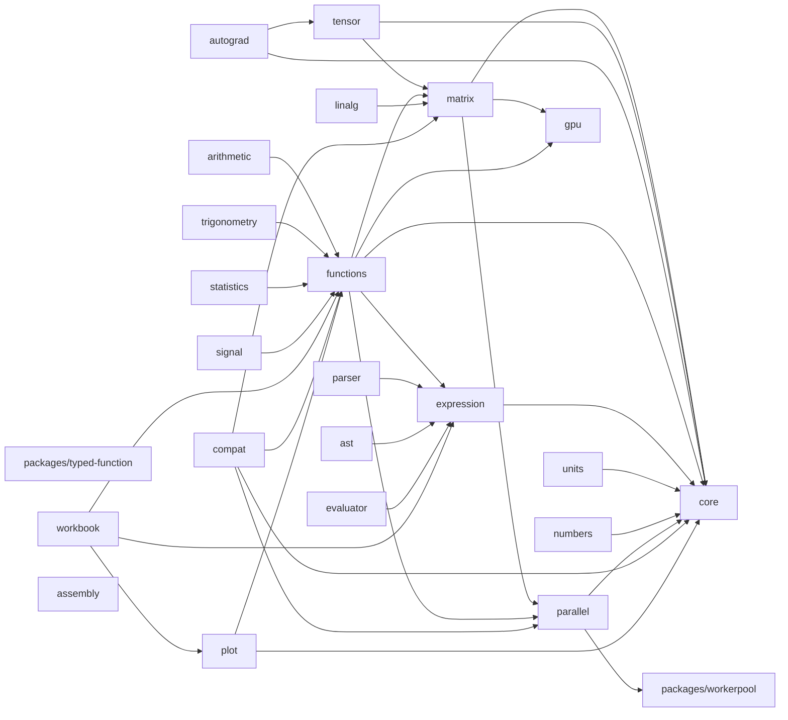

# mathts - Dependency Graph

**Version**: 0.1.0 | **Last Updated**: 2026-07-19

This document provides a comprehensive dependency graph of all files, components, imports, functions, and variables in the codebase.

---

## Table of Contents

1. [Overview](#overview)
2. [Package Dependencies](#package-dependencies)
3. [Packages/typed function Dependencies](#packages-typed-function-dependencies)
4. [Packages/workerpool Dependencies](#packages-workerpool-dependencies)
5. [Core/arithmetic Dependencies](#core-arithmetic-dependencies)
6. [Core Dependencies](#core-dependencies)
7. [Core/error Dependencies](#core-error-dependencies)
8. [Core/factory Dependencies](#core-factory-dependencies)
9. [Core/numeric Dependencies](#core-numeric-dependencies)
10. [Core/typed Dependencies](#core-typed-dependencies)
11. [Core/types Dependencies](#core-types-dependencies)
12. [Matrix/backends Dependencies](#matrix-backends-dependencies)
13. [Matrix Dependencies](#matrix-dependencies)
14. [Matrix/operations Dependencies](#matrix-operations-dependencies)
15. [Matrix/types Dependencies](#matrix-types-dependencies)
16. [Tensor Dependencies](#tensor-dependencies)
17. [Tensor/operations Dependencies](#tensor-operations-dependencies)
18. [Autograd Dependencies](#autograd-dependencies)
19. [Functions/algebra Dependencies](#functions-algebra-dependencies)
20. [Functions/arithmetic Dependencies](#functions-arithmetic-dependencies)
21. [Functions/bitwise Dependencies](#functions-bitwise-dependencies)
22. [Functions Dependencies](#functions-dependencies)
23. [Functions/combinatorics Dependencies](#functions-combinatorics-dependencies)
24. [Functions/complex Dependencies](#functions-complex-dependencies)
25. [Functions/core Dependencies](#functions-core-dependencies)
26. [Functions/error Dependencies](#functions-error-dependencies)
27. [Functions/expression Dependencies](#functions-expression-dependencies)
28. [Functions/factories Dependencies](#functions-factories-dependencies)
29. [Functions/geometry Dependencies](#functions-geometry-dependencies)
30. [Functions/gpu Dependencies](#functions-gpu-dependencies)
31. [Functions/graph Dependencies](#functions-graph-dependencies)
32. [Functions/logical Dependencies](#functions-logical-dependencies)
33. [Functions/matrix Dependencies](#functions-matrix-dependencies)
34. [Functions/ml Dependencies](#functions-ml-dependencies)
35. [Functions/numbertheory Dependencies](#functions-numbertheory-dependencies)
36. [Functions/numeric Dependencies](#functions-numeric-dependencies)
37. [Functions/plain Dependencies](#functions-plain-dependencies)
38. [Functions/probability Dependencies](#functions-probability-dependencies)
39. [Functions/relational Dependencies](#functions-relational-dependencies)
40. [Functions/set Dependencies](#functions-set-dependencies)
41. [Functions/signal Dependencies](#functions-signal-dependencies)
42. [Functions/special Dependencies](#functions-special-dependencies)
43. [Functions/statistics Dependencies](#functions-statistics-dependencies)
44. [Functions/stats Dependencies](#functions-stats-dependencies)
45. [Functions/string Dependencies](#functions-string-dependencies)
46. [Functions/trigonometry Dependencies](#functions-trigonometry-dependencies)
47. [Functions/type Dependencies](#functions-type-dependencies)
48. [Functions/typed Dependencies](#functions-typed-dependencies)
49. [Functions/unit Dependencies](#functions-unit-dependencies)
50. [Functions/utils Dependencies](#functions-utils-dependencies)
51. [Functions/wasm Dependencies](#functions-wasm-dependencies)
52. [Expression/compiler Dependencies](#expression-compiler-dependencies)
53. [Expression/embeddedDocs Dependencies](#expression-embeddeddocs-dependencies)
54. [Expression/error Dependencies](#expression-error-dependencies)
55. [Expression/evaluator Dependencies](#expression-evaluator-dependencies)
56. [Expression/function Dependencies](#expression-function-dependencies)
57. [Expression Dependencies](#expression-dependencies)
58. [Expression/node Dependencies](#expression-node-dependencies)
59. [Expression/transform Dependencies](#expression-transform-dependencies)
60. [Expression/utils Dependencies](#expression-utils-dependencies)
61. [Parser Dependencies](#parser-dependencies)
62. [Units Dependencies](#units-dependencies)
63. [Numbers Dependencies](#numbers-dependencies)
64. [Ast Dependencies](#ast-dependencies)
65. [Evaluator Dependencies](#evaluator-dependencies)
66. [Linalg Dependencies](#linalg-dependencies)
67. [Arithmetic Dependencies](#arithmetic-dependencies)
68. [Trigonometry Dependencies](#trigonometry-dependencies)
69. [Statistics Dependencies](#statistics-dependencies)
70. [Signal Dependencies](#signal-dependencies)
71. [Parallel Dependencies](#parallel-dependencies)
72. [Parallel/operations Dependencies](#parallel-operations-dependencies)
73. [Parallel/ops Dependencies](#parallel-ops-dependencies)
74. [Parallel/strategies Dependencies](#parallel-strategies-dependencies)
75. [Workbook Dependencies](#workbook-dependencies)
76. [Assembly/algebra Dependencies](#assembly-algebra-dependencies)
77. [Assembly/bindings Dependencies](#assembly-bindings-dependencies)
78. [Assembly Dependencies](#assembly-dependencies)
79. [Assembly/ops Dependencies](#assembly-ops-dependencies)
80. [Assembly/types Dependencies](#assembly-types-dependencies)
81. [Compat Dependencies](#compat-dependencies)
82. [Gpu Dependencies](#gpu-dependencies)
83. [Plot Dependencies](#plot-dependencies)
84. [Plot/three Dependencies](#plot-three-dependencies)
85. [Dependency Matrix](#dependency-matrix)
86. [Circular Dependency Analysis](#circular-dependency-analysis)
87. [Visual Dependency Graph](#visual-dependency-graph)
88. [Summary Statistics](#summary-statistics)

---

## Overview

The codebase is organized into the following modules:

- **packages/typed-function**: 1 file
- **packages/workerpool**: 4 files
- **core/arithmetic**: 1 file
- **core**: 17 files
- **core/error**: 3 files
- **core/factory**: 2 files
- **core/numeric**: 1 file
- **core/typed**: 3 files
- **core/types**: 16 files
- **matrix/backends**: 19 files
- **matrix**: 4 files
- **matrix/operations**: 17 files
- **matrix/types**: 6 files
- **tensor**: 4 files
- **tensor/operations**: 17 files
- **autograd**: 6 files
- **functions/algebra**: 45 files
- **functions/arithmetic**: 38 files
- **functions/bitwise**: 8 files
- **functions**: 19 files
- **functions/combinatorics**: 4 files
- **functions/complex**: 4 files
- **functions/core**: 5 files
- **functions/error**: 3 files
- **functions/expression**: 1 file
- **functions/factories**: 4 files
- **functions/geometry**: 4 files
- **functions/gpu**: 2 files
- **functions/graph**: 3 files
- **functions/logical**: 5 files
- **functions/matrix**: 45 files
- **functions/ml**: 6 files
- **functions/numbertheory**: 1 file
- **functions/numeric**: 18 files
- **functions/plain**: 10 files
- **functions/probability**: 14 files
- **functions/relational**: 13 files
- **functions/set**: 10 files
- **functions/signal**: 12 files
- **functions/special**: 6 files
- **functions/statistics**: 14 files
- **functions/stats**: 6 files
- **functions/string**: 5 files
- **functions/trigonometry**: 26 files
- **functions/type**: 32 files
- **functions/typed**: 31 files
- **functions/unit**: 2 files
- **functions/utils**: 34 files
- **functions/wasm**: 12 files
- **expression/compiler**: 2 files
- **expression/embeddedDocs**: 346 files
- **expression/error**: 1 file
- **expression/evaluator**: 2 files
- **expression/function**: 1 file
- **expression**: 7 files
- **expression/node**: 18 files
- **expression/transform**: 31 files
- **expression/utils**: 13 files
- **parser**: 1 file
- **units**: 1 file
- **numbers**: 1 file
- **ast**: 1 file
- **evaluator**: 1 file
- **linalg**: 1 file
- **arithmetic**: 1 file
- **trigonometry**: 1 file
- **statistics**: 1 file
- **signal**: 1 file
- **parallel**: 3 files
- **parallel/operations**: 5 files
- **parallel/ops**: 1 file
- **parallel/strategies**: 3 files
- **workbook**: 24 files
- **assembly/algebra**: 1 file
- **assembly/bindings**: 2 files
- **assembly**: 7 files
- **assembly/ops**: 16 files
- **assembly/types**: 1 file
- **compat**: 3 files
- **gpu**: 8 files
- **plot**: 18 files
- **plot/three**: 3 files

---

## Package Dependencies

| Package                                                             | Depends On                                                                                                                                                      | Files (Active) | Files (Dormant) |
| ------------------------------------------------------------------- | --------------------------------------------------------------------------------------------------------------------------------------------------------------- | -------------- | --------------- |
| `@danielsimonjr/mathts-typed-function` (`packages/typed-function/`) | (none)                                                                                                                                                          | 1              | 1               |
| `@danielsimonjr/mathts-workerpool` (`packages/workerpool/`)         | (none)                                                                                                                                                          | 4              | 1               |
| `@danielsimonjr/mathts-core` (`core/`)                              | (none)                                                                                                                                                          | 43             | 1               |
| `@danielsimonjr/mathts-matrix` (`matrix/`)                          | `@danielsimonjr/mathts-gpu`, `@danielsimonjr/mathts-parallel`, `@danielsimonjr/mathts-core`                                                                     | 46             | 0               |
| `@danielsimonjr/mathts-tensor` (`tensor/`)                          | `@danielsimonjr/mathts-matrix`, `@danielsimonjr/mathts-core`                                                                                                    | 21             | 0               |
| `@danielsimonjr/mathts-autograd` (`autograd/`)                      | `@danielsimonjr/mathts-tensor`, `@danielsimonjr/mathts-core`                                                                                                    | 6              | 0               |
| `@danielsimonjr/mathts-functions` (`functions/`)                    | `@danielsimonjr/mathts-matrix`, `@danielsimonjr/mathts-core`, `@danielsimonjr/mathts-expression`, `@danielsimonjr/mathts-gpu`, `@danielsimonjr/mathts-parallel` | 442            | 2               |
| `@danielsimonjr/mathts-expression` (`expression/`)                  | `@danielsimonjr/mathts-core`                                                                                                                                    | 421            | 1               |
| `@danielsimonjr/mathts-parser` (`parser/`)                          | `@danielsimonjr/mathts-expression`                                                                                                                              | 1              | 0               |
| `@danielsimonjr/mathts-units` (`units/`)                            | `@danielsimonjr/mathts-core`                                                                                                                                    | 1              | 0               |
| `@danielsimonjr/mathts-numbers` (`numbers/`)                        | `@danielsimonjr/mathts-core`                                                                                                                                    | 1              | 0               |
| `@danielsimonjr/mathts-ast` (`ast/`)                                | `@danielsimonjr/mathts-expression`                                                                                                                              | 1              | 0               |
| `@danielsimonjr/mathts-evaluator` (`evaluator/`)                    | `@danielsimonjr/mathts-expression`                                                                                                                              | 1              | 0               |
| `@danielsimonjr/mathts-linalg` (`linalg/`)                          | `@danielsimonjr/mathts-matrix`                                                                                                                                  | 1              | 0               |
| `@danielsimonjr/mathts-arithmetic` (`arithmetic/`)                  | `@danielsimonjr/mathts-functions`                                                                                                                               | 1              | 0               |
| `@danielsimonjr/mathts-trigonometry` (`trigonometry/`)              | `@danielsimonjr/mathts-functions`                                                                                                                               | 1              | 0               |
| `@danielsimonjr/mathts-statistics` (`statistics/`)                  | `@danielsimonjr/mathts-functions`                                                                                                                               | 1              | 0               |
| `@danielsimonjr/mathts-signal` (`signal/`)                          | `@danielsimonjr/mathts-functions`                                                                                                                               | 1              | 0               |
| `@danielsimonjr/mathts-parallel` (`parallel/`)                      | `@danielsimonjr/mathts-core`, `@danielsimonjr/mathts-workerpool`                                                                                                | 12             | 2               |
| `@danielsimonjr/mathts-workbook` (`workbook/`)                      | `@danielsimonjr/mathts-functions`, `@danielsimonjr/mathts-expression`, `@danielsimonjr/mathts-plot`                                                             | 24             | 1               |
| `@danielsimonjr/mathts-wasm` (`assembly/`)                          | (none)                                                                                                                                                          | 27             | 0               |
| `@danielsimonjr/mathts-compat` (`compat/`)                          | `@danielsimonjr/mathts-functions`, `@danielsimonjr/mathts-core`, `@danielsimonjr/mathts-matrix`, `@danielsimonjr/mathts-parallel`                               | 3              | 0               |
| `@danielsimonjr/mathts-gpu` (`gpu/`)                                | (none)                                                                                                                                                          | 8              | 0               |
| `@danielsimonjr/mathts-plot` (`plot/`)                              | `@danielsimonjr/mathts-core`, `@danielsimonjr/mathts-functions`                                                                                                 | 21             | 0               |

### Package Dependency Diagram

---

## Packages/typed function Dependencies

### `packages/typed-function/src/index.ts` - Utility helpers for typed-function integration in MathTS.

**Internal Dependencies:**
| File | Imports | Type |
|------|---------|------|
| `typed-function` | `default, create` | Re-export |
| `typed-function` | `TypedFunction` | Re-export (type-only) |

**Exports:**

- Classes: `NoMatchingSignatureError`, `TypeConversionError`
- Interfaces: `TypeDef`, `ExtendedTypeDef`, `ConversionDef`
- Types: `SignatureMap`, `TypeTest`, `TypeConverter`
- Functions: `parseSignature`, `buildSignature`, `createSymbolTypeTest`, `createRobustTypeTest`, `createRobustSubtypeTest`, `createSafeConversion`, `createSafeConversionDef`, `createSymbolTypeDef`, `createRobustTypeDef`
- Constants: `TYPED_FUNCTION_TYPE`, `isNumber`, `isBoolean`, `isString`, `isBigInt`, `isArray`, `isFunction`, `isObject`, `isNull`, `isUndefined`, `isNullOrUndefined`, `isFiniteNumber`, `isInteger`, `isPositiveInteger`, `isNonNegativeInteger`, `isNaN`, `isTypedArray`, `isFloat64Array`, `isFloat32Array`, `isInt32Array`, `isUint32Array`, `isArrayBuffer`
- Re-exports: `default`, `create`, `TypedFunction`

---

## Packages/workerpool Dependencies

### `packages/workerpool/src/fft-core.ts` - Shared radix-2 FFT core for @danielsimonjr/mathts-workerpool.

**Exports:**

- Functions: `fftBitReverse`, `fftFrameInPlace`

---

### `packages/workerpool/src/index.ts` - Worker pool management for MathTS parallel computations.

**External Dependencies:**
| Package | Import |
|---------|--------|
| `workerpool` | `pool, Pool, Transfer, PoolOptions, ExecOptions, PoolStats` |

**Internal Dependencies:**
| File | Imports | Type |
|------|---------|------|
| `./fft-core.js` | `fftFrameInPlace` | Import |

**Exports:**

- Classes: `MathWorkerPool`
- Interfaces: `WorkerpoolCapabilities`, `WasmFeatureStatus`, `WorkerPoolConfig`, `ParallelResult`, `PoolMetrics`, `EnhancedPoolStats`, `TaskOptions`
- Functions: `canUseWasm`, `canUseSharedMemory`, `transferFloat64`, `transferArrayBuffer`, `transferTypedArray`, `createSharedFloat64Array`, `createSharedBuffer`, `isSharedBuffer`, `getCapabilities`, `initWorkerWasm`, `isWorkerWasmAvailable`, `getWasmFeatures`, `initializePool`, `terminatePool`, `getPoolStats`
- Constants: `DEFAULT_WORKER_CONFIG`, `mathWorkerPool`

---

### `packages/workerpool/src/worker.ts` - Worker functions for parallel MathTS computations.

**External Dependencies:**
| Package | Import |
|---------|--------|
| `workerpool` | `worker` |

**Internal Dependencies:**
| File | Imports | Type |
|------|---------|------|
| `./fft-core.js` | `fftFrameInPlace` | Import |

---

### `packages/workerpool/src/workerpool-browser-shim.ts` - Browser shim for the Node-oriented `workerpool` npm package.

**Exports:**

- Classes: `Pool`, `Transfer`
- Interfaces: `PoolOptions`, `ExecOptions`, `PoolStats`
- Functions: `pool`, `worker`, `canUseWasm`, `canUseSharedMemory`
- Default: `default`

---

## Core/arithmetic Dependencies

### `core/src/arithmetic/scalar.ts` - Polymorphic scalar arithmetic over core's numeric primitives.

**Internal Dependencies:**
| File | Imports | Type |
|------|---------|------|
| `../config.js` | `DEFAULT_CONFIG` | Import |
| `../number.js` | `nearlyEqual` | Import |
| `../types/bignumber.js` | `BigNumber` | Import |
| `../types/complex.js` | `Complex` | Import |
| `../types/fraction.js` | `Fraction` | Import |

**Exports:**

- Types: `NumericScalar`
- Functions: `addScalar`, `subtractScalar`, `multiplyScalar`, `divideScalar`, `pow`, `abs`, `fix`, `round`, `equal`, `isNumeric`, `number`

---

## Core Dependencies

### `core/src/array.ts` - Cold array utilities (mathjs-derived): size/validate/reshape/resize/squeeze,

**Internal Dependencies:**
| File | Imports | Type |
|------|---------|------|
| `./number.js` | `isInteger` | Import |
| `./is.js` | `isNumber, isBigNumber, isArray, isString, Index, Matrix, IndexDimension` | Import |
| `./string.js` | `format` | Import |
| `./error/DimensionError.js` | `DimensionError` | Import |
| `./error/IndexError.js` | `IndexError` | Import |
| `./object.js` | `deepStrictEqual` | Import |

**Exports:**

- Interfaces: `IdentifiedValue`
- Types: `NestedArray`
- Functions: `arraySize`, `validate`, `validateIndexSourceSize`, `validateIndex`, `isEmptyIndex`, `resize`, `reshape`, `processSizesWildcard`, `squeeze`, `unsqueeze`, `flatten`, `map`, `forEach`, `filter`, `filterRegExp`, `join`, `identify`, `generalize`, `getArrayDataType`, `last`, `initial`, `concat`, `broadcastSizes`, `checkBroadcastingRules`, `broadcastTo`, `broadcastArrays`, `stretch`, `get`, `deepMap`, `deepForEach`, `clone`

---

### `core/src/bignumber-formatter.ts` - BigNumber (decimal.js-shaped) formatting — canonical copy.

**Internal Dependencies:**
| File | Imports | Type |
|------|---------|------|
| `./is.js` | `isBigNumber, isNumber` | Import |
| `./number.js` | `isInteger, normalizeFormatOptions, FormatOptions` | Import |

**Exports:**

- Interfaces: `BigNumberValue`
- Functions: `format`, `toEngineering`, `toExponential`, `toFixed`

---

### `core/src/collection.ts` - Cold array/Matrix-aware collection utilities (mathjs-derived): `deepMap`/

**Internal Dependencies:**
| File | Imports | Type |
|------|---------|------|
| `./is.js` | `isCollection, isMatrix` | Import |
| `./error/IndexError.js` | `IndexError` | Import |
| `./array.js` | `arraySize, deepMap, deepForEach` | Import |
| `./switch.js` | `_switch` | Import |

**Exports:**

- Functions: `containsCollections`, `deepForEach`, `deepMap`, `reduce`, `scatter`

---

### `core/src/config.ts` - Configuration interface for math.js

**Exports:**

- Interfaces: `ConfigOptions`
- Types: `MathJsConfig`
- Constants: `DEFAULT_CONFIG`

---

### `core/src/constants.ts` - Named mathematical constants (plain `number`).

**Exports:**

- Constants: `PI`, `E`, `TAU`, `PHI`, `SQRT2`, `SQRT1_2`, `LN2`, `LN10`, `LOG2E`, `LOG10E`

---

### `core/src/customs.ts` - NOT the security-invariant sandbox file. `expression/src/utils/customs.ts` and

**Internal Dependencies:**
| File | Imports | Type |
|------|---------|------|
| `./shared.js` | `hasOwnProperty` | Import |

**Exports:**

- Functions: `getSafeProperty`, `setSafeProperty`, `isSafeProperty`, `getSafeMethod`, `isSafeMethod`

---

### `core/src/factory.ts` - Type for a factory function that creates instances

**Internal Dependencies:**
| File | Imports | Type |
|------|---------|------|
| `./object.js` | `pickShallow` | Import |
| `./error/MathjsError.js` | `MathjsError` | Import |

**Exports:**

- Interfaces: `FactoryFunction`, `LegacyFactory`, `FactoryMeta`
- Types: `DependencyName`, `CreateFunction`
- Functions: `factory`, `sortFactories`, `create`, `isFactory`, `assertDependencies`, `isOptionalDependency`, `stripOptionalNotation`

---

### `core/src/index.ts` - Core types and utilities for MathTS

**Internal Dependencies:**
| File | Imports | Type |
|------|---------|------|
| `./types/complex.js` | `Complex, isComplex, I, COMPLEX_ZERO, COMPLEX_ONE, COMPLEX_NEG_ONE` | Re-export |
| `./types/matrix/Range.js` | `createRangeClass, Range` | Re-export |
| `./types/dual.js` | `Dual, isDual` | Re-export |
| `./types/dual-rules.js` | `DUAL_UNARY_RULES` | Re-export |
| `./constants.js` | `PI, E, TAU, PHI, SQRT2, SQRT1_2, LN2, LN10, LOG2E, LOG10E` | Re-export |
| `./types/fraction.js` | `Fraction, isFraction, FRACTION_ZERO, FRACTION_ONE, FRACTION_NEG_ONE, FRACTION_HALF, FRACTION_THIRD, FRACTION_QUARTER` | Re-export |
| `./types/bignumber.js` | `BigNumber, isBigNumber, BIGNUMBER_ZERO, BIGNUMBER_ONE, BIGNUMBER_NEG_ONE, BIGNUMBER_TEN, BIGNUMBER_PI, BIGNUMBER_E, BIGNUMBER_LN2, BIGNUMBER_LN10` | Re-export |
| `./arithmetic/scalar.js` | `addScalar, subtractScalar, multiplyScalar, divideScalar, pow, abs, fix, round, equal, isNumeric, number` | Re-export |
| `./types/unit.js` | `Unit, isUnit, DimensionMismatchError, UnitParseError, DIMENSIONLESS, dim` | Re-export |
| `./types/unit-definitions.js` | `BASE_UNITS, DERIVED_UNITS, ALL_UNITS, UNIT_ALIASES, getUnitDef` | Re-export |
| `./types/unit-prefixes.js` | `SI_PREFIXES, BEST_PREFIXES, getPrefix` | Re-export |
| `./typed/index.js` | `mathTyped, createMathTSTyped, typed, create, createTypedFunction, TypeRegistry, MATHTS_TYPES, MATHTS_CONVERSIONS, isNumber, isBoolean, isString, isBigInt, isArray, isFunction, isObject, isNull, isUndefined, isMatrix, isDenseMatrix, isSparseMatrix, isUnit, initTypedWasm, isTypedWasmAvailable, registerNativeTypes` | Re-export |
| `./factory/index.js` | `FunctionRegistry, createFactory, registry, math, DEFAULT_CONFIG` | Re-export |
| `./numeric/stable.js` | `pairwiseSum, neumaierSum, norm2, pairwiseDot, scaledDistance, neumaierCumsum, sumSquaredDeviations` | Re-export |
| `./types/interfaces.js` | `MathTSValue, Scalar, BackendType, NumericType, MatrixBackend, IMatrix, IComplex, IFraction, IBigNumber, MatrixDimensions` | Re-export (type-only) |
| `./types/matrix/Range.js` | `RangeForEachCallback, RangeMapCallback, RangeFormatOptions, RangeJSON` | Re-export (type-only) |
| `./types/dual-rules.js` | `DualUnaryRule, DualUnaryRuleName` | Re-export (type-only) |
| `./types/bignumber.js` | `BigNumberConfig, RoundingMode` | Re-export (type-only) |
| `./arithmetic/scalar.js` | `NumericScalar` | Re-export (type-only) |
| `./types/unit.js` | `Dimensions, UnitDef, UnitInstance` | Re-export (type-only) |
| `./typed/index.js` | `TypedFunction, TypedInstance, TypeDef, ConversionDef, SignatureFunction, ReferTo, ReferToSelf` | Re-export (type-only) |
| `./factory/index.js` | `MathTSConfig, FactoryFunction, FactoryDependencies, FactoryImport` | Re-export (type-only) |

**Exports:**

- Constants: `VERSION`
- Re-exports: `Complex`, `isComplex`, `I`, `COMPLEX_ZERO`, `COMPLEX_ONE`, `COMPLEX_NEG_ONE`, `createRangeClass`, `Range`, `Dual`, `isDual`, `DUAL_UNARY_RULES`, `PI`, `E`, `TAU`, `PHI`, `SQRT2`, `SQRT1_2`, `LN2`, `LN10`, `LOG2E`, `LOG10E`, `Fraction`, `isFraction`, `FRACTION_ZERO`, `FRACTION_ONE`, `FRACTION_NEG_ONE`, `FRACTION_HALF`, `FRACTION_THIRD`, `FRACTION_QUARTER`, `BigNumber`, `isBigNumber`, `BIGNUMBER_ZERO`, `BIGNUMBER_ONE`, `BIGNUMBER_NEG_ONE`, `BIGNUMBER_TEN`, `BIGNUMBER_PI`, `BIGNUMBER_E`, `BIGNUMBER_LN2`, `BIGNUMBER_LN10`, `addScalar`, `subtractScalar`, `multiplyScalar`, `divideScalar`, `pow`, `abs`, `fix`, `round`, `equal`, `isNumeric`, `number`, `Unit`, `isUnit`, `DimensionMismatchError`, `UnitParseError`, `DIMENSIONLESS`, `dim`, `BASE_UNITS`, `DERIVED_UNITS`, `ALL_UNITS`, `UNIT_ALIASES`, `getUnitDef`, `SI_PREFIXES`, `BEST_PREFIXES`, `getPrefix`, `mathTyped`, `createMathTSTyped`, `typed`, `create`, `createTypedFunction`, `TypeRegistry`, `MATHTS_TYPES`, `MATHTS_CONVERSIONS`, `isNumber`, `isBoolean`, `isString`, `isBigInt`, `isArray`, `isFunction`, `isObject`, `isNull`, `isUndefined`, `isMatrix`, `isDenseMatrix`, `isSparseMatrix`, `initTypedWasm`, `isTypedWasmAvailable`, `registerNativeTypes`, `FunctionRegistry`, `createFactory`, `registry`, `math`, `DEFAULT_CONFIG`, `pairwiseSum`, `neumaierSum`, `norm2`, `pairwiseDot`, `scaledDistance`, `neumaierCumsum`, `sumSquaredDeviations`, `MathTSValue`, `Scalar`, `BackendType`, `NumericType`, `MatrixBackend`, `IMatrix`, `IComplex`, `IFraction`, `IBigNumber`, `MatrixDimensions`, `RangeForEachCallback`, `RangeMapCallback`, `RangeFormatOptions`, `RangeJSON`, `DualUnaryRule`, `DualUnaryRuleName`, `BigNumberConfig`, `RoundingMode`, `NumericScalar`, `Dimensions`, `UnitDef`, `UnitInstance`, `TypedFunction`, `TypedInstance`, `TypeDef`, `ConversionDef`, `SignatureFunction`, `ReferTo`, `ReferToSelf`, `MathTSConfig`, `FactoryFunction`, `FactoryDependencies`, `FactoryImport`

---

### `core/src/internal.ts` - Internal shared utilities, exposed via the `@danielsimonjr/mathts-core/internal`

**Internal Dependencies:**
| File | Imports | Type |
|------|---------|------|
| `./is.js` | `*` | Re-export |
| `./number.js` | `*` | Re-export |
| `./object.js` | `*` | Re-export |
| `./factory.js` | `*` | Re-export |
| `./shared.js` | `hasOwnProperty, endsWith, warnOnce, memoize` | Re-export |
| `./config.js` | `DEFAULT_CONFIG` | Re-export |
| `./error/MathjsError.js` | `MathjsError` | Re-export |
| `./error/DimensionError.js` | `DimensionError` | Re-export |
| `./error/IndexError.js` | `IndexError, createIndexError` | Re-export |
| `./string.js` | `format, stringify, escape, compareText, GeneralFormatOptions` | Re-export |
| `./bignumber-formatter.js` | `format, toEngineering, toExponential, toFixed, BigNumberValue` | Re-export |
| `./types/unit/index.js` | `createUnitClass, unitDependencies, Unit` | Re-export |
| `./array.js` | `arraySize, validate, validateIndexSourceSize, validateIndex, isEmptyIndex, resize, reshape, processSizesWildcard, squeeze, unsqueeze, flatten, map, forEach, filter, filterRegExp, join, identify, generalize, getArrayDataType, last, initial, concat, broadcastSizes, checkBroadcastingRules, broadcastTo, broadcastArrays, stretch, get, deepMap, deepForEach, clone` | Re-export |
| `./collection.js` | `containsCollections, deepMap, deepForEach, reduce, scatter` | Re-export |
| `./switch.js` | `_switch` | Re-export |
| `./map.js` | `ObjectWrappingMap, PartitionedMap, createEmptyMap, createMap, toObject, assign, isObjectWrappingMap` | Re-export |
| `./wasm-loader.js` | `sha384OfBuffer, loadWasmManifest, verifyWasmIntegrity, resolvePackagedWasm, defaultWasmLocation` | Re-export |
| `./shared.js` | `MemoizedFunction` | Re-export (type-only) |
| `./config.js` | `ConfigOptions, MathJsConfig` | Re-export (type-only) |
| `./array.js` | `NestedArray, IdentifiedValue` | Re-export (type-only) |
| `./types/wasm-loader.js` | `LoadingMetrics, WasmManifest` | Re-export (type-only) |
| `./types/unit/unit-types.js` | `*` | Re-export (type-only) |

**Exports:**

- Re-exports: `* from ./is.js`, `* from ./number.js`, `* from ./object.js`, `* from ./factory.js`, `hasOwnProperty`, `endsWith`, `warnOnce`, `memoize`, `DEFAULT_CONFIG`, `MathjsError`, `DimensionError`, `IndexError`, `createIndexError`, `format`, `stringify`, `escape`, `compareText`, `GeneralFormatOptions`, `toEngineering`, `toExponential`, `toFixed`, `BigNumberValue`, `createUnitClass`, `unitDependencies`, `Unit`, `arraySize`, `validate`, `validateIndexSourceSize`, `validateIndex`, `isEmptyIndex`, `resize`, `reshape`, `processSizesWildcard`, `squeeze`, `unsqueeze`, `flatten`, `map`, `forEach`, `filter`, `filterRegExp`, `join`, `identify`, `generalize`, `getArrayDataType`, `last`, `initial`, `concat`, `broadcastSizes`, `checkBroadcastingRules`, `broadcastTo`, `broadcastArrays`, `stretch`, `get`, `deepMap`, `deepForEach`, `clone`, `containsCollections`, `reduce`, `scatter`, `_switch`, `ObjectWrappingMap`, `PartitionedMap`, `createEmptyMap`, `createMap`, `toObject`, `assign`, `isObjectWrappingMap`, `sha384OfBuffer`, `loadWasmManifest`, `verifyWasmIntegrity`, `resolvePackagedWasm`, `defaultWasmLocation`, `MemoizedFunction`, `ConfigOptions`, `MathJsConfig`, `NestedArray`, `IdentifiedValue`, `LoadingMetrics`, `WasmManifest`, `type * from ./types/unit/unit-types.js`

---

### `core/src/is.ts` - Structural view used by the duck-typing guards below: math.js types are

**Exports:**

- Interfaces: `BigNumber`, `Complex`, `Fraction`, `Unit`, `Matrix`, `DenseMatrix`, `SparseMatrix`, `Range`, `IndexDimension`, `Index`
- Functions: `isNumber`, `isBigNumber`, `isBigInt`, `isComplex`, `isFraction`, `isUnit`, `isString`, `isMatrix`, `isCollection`, `isDenseMatrix`, `isSparseMatrix`, `isRange`, `isIndex`, `isBoolean`, `isFunction`, `isDate`, `isRegExp`, `isObject`, `isMap`, `isNull`, `isUndefined`, `typeOf`
- Constants: `isArray`

---

### `core/src/map.ts` - A `Map`-facade over a bare object (`ObjectWrappingMap`), a two-partition

**Internal Dependencies:**
| File | Imports | Type |
|------|---------|------|
| `./customs.js` | `getSafeProperty, isSafeProperty, setSafeProperty` | Import |
| `./is.js` | `isMap, isObject` | Import |

**Exports:**

- Classes: `ObjectWrappingMap`, `PartitionedMap`
- Functions: `createEmptyMap`, `createMap`, `toObject`, `assign`, `isObjectWrappingMap`

---

### `core/src/number.ts` - Split value representation with sign, coefficients, and exponent

**Internal Dependencies:**
| File | Imports | Type |
|------|---------|------|
| `./is.js` | `isBigNumber, isNumber, isObject` | Import |

**Exports:**

- Interfaces: `SplitValue`, `NumberTypeConfig`, `FormatOptions`, `NormalizedFormatOptions`
- Functions: `isInteger`, `safeNumberType`, `format`, `normalizeFormatOptions`, `splitNumber`, `toEngineering`, `toFixed`, `toExponential`, `toPrecision`, `roundDigits`, `digits`, `nearlyEqual`, `copysign`, `isPowZeroAtInfinity`
- Constants: `sign`, `log2`, `log10`, `log1p`, `cbrt`, `expm1`, `acosh`, `asinh`, `atanh`, `cosh`, `sinh`, `tanh`

---

### `core/src/object.ts` - Clone an object

**Internal Dependencies:**
| File | Imports | Type |
|------|---------|------|
| `./is.js` | `isBigNumber, isObject` | Import |
| `./shared.js` | `hasOwnProperty` | Import |

**Exports:**

- Functions: `clone`, `mapObject`, `extend`, `deepExtend`, `deepStrictEqual`, `deepFlatten`, `canDefineProperty`, `lazy`, `traverse`, `isLegacyFactory`, `get`, `set`, `pick`, `pickShallow`

---

### `core/src/shared.ts` - Shared utility functions used across core utility modules.

**Exports:**

- Interfaces: `MemoizedFunction`
- Functions: `hasOwnProperty`, `endsWith`, `memoize`
- Constants: `warnOnce`

---

### `core/src/string.ts` - Generic-value string formatting — canonical copy.

**Internal Dependencies:**
| File | Imports | Type |
|------|---------|------|
| `./is.js` | `isBigNumber, isString, typeOf` | Import |
| `./number.js` | `format, FormatOptions` | Import |
| `./bignumber-formatter.js` | `format` | Import |

**Exports:**

- Types: `GeneralFormatOptions`
- Functions: `format`, `stringify`, `escape`, `compareText`

---

### `core/src/switch.ts` - Transpose a 2D array. Private helper used only by `core/src/collection.ts`'s

**Exports:**

- Functions: `_switch`

---

### `core/src/wasm-loader.ts` - Shared WASM-loader runtime logic — SHA-384 integrity verification + packaged

**Internal Dependencies:**
| File | Imports | Type |
|------|---------|------|
| `./types/wasm-loader.js` | `WasmManifest` | Import (type-only) |

**Exports:**

- Functions: `sha384OfBuffer`, `loadWasmManifest`, `verifyWasmIntegrity`, `resolvePackagedWasm`, `defaultWasmLocation`

---

## Core/error Dependencies

### `core/src/error/DimensionError.ts` - Create a range error with the message:

**Exports:**

- Classes: `DimensionError`

---

### `core/src/error/IndexError.ts` - Custom error type for index out of range errors.

**Exports:**

- Classes: `IndexError`
- Functions: `createIndexError`

---

### `core/src/error/MathjsError.ts` - Custom error type for Mathjs errors

**Exports:**

- Classes: `MathjsError`

---

## Core/factory Dependencies

### `core/src/factory/factory.ts` - MathTS Function Factory

**Internal Dependencies:**
| File | Imports | Type |
|------|---------|------|
| `../typed/mathts-typed.js` | `TypedFunction, TypedInstance, SignatureFunction, ReferTo, ReferToSelf` | Import (type-only) |
| `../typed/mathts-typed.js` | `mathTyped` | Import |

**Exports:**

- Classes: `FunctionRegistry`
- Interfaces: `MathTSConfig`, `FactoryFunction`, `FactoryDependencies`
- Types: `FactoryImport`
- Functions: `createFactory`, `createTypedFunction`
- Constants: `DEFAULT_CONFIG`, `registry`, `math`

---

### `core/src/factory/index.ts` - Factory pattern exports

**Internal Dependencies:**
| File | Imports | Type |
|------|---------|------|
| `./factory.js` | `FunctionRegistry, createFactory, createTypedFunction, registry, math, DEFAULT_CONFIG` | Re-export |
| `./factory.js` | `MathTSConfig, FactoryFunction, FactoryDependencies, FactoryImport` | Re-export (type-only) |

**Exports:**

- Re-exports: `FunctionRegistry`, `createFactory`, `createTypedFunction`, `registry`, `math`, `DEFAULT_CONFIG`, `MathTSConfig`, `FactoryFunction`, `FactoryDependencies`, `FactoryImport`

---

## Core/numeric Dependencies

### `core/src/numeric/stable.ts` - Numerically stable reduction primitives.

**Exports:**

- Functions: `pairwiseSum`, `neumaierSum`, `norm2`, `pairwiseDot`, `scaledDistance`, `sumSquaredDeviations`, `neumaierCumsum`

---

## Core/typed Dependencies

### `core/src/typed/index.ts` - typed-function integration exports

**Internal Dependencies:**
| File | Imports | Type |
|------|---------|------|
| `./mathts-typed.js` | `mathTyped, createMathTSTyped, typed, create, createTypedFunction, TypeRegistry, MATHTS_TYPES, MATHTS_CONVERSIONS, isNumber, isBoolean, isString, isBigInt, isArray, isFunction, isObject, isNull, isUndefined, isComplex, isFraction, isBigNumber, isFloat64Array, isFloat32Array, isInt32Array, isUint32Array, isUint8Array, isMatrix, isDenseMatrix, isSparseMatrix, isUnit, initTypedWasm, isTypedWasmAvailable` | Re-export |
| `./type-bridge.js` | `registerNativeTypes` | Re-export |
| `./mathts-typed.js` | `TypedFunction, TypedInstance, TypeDef, ConversionDef, SignatureFunction, ReferTo, ReferToSelf` | Re-export (type-only) |

**Exports:**

- Re-exports: `mathTyped`, `createMathTSTyped`, `typed`, `create`, `createTypedFunction`, `TypeRegistry`, `MATHTS_TYPES`, `MATHTS_CONVERSIONS`, `isNumber`, `isBoolean`, `isString`, `isBigInt`, `isArray`, `isFunction`, `isObject`, `isNull`, `isUndefined`, `isComplex`, `isFraction`, `isBigNumber`, `isFloat64Array`, `isFloat32Array`, `isInt32Array`, `isUint32Array`, `isUint8Array`, `isMatrix`, `isDenseMatrix`, `isSparseMatrix`, `isUnit`, `initTypedWasm`, `isTypedWasmAvailable`, `registerNativeTypes`, `TypedFunction`, `TypedInstance`, `TypeDef`, `ConversionDef`, `SignatureFunction`, `ReferTo`, `ReferToSelf`

---

### `core/src/typed/mathts-typed.ts` - MathTS typed-function Integration

**External Dependencies:**
| Package | Import |
|---------|--------|
| `typed-function` | `create, typed` |
| `typed-function` | `TypedFunction, TypedInstance, SignatureFunction, ReferTo, ReferToSelf` |

**Internal Dependencies:**
| File | Imports | Type |
|------|---------|------|
| `../types/complex.js` | `Complex, isComplex` | Import |
| `../types/dual.js` | `isDual` | Import |
| `../types/fraction.js` | `Fraction, isFraction` | Import |
| `../types/bignumber.js` | `BigNumber, isBigNumber` | Import |

**Exports:**

- Classes: `TypeRegistry`
- Interfaces: `MathTSTyped`, `TypeDef`, `ConversionDef`, `MathTSTypeDef`
- Types: `SignatureImpl`, `SignatureRecord`
- Functions: `initTypedWasm`, `isTypedWasmAvailable`, `createMathTSTyped`, `createTypedFunction`
- Constants: `isNumber`, `isBoolean`, `isString`, `isBigInt`, `isArray`, `isFunction`, `isObject`, `isNull`, `isUndefined`, `isFloat64Array`, `isFloat32Array`, `isInt32Array`, `isUint32Array`, `isUint8Array`, `isComplex`, `isFraction`, `isBigNumber`, `isMatrix`, `isDenseMatrix`, `isSparseMatrix`, `isUnit`, `MATHTS_TYPES`, `MATHTS_CONVERSIONS`, `mathTyped`

---

### `core/src/typed/type-bridge.ts` - Type compatibility bridge for mathjs duck-typing.

**Internal Dependencies:**
| File | Imports | Type |
|------|---------|------|
| `../types/complex.js` | `Complex` | Import |
| `../types/fraction.js` | `Fraction` | Import |
| `../types/bignumber.js` | `BigNumber` | Import |

**Exports:**

- Functions: `registerNativeTypes`

---

## Core/types Dependencies

### `core/src/types/bignumber.ts` - BigNumber (arbitrary precision decimal) implementation

**Internal Dependencies:**
| File | Imports | Type |
|------|---------|------|
| `./interfaces` | `Scalar, MathTSValue` | Import (type-only) |

**Exports:**

- Classes: `BigNumber`
- Interfaces: `BigNumberConfig`
- Types: `RoundingMode`
- Functions: `isBigNumber`
- Constants: `BIGNUMBER_ZERO`, `BIGNUMBER_ONE`, `BIGNUMBER_NEG_ONE`, `BIGNUMBER_TEN`, `BIGNUMBER_PI`, `BIGNUMBER_E`, `BIGNUMBER_LN2`, `BIGNUMBER_LN10`

---

### `core/src/types/complex.ts` - Complex number implementation

**Internal Dependencies:**
| File | Imports | Type |
|------|---------|------|
| `./interfaces` | `Scalar, IComplex` | Import (type-only) |

**Exports:**

- Classes: `Complex`
- Functions: `isComplex`
- Constants: `I`, `COMPLEX_ZERO`, `COMPLEX_ONE`, `COMPLEX_NEG_ONE`

---

### `core/src/types/dual-rules.ts` - Canonical elementary-function derivative rules for forward-mode automatic

**Exports:**

- Interfaces: `DualUnaryRule`
- Types: `DualUnaryRuleName`
- Constants: `DUAL_UNARY_RULES`

---

### `core/src/types/dual.ts` - Dual number for forward-mode automatic differentiation.

**Internal Dependencies:**
| File | Imports | Type |
|------|---------|------|
| `./dual-rules.js` | `DUAL_UNARY_RULES, DualUnaryRule` | Import |

**Exports:**

- Classes: `Dual`
- Functions: `isDual`

---

### `core/src/types/fraction.ts` - Fraction (rational number) implementation

**Internal Dependencies:**
| File | Imports | Type |
|------|---------|------|
| `./interfaces` | `Scalar, IFraction` | Import (type-only) |

**Exports:**

- Classes: `Fraction`
- Functions: `isFraction`
- Constants: `FRACTION_ZERO`, `FRACTION_ONE`, `FRACTION_NEG_ONE`, `FRACTION_HALF`, `FRACTION_THIRD`, `FRACTION_QUARTER`

---

### `core/src/types/interfaces.ts` - Base interfaces for MathTS types

**Exports:**

- Interfaces: `MathTSValue`, `Scalar`, `MatrixBackend`, `IMatrix`, `IComplex`, `IFraction`, `IBigNumber`, `MatrixDimensions`
- Types: `BackendType`, `NumericType`

---

### `core/src/types/matrix/Range.ts` - Callback function for Range forEach operations

**Internal Dependencies:**
| File | Imports | Type |
|------|---------|------|
| `../../is.js` | `isBigInt, isBigNumber` | Import |
| `../../number.js` | `format, sign, nearlyEqual` | Import |
| `../../factory.js` | `factory` | Import |

**Exports:**

- Interfaces: `RangeFormatOptions`, `RangeJSON`
- Types: `RangeForEachCallback`, `RangeMapCallback`
- Constants: `createRangeClass`, `Range`

---

### `core/src/types/unit/dependencies.ts` - The dependency object injected into the relocated mathjs `Unit` factory

**Internal Dependencies:**
| File | Imports | Type |
|------|---------|------|
| `../../arithmetic/scalar.js` | `addScalar, subtractScalar, multiplyScalar, divideScalar, pow, abs, fix, round, equal, isNumeric, number` | Import |
| `../../config.js` | `DEFAULT_CONFIG` | Import |
| `../../is.js` | `isUnit` | Import |
| `../../number.js` | `format, FormatOptions` | Import |
| `../bignumber.js` | `BigNumber` | Import |
| `../complex.js` | `Complex, I` | Import |
| `../fraction.js` | `Fraction` | Import |
| `./unit-types.js` | `BigNumberConstructor, ComplexConstructor, FractionConstructor, Numeric, ScalarBinaryOp, ScalarUnaryOp, SubtractScalar, UnitConfig, UnitDependencies, UnitInstance` | Import (type-only) |

**Exports:**

- Constants: `unitDependencies`

---

### `core/src/types/unit/errors.ts` - Typed error classes for the Unit. Kept in their own module (with no Unit

**Exports:**

- Classes: `UnitParseError`, `DimensionMismatchError`

---

### `core/src/types/unit/index.ts` - The relocated, feature-complete `Unit` — the mathjs-derived unit system now

**Internal Dependencies:**
| File | Imports | Type |
|------|---------|------|
| `./Unit.js` | `createUnitClass` | Import |
| `./dependencies.js` | `unitDependencies` | Import |
| `./unit-types.js` | `UnitConstructor` | Import (type-only) |
| `./Unit.js` | `createUnitClass` | Re-export |
| `./dependencies.js` | `unitDependencies` | Re-export |
| `./unit-types.js` | `*` | Re-export (type-only) |

**Exports:**

- Constants: `Unit`
- Re-exports: `createUnitClass`, `unitDependencies`, `type * from ./unit-types.js`

---

### `core/src/types/unit/unit-types.ts` - Shared TypeScript interfaces for the Unit factory (`Unit.ts`).

**Internal Dependencies:**
| File | Imports | Type |
|------|---------|------|
| `../../is.js` | `Complex` | Import (type-only) |

**Exports:**

- Interfaces: `BigNumberValue`, `FractionValue`, `PrefixDef`, `BaseUnitDef`, `UnitDef`, `UnitComponent`, `UnitSystemEntry`, `UnitJSON`, `TypeConverters`, `ParseOptions`, `UnitFormatOptions`, `CreateUnitOptions`, `CreateUnitDefObject`, `UnitConfig`, `ComplexConstructor`, `BigNumberConstructor`, `FractionConstructor`, `SubtractScalar`, `UnitDependencies`, `UnitInstance`, `UnitConstructor`
- Types: `ComplexValue`, `Numeric`, `PrefixTable`, `UnitSystem`, `ConverterFn`, `ScalarBinaryOp`, `ScalarUnaryOp`

---

### `core/src/types/unit/Unit.ts` - Normalize degree-symbol unit notations to their ASCII spellings before parsing,

**Internal Dependencies:**
| File | Imports | Type |
|------|---------|------|
| `../../is.js` | `isComplex, isUnit, typeOf` | Import |
| `../../factory.js` | `factory` | Import |
| `../../object.js` | `clone` | Import |
| `../../shared.js` | `memoize, endsWith, hasOwnProperty, warnOnce` | Import |
| `../bignumber.js` | `BIGNUMBER_PI` | Import |
| `./unit-types.js` | `BaseUnitDef, BigNumberValue, ConverterFn, CreateUnitDefObject, CreateUnitOptions, FractionValue, Numeric, ParseOptions, PrefixDef, PrefixTable, TypeConverters, UnitComponent, UnitConfig, UnitConstructor, UnitDef, UnitDependencies, UnitFormatOptions, UnitInstance, UnitJSON, UnitSystem, UnitSystemEntry` | Import (type-only) |
| `./errors.js` | `DimensionMismatchError, UnitParseError` | Import |

**Exports:**

- Constants: `createUnitClass`

---

### `core/src/types/unit-definitions.ts` - Unit definitions for the Unit type.

**Exports:**

- Interfaces: `Dimensions`, `UnitDef`
- Functions: `dim`, `getUnitDef`
- Constants: `DIMENSIONLESS`, `BASE_UNITS`, `DERIVED_UNITS`, `ALL_UNITS`, `UNIT_ALIASES`

---

### `core/src/types/unit-prefixes.ts` - SI prefixes for the Unit type.

**Exports:**

- Functions: `getPrefix`
- Constants: `SI_PREFIXES`, `BEST_PREFIXES`

---

### `core/src/types/unit.ts` - The core `Unit` — now the single, feature-complete implementation under

**Internal Dependencies:**
| File | Imports | Type |
|------|---------|------|
| `./unit/index.js` | `Unit, createUnitClass, unitDependencies` | Re-export |
| `./unit/errors.js` | `DimensionMismatchError, UnitParseError` | Re-export |
| `../is.js` | `isUnit` | Re-export |
| `./unit-definitions.js` | `DIMENSIONLESS, dim` | Re-export |
| `./unit/index.js` | `UnitInstance` | Re-export (type-only) |
| `./unit-definitions.js` | `Dimensions, UnitDef` | Re-export (type-only) |

**Exports:**

- Re-exports: `Unit`, `createUnitClass`, `unitDependencies`, `DimensionMismatchError`, `UnitParseError`, `isUnit`, `DIMENSIONLESS`, `dim`, `UnitInstance`, `Dimensions`, `UnitDef`

---

### `core/src/types/wasm-loader.ts` - Shared type-only shapes for the two independent WASM loader implementations

**Exports:**

- Interfaces: `LoadingMetrics`, `WasmManifest`

---

## Matrix/backends Dependencies

### `matrix/src/backends/Backend.ts` - Matrix Backend Interface

**Workspace Dependencies:**
| Package | Import |
|---------|--------|
| `@danielsimonjr/mathts-gpu` | `GPU_MIN_ELEMENTS` |

**Internal Dependencies:**
| File | Imports | Type |
|------|---------|------|
| `../types/DenseMatrix.js` | `DenseMatrix` | Import |

**Exports:**

- Classes: `BackendRegistry`
- Interfaces: `BackendHints`, `MatrixBackend`
- Types: `BackendType`
- Constants: `DEFAULT_BACKEND_HINTS`, `backendRegistry`

---

### `matrix/src/backends/BackendManager.ts` - Backend Manager

**Workspace Dependencies:**
| Package | Import |
|---------|--------|
| `@danielsimonjr/mathts-gpu` | `GPU_MIN_ELEMENTS` |

**Internal Dependencies:**
| File | Imports | Type |
|------|---------|------|
| `../types/DenseMatrix.js` | `DenseMatrix` | Import |
| `./Backend.js` | `MatrixBackend, BackendType, BackendHints` | Import (type-only) |
| `./Backend.js` | `backendRegistry, DEFAULT_BACKEND_HINTS` | Import |
| `./JSBackend.js` | `jsBackend` | Import |
| `../config.js` | `getConfig, onConfigChange, MatrixConfig, OperationType` | Import |
| `./register-backends.js` | `` | Import |

**Exports:**

- Classes: `BackendManager`
- Interfaces: `ExtendedBackendHints`
- Functions: `createBackendManager`
- Constants: `DEFAULT_EXTENDED_HINTS`, `backendManager`

---

### `matrix/src/backends/gpu/BatchExecutor.ts` - GPU Batch Executor

**Workspace Dependencies:**
| Package | Import |
|---------|--------|
| `@danielsimonjr/mathts-gpu` | `GPUContext` |
| `@danielsimonjr/mathts-gpu` | `ShaderManager` |
| `@danielsimonjr/mathts-gpu` | `BufferPool` |

**Exports:**

- Classes: `BatchExecutor`
- Interfaces: `BatchOperation`, `BatchResult`, `BatchOptions`
- Types: `BatchOperationType`

---

### `matrix/src/backends/gpu/builtin-shaders.ts` - Matrix-domain WGSL kernels.

**Workspace Dependencies:**
| Package | Import |
|---------|--------|
| `@danielsimonjr/mathts-gpu` | `ShaderManager` |

**Exports:**

- Functions: `registerBuiltinShaders`
- Constants: `BUILTIN_SHADERS`

---

### `matrix/src/backends/gpu/index.ts` - GPU Backend Exports

**Workspace Dependencies:**
| Package | Import |
|---------|--------|
| `@danielsimonjr/mathts-gpu` | `hasWebGPU, isBrowser, getGPUAdapter, detectGPUCapabilities, isGPUSuitableForMatrixOps, getRecommendedWorkgroupSize, getMaxMatrixSize, GPUContext, getGlobalGPUContext, initializeGlobalGPU, destroyGlobalGPU, getGpuDevice, resetGpuDevice, BufferPool, ShaderManager, GPUAdapterInfo, GPUCapabilities, GPUContextOptions, GPUContextStatus, DeviceLostEvent, BufferPoolOptions, ShaderSource, PipelineConfig` |

**Internal Dependencies:**
| File | Imports | Type |
|------|---------|------|
| `./builtin-shaders.js` | `BUILTIN_SHADERS, registerBuiltinShaders` | Re-export |
| `./BatchExecutor.js` | `BatchExecutor, BatchOperation, BatchOperationType, BatchResult, BatchOptions` | Re-export |
| `./Sync.js` | `SyncManager, createSyncManager, SyncStrategy, TransferDirection, TransferRequest, TransferResult, SyncConfig` | Re-export |

**Exports:**

- Re-exports: `hasWebGPU`, `isBrowser`, `getGPUAdapter`, `detectGPUCapabilities`, `isGPUSuitableForMatrixOps`, `getRecommendedWorkgroupSize`, `getMaxMatrixSize`, `GPUContext`, `getGlobalGPUContext`, `initializeGlobalGPU`, `destroyGlobalGPU`, `getGpuDevice`, `resetGpuDevice`, `BufferPool`, `ShaderManager`, `GPUAdapterInfo`, `GPUCapabilities`, `GPUContextOptions`, `GPUContextStatus`, `DeviceLostEvent`, `BufferPoolOptions`, `ShaderSource`, `PipelineConfig`, `BUILTIN_SHADERS`, `registerBuiltinShaders`, `BatchExecutor`, `BatchOperation`, `BatchOperationType`, `BatchResult`, `BatchOptions`, `SyncManager`, `createSyncManager`, `SyncStrategy`, `TransferDirection`, `TransferRequest`, `TransferResult`, `SyncConfig`

---

### `matrix/src/backends/gpu/Sync.ts` - GPU-CPU Synchronization Strategy

**Workspace Dependencies:**
| Package | Import |
|---------|--------|
| `@danielsimonjr/mathts-gpu` | `GPUContext` |
| `@danielsimonjr/mathts-gpu` | `BufferPool` |

**Exports:**

- Classes: `SyncManager`
- Interfaces: `TransferRequest`, `TransferResult`, `SyncConfig`
- Types: `SyncStrategy`, `TransferDirection`
- Functions: `createSyncManager`

---

### `matrix/src/backends/GPUBackend.ts` - GPU Backend for Matrix Operations

**Workspace Dependencies:**
| Package | Import |
|---------|--------|
| `@danielsimonjr/mathts-gpu` | `GPUContext, GPUContextOptions, getGlobalGPUContext, BufferPool, ShaderManager, hasWebGPU, detectGPUCapabilities, getRecommendedWorkgroupSize, GPUCapabilities` |

**Internal Dependencies:**
| File | Imports | Type |
|------|---------|------|
| `./gpu/builtin-shaders.js` | `registerBuiltinShaders` | Import |

**Exports:**

- Classes: `GPUBackend`
- Interfaces: `GPUBackendOptions`
- Types: `GPUBackendStatus`
- Functions: `getGlobalGPUBackend`, `initializeGlobalGPUBackend`, `destroyGlobalGPUBackend`

---

### `matrix/src/backends/GPUMatrixBackend.ts` - GPU Matrix Backend Adapter

**Workspace Dependencies:**
| Package | Import |
|---------|--------|
| `@danielsimonjr/mathts-gpu` | `hasWebGPU, detectGPUCapabilities, GPUCapabilities` |

**Internal Dependencies:**
| File | Imports | Type |
|------|---------|------|
| `./Backend.js` | `MatrixBackend, BackendType` | Import (type-only) |
| `../types/DenseMatrix.js` | `DenseMatrix` | Import |
| `./JSBackend.js` | `jsBackend` | Import |
| `./GPUBackend.js` | `GPUBackend, getGlobalGPUBackend, initializeGlobalGPUBackend, GPUBackendOptions` | Import |

**Exports:**

- Classes: `GPUMatrixBackend`
- Interfaces: `GPUMatrixBackendConfig`
- Functions: `createGPUMatrixBackend`
- Constants: `gpuMatrixBackend`

---

### `matrix/src/backends/index.ts` - Matrix Backend Exports

**Internal Dependencies:**
| File | Imports | Type |
|------|---------|------|
| `./register-backends.js` | ``| Import |
|`./Backend.js`|`BackendRegistry, backendRegistry, DEFAULT_BACKEND_HINTS`| Re-export |
|`./JSBackend.js`|`JSBackend, jsBackend`| Re-export |
|`./ParallelBackend.js`|`ParallelBackend, parallelBackend, createParallelBackend, ParallelBackendConfig`| Re-export |
|`./WASMBackend.js`|`WASMBackend, wasmBackend, createWASMBackend, WASMBackendConfig`| Re-export |
|`./GPUMatrixBackend.js`|`GPUMatrixBackend, gpuMatrixBackend, createGPUMatrixBackend, GPUMatrixBackendConfig`| Re-export |
|`./GPUBackend.js`|`GPUBackend, getGlobalGPUBackend, initializeGlobalGPUBackend, destroyGlobalGPUBackend, GPUBackendOptions, GPUBackendStatus`| Re-export |
|`./BackendManager.js`|`BackendManager, backendManager, createBackendManager, DEFAULT_EXTENDED_HINTS, ExtendedBackendHints, OperationType`| Re-export |
|`./wasm/index.js`|`detectWasmFeatures, isWasmAvailable, isSharedMemoryAvailable, isAtomicsAvailable, clearFeatureCache, getCachedFeatures`| Re-export |
|`./gpu/index.js`|`hasWebGPU, detectGPUCapabilities, getRecommendedWorkgroupSize, GPUContext, getGlobalGPUContext, destroyGlobalGPU, BufferPool, ShaderManager, BUILTIN_SHADERS, BatchExecutor, SyncManager, createSyncManager`| Re-export |
|`./Backend.js`|`MatrixBackend, BackendType, BackendHints`| Re-export (type-only) |
|`./wasm/index.js`|`WasmFeatures`| Re-export (type-only) |
|`./gpu/index.js`|`GPUCapabilities, GPUContextOptions, SyncStrategy, SyncConfig` | Re-export (type-only) |

**Exports:**

- Re-exports: `BackendRegistry`, `backendRegistry`, `DEFAULT_BACKEND_HINTS`, `JSBackend`, `jsBackend`, `ParallelBackend`, `parallelBackend`, `createParallelBackend`, `ParallelBackendConfig`, `WASMBackend`, `wasmBackend`, `createWASMBackend`, `WASMBackendConfig`, `GPUMatrixBackend`, `gpuMatrixBackend`, `createGPUMatrixBackend`, `GPUMatrixBackendConfig`, `GPUBackend`, `getGlobalGPUBackend`, `initializeGlobalGPUBackend`, `destroyGlobalGPUBackend`, `GPUBackendOptions`, `GPUBackendStatus`, `BackendManager`, `backendManager`, `createBackendManager`, `DEFAULT_EXTENDED_HINTS`, `ExtendedBackendHints`, `OperationType`, `detectWasmFeatures`, `isWasmAvailable`, `isSharedMemoryAvailable`, `isAtomicsAvailable`, `clearFeatureCache`, `getCachedFeatures`, `hasWebGPU`, `detectGPUCapabilities`, `getRecommendedWorkgroupSize`, `GPUContext`, `getGlobalGPUContext`, `destroyGlobalGPU`, `BufferPool`, `ShaderManager`, `BUILTIN_SHADERS`, `BatchExecutor`, `SyncManager`, `createSyncManager`, `MatrixBackend`, `BackendType`, `BackendHints`, `WasmFeatures`, `GPUCapabilities`, `GPUContextOptions`, `SyncStrategy`, `SyncConfig`

---

### `matrix/src/backends/JSBackend.ts` - Pure TypeScript Matrix Backend

**Internal Dependencies:**
| File | Imports | Type |
|------|---------|------|
| `../types/DenseMatrix.js` | `DenseMatrix` | Import |
| `./Backend.js` | `MatrixBackend, BackendType` | Import (type-only) |

**Exports:**

- Classes: `JSBackend`
- Constants: `jsBackend`

---

### `matrix/src/backends/ParallelBackend.ts` - Parallel Matrix Backend

**Workspace Dependencies:**
| Package | Import |
|---------|--------|
| `@danielsimonjr/mathts-parallel` | `computePool, ComputePool, ComputePoolConfig` |

**Internal Dependencies:**
| File | Imports | Type |
|------|---------|------|
| `../types/DenseMatrix.js` | `DenseMatrix` | Import |
| `./Backend.js` | `BackendType` | Import (type-only) |

**Exports:**

- Classes: `ParallelBackend`
- Interfaces: `ParallelBackendConfig`
- Functions: `createParallelBackend`
- Constants: `parallelBackend`

---

### `matrix/src/backends/register-backends.ts` - Default backend registrations.

**Internal Dependencies:**
| File | Imports | Type |
|------|---------|------|
| `./Backend.js` | `backendRegistry` | Import |
| `./JSBackend.js` | `jsBackend` | Import |
| `./WASMBackend.js` | `wasmBackend` | Import |

---

### `matrix/src/backends/wasm/detect.ts` - WASM Feature Detection

**Exports:**

- Interfaces: `WasmFeatures`
- Functions: `detectWasmFeatures`, `isWasmAvailable`, `isSharedMemoryAvailable`, `isAtomicsAvailable`, `clearFeatureCache`, `getCachedFeatures`

---

### `matrix/src/backends/wasm/fft-wasm.ts` - WASM-Accelerated FFT Operations

**Internal Dependencies:**
| File | Imports | Type |
|------|---------|------|
| `../WasmLoader.js` | `wasmLoader, WasmModule` | Import |

**Exports:**

- Interfaces: `FFTResult`, `FFTConfig`
- Types: `FFTBackend`
- Functions: `isPowerOf2`, `nextPowerOf2`, `fftJS`, `isWasmFFTAvailable`, `fft`, `ifft`, `rfft`, `powerSpectrum`, `magnitudeSpectrum`, `phaseSpectrum`, `convolve`

---

### `matrix/src/backends/wasm/index.ts` - WASM Utilities Index

**Internal Dependencies:**
| File | Imports | Type |
|------|---------|------|
| `./detect.js` | `detectWasmFeatures, isWasmAvailable, isSharedMemoryAvailable, isAtomicsAvailable, clearFeatureCache, getCachedFeatures` | Re-export |
| `./fft-wasm.js` | `fft, ifft, rfft, fftJS, convolve, powerSpectrum, magnitudeSpectrum, phaseSpectrum, isPowerOf2, nextPowerOf2, isWasmFFTAvailable` | Re-export |
| `./detect.js` | `WasmFeatures` | Re-export (type-only) |
| `./fft-wasm.js` | `FFTResult, FFTBackend, FFTConfig` | Re-export (type-only) |

**Exports:**

- Re-exports: `detectWasmFeatures`, `isWasmAvailable`, `isSharedMemoryAvailable`, `isAtomicsAvailable`, `clearFeatureCache`, `getCachedFeatures`, `fft`, `ifft`, `rfft`, `fftJS`, `convolve`, `powerSpectrum`, `magnitudeSpectrum`, `phaseSpectrum`, `isPowerOf2`, `nextPowerOf2`, `isWasmFFTAvailable`, `WasmFeatures`, `FFTResult`, `FFTBackend`, `FFTConfig`

---

### `matrix/src/backends/wasm/integrity.ts` - WASM integrity verification - SHA-384 manifest check.

**Workspace Dependencies:**
| Package | Import |
|---------|--------|
| `@danielsimonjr/mathts-core` | `sha384OfBuffer, loadWasmManifest, verifyWasmIntegrity, WasmManifest` |

**Exports:**

- Re-exports: `sha384OfBuffer`, `loadWasmManifest`, `verifyWasmIntegrity`, `WasmManifest`

---

### `matrix/src/backends/wasm/resolve.ts` - Packaged `.wasm` artifact resolution.

**Workspace Dependencies:**
| Package | Import |
|---------|--------|
| `@danielsimonjr/mathts-core` | `resolvePackagedWasm, defaultWasmLocation` |

**Exports:**

- Re-exports: `resolvePackagedWasm`, `defaultWasmLocation`

---

### `matrix/src/backends/WASMBackend.ts` - WASM Matrix Backend (AssemblyScript)

**Internal Dependencies:**
| File | Imports | Type |
|------|---------|------|
| `./Backend.js` | `MatrixBackend, BackendType` | Import (type-only) |
| `../types/DenseMatrix.js` | `DenseMatrix` | Import |
| `./JSBackend.js` | `jsBackend` | Import |
| `./wasm/detect.js` | `detectWasmFeatures, WasmFeatures` | Import |
| `./wasm/resolve.js` | ``| Import (type-only) |
| `./wasm/integrity.js` |`` | Import (type-only) |

**Exports:**

- Classes: `WASMBackend`
- Interfaces: `WASMBackendConfig`
- Functions: `createWASMBackend`
- Constants: `wasmBackend`

---

### `matrix/src/backends/WasmLoader.ts` - WASM Loader - Loads and manages WebAssembly modules

**Workspace Dependencies:**
| Package | Import |
|---------|--------|
| `@danielsimonjr/mathts-core` | `LoadingMetrics` |

**Internal Dependencies:**
| File | Imports | Type |
|------|---------|------|
| `./wasm/integrity.js` | ``| Import (type-only) |
| `./wasm/resolve.js` |`` | Import (type-only) |

**Exports:**

- Classes: `WasmLoader`
- Interfaces: `WasmModule`, `Allocation`
- Functions: `initWasm`
- Constants: `wasmLoader`

---

## Matrix Dependencies

### `matrix/src/config.ts` - MathTS Matrix Configuration

**Internal Dependencies:**
| File | Imports | Type |
|------|---------|------|
| `./backends/Backend.js` | `BackendType` | Import (type-only) |

**Exports:**

- Interfaces: `BackendConfig`, `AdaptiveTuningConfig`, `ProfilingConfig`, `MatrixConfig`
- Types: `OperationType`, `BackendPreference`
- Functions: `getConfig`, `setConfig`, `resetConfig`, `onConfigChange`, `setBackendPreference`, `setBackendThreshold`, `setBackendEnabled`, `getRecommendedBackend`, `forceBackend`, `enableProfiling`, `disableProfiling`, `enableAdaptiveTuning`, `disableAdaptiveTuning`, `configureAdaptiveTuning`
- Constants: `DEFAULT_CONFIG`

---

### `matrix/src/index.ts` - Matrix operations for MathTS with pluggable backends

**Internal Dependencies:**
| File | Imports | Type |
|------|---------|------|
| `./types/index.js` | `*` | Re-export |
| `./backends/index.js` | `*` | Re-export |
| `./operations/index.js` | `*` | Re-export |
| `./typed-operations.js` | `*` | Re-export |
| `./parallel-matrix.js` | `*` | Re-export |

**Exports:**

- Re-exports: `* from ./types/index.js`, `* from ./backends/index.js`, `* from ./operations/index.js`, `* from ./typed-operations.js`, `* from ./parallel-matrix.js`

---

### `matrix/src/parallel-matrix.ts` - Parallel-First Matrix Operations

**Workspace Dependencies:**
| Package | Import |
|---------|--------|
| `@danielsimonjr/mathts-core` | `mathTyped` |
| `@danielsimonjr/mathts-parallel` | `computePool, ParallelResult` |
| `@danielsimonjr/mathts-core` | `SignatureFunction` |

**Internal Dependencies:**
| File | Imports | Type |
|------|---------|------|
| `./types/DenseMatrix.js` | `DenseMatrix` | Import |

**Exports:**

- Functions: `initializeParallelMatrix`, `terminateParallelMatrix`
- Constants: `parallelMatrix`, `parallelIdentity`, `parallelZeros`, `parallelOnes`, `parallelDiag`, `parallelRandom`, `parallelMatrixAdd`, `parallelMatrixSubtract`, `parallelMatrixMultiply`, `parallelDotMultiply`, `parallelMatrixDivide`, `parallelUnaryMinus`, `parallelMatrixTranspose`, `parallelMatrixSum`, `parallelMatrixMean`, `parallelMatrixMin`, `parallelMatrixMax`, `parallelMatrixVariance`, `parallelMatrixStd`, `parallelMatrixNorm`, `parallelMatrixDot`, `parallelMatrixTrace`, `parallelMatrixDistance`, `parallelMatrixAbs`, `parallelMatrixSqrt`, `parallelMatrixSquare`, `parallelMatrixExp`, `parallelMatrixLog`, `parallelMatrixSin`, `parallelMatrixCos`, `parallelMatrixTan`, `parallelMatrixSize`, `parallelMatrixSubset`, `parallelMatrixRow`, `parallelMatrixColumn`, `parallelMatrixDiagonal`, `parallelMatrixMatvec`, `parallelMatrixOuter`, `parallelMatrixHistogram`, `parallelMatrixOperations`

---

### `matrix/src/typed-operations.ts` - Typed Matrix Operations

**Workspace Dependencies:**
| Package | Import |
|---------|--------|
| `@danielsimonjr/mathts-core` | `mathTyped` |
| `@danielsimonjr/mathts-core` | `SignatureFunction` |

**Internal Dependencies:**
| File | Imports | Type |
|------|---------|------|
| `./types/DenseMatrix.js` | `DenseMatrix` | Import |

**Exports:**

- Constants: `matrix`, `identity`, `zeros`, `ones`, `diag`, `random`, `add`, `subtract`, `multiply`, `dotMultiply`, `divide`, `unaryMinus`, `transpose`, `sum`, `mean`, `min`, `max`, `norm`, `trace`, `abs`, `sqrt`, `square`, `exp`, `log`, `pow`, `size`, `subset`, `row`, `column`, `diagonal`, `typedMatrixOperations`

---

## Matrix/operations Dependencies

### `matrix/src/operations/cholesky.ts` - Cholesky Decomposition (DenseMatrix primitive)

**Internal Dependencies:**
| File | Imports | Type |
|------|---------|------|
| `../types/DenseMatrix.js` | `DenseMatrix` | Import |

**Exports:**

- Interfaces: `CholeskyResult`
- Functions: `cholesky`

---

### `matrix/src/operations/common.ts` - Shared decomposition helpers (number[][] dense algebra)

**Exports:**

- Functions: `eye`, `cloneMatrix`, `transpose`, `isSymmetric`, `matMul`, `matAdd`, `matSub`, `matScale`, `normInf`, `norm1`, `householder`, `applyHouseholderLeft`, `applyHouseholderRight`

---

### `matrix/src/operations/condest.ts` - Condition-number ESTIMATE (Hager/Higham 1-norm power-iteration estimator)

**Internal Dependencies:**
| File | Imports | Type |
|------|---------|------|
| `../types/DenseMatrix.js` | `DenseMatrix` | Import |
| `./lu.js` | `lu` | Import |

**Exports:**

- Functions: `condest`

---

### `matrix/src/operations/eig-wasm.ts` - `eigWasm` / `eigvalsWasm` / `spectralRadiusWasm` — thin wrappers kept for API

**Internal Dependencies:**
| File | Imports | Type |
|------|---------|------|
| `./eig.js` | `eig, eigvals, powerIteration, EigResult, EigOptions` | Import |

**Exports:**

- Functions: `eigWasm`, `eigvalsWasm`, `spectralRadiusWasm`

---

### `matrix/src/operations/eig.ts` - Eigenvalue and Eigenvector Decomposition

**Internal Dependencies:**
| File | Imports | Type |
|------|---------|------|
| `./common.js` | `isSymmetric, eye` | Import |

**Exports:**

- Interfaces: `EigResult`, `EigOptions`
- Functions: `eig`, `eigvals`, `powerIteration`

---

### `matrix/src/operations/expm.ts` - Matrix Exponential — Scaling-and-Squaring with Padé-13 Approximant

**Internal Dependencies:**
| File | Imports | Type |
|------|---------|------|
| `../types/DenseMatrix.js` | `DenseMatrix` | Import |
| `./common.js` | `eye, matMul, matAdd, matSub, matScale, norm1` | Import |

**Exports:**

- Interfaces: `ExpmOptions`
- Functions: `matrixExpm`

---

### `matrix/src/operations/index.ts` - Matrix Operations

**Internal Dependencies:**
| File | Imports | Type |
|------|---------|------|
| `./eig.js` | `eig, eigvals, powerIteration, EigResult, EigOptions` | Re-export |
| `./svd.js` | `svd, singularValues, pinv, lowRankApprox, cond, norm2, normFro, SVDResult, SVDOptions` | Re-export |
| `./eig-wasm.js` | `eigWasm, eigvalsWasm, spectralRadiusWasm` | Re-export |
| `./svd-wasm.js` | `svdWasm` | Re-export |
| `./pinv.js` | `pinv, PinvOptions` | Re-export |
| `./qr.js` | `qr, QRResult, QROptions` | Re-export |
| `./lu.js` | `lu, luSolve, LUResult` | Re-export |
| `./cholesky.js` | `cholesky, CholeskyResult` | Re-export |
| `./expm.js` | `matrixExpm, ExpmOptions` | Re-export |
| `./logm.js` | `matrixLogm, LogmOptions` | Re-export |
| `./sqrtm.js` | `matrixSqrtm, SqrtmOptions` | Re-export |
| `./schur.js` | `matrixSchur, SchurResult, SchurOptions` | Re-export |
| `./qr-pivoted.js` | `qrPivoted, QRPivotedResult, QRPivotedOptions` | Re-export |
| `./qr-family.js` | `lq, rq, ql, LQResult, RQResult, QLResult` | Re-export |
| `./condest.js` | `condest` | Re-export |

**Exports:**

- Re-exports: `eig`, `eigvals`, `powerIteration`, `EigResult`, `EigOptions`, `svd`, `singularValues`, `pinv`, `lowRankApprox`, `cond`, `norm2`, `normFro`, `SVDResult`, `SVDOptions`, `eigWasm`, `eigvalsWasm`, `spectralRadiusWasm`, `svdWasm`, `PinvOptions`, `qr`, `QRResult`, `QROptions`, `lu`, `luSolve`, `LUResult`, `cholesky`, `CholeskyResult`, `matrixExpm`, `ExpmOptions`, `matrixLogm`, `LogmOptions`, `matrixSqrtm`, `SqrtmOptions`, `matrixSchur`, `SchurResult`, `SchurOptions`, `qrPivoted`, `QRPivotedResult`, `QRPivotedOptions`, `lq`, `rq`, `ql`, `LQResult`, `RQResult`, `QLResult`, `condest`

---

### `matrix/src/operations/logm.ts` - Matrix Logarithm — Schur-Padé inverse scaling-and-squaring (Slices 5.9a + 6.1)

**Internal Dependencies:**
| File | Imports | Type |
|------|---------|------|
| `../types/DenseMatrix.js` | `DenseMatrix` | Import |
| `./eig.js` | `eig` | Import |
| `./schur.js` | `schurInternal` | Import |
| `./common.js` | `eye, matMul, transpose, matScale, normInf, norm1` | Import |

**Exports:**

- Interfaces: `LogmOptions`
- Functions: `matrixLogm`

---

### `matrix/src/operations/lu.ts` - LU Decomposition (DenseMatrix primitive)

**Internal Dependencies:**
| File | Imports | Type |
|------|---------|------|
| `../types/DenseMatrix.js` | `DenseMatrix` | Import |

**Exports:**

- Interfaces: `LUResult`
- Functions: `lu`, `luSolve`

---

### `matrix/src/operations/pinv.ts` - Moore-Penrose Pseudoinverse (DenseMatrix primitive)

**Internal Dependencies:**
| File | Imports | Type |
|------|---------|------|
| `../types/DenseMatrix.js` | `DenseMatrix` | Import |
| `./svd.js` | `svd` | Import |

**Exports:**

- Interfaces: `PinvOptions`
- Functions: `pinv`

---

### `matrix/src/operations/qr-family.ts` - QR-family decompositions: LQ, RQ, QL

**Internal Dependencies:**
| File | Imports | Type |
|------|---------|------|
| `../types/DenseMatrix.js` | `DenseMatrix` | Import |
| `./qr.js` | `qr` | Import |

**Exports:**

- Interfaces: `LQResult`, `RQResult`, `QLResult`
- Functions: `lq`, `rq`, `ql`

---

### `matrix/src/operations/qr-pivoted.ts` - Rank-Revealing Pivoted QR Decomposition (Businger-Golub column pivoting)

**Internal Dependencies:**
| File | Imports | Type |
|------|---------|------|
| `../types/DenseMatrix.js` | `DenseMatrix` | Import |
| `./common.js` | `eye, householder, applyHouseholderLeft, applyHouseholderRight` | Import |

**Exports:**

- Interfaces: `QRPivotedResult`, `QRPivotedOptions`
- Functions: `qrPivoted`

---

### `matrix/src/operations/qr.ts` - QR Decomposition (DenseMatrix primitive)

**Internal Dependencies:**
| File | Imports | Type |
|------|---------|------|
| `../types/DenseMatrix.js` | `DenseMatrix` | Import |

**Exports:**

- Interfaces: `QRResult`, `QROptions`
- Functions: `qr`

---

### `matrix/src/operations/schur.ts` - Schur Decomposition — Francis QR with double shifts (Slice 6.1)

**Internal Dependencies:**
| File | Imports | Type |
|------|---------|------|
| `../types/DenseMatrix.js` | `DenseMatrix` | Import |
| `./common.js` | `eye, cloneMatrix, householder, applyHouseholderLeft, applyHouseholderRight` | Import |

**Exports:**

- Interfaces: `SchurResult`, `SchurOptions`
- Functions: `matrixSchur`, `schurInternal`

---

### `matrix/src/operations/sqrtm.ts` - Matrix Square Root — Hybrid approach (Slices 5.9a + 6.1)

**Internal Dependencies:**
| File | Imports | Type |
|------|---------|------|
| `../types/DenseMatrix.js` | `DenseMatrix` | Import |
| `./eig.js` | `eig` | Import |
| `./schur.js` | `schurInternal` | Import |
| `./common.js` | `eye, matMul, transpose` | Import |

**Exports:**

- Interfaces: `SqrtmOptions`
- Functions: `matrixSqrtm`, `matrixSqrtNewtonInternal`

---

### `matrix/src/operations/svd-wasm.ts` - `svdWasm` — thin wrapper kept for API compatibility (consumed by `tensor` and `linalg`).

**Internal Dependencies:**
| File | Imports | Type |
|------|---------|------|
| `./svd.js` | `svd, SVDResult, SVDOptions` | Import |

**Exports:**

- Functions: `svdWasm`

---

### `matrix/src/operations/svd.ts` - Singular Value Decomposition (SVD)

**Internal Dependencies:**
| File | Imports | Type |
|------|---------|------|
| `./common.js` | `eye, cloneMatrix, householder, applyHouseholderLeft, applyHouseholderRight` | Import |

**Exports:**

- Interfaces: `SVDResult`, `SVDOptions`
- Functions: `svd`, `singularValues`, `pinv`, `lowRankApprox`, `cond`, `norm2`, `normFro`

---

## Matrix/types Dependencies

### `matrix/src/types/dense/arithmetic.ts` - Contiguous row-major view of a matrix's data. Using the flat Float64Array

**Internal Dependencies:**
| File | Imports | Type |
|------|---------|------|
| `../Matrix.js` | `Matrix` | Import (type-only) |

**Exports:**

- Functions: `add`, `subtract`, `multiplyElementwise`, `multiply`, `scale`, `transpose`

---

### `matrix/src/types/dense/reduction.ts` - reduction module

**Internal Dependencies:**
| File | Imports | Type |
|------|---------|------|
| `../Matrix.js` | `Matrix` | Import (type-only) |

**Exports:**

- Functions: `sum`, `mean`, `min`, `max`, `norm`, `trace`

---

### `matrix/src/types/DenseMatrix.ts` - Dense Matrix Implementation

**Internal Dependencies:**
| File | Imports | Type |
|------|---------|------|
| `./Matrix.js` | `Matrix, MatrixEntry, SliceSpec` | Import |
| `./dense/arithmetic.js` | `* as arithmetic` | Import |
| `./dense/reduction.js` | `* as reduction` | Import |

**Exports:**

- Classes: `DenseMatrix`
- Functions: `isDenseMatrix`

---

### `matrix/src/types/index.ts` - Matrix Type Exports

**Internal Dependencies:**
| File | Imports | Type |
|------|---------|------|
| `./Matrix.js` | `Matrix, isMatrix` | Re-export |
| `./DenseMatrix.js` | `DenseMatrix, isDenseMatrix` | Re-export |
| `./SparseMatrix.js` | `SparseMatrix, isSparseMatrix` | Re-export |
| `./Matrix.js` | `MatrixDimensions, MatrixIndex, SliceSpec, MatrixEntry, MatrixType` | Re-export (type-only) |

**Exports:**

- Re-exports: `Matrix`, `isMatrix`, `DenseMatrix`, `isDenseMatrix`, `SparseMatrix`, `isSparseMatrix`, `MatrixDimensions`, `MatrixIndex`, `SliceSpec`, `MatrixEntry`, `MatrixType`

---

### `matrix/src/types/Matrix.ts` - Matrix Base Class

**Workspace Dependencies:**
| Package | Import |
|---------|--------|
| `@danielsimonjr/mathts-core` | `MatrixDimensions` |

**Exports:**

- Interfaces: `MatrixIndex`, `SliceSpec`, `MatrixEntry`
- Types: `MatrixType`
- Functions: `isMatrix`

---

### `matrix/src/types/SparseMatrix.ts` - Sparse Matrix Implementation (CSR Format)

**Internal Dependencies:**
| File | Imports | Type |
|------|---------|------|
| `./Matrix.js` | `Matrix, MatrixEntry, SliceSpec` | Import |
| `./DenseMatrix.js` | `DenseMatrix` | Import |

**Exports:**

- Classes: `SparseMatrix`
- Functions: `isSparseMatrix`

---

## Tensor Dependencies

### `tensor/src/contraction-sequence.ts` - contractNetwork — given an ordered list of Tensors (each carrying

**Internal Dependencies:**
| File | Imports | Type |
|------|---------|------|
| `./Tensor.js` | `Tensor` | Import |
| `./named-index.js` | `Index` | Import |

**Exports:**

- Interfaces: `ContractNetworkOpts`, `ContractNetworkResult`
- Functions: `contractNetwork`

---

### `tensor/src/index.ts` - ITensor-parity additions (see docs/roadmap/ITENSOR_PARITY.md)

**Internal Dependencies:**
| File | Imports | Type |
|------|---------|------|
| `./Tensor` | `Tensor` | Re-export |
| `./named-index` | `Index, idx` | Re-export |
| `./operations/svd` | `tensorSvd, tensorSvdWasm` | Re-export |
| `./operations/random` | `randomTensor` | Re-export |
| `./contraction-sequence` | `contractNetwork` | Re-export |
| `./operations/qr` | `tensorQr` | Re-export |
| `./operations/lu` | `tensorLU` | Re-export |
| `./operations/cholesky` | `tensorCholesky` | Re-export |
| `./operations/eig` | `tensorEig, tensorEigWasm` | Re-export |
| `./operations/pinv` | `tensorPinv` | Re-export |
| `./operations/solve` | `tensorSolve` | Re-export |
| `./operations/kron` | `tensorKron` | Re-export |
| `./operations/slice` | `slice` | Re-export |
| `./operations/gather` | `gather` | Re-export |
| `./operations/stack` | `stack` | Re-export |
| `./operations/concatenate` | `concatenate` | Re-export |
| `./operations/scatter` | `scatter` | Re-export |
| `./operations/pad` | `pad` | Re-export |
| `./operations/roll` | `roll` | Re-export |
| `./operations/flip` | `flip` | Re-export |
| `./Tensor` | `NestedArray, EinsumSpec` | Re-export (type-only) |
| `./named-index` | `IndexOpts` | Re-export (type-only) |
| `./operations/svd` | `TensorSvdOpts, TensorSvdResult` | Re-export (type-only) |
| `./operations/random` | `RandomTensorOpts` | Re-export (type-only) |
| `./contraction-sequence` | `ContractNetworkOpts, ContractNetworkResult` | Re-export (type-only) |
| `./operations/qr` | `TensorQrOpts, TensorQrResult` | Re-export (type-only) |
| `./operations/lu` | `TensorLUOpts, TensorLUResult` | Re-export (type-only) |
| `./operations/cholesky` | `TensorCholeskyOpts, TensorCholeskyResult` | Re-export (type-only) |
| `./operations/eig` | `TensorEigOpts, TensorEigResult` | Re-export (type-only) |
| `./operations/pinv` | `TensorPinvOpts` | Re-export (type-only) |
| `./operations/solve` | `TensorSolveOpts, TensorSolveResult` | Re-export (type-only) |
| `./operations/kron` | `TensorKronOpts` | Re-export (type-only) |
| `./operations/slice` | `SliceRange` | Re-export (type-only) |
| `./operations/stack` | `StackOpts` | Re-export (type-only) |
| `./operations/scatter` | `ScatterOpts` | Re-export (type-only) |
| `./operations/pad` | `PadOptions` | Re-export (type-only) |

**Exports:**

- Re-exports: `Tensor`, `Index`, `idx`, `tensorSvd`, `tensorSvdWasm`, `randomTensor`, `contractNetwork`, `tensorQr`, `tensorLU`, `tensorCholesky`, `tensorEig`, `tensorEigWasm`, `tensorPinv`, `tensorSolve`, `tensorKron`, `slice`, `gather`, `stack`, `concatenate`, `scatter`, `pad`, `roll`, `flip`, `NestedArray`, `EinsumSpec`, `IndexOpts`, `TensorSvdOpts`, `TensorSvdResult`, `RandomTensorOpts`, `ContractNetworkOpts`, `ContractNetworkResult`, `TensorQrOpts`, `TensorQrResult`, `TensorLUOpts`, `TensorLUResult`, `TensorCholeskyOpts`, `TensorCholeskyResult`, `TensorEigOpts`, `TensorEigResult`, `TensorPinvOpts`, `TensorSolveOpts`, `TensorSolveResult`, `TensorKronOpts`, `SliceRange`, `StackOpts`, `ScatterOpts`, `PadOptions`

---

### `tensor/src/named-index.ts` - Index — an immutable value type carrying a unique identity, a dimension,

**Exports:**

- Classes: `Index`
- Interfaces: `IndexOpts`
- Functions: `idx`

---

### `tensor/src/Tensor.ts` - Tensor — rank-N, Float64Array-backed, row-major dense tensor. The

**Workspace Dependencies:**
| Package | Import |
|---------|--------|
| `@danielsimonjr/mathts-matrix` | `DenseMatrix, backendManager` |
| `@danielsimonjr/mathts-core` | `NestedArray` |

**Internal Dependencies:**
| File | Imports | Type |
|------|---------|------|
| `./named-index.js` | `Index` | Import |

**Exports:**

- Classes: `Tensor`
- Interfaces: `EinsumSpec`
- Types: `NestedArray`

---

## Tensor/operations Dependencies

### `tensor/src/operations/cholesky.ts` - tensorCholesky — Cholesky decomposition for symmetric positive-definite

**Workspace Dependencies:**
| Package | Import |
|---------|--------|
| `@danielsimonjr/mathts-matrix` | `DenseMatrix` |
| `@danielsimonjr/mathts-matrix` | `cholesky` |

**Internal Dependencies:**
| File | Imports | Type |
|------|---------|------|
| `../Tensor.js` | `Tensor` | Import |
| `../named-index.js` | `Index` | Import |

**Exports:**

- Interfaces: `TensorCholeskyOpts`, `TensorCholeskyResult`
- Functions: `tensorCholesky`

---

### `tensor/src/operations/concatenate.ts` - concatenate — join tensors along an existing axis (NumPy `concatenate`).

**Internal Dependencies:**
| File | Imports | Type |
|------|---------|------|
| `../Tensor.js` | `Tensor` | Import |
| `../named-index.js` | `Index` | Import |

**Exports:**

- Functions: `concatenate`

---

### `tensor/src/operations/eig.ts` - tensorEig — eigenvalue / eigenvector decomposition for rank-N tensors.

**Workspace Dependencies:**
| Package | Import |
|---------|--------|
| `@danielsimonjr/mathts-matrix` | `eig, eigWasm` |
| `@danielsimonjr/mathts-matrix` | `EigResult` |

**Internal Dependencies:**
| File | Imports | Type |
|------|---------|------|
| `../Tensor.js` | `Tensor` | Import |

**Exports:**

- Interfaces: `TensorEigOpts`, `TensorEigResult`
- Functions: `tensorEig`, `tensorEigWasm`

---

### `tensor/src/operations/flip.ts` - flip — reverse element order along given axes.

**Internal Dependencies:**
| File | Imports | Type |
|------|---------|------|
| `../Tensor.js` | `Tensor` | Import |
| `../named-index.js` | `Index` | Import |

**Exports:**

- Functions: `flip`

---

### `tensor/src/operations/gather.ts` - gather — pull elements along one axis (NumPy `take` / JAX `gather`).

**Internal Dependencies:**
| File | Imports | Type |
|------|---------|------|
| `../Tensor.js` | `Tensor` | Import |
| `../named-index.js` | `Index` | Import |

**Exports:**

- Functions: `gather`

---

### `tensor/src/operations/kron.ts` - tensorKron — Kronecker product for rank-N tensors.

**Internal Dependencies:**
| File | Imports | Type |
|------|---------|------|
| `../Tensor.js` | `Tensor` | Import |
| `../named-index.js` | `Index` | Import |

**Exports:**

- Interfaces: `TensorKronOpts`
- Functions: `tensorKron`

---

### `tensor/src/operations/lu.ts` - tensorLU — LU decomposition with partial pivoting for rank-N tensors.

**Workspace Dependencies:**
| Package | Import |
|---------|--------|
| `@danielsimonjr/mathts-matrix` | `DenseMatrix` |
| `@danielsimonjr/mathts-matrix` | `lu` |

**Internal Dependencies:**
| File | Imports | Type |
|------|---------|------|
| `../Tensor.js` | `Tensor` | Import |
| `../named-index.js` | `Index` | Import |

**Exports:**

- Interfaces: `TensorLUResult`, `TensorLUOpts`
- Functions: `tensorLU`

---

### `tensor/src/operations/pad.ts` - pad — pad each axis by [before, after] amounts.

**Internal Dependencies:**
| File | Imports | Type |
|------|---------|------|
| `../Tensor.js` | `Tensor` | Import |
| `../named-index.js` | `Index` | Import |

**Exports:**

- Interfaces: `PadOptions`
- Functions: `pad`

---

### `tensor/src/operations/pinv.ts` - tensorPinv — Moore-Penrose pseudoinverse for rank-N tensors.

**Workspace Dependencies:**
| Package | Import |
|---------|--------|
| `@danielsimonjr/mathts-matrix` | `svd` |

**Internal Dependencies:**
| File | Imports | Type |
|------|---------|------|
| `../Tensor.js` | `Tensor` | Import |
| `../named-index.js` | `Index` | Import |

**Exports:**

- Interfaces: `TensorPinvOpts`
- Functions: `tensorPinv`

---

### `tensor/src/operations/qr.ts` - tensorQr — QR decomposition for rank-N tensors.

**Workspace Dependencies:**
| Package | Import |
|---------|--------|
| `@danielsimonjr/mathts-matrix` | `DenseMatrix, qr` |

**Internal Dependencies:**
| File | Imports | Type |
|------|---------|------|
| `../Tensor.js` | `Tensor` | Import |
| `../named-index.js` | `Index` | Import |

**Exports:**

- Interfaces: `TensorQrOpts`, `TensorQrResult`
- Functions: `tensorQr`

---

### `tensor/src/operations/random.ts` - randomTensor — construct a Tensor filled with pseudo-random values.

**Workspace Dependencies:**
| Package | Import |
|---------|--------|
| `@danielsimonjr/mathts-matrix` | `DenseMatrix, qr` |

**Internal Dependencies:**
| File | Imports | Type |
|------|---------|------|
| `../Tensor.js` | `Tensor` | Import |
| `../named-index.js` | `Index` | Import |

**Exports:**

- Interfaces: `RandomTensorOpts`
- Functions: `randomTensor`

---

### `tensor/src/operations/roll.ts` - roll — cyclic shift along given axes.

**Internal Dependencies:**
| File | Imports | Type |
|------|---------|------|
| `../Tensor.js` | `Tensor` | Import |
| `../named-index.js` | `Index` | Import |

**Exports:**

- Functions: `roll`

---

### `tensor/src/operations/scatter.ts` - scatter — inverse of gather. Writes `updates` into a copy of `t` at the

**Internal Dependencies:**
| File | Imports | Type |
|------|---------|------|
| `../Tensor.js` | `Tensor` | Import |
| `../named-index.js` | `Index` | Import |

**Exports:**

- Interfaces: `ScatterOpts`
- Functions: `scatter`

---

### `tensor/src/operations/slice.ts` - slice — extract a sub-tensor by per-axis [start, stop, step] ranges.

**Internal Dependencies:**
| File | Imports | Type |
|------|---------|------|
| `../Tensor.js` | `Tensor` | Import |
| `../named-index.js` | `Index` | Import |

**Exports:**

- Interfaces: `SliceRange`
- Functions: `slice`

---

### `tensor/src/operations/solve.ts` - tensorSolve — named-index linear solver for rank-N tensors.

**Workspace Dependencies:**
| Package | Import |
|---------|--------|
| `@danielsimonjr/mathts-matrix` | `DenseMatrix` |
| `@danielsimonjr/mathts-matrix` | `lu` |

**Internal Dependencies:**
| File | Imports | Type |
|------|---------|------|
| `../Tensor.js` | `Tensor` | Import |
| `../named-index.js` | `Index` | Import |

**Exports:**

- Interfaces: `TensorSolveOpts`, `TensorSolveResult`
- Functions: `tensorSolve`

---

### `tensor/src/operations/stack.ts` - stack — stack same-shape tensors along a new axis (NumPy `stack`).

**Internal Dependencies:**
| File | Imports | Type |
|------|---------|------|
| `../Tensor.js` | `Tensor` | Import |
| `../named-index.js` | `Index` | Import |

**Exports:**

- Interfaces: `StackOpts`
- Functions: `stack`

---

### `tensor/src/operations/svd.ts` - tensorSvd — truncated SVD for rank-N tensors.

**Workspace Dependencies:**
| Package | Import |
|---------|--------|
| `@danielsimonjr/mathts-matrix` | `svd, svdWasm` |
| `@danielsimonjr/mathts-matrix` | `SVDResult` |

**Internal Dependencies:**
| File | Imports | Type |
|------|---------|------|
| `../Tensor.js` | `Tensor` | Import |

**Exports:**

- Interfaces: `TensorSvdOpts`, `TensorSvdResult`
- Functions: `tensorSvd`, `tensorSvdWasm`

---

## Autograd Dependencies

### `autograd/src/dual-tensor.ts` - DualTensor — a Tensor + per-element tangent component for forward-mode AD.

**Workspace Dependencies:**
| Package | Import |
|---------|--------|
| `@danielsimonjr/mathts-tensor` | `Tensor` |
| `@danielsimonjr/mathts-core` | `DUAL_UNARY_RULES, DualUnaryRule` |

**Exports:**

- Classes: `DualTensor`

---

### `autograd/src/forward-grad.ts` - Forward-mode AD via dual numbers. Returns the value and the full Jacobian

**Workspace Dependencies:**
| Package | Import |
|---------|--------|
| `@danielsimonjr/mathts-tensor` | `Tensor` |

**Internal Dependencies:**
| File | Imports | Type |
|------|---------|------|
| `./dual-tensor.js` | `DualTensor` | Import |

**Exports:**

- Functions: `forwardGrad`

---

### `autograd/src/grad.ts` - GC15 — ergonomic, number-friendly autodiff bridge.

**Internal Dependencies:**
| File | Imports | Type |
|------|---------|------|
| `./tape.js` | `Tape, TapedTensor` | Import |

**Exports:**

- Types: `ScalarFn`, `NumericInput`
- Functions: `valueAndGrad`, `grad`, `derivative`, `jacobian`

---

### `autograd/src/index.ts` - differentiation for the MathTS rank-N Tensor type.

**Internal Dependencies:**
| File | Imports | Type |
|------|---------|------|
| `./dual-tensor.js` | `DualTensor` | Re-export |
| `./forward-grad.js` | `forwardGrad` | Re-export |
| `./tape.js` | `Tape, TapedTensor` | Re-export |
| `./reverse-grad.js` | `reverseGrad` | Re-export |
| `./grad.js` | `grad, valueAndGrad, derivative, jacobian` | Re-export |
| `./grad.js` | `ScalarFn, NumericInput` | Re-export (type-only) |

**Exports:**

- Re-exports: `DualTensor`, `forwardGrad`, `Tape`, `TapedTensor`, `reverseGrad`, `grad`, `valueAndGrad`, `derivative`, `jacobian`, `ScalarFn`, `NumericInput`

---

### `autograd/src/reverse-grad.ts` - Reverse-mode AD via tape. Returns the value and the vector-Jacobian product

**Workspace Dependencies:**
| Package | Import |
|---------|--------|
| `@danielsimonjr/mathts-tensor` | `Tensor` |

**Internal Dependencies:**
| File | Imports | Type |
|------|---------|------|
| `./tape.js` | `Tape, TapedTensor` | Import |

**Exports:**

- Functions: `reverseGrad`

---

### `autograd/src/tape.ts` - Tape — records the sequence of ops during a forward pass so we can

**Workspace Dependencies:**
| Package | Import |
|---------|--------|
| `@danielsimonjr/mathts-tensor` | `Tensor, Index, tensorSvd, tensorEig` |

**Exports:**

- Classes: `Tape`, `TapedTensor`

---

## Functions/algebra Dependencies

### `functions/src/algebra/decomposition/lup.ts` - Check if a 2D array contains only plain numbers

**Internal Dependencies:**
| File | Imports | Type |
|------|---------|------|
| `../../utils/object.js` | `clone` | Import |
| `../../utils/factory.js` | `factory` | Import |
| `../../wasm/WasmLoader.js` | `wasmLoader` | Import |
| `../../core/function/typed.js` | `TypedFunction` | Import (type-only) |

**Exports:**

- Constants: `createLup`

---

### `functions/src/algebra/decomposition/qr.ts` - Check if a 2D array contains only plain numbers

**Internal Dependencies:**
| File | Imports | Type |
|------|---------|------|
| `../../utils/factory.js` | `factory` | Import |
| `../../wasm/WasmLoader.js` | `wasmLoader` | Import |
| `../../core/function/typed.js` | `TypedFunction` | Import (type-only) |

**Exports:**

- Constants: `createQr`

---

### `functions/src/algebra/decomposition/schur.ts` - Check if a 2D array contains only plain numbers

**Workspace Dependencies:**
| Package | Import |
|---------|--------|
| `@danielsimonjr/mathts-matrix` | `matrixSchur, DenseMatrix` |

**Internal Dependencies:**
| File | Imports | Type |
|------|---------|------|
| `../../utils/factory.js` | `factory` | Import |
| `../../core/function/typed.js` | `TypedFunction` | Import (type-only) |

**Exports:**

- Constants: `createSchur`

---

### `functions/src/algebra/decomposition/slu.ts` - Calculate the Sparse Matrix LU decomposition with full pivoting. Sparse Matrix `A` is decomposed in two matrices (`L`, `

**Internal Dependencies:**
| File | Imports | Type |
|------|---------|------|
| `../../utils/number.js` | `isInteger` | Import |
| `../../utils/factory.js` | `factory` | Import |
| `../sparse/csSqr.js` | `createCsSqr` | Import |
| `../sparse/csLu.js` | `createCsLu` | Import |
| `../../core/function/typed.js` | `TypedFunction` | Import (type-only) |

**Exports:**

- Constants: `createSlu`

---

### `functions/src/algebra/derivative.ts` - Takes the derivative of an expression expressed in parser Nodes.

**Internal Dependencies:**
| File | Imports | Type |
|------|---------|------|
| `../utils/is.js` | `isConstantNode, typeOf` | Import |
| `../utils/factory.js` | `factory` | Import |
| `../utils/number.js` | `safeNumberType` | Import |
| `../utils/node.js` | `MathNode, ConstantNode, SymbolNode, ParenthesisNode, FunctionNode, OperatorNode, FunctionAssignmentNode` | Import (type-only) |
| `../core/function/typed.js` | `TypedFunction` | Import (type-only) |
| `../core/config.js` | `ConfigOptions` | Import (type-only) |

**Exports:**

- Constants: `createDerivative`

---

### `functions/src/algebra/leafCount.ts` - Gives the number of "leaf nodes" in the parse tree of the given expression

**Internal Dependencies:**
| File | Imports | Type |
|------|---------|------|
| `../utils/factory.js` | `factory` | Import |
| `../utils/node.js` | `MathNode` | Import (type-only) |
| `../core/function/typed.js` | `TypedFunction` | Import (type-only) |

**Exports:**

- Constants: `createLeafCount`

---

### `functions/src/algebra/lyap.ts` - Solves the Continuous-time Lyapunov equation AP+PA'+Q=0 for P, where

**Internal Dependencies:**
| File | Imports | Type |
|------|---------|------|
| `../utils/factory.js` | `factory` | Import |
| `../core/function/typed.js` | `TypedFunction` | Import (type-only) |

**Exports:**

- Constants: `createLyap`

---

### `functions/src/algebra/polynomialRoot.ts` - Finds the numerical values of the distinct roots of a polynomial with real or complex coefficients.

**Internal Dependencies:**
| File | Imports | Type |
|------|---------|------|
| `../utils/factory.js` | `factory` | Import |
| `../core/function/typed.js` | `TypedFunction` | Import (type-only) |

**Exports:**

- Constants: `createPolynomialRoot`

---

### `functions/src/algebra/rationalize.ts` - Transform a rationalizable expression in a rational fraction.

**Internal Dependencies:**
| File | Imports | Type |
|------|---------|------|
| `../utils/number.js` | `isInteger` | Import |
| `../utils/factory.js` | `factory` | Import |
| `../utils/node.js` | `MathNode, ConstantNode, SymbolNode, OperatorNode, ParenthesisNode` | Import (type-only) |
| `../core/function/typed.js` | `TypedFunction` | Import (type-only) |
| `../core/config.js` | `ConfigOptions` | Import (type-only) |

**Exports:**

- Constants: `createRationalize`

---

### `functions/src/algebra/resolve.ts` - resolve(expr, scope) replaces variable nodes with their scoped values

**Internal Dependencies:**
| File | Imports | Type |
|------|---------|------|
| `../utils/map.js` | `createMap` | Import |
| `../utils/is.js` | `isFunctionNode, isNode, isOperatorNode, isParenthesisNode, isSymbolNode` | Import |
| `../utils/factory.js` | `factory` | Import |
| `../utils/node.js` | `MathNode` | Import (type-only) |
| `../core/function/typed.js` | `TypedFunction` | Import (type-only) |

**Exports:**

- Constants: `createResolve`

---

### `functions/src/algebra/simplify/util.ts` - Merge the given contexts, with primary overriding secondary

**Internal Dependencies:**
| File | Imports | Type |
|------|---------|------|
| `../../utils/is.js` | `isFunctionNode, isOperatorNode, isParenthesisNode` | Import |
| `../../utils/factory.js` | `factory` | Import |
| `../../utils/object.js` | `hasOwnProperty` | Import |
| `../../utils/node.js` | `MathNode` | Import (type-only) |

**Exports:**

- Interfaces: `OpNodeLike`, `FuncNodeLike`
- Constants: `createUtil`

---

### `functions/src/algebra/simplify/wildcards.ts` - wildcards module

**Internal Dependencies:**
| File | Imports | Type |
|------|---------|------|
| `../../utils/is.js` | `isConstantNode, isFunctionNode, isOperatorNode, isParenthesisNode` | Import |
| `../../utils/node.js` | `MathNode, OperatorNode, FunctionNode, ParenthesisNode` | Import (type-only) |
| `../../utils/is.js` | `isConstantNode, isSymbolNode` | Re-export |

**Exports:**

- Functions: `isNumericNode`, `isConstantExpression`
- Re-exports: `isConstantNode`, `isSymbolNode`

---

### `functions/src/algebra/simplify.ts` - Simplify an expression tree.

**Internal Dependencies:**
| File | Imports | Type |
|------|---------|------|
| `../utils/is.js` | `isParenthesisNode` | Import |
| `./simplify/wildcards.js` | `isConstantNode, isVariableNode, isNumericNode, isConstantExpression` | Import |
| `../utils/factory.js` | `factory` | Import |
| `./simplify/util.js` | `createUtil` | Import |
| `../utils/object.js` | `hasOwnProperty` | Import |
| `../utils/map.js` | `createEmptyMap, createMap` | Import |
| `../utils/node.js` | `MathNode, SymbolNode, ConstantNode, OperatorNode, ParenthesisNode, ArrayNode, AccessorNode, IndexNode, ObjectNode, FunctionNode` | Import (type-only) |
| `../core/function/typed.js` | `TypedFunction` | Import (type-only) |

**Exports:**

- Constants: `createSimplify`

---

### `functions/src/algebra/simplifyConstant.ts` - simplifyConstant() takes a mathjs expression (either a Node representing

**Internal Dependencies:**
| File | Imports | Type |
|------|---------|------|
| `../utils/is.js` | `isFraction, isMatrix, isNode, isArrayNode, isConstantNode, isIndexNode, isObjectNode, isOperatorNode` | Import |
| `../utils/factory.js` | `factory` | Import |
| `../utils/number.js` | `safeNumberType` | Import |
| `./simplify/util.js` | `createUtil` | Import |
| `../utils/noop.js` | `noBignumber, noFraction` | Import |
| `../utils/node.js` | `MathNode, ConstantNode, ArrayNode, OperatorNode` | Import (type-only) |
| `../core/function/typed.js` | `TypedFunction` | Import (type-only) |

**Exports:**

- Constants: `createSimplifyConstant`

---

### `functions/src/algebra/simplifyCore.ts` - simplifyCore() performs single pass simplification suitable for

**Internal Dependencies:**
| File | Imports | Type |
|------|---------|------|
| `../utils/is.js` | `isAccessorNode, isArrayNode, isConstantNode, isFunctionNode, isIndexNode, isObjectNode, isOperatorNode` | Import |
| `../expression/operators.js` | `getOperator` | Import |
| `./simplify/util.js` | `createUtil` | Import |
| `../utils/factory.js` | `factory` | Import |
| `../utils/node.js` | `MathNode` | Import (type-only) |
| `../core/function/typed.js` | `TypedFunction` | Import (type-only) |

**Exports:**

- Constants: `createSimplifyCore`

---

### `functions/src/algebra/solver/lsolve.ts` - Check if a 2D array contains only plain numbers

**Internal Dependencies:**
| File | Imports | Type |
|------|---------|------|
| `../../utils/factory.js` | `factory` | Import |
| `./utils/solveValidation.js` | `createSolveValidation` | Import |
| `../../wasm/WasmLoader.js` | `wasmLoader` | Import |
| `../../core/function/typed.js` | `TypedFunction` | Import (type-only) |

**Exports:**

- Constants: `createLsolve`

---

### `functions/src/algebra/solver/lsolveAll.ts` - Finds all solutions of a linear equation system by forwards substitution. Matrix must be a lower triangular matrix.

**Internal Dependencies:**
| File | Imports | Type |
|------|---------|------|
| `../../utils/factory.js` | `factory` | Import |
| `./utils/solveValidation.js` | `createSolveValidation` | Import |

**Exports:**

- Interfaces: `DenseMatrix`
- Constants: `createLsolveAll`

---

### `functions/src/algebra/solver/lusolve.ts` - Check if a 2D array contains only plain numbers

**Internal Dependencies:**
| File | Imports | Type |
|------|---------|------|
| `../../utils/is.js` | `isArray, isMatrix` | Import |
| `../../utils/factory.js` | `factory` | Import |
| `./utils/solveValidation.js` | `createSolveValidation` | Import |
| `../sparse/csIpvec.js` | `csIpvec` | Import |
| `../../wasm/WasmLoader.js` | `wasmLoader` | Import |
| `../../core/function/typed.js` | `TypedFunction` | Import (type-only) |

**Exports:**

- Constants: `createLusolve`

---

### `functions/src/algebra/solver/usolve.ts` - Check if a 2D array contains only plain numbers

**Internal Dependencies:**
| File | Imports | Type |
|------|---------|------|
| `../../utils/factory.js` | `factory` | Import |
| `./utils/solveValidation.js` | `createSolveValidation` | Import |
| `../../wasm/WasmLoader.js` | `wasmLoader` | Import |
| `../../core/function/typed.js` | `TypedFunction` | Import (type-only) |

**Exports:**

- Constants: `createUsolve`

---

### `functions/src/algebra/solver/usolveAll.ts` - Finds all solutions of a linear equation system by backward substitution. Matrix must be an upper triangular matrix.

**Internal Dependencies:**
| File | Imports | Type |
|------|---------|------|
| `../../utils/factory.js` | `factory` | Import |
| `./utils/solveValidation.js` | `createSolveValidation` | Import |

**Exports:**

- Interfaces: `DenseMatrix`
- Constants: `createUsolveAll`

---

### `functions/src/algebra/solver/utils/solveValidation.ts` - Validates matrix and column vector b for backward/forward substitution algorithms.

**Internal Dependencies:**
| File | Imports | Type |
|------|---------|------|
| `../../../utils/is.js` | `isArray, isMatrix, isDenseMatrix, isSparseMatrix` | Import |
| `../../../utils/array.js` | `arraySize` | Import |
| `../../../utils/string.js` | `format` | Import |

**Exports:**

- Functions: `createSolveValidation`

---

### `functions/src/algebra/sparse/csAmd.ts` - Try WASM-accelerated AMD ordering for large sparse matrices

**Internal Dependencies:**
| File | Imports | Type |
|------|---------|------|
| `../../utils/factory.js` | `factory` | Import |
| `./csFkeep.js` | `csFkeep` | Import |
| `./csFlip.js` | `csFlip` | Import |
| `./csTdfs.js` | `csTdfs` | Import |
| `../../wasm/WasmLoader.js` | `wasmLoader` | Import |
| `../../core/function/typed.js` | `TypedFunction` | Import (type-only) |

**Exports:**

- Interfaces: `SparseMatrixData`
- Constants: `createCsAmd`

---

### `functions/src/algebra/sparse/csChol.ts` - Computes the Cholesky factorization of matrix A. It computes L and P so

**Internal Dependencies:**
| File | Imports | Type |
|------|---------|------|
| `../../utils/factory.js` | `factory` | Import |
| `./csEreach.js` | `csEreach` | Import |
| `./csSymperm.js` | `createCsSymperm` | Import |
| `../../core/function/typed.js` | `TypedFunction` | Import (type-only) |

**Exports:**

- Interfaces: `SparseMatrixData`, `SymbolicAnalysis`, `CholResult`
- Constants: `createCsChol`

---

### `functions/src/algebra/sparse/csCounts.ts` - Computes the column counts using the upper triangular part of A.

**Internal Dependencies:**
| File | Imports | Type |
|------|---------|------|
| `../../utils/factory.js` | `factory` | Import |
| `./csLeaf.js` | `csLeaf` | Import |
| `../../wasm/WasmLoader.js` | `wasmLoader` | Import |
| `../../core/function/typed.js` | `TypedFunction` | Import (type-only) |

**Exports:**

- Interfaces: `SparseMatrixData`
- Constants: `createCsCounts`

---

### `functions/src/algebra/sparse/csCumsum.ts` - It sets the p[i] equal to the sum of c[0] through c[i-1].

**Exports:**

- Functions: `csCumsum`

---

### `functions/src/algebra/sparse/csDfs.ts` - Depth-first search computes the nonzero pattern xi of the directed graph G (Matrix) starting

**Internal Dependencies:**
| File | Imports | Type |
|------|---------|------|
| `./csMarked.js` | `csMarked` | Import |
| `./csMark.js` | `csMark` | Import |
| `./csUnflip.js` | `csUnflip` | Import |

**Exports:**

- Functions: `csDfs`

---

### `functions/src/algebra/sparse/csEreach.ts` - Find nonzero pattern of Cholesky L(k,1:k-1) using etree and triu(A(:,k))

**Internal Dependencies:**
| File | Imports | Type |
|------|---------|------|
| `./csMark.js` | `csMark` | Import |
| `./csMarked.js` | `csMarked` | Import |

**Exports:**

- Functions: `csEreach`

---

### `functions/src/algebra/sparse/csEtree.ts` - Computes the elimination tree of Matrix A (using triu(A)) or the

**Exports:**

- Functions: `csEtree`

---

### `functions/src/algebra/sparse/csFkeep.ts` - Keeps entries in the matrix when the callback function returns true, removes the entry otherwise

**Exports:**

- Functions: `csFkeep`

---

### `functions/src/algebra/sparse/csFlip.ts` - This function "flips" its input about the integer -1.

**Exports:**

- Functions: `csFlip`

---

### `functions/src/algebra/sparse/csIpvec.ts` - Permutes a vector; x = P'b. In MATLAB notation, x(p)=b.

**Exports:**

- Functions: `csIpvec`

---

### `functions/src/algebra/sparse/csLeaf.ts` - This function determines if j is a leaf of the ith row subtree.

**Exports:**

- Functions: `csLeaf`

---

### `functions/src/algebra/sparse/csLu.ts` - Computes the numeric LU factorization of the sparse matrix A. Implements a Left-looking LU factorization

**Internal Dependencies:**
| File | Imports | Type |
|------|---------|------|
| `../../utils/factory.js` | `factory` | Import |
| `./csSpsolve.js` | `createCsSpsolve` | Import |
| `../../core/function/typed.js` | `TypedFunction` | Import (type-only) |

**Exports:**

- Interfaces: `SparseMatrixData`, `SymbolicAnalysis`, `LuResult`
- Constants: `createCsLu`

---

### `functions/src/algebra/sparse/csMark.ts` - Marks the node at w[j]

**Internal Dependencies:**
| File | Imports | Type |
|------|---------|------|
| `./csFlip.js` | `csFlip` | Import |

**Exports:**

- Functions: `csMark`

---

### `functions/src/algebra/sparse/csMarked.ts` - Checks if the node at w[j] is marked

**Exports:**

- Functions: `csMarked`

---

### `functions/src/algebra/sparse/csPermute.ts` - Permutes a sparse matrix C = P _ A _ Q

**Exports:**

- Functions: `csPermute`

---

### `functions/src/algebra/sparse/csPost.ts` - Post order a tree of forest

**Internal Dependencies:**
| File | Imports | Type |
|------|---------|------|
| `./csTdfs.js` | `csTdfs` | Import |

**Exports:**

- Functions: `csPost`

---

### `functions/src/algebra/sparse/csReach.ts` - The csReach function computes X = Reach(B), where B is the nonzero pattern of the n-by-1

**Internal Dependencies:**
| File | Imports | Type |
|------|---------|------|
| `./csMarked.js` | `csMarked` | Import |
| `./csMark.js` | `csMark` | Import |
| `./csDfs.js` | `csDfs` | Import |

**Exports:**

- Functions: `csReach`

---

### `functions/src/algebra/sparse/csSpsolve.ts` - The function csSpsolve() computes the solution to G \* x = bk, where bk is the

**Internal Dependencies:**
| File | Imports | Type |
|------|---------|------|
| `./csReach.js` | `csReach` | Import |
| `../../utils/factory.js` | `factory` | Import |
| `../../core/function/typed.js` | `TypedFunction` | Import (type-only) |

**Exports:**

- Interfaces: `SparseMatrixData`
- Constants: `createCsSpsolve`

---

### `functions/src/algebra/sparse/csSqr.ts` - Symbolic ordering and analysis for QR and LU decompositions.

**Internal Dependencies:**
| File | Imports | Type |
|------|---------|------|
| `./csPermute.js` | `csPermute` | Import |
| `./csPost.js` | `csPost` | Import |
| `./csEtree.js` | `csEtree` | Import |
| `./csAmd.js` | `createCsAmd` | Import |
| `./csCounts.js` | `createCsCounts` | Import |
| `../../utils/factory.js` | `factory` | Import |
| `../../core/function/typed.js` | `TypedFunction` | Import (type-only) |

**Exports:**

- Interfaces: `SparseMatrixData`, `SymbolicAnalysis`
- Constants: `createCsSqr`

---

### `functions/src/algebra/sparse/csSymperm.ts` - Computes the symmetric permutation of matrix A accessing only

**Internal Dependencies:**
| File | Imports | Type |
|------|---------|------|
| `./csCumsum.js` | `csCumsum` | Import |
| `../../utils/factory.js` | `factory` | Import |
| `../../core/function/typed.js` | `TypedFunction` | Import (type-only) |

**Exports:**

- Interfaces: `SparseMatrixData`
- Constants: `createCsSymperm`

---

### `functions/src/algebra/sparse/csTdfs.ts` - Depth-first search and postorder of a tree rooted at node j

**Exports:**

- Functions: `csTdfs`

---

### `functions/src/algebra/sparse/csUnflip.ts` - Flips the value if it is negative of returns the same value otherwise.

**Internal Dependencies:**
| File | Imports | Type |
|------|---------|------|
| `./csFlip.js` | `csFlip` | Import |

**Exports:**

- Functions: `csUnflip`

---

### `functions/src/algebra/sylvester.ts` - Solves the real-valued Sylvester equation AX+XB=C for X, where A, B and C are

**Internal Dependencies:**
| File | Imports | Type |
|------|---------|------|
| `../utils/factory.js` | `factory` | Import |
| `../core/function/typed.js` | `TypedFunction` | Import (type-only) |

**Exports:**

- Constants: `createSylvester`

---

### `functions/src/algebra/symbolicEqual.ts` - Attempts to determine if two expressions are symbolically equal, i.e.

**Internal Dependencies:**
| File | Imports | Type |
|------|---------|------|
| `../utils/is.js` | `isConstantNode` | Import |
| `../utils/factory.js` | `factory` | Import |
| `../utils/node.js` | `MathNode` | Import (type-only) |
| `../core/function/typed.js` | `TypedFunction` | Import (type-only) |

**Exports:**

- Constants: `createSymbolicEqual`

---

## Functions/arithmetic Dependencies

### `functions/src/arithmetic/abs.ts` - Calculate the absolute value of a number. For matrices, the function is

**Internal Dependencies:**
| File | Imports | Type |
|------|---------|------|
| `../utils/factory.js` | `factory` | Import |
| `../utils/collection.js` | `deepMap` | Import |
| `../plain/number/index.js` | `absNumber` | Import |
| `../core/function/typed.js` | `TypedFunction` | Import (type-only) |

**Exports:**

- Constants: `createAbs`

---

### `functions/src/arithmetic/addScalar.ts` - Add two scalar values, `x + y`.

**Internal Dependencies:**
| File | Imports | Type |
|------|---------|------|
| `../utils/factory.js` | `factory` | Import |
| `../plain/number/index.js` | `addNumber` | Import |
| `../core/function/typed.js` | `TypedFunction` | Import (type-only) |

**Exports:**

- Constants: `createAddScalar`

---

### `functions/src/arithmetic/cbrt.ts` - Calculate the cubic root of a value.

**Internal Dependencies:**
| File | Imports | Type |
|------|---------|------|
| `../utils/factory.js` | `factory` | Import |
| `../utils/is.js` | `isBigNumber, isComplex, isFraction` | Import |
| `../plain/number/index.js` | `cbrtNumber` | Import |
| `../core/function/typed.js` | `TypedFunction` | Import (type-only) |
| `../core/config.js` | `MathJsConfig` | Import (type-only) |

**Exports:**

- Constants: `createCbrt`

---

### `functions/src/arithmetic/ceil.ts` - Round a value towards plus infinity

**External Dependencies:**
| Package | Import |
|---------|--------|
| `decimal.js` | `Decimal` |

**Internal Dependencies:**
| File | Imports | Type |
|------|---------|------|
| `../utils/factory.js` | `factory` | Import |
| `../utils/collection.js` | `deepMap` | Import |
| `../utils/number.js` | `isInteger, nearlyEqual` | Import |
| `../utils/bignumber/nearlyEqual.js` | `nearlyEqual` | Import |
| `../type/matrix/utils/matAlgo11xS0s.js` | `createMatAlgo11xS0s` | Import |
| `../type/matrix/utils/matAlgo12xSfs.js` | `createMatAlgo12xSfs` | Import |
| `../type/matrix/utils/matAlgo14xDs.js` | `createMatAlgo14xDs` | Import |
| `../core/function/typed.js` | `TypedFunction` | Import (type-only) |
| `../core/config.js` | `ConfigOptions` | Import (type-only) |

**Exports:**

- Constants: `createCeilNumber`, `createCeil`

---

### `functions/src/arithmetic/cube.ts` - Compute the cube of a value, `x * x * x`.

**Internal Dependencies:**
| File | Imports | Type |
|------|---------|------|
| `../utils/factory.js` | `factory` | Import |
| `../plain/number/index.js` | `cubeNumber` | Import |
| `../core/function/typed.js` | `TypedFunction` | Import (type-only) |

**Exports:**

- Constants: `createCube`

---

### `functions/src/arithmetic/divide.ts` - Divide two values, `x / y`.

**Internal Dependencies:**
| File | Imports | Type |
|------|---------|------|
| `../utils/factory.js` | `factory` | Import |
| `../utils/object.js` | `extend` | Import |
| `../type/matrix/utils/matAlgo11xS0s.js` | `createMatAlgo11xS0s` | Import |
| `../type/matrix/utils/matAlgo14xDs.js` | `createMatAlgo14xDs` | Import |

**Exports:**

- Constants: `createDivide`

---

### `functions/src/arithmetic/divideScalar.ts` - Divide two scalar values, `x / y`.

**Internal Dependencies:**
| File | Imports | Type |
|------|---------|------|
| `../utils/factory.js` | `factory` | Import |
| `../core/function/typed.js` | `TypedFunction` | Import (type-only) |

**Exports:**

- Constants: `createDivideScalar`

---

### `functions/src/arithmetic/dotDivide.ts` - Divide two matrices element wise. The function accepts both matrices and

**Internal Dependencies:**
| File | Imports | Type |
|------|---------|------|
| `../utils/factory.js` | `factory` | Import |
| `../core/function/typed.js` | `TypedFunction` | Import (type-only) |
| `../type/matrix/types.js` | `AlgorithmFunction` | Import (type-only) |
| `../type/matrix/utils/matAlgo02xDS0.js` | `createMatAlgo02xDS0` | Import |
| `../type/matrix/utils/matAlgo03xDSf.js` | `createMatAlgo03xDSf` | Import |
| `../type/matrix/utils/matAlgo07xSSf.js` | `createMatAlgo07xSSf` | Import |
| `../type/matrix/utils/matAlgo11xS0s.js` | `createMatAlgo11xS0s` | Import |
| `../type/matrix/utils/matAlgo12xSfs.js` | `createMatAlgo12xSfs` | Import |
| `../type/matrix/utils/matrixAlgorithmSuite.js` | `createMatrixAlgorithmSuite` | Import |

**Exports:**

- Constants: `createDotDivide`

---

### `functions/src/arithmetic/dotMultiply.ts` - Multiply two matrices element wise. The function accepts both matrices and

**Internal Dependencies:**
| File | Imports | Type |
|------|---------|------|
| `../utils/factory.js` | `factory` | Import |
| `../core/function/typed.js` | `TypedFunction` | Import (type-only) |
| `../type/matrix/types.js` | `AlgorithmFunction` | Import (type-only) |
| `../type/matrix/utils/matAlgo02xDS0.js` | `createMatAlgo02xDS0` | Import |
| `../type/matrix/utils/matAlgo09xS0Sf.js` | `createMatAlgo09xS0Sf` | Import |
| `../type/matrix/utils/matAlgo11xS0s.js` | `createMatAlgo11xS0s` | Import |
| `../type/matrix/utils/matrixAlgorithmSuite.js` | `createMatrixAlgorithmSuite` | Import |

**Exports:**

- Constants: `createDotMultiply`

---

### `functions/src/arithmetic/dotPow.ts` - Calculates the power of x to y element wise.

**Internal Dependencies:**
| File | Imports | Type |
|------|---------|------|
| `../utils/factory.js` | `factory` | Import |
| `../core/function/typed.js` | `TypedFunction` | Import (type-only) |
| `../type/matrix/types.js` | `AlgorithmFunction, ElementwiseOperation` | Import (type-only) |
| `../type/matrix/utils/matAlgo03xDSf.js` | `createMatAlgo03xDSf` | Import |
| `../type/matrix/utils/matAlgo07xSSf.js` | `createMatAlgo07xSSf` | Import |
| `../type/matrix/utils/matAlgo11xS0s.js` | `createMatAlgo11xS0s` | Import |
| `../type/matrix/utils/matAlgo12xSfs.js` | `createMatAlgo12xSfs` | Import |
| `../type/matrix/utils/matrixAlgorithmSuite.js` | `createMatrixAlgorithmSuite` | Import |

**Exports:**

- Constants: `createDotPow`

---

### `functions/src/arithmetic/exp.ts` - Calculate the exponential of a value.

**Internal Dependencies:**
| File | Imports | Type |
|------|---------|------|
| `../utils/factory.js` | `factory` | Import |
| `../plain/number/index.js` | `expNumber` | Import |
| `../core/function/typed.js` | `TypedFunction` | Import (type-only) |

**Exports:**

- Constants: `createExp`

---

### `functions/src/arithmetic/expm1.ts` - Calculate the value of subtracting 1 from the exponential value.

**Internal Dependencies:**
| File | Imports | Type |
|------|---------|------|
| `../utils/factory.js` | `factory` | Import |
| `../core/function/typed.js` | `TypedFunction` | Import (type-only) |
| `../plain/number/index.js` | `expm1Number` | Import |

**Exports:**

- Constants: `createExpm1`

---

### `functions/src/arithmetic/fix.ts` - Round a value towards zero.

**Internal Dependencies:**
| File | Imports | Type |
|------|---------|------|
| `../utils/factory.js` | `factory` | Import |
| `../utils/collection.js` | `deepMap` | Import |
| `../type/matrix/utils/matAlgo12xSfs.js` | `createMatAlgo12xSfs` | Import |
| `../type/matrix/utils/matAlgo14xDs.js` | `createMatAlgo14xDs` | Import |
| `../core/function/typed.js` | `TypedFunction` | Import (type-only) |

**Exports:**

- Constants: `createFixNumber`, `createFix`

---

### `functions/src/arithmetic/floor.ts` - Round a value towards minus infinity.

**External Dependencies:**
| Package | Import |
|---------|--------|
| `decimal.js` | `Decimal` |

**Internal Dependencies:**
| File | Imports | Type |
|------|---------|------|
| `../utils/factory.js` | `factory` | Import |
| `../utils/collection.js` | `deepMap` | Import |
| `../utils/number.js` | `isInteger, nearlyEqual` | Import |
| `../utils/bignumber/nearlyEqual.js` | `nearlyEqual` | Import |
| `../type/matrix/utils/matAlgo11xS0s.js` | `createMatAlgo11xS0s` | Import |
| `../type/matrix/utils/matAlgo12xSfs.js` | `createMatAlgo12xSfs` | Import |
| `../type/matrix/utils/matAlgo14xDs.js` | `createMatAlgo14xDs` | Import |
| `../core/function/typed.js` | `TypedFunction` | Import (type-only) |
| `../core/config.js` | `ConfigOptions` | Import (type-only) |

**Exports:**

- Constants: `createFloorNumber`, `createFloor`

---

### `functions/src/arithmetic/gcd.ts` - Calculate the greatest common divisor for two or more values or arrays.

**Internal Dependencies:**
| File | Imports | Type |
|------|---------|------|
| `../utils/number.js` | `isInteger` | Import |
| `../utils/factory.js` | `factory` | Import |
| `../core/function/typed.js` | `TypedFunction` | Import (type-only) |
| `../type/matrix/types.js` | `AlgorithmFunction` | Import (type-only) |
| `../core/config.js` | `ConfigOptions` | Import (type-only) |
| `./mod.js` | `createMod` | Import |
| `../type/matrix/utils/matAlgo01xDSid.js` | `createMatAlgo01xDSid` | Import |
| `../type/matrix/utils/matAlgo04xSidSid.js` | `createMatAlgo04xSidSid` | Import |
| `../type/matrix/utils/matAlgo10xSids.js` | `createMatAlgo10xSids` | Import |
| `../type/matrix/utils/matrixAlgorithmSuite.js` | `createMatrixAlgorithmSuite` | Import |
| `../wasm/WasmLoader.js` | `wasmLoader` | Import |

**Exports:**

- Constants: `createGcd`

---

### `functions/src/arithmetic/hypot.ts` - Calculate the hypotenuse of a list with values. The hypotenuse is defined as:

**Internal Dependencies:**
| File | Imports | Type |
|------|---------|------|
| `../utils/factory.js` | `factory` | Import |
| `../core/function/typed.js` | `TypedFunction` | Import (type-only) |
| `../types.js` | `BigNumber` | Import (type-only) |
| `../utils/array.js` | `flatten` | Import |
| `../utils/is.js` | `isComplex` | Import |
| `../wasm/WasmLoader.js` | `wasmLoader` | Import |

**Exports:**

- Constants: `createHypot`

---

### `functions/src/arithmetic/invmod.ts` - Calculate the (modular) multiplicative inverse of a modulo b. Solution to the equation `ax ≣ 1 (mod b)`

**Internal Dependencies:**
| File | Imports | Type |
|------|---------|------|
| `../utils/factory.js` | `factory` | Import |
| `../core/function/typed.js` | `TypedFunction` | Import (type-only) |
| `../core/config.js` | `ConfigOptions` | Import (type-only) |

**Exports:**

- Constants: `createInvmod`

---

### `functions/src/arithmetic/lcm.ts` - Calculate the least common multiple for two or more values or arrays.

**Internal Dependencies:**
| File | Imports | Type |
|------|---------|------|
| `../utils/factory.js` | `factory` | Import |
| `../core/function/typed.js` | `TypedFunction` | Import (type-only) |
| `../type/matrix/types.js` | `AlgorithmFunction` | Import (type-only) |
| `../type/matrix/utils/matAlgo02xDS0.js` | `createMatAlgo02xDS0` | Import |
| `../type/matrix/utils/matAlgo06xS0S0.js` | `createMatAlgo06xS0S0` | Import |
| `../type/matrix/utils/matAlgo11xS0s.js` | `createMatAlgo11xS0s` | Import |
| `../type/matrix/utils/matrixAlgorithmSuite.js` | `createMatrixAlgorithmSuite` | Import |
| `../plain/number/index.js` | `lcmNumber` | Import |

**Exports:**

- Constants: `createLcm`

---

### `functions/src/arithmetic/log.ts` - Calculate the logarithm of a value.

**Internal Dependencies:**
| File | Imports | Type |
|------|---------|------|
| `../utils/factory.js` | `factory` | Import |
| `../core/function/typed.js` | `TypedFunction` | Import (type-only) |
| `../core/config.js` | `MathJsConfig` | Import (type-only) |
| `../utils/bigint.js` | `promoteLogarithm` | Import |
| `../plain/number/index.js` | `logNumber` | Import |

**Exports:**

- Constants: `createLog`

---

### `functions/src/arithmetic/log10.ts` - Calculate the 10-base logarithm of a value. This is the same as calculating `log(x, 10)`.

**Internal Dependencies:**
| File | Imports | Type |
|------|---------|------|
| `../plain/number/index.js` | `log10Number` | Import |
| `../utils/bigint.js` | `promoteLogarithm` | Import |
| `../utils/collection.js` | `deepMap` | Import |
| `../utils/factory.js` | `factory` | Import |
| `../core/function/typed.js` | `TypedFunction` | Import (type-only) |
| `../core/config.js` | `MathJsConfig` | Import (type-only) |

**Exports:**

- Constants: `createLog10`

---

### `functions/src/arithmetic/log1p.ts` - Calculate the logarithm of a `value+1`.

**Internal Dependencies:**
| File | Imports | Type |
|------|---------|------|
| `../utils/factory.js` | `factory` | Import |
| `../core/function/typed.js` | `TypedFunction` | Import (type-only) |
| `../core/config.js` | `MathJsConfig` | Import (type-only) |
| `../utils/collection.js` | `deepMap` | Import |
| `../utils/number.js` | `log1p` | Import |

**Exports:**

- Constants: `createLog1p`

---

### `functions/src/arithmetic/log2.ts` - Calculate the 2-base of a value. This is the same as calculating `log(x, 2)`.

**Internal Dependencies:**
| File | Imports | Type |
|------|---------|------|
| `../plain/number/index.js` | `log2Number` | Import |
| `../utils/bigint.js` | `promoteLogarithm` | Import |
| `../utils/collection.js` | `deepMap` | Import |
| `../utils/factory.js` | `factory` | Import |
| `../core/function/typed.js` | `TypedFunction` | Import (type-only) |
| `../core/config.js` | `MathJsConfig` | Import (type-only) |

**Exports:**

- Constants: `createLog2`

---

### `functions/src/arithmetic/mod.ts` - Calculates the modulus, the remainder of an integer division.

**Internal Dependencies:**
| File | Imports | Type |
|------|---------|------|
| `../utils/factory.js` | `factory` | Import |
| `./floor.js` | `createFloor` | Import |
| `../type/matrix/utils/matAlgo02xDS0.js` | `createMatAlgo02xDS0` | Import |
| `../type/matrix/utils/matAlgo03xDSf.js` | `createMatAlgo03xDSf` | Import |
| `../type/matrix/utils/matAlgo05xSfSf.js` | `createMatAlgo05xSfSf` | Import |
| `../type/matrix/utils/matAlgo11xS0s.js` | `createMatAlgo11xS0s` | Import |
| `../type/matrix/utils/matAlgo12xSfs.js` | `createMatAlgo12xSfs` | Import |
| `../type/matrix/utils/matrixAlgorithmSuite.js` | `createMatrixAlgorithmSuite` | Import |
| `../core/function/typed.js` | `TypedFunction` | Import (type-only) |
| `../type/matrix/types.js` | `AlgorithmFunction` | Import (type-only) |
| `../core/config.js` | `ConfigOptions` | Import (type-only) |

**Exports:**

- Constants: `createMod`

---

### `functions/src/arithmetic/multiplyScalar.ts` - Multiply two scalar values, `x * y`.

**Internal Dependencies:**
| File | Imports | Type |
|------|---------|------|
| `../utils/factory.js` | `factory` | Import |
| `../plain/number/index.js` | `multiplyNumber` | Import |
| `../core/function/typed.js` | `TypedFunction` | Import (type-only) |

**Exports:**

- Constants: `createMultiplyScalar`

---

### `functions/src/arithmetic/norm.ts` - Calculate the norm of a number, vector or matrix.

**Workspace Dependencies:**
| Package | Import |
|---------|--------|
| `@danielsimonjr/mathts-core` | `norm2` |

**Internal Dependencies:**
| File | Imports | Type |
|------|---------|------|
| `../utils/factory.js` | `factory` | Import |
| `../core/function/typed.js` | `TypedFunction` | Import (type-only) |
| `../wasm/WasmLoader.js` | `wasmLoader` | Import |

**Exports:**

- Constants: `createNorm`

---

### `functions/src/arithmetic/nthRoot.ts` - Calculate the nth root of a value.

**Internal Dependencies:**
| File | Imports | Type |
|------|---------|------|
| `../utils/factory.js` | `factory` | Import |
| `../core/function/typed.js` | `TypedFunction` | Import (type-only) |
| `../type/matrix/types.js` | `AlgorithmFunction` | Import (type-only) |
| `../type/matrix/utils/matAlgo01xDSid.js` | `createMatAlgo01xDSid` | Import |
| `../type/matrix/utils/matAlgo02xDS0.js` | `createMatAlgo02xDS0` | Import |
| `../type/matrix/utils/matAlgo06xS0S0.js` | `createMatAlgo06xS0S0` | Import |
| `../type/matrix/utils/matAlgo11xS0s.js` | `createMatAlgo11xS0s` | Import |
| `../type/matrix/utils/matrixAlgorithmSuite.js` | `createMatrixAlgorithmSuite` | Import |
| `../plain/number/index.js` | `nthRootNumber` | Import |

**Exports:**

- Constants: `createNthRoot`

---

### `functions/src/arithmetic/nthRoots.ts` - Each function here returns a real multiple of i as a Complex value.

**Internal Dependencies:**
| File | Imports | Type |
|------|---------|------|
| `../utils/factory.js` | `factory` | Import |
| `../core/function/typed.js` | `TypedFunction` | Import (type-only) |
| `../core/config.js` | `MathJsConfig` | Import (type-only) |

**Exports:**

- Constants: `createNthRoots`

---

### `functions/src/arithmetic/pow.ts` - Calculates the power of x to y, `x ^ y`.

**Internal Dependencies:**
| File | Imports | Type |
|------|---------|------|
| `../utils/factory.js` | `factory` | Import |
| `../utils/number.js` | `isInteger, isPowZeroAtInfinity` | Import |
| `../utils/array.js` | `arraySize` | Import |
| `../plain/number/index.js` | `powNumber` | Import |
| `../core/function/typed.js` | `TypedFunction` | Import (type-only) |
| `../core/config.js` | `ConfigOptions` | Import (type-only) |

**Exports:**

- Constants: `createPow`

---

### `functions/src/arithmetic/round.ts` - Round a value towards the nearest rounded value.

**Internal Dependencies:**
| File | Imports | Type |
|------|---------|------|
| `../utils/factory.js` | `factory` | Import |
| `../utils/collection.js` | `deepMap` | Import |
| `../utils/number.js` | `nearlyEqual, splitNumber` | Import |
| `../utils/bignumber/nearlyEqual.js` | `nearlyEqual` | Import |
| `../type/matrix/utils/matAlgo11xS0s.js` | `createMatAlgo11xS0s` | Import |
| `../type/matrix/utils/matAlgo12xSfs.js` | `createMatAlgo12xSfs` | Import |
| `../type/matrix/utils/matAlgo14xDs.js` | `createMatAlgo14xDs` | Import |
| `../plain/number/index.js` | `roundNumber` | Import |
| `../core/function/typed.js` | `TypedFunction` | Import (type-only) |
| `../core/config.js` | `ConfigOptions` | Import (type-only) |

**Exports:**

- Constants: `createRound`

---

### `functions/src/arithmetic/sign.ts` - Compute the sign of a value. The sign of a value x is:

**Internal Dependencies:**
| File | Imports | Type |
|------|---------|------|
| `../utils/factory.js` | `factory` | Import |
| `../utils/collection.js` | `deepMap` | Import |
| `../plain/number/index.js` | `signNumber` | Import |
| `../core/function/typed.js` | `TypedFunction` | Import (type-only) |

**Exports:**

- Constants: `createSign`

---

### `functions/src/arithmetic/sqrt.ts` - Calculate the square root of a value.

**Internal Dependencies:**
| File | Imports | Type |
|------|---------|------|
| `../utils/factory.js` | `factory` | Import |
| `../core/function/typed.js` | `TypedFunction` | Import (type-only) |
| `../core/config.js` | `ConfigOptions` | Import (type-only) |

**Exports:**

- Constants: `createSqrt`

---

### `functions/src/arithmetic/square.ts` - Compute the square of a value, `x * x`.

**Internal Dependencies:**
| File | Imports | Type |
|------|---------|------|
| `../utils/factory.js` | `factory` | Import |
| `../plain/number/index.js` | `squareNumber` | Import |
| `../core/function/typed.js` | `TypedFunction` | Import (type-only) |

**Exports:**

- Constants: `createSquare`

---

### `functions/src/arithmetic/subtract.ts` - Subtract two values, `x - y`.

**Internal Dependencies:**
| File | Imports | Type |
|------|---------|------|
| `../utils/factory.js` | `factory` | Import |
| `../core/function/typed.js` | `TypedFunction` | Import (type-only) |
| `../type/matrix/types.js` | `AlgorithmFunction` | Import (type-only) |
| `../type/matrix/utils/matAlgo01xDSid.js` | `createMatAlgo01xDSid` | Import |
| `../type/matrix/utils/matAlgo03xDSf.js` | `createMatAlgo03xDSf` | Import |
| `../type/matrix/utils/matAlgo05xSfSf.js` | `createMatAlgo05xSfSf` | Import |
| `../type/matrix/utils/matAlgo10xSids.js` | `createMatAlgo10xSids` | Import |
| `../type/matrix/utils/matAlgo12xSfs.js` | `createMatAlgo12xSfs` | Import |
| `../type/matrix/utils/matrixAlgorithmSuite.js` | `createMatrixAlgorithmSuite` | Import |

**Exports:**

- Constants: `createSubtract`

---

### `functions/src/arithmetic/subtractScalar.ts` - Subtract two scalar values, `x - y`.

**Internal Dependencies:**
| File | Imports | Type |
|------|---------|------|
| `../utils/factory.js` | `factory` | Import |
| `../plain/number/index.js` | `subtractNumber` | Import |
| `../core/function/typed.js` | `TypedFunction` | Import (type-only) |

**Exports:**

- Constants: `createSubtractScalar`

---

### `functions/src/arithmetic/unaryMinus.ts` - Inverse the sign of a value, apply a unary minus operation.

**Internal Dependencies:**
| File | Imports | Type |
|------|---------|------|
| `../utils/factory.js` | `factory` | Import |
| `../utils/collection.js` | `deepMap` | Import |
| `../plain/number/index.js` | `unaryMinusNumber` | Import |
| `../core/function/typed.js` | `TypedFunction` | Import (type-only) |
| `../core/config.js` | `ConfigOptions` | Import (type-only) |

**Exports:**

- Constants: `createUnaryMinus`

---

### `functions/src/arithmetic/unaryPlus.ts` - Unary plus operation.

**Internal Dependencies:**
| File | Imports | Type |
|------|---------|------|
| `../utils/factory.js` | `factory` | Import |
| `../utils/collection.js` | `deepMap` | Import |
| `../plain/number/index.js` | `unaryPlusNumber` | Import |
| `../utils/number.js` | `safeNumberType` | Import |
| `../core/function/typed.js` | `TypedFunction` | Import (type-only) |
| `../core/config.js` | `ConfigOptions` | Import (type-only) |

**Exports:**

- Constants: `createUnaryPlus`

---

### `functions/src/arithmetic/utils/nodeOperations.ts` - Node Operations Utility Module

**Internal Dependencies:**
| File | Imports | Type |
|------|---------|------|
| `../../utils/factory.js` | `factory` | Import |
| `../../utils/is.js` | `isNode` | Import |

**Exports:**

- Interfaces: `MathNode`
- Constants: `name`, `dependencies`, `createNodeOperations`

---

### `functions/src/arithmetic/xgcd.ts` - Calculate the extended greatest common divisor for two values.

**Internal Dependencies:**
| File | Imports | Type |
|------|---------|------|
| `../utils/factory.js` | `factory` | Import |
| `../core/function/typed.js` | `TypedFunction` | Import (type-only) |
| `../core/config.js` | `ConfigOptions` | Import (type-only) |
| `../plain/number/index.js` | `xgcdNumber` | Import |

**Exports:**

- Constants: `createXgcd`

---

## Functions/bitwise Dependencies

### `functions/src/bitwise/bitAnd.ts` - Bitwise AND two values, `x & y`.

**Internal Dependencies:**
| File | Imports | Type |
|------|---------|------|
| `../utils/bignumber/bitwise.js` | `bitAndBigNumber` | Import |
| `../type/matrix/utils/matAlgo02xDS0.js` | `createMatAlgo02xDS0` | Import |
| `../type/matrix/utils/matAlgo11xS0s.js` | `createMatAlgo11xS0s` | Import |
| `../type/matrix/utils/matAlgo06xS0S0.js` | `createMatAlgo06xS0S0` | Import |
| `../utils/factory.js` | `factory` | Import |
| `../type/matrix/utils/matrixAlgorithmSuite.js` | `createMatrixAlgorithmSuite` | Import |
| `../plain/number/index.js` | `bitAndNumber` | Import |
| `../core/function/typed.js` | `TypedFunction` | Import (type-only) |
| `../type/matrix/types.js` | `AlgorithmFunction` | Import (type-only) |

**Exports:**

- Constants: `createBitAnd`

---

### `functions/src/bitwise/bitNot.ts` - Bitwise NOT value, `~x`.

**Internal Dependencies:**
| File | Imports | Type |
|------|---------|------|
| `../utils/bignumber/bitwise.js` | `bitNotBigNumber` | Import |
| `../utils/collection.js` | `deepMap` | Import |
| `../utils/factory.js` | `factory` | Import |
| `../plain/number/index.js` | `bitNotNumber` | Import |
| `../core/function/typed.js` | `TypedFunction` | Import (type-only) |

**Exports:**

- Constants: `createBitNot`

---

### `functions/src/bitwise/bitOr.ts` - Bitwise OR two values, `x | y`.

**Internal Dependencies:**
| File | Imports | Type |
|------|---------|------|
| `../utils/bignumber/bitwise.js` | `bitOrBigNumber` | Import |
| `../utils/factory.js` | `factory` | Import |
| `../type/matrix/utils/matAlgo10xSids.js` | `createMatAlgo10xSids` | Import |
| `../type/matrix/utils/matAlgo04xSidSid.js` | `createMatAlgo04xSidSid` | Import |
| `../type/matrix/utils/matAlgo01xDSid.js` | `createMatAlgo01xDSid` | Import |
| `../type/matrix/utils/matrixAlgorithmSuite.js` | `createMatrixAlgorithmSuite` | Import |
| `../plain/number/index.js` | `bitOrNumber` | Import |
| `../core/function/typed.js` | `TypedFunction` | Import (type-only) |
| `../type/matrix/types.js` | `AlgorithmFunction` | Import (type-only) |

**Exports:**

- Constants: `createBitOr`

---

### `functions/src/bitwise/bitXor.ts` - Bitwise XOR two values, `x ^ y`.

**Internal Dependencies:**
| File | Imports | Type |
|------|---------|------|
| `../utils/bignumber/bitwise.js` | `bitXor` | Import |
| `../type/matrix/utils/matAlgo03xDSf.js` | `createMatAlgo03xDSf` | Import |
| `../type/matrix/utils/matAlgo07xSSf.js` | `createMatAlgo07xSSf` | Import |
| `../type/matrix/utils/matAlgo12xSfs.js` | `createMatAlgo12xSfs` | Import |
| `../utils/factory.js` | `factory` | Import |
| `../type/matrix/utils/matrixAlgorithmSuite.js` | `createMatrixAlgorithmSuite` | Import |
| `../plain/number/index.js` | `bitXorNumber` | Import |
| `../core/function/typed.js` | `TypedFunction` | Import (type-only) |
| `../type/matrix/types.js` | `AlgorithmFunction` | Import (type-only) |

**Exports:**

- Constants: `createBitXor`

---

### `functions/src/bitwise/leftShift.ts` - Bitwise left logical shift of a value x by y number of bits, `x << y`.

**Internal Dependencies:**
| File | Imports | Type |
|------|---------|------|
| `../type/matrix/utils/matAlgo02xDS0.js` | `createMatAlgo02xDS0` | Import |
| `../type/matrix/utils/matAlgo11xS0s.js` | `createMatAlgo11xS0s` | Import |
| `../type/matrix/utils/matAlgo14xDs.js` | `createMatAlgo14xDs` | Import |
| `../type/matrix/utils/matAlgo01xDSid.js` | `createMatAlgo01xDSid` | Import |
| `../type/matrix/utils/matAlgo10xSids.js` | `createMatAlgo10xSids` | Import |
| `../type/matrix/utils/matAlgo08xS0Sid.js` | `createMatAlgo08xS0Sid` | Import |
| `../utils/factory.js` | `factory` | Import |
| `../type/matrix/utils/matrixAlgorithmSuite.js` | `createMatrixAlgorithmSuite` | Import |
| `./useMatrixForArrayScalar.js` | `createUseMatrixForArrayScalar` | Import |
| `../plain/number/index.js` | `leftShiftNumber` | Import |
| `../utils/bignumber/bitwise.js` | `leftShiftBigNumber` | Import |
| `../type/bignumber/BigNumber.js` | `BigNumber` | Import (type-only) |
| `../core/function/typed.js` | `TypedFunction` | Import (type-only) |
| `../type/matrix/types.js` | `AlgorithmFunction` | Import (type-only) |

**Exports:**

- Constants: `createLeftShift`

---

### `functions/src/bitwise/rightArithShift.ts` - Bitwise right arithmetic shift of a value x by y number of bits, `x >> y`.

**Internal Dependencies:**
| File | Imports | Type |
|------|---------|------|
| `../utils/bignumber/bitwise.js` | `rightArithShiftBigNumber` | Import |
| `../type/matrix/utils/matAlgo02xDS0.js` | `createMatAlgo02xDS0` | Import |
| `../type/matrix/utils/matAlgo11xS0s.js` | `createMatAlgo11xS0s` | Import |
| `../type/matrix/utils/matAlgo14xDs.js` | `createMatAlgo14xDs` | Import |
| `../type/matrix/utils/matAlgo01xDSid.js` | `createMatAlgo01xDSid` | Import |
| `../type/matrix/utils/matAlgo10xSids.js` | `createMatAlgo10xSids` | Import |
| `../type/matrix/utils/matAlgo08xS0Sid.js` | `createMatAlgo08xS0Sid` | Import |
| `../utils/factory.js` | `factory` | Import |
| `../type/matrix/utils/matrixAlgorithmSuite.js` | `createMatrixAlgorithmSuite` | Import |
| `./useMatrixForArrayScalar.js` | `createUseMatrixForArrayScalar` | Import |
| `../plain/number/index.js` | `rightArithShiftNumber` | Import |
| `../type/bignumber/BigNumber.js` | `BigNumber` | Import (type-only) |
| `../core/function/typed.js` | `TypedFunction` | Import (type-only) |
| `../type/matrix/types.js` | `AlgorithmFunction` | Import (type-only) |

**Exports:**

- Constants: `createRightArithShift`

---

### `functions/src/bitwise/rightLogShift.ts` - Bitwise right logical shift of value x by y number of bits, `x >>> y`.

**Internal Dependencies:**
| File | Imports | Type |
|------|---------|------|
| `../type/matrix/utils/matAlgo02xDS0.js` | `createMatAlgo02xDS0` | Import |
| `../type/matrix/utils/matAlgo11xS0s.js` | `createMatAlgo11xS0s` | Import |
| `../type/matrix/utils/matAlgo14xDs.js` | `createMatAlgo14xDs` | Import |
| `../type/matrix/utils/matAlgo01xDSid.js` | `createMatAlgo01xDSid` | Import |
| `../type/matrix/utils/matAlgo10xSids.js` | `createMatAlgo10xSids` | Import |
| `../type/matrix/utils/matAlgo08xS0Sid.js` | `createMatAlgo08xS0Sid` | Import |
| `../utils/factory.js` | `factory` | Import |
| `../type/matrix/utils/matrixAlgorithmSuite.js` | `createMatrixAlgorithmSuite` | Import |
| `../plain/number/index.js` | `rightLogShiftNumber` | Import |
| `./useMatrixForArrayScalar.js` | `createUseMatrixForArrayScalar` | Import |
| `../type/bignumber/BigNumber.js` | `BigNumber` | Import (type-only) |
| `../core/function/typed.js` | `TypedFunction` | Import (type-only) |
| `../type/matrix/types.js` | `AlgorithmFunction` | Import (type-only) |

**Exports:**

- Constants: `createRightLogShift`

---

### `functions/src/bitwise/useMatrixForArrayScalar.ts` - Type definitions for useMatrixForArrayScalar

**Internal Dependencies:**
| File | Imports | Type |
|------|---------|------|
| `../utils/factory.js` | `factory` | Import |
| `../core/function/typed.js` | `TypedFunction` | Import (type-only) |
| `../type/bignumber/BigNumber.js` | `BigNumber` | Import (type-only) |

**Exports:**

- Constants: `createUseMatrixForArrayScalar`

---

## Functions Dependencies

### `functions/src/calculus-extra.ts` - Calculus connectors (Wave C / bridge C3).

**Exports:**

- Functions: `gradient`, `hessian`

---

### `functions/src/cas-integration.ts` - Symbolic indefinite integration (Wave D / remaining). A recursive antiderivative

**Internal Dependencies:**
| File | Imports | Type |
|------|---------|------|
| `./factories/evaluate.js` | `parse` | Import |
| `./factories/evaluate.js` | `evaluate` | Import |

**Exports:**

- Functions: `symbolicIntegral`

---

### `functions/src/clustering-extra.ts` - Clustering (Wave D / remaining). `kmeans` (Lloyd) + `spectralClustering`, the

**Internal Dependencies:**
| File | Imports | Type |
|------|---------|------|
| `./factories/index.js` | `eigs` | Import |
| `./linalg-extra.js` | `laplacianMatrix` | Import |

**Exports:**

- Interfaces: `KMeansResult`
- Functions: `kmeans`, `spectralClustering`

---

### `functions/src/config-api.ts` - Runtime configuration accessor (GC12) — standalone module.

**Internal Dependencies:**
| File | Imports | Type |
|------|---------|------|
| `./factories/scope.js` | `factoryScope` | Import |
| `./core/config.js` | `ConfigOptions` | Import (type-only) |

**Exports:**

- Functions: `config`

---

### `functions/src/descriptive-stats.ts` - Descriptive-statistics composites (Wave A of the domain gap analysis).

**Internal Dependencies:**
| File | Imports | Type |
|------|---------|------|
| `./typed/arithmetic.js` | `mean, std, sum` | Import |
| `./factories/index.js` | `quantileSeq` | Import |
| `./distribution-functions.js` | `studentTCDF` | Import |
| `./typed/distributions.js` | `normalCDF` | Import |

**Exports:**

- Interfaces: `LinRegressResult`, `CorrelationTestResult`, `KendallTauTestResult`, `DescribeResult`, `HistogramResult`
- Functions: `rankdata`, `spearman`, `gmean`, `hmean`, `moment`, `skewness`, `kurtosis`, `iqr`, `sem`, `zscore`, `cov`, `corrcoef`, `kendallTau`, `linregress`, `pearsonr`, `spearmanr`, `kendalltau`, `kendallTauTest`, `ptp`, `variation`, `trimmedMean`, `describe`, `histogram`

---

### `functions/src/distribution-functions.ts` - Standalone distribution CDF / quantile functions (Wave B / bridge C4).

**Internal Dependencies:**
| File | Imports | Type |
|------|---------|------|
| `./typed/dist-objects.js` | `normalDist, tDist, chiSquaredDist, fDist, gammaDist, betaDist` | Import |

**Exports:**

- Constants: `normalQuantile`, `studentTCDF`, `studentTQuantile`, `chiSquaredCDF`, `chiSquaredQuantile`, `fCDF`, `fQuantile`, `gammaCDF`, `gammaQuantile`, `betaCDF`, `betaQuantile`, `cauchyPDF`, `cauchyCDF`, `cauchyQuantile`, `laplacePDF`, `laplaceCDF`, `laplaceQuantile`, `logisticPDF`, `logisticCDF`, `logisticQuantile`

---

### `functions/src/geometry-extra.ts` - Geodesy / spherical-geometry connectors (Wave C / bridge C7).

**Internal Dependencies:**
| File | Imports | Type |
|------|---------|------|
| `./typed/trigonometry.js` | `toRadians` | Import |

**Exports:**

- Functions: `haversine`, `slerp`, `quaternionMultiply`, `quaternionConjugate`, `quaternionNormalize`, `quaternionFromAxisAngle`, `quaternionRotate`, `quaternionToRotationMatrix`
- Constants: `EARTH_RADIUS_KM`

---

### `functions/src/grad-forward.ts` - Forward-mode automatic differentiation over the plain functions surface.

**Workspace Dependencies:**
| Package | Import |
|---------|--------|
| `@danielsimonjr/mathts-core` | `Dual` |

**Exports:**

- Types: `DualFn`
- Functions: `derivativeAt`, `valueAndDerivativeAt`, `gradientAt`

---

### `functions/src/help.ts` - GC4 — `help(search)` mathjs-canonical export.

**Workspace Dependencies:**
| Package | Import |
|---------|--------|
| `@danielsimonjr/mathts-expression` | `createHelpClass, embeddedDocs` |

**Internal Dependencies:**
| File | Imports | Type |
|------|---------|------|
| `./factories/evaluate.js` | `evaluate` | Import |

**Exports:**

- Functions: `help`

---

### `functions/src/hypothesis-extra.ts` - Additional hypothesis tests (Wave B / bridge C9).

**Internal Dependencies:**
| File | Imports | Type |
|------|---------|------|
| `./typed/arithmetic.js` | `variance, mean` | Import |
| `./descriptive-stats.js` | `skewness, kurtosis, rankdata` | Import |
| `./distribution-functions.js` | `fCDF, chiSquaredCDF` | Import |
| `./typed/distributions.js` | `normalCDF, normalPDF` | Import |
| `./typed/special.js` | `lgamma` | Import |

**Exports:**

- Interfaces: `FTestResult`, `JarqueBeraResult`, `KruskalResult`, `WilcoxonResult`, `FisherExactResult`, `TukeyComparison`
- Functions: `fTest`, `jarqueBera`, `kruskalWallis`, `wilcoxon`, `fisherExact`, `studentizedRangeCDF`, `studentizedRangeQuantile`, `tukeyHSD`

---

### `functions/src/index.ts` - Mathematical functions for MathTS - arithmetic, algebra,

**Workspace Dependencies:**
| Package | Import |
|---------|--------|
| `@danielsimonjr/mathts-matrix` | `svd` |
| `@danielsimonjr/mathts-matrix` | `SVDResult, SVDOptions` |

**Internal Dependencies:**
| File | Imports | Type |
|------|---------|------|
| `./typed/index.js` | `*` | Re-export |
| `./typed/cas.js` | `*` | Re-export |
| `./factories/index.js` | `*` | Re-export |
| `./config-api.js` | `config` | Re-export |
| `./typed/unit.js` | `to, toBest` | Re-export |
| `./factories/evaluate.js` | `evaluate, compileExpr, parse, parser, reviver, replacer` | Re-export |
| `./help.js` | `help` | Re-export |
| `./numbertheory/extra.js` | `continuedFraction, eulerNumbers, stirlingS1, discreteLog, primitiveRoot, multiplicativeOrder, kroneckerSymbol, permutationsGen, combinationsGen` | Re-export |
| `./grad-forward.js` | `derivativeAt, valueAndDerivativeAt, gradientAt` | Re-export |
| `./descriptive-stats.js` | `gmean, hmean, moment, skewness, kurtosis, iqr, sem, zscore, cov, corrcoef, rankdata, spearman, kendallTau, linregress, pearsonr, spearmanr, kendalltau, kendallTauTest, ptp, variation, trimmedMean, describe, histogram` | Re-export |
| `./numeric-extra.js` | `clamp, sigmoid, logsumexp, softmax, cumprod, cummax, cummin, cumtrapz` | Re-export |
| `./distribution-functions.js` | `normalQuantile, studentTCDF, studentTQuantile, chiSquaredCDF, chiSquaredQuantile, fCDF, fQuantile, gammaCDF, gammaQuantile, betaCDF, betaQuantile, cauchyPDF, cauchyCDF, cauchyQuantile, laplacePDF, laplaceCDF, laplaceQuantile, logisticPDF, logisticCDF, logisticQuantile` | Re-export |
| `./hypothesis-extra.js` | `fTest, jarqueBera, kruskalWallis, wilcoxon, fisherExact, studentizedRangeCDF, studentizedRangeQuantile, tukeyHSD` | Re-export |
| `./linalg-extra.js` | `tril, triu, vander, toeplitz, circulant, companion, logdet, laplacianMatrix, generalizedEig, qz` | Re-export |
| `./calculus-extra.js` | `hessian, gradient` | Re-export |
| `./linalg-svd-extra.js` | `orth` | Re-export |
| `./numeric/numeric-jacobian.js` | `numericJacobian` | Re-export |
| `./numeric/open-root-finders.js` | `newton, secant, halley` | Re-export |
| `./numeric/fsolve.js` | `fsolve, root` | Re-export |
| `./numeric/krylov.js` | `cg, minres, gmres, bicgstab` | Re-export |
| `./numeric/eigsh.js` | `eigsh` | Re-export |
| `./numeric/structured-solvers.js` | `thomasSolve, solveBanded, toeplitzSolve, ldl` | Re-export |
| `./numeric/matrix-functions.js` | `funm, cosm, sinm, complexCos, complexSin` | Re-export |
| `./numeric/control-equations.js` | `dlyap, care, dare` | Re-export |
| `./numeric/minimize-scalar.js` | `minimizeScalar` | Re-export |
| `./numeric/adaptive-quad.js` | `quad` | Re-export |
| `./numeric/interpn.js` | `interpn` | Re-export |
| `./numeric/bspline.js` | `bsplineFit, bsplineEval` | Re-export |
| `./numeric/monte-carlo.js` | `monteCarloIntegrate` | Re-export |
| `./timeseries-extra.js` | `movingAverage, ewma, detrend, acf` | Re-export |
| `./stats/timeseries.js` | `pacf, ljungBox, durbinWatson, adfuller` | Re-export |
| `./regression-extra.js` | `linearRegression` | Re-export |
| `./ml/ols.js` | `ols` | Re-export |
| `./ml/regularized-regression.js` | `ridge, lasso, elasticNet` | Re-export |
| `./ml/logistic-regression.js` | `logisticRegression` | Re-export |
| `./optimization-extra.js` | `nelderMead, gradientDescent, levenbergMarquardt` | Re-export |
| `./clustering-extra.js` | `kmeans, spectralClustering` | Re-export |
| `./ml/dbscan-knn.js` | `dbscan, knnClassify, knnRegress` | Re-export |
| `./ml/kde.js` | `gaussianKDE` | Re-export |
| `./stats/inference-extra.js` | `chi2Contingency, multipleTest` | Re-export |
| `./stats/fit-distribution.js` | `fitDistribution` | Re-export |
| `./numeric/bfgs.js` | `bfgs` | Re-export |
| `./numeric/nnls.js` | `nnls, lsqBounded` | Re-export |
| `./cas-integration.js` | `symbolicIntegral` | Re-export |
| `./signal-filter-extra.js` | `firwin, butter, lfilter, lfilterZi, filtfilt` | Re-export |
| `./signal/fft-helpers.js` | `rfft, irfft, fftshift, ifftshift, fftfreq, rfftfreq, fftn` | Re-export |
| `./signal/iir-design.js` | `cheby1, cheby2, ellip, sosfilt, zpk2sos, bilinear, buttord` | Re-export |
| `./signal/fir-smoothing.js` | `firwinBandpass, firls, remez, savgol, wiener, deconvolve` | Re-export |
| `./signal/wavelets.js` | `idwt, wavedec, waverec, cwt` | Re-export |
| `./signal/spectral-peaks.js` | `findPeaks, peakWidths, csd, coherence, stft, istft, decimate` | Re-export |
| `./geometry-extra.js` | `haversine, EARTH_RADIUS_KM, slerp, quaternionMultiply, quaternionConjugate, quaternionNormalize, quaternionFromAxisAngle, quaternionRotate, quaternionToRotationMatrix` | Re-export |
| `./geometry/geometry-extra.js` | `quaternionInverse, quaternionSlerp, quaternionToEuler, quaternionLog, quaternionExp, quaternionPow, boundingBox, procrustes, kdTreeKNN, kdTreeRadius, setIsSuperset, setEqual, setDisjoint` | Re-export |
| `./geometry/intersect3d.js` | `rayTriangleIntersect, rayPlaneIntersect, segmentSegmentClosest` | Re-export |
| `./stats/inference-extra2.js` | `noncentralChi2CDF, noncentralFCDF, noncentralTCDF, circmean, circstd, circvar, vonMisesPDF, mcnemar, cochranQ` | Re-export |
| `./special/hypergeometric.js` | `hyp0f1, hyp1f1, hyp2f1, pFq` | Re-export |
| `./special/polygamma-orthopoly.js` | `polygamma, trigamma, jacobiP, gegenbauerC` | Re-export |
| `./special/jacobi-elliptic.js` | `jacobiSN, jacobiCN, jacobiDN` | Re-export |
| `./numeric/gauss-nodes.js` | `rootsLegendre` | Re-export |
| `./special/niche.js` | `polylog, struveH, struveL, kelvinBer, kelvinBei, barnesG` | Re-export |
| `./graph/traversal-centrality.js` | `bfs, dfs, floydWarshall, bellmanFord, closenessCentrality, harmonicCentrality` | Re-export |
| `./graph/optimization.js` | `maxFlow, minCut, astar, hungarian` | Re-export |
| `./numeric/interval.js` | `interval, Interval` | Re-export |
| `./graph/community-coloring.js` | `graphColoring, maxClique, louvainCommunities, katzCentrality, isIsomorphic` | Re-export |
| `./ml/glm.js` | `glm` | Re-export |
| `./stats/mvn.js` | `mvnPdf, mvnSample` | Re-export |
| `./stats/power-analysis.js` | `tTestPower` | Re-export |
| `./grad-forward.js` | `DualFn` | Re-export (type-only) |
| `./descriptive-stats.js` | `LinRegressResult, CorrelationTestResult, KendallTauTestResult, DescribeResult, HistogramResult` | Re-export (type-only) |
| `./hypothesis-extra.js` | `FTestResult, JarqueBeraResult, KruskalResult, WilcoxonResult, FisherExactResult, TukeyComparison` | Re-export (type-only) |
| `./linalg-svd-extra.js` | `OrthOptions` | Re-export (type-only) |
| `./numeric/numeric-jacobian.js` | `VectorField, NumericJacobianOptions` | Re-export (type-only) |
| `./numeric/open-root-finders.js` | `NewtonOptions, SecantOptions, HalleyOptions` | Re-export (type-only) |
| `./numeric/fsolve.js` | `FsolveOptions` | Re-export (type-only) |
| `./numeric/krylov.js` | `LinearOperatorInput, Preconditioner, KrylovOptions, GmresOptions, KrylovResult` | Re-export (type-only) |
| `./numeric/eigsh.js` | `EigshOperatorInput, EigshOptions, EigshResult` | Re-export (type-only) |
| `./numeric/structured-solvers.js` | `LDLResult` | Re-export (type-only) |
| `./numeric/matrix-functions.js` | `ComplexValue, ComplexMatrix, ScalarComplexFunction` | Re-export (type-only) |
| `./numeric/minimize-scalar.js` | `MinimizeScalarOptions, MinimizeScalarResult` | Re-export (type-only) |
| `./numeric/adaptive-quad.js` | `QuadOptions, QuadResult` | Re-export (type-only) |
| `./numeric/interpn.js` | `NDArrayInput` | Re-export (type-only) |
| `./numeric/bspline.js` | `BSplineFitOptions, BSplineTuple` | Re-export (type-only) |
| `./numeric/monte-carlo.js` | `Bound, MonteCarloOptions, MonteCarloResult` | Re-export (type-only) |
| `./stats/timeseries.js` | `LjungBoxResult, AdfullerResult` | Re-export (type-only) |
| `./regression-extra.js` | `LinregressResult` | Re-export (type-only) |
| `./ml/ols.js` | `OlsOptions, OlsResult` | Re-export (type-only) |
| `./ml/regularized-regression.js` | `RidgeOptions, CoordinateDescentOptions, RegularizedRegressionResult` | Re-export (type-only) |
| `./ml/logistic-regression.js` | `LogisticRegressionOptions, LogisticRegressionResult` | Re-export (type-only) |
| `./optimization-extra.js` | `OptimizeResult, LMResult` | Re-export (type-only) |
| `./ml/kde.js` | `GaussianKDEOptions, GaussianKDEResult` | Re-export (type-only) |
| `./stats/inference-extra.js` | `Chi2ContingencyOptions, Chi2ContingencyResult, MultipleTestMethod` | Re-export (type-only) |
| `./stats/fit-distribution.js` | `DistributionName, FitDistributionResult` | Re-export (type-only) |
| `./numeric/bfgs.js` | `BfgsOptions, BfgsResult` | Re-export (type-only) |
| `./clustering-extra.js` | `KMeansResult` | Re-export (type-only) |
| `./numeric/nnls.js` | `NnlsOptions, NnlsResult, LsqBoundedOptions, LsqBoundedResult` | Re-export (type-only) |
| `./signal/fir-smoothing.js` | `DeconvolveResult` | Re-export (type-only) |
| `./signal/remez-exchange.js` | `RemezType` | Re-export (type-only) |
| `./signal/spectral-peaks.js` | `FindPeaksOptions, CsdOptions, StftOptions, StftResult` | Re-export (type-only) |
| `./geometry/geometry-extra.js` | `ProcrustesResult` | Re-export (type-only) |
| `./geometry/intersect3d.js` | `RayHit, SegmentClosestResult` | Re-export (type-only) |
| `./stats/inference-extra2.js` | `CircularOptions, McNemarOptions, McNemarResult, CochranQResult` | Re-export (type-only) |
| `./numeric/gauss-nodes.js` | `RootsLegendreResult` | Re-export (type-only) |
| `./graph/traversal-centrality.js` | `BellmanFordResult` | Re-export (type-only) |
| `./graph/optimization.js` | `MaxFlowResult, MinCutResult, AStarResult, HungarianResult` | Re-export (type-only) |
| `./ml/glm.js` | `GlmFamily, GlmLink, GlmOptions, GlmResult` | Re-export (type-only) |
| `./stats/mvn.js` | `MvnVector, MvnCov, MvnSampleOptions` | Re-export (type-only) |
| `./stats/power-analysis.js` | `TTestPowerAlternative, TTestPowerOptions` | Re-export (type-only) |

**Exports:**

- Re-exports: `* from ./typed/index.js`, `* from ./typed/cas.js`, `* from ./factories/index.js`, `config`, `to`, `toBest`, `evaluate`, `compileExpr`, `parse`, `parser`, `reviver`, `replacer`, `help`, `continuedFraction`, `eulerNumbers`, `stirlingS1`, `discreteLog`, `primitiveRoot`, `multiplicativeOrder`, `kroneckerSymbol`, `permutationsGen`, `combinationsGen`, `derivativeAt`, `valueAndDerivativeAt`, `gradientAt`, `gmean`, `hmean`, `moment`, `skewness`, `kurtosis`, `iqr`, `sem`, `zscore`, `cov`, `corrcoef`, `rankdata`, `spearman`, `kendallTau`, `linregress`, `pearsonr`, `spearmanr`, `kendalltau`, `kendallTauTest`, `ptp`, `variation`, `trimmedMean`, `describe`, `histogram`, `clamp`, `sigmoid`, `logsumexp`, `softmax`, `cumprod`, `cummax`, `cummin`, `cumtrapz`, `normalQuantile`, `studentTCDF`, `studentTQuantile`, `chiSquaredCDF`, `chiSquaredQuantile`, `fCDF`, `fQuantile`, `gammaCDF`, `gammaQuantile`, `betaCDF`, `betaQuantile`, `cauchyPDF`, `cauchyCDF`, `cauchyQuantile`, `laplacePDF`, `laplaceCDF`, `laplaceQuantile`, `logisticPDF`, `logisticCDF`, `logisticQuantile`, `fTest`, `jarqueBera`, `kruskalWallis`, `wilcoxon`, `fisherExact`, `studentizedRangeCDF`, `studentizedRangeQuantile`, `tukeyHSD`, `tril`, `triu`, `vander`, `toeplitz`, `circulant`, `companion`, `logdet`, `laplacianMatrix`, `generalizedEig`, `qz`, `hessian`, `gradient`, `svd`, `orth`, `numericJacobian`, `newton`, `secant`, `halley`, `fsolve`, `root`, `cg`, `minres`, `gmres`, `bicgstab`, `eigsh`, `thomasSolve`, `solveBanded`, `toeplitzSolve`, `ldl`, `funm`, `cosm`, `sinm`, `complexCos`, `complexSin`, `dlyap`, `care`, `dare`, `minimizeScalar`, `quad`, `interpn`, `bsplineFit`, `bsplineEval`, `monteCarloIntegrate`, `movingAverage`, `ewma`, `detrend`, `acf`, `pacf`, `ljungBox`, `durbinWatson`, `adfuller`, `linearRegression`, `ols`, `ridge`, `lasso`, `elasticNet`, `logisticRegression`, `nelderMead`, `gradientDescent`, `levenbergMarquardt`, `kmeans`, `spectralClustering`, `dbscan`, `knnClassify`, `knnRegress`, `gaussianKDE`, `chi2Contingency`, `multipleTest`, `fitDistribution`, `bfgs`, `nnls`, `lsqBounded`, `symbolicIntegral`, `firwin`, `butter`, `lfilter`, `lfilterZi`, `filtfilt`, `rfft`, `irfft`, `fftshift`, `ifftshift`, `fftfreq`, `rfftfreq`, `fftn`, `cheby1`, `cheby2`, `ellip`, `sosfilt`, `zpk2sos`, `bilinear`, `buttord`, `firwinBandpass`, `firls`, `remez`, `savgol`, `wiener`, `deconvolve`, `idwt`, `wavedec`, `waverec`, `cwt`, `findPeaks`, `peakWidths`, `csd`, `coherence`, `stft`, `istft`, `decimate`, `haversine`, `EARTH_RADIUS_KM`, `slerp`, `quaternionMultiply`, `quaternionConjugate`, `quaternionNormalize`, `quaternionFromAxisAngle`, `quaternionRotate`, `quaternionToRotationMatrix`, `quaternionInverse`, `quaternionSlerp`, `quaternionToEuler`, `quaternionLog`, `quaternionExp`, `quaternionPow`, `boundingBox`, `procrustes`, `kdTreeKNN`, `kdTreeRadius`, `setIsSuperset`, `setEqual`, `setDisjoint`, `rayTriangleIntersect`, `rayPlaneIntersect`, `segmentSegmentClosest`, `noncentralChi2CDF`, `noncentralFCDF`, `noncentralTCDF`, `circmean`, `circstd`, `circvar`, `vonMisesPDF`, `mcnemar`, `cochranQ`, `hyp0f1`, `hyp1f1`, `hyp2f1`, `pFq`, `polygamma`, `trigamma`, `jacobiP`, `gegenbauerC`, `jacobiSN`, `jacobiCN`, `jacobiDN`, `rootsLegendre`, `polylog`, `struveH`, `struveL`, `kelvinBer`, `kelvinBei`, `barnesG`, `bfs`, `dfs`, `floydWarshall`, `bellmanFord`, `closenessCentrality`, `harmonicCentrality`, `maxFlow`, `minCut`, `astar`, `hungarian`, `interval`, `Interval`, `graphColoring`, `maxClique`, `louvainCommunities`, `katzCentrality`, `isIsomorphic`, `glm`, `mvnPdf`, `mvnSample`, `tTestPower`, `DualFn`, `LinRegressResult`, `CorrelationTestResult`, `KendallTauTestResult`, `DescribeResult`, `HistogramResult`, `FTestResult`, `JarqueBeraResult`, `KruskalResult`, `WilcoxonResult`, `FisherExactResult`, `TukeyComparison`, `SVDResult`, `SVDOptions`, `OrthOptions`, `VectorField`, `NumericJacobianOptions`, `NewtonOptions`, `SecantOptions`, `HalleyOptions`, `FsolveOptions`, `LinearOperatorInput`, `Preconditioner`, `KrylovOptions`, `GmresOptions`, `KrylovResult`, `EigshOperatorInput`, `EigshOptions`, `EigshResult`, `LDLResult`, `ComplexValue`, `ComplexMatrix`, `ScalarComplexFunction`, `MinimizeScalarOptions`, `MinimizeScalarResult`, `QuadOptions`, `QuadResult`, `NDArrayInput`, `BSplineFitOptions`, `BSplineTuple`, `Bound`, `MonteCarloOptions`, `MonteCarloResult`, `LjungBoxResult`, `AdfullerResult`, `LinregressResult`, `OlsOptions`, `OlsResult`, `RidgeOptions`, `CoordinateDescentOptions`, `RegularizedRegressionResult`, `LogisticRegressionOptions`, `LogisticRegressionResult`, `OptimizeResult`, `LMResult`, `GaussianKDEOptions`, `GaussianKDEResult`, `Chi2ContingencyOptions`, `Chi2ContingencyResult`, `MultipleTestMethod`, `DistributionName`, `FitDistributionResult`, `BfgsOptions`, `BfgsResult`, `KMeansResult`, `NnlsOptions`, `NnlsResult`, `LsqBoundedOptions`, `LsqBoundedResult`, `DeconvolveResult`, `RemezType`, `FindPeaksOptions`, `CsdOptions`, `StftOptions`, `StftResult`, `ProcrustesResult`, `RayHit`, `SegmentClosestResult`, `CircularOptions`, `McNemarOptions`, `McNemarResult`, `CochranQResult`, `RootsLegendreResult`, `BellmanFordResult`, `MaxFlowResult`, `MinCutResult`, `AStarResult`, `HungarianResult`, `GlmFamily`, `GlmLink`, `GlmOptions`, `GlmResult`, `MvnVector`, `MvnCov`, `MvnSampleOptions`, `TTestPowerAlternative`, `TTestPowerOptions`

---

### `functions/src/linalg-extra.ts` - Structured-matrix constructors + log-determinant (Wave C / bridges C2, C5).

**Workspace Dependencies:**
| Package | Import |
|---------|--------|
| `@danielsimonjr/mathts-matrix` | `DenseMatrix, lu` |

**Internal Dependencies:**
| File | Imports | Type |
|------|---------|------|
| `./factories/index.js` | `inv, eigs, qr` | Import |
| `./typed/arithmetic.js` | `multiply` | Import |

**Exports:**

- Functions: `generalizedEig`, `tril`, `triu`, `vander`, `toeplitz`, `circulant`, `companion`, `laplacianMatrix`, `logdet`, `qz`

---

### `functions/src/linalg-svd-extra.ts` - `orth` — orthonormal basis for the column space of a matrix.

**Workspace Dependencies:**
| Package | Import |
|---------|--------|
| `@danielsimonjr/mathts-matrix` | `svd` |

**Exports:**

- Interfaces: `OrthOptions`
- Functions: `orth`

---

### `functions/src/numeric-extra.ts` - Elementwise / cumulative / log-domain primitives (Wave A of the gap analysis).

**Internal Dependencies:**
| File | Imports | Type |
|------|---------|------|
| `./typed/arithmetic.js` | `sum` | Import |

**Exports:**

- Functions: `clamp`, `clamp`, `clamp`, `sigmoid`, `sigmoid`, `sigmoid`, `logsumexp`, `softmax`, `cumprod`, `cummax`, `cummin`, `cumtrapz`

---

### `functions/src/optimization-extra.ts` - Named optimizers (Wave D / remaining). Derivative-free simplex, gradient descent,

**Internal Dependencies:**
| File | Imports | Type |
|------|---------|------|
| `./factories/index.js` | `inv` | Import |

**Exports:**

- Interfaces: `OptimizeResult`, `LMResult`
- Functions: `nelderMead`, `gradientDescent`, `levenbergMarquardt`

---

### `functions/src/regression-extra.ts` - Ordinary least-squares regression (Wave D / regression primitives).

**Internal Dependencies:**
| File | Imports | Type |
|------|---------|------|
| `./typed/arithmetic.js` | `mean` | Import |
| `./distribution-functions.js` | `studentTCDF` | Import |

**Exports:**

- Interfaces: `LinregressResult`
- Functions: `linearRegression`

---

### `functions/src/signal-filter-extra.ts` - Digital filter design + application (Wave D / remaining). FIR window design

**Workspace Dependencies:**
| Package | Import |
|---------|--------|
| `@danielsimonjr/mathts-core` | `Complex` |

**Internal Dependencies:**
| File | Imports | Type |
|------|---------|------|
| `./factories/index.js` | `inv` | Import |
| `./linalg-extra.js` | `companion` | Import |

**Exports:**

- Interfaces: `AnalogProto`
- Types: `FilterBtype`
- Functions: `firwin`, `lfilter`, `lfilterZi`, `filtfilt`, `polyFromRoots`, `zpkToTf`, `analogToDigital`, `butter`
- Constants: `sinc`, `cAdd`, `cSub`, `cMul`, `cDiv`, `cScale`

---

### `functions/src/timeseries-extra.ts` - Time-series basics (Wave D) — a near-absent domain in the gap analysis.

**Internal Dependencies:**
| File | Imports | Type |
|------|---------|------|
| `./typed/arithmetic.js` | `mean` | Import |

**Exports:**

- Functions: `movingAverage`, `ewma`, `detrend`, `acf`

---

### `functions/src/types.ts` - Type definitions re-exported for internal use

**Internal Dependencies:**
| File | Imports | Type |
|------|---------|------|
| `./type/local/Decimal.ts` | ``| Import (type-only) |
|`./core/function/typed.js`|`TypedFunction`| Re-export (type-only) |
|`./core/config.js`|`MathJsConfig, ConfigOptions`| Re-export (type-only) |
|`./core/create.js`|`MathJsInstance`| Re-export (type-only) |
|`../types/index.js`|`Matrix, MathCollection, MathNumericType, MathScalarType, MathArray` | Re-export (type-only) |

**Exports:**

- Interfaces: `SparseMatrix`, `Unit`, `MatrixConstructor`
- Types: `BigNumber`, `Complex`, `Fraction`
- Re-exports: `TypedFunction`, `MathJsConfig`, `ConfigOptions`, `MathJsInstance`, `Matrix`, `MathCollection`, `MathNumericType`, `MathScalarType`, `MathArray`

---

## Functions/combinatorics Dependencies

### `functions/src/combinatorics/bellNumbers.ts` - The Bell Numbers count the number of partitions of a set. A partition is a pairwise disjoint subset of S whose union is

**Internal Dependencies:**
| File | Imports | Type |
|------|---------|------|
| `../utils/factory.js` | `factory` | Import |
| `../core/function/typed.js` | `TypedFunction` | Import (type-only) |
| `../type/bignumber/BigNumber.js` | `BigNumber` | Import (type-only) |

**Exports:**

- Constants: `createBellNumbers`

---

### `functions/src/combinatorics/catalan.ts` - The Catalan Numbers enumerate combinatorial structures of many different types.

**Internal Dependencies:**
| File | Imports | Type |
|------|---------|------|
| `../utils/factory.js` | `factory` | Import |
| `../core/function/typed.js` | `TypedFunction` | Import (type-only) |
| `../type/bignumber/BigNumber.js` | `BigNumber` | Import (type-only) |

**Exports:**

- Constants: `createCatalan`

---

### `functions/src/combinatorics/composition.ts` - The composition counts of n into k parts.

**Internal Dependencies:**
| File | Imports | Type |
|------|---------|------|
| `../utils/factory.js` | `factory` | Import |
| `../core/function/typed.js` | `TypedFunction` | Import (type-only) |
| `../type/bignumber/BigNumber.js` | `BigNumber` | Import (type-only) |

**Exports:**

- Constants: `createComposition`

---

### `functions/src/combinatorics/stirlingS2.ts` - The Stirling numbers of the second kind, counts the number of ways to partition

**Internal Dependencies:**
| File | Imports | Type |
|------|---------|------|
| `../utils/factory.js` | `factory` | Import |
| `../utils/is.js` | `isNumber` | Import |
| `../core/function/typed.js` | `TypedFunction` | Import (type-only) |
| `../type/bignumber/BigNumber.js` | `BigNumber` | Import (type-only) |

**Exports:**

- Constants: `createStirlingS2`

---

## Functions/complex Dependencies

### `functions/src/complex/arg.ts` - Compute the argument of a complex value.

**Internal Dependencies:**
| File | Imports | Type |
|------|---------|------|
| `../utils/factory.js` | `factory` | Import |
| `../utils/collection.js` | `deepMap` | Import |
| `../core/function/typed.js` | `TypedFunction` | Import (type-only) |
| `../types.js` | `Matrix` | Import (type-only) |

**Exports:**

- Constants: `createArg`

---

### `functions/src/complex/conj.ts` - Compute the complex conjugate of a complex value.

**Internal Dependencies:**
| File | Imports | Type |
|------|---------|------|
| `../utils/factory.js` | `factory` | Import |
| `../utils/collection.js` | `deepMap` | Import |
| `../core/function/typed.js` | `TypedFunction` | Import (type-only) |
| `../types.js` | `Matrix, BigNumber, Fraction, Unit` | Import (type-only) |

**Exports:**

- Constants: `createConj`

---

### `functions/src/complex/im.ts` - Get the imaginary part of a complex number.

**Internal Dependencies:**
| File | Imports | Type |
|------|---------|------|
| `../utils/factory.js` | `factory` | Import |
| `../utils/collection.js` | `deepMap` | Import |
| `../core/function/typed.js` | `TypedFunction` | Import (type-only) |
| `../types.js` | `Matrix` | Import (type-only) |

**Exports:**

- Constants: `createIm`

---

### `functions/src/complex/re.ts` - Get the real part of a complex number.

**Internal Dependencies:**
| File | Imports | Type |
|------|---------|------|
| `../utils/factory.js` | `factory` | Import |
| `../utils/collection.js` | `deepMap` | Import |
| `../core/function/typed.js` | `TypedFunction` | Import (type-only) |
| `../types.js` | `Matrix, BigNumber, Fraction` | Import (type-only) |

**Exports:**

- Constants: `createRe`

---

## Functions/core Dependencies

### `functions/src/core/config.ts` - Configuration interface for math.js

**Workspace Dependencies:**
| Package | Import |
|---------|--------|
| `@danielsimonjr/mathts-core` | `DEFAULT_CONFIG` |
| `@danielsimonjr/mathts-core` | `ConfigOptions, MathJsConfig` |

**Exports:**

- Re-exports: `DEFAULT_CONFIG`, `ConfigOptions`, `MathJsConfig`

---

### `functions/src/core/create.ts` - Type for the mathjs instance

**External Dependencies:**
| Package | Import |
|---------|--------|
| `typed-function` | `typedFunction` |

**Internal Dependencies:**
| File | Imports | Type |
|------|---------|------|
| `../error/ArgumentsError.js` | `ArgumentsError` | Import |
| `../error/DimensionError.js` | `DimensionError` | Import |
| `../error/IndexError.js` | `IndexError` | Import |
| `../utils/factory.js` | `factory, isFactory` | Import |
| `../utils/factory.js` | `FactoryFunction, LegacyFactory` | Import (type-only) |
| `../utils/is.js` | `isAccessorNode, isArray, isArrayNode, isAssignmentNode, isBigInt, isBigNumber, isBlockNode, isBoolean, isChain, isCollection, isComplex, isConditionalNode, isConstantNode, isDate, isDenseMatrix, isFraction, isFunction, isFunctionAssignmentNode, isFunctionNode, isHelp, isIndex, isIndexNode, isMap, isMatrix, isNode, isNull, isNumber, isObject, isObjectNode, isOperatorNode, isParenthesisNode, isPartitionedMap, isRange, isRangeNode, isRegExp, isRelationalNode, isResultSet, isSparseMatrix, isString, isSymbolNode, isUndefined, isUnit` | Import |
| `../utils/object.js` | `deepFlatten, isLegacyFactory` | Import |
| `../utils/map.js` | `isObjectWrappingMap` | Import |
| `./../utils/emitter.js` | `* as emitter` | Import |
| `./config.js` | `DEFAULT_CONFIG` | Import |
| `./config.js` | `ConfigOptions, MathJsConfig` | Import (type-only) |
| `./function/config.js` | `configFactory` | Import |
| `./function/import.js` | `importFactory` | Import |
| `./function/import.js` | `ImportOptions` | Import (type-only) |
| `./function/typed.js` | `TypedFunction` | Import (type-only) |

**Exports:**

- Interfaces: `MathJsInstance`
- Types: `FactoriesInput`
- Functions: `create`

---

### `functions/src/core/function/config.ts` - Type for partial config options

**Internal Dependencies:**
| File | Imports | Type |
|------|---------|------|
| `../../utils/object.js` | `clone, deepExtend` | Import |
| `../config.js` | `DEFAULT_CONFIG, MathJsConfig` | Import |

**Exports:**

- Interfaces: `ConfigFunction`
- Types: `MatrixOption`, `NumberOption`, `ConfigOptions`, `EmitFunction`
- Functions: `configFactory`
- Constants: `MATRIX_OPTIONS`, `NUMBER_OPTIONS`

---

### `functions/src/core/function/import.ts` - Options for the import function

**Internal Dependencies:**
| File | Imports | Type |
|------|---------|------|
| `../../utils/is.js` | `isBigNumber, isComplex, isFraction, isMatrix, isObject, isUnit` | Import |
| `../../utils/factory.js` | `isFactory, stripOptionalNotation, FactoryFunction, FactoryMeta` | Import |
| `../../utils/object.js` | `hasOwnProperty, lazy` | Import |
| `../../error/ArgumentsError.js` | `ArgumentsError` | Import |
| `./typed.js` | `TypedFunction` | Import (type-only) |

**Exports:**

- Interfaces: `ImportOptions`
- Functions: `importFactory`
- Constants: `path`

---

### `functions/src/core/function/typed.ts` - Create a typed-function which checks the types of the arguments and

**External Dependencies:**
| Package | Import |
|---------|--------|
| `typed-function` | `typedFunction` |

**Internal Dependencies:**
| File | Imports | Type |
|------|---------|------|
| `../../utils/factory.js` | `factory` | Import |
| `../../utils/is.js` | `isAccessorNode, isArray, isArrayNode, isAssignmentNode, isBigInt, isBigNumber, isBlockNode, isBoolean, isChain, isCollection, isComplex, isConditionalNode, isConstantNode, isDate, isDenseMatrix, isFraction, isFunction, isFunctionAssignmentNode, isFunctionNode, isHelp, isIndex, isIndexNode, isMap, isMatrix, isNode, isNull, isNumber, isObject, isObjectNode, isOperatorNode, isParenthesisNode, isRange, isRangeNode, isRegExp, isRelationalNode, isResultSet, isSparseMatrix, isString, isSymbolNode, isUndefined, isUnit` | Import |
| `../../utils/number.js` | `digits` | Import |

**Exports:**

- Interfaces: `TypedFunction`
- Types: `TypedSignatures`, `TypeTest`, `TypeConversion`, `TypeDefinition`
- Constants: `createTyped`

---

## Functions/error Dependencies

### `functions/src/error/ArgumentsError.ts` - Custom error type for wrong number of arguments

**Exports:**

- Classes: `ArgumentsError`

---

### `functions/src/error/DimensionError.ts` - Create a range error with the message:

**Workspace Dependencies:**
| Package | Import |
|---------|--------|
| `@danielsimonjr/mathts-core` | `DimensionError` |

**Exports:**

- Re-exports: `DimensionError`

---

### `functions/src/error/IndexError.ts` - Custom error type for index out of range errors.

**Workspace Dependencies:**
| Package | Import |
|---------|--------|
| `@danielsimonjr/mathts-core` | `IndexError, createIndexError` |

**Exports:**

- Re-exports: `IndexError`, `createIndexError`

---

## Functions/expression Dependencies

### `functions/src/expression/operators.ts` - Get the operator associated with a function name.

**Exports:**

- Functions: `getOperator`
- Constants: `properties`

---

## Functions/factories Dependencies

### `functions/src/factories/evaluate.ts` - Expression evaluator wired to the activated factory scope.

**Workspace Dependencies:**
| Package | Import |
|---------|--------|
| `@danielsimonjr/mathts-expression` | `createEvaluate, compileExpression` |
| `@danielsimonjr/mathts-core` | `Complex, Fraction, I, PHI, SQRT2, SQRT1_2, LN2, LN10, LOG2E, LOG10E` |

**Internal Dependencies:**
| File | Imports | Type |
|------|---------|------|
| `./scope.js` | `factoryScope` | Import |
| `./index.js` | `* as activatedFactories` | Import |
| `../typed/index.js` | `* as typedFns` | Import |

**Exports:**

- Functions: `compileExpr`, `parser`, `replacer`, `reviver`
- Constants: `parse`, `evaluate`

---

### `functions/src/factories/index.ts` - Activated mathjs leaf factory functions.

**Workspace Dependencies:**
| Package | Import |
|---------|--------|
| `@danielsimonjr/mathts-expression` | `createNode, createAccessorNode, createArrayNode, createAssignmentNode, createBlockNode, createConditionalNode, createConstantNode, createFunctionAssignmentNode, createFunctionNode, createIndexNode, createObjectNode, createOperatorNode, createParenthesisNode, createRangeNode, createRelationalNode, createSymbolNode, createParse` |
| `@danielsimonjr/mathts-core` | `createUnitClass` |
| `@danielsimonjr/mathts-expression` | `createAndTransform, createBitAndTransform, createBitOrTransform, createColumnTransform, createConcatTransform, createCumSumTransform, createDiffTransform, createFilterTransform, createForEachTransform, createIndexTransform, createMapTransform, createMapSlicesTransform, createMaxTransform, createMeanTransform, createMinTransform, createNullishTransform, createOrTransform, createPrintTransform, createQuantileSeqTransform, createRangeTransform, createRowTransform, createStdTransform, createSubsetTransform, createSumTransform, createVarianceTransform` |

**Internal Dependencies:**
| File | Imports | Type |
|------|---------|------|
| `./scope.js` | `factoryScope` | Import |
| `../typed/arithmetic.js` | `add, multiply` | Import |
| `../arithmetic/abs.js` | `createAbs` | Import |
| `../arithmetic/addScalar.js` | `createAddScalar` | Import |
| `../arithmetic/cube.js` | `createCube` | Import |
| `../arithmetic/exp.js` | `createExp` | Import |
| `../arithmetic/expm1.js` | `createExpm1` | Import |
| `../arithmetic/log10.js` | `createLog10` | Import |
| `../arithmetic/log2.js` | `createLog2` | Import |
| `../arithmetic/multiplyScalar.js` | `createMultiplyScalar` | Import |
| `../arithmetic/sign.js` | `createSign` | Import |
| `../arithmetic/sqrt.js` | `createSqrt` | Import |
| `../arithmetic/square.js` | `createSquare` | Import |
| `../arithmetic/subtractScalar.js` | `createSubtractScalar` | Import |
| `../arithmetic/unaryMinus.js` | `createUnaryMinus` | Import |
| `../bitwise/bitNot.js` | `createBitNot` | Import |
| `../complex/arg.js` | `createArg` | Import |
| `../complex/conj.js` | `createConj` | Import |
| `../complex/im.js` | `createIm` | Import |
| `../complex/re.js` | `createRe` | Import |
| `../logical/not.js` | `createNot` | Import |
| `../matrix/filter.js` | `createFilter` | Import |
| `../matrix/flatten.js` | `createFlatten` | Import |
| `../matrix/forEach.js` | `createForEach` | Import |
| `../matrix/getMatrixDataType.js` | `createGetMatrixDataType` | Import |
| `../matrix/map.js` | `createMap` | Import |
| `../matrix/size.js` | `createSize` | Import |
| `../matrix/squeeze.js` | `createSqueeze` | Import |
| `../probability/combinations.js` | `createCombinations` | Import |
| `../probability/combinationsWithRep.js` | `createCombinationsWithRep` | Import |
| `../probability/lgamma.js` | `createLgamma` | Import |
| `../probability/pickRandom.js` | `createPickRandom` | Import |
| `../probability/random.js` | `createRandom` | Import |
| `../relational/equalScalar.js` | `createEqualScalar` | Import |
| `../special/erf.js` | `createErf` | Import |
| `../string/format.js` | `createFormat` | Import |
| `../string/print.js` | `createPrint` | Import |
| `../trigonometry/acos.js` | `createAcos` | Import |
| `../trigonometry/acosh.js` | `createAcosh` | Import |
| `../trigonometry/acot.js` | `createAcot` | Import |
| `../trigonometry/acoth.js` | `createAcoth` | Import |
| `../trigonometry/acsc.js` | `createAcsc` | Import |
| `../trigonometry/acsch.js` | `createAcsch` | Import |
| `../trigonometry/asec.js` | `createAsec` | Import |
| `../trigonometry/asech.js` | `createAsech` | Import |
| `../trigonometry/asin.js` | `createAsin` | Import |
| `../trigonometry/asinh.js` | `createAsinh` | Import |
| `../trigonometry/atan.js` | `createAtan` | Import |
| `../trigonometry/atanh.js` | `createAtanh` | Import |
| `../trigonometry/cos.js` | `createCos` | Import |
| `../trigonometry/cosh.js` | `createCosh` | Import |
| `../trigonometry/cot.js` | `createCot` | Import |
| `../trigonometry/coth.js` | `createCoth` | Import |
| `../trigonometry/csc.js` | `createCsc` | Import |
| `../trigonometry/csch.js` | `createCsch` | Import |
| `../trigonometry/sec.js` | `createSec` | Import |
| `../trigonometry/sech.js` | `createSech` | Import |
| `../trigonometry/sin.js` | `createSin` | Import |
| `../trigonometry/sinh.js` | `createSinh` | Import |
| `../trigonometry/tan.js` | `createTan` | Import |
| `../trigonometry/tanh.js` | `createTanh` | Import |
| `../unit/toBest.js` | `createToBest` | Import |
| `../utils/clone.js` | `createClone` | Import |
| `../utils/isBounded.js` | `createIsBounded` | Import |
| `../utils/isNaN.js` | `createIsNaN` | Import |
| `../utils/isNegative.js` | `createIsNegative` | Import |
| `../utils/isNumeric.js` | `createIsNumeric` | Import |
| `../utils/isPositive.js` | `createIsPositive` | Import |
| `../utils/isPrime.js` | `createIsPrime` | Import |
| `../utils/numeric.js` | `createNumeric` | Import |
| `../utils/typeOf.js` | `createTypeOf` | Import |
| `../arithmetic/divideScalar.js` | `createDivideScalar` | Import |
| `../arithmetic/unaryPlus.js` | `createUnaryPlus` | Import |
| `../matrix/dot.js` | `createDot` | Import |
| `../probability/randomInt.js` | `createRandomInt` | Import |
| `../statistics/mode.js` | `createMode` | Import |
| `../statistics/prod.js` | `createProd` | Import |
| `../string/bin.js` | `createBin` | Import |
| `../string/hex.js` | `createHex` | Import |
| `../string/oct.js` | `createOct` | Import |
| `../utils/hasNumericValue.js` | `createHasNumericValue` | Import |
| `../utils/isFinite.js` | `createIsFinite` | Import |
| `../utils/isZero.js` | `createIsZero` | Import |
| `../utils/parseNumber.js` | `createParseNumberWithConfig` | Import |
| `../matrix/transpose.js` | `createTranspose` | Import |
| `../matrix/ctranspose.js` | `createCtranspose` | Import |
| `../matrix/identity.js` | `createIdentity` | Import |
| `../matrix/zeros.js` | `createZeros` | Import |
| `../matrix/ones.js` | `createOnes` | Import |
| `../matrix/diag.js` | `createDiag` | Import |
| `../matrix/kron.js` | `createKron` | Import |
| `../matrix/matrixFromFunction.js` | `createMatrixFromFunction` | Import |
| `../matrix/matrixFromColumns.js` | `createMatrixFromColumns` | Import |
| `../matrix/matrixFromRows.js` | `createMatrixFromRows` | Import |
| `../matrix/count.js` | `createCount` | Import |
| `../matrix/trace.js` | `createTrace` | Import |
| `../matrix/det.js` | `createDet` | Import |
| `../matrix/native-accel.js` | `acceleratedDet, acceleratedInv, correctEigs` | Import |
| `../matrix/reshape.js` | `createReshape` | Import |
| `../algebra/sparse/csAmd.js` | `createCsAmd` | Import |
| `../algebra/sparse/csCounts.js` | `createCsCounts` | Import |
| `../algebra/sparse/csSqr.js` | `createCsSqr` | Import |
| `../algebra/sparse/csSymperm.js` | `createCsSymperm` | Import |
| `../algebra/solver/lsolve.js` | `createLsolve` | Import |
| `../algebra/solver/lsolveAll.js` | `createLsolveAll` | Import |
| `../algebra/solver/usolve.js` | `createUsolve` | Import |
| `../algebra/solver/usolveAll.js` | `createUsolveAll` | Import |
| `../arithmetic/cbrt.js` | `createCbrt` | Import |
| `../arithmetic/nthRoots.js` | `createNthRoots` | Import |
| `../arithmetic/round.js` | `createRound` | Import |
| `../arithmetic/xgcd.js` | `createXgcd` | Import |
| `../arithmetic/log.js` | `createLog` | Import |
| `../combinatorics/catalan.js` | `createCatalan` | Import |
| `../matrix/concat.js` | `createConcat` | Import |
| `../matrix/inv.js` | `createInv` | Import |
| `../matrix/mapSlices.js` | `createMapSlices` | Import |
| `../matrix/resize.js` | `createResize` | Import |
| `../matrix/subset.js` | `createSubset` | Import |
| `../probability/bernoulli.js` | `createBernoulli` | Import |
| `../relational/equal.js` | `createEqual` | Import |
| `../utils/isInteger.js` | `createIsInteger` | Import |
| `../signal/zpk2tf.js` | `createZpk2tf` | Import |
| `../statistics/cumsum.js` | `createCumSum` | Import |
| `../statistics/sum.js` | `createSum` | Import |
| `../arithmetic/dotDivide.js` | `createDotDivide` | Import |
| `../arithmetic/dotMultiply.js` | `createDotMultiply` | Import |
| `../arithmetic/gcd.js` | `createGcd` | Import |
| `../arithmetic/lcm.js` | `createLcm` | Import |
| `../arithmetic/log1p.js` | `createLog1p` | Import |
| `../arithmetic/mod.js` | `createMod` | Import |
| `../arithmetic/nthRoot.js` | `createNthRoot` | Import |
| `../arithmetic/pow.js` | `createPow` | Import |
| `../arithmetic/ceil.js` | `createCeil` | Import |
| `../arithmetic/floor.js` | `createFloor` | Import |
| `../bitwise/bitAnd.js` | `createBitAnd` | Import |
| `../bitwise/bitOr.js` | `createBitOr` | Import |
| `../bitwise/bitXor.js` | `createBitXor` | Import |
| `../bitwise/leftShift.js` | `createLeftShift` | Import |
| `../bitwise/rightArithShift.js` | `createRightArithShift` | Import |
| `../bitwise/rightLogShift.js` | `createRightLogShift` | Import |
| `../logical/or.js` | `createOr` | Import |
| `../logical/xor.js` | `createXor` | Import |
| `../typed/matrix-ops.js` | `matrixExpm` | Import |
| `../relational/compare.js` | `createCompare` | Import |
| `../relational/compareText.js` | `createCompareText` | Import |
| `../relational/deepEqual.js` | `createDeepEqual` | Import |
| `../relational/larger.js` | `createLarger` | Import |
| `../relational/largerEq.js` | `createLargerEq` | Import |
| `../relational/smaller.js` | `createSmaller` | Import |
| `../relational/smallerEq.js` | `createSmallerEq` | Import |
| `../relational/unequal.js` | `createUnequal` | Import |
| `../trigonometry/atan2.js` | `createAtan2` | Import |
| `../unit/to.js` | `createTo` | Import |
| `../arithmetic/dotPow.js` | `createDotPow` | Import |
| `../arithmetic/fix.js` | `createFix` | Import |
| `../arithmetic/invmod.js` | `createInvmod` | Import |
| `../logical/and.js` | `createAnd` | Import |
| `../combinatorics/composition.js` | `createComposition` | Import |
| `../matrix/partitionSelect.js` | `createPartitionSelect` | Import |
| `../matrix/pinv.js` | `createPinv` | Import |
| `../algebra/decomposition/qr.js` | `createQr` | Import |
| `../matrix/range.js` | `createRange` | Import |
| `../probability/gamma.js` | `createGamma` | Import |
| `../relational/compareNatural.js` | `createCompareNatural` | Import |
| `../relational/equalText.js` | `createEqualText` | Import |
| `../statistics/max.js` | `createMax` | Import |
| `../statistics/min.js` | `createMin` | Import |
| `../logical/nullish.js` | `createNullish` | Import |
| `../arithmetic/hypot.js` | `createHypot` | Import |
| `../geometry/distance.js` | `createDistance` | Import |
| `../probability/factorial.js` | `createFactorial` | Import |
| `../set/setSize.js` | `createSetSize` | Import |
| `../matrix/sort.js` | `createSort` | Import |
| `../combinatorics/stirlingS2.js` | `createStirlingS2` | Import |
| `../probability/permutations.js` | `createPermutations` | Import |
| `../combinatorics/bellNumbers.js` | `createBellNumbers` | Import |
| `../type/resultset/ResultSet.js` | `createResultSet` | Import |
| `../arithmetic/utils/nodeOperations.js` | `createNodeOperations` | Import |
| `../algebra/leafCount.js` | `createLeafCount` | Import |
| `../algebra/resolve.js` | `createResolve` | Import |
| `../algebra/simplifyConstant.js` | `createSimplifyConstant` | Import |
| `../algebra/simplify/util.js` | `createUtil` | Import |
| `../type/unit/function/splitUnit.js` | `createSplitUnit` | Import |
| `../matrix/fft.js` | `createFft` | Import |
| `../type/chain/Chain.js` | `createChainClass` | Import |
| `../arithmetic/subtract.js` | `createSubtract` | Import |
| `../arithmetic/divide.js` | `createDivide` | Import |
| `../matrix/ifft.js` | `createIfft` | Import |
| `../type/matrix/MatrixIndex.js` | `createIndexClass` | Import |
| `../type/chain/function/chain.js` | `createChain` | Import |
| `../type/unit/function/createUnit.js` | `createCreateUnit` | Import |
| `../type/unit/function/unit.js` | `createUnitFunction` | Import |
| `../type/matrix/FibonacciHeap.js` | `createFibonacciHeapClass` | Import |
| `../type/matrix/ImmutableDenseMatrix.js` | `createImmutableDenseMatrixClass` | Import |
| `../matrix/column.js` | `createColumn` | Import |
| `../matrix/row.js` | `createRow` | Import |
| `../matrix/cross.js` | `createCross` | Import |
| `../matrix/diff.js` | `createDiff` | Import |
| `../matrix/sqrtm.js` | `createSqrtm` | Import |
| `../algebra/decomposition/lup.js` | `createLup` | Import |
| `../algebra/decomposition/slu.js` | `createSlu` | Import |
| `../algebra/sparse/csChol.js` | `createCsChol` | Import |
| `../algebra/sparse/csLu.js` | `createCsLu` | Import |
| `../algebra/sparse/csSpsolve.js` | `createCsSpsolve` | Import |
| `../type/matrix/Spa.js` | `createSpaClass` | Import |
| `../geometry/intersect.js` | `createIntersect` | Import |
| `../statistics/mean.js` | `createMean` | Import |
| `../statistics/median.js` | `createMedian` | Import |
| `../statistics/variance.js` | `createVariance` | Import |
| `../statistics/quantileSeq.js` | `createQuantileSeq` | Import |
| `../probability/kldivergence.js` | `createKldivergence` | Import |
| `../probability/multinomial.js` | `createMultinomial` | Import |
| `../signal/freqz.js` | `createFreqz` | Import |
| `../set/setCartesian.js` | `createSetCartesian` | Import |
| `../set/setDifference.js` | `createSetDifference` | Import |
| `../set/setDistinct.js` | `createSetDistinct` | Import |
| `../set/setIntersect.js` | `createSetIntersect` | Import |
| `../set/setIsSubset.js` | `createSetIsSubset` | Import |
| `../set/setMultiplicity.js` | `createSetMultiplicity` | Import |
| `../set/setPowerset.js` | `createSetPowerset` | Import |
| `../algebra/simplifyCore.js` | `createSimplifyCore` | Import |
| `../algebra/polynomialRoot.js` | `createPolynomialRoot` | Import |
| `../numeric/solveODE.js` | `createSolveODE` | Import |
| `../special/zeta.js` | `createZeta` | Import |
| `../type/matrix/function/index.js` | `createIndex` | Import |
| `../matrix/eigs.js` | `createEigs` | Import |
| `../algebra/solver/lusolve.js` | `createLusolve` | Import |
| `../statistics/corr.js` | `createCorr` | Import |
| `../statistics/mad.js` | `createMad` | Import |
| `../statistics/std.js` | `createStd` | Import |
| `../set/setSymDifference.js` | `createSetSymDifference` | Import |
| `../algebra/simplify.js` | `createSimplify` | Import |
| `../algebra/derivative.js` | `createDerivative` | Import |
| `../arithmetic/norm.js` | `createNorm` | Import |
| `../algebra/rationalize.js` | `createRationalize` | Import |
| `../set/setUnion.js` | `createSetUnion` | Import |
| `../algebra/symbolicEqual.js` | `createSymbolicEqual` | Import |
| `../matrix/rotationMatrix.js` | `createRotationMatrix` | Import |
| `../algebra/decomposition/schur.js` | `createSchur` | Import |
| `../matrix/rotate.js` | `createRotate` | Import |
| `../algebra/sylvester.js` | `createSylvester` | Import |
| `../algebra/lyap.js` | `createLyap` | Import |
| `../type/unit/physicalConstants.js` | `createSpeedOfLight, createGravitationConstant, createPlanckConstant, createReducedPlanckConstant, createMagneticConstant, createElectricConstant, createVacuumImpedance, createCoulomb, createCoulombConstant, createElementaryCharge, createBohrMagneton, createConductanceQuantum, createInverseConductanceQuantum, createMagneticFluxQuantum, createNuclearMagneton, createKlitzing, createJosephson, createFaraday, createFineStructure, createBoltzmann, createGasConstant, createMolarVolume, createMolarMass, createMolarMassC12, createMolarPlanckConstant, createAvogadro, createLoschmidt, createSackurTetrode, createStefanBoltzmann, createFirstRadiation, createSecondRadiation, createWienDisplacement, createElectronMass, createProtonMass, createNeutronMass, createDeuteronMass, createAtomicMass, createBohrRadius, createClassicalElectronRadius` | Import |
| `../type/unit/physicalConstants.js` | `createGravity, createPlanckLength, createPlanckMass, createPlanckTime, createPlanckCharge, createPlanckTemperature, createHartreeEnergy, createQuantumOfCirculation, createRydberg, createThomsonCrossSection, createWeakMixingAngle, createEfimovFactor, createFermiCoupling` | Import |

**Exports:**

- Constants: `addScalar`, `multiplyScalar`, `subtractScalar`, `filter`, `flatten`, `forEach`, `getMatrixDataType`, `map`, `size`, `squeeze`, `erf`, `acoth`, `acsch`, `asech`, `coth`, `csch`, `sech`, `toBest`, `clone`, `isBounded`, `isNaN`, `isNegative`, `isNumeric`, `isPositive`, `isPrime`, `numeric`, `typeOf`, `factory_abs`, `factory_cube`, `factory_exp`, `factory_expm1`, `factory_log10`, `factory_log2`, `factory_sign`, `factory_sqrt`, `factory_square`, `factory_unaryMinus`, `factory_acos`, `factory_acosh`, `factory_acot`, `factory_acsc`, `factory_asec`, `factory_asin`, `factory_asinh`, `factory_atan`, `factory_atanh`, `factory_cos`, `factory_cosh`, `factory_cot`, `factory_csc`, `factory_sec`, `factory_sin`, `factory_sinh`, `factory_tan`, `factory_tanh`, `parseNumberWithConfig`, `divideScalar`, `mode`, `prod`, `hasNumericValue`, `isFinite`, `isZero`, `factory_unaryPlus`, `factory_dot`, `factory_transpose`, `factory_ctranspose`, `identity`, `zeros`, `ones`, `diag`, `kron`, `matrixFromFunction`, `matrixFromColumns`, `matrixFromRows`, `count`, `trace`, `det`, `reshape`, `factory_equal`, `isInteger`, `concat`, `mapSlices`, `resize`, `subset`, `inv`, `factory_cbrt`, `nthRoots`, `factory_round`, `factory_xgcd`, `factory_log`, `catalan`, `zpk2tf`, `factory_cumsum`, `factory_sum`, `csCounts`, `csSymperm`, `csAmd`, `csSqr`, `lsolve`, `lsolveAll`, `usolve`, `usolveAll`, `factory_compare`, `factory_larger`, `factory_largerEq`, `factory_smaller`, `factory_smallerEq`, `dotDivide`, `dotMultiply`, `factory_gcd`, `factory_lcm`, `factory_log1p`, `factory_mod`, `factory_nthRoot`, `factory_pow`, `factory_ceil`, `factory_floor`, `expm`, `factory_atan2`, `to`, `dotPow`, `factory_fix`, `invmod`, `composition`, `partitionSelect`, `qr`, `range`, `distance`, `gamma`, `factory_max`, `factory_min`, `factory_hypot`, `factorial`, `sort`, `stirlingS2`, `bellNumbers`, `nodeOperations`, `leafCount`, `resolve`, `simplifyConstant`, `simplifyUtil`, `splitUnit`, `fft`, `Chain`, `factory_subtract`, `factory_divide`, `ifft`, `chain`, `factory_createUnit`, `unit`, `column`, `row`, `cross`, `diff`, `sqrtm`, `lup`, `slu`, `csChol`, `csLu`, `csSpsolve`, `intersect`, `factory_mean`, `median`, `factory_variance`, `quantileSeq`, `kldivergence`, `freqz`, `simplifyCore`, `polynomialRoot`, `solveODE`, `zeta`, `indexFn`, `eigs`, `lusolve`, `corr`, `mad`, `factory_std`, `simplify`, `derivative`, `factory_norm`, `rationalize`, `symbolicEqual`, `rotationMatrix`, `schur`, `rotate`, `sylvester`, `lyap`, `speedOfLight`, `gravitationConstant`, `planckConstant`, `reducedPlanckConstant`, `magneticConstant`, `electricConstant`, `vacuumImpedance`, `coulomb`, `coulombConstant`, `elementaryCharge`, `bohrMagneton`, `conductanceQuantum`, `inverseConductanceQuantum`, `magneticFluxQuantum`, `nuclearMagneton`, `klitzing`, `josephson`, `faraday`, `fineStructure`, `boltzmann`, `gasConstant`, `molarVolume`, `molarMass`, `molarMassC12`, `molarPlanckConstant`, `avogadro`, `loschmidt`, `sackurTetrode`, `stefanBoltzmann`, `firstRadiation`, `secondRadiation`, `wienDisplacement`, `electronMass`, `protonMass`, `neutronMass`, `deuteronMass`, `atomicMass`, `bohrRadius`, `classicalElectronRadius`, `gravity`, `planckLength`, `planckMass`, `planckTime`, `planckCharge`, `planckTemperature`, `hartreeEnergy`, `quantumOfCirculation`, `rydberg`, `thomsonCrossSection`, `weakMixingAngle`, `efimovFactor`, `fermiCoupling`, `complex`, `fraction`, `bignumber`, `matrix`, `sparse`, `number`, `string`, `boolean`, `bigint`, `cumsum`, `ctranspose`, `createUnit`

---

### `functions/src/factories/matrix-bridge.ts` - Matrix Compatibility Bridge

**Workspace Dependencies:**
| Package | Import |
|---------|--------|
| `@danielsimonjr/mathts-core` | `mathTyped` |
| `@danielsimonjr/mathts-matrix` | `DenseMatrix, backendManager` |

**Exports:**

- Classes: `MathJSDenseMatrix`, `MathJSSparseMatrix`
- Functions: `createMatrixBridge`

---

### `functions/src/factories/scope.ts` - Shared factory scope for activating owned mathjs-derived factory functions.

**Workspace Dependencies:**
| Package | Import |
|---------|--------|
| `@danielsimonjr/mathts-core` | `mathTyped, Complex, Fraction, BigNumber` |

**Internal Dependencies:**
| File | Imports | Type |
|------|---------|------|
| `../typed/typed-bridge.js` | `initTypeBridge` | Import |
| `../core/config.js` | `DEFAULT_CONFIG` | Import |
| `./matrix-bridge.js` | `MathJSDenseMatrix, MathJSSparseMatrix, createMatrixBridge` | Import |

**Exports:**

- Constants: `factoryScope`

---

## Functions/geometry Dependencies

### `functions/src/geometry/distance.ts` - Calculates:

**Workspace Dependencies:**
| Package | Import |
|---------|--------|
| `@danielsimonjr/mathts-core` | `scaledDistance` |

**Internal Dependencies:**
| File | Imports | Type |
|------|---------|------|
| `../utils/is.js` | `isBigNumber` | Import |
| `../utils/factory.js` | `factory` | Import |
| `../wasm/WasmLoader.js` | `wasmLoader` | Import |
| `../types.js` | `MathNumericType` | Import (type-only) |
| `../core/function/typed.js` | `TypedFunction` | Import (type-only) |

**Exports:**

- Constants: `createDistance`

---

### `functions/src/geometry/geometry-extra.ts` - Geometry & sets extras (Phase 8 Task 3): quaternion slerp/inverse/Euler,

**Workspace Dependencies:**
| Package | Import |
|---------|--------|
| `@danielsimonjr/mathts-matrix` | `svd` |

**Internal Dependencies:**
| File | Imports | Type |
|------|---------|------|
| `../geometry-extra.js` | `quaternionConjugate` | Import |
| `../typed/set.js` | `setIsSubset, setMultiplicity` | Import |

**Exports:**

- Interfaces: `ProcrustesResult`
- Functions: `quaternionInverse`, `quaternionSlerp`, `quaternionToEuler`, `quaternionLog`, `quaternionExp`, `quaternionPow`, `boundingBox`, `procrustes`, `kdTreeKNN`, `kdTreeRadius`, `setIsSuperset`, `setEqual`, `setDisjoint`

---

### `functions/src/geometry/intersect.ts` - Calculates the point of intersection of two lines in two or three dimensions

**Internal Dependencies:**
| File | Imports | Type |
|------|---------|------|
| `../utils/factory.js` | `factory` | Import |
| `../wasm/WasmLoader.js` | `wasmLoader` | Import |
| `../types.js` | `MathNumericType` | Import (type-only) |
| `../core/function/typed.js` | `TypedFunction` | Import (type-only) |
| `../core/config.js` | `ConfigOptions` | Import (type-only) |

**Exports:**

- Constants: `createIntersect`

---

### `functions/src/geometry/intersect3d.ts` - 3-D ray/segment intersection tests (geometry breadth follow-up): ray↔triangle

**Exports:**

- Interfaces: `RayHit`, `SegmentClosestResult`
- Functions: `rayTriangleIntersect`, `rayPlaneIntersect`, `segmentSegmentClosest`

---

## Functions/gpu Dependencies

### `functions/src/gpu/elementwise-gpu.ts` - WebGPU fused element-wise chain.

**Workspace Dependencies:**
| Package | Import |
|---------|--------|
| `@danielsimonjr/mathts-gpu` | `getGpuDevice, getGlobalGPUContext, isGpuEnabled, GPU_MIN_ELEMENTS, ShaderManager, BufferPool, serializeGpu, GPUContextOptions` |

**Exports:**

- Interfaces: `GpuChainOptions`
- Types: `GpuElementwiseOp`, `GpuReduceOp`
- Functions: `isGpuChainSupported`, `resetGpuElementwise`, `elementwiseChainGpuDispatch`, `elementwiseChainReduceGpuDispatch`
- Constants: `GPU_ELEMENTWISE_OPS`, `GPU_REDUCE_OPS`

---

### `functions/src/gpu/fft-gpu.ts` - WebGPU FFT — Stockham autosort, radix-2, f32.

**Workspace Dependencies:**
| Package | Import |
|---------|--------|
| `@danielsimonjr/mathts-gpu` | `getGpuDevice, getGlobalGPUContext, isGpuEnabled, ShaderManager, BufferPool, serializeGpu, GPUContextOptions` |

**Exports:**

- Interfaces: `GpuFftOptions`, `GpuFftResult`
- Functions: `resetGpuFft`, `fftGpuDispatch`

---

## Functions/graph Dependencies

### `functions/src/graph/community-coloring.ts` - Graph Coloring, Cliques, Community Detection, Katz Centrality, Isomorphism

**Exports:**

- Functions: `graphColoring`, `maxClique`, `louvainCommunities`, `katzCentrality`, `isIsomorphic`

---

### `functions/src/graph/optimization.ts` - Graph Optimization — Max-Flow/Min-Cut, A\* Search, Hungarian Assignment

**Exports:**

- Interfaces: `MaxFlowResult`, `MinCutResult`, `AStarResult`, `HungarianResult`
- Functions: `maxFlow`, `minCut`, `astar`, `hungarian`

---

### `functions/src/graph/traversal-centrality.ts` - Graph Traversal, All-Pairs Shortest Paths, and Distance-Based Centrality

**Exports:**

- Interfaces: `BellmanFordResult`
- Functions: `bfs`, `dfs`, `floydWarshall`, `bellmanFord`, `closenessCentrality`, `harmonicCentrality`

---

## Functions/logical Dependencies

### `functions/src/logical/and.ts` - Logical `and`. Test whether two values are both defined with a nonzero/nonempty value.

**Internal Dependencies:**
| File | Imports | Type |
|------|---------|------|
| `../type/matrix/utils/matAlgo02xDS0.js` | `createMatAlgo02xDS0` | Import |
| `../type/matrix/utils/matAlgo11xS0s.js` | `createMatAlgo11xS0s` | Import |
| `../type/matrix/utils/matAlgo14xDs.js` | `createMatAlgo14xDs` | Import |
| `../type/matrix/utils/matAlgo06xS0S0.js` | `createMatAlgo06xS0S0` | Import |
| `../utils/factory.js` | `factory` | Import |
| `../type/matrix/utils/matrixAlgorithmSuite.js` | `createMatrixAlgorithmSuite` | Import |
| `../plain/number/index.js` | `andNumber` | Import |
| `../core/function/typed.js` | `TypedFunction` | Import (type-only) |
| `../type/matrix/types.js` | `AlgorithmFunction` | Import (type-only) |

**Exports:**

- Constants: `createAnd`

---

### `functions/src/logical/not.ts` - Logical `not`. Flips boolean value of a given parameter.

**Internal Dependencies:**
| File | Imports | Type |
|------|---------|------|
| `../utils/collection.js` | `deepMap` | Import |
| `../utils/factory.js` | `factory` | Import |
| `../plain/number/index.js` | `notNumber` | Import |
| `../core/function/typed.js` | `TypedFunction` | Import (type-only) |

**Exports:**

- Constants: `createNot`

---

### `functions/src/logical/nullish.ts` - Nullish coalescing operator (??). Returns the right-hand side operand

**Internal Dependencies:**
| File | Imports | Type |
|------|---------|------|
| `../utils/factory.js` | `factory` | Import |
| `../type/matrix/utils/matAlgo03xDSf.js` | `createMatAlgo03xDSf` | Import |
| `../type/matrix/utils/matAlgo14xDs.js` | `createMatAlgo14xDs` | Import |
| `../type/matrix/utils/matAlgo13xDD.js` | `createMatAlgo13xDD` | Import |
| `../error/DimensionError.js` | `DimensionError` | Import |
| `../types.js` | `TypedFunction, Matrix, SparseMatrix, MatrixConstructor, Complex, BigNumber, Fraction, Unit` | Import |

**Exports:**

- Constants: `createNullish`

---

### `functions/src/logical/or.ts` - Logical `or`. Test if at least one value is defined with a nonzero/nonempty value.

**Internal Dependencies:**
| File | Imports | Type |
|------|---------|------|
| `../type/matrix/utils/matAlgo03xDSf.js` | `createMatAlgo03xDSf` | Import |
| `../type/matrix/utils/matAlgo12xSfs.js` | `createMatAlgo12xSfs` | Import |
| `../type/matrix/utils/matAlgo05xSfSf.js` | `createMatAlgo05xSfSf` | Import |
| `../utils/factory.js` | `factory` | Import |
| `../type/matrix/utils/matrixAlgorithmSuite.js` | `createMatrixAlgorithmSuite` | Import |
| `../plain/number/index.js` | `orNumber` | Import |
| `../core/function/typed.js` | `TypedFunction` | Import (type-only) |
| `../type/matrix/types.js` | `AlgorithmFunction` | Import (type-only) |

**Exports:**

- Constants: `createOr`

---

### `functions/src/logical/xor.ts` - Logical `xor`. Test whether one and only one value is defined with a nonzero/nonempty value.

**Internal Dependencies:**
| File | Imports | Type |
|------|---------|------|
| `../type/matrix/utils/matAlgo03xDSf.js` | `createMatAlgo03xDSf` | Import |
| `../type/matrix/utils/matAlgo07xSSf.js` | `createMatAlgo07xSSf` | Import |
| `../type/matrix/utils/matAlgo12xSfs.js` | `createMatAlgo12xSfs` | Import |
| `../utils/factory.js` | `factory` | Import |
| `../type/matrix/utils/matrixAlgorithmSuite.js` | `createMatrixAlgorithmSuite` | Import |
| `../plain/number/index.js` | `xorNumber` | Import |
| `../core/function/typed.js` | `TypedFunction` | Import (type-only) |
| `../type/matrix/types.js` | `AlgorithmFunction` | Import (type-only) |

**Exports:**

- Constants: `createXor`

---

## Functions/matrix Dependencies

### `functions/src/matrix/column.ts` - Return a column from a Matrix.

**Internal Dependencies:**
| File | Imports | Type |
|------|---------|------|
| `../utils/factory.js` | `factory` | Import |
| `../utils/is.js` | `isMatrix` | Import |
| `../utils/object.js` | `clone` | Import |
| `../utils/array.js` | `validateIndex` | Import |

**Exports:**

- Constants: `createColumn`

---

### `functions/src/matrix/concat.ts` - Concatenate two or more matrices.

**Internal Dependencies:**
| File | Imports | Type |
|------|---------|------|
| `../utils/is.js` | `isBigNumber, isMatrix, isNumber` | Import |
| `../utils/object.js` | `clone` | Import |
| `../utils/array.js` | `arraySize, concat` | Import |
| `../error/IndexError.js` | `IndexError` | Import |
| `../error/DimensionError.js` | `DimensionError` | Import |
| `../utils/factory.js` | `factory` | Import |
| `../core/function/typed.js` | `TypedFunction` | Import (type-only) |
| `../types.js` | `Matrix` | Import (type-only) |

**Exports:**

- Constants: `createConcat`

---

### `functions/src/matrix/count.ts` - Count the number of elements of a matrix, array or string.

**Internal Dependencies:**
| File | Imports | Type |
|------|---------|------|
| `../utils/factory.js` | `factory` | Import |
| `../core/function/typed.js` | `TypedFunction` | Import (type-only) |
| `../types.js` | `Matrix` | Import (type-only) |

**Exports:**

- Constants: `createCount`

---

### `functions/src/matrix/cross.ts` - Calculate the cross product for two vectors in three dimensional space.

**Internal Dependencies:**
| File | Imports | Type |
|------|---------|------|
| `../utils/array.js` | `arraySize, squeeze` | Import |
| `../utils/factory.js` | `factory` | Import |
| `../core/function/typed.js` | `TypedFunction` | Import (type-only) |
| `../types.js` | `Matrix` | Import (type-only) |

**Exports:**

- Constants: `createCross`

---

### `functions/src/matrix/ctranspose.ts` - Transpose and complex conjugate a matrix. All values of the matrix are

**Internal Dependencies:**
| File | Imports | Type |
|------|---------|------|
| `../utils/factory.js` | `factory` | Import |
| `../core/function/typed.js` | `TypedFunction` | Import (type-only) |

**Exports:**

- Constants: `createCtranspose`

---

### `functions/src/matrix/det.ts` - Check if a 2D array contains only plain numbers

**External Dependencies:**
| Package | Import |
|---------|--------|
| `bignumber.js` | `BigNumber` |
| `complex.js` | `Complex` |

**Internal Dependencies:**
| File | Imports | Type |
|------|---------|------|
| `../utils/is.js` | `isMatrix` | Import |
| `../utils/object.js` | `clone` | Import |
| `../utils/string.js` | `format` | Import |
| `../utils/factory.js` | `factory` | Import |
| `../wasm/WasmLoader.js` | `wasmLoader` | Import |

**Exports:**

- Constants: `createDet`

---

### `functions/src/matrix/diag.ts` - Create a diagonal matrix or retrieve the diagonal of a matrix

**External Dependencies:**
| Package | Import |
|---------|--------|
| `bignumber.js` | `BigNumber` |

**Internal Dependencies:**
| File | Imports | Type |
|------|---------|------|
| `../utils/is.js` | `isMatrix` | Import |
| `../utils/array.js` | `arraySize` | Import |
| `../utils/number.js` | `isInteger` | Import |
| `../utils/factory.js` | `factory` | Import |
| `../core/function/typed.js` | `TypedFunction` | Import (type-only) |

**Exports:**

- Constants: `createDiag`

---

### `functions/src/matrix/diff.ts` - Create a new matrix or array of the difference between elements of the given array

**Internal Dependencies:**
| File | Imports | Type |
|------|---------|------|
| `../utils/factory.js` | `factory` | Import |
| `../utils/number.js` | `isInteger` | Import |
| `../utils/is.js` | `isMatrix` | Import |
| `../types.js` | `TypedFunction, Matrix` | Import (type-only) |

**Exports:**

- Constants: `createDiff`

---

### `functions/src/matrix/dot.ts` - Calculate the dot product of two vectors. The dot product of

**Workspace Dependencies:**
| Package | Import |
|---------|--------|
| `@danielsimonjr/mathts-core` | `pairwiseDot` |

**Internal Dependencies:**
| File | Imports | Type |
|------|---------|------|
| `../utils/factory.js` | `factory` | Import |
| `../utils/is.js` | `isMatrix` | Import |
| `../core/function/typed.js` | `TypedFunction` | Import (type-only) |

**Exports:**

- Constants: `createDot`

---

### `functions/src/matrix/eigs/complexEigs.ts` - Flatten a 2D array to a Float64Array in row-major order

**External Dependencies:**
| Package | Import |
|---------|--------|
| `bignumber.js` | `BigNumber` |
| `complex.js` | `Complex` |

**Internal Dependencies:**
| File | Imports | Type |
|------|---------|------|
| `../../utils/object.js` | `clone` | Import |
| `../../wasm/WasmLoader.js` | `wasmLoader` | Import |

**Exports:**

- Functions: `createComplexEigs`

---

### `functions/src/matrix/eigs/realSymmetric.ts` - Flatten a 2D array to a Float64Array in row-major order

**External Dependencies:**
| Package | Import |
|---------|--------|
| `bignumber.js` | `BigNumber` |

**Internal Dependencies:**
| File | Imports | Type |
|------|---------|------|
| `../../utils/object.js` | `clone` | Import |
| `../../wasm/WasmLoader.js` | `wasmLoader` | Import |

**Exports:**

- Functions: `createRealSymmetric`

---

### `functions/src/matrix/eigs.ts` - Compute eigenvalues and optionally eigenvectors of a square matrix.

**External Dependencies:**
| Package | Import |
|---------|--------|
| `bignumber.js` | `BigNumber` |
| `complex.js` | `Complex` |

**Internal Dependencies:**
| File | Imports | Type |
|------|---------|------|
| `../utils/factory.js` | `factory` | Import |
| `../utils/string.js` | `format` | Import |
| `./eigs/complexEigs.js` | `createComplexEigs` | Import |
| `./eigs/realSymmetric.js` | `createRealSymmetric` | Import |
| `../utils/is.js` | `typeOf, isNumber, isBigNumber, isComplex, isFraction` | Import |

**Exports:**

- Constants: `createEigs`

---

### `functions/src/matrix/fft.ts` - Check if n is a power of 2

**Internal Dependencies:**
| File | Imports | Type |
|------|---------|------|
| `../utils/array.js` | `arraySize` | Import |
| `../signal/fft-core-f64.js` | `fftCoreFloat64` | Import |
| `../utils/factory.js` | `factory` | Import |
| `../core/function/typed.js` | `TypedFunction` | Import (type-only) |

**Exports:**

- Constants: `createFft`

---

### `functions/src/matrix/filter.ts` - Filter the items in an array or one dimensional matrix.

**Internal Dependencies:**
| File | Imports | Type |
|------|---------|------|
| `../utils/optimizeCallback.js` | `optimizeCallback` | Import |
| `../utils/array.js` | `filter, filterRegExp` | Import |
| `../utils/factory.js` | `factory` | Import |
| `../core/function/typed.js` | `TypedFunction` | Import (type-only) |

**Exports:**

- Constants: `createFilter`

---

### `functions/src/matrix/flatten.ts` - Flatten a multidimensional matrix into a single dimensional matrix.

**Internal Dependencies:**
| File | Imports | Type |
|------|---------|------|
| `../utils/array.js` | `flatten` | Import |
| `../utils/factory.js` | `factory` | Import |
| `../core/function/typed.js` | `TypedFunction` | Import (type-only) |

**Exports:**

- Constants: `createFlatten`

---

### `functions/src/matrix/forEach.ts` - Iterate over all elements of a matrix/array, and executes the given callback function.

**Internal Dependencies:**
| File | Imports | Type |
|------|---------|------|
| `../utils/optimizeCallback.js` | `optimizeCallback` | Import |
| `../utils/factory.js` | `factory` | Import |
| `../utils/array.js` | `deepForEach` | Import |
| `../core/function/typed.js` | `TypedFunction` | Import (type-only) |

**Exports:**

- Constants: `createForEach`

---

### `functions/src/matrix/getMatrixDataType.ts` - Find the data type of all elements in a matrix or array,

**Internal Dependencies:**
| File | Imports | Type |
|------|---------|------|
| `../utils/factory.js` | `factory` | Import |
| `../utils/array.js` | `getArrayDataType` | Import |
| `../utils/is.js` | `typeOf` | Import |
| `../core/function/typed.js` | `TypedFunction` | Import (type-only) |

**Exports:**

- Constants: `createGetMatrixDataType`

---

### `functions/src/matrix/identity.ts` - Create a 2-dimensional identity matrix with size m x n or n x n.

**Internal Dependencies:**
| File | Imports | Type |
|------|---------|------|
| `../utils/is.js` | `isBigNumber` | Import |
| `../utils/array.js` | `resize` | Import |
| `../utils/number.js` | `isInteger` | Import |
| `../utils/factory.js` | `factory` | Import |
| `../core/function/typed.js` | `TypedFunction` | Import (type-only) |

**Exports:**

- Constants: `createIdentity`

---

### `functions/src/matrix/ifft.ts` - Check if n is a power of 2

**Internal Dependencies:**
| File | Imports | Type |
|------|---------|------|
| `../utils/array.js` | `arraySize` | Import |
| `../signal/fft-core-f64.js` | `fftCoreFloat64` | Import |
| `../utils/factory.js` | `factory` | Import |
| `../utils/is.js` | `isMatrix` | Import |

**Exports:**

- Constants: `createIfft`

---

### `functions/src/matrix/inv.ts` - Check if a 2D array contains only plain numbers

**External Dependencies:**
| Package | Import |
|---------|--------|
| `bignumber.js` | `BigNumber` |
| `complex.js` | `Complex` |

**Internal Dependencies:**
| File | Imports | Type |
|------|---------|------|
| `../utils/is.js` | `isMatrix` | Import |
| `../utils/array.js` | `arraySize` | Import |
| `../utils/factory.js` | `factory` | Import |
| `../utils/string.js` | `format` | Import |
| `../wasm/WasmLoader.js` | `wasmLoader` | Import |

**Exports:**

- Constants: `createInv`

---

### `functions/src/matrix/kron.ts` - Check if a 2D array contains only plain numbers

**Internal Dependencies:**
| File | Imports | Type |
|------|---------|------|
| `../utils/array.js` | `arraySize` | Import |
| `../utils/factory.js` | `factory` | Import |
| `../wasm/WasmLoader.js` | `wasmLoader` | Import |

**Exports:**

- Constants: `createKron`

---

### `functions/src/matrix/map.ts` - Create a new matrix or array with the results of a callback function executed on

**Internal Dependencies:**
| File | Imports | Type |
|------|---------|------|
| `../utils/optimizeCallback.js` | `optimizeCallback` | Import |
| `../utils/array.js` | `arraySize, broadcastSizes, broadcastTo, get, deepMap` | Import |
| `../utils/factory.js` | `factory` | Import |
| `../core/function/typed.js` | `TypedFunction` | Import (type-only) |

**Exports:**

- Constants: `createMap`

---

### `functions/src/matrix/mapSlices.ts` - Apply a function that maps an array to a scalar

**Internal Dependencies:**
| File | Imports | Type |
|------|---------|------|
| `../utils/factory.js` | `factory` | Import |
| `../utils/array.js` | `arraySize` | Import |
| `../utils/is.js` | `isMatrix` | Import |
| `../error/IndexError.js` | `IndexError` | Import |
| `../types.js` | `TypedFunction, Matrix, BigNumber` | Import |

**Exports:**

- Constants: `createMapSlices`

---

### `functions/src/matrix/matrixFromColumns.ts` - Create a dense matrix from vectors as individual columns.

**Internal Dependencies:**
| File | Imports | Type |
|------|---------|------|
| `../utils/factory.js` | `factory` | Import |

**Exports:**

- Constants: `createMatrixFromColumns`

---

### `functions/src/matrix/matrixFromFunction.ts` - Create a matrix by evaluating a generating function at each index.

**Internal Dependencies:**
| File | Imports | Type |
|------|---------|------|
| `../utils/factory.js` | `factory` | Import |
| `../types.js` | `TypedFunction, Matrix` | Import |

**Exports:**

- Constants: `createMatrixFromFunction`

---

### `functions/src/matrix/matrixFromRows.ts` - Create a dense matrix from vectors as individual rows.

**Internal Dependencies:**
| File | Imports | Type |
|------|---------|------|
| `../utils/factory.js` | `factory` | Import |

**Exports:**

- Constants: `createMatrixFromRows`

---

### `functions/src/matrix/native-accel.ts` - Native-accelerated fast paths for matrix factory functions.

**Workspace Dependencies:**
| Package | Import |
|---------|--------|
| `@danielsimonjr/mathts-matrix` | `DenseMatrix, lu, eig` |
| `@danielsimonjr/mathts-core` | `Complex` |

**Exports:**

- Functions: `isLargeNumericSquare`, `acceleratedDet`, `acceleratedInv`, `isNumericSquare`, `correctEigs`
- Constants: `NATIVE_MATRIX_THRESHOLD`

---

### `functions/src/matrix/ones.ts` - Create a matrix filled with ones. The created matrix can have one or

**Internal Dependencies:**
| File | Imports | Type |
|------|---------|------|
| `../utils/factory.js` | `factory` | Import |
| `./utils/zerosAndOnes.js` | `createZerosAndOnes, Dependencies` | Import |

**Exports:**

- Constants: `createOnes`

---

### `functions/src/matrix/partitionSelect.ts` - Check if an array is a flat array of plain numbers

**Internal Dependencies:**
| File | Imports | Type |
|------|---------|------|
| `../utils/is.js` | `isMatrix` | Import |
| `../utils/number.js` | `isInteger` | Import |
| `../utils/factory.js` | `factory` | Import |
| `../wasm/WasmLoader.js` | `wasmLoader` | Import |

**Exports:**

- Constants: `createPartitionSelect`

---

### `functions/src/matrix/pinv.ts` - Calculate the Moore–Penrose inverse of a matrix.

**External Dependencies:**
| Package | Import |
|---------|--------|
| `bignumber.js` | `BigNumber` |
| `complex.js` | `Complex` |

**Internal Dependencies:**
| File | Imports | Type |
|------|---------|------|
| `../utils/is.js` | `isMatrix` | Import |
| `../utils/array.js` | `arraySize` | Import |
| `../utils/factory.js` | `factory` | Import |
| `../utils/string.js` | `format` | Import |
| `../utils/object.js` | `clone` | Import |

**Exports:**

- Constants: `createPinv`

---

### `functions/src/matrix/range.ts` - Create a matrix or array containing a range of values.

**Internal Dependencies:**
| File | Imports | Type |
|------|---------|------|
| `../utils/factory.js` | `factory` | Import |
| `../utils/noop.js` | `noBignumber, noMatrix` | Import |
| `../core/function/typed.js` | `TypedFunction` | Import (type-only) |
| `../core/config.js` | `MathJsConfig` | Import (type-only) |

**Exports:**

- Constants: `createRange`

---

### `functions/src/matrix/reshape.ts` - Reshape a multi dimensional array to fit the specified dimensions

**Internal Dependencies:**
| File | Imports | Type |
|------|---------|------|
| `../utils/array.js` | `reshape` | Import |
| `../utils/factory.js` | `factory` | Import |
| `../core/function/typed.js` | `TypedFunction` | Import (type-only) |

**Exports:**

- Constants: `createReshape`

---

### `functions/src/matrix/resize.ts` - Resize a matrix

**Internal Dependencies:**
| File | Imports | Type |
|------|---------|------|
| `../utils/is.js` | `isBigNumber, isMatrix` | Import |
| `../error/DimensionError.js` | `DimensionError` | Import |
| `../utils/number.js` | `isInteger` | Import |
| `../utils/string.js` | `format` | Import |
| `../utils/object.js` | `clone` | Import |
| `../utils/array.js` | `resize` | Import |
| `../utils/factory.js` | `factory` | Import |
| `../core/config.js` | `MathJsConfig` | Import (type-only) |
| `../core/function/typed.js` | `TypedFunction` | Import (type-only) |

**Exports:**

- Constants: `createResize`

---

### `functions/src/matrix/rotate.ts` - Rotate a vector of size 1x2 counter-clockwise by a given angle

**Internal Dependencies:**
| File | Imports | Type |
|------|---------|------|
| `../utils/factory.js` | `factory` | Import |
| `../utils/array.js` | `arraySize` | Import |
| `../types.js` | `TypedFunction, Matrix, BigNumber, Complex, Unit` | Import |

**Exports:**

- Constants: `createRotate`

---

### `functions/src/matrix/rotationMatrix.ts` - Create a 2-dimensional counter-clockwise rotation matrix (2x2) for a given angle (expressed in radians).

**Internal Dependencies:**
| File | Imports | Type |
|------|---------|------|
| `../utils/is.js` | `isBigNumber` | Import |
| `../utils/factory.js` | `factory` | Import |
| `../types.js` | `TypedFunction, Matrix, BigNumber, Complex, Unit` | Import (type-only) |
| `../core/config.js` | `ConfigOptions` | Import (type-only) |

**Exports:**

- Constants: `createRotationMatrix`

---

### `functions/src/matrix/row.ts` - Return a row from a Matrix.

**Internal Dependencies:**
| File | Imports | Type |
|------|---------|------|
| `../utils/factory.js` | `factory` | Import |
| `../utils/is.js` | `isMatrix` | Import |
| `../utils/object.js` | `clone` | Import |
| `../utils/array.js` | `validateIndex` | Import |

**Exports:**

- Constants: `createRow`

---

### `functions/src/matrix/size.ts` - Calculate the size of a matrix or scalar. Always returns an Array containing numbers.

**Internal Dependencies:**
| File | Imports | Type |
|------|---------|------|
| `../utils/array.js` | `arraySize` | Import |
| `../utils/factory.js` | `factory` | Import |
| `../core/function/typed.js` | `TypedFunction` | Import (type-only) |

**Exports:**

- Constants: `createSize`

---

### `functions/src/matrix/sort.ts` - Sort the items in a matrix.

**Internal Dependencies:**
| File | Imports | Type |
|------|---------|------|
| `../utils/array.js` | `arraySize` | Import |
| `../utils/factory.js` | `factory` | Import |
| `../types.js` | `TypedFunction, Matrix` | Import |

**Exports:**

- Constants: `createSort`

---

### `functions/src/matrix/sqrtm.ts` - Try WASM-accelerated matrix square root for plain number matrices

**External Dependencies:**
| Package | Import |
|---------|--------|
| `bignumber.js` | `BigNumber` |
| `complex.js` | `Complex` |

**Internal Dependencies:**
| File | Imports | Type |
|------|---------|------|
| `../utils/is.js` | `isMatrix` | Import |
| `../utils/string.js` | `format` | Import |
| `../utils/array.js` | `arraySize` | Import |
| `../utils/factory.js` | `factory` | Import |
| `../wasm/WasmLoader.js` | `wasmLoader` | Import |

**Exports:**

- Interfaces: `Matrix`
- Constants: `createSqrtm`

---

### `functions/src/matrix/squeeze.ts` - Squeeze a matrix, remove inner and outer singleton dimensions from a matrix.

**Internal Dependencies:**
| File | Imports | Type |
|------|---------|------|
| `../utils/object.js` | `clone` | Import |
| `../utils/array.js` | `squeeze` | Import |
| `../utils/factory.js` | `factory` | Import |
| `../core/function/typed.js` | `TypedFunction` | Import (type-only) |

**Exports:**

- Constants: `createSqueeze`

---

### `functions/src/matrix/subset.ts` - Get or set a subset of a matrix or string.

**Internal Dependencies:**
| File | Imports | Type |
|------|---------|------|
| `../utils/is.js` | `isIndex` | Import |
| `../utils/object.js` | `clone` | Import |
| `../utils/array.js` | `isEmptyIndex, validateIndex, validateIndexSourceSize` | Import |
| `../utils/customs.js` | `getSafeProperty, setSafeProperty` | Import |
| `../error/DimensionError.js` | `DimensionError` | Import |
| `../utils/factory.js` | `factory` | Import |
| `../core/function/typed.js` | `TypedFunction` | Import (type-only) |
| `../utils/is.js` | `Index` | Import (type-only) |

**Exports:**

- Constants: `createSubset`

---

### `functions/src/matrix/trace.ts` - Calculate the trace of a matrix: the sum of the elements on the main

**Internal Dependencies:**
| File | Imports | Type |
|------|---------|------|
| `../utils/object.js` | `clone` | Import |
| `../utils/string.js` | `format` | Import |
| `../utils/factory.js` | `factory` | Import |
| `../core/function/typed.js` | `TypedFunction` | Import (type-only) |

**Exports:**

- Constants: `createTrace`

---

### `functions/src/matrix/transpose.ts` - Check if a 2D array contains only plain numbers

**Internal Dependencies:**
| File | Imports | Type |
|------|---------|------|
| `../utils/object.js` | `clone` | Import |
| `../utils/string.js` | `format` | Import |
| `../utils/factory.js` | `factory` | Import |
| `../wasm/WasmLoader.js` | `wasmLoader` | Import |
| `../core/function/typed.js` | `TypedFunction` | Import (type-only) |

**Exports:**

- Constants: `createTranspose`

---

### `functions/src/matrix/utils/zerosAndOnes.ts` - Create an Array or Matrix with zeros or ones

**Internal Dependencies:**
| File | Imports | Type |
|------|---------|------|
| `../../utils/is.js` | `isBigNumber` | Import |
| `../../utils/number.js` | `isInteger` | Import |
| `../../utils/array.js` | `resize` | Import |
| `../../core/function/typed.js` | `TypedFunction` | Import (type-only) |

**Exports:**

- Interfaces: `BigNumberConstructor`, `BigNumber`, `MatrixConstructor`, `Matrix`, `Config`, `Dependencies`
- Functions: `createZerosAndOnes`

---

### `functions/src/matrix/zeros.ts` - Create a matrix filled with zeros. The created matrix can have one or

**Internal Dependencies:**
| File | Imports | Type |
|------|---------|------|
| `../utils/factory.js` | `factory` | Import |
| `./utils/zerosAndOnes.js` | `createZerosAndOnes, Dependencies` | Import |

**Exports:**

- Constants: `createZeros`

---

## Functions/ml Dependencies

### `functions/src/ml/dbscan-knn.ts` - Density-based clustering (DBSCAN) + k-nearest-neighbour classifier/regressor

**Exports:**

- Functions: `dbscan`, `knnClassify`, `knnRegress`

---

### `functions/src/ml/glm.ts` - Generalized linear models via IRLS/Fisher scoring (Stats-breadth chunk).

**Internal Dependencies:**
| File | Imports | Type |
|------|---------|------|
| `../typed/numeric.js` | `linsolve` | Import |

**Exports:**

- Interfaces: `GlmOptions`, `GlmResult`
- Types: `GlmFamily`, `GlmLink`
- Functions: `glm`

---

### `functions/src/ml/kde.ts` - 1-D Gaussian kernel density estimation (Wave — ML primitives, Phase 3 Task 5).

**Exports:**

- Interfaces: `GaussianKDEOptions`, `GaussianKDEResult`
- Functions: `gaussianKDE`

---

### `functions/src/ml/logistic-regression.ts` - Binary logistic regression via IRLS (Wave — ML primitives, Phase 3 Task 3).

**Internal Dependencies:**
| File | Imports | Type |
|------|---------|------|
| `../typed/numeric.js` | `linsolve` | Import |

**Exports:**

- Interfaces: `LogisticRegressionOptions`, `LogisticRegressionResult`
- Functions: `logisticRegression`

---

### `functions/src/ml/ols.ts` - Ordinary least-squares regression for a general design matrix (Wave — ML primitives).

**Internal Dependencies:**
| File | Imports | Type |
|------|---------|------|
| `../distribution-functions.js` | `studentTCDF` | Import |

**Exports:**

- Interfaces: `OlsOptions`, `OlsResult`
- Functions: `ols`

---

### `functions/src/ml/regularized-regression.ts` - Regularized linear regression — ridge (L2), lasso (L1), and elastic net (L1+L2).

**Internal Dependencies:**
| File | Imports | Type |
|------|---------|------|
| `../typed/numeric.js` | `linsolve` | Import |

**Exports:**

- Interfaces: `RidgeOptions`, `CoordinateDescentOptions`, `RegularizedRegressionResult`
- Functions: `ridge`, `lasso`, `elasticNet`

---

## Functions/numbertheory Dependencies

### `functions/src/numbertheory/extra.ts` - Number-theory fills — closes gaps left by the existing combinatorics/number-theory

**Exports:**

- Functions: `continuedFraction`, `eulerNumbers`, `stirlingS1`, `discreteLog`, `primitiveRoot`, `multiplicativeOrder`, `kroneckerSymbol`, `combinationsGen`, `permutationsGen`

---

## Functions/numeric Dependencies

### `functions/src/numeric/adaptive-quad.ts` - Adaptive Gauss-Kronrod (G7-K15) quadrature.

**Exports:**

- Interfaces: `QuadOptions`, `QuadResult`
- Functions: `quad`

---

### `functions/src/numeric/bfgs.ts` - BFGS quasi-Newton minimization of `f: ℝⁿ → ℝ`.

**Exports:**

- Interfaces: `BfgsOptions`, `BfgsResult`
- Functions: `bfgs`

---

### `functions/src/numeric/bspline.ts` - B-spline curve **fitting** (`bsplineFit`) and **evaluation** (`bsplineEval`)

**Internal Dependencies:**
| File | Imports | Type |
|------|---------|------|
| `../typed/numeric.js` | `linsolve, leastSquares` | Import |

**Exports:**

- Interfaces: `BSplineFitOptions`, `BSplineTuple`
- Functions: `bsplineFit`, `bsplineEval`, `bsplineEval`, `bsplineEval`

---

### `functions/src/numeric/control-equations.ts` - Control-theory matrix equations — `dlyap`/`care`/`dare`.

**Internal Dependencies:**
| File | Imports | Type |
|------|---------|------|
| `../typed/numeric.js` | `linsolve` | Import |

**Exports:**

- Functions: `dlyap`, `care`, `dare`

---

### `functions/src/numeric/eigsh.ts` - Iterative symmetric eigensolver — Lanczos tridiagonalization + Rayleigh-Ritz.

**Exports:**

- Interfaces: `EigshOptions`, `EigshResult`
- Types: `EigshOperatorInput`
- Functions: `eigsh`

---

### `functions/src/numeric/fsolve.ts` - Nonlinear system solver: `fsolve` (damped Newton with a backtracking line

**Internal Dependencies:**
| File | Imports | Type |
|------|---------|------|
| `./numeric-jacobian.js` | `numericJacobian, VectorField` | Import |
| `../typed/numeric.js` | `linsolve` | Import |

**Exports:**

- Interfaces: `FsolveOptions`
- Functions: `fsolve`
- Constants: `root`

---

### `functions/src/numeric/gauss-nodes.ts` - Gauss-Legendre quadrature nodes and weights.

**Exports:**

- Interfaces: `RootsLegendreResult`
- Functions: `rootsLegendre`

---

### `functions/src/numeric/interpn.ts` - Regular-grid N-D multilinear interpolation — `scipy.interpolate.interpn`

**Exports:**

- Types: `NDArrayInput`
- Functions: `interpn`

---

### `functions/src/numeric/interval.ts` - Interval arithmetic with outward rounding.

**Exports:**

- Classes: `Interval`
- Functions: `interval`

---

### `functions/src/numeric/krylov.ts` - Iterative Krylov-subspace linear solvers.

**Exports:**

- Interfaces: `KrylovOptions`, `GmresOptions`, `KrylovResult`
- Types: `LinearOperatorInput`, `Preconditioner`
- Functions: `cg`, `minres`, `gmres`, `bicgstab`

---

### `functions/src/numeric/matrix-functions.ts` - Complex matrix functions — `funm`/`cosm`/`sinm` for a general real matrix.

**Workspace Dependencies:**
| Package | Import |
|---------|--------|
| `@danielsimonjr/mathts-matrix` | `eig` |
| `@danielsimonjr/mathts-core` | `ComplexValue` |

**Exports:**

- Interfaces: `ComplexMatrix`
- Types: `ScalarComplexFunction`
- Functions: `funm`, `complexCos`, `complexSin`, `cosm`, `sinm`

---

### `functions/src/numeric/minimize-scalar.ts` - Scalar (1-D) function minimization via Brent's method.

**Exports:**

- Interfaces: `MinimizeScalarOptions`, `MinimizeScalarResult`
- Functions: `minimizeScalar`

---

### `functions/src/numeric/monte-carlo.ts` - Monte-Carlo and quasi-Monte-Carlo (QMC) integration over an axis-aligned

**Internal Dependencies:**
| File | Imports | Type |
|------|---------|------|
| `../probability/util/seededRNG.js` | `createRng` | Import |

**Exports:**

- Interfaces: `MonteCarloOptions`, `MonteCarloResult`
- Types: `Bound`
- Functions: `monteCarloIntegrate`

---

### `functions/src/numeric/nnls.ts` - Constrained least squares: `nnls` (Lawson–Hanson active-set non-negative

**Internal Dependencies:**
| File | Imports | Type |
|------|---------|------|
| `../typed/numeric.js` | `leastSquares` | Import |

**Exports:**

- Interfaces: `NnlsOptions`, `NnlsResult`
- Types: `LsqBoundedOptions`, `LsqBoundedResult`
- Functions: `nnls`, `lsqBounded`

---

### `functions/src/numeric/numeric-jacobian.ts` - Numeric Jacobian of a vector-valued function `f: R^n -> R^m` via central

**Exports:**

- Interfaces: `NumericJacobianOptions`
- Types: `VectorField`
- Functions: `numericJacobian`

---

### `functions/src/numeric/open-root-finders.ts` - Open (non-bracketing) scalar root-finders.

**Exports:**

- Interfaces: `NewtonOptions`, `SecantOptions`, `HalleyOptions`
- Functions: `newton`, `secant`, `halley`

---

### `functions/src/numeric/solveODE.ts` - Butcher Tableau structure for Runge-Kutta methods

**Workspace Dependencies:**
| Package | Import |
|---------|--------|
| `@danielsimonjr/mathts-matrix` | `DenseMatrix, lu, luSolve` |

**Internal Dependencies:**
| File | Imports | Type |
|------|---------|------|
| `../utils/is.js` | `isUnit, isNumber, isBigNumber` | Import |
| `../utils/factory.js` | `factory` | Import |
| `../wasm/WasmLoader.js` | `wasmLoader` | Import |
| `../types.js` | `MathNumericType, MathArray, Matrix, Unit, BigNumber` | Import (type-only) |

**Exports:**

- Functions: `rosenbrockSolve`, `rodasSolve`
- Constants: `createSolveODE`

---

### `functions/src/numeric/structured-solvers.ts` - Structured and indefinite direct linear solvers.

**Exports:**

- Interfaces: `LDLResult`
- Functions: `thomasSolve`, `solveBanded`, `toeplitzSolve`, `ldl`

---

## Functions/plain Dependencies

### `functions/src/plain/number/arithmetic.ts` - Calculate gcd for numbers

**Internal Dependencies:**
| File | Imports | Type |
|------|---------|------|
| `../../utils/number.js` | `cbrt, expm1, isInteger, log10, log1p, log2, sign, toFixed, isPowZeroAtInfinity` | Import |

**Exports:**

- Functions: `absNumber`, `addNumber`, `subtractNumber`, `multiplyNumber`, `divideNumber`, `unaryMinusNumber`, `unaryPlusNumber`, `cbrtNumber`, `cubeNumber`, `expNumber`, `expm1Number`, `gcdNumber`, `lcmNumber`, `logNumber`, `log10Number`, `log2Number`, `log1pNumber`, `modNumber`, `nthRootNumber`, `signNumber`, `sqrtNumber`, `squareNumber`, `xgcdNumber`, `powNumber`, `roundNumber`, `normNumber`

---

### `functions/src/plain/number/bitwise.ts` - bitwise module

**Internal Dependencies:**
| File | Imports | Type |
|------|---------|------|
| `../../utils/number.js` | `isInteger` | Import |

**Exports:**

- Functions: `bitAndNumber`, `bitNotNumber`, `bitOrNumber`, `bitXorNumber`, `leftShiftNumber`, `rightArithShiftNumber`, `rightLogShiftNumber`

---

### `functions/src/plain/number/combinations.ts` - combinations module

**Internal Dependencies:**
| File | Imports | Type |
|------|---------|------|
| `../../utils/number.js` | `isInteger` | Import |
| `../../utils/product.js` | `product` | Import |

**Exports:**

- Functions: `combinationsNumber`

---

### `functions/src/plain/number/constants.ts` - constants module

**Exports:**

- Constants: `pi`, `tau`, `e`, `phi`

---

### `functions/src/plain/number/index.ts` - Package entry point for @danielsimonjr/mathts-functions (re-exports 9 symbols)

**Internal Dependencies:**
| File | Imports | Type |
|------|---------|------|
| `./arithmetic.js` | `*` | Re-export |
| `./bitwise.js` | `*` | Re-export |
| `./combinations.js` | `*` | Re-export |
| `./constants.js` | `*` | Re-export |
| `./logical.js` | `*` | Re-export |
| `./relational.js` | `*` | Re-export |
| `./probability.js` | `*` | Re-export |
| `./trigonometry.js` | `*` | Re-export |
| `./utils.js` | `*` | Re-export |

**Exports:**

- Re-exports: `* from ./arithmetic.js`, `* from ./bitwise.js`, `* from ./combinations.js`, `* from ./constants.js`, `* from ./logical.js`, `* from ./relational.js`, `* from ./probability.js`, `* from ./trigonometry.js`, `* from ./utils.js`

---

### `functions/src/plain/number/logical.ts` - logical module

**Exports:**

- Functions: `notNumber`, `orNumber`, `xorNumber`, `andNumber`

---

### `functions/src/plain/number/probability.ts` - TODO: comment on the variables g and p

**Internal Dependencies:**
| File | Imports | Type |
|------|---------|------|
| `../../utils/number.js` | `isInteger` | Import |
| `../../utils/product.js` | `product` | Import |

**Exports:**

- Functions: `gammaNumber`, `lgammaNumber`
- Constants: `gammaG`, `gammaP`, `lnSqrt2PI`, `lgammaG`, `lgammaN`, `lgammaSeries`

---

### `functions/src/plain/number/relational.ts` - Relational operations for plain numbers

**Exports:**

- Functions: `equalNumber`, `unequalNumber`, `smallerNumber`, `smallerEqNumber`, `largerNumber`, `largerEqNumber`, `compareNumber`

---

### `functions/src/plain/number/trigonometry.ts` - trigonometry module

**Internal Dependencies:**
| File | Imports | Type |
|------|---------|------|
| `../../utils/number.js` | `acosh, asinh, atanh, cosh, sign, sinh, tanh` | Import |

**Exports:**

- Functions: `acosNumber`, `acoshNumber`, `acotNumber`, `acothNumber`, `acscNumber`, `acschNumber`, `asecNumber`, `asechNumber`, `asinNumber`, `asinhNumber`, `atanNumber`, `atan2Number`, `atanhNumber`, `cosNumber`, `coshNumber`, `cotNumber`, `cothNumber`, `cscNumber`, `cschNumber`, `secNumber`, `sechNumber`, `sinNumber`, `sinhNumber`, `tanNumber`, `tanhNumber`

---

### `functions/src/plain/number/utils.ts` - utils module

**Internal Dependencies:**
| File | Imports | Type |
|------|---------|------|
| `../../utils/number.js` | `isInteger` | Import |

**Exports:**

- Functions: `isIntegerNumber`, `isNegativeNumber`, `isPositiveNumber`, `isZeroNumber`, `isNaNNumber`

---

## Functions/probability Dependencies

### `functions/src/probability/bernoulli.ts` - Return the `n`th Bernoulli number, for positive integers `n`

**Internal Dependencies:**
| File | Imports | Type |
|------|---------|------|
| `../utils/factory.js` | `factory` | Import |
| `../utils/number.js` | `isInteger` | Import |
| `../core/function/typed.js` | `TypedFunction` | Import (type-only) |
| `../core/config.js` | `ConfigOptions` | Import (type-only) |

**Exports:**

- Constants: `createBernoulli`

---

### `functions/src/probability/combinations.ts` - Compute the number of ways of picking `k` unordered outcomes from `n`

**Internal Dependencies:**
| File | Imports | Type |
|------|---------|------|
| `../utils/factory.js` | `factory` | Import |
| `../plain/number/combinations.js` | `combinationsNumber` | Import |
| `../core/function/typed.js` | `TypedFunction` | Import (type-only) |

**Exports:**

- Constants: `createCombinations`

---

### `functions/src/probability/combinationsWithRep.ts` - Compute the number of ways of picking `k` unordered outcomes from `n`

**Internal Dependencies:**
| File | Imports | Type |
|------|---------|------|
| `../utils/factory.js` | `factory` | Import |
| `../utils/number.js` | `isInteger` | Import |
| `../utils/product.js` | `product` | Import |
| `../core/function/typed.js` | `TypedFunction` | Import (type-only) |

**Exports:**

- Constants: `createCombinationsWithRep`

---

### `functions/src/probability/factorial.ts` - Compute the factorial of a value

**Internal Dependencies:**
| File | Imports | Type |
|------|---------|------|
| `../utils/collection.js` | `deepMap` | Import |
| `../utils/factory.js` | `factory` | Import |
| `../core/function/typed.js` | `TypedFunction` | Import (type-only) |

**Exports:**

- Constants: `createFactorial`

---

### `functions/src/probability/gamma.ts` - Compute the gamma function of a value using Lanczos approximation for

**Internal Dependencies:**
| File | Imports | Type |
|------|---------|------|
| `../utils/factory.js` | `factory` | Import |
| `../plain/number/index.js` | `gammaG, gammaNumber, gammaP` | Import |
| `../core/function/typed.js` | `TypedFunction` | Import (type-only) |

**Exports:**

- Constants: `createGamma`

---

### `functions/src/probability/kldivergence.ts` - Calculate the Kullback-Leibler (KL) divergence between two distributions

**Internal Dependencies:**
| File | Imports | Type |
|------|---------|------|
| `../utils/factory.js` | `factory` | Import |
| `../core/function/typed.js` | `TypedFunction` | Import (type-only) |

**Exports:**

- Constants: `createKldivergence`

---

### `functions/src/probability/lgamma.ts` - The coefficients are B[2*n]/(2*n*(2*n - 1)) where B[2*n] is the (2\*n)th Bernoulli number. See (1.1) in [1].

**Internal Dependencies:**
| File | Imports | Type |
|------|---------|------|
| `../plain/number/index.js` | `lgammaNumber, lnSqrt2PI` | Import |
| `../utils/factory.js` | `factory` | Import |
| `../wasm/WasmLoader.js` | `wasmLoader` | Import |
| `../utils/number.js` | `copysign` | Import |
| `../core/function/typed.js` | `TypedFunction` | Import (type-only) |

**Exports:**

- Constants: `createLgamma`

---

### `functions/src/probability/multinomial.ts` - Multinomial Coefficients compute the number of ways of picking a1, a2, ..., ai unordered outcomes from `n` possibilities

**Internal Dependencies:**
| File | Imports | Type |
|------|---------|------|
| `../utils/collection.js` | `deepForEach` | Import |
| `../utils/factory.js` | `factory` | Import |
| `../core/function/typed.js` | `TypedFunction` | Import (type-only) |

**Exports:**

- Constants: `createMultinomial`

---

### `functions/src/probability/permutations.ts` - Compute the number of ways of obtaining an ordered subset of `k` elements

**Internal Dependencies:**
| File | Imports | Type |
|------|---------|------|
| `../utils/number.js` | `isInteger` | Import |
| `../utils/product.js` | `product` | Import |
| `../utils/factory.js` | `factory` | Import |
| `../core/function/typed.js` | `TypedFunction` | Import (type-only) |

**Exports:**

- Constants: `createPermutations`

---

### `functions/src/probability/pickRandom.ts` - Random pick one or more values from a one dimensional array.

**Internal Dependencies:**
| File | Imports | Type |
|------|---------|------|
| `../utils/array.js` | `flatten` | Import |
| `../utils/factory.js` | `factory` | Import |
| `../utils/is.js` | `isMatrix, isNumber` | Import |
| `./util/seededRNG.js` | `createRng` | Import |
| `../core/function/typed.js` | `TypedFunction` | Import (type-only) |
| `../core/config.js` | `ConfigOptions` | Import (type-only) |

**Exports:**

- Constants: `createPickRandom`

---

### `functions/src/probability/random.ts` - Return a random number larger or equal to `min` and smaller than `max`

**Internal Dependencies:**
| File | Imports | Type |
|------|---------|------|
| `../utils/factory.js` | `factory` | Import |
| `../utils/is.js` | `isMatrix` | Import |
| `./util/seededRNG.js` | `createRng` | Import |
| `./util/randomMatrix.js` | `randomMatrix` | Import |
| `../core/function/typed.js` | `TypedFunction` | Import (type-only) |
| `../core/config.js` | `ConfigOptions` | Import (type-only) |

**Exports:**

- Constants: `createRandom`, `createRandomNumber`

---

### `functions/src/probability/randomInt.ts` - Return a random integer number larger or equal to `min` and smaller than `max`

**Internal Dependencies:**
| File | Imports | Type |
|------|---------|------|
| `../utils/factory.js` | `factory` | Import |
| `./util/randomMatrix.js` | `randomMatrix` | Import |
| `./util/seededRNG.js` | `createRng` | Import |
| `../utils/is.js` | `isMatrix` | Import |
| `../core/function/typed.js` | `TypedFunction` | Import (type-only) |
| `../core/config.js` | `ConfigOptions` | Import (type-only) |

**Exports:**

- Constants: `createRandomInt`

---

### `functions/src/probability/util/randomMatrix.ts` - This is a util function for generating a random matrix recursively.

**Exports:**

- Functions: `randomMatrix`

---

### `functions/src/probability/util/seededRNG.ts` - Type for seedrandom function

**External Dependencies:**
| Package | Import |
|---------|--------|
| `seedrandom` | `seedrandom` |

**Exports:**

- Functions: `createRng`

---

## Functions/relational Dependencies

### `functions/src/relational/compare.ts` - Compare two values. Returns 1 when x > y, -1 when x < y, and 0 when x == y.

**Internal Dependencies:**
| File | Imports | Type |
|------|---------|------|
| `../utils/bignumber/nearlyEqual.js` | `nearlyEqual` | Import |
| `../utils/number.js` | `nearlyEqual` | Import |
| `../utils/factory.js` | `factory` | Import |
| `../type/matrix/utils/matAlgo03xDSf.js` | `createMatAlgo03xDSf` | Import |
| `../type/matrix/utils/matAlgo12xSfs.js` | `createMatAlgo12xSfs` | Import |
| `../type/matrix/utils/matAlgo05xSfSf.js` | `createMatAlgo05xSfSf` | Import |
| `../type/matrix/utils/matrixAlgorithmSuite.js` | `createMatrixAlgorithmSuite` | Import |
| `./compareUnits.js` | `createCompareUnits` | Import |
| `../core/function/typed.js` | `TypedFunction` | Import (type-only) |
| `../core/config.js` | `ConfigOptions` | Import (type-only) |
| `../type/matrix/types.js` | `AlgorithmFunction` | Import (type-only) |

**Exports:**

- Constants: `createCompare`, `createCompareNumber`

---

### `functions/src/relational/compareNatural.ts` - Compare two values of any type in a deterministic, natural way.

**External Dependencies:**
| Package | Import |
|---------|--------|
| `javascript-natural-sort` | `naturalSort` |

**Internal Dependencies:**
| File | Imports | Type |
|------|---------|------|
| `../utils/is.js` | `isDenseMatrix, isSparseMatrix, typeOf` | Import |
| `../utils/factory.js` | `factory` | Import |
| `../core/function/typed.js` | `TypedFunction` | Import (type-only) |

**Exports:**

- Constants: `createCompareNatural`

---

### `functions/src/relational/compareText.ts` - Compare two strings lexically. Comparison is case sensitive.

**Internal Dependencies:**
| File | Imports | Type |
|------|---------|------|
| `../utils/string.js` | `compareText` | Import |
| `../utils/factory.js` | `factory` | Import |
| `../type/matrix/utils/matrixAlgorithmSuite.js` | `createMatrixAlgorithmSuite` | Import |
| `../core/function/typed.js` | `TypedFunction` | Import (type-only) |

**Exports:**

- Constants: `createCompareText`

---

### `functions/src/relational/compareUnits.ts` - Type definitions for compareUnits

**Internal Dependencies:**
| File | Imports | Type |
|------|---------|------|
| `../utils/factory.js` | `factory` | Import |
| `../core/function/typed.js` | `TypedFunction` | Import (type-only) |

**Exports:**

- Constants: `createCompareUnits`

---

### `functions/src/relational/deepEqual.ts` - Test element wise whether two matrices are equal.

**Internal Dependencies:**
| File | Imports | Type |
|------|---------|------|
| `../utils/factory.js` | `factory` | Import |
| `../core/function/typed.js` | `TypedFunction` | Import (type-only) |

**Exports:**

- Constants: `createDeepEqual`

---

### `functions/src/relational/equal.ts` - Test whether two values are equal.

**Internal Dependencies:**
| File | Imports | Type |
|------|---------|------|
| `../utils/factory.js` | `factory` | Import |
| `../type/matrix/utils/matAlgo03xDSf.js` | `createMatAlgo03xDSf` | Import |
| `../type/matrix/utils/matAlgo07xSSf.js` | `createMatAlgo07xSSf` | Import |
| `../type/matrix/utils/matAlgo12xSfs.js` | `createMatAlgo12xSfs` | Import |
| `../type/matrix/utils/matrixAlgorithmSuite.js` | `createMatrixAlgorithmSuite` | Import |
| `../core/function/typed.js` | `TypedFunction` | Import (type-only) |
| `../type/matrix/types.js` | `AlgorithmFunction` | Import (type-only) |

**Exports:**

- Constants: `createEqual`, `createEqualNumber`

---

### `functions/src/relational/equalScalar.ts` - Test whether two scalar values are nearly equal.

**Internal Dependencies:**
| File | Imports | Type |
|------|---------|------|
| `../utils/bignumber/nearlyEqual.js` | `nearlyEqual` | Import |
| `../utils/number.js` | `nearlyEqual` | Import |
| `../utils/factory.js` | `factory` | Import |
| `../utils/complex.js` | `complexEquals` | Import |
| `./compareUnits.js` | `createCompareUnits` | Import |
| `../types.js` | `TypedFunction, BigNumber, Complex, Fraction` | Import |
| `../core/config.js` | `ConfigOptions` | Import |

**Exports:**

- Constants: `createEqualScalar`

---

### `functions/src/relational/equalText.ts` - Check equality of two strings. Comparison is case sensitive.

**Internal Dependencies:**
| File | Imports | Type |
|------|---------|------|
| `../utils/factory.js` | `factory` | Import |
| `../core/function/typed.js` | `TypedFunction` | Import (type-only) |

**Exports:**

- Constants: `createEqualText`

---

### `functions/src/relational/larger.ts` - Test whether value x is larger than y.

**Internal Dependencies:**
| File | Imports | Type |
|------|---------|------|
| `../utils/bignumber/nearlyEqual.js` | `nearlyEqual` | Import |
| `../utils/number.js` | `nearlyEqual` | Import |
| `../utils/factory.js` | `factory` | Import |
| `../type/matrix/utils/matAlgo03xDSf.js` | `createMatAlgo03xDSf` | Import |
| `../type/matrix/utils/matAlgo07xSSf.js` | `createMatAlgo07xSSf` | Import |
| `../type/matrix/utils/matAlgo12xSfs.js` | `createMatAlgo12xSfs` | Import |
| `../type/matrix/utils/matrixAlgorithmSuite.js` | `createMatrixAlgorithmSuite` | Import |
| `./compareUnits.js` | `createCompareUnits` | Import |
| `../core/function/typed.js` | `TypedFunction` | Import (type-only) |
| `../core/config.js` | `ConfigOptions` | Import (type-only) |
| `../type/matrix/types.js` | `AlgorithmFunction` | Import (type-only) |

**Exports:**

- Constants: `createLarger`, `createLargerNumber`

---

### `functions/src/relational/largerEq.ts` - Test whether value x is larger or equal to y.

**Internal Dependencies:**
| File | Imports | Type |
|------|---------|------|
| `../utils/bignumber/nearlyEqual.js` | `nearlyEqual` | Import |
| `../utils/number.js` | `nearlyEqual` | Import |
| `../utils/factory.js` | `factory` | Import |
| `../type/matrix/utils/matAlgo03xDSf.js` | `createMatAlgo03xDSf` | Import |
| `../type/matrix/utils/matAlgo07xSSf.js` | `createMatAlgo07xSSf` | Import |
| `../type/matrix/utils/matAlgo12xSfs.js` | `createMatAlgo12xSfs` | Import |
| `../type/matrix/utils/matrixAlgorithmSuite.js` | `createMatrixAlgorithmSuite` | Import |
| `./compareUnits.js` | `createCompareUnits` | Import |
| `../core/function/typed.js` | `TypedFunction` | Import (type-only) |
| `../core/config.js` | `ConfigOptions` | Import (type-only) |
| `../type/matrix/types.js` | `AlgorithmFunction` | Import (type-only) |

**Exports:**

- Constants: `createLargerEq`, `createLargerEqNumber`

---

### `functions/src/relational/smaller.ts` - Test whether value x is smaller than y.

**Internal Dependencies:**
| File | Imports | Type |
|------|---------|------|
| `../utils/bignumber/nearlyEqual.js` | `nearlyEqual` | Import |
| `../utils/number.js` | `nearlyEqual` | Import |
| `../utils/factory.js` | `factory` | Import |
| `../type/matrix/utils/matAlgo03xDSf.js` | `createMatAlgo03xDSf` | Import |
| `../type/matrix/utils/matAlgo07xSSf.js` | `createMatAlgo07xSSf` | Import |
| `../type/matrix/utils/matAlgo12xSfs.js` | `createMatAlgo12xSfs` | Import |
| `../type/matrix/utils/matrixAlgorithmSuite.js` | `createMatrixAlgorithmSuite` | Import |
| `./compareUnits.js` | `createCompareUnits` | Import |
| `../core/function/typed.js` | `TypedFunction` | Import (type-only) |
| `../core/config.js` | `ConfigOptions` | Import (type-only) |
| `../type/matrix/types.js` | `AlgorithmFunction` | Import (type-only) |

**Exports:**

- Constants: `createSmaller`, `createSmallerNumber`

---

### `functions/src/relational/smallerEq.ts` - Test whether value x is smaller or equal to y.

**Internal Dependencies:**
| File | Imports | Type |
|------|---------|------|
| `../utils/bignumber/nearlyEqual.js` | `nearlyEqual` | Import |
| `../utils/number.js` | `nearlyEqual` | Import |
| `../utils/factory.js` | `factory` | Import |
| `../type/matrix/utils/matAlgo03xDSf.js` | `createMatAlgo03xDSf` | Import |
| `../type/matrix/utils/matAlgo07xSSf.js` | `createMatAlgo07xSSf` | Import |
| `../type/matrix/utils/matAlgo12xSfs.js` | `createMatAlgo12xSfs` | Import |
| `../type/matrix/utils/matrixAlgorithmSuite.js` | `createMatrixAlgorithmSuite` | Import |
| `./compareUnits.js` | `createCompareUnits` | Import |
| `../core/function/typed.js` | `TypedFunction` | Import (type-only) |
| `../core/config.js` | `ConfigOptions` | Import (type-only) |
| `../type/matrix/types.js` | `AlgorithmFunction` | Import (type-only) |

**Exports:**

- Constants: `createSmallerEq`, `createSmallerEqNumber`

---

### `functions/src/relational/unequal.ts` - Test whether two values are unequal.

**Internal Dependencies:**
| File | Imports | Type |
|------|---------|------|
| `../utils/factory.js` | `factory` | Import |
| `../type/matrix/utils/matAlgo03xDSf.js` | `createMatAlgo03xDSf` | Import |
| `../type/matrix/utils/matAlgo07xSSf.js` | `createMatAlgo07xSSf` | Import |
| `../type/matrix/utils/matAlgo12xSfs.js` | `createMatAlgo12xSfs` | Import |
| `../type/matrix/utils/matrixAlgorithmSuite.js` | `createMatrixAlgorithmSuite` | Import |
| `../core/function/typed.js` | `TypedFunction` | Import (type-only) |
| `../core/config.js` | `ConfigOptions` | Import (type-only) |
| `../type/matrix/types.js` | `AlgorithmFunction` | Import (type-only) |

**Exports:**

- Constants: `createUnequal`, `createUnequalNumber`

---

## Functions/set Dependencies

### `functions/src/set/setCartesian.ts` - Create the cartesian product of two (multi)sets.

**Internal Dependencies:**
| File | Imports | Type |
|------|---------|------|
| `../utils/array.js` | `flatten` | Import |
| `../utils/factory.js` | `factory` | Import |
| `../../types/index.js` | `MathArray, Matrix, MathNumericType` | Import (type-only) |
| `../core/function/typed.js` | `TypedFunction` | Import (type-only) |
| `../type/matrix/types.js` | `IndexInterface` | Import (type-only) |

**Exports:**

- Constants: `createSetCartesian`

---

### `functions/src/set/setDifference.ts` - Create the difference of two (multi)sets: every element of set1, that is not the element of set2.

**Internal Dependencies:**
| File | Imports | Type |
|------|---------|------|
| `../utils/array.js` | `flatten, generalize, identify` | Import |
| `../utils/factory.js` | `factory` | Import |
| `../../types/index.js` | `MathArray, Matrix` | Import (type-only) |
| `../core/function/typed.js` | `TypedFunction` | Import (type-only) |
| `../type/matrix/types.js` | `IndexInterface` | Import (type-only) |

**Exports:**

- Constants: `createSetDifference`

---

### `functions/src/set/setDistinct.ts` - Collect the distinct elements of a multiset.

**Internal Dependencies:**
| File | Imports | Type |
|------|---------|------|
| `../utils/array.js` | `flatten` | Import |
| `../utils/factory.js` | `factory` | Import |
| `../../types/index.js` | `MathArray, Matrix, MathNumericType` | Import (type-only) |

**Exports:**

- Constants: `createSetDistinct`

---

### `functions/src/set/setIntersect.ts` - Create the intersection of two (multi)sets.

**Internal Dependencies:**
| File | Imports | Type |
|------|---------|------|
| `../utils/array.js` | `flatten, generalize, identify` | Import |
| `../utils/factory.js` | `factory` | Import |
| `../../types/index.js` | `MathArray, Matrix` | Import (type-only) |
| `../core/function/typed.js` | `TypedFunction` | Import (type-only) |
| `../type/matrix/types.js` | `IndexInterface` | Import (type-only) |

**Exports:**

- Constants: `createSetIntersect`

---

### `functions/src/set/setIsSubset.ts` - Check whether a (multi)set is a subset of another (multi)set. (Every element of set1 is the element of set2.)

**Internal Dependencies:**
| File | Imports | Type |
|------|---------|------|
| `../utils/array.js` | `flatten, identify` | Import |
| `../utils/factory.js` | `factory` | Import |
| `../../types/index.js` | `MathArray, Matrix` | Import (type-only) |

**Exports:**

- Constants: `createSetIsSubset`

---

### `functions/src/set/setMultiplicity.ts` - Count the multiplicity of an element in a multiset.

**Internal Dependencies:**
| File | Imports | Type |
|------|---------|------|
| `../utils/array.js` | `flatten` | Import |
| `../utils/factory.js` | `factory` | Import |
| `../../types/index.js` | `MathArray, Matrix, MathNumericType` | Import (type-only) |

**Exports:**

- Constants: `createSetMultiplicity`

---

### `functions/src/set/setPowerset.ts` - Create the powerset of a (multi)set. (The powerset contains very possible subsets of a (multi)set.)

**Internal Dependencies:**
| File | Imports | Type |
|------|---------|------|
| `../utils/array.js` | `flatten` | Import |
| `../utils/factory.js` | `factory` | Import |
| `../../types/index.js` | `MathArray, Matrix, MathNumericType` | Import (type-only) |

**Exports:**

- Constants: `createSetPowerset`

---

### `functions/src/set/setSize.ts` - Count the number of elements of a (multi)set. When a second parameter is 'true', count only the unique values.

**Internal Dependencies:**
| File | Imports | Type |
|------|---------|------|
| `../utils/array.js` | `flatten` | Import |
| `../utils/factory.js` | `factory` | Import |
| `../../types/index.js` | `MathArray, Matrix` | Import (type-only) |

**Exports:**

- Constants: `createSetSize`

---

### `functions/src/set/setSymDifference.ts` - Create the symmetric difference of two (multi)sets.

**Internal Dependencies:**
| File | Imports | Type |
|------|---------|------|
| `../utils/array.js` | `flatten` | Import |
| `../utils/factory.js` | `factory` | Import |
| `../../types/index.js` | `MathArray, Matrix, MathNumericType` | Import (type-only) |
| `../core/function/typed.js` | `TypedFunction` | Import (type-only) |
| `../type/matrix/types.js` | `IndexInterface` | Import (type-only) |

**Exports:**

- Constants: `createSetSymDifference`

---

### `functions/src/set/setUnion.ts` - Create the union of two (multi)sets.

**Internal Dependencies:**
| File | Imports | Type |
|------|---------|------|
| `../utils/array.js` | `flatten` | Import |
| `../utils/factory.js` | `factory` | Import |
| `../../types/index.js` | `MathArray, Matrix, MathNumericType` | Import (type-only) |
| `../core/function/typed.js` | `TypedFunction` | Import (type-only) |
| `../type/matrix/types.js` | `IndexInterface` | Import (type-only) |

**Exports:**

- Constants: `createSetUnion`

---

## Functions/signal Dependencies

### `functions/src/signal/conv.ts` - Convolution Operations

**Internal Dependencies:**
| File | Imports | Type |
|------|---------|------|
| `./fft.js` | `fft, ifft, fft2, ifft2, complex, ComplexNumber` | Import |

**Exports:**

- Types: `ConvMode`
- Functions: `convDirect`, `convFFT`, `conv`, `xcorr`, `autocorr`, `conv2Direct`, `conv2FFT`, `conv2`

---

### `functions/src/signal/fft-core-f64.ts` - The ONE radix-2 Cooley-Tukey core for this package, on flat Float64Arrays.

**Exports:**

- Functions: `bitReverse`, `fftCoreFloat64`

---

### `functions/src/signal/fft-helpers.ts` - numpy.fft-style helpers built on top of the package's own exported `fft`/`ifft`

**Internal Dependencies:**
| File | Imports | Type |
|------|---------|------|
| `../factories/index.js` | `fft, ifft, complex` | Import |
| `./fft.js` | `fftshift, ifftshift` | Import |

**Exports:**

- Functions: `rfft`, `irfft`, `fftshift`, `ifftshift`, `fftfreq`, `rfftfreq`, `fftn`

---

### `functions/src/signal/fft.ts` - Fast Fourier Transform (FFT)

**Internal Dependencies:**
| File | Imports | Type |
|------|---------|------|
| `./fft-core-f64.js` | `fftCoreFloat64` | Import |

**Exports:**

- Interfaces: `ComplexNumber`, `FFTResult`
- Functions: `complex`, `complexConj`, `complexAbs`, `complexArg`, `fft`, `ifft`, `ifftReal`, `fftMagnitude`, `fftPower`, `fftPhase`, `fftFrequencies`, `fft2`, `ifft2`, `rollBy`, `fftshift`, `ifftshift`

---

### `functions/src/signal/fir-smoothing.ts` - Phase 6 Task 3 — FIR bandpass design, least-squares/equiripple FIR design,

**Internal Dependencies:**
| File | Imports | Type |
|------|---------|------|
| `../signal-filter-extra.js` | `sinc` | Import |
| `./conv.js` | `convDirect` | Import |
| `./remez-exchange.js` | `remezExchange, RemezType` | Import |

**Exports:**

- Interfaces: `DeconvolveResult`
- Functions: `firwinBandpass`, `savgol`, `deconvolve`, `wiener`, `firls`, `remez`

---

### `functions/src/signal/freqz.ts` - Frequency response result

**Internal Dependencies:**
| File | Imports | Type |
|------|---------|------|
| `../utils/factory.js` | `factory` | Import |
| `../wasm/WasmLoader.js` | `wasmLoader` | Import |
| `../types.js` | `Matrix, Complex` | Import (type-only) |

**Exports:**

- Constants: `createFreqz`

---

### `functions/src/signal/iir-design.ts` - Chebyshev I/II and elliptic (Cauer) IIR filter design, plus the supporting

**Workspace Dependencies:**
| Package | Import |
|---------|--------|
| `@danielsimonjr/mathts-core` | `Complex` |

**Internal Dependencies:**
| File | Imports | Type |
|------|---------|------|
| `../signal-filter-extra.js` | `analogToDigital, cDiv, cMul, cScale, polyFromRoots, AnalogProto, FilterBtype` | Import |
| `../signal-filter-extra.js` | `lfilter` | Import |
| `../wasm/special/scalars.js` | `ellipticKScalar` | Import |
| `../special/jacobi-elliptic.js` | `jacobiCN, jacobiDN, jacobiSN` | Import |

**Exports:**

- Functions: `cheby1`, `cheby2`, `ellip`, `bilinear`, `buttord`, `buttord`, `buttord`, `zpk2sos`, `sosfilt`

---

### `functions/src/signal/remez-exchange.ts` - Exact Parks-McClellan (Remez exchange) optimal equiripple FIR design.

**Exports:**

- Types: `RemezType`
- Functions: `remezExchange`

---

### `functions/src/signal/spectral-peaks.ts` - Peak detection/width analysis, cross-spectral density + coherence, short-time

**Internal Dependencies:**
| File | Imports | Type |
|------|---------|------|
| `./fft.js` | `fft, ifftReal, ComplexNumber` | Import |
| `../typed/signal.js` | `windowFunction` | Import |
| `../signal-filter-extra.js` | `butter, filtfilt` | Import |

**Exports:**

- Interfaces: `FindPeaksOptions`, `CsdOptions`, `StftOptions`, `StftResult`
- Functions: `findPeaks`, `peakWidths`, `csd`, `coherence`, `stft`, `istft`, `decimate`

---

### `functions/src/signal/wavelet-filters.ts` - Orthogonal wavelet filter table + a general periodization-boundary filter

**Exports:**

- Interfaces: `WaveletFilters`
- Functions: `getWaveletFilters`, `dwtPeriodization`, `idwtPeriodization`
- Constants: `SUPPORTED_WAVELETS`

---

### `functions/src/signal/wavelets.ts` - Phase 6 Task 4 — inverse DWT, multilevel wavedec/waverec (perfect

**Internal Dependencies:**
| File | Imports | Type |
|------|---------|------|
| `../typed/signal.js` | `dwt` | Import |
| `./wavelet-filters.js` | `idwtPeriodization` | Import |
| `./conv.js` | `convDirect` | Import |

**Exports:**

- Functions: `idwt`, `wavedec`, `waverec`, `cwt`

---

### `functions/src/signal/zpk2tf.ts` - Transfer function representation [numerator, denominator]

**Internal Dependencies:**
| File | Imports | Type |
|------|---------|------|
| `../utils/factory.js` | `factory` | Import |
| `../types.js` | `Matrix, Complex` | Import (type-only) |

**Exports:**

- Constants: `createZpk2tf`

---

## Functions/special Dependencies

### `functions/src/special/erf.ts` - Compute the erf function of a value using a rational Chebyshev

**Internal Dependencies:**
| File | Imports | Type |
|------|---------|------|
| `../utils/collection.js` | `deepMap` | Import |
| `../utils/number.js` | `sign` | Import |
| `../utils/factory.js` | `factory` | Import |
| `../wasm/WasmLoader.js` | `wasmLoader` | Import |
| `../core/function/typed.js` | `TypedFunction` | Import (type-only) |

**Exports:**

- Constants: `createErf`

---

### `functions/src/special/hypergeometric.ts` - Hypergeometric functions.

**Exports:**

- Functions: `pFq`, `hyp0f1`, `hyp1f1`, `hyp2f1`

---

### `functions/src/special/jacobi-elliptic.ts` - Jacobi elliptic functions sn, cn, dn.

**Exports:**

- Functions: `jacobiSN`, `jacobiCN`, `jacobiDN`

---

### `functions/src/special/niche.ts` - Niche special functions: polylogarithm, Struve H/L, Kelvin ber/bei (order

**Internal Dependencies:**
| File | Imports | Type |
|------|---------|------|
| `../wasm/special/scalars.js` | `_lgamma` | Import |

**Exports:**

- Functions: `polylog`, `struveH`, `struveL`, `kelvinBer`, `kelvinBei`, `barnesG`

---

### `functions/src/special/polygamma-orthopoly.ts` - Polygamma functions and classical orthogonal polynomials.

**Internal Dependencies:**
| File | Imports | Type |
|------|---------|------|
| `../typed/special.js` | `digamma` | Import |

**Exports:**

- Functions: `polygamma`, `trigamma`, `jacobiP`, `gegenbauerC`

---

### `functions/src/special/zeta.ts` - Compute the Riemann Zeta function of a value using an infinite series for

**Internal Dependencies:**
| File | Imports | Type |
|------|---------|------|
| `../utils/factory.js` | `factory` | Import |
| `../core/function/typed.js` | `TypedFunction` | Import (type-only) |
| `../core/config.js` | `ConfigOptions` | Import (type-only) |
| `../types.js` | `BigNumber` | Import (type-only) |

**Exports:**

- Constants: `createZeta`

---

## Functions/statistics Dependencies

### `functions/src/statistics/corr.ts` - Check if an array contains only plain numbers

**Workspace Dependencies:**
| Package | Import |
|---------|--------|
| `@danielsimonjr/mathts-core` | `pairwiseSum, pairwiseDot` |

**Internal Dependencies:**
| File | Imports | Type |
|------|---------|------|
| `../utils/factory.js` | `factory` | Import |
| `../core/function/typed.js` | `TypedFunction` | Import (type-only) |

**Exports:**

- Constants: `createCorr`

---

### `functions/src/statistics/cumsum.ts` - Check if an array is a flat array of plain numbers

**Workspace Dependencies:**
| Package | Import |
|---------|--------|
| `@danielsimonjr/mathts-core` | `neumaierCumsum` |

**Internal Dependencies:**
| File | Imports | Type |
|------|---------|------|
| `../utils/collection.js` | `containsCollections` | Import |
| `../utils/factory.js` | `factory` | Import |
| `../utils/switch.js` | `_switch` | Import |
| `./utils/improveErrorMessage.js` | `improveErrorMessage` | Import |
| `../utils/array.js` | `arraySize` | Import |
| `../error/IndexError.js` | `IndexError` | Import |
| `../core/function/typed.js` | `TypedFunction` | Import (type-only) |

**Exports:**

- Constants: `createCumSum`

---

### `functions/src/statistics/mad.ts` - Check if an array contains only plain numbers

**Internal Dependencies:**
| File | Imports | Type |
|------|---------|------|
| `../utils/array.js` | `flatten` | Import |
| `../utils/factory.js` | `factory` | Import |
| `./utils/improveErrorMessage.js` | `improveErrorMessage` | Import |
| `../wasm/WasmLoader.js` | `wasmLoader` | Import |
| `../core/function/typed.js` | `TypedFunction` | Import (type-only) |

**Exports:**

- Constants: `createMad`

---

### `functions/src/statistics/max.ts` - Check if an array is a flat array of plain numbers

**Internal Dependencies:**
| File | Imports | Type |
|------|---------|------|
| `../utils/collection.js` | `deepForEach, reduce, containsCollections` | Import |
| `../utils/factory.js` | `factory` | Import |
| `../utils/number.js` | `safeNumberType` | Import |
| `./utils/improveErrorMessage.js` | `improveErrorMessage` | Import |
| `../wasm/WasmLoader.js` | `wasmLoader` | Import |
| `../core/function/typed.js` | `TypedFunction` | Import (type-only) |
| `../core/config.js` | `ConfigOptions` | Import (type-only) |

**Exports:**

- Constants: `createMax`

---

### `functions/src/statistics/mean.ts` - Check if an array is a flat array of plain numbers

**Internal Dependencies:**
| File | Imports | Type |
|------|---------|------|
| `../utils/collection.js` | `containsCollections, deepForEach, reduce` | Import |
| `../utils/array.js` | `arraySize` | Import |
| `../utils/factory.js` | `factory` | Import |
| `./utils/improveErrorMessage.js` | `improveErrorMessage` | Import |
| `../wasm/WasmLoader.js` | `wasmLoader` | Import |
| `../core/function/typed.js` | `TypedFunction` | Import (type-only) |

**Exports:**

- Constants: `createMean`

---

### `functions/src/statistics/median.ts` - Recursively calculate the median of an n-dimensional array

**Internal Dependencies:**
| File | Imports | Type |
|------|---------|------|
| `../utils/collection.js` | `containsCollections` | Import |
| `../utils/array.js` | `flatten` | Import |
| `../utils/factory.js` | `factory` | Import |
| `./utils/improveErrorMessage.js` | `improveErrorMessage` | Import |
| `../core/function/typed.js` | `TypedFunction` | Import (type-only) |

**Exports:**

- Constants: `createMedian`

---

### `functions/src/statistics/min.ts` - Check if an array is a flat array of plain numbers

**Internal Dependencies:**
| File | Imports | Type |
|------|---------|------|
| `../utils/collection.js` | `containsCollections, deepForEach, reduce` | Import |
| `../utils/factory.js` | `factory` | Import |
| `../utils/number.js` | `safeNumberType` | Import |
| `./utils/improveErrorMessage.js` | `improveErrorMessage` | Import |
| `../wasm/WasmLoader.js` | `wasmLoader` | Import |
| `../core/function/typed.js` | `TypedFunction` | Import (type-only) |
| `../core/config.js` | `ConfigOptions` | Import (type-only) |

**Exports:**

- Constants: `createMin`

---

### `functions/src/statistics/mode.ts` - Computes the mode of a set of numbers or a list with values(numbers or characters).

**Internal Dependencies:**
| File | Imports | Type |
|------|---------|------|
| `../utils/array.js` | `flatten` | Import |
| `../utils/factory.js` | `factory` | Import |
| `../core/function/typed.js` | `TypedFunction` | Import (type-only) |

**Exports:**

- Constants: `createMode`

---

### `functions/src/statistics/prod.ts` - Check if an array is a flat array of plain numbers

**Internal Dependencies:**
| File | Imports | Type |
|------|---------|------|
| `../utils/collection.js` | `deepForEach` | Import |
| `../utils/factory.js` | `factory` | Import |
| `./utils/improveErrorMessage.js` | `improveErrorMessage` | Import |
| `../wasm/WasmLoader.js` | `wasmLoader` | Import |
| `../core/function/typed.js` | `TypedFunction` | Import (type-only) |
| `../core/config.js` | `ConfigOptions` | Import (type-only) |

**Exports:**

- Constants: `createProd`

---

### `functions/src/statistics/quantileSeq.ts` - Interpolation modes for the quantile, matching numpy's `method=`:

**Internal Dependencies:**
| File | Imports | Type |
|------|---------|------|
| `../utils/is.js` | `isNumber, isBigNumber` | Import |
| `../utils/array.js` | `flatten` | Import |
| `../utils/factory.js` | `factory` | Import |
| `../core/function/typed.js` | `TypedFunction` | Import (type-only) |

**Exports:**

- Constants: `createQuantileSeq`

---

### `functions/src/statistics/std.ts` - Compute the standard deviation of a matrix or a list with values.

**Internal Dependencies:**
| File | Imports | Type |
|------|---------|------|
| `../utils/factory.js` | `factory` | Import |
| `../utils/is.js` | `isCollection` | Import |
| `../core/function/typed.js` | `TypedFunction` | Import (type-only) |

**Exports:**

- Constants: `createStd`

---

### `functions/src/statistics/sum.ts` - Check if an array is a flat array of plain numbers

**Workspace Dependencies:**
| Package | Import |
|---------|--------|
| `@danielsimonjr/mathts-core` | `pairwiseSum` |

**Internal Dependencies:**
| File | Imports | Type |
|------|---------|------|
| `../utils/collection.js` | `containsCollections, deepForEach, reduce` | Import |
| `../utils/factory.js` | `factory` | Import |
| `./utils/improveErrorMessage.js` | `improveErrorMessage` | Import |
| `../core/function/typed.js` | `TypedFunction` | Import (type-only) |
| `../core/config.js` | `ConfigOptions` | Import (type-only) |

**Exports:**

- Constants: `createSum`

---

### `functions/src/statistics/utils/improveErrorMessage.ts` - Improve error messages for statistics functions. Errors are typically

**Internal Dependencies:**
| File | Imports | Type |
|------|---------|------|
| `../../utils/is.js` | `typeOf` | Import |

**Exports:**

- Functions: `improveErrorMessage`

---

### `functions/src/statistics/variance.ts` - Check if an array is a flat array of plain numbers

**Workspace Dependencies:**
| Package | Import |
|---------|--------|
| `@danielsimonjr/mathts-core` | `sumSquaredDeviations` |

**Internal Dependencies:**
| File | Imports | Type |
|------|---------|------|
| `../utils/collection.js` | `deepForEach` | Import |
| `../utils/is.js` | `isBigNumber` | Import |
| `../utils/factory.js` | `factory` | Import |
| `./utils/improveErrorMessage.js` | `improveErrorMessage` | Import |
| `../core/function/typed.js` | `TypedFunction` | Import (type-only) |

**Exports:**

- Constants: `createVariance`

---

## Functions/stats Dependencies

### `functions/src/stats/fit-distribution.ts` - Maximum-likelihood distribution fitting (Phase 4 Task 1).

**Internal Dependencies:**
| File | Imports | Type |
|------|---------|------|
| `../typed/arithmetic.js` | `mean, std` | Import |
| `../typed/special.js` | `digamma, lgamma` | Import |
| `../numeric/open-root-finders.js` | `secant` | Import |

**Exports:**

- Interfaces: `FitDistributionResult`
- Types: `DistributionName`
- Functions: `fitDistribution`

---

### `functions/src/stats/inference-extra.ts` - Chi-square test of independence + multiple-testing correction (Phase 3 Task 6).

**Internal Dependencies:**
| File | Imports | Type |
|------|---------|------|
| `../distribution-functions.js` | `chiSquaredCDF` | Import |

**Exports:**

- Interfaces: `Chi2ContingencyResult`, `Chi2ContingencyOptions`
- Types: `MultipleTestMethod`
- Functions: `chi2Contingency`, `multipleTest`

---

### `functions/src/stats/inference-extra2.ts` - Noncentral distribution CDFs, circular statistics, and paired-categorical

**Internal Dependencies:**
| File | Imports | Type |
|------|---------|------|
| `../distribution-functions.js` | `chiSquaredCDF, fCDF` | Import |
| `../typed/dist-objects.js` | `chiSquaredDist, normalDist` | Import |
| `../wasm/special/scalars.js` | `besselIScalar` | Import |

**Exports:**

- Interfaces: `CircularOptions`, `McNemarOptions`, `McNemarResult`, `CochranQResult`
- Functions: `noncentralChi2CDF`, `noncentralFCDF`, `noncentralTCDF`, `circmean`, `circvar`, `circstd`, `vonMisesPDF`, `mcnemar`, `cochranQ`

---

### `functions/src/stats/mvn.ts` - Multivariate-normal density (`mvnPdf`) and Cholesky-based sampling

**Internal Dependencies:**
| File | Imports | Type |
|------|---------|------|
| `../typed/dist-objects.js` | `multivariateNormal` | Import |
| `../typed/matrix-ops.js` | `cholesky` | Import |
| `../probability/util/seededRNG.js` | `createRng` | Import |

**Exports:**

- Interfaces: `MvnSampleOptions`
- Types: `MvnVector`, `MvnCov`
- Functions: `mvnPdf`, `mvnSample`

---

### `functions/src/stats/power-analysis.ts` - Two-sample t-test power analysis (Stats-breadth chunk).

**Internal Dependencies:**
| File | Imports | Type |
|------|---------|------|
| `../distribution-functions.js` | `studentTQuantile` | Import |
| `./inference-extra2.js` | `noncentralTCDF` | Import |

**Exports:**

- Interfaces: `TTestPowerOptions`
- Types: `TTestPowerAlternative`
- Functions: `tTestPower`

---

### `functions/src/stats/timeseries.ts` - Time-series inference (Phase 4 Task 3) — model-diagnostic statistics that sit

**Internal Dependencies:**
| File | Imports | Type |
|------|---------|------|
| `../timeseries-extra.js` | `acf` | Import |
| `../distribution-functions.js` | `chiSquaredCDF` | Import |
| `../ml/ols.js` | `ols` | Import |

**Exports:**

- Interfaces: `LjungBoxResult`, `AdfullerResult`
- Functions: `pacf`, `ljungBox`, `durbinWatson`, `adfuller`

---

## Functions/string Dependencies

### `functions/src/string/bin.ts` - Format a number as binary.

**Internal Dependencies:**
| File | Imports | Type |
|------|---------|------|
| `../utils/factory.js` | `factory` | Import |
| `../core/function/typed.js` | `TypedFunction` | Import (type-only) |
| `../type/bignumber/BigNumber.js` | `BigNumber` | Import (type-only) |

**Exports:**

- Constants: `createBin`

---

### `functions/src/string/format.ts` - Format a value of any type into a string.

**Internal Dependencies:**
| File | Imports | Type |
|------|---------|------|
| `../utils/string.js` | `format` | Import |
| `../utils/factory.js` | `factory` | Import |
| `../core/function/typed.js` | `TypedFunction` | Import (type-only) |

**Exports:**

- Constants: `createFormat`

---

### `functions/src/string/hex.ts` - Format a number as hexadecimal.

**Internal Dependencies:**
| File | Imports | Type |
|------|---------|------|
| `../utils/factory.js` | `factory` | Import |
| `../core/function/typed.js` | `TypedFunction` | Import (type-only) |
| `../type/bignumber/BigNumber.js` | `BigNumber` | Import (type-only) |

**Exports:**

- Constants: `createHex`

---

### `functions/src/string/oct.ts` - Format a number as octal.

**Internal Dependencies:**
| File | Imports | Type |
|------|---------|------|
| `../utils/factory.js` | `factory` | Import |
| `../core/function/typed.js` | `TypedFunction` | Import (type-only) |
| `../type/bignumber/BigNumber.js` | `BigNumber` | Import (type-only) |

**Exports:**

- Constants: `createOct`

---

### `functions/src/string/print.ts` - Interpolate values into a string template.

**Internal Dependencies:**
| File | Imports | Type |
|------|---------|------|
| `../utils/string.js` | `format` | Import |
| `../utils/is.js` | `isString` | Import |
| `../utils/factory.js` | `factory` | Import |
| `../utils/print.js` | `printTemplate` | Import |
| `../core/function/typed.js` | `TypedFunction` | Import (type-only) |

**Exports:**

- Constants: `createPrint`

---

## Functions/trigonometry Dependencies

### `functions/src/trigonometry/acos.ts` - Calculate the inverse cosine of a value.

**Internal Dependencies:**
| File | Imports | Type |
|------|---------|------|
| `../utils/factory.js` | `factory` | Import |
| `../core/function/typed.js` | `TypedFunction` | Import (type-only) |
| `../core/config.js` | `ConfigOptions` | Import (type-only) |

**Exports:**

- Constants: `createAcos`

---

### `functions/src/trigonometry/acosh.ts` - Calculate the hyperbolic arccos of a value,

**Internal Dependencies:**
| File | Imports | Type |
|------|---------|------|
| `../utils/factory.js` | `factory` | Import |
| `../core/function/typed.js` | `TypedFunction` | Import (type-only) |
| `../core/config.js` | `ConfigOptions` | Import (type-only) |
| `../type/complex/Complex.js` | `Complex` | Import (type-only) |
| `../type/bignumber/BigNumber.js` | `BigNumber` | Import (type-only) |
| `../plain/number/index.js` | `acoshNumber` | Import |

**Exports:**

- Constants: `createAcosh`

---

### `functions/src/trigonometry/acot.ts` - Calculate the inverse cotangent of a value, defined as `acot(x) = atan(1/x)`.

**External Dependencies:**
| Package | Import |
|---------|--------|
| `decimal.js` | `Decimal` |

**Internal Dependencies:**
| File | Imports | Type |
|------|---------|------|
| `../utils/factory.js` | `factory` | Import |
| `../core/function/typed.js` | `TypedFunction` | Import (type-only) |
| `../type/bignumber/BigNumber.js` | `BigNumber` | Import (type-only) |
| `../type/complex/Complex.js` | `Complex` | Import (type-only) |
| `../plain/number/index.js` | `acotNumber` | Import |

**Exports:**

- Constants: `createAcot`

---

### `functions/src/trigonometry/acoth.ts` - Calculate the inverse hyperbolic tangent of a value,

**External Dependencies:**
| Package | Import |
|---------|--------|
| `decimal.js` | `Decimal` |

**Internal Dependencies:**
| File | Imports | Type |
|------|---------|------|
| `../utils/factory.js` | `factory` | Import |
| `../core/function/typed.js` | `TypedFunction` | Import (type-only) |
| `../core/config.js` | `ConfigOptions` | Import (type-only) |
| `../type/complex/Complex.js` | `Complex` | Import (type-only) |
| `../type/bignumber/BigNumber.js` | `BigNumber` | Import (type-only) |
| `../plain/number/index.js` | `acothNumber` | Import |

**Exports:**

- Constants: `createAcoth`

---

### `functions/src/trigonometry/acsc.ts` - Calculate the inverse cosecant of a value, defined as `acsc(x) = asin(1/x)`.

**External Dependencies:**
| Package | Import |
|---------|--------|
| `decimal.js` | `Decimal` |

**Internal Dependencies:**
| File | Imports | Type |
|------|---------|------|
| `../utils/factory.js` | `factory` | Import |
| `../core/function/typed.js` | `TypedFunction` | Import (type-only) |
| `../core/config.js` | `ConfigOptions` | Import (type-only) |
| `../type/complex/Complex.js` | `Complex` | Import (type-only) |
| `../type/bignumber/BigNumber.js` | `BigNumber` | Import (type-only) |
| `../plain/number/index.js` | `acscNumber` | Import |

**Exports:**

- Constants: `createAcsc`

---

### `functions/src/trigonometry/acsch.ts` - Calculate the inverse hyperbolic cosecant of a value,

**External Dependencies:**
| Package | Import |
|---------|--------|
| `decimal.js` | `Decimal` |

**Internal Dependencies:**
| File | Imports | Type |
|------|---------|------|
| `../utils/factory.js` | `factory` | Import |
| `../core/function/typed.js` | `TypedFunction` | Import (type-only) |
| `../type/bignumber/BigNumber.js` | `BigNumber` | Import (type-only) |
| `../type/complex/Complex.js` | `Complex` | Import (type-only) |
| `../plain/number/index.js` | `acschNumber` | Import |

**Exports:**

- Constants: `createAcsch`

---

### `functions/src/trigonometry/asec.ts` - Calculate the inverse secant of a value. Defined as `asec(x) = acos(1/x)`.

**External Dependencies:**
| Package | Import |
|---------|--------|
| `decimal.js` | `Decimal` |

**Internal Dependencies:**
| File | Imports | Type |
|------|---------|------|
| `../utils/factory.js` | `factory` | Import |
| `../core/function/typed.js` | `TypedFunction` | Import (type-only) |
| `../core/config.js` | `ConfigOptions` | Import (type-only) |
| `../type/complex/Complex.js` | `Complex` | Import (type-only) |
| `../type/bignumber/BigNumber.js` | `BigNumber` | Import (type-only) |
| `../plain/number/index.js` | `asecNumber` | Import |

**Exports:**

- Constants: `createAsec`

---

### `functions/src/trigonometry/asech.ts` - Calculate the hyperbolic arcsecant of a value,

**External Dependencies:**
| Package | Import |
|---------|--------|
| `decimal.js` | `Decimal` |

**Internal Dependencies:**
| File | Imports | Type |
|------|---------|------|
| `../utils/factory.js` | `factory` | Import |
| `../core/function/typed.js` | `TypedFunction` | Import (type-only) |
| `../core/config.js` | `ConfigOptions` | Import (type-only) |
| `../type/complex/Complex.js` | `Complex` | Import (type-only) |
| `../type/bignumber/BigNumber.js` | `BigNumber` | Import (type-only) |
| `../plain/number/index.js` | `asechNumber` | Import |

**Exports:**

- Constants: `createAsech`

---

### `functions/src/trigonometry/asin.ts` - Calculate the inverse sine of a value.

**Internal Dependencies:**
| File | Imports | Type |
|------|---------|------|
| `../utils/factory.js` | `factory` | Import |
| `../core/function/typed.js` | `TypedFunction` | Import (type-only) |
| `../core/config.js` | `ConfigOptions` | Import (type-only) |

**Exports:**

- Constants: `createAsin`

---

### `functions/src/trigonometry/asinh.ts` - Calculate the hyperbolic arcsine of a value,

**Internal Dependencies:**
| File | Imports | Type |
|------|---------|------|
| `../utils/factory.js` | `factory` | Import |
| `../core/function/typed.js` | `TypedFunction` | Import (type-only) |
| `../type/complex/Complex.js` | `Complex` | Import (type-only) |
| `../type/bignumber/BigNumber.js` | `BigNumber` | Import (type-only) |
| `../plain/number/index.js` | `asinhNumber` | Import |

**Exports:**

- Constants: `createAsinh`

---

### `functions/src/trigonometry/atan.ts` - Calculate the inverse tangent of a value.

**Internal Dependencies:**
| File | Imports | Type |
|------|---------|------|
| `../utils/factory.js` | `factory` | Import |
| `../core/function/typed.js` | `TypedFunction` | Import (type-only) |

**Exports:**

- Constants: `createAtan`

---

### `functions/src/trigonometry/atan2.ts` - Calculate the inverse tangent function with two arguments, y/x.

**Internal Dependencies:**
| File | Imports | Type |
|------|---------|------|
| `../utils/factory.js` | `factory` | Import |
| `../type/matrix/utils/matAlgo02xDS0.js` | `createMatAlgo02xDS0` | Import |
| `../type/matrix/utils/matAlgo03xDSf.js` | `createMatAlgo03xDSf` | Import |
| `../type/matrix/utils/matAlgo09xS0Sf.js` | `createMatAlgo09xS0Sf` | Import |
| `../type/matrix/utils/matAlgo11xS0s.js` | `createMatAlgo11xS0s` | Import |
| `../type/matrix/utils/matAlgo12xSfs.js` | `createMatAlgo12xSfs` | Import |
| `../type/matrix/utils/matrixAlgorithmSuite.js` | `createMatrixAlgorithmSuite` | Import |
| `../core/function/typed.js` | `TypedFunction` | Import (type-only) |
| `../type/matrix/types.js` | `AlgorithmFunction` | Import (type-only) |
| `../type/bignumber/BigNumber.js` | `BigNumber` | Import (type-only) |
| `../types.js` | `Matrix` | Import (type-only) |

**Exports:**

- Constants: `createAtan2`

---

### `functions/src/trigonometry/atanh.ts` - Calculate the hyperbolic arctangent of a value,

**Internal Dependencies:**
| File | Imports | Type |
|------|---------|------|
| `../utils/factory.js` | `factory` | Import |
| `../core/function/typed.js` | `TypedFunction` | Import (type-only) |
| `../core/config.js` | `ConfigOptions` | Import (type-only) |
| `../type/complex/Complex.js` | `Complex` | Import (type-only) |
| `../type/bignumber/BigNumber.js` | `BigNumber` | Import (type-only) |
| `../plain/number/index.js` | `atanhNumber` | Import |

**Exports:**

- Constants: `createAtanh`

---

### `functions/src/trigonometry/cos.ts` - Calculate the cosine of a value.

**Internal Dependencies:**
| File | Imports | Type |
|------|---------|------|
| `../utils/factory.js` | `factory` | Import |
| `./trigUnit.js` | `createTrigUnit` | Import |
| `../core/function/typed.js` | `TypedFunction` | Import (type-only) |

**Exports:**

- Constants: `createCos`

---

### `functions/src/trigonometry/cosh.ts` - Calculate the hyperbolic cosine of a value,

**Internal Dependencies:**
| File | Imports | Type |
|------|---------|------|
| `../utils/factory.js` | `factory` | Import |
| `../core/function/typed.js` | `TypedFunction` | Import (type-only) |
| `../utils/number.js` | `cosh` | Import |

**Exports:**

- Constants: `createCosh`

---

### `functions/src/trigonometry/cot.ts` - Calculate the cotangent of a value. Defined as `cot(x) = 1 / tan(x)`.

**Internal Dependencies:**
| File | Imports | Type |
|------|---------|------|
| `../utils/factory.js` | `factory` | Import |
| `../core/function/typed.js` | `TypedFunction` | Import (type-only) |
| `../type/bignumber/BigNumber.js` | `BigNumber` | Import (type-only) |
| `../type/complex/Complex.js` | `Complex` | Import (type-only) |
| `../plain/number/index.js` | `cotNumber` | Import |
| `./trigUnit.js` | `createTrigUnit` | Import |

**Exports:**

- Constants: `createCot`

---

### `functions/src/trigonometry/coth.ts` - Calculate the hyperbolic cotangent of a value,

**Internal Dependencies:**
| File | Imports | Type |
|------|---------|------|
| `../utils/factory.js` | `factory` | Import |
| `../core/function/typed.js` | `TypedFunction` | Import (type-only) |
| `../type/bignumber/BigNumber.js` | `BigNumber` | Import (type-only) |
| `../type/complex/Complex.js` | `Complex` | Import (type-only) |
| `../plain/number/index.js` | `cothNumber` | Import |

**Exports:**

- Constants: `createCoth`

---

### `functions/src/trigonometry/csc.ts` - Calculate the cosecant of a value, defined as `csc(x) = 1/sin(x)`.

**Internal Dependencies:**
| File | Imports | Type |
|------|---------|------|
| `../utils/factory.js` | `factory` | Import |
| `../core/function/typed.js` | `TypedFunction` | Import (type-only) |
| `../type/bignumber/BigNumber.js` | `BigNumber` | Import (type-only) |
| `../type/complex/Complex.js` | `Complex` | Import (type-only) |
| `../plain/number/index.js` | `cscNumber` | Import |
| `./trigUnit.js` | `createTrigUnit` | Import |

**Exports:**

- Constants: `createCsc`

---

### `functions/src/trigonometry/csch.ts` - Calculate the hyperbolic cosecant of a value,

**Internal Dependencies:**
| File | Imports | Type |
|------|---------|------|
| `../utils/factory.js` | `factory` | Import |
| `../core/function/typed.js` | `TypedFunction` | Import (type-only) |
| `../type/bignumber/BigNumber.js` | `BigNumber` | Import (type-only) |
| `../type/complex/Complex.js` | `Complex` | Import (type-only) |
| `../plain/number/index.js` | `cschNumber` | Import |

**Exports:**

- Constants: `createCsch`

---

### `functions/src/trigonometry/sec.ts` - Calculate the secant of a value, defined as `sec(x) = 1/cos(x)`.

**Internal Dependencies:**
| File | Imports | Type |
|------|---------|------|
| `../utils/factory.js` | `factory` | Import |
| `../core/function/typed.js` | `TypedFunction` | Import (type-only) |
| `../type/bignumber/BigNumber.js` | `BigNumber` | Import (type-only) |
| `../type/complex/Complex.js` | `Complex` | Import (type-only) |
| `../plain/number/index.js` | `secNumber` | Import |
| `./trigUnit.js` | `createTrigUnit` | Import |

**Exports:**

- Constants: `createSec`

---

### `functions/src/trigonometry/sech.ts` - Calculate the hyperbolic secant of a value,

**Internal Dependencies:**
| File | Imports | Type |
|------|---------|------|
| `../utils/factory.js` | `factory` | Import |
| `../core/function/typed.js` | `TypedFunction` | Import (type-only) |
| `../type/bignumber/BigNumber.js` | `BigNumber` | Import (type-only) |
| `../type/complex/Complex.js` | `Complex` | Import (type-only) |
| `../plain/number/index.js` | `sechNumber` | Import |

**Exports:**

- Constants: `createSech`

---

### `functions/src/trigonometry/sin.ts` - Calculate the sine of a value.

**Internal Dependencies:**
| File | Imports | Type |
|------|---------|------|
| `../utils/factory.js` | `factory` | Import |
| `./trigUnit.js` | `createTrigUnit` | Import |
| `../core/function/typed.js` | `TypedFunction` | Import (type-only) |

**Exports:**

- Constants: `createSin`

---

### `functions/src/trigonometry/sinh.ts` - Calculate the hyperbolic sine of a value,

**Internal Dependencies:**
| File | Imports | Type |
|------|---------|------|
| `../utils/factory.js` | `factory` | Import |
| `../core/function/typed.js` | `TypedFunction` | Import (type-only) |
| `../plain/number/index.js` | `sinhNumber` | Import |

**Exports:**

- Constants: `createSinh`

---

### `functions/src/trigonometry/tan.ts` - Calculate the tangent of a value. `tan(x)` is equal to `sin(x) / cos(x)`.

**Internal Dependencies:**
| File | Imports | Type |
|------|---------|------|
| `../utils/factory.js` | `factory` | Import |
| `./trigUnit.js` | `createTrigUnit` | Import |
| `../core/function/typed.js` | `TypedFunction` | Import (type-only) |

**Exports:**

- Constants: `createTan`

---

### `functions/src/trigonometry/tanh.ts` - Calculate the hyperbolic tangent of a value,

**Internal Dependencies:**
| File | Imports | Type |
|------|---------|------|
| `../utils/factory.js` | `factory` | Import |
| `../core/function/typed.js` | `TypedFunction` | Import (type-only) |
| `../utils/number.js` | `tanh` | Import |

**Exports:**

- Constants: `createTanh`

---

### `functions/src/trigonometry/trigUnit.ts` - Type definitions for trigUnit

**Internal Dependencies:**
| File | Imports | Type |
|------|---------|------|
| `../utils/factory.js` | `factory` | Import |
| `../core/function/typed.js` | `TypedFunction` | Import (type-only) |

**Exports:**

- Constants: `createTrigUnit`

---

## Functions/type Dependencies

### `functions/src/type/bignumber/BigNumber.ts` - JSON representation of a BigNumber

**External Dependencies:**
| Package | Import |
|---------|--------|
| `decimal.js` | `Decimal` |

**Exports:**

- Interfaces: `BigNumberJSON`, `BigNumberClass`, `BigNumberInstance`
- Types: `BigNumber`

---

### `functions/src/type/chain/Chain.ts` - JSON representation of a Chain

**Internal Dependencies:**
| File | Imports | Type |
|------|---------|------|
| `../../utils/is.js` | `isChain` | Import |
| `../../utils/string.js` | `format` | Import |
| `../../utils/object.js` | `hasOwnProperty, lazy` | Import |
| `../../utils/factory.js` | `factory` | Import |
| `../../core/function/typed.js` | `TypedFunction` | Import (type-only) |

**Exports:**

- Interfaces: `ChainJSON`, `ChainInstance`, `ChainConstructor`
- Constants: `createChainClass`

---

### `functions/src/type/chain/function/chain.ts` - Wrap any value in a chain, allowing to perform chained operations on

**Internal Dependencies:**
| File | Imports | Type |
|------|---------|------|
| `../../../utils/factory.js` | `factory` | Import |
| `../../../types.js` | `TypedFunction` | Import |

**Exports:**

- Constants: `createChain`

---

### `functions/src/type/complex/Complex.ts` - JSON representation of a Complex number

**External Dependencies:**
| Package | Import |
|---------|--------|
| `complex.js` | `Complex, ComplexJs` |

**Exports:**

- Interfaces: `ComplexJSON`, `PolarCoordinates`, `ComplexFormatOptions`, `Complex`, `PolarInput`, `AbsArgInput`, `ComplexConstructor`

---

### `functions/src/type/local/Decimal.ts` - Local Decimal implementation for arbitrary precision arithmetic.

**Exports:**

- Classes: `Decimal`
- Interfaces: `DecimalConfig`
- Constants: `ROUND_UP`, `ROUND_DOWN`, `ROUND_CEIL`, `ROUND_FLOOR`, `ROUND_HALF_UP`, `ROUND_HALF_DOWN`, `ROUND_HALF_EVEN`, `ROUND_HALF_CEIL`, `ROUND_HALF_FLOOR`, `EUCLID`
- Default: `Decimal`

---

### `functions/src/type/matrix/FibonacciHeap.ts` - Comparison function type for heap operations.

**Internal Dependencies:**
| File | Imports | Type |
|------|---------|------|
| `../../utils/factory.js` | `factory` | Import |
| `./types.js` | `FibonacciHeapNode, MatrixValue` | Import (type-only) |

**Exports:**

- Constants: `createFibonacciHeapClass`

---

### `functions/src/type/matrix/function/index.ts` - Create an index. An Index can store ranges having start, step, and end

**Internal Dependencies:**
| File | Imports | Type |
|------|---------|------|
| `../../../utils/is.js` | `isBigNumber, isMatrix, isArray` | Import |
| `../../../utils/factory.js` | `factory` | Import |
| `../../../core/function/typed.js` | `TypedFunction` | Import (type-only) |

**Exports:**

- Constants: `createIndex`

---

### `functions/src/type/matrix/ImmutableDenseMatrix.ts` - Interface for Index objects (local copy to avoid circular deps)

**Internal Dependencies:**
| File | Imports | Type |
|------|---------|------|
| `../../utils/is.js` | `isArray, isMatrix, isString, typeOf` | Import |
| `../../utils/object.js` | `clone` | Import |
| `../../utils/factory.js` | `factory` | Import |
| `./types.js` | `DenseMatrixData, DataType, MatrixValue, IndexInterface, ImmutableDenseMatrixJSON, ImmutableDenseMatrixConstructorData` | Import (type-only) |

**Exports:**

- Constants: `createImmutableDenseMatrixClass`

---

### `functions/src/type/matrix/MatrixIndex.ts` - Type representing a single dimension in an Index.

**Internal Dependencies:**
| File | Imports | Type |
|------|---------|------|
| `../../utils/is.js` | `isArray, isMatrix, isRange, isNumber, isString` | Import |
| `../../utils/object.js` | `clone` | Import |
| `../../utils/number.js` | `isInteger` | Import |
| `../../utils/factory.js` | `factory` | Import |
| `./types.js` | `IndexJSON, RangeInterface, MatrixValue` | Import (type-only) |

**Exports:**

- Types: `IndexDimension`, `IndexForEachCallback`
- Constants: `createIndexClass`

---

### `functions/src/type/matrix/Spa.ts` - Value type for Spa elements.

**Internal Dependencies:**
| File | Imports | Type |
|------|---------|------|
| `../../utils/factory.js` | `factory` | Import |
| `./types.js` | `FibonacciHeapNode, FibonacciHeapInterface, MatrixValue, EqualScalarFunction` | Import (type-only) |

**Exports:**

- Constants: `createSpaClass`

---

### `functions/src/type/matrix/types.ts` - Type Philosophy:

**Workspace Dependencies:**
| Package | Import |
|---------|--------|
| `@danielsimonjr/mathts-core` | `RangeForEachCallback, RangeFormatOptions, RangeJSON, RangeMapCallback` |
| `@danielsimonjr/mathts-core` | `NestedArray` |

**Exports:**

- Interfaces: `BigNumberLike`, `ComplexLike`, `FractionLike`, `TypedFunction`, `IndexInterface`, `MatrixInterface`, `DenseMatrixInterface`, `SparseMatrixInterface`, `MatrixFormatOptions`, `ImmutableDenseMatrixJSON`, `IndexJSON`, `DenseMatrixConstructorData`, `SparseMatrixConstructorData`, `ImmutableDenseMatrixConstructorData`, `MatrixAlgorithmSuiteOptions`, `FibonacciHeapNode`, `FibonacciHeapInterface`, `RangeInterface`
- Types: `MatrixValue`, `DataType`, `NestedArray`, `DenseMatrixData`, `MatrixArray`, `MatrixCallback`, `EqualScalarFunction`, `MapCallback`, `ForEachCallback`, `ElementwiseOperation`, `AlgorithmFunction`, `MatrixSignatures`

---

### `functions/src/type/matrix/utils/broadcast.ts` - Broadcasts two matrices, and return both in an array

**Internal Dependencies:**
| File | Imports | Type |
|------|---------|------|
| `../../../utils/array.js` | `broadcastSizes, broadcastTo` | Import |
| `../../../utils/object.js` | `deepStrictEqual` | Import |

**Exports:**

- Functions: `broadcast`

---

### `functions/src/type/matrix/utils/matAlgo01xDSid.ts` - DenseMatrix interface for algorithm operations.

**Internal Dependencies:**
| File | Imports | Type |
|------|---------|------|
| `../../../utils/factory.js` | `factory` | Import |
| `../../../error/DimensionError.js` | `DimensionError` | Import |
| `../types.js` | `DataType, MatrixValue, MatrixArray, MatrixCallback, TypedFunction, DenseMatrixConstructorData` | Import (type-only) |

**Exports:**

- Constants: `createMatAlgo01xDSid`

---

### `functions/src/type/matrix/utils/matAlgo02xDS0.ts` - DenseMatrix interface for algorithm operations.

**Internal Dependencies:**
| File | Imports | Type |
|------|---------|------|
| `../../../utils/factory.js` | `factory` | Import |
| `../../../error/DimensionError.js` | `DimensionError` | Import |
| `../types.js` | `DataType, MatrixValue, MatrixArray, MatrixCallback, EqualScalarFunction, TypedFunction, SparseMatrixConstructorData` | Import (type-only) |

**Exports:**

- Constants: `createMatAlgo02xDS0`

---

### `functions/src/type/matrix/utils/matAlgo03xDSf.ts` - DenseMatrix interface for algorithm operations.

**Internal Dependencies:**
| File | Imports | Type |
|------|---------|------|
| `../../../utils/factory.js` | `factory` | Import |
| `../../../error/DimensionError.js` | `DimensionError` | Import |
| `../types.js` | `DataType, MatrixValue, MatrixArray, MatrixCallback, TypedFunction, DenseMatrixConstructorData` | Import (type-only) |

**Exports:**

- Constants: `createMatAlgo03xDSf`

---

### `functions/src/type/matrix/utils/matAlgo04xSidSid.ts` - SparseMatrix interface for algorithm operations.

**Internal Dependencies:**
| File | Imports | Type |
|------|---------|------|
| `../../../utils/factory.js` | `factory` | Import |
| `../../../error/DimensionError.js` | `DimensionError` | Import |
| `../types.js` | `DataType, MatrixValue, MatrixArray, MatrixCallback, EqualScalarFunction, TypedFunction, SparseMatrixConstructorData` | Import (type-only) |

**Exports:**

- Constants: `createMatAlgo04xSidSid`

---

### `functions/src/type/matrix/utils/matAlgo05xSfSf.ts` - SparseMatrix interface for algorithm operations.

**Internal Dependencies:**
| File | Imports | Type |
|------|---------|------|
| `../../../utils/factory.js` | `factory` | Import |
| `../../../error/DimensionError.js` | `DimensionError` | Import |
| `../types.js` | `DataType, MatrixValue, MatrixArray, MatrixCallback, EqualScalarFunction, TypedFunction, SparseMatrixConstructorData` | Import (type-only) |

**Exports:**

- Constants: `createMatAlgo05xSfSf`

---

### `functions/src/type/matrix/utils/matAlgo06xS0S0.ts` - SparseMatrix interface for algorithm operations.

**Internal Dependencies:**
| File | Imports | Type |
|------|---------|------|
| `../../../utils/factory.js` | `factory` | Import |
| `../../../error/DimensionError.js` | `DimensionError` | Import |
| `../../../utils/collection.js` | `scatter` | Import |
| `../types.js` | `DataType, MatrixValue, MatrixArray, MatrixCallback, EqualScalarFunction, TypedFunction, SparseMatrixConstructorData` | Import (type-only) |

**Exports:**

- Constants: `createMatAlgo06xS0S0`

---

### `functions/src/type/matrix/utils/matAlgo07xSSf.ts` - SparseMatrix interface for algorithm operations.

**Internal Dependencies:**
| File | Imports | Type |
|------|---------|------|
| `../../../utils/factory.js` | `factory` | Import |
| `../../../error/DimensionError.js` | `DimensionError` | Import |
| `../types.js` | `DataType, MatrixValue, MatrixArray, MatrixCallback, TypedFunction, SparseMatrixConstructorData` | Import (type-only) |

**Exports:**

- Constants: `createMatAlgo07xSSf`

---

### `functions/src/type/matrix/utils/matAlgo08xS0Sid.ts` - SparseMatrix interface for algorithm operations.

**Internal Dependencies:**
| File | Imports | Type |
|------|---------|------|
| `../../../utils/factory.js` | `factory` | Import |
| `../../../error/DimensionError.js` | `DimensionError` | Import |
| `../types.js` | `DataType, MatrixValue, MatrixArray, MatrixCallback, EqualScalarFunction, TypedFunction, SparseMatrixConstructorData` | Import (type-only) |

**Exports:**

- Constants: `createMatAlgo08xS0Sid`

---

### `functions/src/type/matrix/utils/matAlgo09xS0Sf.ts` - SparseMatrix interface for algorithm operations.

**Internal Dependencies:**
| File | Imports | Type |
|------|---------|------|
| `../../../utils/factory.js` | `factory` | Import |
| `../../../error/DimensionError.js` | `DimensionError` | Import |
| `../types.js` | `DataType, MatrixValue, MatrixArray, MatrixCallback, EqualScalarFunction, TypedFunction, SparseMatrixConstructorData` | Import (type-only) |

**Exports:**

- Constants: `createMatAlgo09xS0Sf`

---

### `functions/src/type/matrix/utils/matAlgo10xSids.ts` - DenseMatrix interface for algorithm operations.

**Internal Dependencies:**
| File | Imports | Type |
|------|---------|------|
| `../../../utils/factory.js` | `factory` | Import |
| `../types.js` | `DataType, MatrixValue, MatrixArray, MatrixCallback, TypedFunction, DenseMatrixConstructorData` | Import (type-only) |

**Exports:**

- Constants: `createMatAlgo10xSids`

---

### `functions/src/type/matrix/utils/matAlgo11xS0s.ts` - SparseMatrix interface for algorithm operations.

**Internal Dependencies:**
| File | Imports | Type |
|------|---------|------|
| `../../../utils/factory.js` | `factory` | Import |
| `../types.js` | `DataType, MatrixValue, MatrixCallback, EqualScalarFunction, TypedFunction, SparseMatrixConstructorData` | Import (type-only) |

**Exports:**

- Constants: `createMatAlgo11xS0s`

---

### `functions/src/type/matrix/utils/matAlgo12xSfs.ts` - DenseMatrix interface for algorithm operations.

**Internal Dependencies:**
| File | Imports | Type |
|------|---------|------|
| `../../../utils/factory.js` | `factory` | Import |
| `../types.js` | `DataType, MatrixValue, MatrixArray, MatrixCallback, TypedFunction, DenseMatrixConstructorData` | Import (type-only) |

**Exports:**

- Constants: `createMatAlgo12xSfs`

---

### `functions/src/type/matrix/utils/matAlgo13xDD.ts` - Interface for DenseMatrix in algorithm context.

**Internal Dependencies:**
| File | Imports | Type |
|------|---------|------|
| `../../../utils/factory.js` | `factory` | Import |
| `../../../error/DimensionError.js` | `DimensionError` | Import |
| `../types.js` | `DataType, DenseMatrixData, MatrixCallback, TypedFunction, DenseMatrixConstructorData, MatrixValue` | Import (type-only) |

**Exports:**

- Constants: `createMatAlgo13xDD`

---

### `functions/src/type/matrix/utils/matAlgo14xDs.ts` - DenseMatrix interface for algorithm operations.

**Internal Dependencies:**
| File | Imports | Type |
|------|---------|------|
| `../../../utils/factory.js` | `factory` | Import |
| `../../../utils/object.js` | `clone` | Import |
| `../types.js` | `DataType, DenseMatrixData, MatrixCallback, TypedFunction, DenseMatrixConstructorData, MatrixValue` | Import (type-only) |

**Exports:**

- Constants: `createMatAlgo14xDs`

---

### `functions/src/type/matrix/utils/matrixAlgorithmSuite.ts` - Interface for matrix used in algorithm suite.

**Internal Dependencies:**
| File | Imports | Type |
|------|---------|------|
| `../../../utils/factory.js` | `factory` | Import |
| `../../../utils/object.js` | `extend` | Import |
| `./matAlgo13xDD.js` | `createMatAlgo13xDD` | Import |
| `./matAlgo14xDs.js` | `createMatAlgo14xDs` | Import |
| `./broadcast.js` | `broadcast` | Import |
| `../types.js` | `TypedFunction, MatrixAlgorithmSuiteOptions, MatrixSignatures, MatrixInterface, DenseMatrixData` | Import (type-only) |

**Exports:**

- Constants: `createMatrixAlgorithmSuite`

---

### `functions/src/type/resultset/ResultSet.ts` - JSON representation of a ResultSet

**Internal Dependencies:**
| File | Imports | Type |
|------|---------|------|
| `../../utils/factory.js` | `factory` | Import |

**Exports:**

- Interfaces: `ResultSetJSON`, `ResultSetInstance`, `ResultSetConstructor`
- Constants: `createResultSet`

---

### `functions/src/type/unit/function/createUnit.ts` - Unit definition options

**Internal Dependencies:**
| File | Imports | Type |
|------|---------|------|
| `../../../utils/factory.js` | `factory` | Import |
| `../../../core/function/typed.js` | `TypedFunction` | Import (type-only) |

**Exports:**

- Constants: `createCreateUnit`

---

### `functions/src/type/unit/function/splitUnit.ts` - Unit instance interface with splitUnit method

**Internal Dependencies:**
| File | Imports | Type |
|------|---------|------|
| `../../../utils/factory.js` | `factory` | Import |
| `../../../core/function/typed.js` | `TypedFunction` | Import (type-only) |

**Exports:**

- Constants: `createSplitUnit`

---

### `functions/src/type/unit/function/unit.ts` - Unit class interface

**Internal Dependencies:**
| File | Imports | Type |
|------|---------|------|
| `../../../utils/factory.js` | `factory` | Import |
| `../../../utils/collection.js` | `deepMap` | Import |
| `../../../core/function/typed.js` | `TypedFunction` | Import (type-only) |
| `../../../types.js` | `MathCollection` | Import (type-only) |

**Exports:**

- Constants: `createUnitFunction`

---

### `functions/src/type/unit/physicalConstants.ts` - Constructor for BigNumber instances

**External Dependencies:**
| Package | Import |
|---------|--------|
| `decimal.js` | `Decimal` |

**Internal Dependencies:**
| File | Imports | Type |
|------|---------|------|
| `../../utils/factory.js` | `factory` | Import |
| `../../core/config.js` | `MathJsConfig` | Import (type-only) |

**Exports:**

- Interfaces: `UnitInstance`
- Constants: `createSpeedOfLight`, `createGravitationConstant`, `createPlanckConstant`, `createReducedPlanckConstant`, `createMagneticConstant`, `createElectricConstant`, `createVacuumImpedance`, `createCoulomb`, `createCoulombConstant`, `createElementaryCharge`, `createBohrMagneton`, `createConductanceQuantum`, `createInverseConductanceQuantum`, `createMagneticFluxQuantum`, `createNuclearMagneton`, `createKlitzing`, `createJosephson`, `createBohrRadius`, `createClassicalElectronRadius`, `createElectronMass`, `createFermiCoupling`, `createFineStructure`, `createHartreeEnergy`, `createProtonMass`, `createDeuteronMass`, `createNeutronMass`, `createQuantumOfCirculation`, `createRydberg`, `createThomsonCrossSection`, `createWeakMixingAngle`, `createEfimovFactor`, `createAtomicMass`, `createAvogadro`, `createBoltzmann`, `createFaraday`, `createFirstRadiation`, `createLoschmidt`, `createGasConstant`, `createMolarPlanckConstant`, `createMolarVolume`, `createSackurTetrode`, `createSecondRadiation`, `createStefanBoltzmann`, `createWienDisplacement`, `createMolarMass`, `createMolarMassC12`, `createGravity`, `createPlanckLength`, `createPlanckMass`, `createPlanckTime`, `createPlanckCharge`, `createPlanckTemperature`

---

## Functions/typed Dependencies

### `functions/src/typed/algebra.ts` - Typed Algebra Functions

**Internal Dependencies:**
| File | Imports | Type |
|------|---------|------|
| `../wasm/poly/wasm-bridge.js` | `polyMulDispatch, polyDivModDispatch, resultantDispatch, discriminantDispatch, WASM_POLY_THRESHOLD` | Import |
| `./polynomial-ideal.js` | `polyFromExpression, buchberger, polyToString, Poly` | Import |

**Exports:**

- Functions: `polyval`, `polyadd`, `polymul`, `polyder`, `polynomialGCD`, `polynomialLCM`, `polynomialQuotient`, `polynomialRemainder`, `degree`, `coefficientList`, `discriminant`, `differences`, `variables`, `substitute`, `expand`, `factor`, `collect`, `cancel`, `together`, `apart`, `trigExpand`, `trigReduce`, `trigToExp`, `expToTrig`, `tangentLine`, `reduce`, `combine`, `complexExpand`, `normalForm`, `powerExpand`, `fullSimplify`, `element`, `eliminate`, `symbolicPartialDerivative`, `functionExpand`, `resultant`
- Constants: `typedAlgebra`

---

### `functions/src/typed/arithmetic.ts` - Typed Arithmetic Functions (Parallel-First)

**Workspace Dependencies:**
| Package | Import |
|---------|--------|
| `@danielsimonjr/mathts-core` | `mathTyped, Complex, Fraction, BigNumber, Dual` |
| `@danielsimonjr/mathts-core` | `pairwiseSum, neumaierSum, norm2, pairwiseDot, sumSquaredDeviations` |
| `@danielsimonjr/mathts-core` | `pow, round, fix, equal` |
| `@danielsimonjr/mathts-core` | `UnitInstance` |
| `@danielsimonjr/mathts-matrix` | `DenseMatrix, backendManager, singularValues` |
| `@danielsimonjr/mathts-parallel` | `computePool, ComputePool` |

**Internal Dependencies:**
| File | Imports | Type |
|------|---------|------|
| `../factories/matrix-bridge.js` | `MathJSDenseMatrix, MathJSSparseMatrix` | Import |
| `../wasm/elementwise/wasm-bridge.js` | `elementwiseUnaryDispatch` | Import |

**Exports:**

- Types: `VarNormalization`
- Functions: `matmul`, `transpose`, `matvec`, `outer`, `initializePool`, `terminatePool`, `shouldParallelize`, `getComputePool`
- Constants: `add`, `subtract`, `multiply`, `divide`, `unaryMinus`, `unaryPlus`, `abs`, `sign`, `pow`, `sqrt`, `square`, `cube`, `cbrt`, `nthRoot`, `exp`, `log`, `log10`, `log2`, `log1p`, `expm1`, `round`, `floor`, `ceil`, `fix`, `mod`, `gcd`, `lcm`, `xgcd`, `norm`, `sinh`, `cosh`, `tanh`, `equal`, `smaller`, `larger`, `smallerEq`, `largerEq`, `compare`, `min`, `max`, `fsum`, `sum`, `mean`, `variance`, `std`, `dot`, `typedArithmetic`

---

### `functions/src/typed/bitwise.ts` - Typed Bitwise Functions (Parallel-First)

**Workspace Dependencies:**
| Package | Import |
|---------|--------|
| `@danielsimonjr/mathts-core` | `mathTyped, BigNumber` |
| `@danielsimonjr/mathts-parallel` | `computePool` |

**Internal Dependencies:**
| File | Imports | Type |
|------|---------|------|
| `../wasm/bitwise/wasm-bridge.js` | `WASM_BITWISE_THRESHOLD, runBinaryBitwiseWasm, runUnaryBitwiseWasm` | Import |

**Exports:**

- Constants: `bitAnd`, `bitOr`, `bitXor`, `bitNot`, `leftShift`, `rightArithShift`, `rightLogShift`, `typedBitwise`

---

### `functions/src/typed/cas.ts` - Symbolic CAS (Computer Algebra System) Functions

**Workspace Dependencies:**
| Package | Import |
|---------|--------|
| `@danielsimonjr/mathts-parallel` | `computePool` |
| `@danielsimonjr/mathts-core` | `Complex` |

**Internal Dependencies:**
| File | Imports | Type |
|------|---------|------|
| `../factories/evaluate.js` | `parse, evaluate` | Import |
| `./polynomial-ideal.js` | `polyFromExpression, buchberger, polyToString` | Import |
| `../factories/index.js` | `polynomialRoot` | Import |
| `../numeric/numeric-jacobian.js` | `numericJacobian, VectorField` | Import |

**Exports:**

- Functions: `integrate`, `limit`, `partialDerivative`, `directionalDerivative`, `gradientSymbolic`, `jacobian`, `jacobian`, `jacobian`, `laplacian`, `divergence`, `laplace`, `inverseLaplace`, `fourierSeries`, `zTransform`, `taylor`, `multivariateTaylor`, `series`, `seriesCoefficient`, `solve`, `implicitDiff`, `summation`, `symbolicProduct`, `assume`, `getAssumptions`, `clearAssumptions`, `asymptotic`, `groebnerBasis`, `minimalPolynomial`, `toRadicals`, `piecewise`, `odeGeneral`, `curl`, `inverseLaplaceTransform`, `casSimplify`, `casSimplify`, `casSimplify`, `casDerivative`, `casDerivative`, `casDerivative`, `casExpand`, `casExpand`, `casExpand`, `casFactor`, `casFactor`, `casFactor`
- Constants: `CAS_BATCH_THRESHOLD`

---

### `functions/src/typed/combinatorics.ts` - Extended Combinatorics Functions

**Workspace Dependencies:**
| Package | Import |
|---------|--------|
| `@danielsimonjr/mathts-core` | `mathTyped` |

**Exports:**

- Constants: `fibonacci`, `lucas`, `doubleFactorial`, `risingFactorial`, `fallingFactorial`, `subfactorial`, `prime`, `nextPrime`, `primePi`, `primeFactors`, `divisors`, `eulerPhi`, `divisorSigma`, `carmichaelLambda`, `moebiusMu`, `jacobiSymbol`, `chineseRemainder`, `lucasL`, `partitions`, `harmonicNumber`, `integerDigits`

---

### `functions/src/typed/complex.ts` - Typed Complex Helper Functions

**Workspace Dependencies:**
| Package | Import |
|---------|--------|
| `@danielsimonjr/mathts-core` | `mathTyped, Complex, BigNumber` |

**Exports:**

- Constants: `arg`, `conj`, `im`, `re`, `typedComplex`

---

### `functions/src/typed/dist-objects.ts` - Distribution Objects

**Workspace Dependencies:**
| Package | Import |
|---------|--------|
| `@danielsimonjr/mathts-parallel` | `computePool` |

**Internal Dependencies:**
| File | Imports | Type |
|------|---------|------|
| `./special.js` | `erfcScalar` | Import |

**Exports:**

- Interfaces: `SampleNOptions`, `Distribution`, `MultivariateDistribution`
- Functions: `normalDist`, `betaDist`, `binomialDist`, `chiSquaredDist`, `exponentialDist`, `fDist`, `gammaDist`, `logNormalDist`, `poissonDist`, `tDist`, `uniformDist`, `weibullDist`, `hypergeometricDist`, `negativeBinomialDist`, `paretoDist`, `rayleighDist`, `triangularDist`, `discreteUniformDist`, `gumbelDist`, `invGaussDist`, `multivariateNormal`
- Constants: `DIST_WORKER_THRESHOLD`

---

### `functions/src/typed/distributions.ts` - Typed Probability Distribution Functions

**Workspace Dependencies:**
| Package | Import |
|---------|--------|
| `@danielsimonjr/mathts-core` | `mathTyped` |

**Internal Dependencies:**
| File | Imports | Type |
|------|---------|------|
| `../wasm/special/wasm-bridge.js` | `WASM_SPECIAL_THRESHOLD, lgammaDispatch, lgammaJS` | Import |
| `./parallel-map.js` | `mapArray, kernelSource` | Import |

**Exports:**

- Constants: `normalPDF`, `normalCDF`, `exponentialPDF`, `exponentialCDF`, `poissonPMF`, `binomialPMF`, `geometricPMF`, `bernoulliPMF`, `entropy`, `jsDivergence`, `betaPDF`, `gammaPDF`, `studentTPDF`, `noncentralChi2PDF`, `typedDistributions`

---

### `functions/src/typed/fused.ts` - Op-fusion public API (Tier 3 of the WASM pairing gap plan).

**Internal Dependencies:**
| File | Imports | Type |
|------|---------|------|
| `../wasm/elementwise/wasm-bridge.js` | `elementwiseChainDispatch, WasmElementwiseOp` | Import |
| `../gpu/elementwise-gpu.js` | `elementwiseChainGpuDispatch, elementwiseChainReduceGpuDispatch, GpuChainOptions, GpuReduceOp` | Import |
| `./special.js` | `erfcScalar` | Import |

**Exports:**

- Functions: `fuseUnaryChain`, `fuseUnaryChainAsync`, `fuseUnaryChainReduceAsync`

---

### `functions/src/typed/geometry.ts` - Typed Geometry Functions

**Workspace Dependencies:**
| Package | Import |
|---------|--------|
| `@danielsimonjr/mathts-parallel` | `computePool` |

**Internal Dependencies:**
| File | Imports | Type |
|------|---------|------|
| `../wasm/WasmLoader.js` | `wasmLoader` | Import |
| `../wasm/sort/wasm-bridge.js` | `argsortF64Dispatch, WASM_SORT_THRESHOLD` | Import |

**Exports:**

- Interfaces: `KDTreeNode`
- Types: `Shape`, `HullFace3D`
- Functions: `angle2D`, `angle3D`, `cross3D`, `dot3D`, `triangleArea`, `polygonArea`, `convexHull`, `pointInPolygon`, `rotateVector2D`, `rotateVector3D`, `reflectVector`, `projectVector`, `distance2D`, `distance3D`, `distanceND`, `distancePointToLine2D`, `intersectLines2D`, `intersectSegments2D`, `area`, `centroid`, `coordinateTransform`, `polygonPerimeter`, `manhattanDistance`, `chebyshevDistance`, `minkowskiDistance`, `delaunayTriangulation`, `voronoiDiagram`, `kdTree`, `kdTreeNearest`, `nearestNeighbor`, `convexHull3D`, `distanceMatrix`

---

### `functions/src/typed/gpu.ts` - WebGPU-Accelerated Matrix Operations

**Workspace Dependencies:**
| Package | Import |
|---------|--------|
| `@danielsimonjr/mathts-matrix` | `gpuMatrixBackend` |
| `@danielsimonjr/mathts-matrix` | `DenseMatrix` |

**Exports:**

- Functions: `gpuMatmul`, `gpuAdd`, `gpuTranspose`, `gpuScale`

---

### `functions/src/typed/graph.ts` - Graph Theory Functions

**Exports:**

- Interfaces: `CentralityRestartOptions`, `PageRankOptions`, `PageRankResult`, `PageRankRestartResult`, `BetweennessOptions`, `BetweennessResult`, `BetweennessRestartResult`, `EigenvectorOptions`, `EigenvectorResult`, `EigenvectorRestartResult`
- Functions: `adjacencyMatrix`, `shortestPath`, `minimumSpanningTree`, `connectedComponents`, `stronglyConnectedComponents`, `topologicalSort`, `isConnected`, `graphDistance`, `pageRank`, `betweennessCentrality`, `eigenvectorCentrality`
- Constants: `CENTRALITY_WORKER_THRESHOLD`

---

### `functions/src/typed/hypothesis.ts` - Statistical Hypothesis Tests

**Workspace Dependencies:**
| Package | Import |
|---------|--------|
| `@danielsimonjr/mathts-parallel` | `computePool` |

**Internal Dependencies:**
| File | Imports | Type |
|------|---------|------|
| `../wasm/sort/wasm-bridge.js` | `sortF64Dispatch, WASM_SORT_THRESHOLD` | Import |
| `./special.js` | `erfcScalar` | Import |
| `../distribution-functions.js` | `studentTQuantile, normalQuantile` | Import |
| `../stats/inference-extra.js` | `multipleTest` | Import |

**Exports:**

- Interfaces: `TTestResult`, `ChiSquareResult`, `AnovaResult`, `KSTestResult`, `MannWhitneyResult`, `ShapiroWilkResult`, `PCAResult`, `BootstrapOptions`, `KSBootstrapResult`, `MWBootstrapResult`, `SWBootstrapResult`, `ChiSquareBootstrapResult`, `KS2Options`, `VarianceTestResult`, `ProportionZResult`, `NormalityTestResult`, `Anova2Effect`, `Anova2Result`, `ConfidenceInterval`, `BootstrapCIOptions`, `PermutationOptions`, `HotellingResult`
- Functions: `studentTTest`, `chiSquareTest`, `anova`, `kolmogorovSmirnovTest`, `mannWhitneyTest`, `shapiroWilkTest`, `principalComponentAnalysis`, `kolmogorovSmirnov2Test`, `leveneTest`, `bartlettTest`, `studentTTestPaired`, `proportionZTest`, `binomialTest`, `andersonDarlingTest`, `dagostinoTest`, `friedmanTest`, `anova2`, `multipleComparison`, `meanCI`, `proportionCI`, `bootstrapCI`, `permutationTest`, `mahalanobis`, `hotellingT2`

---

### `functions/src/typed/index.ts` - Typed Functions Index (Parallel-First)

**Workspace Dependencies:**
| Package | Import |
|---------|--------|
| `@danielsimonjr/mathts-gpu` | `enableGpu, disableGpu, isGpuEnabled, GPU_MIN_ELEMENTS` |

**Internal Dependencies:**
| File | Imports | Type |
|------|---------|------|
| `./arithmetic.js` | `typedArithmetic` | Import |
| `./trigonometry.js` | `typedTrigonometry` | Import |
| `./statistics.js` | `typedStatistics` | Import |
| `./signal.js` | `typedSignal` | Import |
| `./combinatorics.js` | `fibonacci, lucas, doubleFactorial, risingFactorial, fallingFactorial, subfactorial, prime, nextPrime, primePi, primeFactors, divisors, eulerPhi, divisorSigma, carmichaelLambda, moebiusMu, jacobiSymbol, chineseRemainder, lucasL, partitions, harmonicNumber, integerDigits` | Import |
| `./special.js` | `typedSpecial` | Import |
| `./distributions.js` | `typedDistributions` | Import |
| `./algebra.js` | `typedAlgebra` | Import |
| `./unit.js` | `typedUnit` | Import |
| `./arithmetic.js` | `*` | Re-export |
| `./trigonometry.js` | `*` | Re-export |
| `./statistics.js` | `*` | Re-export |
| `./signal.js` | `*` | Re-export |
| `./bitwise.js` | `*` | Re-export |
| `./logical.js` | `*` | Re-export |
| `./complex.js` | `*` | Re-export |
| `./set.js` | `*` | Re-export |
| `./special.js` | `*` | Re-export |
| `./fused.js` | `*` | Re-export |
| `./distributions.js` | `*` | Re-export |
| `./geometry.js` | `*` | Re-export |
| `./algebra.js` | `*` | Re-export |
| `./integration.js` | `*` | Re-export |
| `./interpolation.js` | `*` | Re-export |
| `./numeric.js` | `*` | Re-export |
| `./combinatorics.js` | `*` | Re-export |
| `./graph.js` | `*` | Re-export |
| `./dist-objects.js` | `*` | Re-export |
| `./hypothesis.js` | `*` | Re-export |
| `./matrix-ops.js` | `*` | Re-export |
| `./gpu.js` | `*` | Re-export |
| `./relational.js` | `*` | Re-export |
| `./string.js` | `*` | Re-export |
| `./probability.js` | `*` | Re-export |
| `./unit.js` | `*` | Re-export |
| `./arithmetic.js` | `typedArithmetic` | Re-export |
| `./trigonometry.js` | `typedTrigonometry` | Re-export |
| `./statistics.js` | `typedStatistics` | Re-export |
| `./signal.js` | `typedSignal` | Re-export |
| `./bitwise.js` | `typedBitwise` | Re-export |
| `./logical.js` | `typedLogical` | Re-export |
| `./complex.js` | `typedComplex` | Re-export |
| `./set.js` | `typedSet` | Re-export |
| `./special.js` | `typedSpecial` | Re-export |
| `./distributions.js` | `typedDistributions` | Re-export |
| `./algebra.js` | `typedAlgebra` | Re-export |
| `../gpu/elementwise-gpu.js` | `elementwiseChainGpuDispatch, elementwiseChainReduceGpuDispatch, GPU_REDUCE_OPS, GpuReduceOp, isGpuChainSupported, resetGpuElementwise, GPU_ELEMENTWISE_OPS, GpuElementwiseOp, GpuChainOptions` | Re-export |
| `../gpu/fft-gpu.js` | `fftGpuDispatch, resetGpuFft, GpuFftOptions, GpuFftResult` | Re-export |
| `./relational.js` | `typedRelational` | Re-export |
| `./string.js` | `typedString` | Re-export |
| `./probability.js` | `typedProbability` | Re-export |
| `./unit.js` | `typedUnit` | Re-export |

**Exports:**

- Constants: `typedFunctions`
- Re-exports: `* from ./arithmetic.js`, `* from ./trigonometry.js`, `* from ./statistics.js`, `* from ./signal.js`, `* from ./bitwise.js`, `* from ./logical.js`, `* from ./complex.js`, `* from ./set.js`, `* from ./special.js`, `* from ./fused.js`, `* from ./distributions.js`, `* from ./geometry.js`, `* from ./algebra.js`, `* from ./integration.js`, `* from ./interpolation.js`, `* from ./numeric.js`, `* from ./combinatorics.js`, `* from ./graph.js`, `* from ./dist-objects.js`, `* from ./hypothesis.js`, `* from ./matrix-ops.js`, `* from ./gpu.js`, `* from ./relational.js`, `* from ./string.js`, `* from ./probability.js`, `* from ./unit.js`, `typedArithmetic`, `typedTrigonometry`, `typedStatistics`, `typedSignal`, `typedBitwise`, `typedLogical`, `typedComplex`, `typedSet`, `typedSpecial`, `typedDistributions`, `typedAlgebra`, `enableGpu`, `disableGpu`, `isGpuEnabled`, `GPU_MIN_ELEMENTS`, `elementwiseChainGpuDispatch`, `elementwiseChainReduceGpuDispatch`, `GPU_REDUCE_OPS`, `GpuReduceOp`, `isGpuChainSupported`, `resetGpuElementwise`, `GPU_ELEMENTWISE_OPS`, `GpuElementwiseOp`, `GpuChainOptions`, `fftGpuDispatch`, `resetGpuFft`, `GpuFftOptions`, `GpuFftResult`, `typedRelational`, `typedString`, `typedProbability`, `typedUnit`

---

### `functions/src/typed/integration.ts` - Numerical Integration Functions

**Workspace Dependencies:**
| Package | Import |
|---------|--------|
| `@danielsimonjr/mathts-parallel` | `computePool` |

**Exports:**

- Interfaces: `GaussQuadOptions`, `RombergOptions`
- Functions: `validateClosureSource`, `trapz`, `trapzF64`, `simpson`, `simpsonF64`, `gaussQuad`, `romberg`
- Constants: `GAUSS_WORKER_THRESHOLD`, `ARRAY_WORKER_THRESHOLD`

---

### `functions/src/typed/interpolation.ts` - Interpolation Functions

**Internal Dependencies:**
| File | Imports | Type |
|------|---------|------|
| `../wasm/interpolation/wasm-bridge.js` | `tridiagSolveDispatch` | Import |
| `../wasm/interpolation/wasm-bridge.js` | `dividedDifferenceDispatch, dividedDifferenceJS, WASM_INTERP_THRESHOLD` | Import |
| `../wasm/poly/wasm-bridge.js` | `polyFitDispatch, chebFitDispatch, legendreFitDispatch, WASM_POLY_FIT_THRESHOLD` | Import |

**Exports:**

- Functions: `linearInterp`, `lagrangeInterp`, `newtonInterp`, `cubicSpline`, `hermiteInterp`, `pchipInterp`, `polyFit`, `chebyshevFit`, `legendreFit`

---

### `functions/src/typed/logical.ts` - Typed Logical Functions

**Workspace Dependencies:**
| Package | Import |
|---------|--------|
| `@danielsimonjr/mathts-core` | `mathTyped, Complex, BigNumber` |

**Exports:**

- Constants: `not`, `and`, `or`, `xor`, `nullish`, `typedLogical`

---

### `functions/src/typed/matrix-ops.ts` - Typed Matrix Operations

**Workspace Dependencies:**
| Package | Import |
|---------|--------|
| `@danielsimonjr/mathts-matrix` | `eig, svd, cholesky, cond, norm2, normFro, lowRankApprox, singularValues, matrixPinv, PinvOptions, matrixExpm, matrixLogm, matrixSqrtm, ExpmOptions, LogmOptions, SqrtmOptions, DenseMatrix` |
| `@danielsimonjr/mathts-core` | `mathTyped` |
| `@danielsimonjr/mathts-parallel` | `computePool` |

**Exports:**

- Interfaces: `CholeskyResult`, `HessenbergResult`, `PolarResult`, `JordanResult`
- Functions: `characteristicPolynomial`, `rowReduce`, `matrixRank`, `cholesky`, `hessenbergForm`, `matrixPower`, `matrixLog`, `polarDecomposition`, `jordanForm`
- Constants: `pinv`, `cond`, `norm2`, `normFro`, `lowRankApprox`, `singularValues`, `matrixExpm`, `matrixLogm`, `matrixSqrtm`

---

### `functions/src/typed/numeric.ts` - Typed Numerical Methods Functions

**Internal Dependencies:**
| File | Imports | Type |
|------|---------|------|
| `../wasm/WasmLoader.js` | `wasmLoader` | Import |
| `../numeric/solveODE.js` | `rosenbrockSolve` | Import |
| `../numeric/adaptive-quad.js` | `quad` | Import |

**Exports:**

- Interfaces: `FindRootOptions`, `MinimizeOptions`, `ODESolution`, `LinprogOptions`, `LinprogResult`
- Functions: `findRoot`, `linsolve`, `minimize`, `maximize`, `globalMinimize`, `leastSquares`, `nintegrate`, `simpsons`, `interpolate`, `cspline`, `pchip`, `bezierCurve`, `bspline`, `loess`, `griddata`, `rbfInterpolate`, `curvefit`, `expfit`, `logfit`, `powerfit`, `solveODESystem`, `stiffODESolver`, `solveBVP`, `odeAdaptiveStep`, `eventDetection`, `rank`, `nullspace`, `residue`, `chebyshevApprox`, `padeApproximant`, `quadprog`, `linprog`, `linprog`, `linprog`, `solvePDE`

---

### `functions/src/typed/parallel-map.ts` - Shared parallel array-evaluation helpers for the typed math surfaces.

**Workspace Dependencies:**
| Package | Import |
|---------|--------|
| `@danielsimonjr/mathts-parallel` | `computePool` |

**Exports:**

- Functions: `kernelSource`, `mapArray`

---

### `functions/src/typed/polynomial-ideal.ts` - Exact multivariate polynomial arithmetic + Buchberger's algorithm (B-5).

**Exports:**

- Interfaces: `Term`
- Types: `Poly`
- Functions: `normalize`, `polyAdd`, `polyNeg`, `polySub`, `polyMul`, `polyFromExpression`, `polyReduce`, `buchberger`, `polyToString`

---

### `functions/src/typed/probability.ts` - Typed Probability & Combinatorics Functions

**External Dependencies:**
| Package | Import |
|---------|--------|
| `seedrandom` | `seedrandom` |

**Workspace Dependencies:**
| Package | Import |
|---------|--------|
| `@danielsimonjr/mathts-core` | `mathTyped` |

**Exports:**

- Functions: `seedProbabilityRng`
- Constants: `bernoulli`, `combinations`, `combinationsWithRep`, `multinomial`, `permutations`, `random`, `randomInt`, `pickRandom`, `typedProbability`

---

### `functions/src/typed/relational.ts` - Typed Relational Functions

**External Dependencies:**
| Package | Import |
|---------|--------|
| `javascript-natural-sort` | `naturalSort` |

**Workspace Dependencies:**
| Package | Import |
|---------|--------|
| `@danielsimonjr/mathts-core` | `mathTyped, Complex, BigNumber, Fraction` |

**Internal Dependencies:**
| File | Imports | Type |
|------|---------|------|
| `../utils/number.js` | `nearlyEqual` | Import |

**Exports:**

- Constants: `equalScalar`, `unequal`, `deepEqual`, `compareText`, `equalText`, `compareNatural`, `compareUnits`, `typedRelational`

---

### `functions/src/typed/set.ts` - Typed Set Functions

**Workspace Dependencies:**
| Package | Import |
|---------|--------|
| `@danielsimonjr/mathts-core` | `mathTyped` |

**Exports:**

- Constants: `setUnion`, `setIntersect`, `setDifference`, `setSymDifference`, `setIsSubset`, `setMultiplicity`, `setPowerset`, `setDistinct`, `setSize`, `setCartesian`, `typedSet`

---

### `functions/src/typed/signal.ts` - Typed Signal Processing Functions (Parallel-First)

**Workspace Dependencies:**
| Package | Import |
|---------|--------|
| `@danielsimonjr/mathts-core` | `mathTyped` |
| `@danielsimonjr/mathts-parallel` | `computePool` |

**Internal Dependencies:**
| File | Imports | Type |
|------|---------|------|
| `../signal/fft-core-f64.js` | `fftCoreFloat64` | Import |
| `../gpu/fft-gpu.js` | `fftGpuDispatch` | Import |
| `../wasm/WasmLoader.js` | `wasmLoader` | Import |
| `../wasm/signal/wasm-bridge.js` | `applyWindowDispatch, bartlettPSDDispatch, chirpZTransformDispatch, goertzelDispatch, welchPSDDispatch, welchPSDJS, WASM_SIGNAL_THRESHOLD` | Import |
| `../signal/wavelet-filters.js` | `dwtPeriodization` | Import |

**Exports:**

- Functions: `crossCorrelation`, `autoCorrelation`, `groupDelay`, `unwrapPhase`, `dct`, `idct`, `dst`, `idst`, `dwt`, `fft2d`, `fourier`, `invFourier`, `hilbertTransform`, `spectrogram`, `periodogram`, `lowpassFilter`, `highpassFilter`, `bandpassFilter`, `resample`, `medfilt`, `windowFunction`, `convolve`, `correlate`, `welchPSD`, `bartlettPSD`, `multiTaperPSD`, `goertzel`, `chirpZTransform`, `initializeSignal`, `terminateSignal`
- Constants: `parallelFFT`, `parallelIFFT`, `parallelFFTMagnitude`, `parallelFFTPower`, `parallelConv`, `parallelXCorr`, `parallelAutoCorr`, `typedSignal`

---

### `functions/src/typed/special.ts` - Typed Special Functions

**Workspace Dependencies:**
| Package | Import |
|---------|--------|
| `@danielsimonjr/mathts-core` | `mathTyped, Complex` |

**Internal Dependencies:**
| File | Imports | Type |
|------|---------|------|
| `../plain/number/index.js` | `gammaG, gammaP` | Import |
| `../wasm/elementwise/wasm-bridge.js` | `elementwiseUnaryDispatch` | Import |
| `./parallel-map.js` | `mapArray, kernelSource` | Import |
| `../wasm/special/scalars.js` | `_lgamma, factorial, betaScalar, gammaincScalar, gammaincpScalar, betaincScalar, besselIScalar, besselHankel, besselJ0Series, besselJ1Series, besselY0Series, besselY1Series, besselJ0Scalar, besselJ1Scalar, besselY0Scalar, besselY1Scalar, besselJScalar, besselYScalar, airyUCoeffs, airyAsymPQ, airyAiScalar, airyBiScalar, ellipticKScalar, ellipticECompleteScalar` | Import |
| `../wasm/special/wasm-bridge.js` | `WASM_SPECIAL_THRESHOLD, besselJ0Dispatch, besselJ1Dispatch, besselJDispatch, besselY0Dispatch, besselY1Dispatch, besselYDispatch, airyAiDispatch, airyBiDispatch, ellipticKDispatch, ellipticEDispatch, lgammaDispatch, carlsonRCDispatch, carlsonRFDispatch, carlsonRDDispatch, carlsonRJDispatch, ellipticFIncompleteDispatch, ellipticEIncompleteDispatch, ellipticPiIncompleteDispatch, carlsonRCJS, carlsonRFJS, carlsonRDJS, carlsonRJJS, ellipticFIncompleteJS, ellipticEIncompleteJS, ellipticPiIncompleteJS, carlsonRCScalar, carlsonRFScalar, carlsonRDScalar, carlsonRJScalar, ellipticFIncompleteScalar, ellipticEIncompleteScalar, ellipticPiIncompleteScalar` | Import |

**Exports:**

- Functions: `erfcScalar`
- Constants: `erfc`, `erfi`, `lgamma`, `beta`, `gammainc`, `gammaincp`, `betainc`, `digamma`, `besselJ0`, `besselJ1`, `besselY0`, `besselY1`, `besselJ`, `besselY`, `besselI`, `besselK`, `ellipticK`, `ellipticE`, `chebyshevT`, `hermiteH`, `laguerreL`, `legendreP`, `lambertW`, `cosIntegral`, `sinIntegral`, `logIntegral`, `expIntegralEi`, `fresnelC`, `fresnelS`, `airyAi`, `airyBi`, `carlsonRC`, `carlsonRF`, `carlsonRD`, `carlsonRJ`, `ellipticF`, `ellipticEIncomplete`, `ellipticPi`, `typedSpecial`

---

### `functions/src/typed/statistics.ts` - Typed Statistics Functions (Parallel-First)

**Workspace Dependencies:**
| Package | Import |
|---------|--------|
| `@danielsimonjr/mathts-core` | `mathTyped, neumaierCumsum` |
| `@danielsimonjr/mathts-parallel` | `computePool` |

**Internal Dependencies:**
| File | Imports | Type |
|------|---------|------|
| `../wasm/sort/wasm-bridge.js` | `sortF64Dispatch` | Import |

**Exports:**

- Types: `NormalizationType`
- Functions: `parallelStatPercentile`, `quickSelect`, `medianSelect`, `minSelect`, `maxSelect`, `initializeStatistics`, `terminateStatistics`
- Constants: `parallelStatSum`, `parallelStatMean`, `parallelStatVariance`, `parallelStatStd`, `parallelStatMin`, `parallelStatMax`, `parallelStatMinMax`, `parallelStatMedian`, `parallelStatMode`, `parallelStatProd`, `parallelStatNorm`, `parallelStatDistance`, `parallelStatCorr`, `parallelStatMAD`, `parallelStatCumsum`, `parallelStatQuantile`, `parallelStatHistogram`, `typedStatistics`

---

### `functions/src/typed/string.ts` - Typed String Formatting Functions

**Workspace Dependencies:**
| Package | Import |
|---------|--------|
| `@danielsimonjr/mathts-core` | `mathTyped, BigNumber` |

**Internal Dependencies:**
| File | Imports | Type |
|------|---------|------|
| `../utils/string.js` | `format` | Import |
| `../utils/is.js` | `isString` | Import |
| `../utils/print.js` | `printTemplate` | Import |

**Exports:**

- Constants: `bin`, `hex`, `oct`, `format`, `print`, `typedString`

---

### `functions/src/typed/trigonometry.ts` - Typed Trigonometric Functions (Parallel-First)

**Workspace Dependencies:**
| Package | Import |
|---------|--------|
| `@danielsimonjr/mathts-core` | `mathTyped, Complex, BigNumber, Dual` |
| `@danielsimonjr/mathts-parallel` | `computePool` |

**Internal Dependencies:**
| File | Imports | Type |
|------|---------|------|
| `../wasm/elementwise/wasm-bridge.js` | `elementwiseUnaryDispatch` | Import |

**Exports:**

- Constants: `sin`, `cos`, `tan`, `csc`, `sec`, `cot`, `asin`, `acos`, `atan`, `atan2`, `acsc`, `asec`, `acot`, `asinh`, `acosh`, `atanh`, `toRadians`, `toDegrees`, `hypot`, `typedTrigonometry`

---

### `functions/src/typed/typed-bridge.ts` - Initialize the type bridge for mathjs factory compatibility.

**Workspace Dependencies:**
| Package | Import |
|---------|--------|
| `@danielsimonjr/mathts-core` | `registerNativeTypes` |

**Exports:**

- Functions: `initTypeBridge`

---

### `functions/src/typed/unit.ts` - Typed Unit Functions

**Workspace Dependencies:**
| Package | Import |
|---------|--------|
| `@danielsimonjr/mathts-core` | `mathTyped` |
| `@danielsimonjr/mathts-core` | `Unit, UnitInstance` |

**Exports:**

- Constants: `to`, `toBest`, `typedUnit`

---

## Functions/unit Dependencies

### `functions/src/unit/to.ts` - Change the unit of a value.

**Internal Dependencies:**
| File | Imports | Type |
|------|---------|------|
| `../utils/factory.js` | `factory` | Import |
| `../type/matrix/utils/matrixAlgorithmSuite.js` | `createMatrixAlgorithmSuite` | Import |
| `../core/function/typed.js` | `TypedFunction` | Import (type-only) |

**Exports:**

- Constants: `createTo`

---

### `functions/src/unit/toBest.ts` - Converts a unit to the most appropriate display unit.

**Internal Dependencies:**
| File | Imports | Type |
|------|---------|------|
| `../utils/factory.js` | `factory` | Import |
| `../core/function/typed.js` | `TypedFunction` | Import (type-only) |

**Exports:**

- Constants: `createToBest`

---

## Functions/utils Dependencies

### `functions/src/utils/array.ts` - Cold array utilities (size/validate/reshape/resize/squeeze/broadcast/deepMap/

**Workspace Dependencies:**
| Package | Import |
|---------|--------|
| `@danielsimonjr/mathts-core` | `arraySize, validate, validateIndexSourceSize, validateIndex, isEmptyIndex, resize, reshape, processSizesWildcard, squeeze, unsqueeze, flatten, map, forEach, filter, filterRegExp, join, identify, generalize, getArrayDataType, last, concat, broadcastSizes, checkBroadcastingRules, broadcastTo, broadcastArrays, stretch, getArrayElement, deepMapArray, deepForEachArray, cloneArray` |
| `@danielsimonjr/mathts-core` | `NestedArray, IdentifiedValue` |

**Exports:**

- Re-exports: `arraySize`, `validate`, `validateIndexSourceSize`, `validateIndex`, `isEmptyIndex`, `resize`, `reshape`, `processSizesWildcard`, `squeeze`, `unsqueeze`, `flatten`, `map`, `forEach`, `filter`, `filterRegExp`, `join`, `identify`, `generalize`, `getArrayDataType`, `last`, `concat`, `broadcastSizes`, `checkBroadcastingRules`, `broadcastTo`, `broadcastArrays`, `stretch`, `getArrayElement`, `deepMapArray`, `deepForEachArray`, `cloneArray`, `NestedArray`, `IdentifiedValue`

---

### `functions/src/utils/bigint.ts` - Build a bigint logarithm function from a number logarithm,

**Exports:**

- Functions: `promoteLogarithm`

---

### `functions/src/utils/bignumber/bitwise.ts` - Structural contract for the BigNumber values manipulated here. Captures the

**Exports:**

- Functions: `bitAndBigNumber`, `bitNotBigNumber`, `bitOrBigNumber`, `bitwise`, `bitXor`, `leftShiftBigNumber`, `rightArithShiftBigNumber`

---

### `functions/src/utils/bignumber/nearlyEqual.ts` - Compares two BigNumbers.

**Exports:**

- Functions: `nearlyEqual`

---

### `functions/src/utils/clone.ts` - Clone an object. Will make a deep copy of the data.

**Internal Dependencies:**
| File | Imports | Type |
|------|---------|------|
| `../utils/object.js` | `clone` | Import |
| `../utils/factory.js` | `factory` | Import |
| `../core/function/typed.js` | `TypedFunction` | Import (type-only) |

**Exports:**

- Constants: `createClone`

---

### `functions/src/utils/collection.ts` - Cold array/Matrix-aware collection utilities (`deepMap`/`deepForEach` with

**Workspace Dependencies:**
| Package | Import |
|---------|--------|
| `@danielsimonjr/mathts-core` | `containsCollections, deepForEach, deepMap, reduce, scatter` |

**Exports:**

- Re-exports: `containsCollections`, `deepForEach`, `deepMap`, `reduce`, `scatter`

---

### `functions/src/utils/complex.ts` - Test whether two complex values are equal provided a given relTol and absTol.

**Internal Dependencies:**
| File | Imports | Type |
|------|---------|------|
| `./number.js` | `nearlyEqual` | Import |
| `../types.js` | `Complex` | Import (type-only) |

**Exports:**

- Functions: `complexEquals`

---

### `functions/src/utils/customs.ts` - Get a property of a plain object

**Internal Dependencies:**
| File | Imports | Type |
|------|---------|------|
| `./object.js` | `hasOwnProperty` | Import |

**Exports:**

---

### `functions/src/utils/emitter.ts` - Extend given object with emitter functions `on`, `off`, `once`, `emit`

**External Dependencies:**
| Package | Import |
|---------|--------|
| `tiny-emitter` | `Emitter` |

**Exports:**

- Interfaces: `EmitterMixin`
- Functions: `mixin`

---

### `functions/src/utils/factory.ts` - Some of this file's helpers are consolidated onto core (see the re-exports at

**Workspace Dependencies:**
| Package | Import |
|---------|--------|
| `@danielsimonjr/mathts-core` | `LegacyFactory, DependencyName, FactoryMeta, isFactory, assertDependencies, isOptionalDependency, stripOptionalNotation, sortFactories, create` |

**Internal Dependencies:**
| File | Imports | Type |
|------|---------|------|
| `./object.js` | `pickShallow` | Import |

**Exports:**

- Interfaces: `FactoryFunction`
- Types: `CreateFunction`
- Functions: `factory`

---

### `functions/src/utils/hasNumericValue.ts` - Test whether a value is an numeric value.

**Internal Dependencies:**
| File | Imports | Type |
|------|---------|------|
| `../utils/factory.js` | `factory` | Import |
| `../core/function/typed.js` | `TypedFunction` | Import (type-only) |

**Exports:**

- Constants: `createHasNumericValue`

---

### `functions/src/utils/is.ts` - Test whether a value is a collection: an Array or Matrix

**Exports:**

- Interfaces: `BigNumber`, `Complex`, `Fraction`, `Unit`, `Matrix`, `DenseMatrix`, `SparseMatrix`, `Range`, `IndexDimension`, `Index`, `ResultSet`, `Help`, `Chain`, `Node`, `AccessorNode`, `ArrayNode`, `AssignmentNode`, `BlockNode`, `ConditionalNode`, `ConstantNode`, `FunctionAssignmentNode`, `FunctionNode`, `IndexNode`, `ObjectNode`, `OperatorNode`, `ParenthesisNode`, `RangeNode`, `RelationalNode`, `SymbolNode`, `PartitionedMap`
- Functions: `isNumber`, `isBigNumber`, `isBigInt`, `isComplex`, `isFraction`, `isUnit`, `isString`, `isMatrix`, `isCollection`, `isDenseMatrix`, `isSparseMatrix`, `isRange`, `isIndex`, `isBoolean`, `isResultSet`, `isHelp`, `isFunction`, `isDate`, `isRegExp`, `isObject`, `isMap`, `isPartitionedMap`, `isNull`, `isUndefined`, `isAccessorNode`, `isArrayNode`, `isAssignmentNode`, `isBlockNode`, `isConditionalNode`, `isConstantNode`, `isFunctionAssignmentNode`, `isFunctionNode`, `isIndexNode`, `isNode`, `isObjectNode`, `isOperatorNode`, `isParenthesisNode`, `isRangeNode`, `isRelationalNode`, `isSymbolNode`, `isChain`, `typeOf`
- Constants: `isArray`

---

### `functions/src/utils/isBounded.ts` - Test whether a value is bounded. For scalars, this test is equivalent

**Internal Dependencies:**
| File | Imports | Type |
|------|---------|------|
| `../utils/factory.js` | `factory` | Import |
| `../types.js` | `TypedFunction, BigNumber, Complex` | Import (type-only) |
| `../core/function/typed.js` | `TypedFunction` | Import (type-only) |

**Exports:**

- Constants: `createIsBounded`

---

### `functions/src/utils/isFinite.ts` - Test whether a value is finite.

**Internal Dependencies:**
| File | Imports | Type |
|------|---------|------|
| `../utils/factory.js` | `factory` | Import |
| `../types.js` | `TypedFunction, Matrix` | Import (type-only) |
| `../core/function/typed.js` | `TypedFunction` | Import (type-only) |

**Exports:**

- Constants: `createIsFinite`

---

### `functions/src/utils/isInteger.ts` - Test whether a value is an integer number.

**Internal Dependencies:**
| File | Imports | Type |
|------|---------|------|
| `../utils/collection.js` | `deepMap` | Import |
| `../utils/factory.js` | `factory` | Import |
| `../core/function/typed.js` | `TypedFunction` | Import (type-only) |

**Exports:**

- Constants: `createIsInteger`

---

### `functions/src/utils/isNaN.ts` - Test whether a value is NaN (not a number).

**Internal Dependencies:**
| File | Imports | Type |
|------|---------|------|
| `../utils/collection.js` | `deepMap` | Import |
| `../utils/factory.js` | `factory` | Import |
| `../plain/number/index.js` | `isNaNNumber` | Import |
| `../core/function/typed.js` | `TypedFunction` | Import (type-only) |

**Exports:**

- Constants: `createIsNaN`

---

### `functions/src/utils/isNegative.ts` - Test whether a value is negative: smaller than zero.

**Internal Dependencies:**
| File | Imports | Type |
|------|---------|------|
| `../utils/collection.js` | `deepMap` | Import |
| `../utils/factory.js` | `factory` | Import |
| `../plain/number/index.js` | `isNegativeNumber` | Import |
| `../utils/bignumber/nearlyEqual.js` | `nearlyEqual` | Import |
| `../utils/number.js` | `nearlyEqual` | Import |
| `../core/function/typed.js` | `TypedFunction` | Import (type-only) |
| `../core/config.js` | `ConfigOptions` | Import (type-only) |

**Exports:**

- Constants: `createIsNegative`

---

### `functions/src/utils/isNumeric.ts` - Test whether a value is an numeric value.

**Internal Dependencies:**
| File | Imports | Type |
|------|---------|------|
| `../utils/collection.js` | `deepMap` | Import |
| `../utils/factory.js` | `factory` | Import |
| `../types.js` | `TypedFunction` | Import (type-only) |
| `../core/function/typed.js` | `TypedFunction` | Import (type-only) |

**Exports:**

- Constants: `createIsNumeric`

---

### `functions/src/utils/isPositive.ts` - Test whether a value is positive: larger than zero.

**Internal Dependencies:**
| File | Imports | Type |
|------|---------|------|
| `../utils/collection.js` | `deepMap` | Import |
| `../utils/factory.js` | `factory` | Import |
| `../plain/number/index.js` | `isPositiveNumber` | Import |
| `../utils/bignumber/nearlyEqual.js` | `nearlyEqual` | Import |
| `../utils/number.js` | `nearlyEqual` | Import |
| `../core/function/typed.js` | `TypedFunction` | Import (type-only) |
| `../core/config.js` | `ConfigOptions` | Import (type-only) |

**Exports:**

- Constants: `createIsPositive`

---

### `functions/src/utils/isPrime.ts` - Test whether a value is prime: has no divisors other than itself and one.

**Internal Dependencies:**
| File | Imports | Type |
|------|---------|------|
| `../utils/collection.js` | `deepMap` | Import |
| `../utils/factory.js` | `factory` | Import |
| `../core/function/typed.js` | `TypedFunction` | Import (type-only) |

**Exports:**

- Constants: `createIsPrime`

---

### `functions/src/utils/isZero.ts` - Test whether a value is zero.

**Internal Dependencies:**
| File | Imports | Type |
|------|---------|------|
| `../utils/collection.js` | `deepMap` | Import |
| `../utils/factory.js` | `factory` | Import |
| `../core/function/typed.js` | `TypedFunction` | Import (type-only) |

**Exports:**

- Constants: `createIsZero`

---

### `functions/src/utils/map.ts` - A `Map`-facade over a bare object (`ObjectWrappingMap`), a two-partition

**Workspace Dependencies:**
| Package | Import |
|---------|--------|
| `@danielsimonjr/mathts-core` | `ObjectWrappingMap, PartitionedMap, createEmptyMap, createMap, assignMap, isObjectWrappingMap` |

**Exports:**

- Re-exports: `ObjectWrappingMap`, `PartitionedMap`, `createEmptyMap`, `createMap`, `assignMap`, `isObjectWrappingMap`

---

### `functions/src/utils/node.ts` - Type definitions for Math.js AST nodes

**Internal Dependencies:**
| File | Imports | Type |
|------|---------|------|
| `../../types/index.js` | `MathNode, AccessorNode, ArrayNode, AssignmentNode, BlockNode, ConditionalNode, ConstantNode, FunctionAssignmentNode, FunctionNode, IndexNode, ObjectNode, OperatorNode, ParenthesisNode, RangeNode, RelationalNode, SymbolNode` | Re-export (type-only) |

**Exports:**

- Re-exports: `MathNode`, `AccessorNode`, `ArrayNode`, `AssignmentNode`, `BlockNode`, `ConditionalNode`, `ConstantNode`, `FunctionAssignmentNode`, `FunctionNode`, `IndexNode`, `ObjectNode`, `OperatorNode`, `ParenthesisNode`, `RangeNode`, `RelationalNode`, `SymbolNode`

---

### `functions/src/utils/noop.ts` - noop module

**Exports:**

- Functions: `noBignumber`, `noFraction`, `noMatrix`

---

### `functions/src/utils/number.ts` - Number formatting, parsing, and Math polyfills.

**Workspace Dependencies:**
| Package | Import |
|---------|--------|
| `@danielsimonjr/mathts-core` | `acosh, asinh, atanh, cbrt, copysign, cosh, digits, expm1, format, isInteger, isPowZeroAtInfinity, log10, log1p, log2, nearlyEqual, normalizeFormatOptions, roundDigits, safeNumberType, sign, sinh, splitNumber, tanh, toEngineering, toExponential, toFixed, toPrecision` |
| `@danielsimonjr/mathts-core` | `FormatOptions, NormalizedFormatOptions, NumberTypeConfig, SplitValue` |

**Exports:**

- Re-exports: `acosh`, `asinh`, `atanh`, `cbrt`, `copysign`, `cosh`, `digits`, `expm1`, `format`, `isInteger`, `isPowZeroAtInfinity`, `log10`, `log1p`, `log2`, `nearlyEqual`, `normalizeFormatOptions`, `roundDigits`, `safeNumberType`, `sign`, `sinh`, `splitNumber`, `tanh`, `toEngineering`, `toExponential`, `toFixed`, `toPrecision`, `FormatOptions`, `NormalizedFormatOptions`, `NumberTypeConfig`, `SplitValue`

---

### `functions/src/utils/numeric.ts` - Convert a numeric input to a specific numeric type: number, BigNumber, bigint, or Fraction.

**Internal Dependencies:**
| File | Imports | Type |
|------|---------|------|
| `../utils/is.js` | `typeOf` | Import |
| `../utils/factory.js` | `factory` | Import |
| `../utils/noop.js` | `noBignumber, noFraction` | Import |

**Exports:**

- Constants: `createNumeric`

---

### `functions/src/utils/object.ts` - Object cloning, extension, deep-equality, and traversal helpers.

**Workspace Dependencies:**
| Package | Import |
|---------|--------|
| `@danielsimonjr/mathts-core` | `canDefineProperty, clone, deepExtend, deepFlatten, deepStrictEqual, extend, get, hasOwnProperty, isLegacyFactory, lazy, mapObject, pick, pickShallow, set, traverse` |

**Exports:**

- Re-exports: `canDefineProperty`, `clone`, `deepExtend`, `deepFlatten`, `deepStrictEqual`, `extend`, `get`, `hasOwnProperty`, `isLegacyFactory`, `lazy`, `mapObject`, `pick`, `pickShallow`, `set`, `traverse`

---

### `functions/src/utils/optimizeCallback.ts` - Simplifies a callback function by reducing its complexity and potentially improving its performance.

**External Dependencies:**
| Package | Import |
|---------|--------|
| `typed-function` | `typed` |

**Internal Dependencies:**
| File | Imports | Type |
|------|---------|------|
| `./array.js` | `get, arraySize` | Import |
| `./is.js` | `typeOf` | Import |

**Exports:**

- Functions: `optimizeCallback`

---

### `functions/src/utils/parseNumber.ts` - Parse a string to a number type based on the config.number setting.

**Internal Dependencies:**
| File | Imports | Type |
|------|---------|------|
| `./factory.js` | `factory` | Import |
| `../types.js` | `BigNumber` | Import (type-only) |

**Exports:**

- Constants: `createParseNumberWithConfig`

---

### `functions/src/utils/print.ts` - print module

**Exports:**

- Constants: `printTemplate`

---

### `functions/src/utils/product.ts` - product module

**Exports:**

- Functions: `product`

---

### `functions/src/utils/string.ts` - Generic-value string formatting (`format`, `stringify`, `compareText`).

**Workspace Dependencies:**
| Package | Import |
|---------|--------|
| `@danielsimonjr/mathts-core` | `formatGeneric, stringify, compareText, GeneralFormatOptions` |

**Exports:**

- Re-exports: `formatGeneric`, `stringify`, `compareText`, `GeneralFormatOptions`

---

### `functions/src/utils/switch.ts` - Transpose a 2D array (private helper). Consolidated onto the canonical

**Workspace Dependencies:**
| Package | Import |
|---------|--------|
| `@danielsimonjr/mathts-core` | `_switch` |

**Exports:**

- Re-exports: `_switch`

---

### `functions/src/utils/typeOf.ts` - Determine the type of an entity.

**Internal Dependencies:**
| File | Imports | Type |
|------|---------|------|
| `../utils/factory.js` | `factory` | Import |
| `../utils/is.js` | `typeOf` | Import |
| `../core/function/typed.js` | `TypedFunction` | Import (type-only) |

**Exports:**

- Constants: `createTypeOf`

---

## Functions/wasm Dependencies

### `functions/src/wasm/bitwise/wasm-bridge.ts` - WASM dispatch bridge for elementwise Int32Array bitwise ops.

**Internal Dependencies:**
| File | Imports | Type |
|------|---------|------|
| `../WasmLoader.js` | `wasmLoader, WasmModule` | Import |
| `../bridges/common.js` | `getWasm, isAsWasm, withAsI32, asReadReturnedI32, RawWasm` | Import |

**Exports:**

- Functions: `runBinaryBitwiseWasm`, `runUnaryBitwiseWasm`, `resetBitwiseWasm`
- Constants: `WASM_BITWISE_THRESHOLD`

---

### `functions/src/wasm/bridges/common.ts` - Shared helpers for the WASM dispatch bridges (dup-audit Opportunity #2,

**Internal Dependencies:**
| File | Imports | Type |
|------|---------|------|
| `../WasmLoader.js` | `wasmLoader, WasmModule` | Import |

**Exports:**

- Interfaces: `RawWasm`
- Types: `PtrUnaryKernel`
- Functions: `getWasm`, `isAsWasm`, `resetScratch`, `runUnaryPtr`, `runChainPtr`, `asReadReturnedF64`, `asReadReturnedI32`, `withAsF64`, `withAsI32`, `makeUnaryArrayDispatch`

---

### `functions/src/wasm/elementwise/wasm-bridge.ts` - WASM bridge for unary elementwise transcendental array ops.

**Internal Dependencies:**
| File | Imports | Type |
|------|---------|------|
| `../bridges/common.js` | `getWasm, runUnaryPtr, runChainPtr, PtrUnaryKernel, RawWasm` | Import |

**Exports:**

- Types: `WasmElementwiseOp`
- Functions: `elementwiseUnaryDispatch`, `elementwiseChainDispatch`
- Constants: `WASM_ELEMENTWISE_THRESHOLD`, `WASM_ELEMENTWISE_OPS`

---

### `functions/src/wasm/integrity.ts` - WASM integrity verification — SHA-384 manifest check.

**Workspace Dependencies:**
| Package | Import |
|---------|--------|
| `@danielsimonjr/mathts-core` | `sha384OfBuffer, loadWasmManifest, verifyWasmIntegrity, WasmManifest` |

**Exports:**

- Re-exports: `sha384OfBuffer`, `loadWasmManifest`, `verifyWasmIntegrity`, `WasmManifest`

---

### `functions/src/wasm/interpolation/wasm-bridge.ts` - WASM dispatch bridge for the tridiagonal-solve and divided-difference

**Internal Dependencies:**
| File | Imports | Type |
|------|---------|------|
| `../WasmLoader.js` | `wasmLoader` | Import |
| `../bridges/common.js` | `getWasm, isAsWasm, withAsF64, asReadReturnedF64, RawWasm` | Import |

**Exports:**

- Functions: `tridiagSolveJS`, `tridiagSolveDispatch`, `resetTridiagWasm`, `dividedDifferenceJS`, `dividedDifferenceDispatch`
- Constants: `WASM_TRIDIAG_THRESHOLD`, `WASM_INTERP_THRESHOLD`

---

### `functions/src/wasm/poly/wasm-bridge.ts` - WASM dispatch bridge for polynomial hot-loop kernels.

**Internal Dependencies:**
| File | Imports | Type |
|------|---------|------|
| `../WasmLoader.js` | `wasmLoader` | Import |
| `../bridges/common.js` | `getWasm, isAsWasm, withAsF64, asReadReturnedF64, RawWasm` | Import |

**Exports:**

- Functions: `polyMulDispatch`, `polyDivModDispatch`, `resultantDispatch`, `discriminantDispatch`, `polyFitDispatch`, `chebFitDispatch`, `legendreFitDispatch`, `resetPolyWasm`
- Constants: `WASM_POLY_THRESHOLD`, `WASM_POLY_FIT_THRESHOLD`

---

### `functions/src/wasm/resolve.ts` - Packaged `.wasm` artifact resolution.

**Workspace Dependencies:**
| Package | Import |
|---------|--------|
| `@danielsimonjr/mathts-core` | `resolvePackagedWasm, defaultWasmLocation` |

**Exports:**

- Functions: `resolveBrowserWasm`
- Re-exports: `resolvePackagedWasm`, `defaultWasmLocation`

---

### `functions/src/wasm/signal/wasm-bridge.ts` - WASM dispatch bridge for spectral signal kernels — Slice 5.6.

**Internal Dependencies:**
| File | Imports | Type |
|------|---------|------|
| `../bridges/common.js` | `getWasm, isAsWasm, withAsF64, asReadReturnedF64, RawWasm` | Import |

**Exports:**

- Functions: `applyWindowJS`, `goertzelJS`, `welchPSDJS`, `bartlettPSDJS`, `chirpZTransformJS`, `applyWindowDispatch`, `welchPSDDispatch`, `bartlettPSDDispatch`, `goertzelDispatch`, `chirpZTransformDispatch`
- Constants: `WASM_SIGNAL_THRESHOLD`

---

### `functions/src/wasm/sort/wasm-bridge.ts` - WASM dispatch bridge for sort kernels — Slice 5.7a.

**Internal Dependencies:**
| File | Imports | Type |
|------|---------|------|
| `../bridges/common.js` | `getWasm, isAsWasm, withAsF64, asReadReturnedF64, asReadReturnedI32, RawWasm` | Import |

**Exports:**

- Functions: `sortF64JS`, `argsortF64JS`, `rankF64JS`, `sortF64Dispatch`, `argsortF64Dispatch`, `rankF64Dispatch`
- Constants: `WASM_SORT_THRESHOLD`

---

### `functions/src/wasm/special/scalars.ts` - Canonical special-function scalar implementations.

**Exports:**

- Functions: `_lgamma`, `besselHankel`, `besselJ0Series`, `besselJ1Series`, `besselY0Series`, `besselY1Series`, `besselJ0Scalar`, `besselJ1Scalar`, `besselY0Scalar`, `besselY1Scalar`, `besselJScalar`, `besselYScalar`, `ellipticKScalar`, `ellipticECompleteScalar`, `airyUCoeffs`, `airyAsymPQ`, `airyAiScalar`, `airyBiScalar`, `factorial`, `betaScalar`, `gammaincScalar`, `gammaincpScalar`, `betaincScalar`, `besselIScalar`

---

### `functions/src/wasm/special/wasm-bridge.ts` - WASM dispatch bridge for Bessel J/Y and Airy Ai/Bi array kernels.

**Internal Dependencies:**
| File | Imports | Type |
|------|---------|------|
| `../WasmLoader.js` | `wasmLoader` | Import |
| `../bridges/common.js` | `getWasm, isAsWasm, withAsF64, asReadReturnedF64, makeUnaryArrayDispatch, RawWasm` | Import |
| `./scalars.js` | `_lgamma, besselJ0Scalar, besselJ1Scalar, besselJScalar, besselY0Scalar, besselY1Scalar, besselYScalar, airyAiScalar, airyBiScalar, ellipticKScalar, ellipticECompleteScalar` | Import |

**Exports:**

- Functions: `besselJ0JS`, `besselJ1JS`, `besselJnJS`, `besselY0JS`, `besselY1JS`, `besselYnJS`, `airyAiJS`, `airyBiJS`, `besselJDispatch`, `besselYDispatch`, `lgammaJS`, `carlsonRCJS`, `carlsonRFJS`, `carlsonRDJS`, `carlsonRJJS`, `ellipticFIncompleteJS`, `ellipticEIncompleteJS`, `ellipticPiIncompleteJS`, `carlsonRCScalar`, `carlsonRFScalar`, `carlsonRDScalar`, `carlsonRJScalar`, `ellipticFIncompleteScalar`, `ellipticEIncompleteScalar`, `ellipticPiIncompleteScalar`, `carlsonRCDispatch`, `carlsonRFDispatch`, `carlsonRDDispatch`, `carlsonRJDispatch`, `ellipticFIncompleteDispatch`, `ellipticEIncompleteDispatch`, `ellipticPiIncompleteDispatch`, `resetBesselWasm`, `resetAiryWasm`, `resetEllipticWasm`, `resetLgammaWasm`, `ellipticKJS`, `ellipticEJS`
- Constants: `WASM_SPECIAL_THRESHOLD`, `besselJ0Dispatch`, `besselJ1Dispatch`, `besselY0Dispatch`, `besselY1Dispatch`, `airyAiDispatch`, `airyBiDispatch`, `lgammaDispatch`, `ellipticKDispatch`, `ellipticEDispatch`

---

### `functions/src/wasm/WasmLoader.ts` - WASM Loader - Loads and manages WebAssembly modules

**Workspace Dependencies:**
| Package | Import |
|---------|--------|
| `@danielsimonjr/mathts-core` | `LoadingMetrics` |

**Internal Dependencies:**
| File | Imports | Type |
|------|---------|------|
| `./integrity.js` | `verifyWasmIntegrity, loadWasmManifest` | Import |
| `./resolve.js` | `resolvePackagedWasm, defaultWasmLocation, resolveBrowserWasm` | Import |

**Exports:**

- Classes: `WasmLoader`
- Interfaces: `WasmModule`
- Constants: `wasmLoader`

---

## Expression/compiler Dependencies

### `expression/src/compiler/compile.ts` - Tree-walking AST compiler/evaluator for MathTS expressions.

**Internal Dependencies:**
| File | Imports | Type |
|------|---------|------|
| `../utils/map.js` | `ObjectWrappingMap` | Import |
| `../utils/customs.js` | `getSafeProperty, setSafeProperty, getSafeMethod` | Import |
| `../node/Node.js` | `MathNode` | Import (type-only) |

**Exports:**

- Interfaces: `Scope`, `CompiledExpression`
- Functions: `compile`

---

### `expression/src/compiler/index.ts` - Package entry point for @danielsimonjr/mathts-expression (re-exports 3 symbols)

**Internal Dependencies:**
| File | Imports | Type |
|------|---------|------|
| `./compile.js` | `compile` | Re-export |
| `./compile.js` | `CompiledExpression, Scope` | Re-export (type-only) |

**Exports:**

- Re-exports: `compile`, `CompiledExpression`, `Scope`

---

## Expression/embeddedDocs Dependencies

### `expression/src/embeddedDocs/constants/e.ts` - e module

**Exports:**

- Constants: `eDocs`

---

### `expression/src/embeddedDocs/constants/false.ts` - false module

**Exports:**

- Constants: `falseDocs`

---

### `expression/src/embeddedDocs/constants/i.ts` - i module

**Exports:**

- Constants: `iDocs`

---

### `expression/src/embeddedDocs/constants/Infinity.ts` - Infinity module

**Exports:**

- Constants: `InfinityDocs`

---

### `expression/src/embeddedDocs/constants/LN10.ts` - LN10 module

**Exports:**

- Constants: `LN10Docs`

---

### `expression/src/embeddedDocs/constants/LN2.ts` - LN2 module

**Exports:**

- Constants: `LN2Docs`

---

### `expression/src/embeddedDocs/constants/LOG10E.ts` - LOG10E module

**Exports:**

- Constants: `LOG10EDocs`

---

### `expression/src/embeddedDocs/constants/LOG2E.ts` - LOG2E module

**Exports:**

- Constants: `LOG2EDocs`

---

### `expression/src/embeddedDocs/constants/NaN.ts` - NaN module

**Exports:**

- Constants: `NaNDocs`

---

### `expression/src/embeddedDocs/constants/null.ts` - null module

**Exports:**

- Constants: `nullDocs`

---

### `expression/src/embeddedDocs/constants/phi.ts` - phi module

**Exports:**

- Constants: `phiDocs`

---

### `expression/src/embeddedDocs/constants/pi.ts` - pi module

**Exports:**

- Constants: `piDocs`

---

### `expression/src/embeddedDocs/constants/SQRT1_2.ts` - SQRT1_2 module

**Exports:**

- Constants: `SQRT12Docs`

---

### `expression/src/embeddedDocs/constants/SQRT2.ts` - SQRT2 module

**Exports:**

- Constants: `SQRT2Docs`

---

### `expression/src/embeddedDocs/constants/tau.ts` - tau module

**Exports:**

- Constants: `tauDocs`

---

### `expression/src/embeddedDocs/constants/true.ts` - true module

**Exports:**

- Constants: `trueDocs`

---

### `expression/src/embeddedDocs/constants/version.ts` - version module

**Exports:**

- Constants: `versionDocs`

---

### `expression/src/embeddedDocs/construction/bigint.ts` - bigint module

**Exports:**

- Constants: `bigintDocs`

---

### `expression/src/embeddedDocs/construction/bignumber.ts` - bignumber module

**Exports:**

- Constants: `bignumberDocs`

---

### `expression/src/embeddedDocs/construction/boolean.ts` - boolean module

**Exports:**

- Constants: `booleanDocs`

---

### `expression/src/embeddedDocs/construction/complex.ts` - complex module

**Exports:**

- Constants: `complexDocs`

---

### `expression/src/embeddedDocs/construction/createUnit.ts` - createUnit module

**Exports:**

- Constants: `createUnitDocs`

---

### `expression/src/embeddedDocs/construction/fraction.ts` - fraction module

**Exports:**

- Constants: `fractionDocs`

---

### `expression/src/embeddedDocs/construction/index.ts` - Entry point exporting 1 symbols

**Exports:**

- Constants: `indexDocs`

---

### `expression/src/embeddedDocs/construction/matrix.ts` - matrix module

**Exports:**

- Constants: `matrixDocs`

---

### `expression/src/embeddedDocs/construction/number.ts` - number module

**Exports:**

- Constants: `numberDocs`

---

### `expression/src/embeddedDocs/construction/sparse.ts` - sparse module

**Exports:**

- Constants: `sparseDocs`

---

### `expression/src/embeddedDocs/construction/splitUnit.ts` - splitUnit module

**Exports:**

- Constants: `splitUnitDocs`

---

### `expression/src/embeddedDocs/construction/string.ts` - string module

**Exports:**

- Constants: `stringDocs`

---

### `expression/src/embeddedDocs/construction/unit.ts` - unit module

**Exports:**

- Constants: `unitDocs`

---

### `expression/src/embeddedDocs/core/config.ts` - config module

**Exports:**

- Constants: `configDocs`

---

### `expression/src/embeddedDocs/core/import.ts` - import module

**Exports:**

- Constants: `importDocs`

---

### `expression/src/embeddedDocs/core/typed.ts` - typed module

**Exports:**

- Constants: `typedDocs`

---

### `expression/src/embeddedDocs/embeddedDocs.ts` - MathTS-native extension docs (wired 2026-07-05 — formerly dormant)

**Internal Dependencies:**
| File | Imports | Type |
|------|---------|------|
| `./constants/e.js` | `eDocs` | Import |
| `./constants/false.js` | `falseDocs` | Import |
| `./constants/i.js` | `iDocs` | Import |
| `./constants/Infinity.js` | `InfinityDocs` | Import |
| `./constants/LN10.js` | `LN10Docs` | Import |
| `./constants/LN2.js` | `LN2Docs` | Import |
| `./constants/LOG10E.js` | `LOG10EDocs` | Import |
| `./constants/LOG2E.js` | `LOG2EDocs` | Import |
| `./constants/NaN.js` | `NaNDocs` | Import |
| `./constants/null.js` | `nullDocs` | Import |
| `./constants/phi.js` | `phiDocs` | Import |
| `./constants/pi.js` | `piDocs` | Import |
| `./constants/SQRT1_2.js` | `SQRT12Docs` | Import |
| `./constants/SQRT2.js` | `SQRT2Docs` | Import |
| `./constants/tau.js` | `tauDocs` | Import |
| `./constants/true.js` | `trueDocs` | Import |
| `./constants/version.js` | `versionDocs` | Import |
| `./construction/bignumber.js` | `bignumberDocs` | Import |
| `./construction/bigint.js` | `bigintDocs` | Import |
| `./construction/boolean.js` | `booleanDocs` | Import |
| `./construction/complex.js` | `complexDocs` | Import |
| `./construction/createUnit.js` | `createUnitDocs` | Import |
| `./construction/fraction.js` | `fractionDocs` | Import |
| `./construction/index.js` | `indexDocs` | Import |
| `./construction/matrix.js` | `matrixDocs` | Import |
| `./construction/number.js` | `numberDocs` | Import |
| `./construction/sparse.js` | `sparseDocs` | Import |
| `./construction/splitUnit.js` | `splitUnitDocs` | Import |
| `./construction/string.js` | `stringDocs` | Import |
| `./construction/unit.js` | `unitDocs` | Import |
| `./core/config.js` | `configDocs` | Import |
| `./core/import.js` | `importDocs` | Import |
| `./core/typed.js` | `typedDocs` | Import |
| `./function/algebra/derivative.js` | `derivativeDocs` | Import |
| `./function/algebra/leafCount.js` | `leafCountDocs` | Import |
| `./function/algebra/lsolve.js` | `lsolveDocs` | Import |
| `./function/algebra/lsolveAll.js` | `lsolveAllDocs` | Import |
| `./function/algebra/lup.js` | `lupDocs` | Import |
| `./function/algebra/lusolve.js` | `lusolveDocs` | Import |
| `./function/algebra/polynomialRoot.js` | `polynomialRootDocs` | Import |
| `./function/algebra/qr.js` | `qrDocs` | Import |
| `./function/algebra/rationalize.js` | `rationalizeDocs` | Import |
| `./function/algebra/resolve.js` | `resolveDocs` | Import |
| `./function/algebra/simplify.js` | `simplifyDocs` | Import |
| `./function/algebra/simplifyConstant.js` | `simplifyConstantDocs` | Import |
| `./function/algebra/simplifyCore.js` | `simplifyCoreDocs` | Import |
| `./function/algebra/slu.js` | `sluDocs` | Import |
| `./function/algebra/symbolicEqual.js` | `symbolicEqualDocs` | Import |
| `./function/algebra/usolve.js` | `usolveDocs` | Import |
| `./function/algebra/usolveAll.js` | `usolveAllDocs` | Import |
| `./function/arithmetic/abs.js` | `absDocs` | Import |
| `./function/arithmetic/add.js` | `addDocs` | Import |
| `./function/arithmetic/cbrt.js` | `cbrtDocs` | Import |
| `./function/arithmetic/ceil.js` | `ceilDocs` | Import |
| `./function/arithmetic/cube.js` | `cubeDocs` | Import |
| `./function/arithmetic/divide.js` | `divideDocs` | Import |
| `./function/arithmetic/dotDivide.js` | `dotDivideDocs` | Import |
| `./function/arithmetic/dotMultiply.js` | `dotMultiplyDocs` | Import |
| `./function/arithmetic/dotPow.js` | `dotPowDocs` | Import |
| `./function/arithmetic/exp.js` | `expDocs` | Import |
| `./function/arithmetic/expm.js` | `expmDocs` | Import |
| `./function/arithmetic/expm1.js` | `expm1Docs` | Import |
| `./function/arithmetic/fix.js` | `fixDocs` | Import |
| `./function/arithmetic/floor.js` | `floorDocs` | Import |
| `./function/arithmetic/gcd.js` | `gcdDocs` | Import |
| `./function/arithmetic/hypot.js` | `hypotDocs` | Import |
| `./function/arithmetic/invmod.js` | `invmodDocs` | Import |
| `./function/arithmetic/lcm.js` | `lcmDocs` | Import |
| `./function/arithmetic/log.js` | `logDocs` | Import |
| `./function/arithmetic/log10.js` | `log10Docs` | Import |
| `./function/arithmetic/log1p.js` | `log1pDocs` | Import |
| `./function/arithmetic/log2.js` | `log2Docs` | Import |
| `./function/arithmetic/mod.js` | `modDocs` | Import |
| `./function/arithmetic/multiply.js` | `multiplyDocs` | Import |
| `./function/arithmetic/norm.js` | `normDocs` | Import |
| `./function/arithmetic/nthRoot.js` | `nthRootDocs` | Import |
| `./function/arithmetic/nthRoots.js` | `nthRootsDocs` | Import |
| `./function/arithmetic/pow.js` | `powDocs` | Import |
| `./function/arithmetic/round.js` | `roundDocs` | Import |
| `./function/arithmetic/sign.js` | `signDocs` | Import |
| `./function/arithmetic/sqrt.js` | `sqrtDocs` | Import |
| `./function/arithmetic/sqrtm.js` | `sqrtmDocs` | Import |
| `./function/algebra/sylvester.js` | `sylvesterDocs` | Import |
| `./function/algebra/schur.js` | `schurDocs` | Import |
| `./function/algebra/lyap.js` | `lyapDocs` | Import |
| `./function/arithmetic/square.js` | `squareDocs` | Import |
| `./function/arithmetic/subtract.js` | `subtractDocs` | Import |
| `./function/arithmetic/unaryMinus.js` | `unaryMinusDocs` | Import |
| `./function/arithmetic/unaryPlus.js` | `unaryPlusDocs` | Import |
| `./function/arithmetic/xgcd.js` | `xgcdDocs` | Import |
| `./function/bitwise/bitAnd.js` | `bitAndDocs` | Import |
| `./function/bitwise/bitNot.js` | `bitNotDocs` | Import |
| `./function/bitwise/bitOr.js` | `bitOrDocs` | Import |
| `./function/bitwise/bitXor.js` | `bitXorDocs` | Import |
| `./function/bitwise/leftShift.js` | `leftShiftDocs` | Import |
| `./function/bitwise/rightArithShift.js` | `rightArithShiftDocs` | Import |
| `./function/bitwise/rightLogShift.js` | `rightLogShiftDocs` | Import |
| `./function/combinatorics/bellNumbers.js` | `bellNumbersDocs` | Import |
| `./function/combinatorics/catalan.js` | `catalanDocs` | Import |
| `./function/combinatorics/composition.js` | `compositionDocs` | Import |
| `./function/combinatorics/stirlingS2.js` | `stirlingS2Docs` | Import |
| `./function/complex/arg.js` | `argDocs` | Import |
| `./function/complex/conj.js` | `conjDocs` | Import |
| `./function/complex/im.js` | `imDocs` | Import |
| `./function/complex/re.js` | `reDocs` | Import |
| `./function/expression/evaluate.js` | `evaluateDocs` | Import |
| `./function/expression/parser.js` | `parserDocs` | Import |
| `./function/expression/parse.js` | `parseDocs` | Import |
| `./function/expression/compile.js` | `compileDocs` | Import |
| `./function/expression/help.js` | `helpDocs` | Import |
| `./function/geometry/distance.js` | `distanceDocs` | Import |
| `./function/geometry/intersect.js` | `intersectDocs` | Import |
| `./function/logical/and.js` | `andDocs` | Import |
| `./function/logical/not.js` | `notDocs` | Import |
| `./function/logical/nullish.js` | `nullishDocs` | Import |
| `./function/logical/or.js` | `orDocs` | Import |
| `./function/logical/xor.js` | `xorDocs` | Import |
| `./function/matrix/mapSlices.js` | `mapSlicesDocs` | Import |
| `./function/matrix/column.js` | `columnDocs` | Import |
| `./function/matrix/concat.js` | `concatDocs` | Import |
| `./function/matrix/count.js` | `countDocs` | Import |
| `./function/matrix/cross.js` | `crossDocs` | Import |
| `./function/matrix/ctranspose.js` | `ctransposeDocs` | Import |
| `./function/matrix/det.js` | `detDocs` | Import |
| `./function/matrix/diag.js` | `diagDocs` | Import |
| `./function/matrix/diff.js` | `diffDocs` | Import |
| `./function/matrix/dot.js` | `dotDocs` | Import |
| `./function/matrix/eigs.js` | `eigsDocs` | Import |
| `./function/matrix/filter.js` | `filterDocs` | Import |
| `./function/matrix/flatten.js` | `flattenDocs` | Import |
| `./function/matrix/forEach.js` | `forEachDocs` | Import |
| `./function/matrix/getMatrixDataType.js` | `getMatrixDataTypeDocs` | Import |
| `./function/matrix/identity.js` | `identityDocs` | Import |
| `./function/matrix/inv.js` | `invDocs` | Import |
| `./function/matrix/pinv.js` | `pinvDocs` | Import |
| `./function/matrix/kron.js` | `kronDocs` | Import |
| `./function/matrix/map.js` | `mapDocs` | Import |
| `./function/matrix/matrixFromColumns.js` | `matrixFromColumnsDocs` | Import |
| `./function/matrix/matrixFromFunction.js` | `matrixFromFunctionDocs` | Import |
| `./function/matrix/matrixFromRows.js` | `matrixFromRowsDocs` | Import |
| `./function/matrix/ones.js` | `onesDocs` | Import |
| `./function/matrix/partitionSelect.js` | `partitionSelectDocs` | Import |
| `./function/matrix/range.js` | `rangeDocs` | Import |
| `./function/matrix/reshape.js` | `reshapeDocs` | Import |
| `./function/matrix/resize.js` | `resizeDocs` | Import |
| `./function/matrix/rotate.js` | `rotateDocs` | Import |
| `./function/matrix/rotationMatrix.js` | `rotationMatrixDocs` | Import |
| `./function/matrix/row.js` | `rowDocs` | Import |
| `./function/matrix/size.js` | `sizeDocs` | Import |
| `./function/matrix/sort.js` | `sortDocs` | Import |
| `./function/matrix/squeeze.js` | `squeezeDocs` | Import |
| `./function/matrix/subset.js` | `subsetDocs` | Import |
| `./function/matrix/trace.js` | `traceDocs` | Import |
| `./function/matrix/transpose.js` | `transposeDocs` | Import |
| `./function/matrix/zeros.js` | `zerosDocs` | Import |
| `./function/matrix/fft.js` | `fftDocs` | Import |
| `./function/matrix/ifft.js` | `ifftDocs` | Import |
| `./function/probability/bernoulli.js` | `bernoulliDocs` | Import |
| `./function/probability/combinations.js` | `combinationsDocs` | Import |
| `./function/probability/combinationsWithRep.js` | `combinationsWithRepDocs` | Import |
| `./function/probability/factorial.js` | `factorialDocs` | Import |
| `./function/probability/gamma.js` | `gammaDocs` | Import |
| `./function/probability/lgamma.js` | `lgammaDocs` | Import |
| `./function/probability/kldivergence.js` | `kldivergenceDocs` | Import |
| `./function/probability/multinomial.js` | `multinomialDocs` | Import |
| `./function/probability/permutations.js` | `permutationsDocs` | Import |
| `./function/probability/pickRandom.js` | `pickRandomDocs` | Import |
| `./function/probability/random.js` | `randomDocs` | Import |
| `./function/probability/randomInt.js` | `randomIntDocs` | Import |
| `./function/relational/compare.js` | `compareDocs` | Import |
| `./function/relational/compareNatural.js` | `compareNaturalDocs` | Import |
| `./function/relational/compareText.js` | `compareTextDocs` | Import |
| `./function/relational/deepEqual.js` | `deepEqualDocs` | Import |
| `./function/relational/equal.js` | `equalDocs` | Import |
| `./function/relational/equalText.js` | `equalTextDocs` | Import |
| `./function/relational/larger.js` | `largerDocs` | Import |
| `./function/relational/largerEq.js` | `largerEqDocs` | Import |
| `./function/relational/smaller.js` | `smallerDocs` | Import |
| `./function/relational/smallerEq.js` | `smallerEqDocs` | Import |
| `./function/relational/unequal.js` | `unequalDocs` | Import |
| `./function/set/setCartesian.js` | `setCartesianDocs` | Import |
| `./function/set/setDifference.js` | `setDifferenceDocs` | Import |
| `./function/set/setDistinct.js` | `setDistinctDocs` | Import |
| `./function/set/setIntersect.js` | `setIntersectDocs` | Import |
| `./function/set/setIsSubset.js` | `setIsSubsetDocs` | Import |
| `./function/set/setMultiplicity.js` | `setMultiplicityDocs` | Import |
| `./function/set/setPowerset.js` | `setPowersetDocs` | Import |
| `./function/set/setSize.js` | `setSizeDocs` | Import |
| `./function/set/setSymDifference.js` | `setSymDifferenceDocs` | Import |
| `./function/set/setUnion.js` | `setUnionDocs` | Import |
| `./function/signal/zpk2tf.js` | `zpk2tfDocs` | Import |
| `./function/signal/freqz.js` | `freqzDocs` | Import |
| `./function/special/erf.js` | `erfDocs` | Import |
| `./function/special/zeta.js` | `zetaDocs` | Import |
| `./function/statistics/mad.js` | `madDocs` | Import |
| `./function/statistics/max.js` | `maxDocs` | Import |
| `./function/statistics/mean.js` | `meanDocs` | Import |
| `./function/statistics/median.js` | `medianDocs` | Import |
| `./function/statistics/min.js` | `minDocs` | Import |
| `./function/statistics/mode.js` | `modeDocs` | Import |
| `./function/statistics/prod.js` | `prodDocs` | Import |
| `./function/statistics/quantileSeq.js` | `quantileSeqDocs` | Import |
| `./function/statistics/std.js` | `stdDocs` | Import |
| `./function/statistics/cumsum.js` | `cumSumDocs` | Import |
| `./function/statistics/sum.js` | `sumDocs` | Import |
| `./function/statistics/variance.js` | `varianceDocs` | Import |
| `./function/statistics/corr.js` | `corrDocs` | Import |
| `./function/trigonometry/acos.js` | `acosDocs` | Import |
| `./function/trigonometry/acosh.js` | `acoshDocs` | Import |
| `./function/trigonometry/acot.js` | `acotDocs` | Import |
| `./function/trigonometry/acoth.js` | `acothDocs` | Import |
| `./function/trigonometry/acsc.js` | `acscDocs` | Import |
| `./function/trigonometry/acsch.js` | `acschDocs` | Import |
| `./function/trigonometry/asec.js` | `asecDocs` | Import |
| `./function/trigonometry/asech.js` | `asechDocs` | Import |
| `./function/trigonometry/asin.js` | `asinDocs` | Import |
| `./function/trigonometry/asinh.js` | `asinhDocs` | Import |
| `./function/trigonometry/atan.js` | `atanDocs` | Import |
| `./function/trigonometry/atan2.js` | `atan2Docs` | Import |
| `./function/trigonometry/atanh.js` | `atanhDocs` | Import |
| `./function/trigonometry/cos.js` | `cosDocs` | Import |
| `./function/trigonometry/cosh.js` | `coshDocs` | Import |
| `./function/trigonometry/cot.js` | `cotDocs` | Import |
| `./function/trigonometry/coth.js` | `cothDocs` | Import |
| `./function/trigonometry/csc.js` | `cscDocs` | Import |
| `./function/trigonometry/csch.js` | `cschDocs` | Import |
| `./function/trigonometry/sec.js` | `secDocs` | Import |
| `./function/trigonometry/sech.js` | `sechDocs` | Import |
| `./function/trigonometry/sin.js` | `sinDocs` | Import |
| `./function/trigonometry/sinh.js` | `sinhDocs` | Import |
| `./function/trigonometry/tan.js` | `tanDocs` | Import |
| `./function/trigonometry/tanh.js` | `tanhDocs` | Import |
| `./function/units/to.js` | `toDocs` | Import |
| `./function/units/toBest.js` | `toBestDocs` | Import |
| `./function/utils/bin.js` | `binDocs` | Import |
| `./function/utils/clone.js` | `cloneDocs` | Import |
| `./function/utils/format.js` | `formatDocs` | Import |
| `./function/utils/hasNumericValue.js` | `hasNumericValueDocs` | Import |
| `./function/utils/hex.js` | `hexDocs` | Import |
| `./function/utils/isInteger.js` | `isIntegerDocs` | Import |
| `./function/utils/isNaN.js` | `isNaNDocs` | Import |
| `./function/utils/isBounded.js` | `isBoundedDocs` | Import |
| `./function/utils/isFinite.js` | `isFiniteDocs` | Import |
| `./function/utils/isNegative.js` | `isNegativeDocs` | Import |
| `./function/utils/isNumeric.js` | `isNumericDocs` | Import |
| `./function/utils/isPositive.js` | `isPositiveDocs` | Import |
| `./function/utils/isPrime.js` | `isPrimeDocs` | Import |
| `./function/utils/isZero.js` | `isZeroDocs` | Import |
| `./function/utils/numeric.js` | `numericDocs` | Import |
| `./function/utils/oct.js` | `octDocs` | Import |
| `./function/utils/print.js` | `printDocs` | Import |
| `./function/utils/typeOf.js` | `typeOfDocs` | Import |
| `./function/numeric/solveODE.js` | `solveODEDocs` | Import |
| `./function/algebra/apart.js` | `apartDocs` | Import |
| `./function/algebra/cancel.js` | `cancelDocs` | Import |
| `./function/algebra/coefficientList.js` | `coefficientListDocs` | Import |
| `./function/algebra/collect.js` | `collectDocs` | Import |
| `./function/algebra/combine.js` | `combineDocs` | Import |
| `./function/algebra/complexExpand.js` | `complexExpandDocs` | Import |
| `./function/algebra/degree.js` | `degreeDocs` | Import |
| `./function/algebra/differences.js` | `differencesDocs` | Import |
| `./function/algebra/discriminant.js` | `discriminantDocs` | Import |
| `./function/algebra/element.js` | `elementDocs` | Import |
| `./function/algebra/eliminate.js` | `eliminateDocs` | Import |
| `./function/algebra/expToTrig.js` | `expToTrigDocs` | Import |
| `./function/algebra/expand.js` | `expandDocs` | Import |
| `./function/algebra/factor.js` | `factorDocs` | Import |
| `./function/algebra/fullSimplify.js` | `fullSimplifyDocs` | Import |
| `./function/algebra/functionExpand.js` | `functionExpandDocs` | Import |
| `./function/algebra/normalForm.js` | `normalFormDocs` | Import |
| `./function/algebra/partialDerivative.js` | `partialDerivativeDocs` | Import |
| `./function/algebra/polyadd.js` | `polyaddDocs` | Import |
| `./function/algebra/polyder.js` | `polyderDocs` | Import |
| `./function/algebra/polymul.js` | `polymulDocs` | Import |
| `./function/algebra/polynomialGCD.js` | `polynomialGCDDocs` | Import |
| `./function/algebra/polynomialLCM.js` | `polynomialLCMDocs` | Import |
| `./function/algebra/polynomialQuotient.js` | `polynomialQuotientDocs` | Import |
| `./function/algebra/polynomialRemainder.js` | `polynomialRemainderDocs` | Import |
| `./function/algebra/polyval.js` | `polyvalDocs` | Import |
| `./function/algebra/powerExpand.js` | `powerExpandDocs` | Import |
| `./function/algebra/reduce.js` | `reduceDocs` | Import |
| `./function/algebra/resultant.js` | `resultantDocs` | Import |
| `./function/algebra/substitute.js` | `substituteDocs` | Import |
| `./function/algebra/tangentLine.js` | `tangentLineDocs` | Import |
| `./function/algebra/together.js` | `togetherDocs` | Import |
| `./function/algebra/trigExpand.js` | `trigExpandDocs` | Import |
| `./function/algebra/trigReduce.js` | `trigReduceDocs` | Import |
| `./function/algebra/trigToExp.js` | `trigToExpDocs` | Import |
| `./function/algebra/variables.js` | `variablesDocs` | Import |
| `./function/combinatorics/doubleFactorial.js` | `doubleFactorialDocs` | Import |
| `./function/combinatorics/fallingFactorial.js` | `fallingFactorialDocs` | Import |
| `./function/combinatorics/fibonacci.js` | `fibonacciDocs` | Import |
| `./function/combinatorics/lucas.js` | `lucasDocs` | Import |
| `./function/combinatorics/risingFactorial.js` | `risingFactorialDocs` | Import |
| `./function/combinatorics/subfactorial.js` | `subfactorialDocs` | Import |
| `./function/geometry/angle2D.js` | `angle2DDocs` | Import |
| `./function/geometry/angle3D.js` | `angle3DDocs` | Import |
| `./function/geometry/convexHull.js` | `convexHullDocs` | Import |
| `./function/geometry/cross3D.js` | `cross3DDocs` | Import |
| `./function/geometry/distance2D.js` | `distance2DDocs` | Import |
| `./function/geometry/distance3D.js` | `distance3DDocs` | Import |
| `./function/geometry/distanceND.js` | `distanceNDDocs` | Import |
| `./function/geometry/distancePointToLine2D.js` | `distancePointToLine2DDocs` | Import |
| `./function/geometry/dot3D.js` | `dot3DDocs` | Import |
| `./function/geometry/intersectLines2D.js` | `intersectLines2DDocs` | Import |
| `./function/geometry/intersectSegments2D.js` | `intersectSegments2DDocs` | Import |
| `./function/geometry/pointInPolygon.js` | `pointInPolygonDocs` | Import |
| `./function/geometry/polygonArea.js` | `polygonAreaDocs` | Import |
| `./function/geometry/projectVector.js` | `projectVectorDocs` | Import |
| `./function/geometry/reflectVector.js` | `reflectVectorDocs` | Import |
| `./function/geometry/rotateVector2D.js` | `rotateVector2DDocs` | Import |
| `./function/geometry/rotateVector3D.js` | `rotateVector3DDocs` | Import |
| `./function/geometry/triangleArea.js` | `triangleAreaDocs` | Import |
| `./function/numeric/cubicSpline.js` | `cubicSplineDocs` | Import |
| `./function/numeric/gaussQuad.js` | `gaussQuadDocs` | Import |
| `./function/numeric/hermiteInterp.js` | `hermiteInterpDocs` | Import |
| `./function/numeric/lagrangeInterp.js` | `lagrangeInterpDocs` | Import |
| `./function/numeric/linearInterp.js` | `linearInterpDocs` | Import |
| `./function/numeric/pchipInterp.js` | `pchipInterpDocs` | Import |
| `./function/numeric/polyFit.js` | `polyFitDocs` | Import |
| `./function/numeric/romberg.js` | `rombergDocs` | Import |
| `./function/numeric/simpson.js` | `simpsonDocs` | Import |
| `./function/numeric/trapz.js` | `trapzDocs` | Import |
| `./function/probability/bernoulliPMF.js` | `bernoulliPMFDocs` | Import |
| `./function/probability/binomialPMF.js` | `binomialPMFDocs` | Import |
| `./function/probability/entropy.js` | `entropyDocs` | Import |
| `./function/probability/exponentialCDF.js` | `exponentialCDFDocs` | Import |
| `./function/probability/exponentialPDF.js` | `exponentialPDFDocs` | Import |
| `./function/probability/geometricPMF.js` | `geometricPMFDocs` | Import |
| `./function/probability/jsDivergence.js` | `jsDivergenceDocs` | Import |
| `./function/probability/normalCDF.js` | `normalCDFDocs` | Import |
| `./function/probability/normalPDF.js` | `normalPDFDocs` | Import |
| `./function/probability/poissonPMF.js` | `poissonPMFDocs` | Import |
| `./function/signal/autoCorrelation.js` | `autoCorrelationDocs` | Import |
| `./function/signal/crossCorrelation.js` | `crossCorrelationDocs` | Import |
| `./function/signal/groupDelay.js` | `groupDelayDocs` | Import |
| `./function/signal/unwrapPhase.js` | `unwrapPhaseDocs` | Import |
| `./function/special/besselJ0.js` | `besselJ0Docs` | Import |
| `./function/special/besselJ1.js` | `besselJ1Docs` | Import |
| `./function/special/besselY0.js` | `besselY0Docs` | Import |
| `./function/special/besselY1.js` | `besselY1Docs` | Import |
| `./function/special/beta.js` | `betaDocs` | Import |
| `./function/special/digamma.js` | `digammaDocs` | Import |
| `./function/special/erfc.js` | `erfcDocs` | Import |
| `./function/special/gammainc.js` | `gammaincDocs` | Import |

**Exports:**

- Constants: `embeddedDocs`

---

### `expression/src/embeddedDocs/function/algebra/apart.ts` - apart module

**Exports:**

- Constants: `apartDocs`

---

### `expression/src/embeddedDocs/function/algebra/cancel.ts` - cancel module

**Exports:**

- Constants: `cancelDocs`

---

### `expression/src/embeddedDocs/function/algebra/coefficientList.ts` - coefficientList module

**Exports:**

- Constants: `coefficientListDocs`

---

### `expression/src/embeddedDocs/function/algebra/collect.ts` - collect module

**Exports:**

- Constants: `collectDocs`

---

### `expression/src/embeddedDocs/function/algebra/combine.ts` - combine module

**Exports:**

- Constants: `combineDocs`

---

### `expression/src/embeddedDocs/function/algebra/complexExpand.ts` - complexExpand module

**Exports:**

- Constants: `complexExpandDocs`

---

### `expression/src/embeddedDocs/function/algebra/degree.ts` - degree module

**Exports:**

- Constants: `degreeDocs`

---

### `expression/src/embeddedDocs/function/algebra/derivative.ts` - derivative module

**Exports:**

- Constants: `derivativeDocs`

---

### `expression/src/embeddedDocs/function/algebra/differences.ts` - differences module

**Exports:**

- Constants: `differencesDocs`

---

### `expression/src/embeddedDocs/function/algebra/discriminant.ts` - discriminant module

**Exports:**

- Constants: `discriminantDocs`

---

### `expression/src/embeddedDocs/function/algebra/element.ts` - element module

**Exports:**

- Constants: `elementDocs`

---

### `expression/src/embeddedDocs/function/algebra/eliminate.ts` - eliminate module

**Exports:**

- Constants: `eliminateDocs`

---

### `expression/src/embeddedDocs/function/algebra/expand.ts` - expand module

**Exports:**

- Constants: `expandDocs`

---

### `expression/src/embeddedDocs/function/algebra/expToTrig.ts` - expToTrig module

**Exports:**

- Constants: `expToTrigDocs`

---

### `expression/src/embeddedDocs/function/algebra/factor.ts` - factor module

**Exports:**

- Constants: `factorDocs`

---

### `expression/src/embeddedDocs/function/algebra/fullSimplify.ts` - fullSimplify module

**Exports:**

- Constants: `fullSimplifyDocs`

---

### `expression/src/embeddedDocs/function/algebra/functionExpand.ts` - functionExpand module

**Exports:**

- Constants: `functionExpandDocs`

---

### `expression/src/embeddedDocs/function/algebra/leafCount.ts` - leafCount module

**Exports:**

- Constants: `leafCountDocs`

---

### `expression/src/embeddedDocs/function/algebra/lsolve.ts` - lsolve module

**Exports:**

- Constants: `lsolveDocs`

---

### `expression/src/embeddedDocs/function/algebra/lsolveAll.ts` - lsolveAll module

**Exports:**

- Constants: `lsolveAllDocs`

---

### `expression/src/embeddedDocs/function/algebra/lup.ts` - lup module

**Exports:**

- Constants: `lupDocs`

---

### `expression/src/embeddedDocs/function/algebra/lusolve.ts` - lusolve module

**Exports:**

- Constants: `lusolveDocs`

---

### `expression/src/embeddedDocs/function/algebra/lyap.ts` - lyap module

**Exports:**

- Constants: `lyapDocs`

---

### `expression/src/embeddedDocs/function/algebra/normalForm.ts` - normalForm module

**Exports:**

- Constants: `normalFormDocs`

---

### `expression/src/embeddedDocs/function/algebra/partialDerivative.ts` - partialDerivative module

**Exports:**

- Constants: `partialDerivativeDocs`

---

### `expression/src/embeddedDocs/function/algebra/polyadd.ts` - polyadd module

**Exports:**

- Constants: `polyaddDocs`

---

### `expression/src/embeddedDocs/function/algebra/polyder.ts` - polyder module

**Exports:**

- Constants: `polyderDocs`

---

### `expression/src/embeddedDocs/function/algebra/polymul.ts` - polymul module

**Exports:**

- Constants: `polymulDocs`

---

### `expression/src/embeddedDocs/function/algebra/polynomialGCD.ts` - polynomialGCD module

**Exports:**

- Constants: `polynomialGCDDocs`

---

### `expression/src/embeddedDocs/function/algebra/polynomialLCM.ts` - polynomialLCM module

**Exports:**

- Constants: `polynomialLCMDocs`

---

### `expression/src/embeddedDocs/function/algebra/polynomialQuotient.ts` - polynomialQuotient module

**Exports:**

- Constants: `polynomialQuotientDocs`

---

### `expression/src/embeddedDocs/function/algebra/polynomialRemainder.ts` - polynomialRemainder module

**Exports:**

- Constants: `polynomialRemainderDocs`

---

### `expression/src/embeddedDocs/function/algebra/polynomialRoot.ts` - polynomialRoot module

**Exports:**

- Constants: `polynomialRootDocs`

---

### `expression/src/embeddedDocs/function/algebra/polyval.ts` - polyval module

**Exports:**

- Constants: `polyvalDocs`

---

### `expression/src/embeddedDocs/function/algebra/powerExpand.ts` - powerExpand module

**Exports:**

- Constants: `powerExpandDocs`

---

### `expression/src/embeddedDocs/function/algebra/qr.ts` - qr module

**Exports:**

- Constants: `qrDocs`

---

### `expression/src/embeddedDocs/function/algebra/rationalize.ts` - rationalize module

**Exports:**

- Constants: `rationalizeDocs`

---

### `expression/src/embeddedDocs/function/algebra/reduce.ts` - reduce module

**Exports:**

- Constants: `reduceDocs`

---

### `expression/src/embeddedDocs/function/algebra/resolve.ts` - resolve module

**Exports:**

- Constants: `resolveDocs`

---

### `expression/src/embeddedDocs/function/algebra/resultant.ts` - resultant module

**Exports:**

- Constants: `resultantDocs`

---

### `expression/src/embeddedDocs/function/algebra/schur.ts` - schur module

**Exports:**

- Constants: `schurDocs`

---

### `expression/src/embeddedDocs/function/algebra/simplify.ts` - simplify module

**Exports:**

- Constants: `simplifyDocs`

---

### `expression/src/embeddedDocs/function/algebra/simplifyConstant.ts` - simplifyConstant module

**Exports:**

- Constants: `simplifyConstantDocs`

---

### `expression/src/embeddedDocs/function/algebra/simplifyCore.ts` - simplifyCore module

**Exports:**

- Constants: `simplifyCoreDocs`

---

### `expression/src/embeddedDocs/function/algebra/slu.ts` - slu module

**Exports:**

- Constants: `sluDocs`

---

### `expression/src/embeddedDocs/function/algebra/substitute.ts` - substitute module

**Exports:**

- Constants: `substituteDocs`

---

### `expression/src/embeddedDocs/function/algebra/sylvester.ts` - sylvester module

**Exports:**

- Constants: `sylvesterDocs`

---

### `expression/src/embeddedDocs/function/algebra/symbolicEqual.ts` - symbolicEqual module

**Exports:**

- Constants: `symbolicEqualDocs`

---

### `expression/src/embeddedDocs/function/algebra/tangentLine.ts` - tangentLine module

**Exports:**

- Constants: `tangentLineDocs`

---

### `expression/src/embeddedDocs/function/algebra/together.ts` - together module

**Exports:**

- Constants: `togetherDocs`

---

### `expression/src/embeddedDocs/function/algebra/trigExpand.ts` - trigExpand module

**Exports:**

- Constants: `trigExpandDocs`

---

### `expression/src/embeddedDocs/function/algebra/trigReduce.ts` - trigReduce module

**Exports:**

- Constants: `trigReduceDocs`

---

### `expression/src/embeddedDocs/function/algebra/trigToExp.ts` - trigToExp module

**Exports:**

- Constants: `trigToExpDocs`

---

### `expression/src/embeddedDocs/function/algebra/usolve.ts` - usolve module

**Exports:**

- Constants: `usolveDocs`

---

### `expression/src/embeddedDocs/function/algebra/usolveAll.ts` - usolveAll module

**Exports:**

- Constants: `usolveAllDocs`

---

### `expression/src/embeddedDocs/function/algebra/variables.ts` - variables module

**Exports:**

- Constants: `variablesDocs`

---

### `expression/src/embeddedDocs/function/arithmetic/abs.ts` - abs module

**Exports:**

- Constants: `absDocs`

---

### `expression/src/embeddedDocs/function/arithmetic/add.ts` - add module

**Exports:**

- Constants: `addDocs`

---

### `expression/src/embeddedDocs/function/arithmetic/cbrt.ts` - cbrt module

**Exports:**

- Constants: `cbrtDocs`

---

### `expression/src/embeddedDocs/function/arithmetic/ceil.ts` - ceil module

**Exports:**

- Constants: `ceilDocs`

---

### `expression/src/embeddedDocs/function/arithmetic/cube.ts` - cube module

**Exports:**

- Constants: `cubeDocs`

---

### `expression/src/embeddedDocs/function/arithmetic/divide.ts` - divide module

**Exports:**

- Constants: `divideDocs`

---

### `expression/src/embeddedDocs/function/arithmetic/dotDivide.ts` - dotDivide module

**Exports:**

- Constants: `dotDivideDocs`

---

### `expression/src/embeddedDocs/function/arithmetic/dotMultiply.ts` - dotMultiply module

**Exports:**

- Constants: `dotMultiplyDocs`

---

### `expression/src/embeddedDocs/function/arithmetic/dotPow.ts` - dotPow module

**Exports:**

- Constants: `dotPowDocs`

---

### `expression/src/embeddedDocs/function/arithmetic/exp.ts` - exp module

**Exports:**

- Constants: `expDocs`

---

### `expression/src/embeddedDocs/function/arithmetic/expm.ts` - expm module

**Exports:**

- Constants: `expmDocs`

---

### `expression/src/embeddedDocs/function/arithmetic/expm1.ts` - expm1 module

**Exports:**

- Constants: `expm1Docs`

---

### `expression/src/embeddedDocs/function/arithmetic/fix.ts` - fix module

**Exports:**

- Constants: `fixDocs`

---

### `expression/src/embeddedDocs/function/arithmetic/floor.ts` - floor module

**Exports:**

- Constants: `floorDocs`

---

### `expression/src/embeddedDocs/function/arithmetic/gcd.ts` - gcd module

**Exports:**

- Constants: `gcdDocs`

---

### `expression/src/embeddedDocs/function/arithmetic/hypot.ts` - hypot module

**Exports:**

- Constants: `hypotDocs`

---

### `expression/src/embeddedDocs/function/arithmetic/invmod.ts` - invmod module

**Exports:**

- Constants: `invmodDocs`

---

### `expression/src/embeddedDocs/function/arithmetic/lcm.ts` - lcm module

**Exports:**

- Constants: `lcmDocs`

---

### `expression/src/embeddedDocs/function/arithmetic/log.ts` - log module

**Exports:**

- Constants: `logDocs`

---

### `expression/src/embeddedDocs/function/arithmetic/log10.ts` - log10 module

**Exports:**

- Constants: `log10Docs`

---

### `expression/src/embeddedDocs/function/arithmetic/log1p.ts` - log1p module

**Exports:**

- Constants: `log1pDocs`

---

### `expression/src/embeddedDocs/function/arithmetic/log2.ts` - log2 module

**Exports:**

- Constants: `log2Docs`

---

### `expression/src/embeddedDocs/function/arithmetic/mod.ts` - mod module

**Exports:**

- Constants: `modDocs`

---

### `expression/src/embeddedDocs/function/arithmetic/multiply.ts` - multiply module

**Exports:**

- Constants: `multiplyDocs`

---

### `expression/src/embeddedDocs/function/arithmetic/norm.ts` - norm module

**Exports:**

- Constants: `normDocs`

---

### `expression/src/embeddedDocs/function/arithmetic/nthRoot.ts` - nthRoot module

**Exports:**

- Constants: `nthRootDocs`

---

### `expression/src/embeddedDocs/function/arithmetic/nthRoots.ts` - nthRoots module

**Exports:**

- Constants: `nthRootsDocs`

---

### `expression/src/embeddedDocs/function/arithmetic/pow.ts` - pow module

**Exports:**

- Constants: `powDocs`

---

### `expression/src/embeddedDocs/function/arithmetic/round.ts` - round module

**Exports:**

- Constants: `roundDocs`

---

### `expression/src/embeddedDocs/function/arithmetic/sign.ts` - sign module

**Exports:**

- Constants: `signDocs`

---

### `expression/src/embeddedDocs/function/arithmetic/sqrt.ts` - sqrt module

**Exports:**

- Constants: `sqrtDocs`

---

### `expression/src/embeddedDocs/function/arithmetic/sqrtm.ts` - sqrtm module

**Exports:**

- Constants: `sqrtmDocs`

---

### `expression/src/embeddedDocs/function/arithmetic/square.ts` - square module

**Exports:**

- Constants: `squareDocs`

---

### `expression/src/embeddedDocs/function/arithmetic/subtract.ts` - subtract module

**Exports:**

- Constants: `subtractDocs`

---

### `expression/src/embeddedDocs/function/arithmetic/unaryMinus.ts` - unaryMinus module

**Exports:**

- Constants: `unaryMinusDocs`

---

### `expression/src/embeddedDocs/function/arithmetic/unaryPlus.ts` - unaryPlus module

**Exports:**

- Constants: `unaryPlusDocs`

---

### `expression/src/embeddedDocs/function/arithmetic/xgcd.ts` - xgcd module

**Exports:**

- Constants: `xgcdDocs`

---

### `expression/src/embeddedDocs/function/bitwise/bitAnd.ts` - bitAnd module

**Exports:**

- Constants: `bitAndDocs`

---

### `expression/src/embeddedDocs/function/bitwise/bitNot.ts` - bitNot module

**Exports:**

- Constants: `bitNotDocs`

---

### `expression/src/embeddedDocs/function/bitwise/bitOr.ts` - bitOr module

**Exports:**

- Constants: `bitOrDocs`

---

### `expression/src/embeddedDocs/function/bitwise/bitXor.ts` - bitXor module

**Exports:**

- Constants: `bitXorDocs`

---

### `expression/src/embeddedDocs/function/bitwise/leftShift.ts` - leftShift module

**Exports:**

- Constants: `leftShiftDocs`

---

### `expression/src/embeddedDocs/function/bitwise/rightArithShift.ts` - rightArithShift module

**Exports:**

- Constants: `rightArithShiftDocs`

---

### `expression/src/embeddedDocs/function/bitwise/rightLogShift.ts` - rightLogShift module

**Exports:**

- Constants: `rightLogShiftDocs`

---

### `expression/src/embeddedDocs/function/combinatorics/bellNumbers.ts` - bellNumbers module

**Exports:**

- Constants: `bellNumbersDocs`

---

### `expression/src/embeddedDocs/function/combinatorics/catalan.ts` - catalan module

**Exports:**

- Constants: `catalanDocs`

---

### `expression/src/embeddedDocs/function/combinatorics/composition.ts` - composition module

**Exports:**

- Constants: `compositionDocs`

---

### `expression/src/embeddedDocs/function/combinatorics/doubleFactorial.ts` - doubleFactorial module

**Exports:**

- Constants: `doubleFactorialDocs`

---

### `expression/src/embeddedDocs/function/combinatorics/fallingFactorial.ts` - fallingFactorial module

**Exports:**

- Constants: `fallingFactorialDocs`

---

### `expression/src/embeddedDocs/function/combinatorics/fibonacci.ts` - fibonacci module

**Exports:**

- Constants: `fibonacciDocs`

---

### `expression/src/embeddedDocs/function/combinatorics/lucas.ts` - lucas module

**Exports:**

- Constants: `lucasDocs`

---

### `expression/src/embeddedDocs/function/combinatorics/risingFactorial.ts` - risingFactorial module

**Exports:**

- Constants: `risingFactorialDocs`

---

### `expression/src/embeddedDocs/function/combinatorics/stirlingS2.ts` - stirlingS2 module

**Exports:**

- Constants: `stirlingS2Docs`

---

### `expression/src/embeddedDocs/function/combinatorics/subfactorial.ts` - subfactorial module

**Exports:**

- Constants: `subfactorialDocs`

---

### `expression/src/embeddedDocs/function/complex/arg.ts` - arg module

**Exports:**

- Constants: `argDocs`

---

### `expression/src/embeddedDocs/function/complex/conj.ts` - conj module

**Exports:**

- Constants: `conjDocs`

---

### `expression/src/embeddedDocs/function/complex/im.ts` - im module

**Exports:**

- Constants: `imDocs`

---

### `expression/src/embeddedDocs/function/complex/re.ts` - re module

**Exports:**

- Constants: `reDocs`

---

### `expression/src/embeddedDocs/function/expression/compile.ts` - compile module

**Exports:**

- Constants: `compileDocs`

---

### `expression/src/embeddedDocs/function/expression/evaluate.ts` - evaluate module

**Exports:**

- Constants: `evaluateDocs`

---

### `expression/src/embeddedDocs/function/expression/help.ts` - help module

**Exports:**

- Constants: `helpDocs`

---

### `expression/src/embeddedDocs/function/expression/parse.ts` - parse module

**Exports:**

- Constants: `parseDocs`

---

### `expression/src/embeddedDocs/function/expression/parser.ts` - parser module

**Exports:**

- Constants: `parserDocs`

---

### `expression/src/embeddedDocs/function/geometry/angle2D.ts` - angle2D module

**Exports:**

- Constants: `angle2DDocs`

---

### `expression/src/embeddedDocs/function/geometry/angle3D.ts` - angle3D module

**Exports:**

- Constants: `angle3DDocs`

---

### `expression/src/embeddedDocs/function/geometry/convexHull.ts` - convexHull module

**Exports:**

- Constants: `convexHullDocs`

---

### `expression/src/embeddedDocs/function/geometry/cross3D.ts` - cross3D module

**Exports:**

- Constants: `cross3DDocs`

---

### `expression/src/embeddedDocs/function/geometry/distance.ts` - distance module

**Exports:**

- Constants: `distanceDocs`

---

### `expression/src/embeddedDocs/function/geometry/distance2D.ts` - distance2D module

**Exports:**

- Constants: `distance2DDocs`

---

### `expression/src/embeddedDocs/function/geometry/distance3D.ts` - distance3D module

**Exports:**

- Constants: `distance3DDocs`

---

### `expression/src/embeddedDocs/function/geometry/distanceND.ts` - distanceND module

**Exports:**

- Constants: `distanceNDDocs`

---

### `expression/src/embeddedDocs/function/geometry/distancePointToLine2D.ts` - distancePointToLine2D module

**Exports:**

- Constants: `distancePointToLine2DDocs`

---

### `expression/src/embeddedDocs/function/geometry/dot3D.ts` - dot3D module

**Exports:**

- Constants: `dot3DDocs`

---

### `expression/src/embeddedDocs/function/geometry/intersect.ts` - intersect module

**Exports:**

- Constants: `intersectDocs`

---

### `expression/src/embeddedDocs/function/geometry/intersectLines2D.ts` - intersectLines2D module

**Exports:**

- Constants: `intersectLines2DDocs`

---

### `expression/src/embeddedDocs/function/geometry/intersectSegments2D.ts` - intersectSegments2D module

**Exports:**

- Constants: `intersectSegments2DDocs`

---

### `expression/src/embeddedDocs/function/geometry/pointInPolygon.ts` - pointInPolygon module

**Exports:**

- Constants: `pointInPolygonDocs`

---

### `expression/src/embeddedDocs/function/geometry/polygonArea.ts` - polygonArea module

**Exports:**

- Constants: `polygonAreaDocs`

---

### `expression/src/embeddedDocs/function/geometry/projectVector.ts` - projectVector module

**Exports:**

- Constants: `projectVectorDocs`

---

### `expression/src/embeddedDocs/function/geometry/reflectVector.ts` - reflectVector module

**Exports:**

- Constants: `reflectVectorDocs`

---

### `expression/src/embeddedDocs/function/geometry/rotateVector2D.ts` - rotateVector2D module

**Exports:**

- Constants: `rotateVector2DDocs`

---

### `expression/src/embeddedDocs/function/geometry/rotateVector3D.ts` - rotateVector3D module

**Exports:**

- Constants: `rotateVector3DDocs`

---

### `expression/src/embeddedDocs/function/geometry/triangleArea.ts` - triangleArea module

**Exports:**

- Constants: `triangleAreaDocs`

---

### `expression/src/embeddedDocs/function/logical/and.ts` - and module

**Exports:**

- Constants: `andDocs`

---

### `expression/src/embeddedDocs/function/logical/not.ts` - not module

**Exports:**

- Constants: `notDocs`

---

### `expression/src/embeddedDocs/function/logical/nullish.ts` - nullish module

**Exports:**

- Constants: `nullishDocs`

---

### `expression/src/embeddedDocs/function/logical/or.ts` - or module

**Exports:**

- Constants: `orDocs`

---

### `expression/src/embeddedDocs/function/logical/xor.ts` - xor module

**Exports:**

- Constants: `xorDocs`

---

### `expression/src/embeddedDocs/function/matrix/column.ts` - column module

**Exports:**

- Constants: `columnDocs`

---

### `expression/src/embeddedDocs/function/matrix/concat.ts` - concat module

**Exports:**

- Constants: `concatDocs`

---

### `expression/src/embeddedDocs/function/matrix/count.ts` - count module

**Exports:**

- Constants: `countDocs`

---

### `expression/src/embeddedDocs/function/matrix/cross.ts` - cross module

**Exports:**

- Constants: `crossDocs`

---

### `expression/src/embeddedDocs/function/matrix/ctranspose.ts` - ctranspose module

**Exports:**

- Constants: `ctransposeDocs`

---

### `expression/src/embeddedDocs/function/matrix/det.ts` - det module

**Exports:**

- Constants: `detDocs`

---

### `expression/src/embeddedDocs/function/matrix/diag.ts` - diag module

**Exports:**

- Constants: `diagDocs`

---

### `expression/src/embeddedDocs/function/matrix/diff.ts` - diff module

**Exports:**

- Constants: `diffDocs`

---

### `expression/src/embeddedDocs/function/matrix/dot.ts` - dot module

**Exports:**

- Constants: `dotDocs`

---

### `expression/src/embeddedDocs/function/matrix/eigs.ts` - eigs module

**Exports:**

- Constants: `eigsDocs`

---

### `expression/src/embeddedDocs/function/matrix/fft.ts` - fft module

**Exports:**

- Constants: `fftDocs`

---

### `expression/src/embeddedDocs/function/matrix/filter.ts` - filter module

**Exports:**

- Constants: `filterDocs`

---

### `expression/src/embeddedDocs/function/matrix/flatten.ts` - flatten module

**Exports:**

- Constants: `flattenDocs`

---

### `expression/src/embeddedDocs/function/matrix/forEach.ts` - forEach module

**Exports:**

- Constants: `forEachDocs`

---

### `expression/src/embeddedDocs/function/matrix/getMatrixDataType.ts` - getMatrixDataType module

**Exports:**

- Constants: `getMatrixDataTypeDocs`

---

### `expression/src/embeddedDocs/function/matrix/identity.ts` - identity module

**Exports:**

- Constants: `identityDocs`

---

### `expression/src/embeddedDocs/function/matrix/ifft.ts` - ifft module

**Exports:**

- Constants: `ifftDocs`

---

### `expression/src/embeddedDocs/function/matrix/inv.ts` - inv module

**Exports:**

- Constants: `invDocs`

---

### `expression/src/embeddedDocs/function/matrix/kron.ts` - kron module

**Exports:**

- Constants: `kronDocs`

---

### `expression/src/embeddedDocs/function/matrix/map.ts` - map module

**Exports:**

- Constants: `mapDocs`

---

### `expression/src/embeddedDocs/function/matrix/mapSlices.ts` - mapSlices module

**Exports:**

- Constants: `mapSlicesDocs`

---

### `expression/src/embeddedDocs/function/matrix/matrixFromColumns.ts` - matrixFromColumns module

**Exports:**

- Constants: `matrixFromColumnsDocs`

---

### `expression/src/embeddedDocs/function/matrix/matrixFromFunction.ts` - matrixFromFunction module

**Exports:**

- Constants: `matrixFromFunctionDocs`

---

### `expression/src/embeddedDocs/function/matrix/matrixFromRows.ts` - matrixFromRows module

**Exports:**

- Constants: `matrixFromRowsDocs`

---

### `expression/src/embeddedDocs/function/matrix/ones.ts` - ones module

**Exports:**

- Constants: `onesDocs`

---

### `expression/src/embeddedDocs/function/matrix/partitionSelect.ts` - partitionSelect module

**Exports:**

- Constants: `partitionSelectDocs`

---

### `expression/src/embeddedDocs/function/matrix/pinv.ts` - pinv module

**Exports:**

- Constants: `pinvDocs`

---

### `expression/src/embeddedDocs/function/matrix/range.ts` - range module

**Exports:**

- Constants: `rangeDocs`

---

### `expression/src/embeddedDocs/function/matrix/reshape.ts` - reshape module

**Exports:**

- Constants: `reshapeDocs`

---

### `expression/src/embeddedDocs/function/matrix/resize.ts` - resize module

**Exports:**

- Constants: `resizeDocs`

---

### `expression/src/embeddedDocs/function/matrix/rotate.ts` - rotate module

**Exports:**

- Constants: `rotateDocs`

---

### `expression/src/embeddedDocs/function/matrix/rotationMatrix.ts` - rotationMatrix module

**Exports:**

- Constants: `rotationMatrixDocs`

---

### `expression/src/embeddedDocs/function/matrix/row.ts` - row module

**Exports:**

- Constants: `rowDocs`

---

### `expression/src/embeddedDocs/function/matrix/size.ts` - size module

**Exports:**

- Constants: `sizeDocs`

---

### `expression/src/embeddedDocs/function/matrix/sort.ts` - sort module

**Exports:**

- Constants: `sortDocs`

---

### `expression/src/embeddedDocs/function/matrix/squeeze.ts` - squeeze module

**Exports:**

- Constants: `squeezeDocs`

---

### `expression/src/embeddedDocs/function/matrix/subset.ts` - subset module

**Exports:**

- Constants: `subsetDocs`

---

### `expression/src/embeddedDocs/function/matrix/trace.ts` - trace module

**Exports:**

- Constants: `traceDocs`

---

### `expression/src/embeddedDocs/function/matrix/transpose.ts` - transpose module

**Exports:**

- Constants: `transposeDocs`

---

### `expression/src/embeddedDocs/function/matrix/zeros.ts` - zeros module

**Exports:**

- Constants: `zerosDocs`

---

### `expression/src/embeddedDocs/function/numeric/cubicSpline.ts` - cubicSpline module

**Exports:**

- Constants: `cubicSplineDocs`

---

### `expression/src/embeddedDocs/function/numeric/gaussQuad.ts` - gaussQuad module

**Exports:**

- Constants: `gaussQuadDocs`

---

### `expression/src/embeddedDocs/function/numeric/hermiteInterp.ts` - hermiteInterp module

**Exports:**

- Constants: `hermiteInterpDocs`

---

### `expression/src/embeddedDocs/function/numeric/lagrangeInterp.ts` - lagrangeInterp module

**Exports:**

- Constants: `lagrangeInterpDocs`

---

### `expression/src/embeddedDocs/function/numeric/linearInterp.ts` - linearInterp module

**Exports:**

- Constants: `linearInterpDocs`

---

### `expression/src/embeddedDocs/function/numeric/pchipInterp.ts` - pchipInterp module

**Exports:**

- Constants: `pchipInterpDocs`

---

### `expression/src/embeddedDocs/function/numeric/polyFit.ts` - polyFit module

**Exports:**

- Constants: `polyFitDocs`

---

### `expression/src/embeddedDocs/function/numeric/romberg.ts` - romberg module

**Exports:**

- Constants: `rombergDocs`

---

### `expression/src/embeddedDocs/function/numeric/simpson.ts` - simpson module

**Exports:**

- Constants: `simpsonDocs`

---

### `expression/src/embeddedDocs/function/numeric/solveODE.ts` - solveODE module

**Exports:**

- Constants: `solveODEDocs`

---

### `expression/src/embeddedDocs/function/numeric/trapz.ts` - trapz module

**Exports:**

- Constants: `trapzDocs`

---

### `expression/src/embeddedDocs/function/probability/bernoulli.ts` - bernoulli module

**Exports:**

- Constants: `bernoulliDocs`

---

### `expression/src/embeddedDocs/function/probability/bernoulliPMF.ts` - bernoulliPMF module

**Exports:**

- Constants: `bernoulliPMFDocs`

---

### `expression/src/embeddedDocs/function/probability/binomialPMF.ts` - binomialPMF module

**Exports:**

- Constants: `binomialPMFDocs`

---

### `expression/src/embeddedDocs/function/probability/combinations.ts` - combinations module

**Exports:**

- Constants: `combinationsDocs`

---

### `expression/src/embeddedDocs/function/probability/combinationsWithRep.ts` - combinationsWithRep module

**Exports:**

- Constants: `combinationsWithRepDocs`

---

### `expression/src/embeddedDocs/function/probability/entropy.ts` - entropy module

**Exports:**

- Constants: `entropyDocs`

---

### `expression/src/embeddedDocs/function/probability/exponentialCDF.ts` - exponentialCDF module

**Exports:**

- Constants: `exponentialCDFDocs`

---

### `expression/src/embeddedDocs/function/probability/exponentialPDF.ts` - exponentialPDF module

**Exports:**

- Constants: `exponentialPDFDocs`

---

### `expression/src/embeddedDocs/function/probability/factorial.ts` - factorial module

**Exports:**

- Constants: `factorialDocs`

---

### `expression/src/embeddedDocs/function/probability/gamma.ts` - gamma module

**Exports:**

- Constants: `gammaDocs`

---

### `expression/src/embeddedDocs/function/probability/geometricPMF.ts` - geometricPMF module

**Exports:**

- Constants: `geometricPMFDocs`

---

### `expression/src/embeddedDocs/function/probability/jsDivergence.ts` - jsDivergence module

**Exports:**

- Constants: `jsDivergenceDocs`

---

### `expression/src/embeddedDocs/function/probability/kldivergence.ts` - kldivergence module

**Exports:**

- Constants: `kldivergenceDocs`

---

### `expression/src/embeddedDocs/function/probability/lgamma.ts` - lgamma module

**Exports:**

- Constants: `lgammaDocs`

---

### `expression/src/embeddedDocs/function/probability/multinomial.ts` - multinomial module

**Exports:**

- Constants: `multinomialDocs`

---

### `expression/src/embeddedDocs/function/probability/normalCDF.ts` - normalCDF module

**Exports:**

- Constants: `normalCDFDocs`

---

### `expression/src/embeddedDocs/function/probability/normalPDF.ts` - normalPDF module

**Exports:**

- Constants: `normalPDFDocs`

---

### `expression/src/embeddedDocs/function/probability/permutations.ts` - permutations module

**Exports:**

- Constants: `permutationsDocs`

---

### `expression/src/embeddedDocs/function/probability/pickRandom.ts` - pickRandom module

**Exports:**

- Constants: `pickRandomDocs`

---

### `expression/src/embeddedDocs/function/probability/poissonPMF.ts` - poissonPMF module

**Exports:**

- Constants: `poissonPMFDocs`

---

### `expression/src/embeddedDocs/function/probability/random.ts` - random module

**Exports:**

- Constants: `randomDocs`

---

### `expression/src/embeddedDocs/function/probability/randomInt.ts` - randomInt module

**Exports:**

- Constants: `randomIntDocs`

---

### `expression/src/embeddedDocs/function/relational/compare.ts` - compare module

**Exports:**

- Constants: `compareDocs`

---

### `expression/src/embeddedDocs/function/relational/compareNatural.ts` - compareNatural module

**Exports:**

- Constants: `compareNaturalDocs`

---

### `expression/src/embeddedDocs/function/relational/compareText.ts` - compareText module

**Exports:**

- Constants: `compareTextDocs`

---

### `expression/src/embeddedDocs/function/relational/deepEqual.ts` - deepEqual module

**Exports:**

- Constants: `deepEqualDocs`

---

### `expression/src/embeddedDocs/function/relational/equal.ts` - equal module

**Exports:**

- Constants: `equalDocs`

---

### `expression/src/embeddedDocs/function/relational/equalText.ts` - equalText module

**Exports:**

- Constants: `equalTextDocs`

---

### `expression/src/embeddedDocs/function/relational/larger.ts` - larger module

**Exports:**

- Constants: `largerDocs`

---

### `expression/src/embeddedDocs/function/relational/largerEq.ts` - largerEq module

**Exports:**

- Constants: `largerEqDocs`

---

### `expression/src/embeddedDocs/function/relational/smaller.ts` - smaller module

**Exports:**

- Constants: `smallerDocs`

---

### `expression/src/embeddedDocs/function/relational/smallerEq.ts` - smallerEq module

**Exports:**

- Constants: `smallerEqDocs`

---

### `expression/src/embeddedDocs/function/relational/unequal.ts` - unequal module

**Exports:**

- Constants: `unequalDocs`

---

### `expression/src/embeddedDocs/function/set/setCartesian.ts` - setCartesian module

**Exports:**

- Constants: `setCartesianDocs`

---

### `expression/src/embeddedDocs/function/set/setDifference.ts` - setDifference module

**Exports:**

- Constants: `setDifferenceDocs`

---

### `expression/src/embeddedDocs/function/set/setDistinct.ts` - setDistinct module

**Exports:**

- Constants: `setDistinctDocs`

---

### `expression/src/embeddedDocs/function/set/setIntersect.ts` - setIntersect module

**Exports:**

- Constants: `setIntersectDocs`

---

### `expression/src/embeddedDocs/function/set/setIsSubset.ts` - setIsSubset module

**Exports:**

- Constants: `setIsSubsetDocs`

---

### `expression/src/embeddedDocs/function/set/setMultiplicity.ts` - setMultiplicity module

**Exports:**

- Constants: `setMultiplicityDocs`

---

### `expression/src/embeddedDocs/function/set/setPowerset.ts` - setPowerset module

**Exports:**

- Constants: `setPowersetDocs`

---

### `expression/src/embeddedDocs/function/set/setSize.ts` - setSize module

**Exports:**

- Constants: `setSizeDocs`

---

### `expression/src/embeddedDocs/function/set/setSymDifference.ts` - setSymDifference module

**Exports:**

- Constants: `setSymDifferenceDocs`

---

### `expression/src/embeddedDocs/function/set/setUnion.ts` - setUnion module

**Exports:**

- Constants: `setUnionDocs`

---

### `expression/src/embeddedDocs/function/signal/autoCorrelation.ts` - autoCorrelation module

**Exports:**

- Constants: `autoCorrelationDocs`

---

### `expression/src/embeddedDocs/function/signal/crossCorrelation.ts` - crossCorrelation module

**Exports:**

- Constants: `crossCorrelationDocs`

---

### `expression/src/embeddedDocs/function/signal/freqz.ts` - freqz module

**Exports:**

- Constants: `freqzDocs`

---

### `expression/src/embeddedDocs/function/signal/groupDelay.ts` - groupDelay module

**Exports:**

- Constants: `groupDelayDocs`

---

### `expression/src/embeddedDocs/function/signal/unwrapPhase.ts` - unwrapPhase module

**Exports:**

- Constants: `unwrapPhaseDocs`

---

### `expression/src/embeddedDocs/function/signal/zpk2tf.ts` - zpk2tf module

**Exports:**

- Constants: `zpk2tfDocs`

---

### `expression/src/embeddedDocs/function/special/besselJ0.ts` - besselJ0 module

**Exports:**

- Constants: `besselJ0Docs`

---

### `expression/src/embeddedDocs/function/special/besselJ1.ts` - besselJ1 module

**Exports:**

- Constants: `besselJ1Docs`

---

### `expression/src/embeddedDocs/function/special/besselY0.ts` - besselY0 module

**Exports:**

- Constants: `besselY0Docs`

---

### `expression/src/embeddedDocs/function/special/besselY1.ts` - besselY1 module

**Exports:**

- Constants: `besselY1Docs`

---

### `expression/src/embeddedDocs/function/special/beta.ts` - beta module

**Exports:**

- Constants: `betaDocs`

---

### `expression/src/embeddedDocs/function/special/digamma.ts` - digamma module

**Exports:**

- Constants: `digammaDocs`

---

### `expression/src/embeddedDocs/function/special/erf.ts` - erf module

**Exports:**

- Constants: `erfDocs`

---

### `expression/src/embeddedDocs/function/special/erfc.ts` - erfc module

**Exports:**

- Constants: `erfcDocs`

---

### `expression/src/embeddedDocs/function/special/gammainc.ts` - gammainc module

**Exports:**

- Constants: `gammaincDocs`

---

### `expression/src/embeddedDocs/function/special/zeta.ts` - zeta module

**Exports:**

- Constants: `zetaDocs`

---

### `expression/src/embeddedDocs/function/statistics/corr.ts` - corr module

**Exports:**

- Constants: `corrDocs`

---

### `expression/src/embeddedDocs/function/statistics/cumsum.ts` - cumsum module

**Exports:**

- Constants: `cumSumDocs`

---

### `expression/src/embeddedDocs/function/statistics/mad.ts` - mad module

**Exports:**

- Constants: `madDocs`

---

### `expression/src/embeddedDocs/function/statistics/max.ts` - max module

**Exports:**

- Constants: `maxDocs`

---

### `expression/src/embeddedDocs/function/statistics/mean.ts` - mean module

**Exports:**

- Constants: `meanDocs`

---

### `expression/src/embeddedDocs/function/statistics/median.ts` - median module

**Exports:**

- Constants: `medianDocs`

---

### `expression/src/embeddedDocs/function/statistics/min.ts` - min module

**Exports:**

- Constants: `minDocs`

---

### `expression/src/embeddedDocs/function/statistics/mode.ts` - mode module

**Exports:**

- Constants: `modeDocs`

---

### `expression/src/embeddedDocs/function/statistics/prod.ts` - prod module

**Exports:**

- Constants: `prodDocs`

---

### `expression/src/embeddedDocs/function/statistics/quantileSeq.ts` - quantileSeq module

**Exports:**

- Constants: `quantileSeqDocs`

---

### `expression/src/embeddedDocs/function/statistics/std.ts` - std module

**Exports:**

- Constants: `stdDocs`

---

### `expression/src/embeddedDocs/function/statistics/sum.ts` - sum module

**Exports:**

- Constants: `sumDocs`

---

### `expression/src/embeddedDocs/function/statistics/variance.ts` - variance module

**Exports:**

- Constants: `varianceDocs`

---

### `expression/src/embeddedDocs/function/trigonometry/acos.ts` - acos module

**Exports:**

- Constants: `acosDocs`

---

### `expression/src/embeddedDocs/function/trigonometry/acosh.ts` - acosh module

**Exports:**

- Constants: `acoshDocs`

---

### `expression/src/embeddedDocs/function/trigonometry/acot.ts` - acot module

**Exports:**

- Constants: `acotDocs`

---

### `expression/src/embeddedDocs/function/trigonometry/acoth.ts` - acoth module

**Exports:**

- Constants: `acothDocs`

---

### `expression/src/embeddedDocs/function/trigonometry/acsc.ts` - acsc module

**Exports:**

- Constants: `acscDocs`

---

### `expression/src/embeddedDocs/function/trigonometry/acsch.ts` - acsch module

**Exports:**

- Constants: `acschDocs`

---

### `expression/src/embeddedDocs/function/trigonometry/asec.ts` - asec module

**Exports:**

- Constants: `asecDocs`

---

### `expression/src/embeddedDocs/function/trigonometry/asech.ts` - asech module

**Exports:**

- Constants: `asechDocs`

---

### `expression/src/embeddedDocs/function/trigonometry/asin.ts` - asin module

**Exports:**

- Constants: `asinDocs`

---

### `expression/src/embeddedDocs/function/trigonometry/asinh.ts` - asinh module

**Exports:**

- Constants: `asinhDocs`

---

### `expression/src/embeddedDocs/function/trigonometry/atan.ts` - atan module

**Exports:**

- Constants: `atanDocs`

---

### `expression/src/embeddedDocs/function/trigonometry/atan2.ts` - atan2 module

**Exports:**

- Constants: `atan2Docs`

---

### `expression/src/embeddedDocs/function/trigonometry/atanh.ts` - atanh module

**Exports:**

- Constants: `atanhDocs`

---

### `expression/src/embeddedDocs/function/trigonometry/cos.ts` - cos module

**Exports:**

- Constants: `cosDocs`

---

### `expression/src/embeddedDocs/function/trigonometry/cosh.ts` - cosh module

**Exports:**

- Constants: `coshDocs`

---

### `expression/src/embeddedDocs/function/trigonometry/cot.ts` - cot module

**Exports:**

- Constants: `cotDocs`

---

### `expression/src/embeddedDocs/function/trigonometry/coth.ts` - coth module

**Exports:**

- Constants: `cothDocs`

---

### `expression/src/embeddedDocs/function/trigonometry/csc.ts` - csc module

**Exports:**

- Constants: `cscDocs`

---

### `expression/src/embeddedDocs/function/trigonometry/csch.ts` - csch module

**Exports:**

- Constants: `cschDocs`

---

### `expression/src/embeddedDocs/function/trigonometry/sec.ts` - sec module

**Exports:**

- Constants: `secDocs`

---

### `expression/src/embeddedDocs/function/trigonometry/sech.ts` - sech module

**Exports:**

- Constants: `sechDocs`

---

### `expression/src/embeddedDocs/function/trigonometry/sin.ts` - sin module

**Exports:**

- Constants: `sinDocs`

---

### `expression/src/embeddedDocs/function/trigonometry/sinh.ts` - sinh module

**Exports:**

- Constants: `sinhDocs`

---

### `expression/src/embeddedDocs/function/trigonometry/tan.ts` - tan module

**Exports:**

- Constants: `tanDocs`

---

### `expression/src/embeddedDocs/function/trigonometry/tanh.ts` - tanh module

**Exports:**

- Constants: `tanhDocs`

---

### `expression/src/embeddedDocs/function/units/to.ts` - to module

**Exports:**

- Constants: `toDocs`

---

### `expression/src/embeddedDocs/function/units/toBest.ts` - toBest module

**Exports:**

- Constants: `toBestDocs`

---

### `expression/src/embeddedDocs/function/utils/bin.ts` - bin module

**Exports:**

- Constants: `binDocs`

---

### `expression/src/embeddedDocs/function/utils/clone.ts` - clone module

**Exports:**

- Constants: `cloneDocs`

---

### `expression/src/embeddedDocs/function/utils/format.ts` - format module

**Exports:**

- Constants: `formatDocs`

---

### `expression/src/embeddedDocs/function/utils/hasNumericValue.ts` - hasNumericValue module

**Exports:**

- Constants: `hasNumericValueDocs`

---

### `expression/src/embeddedDocs/function/utils/hex.ts` - hex module

**Exports:**

- Constants: `hexDocs`

---

### `expression/src/embeddedDocs/function/utils/isBounded.ts` - isBounded module

**Exports:**

- Constants: `isBoundedDocs`

---

### `expression/src/embeddedDocs/function/utils/isFinite.ts` - isFinite module

**Exports:**

- Constants: `isFiniteDocs`

---

### `expression/src/embeddedDocs/function/utils/isInteger.ts` - isInteger module

**Exports:**

- Constants: `isIntegerDocs`

---

### `expression/src/embeddedDocs/function/utils/isNaN.ts` - isNaN module

**Exports:**

- Constants: `isNaNDocs`

---

### `expression/src/embeddedDocs/function/utils/isNegative.ts` - isNegative module

**Exports:**

- Constants: `isNegativeDocs`

---

### `expression/src/embeddedDocs/function/utils/isNumeric.ts` - isNumeric module

**Exports:**

- Constants: `isNumericDocs`

---

### `expression/src/embeddedDocs/function/utils/isPositive.ts` - isPositive module

**Exports:**

- Constants: `isPositiveDocs`

---

### `expression/src/embeddedDocs/function/utils/isPrime.ts` - isPrime module

**Exports:**

- Constants: `isPrimeDocs`

---

### `expression/src/embeddedDocs/function/utils/isZero.ts` - isZero module

**Exports:**

- Constants: `isZeroDocs`

---

### `expression/src/embeddedDocs/function/utils/numeric.ts` - numeric module

**Exports:**

- Constants: `numericDocs`

---

### `expression/src/embeddedDocs/function/utils/oct.ts` - oct module

**Exports:**

- Constants: `octDocs`

---

### `expression/src/embeddedDocs/function/utils/print.ts` - print module

**Exports:**

- Constants: `printDocs`

---

### `expression/src/embeddedDocs/function/utils/typeOf.ts` - typeOf module

**Exports:**

- Constants: `typeOfDocs`

---

## Expression/error Dependencies

### `expression/src/error/IndexError.ts` - Custom error type for index out of range errors.

**Workspace Dependencies:**
| Package | Import |
|---------|--------|
| `@danielsimonjr/mathts-core` | `IndexError, createIndexError` |

**Exports:**

- Re-exports: `IndexError`, `createIndexError`

---

## Expression/evaluator Dependencies

### `expression/src/evaluator/evaluate.ts` - Expression evaluator for MathTS.

**Internal Dependencies:**
| File | Imports | Type |
|------|---------|------|
| `../compiler/compile.js` | `compile` | Import |
| `../compiler/compile.js` | `CompiledExpression, Scope` | Import (type-only) |
| `../node/Node.js` | `MathNode` | Import (type-only) |

**Exports:**

- Interfaces: `EvaluateOptions`
- Functions: `createEvaluate`, `compileExpression`

---

### `expression/src/evaluator/index.ts` - Package entry point for @danielsimonjr/mathts-expression (re-exports 2 symbols)

**Internal Dependencies:**
| File | Imports | Type |
|------|---------|------|
| `./evaluate.js` | `createEvaluate, compileExpression` | Re-export |

**Exports:**

- Re-exports: `createEvaluate`, `compileExpression`

---

## Expression/function Dependencies

### `expression/src/function/parser.ts` - Create a `math.Parser` object that keeps a context of variables and their values, allowing the evaluation of expressions

**Internal Dependencies:**
| File | Imports | Type |
|------|---------|------|
| `../utils/factory.js` | `factory` | Import |

**Exports:**

- Constants: `createParser`

---

## Expression Dependencies

### `expression/src/Help.ts` - Documentation object

**Internal Dependencies:**
| File | Imports | Type |
|------|---------|------|
| `./utils/is.js` | `isHelp` | Import |
| `./utils/object.js` | `clone` | Import |
| `./utils/string.js` | `format` | Import |
| `./utils/factory.js` | `factory` | Import |

**Exports:**

- Constants: `createHelpClass`

---

### `expression/src/index.ts` - Expression parsing and evaluation for MathTS.

**Internal Dependencies:**
| File | Imports | Type |
|------|---------|------|
| `./types.js` | `*` | Re-export |
| `./keywords.js` | `*` | Re-export |
| `./operators.js` | `*` | Re-export |
| `./parse.js` | `*` | Re-export |
| `./Parser.js` | `*` | Re-export |
| `./Help.js` | `*` | Re-export |
| `./compiler/index.js` | `*` | Re-export |
| `./evaluator/index.js` | `*` | Re-export |
| `./transform/index.js` | `*` | Re-export |
| `./function/parser.js` | `createParser` | Re-export |
| `./embeddedDocs/embeddedDocs.js` | `embeddedDocs` | Re-export |
| `./utils/mathml.js` | `mathMLDocument, mathMLError, escapeMathML, toMathMLSymbol` | Re-export |
| `./node/Node.js` | `createNode` | Re-export |
| `./node/AccessorNode.js` | `createAccessorNode` | Re-export |
| `./node/ArrayNode.js` | `createArrayNode` | Re-export |
| `./node/AssignmentNode.js` | `createAssignmentNode` | Re-export |
| `./node/BlockNode.js` | `createBlockNode` | Re-export |
| `./node/ConditionalNode.js` | `createConditionalNode` | Re-export |
| `./node/ConstantNode.js` | `createConstantNode` | Re-export |
| `./node/FunctionAssignmentNode.js` | `createFunctionAssignmentNode` | Re-export |
| `./node/FunctionNode.js` | `createFunctionNode` | Re-export |
| `./node/IndexNode.js` | `createIndexNode` | Re-export |
| `./node/ObjectNode.js` | `createObjectNode` | Re-export |
| `./node/OperatorNode.js` | `createOperatorNode` | Re-export |
| `./node/ParenthesisNode.js` | `createParenthesisNode` | Re-export |
| `./node/RangeNode.js` | `createRangeNode` | Re-export |
| `./node/RelationalNode.js` | `createRelationalNode` | Re-export |
| `./node/SymbolNode.js` | `createSymbolNode` | Re-export |

**Exports:**

- Re-exports: `* from ./types.js`, `* from ./keywords.js`, `* from ./operators.js`, `* from ./parse.js`, `* from ./Parser.js`, `* from ./Help.js`, `* from ./compiler/index.js`, `* from ./evaluator/index.js`, `* from ./transform/index.js`, `createParser`, `embeddedDocs`, `mathMLDocument`, `mathMLError`, `escapeMathML`, `toMathMLSymbol`, `createNode`, `createAccessorNode`, `createArrayNode`, `createAssignmentNode`, `createBlockNode`, `createConditionalNode`, `createConstantNode`, `createFunctionAssignmentNode`, `createFunctionNode`, `createIndexNode`, `createObjectNode`, `createOperatorNode`, `createParenthesisNode`, `createRangeNode`, `createRelationalNode`, `createSymbolNode`

---

### `expression/src/keywords.ts` - Reserved keywords not allowed to use in the parser

**Exports:**

- Constants: `keywords`

---

### `expression/src/operators.ts` - Metadata for a single operator/node identifier in the precedence table.

**Internal Dependencies:**
| File | Imports | Type |
|------|---------|------|
| `./utils/object.js` | `hasOwnProperty` | Import |
| `./utils/is.js` | `isConstantNode, isParenthesisNode, rule2Node` | Import |

**Exports:**

- Interfaces: `OperatorProperty`
- Types: `OperatorGroup`
- Functions: `getPrecedence`, `getAssociativity`, `isAssociativeWith`, `getOperator`
- Constants: `properties`

---

### `expression/src/parse.ts` - Parse an expression. Returns a node tree, which can be evaluated by

**Internal Dependencies:**
| File | Imports | Type |
|------|---------|------|
| `./utils/factory.js` | `factory` | Import |
| `./utils/is.js` | `isAccessorNode, isConstantNode, isFunctionNode, isOperatorNode, isSymbolNode, rule2Node` | Import |
| `./utils/collection.js` | `deepMap` | Import |
| `./utils/number.js` | `safeNumberType` | Import |
| `./utils/number.js` | `NumberTypeConfig` | Import (type-only) |
| `./utils/object.js` | `hasOwnProperty` | Import |
| `./node/Node.js` | `MathNode` | Import (type-only) |

**Exports:**

- Constants: `createParse`

---

### `expression/src/Parser.ts` - Parser contains methods to evaluate or parse expressions, and has a number

**Internal Dependencies:**
| File | Imports | Type |
|------|---------|------|
| `./utils/factory.js` | `factory` | Import |
| `./utils/is.js` | `isFunction` | Import |
| `./utils/map.js` | `createEmptyMap, toObject` | Import |

**Exports:**

- Constants: `createParserClass`

---

### `expression/src/types.ts` - Type definitions for expression module

**Exports:**

- Types: `TypedFunction`, `TypedFunctionConstructor`

---

## Expression/node Dependencies

### `expression/src/node/AccessorNode.ts` - Are parenthesis needed?

**Internal Dependencies:**
| File | Imports | Type |
|------|---------|------|
| `../utils/is.js` | `isAccessorNode, isArrayNode, isConstantNode, isFunctionNode, isIndexNode, isNode, isObjectNode, isParenthesisNode, isSymbolNode` | Import |
| `../utils/customs.js` | `getSafeProperty` | Import |
| `../utils/factory.js` | `factory` | Import |
| `./utils/access.js` | `accessFactory` | Import |
| `./Node.js` | `MathNode, StringOptions` | Import (type-only) |

**Exports:**

- Constants: `createAccessorNode`

---

### `expression/src/node/ArrayNode.ts` - Holds an 1-dimensional array with items

**Internal Dependencies:**
| File | Imports | Type |
|------|---------|------|
| `../utils/is.js` | `isArrayNode, isNode` | Import |
| `../utils/array.js` | `map` | Import |
| `../utils/factory.js` | `factory` | Import |
| `./Node.js` | `MathNode, StringOptions` | Import (type-only) |

**Exports:**

- Constants: `createArrayNode`

---

### `expression/src/node/AssignmentNode.ts` - Define a symbol, like `a=3.2`, update a property like `a.b=3.2`, or

**Internal Dependencies:**
| File | Imports | Type |
|------|---------|------|
| `../utils/is.js` | `isAccessorNode, isIndexNode, isNode, isSymbolNode` | Import |
| `../utils/customs.js` | `getSafeProperty, setSafeProperty` | Import |
| `../utils/factory.js` | `factory` | Import |
| `./utils/access.js` | `accessFactory` | Import |
| `./utils/assign.js` | `assignFactory` | Import |
| `../operators.js` | `getPrecedence` | Import |
| `../utils/mathml.js` | `escapeMathML, toMathMLSymbol` | Import |
| `./Node.js` | `MathNode, StringOptions` | Import (type-only) |

**Exports:**

- Constants: `createAssignmentNode`

---

### `expression/src/node/BlockNode.ts` - Holds a set with blocks

**Internal Dependencies:**
| File | Imports | Type |
|------|---------|------|
| `../utils/is.js` | `isNode` | Import |
| `../utils/array.js` | `forEach, map` | Import |
| `../utils/factory.js` | `factory` | Import |
| `./Node.js` | `MathNode, StringOptions` | Import (type-only) |

**Exports:**

- Constants: `createBlockNode`

---

### `expression/src/node/ConditionalNode.ts` - Test whether a condition is met

**Internal Dependencies:**
| File | Imports | Type |
|------|---------|------|
| `../utils/is.js` | `isBigNumber, isComplex, isNode, isUnit, typeOf` | Import |
| `../utils/factory.js` | `factory` | Import |
| `../operators.js` | `getPrecedence` | Import |
| `./Node.js` | `MathNode, StringOptions` | Import (type-only) |

**Exports:**

- Constants: `createConditionalNode`

---

### `expression/src/node/ConstantNode.ts` - A ConstantNode holds a constant value like a number or string.

**Internal Dependencies:**
| File | Imports | Type |
|------|---------|------|
| `../utils/string.js` | `format` | Import |
| `../utils/is.js` | `typeOf` | Import |
| `../utils/latex.js` | `escapeLatex` | Import |
| `../utils/mathml.js` | `constantToMathML` | Import |
| `../utils/factory.js` | `factory` | Import |
| `./Node.js` | `MathNode, StringOptions` | Import (type-only) |

**Exports:**

- Constants: `createConstantNode`

---

### `expression/src/node/FunctionAssignmentNode.ts` - Is parenthesis needed?

**Internal Dependencies:**
| File | Imports | Type |
|------|---------|------|
| `../utils/is.js` | `isNode` | Import |
| `../keywords.js` | `keywords` | Import |
| `../utils/string.js` | `escape` | Import |
| `../utils/array.js` | `forEach, join` | Import |
| `../utils/latex.js` | `toSymbol` | Import |
| `../operators.js` | `getPrecedence` | Import |
| `../utils/factory.js` | `factory` | Import |
| `./Node.js` | `MathNode, StringOptions` | Import (type-only) |

**Exports:**

- Constants: `createFunctionAssignmentNode`

---

### `expression/src/node/FunctionNode.ts` - invoke a list with arguments on a node

**Internal Dependencies:**
| File | Imports | Type |
|------|---------|------|
| `../utils/is.js` | `isAccessorNode, isFunctionAssignmentNode, isIndexNode, isNode, isSymbolNode` | Import |
| `../utils/string.js` | `escape, format` | Import |
| `../utils/object.js` | `hasOwnProperty` | Import |
| `../utils/customs.js` | `getSafeProperty, getSafeMethod` | Import |
| `../utils/scope.js` | `createSubScope` | Import |
| `../utils/factory.js` | `factory` | Import |
| `../utils/latex.js` | `defaultTemplate, latexFunctions` | Import |
| `../utils/mathml.js` | `toMathMLSymbol` | Import |
| `./Node.js` | `MathNode, StringOptions` | Import (type-only) |

**Exports:**

- Constants: `createFunctionNode`

---

### `expression/src/node/IndexNode.ts` - Describes a subset of a matrix or an object property.

**Internal Dependencies:**
| File | Imports | Type |
|------|---------|------|
| `../utils/array.js` | `map` | Import |
| `../utils/customs.js` | `getSafeProperty` | Import |
| `../utils/factory.js` | `factory` | Import |
| `../utils/is.js` | `isArray, isConstantNode, isMatrix, isNode, isString, typeOf` | Import |
| `../utils/string.js` | `escape` | Import |

**Exports:**

- Constants: `createIndexNode`

---

### `expression/src/node/Node.ts` - Validate the symbol names of a scope.

**Internal Dependencies:**
| File | Imports | Type |
|------|---------|------|
| `../utils/is.js` | `isNode, isConstantNode, isSymbolNode, isOperatorNode, isFunctionNode` | Import |
| `../utils/mathml.js` | `escapeMathML` | Import |
| `../keywords.js` | `keywords` | Import |
| `../utils/object.js` | `deepStrictEqual` | Import |
| `../utils/factory.js` | `factory` | Import |
| `../utils/map.js` | `createMap` | Import |

**Exports:**

- Interfaces: `CompiledExpression`, `StringOptions`
- Types: `MathNode`
- Constants: `createNode`

---

### `expression/src/node/ObjectNode.ts` - Holds an object with keys/values

**Internal Dependencies:**
| File | Imports | Type |
|------|---------|------|
| `../utils/customs.js` | `getSafeProperty` | Import |
| `../utils/factory.js` | `factory` | Import |
| `../utils/is.js` | `isNode` | Import |
| `../utils/object.js` | `hasOwnProperty` | Import |
| `../utils/string.js` | `escape, stringify` | Import |

**Exports:**

- Constants: `createObjectNode`

---

### `expression/src/node/OperatorNode.ts` - Returns true if the expression starts with a constant, under

**Internal Dependencies:**
| File | Imports | Type |
|------|---------|------|
| `../utils/is.js` | `isNode, isConstantNode, isOperatorNode, isParenthesisNode` | Import |
| `../utils/array.js` | `map` | Import |
| `../utils/scope.js` | `createSubScope` | Import |
| `../utils/string.js` | `escape` | Import |
| `../utils/customs.js` | `getSafeProperty, isSafeMethod` | Import |
| `../operators.js` | `getAssociativity, getPrecedence, isAssociativeWith, properties` | Import |
| `../utils/latex.js` | `latexOperators` | Import |
| `../utils/mathml.js` | `escapeMathML, inlineOperator, parenthesizeLower` | Import |
| `../utils/factory.js` | `factory` | Import |

**Exports:**

- Constants: `createOperatorNode`

---

### `expression/src/node/ParenthesisNode.ts` - A parenthesis node describes manual parenthesis from the user input

**Internal Dependencies:**
| File | Imports | Type |
|------|---------|------|
| `../utils/is.js` | `isNode` | Import |
| `../utils/factory.js` | `factory` | Import |

**Exports:**

- Constants: `createParenthesisNode`

---

### `expression/src/node/RangeNode.ts` - Calculate the necessary parentheses

**Internal Dependencies:**
| File | Imports | Type |
|------|---------|------|
| `../utils/is.js` | `isNode, isSymbolNode` | Import |
| `../utils/factory.js` | `factory` | Import |
| `../operators.js` | `getPrecedence` | Import |

**Exports:**

- Constants: `createRangeNode`

---

### `expression/src/node/RelationalNode.ts` - A node representing a chained conditional expression, such as 'x > y > z'

**Internal Dependencies:**
| File | Imports | Type |
|------|---------|------|
| `../operators.js` | `getPrecedence` | Import |
| `../utils/string.js` | `escape` | Import |
| `../utils/customs.js` | `getSafeProperty` | Import |
| `../utils/latex.js` | `latexOperators` | Import |
| `../utils/mathml.js` | `escapeMathML, inlineOperator` | Import |
| `../utils/factory.js` | `factory` | Import |

**Exports:**

- Constants: `createRelationalNode`

---

### `expression/src/node/SymbolNode.ts` - Check whether some name is a valueless unit like "inch".

**Internal Dependencies:**
| File | Imports | Type |
|------|---------|------|
| `../utils/string.js` | `escape` | Import |
| `../utils/customs.js` | `getSafeProperty` | Import |
| `../utils/factory.js` | `factory` | Import |
| `../utils/latex.js` | `toSymbol` | Import |
| `../utils/mathml.js` | `toMathMLSymbol` | Import |

**Exports:**

- Constants: `createSymbolNode`

---

### `expression/src/node/utils/access.ts` - Retrieve part of an object:

**Internal Dependencies:**
| File | Imports | Type |
|------|---------|------|
| `../../transform/utils/errorTransform.js` | `errorTransform` | Import |
| `../../utils/customs.js` | `getSafeProperty` | Import |

**Exports:**

- Functions: `accessFactory`

---

### `expression/src/node/utils/assign.ts` - Replace part of an object:

**Internal Dependencies:**
| File | Imports | Type |
|------|---------|------|
| `../../transform/utils/errorTransform.js` | `errorTransform` | Import |
| `../../utils/customs.js` | `setSafeProperty` | Import |

**Exports:**

- Functions: `assignFactory`

---

## Expression/transform Dependencies

### `expression/src/transform/and.transform.ts` - and.transform module

**Internal Dependencies:**
| File | Imports | Type |
|------|---------|------|
| `../utils/factory.js` | `factory` | Import |
| `../utils/is.js` | `isCollection` | Import |

**Exports:**

- Constants: `createAndTransform`

---

### `expression/src/transform/bitAnd.transform.ts` - bitAnd.transform module

**Internal Dependencies:**
| File | Imports | Type |
|------|---------|------|
| `../utils/factory.js` | `factory` | Import |
| `../utils/is.js` | `isCollection` | Import |

**Exports:**

- Constants: `createBitAndTransform`

---

### `expression/src/transform/bitOr.transform.ts` - bitOr.transform module

**Internal Dependencies:**
| File | Imports | Type |
|------|---------|------|
| `../utils/factory.js` | `factory` | Import |
| `../utils/is.js` | `isCollection` | Import |

**Exports:**

- Constants: `createBitOrTransform`

---

### `expression/src/transform/column.transform.ts` - Attach a transform function to matrix.column

**Internal Dependencies:**
| File | Imports | Type |
|------|---------|------|
| `./utils/errorTransform.js` | `errorTransform` | Import |
| `../utils/factory.js` | `factory` | Import |
| `../utils/is.js` | `isNumber` | Import |

**Exports:**

- Constants: `createColumnTransform`

---

### `expression/src/transform/concat.transform.ts` - Attach a transform function to math.range

**Internal Dependencies:**
| File | Imports | Type |
|------|---------|------|
| `../utils/is.js` | `isBigNumber, isNumber` | Import |
| `./utils/errorTransform.js` | `errorTransform` | Import |
| `../utils/factory.js` | `factory` | Import |

**Exports:**

- Constants: `createConcatTransform`

---

### `expression/src/transform/cumsum.transform.ts` - Attach a transform function to math.sum

**Internal Dependencies:**
| File | Imports | Type |
|------|---------|------|
| `../utils/is.js` | `isBigNumber, isCollection, isNumber` | Import |
| `../utils/factory.js` | `factory` | Import |
| `./utils/errorTransform.js` | `errorTransform` | Import |

**Exports:**

- Constants: `createCumSumTransform`

---

### `expression/src/transform/diff.transform.ts` - Attach a transform function to math.diff

**Internal Dependencies:**
| File | Imports | Type |
|------|---------|------|
| `../utils/factory.js` | `factory` | Import |
| `./utils/errorTransform.js` | `errorTransform` | Import |
| `./utils/lastDimToZeroBase.js` | `lastDimToZeroBase` | Import |

**Exports:**

- Constants: `createDiffTransform`

---

### `expression/src/transform/filter.transform.ts` - Attach a transform function to math.filter

**Internal Dependencies:**
| File | Imports | Type |
|------|---------|------|
| `../utils/factory.js` | `factory` | Import |
| `../utils/is.js` | `isFunctionAssignmentNode, isSymbolNode` | Import |
| `./utils/compileInlineExpression.js` | `compileInlineExpression` | Import |
| `./utils/transformCallback.js` | `createTransformCallback` | Import |

**Exports:**

- Constants: `createFilterTransform`

---

### `expression/src/transform/forEach.transform.ts` - Attach a transform function to math.forEach

**Internal Dependencies:**
| File | Imports | Type |
|------|---------|------|
| `./utils/transformCallback.js` | `createTransformCallback` | Import |
| `../utils/factory.js` | `factory` | Import |
| `../utils/is.js` | `isFunctionAssignmentNode, isSymbolNode` | Import |
| `./utils/compileInlineExpression.js` | `compileInlineExpression` | Import |

**Exports:**

- Constants: `createForEachTransform`

---

### `expression/src/transform/index.transform.ts` - Attach a transform function to math.index

**Internal Dependencies:**
| File | Imports | Type |
|------|---------|------|
| `../utils/is.js` | `isArray, isBigInt, isBigNumber, isMatrix, isNumber, isRange` | Import |
| `../utils/factory.js` | `factory` | Import |

**Exports:**

- Constants: `createIndexTransform`

---

### `expression/src/transform/index.ts` - Expression-language transforms (wired 2026-07-05 — formerly a dormant pocket).

**Internal Dependencies:**
| File | Imports | Type |
|------|---------|------|
| `./and.transform.js` | `createAndTransform` | Re-export |
| `./bitAnd.transform.js` | `createBitAndTransform` | Re-export |
| `./bitOr.transform.js` | `createBitOrTransform` | Re-export |
| `./column.transform.js` | `createColumnTransform` | Re-export |
| `./concat.transform.js` | `createConcatTransform` | Re-export |
| `./cumsum.transform.js` | `createCumSumTransform` | Re-export |
| `./diff.transform.js` | `createDiffTransform` | Re-export |
| `./filter.transform.js` | `createFilterTransform` | Re-export |
| `./forEach.transform.js` | `createForEachTransform` | Re-export |
| `./index.transform.js` | `createIndexTransform` | Re-export |
| `./map.transform.js` | `createMapTransform` | Re-export |
| `./mapSlices.transform.js` | `createMapSlicesTransform` | Re-export |
| `./max.transform.js` | `createMaxTransform` | Re-export |
| `./mean.transform.js` | `createMeanTransform` | Re-export |
| `./min.transform.js` | `createMinTransform` | Re-export |
| `./nullish.transform.js` | `createNullishTransform` | Re-export |
| `./or.transform.js` | `createOrTransform` | Re-export |
| `./print.transform.js` | `createPrintTransform` | Re-export |
| `./quantileSeq.transform.js` | `createQuantileSeqTransform` | Re-export |
| `./range.transform.js` | `createRangeTransform` | Re-export |
| `./row.transform.js` | `createRowTransform` | Re-export |
| `./std.transform.js` | `createStdTransform` | Re-export |
| `./subset.transform.js` | `createSubsetTransform` | Re-export |
| `./sum.transform.js` | `createSumTransform` | Re-export |
| `./variance.transform.js` | `createVarianceTransform` | Re-export |

**Exports:**

- Re-exports: `createAndTransform`, `createBitAndTransform`, `createBitOrTransform`, `createColumnTransform`, `createConcatTransform`, `createCumSumTransform`, `createDiffTransform`, `createFilterTransform`, `createForEachTransform`, `createIndexTransform`, `createMapTransform`, `createMapSlicesTransform`, `createMaxTransform`, `createMeanTransform`, `createMinTransform`, `createNullishTransform`, `createOrTransform`, `createPrintTransform`, `createQuantileSeqTransform`, `createRangeTransform`, `createRowTransform`, `createStdTransform`, `createSubsetTransform`, `createSumTransform`, `createVarianceTransform`

---

### `expression/src/transform/map.transform.ts` - Attach a transform function to math.map

**Internal Dependencies:**
| File | Imports | Type |
|------|---------|------|
| `../utils/factory.js` | `factory` | Import |
| `../utils/is.js` | `isFunctionAssignmentNode, isSymbolNode` | Import |
| `./utils/compileInlineExpression.js` | `compileInlineExpression` | Import |
| `./utils/transformCallback.js` | `createTransformCallback` | Import |

**Exports:**

- Constants: `createMapTransform`

---

### `expression/src/transform/mapSlices.transform.ts` - Attach a transform function to math.mapSlices

**Internal Dependencies:**
| File | Imports | Type |
|------|---------|------|
| `./utils/errorTransform.js` | `errorTransform` | Import |
| `../utils/factory.js` | `factory` | Import |
| `../utils/is.js` | `isBigNumber, isNumber` | Import |

**Exports:**

- Constants: `createMapSlicesTransform`

---

### `expression/src/transform/max.transform.ts` - Attach a transform function to math.max

**Internal Dependencies:**
| File | Imports | Type |
|------|---------|------|
| `../utils/factory.js` | `factory` | Import |
| `./utils/errorTransform.js` | `errorTransform` | Import |
| `./utils/lastDimToZeroBase.js` | `lastDimToZeroBase` | Import |

**Exports:**

- Constants: `createMaxTransform`

---

### `expression/src/transform/mean.transform.ts` - Attach a transform function to math.mean

**Internal Dependencies:**
| File | Imports | Type |
|------|---------|------|
| `../utils/factory.js` | `factory` | Import |
| `./utils/errorTransform.js` | `errorTransform` | Import |
| `./utils/lastDimToZeroBase.js` | `lastDimToZeroBase` | Import |

**Exports:**

- Constants: `createMeanTransform`

---

### `expression/src/transform/min.transform.ts` - Attach a transform function to math.min

**Internal Dependencies:**
| File | Imports | Type |
|------|---------|------|
| `../utils/factory.js` | `factory` | Import |
| `./utils/errorTransform.js` | `errorTransform` | Import |
| `./utils/lastDimToZeroBase.js` | `lastDimToZeroBase` | Import |

**Exports:**

- Constants: `createMinTransform`

---

### `expression/src/transform/nullish.transform.ts` - nullish.transform module

**Internal Dependencies:**
| File | Imports | Type |
|------|---------|------|
| `../utils/factory.js` | `factory` | Import |
| `../utils/is.js` | `isCollection` | Import |

**Exports:**

- Constants: `createNullishTransform`

---

### `expression/src/transform/or.transform.ts` - or.transform module

**Internal Dependencies:**
| File | Imports | Type |
|------|---------|------|
| `../utils/factory.js` | `factory` | Import |
| `../utils/is.js` | `isCollection` | Import |

**Exports:**

- Constants: `createOrTransform`

---

### `expression/src/transform/print.transform.ts` - print.transform module

**Internal Dependencies:**
| File | Imports | Type |
|------|---------|------|
| `../utils/factory.js` | `factory` | Import |
| `../utils/print.js` | `printTemplate` | Import |

**Exports:**

- Constants: `createPrintTransform`

---

### `expression/src/transform/quantileSeq.transform.ts` - Attach a transform function to math.quantileSeq

**Internal Dependencies:**
| File | Imports | Type |
|------|---------|------|
| `../utils/factory.js` | `factory` | Import |
| `./utils/lastDimToZeroBase.js` | `lastDimToZeroBase` | Import |

**Exports:**

- Constants: `createQuantileSeqTransform`

---

### `expression/src/transform/range.transform.ts` - Attach a transform function to math.range

**Internal Dependencies:**
| File | Imports | Type |
|------|---------|------|
| `../utils/factory.js` | `factory` | Import |

**Exports:**

- Constants: `createRangeTransform`

---

### `expression/src/transform/row.transform.ts` - Attach a transform function to matrix.column

**Internal Dependencies:**
| File | Imports | Type |
|------|---------|------|
| `../utils/factory.js` | `factory` | Import |
| `./utils/errorTransform.js` | `errorTransform` | Import |
| `../utils/is.js` | `isNumber` | Import |

**Exports:**

- Constants: `createRowTransform`

---

### `expression/src/transform/std.transform.ts` - Attach a transform function to math.std

**Internal Dependencies:**
| File | Imports | Type |
|------|---------|------|
| `../utils/factory.js` | `factory` | Import |
| `./utils/errorTransform.js` | `errorTransform` | Import |
| `./utils/lastDimToZeroBase.js` | `lastDimToZeroBase` | Import |

**Exports:**

- Constants: `createStdTransform`

---

### `expression/src/transform/subset.transform.ts` - Attach a transform function to math.subset

**Internal Dependencies:**
| File | Imports | Type |
|------|---------|------|
| `../utils/factory.js` | `factory` | Import |
| `./utils/errorTransform.js` | `errorTransform` | Import |

**Exports:**

- Constants: `createSubsetTransform`

---

### `expression/src/transform/sum.transform.ts` - Attach a transform function to math.sum

**Internal Dependencies:**
| File | Imports | Type |
|------|---------|------|
| `../utils/factory.js` | `factory` | Import |
| `./utils/errorTransform.js` | `errorTransform` | Import |
| `./utils/lastDimToZeroBase.js` | `lastDimToZeroBase` | Import |

**Exports:**

- Constants: `createSumTransform`

---

### `expression/src/transform/utils/compileInlineExpression.ts` - Compile an inline expression like "x > 0"

**Internal Dependencies:**
| File | Imports | Type |
|------|---------|------|
| `../../utils/is.js` | `isSymbolNode` | Import |
| `../../utils/map.js` | `PartitionedMap` | Import |

**Exports:**

- Functions: `compileInlineExpression`

---

### `expression/src/transform/utils/dimToZeroBase.ts` - Change last argument dim from one-based to zero-based.

**Internal Dependencies:**
| File | Imports | Type |
|------|---------|------|
| `../../utils/is.js` | `isNumber, isBigNumber` | Import |

**Exports:**

- Functions: `dimToZeroBase`, `isNumberOrBigNumber`

---

### `expression/src/transform/utils/errorTransform.ts` - Transform zero-based indices to one-based indices in errors

**Internal Dependencies:**
| File | Imports | Type |
|------|---------|------|
| `../../error/IndexError.js` | `IndexError` | Import |

**Exports:**

- Functions: `errorTransform`

---

### `expression/src/transform/utils/lastDimToZeroBase.ts` - Change last argument dim from one-based to zero-based.

**Internal Dependencies:**
| File | Imports | Type |
|------|---------|------|
| `../../utils/is.js` | `isCollection` | Import |
| `./dimToZeroBase.js` | `dimToZeroBase, isNumberOrBigNumber` | Import |

**Exports:**

- Functions: `lastDimToZeroBase`

---

### `expression/src/transform/utils/transformCallback.ts` - Transforms the given callback function based on its type and number of arrays.

**Internal Dependencies:**
| File | Imports | Type |
|------|---------|------|
| `../../utils/factory.js` | `factory` | Import |
| `../../types.js` | `TypedFunction` | Import |

**Exports:**

- Constants: `createTransformCallback`

---

### `expression/src/transform/variance.transform.ts` - Attach a transform function to math.var

**Internal Dependencies:**
| File | Imports | Type |
|------|---------|------|
| `../utils/factory.js` | `factory` | Import |
| `./utils/errorTransform.js` | `errorTransform` | Import |
| `./utils/lastDimToZeroBase.js` | `lastDimToZeroBase` | Import |

**Exports:**

- Constants: `createVarianceTransform`

---

## Expression/utils Dependencies

### `expression/src/utils/array.ts` - Cold array utilities (size/validate/reshape/resize/squeeze/broadcast/deepMap/

**Workspace Dependencies:**
| Package | Import |
|---------|--------|
| `@danielsimonjr/mathts-core` | `arraySize, validate, validateIndexSourceSize, validateIndex, isEmptyIndex, resize, reshape, processSizesWildcard, squeeze, unsqueeze, flatten, map, forEach, filter, filterRegExp, join, identify, generalize, getArrayDataType, last, initial, concat, broadcastSizes, checkBroadcastingRules, broadcastTo, broadcastArrays, stretch, getArrayElement, deepMapArray, deepForEachArray, cloneArray` |
| `@danielsimonjr/mathts-core` | `NestedArray, IdentifiedValue` |

**Exports:**

- Re-exports: `arraySize`, `validate`, `validateIndexSourceSize`, `validateIndex`, `isEmptyIndex`, `resize`, `reshape`, `processSizesWildcard`, `squeeze`, `unsqueeze`, `flatten`, `map`, `forEach`, `filter`, `filterRegExp`, `join`, `identify`, `generalize`, `getArrayDataType`, `last`, `initial`, `concat`, `broadcastSizes`, `checkBroadcastingRules`, `broadcastTo`, `broadcastArrays`, `stretch`, `getArrayElement`, `deepMapArray`, `deepForEachArray`, `cloneArray`, `NestedArray`, `IdentifiedValue`

---

### `expression/src/utils/collection.ts` - Cold array/Matrix-aware collection utilities (`deepMap`/`deepForEach` with

**Workspace Dependencies:**
| Package | Import |
|---------|--------|
| `@danielsimonjr/mathts-core` | `containsCollections, deepForEach, deepMap, reduce, scatter` |

**Exports:**

- Re-exports: `containsCollections`, `deepForEach`, `deepMap`, `reduce`, `scatter`

---

### `expression/src/utils/customs.ts` - Get a property of a plain object

**Internal Dependencies:**
| File | Imports | Type |
|------|---------|------|
| `./object.js` | `hasOwnProperty` | Import |

**Exports:**

---

### `expression/src/utils/factory.ts` - Some of this file's helpers are consolidated onto core (see the re-exports at

**Workspace Dependencies:**
| Package | Import |
|---------|--------|
| `@danielsimonjr/mathts-core` | `LegacyFactory, DependencyName, FactoryMeta, isFactory, assertDependencies, isOptionalDependency, stripOptionalNotation, sortFactories, create` |

**Internal Dependencies:**
| File | Imports | Type |
|------|---------|------|
| `./object.js` | `pickShallow` | Import |

**Exports:**

- Interfaces: `FactoryFunction`
- Types: `CreateFunction`
- Functions: `factory`

---

### `expression/src/utils/is.ts` - Test whether a value is a collection: an Array or Matrix

**Exports:**

- Interfaces: `BigNumber`, `Complex`, `Fraction`, `Unit`, `Matrix`, `DenseMatrix`, `SparseMatrix`, `Range`, `IndexDimension`, `Index`, `ResultSet`, `Help`, `Chain`, `Node`, `AccessorNode`, `ArrayNode`, `AssignmentNode`, `BlockNode`, `ConditionalNode`, `ConstantNode`, `FunctionAssignmentNode`, `FunctionNode`, `IndexNode`, `ObjectNode`, `OperatorNode`, `ParenthesisNode`, `RangeNode`, `RelationalNode`, `SymbolNode`, `PartitionedMap`
- Functions: `isNumber`, `isBigNumber`, `isBigInt`, `isComplex`, `isFraction`, `isUnit`, `isString`, `isMatrix`, `isCollection`, `isDenseMatrix`, `isSparseMatrix`, `isRange`, `isIndex`, `isBoolean`, `isResultSet`, `isHelp`, `isFunction`, `isDate`, `isRegExp`, `isObject`, `isMap`, `isPartitionedMap`, `isNull`, `isUndefined`, `isAccessorNode`, `isArrayNode`, `isAssignmentNode`, `isBlockNode`, `isConditionalNode`, `isConstantNode`, `rule2Node`, `isFunctionAssignmentNode`, `isFunctionNode`, `isIndexNode`, `isNode`, `isObjectNode`, `isOperatorNode`, `isParenthesisNode`, `isRangeNode`, `isRelationalNode`, `isSymbolNode`, `isChain`, `typeOf`
- Constants: `isArray`

---

### `expression/src/utils/latex.ts` - @ts-expect-error - escape-latex may not have type declarations

**External Dependencies:**
| Package | Import |
|---------|--------|
| `escape-latex` | `escapeLatexLib` |

**Internal Dependencies:**
| File | Imports | Type |
|------|---------|------|
| `./object.js` | `hasOwnProperty` | Import |
| `../node/Node.js` | `MathNode` | Import (type-only) |

**Exports:**

- Functions: `escapeLatex`, `toSymbol`
- Constants: `latexSymbols`, `latexOperators`, `latexFunctions`, `defaultTemplate`

---

### `expression/src/utils/map.ts` - A `Map`-facade over a bare object (`ObjectWrappingMap`), a two-partition

**Workspace Dependencies:**
| Package | Import |
|---------|--------|
| `@danielsimonjr/mathts-core` | `ObjectWrappingMap, PartitionedMap, createEmptyMap, createMap, toObject, assignMap, isObjectWrappingMap` |

**Exports:**

- Re-exports: `ObjectWrappingMap`, `PartitionedMap`, `createEmptyMap`, `createMap`, `toObject`, `assignMap`, `isObjectWrappingMap`

---

### `expression/src/utils/mathml.ts` - MathML rendering helpers — the MathML analog of `utils/latex.ts`. Shared by

**Exports:**

- Functions: `escapeMathML`, `toMathMLSymbol`, `numberToMathML`, `constantToMathML`, `inlineOperator`, `parenthesizeLower`, `mathMLDocument`, `mathMLError`

---

### `expression/src/utils/number.ts` - Number formatting, parsing, and Math polyfills.

**Workspace Dependencies:**
| Package | Import |
|---------|--------|
| `@danielsimonjr/mathts-core` | `acosh, asinh, atanh, cbrt, copysign, cosh, digits, expm1, format, isInteger, log10, log1p, log2, nearlyEqual, normalizeFormatOptions, roundDigits, safeNumberType, sign, sinh, splitNumber, tanh, toEngineering, toExponential, toFixed, toPrecision` |
| `@danielsimonjr/mathts-core` | `FormatOptions, NormalizedFormatOptions, NumberTypeConfig, SplitValue` |

**Exports:**

- Re-exports: `acosh`, `asinh`, `atanh`, `cbrt`, `copysign`, `cosh`, `digits`, `expm1`, `format`, `isInteger`, `log10`, `log1p`, `log2`, `nearlyEqual`, `normalizeFormatOptions`, `roundDigits`, `safeNumberType`, `sign`, `sinh`, `splitNumber`, `tanh`, `toEngineering`, `toExponential`, `toFixed`, `toPrecision`, `FormatOptions`, `NormalizedFormatOptions`, `NumberTypeConfig`, `SplitValue`

---

### `expression/src/utils/object.ts` - Object cloning, extension, deep-equality, and traversal helpers.

**Workspace Dependencies:**
| Package | Import |
|---------|--------|
| `@danielsimonjr/mathts-core` | `canDefineProperty, clone, deepExtend, deepFlatten, deepStrictEqual, extend, get, hasOwnProperty, isLegacyFactory, lazy, mapObject, pick, pickShallow, set, traverse` |

**Exports:**

- Re-exports: `canDefineProperty`, `clone`, `deepExtend`, `deepFlatten`, `deepStrictEqual`, `extend`, `get`, `hasOwnProperty`, `isLegacyFactory`, `lazy`, `mapObject`, `pick`, `pickShallow`, `set`, `traverse`

---

### `expression/src/utils/print.ts` - print module

**Exports:**

- Constants: `printTemplate`

---

### `expression/src/utils/scope.ts` - Create a new scope which can access the parent scope,

**Internal Dependencies:**
| File | Imports | Type |
|------|---------|------|
| `./map.js` | `ObjectWrappingMap, PartitionedMap` | Import |

**Exports:**

- Functions: `createSubScope`

---

### `expression/src/utils/string.ts` - Generic-value string formatting (`format`, `stringify`, `compareText`, `escape`)

**Workspace Dependencies:**
| Package | Import |
|---------|--------|
| `@danielsimonjr/mathts-core` | `endsWith, formatGeneric, stringify, escape, compareText` |

**Exports:**

- Re-exports: `endsWith`, `formatGeneric`, `stringify`, `escape`, `compareText`

---

## Parser Dependencies

### `parser/src/index.ts` - Standalone expression parser for MathTS. This package re-exports the parser

**Workspace Dependencies:**
| Package | Import |
|---------|--------|
| `@danielsimonjr/mathts-expression` | `createParse, createParserClass, createParser, createNode, createAccessorNode, createArrayNode, createAssignmentNode, createBlockNode, createConditionalNode, createConstantNode, createFunctionAssignmentNode, createFunctionNode, createIndexNode, createObjectNode, createOperatorNode, createParenthesisNode, createRangeNode, createRelationalNode, createSymbolNode, keywords, properties, getPrecedence, getAssociativity, isAssociativeWith, getOperator` |
| `@danielsimonjr/mathts-expression` | `*` |

**Exports:**

- Re-exports: `createParse`, `createParserClass`, `createParser`, `createNode`, `createAccessorNode`, `createArrayNode`, `createAssignmentNode`, `createBlockNode`, `createConditionalNode`, `createConstantNode`, `createFunctionAssignmentNode`, `createFunctionNode`, `createIndexNode`, `createObjectNode`, `createOperatorNode`, `createParenthesisNode`, `createRangeNode`, `createRelationalNode`, `createSymbolNode`, `keywords`, `properties`, `getPrecedence`, `getAssociativity`, `isAssociativeWith`, `getOperator`, `type * from @danielsimonjr/mathts-expression`

---

## Units Dependencies

### `units/src/index.ts` - Standalone units & dimensional analysis for MathTS. Re-exports the unit system

**Workspace Dependencies:**
| Package | Import |
|---------|--------|
| `@danielsimonjr/mathts-core` | `Unit, isUnit, isUnitValue, DimensionMismatchError, UnitParseError, DIMENSIONLESS, dim, BASE_UNITS, DERIVED_UNITS, ALL_UNITS, UNIT_ALIASES, getUnitDef, SI_PREFIXES, BEST_PREFIXES, getPrefix` |
| `@danielsimonjr/mathts-core` | `Dimensions, UnitDef` |

**Exports:**

- Re-exports: `Unit`, `isUnit`, `isUnitValue`, `DimensionMismatchError`, `UnitParseError`, `DIMENSIONLESS`, `dim`, `BASE_UNITS`, `DERIVED_UNITS`, `ALL_UNITS`, `UNIT_ALIASES`, `getUnitDef`, `SI_PREFIXES`, `BEST_PREFIXES`, `getPrefix`, `Dimensions`, `UnitDef`

---

## Numbers Dependencies

### `numbers/src/index.ts` - Standalone numeric types for MathTS. Re-exports `Complex`, `Fraction`, and

**Workspace Dependencies:**
| Package | Import |
|---------|--------|
| `@danielsimonjr/mathts-core` | `Complex, isComplex, I, COMPLEX_ZERO, COMPLEX_ONE, COMPLEX_NEG_ONE, Fraction, isFraction, FRACTION_ZERO, FRACTION_ONE, FRACTION_NEG_ONE, FRACTION_HALF, FRACTION_THIRD, FRACTION_QUARTER, BigNumber, isBigNumber, BIGNUMBER_ZERO, BIGNUMBER_ONE, BIGNUMBER_NEG_ONE, BIGNUMBER_TEN, BIGNUMBER_PI, BIGNUMBER_E, BIGNUMBER_LN2, BIGNUMBER_LN10` |
| `@danielsimonjr/mathts-core` | `IComplex, IFraction, IBigNumber, BigNumberConfig, RoundingMode` |

**Exports:**

- Re-exports: `Complex`, `isComplex`, `I`, `COMPLEX_ZERO`, `COMPLEX_ONE`, `COMPLEX_NEG_ONE`, `Fraction`, `isFraction`, `FRACTION_ZERO`, `FRACTION_ONE`, `FRACTION_NEG_ONE`, `FRACTION_HALF`, `FRACTION_THIRD`, `FRACTION_QUARTER`, `BigNumber`, `isBigNumber`, `BIGNUMBER_ZERO`, `BIGNUMBER_ONE`, `BIGNUMBER_NEG_ONE`, `BIGNUMBER_TEN`, `BIGNUMBER_PI`, `BIGNUMBER_E`, `BIGNUMBER_LN2`, `BIGNUMBER_LN10`, `IComplex`, `IFraction`, `IBigNumber`, `BigNumberConfig`, `RoundingMode`

---

## Ast Dependencies

### `ast/src/index.ts` - Standalone AST node constructors for MathTS expressions. Re-exports the

**Workspace Dependencies:**
| Package | Import |
|---------|--------|
| `@danielsimonjr/mathts-expression` | `createNode, createAccessorNode, createArrayNode, createAssignmentNode, createBlockNode, createConditionalNode, createConstantNode, createFunctionAssignmentNode, createFunctionNode, createIndexNode, createObjectNode, createOperatorNode, createParenthesisNode, createRangeNode, createRelationalNode, createSymbolNode` |
| `@danielsimonjr/mathts-expression` | `*` |

**Exports:**

- Re-exports: `createNode`, `createAccessorNode`, `createArrayNode`, `createAssignmentNode`, `createBlockNode`, `createConditionalNode`, `createConstantNode`, `createFunctionAssignmentNode`, `createFunctionNode`, `createIndexNode`, `createObjectNode`, `createOperatorNode`, `createParenthesisNode`, `createRangeNode`, `createRelationalNode`, `createSymbolNode`, `type * from @danielsimonjr/mathts-expression`

---

## Evaluator Dependencies

### `evaluator/src/index.ts` - Standalone compiler + evaluator for MathTS expressions. Re-exports the

**Workspace Dependencies:**
| Package | Import |
|---------|--------|
| `@danielsimonjr/mathts-expression` | `compile, createEvaluate, compileExpression` |
| `@danielsimonjr/mathts-expression` | `CompiledExpression, Scope` |

**Exports:**

- Re-exports: `compile`, `createEvaluate`, `compileExpression`, `CompiledExpression`, `Scope`

---

## Linalg Dependencies

### `linalg/src/index.ts` - Standalone linear-algebra decompositions for MathTS. Re-exports the matrix

**Workspace Dependencies:**
| Package | Import |
|---------|--------|
| `@danielsimonjr/mathts-matrix` | `eig, eigvals, powerIteration, svd, singularValues, pinv, lowRankApprox, cond, norm2, normFro, eigWasm, eigvalsWasm, spectralRadiusWasm, svdWasm, matrixPinv, qr, lu, cholesky, matrixExpm, matrixLogm, matrixSqrtm, matrixSchur` |
| `@danielsimonjr/mathts-matrix` | `EigResult, EigOptions, SVDResult, SVDOptions, PinvOptions, QRResult, QROptions, LUResult, CholeskyResult, ExpmOptions, LogmOptions, SqrtmOptions, SchurResult, SchurOptions` |

**Exports:**

- Re-exports: `eig`, `eigvals`, `powerIteration`, `svd`, `singularValues`, `pinv`, `lowRankApprox`, `cond`, `norm2`, `normFro`, `eigWasm`, `eigvalsWasm`, `spectralRadiusWasm`, `svdWasm`, `matrixPinv`, `qr`, `lu`, `cholesky`, `matrixExpm`, `matrixLogm`, `matrixSqrtm`, `matrixSchur`, `EigResult`, `EigOptions`, `SVDResult`, `SVDOptions`, `PinvOptions`, `QRResult`, `QROptions`, `LUResult`, `CholeskyResult`, `ExpmOptions`, `LogmOptions`, `SqrtmOptions`, `SchurResult`, `SchurOptions`

---

## Arithmetic Dependencies

### `arithmetic/src/index.ts` - Standalone arithmetic functions for MathTS. Re-exports the `arithmetic` typed-function domain

**Workspace Dependencies:**
| Package | Import |
|---------|--------|
| `@danielsimonjr/mathts-functions` | `add, subtract, multiply, divide, unaryMinus, unaryPlus, abs, sign, pow, sqrt, square, cube, cbrt, nthRoot, exp, log, log10, log2, log1p, expm1, round, floor, ceil, fix, mod, gcd, lcm, xgcd, norm, sinh, cosh, tanh, equal, smaller, larger, smallerEq, largerEq, compare, min, max, sum, mean, variance, std, dot, typedArithmetic` |

**Exports:**

- Re-exports: `add`, `subtract`, `multiply`, `divide`, `unaryMinus`, `unaryPlus`, `abs`, `sign`, `pow`, `sqrt`, `square`, `cube`, `cbrt`, `nthRoot`, `exp`, `log`, `log10`, `log2`, `log1p`, `expm1`, `round`, `floor`, `ceil`, `fix`, `mod`, `gcd`, `lcm`, `xgcd`, `norm`, `sinh`, `cosh`, `tanh`, `equal`, `smaller`, `larger`, `smallerEq`, `largerEq`, `compare`, `min`, `max`, `sum`, `mean`, `variance`, `std`, `dot`, `typedArithmetic`

---

## Trigonometry Dependencies

### `trigonometry/src/index.ts` - Standalone trigonometric functions for MathTS. Re-exports the `trigonometry` typed-function domain

**Workspace Dependencies:**
| Package | Import |
|---------|--------|
| `@danielsimonjr/mathts-functions` | `sin, cos, tan, csc, sec, cot, asin, acos, atan, atan2, acsc, asec, acot, asinh, acosh, atanh, toRadians, toDegrees, hypot, typedTrigonometry` |

**Exports:**

- Re-exports: `sin`, `cos`, `tan`, `csc`, `sec`, `cot`, `asin`, `acos`, `atan`, `atan2`, `acsc`, `asec`, `acot`, `asinh`, `acosh`, `atanh`, `toRadians`, `toDegrees`, `hypot`, `typedTrigonometry`

---

## Statistics Dependencies

### `statistics/src/index.ts` - Standalone **statistics & probability** library for MathTS — descriptive

**Workspace Dependencies:**
| Package | Import |
|---------|--------|
| `@danielsimonjr/mathts-functions` | `mean, median, mode, variance, std, quantileSeq, mad, corr, cumsum, sum, prod, min, max, rankdata, spearman, kendallTau, gmean, hmean, moment, skewness, kurtosis, iqr, sem, zscore, cov, corrcoef` |
| `@danielsimonjr/mathts-functions` | `parallelStatSum, parallelStatMean, parallelStatVariance, parallelStatStd, parallelStatMin, parallelStatMax, parallelStatMinMax, parallelStatMedian, parallelStatMode, parallelStatProd, parallelStatNorm, parallelStatDistance, parallelStatCorr, parallelStatMAD, parallelStatCumsum, parallelStatQuantile, parallelStatPercentile, parallelStatHistogram, quickSelect, medianSelect, minSelect, maxSelect, typedStatistics` |
| `@danielsimonjr/mathts-functions` | `normalDist, betaDist, binomialDist, chiSquaredDist, exponentialDist, fDist, gammaDist, logNormalDist, poissonDist, tDist, uniformDist, weibullDist, hypergeometricDist, negativeBinomialDist, DIST_WORKER_THRESHOLD, normalPDF, normalCDF, exponentialPDF, exponentialCDF, poissonPMF, binomialPMF, geometricPMF, bernoulliPMF, betaPDF, gammaPDF, studentTPDF, noncentralChi2PDF, entropy, jsDivergence, typedDistributions, normalQuantile, studentTCDF, studentTQuantile, chiSquaredCDF, chiSquaredQuantile, fCDF, fQuantile, gammaCDF, gammaQuantile, betaCDF, betaQuantile, cauchyPDF, cauchyCDF, cauchyQuantile, laplacePDF, laplaceCDF, laplaceQuantile, logisticPDF, logisticCDF, logisticQuantile` |
| `@danielsimonjr/mathts-functions` | `studentTTest, studentTTestPaired, chiSquareTest, anova, kolmogorovSmirnovTest, kolmogorovSmirnov2Test, mannWhitneyTest, shapiroWilkTest, leveneTest, bartlettTest, proportionZTest, binomialTest, principalComponentAnalysis, fTest, jarqueBera, kruskalWallis, wilcoxon, fisherExact, studentizedRangeCDF, studentizedRangeQuantile, tukeyHSD` |
| `@danielsimonjr/mathts-functions` | `combinations, combinationsWithRep, permutations, multinomial, factorial, doubleFactorial, risingFactorial, fallingFactorial, subfactorial, bernoulli, gamma, lgamma, kldivergence, random, randomInt, pickRandom, seedProbabilityRng, typedProbability` |
| `@danielsimonjr/mathts-functions` | `linearRegression, polyFit, cummax, cummin, cumprod, cumtrapz, trapzF64, movingAverage, ewma, detrend, acf, logsumexp, softmax, kmeans, spectralClustering, beta, digamma` |
| `@danielsimonjr/mathts-functions` | `linregress, pearsonr, spearmanr, kendalltau, ptp, variation, trimmedMean, describe, histogram` |
| `@danielsimonjr/mathts-functions` | `andersonDarlingTest, dagostinoTest, friedmanTest, anova2, multipleComparison` |
| `@danielsimonjr/mathts-functions` | `paretoDist, rayleighDist, triangularDist, discreteUniformDist, gumbelDist, invGaussDist, multivariateNormal` |
| `@danielsimonjr/mathts-functions` | `meanCI, proportionCI, bootstrapCI, permutationTest, mahalanobis, hotellingT2` |
| `@danielsimonjr/mathts-functions` | `Distribution, SampleNOptions` |
| `@danielsimonjr/mathts-functions` | `LinRegressResult, CorrelationTestResult, DescribeResult, HistogramResult` |
| `@danielsimonjr/mathts-functions` | `NormalityTestResult, Anova2Effect, Anova2Result` |
| `@danielsimonjr/mathts-functions` | `MultivariateDistribution` |
| `@danielsimonjr/mathts-functions` | `ConfidenceInterval, BootstrapCIOptions, PermutationOptions, HotellingResult` |

**Exports:**

- Re-exports: `mean`, `median`, `mode`, `variance`, `std`, `quantileSeq`, `mad`, `corr`, `cumsum`, `sum`, `prod`, `min`, `max`, `rankdata`, `spearman`, `kendallTau`, `gmean`, `hmean`, `moment`, `skewness`, `kurtosis`, `iqr`, `sem`, `zscore`, `cov`, `corrcoef`, `parallelStatSum`, `parallelStatMean`, `parallelStatVariance`, `parallelStatStd`, `parallelStatMin`, `parallelStatMax`, `parallelStatMinMax`, `parallelStatMedian`, `parallelStatMode`, `parallelStatProd`, `parallelStatNorm`, `parallelStatDistance`, `parallelStatCorr`, `parallelStatMAD`, `parallelStatCumsum`, `parallelStatQuantile`, `parallelStatPercentile`, `parallelStatHistogram`, `quickSelect`, `medianSelect`, `minSelect`, `maxSelect`, `typedStatistics`, `normalDist`, `betaDist`, `binomialDist`, `chiSquaredDist`, `exponentialDist`, `fDist`, `gammaDist`, `logNormalDist`, `poissonDist`, `tDist`, `uniformDist`, `weibullDist`, `hypergeometricDist`, `negativeBinomialDist`, `DIST_WORKER_THRESHOLD`, `normalPDF`, `normalCDF`, `exponentialPDF`, `exponentialCDF`, `poissonPMF`, `binomialPMF`, `geometricPMF`, `bernoulliPMF`, `betaPDF`, `gammaPDF`, `studentTPDF`, `noncentralChi2PDF`, `entropy`, `jsDivergence`, `typedDistributions`, `normalQuantile`, `studentTCDF`, `studentTQuantile`, `chiSquaredCDF`, `chiSquaredQuantile`, `fCDF`, `fQuantile`, `gammaCDF`, `gammaQuantile`, `betaCDF`, `betaQuantile`, `cauchyPDF`, `cauchyCDF`, `cauchyQuantile`, `laplacePDF`, `laplaceCDF`, `laplaceQuantile`, `logisticPDF`, `logisticCDF`, `logisticQuantile`, `studentTTest`, `studentTTestPaired`, `chiSquareTest`, `anova`, `kolmogorovSmirnovTest`, `kolmogorovSmirnov2Test`, `mannWhitneyTest`, `shapiroWilkTest`, `leveneTest`, `bartlettTest`, `proportionZTest`, `binomialTest`, `principalComponentAnalysis`, `fTest`, `jarqueBera`, `kruskalWallis`, `wilcoxon`, `fisherExact`, `studentizedRangeCDF`, `studentizedRangeQuantile`, `tukeyHSD`, `combinations`, `combinationsWithRep`, `permutations`, `multinomial`, `factorial`, `doubleFactorial`, `risingFactorial`, `fallingFactorial`, `subfactorial`, `bernoulli`, `gamma`, `lgamma`, `kldivergence`, `random`, `randomInt`, `pickRandom`, `seedProbabilityRng`, `typedProbability`, `linearRegression`, `polyFit`, `cummax`, `cummin`, `cumprod`, `cumtrapz`, `trapzF64`, `movingAverage`, `ewma`, `detrend`, `acf`, `logsumexp`, `softmax`, `kmeans`, `spectralClustering`, `beta`, `digamma`, `linregress`, `pearsonr`, `spearmanr`, `kendalltau`, `ptp`, `variation`, `trimmedMean`, `describe`, `histogram`, `andersonDarlingTest`, `dagostinoTest`, `friedmanTest`, `anova2`, `multipleComparison`, `paretoDist`, `rayleighDist`, `triangularDist`, `discreteUniformDist`, `gumbelDist`, `invGaussDist`, `multivariateNormal`, `meanCI`, `proportionCI`, `bootstrapCI`, `permutationTest`, `mahalanobis`, `hotellingT2`, `Distribution`, `SampleNOptions`, `LinRegressResult`, `CorrelationTestResult`, `DescribeResult`, `HistogramResult`, `NormalityTestResult`, `Anova2Effect`, `Anova2Result`, `MultivariateDistribution`, `ConfidenceInterval`, `BootstrapCIOptions`, `PermutationOptions`, `HotellingResult`

---

## Signal Dependencies

### `signal/src/index.ts` - Standalone signal-processing functions for MathTS. Re-exports the `signal` typed-function domain

**Workspace Dependencies:**
| Package | Import |
|---------|--------|
| `@danielsimonjr/mathts-functions` | `parallelFFT, parallelIFFT, parallelFFTMagnitude, parallelFFTPower, parallelConv, parallelXCorr, parallelAutoCorr, crossCorrelation, autoCorrelation, groupDelay, unwrapPhase, dct, idct, dst, idst, dwt, fourier, invFourier, hilbertTransform, periodogram, lowpassFilter, highpassFilter, bandpassFilter, resample, medfilt, windowFunction, convolve, correlate, welchPSD, bartlettPSD, multiTaperPSD, goertzel, chirpZTransform, typedSignal` |

**Exports:**

- Re-exports: `parallelFFT`, `parallelIFFT`, `parallelFFTMagnitude`, `parallelFFTPower`, `parallelConv`, `parallelXCorr`, `parallelAutoCorr`, `crossCorrelation`, `autoCorrelation`, `groupDelay`, `unwrapPhase`, `dct`, `idct`, `dst`, `idst`, `dwt`, `fourier`, `invFourier`, `hilbertTransform`, `periodogram`, `lowpassFilter`, `highpassFilter`, `bandpassFilter`, `resample`, `medfilt`, `windowFunction`, `convolve`, `correlate`, `welchPSD`, `bartlettPSD`, `multiTaperPSD`, `goertzel`, `chirpZTransform`, `typedSignal`

---

## Parallel Dependencies

### `parallel/src/ComputePool.ts` - MathTS Compute Pool

**Workspace Dependencies:**
| Package | Import |
|---------|--------|
| `@danielsimonjr/mathts-core` | `pairwiseSum, norm2, pairwiseDot, scaledDistance, sumSquaredDeviations` |
| `@danielsimonjr/mathts-workerpool` | `MathWorkerPool, Transfer, WorkerPoolConfig, ParallelResult, TaskOptions, PoolStats` |

**Internal Dependencies:**
| File | Imports | Type |
|------|---------|------|
| `./ops/bitwise.js` | `bitAnd, bitOr, bitXor, bitNot, leftShift, rightArithShift, rightLogShift` | Import |

**Exports:**

- Classes: `ComputePool`
- Interfaces: `ComputePoolConfig`, `ParallelResult`
- Types: `OpName`, `OpThreshold`
- Functions: `resolveOpThreshold`, `tensordotChunkKernel`
- Constants: `DEFAULT_THRESHOLD_BY_OP`, `DEFAULT_POOL_CONFIG`, `computePool`

---

### `parallel/src/index.ts` - WebWorker parallelization for MathTS computations.

**Workspace Dependencies:**
| Package | Import |
|---------|--------|
| `@danielsimonjr/mathts-workerpool` | `PoolOptions, ExecOptions, PoolStats` |

**Internal Dependencies:**
| File | Imports | Type |
|------|---------|------|
| `./ComputePool.js` | `ComputePool, computePool, Transfer, DEFAULT_POOL_CONFIG, DEFAULT_THRESHOLD_BY_OP, resolveOpThreshold` | Re-export |
| `./operations/index.js` | `parallelMatmul, parallelMatvec, parallelTranspose, parallelOuter, parallelDot, parallelAdd, parallelSubtract, parallelMultiply, parallelDivide, parallelScale, parallelAbs, parallelNegate, parallelSquare, parallelSqrt, parallelExp, parallelLog, parallelSin, parallelCos, parallelTan, parallelElementwise, parallelUnary, parallelSum, parallelMean, parallelMin, parallelMax, parallelMinMax, parallelVariance, parallelStd, parallelNorm, parallelDistance, parallelHistogram, parallelReduce, parallelMap, parallelFilter, parallelFind, parallelSort, parallelForEach, parallelSome, parallelEvery, parallelCount` | Re-export |
| `./ops/bitwise.js` | `bitAnd, bitOr, bitXor, bitNot, leftShift, rightArithShift, rightLogShift` | Re-export |
| `./strategies/index.js` | `calculateOptimalChunks, chunkFloat64Array, chunkArray, mergeFloat64Chunks, mergeArrayChunks, shouldChunkParallelize, partitionRange, partition2D, ThresholdDispatcher, thresholdDispatcher, shouldParallelize, dispatch, calculateChunks, DEFAULT_THRESHOLDS` | Re-export |
| `./ComputePool.js` | `ComputePoolConfig, ParallelResult, OpName, OpThreshold` | Re-export (type-only) |
| `./operations/index.js` | `MatmulOptions, ElementwiseOptions, ReduceOptions, MapOptions` | Re-export (type-only) |
| `./ops/bitwise.js` | `BitwiseBinaryOp` | Re-export (type-only) |
| `./strategies/index.js` | `ChunkOptions, ChunkResult, ChunkInfo, ThresholdConfig, OperationCategory, ExecutionMode, DispatchResult` | Re-export (type-only) |

**Exports:**

- Re-exports: `ComputePool`, `computePool`, `Transfer`, `DEFAULT_POOL_CONFIG`, `DEFAULT_THRESHOLD_BY_OP`, `resolveOpThreshold`, `parallelMatmul`, `parallelMatvec`, `parallelTranspose`, `parallelOuter`, `parallelDot`, `parallelAdd`, `parallelSubtract`, `parallelMultiply`, `parallelDivide`, `parallelScale`, `parallelAbs`, `parallelNegate`, `parallelSquare`, `parallelSqrt`, `parallelExp`, `parallelLog`, `parallelSin`, `parallelCos`, `parallelTan`, `parallelElementwise`, `parallelUnary`, `parallelSum`, `parallelMean`, `parallelMin`, `parallelMax`, `parallelMinMax`, `parallelVariance`, `parallelStd`, `parallelNorm`, `parallelDistance`, `parallelHistogram`, `parallelReduce`, `parallelMap`, `parallelFilter`, `parallelFind`, `parallelSort`, `parallelForEach`, `parallelSome`, `parallelEvery`, `parallelCount`, `bitAnd`, `bitOr`, `bitXor`, `bitNot`, `leftShift`, `rightArithShift`, `rightLogShift`, `calculateOptimalChunks`, `chunkFloat64Array`, `chunkArray`, `mergeFloat64Chunks`, `mergeArrayChunks`, `shouldChunkParallelize`, `partitionRange`, `partition2D`, `ThresholdDispatcher`, `thresholdDispatcher`, `shouldParallelize`, `dispatch`, `calculateChunks`, `DEFAULT_THRESHOLDS`, `ComputePoolConfig`, `ParallelResult`, `OpName`, `OpThreshold`, `MatmulOptions`, `ElementwiseOptions`, `ReduceOptions`, `MapOptions`, `BitwiseBinaryOp`, `ChunkOptions`, `ChunkResult`, `ChunkInfo`, `ThresholdConfig`, `OperationCategory`, `ExecutionMode`, `DispatchResult`, `PoolOptions`, `ExecOptions`, `PoolStats`

---

### `parallel/src/matrix.worker.ts` - Matrix Worker for parallel computation

---

## Parallel/operations Dependencies

### `parallel/src/operations/elementwise.ts` - Parallel Element-wise Operations

**Internal Dependencies:**
| File | Imports | Type |
|------|---------|------|
| `../ComputePool.js` | `computePool, ComputePool` | Import |
| `../ComputePool.js` | `ParallelResult` | Import (type-only) |

**Exports:**

- Interfaces: `ElementwiseOptions`
- Functions: `parallelAdd`, `parallelSubtract`, `parallelMultiply`, `parallelDivide`, `parallelScale`, `parallelAbs`, `parallelNegate`, `parallelSquare`, `parallelSqrt`, `parallelExp`, `parallelLog`, `parallelSin`, `parallelCos`, `parallelTan`, `parallelElementwise`, `parallelUnary`

---

### `parallel/src/operations/index.ts` - Parallel Operations

**Internal Dependencies:**
| File | Imports | Type |
|------|---------|------|
| `./matmul.js` | `parallelMatmul, parallelMatvec, parallelTranspose, parallelOuter, parallelDot, MatmulOptions` | Re-export |
| `./elementwise.js` | `parallelAdd, parallelSubtract, parallelMultiply, parallelDivide, parallelScale, parallelAbs, parallelNegate, parallelSquare, parallelSqrt, parallelExp, parallelLog, parallelSin, parallelCos, parallelTan, parallelElementwise, parallelUnary, ElementwiseOptions` | Re-export |
| `./reduce.js` | `parallelSum, parallelMean, parallelMin, parallelMax, parallelMinMax, parallelVariance, parallelStd, parallelNorm, parallelDistance, parallelHistogram, parallelReduce, ReduceOptions` | Re-export |
| `./map.js` | `parallelMap, parallelFilter, parallelFind, parallelSort, parallelForEach, parallelSome, parallelEvery, parallelCount, MapOptions` | Re-export |

**Exports:**

- Re-exports: `parallelMatmul`, `parallelMatvec`, `parallelTranspose`, `parallelOuter`, `parallelDot`, `MatmulOptions`, `parallelAdd`, `parallelSubtract`, `parallelMultiply`, `parallelDivide`, `parallelScale`, `parallelAbs`, `parallelNegate`, `parallelSquare`, `parallelSqrt`, `parallelExp`, `parallelLog`, `parallelSin`, `parallelCos`, `parallelTan`, `parallelElementwise`, `parallelUnary`, `ElementwiseOptions`, `parallelSum`, `parallelMean`, `parallelMin`, `parallelMax`, `parallelMinMax`, `parallelVariance`, `parallelStd`, `parallelNorm`, `parallelDistance`, `parallelHistogram`, `parallelReduce`, `ReduceOptions`, `parallelMap`, `parallelFilter`, `parallelFind`, `parallelSort`, `parallelForEach`, `parallelSome`, `parallelEvery`, `parallelCount`, `MapOptions`

---

### `parallel/src/operations/map.ts` - Parallel Map and Transform Operations

**Internal Dependencies:**
| File | Imports | Type |
|------|---------|------|
| `../ComputePool.js` | `computePool, ComputePool` | Import |
| `../ComputePool.js` | `ParallelResult` | Import (type-only) |

**Exports:**

- Interfaces: `MapOptions`
- Functions: `parallelMap`, `parallelFilter`, `parallelFind`, `parallelSort`, `parallelForEach`, `parallelSome`, `parallelEvery`, `parallelCount`

---

### `parallel/src/operations/matmul.ts` - Parallel Matrix Multiplication

**Internal Dependencies:**
| File | Imports | Type |
|------|---------|------|
| `../ComputePool.js` | `computePool, ComputePool` | Import |
| `../ComputePool.js` | `ParallelResult` | Import (type-only) |

**Exports:**

- Interfaces: `MatmulOptions`
- Functions: `parallelMatmul`, `parallelMatvec`, `parallelTranspose`, `parallelOuter`, `parallelDot`

---

### `parallel/src/operations/reduce.ts` - Parallel Reduction Operations

**Internal Dependencies:**
| File | Imports | Type |
|------|---------|------|
| `../ComputePool.js` | `computePool, ComputePool` | Import |
| `../ComputePool.js` | `ParallelResult` | Import (type-only) |

**Exports:**

- Interfaces: `ReduceOptions`
- Functions: `parallelSum`, `parallelMean`, `parallelMin`, `parallelMax`, `parallelMinMax`, `parallelVariance`, `parallelStd`, `parallelNorm`, `parallelDistance`, `parallelHistogram`, `parallelReduce`

---

## Parallel/ops Dependencies

### `parallel/src/ops/bitwise.ts` - Parallel Bitwise Operations

**Internal Dependencies:**
| File | Imports | Type |
|------|---------|------|
| `../strategies/chunk.js` | `calculateOptimalChunks, ChunkOptions` | Import |

**Exports:**

- Types: `BitwiseBinaryOp`
- Functions: `bitAnd`, `bitOr`, `bitXor`, `leftShift`, `rightArithShift`, `rightLogShift`, `bitNot`

---

## Parallel/strategies Dependencies

### `parallel/src/strategies/chunk.ts` - Chunking Strategies for Parallel Operations

**Exports:**

- Interfaces: `ChunkResult`, `ChunkInfo`, `ChunkOptions`
- Functions: `calculateOptimalChunks`, `chunkFloat64Array`, `chunkArray`, `mergeFloat64Chunks`, `mergeArrayChunks`, `shouldParallelize`, `memorySizeBytes`, `partitionRange`, `partition2D`

---

### `parallel/src/strategies/index.ts` - Parallel Strategies

**Internal Dependencies:**
| File | Imports | Type |
|------|---------|------|
| `./chunk.js` | `calculateOptimalChunks, chunkFloat64Array, chunkArray, mergeFloat64Chunks, mergeArrayChunks, shouldParallelize, partitionRange, partition2D, ChunkOptions, ChunkResult, ChunkInfo` | Re-export |
| `./threshold.js` | `ThresholdDispatcher, thresholdDispatcher, shouldParallelize, dispatch, calculateChunks, DEFAULT_THRESHOLDS, ThresholdConfig, OperationCategory, ExecutionMode, DispatchResult` | Re-export |

**Exports:**

- Re-exports: `calculateOptimalChunks`, `chunkFloat64Array`, `chunkArray`, `mergeFloat64Chunks`, `mergeArrayChunks`, `shouldParallelize`, `partitionRange`, `partition2D`, `ChunkOptions`, `ChunkResult`, `ChunkInfo`, `ThresholdDispatcher`, `thresholdDispatcher`, `dispatch`, `calculateChunks`, `DEFAULT_THRESHOLDS`, `ThresholdConfig`, `OperationCategory`, `ExecutionMode`, `DispatchResult`

---

### `parallel/src/strategies/threshold.ts` - Threshold-based Dispatch Strategy

**Internal Dependencies:**
| File | Imports | Type |
|------|---------|------|
| `../ComputePool.js` | `computePool, ComputePool, DEFAULT_THRESHOLD_BY_OP` | Import |

**Exports:**

- Classes: `ThresholdDispatcher`
- Interfaces: `ThresholdConfig`, `DispatchResult`
- Types: `OperationCategory`, `ExecutionMode`
- Functions: `shouldParallelize`, `dispatch`, `calculateChunks`
- Constants: `DEFAULT_THRESHOLDS`, `thresholdDispatcher`

---

## Workbook Dependencies

### `workbook/src/cli.ts` - MathTS Workbook CLI

**Workspace Dependencies:**
| Package | Import |
|---------|--------|
| `@danielsimonjr/mathts-functions` | `* as mathFunctions` |

**Node.js Built-in Dependencies:**
| Module | Import |
|--------|--------|
| `fs` | `readFileSync, writeFileSync, lstatSync, realpathSync` |
| `url` | `pathToFileURL` |
| `path` | `basename` |
| `readline` | `createInterface` |

**Internal Dependencies:**
| File | Imports | Type |
|------|---------|------|
| `./fs-atomic` | `writeFileAtomic` | Import |
| `./session` | `Session` | Import |
| `./rpc` | `handleRequest, JsonRpcRequest` | Import |
| `./parser` | `parseWorkbook, serializeWorkbook, stripOutputs, importWorkbook` | Import |
| `./executor` | `createExecutor` | Import |
| `./graph` | `buildDependencyGraph, detectCycles, toMermaid, toDOT` | Import |
| `./formatter` | `formatResult` | Import |
| `./contract` | `SCHEMA_VERSION, VERSION` | Import |
| `./doc` | `describeData` | Import |
| `./introspect` | `capabilitiesInfo, listFunctions` | Import |
| `./edit` | `addCell, editCell, removeCell, moveCell, renameCell, setMetadata` | Import |
| `./edit` | `CellPosition` | Import (type-only) |
| `./types` | `CellResult, Workbook, ParseResult, CellType, RunResult` | Import (type-only) |
| `./html` | `toHTML` | Import |
| `./tex` | `toTeX` | Import |
| `./pdf` | `toPDF` | Import |
| `./ipynb` | `toIpynb` | Import |
| `./timeout-runner` | `runWorkbookWithTimeout` | Import |
| `./svg` | `renderChart` | Import |
| `./html` | `RenderDoc, RenderCell` | Import (type-only) |
| `./yaml-safe` | `parseYamlHardened` | Import |

**Exports:**

- Interfaces: `CommandResult`
- Functions: `runCommand`, `validateCommand`, `describeCommand`, `capabilitiesCommand`, `templatesCommand`, `functionsCommand`, `metaCommand`, `exportCommand`, `runServer`, `serveCommand`, `graphCommand`, `stripCommand`, `newCommand`, `importCommand`, `cellCommand`, `dispatch`

---

### `workbook/src/contract.ts` - Machine-contract constants shared by the CLI and the public API.

**Exports:**

- Constants: `SCHEMA_VERSION`, `VERSION`, `COMMAND_NAMES`

---

### `workbook/src/doc.ts` - The structured "describe" document model — shared by the `describe` CLI

**Internal Dependencies:**
| File | Imports | Type |
|------|---------|------|
| `./types` | `Workbook` | Import (type-only) |
| `./graph` | `buildDependencyGraph, detectCycles` | Import |

**Exports:**

- Interfaces: `DescribeDoc`
- Functions: `describeData`

---

### `workbook/src/edit.ts` - Pure, immutable cell-mutation operations on a Workbook.

**Internal Dependencies:**
| File | Imports | Type |
|------|---------|------|
| `./types` | `Workbook, Cell, CellType` | Import (type-only) |
| `./parser` | `isValidIdentifier, SUPPORTED_CELL_TYPES` | Import |
| `./graph` | `buildDependencyGraph, detectCycles` | Import |

**Exports:**

- Interfaces: `CellPosition`, `RemoveResult`
- Functions: `addCell`, `editCell`, `removeCell`, `moveCell`, `renameCell`, `setMetadata`

---

### `workbook/src/executor.ts` - Workbook executor

**Workspace Dependencies:**
| Package | Import |
|---------|--------|
| `@danielsimonjr/mathts-functions` | `evaluate` |

**Internal Dependencies:**
| File | Imports | Type |
|------|---------|------|
| `./types` | `Workbook, Cell, WorkbookEvent, DependencyGraph, CellResult, RunResult` | Import (type-only) |
| `./graph` | `buildDependencyGraph, getDependents, detectCycles, getAncestors` | Import |
| `./yaml-safe` | `parseYamlHardened, assertNoPollution` | Import |

**Exports:**

- Classes: `WorkbookExecutor`
- Functions: `createExecutor`

---

### `workbook/src/formatter.ts` - Human-readable rendering of cell results for terminal output.

**Exports:**

- Functions: `formatResult`

---

### `workbook/src/fs-atomic.ts` - Atomic file write shared by the CLI write commands and the serve session.

**Node.js Built-in Dependencies:**
| Module | Import |
|--------|--------|
| `fs` | `writeFileSync, renameSync, unlinkSync` |

**Exports:**

- Functions: `writeFileAtomic`

---

### `workbook/src/graph.ts` - Dependency graph management

**Internal Dependencies:**
| File | Imports | Type |
|------|---------|------|
| `./types` | `Cell, DependencyGraph, DependencyNode` | Import (type-only) |

**Exports:**

- Functions: `buildDependencyGraph`, `topologicalSort`, `getDependents`, `getAncestors`, `toMermaid`, `toDOT`, `detectCycles`

---

### `workbook/src/html.ts` - Assemble a generic document structure into one self-contained HTML5 file —

**Workspace Dependencies:**
| Package | Import |
|---------|--------|
| `@danielsimonjr/mathts-expression` | `mathMLDocument, mathMLError` |

**Internal Dependencies:**
| File | Imports | Type |
|------|---------|------|
| `./markdown.js` | `markdownToHtml` | Import |

**Exports:**

- Interfaces: `RenderCell`, `RenderDoc`, `ToHtmlOptions`
- Functions: `toCSS`, `toHTML`

---

### `workbook/src/index.ts` - Scientific workbook runtime

**Internal Dependencies:**
| File | Imports | Type |
|------|---------|------|
| `./parser` | `parseWorkbook, serializeWorkbook, stripOutputs, detectCellType` | Re-export |
| `./graph` | `buildDependencyGraph, topologicalSort, getDependents, detectCycles, getAncestors, toMermaid` | Re-export |
| `./executor` | `WorkbookExecutor, createExecutor` | Re-export |
| `./formatter` | `formatResult` | Re-export |
| `./edit` | `addCell, editCell, removeCell, moveCell, renameCell, setMetadata` | Re-export |
| `./contract` | `SCHEMA_VERSION, VERSION` | Re-export |
| `./session` | `Session` | Re-export |
| `./rpc` | `handleRequest` | Re-export |
| `./timeout-runner` | `runWorkbookWithTimeout, WorkbookTimeoutError` | Re-export |
| `./types` | `Workbook, Cell, CellType, ExecutionMode, WorkbookMetadata, RuntimeConfig, ParseResult, WorkbookEvent, CellResult, RunResult` | Re-export (type-only) |
| `./edit` | `CellPosition, RemoveResult` | Re-export (type-only) |
| `./timeout-runner` | `RunWorkbookWithTimeoutOptions, SerializedCellResult, SerializedRunResult` | Re-export (type-only) |

**Exports:**

- Re-exports: `parseWorkbook`, `serializeWorkbook`, `stripOutputs`, `detectCellType`, `buildDependencyGraph`, `topologicalSort`, `getDependents`, `detectCycles`, `getAncestors`, `toMermaid`, `WorkbookExecutor`, `createExecutor`, `formatResult`, `addCell`, `editCell`, `removeCell`, `moveCell`, `renameCell`, `setMetadata`, `SCHEMA_VERSION`, `VERSION`, `Session`, `handleRequest`, `runWorkbookWithTimeout`, `WorkbookTimeoutError`, `Workbook`, `Cell`, `CellType`, `ExecutionMode`, `WorkbookMetadata`, `RuntimeConfig`, `ParseResult`, `WorkbookEvent`, `CellResult`, `RunResult`, `CellPosition`, `RemoveResult`, `RunWorkbookWithTimeoutOptions`, `SerializedCellResult`, `SerializedRunResult`

---

### `workbook/src/introspect.ts` - Engine introspection shared by the CLI (`capabilities`, `functions`) and the

**Workspace Dependencies:**
| Package | Import |
|---------|--------|
| `@danielsimonjr/mathts-functions` | `* as mathFunctions` |

**Internal Dependencies:**
| File | Imports | Type |
|------|---------|------|
| `./contract` | `VERSION, SCHEMA_VERSION, COMMAND_NAMES` | Import |
| `./parser` | `SUPPORTED_CELL_TYPES` | Import |

**Exports:**

- Functions: `listFunctions`, `capabilitiesInfo`

---

### `workbook/src/ipynb.ts` - Assemble a generic RenderDoc into a Jupyter notebook (nbformat v4) JSON

**Internal Dependencies:**
| File | Imports | Type |
|------|---------|------|
| `./html.js` | `RenderDoc, RenderCell` | Import (type-only) |

**Exports:**

- Functions: `toIpynb`

---

### `workbook/src/markdown.ts` - Minimal, dependency-free Markdown → HTML for rendered documents. A small

**Exports:**

- Functions: `markdownToHtml`, `texEscape`, `markdownToTex`

---

### `workbook/src/parser.ts` - Workbook YAML parser

**External Dependencies:**
| Package | Import |
|---------|--------|
| `yaml` | `stringify` |

**Internal Dependencies:**
| File | Imports | Type |
|------|---------|------|
| `./yaml-safe` | `parseYamlHardened, findPollutionKeys` | Import |
| `./graph` | `buildDependencyGraph, detectCycles` | Import |
| `./types` | `Workbook, ParseResult, CellType, Cell, RuntimeConfig, WorkbookMetadata` | Import (type-only) |

**Exports:**

- Functions: `isValidIdentifier`, `parseWorkbook`, `serializeWorkbook`, `stripOutputs`, `importWorkbook`
- Constants: `SUPPORTED_CELL_TYPES`

---

### `workbook/src/pdf.ts` - Render a workbook RenderDoc to a PDF file. Reuses plot's latexToPdf primitive:

**Workspace Dependencies:**
| Package | Import |
|---------|--------|
| `@danielsimonjr/mathts-plot` | `latexToPdf, RenderOptions` |

**Internal Dependencies:**
| File | Imports | Type |
|------|---------|------|
| `./tex.js` | `toTeX` | Import |
| `./html.js` | `RenderDoc` | Import (type-only) |

**Exports:**

- Interfaces: `ToPdfOptions`
- Functions: `toPDF`

---

### `workbook/src/rpc.ts` - Pure JSON-RPC 2.0 router for `mtsw serve`. `handleRequest(session, request)`

**Internal Dependencies:**
| File | Imports | Type |
|------|---------|------|
| `./session` | `Session` | Import (type-only) |
| `./introspect` | `capabilitiesInfo, listFunctions` | Import |
| `./doc` | `describeData` | Import |
| `./types` | `CellType` | Import (type-only) |
| `./edit` | `CellPosition` | Import (type-only) |

**Exports:**

- Interfaces: `JsonRpcRequest`, `JsonRpcResponse`, `JsonRpcEvent`, `HandleResult`
- Functions: `handleRequest`

---

### `workbook/src/run-worker.ts` - `worker_threads` entry point for `runWorkbookWithTimeout` (see

**Node.js Built-in Dependencies:**
| Module | Import |
|--------|--------|
| `worker_threads` | `parentPort, workerData` |

**Internal Dependencies:**
| File | Imports | Type |
|------|---------|------|
| `./parser.js` | `parseWorkbook` | Import |
| `./executor.js` | `createExecutor` | Import |
| `./formatter.js` | `formatResult` | Import |
| `./worker-protocol.js` | `RunWorkerData, WorkerMessage, SerializedCellResult` | Import (type-only) |

---

### `workbook/src/session.ts` - In-memory editing/execution session for a single workbook — the stateful

**Node.js Built-in Dependencies:**
| Module | Import |
|--------|--------|
| `fs` | `readFileSync` |

**Internal Dependencies:**
| File | Imports | Type |
|------|---------|------|
| `./types` | `Workbook, Cell, CellResult, RunResult, CellType` | Import (type-only) |
| `./parser` | `parseWorkbook, serializeWorkbook` | Import |
| `./executor` | `WorkbookExecutor` | Import |
| `./graph` | `buildDependencyGraph, getAncestors, getDependents` | Import |
| `./fs-atomic` | `writeFileAtomic` | Import |
| `./edit` | `* as edit` | Import |

**Exports:**

- Classes: `Session`
- Interfaces: `WorkbookEventLite`

---

### `workbook/src/svg.ts` - Adapter: workbook ChartSpec → @danielsimonjr/mathts-plot per-type functions.

**Workspace Dependencies:**
| Package | Import |
|---------|--------|
| `@danielsimonjr/mathts-plot` | `line, scatter, bar` |

**Exports:**

- Interfaces: `ChartSpec`
- Functions: `renderChart`

---

### `workbook/src/tex.ts` - Assemble a RenderDoc into one self-contained LaTeX document (or a fragment

**Internal Dependencies:**
| File | Imports | Type |
|------|---------|------|
| `./html.js` | `RenderDoc, RenderCell` | Import (type-only) |
| `./markdown.js` | `markdownToTex, texEscape` | Import |

**Exports:**

- Interfaces: `ToTexOptions`
- Functions: `toTeX`

---

### `workbook/src/timeout-runner.ts` - Kill-able worker-thread execution of a workbook with a hard wall-clock

**Node.js Built-in Dependencies:**
| Module | Import |
|--------|--------|
| `worker_threads` | `Worker` |

**Internal Dependencies:**
| File | Imports | Type |
|------|---------|------|
| `./worker-protocol.js` | `SerializedRunResult, WorkerMessage` | Import (type-only) |
| `./worker-protocol.js` | `SerializedCellResult, SerializedRunResult, WorkerMessage` | Re-export (type-only) |

**Exports:**

- Classes: `WorkbookTimeoutError`
- Interfaces: `RunWorkbookWithTimeoutOptions`
- Functions: `runWorkbookWithTimeout`
- Re-exports: `SerializedCellResult`, `SerializedRunResult`, `WorkerMessage`

---

### `workbook/src/types.ts` - Workbook type definitions

**Exports:**

- Interfaces: `WorkbookMetadata`, `RuntimeConfig`, `Cell`, `Workbook`, `ParseResult`, `WorkbookEvent`, `CellResult`, `RunResult`, `DependencyNode`, `DependencyGraph`
- Types: `CellType`, `ExecutionMode`

---

### `workbook/src/worker-protocol.ts` - Shared message/result shapes between `timeout-runner.ts` (the coordinator,

**Internal Dependencies:**
| File | Imports | Type |
|------|---------|------|
| `./types.js` | `CellResult` | Import (type-only) |

**Exports:**

- Interfaces: `SerializedCellResult`, `SerializedRunResult`, `WorkerSuccessMessage`, `WorkerFailureMessage`, `RunWorkerData`
- Types: `WorkerMessage`

---

### `workbook/src/yaml-safe.ts` - Hardened YAML parsing shared by the workbook parser (document load) and the

**External Dependencies:**
| Package | Import |
|---------|--------|
| `yaml` | `parse` |

**Exports:**

- Functions: `parseYamlHardened`, `findPollutionKeys`, `assertNoPollution`

---

## Assembly/algebra Dependencies

### `assembly/src/algebra/decomposition.ts` - Dense matrix decompositions: LU, QR, Cholesky, inverse, determinant.

**Exports:**

- Functions: `matrix_lu_decompose`, `matrix_qr_decompose`, `matrix_cholesky`, `matrix_inverse`, `matrix_determinant`

---

## Assembly/bindings Dependencies

### `assembly/src/bindings/index.ts` - MathTS WASM Bindings

**Internal Dependencies:**
| File | Imports | Type |
|------|---------|------|
| `./wasm-loader.js` | `MathTSWasm, loadWasm, loadWasmSync` | Re-export |
| `./wasm-loader.js` | `MathTSWasmExports, MathTSWasmInstance` | Re-export (type-only) |

**Exports:**

- Re-exports: `MathTSWasm`, `loadWasm`, `loadWasmSync`, `MathTSWasmExports`, `MathTSWasmInstance`

---

### `assembly/src/bindings/wasm-loader.ts` - WASM Module Loader

**Exports:**

- Classes: `MathTSWasm`
- Interfaces: `MathTSWasmExports`, `MathTSWasmInstance`
- Functions: `loadWasm`, `loadWasmSync`
- Default: `MathTSWasm`

---

## Assembly Dependencies

### `assembly/src/elementwise.ts` - Unary elementwise transcendental array kernels — POINTER-ABI AssemblyScript.

**Exports:**

- Functions: `array_abs_ptr`, `array_sin_ptr`, `array_cos_ptr`, `array_tan_ptr`, `array_exp_ptr`, `array_log_ptr`, `array_atan_ptr`, `array_sinh_ptr`, `array_tanh_ptr`, `array_atanh_ptr`, `array_expm1_ptr`, `array_log1p_ptr`, `array_log2_ptr`, `array_log10_ptr`, `array_sec_ptr`, `array_csc_ptr`, `array_cot_ptr`, `array_erfc_ptr`

---

### `assembly/src/index.ts` - MathTS AssemblyScript Entry Point

**Internal Dependencies:**
| File | Imports | Type |
|------|---------|------|
| `./types/complex` | `Complex, complex, complexFromPolar` | Re-export |
| `./ops/scalar` | `add_f64, sub_f64, mul_f64, div_f64, mod_f64, neg_f64, sqrt_f64, pow_f64, square_f64, cube_f64, cbrt_f64, nthRoot_f64, exp_f64, expm1_f64, log_f64, log1p_f64, log10_f64, log2_f64, sin_f64, cos_f64, tan_f64, asin_f64, acos_f64, atan_f64, atan2_f64, sinh_f64, cosh_f64, tanh_f64, asinh_f64, acosh_f64, atanh_f64, abs_f64, floor_f64, ceil_f64, round_f64, trunc_f64, sign_f64, min_f64, max_f64, clamp_f64, isNaN_f64, isFinite_f64, PI, E, PHI, SQRT2, SQRT1_2, LN2, LN10, LOG2E, LOG10E, EPSILON` | Re-export |
| `./ops/array` | `array_sum, array_product, array_mean, array_variance, array_stddev, array_min, array_max, array_argmin, array_argmax, array_norm, array_norm_l1, array_norm_linf, array_dot, array_add, array_sub, array_mul, array_div, array_scale, array_add_scalar, array_neg, array_abs, array_sqrt, array_square, array_exp, array_log, array_sin, array_cos, array_axpby, array_distance, array_cosine_similarity, array_scale_inplace, array_add_scalar_inplace, array_add_inplace, array_clamp_inplace, array_fill, array_copy` | Re-export |
| `./ops/matrix` | `matrix_zeros, matrix_ones, matrix_fill, matrix_identity, matrix_diag, matrix_get, matrix_set, matrix_get_row, matrix_get_col, matrix_get_diag, matrix_add, matrix_sub, matrix_mul_elementwise, matrix_div_elementwise, matrix_scale, matrix_add_scalar, matrix_neg, matrix_multiply, matrix_multiply_simd_ptr, matrix_vector_multiply, vector_matrix_multiply, matrix_outer, matrix_transpose, matrix_sum, matrix_mean, matrix_min, matrix_max, matrix_norm_frobenius, matrix_trace, matrix_sum_rows, matrix_sum_cols, matrix_is_square, matrix_is_symmetric, matrix_is_diagonal, matrix_is_identity, matrix_scale_inplace, matrix_add_scalar_inplace, matrix_add_inplace, matrix_copy, matrix_axpy, matrix_gemm, matrix_gemv` | Re-export |
| `./ops/fft` | `fft, rfft, powerSpectrum` | Re-export |
| `./algebra/decomposition` | `matrix_lu_decompose, matrix_qr_decompose, matrix_cholesky, matrix_inverse, matrix_determinant` | Re-export |
| `./ops/special` | `chebyshevT, hermiteH, laguerreL, legendreP, erfi, expIntegralEi, sinIntegral, cosIntegral, logIntegral` | Re-export |
| `./ops/number-theory` | `eulerPhi, divisorSigma, moebiusMu, carmichaelLambda, jacobiSymbol, harmonicNumber, partitions, primeFactors, divisors, integerDigits, chineseRemainder` | Re-export |
| `./ops/polynomial` | `polyadd, polynomialQuotient, polynomialRemainder, polynomialGCD, polynomialLCM, discriminant, resultant` | Re-export |
| `./ops/signal` | `resample, medfilt, windowFunction` | Re-export |
| `./signal` | `apply_window_f64, welch_psd_f64, bartlett_psd_f64, goertzel_f64, chirp_z_transform_f64` | Re-export |
| `./ops/linalg` | `rowReduce, characteristicPolynomial` | Re-export |
| `./ops/curvefit` | `expfit, logfit, powerfit` | Re-export |
| `./ops/optimization` | `quadprog, linprog, nullspace` | Re-export |
| `./ops/approx` | `residue, padeApproximant` | Re-export |
| `./ops/tensor` | `tensorTranspose` | Re-export |
| `./ops/complex-ops` | `complex_add, complex_sub, complex_mul, complex_div, complex_neg, complex_conj, complex_reciprocal, complex_abs, complex_arg, complex_abs_squared, complex_sqrt, complex_pow, complex_cpow, complex_square, complex_cube, complex_exp, complex_log, complex_log10, complex_log2, complex_sin, complex_cos, complex_tan, complex_asin, complex_acos, complex_atan, complex_sinh, complex_cosh, complex_tanh, complex_asinh, complex_acosh, complex_atanh, complex_equals, complex_approx_equals, complex_is_zero, complex_is_real, complex_is_imaginary, complex_is_nan, complex_is_finite, complex_from_real, complex_from_imag, complex_from_polar, complex_to_polar, complex_axpby, complex_distance` | Re-export |
| `./ops/bitwise` | `bitAnd_i32_array, bitOr_i32_array, bitXor_i32_array, bitNot_i32_array, leftShift_i32_array, rightArithShift_i32_array, rightLogShift_i32_array` | Re-export |
| `./poly` | `poly_mul_f64, poly_div_mod_f64, poly_fit_f64, cheb_fit_f64, legendre_fit_f64, poly_resultant_f64, poly_discriminant_f64` | Re-export |
| `./elementwise` | `array_abs_ptr, array_sin_ptr, array_cos_ptr, array_tan_ptr, array_exp_ptr, array_log_ptr, array_atan_ptr, array_sinh_ptr, array_tanh_ptr, array_atanh_ptr, array_expm1_ptr, array_log1p_ptr, array_log2_ptr, array_log10_ptr, array_sec_ptr, array_csc_ptr, array_cot_ptr, array_erfc_ptr` | Re-export |
| `./tridiag` | `tridiag_solve_f64, divided_difference_f64` | Re-export |
| `./special` | `bessel_j0_f64, bessel_j1_f64, bessel_jn_f64, bessel_j_f64, bessel_y0_f64, bessel_y1_f64, bessel_yn_f64, bessel_y_f64, airy_ai_f64, airy_bi_f64, elliptic_k_f64, elliptic_e_f64, lgamma_f64, carlson_rc_f64, carlson_rf_f64, carlson_rd_f64, carlson_rj_f64, elliptic_f_incomplete_f64, elliptic_e_incomplete_f64, elliptic_pi_incomplete_f64` | Re-export |
| `./sort` | `sort_f64, argsort_f64, rank_f64` | Re-export |
| `./ops/complex-array` | `complex_array_zeros, complex_array_ones, complex_array_fill, complex_array_get, complex_array_set, complex_array_set_parts, complex_array_get_re, complex_array_get_im, complex_array_length, complex_array_add, complex_array_sub, complex_array_mul, complex_array_div, complex_array_scale_real, complex_array_scale_complex, complex_array_neg, complex_array_conj, complex_array_abs, complex_array_arg, complex_array_abs_squared, complex_array_real, complex_array_imag, complex_array_exp, complex_array_log, complex_array_sqrt, complex_array_sum, complex_array_mean, complex_array_dot, complex_array_norm, complex_array_scale_inplace, complex_array_conj_inplace, complex_array_add_inplace, complex_array_copy` | Re-export |

**Exports:**

- Re-exports: `Complex`, `complex`, `complexFromPolar`, `add_f64`, `sub_f64`, `mul_f64`, `div_f64`, `mod_f64`, `neg_f64`, `sqrt_f64`, `pow_f64`, `square_f64`, `cube_f64`, `cbrt_f64`, `nthRoot_f64`, `exp_f64`, `expm1_f64`, `log_f64`, `log1p_f64`, `log10_f64`, `log2_f64`, `sin_f64`, `cos_f64`, `tan_f64`, `asin_f64`, `acos_f64`, `atan_f64`, `atan2_f64`, `sinh_f64`, `cosh_f64`, `tanh_f64`, `asinh_f64`, `acosh_f64`, `atanh_f64`, `abs_f64`, `floor_f64`, `ceil_f64`, `round_f64`, `trunc_f64`, `sign_f64`, `min_f64`, `max_f64`, `clamp_f64`, `isNaN_f64`, `isFinite_f64`, `PI`, `E`, `PHI`, `SQRT2`, `SQRT1_2`, `LN2`, `LN10`, `LOG2E`, `LOG10E`, `EPSILON`, `array_sum`, `array_product`, `array_mean`, `array_variance`, `array_stddev`, `array_min`, `array_max`, `array_argmin`, `array_argmax`, `array_norm`, `array_norm_l1`, `array_norm_linf`, `array_dot`, `array_add`, `array_sub`, `array_mul`, `array_div`, `array_scale`, `array_add_scalar`, `array_neg`, `array_abs`, `array_sqrt`, `array_square`, `array_exp`, `array_log`, `array_sin`, `array_cos`, `array_axpby`, `array_distance`, `array_cosine_similarity`, `array_scale_inplace`, `array_add_scalar_inplace`, `array_add_inplace`, `array_clamp_inplace`, `array_fill`, `array_copy`, `matrix_zeros`, `matrix_ones`, `matrix_fill`, `matrix_identity`, `matrix_diag`, `matrix_get`, `matrix_set`, `matrix_get_row`, `matrix_get_col`, `matrix_get_diag`, `matrix_add`, `matrix_sub`, `matrix_mul_elementwise`, `matrix_div_elementwise`, `matrix_scale`, `matrix_add_scalar`, `matrix_neg`, `matrix_multiply`, `matrix_multiply_simd_ptr`, `matrix_vector_multiply`, `vector_matrix_multiply`, `matrix_outer`, `matrix_transpose`, `matrix_sum`, `matrix_mean`, `matrix_min`, `matrix_max`, `matrix_norm_frobenius`, `matrix_trace`, `matrix_sum_rows`, `matrix_sum_cols`, `matrix_is_square`, `matrix_is_symmetric`, `matrix_is_diagonal`, `matrix_is_identity`, `matrix_scale_inplace`, `matrix_add_scalar_inplace`, `matrix_add_inplace`, `matrix_copy`, `matrix_axpy`, `matrix_gemm`, `matrix_gemv`, `fft`, `rfft`, `powerSpectrum`, `matrix_lu_decompose`, `matrix_qr_decompose`, `matrix_cholesky`, `matrix_inverse`, `matrix_determinant`, `chebyshevT`, `hermiteH`, `laguerreL`, `legendreP`, `erfi`, `expIntegralEi`, `sinIntegral`, `cosIntegral`, `logIntegral`, `eulerPhi`, `divisorSigma`, `moebiusMu`, `carmichaelLambda`, `jacobiSymbol`, `harmonicNumber`, `partitions`, `primeFactors`, `divisors`, `integerDigits`, `chineseRemainder`, `polyadd`, `polynomialQuotient`, `polynomialRemainder`, `polynomialGCD`, `polynomialLCM`, `discriminant`, `resultant`, `resample`, `medfilt`, `windowFunction`, `apply_window_f64`, `welch_psd_f64`, `bartlett_psd_f64`, `goertzel_f64`, `chirp_z_transform_f64`, `rowReduce`, `characteristicPolynomial`, `expfit`, `logfit`, `powerfit`, `quadprog`, `linprog`, `nullspace`, `residue`, `padeApproximant`, `tensorTranspose`, `complex_add`, `complex_sub`, `complex_mul`, `complex_div`, `complex_neg`, `complex_conj`, `complex_reciprocal`, `complex_abs`, `complex_arg`, `complex_abs_squared`, `complex_sqrt`, `complex_pow`, `complex_cpow`, `complex_square`, `complex_cube`, `complex_exp`, `complex_log`, `complex_log10`, `complex_log2`, `complex_sin`, `complex_cos`, `complex_tan`, `complex_asin`, `complex_acos`, `complex_atan`, `complex_sinh`, `complex_cosh`, `complex_tanh`, `complex_asinh`, `complex_acosh`, `complex_atanh`, `complex_equals`, `complex_approx_equals`, `complex_is_zero`, `complex_is_real`, `complex_is_imaginary`, `complex_is_nan`, `complex_is_finite`, `complex_from_real`, `complex_from_imag`, `complex_from_polar`, `complex_to_polar`, `complex_axpby`, `complex_distance`, `bitAnd_i32_array`, `bitOr_i32_array`, `bitXor_i32_array`, `bitNot_i32_array`, `leftShift_i32_array`, `rightArithShift_i32_array`, `rightLogShift_i32_array`, `poly_mul_f64`, `poly_div_mod_f64`, `poly_fit_f64`, `cheb_fit_f64`, `legendre_fit_f64`, `poly_resultant_f64`, `poly_discriminant_f64`, `array_abs_ptr`, `array_sin_ptr`, `array_cos_ptr`, `array_tan_ptr`, `array_exp_ptr`, `array_log_ptr`, `array_atan_ptr`, `array_sinh_ptr`, `array_tanh_ptr`, `array_atanh_ptr`, `array_expm1_ptr`, `array_log1p_ptr`, `array_log2_ptr`, `array_log10_ptr`, `array_sec_ptr`, `array_csc_ptr`, `array_cot_ptr`, `array_erfc_ptr`, `tridiag_solve_f64`, `divided_difference_f64`, `bessel_j0_f64`, `bessel_j1_f64`, `bessel_jn_f64`, `bessel_j_f64`, `bessel_y0_f64`, `bessel_y1_f64`, `bessel_yn_f64`, `bessel_y_f64`, `airy_ai_f64`, `airy_bi_f64`, `elliptic_k_f64`, `elliptic_e_f64`, `lgamma_f64`, `carlson_rc_f64`, `carlson_rf_f64`, `carlson_rd_f64`, `carlson_rj_f64`, `elliptic_f_incomplete_f64`, `elliptic_e_incomplete_f64`, `elliptic_pi_incomplete_f64`, `sort_f64`, `argsort_f64`, `rank_f64`, `complex_array_zeros`, `complex_array_ones`, `complex_array_fill`, `complex_array_get`, `complex_array_set`, `complex_array_set_parts`, `complex_array_get_re`, `complex_array_get_im`, `complex_array_length`, `complex_array_add`, `complex_array_sub`, `complex_array_mul`, `complex_array_div`, `complex_array_scale_real`, `complex_array_scale_complex`, `complex_array_neg`, `complex_array_conj`, `complex_array_abs`, `complex_array_arg`, `complex_array_abs_squared`, `complex_array_real`, `complex_array_imag`, `complex_array_exp`, `complex_array_log`, `complex_array_sqrt`, `complex_array_sum`, `complex_array_mean`, `complex_array_dot`, `complex_array_norm`, `complex_array_scale_inplace`, `complex_array_conj_inplace`, `complex_array_add_inplace`, `complex_array_copy`

---

### `assembly/src/poly.ts` - Polynomial hot-loop kernels — AssemblyScript parity port.

**Exports:**

- Functions: `poly_mul_f64`, `poly_div_mod_f64`, `poly_resultant_f64`, `poly_fit_f64`, `cheb_fit_f64`, `legendre_fit_f64`, `poly_discriminant_f64`

---

### `assembly/src/signal.ts` - Spectral-windowing WASM kernels — AssemblyScript parity port (Slice 5.6).

**Exports:**

- Functions: `apply_window_f64`, `welch_psd_f64`, `bartlett_psd_f64`, `goertzel_f64`, `chirp_z_transform_f64`

---

### `assembly/src/sort.ts` - Sort hot-loop kernels — AssemblyScript parity port (Slice 5.7a).

**Exports:**

- Functions: `sort_f64`, `argsort_f64`, `rank_f64`

---

### `assembly/src/special.ts` - Bessel J/Y, Airy Ai/Bi, lgamma — AssemblyScript parity port.

**Exports:**

- Functions: `lgamma_f64`, `bessel_j0_f64`, `bessel_j1_f64`, `bessel_jn_f64`, `bessel_y0_f64`, `bessel_y1_f64`, `bessel_yn_f64`, `bessel_j_f64`, `bessel_y_f64`, `airy_ai_f64`, `airy_bi_f64`, `elliptic_k_f64`, `elliptic_e_f64`, `carlson_rc_f64`, `carlson_rf_f64`, `carlson_rd_f64`, `carlson_rj_f64`, `elliptic_f_incomplete_f64`, `elliptic_e_incomplete_f64`, `elliptic_pi_incomplete_f64`

---

### `assembly/src/tridiag.ts` - Tridiagonal-solve kernel — AssemblyScript parity port (Slice 3.10b).

**Exports:**

- Functions: `tridiag_solve_f64`, `divided_difference_f64`

---

## Assembly/ops Dependencies

### `assembly/src/ops/approx.ts` - Rational approximation — AssemblyScript fallback: partial-fraction

**Exports:**

- Functions: `residue`, `padeApproximant`

---

### `assembly/src/ops/array.ts` - Array Operations for AssemblyScript

**Exports:**

- Functions: `array_sum`, `array_product`, `array_mean`, `array_variance`, `array_stddev`, `array_min`, `array_max`, `array_argmin`, `array_argmax`, `array_norm`, `array_norm_l1`, `array_norm_linf`, `array_dot`, `array_add`, `array_sub`, `array_mul`, `array_div`, `array_scale`, `array_add_scalar`, `array_neg`, `array_abs`, `array_sqrt`, `array_square`, `array_exp`, `array_log`, `array_sin`, `array_cos`, `array_axpby`, `array_distance`, `array_cosine_similarity`, `array_scale_inplace`, `array_add_scalar_inplace`, `array_add_inplace`, `array_clamp_inplace`, `array_fill`, `array_copy`

---

### `assembly/src/ops/bitwise.ts` - Bitwise Operations for AssemblyScript

**Exports:**

- Functions: `bitAnd_i32_array`, `bitOr_i32_array`, `bitXor_i32_array`, `bitNot_i32_array`, `leftShift_i32_array`, `rightArithShift_i32_array`, `rightLogShift_i32_array`

---

### `assembly/src/ops/complex-array.ts` - Complex Array Operations for AssemblyScript

**Internal Dependencies:**
| File | Imports | Type |
|------|---------|------|
| `../types/complex` | `Complex` | Import |

**Exports:**

- Functions: `complex_array_zeros`, `complex_array_ones`, `complex_array_fill`, `complex_array_get`, `complex_array_set`, `complex_array_set_parts`, `complex_array_get_re`, `complex_array_get_im`, `complex_array_length`, `complex_array_add`, `complex_array_sub`, `complex_array_mul`, `complex_array_div`, `complex_array_scale_real`, `complex_array_scale_complex`, `complex_array_neg`, `complex_array_conj`, `complex_array_abs`, `complex_array_arg`, `complex_array_abs_squared`, `complex_array_real`, `complex_array_imag`, `complex_array_exp`, `complex_array_log`, `complex_array_sqrt`, `complex_array_sum`, `complex_array_mean`, `complex_array_dot`, `complex_array_norm`, `complex_array_scale_inplace`, `complex_array_conj_inplace`, `complex_array_add_inplace`, `complex_array_copy`

---

### `assembly/src/ops/complex-ops.ts` - Complex Number Operations for AssemblyScript

**Internal Dependencies:**
| File | Imports | Type |
|------|---------|------|
| `../types/complex` | `Complex, complexFromPolar` | Import |

**Exports:**

- Functions: `complex_add`, `complex_sub`, `complex_mul`, `complex_div`, `complex_neg`, `complex_conj`, `complex_reciprocal`, `complex_abs`, `complex_arg`, `complex_abs_squared`, `complex_sqrt`, `complex_pow`, `complex_cpow`, `complex_square`, `complex_cube`, `complex_exp`, `complex_log`, `complex_log10`, `complex_log2`, `complex_sin`, `complex_cos`, `complex_tan`, `complex_asin`, `complex_acos`, `complex_atan`, `complex_sinh`, `complex_cosh`, `complex_tanh`, `complex_asinh`, `complex_acosh`, `complex_atanh`, `complex_equals`, `complex_approx_equals`, `complex_is_zero`, `complex_is_real`, `complex_is_imaginary`, `complex_is_nan`, `complex_is_finite`, `complex_from_real`, `complex_from_imag`, `complex_from_polar`, `complex_to_polar`, `complex_axpby`, `complex_distance`

---

### `assembly/src/ops/curvefit.ts` - Log-linearized curve fitting — AssemblyScript fallback. Each fit returns `[a, b]`.

**Exports:**

- Functions: `expfit`, `logfit`, `powerfit`

---

### `assembly/src/ops/fft.ts` - Fast Fourier Transform — radix-2 Cooley-Tukey, in-place on interleaved

**Exports:**

- Functions: `fft`, `rfft`, `powerSpectrum`

---

### `assembly/src/ops/linalg.ts` - Extra linear-algebra kernels — AssemblyScript fallback: reduced row

**Exports:**

- Functions: `rowReduce`, `characteristicPolynomial`

---

### `assembly/src/ops/matrix.ts` - Matrix Operations for AssemblyScript

**Exports:**

- Functions: `matrix_zeros`, `matrix_ones`, `matrix_fill`, `matrix_identity`, `matrix_diag`, `matrix_get`, `matrix_set`, `matrix_get_row`, `matrix_get_col`, `matrix_get_diag`, `matrix_add`, `matrix_sub`, `matrix_mul_elementwise`, `matrix_div_elementwise`, `matrix_scale`, `matrix_add_scalar`, `matrix_neg`, `matrix_multiply`, `matrix_multiply_simd_ptr`, `matrix_vector_multiply`, `vector_matrix_multiply`, `matrix_outer`, `matrix_transpose`, `matrix_sum`, `matrix_mean`, `matrix_min`, `matrix_max`, `matrix_norm_frobenius`, `matrix_trace`, `matrix_sum_rows`, `matrix_sum_cols`, `matrix_is_square`, `matrix_is_symmetric`, `matrix_is_diagonal`, `matrix_is_identity`, `matrix_scale_inplace`, `matrix_add_scalar_inplace`, `matrix_add_inplace`, `matrix_copy`, `matrix_axpy`, `matrix_gemm`, `matrix_gemv`

---

### `assembly/src/ops/number-theory.ts` - Number-theory functions — AssemblyScript fallback.

**Exports:**

- Functions: `eulerPhi`, `divisorSigma`, `moebiusMu`, `carmichaelLambda`, `jacobiSymbol`, `harmonicNumber`, `partitions`, `primeFactors`, `divisors`, `integerDigits`, `chineseRemainder`

---

### `assembly/src/ops/optimization.ts` - Optimization kernels — AssemblyScript fallback: linear programming

**Exports:**

- Functions: `quadprog`, `linprog`, `nullspace`

---

### `assembly/src/ops/polynomial.ts` - Polynomial algebra — AssemblyScript fallback.

**Exports:**

- Functions: `polyadd`, `polynomialQuotient`, `polynomialRemainder`, `polynomialGCD`, `polynomialLCM`, `discriminant`, `resultant`

---

### `assembly/src/ops/scalar.ts` - Scalar Operations for AssemblyScript

**Exports:**

- Functions: `add_f64`, `sub_f64`, `mul_f64`, `div_f64`, `mod_f64`, `neg_f64`, `sqrt_f64`, `pow_f64`, `square_f64`, `cube_f64`, `cbrt_f64`, `nthRoot_f64`, `exp_f64`, `expm1_f64`, `log_f64`, `log1p_f64`, `log10_f64`, `log2_f64`, `sin_f64`, `cos_f64`, `tan_f64`, `asin_f64`, `acos_f64`, `atan_f64`, `atan2_f64`, `sinh_f64`, `cosh_f64`, `tanh_f64`, `asinh_f64`, `acosh_f64`, `atanh_f64`, `abs_f64`, `floor_f64`, `ceil_f64`, `round_f64`, `trunc_f64`, `sign_f64`, `min_f64`, `max_f64`, `clamp_f64`, `isNaN_f64`, `isFinite_f64`
- Constants: `PI`, `E`, `PHI`, `SQRT2`, `SQRT1_2`, `LN2`, `LN10`, `LOG2E`, `LOG10E`, `EPSILON`

---

### `assembly/src/ops/signal.ts` - Signal windowing / resampling kernels — AssemblyScript fallback.

**Exports:**

- Functions: `resample`, `medfilt`, `windowFunction`

---

### `assembly/src/ops/special.ts` - Orthogonal polynomials and integral special functions — AssemblyScript

**Exports:**

- Functions: `chebyshevT`, `hermiteH`, `laguerreL`, `legendreP`, `erfi`, `expIntegralEi`, `sinIntegral`, `cosIntegral`, `logIntegral`

---

### `assembly/src/ops/tensor.ts` - Rank-N tensor operations — AssemblyScript fallback.

**Exports:**

- Functions: `tensorTranspose`

---

## Assembly/types Dependencies

### `assembly/src/types/complex.ts` - AssemblyScript-compatible Complex Number Implementation

**Exports:**

- Classes: `Complex`
- Functions: `complex`, `complexFromPolar`

---

## Compat Dependencies

### `compat/src/chain.ts` - GC12 — mathjs-style fluent `chain` API.

**Exports:**

- Interfaces: `Chain`
- Functions: `createChain`

---

### `compat/src/index.ts` - mathjs Compatibility Layer

**Workspace Dependencies:**
| Package | Import |
|---------|--------|
| `@danielsimonjr/mathts-functions` | `* as mathFunctions` |
| `@danielsimonjr/mathts-core` | `Complex, Fraction, BigNumber, I, COMPLEX_ZERO, COMPLEX_ONE, FRACTION_ZERO, FRACTION_ONE, BIGNUMBER_ZERO, BIGNUMBER_ONE, BIGNUMBER_PI, BIGNUMBER_E` |
| `@danielsimonjr/mathts-matrix` | `DenseMatrix, SparseMatrix` |
| `@danielsimonjr/mathts-parallel` | `computePool` |

**Internal Dependencies:**
| File | Imports | Type |
|------|---------|------|
| `./shims.js` | `shims` | Import |
| `./chain.js` | `createChain, Chain` | Import |
| `./shims.js` | `*` | Re-export |

**Exports:**

- Interfaces: `MathJSConfig`, `MathInstance`
- Functions: `create`
- Constants: `all`
- Re-exports: `* from ./shims.js`, `Complex`, `Fraction`, `BigNumber`, `I`, `COMPLEX_ZERO`, `COMPLEX_ONE`, `FRACTION_ZERO`, `FRACTION_ONE`, `BIGNUMBER_ZERO`, `BIGNUMBER_ONE`, `BIGNUMBER_PI`, `BIGNUMBER_E`, `DenseMatrix`, `SparseMatrix`, `computePool`

---

### `compat/src/shims.ts` - mathjs Compatibility Shims

**Workspace Dependencies:**
| Package | Import |
|---------|--------|
| `@danielsimonjr/mathts-core` | `Complex, Fraction, BigNumber, I, COMPLEX_ZERO, isComplex, isFraction, isBigNumber, isNumber, LN2, LN10, LOG2E, LOG10E, SQRT2, SQRT1_2` |
| `@danielsimonjr/mathts-functions` | `add, subtract, multiply, divide, pow, sqrt, abs, exp, log, sin, cos, tan, sum, mean, min, max, gcd, lcm, round, floor, ceil` |
| `@danielsimonjr/mathts-matrix` | `DenseMatrix, SparseMatrix, add, subtract, multiply` |

**Exports:**

- Functions: `complex`, `fraction`, `bignumber`, `matrix`, `sparse`, `asin`, `acos`, `atan`, `atan2`, `variance`, `std`, `conj`, `re`, `im`, `arg`, `transpose`, `det`, `identity`, `zeros`, `ones`, `size`, `isComplex_`, `isFraction_`, `isBigNumber_`, `isNumber_`, `isMatrix`
- Constants: `add`, `subtract`, `multiply`, `divide`, `pow`, `sqrt`, `abs`, `exp`, `log`, `sin`, `cos`, `tan`, `sum`, `mean`, `min`, `max`, `gcd`, `lcm`, `round`, `floor`, `ceil`, `i`, `pi`, `e`, `phi`, `tau`, `LN2`, `LN10`, `LOG2E`, `LOG10E`, `SQRT2`, `SQRT1_2`, `Infinity_`, `NaN_`, `shims`

---

## Gpu Dependencies

### `gpu/src/BufferPool.ts` - GPU Buffer Pool

**Internal Dependencies:**
| File | Imports | Type |
|------|---------|------|
| `./GPUContext.js` | `GPUContext` | Import |

**Exports:**

- Classes: `BufferPool`
- Interfaces: `BufferPoolOptions`

---

### `gpu/src/detect.ts` - WebGPU Detection and Capability Checking

**Exports:**

- Interfaces: `GPUAdapterInfo`, `GPUCapabilities`
- Functions: `hasWebGPU`, `isBrowser`, `getGPUAdapter`, `detectGPUCapabilities`, `isGPUSuitableForMatrixOps`, `getRecommendedWorkgroupSize`, `getMaxMatrixSize`

---

### `gpu/src/device.ts` - Shared GPU device singleton.

**Internal Dependencies:**
| File | Imports | Type |
|------|---------|------|
| `./GPUContext.js` | `getGlobalGPUContext, GPUContextOptions` | Import |

**Exports:**

- Functions: `getGpuDevice`, `resetGpuDevice`

---

### `gpu/src/flag.ts` - Global WebGPU opt-in flag.

**Exports:**

- Functions: `enableGpu`, `disableGpu`, `isGpuEnabled`
- Constants: `GPU_MIN_ELEMENTS`

---

### `gpu/src/GPUContext.ts` - WebGPU Context Management

**Internal Dependencies:**
| File | Imports | Type |
|------|---------|------|
| `./detect.js` | `hasWebGPU, getGPUAdapter, detectGPUCapabilities, GPUCapabilities` | Import |

**Exports:**

- Classes: `GPUContext`
- Interfaces: `GPUContextOptions`, `DeviceLostEvent`
- Types: `GPUContextStatus`
- Functions: `getGlobalGPUContext`, `initializeGlobalGPU`, `destroyGlobalGPU`

---

### `gpu/src/index.ts` - / <reference types="@webgpu/types" />

**Internal Dependencies:**
| File | Imports | Type |
|------|---------|------|
| `./detect.js` | `hasWebGPU, isBrowser, getGPUAdapter, detectGPUCapabilities, isGPUSuitableForMatrixOps, getRecommendedWorkgroupSize, getMaxMatrixSize, GPUAdapterInfo, GPUCapabilities` | Re-export |
| `./GPUContext.js` | `GPUContext, getGlobalGPUContext, initializeGlobalGPU, destroyGlobalGPU, GPUContextOptions, GPUContextStatus, DeviceLostEvent` | Re-export |
| `./device.js` | `getGpuDevice, resetGpuDevice` | Re-export |
| `./flag.js` | `enableGpu, disableGpu, isGpuEnabled, GPU_MIN_ELEMENTS` | Re-export |
| `./BufferPool.js` | `BufferPool, BufferPoolOptions` | Re-export |
| `./ShaderManager.js` | `ShaderManager, ShaderSource, PipelineConfig` | Re-export |
| `./serialize.js` | `serializeGpu` | Re-export |

**Exports:**

- Re-exports: `hasWebGPU`, `isBrowser`, `getGPUAdapter`, `detectGPUCapabilities`, `isGPUSuitableForMatrixOps`, `getRecommendedWorkgroupSize`, `getMaxMatrixSize`, `GPUAdapterInfo`, `GPUCapabilities`, `GPUContext`, `getGlobalGPUContext`, `initializeGlobalGPU`, `destroyGlobalGPU`, `GPUContextOptions`, `GPUContextStatus`, `DeviceLostEvent`, `getGpuDevice`, `resetGpuDevice`, `enableGpu`, `disableGpu`, `isGpuEnabled`, `GPU_MIN_ELEMENTS`, `BufferPool`, `BufferPoolOptions`, `ShaderManager`, `ShaderSource`, `PipelineConfig`, `serializeGpu`

---

### `gpu/src/serialize.ts` - One serialization queue for every GPU dispatch in the process.

**Exports:**

- Functions: `serializeGpu`

---

### `gpu/src/ShaderManager.ts` - GPU Shader Manager (generic)

**Internal Dependencies:**
| File | Imports | Type |
|------|---------|------|
| `./GPUContext.js` | `GPUContext` | Import |

**Exports:**

- Classes: `ShaderManager`
- Interfaces: `ShaderSource`, `PipelineConfig`

---

## Plot Dependencies

### `plot/src/coerce.ts` - coerce module

**Workspace Dependencies:**
| Package | Import |
|---------|--------|
| `@danielsimonjr/mathts-core` | `isMatrix, isComplex, isBigNumber, isFraction, number` |

**Internal Dependencies:**
| File | Imports | Type |
|------|---------|------|
| `./types.js` | `Data` | Import (type-only) |

**Exports:**

- Functions: `coerce1d`, `coerce1dPositional`, `coerce2d`

---

### `plot/src/contour.ts` - contour module

**Internal Dependencies:**
| File | Imports | Type |
|------|---------|------|
| `./coerce.js` | `coerce2d` | Import |
| `./scale.js` | `linearScale` | Import |
| `./palette.js` | `viridis` | Import |
| `./svg.js` | `THEMES` | Import |
| `./types.js` | `PlotOptions` | Import (type-only) |
| `./scene.js` | `Prim, Scene` | Import (type-only) |
| `./emit.js` | `emit` | Import |

**Exports:**

- Functions: `contour`

---

### `plot/src/emit.ts` - emit module

**Internal Dependencies:**
| File | Imports | Type |
|------|---------|------|
| `./scene.js` | `Scene` | Import (type-only) |
| `./svg.js` | `emitSVG` | Import |
| `./tikz.js` | `emitTikZ` | Import |
| `./types.js` | `PlotOptions` | Import (type-only) |

**Exports:**

- Functions: `emit`

---

### `plot/src/frame.ts` - frame module

**Internal Dependencies:**
| File | Imports | Type |
|------|---------|------|
| `./coerce.js` | `coerce1d` | Import |
| `./scale.js` | `extent, linearScale, logScale, niceTicks` | Import |
| `./svg.js` | `THEMES, Theme, fmt` | Import |
| `./types.js` | `Layer2D, PlotOptions` | Import (type-only) |
| `./render-core.js` | `renderLayer, Frame` | Import |
| `./scene.js` | `Prim, Scene` | Import (type-only) |
| `./emit.js` | `emit` | Import |

**Exports:**

- Functions: `draw2D`

---

### `plot/src/heatmap.ts` - heatmap module

**Internal Dependencies:**
| File | Imports | Type |
|------|---------|------|
| `./coerce.js` | `coerce2d` | Import |
| `./palette.js` | `viridis` | Import |
| `./svg.js` | `THEMES` | Import |
| `./types.js` | `PlotOptions` | Import (type-only) |
| `./scene.js` | `Prim, Scene` | Import (type-only) |
| `./emit.js` | `emit` | Import |

**Exports:**

- Functions: `heatmap`

---

### `plot/src/histogram.ts` - histogram module

**Workspace Dependencies:**
| Package | Import |
|---------|--------|
| `@danielsimonjr/mathts-functions` | `histogram` |

**Internal Dependencies:**
| File | Imports | Type |
|------|---------|------|
| `./coerce.js` | `coerce1d` | Import |
| `./frame.js` | `draw2D` | Import |
| `./types.js` | `PlotOptions` | Import (type-only) |

**Exports:**

- Functions: `histogram`

---

### `plot/src/index.ts` - Injected at build time by tsup's `define` (see tsup.config.ts) from this

**Internal Dependencies:**
| File | Imports | Type |
|------|---------|------|
| `./plot.js` | `plot, toTikZ` | Re-export |
| `./marks2d.js` | `line, scatter, bar, area, step, errorbar, quiver` | Re-export |
| `./histogram.js` | `histogram` | Re-export |
| `./heatmap.js` | `heatmap` | Re-export |
| `./contour.js` | `contour` | Re-export |
| `./overlay.js` | `overlay` | Re-export |
| `./three/surface.js` | `surface` | Re-export |
| `./three/points3d.js` | `scatter3d, curve3d` | Re-export |
| `./palette.js` | `viridis` | Re-export |
| `./types.js` | `Data, PlotOptions, AxisSpec, Layer2D` | Re-export (type-only) |

**Exports:**

- Constants: `VERSION`
- Re-exports: `plot`, `toTikZ`, `line`, `scatter`, `bar`, `area`, `step`, `errorbar`, `quiver`, `histogram`, `heatmap`, `contour`, `overlay`, `surface`, `scatter3d`, `curve3d`, `viridis`, `Data`, `PlotOptions`, `AxisSpec`, `Layer2D`

---

### `plot/src/marks2d.ts` - marks2d module

**Internal Dependencies:**
| File | Imports | Type |
|------|---------|------|
| `./frame.js` | `draw2D` | Import |
| `./types.js` | `Layer2D, PlotOptions` | Import (type-only) |

**Exports:**

- Functions: `line`, `scatter`, `bar`, `area`, `step`, `errorbar`, `quiver`

---

### `plot/src/overlay.ts` - overlay module

**Internal Dependencies:**
| File | Imports | Type |
|------|---------|------|
| `./frame.js` | `draw2D` | Import |
| `./types.js` | `Layer2D, PlotOptions` | Import (type-only) |

**Exports:**

- Functions: `overlay`

---

### `plot/src/palette.ts` - 9 anchor stops of the viridis colormap (perceptually uniform), interpolated in sRGB.

**Exports:**

- Functions: `viridis`

---

### `plot/src/plot.ts` - Generic entry point. Data forms:

**Workspace Dependencies:**
| Package | Import |
|---------|--------|
| `@danielsimonjr/mathts-functions` | `parse, evaluate, range` |

**Internal Dependencies:**
| File | Imports | Type |
|------|---------|------|
| `./marks2d.js` | `line` | Import |
| `./overlay.js` | `overlay` | Import |
| `./contour.js` | `contour` | Import |
| `./three/surface.js` | `surface` | Import |
| `./types.js` | `Layer2D, PlotOptions` | Import (type-only) |

**Exports:**

- Functions: `plot`, `toTikZ`

---

### `plot/src/render-core.ts` - Shared rendering context, computed once per `draw2D` call and threaded

**Internal Dependencies:**
| File | Imports | Type |
|------|---------|------|
| `./coerce.js` | `coerce1dPositional` | Import |
| `./svg.js` | `Theme` | Import (type-only) |
| `./types.js` | `Layer2D` | Import (type-only) |
| `./scene.js` | `Prim` | Import (type-only) |

**Exports:**

- Interfaces: `Frame`
- Functions: `renderLayer`

---

### `plot/src/render-file.ts` - Node-only render bridge: write plot output to PNG/PDF/SVG files by shelling

**Node.js Built-in Dependencies:**
| Module | Import |
|--------|--------|
| `child_process` | `spawn` |
| `fs/promises` | `writeFile, rm, rename, mkdtemp, readFile` |
| `path` | `extname, join` |
| `os` | `tmpdir` |

**Exports:**

- Classes: `PlotRenderError`
- Interfaces: `RenderOptions`
- Functions: `runTool`, `hasTool`, `renderToFile`, `latexArgs`, `latexToPdf`

---

### `plot/src/scale.ts` - scale module

**Exports:**

- Functions: `extent`, `linearScale`, `logScale`, `niceTicks`

---

### `plot/src/scene.ts` - Type definitions (1 interfaces, 1 type aliases)

**Exports:**

- Interfaces: `Scene`
- Types: `Prim`

---

### `plot/src/svg.ts` - svg module

**Internal Dependencies:**
| File | Imports | Type |
|------|---------|------|
| `./scene.js` | `Scene, Prim` | Import (type-only) |

**Exports:**

- Interfaces: `Theme`
- Functions: `esc`, `fmt`, `svgDoc`, `line`, `circle`, `rect`, `polyline`, `polygon`, `text`, `emitSVG`
- Constants: `THEMES`

---

### `plot/src/tikz.ts` - tikz module

**Internal Dependencies:**
| File | Imports | Type |
|------|---------|------|
| `./scene.js` | `Scene, Prim` | Import (type-only) |
| `./types.js` | `PlotOptions` | Import (type-only) |

**Exports:**

- Functions: `texEsc`, `emitTikZ`

---

### `plot/src/types.ts` - Type definitions (3 interfaces, 1 type aliases)

**Exports:**

- Interfaces: `AxisSpec`, `PlotOptions`, `Layer2D`
- Types: `Data`

---

## Plot/three Dependencies

### `plot/src/three/points3d.ts` - points3d module

**Internal Dependencies:**
| File | Imports | Type |
|------|---------|------|
| `../coerce.js` | `coerce1d` | Import |
| `./project.js` | `project, Camera` | Import |
| `../svg.js` | `THEMES` | Import |
| `../scene.js` | `Prim, Scene` | Import (type-only) |
| `../emit.js` | `emit` | Import |
| `../types.js` | `PlotOptions` | Import (type-only) |

**Exports:**

- Functions: `scatter3d`, `curve3d`

---

### `plot/src/three/project.ts` - Orthographic projection of a 3-D point to screen [x, y, depth].

**Exports:**

- Interfaces: `Camera`
- Functions: `project`

---

### `plot/src/three/surface.ts` - surface module

**Internal Dependencies:**
| File | Imports | Type |
|------|---------|------|
| `../coerce.js` | `coerce2d` | Import |
| `./project.js` | `project, Camera` | Import |
| `../palette.js` | `viridis` | Import |
| `../svg.js` | `THEMES` | Import |
| `../scene.js` | `Prim, Scene` | Import (type-only) |
| `../emit.js` | `emit` | Import |
| `../types.js` | `PlotOptions` | Import (type-only) |

**Exports:**

- Functions: `surface`

---

## Dependency Matrix

### File Import/Export Matrix

| File                                                   | Imports From | Exports To |
| ------------------------------------------------------ | ------------ | ---------- |
| `expression/src/embeddedDocs/embeddedDocs`             | 345 files    | 1 file     |
| `functions/src/utils/factory`                          | 1 file       | 260 files  |
| `functions/src/factories/index`                        | 243 files    | 9 files    |
| `functions/src/core/function/typed`                    | 3 files      | 202 files  |
| `functions/src/index`                                  | 67 files     | 0 files    |
| `functions/src/plain/number/index`                     | 9 files      | 53 files   |
| `functions/src/utils/is`                               | 0 files      | 56 files   |
| `functions/src/core/config`                            | 0 files      | 55 files   |
| `functions/src/type/matrix/types`                      | 0 files      | 49 files   |
| `functions/src/utils/array`                            | 0 files      | 48 files   |
| `expression/src/utils/factory`                         | 1 file       | 46 files   |
| `functions/src/utils/number`                           | 0 files      | 44 files   |
| `functions/src/wasm/WasmLoader`                        | 2 files      | 37 files   |
| `functions/src/utils/collection`                       | 0 files      | 37 files   |
| `functions/src/types`                                  | 5 files      | 30 files   |
| `expression/src/utils/is`                              | 0 files      | 35 files   |
| `functions/src/type/matrix/utils/matrixAlgorithmSuite` | 6 files      | 27 files   |
| `functions/src/typed/index`                            | 28 files     | 2 files    |
| `functions/src/utils/object`                           | 0 files      | 28 files   |
| `expression/src/index`                                 | 28 files     | 0 files    |
| `functions/src/type/bignumber/BigNumber`               | 0 files      | 27 files   |
| `expression/src/transform/index`                       | 25 files     | 1 file     |
| `matrix/src/types/DenseMatrix`                         | 3 files      | 21 files   |
| `assembly/src/index`                                   | 24 files     | 0 files    |
| `functions/src/type/matrix/utils/matAlgo12xSfs`        | 2 files      | 19 files   |
| `tensor/src/index`                                     | 20 files     | 0 files    |
| `tensor/src/Tensor`                                    | 1 file       | 19 files   |
| `core/src/internal`                                    | 19 files     | 0 files    |
| `functions/src/type/matrix/utils/matAlgo03xDSf`        | 3 files      | 16 files   |
| `expression/src/node/Node`                             | 6 files      | 13 files   |
| `workbook/src/cli`                                     | 19 files     | 0 files    |
| `tensor/src/named-index`                               | 0 files      | 18 files   |
| `functions/src/type/matrix/utils/matAlgo11xS0s`        | 2 files      | 16 files   |
| `matrix/src/operations/index`                          | 15 files     | 1 file     |
| `expression/src/transform/utils/errorTransform`        | 1 file       | 15 files   |
| `core/src/index`                                       | 15 files     | 0 files    |
| `functions/src/bitwise/leftShift`                      | 14 files     | 1 file     |
| `functions/src/bitwise/rightArithShift`                | 14 files     | 1 file     |
| `functions/src/error/DimensionError`                   | 0 files      | 15 files   |
| `functions/src/type/complex/Complex`                   | 0 files      | 15 files   |

---

## Circular Dependency Analysis

## **No circular dependencies detected.**

## Visual Dependency Graph

```mermaid
graph TD
    subgraph Packages/typed-function
        N0[index]
    end

    subgraph Packages/workerpool
        N1[fft-core]
        N2[index]
        N3[worker]
        N4[workerpool-browser-shim]
    end

    subgraph Core/arithmetic
        N5[scalar]
    end

    subgraph Core
        N6[array]
        N7[bignumber-formatter]
        N8[collection]
        N9[config]
        N10[constants]
        N11[customs]
        N12[factory]
        N13[index]
        N14[internal]
        N15[is]
        N16[...7 more]
    end

    subgraph Core/error
        N17[DimensionError]
        N18[IndexError]
        N19[MathjsError]
    end

    subgraph Core/factory
        N20[factory]
        N21[index]
    end

    subgraph Core/numeric
        N22[stable]
    end

    subgraph Core/typed
        N23[index]
        N24[mathts-typed]
        N25[type-bridge]
    end

    subgraph Core/types
        N26[bignumber]
        N27[complex]
        N28[dual-rules]
        N29[dual]
        N30[fraction]
        N31[interfaces]
        N32[Range]
        N33[dependencies]
        N34[errors]
        N35[index]
        N36[...6 more]
    end

    subgraph Matrix/backends
        N37[Backend]
        N38[BackendManager]
        N39[BatchExecutor]
        N40[builtin-shaders]
        N41[index]
        N42[Sync]
        N43[GPUBackend]
        N44[GPUMatrixBackend]
        N45[index]
        N46[JSBackend]
        N47[...9 more]
    end

    subgraph Matrix
        N48[config]
        N49[index]
        N50[parallel-matrix]
        N51[typed-operations]
    end

    subgraph Matrix/operations
        N52[cholesky]
        N53[common]
        N54[condest]
        N55[eig-wasm]
        N56[eig]
        N57[expm]
        N58[index]
        N59[logm]
        N60[lu]
        N61[pinv]
        N62[...7 more]
    end

    subgraph Matrix/types
        N63[arithmetic]
        N64[reduction]
        N65[DenseMatrix]
        N66[index]
        N67[Matrix]
        N68[SparseMatrix]
    end

    subgraph Tensor
        N69[contraction-sequence]
        N70[index]
        N71[named-index]
        N72[Tensor]
    end

    subgraph Tensor/operations
        N73[cholesky]
        N74[concatenate]
        N75[eig]
        N76[flip]
        N77[gather]
        N78[kron]
        N79[lu]
        N80[pad]
        N81[pinv]
        N82[qr]
        N83[...7 more]
    end

    subgraph Autograd
        N84[dual-tensor]
        N85[forward-grad]
        N86[grad]
        N87[index]
        N88[reverse-grad]
        N89[tape]
    end

    subgraph Functions/algebra
        N90[lup]
        N91[qr]
        N92[schur]
        N93[slu]
        N94[derivative]
        N95[leafCount]
        N96[lyap]
        N97[polynomialRoot]
        N98[rationalize]
        N99[resolve]
        N100[...35 more]
    end

    subgraph Functions/arithmetic
        N101[abs]
        N102[addScalar]
        N103[cbrt]
        N104[ceil]
        N105[cube]
        N106[divide]
        N107[divideScalar]
        N108[dotDivide]
        N109[dotMultiply]
        N110[dotPow]
        N111[...28 more]
    end

    subgraph Functions/bitwise
        N112[bitAnd]
        N113[bitNot]
        N114[bitOr]
        N115[bitXor]
        N116[leftShift]
        N117[rightArithShift]
        N118[rightLogShift]
        N119[useMatrixForArrayScalar]
    end

    subgraph Functions
        N120[calculus-extra]
        N121[cas-integration]
        N122[clustering-extra]
        N123[config-api]
        N124[descriptive-stats]
        N125[distribution-functions]
        N126[geometry-extra]
        N127[grad-forward]
        N128[help]
        N129[hypothesis-extra]
        N130[...9 more]
    end

    subgraph Functions/combinatorics
        N131[bellNumbers]
        N132[catalan]
        N133[composition]
        N134[stirlingS2]
    end

    subgraph Functions/complex
        N135[arg]
        N136[conj]
        N137[im]
        N138[re]
    end

    subgraph Functions/core
        N139[config]
        N140[create]
        N141[config]
        N142[import]
        N143[typed]
    end

    subgraph Functions/error
        N144[ArgumentsError]
        N145[DimensionError]
        N146[IndexError]
    end

    subgraph Functions/expression
        N147[operators]
    end

    subgraph Functions/factories
        N148[evaluate]
        N149[index]
        N150[matrix-bridge]
        N151[scope]
    end

    subgraph Functions/geometry
        N152[distance]
        N153[geometry-extra]
        N154[intersect]
        N155[intersect3d]
    end

    subgraph Functions/gpu
        N156[elementwise-gpu]
        N157[fft-gpu]
    end

    subgraph Functions/graph
        N158[community-coloring]
        N159[optimization]
        N160[traversal-centrality]
    end

    subgraph Functions/logical
        N161[and]
        N162[not]
        N163[nullish]
        N164[or]
        N165[xor]
    end

    subgraph Functions/matrix
        N166[column]
        N167[concat]
        N168[count]
        N169[cross]
        N170[ctranspose]
        N171[det]
        N172[diag]
        N173[diff]
        N174[dot]
        N175[complexEigs]
        N176[...35 more]
    end

    subgraph Functions/ml
        N177[dbscan-knn]
        N178[glm]
        N179[kde]
        N180[logistic-regression]
        N181[ols]
        N182[regularized-regression]
    end

    subgraph Functions/numbertheory
        N183[extra]
    end

    subgraph Functions/numeric
        N184[adaptive-quad]
        N185[bfgs]
        N186[bspline]
        N187[control-equations]
        N188[eigsh]
        N189[fsolve]
        N190[gauss-nodes]
        N191[interpn]
        N192[interval]
        N193[krylov]
        N194[...8 more]
    end

    subgraph Functions/plain
        N195[arithmetic]
        N196[bitwise]
        N197[combinations]
        N198[constants]
        N199[index]
        N200[logical]
        N201[probability]
        N202[relational]
        N203[trigonometry]
        N204[utils]
    end

    subgraph Functions/probability
        N205[bernoulli]
        N206[combinations]
        N207[combinationsWithRep]
        N208[factorial]
        N209[gamma]
        N210[kldivergence]
        N211[lgamma]
        N212[multinomial]
        N213[permutations]
        N214[pickRandom]
        N215[...4 more]
    end

    subgraph Functions/relational
        N216[compare]
        N217[compareNatural]
        N218[compareText]
        N219[compareUnits]
        N220[deepEqual]
        N221[equal]
        N222[equalScalar]
        N223[equalText]
        N224[larger]
        N225[largerEq]
        N226[...3 more]
    end

    subgraph Functions/set
        N227[setCartesian]
        N228[setDifference]
        N229[setDistinct]
        N230[setIntersect]
        N231[setIsSubset]
        N232[setMultiplicity]
        N233[setPowerset]
        N234[setSize]
        N235[setSymDifference]
        N236[setUnion]
    end

    subgraph Functions/signal
        N237[conv]
        N238[fft-core-f64]
        N239[fft-helpers]
        N240[fft]
        N241[fir-smoothing]
        N242[freqz]
        N243[iir-design]
        N244[remez-exchange]
        N245[spectral-peaks]
        N246[wavelet-filters]
        N247[...2 more]
    end

    subgraph Functions/special
        N248[erf]
        N249[hypergeometric]
        N250[jacobi-elliptic]
        N251[niche]
        N252[polygamma-orthopoly]
        N253[zeta]
    end

    subgraph Functions/statistics
        N254[corr]
        N255[cumsum]
        N256[mad]
        N257[max]
        N258[mean]
        N259[median]
        N260[min]
        N261[mode]
        N262[prod]
        N263[quantileSeq]
        N264[...4 more]
    end

    subgraph Functions/stats
        N265[fit-distribution]
        N266[inference-extra]
        N267[inference-extra2]
        N268[mvn]
        N269[power-analysis]
        N270[timeseries]
    end

    subgraph Functions/string
        N271[bin]
        N272[format]
        N273[hex]
        N274[oct]
        N275[print]
    end

    subgraph Functions/trigonometry
        N276[acos]
        N277[acosh]
        N278[acot]
        N279[acoth]
        N280[acsc]
        N281[acsch]
        N282[asec]
        N283[asech]
        N284[asin]
        N285[asinh]
        N286[...16 more]
    end

    subgraph Functions/type
        N287[BigNumber]
        N288[Chain]
        N289[chain]
        N290[Complex]
        N291[Decimal]
        N292[FibonacciHeap]
        N293[index]
        N294[ImmutableDenseMatrix]
        N295[MatrixIndex]
        N296[Spa]
        N297[...22 more]
    end

    subgraph Functions/typed
        N298[algebra]
        N299[arithmetic]
        N300[bitwise]
        N301[cas]
        N302[combinatorics]
        N303[complex]
        N304[dist-objects]
        N305[distributions]
        N306[fused]
        N307[geometry]
        N308[...21 more]
    end

    subgraph Functions/unit
        N309[to]
        N310[toBest]
    end

    subgraph Functions/utils
        N311[array]
        N312[bigint]
        N313[bitwise]
        N314[nearlyEqual]
        N315[clone]
        N316[collection]
        N317[complex]
        N318[customs]
        N319[emitter]
        N320[factory]
        N321[...24 more]
    end

    subgraph Functions/wasm
        N322[wasm-bridge]
        N323[common]
        N324[wasm-bridge]
        N325[integrity]
        N326[wasm-bridge]
        N327[wasm-bridge]
        N328[resolve]
        N329[wasm-bridge]
        N330[wasm-bridge]
        N331[scalars]
        N332[...2 more]
    end

    subgraph Expression/compiler
        N333[compile]
        N334[index]
    end

    subgraph Expression/embeddedDocs
        N335[e]
        N336[false]
        N337[i]
        N338[Infinity]
        N339[LN10]
        N340[LN2]
        N341[LOG10E]
        N342[LOG2E]
        N343[NaN]
        N344[null]
        N345[...336 more]
    end

    subgraph Expression/error
        N346[IndexError]
    end

    subgraph Expression/evaluator
        N347[evaluate]
        N348[index]
    end

    subgraph Expression/function
        N349[parser]
    end

    subgraph Expression
        N350[Help]
        N351[index]
        N352[keywords]
        N353[operators]
        N354[parse]
        N355[Parser]
        N356[types]
    end

    subgraph Expression/node
        N357[AccessorNode]
        N358[ArrayNode]
        N359[AssignmentNode]
        N360[BlockNode]
        N361[ConditionalNode]
        N362[ConstantNode]
        N363[FunctionAssignmentNode]
        N364[FunctionNode]
        N365[IndexNode]
        N366[Node]
        N367[...8 more]
    end

    subgraph Expression/transform
        N368[and.transform]
        N369[bitAnd.transform]
        N370[bitOr.transform]
        N371[column.transform]
        N372[concat.transform]
        N373[cumsum.transform]
        N374[diff.transform]
        N375[filter.transform]
        N376[forEach.transform]
        N377[index.transform]
        N378[...21 more]
    end

    subgraph Expression/utils
        N379[array]
        N380[collection]
        N381[customs]
        N382[factory]
        N383[is]
        N384[latex]
        N385[map]
        N386[mathml]
        N387[number]
        N388[object]
        N389[...3 more]
    end

    subgraph Parser
        N390[index]
    end

    subgraph Units
        N391[index]
    end

    subgraph Numbers
        N392[index]
    end

    subgraph Ast
        N393[index]
    end

    subgraph Evaluator
        N394[index]
    end

    subgraph Linalg
        N395[index]
    end

    subgraph Arithmetic
        N396[index]
    end

    subgraph Trigonometry
        N397[index]
    end

    subgraph Statistics
        N398[index]
    end

    subgraph Signal
        N399[index]
    end

    subgraph Parallel
        N400[ComputePool]
        N401[index]
        N402[matrix.worker]
    end

    subgraph Parallel/operations
        N403[elementwise]
        N404[index]
        N405[map]
        N406[matmul]
        N407[reduce]
    end

    subgraph Parallel/ops
        N408[bitwise]
    end

    subgraph Parallel/strategies
        N409[chunk]
        N410[index]
        N411[threshold]
    end

    subgraph Workbook
        N412[cli]
        N413[contract]
        N414[doc]
        N415[edit]
        N416[executor]
        N417[formatter]
        N418[fs-atomic]
        N419[graph]
        N420[html]
        N421[index]
        N422[...14 more]
    end

    subgraph Assembly/algebra
        N423[decomposition]
    end

    subgraph Assembly/bindings
        N424[index]
        N425[wasm-loader]
    end

    subgraph Assembly
        N426[elementwise]
        N427[index]
        N428[poly]
        N429[signal]
        N430[sort]
        N431[special]
        N432[tridiag]
    end

    subgraph Assembly/ops
        N433[approx]
        N434[array]
        N435[bitwise]
        N436[complex-array]
        N437[complex-ops]
        N438[curvefit]
        N439[fft]
        N440[linalg]
        N441[matrix]
        N442[number-theory]
        N443[...6 more]
    end

    subgraph Assembly/types
        N444[complex]
    end

    subgraph Compat
        N445[chain]
        N446[index]
        N447[shims]
    end

    subgraph Gpu
        N448[BufferPool]
        N449[detect]
        N450[device]
        N451[flag]
        N452[GPUContext]
        N453[index]
        N454[serialize]
        N455[ShaderManager]
    end

    subgraph Plot
        N456[coerce]
        N457[contour]
        N458[emit]
        N459[frame]
        N460[heatmap]
        N461[histogram]
        N462[index]
        N463[marks2d]
        N464[overlay]
        N465[palette]
        N466[...8 more]
    end

    subgraph Plot/three
        N467[points3d]
        N468[project]
        N469[surface]
    end

    N2 --> N1
    N3 --> N1
    N5 --> N9
    N5 --> N26
    N5 --> N27
    N5 --> N30
    N6 --> N15
    N6 --> N17
    N6 --> N18
    N7 --> N15
    N8 --> N15
    N8 --> N18
    N8 --> N6
    N20 --> N24
    N21 --> N20
    N12 --> N19
    N13 --> N27
    N13 --> N32
    N13 --> N29
    N13 --> N28
    N13 --> N10
    N13 --> N30
    N13 --> N26
    N13 --> N5
    N13 --> N23
    N13 --> N21
    N13 --> N22
    N13 --> N31
    N14 --> N15
    N14 --> N12
    N14 --> N9
    N14 --> N19
    N14 --> N17
    N14 --> N18
    N14 --> N7
    N14 --> N35
    N14 --> N6
    N14 --> N8
    N23 --> N24
    N23 --> N25
    N24 --> N27
    N24 --> N29
    N24 --> N30
    N24 --> N26
    N25 --> N27
    N25 --> N30
    N25 --> N26
    N26 --> N31
    N27 --> N31
    N29 --> N28
    N30 --> N31
    N32 --> N15
    N32 --> N12
    N33 --> N5
    N33 --> N9
    N33 --> N15
    N33 --> N26
    N33 --> N27
    N33 --> N30
    N35 --> N33
    N37 --> N65
    N38 --> N65
    N38 --> N37
    N38 --> N46
    N38 --> N48
    N41 --> N40
    N41 --> N39
    N41 --> N42
    N43 --> N40
    N44 --> N37
    N44 --> N65
    N44 --> N46
    N44 --> N43
    N45 --> N37
    N45 --> N46
```

---

## Summary Statistics

| Category                | Count  |
| ----------------------- | ------ |
| Total TypeScript Files  | 1089   |
| Total Modules           | 82     |
| Total Lines of Code     | 185352 |
| Total Exports           | 5579   |
| Total Re-exports        | 2246   |
| Total Classes           | 52     |
| Total Interfaces        | 476    |
| Total Functions         | 1753   |
| Total Type Guards       | 156    |
| Total Enums             | 0      |
| Type-only Imports       | 568    |
| Runtime Circular Deps   | 0      |
| Type-only Circular Deps | 0      |

---

_Last Updated_: 2026-07-19
_Version_: 0.1.0
