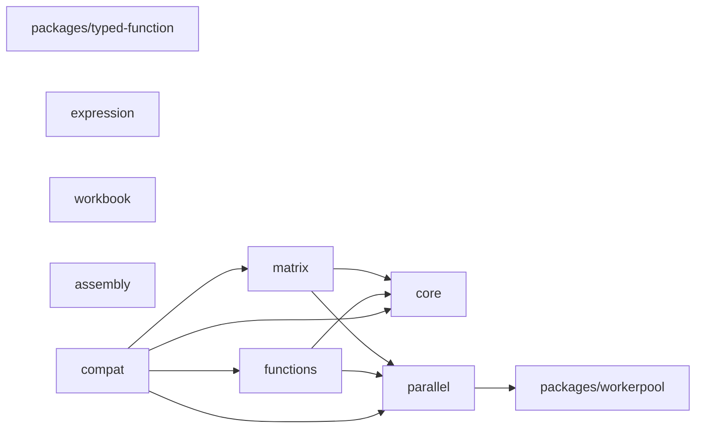

# mathts - Dependency Graph

**Version**: 0.1.0 | **Last Updated**: 2026-02-06

This document provides a comprehensive dependency graph of all files, components, imports, functions, and variables in the codebase.

---

## Table of Contents

1. [Overview](#overview)
2. [Package Dependencies](#package-dependencies)
3. [Packages/typed function Dependencies](#packages-typed-function-dependencies)
4. [Packages/workerpool Dependencies](#packages-workerpool-dependencies)
5. [Core/factory Dependencies](#core-factory-dependencies)
6. [Core Dependencies](#core-dependencies)
7. [Core/typed Dependencies](#core-typed-dependencies)
8. [Core/types Dependencies](#core-types-dependencies)
9. [Matrix/backends Dependencies](#matrix-backends-dependencies)
10. [Matrix Dependencies](#matrix-dependencies)
11. [Matrix/types Dependencies](#matrix-types-dependencies)
12. [Functions Dependencies](#functions-dependencies)
13. [Functions/typed Dependencies](#functions-typed-dependencies)
14. [Expression Dependencies](#expression-dependencies)
15. [Expression/node Dependencies](#expression-node-dependencies)
16. [Parallel Dependencies](#parallel-dependencies)
17. [Parallel/operations Dependencies](#parallel-operations-dependencies)
18. [Parallel/strategies Dependencies](#parallel-strategies-dependencies)
19. [Workbook Dependencies](#workbook-dependencies)
20. [Assembly Dependencies](#assembly-dependencies)
21. [Assembly/ops Dependencies](#assembly-ops-dependencies)
22. [Assembly/types Dependencies](#assembly-types-dependencies)
23. [Compat Dependencies](#compat-dependencies)
24. [Dependency Matrix](#dependency-matrix)
25. [Circular Dependency Analysis](#circular-dependency-analysis)
26. [Visual Dependency Graph](#visual-dependency-graph)
27. [Summary Statistics](#summary-statistics)

---

## Overview

The codebase is organized into the following modules:

- **packages/typed-function**: 1 file
- **packages/workerpool**: 1 file
- **core/factory**: 2 files
- **core**: 1 file
- **core/typed**: 2 files
- **core/types**: 4 files
- **matrix/backends**: 18 files
- **matrix**: 4 files
- **matrix/types**: 4 files
- **functions**: 1 file
- **functions/typed**: 5 files
- **expression**: 7 files
- **expression/node**: 1 file
- **parallel**: 2 files
- **parallel/operations**: 5 files
- **parallel/strategies**: 3 files
- **workbook**: 5 files
- **assembly**: 1 file
- **assembly/ops**: 5 files
- **assembly/types**: 1 file
- **compat**: 2 files

---

## Package Dependencies

| Package | Depends On | Files (Active) | Files (Dormant) |
|---------|------------|----------------|-----------------|
| `@mathts/typed-function` (`packages/typed-function/`) | (none) | 1 | 1 |
| `@mathts/workerpool` (`packages/workerpool/`) | (none) | 1 | 2 |
| `@mathts/core` (`core/`) | (none) | 9 | 85 |
| `@mathts/matrix` (`matrix/`) | `@mathts/parallel`, `@mathts/core` | 26 | 7 |
| `@mathts/functions` (`functions/`) | `@mathts/core`, `@mathts/parallel` | 6 | 733 |
| `@mathts/expression` (`expression/`) | (none) | 8 | 306 |
| `@mathts/parallel` (`parallel/`) | `@mathts/workerpool` | 10 | 4 |
| `@mathts/workbook` (`workbook/`) | (none) | 5 | 1 |
| `@mathts/wasm` (`assembly/`) | (none) | 7 | 3 |
| `@mathts/compat` (`compat/`) | `@mathts/core`, `@mathts/matrix`, `@mathts/parallel`, `@mathts/functions` | 2 | 1 |

### Package Dependency Diagram

---

## Packages/typed function Dependencies

### `packages/typed-function/src/index.ts` - Utility helpers for typed-function integration in MathTS.

**Internal Dependencies:**
| File | Imports | Type |
|------|---------|------|
| `typed-function` | `default, create` | Re-export |

**Exports:**
- Classes: `NoMatchingSignatureError`, `TypeConversionError`
- Interfaces: `TypeDef`, `ConversionDef`
- Types: `SignatureMap`, `TypeTest`, `TypeConverter`
- Functions: `parseSignature`, `buildSignature`
- Constants: `isNumber`, `isBoolean`, `isString`, `isBigInt`, `isArray`, `isFunction`, `isObject`, `isNull`, `isUndefined`, `isNullOrUndefined`, `isFiniteNumber`, `isInteger`, `isPositiveInteger`, `isNonNegativeInteger`, `isNaN`, `isTypedArray`, `isFloat64Array`, `isFloat32Array`, `isInt32Array`, `isUint32Array`, `isArrayBuffer`
- Re-exports: `default`, `create`

---

## Packages/workerpool Dependencies

### `packages/workerpool/src/index.ts` - Worker pool management for MathTS parallel computations.

**External Dependencies:**
| Package | Import |
|---------|--------|
| `workerpool` | `pool, Pool, Transfer, PoolOptions, ExecOptions, PoolStats` |

**Exports:**
- Classes: `MathWorkerPool`
- Interfaces: `WasmFeatureStatus`, `WorkerPoolConfig`, `ParallelResult`, `TaskOptions`
- Functions: `canUseWasm`, `canUseSharedMemory`, `transferFloat64`, `transferArrayBuffer`, `initWorkerWasm`, `isWorkerWasmAvailable`, `getWasmFeatures`, `initializePool`, `terminatePool`, `getPoolStats`
- Constants: `DEFAULT_WORKER_CONFIG`, `mathWorkerPool`

---

## Core/factory Dependencies

### `core/src/factory/factory.ts` - MathTS Function Factory

**Internal Dependencies:**
| File | Imports | Type |
|------|---------|------|
| `../typed/mathts-typed.js` | `TypedFunction, TypedInstance, SignatureFunction, ReferTo, ReferToSelf` | Import (type-only) |
| `../typed/mathts-typed.js` | `mathTyped` | Import |

**Exports:**
- Classes: `FunctionRegistry`
- Interfaces: `MathTSConfig`, `FactoryFunction`, `FactoryDependencies`
- Types: `FactoryImport`
- Functions: `createFactory`, `createTypedFunction`
- Constants: `DEFAULT_CONFIG`, `registry`, `math`

---

### `core/src/factory/index.ts` - Factory pattern exports

**Internal Dependencies:**
| File | Imports | Type |
|------|---------|------|
| `./factory.js` | `FunctionRegistry, createFactory, createTypedFunction, registry, math, DEFAULT_CONFIG` | Re-export |

**Exports:**
- Re-exports: `FunctionRegistry`, `createFactory`, `createTypedFunction`, `registry`, `math`, `DEFAULT_CONFIG`

---

## Core Dependencies

### `core/src/index.ts` - Core types and utilities for MathTS

**Internal Dependencies:**
| File | Imports | Type |
|------|---------|------|
| `./types/complex.js` | `Complex, isComplex, I, COMPLEX_ZERO, COMPLEX_ONE, COMPLEX_NEG_ONE` | Re-export |
| `./types/fraction.js` | `Fraction, isFraction, FRACTION_ZERO, FRACTION_ONE, FRACTION_NEG_ONE, FRACTION_HALF, FRACTION_THIRD, FRACTION_QUARTER` | Re-export |
| `./types/bignumber.js` | `BigNumber, isBigNumber, BIGNUMBER_ZERO, BIGNUMBER_ONE, BIGNUMBER_NEG_ONE, BIGNUMBER_TEN, BIGNUMBER_PI, BIGNUMBER_E, BIGNUMBER_LN2, BIGNUMBER_LN10` | Re-export |
| `./typed/index.js` | `mathTyped, createMathTSTyped, typed, create, createTypedFunction, TypeRegistry, MATHTS_TYPES, MATHTS_CONVERSIONS, isNumber, isBoolean, isString, isBigInt, isArray, isFunction, isObject, isNull, isUndefined, isMatrix, isDenseMatrix, isSparseMatrix, isUnit, initTypedWasm, isTypedWasmAvailable` | Re-export |
| `./factory/index.js` | `FunctionRegistry, createFactory, registry, math, DEFAULT_CONFIG` | Re-export |

**Exports:**
- Constants: `VERSION`
- Re-exports: `Complex`, `isComplex`, `I`, `COMPLEX_ZERO`, `COMPLEX_ONE`, `COMPLEX_NEG_ONE`, `Fraction`, `isFraction`, `FRACTION_ZERO`, `FRACTION_ONE`, `FRACTION_NEG_ONE`, `FRACTION_HALF`, `FRACTION_THIRD`, `FRACTION_QUARTER`, `BigNumber`, `isBigNumber`, `BIGNUMBER_ZERO`, `BIGNUMBER_ONE`, `BIGNUMBER_NEG_ONE`, `BIGNUMBER_TEN`, `BIGNUMBER_PI`, `BIGNUMBER_E`, `BIGNUMBER_LN2`, `BIGNUMBER_LN10`, `mathTyped`, `createMathTSTyped`, `typed`, `create`, `createTypedFunction`, `TypeRegistry`, `MATHTS_TYPES`, `MATHTS_CONVERSIONS`, `isNumber`, `isBoolean`, `isString`, `isBigInt`, `isArray`, `isFunction`, `isObject`, `isNull`, `isUndefined`, `isMatrix`, `isDenseMatrix`, `isSparseMatrix`, `isUnit`, `initTypedWasm`, `isTypedWasmAvailable`, `FunctionRegistry`, `createFactory`, `registry`, `math`, `DEFAULT_CONFIG`

---

## Core/typed Dependencies

### `core/src/typed/index.ts` - typed-function integration exports

**Internal Dependencies:**
| File | Imports | Type |
|------|---------|------|
| `./mathts-typed.js` | `mathTyped, createMathTSTyped, typed, create, createTypedFunction, TypeRegistry, MATHTS_TYPES, MATHTS_CONVERSIONS, isNumber, isBoolean, isString, isBigInt, isArray, isFunction, isObject, isNull, isUndefined, isComplex, isFraction, isBigNumber, isFloat64Array, isFloat32Array, isInt32Array, isUint32Array, isUint8Array, isMatrix, isDenseMatrix, isSparseMatrix, isUnit, initTypedWasm, isTypedWasmAvailable` | Re-export |

**Exports:**
- Re-exports: `mathTyped`, `createMathTSTyped`, `typed`, `create`, `createTypedFunction`, `TypeRegistry`, `MATHTS_TYPES`, `MATHTS_CONVERSIONS`, `isNumber`, `isBoolean`, `isString`, `isBigInt`, `isArray`, `isFunction`, `isObject`, `isNull`, `isUndefined`, `isComplex`, `isFraction`, `isBigNumber`, `isFloat64Array`, `isFloat32Array`, `isInt32Array`, `isUint32Array`, `isUint8Array`, `isMatrix`, `isDenseMatrix`, `isSparseMatrix`, `isUnit`, `initTypedWasm`, `isTypedWasmAvailable`

---

### `core/src/typed/mathts-typed.ts` - MathTS typed-function Integration

**External Dependencies:**
| Package | Import |
|---------|--------|
| `typed-function` | `create, typed` |
| `typed-function` | `TypedFunction, TypedInstance, SignatureFunction, ReferTo, ReferToSelf` |

**Internal Dependencies:**
| File | Imports | Type |
|------|---------|------|
| `../types/complex.js` | `Complex, isComplex` | Import |
| `../types/fraction.js` | `Fraction, isFraction` | Import |
| `../types/bignumber.js` | `BigNumber, isBigNumber` | Import |

**Exports:**
- Classes: `TypeRegistry`
- Interfaces: `TypeDef`, `ConversionDef`, `MathTSTypeDef`
- Functions: `initTypedWasm`, `isTypedWasmAvailable`, `createMathTSTyped`, `createTypedFunction`
- Constants: `isNumber`, `isBoolean`, `isString`, `isBigInt`, `isArray`, `isFunction`, `isObject`, `isNull`, `isUndefined`, `isFloat64Array`, `isFloat32Array`, `isInt32Array`, `isUint32Array`, `isUint8Array`, `isComplex`, `isFraction`, `isBigNumber`, `isMatrix`, `isDenseMatrix`, `isSparseMatrix`, `isUnit`, `MATHTS_TYPES`, `MATHTS_CONVERSIONS`, `mathTyped`

---

## Core/types Dependencies

### `core/src/types/bignumber.ts` - BigNumber (arbitrary precision decimal) implementation

**Internal Dependencies:**
| File | Imports | Type |
|------|---------|------|
| `./interfaces` | `Scalar, MathTSValue` | Import (type-only) |

**Exports:**
- Classes: `BigNumber`
- Interfaces: `BigNumberConfig`
- Types: `RoundingMode`
- Functions: `isBigNumber`
- Constants: `BIGNUMBER_ZERO`, `BIGNUMBER_ONE`, `BIGNUMBER_NEG_ONE`, `BIGNUMBER_TEN`, `BIGNUMBER_PI`, `BIGNUMBER_E`, `BIGNUMBER_LN2`, `BIGNUMBER_LN10`

---

### `core/src/types/complex.ts` - Complex number implementation

**Internal Dependencies:**
| File | Imports | Type |
|------|---------|------|
| `./interfaces` | `Scalar, IComplex` | Import (type-only) |

**Exports:**
- Classes: `Complex`
- Functions: `isComplex`
- Constants: `I`, `COMPLEX_ZERO`, `COMPLEX_ONE`, `COMPLEX_NEG_ONE`

---

### `core/src/types/fraction.ts` - Fraction (rational number) implementation

**Internal Dependencies:**
| File | Imports | Type |
|------|---------|------|
| `./interfaces` | `Scalar, IFraction` | Import (type-only) |

**Exports:**
- Classes: `Fraction`
- Functions: `isFraction`
- Constants: `FRACTION_ZERO`, `FRACTION_ONE`, `FRACTION_NEG_ONE`, `FRACTION_HALF`, `FRACTION_THIRD`, `FRACTION_QUARTER`

---

### `core/src/types/interfaces.ts` - Base interfaces for MathTS types

**Exports:**
- Interfaces: `MathTSValue`, `Scalar`, `MatrixBackend`, `IMatrix`, `IComplex`, `IFraction`, `IBigNumber`, `MatrixDimensions`
- Types: `BackendType`, `NumericType`

---

## Matrix/backends Dependencies

### `matrix/src/backends/Backend.ts` - Matrix Backend Interface

**Internal Dependencies:**
| File | Imports | Type |
|------|---------|------|
| `../types/DenseMatrix.js` | `DenseMatrix` | Import |

**Exports:**
- Classes: `BackendRegistry`
- Interfaces: `BackendHints`, `MatrixBackend`
- Types: `BackendType`
- Constants: `DEFAULT_BACKEND_HINTS`, `backendRegistry`

---

### `matrix/src/backends/BackendManager.ts` - Backend Manager

**Internal Dependencies:**
| File | Imports | Type |
|------|---------|------|
| `../types/DenseMatrix.js` | `DenseMatrix` | Import |
| `./Backend.js` | `MatrixBackend, BackendType, BackendHints` | Import (type-only) |
| `./Backend.js` | `backendRegistry, DEFAULT_BACKEND_HINTS` | Import |
| `./JSBackend.js` | `jsBackend` | Import |
| `../config.js` | `getConfig, onConfigChange, MatrixConfig` | Import |

**Exports:**
- Classes: `BackendManager`
- Interfaces: `ExtendedBackendHints`
- Types: `OperationType`
- Functions: `createBackendManager`
- Constants: `DEFAULT_EXTENDED_HINTS`, `backendManager`

---

### `matrix/src/backends/gpu/BatchExecutor.ts` - GPU Batch Executor

**Internal Dependencies:**
| File | Imports | Type |
|------|---------|------|
| `./GPUContext.js` | `GPUContext` | Import (type-only) |
| `./ShaderManager.js` | `ShaderManager` | Import (type-only) |
| `./BufferPool.js` | `BufferPool` | Import (type-only) |

**Exports:**
- Classes: `BatchExecutor`
- Interfaces: `BatchOperation`, `BatchResult`, `BatchOptions`
- Types: `BatchOperationType`

---

### `matrix/src/backends/gpu/BufferPool.ts` - GPU Buffer Pool

**Internal Dependencies:**
| File | Imports | Type |
|------|---------|------|
| `./GPUContext.js` | `GPUContext` | Import |

**Exports:**
- Classes: `BufferPool`
- Interfaces: `BufferPoolOptions`

---

### `matrix/src/backends/gpu/detect.ts` - WebGPU Detection and Capability Checking

**Exports:**
- Interfaces: `GPUAdapterInfo`, `GPUCapabilities`
- Functions: `hasWebGPU`, `isBrowser`, `getGPUAdapter`, `detectGPUCapabilities`, `isGPUSuitableForMatrixOps`, `getRecommendedWorkgroupSize`, `getMaxMatrixSize`

---

### `matrix/src/backends/gpu/GPUContext.ts` - WebGPU Context Management

**Internal Dependencies:**
| File | Imports | Type |
|------|---------|------|
| `./detect.js` | `hasWebGPU, getGPUAdapter, detectGPUCapabilities, GPUCapabilities` | Import |

**Exports:**
- Classes: `GPUContext`
- Interfaces: `GPUContextOptions`, `DeviceLostEvent`
- Types: `GPUContextStatus`
- Functions: `getGlobalGPUContext`, `initializeGlobalGPU`, `destroyGlobalGPU`

---

### `matrix/src/backends/gpu/index.ts` - GPU Backend Exports

**Internal Dependencies:**
| File | Imports | Type |
|------|---------|------|
| `./detect.js` | `hasWebGPU, isBrowser, getGPUAdapter, detectGPUCapabilities, isGPUSuitableForMatrixOps, getRecommendedWorkgroupSize, getMaxMatrixSize, GPUAdapterInfo, GPUCapabilities` | Re-export |
| `./GPUContext.js` | `GPUContext, getGlobalGPUContext, initializeGlobalGPU, destroyGlobalGPU, GPUContextOptions, GPUContextStatus, DeviceLostEvent` | Re-export |
| `./BufferPool.js` | `BufferPool, BufferPoolOptions` | Re-export |
| `./ShaderManager.js` | `ShaderManager, BUILTIN_SHADERS, ShaderSource, PipelineConfig` | Re-export |
| `./BatchExecutor.js` | `BatchExecutor, BatchOperation, BatchOperationType, BatchResult, BatchOptions` | Re-export |
| `./Sync.js` | `SyncManager, createSyncManager, SyncStrategy, TransferDirection, TransferRequest, TransferResult, SyncConfig` | Re-export |

**Exports:**
- Re-exports: `hasWebGPU`, `isBrowser`, `getGPUAdapter`, `detectGPUCapabilities`, `isGPUSuitableForMatrixOps`, `getRecommendedWorkgroupSize`, `getMaxMatrixSize`, `GPUAdapterInfo`, `GPUCapabilities`, `GPUContext`, `getGlobalGPUContext`, `initializeGlobalGPU`, `destroyGlobalGPU`, `GPUContextOptions`, `GPUContextStatus`, `DeviceLostEvent`, `BufferPool`, `BufferPoolOptions`, `ShaderManager`, `BUILTIN_SHADERS`, `ShaderSource`, `PipelineConfig`, `BatchExecutor`, `BatchOperation`, `BatchOperationType`, `BatchResult`, `BatchOptions`, `SyncManager`, `createSyncManager`, `SyncStrategy`, `TransferDirection`, `TransferRequest`, `TransferResult`, `SyncConfig`

---

### `matrix/src/backends/gpu/ShaderManager.ts` - GPU Shader Manager

**Internal Dependencies:**
| File | Imports | Type |
|------|---------|------|
| `./GPUContext.js` | `GPUContext` | Import |

**Exports:**
- Classes: `ShaderManager`
- Interfaces: `ShaderSource`, `PipelineConfig`
- Constants: `BUILTIN_SHADERS`

---

### `matrix/src/backends/gpu/Sync.ts` - GPU-CPU Synchronization Strategy

**Internal Dependencies:**
| File | Imports | Type |
|------|---------|------|
| `./GPUContext.js` | `GPUContext` | Import (type-only) |
| `./BufferPool.js` | `BufferPool` | Import (type-only) |

**Exports:**
- Classes: `SyncManager`
- Interfaces: `TransferRequest`, `TransferResult`, `SyncConfig`
- Types: `SyncStrategy`, `TransferDirection`
- Functions: `createSyncManager`

---

### `matrix/src/backends/GPUBackend.ts` - GPU Backend for Matrix Operations

**Internal Dependencies:**
| File | Imports | Type |
|------|---------|------|
| `./gpu/index.js` | `GPUContext, GPUContextOptions, getGlobalGPUContext, BufferPool, ShaderManager, hasWebGPU, detectGPUCapabilities, getRecommendedWorkgroupSize, GPUCapabilities` | Import |

**Exports:**
- Classes: `GPUBackend`
- Interfaces: `GPUBackendOptions`
- Types: `GPUBackendStatus`
- Functions: `getGlobalGPUBackend`, `initializeGlobalGPUBackend`, `destroyGlobalGPUBackend`

---

### `matrix/src/backends/GPUMatrixBackend.ts` - GPU Matrix Backend Adapter

**Internal Dependencies:**
| File | Imports | Type |
|------|---------|------|
| `./Backend.js` | `MatrixBackend, BackendType` | Import (type-only) |
| `../types/DenseMatrix.js` | `DenseMatrix` | Import |
| `./JSBackend.js` | `jsBackend` | Import |
| `./GPUBackend.js` | `GPUBackend, getGlobalGPUBackend, initializeGlobalGPUBackend, GPUBackendOptions` | Import |
| `./gpu/index.js` | `hasWebGPU, detectGPUCapabilities, GPUCapabilities` | Import |

**Exports:**
- Classes: `GPUMatrixBackend`
- Interfaces: `GPUMatrixBackendConfig`
- Functions: `createGPUMatrixBackend`
- Constants: `gpuMatrixBackend`

---

### `matrix/src/backends/index.ts` - Matrix Backend Exports

**Internal Dependencies:**
| File | Imports | Type |
|------|---------|------|
| `./Backend.js` | `backendRegistry` | Import |
| `./JSBackend.js` | `jsBackend` | Import |
| `./Backend.js` | `BackendRegistry, backendRegistry, DEFAULT_BACKEND_HINTS` | Re-export |
| `./JSBackend.js` | `JSBackend, jsBackend` | Re-export |
| `./ParallelBackend.js` | `ParallelBackend, parallelBackend, createParallelBackend, ParallelBackendConfig` | Re-export |
| `./WASMBackend.js` | `WASMBackend, wasmBackend, createWASMBackend, WASMBackendConfig` | Re-export |
| `./GPUMatrixBackend.js` | `GPUMatrixBackend, gpuMatrixBackend, createGPUMatrixBackend, GPUMatrixBackendConfig` | Re-export |
| `./GPUBackend.js` | `GPUBackend, getGlobalGPUBackend, initializeGlobalGPUBackend, destroyGlobalGPUBackend, GPUBackendOptions, GPUBackendStatus` | Re-export |
| `./BackendManager.js` | `BackendManager, backendManager, createBackendManager, DEFAULT_EXTENDED_HINTS, ExtendedBackendHints, OperationType` | Re-export |
| `./wasm/index.js` | `detectWasmFeatures, isWasmAvailable, isSharedMemoryAvailable, isAtomicsAvailable, clearFeatureCache, getCachedFeatures` | Re-export |
| `./gpu/index.js` | `hasWebGPU, detectGPUCapabilities, getRecommendedWorkgroupSize, GPUContext, getGlobalGPUContext, destroyGlobalGPU, BufferPool, ShaderManager, BUILTIN_SHADERS, BatchExecutor, SyncManager, createSyncManager` | Re-export |

**Exports:**
- Re-exports: `BackendRegistry`, `backendRegistry`, `DEFAULT_BACKEND_HINTS`, `JSBackend`, `jsBackend`, `ParallelBackend`, `parallelBackend`, `createParallelBackend`, `ParallelBackendConfig`, `WASMBackend`, `wasmBackend`, `createWASMBackend`, `WASMBackendConfig`, `GPUMatrixBackend`, `gpuMatrixBackend`, `createGPUMatrixBackend`, `GPUMatrixBackendConfig`, `GPUBackend`, `getGlobalGPUBackend`, `initializeGlobalGPUBackend`, `destroyGlobalGPUBackend`, `GPUBackendOptions`, `GPUBackendStatus`, `BackendManager`, `backendManager`, `createBackendManager`, `DEFAULT_EXTENDED_HINTS`, `ExtendedBackendHints`, `OperationType`, `detectWasmFeatures`, `isWasmAvailable`, `isSharedMemoryAvailable`, `isAtomicsAvailable`, `clearFeatureCache`, `getCachedFeatures`, `hasWebGPU`, `detectGPUCapabilities`, `getRecommendedWorkgroupSize`, `GPUContext`, `getGlobalGPUContext`, `destroyGlobalGPU`, `BufferPool`, `ShaderManager`, `BUILTIN_SHADERS`, `BatchExecutor`, `SyncManager`, `createSyncManager`

---

### `matrix/src/backends/JSBackend.ts` - Pure TypeScript Matrix Backend

**Internal Dependencies:**
| File | Imports | Type |
|------|---------|------|
| `../types/DenseMatrix.js` | `DenseMatrix` | Import |
| `./Backend.js` | `MatrixBackend, BackendType` | Import (type-only) |

**Exports:**
- Classes: `JSBackend`
- Constants: `jsBackend`

---

### `matrix/src/backends/ParallelBackend.ts` - Parallel Matrix Backend

**Internal Dependencies:**
| File | Imports | Type |
|------|---------|------|
| `../types/DenseMatrix.js` | `DenseMatrix` | Import |
| `./Backend.js` | `BackendType` | Import (type-only) |

**Exports:**
- Classes: `ParallelBackend`
- Interfaces: `ParallelBackendConfig`
- Functions: `createParallelBackend`
- Constants: `parallelBackend`

---

### `matrix/src/backends/wasm/detect.ts` - WASM Feature Detection

**Exports:**
- Interfaces: `WasmFeatures`
- Functions: `detectWasmFeatures`, `isWasmAvailable`, `isSharedMemoryAvailable`, `isAtomicsAvailable`, `clearFeatureCache`, `getCachedFeatures`

---

### `matrix/src/backends/wasm/index.ts` - WASM Utilities Index

**Internal Dependencies:**
| File | Imports | Type |
|------|---------|------|
| `./detect.js` | `detectWasmFeatures, isWasmAvailable, isSharedMemoryAvailable, isAtomicsAvailable, clearFeatureCache, getCachedFeatures` | Re-export |

**Exports:**
- Re-exports: `detectWasmFeatures`, `isWasmAvailable`, `isSharedMemoryAvailable`, `isAtomicsAvailable`, `clearFeatureCache`, `getCachedFeatures`

---

### `matrix/src/backends/WASMBackend.ts` - WASM Matrix Backend

**Internal Dependencies:**
| File | Imports | Type |
|------|---------|------|
| `./Backend.js` | `MatrixBackend, BackendType` | Import (type-only) |
| `../types/DenseMatrix.js` | `DenseMatrix` | Import |
| `./JSBackend.js` | `jsBackend` | Import |
| `./WasmLoader.js` | `wasmLoader, WasmModule` | Import |
| `./wasm/detect.js` | `detectWasmFeatures, WasmFeatures` | Import |

**Exports:**
- Classes: `WASMBackend`
- Interfaces: `WASMBackendConfig`
- Functions: `createWASMBackend`
- Constants: `wasmBackend`

---

### `matrix/src/backends/WasmLoader.ts` - WASM Loader - Loads and manages WebAssembly modules

**Exports:**
- Classes: `WasmLoader`
- Interfaces: `WasmModule`
- Functions: `initWasm`
- Constants: `wasmLoader`

---

## Matrix Dependencies

### `matrix/src/config.ts` - MathTS Matrix Configuration

**Internal Dependencies:**
| File | Imports | Type |
|------|---------|------|
| `./backends/Backend.js` | `BackendType` | Import (type-only) |
| `./backends/BackendManager.js` | `OperationType` | Import (type-only) |

**Exports:**
- Interfaces: `BackendConfig`, `AdaptiveTuningConfig`, `ProfilingConfig`, `MatrixConfig`
- Types: `BackendPreference`
- Functions: `getConfig`, `setConfig`, `resetConfig`, `onConfigChange`, `setBackendPreference`, `setBackendThreshold`, `setBackendEnabled`, `getRecommendedBackend`, `forceBackend`, `enableProfiling`, `disableProfiling`, `enableAdaptiveTuning`, `disableAdaptiveTuning`, `configureAdaptiveTuning`
- Constants: `DEFAULT_CONFIG`

---

### `matrix/src/index.ts` - Matrix operations for MathTS with pluggable backends

**Internal Dependencies:**
| File | Imports | Type |
|------|---------|------|
| `./types/index.js` | `*` | Re-export |
| `./backends/index.js` | `*` | Re-export |
| `./typed-operations.js` | `*` | Re-export |
| `./parallel-matrix.js` | `*` | Re-export |

**Exports:**
- Re-exports: `* from ./types/index.js`, `* from ./backends/index.js`, `* from ./typed-operations.js`, `* from ./parallel-matrix.js`

---

### `matrix/src/parallel-matrix.ts` - Parallel-First Matrix Operations

**Internal Dependencies:**
| File | Imports | Type |
|------|---------|------|
| `./types/DenseMatrix.js` | `DenseMatrix` | Import |

**Exports:**
- Functions: `initializeParallelMatrix`, `terminateParallelMatrix`
- Constants: `parallelMatrix`, `parallelIdentity`, `parallelZeros`, `parallelOnes`, `parallelDiag`, `parallelRandom`, `parallelMatrixAdd`, `parallelMatrixSubtract`, `parallelMatrixMultiply`, `parallelDotMultiply`, `parallelMatrixDivide`, `parallelUnaryMinus`, `parallelMatrixTranspose`, `parallelMatrixSum`, `parallelMatrixMean`, `parallelMatrixMin`, `parallelMatrixMax`, `parallelMatrixVariance`, `parallelMatrixStd`, `parallelMatrixNorm`, `parallelMatrixDot`, `parallelMatrixTrace`, `parallelMatrixDistance`, `parallelMatrixAbs`, `parallelMatrixSqrt`, `parallelMatrixSquare`, `parallelMatrixExp`, `parallelMatrixLog`, `parallelMatrixSin`, `parallelMatrixCos`, `parallelMatrixTan`, `parallelMatrixSize`, `parallelMatrixSubset`, `parallelMatrixRow`, `parallelMatrixColumn`, `parallelMatrixDiagonal`, `parallelMatrixMatvec`, `parallelMatrixOuter`, `parallelMatrixHistogram`, `parallelMatrixOperations`

---

### `matrix/src/typed-operations.ts` - Typed Matrix Operations

**Internal Dependencies:**
| File | Imports | Type |
|------|---------|------|
| `./types/DenseMatrix.js` | `DenseMatrix` | Import |

**Exports:**
- Constants: `matrix`, `identity`, `zeros`, `ones`, `diag`, `random`, `add`, `subtract`, `multiply`, `dotMultiply`, `divide`, `unaryMinus`, `transpose`, `sum`, `mean`, `min`, `max`, `norm`, `trace`, `abs`, `sqrt`, `square`, `exp`, `log`, `pow`, `size`, `subset`, `row`, `column`, `diagonal`, `typedMatrixOperations`

---

## Matrix/types Dependencies

### `matrix/src/types/DenseMatrix.ts` - Dense Matrix Implementation

**Internal Dependencies:**
| File | Imports | Type |
|------|---------|------|
| `./Matrix.js` | `Matrix, MatrixEntry, SliceSpec` | Import |
| `./SparseMatrix.js` | `SparseMatrix` | Import (type-only) |

**Exports:**
- Classes: `DenseMatrix`
- Functions: `isDenseMatrix`

---

### `matrix/src/types/index.ts` - Matrix Type Exports

**Internal Dependencies:**
| File | Imports | Type |
|------|---------|------|
| `./Matrix.js` | `Matrix, isMatrix` | Re-export |
| `./DenseMatrix.js` | `DenseMatrix, isDenseMatrix` | Re-export |
| `./SparseMatrix.js` | `SparseMatrix, isSparseMatrix` | Re-export |

**Exports:**
- Re-exports: `Matrix`, `isMatrix`, `DenseMatrix`, `isDenseMatrix`, `SparseMatrix`, `isSparseMatrix`

---

### `matrix/src/types/Matrix.ts` - Matrix Base Class

**Exports:**
- Interfaces: `MatrixDimensions`, `MatrixIndex`, `SliceSpec`, `MatrixEntry`
- Types: `MatrixType`
- Functions: `isMatrix`

---

### `matrix/src/types/SparseMatrix.ts` - Sparse Matrix Implementation (CSR Format)

**Internal Dependencies:**
| File | Imports | Type |
|------|---------|------|
| `./Matrix.js` | `Matrix, MatrixEntry, SliceSpec` | Import |
| `./DenseMatrix.js` | `DenseMatrix` | Import |

**Exports:**
- Classes: `SparseMatrix`
- Functions: `isSparseMatrix`

---

## Functions Dependencies

### `functions/src/index.ts` - Mathematical functions for MathTS - arithmetic, algebra,

**Internal Dependencies:**
| File | Imports | Type |
|------|---------|------|
| `./typed/index.js` | `*` | Re-export |

**Exports:**
- Re-exports: `* from ./typed/index.js`

---

## Functions/typed Dependencies

### `functions/src/typed/arithmetic.ts` - Typed Arithmetic Functions (Parallel-First)

**Exports:**
- Functions: `matmul`, `transpose`, `matvec`, `outer`, `initializePool`, `terminatePool`, `shouldParallelize`, `getComputePool`
- Constants: `add`, `subtract`, `multiply`, `divide`, `unaryMinus`, `unaryPlus`, `abs`, `sign`, `pow`, `sqrt`, `square`, `cube`, `cbrt`, `nthRoot`, `exp`, `log`, `log10`, `log2`, `log1p`, `expm1`, `round`, `floor`, `ceil`, `fix`, `mod`, `gcd`, `lcm`, `xgcd`, `norm`, `sinh`, `cosh`, `tanh`, `equal`, `smaller`, `larger`, `smallerEq`, `largerEq`, `compare`, `min`, `max`, `sum`, `mean`, `variance`, `std`, `dot`, `typedArithmetic`

---

### `functions/src/typed/index.ts` - Typed Functions Index (Parallel-First)

**Internal Dependencies:**
| File | Imports | Type |
|------|---------|------|
| `./arithmetic.js` | `typedArithmetic` | Import |
| `./trigonometry.js` | `typedTrigonometry` | Import |
| `./statistics.js` | `typedStatistics` | Import |
| `./signal.js` | `typedSignal` | Import |
| `./arithmetic.js` | `*` | Re-export |
| `./trigonometry.js` | `*` | Re-export |
| `./statistics.js` | `*` | Re-export |
| `./signal.js` | `*` | Re-export |
| `./arithmetic.js` | `typedArithmetic` | Re-export |
| `./trigonometry.js` | `typedTrigonometry` | Re-export |
| `./statistics.js` | `typedStatistics` | Re-export |
| `./signal.js` | `typedSignal` | Re-export |

**Exports:**
- Constants: `typedFunctions`
- Re-exports: `* from ./arithmetic.js`, `* from ./trigonometry.js`, `* from ./statistics.js`, `* from ./signal.js`, `typedArithmetic`, `typedTrigonometry`, `typedStatistics`, `typedSignal`

---

### `functions/src/typed/signal.ts` - Typed Signal Processing Functions (Parallel-First)

**Exports:**
- Functions: `initializeSignal`, `terminateSignal`
- Constants: `parallelFFT`, `parallelIFFT`, `parallelFFTMagnitude`, `parallelFFTPower`, `parallelConv`, `parallelXCorr`, `parallelAutoCorr`, `typedSignal`

---

### `functions/src/typed/statistics.ts` - Typed Statistics Functions (Parallel-First)

**Exports:**
- Types: `NormalizationType`
- Functions: `initializeStatistics`, `terminateStatistics`
- Constants: `parallelStatSum`, `parallelStatMean`, `parallelStatVariance`, `parallelStatStd`, `parallelStatMin`, `parallelStatMax`, `parallelStatMinMax`, `parallelStatMedian`, `parallelStatMode`, `parallelStatProd`, `parallelStatNorm`, `parallelStatDistance`, `parallelStatCorr`, `parallelStatMAD`, `parallelStatCumsum`, `parallelStatQuantile`, `parallelStatHistogram`, `typedStatistics`

---

### `functions/src/typed/trigonometry.ts` - Typed Trigonometric Functions (Parallel-First)

**Exports:**
- Constants: `sin`, `cos`, `tan`, `csc`, `sec`, `cot`, `asin`, `acos`, `atan`, `atan2`, `acsc`, `asec`, `acot`, `asinh`, `acosh`, `atanh`, `toRadians`, `toDegrees`, `hypot`, `typedTrigonometry`

---

## Expression Dependencies

### `expression/src/Help.ts` - Documentation object

**Internal Dependencies:**
| File | Imports | Type |
|------|---------|------|
| `../utils/is.js` | `isHelp` | Import |
| `../utils/object.js` | `clone` | Import |
| `../utils/string.js` | `format` | Import |
| `../utils/factory.js` | `factory` | Import |

**Exports:**
- Constants: `createHelpClass`

---

### `expression/src/index.ts` - Expression parsing and evaluation for MathTS.

**Internal Dependencies:**
| File | Imports | Type |
|------|---------|------|
| `./types.js` | `*` | Re-export |
| `./keywords.js` | `*` | Re-export |
| `./operators.js` | `*` | Re-export |
| `./parse.js` | `*` | Re-export |
| `./Parser.js` | `*` | Re-export |
| `./Help.js` | `*` | Re-export |

**Exports:**
- Re-exports: `* from ./types.js`, `* from ./keywords.js`, `* from ./operators.js`, `* from ./parse.js`, `* from ./Parser.js`, `* from ./Help.js`

---

### `expression/src/keywords.ts` - Reserved keywords not allowed to use in the parser

**Exports:**
- Constants: `keywords`

---

### `expression/src/operators.ts` - Returns the first non-parenthesis internal node, but only

**Internal Dependencies:**
| File | Imports | Type |
|------|---------|------|
| `../utils/object.js` | `hasOwnProperty` | Import |
| `../utils/is.js` | `isConstantNode, isParenthesisNode, rule2Node` | Import |

**Exports:**
- Functions: `getPrecedence`, `getAssociativity`, `isAssociativeWith`, `getOperator`
- Constants: `properties`

---

### `expression/src/parse.ts` - Parse an expression. Returns a node tree, which can be evaluated by

**Internal Dependencies:**
| File | Imports | Type |
|------|---------|------|
| `../utils/factory.js` | `factory` | Import |
| `../utils/is.js` | `isAccessorNode, isConstantNode, isFunctionNode, isOperatorNode, isSymbolNode, rule2Node` | Import |
| `../utils/collection.js` | `deepMap` | Import |
| `../utils/number.js` | `safeNumberType` | Import |
| `../utils/object.js` | `hasOwnProperty` | Import |
| `./node/Node.js` | `MathNode` | Import (type-only) |

**Exports:**
- Constants: `createParse`

---

### `expression/src/Parser.ts` - Parser contains methods to evaluate or parse expressions, and has a number

**Internal Dependencies:**
| File | Imports | Type |
|------|---------|------|
| `../utils/factory.js` | `factory` | Import |
| `../utils/is.js` | `isFunction` | Import |
| `../utils/map.js` | `createEmptyMap, toObject` | Import |

**Exports:**
- Constants: `createParserClass`

---

### `expression/src/types.ts` - Type definitions for expression module

**Exports:**
- Types: `TypedFunctionConstructor`

---

## Expression/node Dependencies

### `expression/src/node/Node.ts` - Validate the symbol names of a scope.

**Internal Dependencies:**
| File | Imports | Type |
|------|---------|------|
| `../../utils/is.js` | `isNode` | Import |
| `../keywords.js` | `keywords` | Import |
| `../../utils/object.js` | `deepStrictEqual` | Import |
| `../../utils/factory.js` | `factory` | Import |
| `../../utils/map.js` | `createMap` | Import |

**Exports:**
- Types: `MathNode`
- Constants: `createNode`

---

## Parallel Dependencies

### `parallel/src/ComputePool.ts` - MathTS Compute Pool

**Exports:**
- Classes: `ComputePool`
- Interfaces: `ComputePoolConfig`, `ParallelResult`
- Constants: `DEFAULT_POOL_CONFIG`, `computePool`

---

### `parallel/src/index.ts` - WebWorker parallelization for MathTS computations.

**Internal Dependencies:**
| File | Imports | Type |
|------|---------|------|
| `./ComputePool.js` | `ComputePool, computePool, Transfer, DEFAULT_POOL_CONFIG` | Re-export |
| `./operations/index.js` | `parallelMatmul, parallelMatvec, parallelTranspose, parallelOuter, parallelDot, parallelAdd, parallelSubtract, parallelMultiply, parallelDivide, parallelScale, parallelAbs, parallelNegate, parallelSquare, parallelSqrt, parallelExp, parallelLog, parallelSin, parallelCos, parallelTan, parallelElementwise, parallelUnary, parallelSum, parallelMean, parallelMin, parallelMax, parallelMinMax, parallelVariance, parallelStd, parallelNorm, parallelDistance, parallelHistogram, parallelReduce, parallelMap, parallelFilter, parallelFind, parallelSort, parallelForEach, parallelSome, parallelEvery, parallelCount` | Re-export |
| `./strategies/index.js` | `calculateOptimalChunks, chunkFloat64Array, chunkArray, mergeFloat64Chunks, mergeArrayChunks, shouldChunkParallelize, partitionRange, partition2D, ThresholdDispatcher, thresholdDispatcher, shouldParallelize, dispatch, calculateChunks, DEFAULT_THRESHOLDS` | Re-export |

**Exports:**
- Interfaces: `PoolOptions`, `ExecOptions`, `PoolStats`
- Re-exports: `ComputePool`, `computePool`, `Transfer`, `DEFAULT_POOL_CONFIG`, `parallelMatmul`, `parallelMatvec`, `parallelTranspose`, `parallelOuter`, `parallelDot`, `parallelAdd`, `parallelSubtract`, `parallelMultiply`, `parallelDivide`, `parallelScale`, `parallelAbs`, `parallelNegate`, `parallelSquare`, `parallelSqrt`, `parallelExp`, `parallelLog`, `parallelSin`, `parallelCos`, `parallelTan`, `parallelElementwise`, `parallelUnary`, `parallelSum`, `parallelMean`, `parallelMin`, `parallelMax`, `parallelMinMax`, `parallelVariance`, `parallelStd`, `parallelNorm`, `parallelDistance`, `parallelHistogram`, `parallelReduce`, `parallelMap`, `parallelFilter`, `parallelFind`, `parallelSort`, `parallelForEach`, `parallelSome`, `parallelEvery`, `parallelCount`, `calculateOptimalChunks`, `chunkFloat64Array`, `chunkArray`, `mergeFloat64Chunks`, `mergeArrayChunks`, `shouldChunkParallelize`, `partitionRange`, `partition2D`, `ThresholdDispatcher`, `thresholdDispatcher`, `shouldParallelize`, `dispatch`, `calculateChunks`, `DEFAULT_THRESHOLDS`

---

## Parallel/operations Dependencies

### `parallel/src/operations/elementwise.ts` - Parallel Element-wise Operations

**Internal Dependencies:**
| File | Imports | Type |
|------|---------|------|
| `../ComputePool.js` | `computePool, ComputePool` | Import |
| `../ComputePool.js` | `ParallelResult` | Import (type-only) |

**Exports:**
- Interfaces: `ElementwiseOptions`
- Functions: `parallelAdd`, `parallelSubtract`, `parallelMultiply`, `parallelDivide`, `parallelScale`, `parallelAbs`, `parallelNegate`, `parallelSquare`, `parallelSqrt`, `parallelExp`, `parallelLog`, `parallelSin`, `parallelCos`, `parallelTan`, `parallelElementwise`, `parallelUnary`

---

### `parallel/src/operations/index.ts` - Parallel Operations

**Internal Dependencies:**
| File | Imports | Type |
|------|---------|------|
| `./matmul.js` | `parallelMatmul, parallelMatvec, parallelTranspose, parallelOuter, parallelDot, MatmulOptions` | Re-export |
| `./elementwise.js` | `parallelAdd, parallelSubtract, parallelMultiply, parallelDivide, parallelScale, parallelAbs, parallelNegate, parallelSquare, parallelSqrt, parallelExp, parallelLog, parallelSin, parallelCos, parallelTan, parallelElementwise, parallelUnary, ElementwiseOptions` | Re-export |
| `./reduce.js` | `parallelSum, parallelMean, parallelMin, parallelMax, parallelMinMax, parallelVariance, parallelStd, parallelNorm, parallelDistance, parallelHistogram, parallelReduce, ReduceOptions` | Re-export |
| `./map.js` | `parallelMap, parallelFilter, parallelFind, parallelSort, parallelForEach, parallelSome, parallelEvery, parallelCount, MapOptions` | Re-export |

**Exports:**
- Re-exports: `parallelMatmul`, `parallelMatvec`, `parallelTranspose`, `parallelOuter`, `parallelDot`, `MatmulOptions`, `parallelAdd`, `parallelSubtract`, `parallelMultiply`, `parallelDivide`, `parallelScale`, `parallelAbs`, `parallelNegate`, `parallelSquare`, `parallelSqrt`, `parallelExp`, `parallelLog`, `parallelSin`, `parallelCos`, `parallelTan`, `parallelElementwise`, `parallelUnary`, `ElementwiseOptions`, `parallelSum`, `parallelMean`, `parallelMin`, `parallelMax`, `parallelMinMax`, `parallelVariance`, `parallelStd`, `parallelNorm`, `parallelDistance`, `parallelHistogram`, `parallelReduce`, `ReduceOptions`, `parallelMap`, `parallelFilter`, `parallelFind`, `parallelSort`, `parallelForEach`, `parallelSome`, `parallelEvery`, `parallelCount`, `MapOptions`

---

### `parallel/src/operations/map.ts` - Parallel Map and Transform Operations

**Internal Dependencies:**
| File | Imports | Type |
|------|---------|------|
| `../ComputePool.js` | `computePool, ComputePool` | Import |
| `../ComputePool.js` | `ParallelResult` | Import (type-only) |

**Exports:**
- Interfaces: `MapOptions`
- Functions: `parallelMap`, `parallelFilter`, `parallelFind`, `parallelSort`, `parallelForEach`, `parallelSome`, `parallelEvery`, `parallelCount`

---

### `parallel/src/operations/matmul.ts` - Parallel Matrix Multiplication

**Internal Dependencies:**
| File | Imports | Type |
|------|---------|------|
| `../ComputePool.js` | `computePool, ComputePool` | Import |
| `../ComputePool.js` | `ParallelResult` | Import (type-only) |

**Exports:**
- Interfaces: `MatmulOptions`
- Functions: `parallelMatmul`, `parallelMatvec`, `parallelTranspose`, `parallelOuter`, `parallelDot`

---

### `parallel/src/operations/reduce.ts` - Parallel Reduction Operations

**Internal Dependencies:**
| File | Imports | Type |
|------|---------|------|
| `../ComputePool.js` | `computePool, ComputePool` | Import |
| `../ComputePool.js` | `ParallelResult` | Import (type-only) |

**Exports:**
- Interfaces: `ReduceOptions`
- Functions: `parallelSum`, `parallelMean`, `parallelMin`, `parallelMax`, `parallelMinMax`, `parallelVariance`, `parallelStd`, `parallelNorm`, `parallelDistance`, `parallelHistogram`, `parallelReduce`

---

## Parallel/strategies Dependencies

### `parallel/src/strategies/chunk.ts` - Chunking Strategies for Parallel Operations

**Exports:**
- Interfaces: `ChunkResult`, `ChunkInfo`, `ChunkOptions`
- Functions: `calculateOptimalChunks`, `chunkFloat64Array`, `chunkArray`, `mergeFloat64Chunks`, `mergeArrayChunks`, `shouldParallelize`, `memorySizeBytes`, `partitionRange`, `partition2D`

---

### `parallel/src/strategies/index.ts` - Parallel Strategies

**Internal Dependencies:**
| File | Imports | Type |
|------|---------|------|
| `./chunk.js` | `calculateOptimalChunks, chunkFloat64Array, chunkArray, mergeFloat64Chunks, mergeArrayChunks, shouldParallelize, partitionRange, partition2D, ChunkOptions, ChunkResult, ChunkInfo` | Re-export |
| `./threshold.js` | `ThresholdDispatcher, thresholdDispatcher, shouldParallelize, dispatch, calculateChunks, DEFAULT_THRESHOLDS, ThresholdConfig, OperationCategory, ExecutionMode, DispatchResult` | Re-export |

**Exports:**
- Re-exports: `calculateOptimalChunks`, `chunkFloat64Array`, `chunkArray`, `mergeFloat64Chunks`, `mergeArrayChunks`, `shouldParallelize`, `partitionRange`, `partition2D`, `ChunkOptions`, `ChunkResult`, `ChunkInfo`, `ThresholdDispatcher`, `thresholdDispatcher`, `dispatch`, `calculateChunks`, `DEFAULT_THRESHOLDS`, `ThresholdConfig`, `OperationCategory`, `ExecutionMode`, `DispatchResult`

---

### `parallel/src/strategies/threshold.ts` - Threshold-based Dispatch Strategy

**Internal Dependencies:**
| File | Imports | Type |
|------|---------|------|
| `../ComputePool.js` | `computePool, ComputePool` | Import |

**Exports:**
- Classes: `ThresholdDispatcher`
- Interfaces: `ThresholdConfig`, `DispatchResult`
- Types: `OperationCategory`, `ExecutionMode`
- Functions: `shouldParallelize`, `dispatch`, `calculateChunks`
- Constants: `DEFAULT_THRESHOLDS`, `thresholdDispatcher`

---

## Workbook Dependencies

### `workbook/src/executor.ts` - Workbook executor

**Internal Dependencies:**
| File | Imports | Type |
|------|---------|------|
| `./types` | `Workbook, Cell, WorkbookEvent, DependencyGraph` | Import (type-only) |
| `./graph` | `buildDependencyGraph, getDependents` | Import |

**Exports:**
- Classes: `WorkbookExecutor`
- Functions: `createExecutor`

---

### `workbook/src/graph.ts` - Dependency graph management

**Internal Dependencies:**
| File | Imports | Type |
|------|---------|------|
| `./types` | `Cell, DependencyGraph, DependencyNode` | Import (type-only) |

**Exports:**
- Functions: `buildDependencyGraph`, `topologicalSort`, `getDependents`, `detectCycles`

---

### `workbook/src/index.ts` - Scientific workbook runtime

**Internal Dependencies:**
| File | Imports | Type |
|------|---------|------|
| `./parser` | `parseWorkbook, serializeWorkbook, stripOutputs` | Re-export |
| `./graph` | `buildDependencyGraph, topologicalSort, getDependents` | Re-export |
| `./executor` | `WorkbookExecutor, createExecutor` | Re-export |

**Exports:**
- Constants: `VERSION`
- Re-exports: `parseWorkbook`, `serializeWorkbook`, `stripOutputs`, `buildDependencyGraph`, `topologicalSort`, `getDependents`, `WorkbookExecutor`, `createExecutor`

---

### `workbook/src/parser.ts` - Workbook YAML parser

**Internal Dependencies:**
| File | Imports | Type |
|------|---------|------|
| `./types` | `Workbook, ParseResult, CellType` | Import (type-only) |

**Exports:**
- Functions: `parseWorkbook`, `serializeWorkbook`, `stripOutputs`

---

### `workbook/src/types.ts` - Workbook type definitions

**Exports:**
- Interfaces: `WorkbookMetadata`, `RuntimeConfig`, `Cell`, `Workbook`, `ParseResult`, `WorkbookEvent`, `DependencyNode`, `DependencyGraph`
- Types: `CellType`, `ExecutionMode`

---

## Assembly Dependencies

### `assembly/src/index.ts` - MathTS AssemblyScript Entry Point

**Internal Dependencies:**
| File | Imports | Type |
|------|---------|------|
| `./types/complex` | `Complex, complex, complexFromPolar` | Re-export |
| `./ops/scalar` | `add_f64, sub_f64, mul_f64, div_f64, mod_f64, neg_f64, sqrt_f64, pow_f64, square_f64, cube_f64, cbrt_f64, nthRoot_f64, exp_f64, expm1_f64, log_f64, log1p_f64, log10_f64, log2_f64, sin_f64, cos_f64, tan_f64, asin_f64, acos_f64, atan_f64, atan2_f64, sinh_f64, cosh_f64, tanh_f64, asinh_f64, acosh_f64, atanh_f64, abs_f64, floor_f64, ceil_f64, round_f64, trunc_f64, sign_f64, min_f64, max_f64, clamp_f64, isNaN_f64, isFinite_f64, PI, E, PHI, SQRT2, SQRT1_2, LN2, LN10, LOG2E, LOG10E, EPSILON` | Re-export |
| `./ops/array` | `array_sum, array_product, array_mean, array_variance, array_stddev, array_min, array_max, array_argmin, array_argmax, array_norm, array_norm_l1, array_norm_linf, array_dot, array_add, array_sub, array_mul, array_div, array_scale, array_add_scalar, array_neg, array_abs, array_sqrt, array_square, array_exp, array_log, array_sin, array_cos, array_axpby, array_distance, array_cosine_similarity, array_scale_inplace, array_add_scalar_inplace, array_add_inplace, array_clamp_inplace, array_fill, array_copy` | Re-export |
| `./ops/matrix` | `matrix_zeros, matrix_ones, matrix_fill, matrix_identity, matrix_diag, matrix_get, matrix_set, matrix_get_row, matrix_get_col, matrix_get_diag, matrix_add, matrix_sub, matrix_mul_elementwise, matrix_div_elementwise, matrix_scale, matrix_add_scalar, matrix_neg, matrix_multiply, matrix_vector_multiply, vector_matrix_multiply, matrix_outer, matrix_transpose, matrix_sum, matrix_mean, matrix_min, matrix_max, matrix_norm_frobenius, matrix_trace, matrix_sum_rows, matrix_sum_cols, matrix_is_square, matrix_is_symmetric, matrix_is_diagonal, matrix_is_identity, matrix_scale_inplace, matrix_add_scalar_inplace, matrix_add_inplace, matrix_copy, matrix_axpy, matrix_gemm, matrix_gemv` | Re-export |
| `./ops/complex-ops` | `complex_add, complex_sub, complex_mul, complex_div, complex_neg, complex_conj, complex_reciprocal, complex_abs, complex_arg, complex_abs_squared, complex_sqrt, complex_pow, complex_cpow, complex_square, complex_cube, complex_exp, complex_log, complex_log10, complex_log2, complex_sin, complex_cos, complex_tan, complex_asin, complex_acos, complex_atan, complex_sinh, complex_cosh, complex_tanh, complex_asinh, complex_acosh, complex_atanh, complex_equals, complex_approx_equals, complex_is_zero, complex_is_real, complex_is_imaginary, complex_is_nan, complex_is_finite, complex_from_real, complex_from_imag, complex_from_polar, complex_to_polar, complex_axpby, complex_distance` | Re-export |
| `./ops/complex-array` | `complex_array_zeros, complex_array_ones, complex_array_fill, complex_array_get, complex_array_set, complex_array_set_parts, complex_array_get_re, complex_array_get_im, complex_array_length, complex_array_add, complex_array_sub, complex_array_mul, complex_array_div, complex_array_scale_real, complex_array_scale_complex, complex_array_neg, complex_array_conj, complex_array_abs, complex_array_arg, complex_array_abs_squared, complex_array_real, complex_array_imag, complex_array_exp, complex_array_log, complex_array_sqrt, complex_array_sum, complex_array_mean, complex_array_dot, complex_array_norm, complex_array_scale_inplace, complex_array_conj_inplace, complex_array_add_inplace, complex_array_copy` | Re-export |

**Exports:**
- Re-exports: `Complex`, `complex`, `complexFromPolar`, `add_f64`, `sub_f64`, `mul_f64`, `div_f64`, `mod_f64`, `neg_f64`, `sqrt_f64`, `pow_f64`, `square_f64`, `cube_f64`, `cbrt_f64`, `nthRoot_f64`, `exp_f64`, `expm1_f64`, `log_f64`, `log1p_f64`, `log10_f64`, `log2_f64`, `sin_f64`, `cos_f64`, `tan_f64`, `asin_f64`, `acos_f64`, `atan_f64`, `atan2_f64`, `sinh_f64`, `cosh_f64`, `tanh_f64`, `asinh_f64`, `acosh_f64`, `atanh_f64`, `abs_f64`, `floor_f64`, `ceil_f64`, `round_f64`, `trunc_f64`, `sign_f64`, `min_f64`, `max_f64`, `clamp_f64`, `isNaN_f64`, `isFinite_f64`, `PI`, `E`, `PHI`, `SQRT2`, `SQRT1_2`, `LN2`, `LN10`, `LOG2E`, `LOG10E`, `EPSILON`, `array_sum`, `array_product`, `array_mean`, `array_variance`, `array_stddev`, `array_min`, `array_max`, `array_argmin`, `array_argmax`, `array_norm`, `array_norm_l1`, `array_norm_linf`, `array_dot`, `array_add`, `array_sub`, `array_mul`, `array_div`, `array_scale`, `array_add_scalar`, `array_neg`, `array_abs`, `array_sqrt`, `array_square`, `array_exp`, `array_log`, `array_sin`, `array_cos`, `array_axpby`, `array_distance`, `array_cosine_similarity`, `array_scale_inplace`, `array_add_scalar_inplace`, `array_add_inplace`, `array_clamp_inplace`, `array_fill`, `array_copy`, `matrix_zeros`, `matrix_ones`, `matrix_fill`, `matrix_identity`, `matrix_diag`, `matrix_get`, `matrix_set`, `matrix_get_row`, `matrix_get_col`, `matrix_get_diag`, `matrix_add`, `matrix_sub`, `matrix_mul_elementwise`, `matrix_div_elementwise`, `matrix_scale`, `matrix_add_scalar`, `matrix_neg`, `matrix_multiply`, `matrix_vector_multiply`, `vector_matrix_multiply`, `matrix_outer`, `matrix_transpose`, `matrix_sum`, `matrix_mean`, `matrix_min`, `matrix_max`, `matrix_norm_frobenius`, `matrix_trace`, `matrix_sum_rows`, `matrix_sum_cols`, `matrix_is_square`, `matrix_is_symmetric`, `matrix_is_diagonal`, `matrix_is_identity`, `matrix_scale_inplace`, `matrix_add_scalar_inplace`, `matrix_add_inplace`, `matrix_copy`, `matrix_axpy`, `matrix_gemm`, `matrix_gemv`, `complex_add`, `complex_sub`, `complex_mul`, `complex_div`, `complex_neg`, `complex_conj`, `complex_reciprocal`, `complex_abs`, `complex_arg`, `complex_abs_squared`, `complex_sqrt`, `complex_pow`, `complex_cpow`, `complex_square`, `complex_cube`, `complex_exp`, `complex_log`, `complex_log10`, `complex_log2`, `complex_sin`, `complex_cos`, `complex_tan`, `complex_asin`, `complex_acos`, `complex_atan`, `complex_sinh`, `complex_cosh`, `complex_tanh`, `complex_asinh`, `complex_acosh`, `complex_atanh`, `complex_equals`, `complex_approx_equals`, `complex_is_zero`, `complex_is_real`, `complex_is_imaginary`, `complex_is_nan`, `complex_is_finite`, `complex_from_real`, `complex_from_imag`, `complex_from_polar`, `complex_to_polar`, `complex_axpby`, `complex_distance`, `complex_array_zeros`, `complex_array_ones`, `complex_array_fill`, `complex_array_get`, `complex_array_set`, `complex_array_set_parts`, `complex_array_get_re`, `complex_array_get_im`, `complex_array_length`, `complex_array_add`, `complex_array_sub`, `complex_array_mul`, `complex_array_div`, `complex_array_scale_real`, `complex_array_scale_complex`, `complex_array_neg`, `complex_array_conj`, `complex_array_abs`, `complex_array_arg`, `complex_array_abs_squared`, `complex_array_real`, `complex_array_imag`, `complex_array_exp`, `complex_array_log`, `complex_array_sqrt`, `complex_array_sum`, `complex_array_mean`, `complex_array_dot`, `complex_array_norm`, `complex_array_scale_inplace`, `complex_array_conj_inplace`, `complex_array_add_inplace`, `complex_array_copy`

---

## Assembly/ops Dependencies

### `assembly/src/ops/array.ts` - Array Operations for AssemblyScript

**Exports:**
- Functions: `array_sum`, `array_product`, `array_mean`, `array_variance`, `array_stddev`, `array_min`, `array_max`, `array_argmin`, `array_argmax`, `array_norm`, `array_norm_l1`, `array_norm_linf`, `array_dot`, `array_add`, `array_sub`, `array_mul`, `array_div`, `array_scale`, `array_add_scalar`, `array_neg`, `array_abs`, `array_sqrt`, `array_square`, `array_exp`, `array_log`, `array_sin`, `array_cos`, `array_axpby`, `array_distance`, `array_cosine_similarity`, `array_scale_inplace`, `array_add_scalar_inplace`, `array_add_inplace`, `array_clamp_inplace`, `array_fill`, `array_copy`

---

### `assembly/src/ops/complex-array.ts` - Complex Array Operations for AssemblyScript

**Internal Dependencies:**
| File | Imports | Type |
|------|---------|------|
| `../types/complex` | `Complex` | Import |

**Exports:**
- Functions: `complex_array_zeros`, `complex_array_ones`, `complex_array_fill`, `complex_array_get`, `complex_array_set`, `complex_array_set_parts`, `complex_array_get_re`, `complex_array_get_im`, `complex_array_length`, `complex_array_add`, `complex_array_sub`, `complex_array_mul`, `complex_array_div`, `complex_array_scale_real`, `complex_array_scale_complex`, `complex_array_neg`, `complex_array_conj`, `complex_array_abs`, `complex_array_arg`, `complex_array_abs_squared`, `complex_array_real`, `complex_array_imag`, `complex_array_exp`, `complex_array_log`, `complex_array_sqrt`, `complex_array_sum`, `complex_array_mean`, `complex_array_dot`, `complex_array_norm`, `complex_array_scale_inplace`, `complex_array_conj_inplace`, `complex_array_add_inplace`, `complex_array_copy`

---

### `assembly/src/ops/complex-ops.ts` - Complex Number Operations for AssemblyScript

**Internal Dependencies:**
| File | Imports | Type |
|------|---------|------|
| `../types/complex` | `Complex, complexFromPolar` | Import |

**Exports:**
- Functions: `complex_add`, `complex_sub`, `complex_mul`, `complex_div`, `complex_neg`, `complex_conj`, `complex_reciprocal`, `complex_abs`, `complex_arg`, `complex_abs_squared`, `complex_sqrt`, `complex_pow`, `complex_cpow`, `complex_square`, `complex_cube`, `complex_exp`, `complex_log`, `complex_log10`, `complex_log2`, `complex_sin`, `complex_cos`, `complex_tan`, `complex_asin`, `complex_acos`, `complex_atan`, `complex_sinh`, `complex_cosh`, `complex_tanh`, `complex_asinh`, `complex_acosh`, `complex_atanh`, `complex_equals`, `complex_approx_equals`, `complex_is_zero`, `complex_is_real`, `complex_is_imaginary`, `complex_is_nan`, `complex_is_finite`, `complex_from_real`, `complex_from_imag`, `complex_from_polar`, `complex_to_polar`, `complex_axpby`, `complex_distance`

---

### `assembly/src/ops/matrix.ts` - Matrix Operations for AssemblyScript

**Exports:**
- Functions: `matrix_zeros`, `matrix_ones`, `matrix_fill`, `matrix_identity`, `matrix_diag`, `matrix_get`, `matrix_set`, `matrix_get_row`, `matrix_get_col`, `matrix_get_diag`, `matrix_add`, `matrix_sub`, `matrix_mul_elementwise`, `matrix_div_elementwise`, `matrix_scale`, `matrix_add_scalar`, `matrix_neg`, `matrix_multiply`, `matrix_vector_multiply`, `vector_matrix_multiply`, `matrix_outer`, `matrix_transpose`, `matrix_sum`, `matrix_mean`, `matrix_min`, `matrix_max`, `matrix_norm_frobenius`, `matrix_trace`, `matrix_sum_rows`, `matrix_sum_cols`, `matrix_is_square`, `matrix_is_symmetric`, `matrix_is_diagonal`, `matrix_is_identity`, `matrix_scale_inplace`, `matrix_add_scalar_inplace`, `matrix_add_inplace`, `matrix_copy`, `matrix_axpy`, `matrix_gemm`, `matrix_gemv`

---

### `assembly/src/ops/scalar.ts` - Scalar Operations for AssemblyScript

**Exports:**
- Functions: `add_f64`, `sub_f64`, `mul_f64`, `div_f64`, `mod_f64`, `neg_f64`, `sqrt_f64`, `pow_f64`, `square_f64`, `cube_f64`, `cbrt_f64`, `nthRoot_f64`, `exp_f64`, `expm1_f64`, `log_f64`, `log1p_f64`, `log10_f64`, `log2_f64`, `sin_f64`, `cos_f64`, `tan_f64`, `asin_f64`, `acos_f64`, `atan_f64`, `atan2_f64`, `sinh_f64`, `cosh_f64`, `tanh_f64`, `asinh_f64`, `acosh_f64`, `atanh_f64`, `abs_f64`, `floor_f64`, `ceil_f64`, `round_f64`, `trunc_f64`, `sign_f64`, `min_f64`, `max_f64`, `clamp_f64`, `isNaN_f64`, `isFinite_f64`
- Constants: `PI`, `E`, `PHI`, `SQRT2`, `SQRT1_2`, `LN2`, `LN10`, `LOG2E`, `LOG10E`, `EPSILON`

---

## Assembly/types Dependencies

### `assembly/src/types/complex.ts` - AssemblyScript-compatible Complex Number Implementation

**Exports:**
- Classes: `Complex`
- Functions: `complex`, `complexFromPolar`, `complexFromReal`, `complexFromImaginary`
- Constants: `COMPLEX_ZERO`, `COMPLEX_ONE`, `COMPLEX_I`, `COMPLEX_NEG_ONE`

---

## Compat Dependencies

### `compat/src/index.ts` - mathjs Compatibility Layer

**Internal Dependencies:**
| File | Imports | Type |
|------|---------|------|
| `./shims.js` | `shims` | Import |
| `./shims.js` | `*` | Re-export |

**Exports:**
- Interfaces: `MathJSConfig`, `MathInstance`
- Functions: `create`
- Constants: `all`
- Re-exports: `* from ./shims.js`, `Complex`, `Fraction`, `BigNumber`, `I`, `COMPLEX_ZERO`, `COMPLEX_ONE`, `FRACTION_ZERO`, `FRACTION_ONE`, `BIGNUMBER_ZERO`, `BIGNUMBER_ONE`, `BIGNUMBER_PI`, `BIGNUMBER_E`, `DenseMatrix`, `SparseMatrix`, `computePool`

---

### `compat/src/shims.ts` - mathjs Compatibility Shims

**Exports:**
- Functions: `complex`, `fraction`, `bignumber`, `matrix`, `sparse`, `asin`, `acos`, `atan`, `atan2`, `conj`, `re`, `im`, `arg`, `transpose`, `det`, `identity`, `zeros`, `ones`, `size`, `isComplex_`, `isFraction_`, `isBigNumber_`, `isNumber_`, `isMatrix`
- Constants: `add`, `subtract`, `multiply`, `divide`, `pow`, `sqrt`, `abs`, `exp`, `log`, `sin`, `cos`, `tan`, `sum`, `mean`, `min`, `max`, `gcd`, `lcm`, `round`, `floor`, `ceil`, `i`, `pi`, `e`, `phi`, `tau`, `LN2`, `LN10`, `LOG2E`, `LOG10E`, `SQRT2`, `SQRT1_2`, `Infinity_`, `NaN_`, `shims`

---

## Dependency Matrix

### File Import/Export Matrix

| File | Imports From | Exports To |
|------|--------------|------------|
| `matrix/src/types/DenseMatrix` | 2 files | 10 files |
| `matrix/src/backends/index` | 9 files | 1 file |
| `matrix/src/backends/gpu/index` | 6 files | 3 files |
| `matrix/src/backends/Backend` | 1 file | 7 files |
| `expression/src/parse` | 6 files | 1 file |
| `matrix/src/backends/BackendManager` | 4 files | 2 files |
| `matrix/src/backends/gpu/GPUContext` | 1 file | 5 files |
| `matrix/src/backends/GPUMatrixBackend` | 5 files | 1 file |
| `matrix/src/backends/JSBackend` | 2 files | 4 files |
| `matrix/src/backends/WASMBackend` | 5 files | 1 file |
| `expression/src/index` | 6 files | 0 files |
| `expression/src/node/Node` | 5 files | 1 file |
| `parallel/src/ComputePool` | 0 files | 6 files |
| `assembly/src/index` | 6 files | 0 files |
| `core/src/index` | 5 files | 0 files |
| `core/src/typed/mathts-typed` | 3 files | 2 files |
| `functions/src/typed/index` | 4 files | 1 file |
| `expression/src/Help` | 4 files | 1 file |
| `parallel/src/operations/index` | 4 files | 1 file |
| `matrix/src/backends/gpu/BatchExecutor` | 3 files | 1 file |
| `matrix/src/backends/gpu/BufferPool` | 1 file | 3 files |
| `matrix/src/index` | 4 files | 0 files |
| `matrix/src/types/index` | 3 files | 1 file |
| `matrix/src/types/SparseMatrix` | 2 files | 2 files |
| `expression/src/Parser` | 3 files | 1 file |
| `core/src/types/bignumber` | 1 file | 2 files |
| `core/src/types/complex` | 1 file | 2 files |
| `core/src/types/fraction` | 1 file | 2 files |
| `core/src/types/interfaces` | 0 files | 3 files |
| `matrix/src/backends/gpu/ShaderManager` | 1 file | 2 files |
| `matrix/src/backends/gpu/Sync` | 2 files | 1 file |
| `matrix/src/backends/GPUBackend` | 1 file | 2 files |
| `matrix/src/backends/ParallelBackend` | 2 files | 1 file |
| `matrix/src/config` | 2 files | 1 file |
| `matrix/src/types/Matrix` | 0 files | 3 files |
| `expression/src/operators` | 2 files | 1 file |
| `parallel/src/index` | 3 files | 0 files |
| `parallel/src/strategies/index` | 2 files | 1 file |
| `workbook/src/executor` | 2 files | 1 file |
| `workbook/src/graph` | 1 file | 2 files |

---

## Circular Dependency Analysis

**2 circular dependencies detected:**

- **Runtime cycles**: 0 (require attention)
- **Type-only cycles**: 2 (safe, no runtime impact)

### Type-Only Circular Dependencies

These cycles only involve type imports and are safe (erased at runtime):

- matrix/src/types/DenseMatrix.ts -> matrix/src/types/SparseMatrix.ts -> matrix/src/types/DenseMatrix.ts
- matrix/src/backends/BackendManager.ts -> matrix/src/config.ts -> matrix/src/backends/BackendManager.ts

---

## Visual Dependency Graph

```mermaid
graph TD
    subgraph Packages/typed-function
        N0[index]
    end

    subgraph Packages/workerpool
        N1[index]
    end

    subgraph Core/factory
        N2[factory]
        N3[index]
    end

    subgraph Core
        N4[index]
    end

    subgraph Core/typed
        N5[index]
        N6[mathts-typed]
    end

    subgraph Core/types
        N7[bignumber]
        N8[complex]
        N9[fraction]
        N10[interfaces]
    end

    subgraph Matrix/backends
        N11[Backend]
        N12[BackendManager]
        N13[BatchExecutor]
        N14[BufferPool]
        N15[detect]
        N16[GPUContext]
        N17[index]
        N18[ShaderManager]
        N19[Sync]
        N20[GPUBackend]
        N21[...8 more]
    end

    subgraph Matrix
        N22[config]
        N23[index]
        N24[parallel-matrix]
        N25[typed-operations]
    end

    subgraph Matrix/types
        N26[DenseMatrix]
        N27[index]
        N28[Matrix]
        N29[SparseMatrix]
    end

    subgraph Functions
        N30[index]
    end

    subgraph Functions/typed
        N31[arithmetic]
        N32[index]
        N33[signal]
        N34[statistics]
        N35[trigonometry]
    end

    subgraph Expression
        N36[Help]
        N37[index]
        N38[keywords]
        N39[operators]
        N40[parse]
        N41[Parser]
        N42[types]
    end

    subgraph Expression/node
        N43[Node]
    end

    subgraph Parallel
        N44[ComputePool]
        N45[index]
    end

    subgraph Parallel/operations
        N46[elementwise]
        N47[index]
        N48[map]
        N49[matmul]
        N50[reduce]
    end

    subgraph Parallel/strategies
        N51[chunk]
        N52[index]
        N53[threshold]
    end

    subgraph Workbook
        N54[executor]
        N55[graph]
        N56[index]
        N57[parser]
        N58[types]
    end

    subgraph Assembly
        N59[index]
    end

    subgraph Assembly/ops
        N60[array]
        N61[complex-array]
        N62[complex-ops]
        N63[matrix]
        N64[scalar]
    end

    subgraph Assembly/types
        N65[complex]
    end

    subgraph Compat
        N66[index]
        N67[shims]
    end

    N2 --> N6
    N3 --> N2
    N4 --> N8
    N4 --> N9
    N4 --> N7
    N4 --> N5
    N4 --> N3
    N5 --> N6
    N6 --> N8
    N6 --> N9
    N6 --> N7
    N7 --> N10
    N8 --> N10
    N9 --> N10
    N11 --> N26
    N12 --> N26
    N12 --> N11
    N12 --> N22
    N13 --> N16
    N13 --> N18
    N13 --> N14
    N14 --> N16
    N16 --> N15
    N17 --> N15
    N17 --> N16
    N17 --> N14
    N17 --> N18
    N17 --> N13
    N17 --> N19
    N18 --> N16
    N19 --> N16
    N19 --> N14
    N20 --> N17
    N22 --> N11
    N22 --> N12
    N23 --> N27
    N23 --> N25
    N23 --> N24
    N24 --> N26
    N25 --> N26
    N26 --> N28
    N26 --> N29
    N27 --> N28
    N27 --> N26
    N27 --> N29
    N29 --> N28
    N29 --> N26
    N30 --> N32
    N32 --> N31
    N32 --> N35
    N32 --> N34
    N32 --> N33
    N37 --> N42
    N37 --> N38
    N37 --> N39
    N37 --> N40
    N37 --> N41
    N37 --> N36
    N43 --> N38
    N40 --> N43
    N45 --> N44
    N45 --> N47
    N45 --> N52
    N46 --> N44
    N47 --> N49
    N47 --> N46
    N47 --> N50
    N47 --> N48
    N48 --> N44
    N49 --> N44
    N50 --> N44
    N52 --> N51
    N52 --> N53
    N53 --> N44
    N54 --> N58
```

---

## Summary Statistics

| Category | Count |
|----------|-------|
| Total TypeScript Files | 75 |
| Total Modules | 21 |
| Total Lines of Code | 27380 |
| Total Exports | 1245 |
| Total Re-exports | 558 |
| Total Classes | 27 |
| Total Interfaces | 75 |
| Total Functions | 366 |
| Total Type Guards | 21 |
| Total Enums | 0 |
| Type-only Imports | 25 |
| Runtime Circular Deps | 0 |
| Type-only Circular Deps | 2 |

---

*Last Updated*: 2026-02-06
*Version*: 0.1.0
