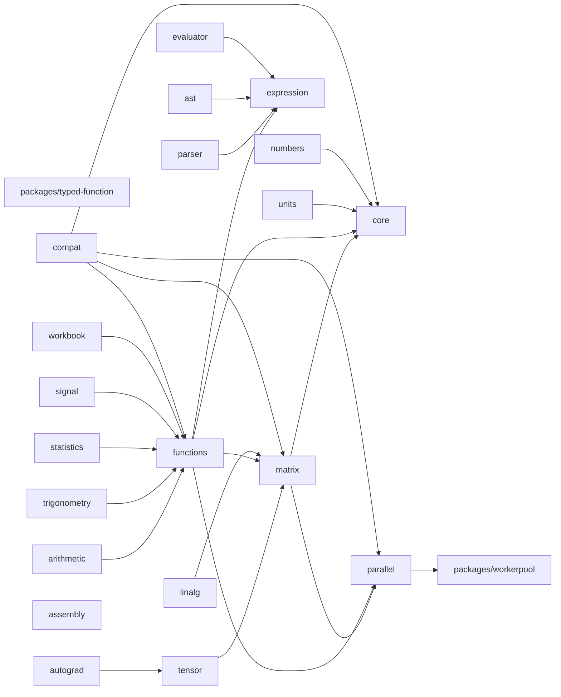

# mathts - Dependency Graph

**Version**: 0.1.0 | **Last Updated**: 2026-06-27

This document provides a comprehensive dependency graph of all files, components, imports, functions, and variables in the codebase.

---

## Table of Contents

1. [Overview](#overview)
2. [Package Dependencies](#package-dependencies)
3. [Packages/typed function Dependencies](#packages-typed-function-dependencies)
4. [Packages/workerpool Dependencies](#packages-workerpool-dependencies)
5. [Core/factory Dependencies](#core-factory-dependencies)
6. [Core Dependencies](#core-dependencies)
7. [Core/typed Dependencies](#core-typed-dependencies)
8. [Core/types Dependencies](#core-types-dependencies)
9. [Matrix/backends Dependencies](#matrix-backends-dependencies)
10. [Matrix Dependencies](#matrix-dependencies)
11. [Matrix/operations Dependencies](#matrix-operations-dependencies)
12. [Matrix/types Dependencies](#matrix-types-dependencies)
13. [Tensor Dependencies](#tensor-dependencies)
14. [Tensor/operations Dependencies](#tensor-operations-dependencies)
15. [Autograd Dependencies](#autograd-dependencies)
16. [Functions/algebra Dependencies](#functions-algebra-dependencies)
17. [Functions/arithmetic Dependencies](#functions-arithmetic-dependencies)
18. [Functions/bitwise Dependencies](#functions-bitwise-dependencies)
19. [Functions/combinatorics Dependencies](#functions-combinatorics-dependencies)
20. [Functions/complex Dependencies](#functions-complex-dependencies)
21. [Functions/core Dependencies](#functions-core-dependencies)
22. [Functions/error Dependencies](#functions-error-dependencies)
23. [Functions/expression Dependencies](#functions-expression-dependencies)
24. [Functions/factories Dependencies](#functions-factories-dependencies)
25. [Functions/geometry Dependencies](#functions-geometry-dependencies)
26. [Functions Dependencies](#functions-dependencies)
27. [Functions/logical Dependencies](#functions-logical-dependencies)
28. [Functions/matrix Dependencies](#functions-matrix-dependencies)
29. [Functions/numeric Dependencies](#functions-numeric-dependencies)
30. [Functions/plain Dependencies](#functions-plain-dependencies)
31. [Functions/probability Dependencies](#functions-probability-dependencies)
32. [Functions/relational Dependencies](#functions-relational-dependencies)
33. [Functions/set Dependencies](#functions-set-dependencies)
34. [Functions/signal Dependencies](#functions-signal-dependencies)
35. [Functions/special Dependencies](#functions-special-dependencies)
36. [Functions/statistics Dependencies](#functions-statistics-dependencies)
37. [Functions/string Dependencies](#functions-string-dependencies)
38. [Functions/trigonometry Dependencies](#functions-trigonometry-dependencies)
39. [Functions/type Dependencies](#functions-type-dependencies)
40. [Functions/typed Dependencies](#functions-typed-dependencies)
41. [Functions/unit Dependencies](#functions-unit-dependencies)
42. [Functions/utils Dependencies](#functions-utils-dependencies)
43. [Functions/wasm Dependencies](#functions-wasm-dependencies)
44. [Expression/compiler Dependencies](#expression-compiler-dependencies)
45. [Expression/error Dependencies](#expression-error-dependencies)
46. [Expression/evaluator Dependencies](#expression-evaluator-dependencies)
47. [Expression/function Dependencies](#expression-function-dependencies)
48. [Expression Dependencies](#expression-dependencies)
49. [Expression/node Dependencies](#expression-node-dependencies)
50. [Expression/transform Dependencies](#expression-transform-dependencies)
51. [Expression/utils Dependencies](#expression-utils-dependencies)
52. [Parser Dependencies](#parser-dependencies)
53. [Units Dependencies](#units-dependencies)
54. [Numbers Dependencies](#numbers-dependencies)
55. [Ast Dependencies](#ast-dependencies)
56. [Evaluator Dependencies](#evaluator-dependencies)
57. [Linalg Dependencies](#linalg-dependencies)
58. [Arithmetic Dependencies](#arithmetic-dependencies)
59. [Trigonometry Dependencies](#trigonometry-dependencies)
60. [Statistics Dependencies](#statistics-dependencies)
61. [Signal Dependencies](#signal-dependencies)
62. [Parallel Dependencies](#parallel-dependencies)
63. [Parallel/operations Dependencies](#parallel-operations-dependencies)
64. [Parallel/ops Dependencies](#parallel-ops-dependencies)
65. [Parallel/strategies Dependencies](#parallel-strategies-dependencies)
66. [Workbook Dependencies](#workbook-dependencies)
67. [Assembly/algebra Dependencies](#assembly-algebra-dependencies)
68. [Assembly Dependencies](#assembly-dependencies)
69. [Assembly/ops Dependencies](#assembly-ops-dependencies)
70. [Assembly/types Dependencies](#assembly-types-dependencies)
71. [Compat Dependencies](#compat-dependencies)
72. [Dependency Matrix](#dependency-matrix)
73. [Circular Dependency Analysis](#circular-dependency-analysis)
74. [Visual Dependency Graph](#visual-dependency-graph)
75. [Summary Statistics](#summary-statistics)

---

## Overview

The codebase is organized into the following modules:

- **packages/typed-function**: 1 file
- **packages/workerpool**: 2 files
- **core/factory**: 2 files
- **core**: 1 file
- **core/typed**: 3 files
- **core/types**: 7 files
- **matrix/backends**: 19 files
- **matrix**: 4 files
- **matrix/operations**: 14 files
- **matrix/types**: 6 files
- **tensor**: 4 files
- **tensor/operations**: 17 files
- **autograd**: 5 files
- **functions/algebra**: 45 files
- **functions/arithmetic**: 38 files
- **functions/bitwise**: 8 files
- **functions/combinatorics**: 4 files
- **functions/complex**: 4 files
- **functions/core**: 2 files
- **functions/error**: 4 files
- **functions/expression**: 1 file
- **functions/factories**: 4 files
- **functions/geometry**: 2 files
- **functions**: 2 files
- **functions/logical**: 5 files
- **functions/matrix**: 45 files
- **functions/numeric**: 1 file
- **functions/plain**: 10 files
- **functions/probability**: 14 files
- **functions/relational**: 13 files
- **functions/set**: 10 files
- **functions/signal**: 2 files
- **functions/special**: 2 files
- **functions/statistics**: 14 files
- **functions/string**: 5 files
- **functions/trigonometry**: 26 files
- **functions/type**: 32 files
- **functions/typed**: 30 files
- **functions/unit**: 2 files
- **functions/utils**: 38 files
- **functions/wasm**: 12 files
- **expression/compiler**: 2 files
- **expression/error**: 3 files
- **expression/evaluator**: 2 files
- **expression/function**: 1 file
- **expression**: 7 files
- **expression/node**: 18 files
- **expression/transform**: 1 file
- **expression/utils**: 13 files
- **parser**: 1 file
- **units**: 1 file
- **numbers**: 1 file
- **ast**: 1 file
- **evaluator**: 1 file
- **linalg**: 1 file
- **arithmetic**: 1 file
- **trigonometry**: 1 file
- **statistics**: 1 file
- **signal**: 1 file
- **parallel**: 2 files
- **parallel/operations**: 5 files
- **parallel/ops**: 1 file
- **parallel/strategies**: 3 files
- **workbook**: 7 files
- **assembly/algebra**: 1 file
- **assembly**: 7 files
- **assembly/ops**: 18 files
- **assembly/types**: 1 file
- **compat**: 2 files

---

## Package Dependencies

| Package | Depends On | Files (Active) | Files (Dormant) |
|---------|------------|----------------|-----------------|
| `@danielsimonjr/mathts-typed-function` (`packages/typed-function/`) | (none) | 1 | 1 |
| `@danielsimonjr/mathts-workerpool` (`packages/workerpool/`) | (none) | 2 | 3 |
| `@danielsimonjr/mathts-core` (`core/`) | (none) | 13 | 12 |
| `@danielsimonjr/mathts-matrix` (`matrix/`) | `@danielsimonjr/mathts-parallel`, `@danielsimonjr/mathts-core` | 43 | 5 |
| `@danielsimonjr/mathts-tensor` (`tensor/`) | `@danielsimonjr/mathts-matrix` | 21 | 0 |
| `@danielsimonjr/mathts-autograd` (`autograd/`) | `@danielsimonjr/mathts-tensor` | 5 | 0 |
| `@danielsimonjr/mathts-functions` (`functions/`) | `@danielsimonjr/mathts-expression`, `@danielsimonjr/mathts-core`, `@danielsimonjr/mathts-matrix`, `@danielsimonjr/mathts-parallel` | 375 | 35 |
| `@danielsimonjr/mathts-expression` (`expression/`) | (none) | 47 | 381 |
| `@danielsimonjr/mathts-parser` (`parser/`) | `@danielsimonjr/mathts-expression` | 1 | 0 |
| `@danielsimonjr/mathts-units` (`units/`) | `@danielsimonjr/mathts-core` | 1 | 0 |
| `@danielsimonjr/mathts-numbers` (`numbers/`) | `@danielsimonjr/mathts-core` | 1 | 0 |
| `@danielsimonjr/mathts-ast` (`ast/`) | `@danielsimonjr/mathts-expression` | 1 | 0 |
| `@danielsimonjr/mathts-evaluator` (`evaluator/`) | `@danielsimonjr/mathts-expression` | 1 | 0 |
| `@danielsimonjr/mathts-linalg` (`linalg/`) | `@danielsimonjr/mathts-matrix` | 1 | 0 |
| `@danielsimonjr/mathts-arithmetic` (`arithmetic/`) | `@danielsimonjr/mathts-functions` | 1 | 0 |
| `@danielsimonjr/mathts-trigonometry` (`trigonometry/`) | `@danielsimonjr/mathts-functions` | 1 | 0 |
| `@danielsimonjr/mathts-statistics` (`statistics/`) | `@danielsimonjr/mathts-functions` | 1 | 0 |
| `@danielsimonjr/mathts-signal` (`signal/`) | `@danielsimonjr/mathts-functions` | 1 | 0 |
| `@danielsimonjr/mathts-parallel` (`parallel/`) | `@danielsimonjr/mathts-workerpool` | 11 | 4 |
| `@danielsimonjr/mathts-workbook` (`workbook/`) | `@danielsimonjr/mathts-functions` | 7 | 2 |
| `@danielsimonjr/mathts-wasm` (`assembly/`) | (none) | 27 | 3 |
| `@danielsimonjr/mathts-compat` (`compat/`) | `@danielsimonjr/mathts-functions`, `@danielsimonjr/mathts-core`, `@danielsimonjr/mathts-matrix`, `@danielsimonjr/mathts-parallel` | 2 | 1 |

### Package Dependency Diagram

---

## Packages/typed function Dependencies

### `packages/typed-function/src/index.ts` - Utility helpers for typed-function integration in MathTS.

**Internal Dependencies:**
| File | Imports | Type |
|------|---------|------|
| `typed-function` | `default, create` | Re-export |

**Exports:**
- Classes: `NoMatchingSignatureError`, `TypeConversionError`
- Interfaces: `TypeDef`, `ExtendedTypeDef`, `ConversionDef`
- Types: `SignatureMap`, `TypeTest`, `TypeConverter`
- Functions: `parseSignature`, `buildSignature`, `createSymbolTypeTest`, `createRobustTypeTest`, `createRobustSubtypeTest`, `createSafeConversion`, `createSafeConversionDef`, `createSymbolTypeDef`, `createRobustTypeDef`
- Constants: `TYPED_FUNCTION_TYPE`, `isNumber`, `isBoolean`, `isString`, `isBigInt`, `isArray`, `isFunction`, `isObject`, `isNull`, `isUndefined`, `isNullOrUndefined`, `isFiniteNumber`, `isInteger`, `isPositiveInteger`, `isNonNegativeInteger`, `isNaN`, `isTypedArray`, `isFloat64Array`, `isFloat32Array`, `isInt32Array`, `isUint32Array`, `isArrayBuffer`
- Re-exports: `default`, `create`

---

## Packages/workerpool Dependencies

### `packages/workerpool/src/fft-core.ts` - Shared radix-2 FFT core for @danielsimonjr/mathts-workerpool.

**Exports:**
- Functions: `fftBitReverse`, `fftFrameInPlace`

---

### `packages/workerpool/src/index.ts` - Worker pool management for MathTS parallel computations.

**External Dependencies:**
| Package | Import |
|---------|--------|
| `workerpool` | `pool, Pool, Transfer, PoolOptions, ExecOptions, PoolStats` |

**Internal Dependencies:**
| File | Imports | Type |
|------|---------|------|
| `./fft-core.js` | `fftFrameInPlace` | Import |

**Exports:**
- Classes: `MathWorkerPool`
- Interfaces: `WorkerpoolCapabilities`, `WasmFeatureStatus`, `WorkerPoolConfig`, `ParallelResult`, `PoolMetrics`, `EnhancedPoolStats`, `TaskOptions`
- Functions: `canUseWasm`, `canUseSharedMemory`, `transferFloat64`, `transferArrayBuffer`, `transferTypedArray`, `createSharedFloat64Array`, `createSharedBuffer`, `isSharedBuffer`, `getCapabilities`, `initWorkerWasm`, `isWorkerWasmAvailable`, `getWasmFeatures`, `initializePool`, `terminatePool`, `getPoolStats`
- Constants: `DEFAULT_WORKER_CONFIG`, `mathWorkerPool`

---

## Core/factory Dependencies

### `core/src/factory/factory.ts` - MathTS Function Factory

**Internal Dependencies:**
| File | Imports | Type |
|------|---------|------|
| `../typed/mathts-typed.js` | `TypedFunction, TypedInstance, SignatureFunction, ReferTo, ReferToSelf` | Import (type-only) |
| `../typed/mathts-typed.js` | `mathTyped` | Import |

**Exports:**
- Classes: `FunctionRegistry`
- Interfaces: `MathTSConfig`, `FactoryFunction`, `FactoryDependencies`
- Types: `FactoryImport`
- Functions: `createFactory`, `createTypedFunction`
- Constants: `DEFAULT_CONFIG`, `registry`, `math`

---

### `core/src/factory/index.ts` - Factory pattern exports

**Internal Dependencies:**
| File | Imports | Type |
|------|---------|------|
| `./factory.js` | `FunctionRegistry, createFactory, createTypedFunction, registry, math, DEFAULT_CONFIG` | Re-export |

**Exports:**
- Re-exports: `FunctionRegistry`, `createFactory`, `createTypedFunction`, `registry`, `math`, `DEFAULT_CONFIG`

---

## Core Dependencies

### `core/src/index.ts` - Core types and utilities for MathTS

**Internal Dependencies:**
| File | Imports | Type |
|------|---------|------|
| `./types/complex.js` | `Complex, isComplex, I, COMPLEX_ZERO, COMPLEX_ONE, COMPLEX_NEG_ONE` | Re-export |
| `./types/fraction.js` | `Fraction, isFraction, FRACTION_ZERO, FRACTION_ONE, FRACTION_NEG_ONE, FRACTION_HALF, FRACTION_THIRD, FRACTION_QUARTER` | Re-export |
| `./types/bignumber.js` | `BigNumber, isBigNumber, BIGNUMBER_ZERO, BIGNUMBER_ONE, BIGNUMBER_NEG_ONE, BIGNUMBER_TEN, BIGNUMBER_PI, BIGNUMBER_E, BIGNUMBER_LN2, BIGNUMBER_LN10` | Re-export |
| `./types/unit.js` | `Unit, isUnit, DimensionMismatchError, UnitParseError, DIMENSIONLESS, dim` | Re-export |
| `./types/unit-definitions.js` | `BASE_UNITS, DERIVED_UNITS, ALL_UNITS, UNIT_ALIASES, getUnitDef` | Re-export |
| `./types/unit-prefixes.js` | `SI_PREFIXES, BEST_PREFIXES, getPrefix` | Re-export |
| `./typed/index.js` | `mathTyped, createMathTSTyped, typed, create, createTypedFunction, TypeRegistry, MATHTS_TYPES, MATHTS_CONVERSIONS, isNumber, isBoolean, isString, isBigInt, isArray, isFunction, isObject, isNull, isUndefined, isMatrix, isDenseMatrix, isSparseMatrix, isUnit, initTypedWasm, isTypedWasmAvailable, registerNativeTypes` | Re-export |
| `./factory/index.js` | `FunctionRegistry, createFactory, registry, math, DEFAULT_CONFIG` | Re-export |

**Exports:**
- Constants: `VERSION`
- Re-exports: `Complex`, `isComplex`, `I`, `COMPLEX_ZERO`, `COMPLEX_ONE`, `COMPLEX_NEG_ONE`, `Fraction`, `isFraction`, `FRACTION_ZERO`, `FRACTION_ONE`, `FRACTION_NEG_ONE`, `FRACTION_HALF`, `FRACTION_THIRD`, `FRACTION_QUARTER`, `BigNumber`, `isBigNumber`, `BIGNUMBER_ZERO`, `BIGNUMBER_ONE`, `BIGNUMBER_NEG_ONE`, `BIGNUMBER_TEN`, `BIGNUMBER_PI`, `BIGNUMBER_E`, `BIGNUMBER_LN2`, `BIGNUMBER_LN10`, `Unit`, `isUnit`, `DimensionMismatchError`, `UnitParseError`, `DIMENSIONLESS`, `dim`, `BASE_UNITS`, `DERIVED_UNITS`, `ALL_UNITS`, `UNIT_ALIASES`, `getUnitDef`, `SI_PREFIXES`, `BEST_PREFIXES`, `getPrefix`, `mathTyped`, `createMathTSTyped`, `typed`, `create`, `createTypedFunction`, `TypeRegistry`, `MATHTS_TYPES`, `MATHTS_CONVERSIONS`, `isNumber`, `isBoolean`, `isString`, `isBigInt`, `isArray`, `isFunction`, `isObject`, `isNull`, `isUndefined`, `isMatrix`, `isDenseMatrix`, `isSparseMatrix`, `initTypedWasm`, `isTypedWasmAvailable`, `registerNativeTypes`, `FunctionRegistry`, `createFactory`, `registry`, `math`, `DEFAULT_CONFIG`

---

## Core/typed Dependencies

### `core/src/typed/index.ts` - typed-function integration exports

**Internal Dependencies:**
| File | Imports | Type |
|------|---------|------|
| `./mathts-typed.js` | `mathTyped, createMathTSTyped, typed, create, createTypedFunction, TypeRegistry, MATHTS_TYPES, MATHTS_CONVERSIONS, isNumber, isBoolean, isString, isBigInt, isArray, isFunction, isObject, isNull, isUndefined, isComplex, isFraction, isBigNumber, isFloat64Array, isFloat32Array, isInt32Array, isUint32Array, isUint8Array, isMatrix, isDenseMatrix, isSparseMatrix, isUnit, initTypedWasm, isTypedWasmAvailable` | Re-export |
| `./type-bridge.js` | `registerNativeTypes` | Re-export |

**Exports:**
- Re-exports: `mathTyped`, `createMathTSTyped`, `typed`, `create`, `createTypedFunction`, `TypeRegistry`, `MATHTS_TYPES`, `MATHTS_CONVERSIONS`, `isNumber`, `isBoolean`, `isString`, `isBigInt`, `isArray`, `isFunction`, `isObject`, `isNull`, `isUndefined`, `isComplex`, `isFraction`, `isBigNumber`, `isFloat64Array`, `isFloat32Array`, `isInt32Array`, `isUint32Array`, `isUint8Array`, `isMatrix`, `isDenseMatrix`, `isSparseMatrix`, `isUnit`, `initTypedWasm`, `isTypedWasmAvailable`, `registerNativeTypes`

---

### `core/src/typed/mathts-typed.ts` - MathTS typed-function Integration

**External Dependencies:**
| Package | Import |
|---------|--------|
| `typed-function` | `create, typed` |
| `typed-function` | `TypedFunction, TypedInstance, SignatureFunction, ReferTo, ReferToSelf` |

**Internal Dependencies:**
| File | Imports | Type |
|------|---------|------|
| `../types/complex.js` | `Complex, isComplex` | Import |
| `../types/fraction.js` | `Fraction, isFraction` | Import |
| `../types/bignumber.js` | `BigNumber, isBigNumber` | Import |

**Exports:**
- Classes: `TypeRegistry`
- Interfaces: `TypeDef`, `ConversionDef`, `MathTSTypeDef`
- Functions: `initTypedWasm`, `isTypedWasmAvailable`, `createMathTSTyped`, `createTypedFunction`
- Constants: `isNumber`, `isBoolean`, `isString`, `isBigInt`, `isArray`, `isFunction`, `isObject`, `isNull`, `isUndefined`, `isFloat64Array`, `isFloat32Array`, `isInt32Array`, `isUint32Array`, `isUint8Array`, `isComplex`, `isFraction`, `isBigNumber`, `isMatrix`, `isDenseMatrix`, `isSparseMatrix`, `isUnit`, `MATHTS_TYPES`, `MATHTS_CONVERSIONS`, `mathTyped`

---

### `core/src/typed/type-bridge.ts` - Type compatibility bridge for mathjs duck-typing.

**Internal Dependencies:**
| File | Imports | Type |
|------|---------|------|
| `../types/complex.js` | `Complex` | Import |
| `../types/fraction.js` | `Fraction` | Import |
| `../types/bignumber.js` | `BigNumber` | Import |

**Exports:**
- Functions: `registerNativeTypes`

---

## Core/types Dependencies

### `core/src/types/bignumber.ts` - BigNumber (arbitrary precision decimal) implementation

**Internal Dependencies:**
| File | Imports | Type |
|------|---------|------|
| `./interfaces` | `Scalar, MathTSValue` | Import (type-only) |

**Exports:**
- Classes: `BigNumber`
- Interfaces: `BigNumberConfig`
- Types: `RoundingMode`
- Functions: `isBigNumber`
- Constants: `BIGNUMBER_ZERO`, `BIGNUMBER_ONE`, `BIGNUMBER_NEG_ONE`, `BIGNUMBER_TEN`, `BIGNUMBER_PI`, `BIGNUMBER_E`, `BIGNUMBER_LN2`, `BIGNUMBER_LN10`

---

### `core/src/types/complex.ts` - Complex number implementation

**Internal Dependencies:**
| File | Imports | Type |
|------|---------|------|
| `./interfaces` | `Scalar, IComplex` | Import (type-only) |

**Exports:**
- Classes: `Complex`
- Functions: `isComplex`
- Constants: `I`, `COMPLEX_ZERO`, `COMPLEX_ONE`, `COMPLEX_NEG_ONE`

---

### `core/src/types/fraction.ts` - Fraction (rational number) implementation

**Internal Dependencies:**
| File | Imports | Type |
|------|---------|------|
| `./interfaces` | `Scalar, IFraction` | Import (type-only) |

**Exports:**
- Classes: `Fraction`
- Functions: `isFraction`
- Constants: `FRACTION_ZERO`, `FRACTION_ONE`, `FRACTION_NEG_ONE`, `FRACTION_HALF`, `FRACTION_THIRD`, `FRACTION_QUARTER`

---

### `core/src/types/interfaces.ts` - Base interfaces for MathTS types

**Exports:**
- Interfaces: `MathTSValue`, `Scalar`, `MatrixBackend`, `IMatrix`, `IComplex`, `IFraction`, `IBigNumber`, `MatrixDimensions`
- Types: `BackendType`, `NumericType`

---

### `core/src/types/unit-definitions.ts` - Unit definitions for the Unit type.

**Exports:**
- Interfaces: `Dimensions`, `UnitDef`
- Functions: `dim`, `getUnitDef`
- Constants: `DIMENSIONLESS`, `BASE_UNITS`, `DERIVED_UNITS`, `ALL_UNITS`, `UNIT_ALIASES`

---

### `core/src/types/unit-prefixes.ts` - SI prefixes for the Unit type.

**Exports:**
- Functions: `getPrefix`
- Constants: `SI_PREFIXES`, `SI_PREFIX_KEYS`, `BEST_PREFIXES`

---

### `core/src/types/unit.ts` - Unit type — dimensional analysis, composition, conversion, and pretty-print.

**Internal Dependencies:**
| File | Imports | Type |
|------|---------|------|
| `./unit-definitions.js` | `ALL_UNITS, DIMENSIONLESS, Dimensions, UNIT_ALIASES, UnitDef, dim, getUnitDef` | Import |
| `./unit-prefixes.js` | `BEST_PREFIXES, SI_PREFIXES, SI_PREFIX_KEYS` | Import |

**Exports:**
- Classes: `DimensionMismatchError`, `UnitParseError`, `Unit`
- Functions: `isUnit`

---

## Matrix/backends Dependencies

### `matrix/src/backends/Backend.ts` - Matrix Backend Interface

**Internal Dependencies:**
| File | Imports | Type |
|------|---------|------|
| `../types/DenseMatrix.js` | `DenseMatrix` | Import |

**Exports:**
- Classes: `BackendRegistry`
- Interfaces: `BackendHints`, `MatrixBackend`
- Types: `BackendType`
- Constants: `DEFAULT_BACKEND_HINTS`, `backendRegistry`

---

### `matrix/src/backends/BackendManager.ts` - Backend Manager

**Internal Dependencies:**
| File | Imports | Type |
|------|---------|------|
| `../types/DenseMatrix.js` | `DenseMatrix` | Import |
| `./Backend.js` | `MatrixBackend, BackendType, BackendHints` | Import (type-only) |
| `./Backend.js` | `backendRegistry, DEFAULT_BACKEND_HINTS` | Import |
| `./JSBackend.js` | `jsBackend` | Import |
| `../config.js` | `getConfig, onConfigChange, MatrixConfig, OperationType` | Import |

**Exports:**
- Classes: `BackendManager`
- Interfaces: `ExtendedBackendHints`
- Functions: `createBackendManager`
- Constants: `DEFAULT_EXTENDED_HINTS`, `backendManager`

---

### `matrix/src/backends/gpu/BatchExecutor.ts` - GPU Batch Executor

**Internal Dependencies:**
| File | Imports | Type |
|------|---------|------|
| `./GPUContext.js` | `GPUContext` | Import (type-only) |
| `./ShaderManager.js` | `ShaderManager` | Import (type-only) |
| `./BufferPool.js` | `BufferPool` | Import (type-only) |

**Exports:**
- Classes: `BatchExecutor`
- Interfaces: `BatchOperation`, `BatchResult`, `BatchOptions`
- Types: `BatchOperationType`

---

### `matrix/src/backends/gpu/BufferPool.ts` - GPU Buffer Pool

**Internal Dependencies:**
| File | Imports | Type |
|------|---------|------|
| `./GPUContext.js` | `GPUContext` | Import |

**Exports:**
- Classes: `BufferPool`
- Interfaces: `BufferPoolOptions`

---

### `matrix/src/backends/gpu/detect.ts` - WebGPU Detection and Capability Checking

**Exports:**
- Interfaces: `GPUAdapterInfo`, `GPUCapabilities`
- Functions: `hasWebGPU`, `isBrowser`, `getGPUAdapter`, `detectGPUCapabilities`, `isGPUSuitableForMatrixOps`, `getRecommendedWorkgroupSize`, `getMaxMatrixSize`

---

### `matrix/src/backends/gpu/GPUContext.ts` - WebGPU Context Management

**Internal Dependencies:**
| File | Imports | Type |
|------|---------|------|
| `./detect.js` | `hasWebGPU, getGPUAdapter, detectGPUCapabilities, GPUCapabilities` | Import |

**Exports:**
- Classes: `GPUContext`
- Interfaces: `GPUContextOptions`, `DeviceLostEvent`
- Types: `GPUContextStatus`
- Functions: `getGlobalGPUContext`, `initializeGlobalGPU`, `destroyGlobalGPU`

---

### `matrix/src/backends/gpu/index.ts` - GPU Backend Exports

**Internal Dependencies:**
| File | Imports | Type |
|------|---------|------|
| `./detect.js` | `hasWebGPU, isBrowser, getGPUAdapter, detectGPUCapabilities, isGPUSuitableForMatrixOps, getRecommendedWorkgroupSize, getMaxMatrixSize, GPUAdapterInfo, GPUCapabilities` | Re-export |
| `./GPUContext.js` | `GPUContext, getGlobalGPUContext, initializeGlobalGPU, destroyGlobalGPU, GPUContextOptions, GPUContextStatus, DeviceLostEvent` | Re-export |
| `./BufferPool.js` | `BufferPool, BufferPoolOptions` | Re-export |
| `./ShaderManager.js` | `ShaderManager, BUILTIN_SHADERS, ShaderSource, PipelineConfig` | Re-export |
| `./BatchExecutor.js` | `BatchExecutor, BatchOperation, BatchOperationType, BatchResult, BatchOptions` | Re-export |
| `./Sync.js` | `SyncManager, createSyncManager, SyncStrategy, TransferDirection, TransferRequest, TransferResult, SyncConfig` | Re-export |

**Exports:**
- Re-exports: `hasWebGPU`, `isBrowser`, `getGPUAdapter`, `detectGPUCapabilities`, `isGPUSuitableForMatrixOps`, `getRecommendedWorkgroupSize`, `getMaxMatrixSize`, `GPUAdapterInfo`, `GPUCapabilities`, `GPUContext`, `getGlobalGPUContext`, `initializeGlobalGPU`, `destroyGlobalGPU`, `GPUContextOptions`, `GPUContextStatus`, `DeviceLostEvent`, `BufferPool`, `BufferPoolOptions`, `ShaderManager`, `BUILTIN_SHADERS`, `ShaderSource`, `PipelineConfig`, `BatchExecutor`, `BatchOperation`, `BatchOperationType`, `BatchResult`, `BatchOptions`, `SyncManager`, `createSyncManager`, `SyncStrategy`, `TransferDirection`, `TransferRequest`, `TransferResult`, `SyncConfig`

---

### `matrix/src/backends/gpu/ShaderManager.ts` - GPU Shader Manager

**Internal Dependencies:**
| File | Imports | Type |
|------|---------|------|
| `./GPUContext.js` | `GPUContext` | Import |

**Exports:**
- Classes: `ShaderManager`
- Interfaces: `ShaderSource`, `PipelineConfig`
- Constants: `BUILTIN_SHADERS`

---

### `matrix/src/backends/gpu/Sync.ts` - GPU-CPU Synchronization Strategy

**Internal Dependencies:**
| File | Imports | Type |
|------|---------|------|
| `./GPUContext.js` | `GPUContext` | Import (type-only) |
| `./BufferPool.js` | `BufferPool` | Import (type-only) |

**Exports:**
- Classes: `SyncManager`
- Interfaces: `TransferRequest`, `TransferResult`, `SyncConfig`
- Types: `SyncStrategy`, `TransferDirection`
- Functions: `createSyncManager`

---

### `matrix/src/backends/GPUBackend.ts` - GPU Backend for Matrix Operations

**Internal Dependencies:**
| File | Imports | Type |
|------|---------|------|
| `./gpu/index.js` | `GPUContext, GPUContextOptions, getGlobalGPUContext, BufferPool, ShaderManager, hasWebGPU, detectGPUCapabilities, getRecommendedWorkgroupSize, GPUCapabilities` | Import |

**Exports:**
- Classes: `GPUBackend`
- Interfaces: `GPUBackendOptions`
- Types: `GPUBackendStatus`
- Functions: `getGlobalGPUBackend`, `initializeGlobalGPUBackend`, `destroyGlobalGPUBackend`

---

### `matrix/src/backends/GPUMatrixBackend.ts` - GPU Matrix Backend Adapter

**Internal Dependencies:**
| File | Imports | Type |
|------|---------|------|
| `./Backend.js` | `MatrixBackend, BackendType` | Import (type-only) |
| `../types/DenseMatrix.js` | `DenseMatrix` | Import |
| `./JSBackend.js` | `jsBackend` | Import |
| `./GPUBackend.js` | `GPUBackend, getGlobalGPUBackend, initializeGlobalGPUBackend, GPUBackendOptions` | Import |
| `./gpu/index.js` | `hasWebGPU, detectGPUCapabilities, GPUCapabilities` | Import |

**Exports:**
- Classes: `GPUMatrixBackend`
- Interfaces: `GPUMatrixBackendConfig`
- Functions: `createGPUMatrixBackend`
- Constants: `gpuMatrixBackend`

---

### `matrix/src/backends/index.ts` - Matrix Backend Exports

**Internal Dependencies:**
| File | Imports | Type |
|------|---------|------|
| `./Backend.js` | `BackendRegistry, backendRegistry, DEFAULT_BACKEND_HINTS` | Re-export |
| `./JSBackend.js` | `JSBackend, jsBackend` | Re-export |
| `./ParallelBackend.js` | `ParallelBackend, parallelBackend, createParallelBackend, ParallelBackendConfig` | Re-export |
| `./WASMBackend.js` | `WASMBackend, wasmBackend, createWASMBackend, WASMBackendConfig` | Re-export |
| `./GPUMatrixBackend.js` | `GPUMatrixBackend, gpuMatrixBackend, createGPUMatrixBackend, GPUMatrixBackendConfig` | Re-export |
| `./GPUBackend.js` | `GPUBackend, getGlobalGPUBackend, initializeGlobalGPUBackend, destroyGlobalGPUBackend, GPUBackendOptions, GPUBackendStatus` | Re-export |
| `./BackendManager.js` | `BackendManager, backendManager, createBackendManager, DEFAULT_EXTENDED_HINTS, ExtendedBackendHints, OperationType` | Re-export |
| `./wasm/index.js` | `detectWasmFeatures, isWasmAvailable, isSharedMemoryAvailable, isAtomicsAvailable, clearFeatureCache, getCachedFeatures` | Re-export |
| `./gpu/index.js` | `hasWebGPU, detectGPUCapabilities, getRecommendedWorkgroupSize, GPUContext, getGlobalGPUContext, destroyGlobalGPU, BufferPool, ShaderManager, BUILTIN_SHADERS, BatchExecutor, SyncManager, createSyncManager` | Re-export |

**Exports:**
- Re-exports: `BackendRegistry`, `backendRegistry`, `DEFAULT_BACKEND_HINTS`, `JSBackend`, `jsBackend`, `ParallelBackend`, `parallelBackend`, `createParallelBackend`, `ParallelBackendConfig`, `WASMBackend`, `wasmBackend`, `createWASMBackend`, `WASMBackendConfig`, `GPUMatrixBackend`, `gpuMatrixBackend`, `createGPUMatrixBackend`, `GPUMatrixBackendConfig`, `GPUBackend`, `getGlobalGPUBackend`, `initializeGlobalGPUBackend`, `destroyGlobalGPUBackend`, `GPUBackendOptions`, `GPUBackendStatus`, `BackendManager`, `backendManager`, `createBackendManager`, `DEFAULT_EXTENDED_HINTS`, `ExtendedBackendHints`, `OperationType`, `detectWasmFeatures`, `isWasmAvailable`, `isSharedMemoryAvailable`, `isAtomicsAvailable`, `clearFeatureCache`, `getCachedFeatures`, `hasWebGPU`, `detectGPUCapabilities`, `getRecommendedWorkgroupSize`, `GPUContext`, `getGlobalGPUContext`, `destroyGlobalGPU`, `BufferPool`, `ShaderManager`, `BUILTIN_SHADERS`, `BatchExecutor`, `SyncManager`, `createSyncManager`

---

### `matrix/src/backends/JSBackend.ts` - Pure TypeScript Matrix Backend

**Internal Dependencies:**
| File | Imports | Type |
|------|---------|------|
| `../types/DenseMatrix.js` | `DenseMatrix` | Import |
| `./Backend.js` | `MatrixBackend, BackendType` | Import (type-only) |

**Exports:**
- Classes: `JSBackend`
- Constants: `jsBackend`

---

### `matrix/src/backends/ParallelBackend.ts` - Parallel Matrix Backend

**Internal Dependencies:**
| File | Imports | Type |
|------|---------|------|
| `../types/DenseMatrix.js` | `DenseMatrix` | Import |
| `./Backend.js` | `BackendType` | Import (type-only) |

**Exports:**
- Classes: `ParallelBackend`
- Interfaces: `ParallelBackendConfig`
- Functions: `createParallelBackend`
- Constants: `parallelBackend`

---

### `matrix/src/backends/wasm/detect.ts` - WASM Feature Detection

**Exports:**
- Interfaces: `WasmFeatures`
- Functions: `detectWasmFeatures`, `isWasmAvailable`, `isSharedMemoryAvailable`, `isAtomicsAvailable`, `clearFeatureCache`, `getCachedFeatures`

---

### `matrix/src/backends/wasm/fft-wasm.ts` - WASM-Accelerated FFT Operations

**Internal Dependencies:**
| File | Imports | Type |
|------|---------|------|
| `../WasmLoader.js` | `wasmLoader, WasmModule` | Import |

**Exports:**
- Interfaces: `FFTResult`, `FFTConfig`
- Types: `FFTBackend`
- Functions: `isPowerOf2`, `nextPowerOf2`, `fftJS`, `isWasmFFTAvailable`, `fft`, `ifft`, `rfft`, `powerSpectrum`, `magnitudeSpectrum`, `phaseSpectrum`, `convolve`

---

### `matrix/src/backends/wasm/index.ts` - WASM Utilities Index

**Internal Dependencies:**
| File | Imports | Type |
|------|---------|------|
| `./detect.js` | `detectWasmFeatures, isWasmAvailable, isSharedMemoryAvailable, isAtomicsAvailable, clearFeatureCache, getCachedFeatures` | Re-export |
| `./fft-wasm.js` | `fft, ifft, rfft, fftJS, convolve, powerSpectrum, magnitudeSpectrum, phaseSpectrum, isPowerOf2, nextPowerOf2, isWasmFFTAvailable` | Re-export |

**Exports:**
- Re-exports: `detectWasmFeatures`, `isWasmAvailable`, `isSharedMemoryAvailable`, `isAtomicsAvailable`, `clearFeatureCache`, `getCachedFeatures`, `fft`, `ifft`, `rfft`, `fftJS`, `convolve`, `powerSpectrum`, `magnitudeSpectrum`, `phaseSpectrum`, `isPowerOf2`, `nextPowerOf2`, `isWasmFFTAvailable`

---

### `matrix/src/backends/WASMBackend.ts` - WASM Matrix Backend (AssemblyScript)

**Internal Dependencies:**
| File | Imports | Type |
|------|---------|------|
| `./Backend.js` | `MatrixBackend, BackendType` | Import (type-only) |
| `../types/DenseMatrix.js` | `DenseMatrix` | Import |
| `./JSBackend.js` | `jsBackend` | Import |
| `./wasm/detect.js` | `detectWasmFeatures, WasmFeatures` | Import |

**Exports:**
- Classes: `WASMBackend`
- Interfaces: `WASMBackendConfig`
- Functions: `createWASMBackend`
- Constants: `wasmBackend`

---

### `matrix/src/backends/WasmLoader.ts` - WASM Loader - Loads and manages WebAssembly modules

**Exports:**
- Classes: `WasmLoader`
- Interfaces: `WasmModule`, `Allocation`, `LoadingMetrics`
- Functions: `initWasm`
- Constants: `wasmLoader`

---

## Matrix Dependencies

### `matrix/src/config.ts` - MathTS Matrix Configuration

**Internal Dependencies:**
| File | Imports | Type |
|------|---------|------|
| `./backends/Backend.js` | `BackendType` | Import (type-only) |

**Exports:**
- Interfaces: `BackendConfig`, `AdaptiveTuningConfig`, `ProfilingConfig`, `MatrixConfig`
- Types: `OperationType`, `BackendPreference`
- Functions: `getConfig`, `setConfig`, `resetConfig`, `onConfigChange`, `setBackendPreference`, `setBackendThreshold`, `setBackendEnabled`, `getRecommendedBackend`, `forceBackend`, `enableProfiling`, `disableProfiling`, `enableAdaptiveTuning`, `disableAdaptiveTuning`, `configureAdaptiveTuning`
- Constants: `DEFAULT_CONFIG`

---

### `matrix/src/index.ts` - Matrix operations for MathTS with pluggable backends

**Internal Dependencies:**
| File | Imports | Type |
|------|---------|------|
| `./types/index.js` | `*` | Re-export |
| `./backends/index.js` | `*` | Re-export |
| `./operations/index.js` | `*` | Re-export |
| `./typed-operations.js` | `*` | Re-export |
| `./parallel-matrix.js` | `*` | Re-export |

**Exports:**
- Re-exports: `* from ./types/index.js`, `* from ./backends/index.js`, `* from ./operations/index.js`, `* from ./typed-operations.js`, `* from ./parallel-matrix.js`

---

### `matrix/src/parallel-matrix.ts` - Parallel-First Matrix Operations

**Internal Dependencies:**
| File | Imports | Type |
|------|---------|------|
| `./types/DenseMatrix.js` | `DenseMatrix` | Import |

**Exports:**
- Functions: `initializeParallelMatrix`, `terminateParallelMatrix`
- Constants: `parallelMatrix`, `parallelIdentity`, `parallelZeros`, `parallelOnes`, `parallelDiag`, `parallelRandom`, `parallelMatrixAdd`, `parallelMatrixSubtract`, `parallelMatrixMultiply`, `parallelDotMultiply`, `parallelMatrixDivide`, `parallelUnaryMinus`, `parallelMatrixTranspose`, `parallelMatrixSum`, `parallelMatrixMean`, `parallelMatrixMin`, `parallelMatrixMax`, `parallelMatrixVariance`, `parallelMatrixStd`, `parallelMatrixNorm`, `parallelMatrixDot`, `parallelMatrixTrace`, `parallelMatrixDistance`, `parallelMatrixAbs`, `parallelMatrixSqrt`, `parallelMatrixSquare`, `parallelMatrixExp`, `parallelMatrixLog`, `parallelMatrixSin`, `parallelMatrixCos`, `parallelMatrixTan`, `parallelMatrixSize`, `parallelMatrixSubset`, `parallelMatrixRow`, `parallelMatrixColumn`, `parallelMatrixDiagonal`, `parallelMatrixMatvec`, `parallelMatrixOuter`, `parallelMatrixHistogram`, `parallelMatrixOperations`

---

### `matrix/src/typed-operations.ts` - Typed Matrix Operations

**Internal Dependencies:**
| File | Imports | Type |
|------|---------|------|
| `./types/DenseMatrix.js` | `DenseMatrix` | Import |

**Exports:**
- Constants: `matrix`, `identity`, `zeros`, `ones`, `diag`, `random`, `add`, `subtract`, `multiply`, `dotMultiply`, `divide`, `unaryMinus`, `transpose`, `sum`, `mean`, `min`, `max`, `norm`, `trace`, `abs`, `sqrt`, `square`, `exp`, `log`, `pow`, `size`, `subset`, `row`, `column`, `diagonal`, `typedMatrixOperations`

---

## Matrix/operations Dependencies

### `matrix/src/operations/cholesky.ts` - Cholesky Decomposition (DenseMatrix primitive)

**Internal Dependencies:**
| File | Imports | Type |
|------|---------|------|
| `../types/DenseMatrix.js` | `DenseMatrix` | Import |

**Exports:**
- Interfaces: `CholeskyResult`
- Functions: `cholesky`

---

### `matrix/src/operations/common.ts` - Shared decomposition helpers (number[][] dense algebra)

**Exports:**
- Functions: `eye`, `cloneMatrix`, `transpose`, `isSymmetric`, `matMul`, `matAdd`, `matSub`, `matScale`, `normInf`, `norm1`, `householder`, `applyHouseholderLeft`, `applyHouseholderRight`

---

### `matrix/src/operations/eig-wasm.ts` - WASM-accelerated Eigendecomposition

**Internal Dependencies:**
| File | Imports | Type |
|------|---------|------|
| `./eig.js` | `eig, EigResult, EigOptions` | Import |
| `./common.js` | `isSymmetric` | Import |
| `../backends/WasmLoader.js` | `wasmLoader` | Import |

**Exports:**
- Functions: `eigWasm`, `eigvalsWasm`, `spectralRadiusWasm`

---

### `matrix/src/operations/eig.ts` - Eigenvalue and Eigenvector Decomposition

**Internal Dependencies:**
| File | Imports | Type |
|------|---------|------|
| `./common.js` | `isSymmetric, eye, cloneMatrix, householder, applyHouseholderLeft, applyHouseholderRight` | Import |

**Exports:**
- Interfaces: `EigResult`, `EigOptions`
- Functions: `eig`, `eigvals`, `powerIteration`

---

### `matrix/src/operations/expm.ts` - Matrix Exponential — Scaling-and-Squaring with Padé-13 Approximant

**Internal Dependencies:**
| File | Imports | Type |
|------|---------|------|
| `../types/DenseMatrix.js` | `DenseMatrix` | Import |
| `./common.js` | `eye, matMul, matAdd, matSub, matScale, norm1` | Import |

**Exports:**
- Interfaces: `ExpmOptions`
- Functions: `matrixExpm`

---

### `matrix/src/operations/index.ts` - Matrix Operations

**Internal Dependencies:**
| File | Imports | Type |
|------|---------|------|
| `./eig.js` | `eig, eigvals, powerIteration, EigResult, EigOptions` | Re-export |
| `./svd.js` | `svd, singularValues, pinv, lowRankApprox, cond, norm2, normFro, SVDResult, SVDOptions` | Re-export |
| `./eig-wasm.js` | `eigWasm, eigvalsWasm, spectralRadiusWasm` | Re-export |
| `./svd-wasm.js` | `svdWasm` | Re-export |
| `./pinv.js` | `pinv, PinvOptions` | Re-export |
| `./qr.js` | `qr, QRResult, QROptions` | Re-export |
| `./lu.js` | `lu, LUResult` | Re-export |
| `./cholesky.js` | `cholesky, CholeskyResult` | Re-export |
| `./expm.js` | `matrixExpm, ExpmOptions` | Re-export |
| `./logm.js` | `matrixLogm, LogmOptions` | Re-export |
| `./sqrtm.js` | `matrixSqrtm, SqrtmOptions` | Re-export |
| `./schur.js` | `matrixSchur, SchurResult, SchurOptions` | Re-export |

**Exports:**
- Re-exports: `eig`, `eigvals`, `powerIteration`, `EigResult`, `EigOptions`, `svd`, `singularValues`, `pinv`, `lowRankApprox`, `cond`, `norm2`, `normFro`, `SVDResult`, `SVDOptions`, `eigWasm`, `eigvalsWasm`, `spectralRadiusWasm`, `svdWasm`, `PinvOptions`, `qr`, `QRResult`, `QROptions`, `lu`, `LUResult`, `cholesky`, `CholeskyResult`, `matrixExpm`, `ExpmOptions`, `matrixLogm`, `LogmOptions`, `matrixSqrtm`, `SqrtmOptions`, `matrixSchur`, `SchurResult`, `SchurOptions`

---

### `matrix/src/operations/logm.ts` - Matrix Logarithm — Schur-Padé inverse scaling-and-squaring (Slices 5.9a + 6.1)

**Internal Dependencies:**
| File | Imports | Type |
|------|---------|------|
| `../types/DenseMatrix.js` | `DenseMatrix` | Import |
| `./eig.js` | `eig` | Import |
| `./schur.js` | `schurInternal` | Import |
| `./common.js` | `eye, matMul, transpose, matScale, normInf, norm1` | Import |

**Exports:**
- Interfaces: `LogmOptions`
- Functions: `matrixLogm`

---

### `matrix/src/operations/lu.ts` - LU Decomposition (DenseMatrix primitive)

**Internal Dependencies:**
| File | Imports | Type |
|------|---------|------|
| `../types/DenseMatrix.js` | `DenseMatrix` | Import |

**Exports:**
- Interfaces: `LUResult`
- Functions: `lu`

---

### `matrix/src/operations/pinv.ts` - Moore-Penrose Pseudoinverse (DenseMatrix primitive)

**Internal Dependencies:**
| File | Imports | Type |
|------|---------|------|
| `../types/DenseMatrix.js` | `DenseMatrix` | Import |
| `./svd.js` | `svd` | Import |

**Exports:**
- Interfaces: `PinvOptions`
- Functions: `pinv`

---

### `matrix/src/operations/qr.ts` - QR Decomposition (DenseMatrix primitive)

**Internal Dependencies:**
| File | Imports | Type |
|------|---------|------|
| `../types/DenseMatrix.js` | `DenseMatrix` | Import |

**Exports:**
- Interfaces: `QRResult`, `QROptions`
- Functions: `qr`

---

### `matrix/src/operations/schur.ts` - Schur Decomposition — Francis QR with double shifts (Slice 6.1)

**Internal Dependencies:**
| File | Imports | Type |
|------|---------|------|
| `../types/DenseMatrix.js` | `DenseMatrix` | Import |
| `./common.js` | `eye, cloneMatrix, householder, applyHouseholderLeft, applyHouseholderRight` | Import |

**Exports:**
- Interfaces: `SchurResult`, `SchurOptions`
- Functions: `matrixSchur`, `schurInternal`

---

### `matrix/src/operations/sqrtm.ts` - Matrix Square Root — Hybrid approach (Slices 5.9a + 6.1)

**Internal Dependencies:**
| File | Imports | Type |
|------|---------|------|
| `../types/DenseMatrix.js` | `DenseMatrix` | Import |
| `./eig.js` | `eig` | Import |
| `./schur.js` | `schurInternal` | Import |
| `./common.js` | `eye, matMul, transpose` | Import |

**Exports:**
- Interfaces: `SqrtmOptions`
- Functions: `matrixSqrtm`, `matrixSqrtNewtonInternal`

---

### `matrix/src/operations/svd-wasm.ts` - WASM-accelerated Singular Value Decomposition.

**Internal Dependencies:**
| File | Imports | Type |
|------|---------|------|
| `./svd.js` | `svd, SVDResult, SVDOptions` | Import |
| `../backends/WasmLoader.js` | `wasmLoader` | Import |

**Exports:**
- Functions: `svdWasm`

---

### `matrix/src/operations/svd.ts` - Singular Value Decomposition (SVD)

**Internal Dependencies:**
| File | Imports | Type |
|------|---------|------|
| `./common.js` | `eye, cloneMatrix, householder, applyHouseholderLeft, applyHouseholderRight` | Import |

**Exports:**
- Interfaces: `SVDResult`, `SVDOptions`
- Functions: `svd`, `singularValues`, `pinv`, `lowRankApprox`, `cond`, `norm2`, `normFro`

---

## Matrix/types Dependencies

### `matrix/src/types/dense/arithmetic.ts` - Contiguous row-major view of a matrix's data. Using the flat Float64Array

**Internal Dependencies:**
| File | Imports | Type |
|------|---------|------|
| `../DenseMatrix.js` | `DenseMatrix` | Import (type-only) |
| `../Matrix.js` | `Matrix` | Import (type-only) |

**Exports:**
- Functions: `add`, `subtract`, `multiplyElementwise`, `multiply`, `scale`, `transpose`

---

### `matrix/src/types/dense/reduction.ts` - reduction module

**Internal Dependencies:**
| File | Imports | Type |
|------|---------|------|
| `../DenseMatrix.js` | `DenseMatrix` | Import (type-only) |

**Exports:**
- Functions: `sum`, `mean`, `min`, `max`, `norm`, `trace`

---

### `matrix/src/types/DenseMatrix.ts` - Dense Matrix Implementation

**Internal Dependencies:**
| File | Imports | Type |
|------|---------|------|
| `./Matrix.js` | `Matrix, MatrixEntry, SliceSpec` | Import |
| `./dense/arithmetic.js` | `* as arithmetic` | Import |
| `./dense/reduction.js` | `* as reduction` | Import |

**Exports:**
- Classes: `DenseMatrix`
- Functions: `isDenseMatrix`

---

### `matrix/src/types/index.ts` - Matrix Type Exports

**Internal Dependencies:**
| File | Imports | Type |
|------|---------|------|
| `./Matrix.js` | `Matrix, isMatrix` | Re-export |
| `./DenseMatrix.js` | `DenseMatrix, isDenseMatrix` | Re-export |
| `./SparseMatrix.js` | `SparseMatrix, isSparseMatrix` | Re-export |

**Exports:**
- Re-exports: `Matrix`, `isMatrix`, `DenseMatrix`, `isDenseMatrix`, `SparseMatrix`, `isSparseMatrix`

---

### `matrix/src/types/Matrix.ts` - Matrix Base Class

**Exports:**
- Interfaces: `MatrixDimensions`, `MatrixIndex`, `SliceSpec`, `MatrixEntry`
- Types: `MatrixType`
- Functions: `isMatrix`

---

### `matrix/src/types/SparseMatrix.ts` - Sparse Matrix Implementation (CSR Format)

**Internal Dependencies:**
| File | Imports | Type |
|------|---------|------|
| `./Matrix.js` | `Matrix, MatrixEntry, SliceSpec` | Import |
| `./DenseMatrix.js` | `DenseMatrix` | Import |

**Exports:**
- Classes: `SparseMatrix`
- Functions: `isSparseMatrix`

---

## Tensor Dependencies

### `tensor/src/contraction-sequence.ts` - contractNetwork — given an ordered list of Tensors (each carrying

**Internal Dependencies:**
| File | Imports | Type |
|------|---------|------|
| `./Tensor.js` | `Tensor` | Import |
| `./named-index.js` | `Index` | Import |

**Exports:**
- Interfaces: `ContractNetworkOpts`, `ContractNetworkResult`
- Functions: `contractNetwork`

---

### `tensor/src/index.ts` - ITensor-parity additions (see docs/roadmap/ITENSOR_PARITY.md)

**Internal Dependencies:**
| File | Imports | Type |
|------|---------|------|
| `./Tensor` | `Tensor` | Re-export |
| `./named-index` | `Index, idx` | Re-export |
| `./operations/svd` | `tensorSvd` | Re-export |
| `./operations/random` | `randomTensor` | Re-export |
| `./contraction-sequence` | `contractNetwork` | Re-export |
| `./operations/qr` | `tensorQr` | Re-export |
| `./operations/lu` | `tensorLU` | Re-export |
| `./operations/cholesky` | `tensorCholesky` | Re-export |
| `./operations/eig` | `tensorEig` | Re-export |
| `./operations/pinv` | `tensorPinv` | Re-export |
| `./operations/solve` | `tensorSolve` | Re-export |
| `./operations/kron` | `tensorKron` | Re-export |
| `./operations/slice` | `slice` | Re-export |
| `./operations/gather` | `gather` | Re-export |
| `./operations/stack` | `stack` | Re-export |
| `./operations/concatenate` | `concatenate` | Re-export |
| `./operations/scatter` | `scatter` | Re-export |
| `./operations/pad` | `pad` | Re-export |
| `./operations/roll` | `roll` | Re-export |
| `./operations/flip` | `flip` | Re-export |

**Exports:**
- Re-exports: `Tensor`, `Index`, `idx`, `tensorSvd`, `randomTensor`, `contractNetwork`, `tensorQr`, `tensorLU`, `tensorCholesky`, `tensorEig`, `tensorPinv`, `tensorSolve`, `tensorKron`, `slice`, `gather`, `stack`, `concatenate`, `scatter`, `pad`, `roll`, `flip`

---

### `tensor/src/named-index.ts` - Index — an immutable value type carrying a unique identity, a dimension,

**Exports:**
- Classes: `Index`
- Interfaces: `IndexOpts`
- Functions: `idx`

---

### `tensor/src/Tensor.ts` - Tensor — rank-N, Float64Array-backed, row-major dense tensor. The

**Internal Dependencies:**
| File | Imports | Type |
|------|---------|------|
| `./named-index.js` | `Index` | Import |

**Exports:**
- Classes: `Tensor`
- Interfaces: `EinsumSpec`
- Types: `NestedArray`

---

## Tensor/operations Dependencies

### `tensor/src/operations/cholesky.ts` - tensorCholesky — Cholesky decomposition for symmetric positive-definite

**Internal Dependencies:**
| File | Imports | Type |
|------|---------|------|
| `../Tensor.js` | `Tensor` | Import |
| `../named-index.js` | `Index` | Import |

**Exports:**
- Interfaces: `TensorCholeskyOpts`, `TensorCholeskyResult`
- Functions: `tensorCholesky`

---

### `tensor/src/operations/concatenate.ts` - concatenate — join tensors along an existing axis (NumPy `concatenate`).

**Internal Dependencies:**
| File | Imports | Type |
|------|---------|------|
| `../Tensor.js` | `Tensor` | Import |
| `../named-index.js` | `Index` | Import |

**Exports:**
- Functions: `concatenate`

---

### `tensor/src/operations/eig.ts` - tensorEig — eigenvalue / eigenvector decomposition for rank-N tensors.

**Internal Dependencies:**
| File | Imports | Type |
|------|---------|------|
| `../Tensor.js` | `Tensor` | Import |

**Exports:**
- Interfaces: `TensorEigOpts`, `TensorEigResult`
- Functions: `tensorEig`

---

### `tensor/src/operations/flip.ts` - flip — reverse element order along given axes.

**Internal Dependencies:**
| File | Imports | Type |
|------|---------|------|
| `../Tensor.js` | `Tensor` | Import |
| `../named-index.js` | `Index` | Import |

**Exports:**
- Functions: `flip`

---

### `tensor/src/operations/gather.ts` - gather — pull elements along one axis (NumPy `take` / JAX `gather`).

**Internal Dependencies:**
| File | Imports | Type |
|------|---------|------|
| `../Tensor.js` | `Tensor` | Import |
| `../named-index.js` | `Index` | Import |

**Exports:**
- Functions: `gather`

---

### `tensor/src/operations/kron.ts` - tensorKron — Kronecker product for rank-N tensors.

**Internal Dependencies:**
| File | Imports | Type |
|------|---------|------|
| `../Tensor.js` | `Tensor` | Import |
| `../named-index.js` | `Index` | Import |

**Exports:**
- Interfaces: `TensorKronOpts`
- Functions: `tensorKron`

---

### `tensor/src/operations/lu.ts` - tensorLU — LU decomposition with partial pivoting for rank-N tensors.

**Internal Dependencies:**
| File | Imports | Type |
|------|---------|------|
| `../Tensor.js` | `Tensor` | Import |
| `../named-index.js` | `Index` | Import |

**Exports:**
- Interfaces: `TensorLUResult`, `TensorLUOpts`
- Functions: `tensorLU`

---

### `tensor/src/operations/pad.ts` - pad — pad each axis by [before, after] amounts.

**Internal Dependencies:**
| File | Imports | Type |
|------|---------|------|
| `../Tensor.js` | `Tensor` | Import |
| `../named-index.js` | `Index` | Import |

**Exports:**
- Interfaces: `PadOptions`
- Functions: `pad`

---

### `tensor/src/operations/pinv.ts` - tensorPinv — Moore-Penrose pseudoinverse for rank-N tensors.

**Internal Dependencies:**
| File | Imports | Type |
|------|---------|------|
| `../Tensor.js` | `Tensor` | Import |
| `../named-index.js` | `Index` | Import |

**Exports:**
- Interfaces: `TensorPinvOpts`
- Functions: `tensorPinv`

---

### `tensor/src/operations/qr.ts` - tensorQr — QR decomposition for rank-N tensors.

**Internal Dependencies:**
| File | Imports | Type |
|------|---------|------|
| `../Tensor.js` | `Tensor` | Import |
| `../named-index.js` | `Index` | Import |

**Exports:**
- Interfaces: `TensorQrOpts`, `TensorQrResult`
- Functions: `tensorQr`

---

### `tensor/src/operations/random.ts` - randomTensor — construct a Tensor filled with pseudo-random values.

**Internal Dependencies:**
| File | Imports | Type |
|------|---------|------|
| `../Tensor.js` | `Tensor` | Import |
| `../named-index.js` | `Index` | Import |

**Exports:**
- Interfaces: `RandomTensorOpts`
- Functions: `randomTensor`

---

### `tensor/src/operations/roll.ts` - roll — cyclic shift along given axes.

**Internal Dependencies:**
| File | Imports | Type |
|------|---------|------|
| `../Tensor.js` | `Tensor` | Import |
| `../named-index.js` | `Index` | Import |

**Exports:**
- Functions: `roll`

---

### `tensor/src/operations/scatter.ts` - scatter — inverse of gather. Writes `updates` into a copy of `t` at the

**Internal Dependencies:**
| File | Imports | Type |
|------|---------|------|
| `../Tensor.js` | `Tensor` | Import |
| `../named-index.js` | `Index` | Import |

**Exports:**
- Interfaces: `ScatterOpts`
- Functions: `scatter`

---

### `tensor/src/operations/slice.ts` - slice — extract a sub-tensor by per-axis [start, stop, step] ranges.

**Internal Dependencies:**
| File | Imports | Type |
|------|---------|------|
| `../Tensor.js` | `Tensor` | Import |
| `../named-index.js` | `Index` | Import |

**Exports:**
- Interfaces: `SliceRange`
- Functions: `slice`

---

### `tensor/src/operations/solve.ts` - tensorSolve — named-index linear solver for rank-N tensors.

**Internal Dependencies:**
| File | Imports | Type |
|------|---------|------|
| `../Tensor.js` | `Tensor` | Import |
| `../named-index.js` | `Index` | Import |

**Exports:**
- Interfaces: `TensorSolveOpts`, `TensorSolveResult`
- Functions: `tensorSolve`

---

### `tensor/src/operations/stack.ts` - stack — stack same-shape tensors along a new axis (NumPy `stack`).

**Internal Dependencies:**
| File | Imports | Type |
|------|---------|------|
| `../Tensor.js` | `Tensor` | Import |
| `../named-index.js` | `Index` | Import |

**Exports:**
- Interfaces: `StackOpts`
- Functions: `stack`

---

### `tensor/src/operations/svd.ts` - tensorSvd — truncated SVD for rank-N tensors.

**Internal Dependencies:**
| File | Imports | Type |
|------|---------|------|
| `../Tensor.js` | `Tensor` | Import |

**Exports:**
- Interfaces: `TensorSvdOpts`, `TensorSvdResult`
- Functions: `tensorSvd`

---

## Autograd Dependencies

### `autograd/src/dual-tensor.ts` - DualTensor — a Tensor + per-element tangent component for forward-mode AD.

**Exports:**
- Classes: `DualTensor`

---

### `autograd/src/forward-grad.ts` - Forward-mode AD via dual numbers. Returns the value and the full Jacobian

**Internal Dependencies:**
| File | Imports | Type |
|------|---------|------|
| `./dual-tensor.js` | `DualTensor` | Import |

**Exports:**
- Functions: `forwardGrad`

---

### `autograd/src/index.ts` - differentiation for the MathTS rank-N Tensor type.

**Internal Dependencies:**
| File | Imports | Type |
|------|---------|------|
| `./dual-tensor.js` | `DualTensor` | Re-export |
| `./forward-grad.js` | `forwardGrad` | Re-export |
| `./tape.js` | `Tape, TapedTensor` | Re-export |
| `./reverse-grad.js` | `reverseGrad` | Re-export |

**Exports:**
- Re-exports: `DualTensor`, `forwardGrad`, `Tape`, `TapedTensor`, `reverseGrad`

---

### `autograd/src/reverse-grad.ts` - Reverse-mode AD via tape. Returns the value and the vector-Jacobian product

**Internal Dependencies:**
| File | Imports | Type |
|------|---------|------|
| `./tape.js` | `Tape, TapedTensor` | Import |

**Exports:**
- Functions: `reverseGrad`

---

### `autograd/src/tape.ts` - Tape — records the sequence of ops during a forward pass so we can

**Exports:**
- Classes: `Tape`, `TapedTensor`

---

## Functions/algebra Dependencies

### `functions/src/algebra/decomposition/lup.ts` - Check if a 2D array contains only plain numbers

**Internal Dependencies:**
| File | Imports | Type |
|------|---------|------|
| `../../utils/object.js` | `clone` | Import |
| `../../utils/factory.js` | `factory` | Import |
| `../../wasm/WasmLoader.js` | `wasmLoader` | Import |

**Exports:**
- Constants: `createLup`

---

### `functions/src/algebra/decomposition/qr.ts` - Check if a 2D array contains only plain numbers

**Internal Dependencies:**
| File | Imports | Type |
|------|---------|------|
| `../../utils/factory.js` | `factory` | Import |
| `../../wasm/WasmLoader.js` | `wasmLoader` | Import |

**Exports:**
- Constants: `createQr`

---

### `functions/src/algebra/decomposition/schur.ts` - Check if a 2D array contains only plain numbers

**Internal Dependencies:**
| File | Imports | Type |
|------|---------|------|
| `../../utils/factory.js` | `factory` | Import |
| `../../wasm/WasmLoader.js` | `wasmLoader` | Import |

**Exports:**
- Constants: `createSchur`

---

### `functions/src/algebra/decomposition/slu.ts` - Calculate the Sparse Matrix LU decomposition with full pivoting. Sparse Matrix `A` is decomposed in two matrices (`L`, `

**Internal Dependencies:**
| File | Imports | Type |
|------|---------|------|
| `../../utils/number.js` | `isInteger` | Import |
| `../../utils/factory.js` | `factory` | Import |
| `../sparse/csSqr.js` | `createCsSqr` | Import |
| `../sparse/csLu.js` | `createCsLu` | Import |

**Exports:**
- Constants: `createSlu`

---

### `functions/src/algebra/derivative.ts` - Takes the derivative of an expression expressed in parser Nodes.

**Internal Dependencies:**
| File | Imports | Type |
|------|---------|------|
| `../utils/is.js` | `isConstantNode, typeOf` | Import |
| `../utils/factory.js` | `factory` | Import |
| `../utils/number.js` | `safeNumberType` | Import |
| `../utils/node.js` | `MathNode, ConstantNode, SymbolNode, ParenthesisNode, FunctionNode, OperatorNode, FunctionAssignmentNode` | Import (type-only) |
| `../core/function/typed.js` | `TypedFunction` | Import (type-only) |
| `../core/config.js` | `ConfigOptions` | Import (type-only) |

**Exports:**
- Constants: `createDerivative`

---

### `functions/src/algebra/leafCount.ts` - Gives the number of "leaf nodes" in the parse tree of the given expression

**Internal Dependencies:**
| File | Imports | Type |
|------|---------|------|
| `../utils/factory.js` | `factory` | Import |
| `../utils/node.js` | `MathNode` | Import (type-only) |
| `../core/function/typed.js` | `TypedFunction` | Import (type-only) |

**Exports:**
- Constants: `createLeafCount`

---

### `functions/src/algebra/lyap.ts` - Solves the Continuous-time Lyapunov equation AP+PA'+Q=0 for P, where

**Internal Dependencies:**
| File | Imports | Type |
|------|---------|------|
| `../utils/factory.js` | `factory` | Import |
| `../core/function/typed.js` | `TypedFunction` | Import (type-only) |

**Exports:**
- Constants: `createLyap`

---

### `functions/src/algebra/polynomialRoot.ts` - Finds the numerical values of the distinct roots of a polynomial with real or complex coefficients.

**Internal Dependencies:**
| File | Imports | Type |
|------|---------|------|
| `../utils/factory.js` | `factory` | Import |
| `../core/function/typed.js` | `TypedFunction` | Import (type-only) |

**Exports:**
- Constants: `createPolynomialRoot`

---

### `functions/src/algebra/rationalize.ts` - Transform a rationalizable expression in a rational fraction.

**Internal Dependencies:**
| File | Imports | Type |
|------|---------|------|
| `../utils/number.js` | `isInteger` | Import |
| `../utils/factory.js` | `factory` | Import |
| `../utils/node.js` | `MathNode, ConstantNode, SymbolNode, OperatorNode, ParenthesisNode` | Import (type-only) |
| `../core/function/typed.js` | `TypedFunction` | Import (type-only) |
| `../core/config.js` | `ConfigOptions` | Import (type-only) |

**Exports:**
- Constants: `createRationalize`

---

### `functions/src/algebra/resolve.ts` - resolve(expr, scope) replaces variable nodes with their scoped values

**Internal Dependencies:**
| File | Imports | Type |
|------|---------|------|
| `../utils/map.js` | `createMap` | Import |
| `../utils/is.js` | `isFunctionNode, isNode, isOperatorNode, isParenthesisNode, isSymbolNode` | Import |
| `../utils/factory.js` | `factory` | Import |
| `../utils/node.js` | `MathNode` | Import (type-only) |
| `../core/function/typed.js` | `TypedFunction` | Import (type-only) |

**Exports:**
- Constants: `createResolve`

---

### `functions/src/algebra/simplify/util.ts` - Merge the given contexts, with primary overriding secondary

**Internal Dependencies:**
| File | Imports | Type |
|------|---------|------|
| `../../utils/is.js` | `isFunctionNode, isOperatorNode, isParenthesisNode` | Import |
| `../../utils/factory.js` | `factory` | Import |
| `../../utils/object.js` | `hasOwnProperty` | Import |
| `../../utils/node.js` | `MathNode, FunctionNode, OperatorNode` | Import (type-only) |

**Exports:**
- Constants: `createUtil`

---

### `functions/src/algebra/simplify/wildcards.ts` - wildcards module

**Internal Dependencies:**
| File | Imports | Type |
|------|---------|------|
| `../../utils/is.js` | `isConstantNode, isFunctionNode, isOperatorNode, isParenthesisNode` | Import |
| `../../utils/node.js` | `MathNode` | Import (type-only) |
| `../../utils/is.js` | `isConstantNode, isSymbolNode` | Re-export |

**Exports:**
- Functions: `isNumericNode`, `isConstantExpression`
- Re-exports: `isConstantNode`, `isSymbolNode`

---

### `functions/src/algebra/simplify.ts` - Simplify an expression tree.

**Internal Dependencies:**
| File | Imports | Type |
|------|---------|------|
| `../utils/is.js` | `isParenthesisNode` | Import |
| `./simplify/wildcards.js` | `isConstantNode, isVariableNode, isNumericNode, isConstantExpression` | Import |
| `../utils/factory.js` | `factory` | Import |
| `./simplify/util.js` | `createUtil` | Import |
| `../utils/object.js` | `hasOwnProperty` | Import |
| `../utils/map.js` | `createEmptyMap, createMap` | Import |
| `../utils/node.js` | `MathNode, SymbolNode, ConstantNode, OperatorNode, ParenthesisNode, ArrayNode, AccessorNode, IndexNode, ObjectNode` | Import (type-only) |
| `../core/function/typed.js` | `TypedFunction` | Import (type-only) |

**Exports:**
- Constants: `createSimplify`

---

### `functions/src/algebra/simplifyConstant.ts` - simplifyConstant() takes a mathjs expression (either a Node representing

**Internal Dependencies:**
| File | Imports | Type |
|------|---------|------|
| `../utils/is.js` | `isFraction, isMatrix, isNode, isArrayNode, isConstantNode, isIndexNode, isObjectNode, isOperatorNode` | Import |
| `../utils/factory.js` | `factory` | Import |
| `../utils/number.js` | `safeNumberType` | Import |
| `./simplify/util.js` | `createUtil` | Import |
| `../utils/noop.js` | `noBignumber, noFraction` | Import |
| `../utils/node.js` | `MathNode, ConstantNode, ArrayNode, AccessorNode, IndexNode, ObjectNode, OperatorNode, FunctionNode, ParenthesisNode` | Import (type-only) |

**Exports:**
- Constants: `createSimplifyConstant`

---

### `functions/src/algebra/simplifyCore.ts` - simplifyCore() performs single pass simplification suitable for

**Internal Dependencies:**
| File | Imports | Type |
|------|---------|------|
| `../utils/is.js` | `isAccessorNode, isArrayNode, isConstantNode, isFunctionNode, isIndexNode, isObjectNode, isOperatorNode` | Import |
| `../expression/operators.js` | `getOperator` | Import |
| `./simplify/util.js` | `createUtil` | Import |
| `../utils/factory.js` | `factory` | Import |
| `../utils/node.js` | `MathNode` | Import (type-only) |

**Exports:**
- Constants: `createSimplifyCore`

---

### `functions/src/algebra/solver/lsolve.ts` - Check if a 2D array contains only plain numbers

**Internal Dependencies:**
| File | Imports | Type |
|------|---------|------|
| `../../utils/factory.js` | `factory` | Import |
| `./utils/solveValidation.js` | `createSolveValidation` | Import |
| `../../wasm/WasmLoader.js` | `wasmLoader` | Import |

**Exports:**
- Constants: `createLsolve`

---

### `functions/src/algebra/solver/lsolveAll.ts` - Finds all solutions of a linear equation system by forwards substitution. Matrix must be a lower triangular matrix.

**Internal Dependencies:**
| File | Imports | Type |
|------|---------|------|
| `../../utils/factory.js` | `factory` | Import |
| `./utils/solveValidation.js` | `createSolveValidation` | Import |

**Exports:**
- Interfaces: `DenseMatrix`
- Constants: `createLsolveAll`

---

### `functions/src/algebra/solver/lusolve.ts` - Check if a 2D array contains only plain numbers

**Internal Dependencies:**
| File | Imports | Type |
|------|---------|------|
| `../../utils/is.js` | `isArray, isMatrix` | Import |
| `../../utils/factory.js` | `factory` | Import |
| `./utils/solveValidation.js` | `createSolveValidation` | Import |
| `../sparse/csIpvec.js` | `csIpvec` | Import |
| `../../wasm/WasmLoader.js` | `wasmLoader` | Import |

**Exports:**
- Constants: `createLusolve`

---

### `functions/src/algebra/solver/usolve.ts` - Check if a 2D array contains only plain numbers

**Internal Dependencies:**
| File | Imports | Type |
|------|---------|------|
| `../../utils/factory.js` | `factory` | Import |
| `./utils/solveValidation.js` | `createSolveValidation` | Import |
| `../../wasm/WasmLoader.js` | `wasmLoader` | Import |

**Exports:**
- Constants: `createUsolve`

---

### `functions/src/algebra/solver/usolveAll.ts` - Finds all solutions of a linear equation system by backward substitution. Matrix must be an upper triangular matrix.

**Internal Dependencies:**
| File | Imports | Type |
|------|---------|------|
| `../../utils/factory.js` | `factory` | Import |
| `./utils/solveValidation.js` | `createSolveValidation` | Import |

**Exports:**
- Interfaces: `DenseMatrix`
- Constants: `createUsolveAll`

---

### `functions/src/algebra/solver/utils/solveValidation.ts` - Validates matrix and column vector b for backward/forward substitution algorithms.

**Internal Dependencies:**
| File | Imports | Type |
|------|---------|------|
| `../../../utils/is.js` | `isArray, isMatrix, isDenseMatrix, isSparseMatrix` | Import |
| `../../../utils/array.js` | `arraySize` | Import |
| `../../../utils/string.js` | `format` | Import |

**Exports:**
- Functions: `createSolveValidation`

---

### `functions/src/algebra/sparse/csAmd.ts` - Try WASM-accelerated AMD ordering for large sparse matrices

**Internal Dependencies:**
| File | Imports | Type |
|------|---------|------|
| `../../utils/factory.js` | `factory` | Import |
| `./csFkeep.js` | `csFkeep` | Import |
| `./csFlip.js` | `csFlip` | Import |
| `./csTdfs.js` | `csTdfs` | Import |
| `../../wasm/WasmLoader.js` | `wasmLoader` | Import |
| `../../core/function/typed.js` | `TypedFunction` | Import (type-only) |

**Exports:**
- Interfaces: `SparseMatrixData`
- Constants: `createCsAmd`

---

### `functions/src/algebra/sparse/csChol.ts` - Computes the Cholesky factorization of matrix A. It computes L and P so

**Internal Dependencies:**
| File | Imports | Type |
|------|---------|------|
| `../../utils/factory.js` | `factory` | Import |
| `./csEreach.js` | `csEreach` | Import |
| `./csSymperm.js` | `createCsSymperm` | Import |
| `../../core/function/typed.js` | `TypedFunction` | Import (type-only) |

**Exports:**
- Interfaces: `SparseMatrixData`, `SymbolicAnalysis`, `CholResult`
- Constants: `createCsChol`

---

### `functions/src/algebra/sparse/csCounts.ts` - Computes the column counts using the upper triangular part of A.

**Internal Dependencies:**
| File | Imports | Type |
|------|---------|------|
| `../../utils/factory.js` | `factory` | Import |
| `./csLeaf.js` | `csLeaf` | Import |
| `../../wasm/WasmLoader.js` | `wasmLoader` | Import |
| `../../core/function/typed.js` | `TypedFunction` | Import (type-only) |

**Exports:**
- Interfaces: `SparseMatrixData`
- Constants: `createCsCounts`

---

### `functions/src/algebra/sparse/csCumsum.ts` - It sets the p[i] equal to the sum of c[0] through c[i-1].

**Exports:**
- Functions: `csCumsum`

---

### `functions/src/algebra/sparse/csDfs.ts` - Depth-first search computes the nonzero pattern xi of the directed graph G (Matrix) starting

**Internal Dependencies:**
| File | Imports | Type |
|------|---------|------|
| `./csMarked.js` | `csMarked` | Import |
| `./csMark.js` | `csMark` | Import |
| `./csUnflip.js` | `csUnflip` | Import |

**Exports:**
- Functions: `csDfs`

---

### `functions/src/algebra/sparse/csEreach.ts` - Find nonzero pattern of Cholesky L(k,1:k-1) using etree and triu(A(:,k))

**Internal Dependencies:**
| File | Imports | Type |
|------|---------|------|
| `./csMark.js` | `csMark` | Import |
| `./csMarked.js` | `csMarked` | Import |

**Exports:**
- Functions: `csEreach`

---

### `functions/src/algebra/sparse/csEtree.ts` - Computes the elimination tree of Matrix A (using triu(A)) or the

**Exports:**
- Functions: `csEtree`

---

### `functions/src/algebra/sparse/csFkeep.ts` - Keeps entries in the matrix when the callback function returns true, removes the entry otherwise

**Exports:**
- Functions: `csFkeep`

---

### `functions/src/algebra/sparse/csFlip.ts` - This function "flips" its input about the integer -1.

**Exports:**
- Functions: `csFlip`

---

### `functions/src/algebra/sparse/csIpvec.ts` - Permutes a vector; x = P'b. In MATLAB notation, x(p)=b.

**Exports:**
- Functions: `csIpvec`

---

### `functions/src/algebra/sparse/csLeaf.ts` - This function determines if j is a leaf of the ith row subtree.

**Exports:**
- Functions: `csLeaf`

---

### `functions/src/algebra/sparse/csLu.ts` - Computes the numeric LU factorization of the sparse matrix A. Implements a Left-looking LU factorization

**Internal Dependencies:**
| File | Imports | Type |
|------|---------|------|
| `../../utils/factory.js` | `factory` | Import |
| `./csSpsolve.js` | `createCsSpsolve` | Import |
| `../../core/function/typed.js` | `TypedFunction` | Import (type-only) |

**Exports:**
- Interfaces: `SparseMatrixData`, `SymbolicAnalysis`, `LuResult`
- Constants: `createCsLu`

---

### `functions/src/algebra/sparse/csMark.ts` - Marks the node at w[j]

**Internal Dependencies:**
| File | Imports | Type |
|------|---------|------|
| `./csFlip.js` | `csFlip` | Import |

**Exports:**
- Functions: `csMark`

---

### `functions/src/algebra/sparse/csMarked.ts` - Checks if the node at w[j] is marked

**Exports:**
- Functions: `csMarked`

---

### `functions/src/algebra/sparse/csPermute.ts` - Permutes a sparse matrix C = P * A * Q

**Exports:**
- Functions: `csPermute`

---

### `functions/src/algebra/sparse/csPost.ts` - Post order a tree of forest

**Internal Dependencies:**
| File | Imports | Type |
|------|---------|------|
| `./csTdfs.js` | `csTdfs` | Import |

**Exports:**
- Functions: `csPost`

---

### `functions/src/algebra/sparse/csReach.ts` - The csReach function computes X = Reach(B), where B is the nonzero pattern of the n-by-1

**Internal Dependencies:**
| File | Imports | Type |
|------|---------|------|
| `./csMarked.js` | `csMarked` | Import |
| `./csMark.js` | `csMark` | Import |
| `./csDfs.js` | `csDfs` | Import |

**Exports:**
- Functions: `csReach`

---

### `functions/src/algebra/sparse/csSpsolve.ts` - The function csSpsolve() computes the solution to G * x = bk, where bk is the

**Internal Dependencies:**
| File | Imports | Type |
|------|---------|------|
| `./csReach.js` | `csReach` | Import |
| `../../utils/factory.js` | `factory` | Import |
| `../../core/function/typed.js` | `TypedFunction` | Import (type-only) |

**Exports:**
- Interfaces: `SparseMatrixData`
- Constants: `createCsSpsolve`

---

### `functions/src/algebra/sparse/csSqr.ts` - Symbolic ordering and analysis for QR and LU decompositions.

**Internal Dependencies:**
| File | Imports | Type |
|------|---------|------|
| `./csPermute.js` | `csPermute` | Import |
| `./csPost.js` | `csPost` | Import |
| `./csEtree.js` | `csEtree` | Import |
| `./csAmd.js` | `createCsAmd` | Import |
| `./csCounts.js` | `createCsCounts` | Import |
| `../../utils/factory.js` | `factory` | Import |
| `../../core/function/typed.js` | `TypedFunction` | Import (type-only) |

**Exports:**
- Interfaces: `SparseMatrixData`, `SymbolicAnalysis`
- Constants: `createCsSqr`

---

### `functions/src/algebra/sparse/csSymperm.ts` - Computes the symmetric permutation of matrix A accessing only

**Internal Dependencies:**
| File | Imports | Type |
|------|---------|------|
| `./csCumsum.js` | `csCumsum` | Import |
| `../../utils/factory.js` | `factory` | Import |
| `../../core/function/typed.js` | `TypedFunction` | Import (type-only) |

**Exports:**
- Interfaces: `SparseMatrixData`
- Constants: `createCsSymperm`

---

### `functions/src/algebra/sparse/csTdfs.ts` - Depth-first search and postorder of a tree rooted at node j

**Exports:**
- Functions: `csTdfs`

---

### `functions/src/algebra/sparse/csUnflip.ts` - Flips the value if it is negative of returns the same value otherwise.

**Internal Dependencies:**
| File | Imports | Type |
|------|---------|------|
| `./csFlip.js` | `csFlip` | Import |

**Exports:**
- Functions: `csUnflip`

---

### `functions/src/algebra/sylvester.ts` - Solves the real-valued Sylvester equation AX+XB=C for X, where A, B and C are

**Internal Dependencies:**
| File | Imports | Type |
|------|---------|------|
| `../utils/factory.js` | `factory` | Import |
| `../core/function/typed.js` | `TypedFunction` | Import (type-only) |

**Exports:**
- Constants: `createSylvester`

---

### `functions/src/algebra/symbolicEqual.ts` - Attempts to determine if two expressions are symbolically equal, i.e.

**Internal Dependencies:**
| File | Imports | Type |
|------|---------|------|
| `../utils/is.js` | `isConstantNode` | Import |
| `../utils/factory.js` | `factory` | Import |
| `../utils/node.js` | `MathNode` | Import (type-only) |
| `../core/function/typed.js` | `TypedFunction` | Import (type-only) |

**Exports:**
- Constants: `createSymbolicEqual`

---

## Functions/arithmetic Dependencies

### `functions/src/arithmetic/abs.ts` - Calculate the absolute value of a number. For matrices, the function is

**Internal Dependencies:**
| File | Imports | Type |
|------|---------|------|
| `../utils/factory.js` | `factory` | Import |
| `../utils/collection.js` | `deepMap` | Import |
| `../plain/number/index.js` | `absNumber` | Import |
| `../core/function/typed.js` | `TypedFunction` | Import (type-only) |

**Exports:**
- Constants: `createAbs`

---

### `functions/src/arithmetic/addScalar.ts` - Add two scalar values, `x + y`.

**Internal Dependencies:**
| File | Imports | Type |
|------|---------|------|
| `../utils/factory.js` | `factory` | Import |
| `../plain/number/index.js` | `addNumber` | Import |
| `../core/function/typed.js` | `TypedFunction` | Import (type-only) |

**Exports:**
- Constants: `createAddScalar`

---

### `functions/src/arithmetic/cbrt.ts` - Calculate the cubic root of a value.

**Internal Dependencies:**
| File | Imports | Type |
|------|---------|------|
| `../utils/factory.js` | `factory` | Import |
| `../utils/is.js` | `isBigNumber, isComplex, isFraction` | Import |
| `../plain/number/index.js` | `cbrtNumber` | Import |
| `../core/function/typed.js` | `TypedFunction` | Import (type-only) |
| `../core/config.js` | `MathJsConfig` | Import (type-only) |

**Exports:**
- Constants: `createCbrt`

---

### `functions/src/arithmetic/ceil.ts` - Round a value towards plus infinity

**External Dependencies:**
| Package | Import |
|---------|--------|
| `decimal.js` | `Decimal` |

**Internal Dependencies:**
| File | Imports | Type |
|------|---------|------|
| `../utils/factory.js` | `factory` | Import |
| `../utils/collection.js` | `deepMap` | Import |
| `../utils/number.js` | `isInteger, nearlyEqual` | Import |
| `../utils/bignumber/nearlyEqual.js` | `nearlyEqual` | Import |
| `../type/matrix/utils/matAlgo11xS0s.js` | `createMatAlgo11xS0s` | Import |
| `../type/matrix/utils/matAlgo12xSfs.js` | `createMatAlgo12xSfs` | Import |
| `../type/matrix/utils/matAlgo14xDs.js` | `createMatAlgo14xDs` | Import |
| `../core/function/typed.js` | `TypedFunction` | Import (type-only) |
| `../core/config.js` | `ConfigOptions` | Import (type-only) |

**Exports:**
- Constants: `createCeilNumber`, `createCeil`

---

### `functions/src/arithmetic/cube.ts` - Compute the cube of a value, `x * x * x`.

**Internal Dependencies:**
| File | Imports | Type |
|------|---------|------|
| `../utils/factory.js` | `factory` | Import |
| `../plain/number/index.js` | `cubeNumber` | Import |
| `../core/function/typed.js` | `TypedFunction` | Import (type-only) |

**Exports:**
- Constants: `createCube`

---

### `functions/src/arithmetic/divide.ts` - Divide two values, `x / y`.

**Internal Dependencies:**
| File | Imports | Type |
|------|---------|------|
| `../utils/factory.js` | `factory` | Import |
| `../utils/object.js` | `extend` | Import |
| `../type/matrix/utils/matAlgo11xS0s.js` | `createMatAlgo11xS0s` | Import |
| `../type/matrix/utils/matAlgo14xDs.js` | `createMatAlgo14xDs` | Import |

**Exports:**
- Constants: `createDivide`

---

### `functions/src/arithmetic/divideScalar.ts` - Divide two scalar values, `x / y`.

**Internal Dependencies:**
| File | Imports | Type |
|------|---------|------|
| `../utils/factory.js` | `factory` | Import |
| `../core/function/typed.js` | `TypedFunction` | Import (type-only) |

**Exports:**
- Constants: `createDivideScalar`

---

### `functions/src/arithmetic/dotDivide.ts` - Divide two matrices element wise. The function accepts both matrices and

**Internal Dependencies:**
| File | Imports | Type |
|------|---------|------|
| `../utils/factory.js` | `factory` | Import |
| `../core/function/typed.js` | `TypedFunction` | Import (type-only) |
| `../type/matrix/utils/matAlgo02xDS0.js` | `createMatAlgo02xDS0` | Import |
| `../type/matrix/utils/matAlgo03xDSf.js` | `createMatAlgo03xDSf` | Import |
| `../type/matrix/utils/matAlgo07xSSf.js` | `createMatAlgo07xSSf` | Import |
| `../type/matrix/utils/matAlgo11xS0s.js` | `createMatAlgo11xS0s` | Import |
| `../type/matrix/utils/matAlgo12xSfs.js` | `createMatAlgo12xSfs` | Import |
| `../type/matrix/utils/matrixAlgorithmSuite.js` | `createMatrixAlgorithmSuite` | Import |

**Exports:**
- Constants: `createDotDivide`

---

### `functions/src/arithmetic/dotMultiply.ts` - Multiply two matrices element wise. The function accepts both matrices and

**Internal Dependencies:**
| File | Imports | Type |
|------|---------|------|
| `../utils/factory.js` | `factory` | Import |
| `../core/function/typed.js` | `TypedFunction` | Import (type-only) |
| `../type/matrix/utils/matAlgo02xDS0.js` | `createMatAlgo02xDS0` | Import |
| `../type/matrix/utils/matAlgo09xS0Sf.js` | `createMatAlgo09xS0Sf` | Import |
| `../type/matrix/utils/matAlgo11xS0s.js` | `createMatAlgo11xS0s` | Import |
| `../type/matrix/utils/matrixAlgorithmSuite.js` | `createMatrixAlgorithmSuite` | Import |

**Exports:**
- Constants: `createDotMultiply`

---

### `functions/src/arithmetic/dotPow.ts` - Calculates the power of x to y element wise.

**Internal Dependencies:**
| File | Imports | Type |
|------|---------|------|
| `../utils/factory.js` | `factory` | Import |
| `../core/function/typed.js` | `TypedFunction` | Import (type-only) |
| `../type/matrix/utils/matAlgo03xDSf.js` | `createMatAlgo03xDSf` | Import |
| `../type/matrix/utils/matAlgo07xSSf.js` | `createMatAlgo07xSSf` | Import |
| `../type/matrix/utils/matAlgo11xS0s.js` | `createMatAlgo11xS0s` | Import |
| `../type/matrix/utils/matAlgo12xSfs.js` | `createMatAlgo12xSfs` | Import |
| `../type/matrix/utils/matrixAlgorithmSuite.js` | `createMatrixAlgorithmSuite` | Import |

**Exports:**
- Constants: `createDotPow`

---

### `functions/src/arithmetic/exp.ts` - Calculate the exponential of a value.

**Internal Dependencies:**
| File | Imports | Type |
|------|---------|------|
| `../utils/factory.js` | `factory` | Import |
| `../plain/number/index.js` | `expNumber` | Import |
| `../core/function/typed.js` | `TypedFunction` | Import (type-only) |

**Exports:**
- Constants: `createExp`

---

### `functions/src/arithmetic/expm1.ts` - Calculate the value of subtracting 1 from the exponential value.

**Internal Dependencies:**
| File | Imports | Type |
|------|---------|------|
| `../utils/factory.js` | `factory` | Import |
| `../core/function/typed.js` | `TypedFunction` | Import (type-only) |
| `../plain/number/index.js` | `expm1Number` | Import |

**Exports:**
- Constants: `createExpm1`

---

### `functions/src/arithmetic/fix.ts` - Round a value towards zero.

**Internal Dependencies:**
| File | Imports | Type |
|------|---------|------|
| `../utils/factory.js` | `factory` | Import |
| `../utils/collection.js` | `deepMap` | Import |
| `../type/matrix/utils/matAlgo12xSfs.js` | `createMatAlgo12xSfs` | Import |
| `../type/matrix/utils/matAlgo14xDs.js` | `createMatAlgo14xDs` | Import |
| `../core/function/typed.js` | `TypedFunction` | Import (type-only) |

**Exports:**
- Constants: `createFixNumber`, `createFix`

---

### `functions/src/arithmetic/floor.ts` - Round a value towards minus infinity.

**External Dependencies:**
| Package | Import |
|---------|--------|
| `decimal.js` | `Decimal` |

**Internal Dependencies:**
| File | Imports | Type |
|------|---------|------|
| `../utils/factory.js` | `factory` | Import |
| `../utils/collection.js` | `deepMap` | Import |
| `../utils/number.js` | `isInteger, nearlyEqual` | Import |
| `../utils/bignumber/nearlyEqual.js` | `nearlyEqual` | Import |
| `../type/matrix/utils/matAlgo11xS0s.js` | `createMatAlgo11xS0s` | Import |
| `../type/matrix/utils/matAlgo12xSfs.js` | `createMatAlgo12xSfs` | Import |
| `../type/matrix/utils/matAlgo14xDs.js` | `createMatAlgo14xDs` | Import |
| `../core/function/typed.js` | `TypedFunction` | Import (type-only) |
| `../core/config.js` | `ConfigOptions` | Import (type-only) |

**Exports:**
- Constants: `createFloorNumber`, `createFloor`

---

### `functions/src/arithmetic/gcd.ts` - Calculate the greatest common divisor for two or more values or arrays.

**Internal Dependencies:**
| File | Imports | Type |
|------|---------|------|
| `../utils/number.js` | `isInteger` | Import |
| `../utils/factory.js` | `factory` | Import |
| `../core/function/typed.js` | `TypedFunction` | Import (type-only) |
| `../core/config.js` | `ConfigOptions` | Import (type-only) |
| `./mod.js` | `createMod` | Import |
| `../type/matrix/utils/matAlgo01xDSid.js` | `createMatAlgo01xDSid` | Import |
| `../type/matrix/utils/matAlgo04xSidSid.js` | `createMatAlgo04xSidSid` | Import |
| `../type/matrix/utils/matAlgo10xSids.js` | `createMatAlgo10xSids` | Import |
| `../type/matrix/utils/matrixAlgorithmSuite.js` | `createMatrixAlgorithmSuite` | Import |
| `../error/ArgumentsError.js` | `ArgumentsError` | Import |
| `../wasm/WasmLoader.js` | `wasmLoader` | Import |

**Exports:**
- Constants: `createGcd`

---

### `functions/src/arithmetic/hypot.ts` - Calculate the hypotenuse of a list with values. The hypotenuse is defined as:

**Internal Dependencies:**
| File | Imports | Type |
|------|---------|------|
| `../utils/factory.js` | `factory` | Import |
| `../core/function/typed.js` | `TypedFunction` | Import (type-only) |
| `../utils/array.js` | `flatten` | Import |
| `../utils/is.js` | `isComplex` | Import |
| `../wasm/WasmLoader.js` | `wasmLoader` | Import |

**Exports:**
- Constants: `createHypot`

---

### `functions/src/arithmetic/invmod.ts` - Calculate the (modular) multiplicative inverse of a modulo b. Solution to the equation `ax ≣ 1 (mod b)`

**Internal Dependencies:**
| File | Imports | Type |
|------|---------|------|
| `../utils/factory.js` | `factory` | Import |
| `../core/function/typed.js` | `TypedFunction` | Import (type-only) |
| `../core/config.js` | `ConfigOptions` | Import (type-only) |

**Exports:**
- Constants: `createInvmod`

---

### `functions/src/arithmetic/lcm.ts` - Calculate the least common multiple for two or more values or arrays.

**Internal Dependencies:**
| File | Imports | Type |
|------|---------|------|
| `../utils/factory.js` | `factory` | Import |
| `../core/function/typed.js` | `TypedFunction` | Import (type-only) |
| `../type/matrix/utils/matAlgo02xDS0.js` | `createMatAlgo02xDS0` | Import |
| `../type/matrix/utils/matAlgo06xS0S0.js` | `createMatAlgo06xS0S0` | Import |
| `../type/matrix/utils/matAlgo11xS0s.js` | `createMatAlgo11xS0s` | Import |
| `../type/matrix/utils/matrixAlgorithmSuite.js` | `createMatrixAlgorithmSuite` | Import |
| `../plain/number/index.js` | `lcmNumber` | Import |

**Exports:**
- Constants: `createLcm`

---

### `functions/src/arithmetic/log.ts` - Calculate the logarithm of a value.

**Internal Dependencies:**
| File | Imports | Type |
|------|---------|------|
| `../utils/factory.js` | `factory` | Import |
| `../core/function/typed.js` | `TypedFunction` | Import (type-only) |
| `../core/config.js` | `MathJsConfig` | Import (type-only) |
| `../utils/bigint.js` | `promoteLogarithm` | Import |
| `../plain/number/index.js` | `logNumber` | Import |

**Exports:**
- Constants: `createLog`

---

### `functions/src/arithmetic/log10.ts` - Calculate the 10-base logarithm of a value. This is the same as calculating `log(x, 10)`.

**Internal Dependencies:**
| File | Imports | Type |
|------|---------|------|
| `../plain/number/index.js` | `log10Number` | Import |
| `../utils/bigint.js` | `promoteLogarithm` | Import |
| `../utils/collection.js` | `deepMap` | Import |
| `../utils/factory.js` | `factory` | Import |
| `../core/function/typed.js` | `TypedFunction` | Import (type-only) |
| `../core/config.js` | `MathJsConfig` | Import (type-only) |

**Exports:**
- Constants: `createLog10`

---

### `functions/src/arithmetic/log1p.ts` - Calculate the logarithm of a `value+1`.

**Internal Dependencies:**
| File | Imports | Type |
|------|---------|------|
| `../utils/factory.js` | `factory` | Import |
| `../core/function/typed.js` | `TypedFunction` | Import (type-only) |
| `../core/config.js` | `MathJsConfig` | Import (type-only) |
| `../utils/collection.js` | `deepMap` | Import |
| `../utils/number.js` | `log1p` | Import |

**Exports:**
- Constants: `createLog1p`

---

### `functions/src/arithmetic/log2.ts` - Calculate the 2-base of a value. This is the same as calculating `log(x, 2)`.

**Internal Dependencies:**
| File | Imports | Type |
|------|---------|------|
| `../plain/number/index.js` | `log2Number` | Import |
| `../utils/bigint.js` | `promoteLogarithm` | Import |
| `../utils/collection.js` | `deepMap` | Import |
| `../utils/factory.js` | `factory` | Import |
| `../core/function/typed.js` | `TypedFunction` | Import (type-only) |
| `../core/config.js` | `MathJsConfig` | Import (type-only) |

**Exports:**
- Constants: `createLog2`

---

### `functions/src/arithmetic/mod.ts` - Calculates the modulus, the remainder of an integer division.

**Internal Dependencies:**
| File | Imports | Type |
|------|---------|------|
| `../utils/factory.js` | `factory` | Import |
| `./floor.js` | `createFloor` | Import |
| `../type/matrix/utils/matAlgo02xDS0.js` | `createMatAlgo02xDS0` | Import |
| `../type/matrix/utils/matAlgo03xDSf.js` | `createMatAlgo03xDSf` | Import |
| `../type/matrix/utils/matAlgo05xSfSf.js` | `createMatAlgo05xSfSf` | Import |
| `../type/matrix/utils/matAlgo11xS0s.js` | `createMatAlgo11xS0s` | Import |
| `../type/matrix/utils/matAlgo12xSfs.js` | `createMatAlgo12xSfs` | Import |
| `../type/matrix/utils/matrixAlgorithmSuite.js` | `createMatrixAlgorithmSuite` | Import |
| `../core/function/typed.js` | `TypedFunction` | Import (type-only) |
| `../core/config.js` | `ConfigOptions` | Import (type-only) |

**Exports:**
- Constants: `createMod`

---

### `functions/src/arithmetic/multiplyScalar.ts` - Multiply two scalar values, `x * y`.

**Internal Dependencies:**
| File | Imports | Type |
|------|---------|------|
| `../utils/factory.js` | `factory` | Import |
| `../plain/number/index.js` | `multiplyNumber` | Import |
| `../core/function/typed.js` | `TypedFunction` | Import (type-only) |

**Exports:**
- Constants: `createMultiplyScalar`

---

### `functions/src/arithmetic/norm.ts` - Calculate the norm of a number, vector or matrix.

**Internal Dependencies:**
| File | Imports | Type |
|------|---------|------|
| `../utils/factory.js` | `factory` | Import |
| `../core/function/typed.js` | `TypedFunction` | Import (type-only) |
| `../wasm/WasmLoader.js` | `wasmLoader` | Import |

**Exports:**
- Constants: `createNorm`

---

### `functions/src/arithmetic/nthRoot.ts` - Calculate the nth root of a value.

**Internal Dependencies:**
| File | Imports | Type |
|------|---------|------|
| `../utils/factory.js` | `factory` | Import |
| `../core/function/typed.js` | `TypedFunction` | Import (type-only) |
| `../type/matrix/utils/matAlgo01xDSid.js` | `createMatAlgo01xDSid` | Import |
| `../type/matrix/utils/matAlgo02xDS0.js` | `createMatAlgo02xDS0` | Import |
| `../type/matrix/utils/matAlgo06xS0S0.js` | `createMatAlgo06xS0S0` | Import |
| `../type/matrix/utils/matAlgo11xS0s.js` | `createMatAlgo11xS0s` | Import |
| `../type/matrix/utils/matrixAlgorithmSuite.js` | `createMatrixAlgorithmSuite` | Import |
| `../plain/number/index.js` | `nthRootNumber` | Import |

**Exports:**
- Constants: `createNthRoot`, `createNthRootNumber`

---

### `functions/src/arithmetic/nthRoots.ts` - Each function here returns a real multiple of i as a Complex value.

**Internal Dependencies:**
| File | Imports | Type |
|------|---------|------|
| `../utils/factory.js` | `factory` | Import |
| `../core/function/typed.js` | `TypedFunction` | Import (type-only) |
| `../core/config.js` | `MathJsConfig` | Import (type-only) |

**Exports:**
- Constants: `createNthRoots`

---

### `functions/src/arithmetic/pow.ts` - Calculates the power of x to y, `x ^ y`.

**Internal Dependencies:**
| File | Imports | Type |
|------|---------|------|
| `../utils/factory.js` | `factory` | Import |
| `../utils/number.js` | `isInteger, isPowZeroAtInfinity` | Import |
| `../utils/array.js` | `arraySize` | Import |
| `../plain/number/index.js` | `powNumber` | Import |
| `../core/function/typed.js` | `TypedFunction` | Import (type-only) |
| `../core/config.js` | `ConfigOptions` | Import (type-only) |

**Exports:**
- Constants: `createPow`

---

### `functions/src/arithmetic/round.ts` - Round a value towards the nearest rounded value.

**Internal Dependencies:**
| File | Imports | Type |
|------|---------|------|
| `../utils/factory.js` | `factory` | Import |
| `../utils/collection.js` | `deepMap` | Import |
| `../utils/number.js` | `nearlyEqual, splitNumber` | Import |
| `../utils/bignumber/nearlyEqual.js` | `nearlyEqual` | Import |
| `../type/matrix/utils/matAlgo11xS0s.js` | `createMatAlgo11xS0s` | Import |
| `../type/matrix/utils/matAlgo12xSfs.js` | `createMatAlgo12xSfs` | Import |
| `../type/matrix/utils/matAlgo14xDs.js` | `createMatAlgo14xDs` | Import |
| `../plain/number/index.js` | `roundNumber` | Import |
| `../core/function/typed.js` | `TypedFunction` | Import (type-only) |
| `../core/config.js` | `ConfigOptions` | Import (type-only) |

**Exports:**
- Constants: `createRound`

---

### `functions/src/arithmetic/sign.ts` - Compute the sign of a value. The sign of a value x is:

**Internal Dependencies:**
| File | Imports | Type |
|------|---------|------|
| `../utils/factory.js` | `factory` | Import |
| `../utils/collection.js` | `deepMap` | Import |
| `../plain/number/index.js` | `signNumber` | Import |
| `../core/function/typed.js` | `TypedFunction` | Import (type-only) |

**Exports:**
- Constants: `createSign`

---

### `functions/src/arithmetic/sqrt.ts` - Calculate the square root of a value.

**Internal Dependencies:**
| File | Imports | Type |
|------|---------|------|
| `../utils/factory.js` | `factory` | Import |
| `../core/function/typed.js` | `TypedFunction` | Import (type-only) |
| `../core/config.js` | `ConfigOptions` | Import (type-only) |

**Exports:**
- Constants: `createSqrt`

---

### `functions/src/arithmetic/square.ts` - Compute the square of a value, `x * x`.

**Internal Dependencies:**
| File | Imports | Type |
|------|---------|------|
| `../utils/factory.js` | `factory` | Import |
| `../plain/number/index.js` | `squareNumber` | Import |
| `../core/function/typed.js` | `TypedFunction` | Import (type-only) |

**Exports:**
- Constants: `createSquare`

---

### `functions/src/arithmetic/subtract.ts` - Subtract two values, `x - y`.

**Internal Dependencies:**
| File | Imports | Type |
|------|---------|------|
| `../utils/factory.js` | `factory` | Import |
| `../core/function/typed.js` | `TypedFunction` | Import (type-only) |
| `../type/matrix/utils/matAlgo01xDSid.js` | `createMatAlgo01xDSid` | Import |
| `../type/matrix/utils/matAlgo03xDSf.js` | `createMatAlgo03xDSf` | Import |
| `../type/matrix/utils/matAlgo05xSfSf.js` | `createMatAlgo05xSfSf` | Import |
| `../type/matrix/utils/matAlgo10xSids.js` | `createMatAlgo10xSids` | Import |
| `../type/matrix/utils/matAlgo12xSfs.js` | `createMatAlgo12xSfs` | Import |
| `../type/matrix/utils/matrixAlgorithmSuite.js` | `createMatrixAlgorithmSuite` | Import |

**Exports:**
- Constants: `createSubtract`

---

### `functions/src/arithmetic/subtractScalar.ts` - Subtract two scalar values, `x - y`.

**Internal Dependencies:**
| File | Imports | Type |
|------|---------|------|
| `../utils/factory.js` | `factory` | Import |
| `../plain/number/index.js` | `subtractNumber` | Import |
| `../core/function/typed.js` | `TypedFunction` | Import (type-only) |

**Exports:**
- Constants: `createSubtractScalar`

---

### `functions/src/arithmetic/unaryMinus.ts` - Inverse the sign of a value, apply a unary minus operation.

**Internal Dependencies:**
| File | Imports | Type |
|------|---------|------|
| `../utils/factory.js` | `factory` | Import |
| `../utils/collection.js` | `deepMap` | Import |
| `../plain/number/index.js` | `unaryMinusNumber` | Import |
| `../core/function/typed.js` | `TypedFunction` | Import (type-only) |
| `../core/config.js` | `ConfigOptions` | Import (type-only) |

**Exports:**
- Constants: `createUnaryMinus`

---

### `functions/src/arithmetic/unaryPlus.ts` - Unary plus operation.

**Internal Dependencies:**
| File | Imports | Type |
|------|---------|------|
| `../utils/factory.js` | `factory` | Import |
| `../utils/collection.js` | `deepMap` | Import |
| `../plain/number/index.js` | `unaryPlusNumber` | Import |
| `../utils/number.js` | `safeNumberType` | Import |
| `../core/function/typed.js` | `TypedFunction` | Import (type-only) |
| `../core/config.js` | `ConfigOptions` | Import (type-only) |

**Exports:**
- Constants: `createUnaryPlus`

---

### `functions/src/arithmetic/utils/nodeOperations.ts` - Node Operations Utility Module

**Internal Dependencies:**
| File | Imports | Type |
|------|---------|------|
| `../../utils/factory.js` | `factory` | Import |
| `../../utils/is.js` | `isNode` | Import |

**Exports:**
- Interfaces: `MathNode`
- Constants: `name`, `dependencies`, `createNodeOperations`

---

### `functions/src/arithmetic/xgcd.ts` - Calculate the extended greatest common divisor for two values.

**Internal Dependencies:**
| File | Imports | Type |
|------|---------|------|
| `../utils/factory.js` | `factory` | Import |
| `../core/function/typed.js` | `TypedFunction` | Import (type-only) |
| `../core/config.js` | `ConfigOptions` | Import (type-only) |
| `../plain/number/index.js` | `xgcdNumber` | Import |

**Exports:**
- Constants: `createXgcd`

---

## Functions/bitwise Dependencies

### `functions/src/bitwise/bitAnd.ts` - Bitwise AND two values, `x & y`.

**Internal Dependencies:**
| File | Imports | Type |
|------|---------|------|
| `../utils/bignumber/bitwise.js` | `bitAndBigNumber` | Import |
| `../type/matrix/utils/matAlgo02xDS0.js` | `createMatAlgo02xDS0` | Import |
| `../type/matrix/utils/matAlgo11xS0s.js` | `createMatAlgo11xS0s` | Import |
| `../type/matrix/utils/matAlgo06xS0S0.js` | `createMatAlgo06xS0S0` | Import |
| `../utils/factory.js` | `factory` | Import |
| `../type/matrix/utils/matrixAlgorithmSuite.js` | `createMatrixAlgorithmSuite` | Import |
| `../plain/number/index.js` | `bitAndNumber` | Import |
| `../core/function/typed.js` | `TypedFunction` | Import (type-only) |

**Exports:**
- Constants: `createBitAnd`

---

### `functions/src/bitwise/bitNot.ts` - Bitwise NOT value, `~x`.

**Internal Dependencies:**
| File | Imports | Type |
|------|---------|------|
| `../utils/bignumber/bitwise.js` | `bitNotBigNumber` | Import |
| `../utils/collection.js` | `deepMap` | Import |
| `../utils/factory.js` | `factory` | Import |
| `../plain/number/index.js` | `bitNotNumber` | Import |
| `../core/function/typed.js` | `TypedFunction` | Import (type-only) |

**Exports:**
- Constants: `createBitNot`

---

### `functions/src/bitwise/bitOr.ts` - Bitwise OR two values, `x | y`.

**Internal Dependencies:**
| File | Imports | Type |
|------|---------|------|
| `../utils/bignumber/bitwise.js` | `bitOrBigNumber` | Import |
| `../utils/factory.js` | `factory` | Import |
| `../type/matrix/utils/matAlgo10xSids.js` | `createMatAlgo10xSids` | Import |
| `../type/matrix/utils/matAlgo04xSidSid.js` | `createMatAlgo04xSidSid` | Import |
| `../type/matrix/utils/matAlgo01xDSid.js` | `createMatAlgo01xDSid` | Import |
| `../type/matrix/utils/matrixAlgorithmSuite.js` | `createMatrixAlgorithmSuite` | Import |
| `../plain/number/index.js` | `bitOrNumber` | Import |
| `../core/function/typed.js` | `TypedFunction` | Import (type-only) |

**Exports:**
- Constants: `createBitOr`

---

### `functions/src/bitwise/bitXor.ts` - Bitwise XOR two values, `x ^ y`.

**Internal Dependencies:**
| File | Imports | Type |
|------|---------|------|
| `../utils/bignumber/bitwise.js` | `bitXor` | Import |
| `../type/matrix/utils/matAlgo03xDSf.js` | `createMatAlgo03xDSf` | Import |
| `../type/matrix/utils/matAlgo07xSSf.js` | `createMatAlgo07xSSf` | Import |
| `../type/matrix/utils/matAlgo12xSfs.js` | `createMatAlgo12xSfs` | Import |
| `../utils/factory.js` | `factory` | Import |
| `../type/matrix/utils/matrixAlgorithmSuite.js` | `createMatrixAlgorithmSuite` | Import |
| `../plain/number/index.js` | `bitXorNumber` | Import |
| `../core/function/typed.js` | `TypedFunction` | Import (type-only) |

**Exports:**
- Constants: `createBitXor`

---

### `functions/src/bitwise/leftShift.ts` - Bitwise left logical shift of a value x by y number of bits, `x << y`.

**Internal Dependencies:**
| File | Imports | Type |
|------|---------|------|
| `../type/matrix/utils/matAlgo02xDS0.js` | `createMatAlgo02xDS0` | Import |
| `../type/matrix/utils/matAlgo11xS0s.js` | `createMatAlgo11xS0s` | Import |
| `../type/matrix/utils/matAlgo14xDs.js` | `createMatAlgo14xDs` | Import |
| `../type/matrix/utils/matAlgo01xDSid.js` | `createMatAlgo01xDSid` | Import |
| `../type/matrix/utils/matAlgo10xSids.js` | `createMatAlgo10xSids` | Import |
| `../type/matrix/utils/matAlgo08xS0Sid.js` | `createMatAlgo08xS0Sid` | Import |
| `../utils/factory.js` | `factory` | Import |
| `../type/matrix/utils/matrixAlgorithmSuite.js` | `createMatrixAlgorithmSuite` | Import |
| `./useMatrixForArrayScalar.js` | `createUseMatrixForArrayScalar` | Import |
| `../plain/number/index.js` | `leftShiftNumber` | Import |
| `../utils/bignumber/bitwise.js` | `leftShiftBigNumber` | Import |
| `../type/bignumber/BigNumber.js` | `BigNumber` | Import (type-only) |
| `../core/function/typed.js` | `TypedFunction` | Import (type-only) |

**Exports:**
- Constants: `createLeftShift`

---

### `functions/src/bitwise/rightArithShift.ts` - Bitwise right arithmetic shift of a value x by y number of bits, `x >> y`.

**Internal Dependencies:**
| File | Imports | Type |
|------|---------|------|
| `../utils/bignumber/bitwise.js` | `rightArithShiftBigNumber` | Import |
| `../type/matrix/utils/matAlgo02xDS0.js` | `createMatAlgo02xDS0` | Import |
| `../type/matrix/utils/matAlgo11xS0s.js` | `createMatAlgo11xS0s` | Import |
| `../type/matrix/utils/matAlgo14xDs.js` | `createMatAlgo14xDs` | Import |
| `../type/matrix/utils/matAlgo01xDSid.js` | `createMatAlgo01xDSid` | Import |
| `../type/matrix/utils/matAlgo10xSids.js` | `createMatAlgo10xSids` | Import |
| `../type/matrix/utils/matAlgo08xS0Sid.js` | `createMatAlgo08xS0Sid` | Import |
| `../utils/factory.js` | `factory` | Import |
| `../type/matrix/utils/matrixAlgorithmSuite.js` | `createMatrixAlgorithmSuite` | Import |
| `./useMatrixForArrayScalar.js` | `createUseMatrixForArrayScalar` | Import |
| `../plain/number/index.js` | `rightArithShiftNumber` | Import |
| `../type/bignumber/BigNumber.js` | `BigNumber` | Import (type-only) |
| `../core/function/typed.js` | `TypedFunction` | Import (type-only) |

**Exports:**
- Constants: `createRightArithShift`

---

### `functions/src/bitwise/rightLogShift.ts` - Bitwise right logical shift of value x by y number of bits, `x >>> y`.

**Internal Dependencies:**
| File | Imports | Type |
|------|---------|------|
| `../type/matrix/utils/matAlgo02xDS0.js` | `createMatAlgo02xDS0` | Import |
| `../type/matrix/utils/matAlgo11xS0s.js` | `createMatAlgo11xS0s` | Import |
| `../type/matrix/utils/matAlgo14xDs.js` | `createMatAlgo14xDs` | Import |
| `../type/matrix/utils/matAlgo01xDSid.js` | `createMatAlgo01xDSid` | Import |
| `../type/matrix/utils/matAlgo10xSids.js` | `createMatAlgo10xSids` | Import |
| `../type/matrix/utils/matAlgo08xS0Sid.js` | `createMatAlgo08xS0Sid` | Import |
| `../utils/factory.js` | `factory` | Import |
| `../type/matrix/utils/matrixAlgorithmSuite.js` | `createMatrixAlgorithmSuite` | Import |
| `../plain/number/index.js` | `rightLogShiftNumber` | Import |
| `./useMatrixForArrayScalar.js` | `createUseMatrixForArrayScalar` | Import |
| `../type/bignumber/BigNumber.js` | `BigNumber` | Import (type-only) |
| `../core/function/typed.js` | `TypedFunction` | Import (type-only) |

**Exports:**
- Constants: `createRightLogShift`

---

### `functions/src/bitwise/useMatrixForArrayScalar.ts` - Type definitions for useMatrixForArrayScalar

**Internal Dependencies:**
| File | Imports | Type |
|------|---------|------|
| `../utils/factory.js` | `factory` | Import |
| `../core/function/typed.js` | `TypedFunction` | Import (type-only) |

**Exports:**
- Constants: `createUseMatrixForArrayScalar`

---

## Functions/combinatorics Dependencies

### `functions/src/combinatorics/bellNumbers.ts` - The Bell Numbers count the number of partitions of a set. A partition is a pairwise disjoint subset of S whose union is 

**Internal Dependencies:**
| File | Imports | Type |
|------|---------|------|
| `../utils/factory.js` | `factory` | Import |
| `../core/function/typed.js` | `TypedFunction` | Import (type-only) |

**Exports:**
- Constants: `createBellNumbers`

---

### `functions/src/combinatorics/catalan.ts` - The Catalan Numbers enumerate combinatorial structures of many different types.

**Internal Dependencies:**
| File | Imports | Type |
|------|---------|------|
| `../utils/factory.js` | `factory` | Import |
| `../core/function/typed.js` | `TypedFunction` | Import (type-only) |

**Exports:**
- Constants: `createCatalan`

---

### `functions/src/combinatorics/composition.ts` - The composition counts of n into k parts.

**Internal Dependencies:**
| File | Imports | Type |
|------|---------|------|
| `../utils/factory.js` | `factory` | Import |
| `../core/function/typed.js` | `TypedFunction` | Import (type-only) |

**Exports:**
- Constants: `createComposition`

---

### `functions/src/combinatorics/stirlingS2.ts` - The Stirling numbers of the second kind, counts the number of ways to partition

**Internal Dependencies:**
| File | Imports | Type |
|------|---------|------|
| `../utils/factory.js` | `factory` | Import |
| `../utils/is.js` | `isNumber` | Import |
| `../core/function/typed.js` | `TypedFunction` | Import (type-only) |

**Exports:**
- Constants: `createStirlingS2`

---

## Functions/complex Dependencies

### `functions/src/complex/arg.ts` - Compute the argument of a complex value.

**Internal Dependencies:**
| File | Imports | Type |
|------|---------|------|
| `../utils/factory.js` | `factory` | Import |
| `../utils/collection.js` | `deepMap` | Import |
| `../core/function/typed.js` | `TypedFunction` | Import (type-only) |

**Exports:**
- Constants: `createArg`

---

### `functions/src/complex/conj.ts` - Compute the complex conjugate of a complex value.

**Internal Dependencies:**
| File | Imports | Type |
|------|---------|------|
| `../utils/factory.js` | `factory` | Import |
| `../utils/collection.js` | `deepMap` | Import |
| `../core/function/typed.js` | `TypedFunction` | Import (type-only) |

**Exports:**
- Constants: `createConj`

---

### `functions/src/complex/im.ts` - Get the imaginary part of a complex number.

**Internal Dependencies:**
| File | Imports | Type |
|------|---------|------|
| `../utils/factory.js` | `factory` | Import |
| `../utils/collection.js` | `deepMap` | Import |
| `../core/function/typed.js` | `TypedFunction` | Import (type-only) |

**Exports:**
- Constants: `createIm`

---

### `functions/src/complex/re.ts` - Get the real part of a complex number.

**Internal Dependencies:**
| File | Imports | Type |
|------|---------|------|
| `../utils/factory.js` | `factory` | Import |
| `../utils/collection.js` | `deepMap` | Import |
| `../core/function/typed.js` | `TypedFunction` | Import (type-only) |

**Exports:**
- Constants: `createRe`

---

## Functions/core Dependencies

### `functions/src/core/config.ts` - Configuration interface for math.js

**Exports:**
- Interfaces: `ConfigOptions`
- Types: `MathJsConfig`
- Constants: `DEFAULT_CONFIG`

---

### `functions/src/core/function/typed.ts` - Create a typed-function which checks the types of the arguments and

**External Dependencies:**
| Package | Import |
|---------|--------|
| `typed-function` | `typedFunction` |

**Internal Dependencies:**
| File | Imports | Type |
|------|---------|------|
| `../../utils/factory.js` | `factory` | Import |
| `../../utils/is.js` | `isAccessorNode, isArray, isArrayNode, isAssignmentNode, isBigInt, isBigNumber, isBlockNode, isBoolean, isChain, isCollection, isComplex, isConditionalNode, isConstantNode, isDate, isDenseMatrix, isFraction, isFunction, isFunctionAssignmentNode, isFunctionNode, isHelp, isIndex, isIndexNode, isMap, isMatrix, isNode, isNull, isNumber, isObject, isObjectNode, isOperatorNode, isParenthesisNode, isRange, isRangeNode, isRegExp, isRelationalNode, isResultSet, isSparseMatrix, isString, isSymbolNode, isUndefined, isUnit` | Import |
| `../../utils/number.js` | `digits` | Import |

**Exports:**
- Interfaces: `TypedFunction`
- Types: `TypedSignatures`, `TypeTest`, `TypeConversion`, `TypeDefinition`
- Constants: `createTyped`

---

## Functions/error Dependencies

### `functions/src/error/ArgumentsError.ts` - Custom error type for wrong number of arguments

**Exports:**
- Classes: `ArgumentsError`
- Functions: `createArgumentsError`

---

### `functions/src/error/DimensionError.ts` - Create a range error with the message:

**Exports:**
- Classes: `DimensionError`

---

### `functions/src/error/IndexError.ts` - Custom error type for index out of range errors

**Exports:**
- Classes: `IndexError`
- Functions: `createIndexError`

---

### `functions/src/error/MathjsError.ts` - Custom error type for Mathjs errors

**Exports:**
- Classes: `MathjsError`

---

## Functions/expression Dependencies

### `functions/src/expression/operators.ts` - Returns the first non-parenthesis internal node, but only

**Internal Dependencies:**
| File | Imports | Type |
|------|---------|------|
| `../utils/object.js` | `hasOwnProperty` | Import |
| `../utils/is.js` | `isConstantNode, isParenthesisNode, rule2Node` | Import |

**Exports:**
- Functions: `getPrecedence`, `getAssociativity`, `isAssociativeWith`, `getOperator`
- Constants: `properties`

---

## Functions/factories Dependencies

### `functions/src/factories/evaluate.ts` - Expression evaluator wired to the activated factory scope.

**Internal Dependencies:**
| File | Imports | Type |
|------|---------|------|
| `./scope.js` | `factoryScope` | Import |
| `./index.js` | `* as activatedFactories` | Import |
| `../typed/index.js` | `* as typedFns` | Import |

**Exports:**
- Functions: `compileExpr`, `parser`, `replacer`, `reviver`
- Constants: `parse`, `evaluate`

---

### `functions/src/factories/index.ts` - Activated mathjs leaf factory functions.

**Internal Dependencies:**
| File | Imports | Type |
|------|---------|------|
| `./scope.js` | `factoryScope` | Import |
| `../typed/arithmetic.js` | `add, multiply` | Import |
| `../arithmetic/abs.js` | `createAbs` | Import |
| `../arithmetic/addScalar.js` | `createAddScalar` | Import |
| `../arithmetic/cube.js` | `createCube` | Import |
| `../arithmetic/exp.js` | `createExp` | Import |
| `../arithmetic/expm1.js` | `createExpm1` | Import |
| `../arithmetic/log10.js` | `createLog10` | Import |
| `../arithmetic/log2.js` | `createLog2` | Import |
| `../arithmetic/multiplyScalar.js` | `createMultiplyScalar` | Import |
| `../arithmetic/sign.js` | `createSign` | Import |
| `../arithmetic/sqrt.js` | `createSqrt` | Import |
| `../arithmetic/square.js` | `createSquare` | Import |
| `../arithmetic/subtractScalar.js` | `createSubtractScalar` | Import |
| `../arithmetic/unaryMinus.js` | `createUnaryMinus` | Import |
| `../bitwise/bitNot.js` | `createBitNot` | Import |
| `../complex/arg.js` | `createArg` | Import |
| `../complex/conj.js` | `createConj` | Import |
| `../complex/im.js` | `createIm` | Import |
| `../complex/re.js` | `createRe` | Import |
| `../logical/not.js` | `createNot` | Import |
| `../matrix/filter.js` | `createFilter` | Import |
| `../matrix/flatten.js` | `createFlatten` | Import |
| `../matrix/forEach.js` | `createForEach` | Import |
| `../matrix/getMatrixDataType.js` | `createGetMatrixDataType` | Import |
| `../matrix/map.js` | `createMap` | Import |
| `../matrix/size.js` | `createSize` | Import |
| `../matrix/squeeze.js` | `createSqueeze` | Import |
| `../probability/combinations.js` | `createCombinations` | Import |
| `../probability/combinationsWithRep.js` | `createCombinationsWithRep` | Import |
| `../probability/lgamma.js` | `createLgamma` | Import |
| `../probability/pickRandom.js` | `createPickRandom` | Import |
| `../probability/random.js` | `createRandom` | Import |
| `../relational/equalScalar.js` | `createEqualScalar` | Import |
| `../special/erf.js` | `createErf` | Import |
| `../string/format.js` | `createFormat` | Import |
| `../string/print.js` | `createPrint` | Import |
| `../trigonometry/acos.js` | `createAcos` | Import |
| `../trigonometry/acosh.js` | `createAcosh` | Import |
| `../trigonometry/acot.js` | `createAcot` | Import |
| `../trigonometry/acoth.js` | `createAcoth` | Import |
| `../trigonometry/acsc.js` | `createAcsc` | Import |
| `../trigonometry/acsch.js` | `createAcsch` | Import |
| `../trigonometry/asec.js` | `createAsec` | Import |
| `../trigonometry/asech.js` | `createAsech` | Import |
| `../trigonometry/asin.js` | `createAsin` | Import |
| `../trigonometry/asinh.js` | `createAsinh` | Import |
| `../trigonometry/atan.js` | `createAtan` | Import |
| `../trigonometry/atanh.js` | `createAtanh` | Import |
| `../trigonometry/cos.js` | `createCos` | Import |
| `../trigonometry/cosh.js` | `createCosh` | Import |
| `../trigonometry/cot.js` | `createCot` | Import |
| `../trigonometry/coth.js` | `createCoth` | Import |
| `../trigonometry/csc.js` | `createCsc` | Import |
| `../trigonometry/csch.js` | `createCsch` | Import |
| `../trigonometry/sec.js` | `createSec` | Import |
| `../trigonometry/sech.js` | `createSech` | Import |
| `../trigonometry/sin.js` | `createSin` | Import |
| `../trigonometry/sinh.js` | `createSinh` | Import |
| `../trigonometry/tan.js` | `createTan` | Import |
| `../trigonometry/tanh.js` | `createTanh` | Import |
| `../unit/toBest.js` | `createToBest` | Import |
| `../utils/clone.js` | `createClone` | Import |
| `../utils/isBounded.js` | `createIsBounded` | Import |
| `../utils/isNaN.js` | `createIsNaN` | Import |
| `../utils/isNegative.js` | `createIsNegative` | Import |
| `../utils/isNumeric.js` | `createIsNumeric` | Import |
| `../utils/isPositive.js` | `createIsPositive` | Import |
| `../utils/isPrime.js` | `createIsPrime` | Import |
| `../utils/numeric.js` | `createNumeric` | Import |
| `../utils/typeOf.js` | `createTypeOf` | Import |
| `../arithmetic/divideScalar.js` | `createDivideScalar` | Import |
| `../arithmetic/unaryPlus.js` | `createUnaryPlus` | Import |
| `../matrix/dot.js` | `createDot` | Import |
| `../probability/randomInt.js` | `createRandomInt` | Import |
| `../statistics/mode.js` | `createMode` | Import |
| `../statistics/prod.js` | `createProd` | Import |
| `../string/bin.js` | `createBin` | Import |
| `../string/hex.js` | `createHex` | Import |
| `../string/oct.js` | `createOct` | Import |
| `../utils/hasNumericValue.js` | `createHasNumericValue` | Import |
| `../utils/isFinite.js` | `createIsFinite` | Import |
| `../utils/isZero.js` | `createIsZero` | Import |
| `../utils/parseNumber.js` | `createParseNumberWithConfig` | Import |
| `../matrix/transpose.js` | `createTranspose` | Import |
| `../matrix/ctranspose.js` | `createCtranspose` | Import |
| `../matrix/identity.js` | `createIdentity` | Import |
| `../matrix/zeros.js` | `createZeros` | Import |
| `../matrix/ones.js` | `createOnes` | Import |
| `../matrix/diag.js` | `createDiag` | Import |
| `../matrix/kron.js` | `createKron` | Import |
| `../matrix/matrixFromFunction.js` | `createMatrixFromFunction` | Import |
| `../matrix/matrixFromColumns.js` | `createMatrixFromColumns` | Import |
| `../matrix/matrixFromRows.js` | `createMatrixFromRows` | Import |
| `../matrix/count.js` | `createCount` | Import |
| `../matrix/trace.js` | `createTrace` | Import |
| `../matrix/det.js` | `createDet` | Import |
| `../matrix/reshape.js` | `createReshape` | Import |
| `../algebra/sparse/csAmd.js` | `createCsAmd` | Import |
| `../algebra/sparse/csCounts.js` | `createCsCounts` | Import |
| `../algebra/sparse/csSqr.js` | `createCsSqr` | Import |
| `../algebra/sparse/csSymperm.js` | `createCsSymperm` | Import |
| `../algebra/solver/lsolve.js` | `createLsolve` | Import |
| `../algebra/solver/lsolveAll.js` | `createLsolveAll` | Import |
| `../algebra/solver/usolve.js` | `createUsolve` | Import |
| `../algebra/solver/usolveAll.js` | `createUsolveAll` | Import |
| `../arithmetic/cbrt.js` | `createCbrt` | Import |
| `../arithmetic/nthRoots.js` | `createNthRoots` | Import |
| `../arithmetic/round.js` | `createRound` | Import |
| `../arithmetic/xgcd.js` | `createXgcd` | Import |
| `../arithmetic/log.js` | `createLog` | Import |
| `../combinatorics/catalan.js` | `createCatalan` | Import |
| `../matrix/concat.js` | `createConcat` | Import |
| `../matrix/inv.js` | `createInv` | Import |
| `../matrix/mapSlices.js` | `createMapSlices` | Import |
| `../matrix/resize.js` | `createResize` | Import |
| `../matrix/subset.js` | `createSubset` | Import |
| `../probability/bernoulli.js` | `createBernoulli` | Import |
| `../relational/equal.js` | `createEqual` | Import |
| `../utils/isInteger.js` | `createIsInteger` | Import |
| `../signal/zpk2tf.js` | `createZpk2tf` | Import |
| `../statistics/cumsum.js` | `createCumSum` | Import |
| `../statistics/sum.js` | `createSum` | Import |
| `../arithmetic/dotDivide.js` | `createDotDivide` | Import |
| `../arithmetic/dotMultiply.js` | `createDotMultiply` | Import |
| `../arithmetic/gcd.js` | `createGcd` | Import |
| `../arithmetic/lcm.js` | `createLcm` | Import |
| `../arithmetic/log1p.js` | `createLog1p` | Import |
| `../arithmetic/mod.js` | `createMod` | Import |
| `../arithmetic/nthRoot.js` | `createNthRoot` | Import |
| `../arithmetic/pow.js` | `createPow` | Import |
| `../arithmetic/ceil.js` | `createCeil` | Import |
| `../arithmetic/floor.js` | `createFloor` | Import |
| `../bitwise/bitAnd.js` | `createBitAnd` | Import |
| `../bitwise/bitOr.js` | `createBitOr` | Import |
| `../bitwise/bitXor.js` | `createBitXor` | Import |
| `../bitwise/leftShift.js` | `createLeftShift` | Import |
| `../bitwise/rightArithShift.js` | `createRightArithShift` | Import |
| `../bitwise/rightLogShift.js` | `createRightLogShift` | Import |
| `../logical/or.js` | `createOr` | Import |
| `../logical/xor.js` | `createXor` | Import |
| `../matrix/expm.js` | `createExpm` | Import |
| `../relational/compare.js` | `createCompare` | Import |
| `../relational/compareText.js` | `createCompareText` | Import |
| `../relational/deepEqual.js` | `createDeepEqual` | Import |
| `../relational/larger.js` | `createLarger` | Import |
| `../relational/largerEq.js` | `createLargerEq` | Import |
| `../relational/smaller.js` | `createSmaller` | Import |
| `../relational/smallerEq.js` | `createSmallerEq` | Import |
| `../relational/unequal.js` | `createUnequal` | Import |
| `../trigonometry/atan2.js` | `createAtan2` | Import |
| `../unit/to.js` | `createTo` | Import |
| `../arithmetic/dotPow.js` | `createDotPow` | Import |
| `../arithmetic/fix.js` | `createFix` | Import |
| `../arithmetic/invmod.js` | `createInvmod` | Import |
| `../logical/and.js` | `createAnd` | Import |
| `../combinatorics/composition.js` | `createComposition` | Import |
| `../matrix/partitionSelect.js` | `createPartitionSelect` | Import |
| `../matrix/pinv.js` | `createPinv` | Import |
| `../algebra/decomposition/qr.js` | `createQr` | Import |
| `../matrix/range.js` | `createRange` | Import |
| `../probability/gamma.js` | `createGamma` | Import |
| `../relational/compareNatural.js` | `createCompareNatural` | Import |
| `../relational/equalText.js` | `createEqualText` | Import |
| `../statistics/max.js` | `createMax` | Import |
| `../statistics/min.js` | `createMin` | Import |
| `../logical/nullish.js` | `createNullish` | Import |
| `../arithmetic/hypot.js` | `createHypot` | Import |
| `../geometry/distance.js` | `createDistance` | Import |
| `../probability/factorial.js` | `createFactorial` | Import |
| `../set/setSize.js` | `createSetSize` | Import |
| `../matrix/sort.js` | `createSort` | Import |
| `../combinatorics/stirlingS2.js` | `createStirlingS2` | Import |
| `../probability/permutations.js` | `createPermutations` | Import |
| `../combinatorics/bellNumbers.js` | `createBellNumbers` | Import |
| `../type/resultset/ResultSet.js` | `createResultSet` | Import |
| `../arithmetic/utils/nodeOperations.js` | `createNodeOperations` | Import |
| `../algebra/leafCount.js` | `createLeafCount` | Import |
| `../algebra/resolve.js` | `createResolve` | Import |
| `../algebra/simplifyConstant.js` | `createSimplifyConstant` | Import |
| `../algebra/simplify/util.js` | `createUtil` | Import |
| `../type/unit/function/splitUnit.js` | `createSplitUnit` | Import |
| `../matrix/fft.js` | `createFft` | Import |
| `../type/chain/Chain.js` | `createChainClass` | Import |
| `../arithmetic/subtract.js` | `createSubtract` | Import |
| `../arithmetic/divide.js` | `createDivide` | Import |
| `../matrix/ifft.js` | `createIfft` | Import |
| `../type/matrix/MatrixIndex.js` | `createIndexClass` | Import |
| `../type/chain/function/chain.js` | `createChain` | Import |
| `../type/unit/function/createUnit.js` | `createCreateUnit` | Import |
| `../type/unit/function/unit.js` | `createUnitFunction` | Import |
| `../type/unit/Unit.js` | `createUnitClass` | Import |
| `../type/matrix/FibonacciHeap.js` | `createFibonacciHeapClass` | Import |
| `../type/matrix/ImmutableDenseMatrix.js` | `createImmutableDenseMatrixClass` | Import |
| `../matrix/column.js` | `createColumn` | Import |
| `../matrix/row.js` | `createRow` | Import |
| `../matrix/cross.js` | `createCross` | Import |
| `../matrix/diff.js` | `createDiff` | Import |
| `../matrix/sqrtm.js` | `createSqrtm` | Import |
| `../algebra/decomposition/lup.js` | `createLup` | Import |
| `../algebra/decomposition/slu.js` | `createSlu` | Import |
| `../algebra/sparse/csChol.js` | `createCsChol` | Import |
| `../algebra/sparse/csLu.js` | `createCsLu` | Import |
| `../algebra/sparse/csSpsolve.js` | `createCsSpsolve` | Import |
| `../type/matrix/Spa.js` | `createSpaClass` | Import |
| `../geometry/intersect.js` | `createIntersect` | Import |
| `../statistics/mean.js` | `createMean` | Import |
| `../statistics/median.js` | `createMedian` | Import |
| `../statistics/variance.js` | `createVariance` | Import |
| `../statistics/quantileSeq.js` | `createQuantileSeq` | Import |
| `../probability/kldivergence.js` | `createKldivergence` | Import |
| `../probability/multinomial.js` | `createMultinomial` | Import |
| `../signal/freqz.js` | `createFreqz` | Import |
| `../set/setCartesian.js` | `createSetCartesian` | Import |
| `../set/setDifference.js` | `createSetDifference` | Import |
| `../set/setDistinct.js` | `createSetDistinct` | Import |
| `../set/setIntersect.js` | `createSetIntersect` | Import |
| `../set/setIsSubset.js` | `createSetIsSubset` | Import |
| `../set/setMultiplicity.js` | `createSetMultiplicity` | Import |
| `../set/setPowerset.js` | `createSetPowerset` | Import |
| `../algebra/simplifyCore.js` | `createSimplifyCore` | Import |
| `../algebra/polynomialRoot.js` | `createPolynomialRoot` | Import |
| `../numeric/solveODE.js` | `createSolveODE` | Import |
| `../special/zeta.js` | `createZeta` | Import |
| `../type/matrix/function/index.js` | `createIndex` | Import |
| `../matrix/eigs.js` | `createEigs` | Import |
| `../algebra/solver/lusolve.js` | `createLusolve` | Import |
| `../statistics/corr.js` | `createCorr` | Import |
| `../statistics/mad.js` | `createMad` | Import |
| `../statistics/std.js` | `createStd` | Import |
| `../set/setSymDifference.js` | `createSetSymDifference` | Import |
| `../algebra/simplify.js` | `createSimplify` | Import |
| `../algebra/derivative.js` | `createDerivative` | Import |
| `../arithmetic/norm.js` | `createNorm` | Import |
| `../algebra/rationalize.js` | `createRationalize` | Import |
| `../set/setUnion.js` | `createSetUnion` | Import |
| `../algebra/symbolicEqual.js` | `createSymbolicEqual` | Import |
| `../matrix/rotationMatrix.js` | `createRotationMatrix` | Import |
| `../algebra/decomposition/schur.js` | `createSchur` | Import |
| `../matrix/rotate.js` | `createRotate` | Import |
| `../algebra/sylvester.js` | `createSylvester` | Import |
| `../algebra/lyap.js` | `createLyap` | Import |
| `../type/unit/physicalConstants.js` | `createSpeedOfLight, createGravitationConstant, createPlanckConstant, createReducedPlanckConstant, createMagneticConstant, createElectricConstant, createVacuumImpedance, createCoulomb, createCoulombConstant, createElementaryCharge, createBohrMagneton, createConductanceQuantum, createInverseConductanceQuantum, createMagneticFluxQuantum, createNuclearMagneton, createKlitzing, createJosephson, createFaraday, createFineStructure, createBoltzmann, createGasConstant, createMolarVolume, createMolarMass, createMolarMassC12, createMolarPlanckConstant, createAvogadro, createLoschmidt, createSackurTetrode, createStefanBoltzmann, createFirstRadiation, createSecondRadiation, createWienDisplacement, createElectronMass, createProtonMass, createNeutronMass, createDeuteronMass, createAtomicMass, createBohrRadius, createClassicalElectronRadius` | Import |
| `../type/unit/physicalConstants.js` | `createGravity, createPlanckLength, createPlanckMass, createPlanckTime, createPlanckCharge, createPlanckTemperature, createHartreeEnergy, createQuantumOfCirculation, createRydberg, createThomsonCrossSection, createWeakMixingAngle, createEfimovFactor, createFermiCoupling` | Import |

**Exports:**
- Constants: `addScalar`, `multiplyScalar`, `subtractScalar`, `filter`, `flatten`, `forEach`, `getMatrixDataType`, `map`, `size`, `squeeze`, `erf`, `acoth`, `acsch`, `asech`, `coth`, `csch`, `sech`, `toBest`, `clone`, `isBounded`, `isNaN`, `isNegative`, `isNumeric`, `isPositive`, `isPrime`, `numeric`, `typeOf`, `factory_abs`, `factory_cube`, `factory_exp`, `factory_expm1`, `factory_log10`, `factory_log2`, `factory_sign`, `factory_sqrt`, `factory_square`, `factory_unaryMinus`, `factory_acos`, `factory_acosh`, `factory_acot`, `factory_acsc`, `factory_asec`, `factory_asin`, `factory_asinh`, `factory_atan`, `factory_atanh`, `factory_cos`, `factory_cosh`, `factory_cot`, `factory_csc`, `factory_sec`, `factory_sin`, `factory_sinh`, `factory_tan`, `factory_tanh`, `parseNumberWithConfig`, `divideScalar`, `mode`, `prod`, `hasNumericValue`, `isFinite`, `isZero`, `factory_unaryPlus`, `factory_dot`, `factory_transpose`, `factory_ctranspose`, `identity`, `zeros`, `ones`, `diag`, `kron`, `matrixFromFunction`, `matrixFromColumns`, `matrixFromRows`, `count`, `trace`, `det`, `reshape`, `factory_equal`, `isInteger`, `concat`, `mapSlices`, `resize`, `subset`, `inv`, `factory_cbrt`, `nthRoots`, `factory_round`, `factory_xgcd`, `factory_log`, `catalan`, `zpk2tf`, `factory_cumsum`, `factory_sum`, `csCounts`, `csSymperm`, `csAmd`, `csSqr`, `lsolve`, `lsolveAll`, `usolve`, `usolveAll`, `factory_compare`, `factory_larger`, `factory_largerEq`, `factory_smaller`, `factory_smallerEq`, `dotDivide`, `dotMultiply`, `factory_gcd`, `factory_lcm`, `factory_log1p`, `factory_mod`, `factory_nthRoot`, `factory_pow`, `factory_ceil`, `factory_floor`, `expm`, `factory_atan2`, `to`, `dotPow`, `factory_fix`, `invmod`, `composition`, `partitionSelect`, `qr`, `range`, `distance`, `gamma`, `factory_max`, `factory_min`, `factory_hypot`, `factorial`, `sort`, `stirlingS2`, `bellNumbers`, `nodeOperations`, `leafCount`, `resolve`, `simplifyConstant`, `simplifyUtil`, `splitUnit`, `fft`, `Chain`, `factory_subtract`, `factory_divide`, `ifft`, `chain`, `factory_createUnit`, `unit`, `column`, `row`, `cross`, `diff`, `sqrtm`, `lup`, `slu`, `csChol`, `csLu`, `csSpsolve`, `intersect`, `factory_mean`, `median`, `factory_variance`, `quantileSeq`, `kldivergence`, `freqz`, `simplifyCore`, `polynomialRoot`, `solveODE`, `zeta`, `indexFn`, `eigs`, `lusolve`, `corr`, `mad`, `factory_std`, `simplify`, `derivative`, `factory_norm`, `rationalize`, `symbolicEqual`, `rotationMatrix`, `schur`, `rotate`, `sylvester`, `lyap`, `speedOfLight`, `gravitationConstant`, `planckConstant`, `reducedPlanckConstant`, `magneticConstant`, `electricConstant`, `vacuumImpedance`, `coulomb`, `coulombConstant`, `elementaryCharge`, `bohrMagneton`, `conductanceQuantum`, `inverseConductanceQuantum`, `magneticFluxQuantum`, `nuclearMagneton`, `klitzing`, `josephson`, `faraday`, `fineStructure`, `boltzmann`, `gasConstant`, `molarVolume`, `molarMass`, `molarMassC12`, `molarPlanckConstant`, `avogadro`, `loschmidt`, `sackurTetrode`, `stefanBoltzmann`, `firstRadiation`, `secondRadiation`, `wienDisplacement`, `electronMass`, `protonMass`, `neutronMass`, `deuteronMass`, `atomicMass`, `bohrRadius`, `classicalElectronRadius`, `gravity`, `planckLength`, `planckMass`, `planckTime`, `planckCharge`, `planckTemperature`, `hartreeEnergy`, `quantumOfCirculation`, `rydberg`, `thomsonCrossSection`, `weakMixingAngle`, `efimovFactor`, `fermiCoupling`, `complex`, `fraction`, `bignumber`, `matrix`, `sparse`, `number`, `string`, `boolean`, `bigint`

---

### `functions/src/factories/matrix-bridge.ts` - Matrix Compatibility Bridge

**Exports:**
- Classes: `MathJSDenseMatrix`, `MathJSSparseMatrix`
- Functions: `createMatrixBridge`

---

### `functions/src/factories/scope.ts` - Shared factory scope for activating synced mathjs factory functions.

**Internal Dependencies:**
| File | Imports | Type |
|------|---------|------|
| `../typed/typed-bridge.js` | `initTypeBridge` | Import |
| `../core/config.js` | `DEFAULT_CONFIG` | Import |
| `./matrix-bridge.js` | `MathJSDenseMatrix, MathJSSparseMatrix, createMatrixBridge` | Import |

**Exports:**
- Constants: `factoryScope`

---

## Functions/geometry Dependencies

### `functions/src/geometry/distance.ts` - Calculates:

**Internal Dependencies:**
| File | Imports | Type |
|------|---------|------|
| `../utils/is.js` | `isBigNumber` | Import |
| `../utils/factory.js` | `factory` | Import |
| `../wasm/WasmLoader.js` | `wasmLoader` | Import |
| `../types.js` | `MathNumericType` | Import (type-only) |
| `../core/function/typed.js` | `TypedFunction` | Import (type-only) |

**Exports:**
- Constants: `createDistance`

---

### `functions/src/geometry/intersect.ts` - Calculates the point of intersection of two lines in two or three dimensions

**Internal Dependencies:**
| File | Imports | Type |
|------|---------|------|
| `../utils/factory.js` | `factory` | Import |
| `../wasm/WasmLoader.js` | `wasmLoader` | Import |
| `../types.js` | `MathNumericType` | Import (type-only) |
| `../core/function/typed.js` | `TypedFunction` | Import (type-only) |
| `../core/config.js` | `ConfigOptions` | Import (type-only) |

**Exports:**
- Constants: `createIntersect`

---

## Functions Dependencies

### `functions/src/index.ts` - Mathematical functions for MathTS - arithmetic, algebra,

**Internal Dependencies:**
| File | Imports | Type |
|------|---------|------|
| `./typed/index.js` | `*` | Re-export |
| `./typed/cas.js` | `*` | Re-export |
| `./factories/index.js` | `*` | Re-export |
| `./typed/unit.js` | `to, toBest` | Re-export |
| `./factories/evaluate.js` | `evaluate, compileExpr, parse, parser, reviver, replacer` | Re-export |

**Exports:**
- Re-exports: `* from ./typed/index.js`, `* from ./typed/cas.js`, `* from ./factories/index.js`, `to`, `toBest`, `evaluate`, `compileExpr`, `parse`, `parser`, `reviver`, `replacer`

---

### `functions/src/types.ts` - Type definitions re-exported for internal use

**Exports:**
- Interfaces: `SparseMatrix`, `Unit`, `MatrixConstructor`
- Types: `BigNumber`, `Complex`, `Fraction`

---

## Functions/logical Dependencies

### `functions/src/logical/and.ts` - Logical `and`. Test whether two values are both defined with a nonzero/nonempty value.

**Internal Dependencies:**
| File | Imports | Type |
|------|---------|------|
| `../type/matrix/utils/matAlgo02xDS0.js` | `createMatAlgo02xDS0` | Import |
| `../type/matrix/utils/matAlgo11xS0s.js` | `createMatAlgo11xS0s` | Import |
| `../type/matrix/utils/matAlgo14xDs.js` | `createMatAlgo14xDs` | Import |
| `../type/matrix/utils/matAlgo06xS0S0.js` | `createMatAlgo06xS0S0` | Import |
| `../utils/factory.js` | `factory` | Import |
| `../type/matrix/utils/matrixAlgorithmSuite.js` | `createMatrixAlgorithmSuite` | Import |
| `../plain/number/index.js` | `andNumber` | Import |
| `../core/function/typed.js` | `TypedFunction` | Import (type-only) |

**Exports:**
- Constants: `createAnd`

---

### `functions/src/logical/not.ts` - Logical `not`. Flips boolean value of a given parameter.

**Internal Dependencies:**
| File | Imports | Type |
|------|---------|------|
| `../utils/collection.js` | `deepMap` | Import |
| `../utils/factory.js` | `factory` | Import |
| `../plain/number/index.js` | `notNumber` | Import |
| `../core/function/typed.js` | `TypedFunction` | Import (type-only) |

**Exports:**
- Constants: `createNot`

---

### `functions/src/logical/nullish.ts` - Nullish coalescing operator (??). Returns the right-hand side operand

**Internal Dependencies:**
| File | Imports | Type |
|------|---------|------|
| `../utils/factory.js` | `factory` | Import |
| `../type/matrix/utils/matAlgo03xDSf.js` | `createMatAlgo03xDSf` | Import |
| `../type/matrix/utils/matAlgo14xDs.js` | `createMatAlgo14xDs` | Import |
| `../type/matrix/utils/matAlgo13xDD.js` | `createMatAlgo13xDD` | Import |
| `../error/DimensionError.js` | `DimensionError` | Import |
| `../types.js` | `TypedFunction, Matrix, SparseMatrix, MatrixConstructor, Complex, BigNumber, Fraction, Unit` | Import |

**Exports:**
- Constants: `createNullish`

---

### `functions/src/logical/or.ts` - Logical `or`. Test if at least one value is defined with a nonzero/nonempty value.

**Internal Dependencies:**
| File | Imports | Type |
|------|---------|------|
| `../type/matrix/utils/matAlgo03xDSf.js` | `createMatAlgo03xDSf` | Import |
| `../type/matrix/utils/matAlgo12xSfs.js` | `createMatAlgo12xSfs` | Import |
| `../type/matrix/utils/matAlgo05xSfSf.js` | `createMatAlgo05xSfSf` | Import |
| `../utils/factory.js` | `factory` | Import |
| `../type/matrix/utils/matrixAlgorithmSuite.js` | `createMatrixAlgorithmSuite` | Import |
| `../plain/number/index.js` | `orNumber` | Import |
| `../core/function/typed.js` | `TypedFunction` | Import (type-only) |

**Exports:**
- Constants: `createOr`

---

### `functions/src/logical/xor.ts` - Logical `xor`. Test whether one and only one value is defined with a nonzero/nonempty value.

**Internal Dependencies:**
| File | Imports | Type |
|------|---------|------|
| `../type/matrix/utils/matAlgo03xDSf.js` | `createMatAlgo03xDSf` | Import |
| `../type/matrix/utils/matAlgo07xSSf.js` | `createMatAlgo07xSSf` | Import |
| `../type/matrix/utils/matAlgo12xSfs.js` | `createMatAlgo12xSfs` | Import |
| `../utils/factory.js` | `factory` | Import |
| `../type/matrix/utils/matrixAlgorithmSuite.js` | `createMatrixAlgorithmSuite` | Import |
| `../plain/number/index.js` | `xorNumber` | Import |
| `../core/function/typed.js` | `TypedFunction` | Import (type-only) |

**Exports:**
- Constants: `createXor`

---

## Functions/matrix Dependencies

### `functions/src/matrix/column.ts` - Return a column from a Matrix.

**Internal Dependencies:**
| File | Imports | Type |
|------|---------|------|
| `../utils/factory.js` | `factory` | Import |
| `../utils/is.js` | `isMatrix` | Import |
| `../utils/object.js` | `clone` | Import |
| `../utils/array.js` | `validateIndex` | Import |

**Exports:**
- Constants: `createColumn`

---

### `functions/src/matrix/concat.ts` - Concatenate two or more matrices.

**Internal Dependencies:**
| File | Imports | Type |
|------|---------|------|
| `../utils/is.js` | `isBigNumber, isMatrix, isNumber` | Import |
| `../utils/object.js` | `clone` | Import |
| `../utils/array.js` | `arraySize, concat` | Import |
| `../error/IndexError.js` | `IndexError` | Import |
| `../error/DimensionError.js` | `DimensionError` | Import |
| `../utils/factory.js` | `factory` | Import |

**Exports:**
- Constants: `createConcat`

---

### `functions/src/matrix/count.ts` - Count the number of elements of a matrix, array or string.

**Internal Dependencies:**
| File | Imports | Type |
|------|---------|------|
| `../utils/factory.js` | `factory` | Import |
| `../core/function/typed.js` | `TypedFunction` | Import (type-only) |

**Exports:**
- Constants: `createCount`

---

### `functions/src/matrix/cross.ts` - Calculate the cross product for two vectors in three dimensional space.

**Internal Dependencies:**
| File | Imports | Type |
|------|---------|------|
| `../utils/array.js` | `arraySize, squeeze` | Import |
| `../utils/factory.js` | `factory` | Import |

**Exports:**
- Constants: `createCross`

---

### `functions/src/matrix/ctranspose.ts` - Transpose and complex conjugate a matrix. All values of the matrix are

**Internal Dependencies:**
| File | Imports | Type |
|------|---------|------|
| `../utils/factory.js` | `factory` | Import |
| `../core/function/typed.js` | `TypedFunction` | Import (type-only) |

**Exports:**
- Constants: `createCtranspose`

---

### `functions/src/matrix/det.ts` - Check if a 2D array contains only plain numbers

**External Dependencies:**
| Package | Import |
|---------|--------|
| `bignumber.js` | `BigNumber` |
| `complex.js` | `Complex` |

**Internal Dependencies:**
| File | Imports | Type |
|------|---------|------|
| `../utils/is.js` | `isMatrix` | Import |
| `../utils/object.js` | `clone` | Import |
| `../utils/string.js` | `format` | Import |
| `../utils/factory.js` | `factory` | Import |
| `../wasm/WasmLoader.js` | `wasmLoader` | Import |

**Exports:**
- Constants: `createDet`

---

### `functions/src/matrix/diag.ts` - Create a diagonal matrix or retrieve the diagonal of a matrix

**External Dependencies:**
| Package | Import |
|---------|--------|
| `bignumber.js` | `BigNumber` |

**Internal Dependencies:**
| File | Imports | Type |
|------|---------|------|
| `../utils/is.js` | `isMatrix` | Import |
| `../utils/array.js` | `arraySize` | Import |
| `../utils/number.js` | `isInteger` | Import |
| `../utils/factory.js` | `factory` | Import |
| `../core/function/typed.js` | `TypedFunction` | Import (type-only) |

**Exports:**
- Constants: `createDiag`

---

### `functions/src/matrix/diff.ts` - Create a new matrix or array of the difference between elements of the given array

**Internal Dependencies:**
| File | Imports | Type |
|------|---------|------|
| `../utils/factory.js` | `factory` | Import |
| `../utils/number.js` | `isInteger` | Import |
| `../utils/is.js` | `isMatrix` | Import |
| `../types.js` | `TypedFunction, Matrix, MatrixConstructor` | Import |

**Exports:**
- Constants: `createDiff`

---

### `functions/src/matrix/dot.ts` - Calculate the dot product of two vectors. The dot product of

**Internal Dependencies:**
| File | Imports | Type |
|------|---------|------|
| `../utils/factory.js` | `factory` | Import |
| `../utils/is.js` | `isMatrix` | Import |

**Exports:**
- Constants: `createDot`

---

### `functions/src/matrix/eigs/complexEigs.ts` - Flatten a 2D array to a Float64Array in row-major order

**External Dependencies:**
| Package | Import |
|---------|--------|
| `bignumber.js` | `BigNumber` |
| `complex.js` | `Complex` |

**Internal Dependencies:**
| File | Imports | Type |
|------|---------|------|
| `../../utils/object.js` | `clone` | Import |
| `../../wasm/WasmLoader.js` | `wasmLoader` | Import |

**Exports:**
- Functions: `createComplexEigs`

---

### `functions/src/matrix/eigs/realSymmetric.ts` - Flatten a 2D array to a Float64Array in row-major order

**External Dependencies:**
| Package | Import |
|---------|--------|
| `bignumber.js` | `BigNumber` |

**Internal Dependencies:**
| File | Imports | Type |
|------|---------|------|
| `../../utils/object.js` | `clone` | Import |
| `../../wasm/WasmLoader.js` | `wasmLoader` | Import |

**Exports:**
- Functions: `createRealSymmetric`

---

### `functions/src/matrix/eigs.ts` - Compute eigenvalues and optionally eigenvectors of a square matrix.

**External Dependencies:**
| Package | Import |
|---------|--------|
| `bignumber.js` | `BigNumber` |
| `complex.js` | `Complex` |

**Internal Dependencies:**
| File | Imports | Type |
|------|---------|------|
| `../utils/factory.js` | `factory` | Import |
| `../utils/string.js` | `format` | Import |
| `./eigs/complexEigs.js` | `createComplexEigs` | Import |
| `./eigs/realSymmetric.js` | `createRealSymmetric` | Import |
| `../utils/is.js` | `typeOf, isNumber, isBigNumber, isComplex, isFraction` | Import |

**Exports:**
- Constants: `createEigs`

---

### `functions/src/matrix/expm.ts` - Compute the matrix exponential, expm(A) = e^A. The matrix must be square.

**External Dependencies:**
| Package | Import |
|---------|--------|
| `bignumber.js` | `BigNumber` |
| `complex.js` | `Complex` |

**Internal Dependencies:**
| File | Imports | Type |
|------|---------|------|
| `../utils/is.js` | `isSparseMatrix` | Import |
| `../utils/string.js` | `format` | Import |
| `../utils/factory.js` | `factory` | Import |
| `../wasm/WasmLoader.js` | `wasmLoader` | Import |

**Exports:**
- Interfaces: `Matrix`
- Constants: `createExpm`

---

### `functions/src/matrix/fft.ts` - Check if n is a power of 2

**Internal Dependencies:**
| File | Imports | Type |
|------|---------|------|
| `../utils/array.js` | `arraySize` | Import |
| `../utils/factory.js` | `factory` | Import |
| `../wasm/WasmLoader.js` | `wasmLoader` | Import |

**Exports:**
- Constants: `createFft`

---

### `functions/src/matrix/filter.ts` - Filter the items in an array or one dimensional matrix.

**Internal Dependencies:**
| File | Imports | Type |
|------|---------|------|
| `../utils/optimizeCallback.js` | `optimizeCallback` | Import |
| `../utils/array.js` | `filter, filterRegExp` | Import |
| `../utils/factory.js` | `factory` | Import |
| `../core/function/typed.js` | `TypedFunction` | Import (type-only) |

**Exports:**
- Constants: `createFilter`

---

### `functions/src/matrix/flatten.ts` - Flatten a multidimensional matrix into a single dimensional matrix.

**Internal Dependencies:**
| File | Imports | Type |
|------|---------|------|
| `../utils/array.js` | `flatten` | Import |
| `../utils/factory.js` | `factory` | Import |
| `../core/function/typed.js` | `TypedFunction` | Import (type-only) |

**Exports:**
- Constants: `createFlatten`

---

### `functions/src/matrix/forEach.ts` - Iterate over all elements of a matrix/array, and executes the given callback function.

**Internal Dependencies:**
| File | Imports | Type |
|------|---------|------|
| `../utils/optimizeCallback.js` | `optimizeCallback` | Import |
| `../utils/factory.js` | `factory` | Import |
| `../utils/array.js` | `deepForEach` | Import |
| `../core/function/typed.js` | `TypedFunction` | Import (type-only) |

**Exports:**
- Constants: `createForEach`

---

### `functions/src/matrix/getMatrixDataType.ts` - Find the data type of all elements in a matrix or array,

**Internal Dependencies:**
| File | Imports | Type |
|------|---------|------|
| `../utils/factory.js` | `factory` | Import |
| `../utils/array.js` | `getArrayDataType` | Import |
| `../utils/is.js` | `typeOf` | Import |
| `../core/function/typed.js` | `TypedFunction` | Import (type-only) |

**Exports:**
- Constants: `createGetMatrixDataType`

---

### `functions/src/matrix/identity.ts` - Create a 2-dimensional identity matrix with size m x n or n x n.

**Internal Dependencies:**
| File | Imports | Type |
|------|---------|------|
| `../utils/is.js` | `isBigNumber` | Import |
| `../utils/array.js` | `resize` | Import |
| `../utils/number.js` | `isInteger` | Import |
| `../utils/factory.js` | `factory` | Import |

**Exports:**
- Constants: `createIdentity`

---

### `functions/src/matrix/ifft.ts` - Check if n is a power of 2

**Internal Dependencies:**
| File | Imports | Type |
|------|---------|------|
| `../utils/array.js` | `arraySize` | Import |
| `../utils/factory.js` | `factory` | Import |
| `../utils/is.js` | `isMatrix` | Import |
| `../wasm/WasmLoader.js` | `wasmLoader` | Import |

**Exports:**
- Constants: `createIfft`

---

### `functions/src/matrix/inv.ts` - Check if a 2D array contains only plain numbers

**External Dependencies:**
| Package | Import |
|---------|--------|
| `bignumber.js` | `BigNumber` |
| `complex.js` | `Complex` |

**Internal Dependencies:**
| File | Imports | Type |
|------|---------|------|
| `../utils/is.js` | `isMatrix` | Import |
| `../utils/array.js` | `arraySize` | Import |
| `../utils/factory.js` | `factory` | Import |
| `../utils/string.js` | `format` | Import |
| `../wasm/WasmLoader.js` | `wasmLoader` | Import |

**Exports:**
- Constants: `createInv`

---

### `functions/src/matrix/kron.ts` - Check if a 2D array contains only plain numbers

**Internal Dependencies:**
| File | Imports | Type |
|------|---------|------|
| `../utils/array.js` | `arraySize` | Import |
| `../utils/factory.js` | `factory` | Import |
| `../wasm/WasmLoader.js` | `wasmLoader` | Import |

**Exports:**
- Constants: `createKron`

---

### `functions/src/matrix/map.ts` - Create a new matrix or array with the results of a callback function executed on

**Internal Dependencies:**
| File | Imports | Type |
|------|---------|------|
| `../utils/optimizeCallback.js` | `optimizeCallback` | Import |
| `../utils/array.js` | `arraySize, broadcastSizes, broadcastTo, get, deepMap` | Import |
| `../utils/factory.js` | `factory` | Import |
| `../core/function/typed.js` | `TypedFunction` | Import (type-only) |

**Exports:**
- Constants: `createMap`

---

### `functions/src/matrix/mapSlices.ts` - Apply a function that maps an array to a scalar

**Internal Dependencies:**
| File | Imports | Type |
|------|---------|------|
| `../utils/factory.js` | `factory` | Import |
| `../utils/array.js` | `arraySize` | Import |
| `../utils/is.js` | `isMatrix` | Import |
| `../error/IndexError.js` | `IndexError` | Import |
| `../types.js` | `TypedFunction, Matrix, BigNumber` | Import |

**Exports:**
- Constants: `createMapSlices`

---

### `functions/src/matrix/matrixFromColumns.ts` - Create a dense matrix from vectors as individual columns.

**Internal Dependencies:**
| File | Imports | Type |
|------|---------|------|
| `../utils/factory.js` | `factory` | Import |

**Exports:**
- Constants: `createMatrixFromColumns`

---

### `functions/src/matrix/matrixFromFunction.ts` - Create a matrix by evaluating a generating function at each index.

**Internal Dependencies:**
| File | Imports | Type |
|------|---------|------|
| `../utils/factory.js` | `factory` | Import |
| `../types.js` | `TypedFunction, Matrix` | Import |

**Exports:**
- Constants: `createMatrixFromFunction`

---

### `functions/src/matrix/matrixFromRows.ts` - Create a dense matrix from vectors as individual rows.

**Internal Dependencies:**
| File | Imports | Type |
|------|---------|------|
| `../utils/factory.js` | `factory` | Import |

**Exports:**
- Constants: `createMatrixFromRows`

---

### `functions/src/matrix/ones.ts` - Create a matrix filled with ones. The created matrix can have one or

**Internal Dependencies:**
| File | Imports | Type |
|------|---------|------|
| `../utils/factory.js` | `factory` | Import |
| `./utils/zerosAndOnes.js` | `createZerosAndOnes, Dependencies` | Import |

**Exports:**
- Constants: `createOnes`

---

### `functions/src/matrix/partitionSelect.ts` - Check if an array is a flat array of plain numbers

**Internal Dependencies:**
| File | Imports | Type |
|------|---------|------|
| `../utils/is.js` | `isMatrix` | Import |
| `../utils/number.js` | `isInteger` | Import |
| `../utils/factory.js` | `factory` | Import |
| `../wasm/WasmLoader.js` | `wasmLoader` | Import |

**Exports:**
- Constants: `createPartitionSelect`

---

### `functions/src/matrix/pinv.ts` - Calculate the Moore–Penrose inverse of a matrix.

**External Dependencies:**
| Package | Import |
|---------|--------|
| `bignumber.js` | `BigNumber` |
| `complex.js` | `Complex` |

**Internal Dependencies:**
| File | Imports | Type |
|------|---------|------|
| `../utils/is.js` | `isMatrix` | Import |
| `../utils/array.js` | `arraySize` | Import |
| `../utils/factory.js` | `factory` | Import |
| `../utils/string.js` | `format` | Import |
| `../utils/object.js` | `clone` | Import |

**Exports:**
- Constants: `createPinv`

---

### `functions/src/matrix/range.ts` - Create a matrix or array containing a range of values.

**Internal Dependencies:**
| File | Imports | Type |
|------|---------|------|
| `../utils/factory.js` | `factory` | Import |
| `../utils/noop.js` | `noBignumber, noMatrix` | Import |
| `../core/function/typed.js` | `TypedFunction` | Import (type-only) |
| `../core/config.js` | `MathJsConfig` | Import (type-only) |

**Exports:**
- Constants: `createRange`

---

### `functions/src/matrix/reshape.ts` - Reshape a multi dimensional array to fit the specified dimensions

**Internal Dependencies:**
| File | Imports | Type |
|------|---------|------|
| `../utils/array.js` | `reshape` | Import |
| `../utils/factory.js` | `factory` | Import |
| `../core/function/typed.js` | `TypedFunction` | Import (type-only) |

**Exports:**
- Constants: `createReshape`

---

### `functions/src/matrix/resize.ts` - Resize a matrix

**Internal Dependencies:**
| File | Imports | Type |
|------|---------|------|
| `../utils/is.js` | `isBigNumber, isMatrix` | Import |
| `../error/DimensionError.js` | `DimensionError` | Import |
| `../utils/number.js` | `isInteger` | Import |
| `../utils/string.js` | `format` | Import |
| `../utils/object.js` | `clone` | Import |
| `../utils/array.js` | `resize` | Import |
| `../utils/factory.js` | `factory` | Import |
| `../core/config.js` | `MathJsConfig` | Import (type-only) |
| `../core/function/typed.js` | `TypedFunction` | Import (type-only) |

**Exports:**
- Constants: `createResize`

---

### `functions/src/matrix/rotate.ts` - Rotate a vector of size 1x2 counter-clockwise by a given angle

**Internal Dependencies:**
| File | Imports | Type |
|------|---------|------|
| `../utils/factory.js` | `factory` | Import |
| `../utils/array.js` | `arraySize` | Import |
| `../types.js` | `TypedFunction, Matrix, BigNumber, Complex, Unit` | Import |

**Exports:**
- Constants: `createRotate`

---

### `functions/src/matrix/rotationMatrix.ts` - Create a 2-dimensional counter-clockwise rotation matrix (2x2) for a given angle (expressed in radians).

**Internal Dependencies:**
| File | Imports | Type |
|------|---------|------|
| `../utils/is.js` | `isBigNumber` | Import |
| `../utils/factory.js` | `factory` | Import |
| `../types.js` | `TypedFunction, Matrix, MatrixConstructor, BigNumber, Complex, Unit` | Import |
| `../core/config.js` | `ConfigOptions` | Import (type-only) |

**Exports:**
- Constants: `createRotationMatrix`

---

### `functions/src/matrix/row.ts` - Return a row from a Matrix.

**Internal Dependencies:**
| File | Imports | Type |
|------|---------|------|
| `../utils/factory.js` | `factory` | Import |
| `../utils/is.js` | `isMatrix` | Import |
| `../utils/object.js` | `clone` | Import |
| `../utils/array.js` | `validateIndex` | Import |

**Exports:**
- Constants: `createRow`

---

### `functions/src/matrix/size.ts` - Calculate the size of a matrix or scalar. Always returns an Array containing numbers.

**Internal Dependencies:**
| File | Imports | Type |
|------|---------|------|
| `../utils/array.js` | `arraySize` | Import |
| `../utils/factory.js` | `factory` | Import |

**Exports:**
- Constants: `createSize`

---

### `functions/src/matrix/sort.ts` - Sort the items in a matrix.

**Internal Dependencies:**
| File | Imports | Type |
|------|---------|------|
| `../utils/array.js` | `arraySize` | Import |
| `../utils/factory.js` | `factory` | Import |
| `../types.js` | `TypedFunction, Matrix` | Import |

**Exports:**
- Constants: `createSort`

---

### `functions/src/matrix/sqrtm.ts` - Try WASM-accelerated matrix square root for plain number matrices

**External Dependencies:**
| Package | Import |
|---------|--------|
| `bignumber.js` | `BigNumber` |
| `complex.js` | `Complex` |

**Internal Dependencies:**
| File | Imports | Type |
|------|---------|------|
| `../utils/is.js` | `isMatrix` | Import |
| `../utils/string.js` | `format` | Import |
| `../utils/array.js` | `arraySize` | Import |
| `../utils/factory.js` | `factory` | Import |
| `../wasm/WasmLoader.js` | `wasmLoader` | Import |

**Exports:**
- Interfaces: `Matrix`
- Constants: `createSqrtm`

---

### `functions/src/matrix/squeeze.ts` - Squeeze a matrix, remove inner and outer singleton dimensions from a matrix.

**Internal Dependencies:**
| File | Imports | Type |
|------|---------|------|
| `../utils/object.js` | `clone` | Import |
| `../utils/array.js` | `squeeze` | Import |
| `../utils/factory.js` | `factory` | Import |
| `../core/function/typed.js` | `TypedFunction` | Import (type-only) |

**Exports:**
- Constants: `createSqueeze`

---

### `functions/src/matrix/subset.ts` - Get or set a subset of a matrix or string.

**Internal Dependencies:**
| File | Imports | Type |
|------|---------|------|
| `../utils/is.js` | `isIndex` | Import |
| `../utils/object.js` | `clone` | Import |
| `../utils/array.js` | `isEmptyIndex, validateIndex, validateIndexSourceSize` | Import |
| `../utils/customs.js` | `getSafeProperty, setSafeProperty` | Import |
| `../error/DimensionError.js` | `DimensionError` | Import |
| `../utils/factory.js` | `factory` | Import |

**Exports:**
- Constants: `createSubset`

---

### `functions/src/matrix/trace.ts` - Calculate the trace of a matrix: the sum of the elements on the main

**Internal Dependencies:**
| File | Imports | Type |
|------|---------|------|
| `../utils/object.js` | `clone` | Import |
| `../utils/string.js` | `format` | Import |
| `../utils/factory.js` | `factory` | Import |
| `../core/function/typed.js` | `TypedFunction` | Import (type-only) |

**Exports:**
- Constants: `createTrace`

---

### `functions/src/matrix/transpose.ts` - Check if a 2D array contains only plain numbers

**Internal Dependencies:**
| File | Imports | Type |
|------|---------|------|
| `../utils/object.js` | `clone` | Import |
| `../utils/string.js` | `format` | Import |
| `../utils/factory.js` | `factory` | Import |
| `../wasm/WasmLoader.js` | `wasmLoader` | Import |
| `../core/function/typed.js` | `TypedFunction` | Import (type-only) |

**Exports:**
- Constants: `createTranspose`

---

### `functions/src/matrix/utils/zerosAndOnes.ts` - Create an Array or Matrix with zeros or ones

**Internal Dependencies:**
| File | Imports | Type |
|------|---------|------|
| `../../utils/is.js` | `isBigNumber` | Import |
| `../../utils/number.js` | `isInteger` | Import |
| `../../utils/array.js` | `resize` | Import |

**Exports:**
- Interfaces: `TypedFunction`, `BigNumberConstructor`, `BigNumber`, `MatrixConstructor`, `Matrix`, `Config`, `Dependencies`
- Functions: `createZerosAndOnes`

---

### `functions/src/matrix/zeros.ts` - Create a matrix filled with zeros. The created matrix can have one or

**Internal Dependencies:**
| File | Imports | Type |
|------|---------|------|
| `../utils/factory.js` | `factory` | Import |
| `./utils/zerosAndOnes.js` | `createZerosAndOnes, Dependencies` | Import |

**Exports:**
- Constants: `createZeros`

---

## Functions/numeric Dependencies

### `functions/src/numeric/solveODE.ts` - Butcher Tableau structure for Runge-Kutta methods

**Internal Dependencies:**
| File | Imports | Type |
|------|---------|------|
| `../utils/is.js` | `isUnit, isNumber, isBigNumber` | Import |
| `../utils/factory.js` | `factory` | Import |
| `../wasm/WasmLoader.js` | `wasmLoader` | Import |
| `../types.js` | `MathNumericType, MathArray, Matrix, Unit, BigNumber` | Import (type-only) |

**Exports:**
- Constants: `createSolveODE`

---

## Functions/plain Dependencies

### `functions/src/plain/number/arithmetic.ts` - Calculate gcd for numbers

**Internal Dependencies:**
| File | Imports | Type |
|------|---------|------|
| `../../utils/number.js` | `cbrt, expm1, isInteger, log10, log1p, log2, sign, toFixed, isPowZeroAtInfinity` | Import |

**Exports:**
- Functions: `absNumber`, `addNumber`, `subtractNumber`, `multiplyNumber`, `divideNumber`, `unaryMinusNumber`, `unaryPlusNumber`, `cbrtNumber`, `cubeNumber`, `expNumber`, `expm1Number`, `gcdNumber`, `lcmNumber`, `logNumber`, `log10Number`, `log2Number`, `log1pNumber`, `modNumber`, `nthRootNumber`, `signNumber`, `sqrtNumber`, `squareNumber`, `xgcdNumber`, `powNumber`, `roundNumber`, `normNumber`

---

### `functions/src/plain/number/bitwise.ts` - bitwise module

**Internal Dependencies:**
| File | Imports | Type |
|------|---------|------|
| `../../utils/number.js` | `isInteger` | Import |

**Exports:**
- Functions: `bitAndNumber`, `bitNotNumber`, `bitOrNumber`, `bitXorNumber`, `leftShiftNumber`, `rightArithShiftNumber`, `rightLogShiftNumber`

---

### `functions/src/plain/number/combinations.ts` - combinations module

**Internal Dependencies:**
| File | Imports | Type |
|------|---------|------|
| `../../utils/number.js` | `isInteger` | Import |
| `../../utils/product.js` | `product` | Import |

**Exports:**
- Functions: `combinationsNumber`

---

### `functions/src/plain/number/constants.ts` - constants module

**Exports:**
- Constants: `pi`, `tau`, `e`, `phi`

---

### `functions/src/plain/number/index.ts` - Package entry point for @danielsimonjr/mathts-functions (re-exports 9 symbols)

**Internal Dependencies:**
| File | Imports | Type |
|------|---------|------|
| `./arithmetic.js` | `*` | Re-export |
| `./bitwise.js` | `*` | Re-export |
| `./combinations.js` | `*` | Re-export |
| `./constants.js` | `*` | Re-export |
| `./logical.js` | `*` | Re-export |
| `./relational.js` | `*` | Re-export |
| `./probability.js` | `*` | Re-export |
| `./trigonometry.js` | `*` | Re-export |
| `./utils.js` | `*` | Re-export |

**Exports:**
- Re-exports: `* from ./arithmetic.js`, `* from ./bitwise.js`, `* from ./combinations.js`, `* from ./constants.js`, `* from ./logical.js`, `* from ./relational.js`, `* from ./probability.js`, `* from ./trigonometry.js`, `* from ./utils.js`

---

### `functions/src/plain/number/logical.ts` - logical module

**Exports:**
- Functions: `notNumber`, `orNumber`, `xorNumber`, `andNumber`

---

### `functions/src/plain/number/probability.ts` - TODO: comment on the variables g and p

**Internal Dependencies:**
| File | Imports | Type |
|------|---------|------|
| `../../utils/number.js` | `isInteger` | Import |
| `../../utils/product.js` | `product` | Import |

**Exports:**
- Functions: `gammaNumber`, `lgammaNumber`
- Constants: `gammaG`, `gammaP`, `lnSqrt2PI`, `lgammaG`, `lgammaN`, `lgammaSeries`

---

### `functions/src/plain/number/relational.ts` - Relational operations for plain numbers

**Exports:**
- Functions: `equalNumber`, `unequalNumber`, `smallerNumber`, `smallerEqNumber`, `largerNumber`, `largerEqNumber`, `compareNumber`

---

### `functions/src/plain/number/trigonometry.ts` - trigonometry module

**Internal Dependencies:**
| File | Imports | Type |
|------|---------|------|
| `../../utils/number.js` | `acosh, asinh, atanh, cosh, sign, sinh, tanh` | Import |

**Exports:**
- Functions: `acosNumber`, `acoshNumber`, `acotNumber`, `acothNumber`, `acscNumber`, `acschNumber`, `asecNumber`, `asechNumber`, `asinNumber`, `asinhNumber`, `atanNumber`, `atan2Number`, `atanhNumber`, `cosNumber`, `coshNumber`, `cotNumber`, `cothNumber`, `cscNumber`, `cschNumber`, `secNumber`, `sechNumber`, `sinNumber`, `sinhNumber`, `tanNumber`, `tanhNumber`

---

### `functions/src/plain/number/utils.ts` - utils module

**Internal Dependencies:**
| File | Imports | Type |
|------|---------|------|
| `../../utils/number.js` | `isInteger` | Import |

**Exports:**
- Functions: `isIntegerNumber`, `isNegativeNumber`, `isPositiveNumber`, `isZeroNumber`, `isNaNNumber`

---

## Functions/probability Dependencies

### `functions/src/probability/bernoulli.ts` - Return the `n`th Bernoulli number, for positive integers `n`

**Internal Dependencies:**
| File | Imports | Type |
|------|---------|------|
| `../utils/factory.js` | `factory` | Import |
| `../utils/number.js` | `isInteger` | Import |
| `../core/function/typed.js` | `TypedFunction` | Import (type-only) |
| `../core/config.js` | `ConfigOptions` | Import (type-only) |

**Exports:**
- Constants: `createBernoulli`

---

### `functions/src/probability/combinations.ts` - Compute the number of ways of picking `k` unordered outcomes from `n`

**Internal Dependencies:**
| File | Imports | Type |
|------|---------|------|
| `../utils/factory.js` | `factory` | Import |
| `../plain/number/combinations.js` | `combinationsNumber` | Import |
| `../core/function/typed.js` | `TypedFunction` | Import (type-only) |

**Exports:**
- Constants: `createCombinations`

---

### `functions/src/probability/combinationsWithRep.ts` - Compute the number of ways of picking `k` unordered outcomes from `n`

**Internal Dependencies:**
| File | Imports | Type |
|------|---------|------|
| `../utils/factory.js` | `factory` | Import |
| `../utils/number.js` | `isInteger` | Import |
| `../utils/product.js` | `product` | Import |
| `../core/function/typed.js` | `TypedFunction` | Import (type-only) |

**Exports:**
- Constants: `createCombinationsWithRep`

---

### `functions/src/probability/factorial.ts` - Compute the factorial of a value

**Internal Dependencies:**
| File | Imports | Type |
|------|---------|------|
| `../utils/collection.js` | `deepMap` | Import |
| `../utils/factory.js` | `factory` | Import |
| `../core/function/typed.js` | `TypedFunction` | Import (type-only) |

**Exports:**
- Constants: `createFactorial`

---

### `functions/src/probability/gamma.ts` - Compute the gamma function of a value using Lanczos approximation for

**Internal Dependencies:**
| File | Imports | Type |
|------|---------|------|
| `../utils/factory.js` | `factory` | Import |
| `../plain/number/index.js` | `gammaG, gammaNumber, gammaP` | Import |
| `../wasm/WasmLoader.js` | `wasmLoader` | Import |
| `../core/function/typed.js` | `TypedFunction` | Import (type-only) |
| `../core/config.js` | `ConfigOptions` | Import (type-only) |

**Exports:**
- Constants: `createGamma`

---

### `functions/src/probability/kldivergence.ts` - Calculate the Kullback-Leibler (KL) divergence  between two distributions

**Internal Dependencies:**
| File | Imports | Type |
|------|---------|------|
| `../utils/factory.js` | `factory` | Import |
| `../core/function/typed.js` | `TypedFunction` | Import (type-only) |

**Exports:**
- Constants: `createKldivergence`

---

### `functions/src/probability/lgamma.ts` - The coefficients are B[2*n]/(2*n*(2*n - 1)) where B[2*n] is the (2*n)th Bernoulli number. See (1.1) in [1].

**Internal Dependencies:**
| File | Imports | Type |
|------|---------|------|
| `../plain/number/index.js` | `lgammaNumber, lnSqrt2PI` | Import |
| `../utils/factory.js` | `factory` | Import |
| `../wasm/WasmLoader.js` | `wasmLoader` | Import |
| `../utils/number.js` | `copysign` | Import |
| `../core/function/typed.js` | `TypedFunction` | Import (type-only) |

**Exports:**
- Constants: `createLgamma`

---

### `functions/src/probability/multinomial.ts` - Multinomial Coefficients compute the number of ways of picking a1, a2, ..., ai unordered outcomes from `n` possibilities

**Internal Dependencies:**
| File | Imports | Type |
|------|---------|------|
| `../utils/collection.js` | `deepForEach` | Import |
| `../utils/factory.js` | `factory` | Import |
| `../core/function/typed.js` | `TypedFunction` | Import (type-only) |

**Exports:**
- Constants: `createMultinomial`

---

### `functions/src/probability/permutations.ts` - Compute the number of ways of obtaining an ordered subset of `k` elements

**Internal Dependencies:**
| File | Imports | Type |
|------|---------|------|
| `../utils/number.js` | `isInteger` | Import |
| `../utils/product.js` | `product` | Import |
| `../utils/factory.js` | `factory` | Import |
| `../core/function/typed.js` | `TypedFunction` | Import (type-only) |

**Exports:**
- Constants: `createPermutations`

---

### `functions/src/probability/pickRandom.ts` - Random pick one or more values from a one dimensional array.

**Internal Dependencies:**
| File | Imports | Type |
|------|---------|------|
| `../utils/array.js` | `flatten` | Import |
| `../utils/factory.js` | `factory` | Import |
| `../utils/is.js` | `isMatrix, isNumber` | Import |
| `./util/seededRNG.js` | `createRng` | Import |
| `../core/function/typed.js` | `TypedFunction` | Import (type-only) |
| `../core/config.js` | `ConfigOptions` | Import (type-only) |

**Exports:**
- Constants: `createPickRandom`

---

### `functions/src/probability/random.ts` - Return a random number larger or equal to `min` and smaller than `max`

**Internal Dependencies:**
| File | Imports | Type |
|------|---------|------|
| `../utils/factory.js` | `factory` | Import |
| `../utils/is.js` | `isMatrix` | Import |
| `./util/seededRNG.js` | `createRng` | Import |
| `./util/randomMatrix.js` | `randomMatrix` | Import |
| `../core/function/typed.js` | `TypedFunction` | Import (type-only) |
| `../core/config.js` | `ConfigOptions` | Import (type-only) |

**Exports:**
- Constants: `createRandom`, `createRandomNumber`

---

### `functions/src/probability/randomInt.ts` - Return a random integer number larger or equal to `min` and smaller than `max`

**Internal Dependencies:**
| File | Imports | Type |
|------|---------|------|
| `../utils/factory.js` | `factory` | Import |
| `./util/randomMatrix.js` | `randomMatrix` | Import |
| `./util/seededRNG.js` | `createRng` | Import |
| `../utils/is.js` | `isMatrix` | Import |
| `../core/function/typed.js` | `TypedFunction` | Import (type-only) |
| `../core/config.js` | `ConfigOptions` | Import (type-only) |

**Exports:**
- Constants: `createRandomInt`

---

### `functions/src/probability/util/randomMatrix.ts` - This is a util function for generating a random matrix recursively.

**Exports:**
- Functions: `randomMatrix`

---

### `functions/src/probability/util/seededRNG.ts` - @ts-ignore - seedrandom may not have type declarations

**External Dependencies:**
| Package | Import |
|---------|--------|
| `seedrandom` | `seedrandom` |

**Exports:**
- Functions: `createRng`

---

## Functions/relational Dependencies

### `functions/src/relational/compare.ts` - Compare two values. Returns 1 when x > y, -1 when x < y, and 0 when x == y.

**Internal Dependencies:**
| File | Imports | Type |
|------|---------|------|
| `../utils/bignumber/nearlyEqual.js` | `nearlyEqual` | Import |
| `../utils/number.js` | `nearlyEqual` | Import |
| `../utils/factory.js` | `factory` | Import |
| `../type/matrix/utils/matAlgo03xDSf.js` | `createMatAlgo03xDSf` | Import |
| `../type/matrix/utils/matAlgo12xSfs.js` | `createMatAlgo12xSfs` | Import |
| `../type/matrix/utils/matAlgo05xSfSf.js` | `createMatAlgo05xSfSf` | Import |
| `../type/matrix/utils/matrixAlgorithmSuite.js` | `createMatrixAlgorithmSuite` | Import |
| `./compareUnits.js` | `createCompareUnits` | Import |
| `../core/function/typed.js` | `TypedFunction` | Import (type-only) |
| `../core/config.js` | `ConfigOptions` | Import (type-only) |
| `../type/matrix/types.js` | `AlgorithmFunction` | Import (type-only) |

**Exports:**
- Constants: `createCompare`, `createCompareNumber`

---

### `functions/src/relational/compareNatural.ts` - Compare two values of any type in a deterministic, natural way.

**External Dependencies:**
| Package | Import |
|---------|--------|
| `javascript-natural-sort` | `naturalSort` |

**Internal Dependencies:**
| File | Imports | Type |
|------|---------|------|
| `../utils/is.js` | `isDenseMatrix, isSparseMatrix, typeOf` | Import |
| `../utils/factory.js` | `factory` | Import |
| `../core/function/typed.js` | `TypedFunction` | Import (type-only) |

**Exports:**
- Constants: `createCompareNatural`

---

### `functions/src/relational/compareText.ts` - Compare two strings lexically. Comparison is case sensitive.

**Internal Dependencies:**
| File | Imports | Type |
|------|---------|------|
| `../utils/string.js` | `compareText` | Import |
| `../utils/factory.js` | `factory` | Import |
| `../type/matrix/utils/matrixAlgorithmSuite.js` | `createMatrixAlgorithmSuite` | Import |
| `../core/function/typed.js` | `TypedFunction` | Import (type-only) |

**Exports:**
- Constants: `createCompareText`, `createCompareTextNumber`

---

### `functions/src/relational/compareUnits.ts` - Type definitions for compareUnits

**Internal Dependencies:**
| File | Imports | Type |
|------|---------|------|
| `../utils/factory.js` | `factory` | Import |
| `../core/function/typed.js` | `TypedFunction` | Import (type-only) |

**Exports:**
- Constants: `createCompareUnits`

---

### `functions/src/relational/deepEqual.ts` - Test element wise whether two matrices are equal.

**Internal Dependencies:**
| File | Imports | Type |
|------|---------|------|
| `../utils/factory.js` | `factory` | Import |
| `../core/function/typed.js` | `TypedFunction` | Import (type-only) |

**Exports:**
- Constants: `createDeepEqual`

---

### `functions/src/relational/equal.ts` - Test whether two values are equal.

**Internal Dependencies:**
| File | Imports | Type |
|------|---------|------|
| `../utils/factory.js` | `factory` | Import |
| `../type/matrix/utils/matAlgo03xDSf.js` | `createMatAlgo03xDSf` | Import |
| `../type/matrix/utils/matAlgo07xSSf.js` | `createMatAlgo07xSSf` | Import |
| `../type/matrix/utils/matAlgo12xSfs.js` | `createMatAlgo12xSfs` | Import |
| `../type/matrix/utils/matrixAlgorithmSuite.js` | `createMatrixAlgorithmSuite` | Import |
| `../core/function/typed.js` | `TypedFunction` | Import (type-only) |
| `../type/matrix/types.js` | `AlgorithmFunction` | Import (type-only) |

**Exports:**
- Constants: `createEqual`, `createEqualNumber`

---

### `functions/src/relational/equalScalar.ts` - Test whether two scalar values are nearly equal.

**Internal Dependencies:**
| File | Imports | Type |
|------|---------|------|
| `../utils/bignumber/nearlyEqual.js` | `nearlyEqual` | Import |
| `../utils/number.js` | `nearlyEqual` | Import |
| `../utils/factory.js` | `factory` | Import |
| `../utils/complex.js` | `complexEquals` | Import |
| `./compareUnits.js` | `createCompareUnits` | Import |
| `../types.js` | `TypedFunction, BigNumber, Complex, Fraction` | Import |
| `../core/config.js` | `ConfigOptions` | Import |

**Exports:**
- Constants: `createEqualScalar`, `createEqualScalarNumber`

---

### `functions/src/relational/equalText.ts` - Check equality of two strings. Comparison is case sensitive.

**Internal Dependencies:**
| File | Imports | Type |
|------|---------|------|
| `../utils/factory.js` | `factory` | Import |
| `../core/function/typed.js` | `TypedFunction` | Import (type-only) |

**Exports:**
- Constants: `createEqualText`

---

### `functions/src/relational/larger.ts` - Test whether value x is larger than y.

**Internal Dependencies:**
| File | Imports | Type |
|------|---------|------|
| `../utils/bignumber/nearlyEqual.js` | `nearlyEqual` | Import |
| `../utils/number.js` | `nearlyEqual` | Import |
| `../utils/factory.js` | `factory` | Import |
| `../type/matrix/utils/matAlgo03xDSf.js` | `createMatAlgo03xDSf` | Import |
| `../type/matrix/utils/matAlgo07xSSf.js` | `createMatAlgo07xSSf` | Import |
| `../type/matrix/utils/matAlgo12xSfs.js` | `createMatAlgo12xSfs` | Import |
| `../type/matrix/utils/matrixAlgorithmSuite.js` | `createMatrixAlgorithmSuite` | Import |
| `./compareUnits.js` | `createCompareUnits` | Import |
| `../core/function/typed.js` | `TypedFunction` | Import (type-only) |
| `../core/config.js` | `ConfigOptions` | Import (type-only) |
| `../type/matrix/types.js` | `AlgorithmFunction` | Import (type-only) |

**Exports:**
- Constants: `createLarger`, `createLargerNumber`

---

### `functions/src/relational/largerEq.ts` - Test whether value x is larger or equal to y.

**Internal Dependencies:**
| File | Imports | Type |
|------|---------|------|
| `../utils/bignumber/nearlyEqual.js` | `nearlyEqual` | Import |
| `../utils/number.js` | `nearlyEqual` | Import |
| `../utils/factory.js` | `factory` | Import |
| `../type/matrix/utils/matAlgo03xDSf.js` | `createMatAlgo03xDSf` | Import |
| `../type/matrix/utils/matAlgo07xSSf.js` | `createMatAlgo07xSSf` | Import |
| `../type/matrix/utils/matAlgo12xSfs.js` | `createMatAlgo12xSfs` | Import |
| `../type/matrix/utils/matrixAlgorithmSuite.js` | `createMatrixAlgorithmSuite` | Import |
| `./compareUnits.js` | `createCompareUnits` | Import |
| `../core/function/typed.js` | `TypedFunction` | Import (type-only) |
| `../core/config.js` | `ConfigOptions` | Import (type-only) |
| `../type/matrix/types.js` | `AlgorithmFunction` | Import (type-only) |

**Exports:**
- Constants: `createLargerEq`, `createLargerEqNumber`

---

### `functions/src/relational/smaller.ts` - Test whether value x is smaller than y.

**Internal Dependencies:**
| File | Imports | Type |
|------|---------|------|
| `../utils/bignumber/nearlyEqual.js` | `nearlyEqual` | Import |
| `../utils/number.js` | `nearlyEqual` | Import |
| `../utils/factory.js` | `factory` | Import |
| `../type/matrix/utils/matAlgo03xDSf.js` | `createMatAlgo03xDSf` | Import |
| `../type/matrix/utils/matAlgo07xSSf.js` | `createMatAlgo07xSSf` | Import |
| `../type/matrix/utils/matAlgo12xSfs.js` | `createMatAlgo12xSfs` | Import |
| `../type/matrix/utils/matrixAlgorithmSuite.js` | `createMatrixAlgorithmSuite` | Import |
| `./compareUnits.js` | `createCompareUnits` | Import |
| `../core/function/typed.js` | `TypedFunction` | Import (type-only) |
| `../core/config.js` | `ConfigOptions` | Import (type-only) |
| `../type/matrix/types.js` | `AlgorithmFunction` | Import (type-only) |

**Exports:**
- Constants: `createSmaller`, `createSmallerNumber`

---

### `functions/src/relational/smallerEq.ts` - Test whether value x is smaller or equal to y.

**Internal Dependencies:**
| File | Imports | Type |
|------|---------|------|
| `../utils/bignumber/nearlyEqual.js` | `nearlyEqual` | Import |
| `../utils/number.js` | `nearlyEqual` | Import |
| `../utils/factory.js` | `factory` | Import |
| `../type/matrix/utils/matAlgo03xDSf.js` | `createMatAlgo03xDSf` | Import |
| `../type/matrix/utils/matAlgo07xSSf.js` | `createMatAlgo07xSSf` | Import |
| `../type/matrix/utils/matAlgo12xSfs.js` | `createMatAlgo12xSfs` | Import |
| `../type/matrix/utils/matrixAlgorithmSuite.js` | `createMatrixAlgorithmSuite` | Import |
| `./compareUnits.js` | `createCompareUnits` | Import |
| `../core/function/typed.js` | `TypedFunction` | Import (type-only) |
| `../core/config.js` | `ConfigOptions` | Import (type-only) |
| `../type/matrix/types.js` | `AlgorithmFunction` | Import (type-only) |

**Exports:**
- Constants: `createSmallerEq`, `createSmallerEqNumber`

---

### `functions/src/relational/unequal.ts` - Test whether two values are unequal.

**Internal Dependencies:**
| File | Imports | Type |
|------|---------|------|
| `../utils/factory.js` | `factory` | Import |
| `../type/matrix/utils/matAlgo03xDSf.js` | `createMatAlgo03xDSf` | Import |
| `../type/matrix/utils/matAlgo07xSSf.js` | `createMatAlgo07xSSf` | Import |
| `../type/matrix/utils/matAlgo12xSfs.js` | `createMatAlgo12xSfs` | Import |
| `../type/matrix/utils/matrixAlgorithmSuite.js` | `createMatrixAlgorithmSuite` | Import |
| `../core/function/typed.js` | `TypedFunction` | Import (type-only) |
| `../core/config.js` | `ConfigOptions` | Import (type-only) |
| `../type/matrix/types.js` | `AlgorithmFunction` | Import (type-only) |

**Exports:**
- Constants: `createUnequal`, `createUnequalNumber`

---

## Functions/set Dependencies

### `functions/src/set/setCartesian.ts` - Create the cartesian product of two (multi)sets.

**Internal Dependencies:**
| File | Imports | Type |
|------|---------|------|
| `../utils/array.js` | `flatten` | Import |
| `../utils/factory.js` | `factory` | Import |
| `../../types/index.js` | `MathArray, Matrix, MathNumericType` | Import (type-only) |
| `../core/function/typed.js` | `TypedFunction` | Import (type-only) |

**Exports:**
- Constants: `createSetCartesian`

---

### `functions/src/set/setDifference.ts` - Create the difference of two (multi)sets: every element of set1, that is not the element of set2.

**Internal Dependencies:**
| File | Imports | Type |
|------|---------|------|
| `../utils/array.js` | `flatten, generalize, identify` | Import |
| `../utils/factory.js` | `factory` | Import |
| `../../types/index.js` | `MathArray, Matrix` | Import (type-only) |
| `../core/function/typed.js` | `TypedFunction` | Import (type-only) |

**Exports:**
- Constants: `createSetDifference`

---

### `functions/src/set/setDistinct.ts` - Collect the distinct elements of a multiset.

**Internal Dependencies:**
| File | Imports | Type |
|------|---------|------|
| `../utils/array.js` | `flatten` | Import |
| `../utils/factory.js` | `factory` | Import |
| `../../types/index.js` | `MathArray, Matrix, MathNumericType` | Import (type-only) |

**Exports:**
- Constants: `createSetDistinct`

---

### `functions/src/set/setIntersect.ts` - Create the intersection of two (multi)sets.

**Internal Dependencies:**
| File | Imports | Type |
|------|---------|------|
| `../utils/array.js` | `flatten, generalize, identify` | Import |
| `../utils/factory.js` | `factory` | Import |
| `../../types/index.js` | `MathArray, Matrix` | Import (type-only) |
| `../core/function/typed.js` | `TypedFunction` | Import (type-only) |

**Exports:**
- Constants: `createSetIntersect`

---

### `functions/src/set/setIsSubset.ts` - Check whether a (multi)set is a subset of another (multi)set. (Every element of set1 is the element of set2.)

**Internal Dependencies:**
| File | Imports | Type |
|------|---------|------|
| `../utils/array.js` | `flatten, identify` | Import |
| `../utils/factory.js` | `factory` | Import |
| `../../types/index.js` | `MathArray, Matrix` | Import (type-only) |

**Exports:**
- Constants: `createSetIsSubset`

---

### `functions/src/set/setMultiplicity.ts` - Count the multiplicity of an element in a multiset.

**Internal Dependencies:**
| File | Imports | Type |
|------|---------|------|
| `../utils/array.js` | `flatten` | Import |
| `../utils/factory.js` | `factory` | Import |
| `../../types/index.js` | `MathArray, Matrix, MathNumericType` | Import (type-only) |

**Exports:**
- Constants: `createSetMultiplicity`

---

### `functions/src/set/setPowerset.ts` - Create the powerset of a (multi)set. (The powerset contains very possible subsets of a (multi)set.)

**Internal Dependencies:**
| File | Imports | Type |
|------|---------|------|
| `../utils/array.js` | `flatten` | Import |
| `../utils/factory.js` | `factory` | Import |
| `../../types/index.js` | `MathArray, Matrix, MathNumericType` | Import (type-only) |

**Exports:**
- Constants: `createSetPowerset`

---

### `functions/src/set/setSize.ts` - Count the number of elements of a (multi)set. When a second parameter is 'true', count only the unique values.

**Internal Dependencies:**
| File | Imports | Type |
|------|---------|------|
| `../utils/array.js` | `flatten` | Import |
| `../utils/factory.js` | `factory` | Import |
| `../../types/index.js` | `MathArray, Matrix` | Import (type-only) |

**Exports:**
- Constants: `createSetSize`

---

### `functions/src/set/setSymDifference.ts` - Create the symmetric difference of two (multi)sets.

**Internal Dependencies:**
| File | Imports | Type |
|------|---------|------|
| `../utils/array.js` | `flatten` | Import |
| `../utils/factory.js` | `factory` | Import |
| `../../types/index.js` | `MathArray, Matrix, MathNumericType` | Import (type-only) |
| `../core/function/typed.js` | `TypedFunction` | Import (type-only) |

**Exports:**
- Constants: `createSetSymDifference`

---

### `functions/src/set/setUnion.ts` - Create the union of two (multi)sets.

**Internal Dependencies:**
| File | Imports | Type |
|------|---------|------|
| `../utils/array.js` | `flatten` | Import |
| `../utils/factory.js` | `factory` | Import |
| `../../types/index.js` | `MathArray, Matrix, MathNumericType` | Import (type-only) |
| `../core/function/typed.js` | `TypedFunction` | Import (type-only) |

**Exports:**
- Constants: `createSetUnion`

---

## Functions/signal Dependencies

### `functions/src/signal/freqz.ts` - Frequency response result

**Internal Dependencies:**
| File | Imports | Type |
|------|---------|------|
| `../utils/factory.js` | `factory` | Import |
| `../wasm/WasmLoader.js` | `wasmLoader` | Import |
| `../types.js` | `Matrix, Complex` | Import (type-only) |

**Exports:**
- Constants: `createFreqz`

---

### `functions/src/signal/zpk2tf.ts` - Transfer function representation [numerator, denominator]

**Internal Dependencies:**
| File | Imports | Type |
|------|---------|------|
| `../utils/factory.js` | `factory` | Import |
| `../types.js` | `Matrix, Complex` | Import (type-only) |

**Exports:**
- Constants: `createZpk2tf`

---

## Functions/special Dependencies

### `functions/src/special/erf.ts` - Compute the erf function of a value using a rational Chebyshev

**Internal Dependencies:**
| File | Imports | Type |
|------|---------|------|
| `../utils/collection.js` | `deepMap` | Import |
| `../utils/number.js` | `sign` | Import |
| `../utils/factory.js` | `factory` | Import |
| `../wasm/WasmLoader.js` | `wasmLoader` | Import |
| `../core/function/typed.js` | `TypedFunction` | Import (type-only) |

**Exports:**
- Constants: `createErf`

---

### `functions/src/special/zeta.ts` - Compute the Riemann Zeta function of a value using an infinite series for

**Internal Dependencies:**
| File | Imports | Type |
|------|---------|------|
| `../utils/factory.js` | `factory` | Import |
| `../core/function/typed.js` | `TypedFunction` | Import (type-only) |
| `../core/config.js` | `ConfigOptions` | Import (type-only) |

**Exports:**
- Constants: `createZeta`

---

## Functions/statistics Dependencies

### `functions/src/statistics/corr.ts` - Check if an array contains only plain numbers

**Internal Dependencies:**
| File | Imports | Type |
|------|---------|------|
| `../utils/factory.js` | `factory` | Import |
| `../wasm/WasmLoader.js` | `wasmLoader` | Import |
| `../core/function/typed.js` | `TypedFunction` | Import (type-only) |

**Exports:**
- Constants: `createCorr`

---

### `functions/src/statistics/cumsum.ts` - Check if an array is a flat array of plain numbers

**Internal Dependencies:**
| File | Imports | Type |
|------|---------|------|
| `../utils/collection.js` | `containsCollections` | Import |
| `../utils/factory.js` | `factory` | Import |
| `../utils/switch.js` | `_switch` | Import |
| `./utils/improveErrorMessage.js` | `improveErrorMessage` | Import |
| `../utils/array.js` | `arraySize` | Import |
| `../error/IndexError.js` | `IndexError` | Import |
| `../wasm/WasmLoader.js` | `wasmLoader` | Import |
| `../core/function/typed.js` | `TypedFunction` | Import (type-only) |

**Exports:**
- Constants: `createCumSum`

---

### `functions/src/statistics/mad.ts` - Check if an array contains only plain numbers

**Internal Dependencies:**
| File | Imports | Type |
|------|---------|------|
| `../utils/array.js` | `flatten` | Import |
| `../utils/factory.js` | `factory` | Import |
| `./utils/improveErrorMessage.js` | `improveErrorMessage` | Import |
| `../wasm/WasmLoader.js` | `wasmLoader` | Import |
| `../core/function/typed.js` | `TypedFunction` | Import (type-only) |

**Exports:**
- Constants: `createMad`

---

### `functions/src/statistics/max.ts` - Check if an array is a flat array of plain numbers

**Internal Dependencies:**
| File | Imports | Type |
|------|---------|------|
| `../utils/collection.js` | `deepForEach, reduce, containsCollections` | Import |
| `../utils/factory.js` | `factory` | Import |
| `../utils/number.js` | `safeNumberType` | Import |
| `./utils/improveErrorMessage.js` | `improveErrorMessage` | Import |
| `../wasm/WasmLoader.js` | `wasmLoader` | Import |
| `../core/function/typed.js` | `TypedFunction` | Import (type-only) |
| `../core/config.js` | `ConfigOptions` | Import (type-only) |

**Exports:**
- Constants: `createMax`

---

### `functions/src/statistics/mean.ts` - Check if an array is a flat array of plain numbers

**Internal Dependencies:**
| File | Imports | Type |
|------|---------|------|
| `../utils/collection.js` | `containsCollections, deepForEach, reduce` | Import |
| `../utils/array.js` | `arraySize` | Import |
| `../utils/factory.js` | `factory` | Import |
| `./utils/improveErrorMessage.js` | `improveErrorMessage` | Import |
| `../wasm/WasmLoader.js` | `wasmLoader` | Import |
| `../core/function/typed.js` | `TypedFunction` | Import (type-only) |

**Exports:**
- Constants: `createMean`

---

### `functions/src/statistics/median.ts` - Recursively calculate the median of an n-dimensional array

**Internal Dependencies:**
| File | Imports | Type |
|------|---------|------|
| `../utils/collection.js` | `containsCollections` | Import |
| `../utils/array.js` | `flatten` | Import |
| `../utils/factory.js` | `factory` | Import |
| `./utils/improveErrorMessage.js` | `improveErrorMessage` | Import |
| `../core/function/typed.js` | `TypedFunction` | Import (type-only) |

**Exports:**
- Constants: `createMedian`

---

### `functions/src/statistics/min.ts` - Check if an array is a flat array of plain numbers

**Internal Dependencies:**
| File | Imports | Type |
|------|---------|------|
| `../utils/collection.js` | `containsCollections, deepForEach, reduce` | Import |
| `../utils/factory.js` | `factory` | Import |
| `../utils/number.js` | `safeNumberType` | Import |
| `./utils/improveErrorMessage.js` | `improveErrorMessage` | Import |
| `../wasm/WasmLoader.js` | `wasmLoader` | Import |
| `../core/function/typed.js` | `TypedFunction` | Import (type-only) |
| `../core/config.js` | `ConfigOptions` | Import (type-only) |

**Exports:**
- Constants: `createMin`

---

### `functions/src/statistics/mode.ts` - Computes the mode of a set of numbers or a list with values(numbers or characters).

**Internal Dependencies:**
| File | Imports | Type |
|------|---------|------|
| `../utils/array.js` | `flatten` | Import |
| `../utils/factory.js` | `factory` | Import |
| `../core/function/typed.js` | `TypedFunction` | Import (type-only) |

**Exports:**
- Constants: `createMode`

---

### `functions/src/statistics/prod.ts` - Check if an array is a flat array of plain numbers

**Internal Dependencies:**
| File | Imports | Type |
|------|---------|------|
| `../utils/collection.js` | `deepForEach` | Import |
| `../utils/factory.js` | `factory` | Import |
| `./utils/improveErrorMessage.js` | `improveErrorMessage` | Import |
| `../wasm/WasmLoader.js` | `wasmLoader` | Import |
| `../core/function/typed.js` | `TypedFunction` | Import (type-only) |
| `../core/config.js` | `ConfigOptions` | Import (type-only) |

**Exports:**
- Constants: `createProd`

---

### `functions/src/statistics/quantileSeq.ts` - Compute the prob order quantile of a matrix or a list with values.

**Internal Dependencies:**
| File | Imports | Type |
|------|---------|------|
| `../utils/is.js` | `isNumber, isBigNumber` | Import |
| `../utils/array.js` | `flatten` | Import |
| `../utils/factory.js` | `factory` | Import |
| `../core/function/typed.js` | `TypedFunction` | Import (type-only) |

**Exports:**
- Constants: `createQuantileSeq`

---

### `functions/src/statistics/std.ts` - Check if an array is a flat array of plain numbers

**Internal Dependencies:**
| File | Imports | Type |
|------|---------|------|
| `../utils/factory.js` | `factory` | Import |
| `../utils/is.js` | `isCollection` | Import |
| `../wasm/WasmLoader.js` | `wasmLoader` | Import |
| `../core/function/typed.js` | `TypedFunction` | Import (type-only) |

**Exports:**
- Constants: `createStd`

---

### `functions/src/statistics/sum.ts` - Check if an array is a flat array of plain numbers

**Internal Dependencies:**
| File | Imports | Type |
|------|---------|------|
| `../utils/collection.js` | `containsCollections, deepForEach, reduce` | Import |
| `../utils/factory.js` | `factory` | Import |
| `./utils/improveErrorMessage.js` | `improveErrorMessage` | Import |
| `../wasm/WasmLoader.js` | `wasmLoader` | Import |
| `../core/function/typed.js` | `TypedFunction` | Import (type-only) |
| `../core/config.js` | `ConfigOptions` | Import (type-only) |

**Exports:**
- Constants: `createSum`

---

### `functions/src/statistics/utils/improveErrorMessage.ts` - Improve error messages for statistics functions. Errors are typically

**Internal Dependencies:**
| File | Imports | Type |
|------|---------|------|
| `../../utils/is.js` | `typeOf` | Import |

**Exports:**
- Functions: `improveErrorMessage`

---

### `functions/src/statistics/variance.ts` - Check if an array is a flat array of plain numbers

**Internal Dependencies:**
| File | Imports | Type |
|------|---------|------|
| `../utils/collection.js` | `deepForEach` | Import |
| `../utils/is.js` | `isBigNumber` | Import |
| `../utils/factory.js` | `factory` | Import |
| `./utils/improveErrorMessage.js` | `improveErrorMessage` | Import |
| `../wasm/WasmLoader.js` | `wasmLoader` | Import |
| `../core/function/typed.js` | `TypedFunction` | Import (type-only) |

**Exports:**
- Constants: `createVariance`

---

## Functions/string Dependencies

### `functions/src/string/bin.ts` - Format a number as binary.

**Internal Dependencies:**
| File | Imports | Type |
|------|---------|------|
| `../utils/factory.js` | `factory` | Import |
| `../core/function/typed.js` | `TypedFunction` | Import (type-only) |

**Exports:**
- Constants: `createBin`

---

### `functions/src/string/format.ts` - Format a value of any type into a string.

**Internal Dependencies:**
| File | Imports | Type |
|------|---------|------|
| `../utils/string.js` | `format` | Import |
| `../utils/factory.js` | `factory` | Import |
| `../core/function/typed.js` | `TypedFunction` | Import (type-only) |

**Exports:**
- Constants: `createFormat`

---

### `functions/src/string/hex.ts` - Format a number as hexadecimal.

**Internal Dependencies:**
| File | Imports | Type |
|------|---------|------|
| `../utils/factory.js` | `factory` | Import |
| `../core/function/typed.js` | `TypedFunction` | Import (type-only) |

**Exports:**
- Constants: `createHex`

---

### `functions/src/string/oct.ts` - Format a number as octal.

**Internal Dependencies:**
| File | Imports | Type |
|------|---------|------|
| `../utils/factory.js` | `factory` | Import |
| `../core/function/typed.js` | `TypedFunction` | Import (type-only) |

**Exports:**
- Constants: `createOct`

---

### `functions/src/string/print.ts` - Interpolate values into a string template.

**Internal Dependencies:**
| File | Imports | Type |
|------|---------|------|
| `../utils/string.js` | `format` | Import |
| `../utils/is.js` | `isString` | Import |
| `../utils/factory.js` | `factory` | Import |
| `../utils/print.js` | `printTemplate` | Import |
| `../core/function/typed.js` | `TypedFunction` | Import (type-only) |

**Exports:**
- Constants: `createPrint`

---

## Functions/trigonometry Dependencies

### `functions/src/trigonometry/acos.ts` - Calculate the inverse cosine of a value.

**Internal Dependencies:**
| File | Imports | Type |
|------|---------|------|
| `../utils/factory.js` | `factory` | Import |
| `../core/function/typed.js` | `TypedFunction` | Import (type-only) |
| `../core/config.js` | `ConfigOptions` | Import (type-only) |

**Exports:**
- Constants: `createAcos`

---

### `functions/src/trigonometry/acosh.ts` - Calculate the hyperbolic arccos of a value,

**Internal Dependencies:**
| File | Imports | Type |
|------|---------|------|
| `../utils/factory.js` | `factory` | Import |
| `../core/function/typed.js` | `TypedFunction` | Import (type-only) |
| `../core/config.js` | `ConfigOptions` | Import (type-only) |
| `../type/complex/Complex.js` | `Complex` | Import (type-only) |
| `../type/bignumber/BigNumber.js` | `BigNumber` | Import (type-only) |
| `../plain/number/index.js` | `acoshNumber` | Import |

**Exports:**
- Constants: `createAcosh`

---

### `functions/src/trigonometry/acot.ts` - Calculate the inverse cotangent of a value, defined as `acot(x) = atan(1/x)`.

**Internal Dependencies:**
| File | Imports | Type |
|------|---------|------|
| `../utils/factory.js` | `factory` | Import |
| `../core/function/typed.js` | `TypedFunction` | Import (type-only) |
| `../type/bignumber/BigNumber.js` | `BigNumber` | Import (type-only) |
| `../type/complex/Complex.js` | `Complex` | Import (type-only) |
| `../plain/number/index.js` | `acotNumber` | Import |

**Exports:**
- Constants: `createAcot`

---

### `functions/src/trigonometry/acoth.ts` - Calculate the inverse hyperbolic tangent of a value,

**Internal Dependencies:**
| File | Imports | Type |
|------|---------|------|
| `../utils/factory.js` | `factory` | Import |
| `../core/function/typed.js` | `TypedFunction` | Import (type-only) |
| `../core/config.js` | `ConfigOptions` | Import (type-only) |
| `../type/complex/Complex.js` | `Complex` | Import (type-only) |
| `../type/bignumber/BigNumber.js` | `BigNumber` | Import (type-only) |
| `../plain/number/index.js` | `acothNumber` | Import |

**Exports:**
- Constants: `createAcoth`

---

### `functions/src/trigonometry/acsc.ts` - Calculate the inverse cosecant of a value, defined as `acsc(x) = asin(1/x)`.

**Internal Dependencies:**
| File | Imports | Type |
|------|---------|------|
| `../utils/factory.js` | `factory` | Import |
| `../core/function/typed.js` | `TypedFunction` | Import (type-only) |
| `../core/config.js` | `ConfigOptions` | Import (type-only) |
| `../type/complex/Complex.js` | `Complex` | Import (type-only) |
| `../type/bignumber/BigNumber.js` | `BigNumber` | Import (type-only) |
| `../plain/number/index.js` | `acscNumber` | Import |

**Exports:**
- Constants: `createAcsc`

---

### `functions/src/trigonometry/acsch.ts` - Calculate the inverse hyperbolic cosecant of a value,

**Internal Dependencies:**
| File | Imports | Type |
|------|---------|------|
| `../utils/factory.js` | `factory` | Import |
| `../core/function/typed.js` | `TypedFunction` | Import (type-only) |
| `../type/bignumber/BigNumber.js` | `BigNumber` | Import (type-only) |
| `../type/complex/Complex.js` | `Complex` | Import (type-only) |
| `../plain/number/index.js` | `acschNumber` | Import |

**Exports:**
- Constants: `createAcsch`

---

### `functions/src/trigonometry/asec.ts` - Calculate the inverse secant of a value. Defined as `asec(x) = acos(1/x)`.

**Internal Dependencies:**
| File | Imports | Type |
|------|---------|------|
| `../utils/factory.js` | `factory` | Import |
| `../core/function/typed.js` | `TypedFunction` | Import (type-only) |
| `../core/config.js` | `ConfigOptions` | Import (type-only) |
| `../type/complex/Complex.js` | `Complex` | Import (type-only) |
| `../type/bignumber/BigNumber.js` | `BigNumber` | Import (type-only) |
| `../plain/number/index.js` | `asecNumber` | Import |

**Exports:**
- Constants: `createAsec`

---

### `functions/src/trigonometry/asech.ts` - Calculate the hyperbolic arcsecant of a value,

**Internal Dependencies:**
| File | Imports | Type |
|------|---------|------|
| `../utils/factory.js` | `factory` | Import |
| `../core/function/typed.js` | `TypedFunction` | Import (type-only) |
| `../core/config.js` | `ConfigOptions` | Import (type-only) |
| `../type/complex/Complex.js` | `Complex` | Import (type-only) |
| `../type/bignumber/BigNumber.js` | `BigNumber` | Import (type-only) |
| `../plain/number/index.js` | `asechNumber` | Import |

**Exports:**
- Constants: `createAsech`

---

### `functions/src/trigonometry/asin.ts` - Calculate the inverse sine of a value.

**Internal Dependencies:**
| File | Imports | Type |
|------|---------|------|
| `../utils/factory.js` | `factory` | Import |
| `../core/function/typed.js` | `TypedFunction` | Import (type-only) |
| `../core/config.js` | `ConfigOptions` | Import (type-only) |

**Exports:**
- Constants: `createAsin`

---

### `functions/src/trigonometry/asinh.ts` - Calculate the hyperbolic arcsine of a value,

**Internal Dependencies:**
| File | Imports | Type |
|------|---------|------|
| `../utils/factory.js` | `factory` | Import |
| `../core/function/typed.js` | `TypedFunction` | Import (type-only) |
| `../type/complex/Complex.js` | `Complex` | Import (type-only) |
| `../type/bignumber/BigNumber.js` | `BigNumber` | Import (type-only) |
| `../plain/number/index.js` | `asinhNumber` | Import |

**Exports:**
- Constants: `createAsinh`

---

### `functions/src/trigonometry/atan.ts` - Calculate the inverse tangent of a value.

**Internal Dependencies:**
| File | Imports | Type |
|------|---------|------|
| `../utils/factory.js` | `factory` | Import |
| `../core/function/typed.js` | `TypedFunction` | Import (type-only) |

**Exports:**
- Constants: `createAtan`

---

### `functions/src/trigonometry/atan2.ts` - Calculate the inverse tangent function with two arguments, y/x.

**Internal Dependencies:**
| File | Imports | Type |
|------|---------|------|
| `../utils/factory.js` | `factory` | Import |
| `../type/matrix/utils/matAlgo02xDS0.js` | `createMatAlgo02xDS0` | Import |
| `../type/matrix/utils/matAlgo03xDSf.js` | `createMatAlgo03xDSf` | Import |
| `../type/matrix/utils/matAlgo09xS0Sf.js` | `createMatAlgo09xS0Sf` | Import |
| `../type/matrix/utils/matAlgo11xS0s.js` | `createMatAlgo11xS0s` | Import |
| `../type/matrix/utils/matAlgo12xSfs.js` | `createMatAlgo12xSfs` | Import |
| `../type/matrix/utils/matrixAlgorithmSuite.js` | `createMatrixAlgorithmSuite` | Import |
| `../core/function/typed.js` | `TypedFunction` | Import (type-only) |
| `../type/matrix/types.js` | `AlgorithmFunction` | Import (type-only) |

**Exports:**
- Constants: `createAtan2`

---

### `functions/src/trigonometry/atanh.ts` - Calculate the hyperbolic arctangent of a value,

**Internal Dependencies:**
| File | Imports | Type |
|------|---------|------|
| `../utils/factory.js` | `factory` | Import |
| `../core/function/typed.js` | `TypedFunction` | Import (type-only) |
| `../core/config.js` | `ConfigOptions` | Import (type-only) |
| `../type/complex/Complex.js` | `Complex` | Import (type-only) |
| `../type/bignumber/BigNumber.js` | `BigNumber` | Import (type-only) |
| `../plain/number/index.js` | `atanhNumber` | Import |

**Exports:**
- Constants: `createAtanh`

---

### `functions/src/trigonometry/cos.ts` - Calculate the cosine of a value.

**Internal Dependencies:**
| File | Imports | Type |
|------|---------|------|
| `../utils/factory.js` | `factory` | Import |
| `./trigUnit.js` | `createTrigUnit` | Import |
| `../core/function/typed.js` | `TypedFunction` | Import (type-only) |

**Exports:**
- Constants: `createCos`

---

### `functions/src/trigonometry/cosh.ts` - Calculate the hyperbolic cosine of a value,

**Internal Dependencies:**
| File | Imports | Type |
|------|---------|------|
| `../utils/factory.js` | `factory` | Import |
| `../core/function/typed.js` | `TypedFunction` | Import (type-only) |
| `../utils/number.js` | `cosh` | Import |

**Exports:**
- Constants: `createCosh`

---

### `functions/src/trigonometry/cot.ts` - Calculate the cotangent of a value. Defined as `cot(x) = 1 / tan(x)`.

**Internal Dependencies:**
| File | Imports | Type |
|------|---------|------|
| `../utils/factory.js` | `factory` | Import |
| `../core/function/typed.js` | `TypedFunction` | Import (type-only) |
| `../type/bignumber/BigNumber.js` | `BigNumber` | Import (type-only) |
| `../type/complex/Complex.js` | `Complex` | Import (type-only) |
| `../plain/number/index.js` | `cotNumber` | Import |
| `./trigUnit.js` | `createTrigUnit` | Import |

**Exports:**
- Constants: `createCot`

---

### `functions/src/trigonometry/coth.ts` - Calculate the hyperbolic cotangent of a value,

**Internal Dependencies:**
| File | Imports | Type |
|------|---------|------|
| `../utils/factory.js` | `factory` | Import |
| `../core/function/typed.js` | `TypedFunction` | Import (type-only) |
| `../type/bignumber/BigNumber.js` | `BigNumber` | Import (type-only) |
| `../type/complex/Complex.js` | `Complex` | Import (type-only) |
| `../plain/number/index.js` | `cothNumber` | Import |

**Exports:**
- Constants: `createCoth`

---

### `functions/src/trigonometry/csc.ts` - Calculate the cosecant of a value, defined as `csc(x) = 1/sin(x)`.

**Internal Dependencies:**
| File | Imports | Type |
|------|---------|------|
| `../utils/factory.js` | `factory` | Import |
| `../core/function/typed.js` | `TypedFunction` | Import (type-only) |
| `../type/bignumber/BigNumber.js` | `BigNumber` | Import (type-only) |
| `../type/complex/Complex.js` | `Complex` | Import (type-only) |
| `../plain/number/index.js` | `cscNumber` | Import |
| `./trigUnit.js` | `createTrigUnit` | Import |

**Exports:**
- Constants: `createCsc`

---

### `functions/src/trigonometry/csch.ts` - Calculate the hyperbolic cosecant of a value,

**Internal Dependencies:**
| File | Imports | Type |
|------|---------|------|
| `../utils/factory.js` | `factory` | Import |
| `../core/function/typed.js` | `TypedFunction` | Import (type-only) |
| `../type/bignumber/BigNumber.js` | `BigNumber` | Import (type-only) |
| `../type/complex/Complex.js` | `Complex` | Import (type-only) |
| `../plain/number/index.js` | `cschNumber` | Import |

**Exports:**
- Constants: `createCsch`

---

### `functions/src/trigonometry/sec.ts` - Calculate the secant of a value, defined as `sec(x) = 1/cos(x)`.

**Internal Dependencies:**
| File | Imports | Type |
|------|---------|------|
| `../utils/factory.js` | `factory` | Import |
| `../core/function/typed.js` | `TypedFunction` | Import (type-only) |
| `../type/bignumber/BigNumber.js` | `BigNumber` | Import (type-only) |
| `../type/complex/Complex.js` | `Complex` | Import (type-only) |
| `../plain/number/index.js` | `secNumber` | Import |
| `./trigUnit.js` | `createTrigUnit` | Import |

**Exports:**
- Constants: `createSec`

---

### `functions/src/trigonometry/sech.ts` - Calculate the hyperbolic secant of a value,

**Internal Dependencies:**
| File | Imports | Type |
|------|---------|------|
| `../utils/factory.js` | `factory` | Import |
| `../core/function/typed.js` | `TypedFunction` | Import (type-only) |
| `../type/bignumber/BigNumber.js` | `BigNumber` | Import (type-only) |
| `../type/complex/Complex.js` | `Complex` | Import (type-only) |
| `../plain/number/index.js` | `sechNumber` | Import |

**Exports:**
- Constants: `createSech`

---

### `functions/src/trigonometry/sin.ts` - Calculate the sine of a value.

**Internal Dependencies:**
| File | Imports | Type |
|------|---------|------|
| `../utils/factory.js` | `factory` | Import |
| `./trigUnit.js` | `createTrigUnit` | Import |
| `../core/function/typed.js` | `TypedFunction` | Import (type-only) |

**Exports:**
- Constants: `createSin`

---

### `functions/src/trigonometry/sinh.ts` - Calculate the hyperbolic sine of a value,

**Internal Dependencies:**
| File | Imports | Type |
|------|---------|------|
| `../utils/factory.js` | `factory` | Import |
| `../core/function/typed.js` | `TypedFunction` | Import (type-only) |
| `../plain/number/index.js` | `sinhNumber` | Import |

**Exports:**
- Constants: `createSinh`

---

### `functions/src/trigonometry/tan.ts` - Calculate the tangent of a value. `tan(x)` is equal to `sin(x) / cos(x)`.

**Internal Dependencies:**
| File | Imports | Type |
|------|---------|------|
| `../utils/factory.js` | `factory` | Import |
| `./trigUnit.js` | `createTrigUnit` | Import |
| `../core/function/typed.js` | `TypedFunction` | Import (type-only) |

**Exports:**
- Constants: `createTan`

---

### `functions/src/trigonometry/tanh.ts` - Calculate the hyperbolic tangent of a value,

**Internal Dependencies:**
| File | Imports | Type |
|------|---------|------|
| `../utils/factory.js` | `factory` | Import |
| `../core/function/typed.js` | `TypedFunction` | Import (type-only) |
| `../utils/number.js` | `tanh` | Import |

**Exports:**
- Constants: `createTanh`

---

### `functions/src/trigonometry/trigUnit.ts` - Type definitions for trigUnit

**Internal Dependencies:**
| File | Imports | Type |
|------|---------|------|
| `../utils/factory.js` | `factory` | Import |
| `../core/function/typed.js` | `TypedFunction` | Import (type-only) |

**Exports:**
- Constants: `createTrigUnit`

---

## Functions/type Dependencies

### `functions/src/type/bignumber/BigNumber.ts` - JSON representation of a BigNumber

**External Dependencies:**
| Package | Import |
|---------|--------|
| `decimal.js` | `Decimal` |

**Internal Dependencies:**
| File | Imports | Type |
|------|---------|------|
| `../../utils/factory.js` | `factory` | Import |

**Exports:**
- Interfaces: `BigNumberJSON`, `ConfigChangeEvent`, `BigNumberClass`, `BigNumberInstance`
- Types: `BigNumber`
- Constants: `createBigNumberClass`

---

### `functions/src/type/chain/Chain.ts` - JSON representation of a Chain

**Internal Dependencies:**
| File | Imports | Type |
|------|---------|------|
| `../../utils/is.js` | `isChain` | Import |
| `../../utils/string.js` | `format` | Import |
| `../../utils/object.js` | `hasOwnProperty, lazy` | Import |
| `../../utils/factory.js` | `factory` | Import |
| `../../core/function/typed.js` | `TypedFunction` | Import (type-only) |

**Exports:**
- Interfaces: `ChainJSON`, `ChainInstance`, `ChainConstructor`
- Constants: `createChainClass`

---

### `functions/src/type/chain/function/chain.ts` - Wrap any value in a chain, allowing to perform chained operations on

**Internal Dependencies:**
| File | Imports | Type |
|------|---------|------|
| `../../../utils/factory.js` | `factory` | Import |
| `../../../types.js` | `TypedFunction` | Import |

**Exports:**
- Constants: `createChain`

---

### `functions/src/type/complex/Complex.ts` - JSON representation of a Complex number

**External Dependencies:**
| Package | Import |
|---------|--------|
| `complex.js` | `Complex, ComplexJs` |

**Internal Dependencies:**
| File | Imports | Type |
|------|---------|------|
| `../../utils/number.js` | `format` | Import |
| `../../utils/is.js` | `isNumber, isUnit` | Import |
| `../../utils/factory.js` | `factory` | Import |

**Exports:**
- Interfaces: `ComplexJSON`, `PolarCoordinates`, `ComplexFormatOptions`, `Complex`, `PolarInput`, `AbsArgInput`, `ComplexConstructor`
- Constants: `createComplexClass`

---

### `functions/src/type/matrix/FibonacciHeap.ts` - Comparison function type for heap operations.

**Internal Dependencies:**
| File | Imports | Type |
|------|---------|------|
| `../../utils/factory.js` | `factory` | Import |
| `./types.js` | `FibonacciHeapNode, MatrixValue` | Import (type-only) |

**Exports:**
- Constants: `createFibonacciHeapClass`

---

### `functions/src/type/matrix/function/index.ts` - Create an index. An Index can store ranges having start, step, and end

**Internal Dependencies:**
| File | Imports | Type |
|------|---------|------|
| `../../../utils/is.js` | `isBigNumber, isMatrix, isArray` | Import |
| `../../../utils/factory.js` | `factory` | Import |
| `../../../core/function/typed.js` | `TypedFunction` | Import (type-only) |

**Exports:**
- Constants: `createIndex`

---

### `functions/src/type/matrix/ImmutableDenseMatrix.ts` - Interface for Index objects (local copy to avoid circular deps)

**Internal Dependencies:**
| File | Imports | Type |
|------|---------|------|
| `../../utils/is.js` | `isArray, isMatrix, isString, typeOf` | Import |
| `../../utils/object.js` | `clone` | Import |
| `../../utils/factory.js` | `factory` | Import |
| `./types.js` | `DenseMatrixData, DataType, MatrixValue, IndexInterface, ImmutableDenseMatrixJSON, ImmutableDenseMatrixConstructorData` | Import (type-only) |

**Exports:**
- Constants: `createImmutableDenseMatrixClass`

---

### `functions/src/type/matrix/MatrixIndex.ts` - Type representing a single dimension in an Index.

**Internal Dependencies:**
| File | Imports | Type |
|------|---------|------|
| `../../utils/is.js` | `isArray, isMatrix, isRange, isNumber, isString` | Import |
| `../../utils/object.js` | `clone` | Import |
| `../../utils/number.js` | `isInteger` | Import |
| `../../utils/factory.js` | `factory` | Import |
| `./types.js` | `IndexJSON, RangeInterface, MatrixValue` | Import (type-only) |

**Exports:**
- Types: `IndexDimension`, `IndexForEachCallback`
- Constants: `createIndexClass`

---

### `functions/src/type/matrix/Spa.ts` - Value type for Spa elements.

**Internal Dependencies:**
| File | Imports | Type |
|------|---------|------|
| `../../utils/factory.js` | `factory` | Import |
| `./types.js` | `FibonacciHeapNode, FibonacciHeapInterface, MatrixValue, EqualScalarFunction` | Import (type-only) |

**Exports:**
- Constants: `createSpaClass`

---

### `functions/src/type/matrix/types.ts` - Type Philosophy:

**Exports:**
- Interfaces: `BigNumberLike`, `ComplexLike`, `FractionLike`, `TypedFunction`, `IndexInterface`, `MatrixInterface`, `DenseMatrixInterface`, `SparseMatrixInterface`, `MatrixFormatOptions`, `DenseMatrixJSON`, `SparseMatrixJSON`, `ImmutableDenseMatrixJSON`, `RangeJSON`, `IndexJSON`, `MatrixEntry`, `DenseMatrixConstructorData`, `SparseMatrixConstructorData`, `ImmutableDenseMatrixConstructorData`, `MatrixAlgorithmSuiteOptions`, `FibonacciHeapNode`, `FibonacciHeapInterface`, `RangeFormatOptions`, `RangeInterface`
- Types: `MathNumericValue`, `MatrixValue`, `DataType`, `NestedArray`, `DenseMatrixData`, `MatrixArray`, `MatrixCallback`, `EqualScalarFunction`, `MapCallback`, `ForEachCallback`, `ElementwiseOperation`, `AlgorithmFunction`, `MatrixSignatures`, `RangeForEachCallback`, `RangeMapCallback`

---

### `functions/src/type/matrix/utils/broadcast.ts` - Broadcasts two matrices, and return both in an array

**Internal Dependencies:**
| File | Imports | Type |
|------|---------|------|
| `../../../utils/array.js` | `broadcastSizes, broadcastTo` | Import |
| `../../../utils/object.js` | `deepStrictEqual` | Import |

**Exports:**
- Functions: `broadcast`

---

### `functions/src/type/matrix/utils/matAlgo01xDSid.ts` - DenseMatrix interface for algorithm operations.

**Internal Dependencies:**
| File | Imports | Type |
|------|---------|------|
| `../../../utils/factory.js` | `factory` | Import |
| `../../../error/DimensionError.js` | `DimensionError` | Import |
| `../types.js` | `DataType, MatrixValue, MatrixArray, MatrixCallback, TypedFunction, DenseMatrixConstructorData` | Import (type-only) |

**Exports:**
- Constants: `createMatAlgo01xDSid`

---

### `functions/src/type/matrix/utils/matAlgo02xDS0.ts` - DenseMatrix interface for algorithm operations.

**Internal Dependencies:**
| File | Imports | Type |
|------|---------|------|
| `../../../utils/factory.js` | `factory` | Import |
| `../../../error/DimensionError.js` | `DimensionError` | Import |
| `../types.js` | `DataType, MatrixValue, MatrixArray, MatrixCallback, EqualScalarFunction, TypedFunction, SparseMatrixConstructorData` | Import (type-only) |

**Exports:**
- Constants: `createMatAlgo02xDS0`

---

### `functions/src/type/matrix/utils/matAlgo03xDSf.ts` - DenseMatrix interface for algorithm operations.

**Internal Dependencies:**
| File | Imports | Type |
|------|---------|------|
| `../../../utils/factory.js` | `factory` | Import |
| `../../../error/DimensionError.js` | `DimensionError` | Import |
| `../types.js` | `DataType, MatrixValue, MatrixArray, MatrixCallback, TypedFunction, DenseMatrixConstructorData` | Import (type-only) |

**Exports:**
- Constants: `createMatAlgo03xDSf`

---

### `functions/src/type/matrix/utils/matAlgo04xSidSid.ts` - SparseMatrix interface for algorithm operations.

**Internal Dependencies:**
| File | Imports | Type |
|------|---------|------|
| `../../../utils/factory.js` | `factory` | Import |
| `../../../error/DimensionError.js` | `DimensionError` | Import |
| `../types.js` | `DataType, MatrixValue, MatrixArray, MatrixCallback, EqualScalarFunction, TypedFunction, SparseMatrixConstructorData` | Import (type-only) |

**Exports:**
- Constants: `createMatAlgo04xSidSid`

---

### `functions/src/type/matrix/utils/matAlgo05xSfSf.ts` - SparseMatrix interface for algorithm operations.

**Internal Dependencies:**
| File | Imports | Type |
|------|---------|------|
| `../../../utils/factory.js` | `factory` | Import |
| `../../../error/DimensionError.js` | `DimensionError` | Import |
| `../types.js` | `DataType, MatrixValue, MatrixArray, MatrixCallback, EqualScalarFunction, TypedFunction, SparseMatrixConstructorData` | Import (type-only) |

**Exports:**
- Constants: `createMatAlgo05xSfSf`

---

### `functions/src/type/matrix/utils/matAlgo06xS0S0.ts` - SparseMatrix interface for algorithm operations.

**Internal Dependencies:**
| File | Imports | Type |
|------|---------|------|
| `../../../utils/factory.js` | `factory` | Import |
| `../../../error/DimensionError.js` | `DimensionError` | Import |
| `../../../utils/collection.js` | `scatter` | Import |
| `../types.js` | `DataType, MatrixValue, MatrixArray, MatrixCallback, EqualScalarFunction, TypedFunction, SparseMatrixConstructorData` | Import (type-only) |

**Exports:**
- Constants: `createMatAlgo06xS0S0`

---

### `functions/src/type/matrix/utils/matAlgo07xSSf.ts` - SparseMatrix interface for algorithm operations.

**Internal Dependencies:**
| File | Imports | Type |
|------|---------|------|
| `../../../utils/factory.js` | `factory` | Import |
| `../../../error/DimensionError.js` | `DimensionError` | Import |
| `../types.js` | `DataType, MatrixValue, MatrixArray, MatrixCallback, TypedFunction, SparseMatrixConstructorData` | Import (type-only) |

**Exports:**
- Constants: `createMatAlgo07xSSf`

---

### `functions/src/type/matrix/utils/matAlgo08xS0Sid.ts` - SparseMatrix interface for algorithm operations.

**Internal Dependencies:**
| File | Imports | Type |
|------|---------|------|
| `../../../utils/factory.js` | `factory` | Import |
| `../../../error/DimensionError.js` | `DimensionError` | Import |
| `../types.js` | `DataType, MatrixValue, MatrixArray, MatrixCallback, EqualScalarFunction, TypedFunction, SparseMatrixConstructorData` | Import (type-only) |

**Exports:**
- Constants: `createMatAlgo08xS0Sid`

---

### `functions/src/type/matrix/utils/matAlgo09xS0Sf.ts` - SparseMatrix interface for algorithm operations.

**Internal Dependencies:**
| File | Imports | Type |
|------|---------|------|
| `../../../utils/factory.js` | `factory` | Import |
| `../../../error/DimensionError.js` | `DimensionError` | Import |
| `../types.js` | `DataType, MatrixValue, MatrixArray, MatrixCallback, EqualScalarFunction, TypedFunction, SparseMatrixConstructorData` | Import (type-only) |

**Exports:**
- Constants: `createMatAlgo09xS0Sf`

---

### `functions/src/type/matrix/utils/matAlgo10xSids.ts` - DenseMatrix interface for algorithm operations.

**Internal Dependencies:**
| File | Imports | Type |
|------|---------|------|
| `../../../utils/factory.js` | `factory` | Import |
| `../types.js` | `DataType, MatrixValue, MatrixArray, MatrixCallback, TypedFunction, DenseMatrixConstructorData` | Import (type-only) |

**Exports:**
- Constants: `createMatAlgo10xSids`

---

### `functions/src/type/matrix/utils/matAlgo11xS0s.ts` - SparseMatrix interface for algorithm operations.

**Internal Dependencies:**
| File | Imports | Type |
|------|---------|------|
| `../../../utils/factory.js` | `factory` | Import |
| `../types.js` | `DataType, MatrixValue, MatrixCallback, EqualScalarFunction, TypedFunction, SparseMatrixConstructorData` | Import (type-only) |

**Exports:**
- Constants: `createMatAlgo11xS0s`

---

### `functions/src/type/matrix/utils/matAlgo12xSfs.ts` - DenseMatrix interface for algorithm operations.

**Internal Dependencies:**
| File | Imports | Type |
|------|---------|------|
| `../../../utils/factory.js` | `factory` | Import |
| `../types.js` | `DataType, MatrixValue, MatrixArray, MatrixCallback, TypedFunction, DenseMatrixConstructorData` | Import (type-only) |

**Exports:**
- Constants: `createMatAlgo12xSfs`

---

### `functions/src/type/matrix/utils/matAlgo13xDD.ts` - Interface for DenseMatrix in algorithm context.

**Internal Dependencies:**
| File | Imports | Type |
|------|---------|------|
| `../../../utils/factory.js` | `factory` | Import |
| `../../../error/DimensionError.js` | `DimensionError` | Import |
| `../types.js` | `DataType, DenseMatrixData, MatrixCallback, TypedFunction, DenseMatrixConstructorData, MatrixValue` | Import (type-only) |

**Exports:**
- Constants: `createMatAlgo13xDD`

---

### `functions/src/type/matrix/utils/matAlgo14xDs.ts` - DenseMatrix interface for algorithm operations.

**Internal Dependencies:**
| File | Imports | Type |
|------|---------|------|
| `../../../utils/factory.js` | `factory` | Import |
| `../../../utils/object.js` | `clone` | Import |
| `../types.js` | `DataType, DenseMatrixData, MatrixCallback, TypedFunction, DenseMatrixConstructorData, MatrixValue` | Import (type-only) |

**Exports:**
- Constants: `createMatAlgo14xDs`

---

### `functions/src/type/matrix/utils/matrixAlgorithmSuite.ts` - Interface for matrix used in algorithm suite.

**Internal Dependencies:**
| File | Imports | Type |
|------|---------|------|
| `../../../utils/factory.js` | `factory` | Import |
| `../../../utils/object.js` | `extend` | Import |
| `./matAlgo13xDD.js` | `createMatAlgo13xDD` | Import |
| `./matAlgo14xDs.js` | `createMatAlgo14xDs` | Import |
| `./broadcast.js` | `broadcast` | Import |
| `../types.js` | `TypedFunction, MatrixAlgorithmSuiteOptions, MatrixSignatures, MatrixInterface, DenseMatrixData` | Import (type-only) |

**Exports:**
- Constants: `createMatrixAlgorithmSuite`

---

### `functions/src/type/resultset/ResultSet.ts` - JSON representation of a ResultSet

**Internal Dependencies:**
| File | Imports | Type |
|------|---------|------|
| `../../utils/factory.js` | `factory` | Import |

**Exports:**
- Interfaces: `ResultSetJSON`, `ResultSetInstance`, `ResultSetConstructor`
- Constants: `createResultSet`

---

### `functions/src/type/unit/function/createUnit.ts` - Unit definition options

**Internal Dependencies:**
| File | Imports | Type |
|------|---------|------|
| `../../../utils/factory.js` | `factory` | Import |
| `../../../core/function/typed.js` | `TypedFunction` | Import (type-only) |

**Exports:**
- Constants: `createCreateUnit`

---

### `functions/src/type/unit/function/splitUnit.ts` - Unit instance interface with splitUnit method

**Internal Dependencies:**
| File | Imports | Type |
|------|---------|------|
| `../../../utils/factory.js` | `factory` | Import |
| `../../../core/function/typed.js` | `TypedFunction` | Import (type-only) |

**Exports:**
- Constants: `createSplitUnit`

---

### `functions/src/type/unit/function/unit.ts` - Unit class interface

**Internal Dependencies:**
| File | Imports | Type |
|------|---------|------|
| `../../../utils/factory.js` | `factory` | Import |
| `../../../utils/collection.js` | `deepMap` | Import |
| `../../../core/function/typed.js` | `TypedFunction` | Import (type-only) |
| `../../../types.js` | `MathCollection` | Import (type-only) |

**Exports:**
- Constants: `createUnitFunction`

---

### `functions/src/type/unit/physicalConstants.ts` - Constructor for BigNumber instances

**External Dependencies:**
| Package | Import |
|---------|--------|
| `decimal.js` | `Decimal` |

**Internal Dependencies:**
| File | Imports | Type |
|------|---------|------|
| `../../utils/factory.js` | `factory` | Import |
| `../../core/config.js` | `MathJsConfig` | Import (type-only) |

**Exports:**
- Interfaces: `UnitInstance`
- Constants: `createSpeedOfLight`, `createGravitationConstant`, `createPlanckConstant`, `createReducedPlanckConstant`, `createMagneticConstant`, `createElectricConstant`, `createVacuumImpedance`, `createCoulomb`, `createCoulombConstant`, `createElementaryCharge`, `createBohrMagneton`, `createConductanceQuantum`, `createInverseConductanceQuantum`, `createMagneticFluxQuantum`, `createNuclearMagneton`, `createKlitzing`, `createJosephson`, `createBohrRadius`, `createClassicalElectronRadius`, `createElectronMass`, `createFermiCoupling`, `createFineStructure`, `createHartreeEnergy`, `createProtonMass`, `createDeuteronMass`, `createNeutronMass`, `createQuantumOfCirculation`, `createRydberg`, `createThomsonCrossSection`, `createWeakMixingAngle`, `createEfimovFactor`, `createAtomicMass`, `createAvogadro`, `createBoltzmann`, `createFaraday`, `createFirstRadiation`, `createLoschmidt`, `createGasConstant`, `createMolarPlanckConstant`, `createMolarVolume`, `createSackurTetrode`, `createSecondRadiation`, `createStefanBoltzmann`, `createWienDisplacement`, `createMolarMass`, `createMolarMassC12`, `createGravity`, `createPlanckLength`, `createPlanckMass`, `createPlanckTime`, `createPlanckCharge`, `createPlanckTemperature`

---

### `functions/src/type/unit/Unit.ts` - A unit can be constructed in the following ways:

**Internal Dependencies:**
| File | Imports | Type |
|------|---------|------|
| `../../utils/is.js` | `isComplex, isUnit, typeOf` | Import |
| `../../utils/factory.js` | `factory` | Import |
| `../../utils/function.js` | `memoize` | Import |
| `../../utils/string.js` | `endsWith` | Import |
| `../../utils/object.js` | `clone, hasOwnProperty` | Import |
| `../../utils/bignumber/constants.js` | `createBigNumberPi` | Import |
| `../../utils/log.js` | `warnOnce` | Import |

**Exports:**
- Constants: `createUnitClass`

---

## Functions/typed Dependencies

### `functions/src/typed/algebra.ts` - Typed Algebra Functions

**Internal Dependencies:**
| File | Imports | Type |
|------|---------|------|
| `../wasm/poly/wasm-bridge.js` | `polyMulDispatch, polyDivModDispatch, resultantDispatch, discriminantDispatch, WASM_POLY_THRESHOLD` | Import |

**Exports:**
- Functions: `polyval`, `polyadd`, `polymul`, `polyder`, `polynomialGCD`, `polynomialLCM`, `polynomialQuotient`, `polynomialRemainder`, `degree`, `coefficientList`, `discriminant`, `differences`, `variables`, `substitute`, `expand`, `factor`, `collect`, `cancel`, `together`, `apart`, `trigExpand`, `trigReduce`, `trigToExp`, `expToTrig`, `tangentLine`, `reduce`, `combine`, `complexExpand`, `normalForm`, `powerExpand`, `fullSimplify`, `element`, `eliminate`, `symbolicPartialDerivative`, `functionExpand`, `resultant`
- Constants: `typedAlgebra`

---

### `functions/src/typed/arithmetic.ts` - Typed Arithmetic Functions (Parallel-First)

**Internal Dependencies:**
| File | Imports | Type |
|------|---------|------|
| `../wasm/elementwise/wasm-bridge.js` | `elementwiseUnaryDispatch` | Import |

**Exports:**
- Functions: `matmul`, `transpose`, `matvec`, `outer`, `initializePool`, `terminatePool`, `shouldParallelize`, `getComputePool`
- Constants: `add`, `subtract`, `multiply`, `divide`, `unaryMinus`, `unaryPlus`, `abs`, `sign`, `pow`, `sqrt`, `square`, `cube`, `cbrt`, `nthRoot`, `exp`, `log`, `log10`, `log2`, `log1p`, `expm1`, `round`, `floor`, `ceil`, `fix`, `mod`, `gcd`, `lcm`, `xgcd`, `norm`, `sinh`, `cosh`, `tanh`, `equal`, `smaller`, `larger`, `smallerEq`, `largerEq`, `compare`, `min`, `max`, `sum`, `mean`, `variance`, `std`, `dot`, `typedArithmetic`

---

### `functions/src/typed/bitwise.ts` - Typed Bitwise Functions (Parallel-First)

**Internal Dependencies:**
| File | Imports | Type |
|------|---------|------|
| `../wasm/bitwise/wasm-bridge.js` | `WASM_BITWISE_THRESHOLD, runBinaryBitwiseWasm, runUnaryBitwiseWasm` | Import |

**Exports:**
- Constants: `bitAnd`, `bitOr`, `bitXor`, `bitNot`, `leftShift`, `rightArithShift`, `rightLogShift`, `typedBitwise`

---

### `functions/src/typed/cas.ts` - Symbolic CAS (Computer Algebra System) Functions

**Internal Dependencies:**
| File | Imports | Type |
|------|---------|------|
| `../factories/evaluate.js` | `parse, evaluate` | Import |
| `../factories/index.js` | `polynomialRoot` | Import |

**Exports:**
- Functions: `integrate`, `limit`, `partialDerivative`, `directionalDerivative`, `gradientSymbolic`, `jacobian`, `laplacian`, `divergence`, `laplace`, `inverseLaplace`, `fourierSeries`, `zTransform`, `taylor`, `multivariateTaylor`, `series`, `seriesCoefficient`, `solve`, `implicitDiff`, `summation`, `symbolicProduct`, `assume`, `getAssumptions`, `clearAssumptions`, `asymptotic`, `groebnerBasis`, `minimalPolynomial`, `toRadicals`, `piecewise`, `odeGeneral`, `curl`, `inverseLaplaceTransform`, `casSimplify`, `casSimplify`, `casSimplify`, `casDerivative`, `casDerivative`, `casDerivative`, `casExpand`, `casExpand`, `casExpand`, `casFactor`, `casFactor`, `casFactor`
- Constants: `CAS_BATCH_THRESHOLD`

---

### `functions/src/typed/combinatorics.ts` - Extended Combinatorics Functions

**Exports:**
- Constants: `fibonacci`, `lucas`, `doubleFactorial`, `risingFactorial`, `fallingFactorial`, `subfactorial`, `prime`, `nextPrime`, `primePi`, `primeFactors`, `divisors`, `eulerPhi`, `divisorSigma`, `carmichaelLambda`, `moebiusMu`, `jacobiSymbol`, `chineseRemainder`, `lucasL`, `partitions`, `harmonicNumber`, `integerDigits`

---

### `functions/src/typed/complex.ts` - Typed Complex Helper Functions

**Exports:**
- Constants: `arg`, `conj`, `im`, `re`, `typedComplex`

---

### `functions/src/typed/dist-objects.ts` - Distribution Objects

**Exports:**
- Interfaces: `SampleNOptions`, `Distribution`
- Functions: `normalDist`, `betaDist`, `binomialDist`, `chiSquaredDist`, `exponentialDist`, `fDist`, `gammaDist`, `logNormalDist`, `poissonDist`, `tDist`, `uniformDist`, `weibullDist`
- Constants: `DIST_WORKER_THRESHOLD`

---

### `functions/src/typed/distributions.ts` - Typed Probability Distribution Functions

**Internal Dependencies:**
| File | Imports | Type |
|------|---------|------|
| `../wasm/special/wasm-bridge.js` | `WASM_SPECIAL_THRESHOLD, lgammaDispatch, lgammaJS` | Import |
| `./parallel-map.js` | `mapArray, kernelSource` | Import |

**Exports:**
- Constants: `normalPDF`, `normalCDF`, `exponentialPDF`, `exponentialCDF`, `poissonPMF`, `binomialPMF`, `geometricPMF`, `bernoulliPMF`, `entropy`, `jsDivergence`, `betaPDF`, `gammaPDF`, `studentTPDF`, `noncentralChi2PDF`, `typedDistributions`

---

### `functions/src/typed/fused.ts` - Op-fusion public API (Tier 3 of the WASM pairing gap plan).

**Internal Dependencies:**
| File | Imports | Type |
|------|---------|------|
| `../wasm/elementwise/wasm-bridge.js` | `elementwiseChainDispatch, WasmElementwiseOp` | Import |
| `./special.js` | `erfcScalar` | Import |

**Exports:**
- Functions: `fuseUnaryChain`

---

### `functions/src/typed/geometry.ts` - Typed Geometry Functions

**Internal Dependencies:**
| File | Imports | Type |
|------|---------|------|
| `../wasm/WasmLoader.js` | `wasmLoader` | Import |
| `../wasm/sort/wasm-bridge.js` | `argsortF64Dispatch, WASM_SORT_THRESHOLD` | Import |

**Exports:**
- Interfaces: `KDTreeNode`
- Types: `Shape`, `HullFace3D`
- Functions: `angle2D`, `angle3D`, `cross3D`, `dot3D`, `triangleArea`, `polygonArea`, `convexHull`, `pointInPolygon`, `rotateVector2D`, `rotateVector3D`, `reflectVector`, `projectVector`, `distance2D`, `distance3D`, `distanceND`, `distancePointToLine2D`, `intersectLines2D`, `intersectSegments2D`, `area`, `centroid`, `coordinateTransform`, `polygonPerimeter`, `manhattanDistance`, `chebyshevDistance`, `minkowskiDistance`, `delaunayTriangulation`, `voronoiDiagram`, `kdTree`, `kdTreeNearest`, `nearestNeighbor`, `convexHull3D`, `distanceMatrix`

---

### `functions/src/typed/gpu.ts` - WebGPU-Accelerated Matrix Operations

**Exports:**
- Functions: `gpuMatmul`, `gpuAdd`, `gpuTranspose`, `gpuScale`

---

### `functions/src/typed/graph.ts` - Graph Theory Functions

**Exports:**
- Interfaces: `CentralityRestartOptions`, `PageRankOptions`, `PageRankResult`, `PageRankRestartResult`, `BetweennessOptions`, `BetweennessResult`, `BetweennessRestartResult`, `EigenvectorOptions`, `EigenvectorResult`, `EigenvectorRestartResult`
- Functions: `adjacencyMatrix`, `shortestPath`, `minimumSpanningTree`, `connectedComponents`, `stronglyConnectedComponents`, `topologicalSort`, `isConnected`, `graphDistance`, `pageRank`, `betweennessCentrality`, `eigenvectorCentrality`
- Constants: `CENTRALITY_WORKER_THRESHOLD`

---

### `functions/src/typed/hypothesis.ts` - Statistical Hypothesis Tests

**Internal Dependencies:**
| File | Imports | Type |
|------|---------|------|
| `../wasm/sort/wasm-bridge.js` | `sortF64Dispatch, WASM_SORT_THRESHOLD` | Import |

**Exports:**
- Interfaces: `TTestResult`, `ChiSquareResult`, `AnovaResult`, `KSTestResult`, `MannWhitneyResult`, `ShapiroWilkResult`, `PCAResult`, `BootstrapOptions`, `KSBootstrapResult`, `MWBootstrapResult`, `SWBootstrapResult`, `ChiSquareBootstrapResult`
- Functions: `studentTTest`, `chiSquareTest`, `anova`, `kolmogorovSmirnovTest`, `mannWhitneyTest`, `shapiroWilkTest`, `principalComponentAnalysis`

---

### `functions/src/typed/index.ts` - Typed Functions Index (Parallel-First)

**Internal Dependencies:**
| File | Imports | Type |
|------|---------|------|
| `./arithmetic.js` | `typedArithmetic` | Import |
| `./trigonometry.js` | `typedTrigonometry` | Import |
| `./statistics.js` | `typedStatistics` | Import |
| `./signal.js` | `typedSignal` | Import |
| `./combinatorics.js` | `fibonacci, lucas, doubleFactorial, risingFactorial, fallingFactorial, subfactorial, prime, nextPrime, primePi, primeFactors, divisors, eulerPhi, divisorSigma, carmichaelLambda, moebiusMu, jacobiSymbol, chineseRemainder, lucasL, partitions, harmonicNumber, integerDigits` | Import |
| `./special.js` | `typedSpecial` | Import |
| `./distributions.js` | `typedDistributions` | Import |
| `./algebra.js` | `typedAlgebra` | Import |
| `./unit.js` | `typedUnit` | Import |
| `./arithmetic.js` | `*` | Re-export |
| `./trigonometry.js` | `*` | Re-export |
| `./statistics.js` | `*` | Re-export |
| `./signal.js` | `*` | Re-export |
| `./bitwise.js` | `*` | Re-export |
| `./logical.js` | `*` | Re-export |
| `./complex.js` | `*` | Re-export |
| `./set.js` | `*` | Re-export |
| `./special.js` | `*` | Re-export |
| `./fused.js` | `*` | Re-export |
| `./distributions.js` | `*` | Re-export |
| `./geometry.js` | `*` | Re-export |
| `./algebra.js` | `*` | Re-export |
| `./integration.js` | `*` | Re-export |
| `./interpolation.js` | `*` | Re-export |
| `./numeric.js` | `*` | Re-export |
| `./combinatorics.js` | `*` | Re-export |
| `./graph.js` | `*` | Re-export |
| `./dist-objects.js` | `*` | Re-export |
| `./hypothesis.js` | `*` | Re-export |
| `./matrix-ops.js` | `*` | Re-export |
| `./gpu.js` | `*` | Re-export |
| `./relational.js` | `*` | Re-export |
| `./string.js` | `*` | Re-export |
| `./probability.js` | `*` | Re-export |
| `./unit.js` | `*` | Re-export |
| `./arithmetic.js` | `typedArithmetic` | Re-export |
| `./trigonometry.js` | `typedTrigonometry` | Re-export |
| `./statistics.js` | `typedStatistics` | Re-export |
| `./signal.js` | `typedSignal` | Re-export |
| `./bitwise.js` | `typedBitwise` | Re-export |
| `./logical.js` | `typedLogical` | Re-export |
| `./complex.js` | `typedComplex` | Re-export |
| `./set.js` | `typedSet` | Re-export |
| `./special.js` | `typedSpecial` | Re-export |
| `./distributions.js` | `typedDistributions` | Re-export |
| `./algebra.js` | `typedAlgebra` | Re-export |
| `./matrix-ops.js` | `cond` | Re-export |
| `./relational.js` | `typedRelational` | Re-export |
| `./string.js` | `typedString` | Re-export |
| `./probability.js` | `typedProbability` | Re-export |
| `./unit.js` | `typedUnit` | Re-export |

**Exports:**
- Constants: `typedFunctions`
- Re-exports: `* from ./arithmetic.js`, `* from ./trigonometry.js`, `* from ./statistics.js`, `* from ./signal.js`, `* from ./bitwise.js`, `* from ./logical.js`, `* from ./complex.js`, `* from ./set.js`, `* from ./special.js`, `* from ./fused.js`, `* from ./distributions.js`, `* from ./geometry.js`, `* from ./algebra.js`, `* from ./integration.js`, `* from ./interpolation.js`, `* from ./numeric.js`, `* from ./combinatorics.js`, `* from ./graph.js`, `* from ./dist-objects.js`, `* from ./hypothesis.js`, `* from ./matrix-ops.js`, `* from ./gpu.js`, `* from ./relational.js`, `* from ./string.js`, `* from ./probability.js`, `* from ./unit.js`, `typedArithmetic`, `typedTrigonometry`, `typedStatistics`, `typedSignal`, `typedBitwise`, `typedLogical`, `typedComplex`, `typedSet`, `typedSpecial`, `typedDistributions`, `typedAlgebra`, `cond`, `typedRelational`, `typedString`, `typedProbability`, `typedUnit`

---

### `functions/src/typed/integration.ts` - Numerical Integration Functions

**Exports:**
- Interfaces: `GaussQuadOptions`, `RombergOptions`
- Functions: `validateClosureSource`, `trapz`, `trapzF64`, `simpson`, `simpsonF64`, `gaussQuad`, `romberg`
- Constants: `GAUSS_WORKER_THRESHOLD`, `ARRAY_WORKER_THRESHOLD`

---

### `functions/src/typed/interpolation.ts` - Interpolation Functions

**Internal Dependencies:**
| File | Imports | Type |
|------|---------|------|
| `../wasm/interpolation/wasm-bridge.js` | `tridiagSolveDispatch` | Import |
| `../wasm/interpolation/wasm-bridge.js` | `dividedDifferenceDispatch, dividedDifferenceJS, WASM_INTERP_THRESHOLD` | Import |
| `../wasm/poly/wasm-bridge.js` | `polyFitDispatch, chebFitDispatch, legendreFitDispatch, WASM_POLY_FIT_THRESHOLD` | Import |

**Exports:**
- Functions: `linearInterp`, `lagrangeInterp`, `newtonInterp`, `cubicSpline`, `hermiteInterp`, `pchipInterp`, `polyFit`, `chebyshevFit`, `legendreFit`

---

### `functions/src/typed/logical.ts` - Typed Logical Functions

**Exports:**
- Constants: `not`, `and`, `or`, `xor`, `nullish`, `typedLogical`

---

### `functions/src/typed/matrix-ops.ts` - Typed Matrix Operations

**Exports:**
- Interfaces: `CholeskyResult`, `HessenbergResult`, `PolarResult`, `JordanResult`
- Functions: `characteristicPolynomial`, `rowReduce`, `matrixRank`, `cholesky`, `hessenbergForm`, `matrixPower`, `matrixLog`, `polarDecomposition`, `jordanForm`
- Constants: `pinv`, `cond`, `norm2`, `normFro`, `lowRankApprox`, `singularValues`, `matrixExpm`, `matrixLogm`, `matrixSqrtm`

---

### `functions/src/typed/numeric.ts` - Typed Numerical Methods Functions

**Internal Dependencies:**
| File | Imports | Type |
|------|---------|------|
| `../wasm/WasmLoader.js` | `wasmLoader` | Import |

**Exports:**
- Interfaces: `FindRootOptions`, `MinimizeOptions`, `ODESolution`
- Functions: `findRoot`, `linsolve`, `minimize`, `maximize`, `globalMinimize`, `leastSquares`, `nintegrate`, `simpsons`, `interpolate`, `cspline`, `pchip`, `bezierCurve`, `bspline`, `loess`, `griddata`, `rbfInterpolate`, `curvefit`, `expfit`, `logfit`, `powerfit`, `solveODESystem`, `stiffODESolver`, `solveBVP`, `odeAdaptiveStep`, `eventDetection`, `cond`, `rank`, `nullspace`, `residue`, `chebyshevApprox`, `padeApproximant`, `quadprog`, `linprog`, `solvePDE`

---

### `functions/src/typed/parallel-map.ts` - Shared parallel array-evaluation helpers for the typed math surfaces.

**Exports:**
- Functions: `kernelSource`, `mapArray`

---

### `functions/src/typed/probability.ts` - Typed Probability & Combinatorics Functions

**External Dependencies:**
| Package | Import |
|---------|--------|
| `seedrandom` | `seedrandom` |

**Exports:**
- Functions: `seedProbabilityRng`
- Constants: `bernoulli`, `combinations`, `combinationsWithRep`, `multinomial`, `permutations`, `random`, `randomInt`, `pickRandom`, `typedProbability`

---

### `functions/src/typed/relational.ts` - Typed Relational Functions

**External Dependencies:**
| Package | Import |
|---------|--------|
| `javascript-natural-sort` | `naturalSort` |

**Internal Dependencies:**
| File | Imports | Type |
|------|---------|------|
| `../utils/number.js` | `nearlyEqual` | Import |

**Exports:**
- Constants: `equalScalar`, `unequal`, `deepEqual`, `compareText`, `equalText`, `compareNatural`, `compareUnits`, `typedRelational`

---

### `functions/src/typed/set.ts` - Typed Set Functions

**Exports:**
- Constants: `setUnion`, `setIntersect`, `setDifference`, `setSymDifference`, `setIsSubset`, `setMultiplicity`, `setPowerset`, `setDistinct`, `setSize`, `setCartesian`, `typedSet`

---

### `functions/src/typed/signal.ts` - Typed Signal Processing Functions (Parallel-First)

**Internal Dependencies:**
| File | Imports | Type |
|------|---------|------|
| `../wasm/WasmLoader.js` | `wasmLoader` | Import |
| `../wasm/signal/wasm-bridge.js` | `applyWindowDispatch, bartlettPSDDispatch, chirpZTransformDispatch, goertzelDispatch, welchPSDDispatch, welchPSDJS, WASM_SIGNAL_THRESHOLD` | Import |

**Exports:**
- Functions: `crossCorrelation`, `autoCorrelation`, `groupDelay`, `unwrapPhase`, `dct`, `idct`, `dst`, `idst`, `dwt`, `fft2d`, `fourier`, `invFourier`, `hilbertTransform`, `spectrogram`, `periodogram`, `lowpassFilter`, `highpassFilter`, `bandpassFilter`, `resample`, `medfilt`, `windowFunction`, `convolve`, `correlate`, `welchPSD`, `bartlettPSD`, `multiTaperPSD`, `goertzel`, `chirpZTransform`, `initializeSignal`, `terminateSignal`
- Constants: `parallelFFT`, `parallelIFFT`, `parallelFFTMagnitude`, `parallelFFTPower`, `parallelConv`, `parallelXCorr`, `parallelAutoCorr`, `typedSignal`

---

### `functions/src/typed/special.ts` - Typed Special Functions

**Internal Dependencies:**
| File | Imports | Type |
|------|---------|------|
| `../wasm/elementwise/wasm-bridge.js` | `elementwiseUnaryDispatch` | Import |
| `./parallel-map.js` | `mapArray, kernelSource` | Import |
| `../wasm/special/scalars.js` | `_lgamma, factorial, betaScalar, gammaincScalar, gammaincpScalar, betaincScalar, besselIScalar, besselHankel, besselJ0Series, besselJ1Series, besselY0Series, besselY1Series, besselJ0Scalar, besselJ1Scalar, besselY0Scalar, besselY1Scalar, besselJScalar, besselYScalar, airyUCoeffs, airyAsymPQ, airyAiScalar, airyBiScalar, ellipticKScalar, ellipticECompleteScalar` | Import |
| `../wasm/special/wasm-bridge.js` | `WASM_SPECIAL_THRESHOLD, besselJ0Dispatch, besselJ1Dispatch, besselJDispatch, besselY0Dispatch, besselY1Dispatch, besselYDispatch, airyAiDispatch, airyBiDispatch, ellipticKDispatch, ellipticEDispatch, lgammaDispatch, carlsonRCDispatch, carlsonRFDispatch, carlsonRDDispatch, carlsonRJDispatch, ellipticFIncompleteDispatch, ellipticEIncompleteDispatch, ellipticPiIncompleteDispatch, carlsonRCJS, carlsonRFJS, carlsonRDJS, carlsonRJJS, ellipticFIncompleteJS, ellipticEIncompleteJS, ellipticPiIncompleteJS, carlsonRCScalar, carlsonRFScalar, carlsonRDScalar, carlsonRJScalar, ellipticFIncompleteScalar, ellipticEIncompleteScalar, ellipticPiIncompleteScalar` | Import |

**Exports:**
- Functions: `erfcScalar`
- Constants: `erfc`, `erfi`, `lgamma`, `beta`, `gammainc`, `gammaincp`, `betainc`, `digamma`, `besselJ0`, `besselJ1`, `besselY0`, `besselY1`, `besselJ`, `besselY`, `besselI`, `besselK`, `ellipticK`, `ellipticE`, `chebyshevT`, `hermiteH`, `laguerreL`, `legendreP`, `lambertW`, `cosIntegral`, `sinIntegral`, `logIntegral`, `expIntegralEi`, `fresnelC`, `fresnelS`, `airyAi`, `airyBi`, `carlsonRC`, `carlsonRF`, `carlsonRD`, `carlsonRJ`, `ellipticF`, `ellipticEIncomplete`, `ellipticPi`, `typedSpecial`

---

### `functions/src/typed/statistics.ts` - Typed Statistics Functions (Parallel-First)

**Internal Dependencies:**
| File | Imports | Type |
|------|---------|------|
| `../wasm/sort/wasm-bridge.js` | `sortF64Dispatch` | Import |

**Exports:**
- Types: `NormalizationType`
- Functions: `parallelStatPercentile`, `quickSelect`, `medianSelect`, `minSelect`, `maxSelect`, `initializeStatistics`, `terminateStatistics`
- Constants: `parallelStatSum`, `parallelStatMean`, `parallelStatVariance`, `parallelStatStd`, `parallelStatMin`, `parallelStatMax`, `parallelStatMinMax`, `parallelStatMedian`, `parallelStatMode`, `parallelStatProd`, `parallelStatNorm`, `parallelStatDistance`, `parallelStatCorr`, `parallelStatMAD`, `parallelStatCumsum`, `parallelStatQuantile`, `parallelStatHistogram`, `typedStatistics`

---

### `functions/src/typed/string.ts` - Typed String Formatting Functions

**Internal Dependencies:**
| File | Imports | Type |
|------|---------|------|
| `../utils/string.js` | `format` | Import |
| `../utils/is.js` | `isString` | Import |
| `../utils/print.js` | `printTemplate` | Import |

**Exports:**
- Constants: `bin`, `hex`, `oct`, `format`, `print`, `typedString`

---

### `functions/src/typed/trigonometry.ts` - Typed Trigonometric Functions (Parallel-First)

**Internal Dependencies:**
| File | Imports | Type |
|------|---------|------|
| `../wasm/elementwise/wasm-bridge.js` | `elementwiseUnaryDispatch` | Import |

**Exports:**
- Constants: `sin`, `cos`, `tan`, `csc`, `sec`, `cot`, `asin`, `acos`, `atan`, `atan2`, `acsc`, `asec`, `acot`, `asinh`, `acosh`, `atanh`, `toRadians`, `toDegrees`, `hypot`, `typedTrigonometry`

---

### `functions/src/typed/typed-bridge.ts` - Initialize the type bridge for mathjs factory compatibility.

**Exports:**
- Functions: `initTypeBridge`

---

### `functions/src/typed/unit.ts` - Typed Unit Functions

**Exports:**
- Constants: `to`, `toBest`, `typedUnit`

---

## Functions/unit Dependencies

### `functions/src/unit/to.ts` - Change the unit of a value.

**Internal Dependencies:**
| File | Imports | Type |
|------|---------|------|
| `../utils/factory.js` | `factory` | Import |
| `../type/matrix/utils/matrixAlgorithmSuite.js` | `createMatrixAlgorithmSuite` | Import |
| `../core/function/typed.js` | `TypedFunction` | Import (type-only) |

**Exports:**
- Constants: `createTo`

---

### `functions/src/unit/toBest.ts` - Converts a unit to the most appropriate display unit.

**Internal Dependencies:**
| File | Imports | Type |
|------|---------|------|
| `../utils/factory.js` | `factory` | Import |
| `../core/function/typed.js` | `TypedFunction` | Import (type-only) |

**Exports:**
- Constants: `createToBest`

---

## Functions/utils Dependencies

### `functions/src/utils/array.ts` - Calculate the size of a multi dimensional array.

**Internal Dependencies:**
| File | Imports | Type |
|------|---------|------|
| `./number.js` | `isInteger` | Import |
| `./is.js` | `isNumber, isBigNumber, isArray, isString, Index, Matrix, IndexDimension` | Import |
| `./string.js` | `format` | Import |
| `../error/DimensionError.js` | `DimensionError` | Import |
| `../error/IndexError.js` | `IndexError` | Import |
| `./object.js` | `deepStrictEqual` | Import |

**Exports:**
- Interfaces: `IdentifiedValue`
- Types: `NestedArray`, `ArrayOrScalar`
- Functions: `arraySize`, `validate`, `validateIndexSourceSize`, `validateIndex`, `isEmptyIndex`, `resize`, `reshape`, `processSizesWildcard`, `squeeze`, `unsqueeze`, `flatten`, `map`, `forEach`, `filter`, `filterRegExp`, `join`, `identify`, `generalize`, `getArrayDataType`, `last`, `initial`, `concat`, `broadcastSizes`, `checkBroadcastingRules`, `broadcastTo`, `broadcastArrays`, `stretch`, `get`, `deepMap`, `deepForEach`, `clone`

---

### `functions/src/utils/bigint.ts` - Build a bigint logarithm function from a number logarithm,

**Exports:**
- Functions: `promoteLogarithm`

---

### `functions/src/utils/bignumber/bitwise.ts` - Bitwise and for Bignumbers

**Exports:**
- Functions: `bitAndBigNumber`, `bitNotBigNumber`, `bitOrBigNumber`, `bitwise`, `bitXor`, `leftShiftBigNumber`, `rightArithShiftBigNumber`

---

### `functions/src/utils/bignumber/constants.ts` - Calculate BigNumber e

**Internal Dependencies:**
| File | Imports | Type |
|------|---------|------|
| `../function.js` | `memoize` | Import |

**Exports:**
- Constants: `createBigNumberE`, `createBigNumberPhi`, `createBigNumberPi`, `createBigNumberTau`

---

### `functions/src/utils/bignumber/formatter.ts` - Formats a BigNumber in a given base

**Internal Dependencies:**
| File | Imports | Type |
|------|---------|------|
| `../is.js` | `isBigNumber, isNumber` | Import |
| `../number.js` | `isInteger, normalizeFormatOptions` | Import |

**Exports:**
- Functions: `format`, `toEngineering`, `toExponential`, `toFixed`

---

### `functions/src/utils/bignumber/nearlyEqual.ts` - Compares two BigNumbers.

**Exports:**
- Functions: `nearlyEqual`

---

### `functions/src/utils/clone.ts` - Clone an object. Will make a deep copy of the data.

**Internal Dependencies:**
| File | Imports | Type |
|------|---------|------|
| `../utils/object.js` | `clone` | Import |
| `../utils/factory.js` | `factory` | Import |
| `../core/function/typed.js` | `TypedFunction` | Import (type-only) |

**Exports:**
- Constants: `createClone`

---

### `functions/src/utils/collection.ts` - Test whether an array contains collections

**Internal Dependencies:**
| File | Imports | Type |
|------|---------|------|
| `./is.js` | `isCollection, isMatrix` | Import |
| `../error/IndexError.js` | `IndexError` | Import |
| `./array.js` | `arraySize, deepMap, deepForEach` | Import |
| `./switch.js` | `_switch` | Import |

**Exports:**
- Functions: `containsCollections`, `deepForEach`, `deepMap`, `reduce`, `scatter`

---

### `functions/src/utils/complex.ts` - Test whether two complex values are equal provided a given relTol and absTol.

**Internal Dependencies:**
| File | Imports | Type |
|------|---------|------|
| `./number.js` | `nearlyEqual` | Import |

**Exports:**
- Functions: `complexEquals`

---

### `functions/src/utils/customs.ts` - Get a property of a plain object

**Internal Dependencies:**
| File | Imports | Type |
|------|---------|------|
| `./object.js` | `hasOwnProperty` | Import |

**Exports:**

---

### `functions/src/utils/factory.ts` - Type for a factory function that creates instances

**Internal Dependencies:**
| File | Imports | Type |
|------|---------|------|
| `./object.js` | `pickShallow` | Import |
| `../error/MathjsError.js` | `MathjsError` | Import |

**Exports:**
- Interfaces: `FactoryFunction`, `LegacyFactory`, `FactoryMeta`
- Types: `DependencyName`, `CreateFunction`
- Functions: `factory`, `sortFactories`, `create`, `isFactory`, `assertDependencies`, `isOptionalDependency`, `stripOptionalNotation`

---

### `functions/src/utils/function.ts` - Memoize a given function by caching the computed result.

**Internal Dependencies:**
| File | Imports | Type |
|------|---------|------|
| `./lruQueue.js` | `lruQueue` | Import |

**Exports:**
- Interfaces: `MemoizeCache`, `MemoizedFunction`
- Functions: `memoize`, `memoizeCompare`

---

### `functions/src/utils/hasNumericValue.ts` - Test whether a value is an numeric value.

**Internal Dependencies:**
| File | Imports | Type |
|------|---------|------|
| `../utils/factory.js` | `factory` | Import |
| `../core/function/typed.js` | `TypedFunction` | Import (type-only) |

**Exports:**
- Constants: `createHasNumericValue`

---

### `functions/src/utils/is.ts` - Test whether a value is a collection: an Array or Matrix

**Exports:**
- Interfaces: `BigNumber`, `Complex`, `Fraction`, `Unit`, `Matrix`, `DenseMatrix`, `SparseMatrix`, `Range`, `IndexDimension`, `Index`, `ResultSet`, `Help`, `Chain`, `Node`, `AccessorNode`, `ArrayNode`, `AssignmentNode`, `BlockNode`, `ConditionalNode`, `ConstantNode`, `FunctionAssignmentNode`, `FunctionNode`, `IndexNode`, `ObjectNode`, `OperatorNode`, `ParenthesisNode`, `RangeNode`, `RelationalNode`, `SymbolNode`, `PartitionedMap`
- Functions: `isNumber`, `isBigNumber`, `isBigInt`, `isComplex`, `isFraction`, `isUnit`, `isString`, `isMatrix`, `isCollection`, `isDenseMatrix`, `isSparseMatrix`, `isRange`, `isIndex`, `isBoolean`, `isResultSet`, `isHelp`, `isFunction`, `isDate`, `isRegExp`, `isObject`, `isMap`, `isPartitionedMap`, `isNull`, `isUndefined`, `isAccessorNode`, `isArrayNode`, `isAssignmentNode`, `isBlockNode`, `isConditionalNode`, `isConstantNode`, `rule2Node`, `isFunctionAssignmentNode`, `isFunctionNode`, `isIndexNode`, `isNode`, `isObjectNode`, `isOperatorNode`, `isParenthesisNode`, `isRangeNode`, `isRelationalNode`, `isSymbolNode`, `isChain`, `typeOf`
- Constants: `isArray`

---

### `functions/src/utils/isBounded.ts` - Test whether a value is bounded. For scalars, this test is equivalent

**Internal Dependencies:**
| File | Imports | Type |
|------|---------|------|
| `../utils/factory.js` | `factory` | Import |
| `../types.js` | `TypedFunction, BigNumber, Complex` | Import (type-only) |
| `../core/function/typed.js` | `TypedFunction` | Import (type-only) |

**Exports:**
- Constants: `createIsBounded`

---

### `functions/src/utils/isFinite.ts` - Test whether a value is finite.

**Internal Dependencies:**
| File | Imports | Type |
|------|---------|------|
| `../utils/factory.js` | `factory` | Import |
| `../types.js` | `TypedFunction, Matrix` | Import (type-only) |
| `../core/function/typed.js` | `TypedFunction` | Import (type-only) |

**Exports:**
- Constants: `createIsFinite`

---

### `functions/src/utils/isInteger.ts` - Test whether a value is an integer number.

**Internal Dependencies:**
| File | Imports | Type |
|------|---------|------|
| `../utils/collection.js` | `deepMap` | Import |
| `../utils/factory.js` | `factory` | Import |
| `../core/function/typed.js` | `TypedFunction` | Import (type-only) |

**Exports:**
- Constants: `createIsInteger`

---

### `functions/src/utils/isNaN.ts` - Test whether a value is NaN (not a number).

**Internal Dependencies:**
| File | Imports | Type |
|------|---------|------|
| `../utils/collection.js` | `deepMap` | Import |
| `../utils/factory.js` | `factory` | Import |
| `../plain/number/index.js` | `isNaNNumber` | Import |
| `../core/function/typed.js` | `TypedFunction` | Import (type-only) |

**Exports:**
- Constants: `createIsNaN`

---

### `functions/src/utils/isNegative.ts` - Test whether a value is negative: smaller than zero.

**Internal Dependencies:**
| File | Imports | Type |
|------|---------|------|
| `../utils/collection.js` | `deepMap` | Import |
| `../utils/factory.js` | `factory` | Import |
| `../plain/number/index.js` | `isNegativeNumber` | Import |
| `../utils/bignumber/nearlyEqual.js` | `nearlyEqual` | Import |
| `../utils/number.js` | `nearlyEqual` | Import |
| `../core/function/typed.js` | `TypedFunction` | Import (type-only) |
| `../core/config.js` | `ConfigOptions` | Import (type-only) |

**Exports:**
- Constants: `createIsNegative`

---

### `functions/src/utils/isNumeric.ts` - Test whether a value is an numeric value.

**Internal Dependencies:**
| File | Imports | Type |
|------|---------|------|
| `../utils/collection.js` | `deepMap` | Import |
| `../utils/factory.js` | `factory` | Import |
| `../types.js` | `TypedFunction` | Import (type-only) |
| `../core/function/typed.js` | `TypedFunction` | Import (type-only) |

**Exports:**
- Constants: `createIsNumeric`

---

### `functions/src/utils/isPositive.ts` - Test whether a value is positive: larger than zero.

**Internal Dependencies:**
| File | Imports | Type |
|------|---------|------|
| `../utils/collection.js` | `deepMap` | Import |
| `../utils/factory.js` | `factory` | Import |
| `../plain/number/index.js` | `isPositiveNumber` | Import |
| `../utils/bignumber/nearlyEqual.js` | `nearlyEqual` | Import |
| `../utils/number.js` | `nearlyEqual` | Import |
| `../core/function/typed.js` | `TypedFunction` | Import (type-only) |
| `../core/config.js` | `ConfigOptions` | Import (type-only) |

**Exports:**
- Constants: `createIsPositive`

---

### `functions/src/utils/isPrime.ts` - Test whether a value is prime: has no divisors other than itself and one.

**Internal Dependencies:**
| File | Imports | Type |
|------|---------|------|
| `../utils/collection.js` | `deepMap` | Import |
| `../utils/factory.js` | `factory` | Import |
| `../core/function/typed.js` | `TypedFunction` | Import (type-only) |

**Exports:**
- Constants: `createIsPrime`

---

### `functions/src/utils/isZero.ts` - Test whether a value is zero.

**Internal Dependencies:**
| File | Imports | Type |
|------|---------|------|
| `../utils/collection.js` | `deepMap` | Import |
| `../utils/factory.js` | `factory` | Import |
| `../core/function/typed.js` | `TypedFunction` | Import (type-only) |

**Exports:**
- Constants: `createIsZero`

---

### `functions/src/utils/log.ts` - Log a console.warn message only once

**Exports:**
- Constants: `warnOnce`

---

### `functions/src/utils/lruQueue.ts` - (c) 2018, Mariusz Nowak

**Exports:**
- Functions: `lruQueue`

---

### `functions/src/utils/map.ts` - A map facade on a bare object.

**Internal Dependencies:**
| File | Imports | Type |
|------|---------|------|
| `./customs.js` | `getSafeProperty, isSafeProperty, setSafeProperty` | Import |
| `./is.js` | `isMap, isObject` | Import |

**Exports:**
- Classes: `ObjectWrappingMap`, `PartitionedMap`
- Functions: `createEmptyMap`, `createMap`, `toObject`, `assign`, `isObjectWrappingMap`

---

### `functions/src/utils/node.ts` - Type definitions for Math.js AST nodes

---

### `functions/src/utils/noop.ts` - noop module

**Exports:**
- Functions: `noBignumber`, `noFraction`, `noMatrix`, `noIndex`, `noSubset`

---

### `functions/src/utils/number.ts` - Split value representation with sign, coefficients, and exponent

**Internal Dependencies:**
| File | Imports | Type |
|------|---------|------|
| `./is.js` | `isBigNumber, isNumber, isObject` | Import |

**Exports:**
- Interfaces: `SplitValue`, `NumberTypeConfig`, `FormatOptions`, `NormalizedFormatOptions`
- Functions: `isInteger`, `safeNumberType`, `isPowZeroAtInfinity`, `format`, `normalizeFormatOptions`, `splitNumber`, `toEngineering`, `toFixed`, `toExponential`, `toPrecision`, `roundDigits`, `digits`, `nearlyEqual`, `copysign`
- Constants: `sign`, `log2`, `log10`, `log1p`, `cbrt`, `expm1`, `acosh`, `asinh`, `atanh`, `cosh`, `sinh`, `tanh`

---

### `functions/src/utils/numeric.ts` - Convert a numeric input to a specific numeric type: number, BigNumber, bigint, or Fraction.

**Internal Dependencies:**
| File | Imports | Type |
|------|---------|------|
| `../utils/is.js` | `typeOf` | Import |
| `../utils/factory.js` | `factory` | Import |
| `../utils/noop.js` | `noBignumber, noFraction` | Import |

**Exports:**
- Constants: `createNumeric`

---

### `functions/src/utils/object.ts` - Clone an object

**Internal Dependencies:**
| File | Imports | Type |
|------|---------|------|
| `./is.js` | `isBigNumber, isObject` | Import |

**Exports:**
- Functions: `clone`, `mapObject`, `extend`, `deepExtend`, `deepStrictEqual`, `deepFlatten`, `canDefineProperty`, `lazy`, `traverse`, `hasOwnProperty`, `isLegacyFactory`, `get`, `set`, `pick`, `pickShallow`

---

### `functions/src/utils/optimizeCallback.ts` - Simplifies a callback function by reducing its complexity and potentially improving its performance.

**External Dependencies:**
| Package | Import |
|---------|--------|
| `typed-function` | `typed` |

**Internal Dependencies:**
| File | Imports | Type |
|------|---------|------|
| `./array.js` | `get, arraySize` | Import |
| `./is.js` | `typeOf` | Import |

**Exports:**
- Functions: `optimizeCallback`

---

### `functions/src/utils/parseNumber.ts` - Parse a string to a number type based on the config.number setting.

**Internal Dependencies:**
| File | Imports | Type |
|------|---------|------|
| `./factory.js` | `factory` | Import |

**Exports:**
- Constants: `createParseNumberWithConfig`

---

### `functions/src/utils/print.ts` - print module

**Exports:**
- Constants: `printTemplate`

---

### `functions/src/utils/product.ts` - product module

**Exports:**
- Functions: `product`

---

### `functions/src/utils/string.ts` - Check if a text ends with a certain string.

**Internal Dependencies:**
| File | Imports | Type |
|------|---------|------|
| `./is.js` | `isBigNumber, isString, typeOf` | Import |
| `./number.js` | `format` | Import |
| `./bignumber/formatter.js` | `format` | Import |

**Exports:**
- Functions: `endsWith`, `format`, `stringify`, `escape`, `compareText`

---

### `functions/src/utils/switch.ts` - Transpose a matrix

**Exports:**
- Functions: `_switch`

---

### `functions/src/utils/typeOf.ts` - Determine the type of an entity.

**Internal Dependencies:**
| File | Imports | Type |
|------|---------|------|
| `../utils/factory.js` | `factory` | Import |
| `../utils/is.js` | `typeOf` | Import |
| `../core/function/typed.js` | `TypedFunction` | Import (type-only) |

**Exports:**
- Constants: `createTypeOf`

---

## Functions/wasm Dependencies

### `functions/src/wasm/bitwise/wasm-bridge.ts` - WASM dispatch bridge for elementwise Int32Array bitwise ops.

**Internal Dependencies:**
| File | Imports | Type |
|------|---------|------|
| `../WasmLoader.js` | `wasmLoader, WasmModule` | Import |
| `../bridges/common.js` | `getWasm, isAsWasm, withAsI32, asReadReturnedI32, RawWasm` | Import |

**Exports:**
- Functions: `runBinaryBitwiseWasm`, `runUnaryBitwiseWasm`, `resetBitwiseWasm`
- Constants: `WASM_BITWISE_THRESHOLD`

---

### `functions/src/wasm/bridges/common.ts` - Shared helpers for the WASM dispatch bridges (dup-audit Opportunity #2,

**Internal Dependencies:**
| File | Imports | Type |
|------|---------|------|
| `../WasmLoader.js` | `wasmLoader, WasmModule` | Import |

**Exports:**
- Interfaces: `RawWasm`
- Types: `PtrUnaryKernel`
- Functions: `getWasm`, `isAsWasm`, `resetScratch`, `runUnaryPtr`, `runChainPtr`, `asReadReturnedF64`, `asReadReturnedI32`, `withAsF64`, `withAsI32`, `makeUnaryArrayDispatch`

---

### `functions/src/wasm/elementwise/wasm-bridge.ts` - WASM bridge for unary elementwise transcendental array ops.

**Internal Dependencies:**
| File | Imports | Type |
|------|---------|------|
| `../bridges/common.js` | `getWasm, runUnaryPtr, runChainPtr, PtrUnaryKernel, RawWasm` | Import |

**Exports:**
- Types: `WasmElementwiseOp`
- Functions: `elementwiseUnaryDispatch`, `elementwiseChainDispatch`
- Constants: `WASM_ELEMENTWISE_THRESHOLD`, `WASM_ELEMENTWISE_OPS`

---

### `functions/src/wasm/integrity.ts` - WASM integrity verification — SHA-384 manifest check.

**Exports:**
- Interfaces: `WasmManifest`
- Functions: `sha384OfBuffer`, `loadWasmManifest`, `verifyWasmIntegrity`

---

### `functions/src/wasm/interpolation/wasm-bridge.ts` - WASM dispatch bridge for the tridiagonal-solve and divided-difference

**Internal Dependencies:**
| File | Imports | Type |
|------|---------|------|
| `../WasmLoader.js` | `wasmLoader` | Import |
| `../bridges/common.js` | `getWasm, isAsWasm, withAsF64, asReadReturnedF64, RawWasm` | Import |

**Exports:**
- Functions: `tridiagSolveJS`, `tridiagSolveDispatch`, `resetTridiagWasm`, `dividedDifferenceJS`, `dividedDifferenceDispatch`
- Constants: `WASM_TRIDIAG_THRESHOLD`, `WASM_INTERP_THRESHOLD`

---

### `functions/src/wasm/poly/wasm-bridge.ts` - WASM dispatch bridge for polynomial hot-loop kernels.

**Internal Dependencies:**
| File | Imports | Type |
|------|---------|------|
| `../WasmLoader.js` | `wasmLoader` | Import |
| `../bridges/common.js` | `getWasm, isAsWasm, withAsF64, asReadReturnedF64, RawWasm` | Import |

**Exports:**
- Functions: `polyMulDispatch`, `polyDivModDispatch`, `resultantDispatch`, `discriminantDispatch`, `polyFitDispatch`, `chebFitDispatch`, `legendreFitDispatch`, `resetPolyWasm`
- Constants: `WASM_POLY_THRESHOLD`, `WASM_POLY_FIT_THRESHOLD`

---

### `functions/src/wasm/resolve.ts` - Robustly locate a packaged `.wasm` artifact across both the monorepo-source

**Exports:**
- Functions: `resolvePackagedWasm`

---

### `functions/src/wasm/signal/wasm-bridge.ts` - WASM dispatch bridge for spectral signal kernels — Slice 5.6.

**Internal Dependencies:**
| File | Imports | Type |
|------|---------|------|
| `../bridges/common.js` | `getWasm, isAsWasm, withAsF64, asReadReturnedF64, RawWasm` | Import |

**Exports:**
- Functions: `applyWindowJS`, `goertzelJS`, `welchPSDJS`, `bartlettPSDJS`, `chirpZTransformJS`, `applyWindowDispatch`, `welchPSDDispatch`, `bartlettPSDDispatch`, `goertzelDispatch`, `chirpZTransformDispatch`
- Constants: `WASM_SIGNAL_THRESHOLD`

---

### `functions/src/wasm/sort/wasm-bridge.ts` - WASM dispatch bridge for sort kernels — Slice 5.7a.

**Internal Dependencies:**
| File | Imports | Type |
|------|---------|------|
| `../bridges/common.js` | `getWasm, isAsWasm, withAsF64, asReadReturnedF64, asReadReturnedI32, RawWasm` | Import |

**Exports:**
- Functions: `sortF64JS`, `argsortF64JS`, `rankF64JS`, `sortF64Dispatch`, `argsortF64Dispatch`, `rankF64Dispatch`
- Constants: `WASM_SORT_THRESHOLD`

---

### `functions/src/wasm/special/scalars.ts` - Canonical special-function scalar implementations.

**Exports:**
- Functions: `_lgamma`, `besselHankel`, `besselJ0Series`, `besselJ1Series`, `besselY0Series`, `besselY1Series`, `besselJ0Scalar`, `besselJ1Scalar`, `besselY0Scalar`, `besselY1Scalar`, `besselJScalar`, `besselYScalar`, `ellipticKScalar`, `ellipticECompleteScalar`, `airyUCoeffs`, `airyAsymPQ`, `airyAiScalar`, `airyBiScalar`, `factorial`, `betaScalar`, `gammaincScalar`, `gammaincpScalar`, `betaincScalar`, `besselIScalar`

---

### `functions/src/wasm/special/wasm-bridge.ts` - WASM dispatch bridge for Bessel J/Y and Airy Ai/Bi array kernels.

**Internal Dependencies:**
| File | Imports | Type |
|------|---------|------|
| `../WasmLoader.js` | `wasmLoader` | Import |
| `../bridges/common.js` | `getWasm, isAsWasm, withAsF64, asReadReturnedF64, makeUnaryArrayDispatch, RawWasm` | Import |
| `./scalars.js` | `_lgamma, besselJ0Scalar, besselJ1Scalar, besselJScalar, besselY0Scalar, besselY1Scalar, besselYScalar, airyAiScalar, airyBiScalar, ellipticKScalar, ellipticECompleteScalar` | Import |

**Exports:**
- Functions: `besselJ0JS`, `besselJ1JS`, `besselJnJS`, `besselY0JS`, `besselY1JS`, `besselYnJS`, `airyAiJS`, `airyBiJS`, `besselJDispatch`, `besselYDispatch`, `lgammaJS`, `carlsonRCJS`, `carlsonRFJS`, `carlsonRDJS`, `carlsonRJJS`, `ellipticFIncompleteJS`, `ellipticEIncompleteJS`, `ellipticPiIncompleteJS`, `carlsonRCScalar`, `carlsonRFScalar`, `carlsonRDScalar`, `carlsonRJScalar`, `ellipticFIncompleteScalar`, `ellipticEIncompleteScalar`, `ellipticPiIncompleteScalar`, `carlsonRCDispatch`, `carlsonRFDispatch`, `carlsonRDDispatch`, `carlsonRJDispatch`, `ellipticFIncompleteDispatch`, `ellipticEIncompleteDispatch`, `ellipticPiIncompleteDispatch`, `resetCarlsonWasm`, `resetBesselWasm`, `resetAiryWasm`, `resetEllipticWasm`, `resetLgammaWasm`, `ellipticKJS`, `ellipticEJS`
- Constants: `WASM_SPECIAL_THRESHOLD`, `besselJ0Dispatch`, `besselJ1Dispatch`, `besselY0Dispatch`, `besselY1Dispatch`, `airyAiDispatch`, `airyBiDispatch`, `lgammaDispatch`, `ellipticKDispatch`, `ellipticEDispatch`

---

### `functions/src/wasm/WasmLoader.ts` - WASM Loader - Loads and manages WebAssembly modules

**Internal Dependencies:**
| File | Imports | Type |
|------|---------|------|
| `./integrity.js` | `verifyWasmIntegrity, loadWasmManifest` | Import |
| `./resolve.js` | `resolvePackagedWasm` | Import |

**Exports:**
- Classes: `WasmLoader`
- Interfaces: `WasmModule`, `LoadingMetrics`
- Functions: `initWasm`
- Constants: `wasmLoader`

---

## Expression/compiler Dependencies

### `expression/src/compiler/compile.ts` - Tree-walking AST compiler/evaluator for MathTS expressions.

**Internal Dependencies:**
| File | Imports | Type |
|------|---------|------|
| `../utils/map.js` | `ObjectWrappingMap` | Import |
| `../utils/customs.js` | `getSafeProperty, setSafeProperty, getSafeMethod` | Import |

**Exports:**
- Interfaces: `Scope`, `CompiledExpression`
- Functions: `compile`

---

### `expression/src/compiler/index.ts` - Package entry point for @danielsimonjr/mathts-expression (re-exports 1 symbols)

**Internal Dependencies:**
| File | Imports | Type |
|------|---------|------|
| `./compile.js` | `compile` | Re-export |

**Exports:**
- Re-exports: `compile`

---

## Expression/error Dependencies

### `expression/src/error/DimensionError.ts` - Create a range error with the message:

**Exports:**
- Classes: `DimensionError`

---

### `expression/src/error/IndexError.ts` - Custom error type for index out of range errors

**Exports:**
- Classes: `IndexError`
- Functions: `createIndexError`

---

### `expression/src/error/MathjsError.ts` - Custom error type for Mathjs errors

**Exports:**
- Classes: `MathjsError`

---

## Expression/evaluator Dependencies

### `expression/src/evaluator/evaluate.ts` - Expression evaluator for MathTS.

**Internal Dependencies:**
| File | Imports | Type |
|------|---------|------|
| `../compiler/compile.js` | `compile` | Import |
| `../compiler/compile.js` | `CompiledExpression, Scope` | Import (type-only) |

**Exports:**
- Interfaces: `EvaluateOptions`
- Functions: `createEvaluate`, `compileExpression`

---

### `expression/src/evaluator/index.ts` - Package entry point for @danielsimonjr/mathts-expression (re-exports 2 symbols)

**Internal Dependencies:**
| File | Imports | Type |
|------|---------|------|
| `./evaluate.js` | `createEvaluate, compileExpression` | Re-export |

**Exports:**
- Re-exports: `createEvaluate`, `compileExpression`

---

## Expression/function Dependencies

### `expression/src/function/parser.ts` - Create a `math.Parser` object that keeps a context of variables and their values, allowing the evaluation of expressions

**Internal Dependencies:**
| File | Imports | Type |
|------|---------|------|
| `../utils/factory.js` | `factory` | Import |

**Exports:**
- Constants: `createParser`

---

## Expression Dependencies

### `expression/src/Help.ts` - Documentation object

**Internal Dependencies:**
| File | Imports | Type |
|------|---------|------|
| `./utils/is.js` | `isHelp` | Import |
| `./utils/object.js` | `clone` | Import |
| `./utils/string.js` | `format` | Import |
| `./utils/factory.js` | `factory` | Import |

**Exports:**
- Constants: `createHelpClass`

---

### `expression/src/index.ts` - Expression parsing and evaluation for MathTS.

**Internal Dependencies:**
| File | Imports | Type |
|------|---------|------|
| `./types.js` | `*` | Re-export |
| `./keywords.js` | `*` | Re-export |
| `./operators.js` | `*` | Re-export |
| `./parse.js` | `*` | Re-export |
| `./Parser.js` | `*` | Re-export |
| `./Help.js` | `*` | Re-export |
| `./compiler/index.js` | `*` | Re-export |
| `./evaluator/index.js` | `*` | Re-export |
| `./function/parser.js` | `createParser` | Re-export |
| `./node/Node.js` | `createNode` | Re-export |
| `./node/AccessorNode.js` | `createAccessorNode` | Re-export |
| `./node/ArrayNode.js` | `createArrayNode` | Re-export |
| `./node/AssignmentNode.js` | `createAssignmentNode` | Re-export |
| `./node/BlockNode.js` | `createBlockNode` | Re-export |
| `./node/ConditionalNode.js` | `createConditionalNode` | Re-export |
| `./node/ConstantNode.js` | `createConstantNode` | Re-export |
| `./node/FunctionAssignmentNode.js` | `createFunctionAssignmentNode` | Re-export |
| `./node/FunctionNode.js` | `createFunctionNode` | Re-export |
| `./node/IndexNode.js` | `createIndexNode` | Re-export |
| `./node/ObjectNode.js` | `createObjectNode` | Re-export |
| `./node/OperatorNode.js` | `createOperatorNode` | Re-export |
| `./node/ParenthesisNode.js` | `createParenthesisNode` | Re-export |
| `./node/RangeNode.js` | `createRangeNode` | Re-export |
| `./node/RelationalNode.js` | `createRelationalNode` | Re-export |
| `./node/SymbolNode.js` | `createSymbolNode` | Re-export |

**Exports:**
- Re-exports: `* from ./types.js`, `* from ./keywords.js`, `* from ./operators.js`, `* from ./parse.js`, `* from ./Parser.js`, `* from ./Help.js`, `* from ./compiler/index.js`, `* from ./evaluator/index.js`, `createParser`, `createNode`, `createAccessorNode`, `createArrayNode`, `createAssignmentNode`, `createBlockNode`, `createConditionalNode`, `createConstantNode`, `createFunctionAssignmentNode`, `createFunctionNode`, `createIndexNode`, `createObjectNode`, `createOperatorNode`, `createParenthesisNode`, `createRangeNode`, `createRelationalNode`, `createSymbolNode`

---

### `expression/src/keywords.ts` - Reserved keywords not allowed to use in the parser

**Exports:**
- Constants: `keywords`

---

### `expression/src/operators.ts` - Returns the first non-parenthesis internal node, but only

**Internal Dependencies:**
| File | Imports | Type |
|------|---------|------|
| `./utils/object.js` | `hasOwnProperty` | Import |
| `./utils/is.js` | `isConstantNode, isParenthesisNode, rule2Node` | Import |

**Exports:**
- Functions: `getPrecedence`, `getAssociativity`, `isAssociativeWith`, `getOperator`
- Constants: `properties`

---

### `expression/src/parse.ts` - Parse an expression. Returns a node tree, which can be evaluated by

**Internal Dependencies:**
| File | Imports | Type |
|------|---------|------|
| `./utils/factory.js` | `factory` | Import |
| `./utils/is.js` | `isAccessorNode, isConstantNode, isFunctionNode, isOperatorNode, isSymbolNode, rule2Node` | Import |
| `./utils/collection.js` | `deepMap` | Import |
| `./utils/number.js` | `safeNumberType` | Import |
| `./utils/object.js` | `hasOwnProperty` | Import |
| `./node/Node.js` | `MathNode` | Import (type-only) |

**Exports:**
- Constants: `createParse`

---

### `expression/src/Parser.ts` - Parser contains methods to evaluate or parse expressions, and has a number

**Internal Dependencies:**
| File | Imports | Type |
|------|---------|------|
| `./utils/factory.js` | `factory` | Import |
| `./utils/is.js` | `isFunction` | Import |
| `./utils/map.js` | `createEmptyMap, toObject` | Import |

**Exports:**
- Constants: `createParserClass`

---

### `expression/src/types.ts` - Type definitions for expression module

**Exports:**
- Types: `TypedFunction`, `TypedFunctionConstructor`

---

## Expression/node Dependencies

### `expression/src/node/AccessorNode.ts` - Are parenthesis needed?

**Internal Dependencies:**
| File | Imports | Type |
|------|---------|------|
| `../utils/is.js` | `isAccessorNode, isArrayNode, isConstantNode, isFunctionNode, isIndexNode, isNode, isObjectNode, isParenthesisNode, isSymbolNode` | Import |
| `../utils/customs.js` | `getSafeProperty` | Import |
| `../utils/factory.js` | `factory` | Import |
| `./utils/access.js` | `accessFactory` | Import |
| `./Node.js` | `MathNode` | Import (type-only) |

**Exports:**
- Constants: `createAccessorNode`

---

### `expression/src/node/ArrayNode.ts` - Holds an 1-dimensional array with items

**Internal Dependencies:**
| File | Imports | Type |
|------|---------|------|
| `../utils/is.js` | `isArrayNode, isNode` | Import |
| `../utils/array.js` | `map` | Import |
| `../utils/factory.js` | `factory` | Import |
| `./Node.js` | `MathNode` | Import (type-only) |

**Exports:**
- Constants: `createArrayNode`

---

### `expression/src/node/AssignmentNode.ts` - Define a symbol, like `a=3.2`, update a property like `a.b=3.2`, or

**Internal Dependencies:**
| File | Imports | Type |
|------|---------|------|
| `../utils/is.js` | `isAccessorNode, isIndexNode, isNode, isSymbolNode` | Import |
| `../utils/customs.js` | `getSafeProperty, setSafeProperty` | Import |
| `../utils/factory.js` | `factory` | Import |
| `./utils/access.js` | `accessFactory` | Import |
| `./utils/assign.js` | `assignFactory` | Import |
| `../operators.js` | `getPrecedence` | Import |
| `./Node.js` | `MathNode` | Import (type-only) |

**Exports:**
- Constants: `createAssignmentNode`

---

### `expression/src/node/BlockNode.ts` - Holds a set with blocks

**Internal Dependencies:**
| File | Imports | Type |
|------|---------|------|
| `../utils/is.js` | `isNode` | Import |
| `../utils/array.js` | `forEach, map` | Import |
| `../utils/factory.js` | `factory` | Import |
| `./Node.js` | `MathNode` | Import (type-only) |

**Exports:**
- Constants: `createBlockNode`

---

### `expression/src/node/ConditionalNode.ts` - Test whether a condition is met

**Internal Dependencies:**
| File | Imports | Type |
|------|---------|------|
| `../utils/is.js` | `isBigNumber, isComplex, isNode, isUnit, typeOf` | Import |
| `../utils/factory.js` | `factory` | Import |
| `../operators.js` | `getPrecedence` | Import |
| `./Node.js` | `MathNode` | Import (type-only) |

**Exports:**
- Constants: `createConditionalNode`

---

### `expression/src/node/ConstantNode.ts` - A ConstantNode holds a constant value like a number or string.

**Internal Dependencies:**
| File | Imports | Type |
|------|---------|------|
| `../utils/string.js` | `format` | Import |
| `../utils/is.js` | `typeOf` | Import |
| `../utils/latex.js` | `escapeLatex` | Import |
| `../utils/factory.js` | `factory` | Import |
| `./Node.js` | `MathNode` | Import (type-only) |

**Exports:**
- Constants: `createConstantNode`

---

### `expression/src/node/FunctionAssignmentNode.ts` - Is parenthesis needed?

**Internal Dependencies:**
| File | Imports | Type |
|------|---------|------|
| `../utils/is.js` | `isNode` | Import |
| `../keywords.js` | `keywords` | Import |
| `../utils/string.js` | `escape` | Import |
| `../utils/array.js` | `forEach, join` | Import |
| `../utils/latex.js` | `toSymbol` | Import |
| `../operators.js` | `getPrecedence` | Import |
| `../utils/factory.js` | `factory` | Import |
| `./Node.js` | `MathNode` | Import (type-only) |

**Exports:**
- Constants: `createFunctionAssignmentNode`

---

### `expression/src/node/FunctionNode.ts` - invoke a list with arguments on a node

**Internal Dependencies:**
| File | Imports | Type |
|------|---------|------|
| `../utils/is.js` | `isAccessorNode, isFunctionAssignmentNode, isIndexNode, isNode, isSymbolNode` | Import |
| `../utils/string.js` | `escape, format` | Import |
| `../utils/object.js` | `hasOwnProperty` | Import |
| `../utils/customs.js` | `getSafeProperty, getSafeMethod` | Import |
| `../utils/scope.js` | `createSubScope` | Import |
| `../utils/factory.js` | `factory` | Import |
| `../utils/latex.js` | `defaultTemplate, latexFunctions` | Import |
| `./Node.js` | `MathNode` | Import (type-only) |

**Exports:**
- Constants: `createFunctionNode`

---

### `expression/src/node/IndexNode.ts` - Describes a subset of a matrix or an object property.

**Internal Dependencies:**
| File | Imports | Type |
|------|---------|------|
| `../utils/array.js` | `map` | Import |
| `../utils/customs.js` | `getSafeProperty` | Import |
| `../utils/factory.js` | `factory` | Import |
| `../utils/is.js` | `isArray, isConstantNode, isMatrix, isNode, isString, typeOf` | Import |
| `../utils/string.js` | `escape` | Import |

**Exports:**
- Constants: `createIndexNode`

---

### `expression/src/node/Node.ts` - Validate the symbol names of a scope.

**Internal Dependencies:**
| File | Imports | Type |
|------|---------|------|
| `../utils/is.js` | `isNode` | Import |
| `../keywords.js` | `keywords` | Import |
| `../utils/object.js` | `deepStrictEqual` | Import |
| `../utils/factory.js` | `factory` | Import |
| `../utils/map.js` | `createMap` | Import |

**Exports:**
- Interfaces: `CompiledExpression`, `StringOptions`
- Types: `MathNode`
- Constants: `createNode`

---

### `expression/src/node/ObjectNode.ts` - Holds an object with keys/values

**Internal Dependencies:**
| File | Imports | Type |
|------|---------|------|
| `../utils/customs.js` | `getSafeProperty` | Import |
| `../utils/factory.js` | `factory` | Import |
| `../utils/is.js` | `isNode` | Import |
| `../utils/object.js` | `hasOwnProperty` | Import |
| `../utils/string.js` | `escape, stringify` | Import |

**Exports:**
- Constants: `createObjectNode`

---

### `expression/src/node/OperatorNode.ts` - Returns true if the expression starts with a constant, under

**Internal Dependencies:**
| File | Imports | Type |
|------|---------|------|
| `../utils/is.js` | `isNode, isConstantNode, isOperatorNode, isParenthesisNode` | Import |
| `../utils/array.js` | `map` | Import |
| `../utils/scope.js` | `createSubScope` | Import |
| `../utils/string.js` | `escape` | Import |
| `../utils/customs.js` | `getSafeProperty, isSafeMethod` | Import |
| `../operators.js` | `getAssociativity, getPrecedence, isAssociativeWith, properties` | Import |
| `../utils/latex.js` | `latexOperators` | Import |
| `../utils/factory.js` | `factory` | Import |

**Exports:**
- Constants: `createOperatorNode`

---

### `expression/src/node/ParenthesisNode.ts` - A parenthesis node describes manual parenthesis from the user input

**Internal Dependencies:**
| File | Imports | Type |
|------|---------|------|
| `../utils/is.js` | `isNode` | Import |
| `../utils/factory.js` | `factory` | Import |

**Exports:**
- Constants: `createParenthesisNode`

---

### `expression/src/node/RangeNode.ts` - Calculate the necessary parentheses

**Internal Dependencies:**
| File | Imports | Type |
|------|---------|------|
| `../utils/is.js` | `isNode, isSymbolNode` | Import |
| `../utils/factory.js` | `factory` | Import |
| `../operators.js` | `getPrecedence` | Import |

**Exports:**
- Constants: `createRangeNode`

---

### `expression/src/node/RelationalNode.ts` - A node representing a chained conditional expression, such as 'x > y > z'

**Internal Dependencies:**
| File | Imports | Type |
|------|---------|------|
| `../operators.js` | `getPrecedence` | Import |
| `../utils/string.js` | `escape` | Import |
| `../utils/customs.js` | `getSafeProperty` | Import |
| `../utils/latex.js` | `latexOperators` | Import |
| `../utils/factory.js` | `factory` | Import |

**Exports:**
- Constants: `createRelationalNode`

---

### `expression/src/node/SymbolNode.ts` - Check whether some name is a valueless unit like "inch".

**Internal Dependencies:**
| File | Imports | Type |
|------|---------|------|
| `../utils/string.js` | `escape` | Import |
| `../utils/customs.js` | `getSafeProperty` | Import |
| `../utils/factory.js` | `factory` | Import |
| `../utils/latex.js` | `toSymbol` | Import |

**Exports:**
- Constants: `createSymbolNode`

---

### `expression/src/node/utils/access.ts` - Retrieve part of an object:

**Internal Dependencies:**
| File | Imports | Type |
|------|---------|------|
| `../../transform/utils/errorTransform.js` | `errorTransform` | Import |
| `../../utils/customs.js` | `getSafeProperty` | Import |

**Exports:**
- Functions: `accessFactory`

---

### `expression/src/node/utils/assign.ts` - Replace part of an object:

**Internal Dependencies:**
| File | Imports | Type |
|------|---------|------|
| `../../transform/utils/errorTransform.js` | `errorTransform` | Import |
| `../../utils/customs.js` | `setSafeProperty` | Import |

**Exports:**
- Functions: `assignFactory`

---

## Expression/transform Dependencies

### `expression/src/transform/utils/errorTransform.ts` - Transform zero-based indices to one-based indices in errors

**Internal Dependencies:**
| File | Imports | Type |
|------|---------|------|
| `../../error/IndexError.js` | `IndexError` | Import |

**Exports:**
- Functions: `errorTransform`

---

## Expression/utils Dependencies

### `expression/src/utils/array.ts` - Calculate the size of a multi dimensional array.

**Internal Dependencies:**
| File | Imports | Type |
|------|---------|------|
| `./number.js` | `isInteger` | Import |
| `./is.js` | `isNumber, isBigNumber, isArray, isString, Index, Matrix, IndexDimension` | Import |
| `./string.js` | `format` | Import |
| `../error/DimensionError.js` | `DimensionError` | Import |
| `../error/IndexError.js` | `IndexError` | Import |
| `./object.js` | `deepStrictEqual` | Import |

**Exports:**
- Interfaces: `IdentifiedValue`
- Types: `NestedArray`, `ArrayOrScalar`
- Functions: `arraySize`, `validate`, `validateIndexSourceSize`, `validateIndex`, `isEmptyIndex`, `resize`, `reshape`, `processSizesWildcard`, `squeeze`, `unsqueeze`, `flatten`, `map`, `forEach`, `filter`, `filterRegExp`, `join`, `identify`, `generalize`, `getArrayDataType`, `last`, `initial`, `concat`, `broadcastSizes`, `checkBroadcastingRules`, `broadcastTo`, `broadcastArrays`, `stretch`, `get`, `deepMap`, `deepForEach`, `clone`

---

### `expression/src/utils/bignumber/formatter.ts` - Formats a BigNumber in a given base

**Internal Dependencies:**
| File | Imports | Type |
|------|---------|------|
| `../is.js` | `isBigNumber, isNumber` | Import |
| `../number.js` | `isInteger, normalizeFormatOptions` | Import |

**Exports:**
- Functions: `format`, `toEngineering`, `toExponential`, `toFixed`

---

### `expression/src/utils/collection.ts` - Test whether an array contains collections

**Internal Dependencies:**
| File | Imports | Type |
|------|---------|------|
| `./is.js` | `isCollection, isMatrix` | Import |
| `../error/IndexError.js` | `IndexError` | Import |
| `./array.js` | `arraySize, deepMap, deepForEach` | Import |
| `./switch.js` | `_switch` | Import |

**Exports:**
- Functions: `containsCollections`, `deepForEach`, `deepMap`, `reduce`, `scatter`

---

### `expression/src/utils/customs.ts` - Get a property of a plain object

**Internal Dependencies:**
| File | Imports | Type |
|------|---------|------|
| `./object.js` | `hasOwnProperty` | Import |

**Exports:**

---

### `expression/src/utils/factory.ts` - Type for a factory function that creates instances

**Internal Dependencies:**
| File | Imports | Type |
|------|---------|------|
| `./object.js` | `pickShallow` | Import |
| `../error/MathjsError.js` | `MathjsError` | Import |

**Exports:**
- Interfaces: `FactoryFunction`, `LegacyFactory`, `FactoryMeta`
- Types: `DependencyName`, `CreateFunction`
- Functions: `factory`, `sortFactories`, `create`, `isFactory`, `assertDependencies`, `isOptionalDependency`, `stripOptionalNotation`

---

### `expression/src/utils/is.ts` - Test whether a value is a collection: an Array or Matrix

**Exports:**
- Interfaces: `BigNumber`, `Complex`, `Fraction`, `Unit`, `Matrix`, `DenseMatrix`, `SparseMatrix`, `Range`, `IndexDimension`, `Index`, `ResultSet`, `Help`, `Chain`, `Node`, `AccessorNode`, `ArrayNode`, `AssignmentNode`, `BlockNode`, `ConditionalNode`, `ConstantNode`, `FunctionAssignmentNode`, `FunctionNode`, `IndexNode`, `ObjectNode`, `OperatorNode`, `ParenthesisNode`, `RangeNode`, `RelationalNode`, `SymbolNode`, `PartitionedMap`
- Functions: `isNumber`, `isBigNumber`, `isBigInt`, `isComplex`, `isFraction`, `isUnit`, `isString`, `isMatrix`, `isCollection`, `isDenseMatrix`, `isSparseMatrix`, `isRange`, `isIndex`, `isBoolean`, `isResultSet`, `isHelp`, `isFunction`, `isDate`, `isRegExp`, `isObject`, `isMap`, `isPartitionedMap`, `isNull`, `isUndefined`, `isAccessorNode`, `isArrayNode`, `isAssignmentNode`, `isBlockNode`, `isConditionalNode`, `isConstantNode`, `rule2Node`, `isFunctionAssignmentNode`, `isFunctionNode`, `isIndexNode`, `isNode`, `isObjectNode`, `isOperatorNode`, `isParenthesisNode`, `isRangeNode`, `isRelationalNode`, `isSymbolNode`, `isChain`, `typeOf`
- Constants: `isArray`

---

### `expression/src/utils/latex.ts` - @ts-ignore - escape-latex may not have type declarations

**External Dependencies:**
| Package | Import |
|---------|--------|
| `escape-latex` | `escapeLatexLib` |

**Internal Dependencies:**
| File | Imports | Type |
|------|---------|------|
| `./object.js` | `hasOwnProperty` | Import |

**Exports:**
- Functions: `escapeLatex`, `toSymbol`
- Constants: `latexSymbols`, `latexOperators`, `latexFunctions`, `defaultTemplate`

---

### `expression/src/utils/map.ts` - A map facade on a bare object.

**Internal Dependencies:**
| File | Imports | Type |
|------|---------|------|
| `./customs.js` | `getSafeProperty, isSafeProperty, setSafeProperty` | Import |
| `./is.js` | `isMap, isObject` | Import |

**Exports:**
- Classes: `ObjectWrappingMap`, `PartitionedMap`
- Functions: `createEmptyMap`, `createMap`, `toObject`, `assign`, `isObjectWrappingMap`

---

### `expression/src/utils/number.ts` - Split value representation with sign, coefficients, and exponent

**Internal Dependencies:**
| File | Imports | Type |
|------|---------|------|
| `./is.js` | `isBigNumber, isNumber, isObject` | Import |

**Exports:**
- Interfaces: `SplitValue`, `NumberTypeConfig`, `FormatOptions`, `NormalizedFormatOptions`
- Functions: `isInteger`, `safeNumberType`, `format`, `normalizeFormatOptions`, `splitNumber`, `toEngineering`, `toFixed`, `toExponential`, `toPrecision`, `roundDigits`, `digits`, `nearlyEqual`, `copysign`
- Constants: `sign`, `log2`, `log10`, `log1p`, `cbrt`, `expm1`, `acosh`, `asinh`, `atanh`, `cosh`, `sinh`, `tanh`

---

### `expression/src/utils/object.ts` - Clone an object

**Internal Dependencies:**
| File | Imports | Type |
|------|---------|------|
| `./is.js` | `isBigNumber, isObject` | Import |

**Exports:**
- Functions: `clone`, `mapObject`, `extend`, `deepExtend`, `deepStrictEqual`, `deepFlatten`, `canDefineProperty`, `lazy`, `traverse`, `hasOwnProperty`, `isLegacyFactory`, `get`, `set`, `pick`, `pickShallow`

---

### `expression/src/utils/scope.ts` - Create a new scope which can access the parent scope,

**Internal Dependencies:**
| File | Imports | Type |
|------|---------|------|
| `./map.js` | `ObjectWrappingMap, PartitionedMap` | Import |

**Exports:**
- Functions: `createSubScope`

---

### `expression/src/utils/string.ts` - Check if a text ends with a certain string.

**Internal Dependencies:**
| File | Imports | Type |
|------|---------|------|
| `./is.js` | `isBigNumber, isString, typeOf` | Import |
| `./number.js` | `format` | Import |
| `./bignumber/formatter.js` | `format` | Import |

**Exports:**
- Functions: `endsWith`, `format`, `stringify`, `escape`, `compareText`

---

### `expression/src/utils/switch.ts` - Transpose a matrix

**Exports:**
- Functions: `_switch`

---

## Parser Dependencies

### `parser/src/index.ts` - Standalone expression parser for MathTS. This package re-exports the parser

**Exports:**
- Re-exports: `createParse`, `createParserClass`, `createParser`, `createNode`, `createAccessorNode`, `createArrayNode`, `createAssignmentNode`, `createBlockNode`, `createConditionalNode`, `createConstantNode`, `createFunctionAssignmentNode`, `createFunctionNode`, `createIndexNode`, `createObjectNode`, `createOperatorNode`, `createParenthesisNode`, `createRangeNode`, `createRelationalNode`, `createSymbolNode`, `keywords`, `properties`, `getPrecedence`, `getAssociativity`, `isAssociativeWith`, `getOperator`, `type * from @danielsimonjr/mathts-expression`

---

## Units Dependencies

### `units/src/index.ts` - Standalone units & dimensional analysis for MathTS. Re-exports the unit system

**Exports:**
- Re-exports: `Unit`, `isUnit`, `isUnitValue`, `DimensionMismatchError`, `UnitParseError`, `DIMENSIONLESS`, `dim`, `BASE_UNITS`, `DERIVED_UNITS`, `ALL_UNITS`, `UNIT_ALIASES`, `getUnitDef`, `SI_PREFIXES`, `BEST_PREFIXES`, `getPrefix`

---

## Numbers Dependencies

### `numbers/src/index.ts` - Standalone numeric types for MathTS. Re-exports `Complex`, `Fraction`, and

**Exports:**
- Re-exports: `Complex`, `isComplex`, `I`, `COMPLEX_ZERO`, `COMPLEX_ONE`, `COMPLEX_NEG_ONE`, `Fraction`, `isFraction`, `FRACTION_ZERO`, `FRACTION_ONE`, `FRACTION_NEG_ONE`, `FRACTION_HALF`, `FRACTION_THIRD`, `FRACTION_QUARTER`, `BigNumber`, `isBigNumber`, `BIGNUMBER_ZERO`, `BIGNUMBER_ONE`, `BIGNUMBER_NEG_ONE`, `BIGNUMBER_TEN`, `BIGNUMBER_PI`, `BIGNUMBER_E`, `BIGNUMBER_LN2`, `BIGNUMBER_LN10`

---

## Ast Dependencies

### `ast/src/index.ts` - Standalone AST node constructors for MathTS expressions. Re-exports the

**Exports:**
- Re-exports: `createNode`, `createAccessorNode`, `createArrayNode`, `createAssignmentNode`, `createBlockNode`, `createConditionalNode`, `createConstantNode`, `createFunctionAssignmentNode`, `createFunctionNode`, `createIndexNode`, `createObjectNode`, `createOperatorNode`, `createParenthesisNode`, `createRangeNode`, `createRelationalNode`, `createSymbolNode`, `type * from @danielsimonjr/mathts-expression`

---

## Evaluator Dependencies

### `evaluator/src/index.ts` - Standalone compiler + evaluator for MathTS expressions. Re-exports the

**Exports:**
- Re-exports: `compile`, `createEvaluate`, `compileExpression`

---

## Linalg Dependencies

### `linalg/src/index.ts` - Standalone linear-algebra decompositions for MathTS. Re-exports the matrix

**Exports:**
- Re-exports: `eig`, `eigvals`, `powerIteration`, `svd`, `singularValues`, `pinv`, `lowRankApprox`, `cond`, `norm2`, `normFro`, `eigWasm`, `eigvalsWasm`, `spectralRadiusWasm`, `svdWasm`, `matrixPinv`, `qr`, `lu`, `cholesky`, `matrixExpm`, `matrixLogm`, `matrixSqrtm`, `matrixSchur`

---

## Arithmetic Dependencies

### `arithmetic/src/index.ts` - Standalone arithmetic functions for MathTS. Re-exports the `arithmetic` typed-function domain

**Exports:**
- Re-exports: `add`, `subtract`, `multiply`, `divide`, `unaryMinus`, `unaryPlus`, `abs`, `sign`, `pow`, `sqrt`, `square`, `cube`, `cbrt`, `nthRoot`, `exp`, `log`, `log10`, `log2`, `log1p`, `expm1`, `round`, `floor`, `ceil`, `fix`, `mod`, `gcd`, `lcm`, `xgcd`, `norm`, `sinh`, `cosh`, `tanh`, `equal`, `smaller`, `larger`, `smallerEq`, `largerEq`, `compare`, `min`, `max`, `sum`, `mean`, `variance`, `std`, `dot`, `typedArithmetic`

---

## Trigonometry Dependencies

### `trigonometry/src/index.ts` - Standalone trigonometric functions for MathTS. Re-exports the `trigonometry` typed-function domain

**Exports:**
- Re-exports: `sin`, `cos`, `tan`, `csc`, `sec`, `cot`, `asin`, `acos`, `atan`, `atan2`, `acsc`, `asec`, `acot`, `asinh`, `acosh`, `atanh`, `toRadians`, `toDegrees`, `hypot`, `typedTrigonometry`

---

## Statistics Dependencies

### `statistics/src/index.ts` - Standalone statistics functions for MathTS. Re-exports the `statistics` typed-function domain

**Exports:**
- Re-exports: `parallelStatSum`, `parallelStatMean`, `parallelStatVariance`, `parallelStatStd`, `parallelStatMin`, `parallelStatMax`, `parallelStatMinMax`, `parallelStatMedian`, `parallelStatMode`, `parallelStatProd`, `parallelStatNorm`, `parallelStatDistance`, `parallelStatCorr`, `parallelStatMAD`, `parallelStatCumsum`, `parallelStatQuantile`, `parallelStatPercentile`, `parallelStatHistogram`, `quickSelect`, `medianSelect`, `minSelect`, `maxSelect`, `typedStatistics`

---

## Signal Dependencies

### `signal/src/index.ts` - Standalone signal-processing functions for MathTS. Re-exports the `signal` typed-function domain

**Exports:**
- Re-exports: `parallelFFT`, `parallelIFFT`, `parallelFFTMagnitude`, `parallelFFTPower`, `parallelConv`, `parallelXCorr`, `parallelAutoCorr`, `crossCorrelation`, `autoCorrelation`, `groupDelay`, `unwrapPhase`, `dct`, `idct`, `dst`, `idst`, `dwt`, `fourier`, `invFourier`, `hilbertTransform`, `periodogram`, `lowpassFilter`, `highpassFilter`, `bandpassFilter`, `resample`, `medfilt`, `windowFunction`, `convolve`, `correlate`, `welchPSD`, `bartlettPSD`, `multiTaperPSD`, `goertzel`, `chirpZTransform`, `typedSignal`

---

## Parallel Dependencies

### `parallel/src/ComputePool.ts` - MathTS Compute Pool

**Internal Dependencies:**
| File | Imports | Type |
|------|---------|------|
| `./ops/bitwise.js` | `bitAnd, bitOr, bitXor, bitNot, leftShift, rightArithShift, rightLogShift` | Import |

**Exports:**
- Classes: `ComputePool`
- Interfaces: `ComputePoolConfig`, `ParallelResult`
- Types: `OpName`, `OpThreshold`
- Functions: `resolveOpThreshold`, `tensordotChunkKernel`
- Constants: `DEFAULT_POOL_CONFIG`, `computePool`

---

### `parallel/src/index.ts` - WebWorker parallelization for MathTS computations.

**Internal Dependencies:**
| File | Imports | Type |
|------|---------|------|
| `./ComputePool.js` | `ComputePool, computePool, Transfer, DEFAULT_POOL_CONFIG, resolveOpThreshold` | Re-export |
| `./operations/index.js` | `parallelMatmul, parallelMatvec, parallelTranspose, parallelOuter, parallelDot, parallelAdd, parallelSubtract, parallelMultiply, parallelDivide, parallelScale, parallelAbs, parallelNegate, parallelSquare, parallelSqrt, parallelExp, parallelLog, parallelSin, parallelCos, parallelTan, parallelElementwise, parallelUnary, parallelSum, parallelMean, parallelMin, parallelMax, parallelMinMax, parallelVariance, parallelStd, parallelNorm, parallelDistance, parallelHistogram, parallelReduce, parallelMap, parallelFilter, parallelFind, parallelSort, parallelForEach, parallelSome, parallelEvery, parallelCount` | Re-export |
| `./ops/bitwise.js` | `bitAnd, bitOr, bitXor, bitNot, leftShift, rightArithShift, rightLogShift` | Re-export |
| `./strategies/index.js` | `calculateOptimalChunks, chunkFloat64Array, chunkArray, mergeFloat64Chunks, mergeArrayChunks, shouldChunkParallelize, partitionRange, partition2D, ThresholdDispatcher, thresholdDispatcher, shouldParallelize, dispatch, calculateChunks, DEFAULT_THRESHOLDS` | Re-export |

**Exports:**
- Interfaces: `PoolOptions`, `ExecOptions`, `PoolStats`
- Re-exports: `ComputePool`, `computePool`, `Transfer`, `DEFAULT_POOL_CONFIG`, `resolveOpThreshold`, `parallelMatmul`, `parallelMatvec`, `parallelTranspose`, `parallelOuter`, `parallelDot`, `parallelAdd`, `parallelSubtract`, `parallelMultiply`, `parallelDivide`, `parallelScale`, `parallelAbs`, `parallelNegate`, `parallelSquare`, `parallelSqrt`, `parallelExp`, `parallelLog`, `parallelSin`, `parallelCos`, `parallelTan`, `parallelElementwise`, `parallelUnary`, `parallelSum`, `parallelMean`, `parallelMin`, `parallelMax`, `parallelMinMax`, `parallelVariance`, `parallelStd`, `parallelNorm`, `parallelDistance`, `parallelHistogram`, `parallelReduce`, `parallelMap`, `parallelFilter`, `parallelFind`, `parallelSort`, `parallelForEach`, `parallelSome`, `parallelEvery`, `parallelCount`, `bitAnd`, `bitOr`, `bitXor`, `bitNot`, `leftShift`, `rightArithShift`, `rightLogShift`, `calculateOptimalChunks`, `chunkFloat64Array`, `chunkArray`, `mergeFloat64Chunks`, `mergeArrayChunks`, `shouldChunkParallelize`, `partitionRange`, `partition2D`, `ThresholdDispatcher`, `thresholdDispatcher`, `shouldParallelize`, `dispatch`, `calculateChunks`, `DEFAULT_THRESHOLDS`

---

## Parallel/operations Dependencies

### `parallel/src/operations/elementwise.ts` - Parallel Element-wise Operations

**Internal Dependencies:**
| File | Imports | Type |
|------|---------|------|
| `../ComputePool.js` | `computePool, ComputePool` | Import |
| `../ComputePool.js` | `ParallelResult` | Import (type-only) |

**Exports:**
- Interfaces: `ElementwiseOptions`
- Functions: `parallelAdd`, `parallelSubtract`, `parallelMultiply`, `parallelDivide`, `parallelScale`, `parallelAbs`, `parallelNegate`, `parallelSquare`, `parallelSqrt`, `parallelExp`, `parallelLog`, `parallelSin`, `parallelCos`, `parallelTan`, `parallelElementwise`, `parallelUnary`

---

### `parallel/src/operations/index.ts` - Parallel Operations

**Internal Dependencies:**
| File | Imports | Type |
|------|---------|------|
| `./matmul.js` | `parallelMatmul, parallelMatvec, parallelTranspose, parallelOuter, parallelDot, MatmulOptions` | Re-export |
| `./elementwise.js` | `parallelAdd, parallelSubtract, parallelMultiply, parallelDivide, parallelScale, parallelAbs, parallelNegate, parallelSquare, parallelSqrt, parallelExp, parallelLog, parallelSin, parallelCos, parallelTan, parallelElementwise, parallelUnary, ElementwiseOptions` | Re-export |
| `./reduce.js` | `parallelSum, parallelMean, parallelMin, parallelMax, parallelMinMax, parallelVariance, parallelStd, parallelNorm, parallelDistance, parallelHistogram, parallelReduce, ReduceOptions` | Re-export |
| `./map.js` | `parallelMap, parallelFilter, parallelFind, parallelSort, parallelForEach, parallelSome, parallelEvery, parallelCount, MapOptions` | Re-export |

**Exports:**
- Re-exports: `parallelMatmul`, `parallelMatvec`, `parallelTranspose`, `parallelOuter`, `parallelDot`, `MatmulOptions`, `parallelAdd`, `parallelSubtract`, `parallelMultiply`, `parallelDivide`, `parallelScale`, `parallelAbs`, `parallelNegate`, `parallelSquare`, `parallelSqrt`, `parallelExp`, `parallelLog`, `parallelSin`, `parallelCos`, `parallelTan`, `parallelElementwise`, `parallelUnary`, `ElementwiseOptions`, `parallelSum`, `parallelMean`, `parallelMin`, `parallelMax`, `parallelMinMax`, `parallelVariance`, `parallelStd`, `parallelNorm`, `parallelDistance`, `parallelHistogram`, `parallelReduce`, `ReduceOptions`, `parallelMap`, `parallelFilter`, `parallelFind`, `parallelSort`, `parallelForEach`, `parallelSome`, `parallelEvery`, `parallelCount`, `MapOptions`

---

### `parallel/src/operations/map.ts` - Parallel Map and Transform Operations

**Internal Dependencies:**
| File | Imports | Type |
|------|---------|------|
| `../ComputePool.js` | `computePool, ComputePool` | Import |
| `../ComputePool.js` | `ParallelResult` | Import (type-only) |

**Exports:**
- Interfaces: `MapOptions`
- Functions: `parallelMap`, `parallelFilter`, `parallelFind`, `parallelSort`, `parallelForEach`, `parallelSome`, `parallelEvery`, `parallelCount`

---

### `parallel/src/operations/matmul.ts` - Parallel Matrix Multiplication

**Internal Dependencies:**
| File | Imports | Type |
|------|---------|------|
| `../ComputePool.js` | `computePool, ComputePool` | Import |
| `../ComputePool.js` | `ParallelResult` | Import (type-only) |

**Exports:**
- Interfaces: `MatmulOptions`
- Functions: `parallelMatmul`, `parallelMatvec`, `parallelTranspose`, `parallelOuter`, `parallelDot`

---

### `parallel/src/operations/reduce.ts` - Parallel Reduction Operations

**Internal Dependencies:**
| File | Imports | Type |
|------|---------|------|
| `../ComputePool.js` | `computePool, ComputePool` | Import |
| `../ComputePool.js` | `ParallelResult` | Import (type-only) |

**Exports:**
- Interfaces: `ReduceOptions`
- Functions: `parallelSum`, `parallelMean`, `parallelMin`, `parallelMax`, `parallelMinMax`, `parallelVariance`, `parallelStd`, `parallelNorm`, `parallelDistance`, `parallelHistogram`, `parallelReduce`

---

## Parallel/ops Dependencies

### `parallel/src/ops/bitwise.ts` - Parallel Bitwise Operations

**Internal Dependencies:**
| File | Imports | Type |
|------|---------|------|
| `../strategies/chunk.js` | `calculateOptimalChunks, ChunkOptions` | Import |

**Exports:**
- Types: `BitwiseBinaryOp`
- Functions: `bitAnd`, `bitOr`, `bitXor`, `leftShift`, `rightArithShift`, `rightLogShift`, `bitNot`

---

## Parallel/strategies Dependencies

### `parallel/src/strategies/chunk.ts` - Chunking Strategies for Parallel Operations

**Exports:**
- Interfaces: `ChunkResult`, `ChunkInfo`, `ChunkOptions`
- Functions: `calculateOptimalChunks`, `chunkFloat64Array`, `chunkArray`, `mergeFloat64Chunks`, `mergeArrayChunks`, `shouldParallelize`, `memorySizeBytes`, `partitionRange`, `partition2D`

---

### `parallel/src/strategies/index.ts` - Parallel Strategies

**Internal Dependencies:**
| File | Imports | Type |
|------|---------|------|
| `./chunk.js` | `calculateOptimalChunks, chunkFloat64Array, chunkArray, mergeFloat64Chunks, mergeArrayChunks, shouldParallelize, partitionRange, partition2D, ChunkOptions, ChunkResult, ChunkInfo` | Re-export |
| `./threshold.js` | `ThresholdDispatcher, thresholdDispatcher, shouldParallelize, dispatch, calculateChunks, DEFAULT_THRESHOLDS, ThresholdConfig, OperationCategory, ExecutionMode, DispatchResult` | Re-export |

**Exports:**
- Re-exports: `calculateOptimalChunks`, `chunkFloat64Array`, `chunkArray`, `mergeFloat64Chunks`, `mergeArrayChunks`, `shouldParallelize`, `partitionRange`, `partition2D`, `ChunkOptions`, `ChunkResult`, `ChunkInfo`, `ThresholdDispatcher`, `thresholdDispatcher`, `dispatch`, `calculateChunks`, `DEFAULT_THRESHOLDS`, `ThresholdConfig`, `OperationCategory`, `ExecutionMode`, `DispatchResult`

---

### `parallel/src/strategies/threshold.ts` - Threshold-based Dispatch Strategy

**Internal Dependencies:**
| File | Imports | Type |
|------|---------|------|
| `../ComputePool.js` | `computePool, ComputePool` | Import |

**Exports:**
- Classes: `ThresholdDispatcher`
- Interfaces: `ThresholdConfig`, `DispatchResult`
- Types: `OperationCategory`, `ExecutionMode`
- Functions: `shouldParallelize`, `dispatch`, `calculateChunks`
- Constants: `DEFAULT_THRESHOLDS`, `thresholdDispatcher`

---

## Workbook Dependencies

### `workbook/src/executor.ts` - Workbook executor

**Internal Dependencies:**
| File | Imports | Type |
|------|---------|------|
| `./types` | `Workbook, Cell, WorkbookEvent, DependencyGraph, CellResult, RunResult` | Import (type-only) |
| `./graph` | `buildDependencyGraph, getDependents, detectCycles` | Import |
| `./yaml-safe` | `parseYamlHardened, assertNoPollution` | Import |

**Exports:**
- Classes: `WorkbookExecutor`
- Functions: `createExecutor`

---

### `workbook/src/formatter.ts` - Human-readable rendering of cell results for terminal output.

**Exports:**
- Functions: `formatResult`

---

### `workbook/src/graph.ts` - Dependency graph management

**Internal Dependencies:**
| File | Imports | Type |
|------|---------|------|
| `./types` | `Cell, DependencyGraph, DependencyNode` | Import (type-only) |

**Exports:**
- Functions: `buildDependencyGraph`, `topologicalSort`, `getDependents`, `toMermaid`, `detectCycles`

---

### `workbook/src/index.ts` - Scientific workbook runtime

**Internal Dependencies:**
| File | Imports | Type |
|------|---------|------|
| `./parser` | `parseWorkbook, serializeWorkbook, stripOutputs, detectCellType` | Re-export |
| `./graph` | `buildDependencyGraph, topologicalSort, getDependents, detectCycles, toMermaid` | Re-export |
| `./executor` | `WorkbookExecutor, createExecutor` | Re-export |
| `./formatter` | `formatResult` | Re-export |

**Exports:**
- Constants: `VERSION`
- Re-exports: `parseWorkbook`, `serializeWorkbook`, `stripOutputs`, `detectCellType`, `buildDependencyGraph`, `topologicalSort`, `getDependents`, `detectCycles`, `toMermaid`, `WorkbookExecutor`, `createExecutor`, `formatResult`

---

### `workbook/src/parser.ts` - Workbook YAML parser

**External Dependencies:**
| Package | Import |
|---------|--------|
| `yaml` | `stringify` |

**Internal Dependencies:**
| File | Imports | Type |
|------|---------|------|
| `./yaml-safe` | `parseYamlHardened, findPollutionKeys` | Import |
| `./types` | `Workbook, ParseResult, CellType, Cell, RuntimeConfig` | Import (type-only) |

**Exports:**
- Functions: `parseWorkbook`, `serializeWorkbook`, `stripOutputs`

---

### `workbook/src/types.ts` - Workbook type definitions

**Exports:**
- Interfaces: `WorkbookMetadata`, `RuntimeConfig`, `Cell`, `Workbook`, `ParseResult`, `WorkbookEvent`, `CellResult`, `RunResult`, `DependencyNode`, `DependencyGraph`
- Types: `CellType`, `ExecutionMode`

---

### `workbook/src/yaml-safe.ts` - Hardened YAML parsing shared by the workbook parser (document load) and the

**External Dependencies:**
| Package | Import |
|---------|--------|
| `yaml` | `parse` |

**Exports:**
- Functions: `parseYamlHardened`, `findPollutionKeys`, `assertNoPollution`

---

## Assembly/algebra Dependencies

### `assembly/src/algebra/decomposition.ts` - Dense matrix decompositions: LU, QR, Cholesky, inverse, determinant.

**Exports:**
- Functions: `matrix_lu_decompose`, `matrix_qr_decompose`, `matrix_cholesky`, `matrix_inverse`, `matrix_determinant`

---

## Assembly Dependencies

### `assembly/src/elementwise.ts` - Unary elementwise transcendental array kernels — POINTER-ABI AssemblyScript.

**Exports:**
- Functions: `array_abs_ptr`, `array_sin_ptr`, `array_cos_ptr`, `array_tan_ptr`, `array_exp_ptr`, `array_log_ptr`, `array_atan_ptr`, `array_sinh_ptr`, `array_tanh_ptr`, `array_atanh_ptr`, `array_expm1_ptr`, `array_log1p_ptr`, `array_log2_ptr`, `array_log10_ptr`, `array_sec_ptr`, `array_csc_ptr`, `array_cot_ptr`, `array_erfc_ptr`

---

### `assembly/src/index.ts` - MathTS AssemblyScript Entry Point

**Internal Dependencies:**
| File | Imports | Type |
|------|---------|------|
| `./types/complex` | `Complex, complex, complexFromPolar` | Re-export |
| `./ops/scalar` | `add_f64, sub_f64, mul_f64, div_f64, mod_f64, neg_f64, sqrt_f64, pow_f64, square_f64, cube_f64, cbrt_f64, nthRoot_f64, exp_f64, expm1_f64, log_f64, log1p_f64, log10_f64, log2_f64, sin_f64, cos_f64, tan_f64, asin_f64, acos_f64, atan_f64, atan2_f64, sinh_f64, cosh_f64, tanh_f64, asinh_f64, acosh_f64, atanh_f64, abs_f64, floor_f64, ceil_f64, round_f64, trunc_f64, sign_f64, min_f64, max_f64, clamp_f64, isNaN_f64, isFinite_f64, PI, E, PHI, SQRT2, SQRT1_2, LN2, LN10, LOG2E, LOG10E, EPSILON` | Re-export |
| `./ops/array` | `array_sum, array_product, array_mean, array_variance, array_stddev, array_min, array_max, array_argmin, array_argmax, array_norm, array_norm_l1, array_norm_linf, array_dot, array_add, array_sub, array_mul, array_div, array_scale, array_add_scalar, array_neg, array_abs, array_sqrt, array_square, array_exp, array_log, array_sin, array_cos, array_axpby, array_distance, array_cosine_similarity, array_scale_inplace, array_add_scalar_inplace, array_add_inplace, array_clamp_inplace, array_fill, array_copy` | Re-export |
| `./ops/matrix` | `matrix_zeros, matrix_ones, matrix_fill, matrix_identity, matrix_diag, matrix_get, matrix_set, matrix_get_row, matrix_get_col, matrix_get_diag, matrix_add, matrix_sub, matrix_mul_elementwise, matrix_div_elementwise, matrix_scale, matrix_add_scalar, matrix_neg, matrix_multiply, matrix_vector_multiply, vector_matrix_multiply, matrix_outer, matrix_transpose, matrix_sum, matrix_mean, matrix_min, matrix_max, matrix_norm_frobenius, matrix_trace, matrix_sum_rows, matrix_sum_cols, matrix_is_square, matrix_is_symmetric, matrix_is_diagonal, matrix_is_identity, matrix_scale_inplace, matrix_add_scalar_inplace, matrix_add_inplace, matrix_copy, matrix_axpy, matrix_gemm, matrix_gemv` | Re-export |
| `./ops/svd` | `matrix_svd, matrix_singular_values` | Re-export |
| `./ops/eig` | `matrix_eig_symmetric, matrix_spectral_radius, matrix_eig_general` | Re-export |
| `./ops/fft` | `fft, rfft, powerSpectrum` | Re-export |
| `./algebra/decomposition` | `matrix_lu_decompose, matrix_qr_decompose, matrix_cholesky, matrix_inverse, matrix_determinant` | Re-export |
| `./ops/special` | `chebyshevT, hermiteH, laguerreL, legendreP, erfi, expIntegralEi, sinIntegral, cosIntegral, logIntegral` | Re-export |
| `./ops/number-theory` | `eulerPhi, divisorSigma, moebiusMu, carmichaelLambda, jacobiSymbol, harmonicNumber, partitions, primeFactors, divisors, integerDigits, chineseRemainder` | Re-export |
| `./ops/polynomial` | `polyadd, polynomialQuotient, polynomialRemainder, polynomialGCD, polynomialLCM, discriminant, resultant` | Re-export |
| `./ops/signal` | `resample, medfilt, windowFunction` | Re-export |
| `./signal` | `apply_window_f64, welch_psd_f64, bartlett_psd_f64, goertzel_f64, chirp_z_transform_f64` | Re-export |
| `./ops/linalg` | `rowReduce, characteristicPolynomial` | Re-export |
| `./ops/curvefit` | `expfit, logfit, powerfit` | Re-export |
| `./ops/optimization` | `quadprog, linprog, nullspace` | Re-export |
| `./ops/approx` | `residue, padeApproximant` | Re-export |
| `./ops/tensor` | `tensorTranspose` | Re-export |
| `./ops/complex-ops` | `complex_add, complex_sub, complex_mul, complex_div, complex_neg, complex_conj, complex_reciprocal, complex_abs, complex_arg, complex_abs_squared, complex_sqrt, complex_pow, complex_cpow, complex_square, complex_cube, complex_exp, complex_log, complex_log10, complex_log2, complex_sin, complex_cos, complex_tan, complex_asin, complex_acos, complex_atan, complex_sinh, complex_cosh, complex_tanh, complex_asinh, complex_acosh, complex_atanh, complex_equals, complex_approx_equals, complex_is_zero, complex_is_real, complex_is_imaginary, complex_is_nan, complex_is_finite, complex_from_real, complex_from_imag, complex_from_polar, complex_to_polar, complex_axpby, complex_distance` | Re-export |
| `./ops/bitwise` | `bitAnd_i32_array, bitOr_i32_array, bitXor_i32_array, bitNot_i32_array, leftShift_i32_array, rightArithShift_i32_array, rightLogShift_i32_array` | Re-export |
| `./poly` | `poly_mul_f64, poly_div_mod_f64, poly_fit_f64, cheb_fit_f64, legendre_fit_f64, poly_resultant_f64, poly_discriminant_f64` | Re-export |
| `./elementwise` | `array_abs_ptr, array_sin_ptr, array_cos_ptr, array_tan_ptr, array_exp_ptr, array_log_ptr, array_atan_ptr, array_sinh_ptr, array_tanh_ptr, array_atanh_ptr, array_expm1_ptr, array_log1p_ptr, array_log2_ptr, array_log10_ptr, array_sec_ptr, array_csc_ptr, array_cot_ptr, array_erfc_ptr` | Re-export |
| `./tridiag` | `tridiag_solve_f64, divided_difference_f64` | Re-export |
| `./special` | `bessel_j0_f64, bessel_j1_f64, bessel_jn_f64, bessel_j_f64, bessel_y0_f64, bessel_y1_f64, bessel_yn_f64, bessel_y_f64, airy_ai_f64, airy_bi_f64, elliptic_k_f64, elliptic_e_f64, lgamma_f64, carlson_rc_f64, carlson_rf_f64, carlson_rd_f64, carlson_rj_f64, elliptic_f_incomplete_f64, elliptic_e_incomplete_f64, elliptic_pi_incomplete_f64` | Re-export |
| `./sort` | `sort_f64, argsort_f64, rank_f64` | Re-export |
| `./ops/complex-array` | `complex_array_zeros, complex_array_ones, complex_array_fill, complex_array_get, complex_array_set, complex_array_set_parts, complex_array_get_re, complex_array_get_im, complex_array_length, complex_array_add, complex_array_sub, complex_array_mul, complex_array_div, complex_array_scale_real, complex_array_scale_complex, complex_array_neg, complex_array_conj, complex_array_abs, complex_array_arg, complex_array_abs_squared, complex_array_real, complex_array_imag, complex_array_exp, complex_array_log, complex_array_sqrt, complex_array_sum, complex_array_mean, complex_array_dot, complex_array_norm, complex_array_scale_inplace, complex_array_conj_inplace, complex_array_add_inplace, complex_array_copy` | Re-export |

**Exports:**
- Re-exports: `Complex`, `complex`, `complexFromPolar`, `add_f64`, `sub_f64`, `mul_f64`, `div_f64`, `mod_f64`, `neg_f64`, `sqrt_f64`, `pow_f64`, `square_f64`, `cube_f64`, `cbrt_f64`, `nthRoot_f64`, `exp_f64`, `expm1_f64`, `log_f64`, `log1p_f64`, `log10_f64`, `log2_f64`, `sin_f64`, `cos_f64`, `tan_f64`, `asin_f64`, `acos_f64`, `atan_f64`, `atan2_f64`, `sinh_f64`, `cosh_f64`, `tanh_f64`, `asinh_f64`, `acosh_f64`, `atanh_f64`, `abs_f64`, `floor_f64`, `ceil_f64`, `round_f64`, `trunc_f64`, `sign_f64`, `min_f64`, `max_f64`, `clamp_f64`, `isNaN_f64`, `isFinite_f64`, `PI`, `E`, `PHI`, `SQRT2`, `SQRT1_2`, `LN2`, `LN10`, `LOG2E`, `LOG10E`, `EPSILON`, `array_sum`, `array_product`, `array_mean`, `array_variance`, `array_stddev`, `array_min`, `array_max`, `array_argmin`, `array_argmax`, `array_norm`, `array_norm_l1`, `array_norm_linf`, `array_dot`, `array_add`, `array_sub`, `array_mul`, `array_div`, `array_scale`, `array_add_scalar`, `array_neg`, `array_abs`, `array_sqrt`, `array_square`, `array_exp`, `array_log`, `array_sin`, `array_cos`, `array_axpby`, `array_distance`, `array_cosine_similarity`, `array_scale_inplace`, `array_add_scalar_inplace`, `array_add_inplace`, `array_clamp_inplace`, `array_fill`, `array_copy`, `matrix_zeros`, `matrix_ones`, `matrix_fill`, `matrix_identity`, `matrix_diag`, `matrix_get`, `matrix_set`, `matrix_get_row`, `matrix_get_col`, `matrix_get_diag`, `matrix_add`, `matrix_sub`, `matrix_mul_elementwise`, `matrix_div_elementwise`, `matrix_scale`, `matrix_add_scalar`, `matrix_neg`, `matrix_multiply`, `matrix_vector_multiply`, `vector_matrix_multiply`, `matrix_outer`, `matrix_transpose`, `matrix_sum`, `matrix_mean`, `matrix_min`, `matrix_max`, `matrix_norm_frobenius`, `matrix_trace`, `matrix_sum_rows`, `matrix_sum_cols`, `matrix_is_square`, `matrix_is_symmetric`, `matrix_is_diagonal`, `matrix_is_identity`, `matrix_scale_inplace`, `matrix_add_scalar_inplace`, `matrix_add_inplace`, `matrix_copy`, `matrix_axpy`, `matrix_gemm`, `matrix_gemv`, `matrix_svd`, `matrix_singular_values`, `matrix_eig_symmetric`, `matrix_spectral_radius`, `matrix_eig_general`, `fft`, `rfft`, `powerSpectrum`, `matrix_lu_decompose`, `matrix_qr_decompose`, `matrix_cholesky`, `matrix_inverse`, `matrix_determinant`, `chebyshevT`, `hermiteH`, `laguerreL`, `legendreP`, `erfi`, `expIntegralEi`, `sinIntegral`, `cosIntegral`, `logIntegral`, `eulerPhi`, `divisorSigma`, `moebiusMu`, `carmichaelLambda`, `jacobiSymbol`, `harmonicNumber`, `partitions`, `primeFactors`, `divisors`, `integerDigits`, `chineseRemainder`, `polyadd`, `polynomialQuotient`, `polynomialRemainder`, `polynomialGCD`, `polynomialLCM`, `discriminant`, `resultant`, `resample`, `medfilt`, `windowFunction`, `apply_window_f64`, `welch_psd_f64`, `bartlett_psd_f64`, `goertzel_f64`, `chirp_z_transform_f64`, `rowReduce`, `characteristicPolynomial`, `expfit`, `logfit`, `powerfit`, `quadprog`, `linprog`, `nullspace`, `residue`, `padeApproximant`, `tensorTranspose`, `complex_add`, `complex_sub`, `complex_mul`, `complex_div`, `complex_neg`, `complex_conj`, `complex_reciprocal`, `complex_abs`, `complex_arg`, `complex_abs_squared`, `complex_sqrt`, `complex_pow`, `complex_cpow`, `complex_square`, `complex_cube`, `complex_exp`, `complex_log`, `complex_log10`, `complex_log2`, `complex_sin`, `complex_cos`, `complex_tan`, `complex_asin`, `complex_acos`, `complex_atan`, `complex_sinh`, `complex_cosh`, `complex_tanh`, `complex_asinh`, `complex_acosh`, `complex_atanh`, `complex_equals`, `complex_approx_equals`, `complex_is_zero`, `complex_is_real`, `complex_is_imaginary`, `complex_is_nan`, `complex_is_finite`, `complex_from_real`, `complex_from_imag`, `complex_from_polar`, `complex_to_polar`, `complex_axpby`, `complex_distance`, `bitAnd_i32_array`, `bitOr_i32_array`, `bitXor_i32_array`, `bitNot_i32_array`, `leftShift_i32_array`, `rightArithShift_i32_array`, `rightLogShift_i32_array`, `poly_mul_f64`, `poly_div_mod_f64`, `poly_fit_f64`, `cheb_fit_f64`, `legendre_fit_f64`, `poly_resultant_f64`, `poly_discriminant_f64`, `array_abs_ptr`, `array_sin_ptr`, `array_cos_ptr`, `array_tan_ptr`, `array_exp_ptr`, `array_log_ptr`, `array_atan_ptr`, `array_sinh_ptr`, `array_tanh_ptr`, `array_atanh_ptr`, `array_expm1_ptr`, `array_log1p_ptr`, `array_log2_ptr`, `array_log10_ptr`, `array_sec_ptr`, `array_csc_ptr`, `array_cot_ptr`, `array_erfc_ptr`, `tridiag_solve_f64`, `divided_difference_f64`, `bessel_j0_f64`, `bessel_j1_f64`, `bessel_jn_f64`, `bessel_j_f64`, `bessel_y0_f64`, `bessel_y1_f64`, `bessel_yn_f64`, `bessel_y_f64`, `airy_ai_f64`, `airy_bi_f64`, `elliptic_k_f64`, `elliptic_e_f64`, `lgamma_f64`, `carlson_rc_f64`, `carlson_rf_f64`, `carlson_rd_f64`, `carlson_rj_f64`, `elliptic_f_incomplete_f64`, `elliptic_e_incomplete_f64`, `elliptic_pi_incomplete_f64`, `sort_f64`, `argsort_f64`, `rank_f64`, `complex_array_zeros`, `complex_array_ones`, `complex_array_fill`, `complex_array_get`, `complex_array_set`, `complex_array_set_parts`, `complex_array_get_re`, `complex_array_get_im`, `complex_array_length`, `complex_array_add`, `complex_array_sub`, `complex_array_mul`, `complex_array_div`, `complex_array_scale_real`, `complex_array_scale_complex`, `complex_array_neg`, `complex_array_conj`, `complex_array_abs`, `complex_array_arg`, `complex_array_abs_squared`, `complex_array_real`, `complex_array_imag`, `complex_array_exp`, `complex_array_log`, `complex_array_sqrt`, `complex_array_sum`, `complex_array_mean`, `complex_array_dot`, `complex_array_norm`, `complex_array_scale_inplace`, `complex_array_conj_inplace`, `complex_array_add_inplace`, `complex_array_copy`

---

### `assembly/src/poly.ts` - Polynomial hot-loop kernels — AssemblyScript parity port.

**Exports:**
- Functions: `poly_mul_f64`, `poly_div_mod_f64`, `poly_resultant_f64`, `poly_fit_f64`, `cheb_fit_f64`, `legendre_fit_f64`, `poly_discriminant_f64`

---

### `assembly/src/signal.ts` - Spectral-windowing WASM kernels — AssemblyScript parity port (Slice 5.6).

**Exports:**
- Functions: `apply_window_f64`, `welch_psd_f64`, `bartlett_psd_f64`, `goertzel_f64`, `chirp_z_transform_f64`

---

### `assembly/src/sort.ts` - Sort hot-loop kernels — AssemblyScript parity port (Slice 5.7a).

**Exports:**
- Functions: `sort_f64`, `argsort_f64`, `rank_f64`

---

### `assembly/src/special.ts` - Bessel J/Y, Airy Ai/Bi, lgamma — AssemblyScript parity port.

**Exports:**
- Functions: `lgamma_f64`, `bessel_j0_f64`, `bessel_j1_f64`, `bessel_jn_f64`, `bessel_y0_f64`, `bessel_y1_f64`, `bessel_yn_f64`, `bessel_j_f64`, `bessel_y_f64`, `airy_ai_f64`, `airy_bi_f64`, `elliptic_k_f64`, `elliptic_e_f64`, `carlson_rc_f64`, `carlson_rf_f64`, `carlson_rd_f64`, `carlson_rj_f64`, `elliptic_f_incomplete_f64`, `elliptic_e_incomplete_f64`, `elliptic_pi_incomplete_f64`

---

### `assembly/src/tridiag.ts` - Tridiagonal-solve kernel — AssemblyScript parity port (Slice 3.10b).

**Exports:**
- Functions: `tridiag_solve_f64`, `divided_difference_f64`

---

## Assembly/ops Dependencies

### `assembly/src/ops/approx.ts` - Rational approximation — AssemblyScript fallback: partial-fraction

**Exports:**
- Functions: `residue`, `padeApproximant`

---

### `assembly/src/ops/array.ts` - Array Operations for AssemblyScript

**Exports:**
- Functions: `array_sum`, `array_product`, `array_mean`, `array_variance`, `array_stddev`, `array_min`, `array_max`, `array_argmin`, `array_argmax`, `array_norm`, `array_norm_l1`, `array_norm_linf`, `array_dot`, `array_add`, `array_sub`, `array_mul`, `array_div`, `array_scale`, `array_add_scalar`, `array_neg`, `array_abs`, `array_sqrt`, `array_square`, `array_exp`, `array_log`, `array_sin`, `array_cos`, `array_axpby`, `array_distance`, `array_cosine_similarity`, `array_scale_inplace`, `array_add_scalar_inplace`, `array_add_inplace`, `array_clamp_inplace`, `array_fill`, `array_copy`

---

### `assembly/src/ops/bitwise.ts` - Bitwise Operations for AssemblyScript

**Exports:**
- Functions: `bitAnd_i32_array`, `bitOr_i32_array`, `bitXor_i32_array`, `bitNot_i32_array`, `leftShift_i32_array`, `rightArithShift_i32_array`, `rightLogShift_i32_array`

---

### `assembly/src/ops/complex-array.ts` - Complex Array Operations for AssemblyScript

**Internal Dependencies:**
| File | Imports | Type |
|------|---------|------|
| `../types/complex` | `Complex` | Import |

**Exports:**
- Functions: `complex_array_zeros`, `complex_array_ones`, `complex_array_fill`, `complex_array_get`, `complex_array_set`, `complex_array_set_parts`, `complex_array_get_re`, `complex_array_get_im`, `complex_array_length`, `complex_array_add`, `complex_array_sub`, `complex_array_mul`, `complex_array_div`, `complex_array_scale_real`, `complex_array_scale_complex`, `complex_array_neg`, `complex_array_conj`, `complex_array_abs`, `complex_array_arg`, `complex_array_abs_squared`, `complex_array_real`, `complex_array_imag`, `complex_array_exp`, `complex_array_log`, `complex_array_sqrt`, `complex_array_sum`, `complex_array_mean`, `complex_array_dot`, `complex_array_norm`, `complex_array_scale_inplace`, `complex_array_conj_inplace`, `complex_array_add_inplace`, `complex_array_copy`

---

### `assembly/src/ops/complex-ops.ts` - Complex Number Operations for AssemblyScript

**Internal Dependencies:**
| File | Imports | Type |
|------|---------|------|
| `../types/complex` | `Complex, complexFromPolar` | Import |

**Exports:**
- Functions: `complex_add`, `complex_sub`, `complex_mul`, `complex_div`, `complex_neg`, `complex_conj`, `complex_reciprocal`, `complex_abs`, `complex_arg`, `complex_abs_squared`, `complex_sqrt`, `complex_pow`, `complex_cpow`, `complex_square`, `complex_cube`, `complex_exp`, `complex_log`, `complex_log10`, `complex_log2`, `complex_sin`, `complex_cos`, `complex_tan`, `complex_asin`, `complex_acos`, `complex_atan`, `complex_sinh`, `complex_cosh`, `complex_tanh`, `complex_asinh`, `complex_acosh`, `complex_atanh`, `complex_equals`, `complex_approx_equals`, `complex_is_zero`, `complex_is_real`, `complex_is_imaginary`, `complex_is_nan`, `complex_is_finite`, `complex_from_real`, `complex_from_imag`, `complex_from_polar`, `complex_to_polar`, `complex_axpby`, `complex_distance`

---

### `assembly/src/ops/curvefit.ts` - Log-linearized curve fitting — AssemblyScript fallback. Each fit returns `[a, b]`.

**Exports:**
- Functions: `expfit`, `logfit`, `powerfit`

---

### `assembly/src/ops/eig.ts` - Eigenvalue decomposition for real **symmetric** matrices via the classic

**Exports:**
- Functions: `matrix_eig_symmetric`, `matrix_spectral_radius`, `matrix_eig_general`

---

### `assembly/src/ops/fft.ts` - Fast Fourier Transform — radix-2 Cooley-Tukey, in-place on interleaved

**Exports:**
- Functions: `fft`, `rfft`, `powerSpectrum`

---

### `assembly/src/ops/linalg.ts` - Extra linear-algebra kernels — AssemblyScript fallback: reduced row

**Exports:**
- Functions: `rowReduce`, `characteristicPolynomial`

---

### `assembly/src/ops/matrix.ts` - Matrix Operations for AssemblyScript

**Exports:**
- Functions: `matrix_zeros`, `matrix_ones`, `matrix_fill`, `matrix_identity`, `matrix_diag`, `matrix_get`, `matrix_set`, `matrix_get_row`, `matrix_get_col`, `matrix_get_diag`, `matrix_add`, `matrix_sub`, `matrix_mul_elementwise`, `matrix_div_elementwise`, `matrix_scale`, `matrix_add_scalar`, `matrix_neg`, `matrix_multiply`, `matrix_vector_multiply`, `vector_matrix_multiply`, `matrix_outer`, `matrix_transpose`, `matrix_sum`, `matrix_mean`, `matrix_min`, `matrix_max`, `matrix_norm_frobenius`, `matrix_trace`, `matrix_sum_rows`, `matrix_sum_cols`, `matrix_is_square`, `matrix_is_symmetric`, `matrix_is_diagonal`, `matrix_is_identity`, `matrix_scale_inplace`, `matrix_add_scalar_inplace`, `matrix_add_inplace`, `matrix_copy`, `matrix_axpy`, `matrix_gemm`, `matrix_gemv`

---

### `assembly/src/ops/number-theory.ts` - Number-theory functions — AssemblyScript fallback.

**Exports:**
- Functions: `eulerPhi`, `divisorSigma`, `moebiusMu`, `carmichaelLambda`, `jacobiSymbol`, `harmonicNumber`, `partitions`, `primeFactors`, `divisors`, `integerDigits`, `chineseRemainder`

---

### `assembly/src/ops/optimization.ts` - Optimization kernels — AssemblyScript fallback: linear programming

**Exports:**
- Functions: `quadprog`, `linprog`, `nullspace`

---

### `assembly/src/ops/polynomial.ts` - Polynomial algebra — AssemblyScript fallback.

**Exports:**
- Functions: `polyadd`, `polynomialQuotient`, `polynomialRemainder`, `polynomialGCD`, `polynomialLCM`, `discriminant`, `resultant`

---

### `assembly/src/ops/scalar.ts` - Scalar Operations for AssemblyScript

**Exports:**
- Functions: `add_f64`, `sub_f64`, `mul_f64`, `div_f64`, `mod_f64`, `neg_f64`, `sqrt_f64`, `pow_f64`, `square_f64`, `cube_f64`, `cbrt_f64`, `nthRoot_f64`, `exp_f64`, `expm1_f64`, `log_f64`, `log1p_f64`, `log10_f64`, `log2_f64`, `sin_f64`, `cos_f64`, `tan_f64`, `asin_f64`, `acos_f64`, `atan_f64`, `atan2_f64`, `sinh_f64`, `cosh_f64`, `tanh_f64`, `asinh_f64`, `acosh_f64`, `atanh_f64`, `abs_f64`, `floor_f64`, `ceil_f64`, `round_f64`, `trunc_f64`, `sign_f64`, `min_f64`, `max_f64`, `clamp_f64`, `isNaN_f64`, `isFinite_f64`
- Constants: `PI`, `E`, `PHI`, `SQRT2`, `SQRT1_2`, `LN2`, `LN10`, `LOG2E`, `LOG10E`, `EPSILON`

---

### `assembly/src/ops/signal.ts` - Signal windowing / resampling kernels — AssemblyScript fallback.

**Exports:**
- Functions: `resample`, `medfilt`, `windowFunction`

---

### `assembly/src/ops/special.ts` - Orthogonal polynomials and integral special functions — AssemblyScript

**Exports:**
- Functions: `chebyshevT`, `hermiteH`, `laguerreL`, `legendreP`, `erfi`, `expIntegralEi`, `sinIntegral`, `cosIntegral`, `logIntegral`

---

### `assembly/src/ops/svd.ts` - Singular Value Decomposition via the one-sided Jacobi algorithm.

**Exports:**
- Functions: `matrix_svd`, `matrix_singular_values`

---

### `assembly/src/ops/tensor.ts` - Rank-N tensor operations — AssemblyScript fallback.

**Exports:**
- Functions: `tensorTranspose`

---

## Assembly/types Dependencies

### `assembly/src/types/complex.ts` - AssemblyScript-compatible Complex Number Implementation

**Exports:**
- Classes: `Complex`
- Functions: `complex`, `complexFromPolar`, `complexFromReal`, `complexFromImaginary`
- Constants: `COMPLEX_ZERO`, `COMPLEX_ONE`, `COMPLEX_I`, `COMPLEX_NEG_ONE`

---

## Compat Dependencies

### `compat/src/index.ts` - mathjs Compatibility Layer

**Internal Dependencies:**
| File | Imports | Type |
|------|---------|------|
| `./shims.js` | `shims` | Import |
| `./shims.js` | `*` | Re-export |

**Exports:**
- Interfaces: `MathJSConfig`, `MathInstance`
- Functions: `create`
- Constants: `all`
- Re-exports: `* from ./shims.js`, `Complex`, `Fraction`, `BigNumber`, `I`, `COMPLEX_ZERO`, `COMPLEX_ONE`, `FRACTION_ZERO`, `FRACTION_ONE`, `BIGNUMBER_ZERO`, `BIGNUMBER_ONE`, `BIGNUMBER_PI`, `BIGNUMBER_E`, `DenseMatrix`, `SparseMatrix`, `computePool`

---

### `compat/src/shims.ts` - mathjs Compatibility Shims

**Exports:**
- Functions: `complex`, `fraction`, `bignumber`, `matrix`, `sparse`, `asin`, `acos`, `atan`, `atan2`, `variance`, `std`, `conj`, `re`, `im`, `arg`, `transpose`, `det`, `identity`, `zeros`, `ones`, `size`, `isComplex_`, `isFraction_`, `isBigNumber_`, `isNumber_`, `isMatrix`
- Constants: `add`, `subtract`, `multiply`, `divide`, `pow`, `sqrt`, `abs`, `exp`, `log`, `sin`, `cos`, `tan`, `sum`, `mean`, `min`, `max`, `gcd`, `lcm`, `round`, `floor`, `ceil`, `i`, `pi`, `e`, `phi`, `tau`, `LN2`, `LN10`, `LOG2E`, `LOG10E`, `SQRT2`, `SQRT1_2`, `Infinity_`, `NaN_`, `shims`

---

## Dependency Matrix

### File Import/Export Matrix

| File | Imports From | Exports To |
|------|--------------|------------|
| `functions/src/utils/factory` | 2 files | 262 files |
| `functions/src/factories/index` | 243 files | 3 files |
| `functions/src/core/function/typed` | 3 files | 182 files |
| `functions/src/utils/is` | 0 files | 65 files |
| `functions/src/plain/number/index` | 9 files | 52 files |
| `functions/src/utils/array` | 6 files | 49 files |
| `functions/src/core/config` | 0 files | 52 files |
| `functions/src/utils/number` | 1 file | 48 files |
| `functions/src/wasm/WasmLoader` | 2 files | 47 files |
| `functions/src/utils/collection` | 4 files | 37 files |
| `functions/src/type/matrix/utils/matrixAlgorithmSuite` | 6 files | 27 files |
| `functions/src/utils/object` | 1 file | 28 files |
| `functions/src/typed/index` | 26 files | 2 files |
| `functions/src/type/matrix/types` | 0 files | 27 files |
| `assembly/src/index` | 26 files | 0 files |
| `expression/src/index` | 25 files | 0 files |
| `expression/src/utils/is` | 0 files | 25 files |
| `matrix/src/types/DenseMatrix` | 3 files | 20 files |
| `expression/src/utils/factory` | 2 files | 20 files |
| `functions/src/type/matrix/utils/matAlgo12xSfs` | 2 files | 19 files |
| `tensor/src/index` | 20 files | 0 files |
| `tensor/src/Tensor` | 1 file | 19 files |
| `functions/src/utils/string` | 3 files | 17 files |
| `functions/src/type/bignumber/BigNumber` | 1 file | 18 files |
| `functions/src/type/matrix/utils/matAlgo03xDSf` | 3 files | 16 files |
| `tensor/src/named-index` | 0 files | 18 files |
| `functions/src/type/complex/Complex` | 3 files | 15 files |
| `functions/src/type/matrix/utils/matAlgo11xS0s` | 2 files | 16 files |
| `functions/src/types` | 0 files | 18 files |
| `functions/src/error/DimensionError` | 0 files | 15 files |
| `expression/src/node/Node` | 5 files | 10 files |
| `functions/src/bitwise/leftShift` | 13 files | 1 file |
| `functions/src/bitwise/rightArithShift` | 13 files | 1 file |
| `functions/src/type/matrix/utils/matAlgo02xDS0` | 3 files | 11 files |
| `functions/src/type/matrix/utils/matAlgo14xDs` | 3 files | 11 files |
| `matrix/src/operations/index` | 12 files | 1 file |
| `functions/src/bitwise/rightLogShift` | 12 files | 1 file |
| `functions/src/type/matrix/utils/matAlgo07xSSf` | 3 files | 10 files |
| `expression/src/utils/customs` | 1 file | 12 files |
| `expression/src/utils/string` | 3 files | 10 files |

---

## Circular Dependency Analysis

**2 circular dependencies detected:**

- **Runtime cycles**: 0 (require attention)
- **Type-only cycles**: 2 (safe, no runtime impact)

### Type-Only Circular Dependencies

These cycles only involve type imports and are safe (erased at runtime):

- matrix/src/types/DenseMatrix.ts -> matrix/src/types/dense/arithmetic.ts -> matrix/src/types/DenseMatrix.ts
- matrix/src/types/DenseMatrix.ts -> matrix/src/types/dense/reduction.ts -> matrix/src/types/DenseMatrix.ts

---

## Visual Dependency Graph

```mermaid
graph TD
    subgraph Packages/typed-function
        N0[index]
    end

    subgraph Packages/workerpool
        N1[fft-core]
        N2[index]
    end

    subgraph Core/factory
        N3[factory]
        N4[index]
    end

    subgraph Core
        N5[index]
    end

    subgraph Core/typed
        N6[index]
        N7[mathts-typed]
        N8[type-bridge]
    end

    subgraph Core/types
        N9[bignumber]
        N10[complex]
        N11[fraction]
        N12[interfaces]
        N13[unit-definitions]
        N14[unit-prefixes]
        N15[unit]
    end

    subgraph Matrix/backends
        N16[Backend]
        N17[BackendManager]
        N18[BatchExecutor]
        N19[BufferPool]
        N20[detect]
        N21[GPUContext]
        N22[index]
        N23[ShaderManager]
        N24[Sync]
        N25[GPUBackend]
        N26[...9 more]
    end

    subgraph Matrix
        N27[config]
        N28[index]
        N29[parallel-matrix]
        N30[typed-operations]
    end

    subgraph Matrix/operations
        N31[cholesky]
        N32[common]
        N33[eig-wasm]
        N34[eig]
        N35[expm]
        N36[index]
        N37[logm]
        N38[lu]
        N39[pinv]
        N40[qr]
        N41[...4 more]
    end

    subgraph Matrix/types
        N42[arithmetic]
        N43[reduction]
        N44[DenseMatrix]
        N45[index]
        N46[Matrix]
        N47[SparseMatrix]
    end

    subgraph Tensor
        N48[contraction-sequence]
        N49[index]
        N50[named-index]
        N51[Tensor]
    end

    subgraph Tensor/operations
        N52[cholesky]
        N53[concatenate]
        N54[eig]
        N55[flip]
        N56[gather]
        N57[kron]
        N58[lu]
        N59[pad]
        N60[pinv]
        N61[qr]
        N62[...7 more]
    end

    subgraph Autograd
        N63[dual-tensor]
        N64[forward-grad]
        N65[index]
        N66[reverse-grad]
        N67[tape]
    end

    subgraph Functions/algebra
        N68[lup]
        N69[qr]
        N70[schur]
        N71[slu]
        N72[derivative]
        N73[leafCount]
        N74[lyap]
        N75[polynomialRoot]
        N76[rationalize]
        N77[resolve]
        N78[...35 more]
    end

    subgraph Functions/arithmetic
        N79[abs]
        N80[addScalar]
        N81[cbrt]
        N82[ceil]
        N83[cube]
        N84[divide]
        N85[divideScalar]
        N86[dotDivide]
        N87[dotMultiply]
        N88[dotPow]
        N89[...28 more]
    end

    subgraph Functions/bitwise
        N90[bitAnd]
        N91[bitNot]
        N92[bitOr]
        N93[bitXor]
        N94[leftShift]
        N95[rightArithShift]
        N96[rightLogShift]
        N97[useMatrixForArrayScalar]
    end

    subgraph Functions/combinatorics
        N98[bellNumbers]
        N99[catalan]
        N100[composition]
        N101[stirlingS2]
    end

    subgraph Functions/complex
        N102[arg]
        N103[conj]
        N104[im]
        N105[re]
    end

    subgraph Functions/core
        N106[config]
        N107[typed]
    end

    subgraph Functions/error
        N108[ArgumentsError]
        N109[DimensionError]
        N110[IndexError]
        N111[MathjsError]
    end

    subgraph Functions/expression
        N112[operators]
    end

    subgraph Functions/factories
        N113[evaluate]
        N114[index]
        N115[matrix-bridge]
        N116[scope]
    end

    subgraph Functions/geometry
        N117[distance]
        N118[intersect]
    end

    subgraph Functions
        N119[index]
        N120[types]
    end

    subgraph Functions/logical
        N121[and]
        N122[not]
        N123[nullish]
        N124[or]
        N125[xor]
    end

    subgraph Functions/matrix
        N126[column]
        N127[concat]
        N128[count]
        N129[cross]
        N130[ctranspose]
        N131[det]
        N132[diag]
        N133[diff]
        N134[dot]
        N135[complexEigs]
        N136[...35 more]
    end

    subgraph Functions/numeric
        N137[solveODE]
    end

    subgraph Functions/plain
        N138[arithmetic]
        N139[bitwise]
        N140[combinations]
        N141[constants]
        N142[index]
        N143[logical]
        N144[probability]
        N145[relational]
        N146[trigonometry]
        N147[utils]
    end

    subgraph Functions/probability
        N148[bernoulli]
        N149[combinations]
        N150[combinationsWithRep]
        N151[factorial]
        N152[gamma]
        N153[kldivergence]
        N154[lgamma]
        N155[multinomial]
        N156[permutations]
        N157[pickRandom]
        N158[...4 more]
    end

    subgraph Functions/relational
        N159[compare]
        N160[compareNatural]
        N161[compareText]
        N162[compareUnits]
        N163[deepEqual]
        N164[equal]
        N165[equalScalar]
        N166[equalText]
        N167[larger]
        N168[largerEq]
        N169[...3 more]
    end

    subgraph Functions/set
        N170[setCartesian]
        N171[setDifference]
        N172[setDistinct]
        N173[setIntersect]
        N174[setIsSubset]
        N175[setMultiplicity]
        N176[setPowerset]
        N177[setSize]
        N178[setSymDifference]
        N179[setUnion]
    end

    subgraph Functions/signal
        N180[freqz]
        N181[zpk2tf]
    end

    subgraph Functions/special
        N182[erf]
        N183[zeta]
    end

    subgraph Functions/statistics
        N184[corr]
        N185[cumsum]
        N186[mad]
        N187[max]
        N188[mean]
        N189[median]
        N190[min]
        N191[mode]
        N192[prod]
        N193[quantileSeq]
        N194[...4 more]
    end

    subgraph Functions/string
        N195[bin]
        N196[format]
        N197[hex]
        N198[oct]
        N199[print]
    end

    subgraph Functions/trigonometry
        N200[acos]
        N201[acosh]
        N202[acot]
        N203[acoth]
        N204[acsc]
        N205[acsch]
        N206[asec]
        N207[asech]
        N208[asin]
        N209[asinh]
        N210[...16 more]
    end

    subgraph Functions/type
        N211[BigNumber]
        N212[Chain]
        N213[chain]
        N214[Complex]
        N215[FibonacciHeap]
        N216[index]
        N217[ImmutableDenseMatrix]
        N218[MatrixIndex]
        N219[Spa]
        N220[types]
        N221[...22 more]
    end

    subgraph Functions/typed
        N222[algebra]
        N223[arithmetic]
        N224[bitwise]
        N225[cas]
        N226[combinatorics]
        N227[complex]
        N228[dist-objects]
        N229[distributions]
        N230[fused]
        N231[geometry]
        N232[...20 more]
    end

    subgraph Functions/unit
        N233[to]
        N234[toBest]
    end

    subgraph Functions/utils
        N235[array]
        N236[bigint]
        N237[bitwise]
        N238[constants]
        N239[formatter]
        N240[nearlyEqual]
        N241[clone]
        N242[collection]
        N243[complex]
        N244[customs]
        N245[...28 more]
    end

    subgraph Functions/wasm
        N246[wasm-bridge]
        N247[common]
        N248[wasm-bridge]
        N249[integrity]
        N250[wasm-bridge]
        N251[wasm-bridge]
        N252[resolve]
        N253[wasm-bridge]
        N254[wasm-bridge]
        N255[scalars]
        N256[...2 more]
    end

    subgraph Expression/compiler
        N257[compile]
        N258[index]
    end

    subgraph Expression/error
        N259[DimensionError]
        N260[IndexError]
        N261[MathjsError]
    end

    subgraph Expression/evaluator
        N262[evaluate]
        N263[index]
    end

    subgraph Expression/function
        N264[parser]
    end

    subgraph Expression
        N265[Help]
        N266[index]
        N267[keywords]
        N268[operators]
        N269[parse]
        N270[Parser]
        N271[types]
    end

    subgraph Expression/node
        N272[AccessorNode]
        N273[ArrayNode]
        N274[AssignmentNode]
        N275[BlockNode]
        N276[ConditionalNode]
        N277[ConstantNode]
        N278[FunctionAssignmentNode]
        N279[FunctionNode]
        N280[IndexNode]
        N281[Node]
        N282[...8 more]
    end

    subgraph Expression/transform
        N283[errorTransform]
    end

    subgraph Expression/utils
        N284[array]
        N285[formatter]
        N286[collection]
        N287[customs]
        N288[factory]
        N289[is]
        N290[latex]
        N291[map]
        N292[number]
        N293[object]
        N294[...3 more]
    end

    subgraph Parser
        N295[index]
    end

    subgraph Units
        N296[index]
    end

    subgraph Numbers
        N297[index]
    end

    subgraph Ast
        N298[index]
    end

    subgraph Evaluator
        N299[index]
    end

    subgraph Linalg
        N300[index]
    end

    subgraph Arithmetic
        N301[index]
    end

    subgraph Trigonometry
        N302[index]
    end

    subgraph Statistics
        N303[index]
    end

    subgraph Signal
        N304[index]
    end

    subgraph Parallel
        N305[ComputePool]
        N306[index]
    end

    subgraph Parallel/operations
        N307[elementwise]
        N308[index]
        N309[map]
        N310[matmul]
        N311[reduce]
    end

    subgraph Parallel/ops
        N312[bitwise]
    end

    subgraph Parallel/strategies
        N313[chunk]
        N314[index]
        N315[threshold]
    end

    subgraph Workbook
        N316[executor]
        N317[formatter]
        N318[graph]
        N319[index]
        N320[parser]
        N321[types]
        N322[yaml-safe]
    end

    subgraph Assembly/algebra
        N323[decomposition]
    end

    subgraph Assembly
        N324[elementwise]
        N325[index]
        N326[poly]
        N327[signal]
        N328[sort]
        N329[special]
        N330[tridiag]
    end

    subgraph Assembly/ops
        N331[approx]
        N332[array]
        N333[bitwise]
        N334[complex-array]
        N335[complex-ops]
        N336[curvefit]
        N337[eig]
        N338[fft]
        N339[linalg]
        N340[matrix]
        N341[...8 more]
    end

    subgraph Assembly/types
        N342[complex]
    end

    subgraph Compat
        N343[index]
        N344[shims]
    end

    N2 --> N1
    N3 --> N7
    N4 --> N3
    N5 --> N10
    N5 --> N11
    N5 --> N9
    N5 --> N15
    N5 --> N13
    N5 --> N14
    N5 --> N6
    N5 --> N4
    N6 --> N7
    N6 --> N8
    N7 --> N10
    N7 --> N11
    N7 --> N9
    N8 --> N10
    N8 --> N11
    N8 --> N9
    N9 --> N12
    N10 --> N12
    N11 --> N12
    N15 --> N13
    N15 --> N14
    N16 --> N44
    N17 --> N44
    N17 --> N16
    N17 --> N27
    N18 --> N21
    N18 --> N23
    N18 --> N19
    N19 --> N21
    N21 --> N20
    N22 --> N20
    N22 --> N21
    N22 --> N19
    N22 --> N23
    N22 --> N18
    N22 --> N24
    N23 --> N21
    N24 --> N21
    N24 --> N19
    N25 --> N22
    N27 --> N16
    N28 --> N45
    N28 --> N36
    N28 --> N30
    N28 --> N29
    N31 --> N44
    N33 --> N34
    N33 --> N32
    N34 --> N32
    N35 --> N44
    N35 --> N32
    N36 --> N34
    N36 --> N33
    N36 --> N39
    N36 --> N40
    N36 --> N38
    N36 --> N31
    N36 --> N35
    N36 --> N37
    N37 --> N44
    N37 --> N34
    N37 --> N32
    N38 --> N44
    N39 --> N44
    N40 --> N44
    N29 --> N44
    N30 --> N44
    N42 --> N44
    N42 --> N46
    N43 --> N44
    N44 --> N46
    N44 --> N42
```

---

## Summary Statistics

| Category | Count |
|----------|-------|
| Total TypeScript Files | 564 |
| Total Modules | 69 |
| Total Lines of Code | 148455 |
| Total Exports | 3568 |
| Total Re-exports | 1081 |
| Total Classes | 49 |
| Total Interfaces | 315 |
| Total Functions | 1355 |
| Total Type Guards | 131 |
| Total Enums | 0 |
| Type-only Imports | 356 |
| Runtime Circular Deps | 0 |
| Type-only Circular Deps | 2 |

---

*Last Updated*: 2026-06-27
*Version*: 0.1.0
