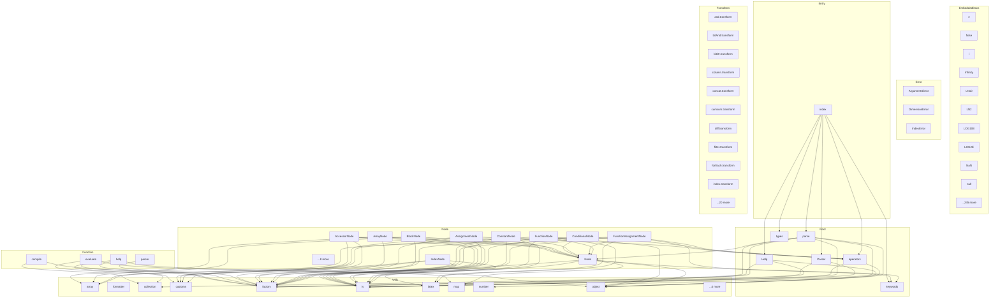

# @mathts/expression - Dependency Graph

**Version**: 0.1.0 | **Last Updated**: 2026-04-04

This document provides a comprehensive dependency graph of all files, components, imports, functions, and variables in the codebase.

---

## Table of Contents

1. [Overview](#overview)
2. [Package Dependencies](#package-dependencies)
3. [EmbeddedDocs Dependencies](#embeddeddocs-dependencies)
4. [Error Dependencies](#error-dependencies)
5. [Function Dependencies](#function-dependencies)
6. [Root Dependencies](#root-dependencies)
7. [Entry Dependencies](#entry-dependencies)
8. [Node Dependencies](#node-dependencies)
9. [Transform Dependencies](#transform-dependencies)
10. [Utils Dependencies](#utils-dependencies)
11. [Dependency Matrix](#dependency-matrix)
12. [Circular Dependency Analysis](#circular-dependency-analysis)
13. [Visual Dependency Graph](#visual-dependency-graph)
14. [Summary Statistics](#summary-statistics)

---

## Overview

The codebase is organized into the following modules:

- **embeddedDocs**: 255 files
- **error**: 3 files
- **function**: 4 files
- **root**: 6 files
- **entry**: 1 file
- **node**: 18 files
- **transform**: 30 files
- **utils**: 14 files

---

## EmbeddedDocs Dependencies

### `src/embeddedDocs/constants/e.ts` - e module

**Exports:**
- Constants: `eDocs`

---

### `src/embeddedDocs/constants/false.ts` - false module

**Exports:**
- Constants: `falseDocs`

---

### `src/embeddedDocs/constants/i.ts` - i module

**Exports:**
- Constants: `iDocs`

---

### `src/embeddedDocs/constants/Infinity.ts` - Infinity module

**Exports:**
- Constants: `InfinityDocs`

---

### `src/embeddedDocs/constants/LN10.ts` - LN10 module

**Exports:**
- Constants: `LN10Docs`

---

### `src/embeddedDocs/constants/LN2.ts` - LN2 module

**Exports:**
- Constants: `LN2Docs`

---

### `src/embeddedDocs/constants/LOG10E.ts` - LOG10E module

**Exports:**
- Constants: `LOG10EDocs`

---

### `src/embeddedDocs/constants/LOG2E.ts` - LOG2E module

**Exports:**
- Constants: `LOG2EDocs`

---

### `src/embeddedDocs/constants/NaN.ts` - NaN module

**Exports:**
- Constants: `NaNDocs`

---

### `src/embeddedDocs/constants/null.ts` - null module

**Exports:**
- Constants: `nullDocs`

---

### `src/embeddedDocs/constants/phi.ts` - phi module

**Exports:**
- Constants: `phiDocs`

---

### `src/embeddedDocs/constants/pi.ts` - pi module

**Exports:**
- Constants: `piDocs`

---

### `src/embeddedDocs/constants/SQRT1_2.ts` - SQRT1_2 module

**Exports:**
- Constants: `SQRT12Docs`

---

### `src/embeddedDocs/constants/SQRT2.ts` - SQRT2 module

**Exports:**
- Constants: `SQRT2Docs`

---

### `src/embeddedDocs/constants/tau.ts` - tau module

**Exports:**
- Constants: `tauDocs`

---

### `src/embeddedDocs/constants/true.ts` - true module

**Exports:**
- Constants: `trueDocs`

---

### `src/embeddedDocs/constants/version.ts` - version module

**Exports:**
- Constants: `versionDocs`

---

### `src/embeddedDocs/construction/bigint.ts` - bigint module

**Exports:**
- Constants: `bigintDocs`

---

### `src/embeddedDocs/construction/bignumber.ts` - bignumber module

**Exports:**
- Constants: `bignumberDocs`

---

### `src/embeddedDocs/construction/boolean.ts` - boolean module

**Exports:**
- Constants: `booleanDocs`

---

### `src/embeddedDocs/construction/complex.ts` - complex module

**Exports:**
- Constants: `complexDocs`

---

### `src/embeddedDocs/construction/createUnit.ts` - createUnit module

**Exports:**
- Constants: `createUnitDocs`

---

### `src/embeddedDocs/construction/fraction.ts` - fraction module

**Exports:**
- Constants: `fractionDocs`

---

### `src/embeddedDocs/construction/index.ts` - Entry point exporting 1 symbols

**Exports:**
- Constants: `indexDocs`

---

### `src/embeddedDocs/construction/matrix.ts` - matrix module

**Exports:**
- Constants: `matrixDocs`

---

### `src/embeddedDocs/construction/number.ts` - number module

**Exports:**
- Constants: `numberDocs`

---

### `src/embeddedDocs/construction/sparse.ts` - sparse module

**Exports:**
- Constants: `sparseDocs`

---

### `src/embeddedDocs/construction/splitUnit.ts` - splitUnit module

**Exports:**
- Constants: `splitUnitDocs`

---

### `src/embeddedDocs/construction/string.ts` - string module

**Exports:**
- Constants: `stringDocs`

---

### `src/embeddedDocs/construction/unit.ts` - unit module

**Exports:**
- Constants: `unitDocs`

---

### `src/embeddedDocs/core/config.ts` - config module

**Exports:**
- Constants: `configDocs`

---

### `src/embeddedDocs/core/import.ts` - import module

**Exports:**
- Constants: `importDocs`

---

### `src/embeddedDocs/core/typed.ts` - typed module

**Exports:**
- Constants: `typedDocs`

---

### `src/embeddedDocs/embeddedDocs.ts` - embeddedDocs module

**Internal Dependencies:**
| File | Imports | Type |
|------|---------|------|
| `./constants/e.js` | `eDocs` | Import |
| `./constants/false.js` | `falseDocs` | Import |
| `./constants/i.js` | `iDocs` | Import |
| `./constants/Infinity.js` | `InfinityDocs` | Import |
| `./constants/LN10.js` | `LN10Docs` | Import |
| `./constants/LN2.js` | `LN2Docs` | Import |
| `./constants/LOG10E.js` | `LOG10EDocs` | Import |
| `./constants/LOG2E.js` | `LOG2EDocs` | Import |
| `./constants/NaN.js` | `NaNDocs` | Import |
| `./constants/null.js` | `nullDocs` | Import |
| `./constants/phi.js` | `phiDocs` | Import |
| `./constants/pi.js` | `piDocs` | Import |
| `./constants/SQRT1_2.js` | `SQRT12Docs` | Import |
| `./constants/SQRT2.js` | `SQRT2Docs` | Import |
| `./constants/tau.js` | `tauDocs` | Import |
| `./constants/true.js` | `trueDocs` | Import |
| `./constants/version.js` | `versionDocs` | Import |
| `./construction/bignumber.js` | `bignumberDocs` | Import |
| `./construction/bigint.js` | `bigintDocs` | Import |
| `./construction/boolean.js` | `booleanDocs` | Import |
| `./construction/complex.js` | `complexDocs` | Import |
| `./construction/createUnit.js` | `createUnitDocs` | Import |
| `./construction/fraction.js` | `fractionDocs` | Import |
| `./construction/index.js` | `indexDocs` | Import |
| `./construction/matrix.js` | `matrixDocs` | Import |
| `./construction/number.js` | `numberDocs` | Import |
| `./construction/sparse.js` | `sparseDocs` | Import |
| `./construction/splitUnit.js` | `splitUnitDocs` | Import |
| `./construction/string.js` | `stringDocs` | Import |
| `./construction/unit.js` | `unitDocs` | Import |
| `./core/config.js` | `configDocs` | Import |
| `./core/import.js` | `importDocs` | Import |
| `./core/typed.js` | `typedDocs` | Import |
| `./function/algebra/derivative.js` | `derivativeDocs` | Import |
| `./function/algebra/leafCount.js` | `leafCountDocs` | Import |
| `./function/algebra/lsolve.js` | `lsolveDocs` | Import |
| `./function/algebra/lsolveAll.js` | `lsolveAllDocs` | Import |
| `./function/algebra/lup.js` | `lupDocs` | Import |
| `./function/algebra/lusolve.js` | `lusolveDocs` | Import |
| `./function/algebra/polynomialRoot.js` | `polynomialRootDocs` | Import |
| `./function/algebra/qr.js` | `qrDocs` | Import |
| `./function/algebra/rationalize.js` | `rationalizeDocs` | Import |
| `./function/algebra/resolve.js` | `resolveDocs` | Import |
| `./function/algebra/simplify.js` | `simplifyDocs` | Import |
| `./function/algebra/simplifyConstant.js` | `simplifyConstantDocs` | Import |
| `./function/algebra/simplifyCore.js` | `simplifyCoreDocs` | Import |
| `./function/algebra/slu.js` | `sluDocs` | Import |
| `./function/algebra/symbolicEqual.js` | `symbolicEqualDocs` | Import |
| `./function/algebra/usolve.js` | `usolveDocs` | Import |
| `./function/algebra/usolveAll.js` | `usolveAllDocs` | Import |
| `./function/arithmetic/abs.js` | `absDocs` | Import |
| `./function/arithmetic/add.js` | `addDocs` | Import |
| `./function/arithmetic/cbrt.js` | `cbrtDocs` | Import |
| `./function/arithmetic/ceil.js` | `ceilDocs` | Import |
| `./function/arithmetic/cube.js` | `cubeDocs` | Import |
| `./function/arithmetic/divide.js` | `divideDocs` | Import |
| `./function/arithmetic/dotDivide.js` | `dotDivideDocs` | Import |
| `./function/arithmetic/dotMultiply.js` | `dotMultiplyDocs` | Import |
| `./function/arithmetic/dotPow.js` | `dotPowDocs` | Import |
| `./function/arithmetic/exp.js` | `expDocs` | Import |
| `./function/arithmetic/expm.js` | `expmDocs` | Import |
| `./function/arithmetic/expm1.js` | `expm1Docs` | Import |
| `./function/arithmetic/fix.js` | `fixDocs` | Import |
| `./function/arithmetic/floor.js` | `floorDocs` | Import |
| `./function/arithmetic/gcd.js` | `gcdDocs` | Import |
| `./function/arithmetic/hypot.js` | `hypotDocs` | Import |
| `./function/arithmetic/invmod.js` | `invmodDocs` | Import |
| `./function/arithmetic/lcm.js` | `lcmDocs` | Import |
| `./function/arithmetic/log.js` | `logDocs` | Import |
| `./function/arithmetic/log10.js` | `log10Docs` | Import |
| `./function/arithmetic/log1p.js` | `log1pDocs` | Import |
| `./function/arithmetic/log2.js` | `log2Docs` | Import |
| `./function/arithmetic/mod.js` | `modDocs` | Import |
| `./function/arithmetic/multiply.js` | `multiplyDocs` | Import |
| `./function/arithmetic/norm.js` | `normDocs` | Import |
| `./function/arithmetic/nthRoot.js` | `nthRootDocs` | Import |
| `./function/arithmetic/nthRoots.js` | `nthRootsDocs` | Import |
| `./function/arithmetic/pow.js` | `powDocs` | Import |
| `./function/arithmetic/round.js` | `roundDocs` | Import |
| `./function/arithmetic/sign.js` | `signDocs` | Import |
| `./function/arithmetic/sqrt.js` | `sqrtDocs` | Import |
| `./function/arithmetic/sqrtm.js` | `sqrtmDocs` | Import |
| `./function/algebra/sylvester.js` | `sylvesterDocs` | Import |
| `./function/algebra/schur.js` | `schurDocs` | Import |
| `./function/algebra/lyap.js` | `lyapDocs` | Import |
| `./function/arithmetic/square.js` | `squareDocs` | Import |
| `./function/arithmetic/subtract.js` | `subtractDocs` | Import |
| `./function/arithmetic/unaryMinus.js` | `unaryMinusDocs` | Import |
| `./function/arithmetic/unaryPlus.js` | `unaryPlusDocs` | Import |
| `./function/arithmetic/xgcd.js` | `xgcdDocs` | Import |
| `./function/bitwise/bitAnd.js` | `bitAndDocs` | Import |
| `./function/bitwise/bitNot.js` | `bitNotDocs` | Import |
| `./function/bitwise/bitOr.js` | `bitOrDocs` | Import |
| `./function/bitwise/bitXor.js` | `bitXorDocs` | Import |
| `./function/bitwise/leftShift.js` | `leftShiftDocs` | Import |
| `./function/bitwise/rightArithShift.js` | `rightArithShiftDocs` | Import |
| `./function/bitwise/rightLogShift.js` | `rightLogShiftDocs` | Import |
| `./function/combinatorics/bellNumbers.js` | `bellNumbersDocs` | Import |
| `./function/combinatorics/catalan.js` | `catalanDocs` | Import |
| `./function/combinatorics/composition.js` | `compositionDocs` | Import |
| `./function/combinatorics/stirlingS2.js` | `stirlingS2Docs` | Import |
| `./function/complex/arg.js` | `argDocs` | Import |
| `./function/complex/conj.js` | `conjDocs` | Import |
| `./function/complex/im.js` | `imDocs` | Import |
| `./function/complex/re.js` | `reDocs` | Import |
| `./function/expression/evaluate.js` | `evaluateDocs` | Import |
| `./function/expression/parser.js` | `parserDocs` | Import |
| `./function/expression/parse.js` | `parseDocs` | Import |
| `./function/expression/compile.js` | `compileDocs` | Import |
| `./function/expression/help.js` | `helpDocs` | Import |
| `./function/geometry/distance.js` | `distanceDocs` | Import |
| `./function/geometry/intersect.js` | `intersectDocs` | Import |
| `./function/logical/and.js` | `andDocs` | Import |
| `./function/logical/not.js` | `notDocs` | Import |
| `./function/logical/nullish.js` | `nullishDocs` | Import |
| `./function/logical/or.js` | `orDocs` | Import |
| `./function/logical/xor.js` | `xorDocs` | Import |
| `./function/matrix/mapSlices.js` | `mapSlicesDocs` | Import |
| `./function/matrix/column.js` | `columnDocs` | Import |
| `./function/matrix/concat.js` | `concatDocs` | Import |
| `./function/matrix/count.js` | `countDocs` | Import |
| `./function/matrix/cross.js` | `crossDocs` | Import |
| `./function/matrix/ctranspose.js` | `ctransposeDocs` | Import |
| `./function/matrix/det.js` | `detDocs` | Import |
| `./function/matrix/diag.js` | `diagDocs` | Import |
| `./function/matrix/diff.js` | `diffDocs` | Import |
| `./function/matrix/dot.js` | `dotDocs` | Import |
| `./function/matrix/eigs.js` | `eigsDocs` | Import |
| `./function/matrix/filter.js` | `filterDocs` | Import |
| `./function/matrix/flatten.js` | `flattenDocs` | Import |
| `./function/matrix/forEach.js` | `forEachDocs` | Import |
| `./function/matrix/getMatrixDataType.js` | `getMatrixDataTypeDocs` | Import |
| `./function/matrix/identity.js` | `identityDocs` | Import |
| `./function/matrix/inv.js` | `invDocs` | Import |
| `./function/matrix/pinv.js` | `pinvDocs` | Import |
| `./function/matrix/kron.js` | `kronDocs` | Import |
| `./function/matrix/map.js` | `mapDocs` | Import |
| `./function/matrix/matrixFromColumns.js` | `matrixFromColumnsDocs` | Import |
| `./function/matrix/matrixFromFunction.js` | `matrixFromFunctionDocs` | Import |
| `./function/matrix/matrixFromRows.js` | `matrixFromRowsDocs` | Import |
| `./function/matrix/ones.js` | `onesDocs` | Import |
| `./function/matrix/partitionSelect.js` | `partitionSelectDocs` | Import |
| `./function/matrix/range.js` | `rangeDocs` | Import |
| `./function/matrix/reshape.js` | `reshapeDocs` | Import |
| `./function/matrix/resize.js` | `resizeDocs` | Import |
| `./function/matrix/rotate.js` | `rotateDocs` | Import |
| `./function/matrix/rotationMatrix.js` | `rotationMatrixDocs` | Import |
| `./function/matrix/row.js` | `rowDocs` | Import |
| `./function/matrix/size.js` | `sizeDocs` | Import |
| `./function/matrix/sort.js` | `sortDocs` | Import |
| `./function/matrix/squeeze.js` | `squeezeDocs` | Import |
| `./function/matrix/subset.js` | `subsetDocs` | Import |
| `./function/matrix/trace.js` | `traceDocs` | Import |
| `./function/matrix/transpose.js` | `transposeDocs` | Import |
| `./function/matrix/zeros.js` | `zerosDocs` | Import |
| `./function/matrix/fft.js` | `fftDocs` | Import |
| `./function/matrix/ifft.js` | `ifftDocs` | Import |
| `./function/probability/bernoulli.js` | `bernoulliDocs` | Import |
| `./function/probability/combinations.js` | `combinationsDocs` | Import |
| `./function/probability/combinationsWithRep.js` | `combinationsWithRepDocs` | Import |
| `./function/probability/factorial.js` | `factorialDocs` | Import |
| `./function/probability/gamma.js` | `gammaDocs` | Import |
| `./function/probability/lgamma.js` | `lgammaDocs` | Import |
| `./function/probability/kldivergence.js` | `kldivergenceDocs` | Import |
| `./function/probability/multinomial.js` | `multinomialDocs` | Import |
| `./function/probability/permutations.js` | `permutationsDocs` | Import |
| `./function/probability/pickRandom.js` | `pickRandomDocs` | Import |
| `./function/probability/random.js` | `randomDocs` | Import |
| `./function/probability/randomInt.js` | `randomIntDocs` | Import |
| `./function/relational/compare.js` | `compareDocs` | Import |
| `./function/relational/compareNatural.js` | `compareNaturalDocs` | Import |
| `./function/relational/compareText.js` | `compareTextDocs` | Import |
| `./function/relational/deepEqual.js` | `deepEqualDocs` | Import |
| `./function/relational/equal.js` | `equalDocs` | Import |
| `./function/relational/equalText.js` | `equalTextDocs` | Import |
| `./function/relational/larger.js` | `largerDocs` | Import |
| `./function/relational/largerEq.js` | `largerEqDocs` | Import |
| `./function/relational/smaller.js` | `smallerDocs` | Import |
| `./function/relational/smallerEq.js` | `smallerEqDocs` | Import |
| `./function/relational/unequal.js` | `unequalDocs` | Import |
| `./function/set/setCartesian.js` | `setCartesianDocs` | Import |
| `./function/set/setDifference.js` | `setDifferenceDocs` | Import |
| `./function/set/setDistinct.js` | `setDistinctDocs` | Import |
| `./function/set/setIntersect.js` | `setIntersectDocs` | Import |
| `./function/set/setIsSubset.js` | `setIsSubsetDocs` | Import |
| `./function/set/setMultiplicity.js` | `setMultiplicityDocs` | Import |
| `./function/set/setPowerset.js` | `setPowersetDocs` | Import |
| `./function/set/setSize.js` | `setSizeDocs` | Import |
| `./function/set/setSymDifference.js` | `setSymDifferenceDocs` | Import |
| `./function/set/setUnion.js` | `setUnionDocs` | Import |
| `./function/signal/zpk2tf.js` | `zpk2tfDocs` | Import |
| `./function/signal/freqz.js` | `freqzDocs` | Import |
| `./function/special/erf.js` | `erfDocs` | Import |
| `./function/special/zeta.js` | `zetaDocs` | Import |
| `./function/statistics/mad.js` | `madDocs` | Import |
| `./function/statistics/max.js` | `maxDocs` | Import |
| `./function/statistics/mean.js` | `meanDocs` | Import |
| `./function/statistics/median.js` | `medianDocs` | Import |
| `./function/statistics/min.js` | `minDocs` | Import |
| `./function/statistics/mode.js` | `modeDocs` | Import |
| `./function/statistics/prod.js` | `prodDocs` | Import |
| `./function/statistics/quantileSeq.js` | `quantileSeqDocs` | Import |
| `./function/statistics/std.js` | `stdDocs` | Import |
| `./function/statistics/cumsum.js` | `cumSumDocs` | Import |
| `./function/statistics/sum.js` | `sumDocs` | Import |
| `./function/statistics/variance.js` | `varianceDocs` | Import |
| `./function/statistics/corr.js` | `corrDocs` | Import |
| `./function/trigonometry/acos.js` | `acosDocs` | Import |
| `./function/trigonometry/acosh.js` | `acoshDocs` | Import |
| `./function/trigonometry/acot.js` | `acotDocs` | Import |
| `./function/trigonometry/acoth.js` | `acothDocs` | Import |
| `./function/trigonometry/acsc.js` | `acscDocs` | Import |
| `./function/trigonometry/acsch.js` | `acschDocs` | Import |
| `./function/trigonometry/asec.js` | `asecDocs` | Import |
| `./function/trigonometry/asech.js` | `asechDocs` | Import |
| `./function/trigonometry/asin.js` | `asinDocs` | Import |
| `./function/trigonometry/asinh.js` | `asinhDocs` | Import |
| `./function/trigonometry/atan.js` | `atanDocs` | Import |
| `./function/trigonometry/atan2.js` | `atan2Docs` | Import |
| `./function/trigonometry/atanh.js` | `atanhDocs` | Import |
| `./function/trigonometry/cos.js` | `cosDocs` | Import |
| `./function/trigonometry/cosh.js` | `coshDocs` | Import |
| `./function/trigonometry/cot.js` | `cotDocs` | Import |
| `./function/trigonometry/coth.js` | `cothDocs` | Import |
| `./function/trigonometry/csc.js` | `cscDocs` | Import |
| `./function/trigonometry/csch.js` | `cschDocs` | Import |
| `./function/trigonometry/sec.js` | `secDocs` | Import |
| `./function/trigonometry/sech.js` | `sechDocs` | Import |
| `./function/trigonometry/sin.js` | `sinDocs` | Import |
| `./function/trigonometry/sinh.js` | `sinhDocs` | Import |
| `./function/trigonometry/tan.js` | `tanDocs` | Import |
| `./function/trigonometry/tanh.js` | `tanhDocs` | Import |
| `./function/units/to.js` | `toDocs` | Import |
| `./function/units/toBest.js` | `toBestDocs` | Import |
| `./function/utils/bin.js` | `binDocs` | Import |
| `./function/utils/clone.js` | `cloneDocs` | Import |
| `./function/utils/format.js` | `formatDocs` | Import |
| `./function/utils/hasNumericValue.js` | `hasNumericValueDocs` | Import |
| `./function/utils/hex.js` | `hexDocs` | Import |
| `./function/utils/isInteger.js` | `isIntegerDocs` | Import |
| `./function/utils/isNaN.js` | `isNaNDocs` | Import |
| `./function/utils/isBounded.js` | `isBoundedDocs` | Import |
| `./function/utils/isFinite.js` | `isFiniteDocs` | Import |
| `./function/utils/isNegative.js` | `isNegativeDocs` | Import |
| `./function/utils/isNumeric.js` | `isNumericDocs` | Import |
| `./function/utils/isPositive.js` | `isPositiveDocs` | Import |
| `./function/utils/isPrime.js` | `isPrimeDocs` | Import |
| `./function/utils/isZero.js` | `isZeroDocs` | Import |
| `./function/utils/numeric.js` | `numericDocs` | Import |
| `./function/utils/oct.js` | `octDocs` | Import |
| `./function/utils/print.js` | `printDocs` | Import |
| `./function/utils/typeOf.js` | `typeOfDocs` | Import |
| `./function/numeric/solveODE.js` | `solveODEDocs` | Import |

**Exports:**
- Constants: `embeddedDocs`

---

### `src/embeddedDocs/function/algebra/derivative.ts` - derivative module

**Exports:**
- Constants: `derivativeDocs`

---

### `src/embeddedDocs/function/algebra/leafCount.ts` - leafCount module

**Exports:**
- Constants: `leafCountDocs`

---

### `src/embeddedDocs/function/algebra/lsolve.ts` - lsolve module

**Exports:**
- Constants: `lsolveDocs`

---

### `src/embeddedDocs/function/algebra/lsolveAll.ts` - lsolveAll module

**Exports:**
- Constants: `lsolveAllDocs`

---

### `src/embeddedDocs/function/algebra/lup.ts` - lup module

**Exports:**
- Constants: `lupDocs`

---

### `src/embeddedDocs/function/algebra/lusolve.ts` - lusolve module

**Exports:**
- Constants: `lusolveDocs`

---

### `src/embeddedDocs/function/algebra/lyap.ts` - lyap module

**Exports:**
- Constants: `lyapDocs`

---

### `src/embeddedDocs/function/algebra/polynomialRoot.ts` - polynomialRoot module

**Exports:**
- Constants: `polynomialRootDocs`

---

### `src/embeddedDocs/function/algebra/qr.ts` - qr module

**Exports:**
- Constants: `qrDocs`

---

### `src/embeddedDocs/function/algebra/rationalize.ts` - rationalize module

**Exports:**
- Constants: `rationalizeDocs`

---

### `src/embeddedDocs/function/algebra/resolve.ts` - resolve module

**Exports:**
- Constants: `resolveDocs`

---

### `src/embeddedDocs/function/algebra/schur.ts` - schur module

**Exports:**
- Constants: `schurDocs`

---

### `src/embeddedDocs/function/algebra/simplify.ts` - simplify module

**Exports:**
- Constants: `simplifyDocs`

---

### `src/embeddedDocs/function/algebra/simplifyConstant.ts` - simplifyConstant module

**Exports:**
- Constants: `simplifyConstantDocs`

---

### `src/embeddedDocs/function/algebra/simplifyCore.ts` - simplifyCore module

**Exports:**
- Constants: `simplifyCoreDocs`

---

### `src/embeddedDocs/function/algebra/slu.ts` - slu module

**Exports:**
- Constants: `sluDocs`

---

### `src/embeddedDocs/function/algebra/sylvester.ts` - sylvester module

**Exports:**
- Constants: `sylvesterDocs`

---

### `src/embeddedDocs/function/algebra/symbolicEqual.ts` - symbolicEqual module

**Exports:**
- Constants: `symbolicEqualDocs`

---

### `src/embeddedDocs/function/algebra/usolve.ts` - usolve module

**Exports:**
- Constants: `usolveDocs`

---

### `src/embeddedDocs/function/algebra/usolveAll.ts` - usolveAll module

**Exports:**
- Constants: `usolveAllDocs`

---

### `src/embeddedDocs/function/arithmetic/abs.ts` - abs module

**Exports:**
- Constants: `absDocs`

---

### `src/embeddedDocs/function/arithmetic/add.ts` - add module

**Exports:**
- Constants: `addDocs`

---

### `src/embeddedDocs/function/arithmetic/cbrt.ts` - cbrt module

**Exports:**
- Constants: `cbrtDocs`

---

### `src/embeddedDocs/function/arithmetic/ceil.ts` - ceil module

**Exports:**
- Constants: `ceilDocs`

---

### `src/embeddedDocs/function/arithmetic/cube.ts` - cube module

**Exports:**
- Constants: `cubeDocs`

---

### `src/embeddedDocs/function/arithmetic/divide.ts` - divide module

**Exports:**
- Constants: `divideDocs`

---

### `src/embeddedDocs/function/arithmetic/dotDivide.ts` - dotDivide module

**Exports:**
- Constants: `dotDivideDocs`

---

### `src/embeddedDocs/function/arithmetic/dotMultiply.ts` - dotMultiply module

**Exports:**
- Constants: `dotMultiplyDocs`

---

### `src/embeddedDocs/function/arithmetic/dotPow.ts` - dotPow module

**Exports:**
- Constants: `dotPowDocs`

---

### `src/embeddedDocs/function/arithmetic/exp.ts` - exp module

**Exports:**
- Constants: `expDocs`

---

### `src/embeddedDocs/function/arithmetic/expm.ts` - expm module

**Exports:**
- Constants: `expmDocs`

---

### `src/embeddedDocs/function/arithmetic/expm1.ts` - expm1 module

**Exports:**
- Constants: `expm1Docs`

---

### `src/embeddedDocs/function/arithmetic/fix.ts` - fix module

**Exports:**
- Constants: `fixDocs`

---

### `src/embeddedDocs/function/arithmetic/floor.ts` - floor module

**Exports:**
- Constants: `floorDocs`

---

### `src/embeddedDocs/function/arithmetic/gcd.ts` - gcd module

**Exports:**
- Constants: `gcdDocs`

---

### `src/embeddedDocs/function/arithmetic/hypot.ts` - hypot module

**Exports:**
- Constants: `hypotDocs`

---

### `src/embeddedDocs/function/arithmetic/invmod.ts` - invmod module

**Exports:**
- Constants: `invmodDocs`

---

### `src/embeddedDocs/function/arithmetic/lcm.ts` - lcm module

**Exports:**
- Constants: `lcmDocs`

---

### `src/embeddedDocs/function/arithmetic/log.ts` - log module

**Exports:**
- Constants: `logDocs`

---

### `src/embeddedDocs/function/arithmetic/log10.ts` - log10 module

**Exports:**
- Constants: `log10Docs`

---

### `src/embeddedDocs/function/arithmetic/log1p.ts` - log1p module

**Exports:**
- Constants: `log1pDocs`

---

### `src/embeddedDocs/function/arithmetic/log2.ts` - log2 module

**Exports:**
- Constants: `log2Docs`

---

### `src/embeddedDocs/function/arithmetic/mod.ts` - mod module

**Exports:**
- Constants: `modDocs`

---

### `src/embeddedDocs/function/arithmetic/multiply.ts` - multiply module

**Exports:**
- Constants: `multiplyDocs`

---

### `src/embeddedDocs/function/arithmetic/norm.ts` - norm module

**Exports:**
- Constants: `normDocs`

---

### `src/embeddedDocs/function/arithmetic/nthRoot.ts` - nthRoot module

**Exports:**
- Constants: `nthRootDocs`

---

### `src/embeddedDocs/function/arithmetic/nthRoots.ts` - nthRoots module

**Exports:**
- Constants: `nthRootsDocs`

---

### `src/embeddedDocs/function/arithmetic/pow.ts` - pow module

**Exports:**
- Constants: `powDocs`

---

### `src/embeddedDocs/function/arithmetic/round.ts` - round module

**Exports:**
- Constants: `roundDocs`

---

### `src/embeddedDocs/function/arithmetic/sign.ts` - sign module

**Exports:**
- Constants: `signDocs`

---

### `src/embeddedDocs/function/arithmetic/sqrt.ts` - sqrt module

**Exports:**
- Constants: `sqrtDocs`

---

### `src/embeddedDocs/function/arithmetic/sqrtm.ts` - sqrtm module

**Exports:**
- Constants: `sqrtmDocs`

---

### `src/embeddedDocs/function/arithmetic/square.ts` - square module

**Exports:**
- Constants: `squareDocs`

---

### `src/embeddedDocs/function/arithmetic/subtract.ts` - subtract module

**Exports:**
- Constants: `subtractDocs`

---

### `src/embeddedDocs/function/arithmetic/unaryMinus.ts` - unaryMinus module

**Exports:**
- Constants: `unaryMinusDocs`

---

### `src/embeddedDocs/function/arithmetic/unaryPlus.ts` - unaryPlus module

**Exports:**
- Constants: `unaryPlusDocs`

---

### `src/embeddedDocs/function/arithmetic/xgcd.ts` - xgcd module

**Exports:**
- Constants: `xgcdDocs`

---

### `src/embeddedDocs/function/bitwise/bitAnd.ts` - bitAnd module

**Exports:**
- Constants: `bitAndDocs`

---

### `src/embeddedDocs/function/bitwise/bitNot.ts` - bitNot module

**Exports:**
- Constants: `bitNotDocs`

---

### `src/embeddedDocs/function/bitwise/bitOr.ts` - bitOr module

**Exports:**
- Constants: `bitOrDocs`

---

### `src/embeddedDocs/function/bitwise/bitXor.ts` - bitXor module

**Exports:**
- Constants: `bitXorDocs`

---

### `src/embeddedDocs/function/bitwise/leftShift.ts` - leftShift module

**Exports:**
- Constants: `leftShiftDocs`

---

### `src/embeddedDocs/function/bitwise/rightArithShift.ts` - rightArithShift module

**Exports:**
- Constants: `rightArithShiftDocs`

---

### `src/embeddedDocs/function/bitwise/rightLogShift.ts` - rightLogShift module

**Exports:**
- Constants: `rightLogShiftDocs`

---

### `src/embeddedDocs/function/combinatorics/bellNumbers.ts` - bellNumbers module

**Exports:**
- Constants: `bellNumbersDocs`

---

### `src/embeddedDocs/function/combinatorics/catalan.ts` - catalan module

**Exports:**
- Constants: `catalanDocs`

---

### `src/embeddedDocs/function/combinatorics/composition.ts` - composition module

**Exports:**
- Constants: `compositionDocs`

---

### `src/embeddedDocs/function/combinatorics/stirlingS2.ts` - stirlingS2 module

**Exports:**
- Constants: `stirlingS2Docs`

---

### `src/embeddedDocs/function/complex/arg.ts` - arg module

**Exports:**
- Constants: `argDocs`

---

### `src/embeddedDocs/function/complex/conj.ts` - conj module

**Exports:**
- Constants: `conjDocs`

---

### `src/embeddedDocs/function/complex/im.ts` - im module

**Exports:**
- Constants: `imDocs`

---

### `src/embeddedDocs/function/complex/re.ts` - re module

**Exports:**
- Constants: `reDocs`

---

### `src/embeddedDocs/function/expression/compile.ts` - compile module

**Exports:**
- Constants: `compileDocs`

---

### `src/embeddedDocs/function/expression/evaluate.ts` - evaluate module

**Exports:**
- Constants: `evaluateDocs`

---

### `src/embeddedDocs/function/expression/help.ts` - help module

**Exports:**
- Constants: `helpDocs`

---

### `src/embeddedDocs/function/expression/parse.ts` - parse module

**Exports:**
- Constants: `parseDocs`

---

### `src/embeddedDocs/function/expression/parser.ts` - parser module

**Exports:**
- Constants: `parserDocs`

---

### `src/embeddedDocs/function/geometry/distance.ts` - distance module

**Exports:**
- Constants: `distanceDocs`

---

### `src/embeddedDocs/function/geometry/intersect.ts` - intersect module

**Exports:**
- Constants: `intersectDocs`

---

### `src/embeddedDocs/function/logical/and.ts` - and module

**Exports:**
- Constants: `andDocs`

---

### `src/embeddedDocs/function/logical/not.ts` - not module

**Exports:**
- Constants: `notDocs`

---

### `src/embeddedDocs/function/logical/nullish.ts` - nullish module

**Exports:**
- Constants: `nullishDocs`

---

### `src/embeddedDocs/function/logical/or.ts` - or module

**Exports:**
- Constants: `orDocs`

---

### `src/embeddedDocs/function/logical/xor.ts` - xor module

**Exports:**
- Constants: `xorDocs`

---

### `src/embeddedDocs/function/matrix/column.ts` - column module

**Exports:**
- Constants: `columnDocs`

---

### `src/embeddedDocs/function/matrix/concat.ts` - concat module

**Exports:**
- Constants: `concatDocs`

---

### `src/embeddedDocs/function/matrix/count.ts` - count module

**Exports:**
- Constants: `countDocs`

---

### `src/embeddedDocs/function/matrix/cross.ts` - cross module

**Exports:**
- Constants: `crossDocs`

---

### `src/embeddedDocs/function/matrix/ctranspose.ts` - ctranspose module

**Exports:**
- Constants: `ctransposeDocs`

---

### `src/embeddedDocs/function/matrix/det.ts` - det module

**Exports:**
- Constants: `detDocs`

---

### `src/embeddedDocs/function/matrix/diag.ts` - diag module

**Exports:**
- Constants: `diagDocs`

---

### `src/embeddedDocs/function/matrix/diff.ts` - diff module

**Exports:**
- Constants: `diffDocs`

---

### `src/embeddedDocs/function/matrix/dot.ts` - dot module

**Exports:**
- Constants: `dotDocs`

---

### `src/embeddedDocs/function/matrix/eigs.ts` - eigs module

**Exports:**
- Constants: `eigsDocs`

---

### `src/embeddedDocs/function/matrix/fft.ts` - fft module

**Exports:**
- Constants: `fftDocs`

---

### `src/embeddedDocs/function/matrix/filter.ts` - filter module

**Exports:**
- Constants: `filterDocs`

---

### `src/embeddedDocs/function/matrix/flatten.ts` - flatten module

**Exports:**
- Constants: `flattenDocs`

---

### `src/embeddedDocs/function/matrix/forEach.ts` - forEach module

**Exports:**
- Constants: `forEachDocs`

---

### `src/embeddedDocs/function/matrix/getMatrixDataType.ts` - getMatrixDataType module

**Exports:**
- Constants: `getMatrixDataTypeDocs`

---

### `src/embeddedDocs/function/matrix/identity.ts` - identity module

**Exports:**
- Constants: `identityDocs`

---

### `src/embeddedDocs/function/matrix/ifft.ts` - ifft module

**Exports:**
- Constants: `ifftDocs`

---

### `src/embeddedDocs/function/matrix/inv.ts` - inv module

**Exports:**
- Constants: `invDocs`

---

### `src/embeddedDocs/function/matrix/kron.ts` - kron module

**Exports:**
- Constants: `kronDocs`

---

### `src/embeddedDocs/function/matrix/map.ts` - map module

**Exports:**
- Constants: `mapDocs`

---

### `src/embeddedDocs/function/matrix/mapSlices.ts` - mapSlices module

**Exports:**
- Constants: `mapSlicesDocs`

---

### `src/embeddedDocs/function/matrix/matrixFromColumns.ts` - matrixFromColumns module

**Exports:**
- Constants: `matrixFromColumnsDocs`

---

### `src/embeddedDocs/function/matrix/matrixFromFunction.ts` - matrixFromFunction module

**Exports:**
- Constants: `matrixFromFunctionDocs`

---

### `src/embeddedDocs/function/matrix/matrixFromRows.ts` - matrixFromRows module

**Exports:**
- Constants: `matrixFromRowsDocs`

---

### `src/embeddedDocs/function/matrix/ones.ts` - ones module

**Exports:**
- Constants: `onesDocs`

---

### `src/embeddedDocs/function/matrix/partitionSelect.ts` - partitionSelect module

**Exports:**
- Constants: `partitionSelectDocs`

---

### `src/embeddedDocs/function/matrix/pinv.ts` - pinv module

**Exports:**
- Constants: `pinvDocs`

---

### `src/embeddedDocs/function/matrix/range.ts` - range module

**Exports:**
- Constants: `rangeDocs`

---

### `src/embeddedDocs/function/matrix/reshape.ts` - reshape module

**Exports:**
- Constants: `reshapeDocs`

---

### `src/embeddedDocs/function/matrix/resize.ts` - resize module

**Exports:**
- Constants: `resizeDocs`

---

### `src/embeddedDocs/function/matrix/rotate.ts` - rotate module

**Exports:**
- Constants: `rotateDocs`

---

### `src/embeddedDocs/function/matrix/rotationMatrix.ts` - rotationMatrix module

**Exports:**
- Constants: `rotationMatrixDocs`

---

### `src/embeddedDocs/function/matrix/row.ts` - row module

**Exports:**
- Constants: `rowDocs`

---

### `src/embeddedDocs/function/matrix/size.ts` - size module

**Exports:**
- Constants: `sizeDocs`

---

### `src/embeddedDocs/function/matrix/sort.ts` - sort module

**Exports:**
- Constants: `sortDocs`

---

### `src/embeddedDocs/function/matrix/squeeze.ts` - squeeze module

**Exports:**
- Constants: `squeezeDocs`

---

### `src/embeddedDocs/function/matrix/subset.ts` - subset module

**Exports:**
- Constants: `subsetDocs`

---

### `src/embeddedDocs/function/matrix/trace.ts` - trace module

**Exports:**
- Constants: `traceDocs`

---

### `src/embeddedDocs/function/matrix/transpose.ts` - transpose module

**Exports:**
- Constants: `transposeDocs`

---

### `src/embeddedDocs/function/matrix/zeros.ts` - zeros module

**Exports:**
- Constants: `zerosDocs`

---

### `src/embeddedDocs/function/numeric/solveODE.ts` - solveODE module

**Exports:**
- Constants: `solveODEDocs`

---

### `src/embeddedDocs/function/probability/bernoulli.ts` - bernoulli module

**Exports:**
- Constants: `bernoulliDocs`

---

### `src/embeddedDocs/function/probability/combinations.ts` - combinations module

**Exports:**
- Constants: `combinationsDocs`

---

### `src/embeddedDocs/function/probability/combinationsWithRep.ts` - combinationsWithRep module

**Exports:**
- Constants: `combinationsWithRepDocs`

---

### `src/embeddedDocs/function/probability/distribution.ts` - distribution module

**Exports:**
- Constants: `distributionDocs`

---

### `src/embeddedDocs/function/probability/factorial.ts` - factorial module

**Exports:**
- Constants: `factorialDocs`

---

### `src/embeddedDocs/function/probability/gamma.ts` - gamma module

**Exports:**
- Constants: `gammaDocs`

---

### `src/embeddedDocs/function/probability/kldivergence.ts` - kldivergence module

**Exports:**
- Constants: `kldivergenceDocs`

---

### `src/embeddedDocs/function/probability/lgamma.ts` - lgamma module

**Exports:**
- Constants: `lgammaDocs`

---

### `src/embeddedDocs/function/probability/multinomial.ts` - multinomial module

**Exports:**
- Constants: `multinomialDocs`

---

### `src/embeddedDocs/function/probability/permutations.ts` - permutations module

**Exports:**
- Constants: `permutationsDocs`

---

### `src/embeddedDocs/function/probability/pickRandom.ts` - pickRandom module

**Exports:**
- Constants: `pickRandomDocs`

---

### `src/embeddedDocs/function/probability/random.ts` - random module

**Exports:**
- Constants: `randomDocs`

---

### `src/embeddedDocs/function/probability/randomInt.ts` - randomInt module

**Exports:**
- Constants: `randomIntDocs`

---

### `src/embeddedDocs/function/relational/compare.ts` - compare module

**Exports:**
- Constants: `compareDocs`

---

### `src/embeddedDocs/function/relational/compareNatural.ts` - compareNatural module

**Exports:**
- Constants: `compareNaturalDocs`

---

### `src/embeddedDocs/function/relational/compareText.ts` - compareText module

**Exports:**
- Constants: `compareTextDocs`

---

### `src/embeddedDocs/function/relational/deepEqual.ts` - deepEqual module

**Exports:**
- Constants: `deepEqualDocs`

---

### `src/embeddedDocs/function/relational/equal.ts` - equal module

**Exports:**
- Constants: `equalDocs`

---

### `src/embeddedDocs/function/relational/equalText.ts` - equalText module

**Exports:**
- Constants: `equalTextDocs`

---

### `src/embeddedDocs/function/relational/larger.ts` - larger module

**Exports:**
- Constants: `largerDocs`

---

### `src/embeddedDocs/function/relational/largerEq.ts` - largerEq module

**Exports:**
- Constants: `largerEqDocs`

---

### `src/embeddedDocs/function/relational/smaller.ts` - smaller module

**Exports:**
- Constants: `smallerDocs`

---

### `src/embeddedDocs/function/relational/smallerEq.ts` - smallerEq module

**Exports:**
- Constants: `smallerEqDocs`

---

### `src/embeddedDocs/function/relational/unequal.ts` - unequal module

**Exports:**
- Constants: `unequalDocs`

---

### `src/embeddedDocs/function/set/setCartesian.ts` - setCartesian module

**Exports:**
- Constants: `setCartesianDocs`

---

### `src/embeddedDocs/function/set/setDifference.ts` - setDifference module

**Exports:**
- Constants: `setDifferenceDocs`

---

### `src/embeddedDocs/function/set/setDistinct.ts` - setDistinct module

**Exports:**
- Constants: `setDistinctDocs`

---

### `src/embeddedDocs/function/set/setIntersect.ts` - setIntersect module

**Exports:**
- Constants: `setIntersectDocs`

---

### `src/embeddedDocs/function/set/setIsSubset.ts` - setIsSubset module

**Exports:**
- Constants: `setIsSubsetDocs`

---

### `src/embeddedDocs/function/set/setMultiplicity.ts` - setMultiplicity module

**Exports:**
- Constants: `setMultiplicityDocs`

---

### `src/embeddedDocs/function/set/setPowerset.ts` - setPowerset module

**Exports:**
- Constants: `setPowersetDocs`

---

### `src/embeddedDocs/function/set/setSize.ts` - setSize module

**Exports:**
- Constants: `setSizeDocs`

---

### `src/embeddedDocs/function/set/setSymDifference.ts` - setSymDifference module

**Exports:**
- Constants: `setSymDifferenceDocs`

---

### `src/embeddedDocs/function/set/setUnion.ts` - setUnion module

**Exports:**
- Constants: `setUnionDocs`

---

### `src/embeddedDocs/function/signal/freqz.ts` - freqz module

**Exports:**
- Constants: `freqzDocs`

---

### `src/embeddedDocs/function/signal/zpk2tf.ts` - zpk2tf module

**Exports:**
- Constants: `zpk2tfDocs`

---

### `src/embeddedDocs/function/special/erf.ts` - erf module

**Exports:**
- Constants: `erfDocs`

---

### `src/embeddedDocs/function/special/zeta.ts` - zeta module

**Exports:**
- Constants: `zetaDocs`

---

### `src/embeddedDocs/function/statistics/corr.ts` - corr module

**Exports:**
- Constants: `corrDocs`

---

### `src/embeddedDocs/function/statistics/cumsum.ts` - cumsum module

**Exports:**
- Constants: `cumSumDocs`

---

### `src/embeddedDocs/function/statistics/mad.ts` - mad module

**Exports:**
- Constants: `madDocs`

---

### `src/embeddedDocs/function/statistics/max.ts` - max module

**Exports:**
- Constants: `maxDocs`

---

### `src/embeddedDocs/function/statistics/mean.ts` - mean module

**Exports:**
- Constants: `meanDocs`

---

### `src/embeddedDocs/function/statistics/median.ts` - median module

**Exports:**
- Constants: `medianDocs`

---

### `src/embeddedDocs/function/statistics/min.ts` - min module

**Exports:**
- Constants: `minDocs`

---

### `src/embeddedDocs/function/statistics/mode.ts` - mode module

**Exports:**
- Constants: `modeDocs`

---

### `src/embeddedDocs/function/statistics/prod.ts` - prod module

**Exports:**
- Constants: `prodDocs`

---

### `src/embeddedDocs/function/statistics/quantileSeq.ts` - quantileSeq module

**Exports:**
- Constants: `quantileSeqDocs`

---

### `src/embeddedDocs/function/statistics/std.ts` - std module

**Exports:**
- Constants: `stdDocs`

---

### `src/embeddedDocs/function/statistics/sum.ts` - sum module

**Exports:**
- Constants: `sumDocs`

---

### `src/embeddedDocs/function/statistics/variance.ts` - variance module

**Exports:**
- Constants: `varianceDocs`

---

### `src/embeddedDocs/function/trigonometry/acos.ts` - acos module

**Exports:**
- Constants: `acosDocs`

---

### `src/embeddedDocs/function/trigonometry/acosh.ts` - acosh module

**Exports:**
- Constants: `acoshDocs`

---

### `src/embeddedDocs/function/trigonometry/acot.ts` - acot module

**Exports:**
- Constants: `acotDocs`

---

### `src/embeddedDocs/function/trigonometry/acoth.ts` - acoth module

**Exports:**
- Constants: `acothDocs`

---

### `src/embeddedDocs/function/trigonometry/acsc.ts` - acsc module

**Exports:**
- Constants: `acscDocs`

---

### `src/embeddedDocs/function/trigonometry/acsch.ts` - acsch module

**Exports:**
- Constants: `acschDocs`

---

### `src/embeddedDocs/function/trigonometry/asec.ts` - asec module

**Exports:**
- Constants: `asecDocs`

---

### `src/embeddedDocs/function/trigonometry/asech.ts` - asech module

**Exports:**
- Constants: `asechDocs`

---

### `src/embeddedDocs/function/trigonometry/asin.ts` - asin module

**Exports:**
- Constants: `asinDocs`

---

### `src/embeddedDocs/function/trigonometry/asinh.ts` - asinh module

**Exports:**
- Constants: `asinhDocs`

---

### `src/embeddedDocs/function/trigonometry/atan.ts` - atan module

**Exports:**
- Constants: `atanDocs`

---

### `src/embeddedDocs/function/trigonometry/atan2.ts` - atan2 module

**Exports:**
- Constants: `atan2Docs`

---

### `src/embeddedDocs/function/trigonometry/atanh.ts` - atanh module

**Exports:**
- Constants: `atanhDocs`

---

### `src/embeddedDocs/function/trigonometry/cos.ts` - cos module

**Exports:**
- Constants: `cosDocs`

---

### `src/embeddedDocs/function/trigonometry/cosh.ts` - cosh module

**Exports:**
- Constants: `coshDocs`

---

### `src/embeddedDocs/function/trigonometry/cot.ts` - cot module

**Exports:**
- Constants: `cotDocs`

---

### `src/embeddedDocs/function/trigonometry/coth.ts` - coth module

**Exports:**
- Constants: `cothDocs`

---

### `src/embeddedDocs/function/trigonometry/csc.ts` - csc module

**Exports:**
- Constants: `cscDocs`

---

### `src/embeddedDocs/function/trigonometry/csch.ts` - csch module

**Exports:**
- Constants: `cschDocs`

---

### `src/embeddedDocs/function/trigonometry/sec.ts` - sec module

**Exports:**
- Constants: `secDocs`

---

### `src/embeddedDocs/function/trigonometry/sech.ts` - sech module

**Exports:**
- Constants: `sechDocs`

---

### `src/embeddedDocs/function/trigonometry/sin.ts` - sin module

**Exports:**
- Constants: `sinDocs`

---

### `src/embeddedDocs/function/trigonometry/sinh.ts` - sinh module

**Exports:**
- Constants: `sinhDocs`

---

### `src/embeddedDocs/function/trigonometry/tan.ts` - tan module

**Exports:**
- Constants: `tanDocs`

---

### `src/embeddedDocs/function/trigonometry/tanh.ts` - tanh module

**Exports:**
- Constants: `tanhDocs`

---

### `src/embeddedDocs/function/units/to.ts` - to module

**Exports:**
- Constants: `toDocs`

---

### `src/embeddedDocs/function/units/toBest.ts` - toBest module

**Exports:**
- Constants: `toBestDocs`

---

### `src/embeddedDocs/function/utils/bin.ts` - bin module

**Exports:**
- Constants: `binDocs`

---

### `src/embeddedDocs/function/utils/clone.ts` - clone module

**Exports:**
- Constants: `cloneDocs`

---

### `src/embeddedDocs/function/utils/format.ts` - format module

**Exports:**
- Constants: `formatDocs`

---

### `src/embeddedDocs/function/utils/hasNumericValue.ts` - hasNumericValue module

**Exports:**
- Constants: `hasNumericValueDocs`

---

### `src/embeddedDocs/function/utils/hex.ts` - hex module

**Exports:**
- Constants: `hexDocs`

---

### `src/embeddedDocs/function/utils/isBounded.ts` - isBounded module

**Exports:**
- Constants: `isBoundedDocs`

---

### `src/embeddedDocs/function/utils/isFinite.ts` - isFinite module

**Exports:**
- Constants: `isFiniteDocs`

---

### `src/embeddedDocs/function/utils/isInteger.ts` - isInteger module

**Exports:**
- Constants: `isIntegerDocs`

---

### `src/embeddedDocs/function/utils/isNaN.ts` - isNaN module

**Exports:**
- Constants: `isNaNDocs`

---

### `src/embeddedDocs/function/utils/isNegative.ts` - isNegative module

**Exports:**
- Constants: `isNegativeDocs`

---

### `src/embeddedDocs/function/utils/isNumeric.ts` - isNumeric module

**Exports:**
- Constants: `isNumericDocs`

---

### `src/embeddedDocs/function/utils/isPositive.ts` - isPositive module

**Exports:**
- Constants: `isPositiveDocs`

---

### `src/embeddedDocs/function/utils/isPrime.ts` - isPrime module

**Exports:**
- Constants: `isPrimeDocs`

---

### `src/embeddedDocs/function/utils/isZero.ts` - isZero module

**Exports:**
- Constants: `isZeroDocs`

---

### `src/embeddedDocs/function/utils/numeric.ts` - numeric module

**Exports:**
- Constants: `numericDocs`

---

### `src/embeddedDocs/function/utils/oct.ts` - oct module

**Exports:**
- Constants: `octDocs`

---

### `src/embeddedDocs/function/utils/print.ts` - print module

**Exports:**
- Constants: `printDocs`

---

### `src/embeddedDocs/function/utils/typeOf.ts` - typeOf module

**Exports:**
- Constants: `typeOfDocs`

---

## Error Dependencies

### `src/error/ArgumentsError.ts` - Custom error type for wrong number of arguments

**Exports:**
- Classes: `ArgumentsError`
- Functions: `createArgumentsError`

---

### `src/error/DimensionError.ts` - Create a range error with the message:

**Exports:**
- Classes: `DimensionError`

---

### `src/error/IndexError.ts` - Custom error type for index out of range errors

**Exports:**
- Classes: `IndexError`
- Functions: `createIndexError`

---

## Function Dependencies

### `src/function/compile.ts` - Parse and compile an expression.

**Internal Dependencies:**
| File | Imports | Type |
|------|---------|------|
| `../utils/collection.js` | `deepMap` | Import |
| `../utils/factory.js` | `factory` | Import |

**Exports:**
- Constants: `createCompile`

---

### `src/function/evaluate.ts` - Evaluate an expression.

**Internal Dependencies:**
| File | Imports | Type |
|------|---------|------|
| `../utils/collection.js` | `deepMap` | Import |
| `../utils/factory.js` | `factory` | Import |
| `../utils/map.js` | `createEmptyMap` | Import |

**Exports:**
- Constants: `createEvaluate`

---

### `src/function/help.ts` - Retrieve help on a function or data type.

**Internal Dependencies:**
| File | Imports | Type |
|------|---------|------|
| `../utils/factory.js` | `factory` | Import |
| `../utils/customs.js` | `getSafeProperty` | Import |
| `../embeddedDocs/embeddedDocs.js` | `embeddedDocs` | Import |
| `../utils/object.js` | `hasOwnProperty` | Import |

**Exports:**
- Constants: `createHelp`

---

### `src/function/parser.ts` - Create a `math.Parser` object that keeps a context of variables and their values, allowing the evaluation of expressions

**Internal Dependencies:**
| File | Imports | Type |
|------|---------|------|
| `../utils/factory.js` | `factory` | Import |

**Exports:**
- Constants: `createParser`

---

## Root Dependencies

### `src/Help.ts` - Documentation object

**Internal Dependencies:**
| File | Imports | Type |
|------|---------|------|
| `./utils/is.js` | `isHelp` | Import |
| `./utils/object.js` | `clone` | Import |
| `./utils/string.js` | `format` | Import |
| `./utils/factory.js` | `factory` | Import |

**Exports:**
- Constants: `createHelpClass`

---

### `src/keywords.ts` - Reserved keywords not allowed to use in the parser

**Exports:**
- Constants: `keywords`

---

### `src/operators.ts` - Returns the first non-parenthesis internal node, but only

**Internal Dependencies:**
| File | Imports | Type |
|------|---------|------|
| `./utils/object.js` | `hasOwnProperty` | Import |
| `./utils/is.js` | `isConstantNode, isParenthesisNode, rule2Node` | Import |

**Exports:**
- Functions: `getPrecedence`, `getAssociativity`, `isAssociativeWith`, `getOperator`
- Constants: `properties`

---

### `src/parse.ts` - Parse an expression. Returns a node tree, which can be evaluated by

**Internal Dependencies:**
| File | Imports | Type |
|------|---------|------|
| `./utils/factory.js` | `factory` | Import |
| `./utils/is.js` | `isAccessorNode, isConstantNode, isFunctionNode, isOperatorNode, isSymbolNode, rule2Node` | Import |
| `./utils/collection.js` | `deepMap` | Import |
| `./utils/number.js` | `safeNumberType` | Import |
| `./utils/object.js` | `hasOwnProperty` | Import |
| `./node/Node.js` | `MathNode` | Import (type-only) |

**Exports:**
- Constants: `createParse`

---

### `src/Parser.ts` - Parser contains methods to evaluate or parse expressions, and has a number

**Internal Dependencies:**
| File | Imports | Type |
|------|---------|------|
| `./utils/factory.js` | `factory` | Import |
| `./utils/is.js` | `isFunction` | Import |
| `./utils/map.js` | `createEmptyMap, toObject` | Import |

**Exports:**
- Constants: `createParserClass`

---

### `src/types.ts` - Type definitions for expression module

**Exports:**
- Types: `TypedFunction`, `TypedFunctionConstructor`

---

## Entry Dependencies

### `src/index.ts` - Expression parsing and evaluation for MathTS.

**Internal Dependencies:**
| File | Imports | Type |
|------|---------|------|
| `./types.js` | `*` | Re-export |
| `./keywords.js` | `*` | Re-export |
| `./operators.js` | `*` | Re-export |
| `./parse.js` | `*` | Re-export |
| `./Parser.js` | `*` | Re-export |
| `./Help.js` | `*` | Re-export |

**Exports:**
- Re-exports: `* from ./types.js`, `* from ./keywords.js`, `* from ./operators.js`, `* from ./parse.js`, `* from ./Parser.js`, `* from ./Help.js`

---

## Node Dependencies

### `src/node/AccessorNode.ts` - Are parenthesis needed?

**Internal Dependencies:**
| File | Imports | Type |
|------|---------|------|
| `../utils/is.js` | `isAccessorNode, isArrayNode, isConstantNode, isFunctionNode, isIndexNode, isNode, isObjectNode, isParenthesisNode, isSymbolNode` | Import |
| `../utils/customs.js` | `getSafeProperty` | Import |
| `../utils/factory.js` | `factory` | Import |
| `./utils/access.js` | `accessFactory` | Import |
| `./Node.js` | `MathNode` | Import (type-only) |

**Exports:**
- Constants: `createAccessorNode`

---

### `src/node/ArrayNode.ts` - Holds an 1-dimensional array with items

**Internal Dependencies:**
| File | Imports | Type |
|------|---------|------|
| `../utils/is.js` | `isArrayNode, isNode` | Import |
| `../utils/array.js` | `map` | Import |
| `../utils/factory.js` | `factory` | Import |
| `./Node.js` | `MathNode` | Import (type-only) |

**Exports:**
- Constants: `createArrayNode`

---

### `src/node/AssignmentNode.ts` - Define a symbol, like `a=3.2`, update a property like `a.b=3.2`, or

**Internal Dependencies:**
| File | Imports | Type |
|------|---------|------|
| `../utils/is.js` | `isAccessorNode, isIndexNode, isNode, isSymbolNode` | Import |
| `../utils/customs.js` | `getSafeProperty, setSafeProperty` | Import |
| `../utils/factory.js` | `factory` | Import |
| `./utils/access.js` | `accessFactory` | Import |
| `./utils/assign.js` | `assignFactory` | Import |
| `../operators.js` | `getPrecedence` | Import |
| `./Node.js` | `MathNode` | Import (type-only) |

**Exports:**
- Constants: `createAssignmentNode`

---

### `src/node/BlockNode.ts` - Holds a set with blocks

**Internal Dependencies:**
| File | Imports | Type |
|------|---------|------|
| `../utils/is.js` | `isNode` | Import |
| `../utils/array.js` | `forEach, map` | Import |
| `../utils/factory.js` | `factory` | Import |
| `./Node.js` | `MathNode` | Import (type-only) |

**Exports:**
- Constants: `createBlockNode`

---

### `src/node/ConditionalNode.ts` - Test whether a condition is met

**Internal Dependencies:**
| File | Imports | Type |
|------|---------|------|
| `../utils/is.js` | `isBigNumber, isComplex, isNode, isUnit, typeOf` | Import |
| `../utils/factory.js` | `factory` | Import |
| `../operators.js` | `getPrecedence` | Import |
| `./Node.js` | `MathNode` | Import (type-only) |

**Exports:**
- Constants: `createConditionalNode`

---

### `src/node/ConstantNode.ts` - A ConstantNode holds a constant value like a number or string.

**Internal Dependencies:**
| File | Imports | Type |
|------|---------|------|
| `../utils/string.js` | `format` | Import |
| `../utils/is.js` | `typeOf` | Import |
| `../utils/latex.js` | `escapeLatex` | Import |
| `../utils/factory.js` | `factory` | Import |
| `./Node.js` | `MathNode` | Import (type-only) |

**Exports:**
- Constants: `createConstantNode`

---

### `src/node/FunctionAssignmentNode.ts` - Is parenthesis needed?

**Internal Dependencies:**
| File | Imports | Type |
|------|---------|------|
| `../utils/is.js` | `isNode` | Import |
| `../keywords.js` | `keywords` | Import |
| `../utils/string.js` | `escape` | Import |
| `../utils/array.js` | `forEach, join` | Import |
| `../utils/latex.js` | `toSymbol` | Import |
| `../operators.js` | `getPrecedence` | Import |
| `../utils/factory.js` | `factory` | Import |
| `./Node.js` | `MathNode` | Import (type-only) |

**Exports:**
- Constants: `createFunctionAssignmentNode`

---

### `src/node/FunctionNode.ts` - invoke a list with arguments on a node

**Internal Dependencies:**
| File | Imports | Type |
|------|---------|------|
| `../utils/is.js` | `isAccessorNode, isFunctionAssignmentNode, isIndexNode, isNode, isSymbolNode` | Import |
| `../utils/string.js` | `escape, format` | Import |
| `../utils/object.js` | `hasOwnProperty` | Import |
| `../utils/customs.js` | `getSafeProperty, getSafeMethod` | Import |
| `../utils/scope.js` | `createSubScope` | Import |
| `../utils/factory.js` | `factory` | Import |
| `../utils/latex.js` | `defaultTemplate, latexFunctions` | Import |
| `./Node.js` | `MathNode` | Import (type-only) |

**Exports:**
- Constants: `createFunctionNode`

---

### `src/node/IndexNode.ts` - Describes a subset of a matrix or an object property.

**Internal Dependencies:**
| File | Imports | Type |
|------|---------|------|
| `../utils/array.js` | `map` | Import |
| `../utils/customs.js` | `getSafeProperty` | Import |
| `../utils/factory.js` | `factory` | Import |
| `../utils/is.js` | `isArray, isConstantNode, isMatrix, isNode, isString, typeOf` | Import |
| `../utils/string.js` | `escape` | Import |

**Exports:**
- Constants: `createIndexNode`

---

### `src/node/Node.ts` - Validate the symbol names of a scope.

**Internal Dependencies:**
| File | Imports | Type |
|------|---------|------|
| `../utils/is.js` | `isNode` | Import |
| `../keywords.js` | `keywords` | Import |
| `../utils/object.js` | `deepStrictEqual` | Import |
| `../utils/factory.js` | `factory` | Import |
| `../utils/map.js` | `createMap` | Import |

**Exports:**
- Interfaces: `CompiledExpression`, `StringOptions`
- Types: `MathNode`
- Constants: `createNode`

---

### `src/node/ObjectNode.ts` - Holds an object with keys/values

**Internal Dependencies:**
| File | Imports | Type |
|------|---------|------|
| `../utils/customs.js` | `getSafeProperty` | Import |
| `../utils/factory.js` | `factory` | Import |
| `../utils/is.js` | `isNode` | Import |
| `../utils/object.js` | `hasOwnProperty` | Import |
| `../utils/string.js` | `escape, stringify` | Import |

**Exports:**
- Constants: `createObjectNode`

---

### `src/node/OperatorNode.ts` - Returns true if the expression starts with a constant, under

**Internal Dependencies:**
| File | Imports | Type |
|------|---------|------|
| `../utils/is.js` | `isNode, isConstantNode, isOperatorNode, isParenthesisNode` | Import |
| `../utils/array.js` | `map` | Import |
| `../utils/scope.js` | `createSubScope` | Import |
| `../utils/string.js` | `escape` | Import |
| `../utils/customs.js` | `getSafeProperty, isSafeMethod` | Import |
| `../operators.js` | `getAssociativity, getPrecedence, isAssociativeWith, properties` | Import |
| `../utils/latex.js` | `latexOperators` | Import |
| `../utils/factory.js` | `factory` | Import |

**Exports:**
- Constants: `createOperatorNode`

---

### `src/node/ParenthesisNode.ts` - A parenthesis node describes manual parenthesis from the user input

**Internal Dependencies:**
| File | Imports | Type |
|------|---------|------|
| `../utils/is.js` | `isNode` | Import |
| `../utils/factory.js` | `factory` | Import |

**Exports:**
- Constants: `createParenthesisNode`

---

### `src/node/RangeNode.ts` - Calculate the necessary parentheses

**Internal Dependencies:**
| File | Imports | Type |
|------|---------|------|
| `../utils/is.js` | `isNode, isSymbolNode` | Import |
| `../utils/factory.js` | `factory` | Import |
| `../operators.js` | `getPrecedence` | Import |

**Exports:**
- Constants: `createRangeNode`

---

### `src/node/RelationalNode.ts` - A node representing a chained conditional expression, such as 'x > y > z'

**Internal Dependencies:**
| File | Imports | Type |
|------|---------|------|
| `../operators.js` | `getPrecedence` | Import |
| `../utils/string.js` | `escape` | Import |
| `../utils/customs.js` | `getSafeProperty` | Import |
| `../utils/latex.js` | `latexOperators` | Import |
| `../utils/factory.js` | `factory` | Import |

**Exports:**
- Constants: `createRelationalNode`

---

### `src/node/SymbolNode.ts` - Check whether some name is a valueless unit like "inch".

**Internal Dependencies:**
| File | Imports | Type |
|------|---------|------|
| `../utils/string.js` | `escape` | Import |
| `../utils/customs.js` | `getSafeProperty` | Import |
| `../utils/factory.js` | `factory` | Import |
| `../utils/latex.js` | `toSymbol` | Import |

**Exports:**
- Constants: `createSymbolNode`

---

### `src/node/utils/access.ts` - Retrieve part of an object:

**Internal Dependencies:**
| File | Imports | Type |
|------|---------|------|
| `../../transform/utils/errorTransform.js` | `errorTransform` | Import |
| `../../utils/customs.js` | `getSafeProperty` | Import |

**Exports:**
- Functions: `accessFactory`

---

### `src/node/utils/assign.ts` - Replace part of an object:

**Internal Dependencies:**
| File | Imports | Type |
|------|---------|------|
| `../../transform/utils/errorTransform.js` | `errorTransform` | Import |
| `../../utils/customs.js` | `setSafeProperty` | Import |

**Exports:**
- Functions: `assignFactory`

---

## Transform Dependencies

### `src/transform/and.transform.ts` - and.transform module

**Internal Dependencies:**
| File | Imports | Type |
|------|---------|------|
| `../../function/logical/and.js` | `createAnd` | Import |
| `../utils/factory.js` | `factory` | Import |
| `../utils/is.js` | `isCollection` | Import |

**Exports:**
- Constants: `createAndTransform`

---

### `src/transform/bitAnd.transform.ts` - bitAnd.transform module

**Internal Dependencies:**
| File | Imports | Type |
|------|---------|------|
| `../../function/bitwise/bitAnd.js` | `createBitAnd` | Import |
| `../utils/factory.js` | `factory` | Import |
| `../utils/is.js` | `isCollection` | Import |

**Exports:**
- Constants: `createBitAndTransform`

---

### `src/transform/bitOr.transform.ts` - bitOr.transform module

**Internal Dependencies:**
| File | Imports | Type |
|------|---------|------|
| `../../function/bitwise/bitOr.js` | `createBitOr` | Import |
| `../utils/factory.js` | `factory` | Import |
| `../utils/is.js` | `isCollection` | Import |

**Exports:**
- Constants: `createBitOrTransform`

---

### `src/transform/column.transform.ts` - Attach a transform function to matrix.column

**Internal Dependencies:**
| File | Imports | Type |
|------|---------|------|
| `./utils/errorTransform.js` | `errorTransform` | Import |
| `../utils/factory.js` | `factory` | Import |
| `../../function/matrix/column.js` | `createColumn` | Import |
| `../utils/is.js` | `isNumber` | Import |

**Exports:**
- Constants: `createColumnTransform`

---

### `src/transform/concat.transform.ts` - Attach a transform function to math.range

**Internal Dependencies:**
| File | Imports | Type |
|------|---------|------|
| `../utils/is.js` | `isBigNumber, isNumber` | Import |
| `./utils/errorTransform.js` | `errorTransform` | Import |
| `../utils/factory.js` | `factory` | Import |
| `../../function/matrix/concat.js` | `createConcat` | Import |

**Exports:**
- Constants: `createConcatTransform`

---

### `src/transform/cumsum.transform.ts` - Attach a transform function to math.sum

**Internal Dependencies:**
| File | Imports | Type |
|------|---------|------|
| `../utils/is.js` | `isBigNumber, isCollection, isNumber` | Import |
| `../utils/factory.js` | `factory` | Import |
| `./utils/errorTransform.js` | `errorTransform` | Import |
| `../../function/statistics/cumsum.js` | `createCumSum` | Import |

**Exports:**
- Constants: `createCumSumTransform`

---

### `src/transform/diff.transform.ts` - Attach a transform function to math.diff

**Internal Dependencies:**
| File | Imports | Type |
|------|---------|------|
| `../utils/factory.js` | `factory` | Import |
| `./utils/errorTransform.js` | `errorTransform` | Import |
| `../../function/matrix/diff.js` | `createDiff` | Import |
| `./utils/lastDimToZeroBase.js` | `lastDimToZeroBase` | Import |

**Exports:**
- Constants: `createDiffTransform`

---

### `src/transform/filter.transform.ts` - Attach a transform function to math.filter

**Internal Dependencies:**
| File | Imports | Type |
|------|---------|------|
| `../../function/matrix/filter.js` | `createFilter` | Import |
| `../utils/factory.js` | `factory` | Import |
| `../utils/is.js` | `isFunctionAssignmentNode, isSymbolNode` | Import |
| `./utils/compileInlineExpression.js` | `compileInlineExpression` | Import |
| `./utils/transformCallback.js` | `createTransformCallback` | Import |

**Exports:**
- Constants: `createFilterTransform`

---

### `src/transform/forEach.transform.ts` - Attach a transform function to math.forEach

**Internal Dependencies:**
| File | Imports | Type |
|------|---------|------|
| `../../function/matrix/forEach.js` | `createForEach` | Import |
| `./utils/transformCallback.js` | `createTransformCallback` | Import |
| `../utils/factory.js` | `factory` | Import |
| `../utils/is.js` | `isFunctionAssignmentNode, isSymbolNode` | Import |
| `./utils/compileInlineExpression.js` | `compileInlineExpression` | Import |

**Exports:**
- Constants: `createForEachTransform`

---

### `src/transform/index.transform.ts` - Attach a transform function to math.index

**Internal Dependencies:**
| File | Imports | Type |
|------|---------|------|
| `../utils/is.js` | `isArray, isBigInt, isBigNumber, isMatrix, isNumber, isRange` | Import |
| `../utils/factory.js` | `factory` | Import |

**Exports:**
- Constants: `createIndexTransform`

---

### `src/transform/map.transform.ts` - Attach a transform function to math.map

**Internal Dependencies:**
| File | Imports | Type |
|------|---------|------|
| `../utils/factory.js` | `factory` | Import |
| `../utils/is.js` | `isFunctionAssignmentNode, isSymbolNode` | Import |
| `../../function/matrix/map.js` | `createMap` | Import |
| `./utils/compileInlineExpression.js` | `compileInlineExpression` | Import |
| `./utils/transformCallback.js` | `createTransformCallback` | Import |

**Exports:**
- Constants: `createMapTransform`

---

### `src/transform/mapSlices.transform.ts` - Attach a transform function to math.mapSlices

**Internal Dependencies:**
| File | Imports | Type |
|------|---------|------|
| `./utils/errorTransform.js` | `errorTransform` | Import |
| `../utils/factory.js` | `factory` | Import |
| `../../function/matrix/mapSlices.js` | `createMapSlices` | Import |
| `../utils/is.js` | `isBigNumber, isNumber` | Import |

**Exports:**
- Constants: `createMapSlicesTransform`

---

### `src/transform/max.transform.ts` - Attach a transform function to math.max

**Internal Dependencies:**
| File | Imports | Type |
|------|---------|------|
| `../utils/factory.js` | `factory` | Import |
| `./utils/errorTransform.js` | `errorTransform` | Import |
| `../../function/statistics/max.js` | `createMax` | Import |
| `./utils/lastDimToZeroBase.js` | `lastDimToZeroBase` | Import |

**Exports:**
- Constants: `createMaxTransform`

---

### `src/transform/mean.transform.ts` - Attach a transform function to math.mean

**Internal Dependencies:**
| File | Imports | Type |
|------|---------|------|
| `../utils/factory.js` | `factory` | Import |
| `./utils/errorTransform.js` | `errorTransform` | Import |
| `../../function/statistics/mean.js` | `createMean` | Import |
| `./utils/lastDimToZeroBase.js` | `lastDimToZeroBase` | Import |

**Exports:**
- Constants: `createMeanTransform`

---

### `src/transform/min.transform.ts` - Attach a transform function to math.min

**Internal Dependencies:**
| File | Imports | Type |
|------|---------|------|
| `../utils/factory.js` | `factory` | Import |
| `./utils/errorTransform.js` | `errorTransform` | Import |
| `../../function/statistics/min.js` | `createMin` | Import |
| `./utils/lastDimToZeroBase.js` | `lastDimToZeroBase` | Import |

**Exports:**
- Constants: `createMinTransform`

---

### `src/transform/nullish.transform.ts` - nullish.transform module

**Internal Dependencies:**
| File | Imports | Type |
|------|---------|------|
| `../../function/logical/nullish.js` | `createNullish` | Import |
| `../utils/factory.js` | `factory` | Import |
| `../utils/is.js` | `isCollection` | Import |

**Exports:**
- Constants: `createNullishTransform`

---

### `src/transform/or.transform.ts` - or.transform module

**Internal Dependencies:**
| File | Imports | Type |
|------|---------|------|
| `../../function/logical/or.js` | `createOr` | Import |
| `../utils/factory.js` | `factory` | Import |
| `../utils/is.js` | `isCollection` | Import |

**Exports:**
- Constants: `createOrTransform`

---

### `src/transform/print.transform.ts` - print.transform module

**Internal Dependencies:**
| File | Imports | Type |
|------|---------|------|
| `../../function/string/print.js` | `createPrint` | Import |
| `../utils/factory.js` | `factory` | Import |
| `../utils/print.js` | `printTemplate` | Import |

**Exports:**
- Constants: `createPrintTransform`

---

### `src/transform/quantileSeq.transform.ts` - Attach a transform function to math.quantileSeq

**Internal Dependencies:**
| File | Imports | Type |
|------|---------|------|
| `../utils/factory.js` | `factory` | Import |
| `../../function/statistics/quantileSeq.js` | `createQuantileSeq` | Import |
| `./utils/lastDimToZeroBase.js` | `lastDimToZeroBase` | Import |

**Exports:**
- Constants: `createQuantileSeqTransform`

---

### `src/transform/range.transform.ts` - Attach a transform function to math.range

**Internal Dependencies:**
| File | Imports | Type |
|------|---------|------|
| `../utils/factory.js` | `factory` | Import |
| `../../function/matrix/range.js` | `createRange` | Import |

**Exports:**
- Constants: `createRangeTransform`

---

### `src/transform/row.transform.ts` - Attach a transform function to matrix.column

**Internal Dependencies:**
| File | Imports | Type |
|------|---------|------|
| `../utils/factory.js` | `factory` | Import |
| `../../function/matrix/row.js` | `createRow` | Import |
| `./utils/errorTransform.js` | `errorTransform` | Import |
| `../utils/is.js` | `isNumber` | Import |

**Exports:**
- Constants: `createRowTransform`

---

### `src/transform/std.transform.ts` - Attach a transform function to math.std

**Internal Dependencies:**
| File | Imports | Type |
|------|---------|------|
| `../utils/factory.js` | `factory` | Import |
| `../../function/statistics/std.js` | `createStd` | Import |
| `./utils/errorTransform.js` | `errorTransform` | Import |
| `./utils/lastDimToZeroBase.js` | `lastDimToZeroBase` | Import |

**Exports:**
- Constants: `createStdTransform`

---

### `src/transform/subset.transform.ts` - Attach a transform function to math.subset

**Internal Dependencies:**
| File | Imports | Type |
|------|---------|------|
| `../utils/factory.js` | `factory` | Import |
| `./utils/errorTransform.js` | `errorTransform` | Import |
| `../../function/matrix/subset.js` | `createSubset` | Import |

**Exports:**
- Constants: `createSubsetTransform`

---

### `src/transform/sum.transform.ts` - Attach a transform function to math.sum

**Internal Dependencies:**
| File | Imports | Type |
|------|---------|------|
| `../utils/factory.js` | `factory` | Import |
| `./utils/errorTransform.js` | `errorTransform` | Import |
| `../../function/statistics/sum.js` | `createSum` | Import |
| `./utils/lastDimToZeroBase.js` | `lastDimToZeroBase` | Import |

**Exports:**
- Constants: `createSumTransform`

---

### `src/transform/utils/compileInlineExpression.ts` - Compile an inline expression like "x > 0"

**Internal Dependencies:**
| File | Imports | Type |
|------|---------|------|
| `../../utils/is.js` | `isSymbolNode` | Import |
| `../../utils/map.js` | `PartitionedMap` | Import |

**Exports:**
- Functions: `compileInlineExpression`

---

### `src/transform/utils/dimToZeroBase.ts` - Change last argument dim from one-based to zero-based.

**Internal Dependencies:**
| File | Imports | Type |
|------|---------|------|
| `../../utils/is.js` | `isNumber, isBigNumber` | Import |

**Exports:**
- Functions: `dimToZeroBase`, `isNumberOrBigNumber`

---

### `src/transform/utils/errorTransform.ts` - Transform zero-based indices to one-based indices in errors

**Internal Dependencies:**
| File | Imports | Type |
|------|---------|------|
| `../../error/IndexError.js` | `IndexError` | Import |

**Exports:**
- Functions: `errorTransform`

---

### `src/transform/utils/lastDimToZeroBase.ts` - Change last argument dim from one-based to zero-based.

**Internal Dependencies:**
| File | Imports | Type |
|------|---------|------|
| `../../utils/is.js` | `isCollection` | Import |
| `./dimToZeroBase.js` | `dimToZeroBase, isNumberOrBigNumber` | Import |

**Exports:**
- Functions: `lastDimToZeroBase`

---

### `src/transform/utils/transformCallback.ts` - Transforms the given callback function based on its type and number of arrays.

**Internal Dependencies:**
| File | Imports | Type |
|------|---------|------|
| `../../utils/factory.js` | `factory` | Import |
| `../../types.js` | `TypedFunction` | Import |

**Exports:**
- Constants: `createTransformCallback`

---

### `src/transform/variance.transform.ts` - Attach a transform function to math.var

**Internal Dependencies:**
| File | Imports | Type |
|------|---------|------|
| `../utils/factory.js` | `factory` | Import |
| `./utils/errorTransform.js` | `errorTransform` | Import |
| `../../function/statistics/variance.js` | `createVariance` | Import |
| `./utils/lastDimToZeroBase.js` | `lastDimToZeroBase` | Import |

**Exports:**
- Constants: `createVarianceTransform`

---

## Utils Dependencies

### `src/utils/array.ts` - Calculate the size of a multi dimensional array.

**Internal Dependencies:**
| File | Imports | Type |
|------|---------|------|
| `./number.js` | `isInteger` | Import |
| `./is.js` | `isNumber, isBigNumber, isArray, isString, Index, Matrix, IndexDimension` | Import |
| `./string.js` | `format` | Import |
| `../error/DimensionError.js` | `DimensionError` | Import |
| `../error/IndexError.js` | `IndexError` | Import |
| `./object.js` | `deepStrictEqual` | Import |

**Exports:**
- Interfaces: `IdentifiedValue`
- Types: `NestedArray`, `ArrayOrScalar`
- Functions: `arraySize`, `validate`, `validateIndexSourceSize`, `validateIndex`, `isEmptyIndex`, `resize`, `reshape`, `processSizesWildcard`, `squeeze`, `unsqueeze`, `flatten`, `map`, `forEach`, `filter`, `filterRegExp`, `join`, `identify`, `generalize`, `getArrayDataType`, `last`, `initial`, `concat`, `broadcastSizes`, `checkBroadcastingRules`, `broadcastTo`, `broadcastArrays`, `stretch`, `get`, `deepMap`, `deepForEach`, `clone`

---

### `src/utils/bignumber/formatter.ts` - Formats a BigNumber in a given base

**Internal Dependencies:**
| File | Imports | Type |
|------|---------|------|
| `../is.js` | `isBigNumber, isNumber` | Import |
| `../number.js` | `isInteger, normalizeFormatOptions` | Import |

**Exports:**
- Functions: `format`, `toEngineering`, `toExponential`, `toFixed`

---

### `src/utils/collection.ts` - Test whether an array contains collections

**Internal Dependencies:**
| File | Imports | Type |
|------|---------|------|
| `./is.js` | `isCollection, isMatrix` | Import |
| `../error/IndexError.js` | `IndexError` | Import |
| `./array.js` | `arraySize, deepMap, deepForEach` | Import |
| `./switch.js` | `_switch` | Import |

**Exports:**
- Functions: `containsCollections`, `deepForEach`, `deepMap`, `reduce`, `scatter`

---

### `src/utils/customs.ts` - Get a property of a plain object

**Internal Dependencies:**
| File | Imports | Type |
|------|---------|------|
| `./object.js` | `hasOwnProperty` | Import |

**Exports:**

---

### `src/utils/factory.ts` - Type for a factory function that creates instances

**Internal Dependencies:**
| File | Imports | Type |
|------|---------|------|
| `./object.js` | `pickShallow` | Import |

**Exports:**
- Interfaces: `FactoryFunction`, `LegacyFactory`, `FactoryMeta`
- Types: `DependencyName`, `CreateFunction`
- Functions: `factory`, `sortFactories`, `create`, `isFactory`, `assertDependencies`, `isOptionalDependency`, `stripOptionalNotation`

---

### `src/utils/is.ts` - Test whether a value is a collection: an Array or Matrix

**Internal Dependencies:**
| File | Imports | Type |
|------|---------|------|
| `./map.js` | `ObjectWrappingMap` | Import |

**Exports:**
- Interfaces: `BigNumber`, `Complex`, `Fraction`, `Unit`, `Matrix`, `DenseMatrix`, `SparseMatrix`, `Range`, `IndexDimension`, `Index`, `ResultSet`, `Help`, `Chain`, `Node`, `AccessorNode`, `ArrayNode`, `AssignmentNode`, `BlockNode`, `ConditionalNode`, `ConstantNode`, `FunctionAssignmentNode`, `FunctionNode`, `IndexNode`, `ObjectNode`, `OperatorNode`, `ParenthesisNode`, `RangeNode`, `RelationalNode`, `SymbolNode`, `PartitionedMap`
- Functions: `isNumber`, `isBigNumber`, `isBigInt`, `isComplex`, `isFraction`, `isUnit`, `isString`, `isMatrix`, `isCollection`, `isDenseMatrix`, `isSparseMatrix`, `isRange`, `isIndex`, `isBoolean`, `isResultSet`, `isHelp`, `isFunction`, `isDate`, `isRegExp`, `isObject`, `isMap`, `isPartitionedMap`, `isObjectWrappingMap`, `isNull`, `isUndefined`, `isAccessorNode`, `isArrayNode`, `isAssignmentNode`, `isBlockNode`, `isConditionalNode`, `isConstantNode`, `rule2Node`, `isFunctionAssignmentNode`, `isFunctionNode`, `isIndexNode`, `isNode`, `isObjectNode`, `isOperatorNode`, `isParenthesisNode`, `isRangeNode`, `isRelationalNode`, `isSymbolNode`, `isChain`, `typeOf`
- Constants: `isArray`

---

### `src/utils/latex.ts` - @ts-ignore - escape-latex may not have type declarations

**External Dependencies:**
| Package | Import |
|---------|--------|
| `escape-latex` | `escapeLatexLib` |

**Internal Dependencies:**
| File | Imports | Type |
|------|---------|------|
| `./object.js` | `hasOwnProperty` | Import |

**Exports:**
- Functions: `escapeLatex`, `toSymbol`
- Constants: `latexSymbols`, `latexOperators`, `latexFunctions`, `defaultTemplate`

---

### `src/utils/map.ts` - A map facade on a bare object.

**Internal Dependencies:**
| File | Imports | Type |
|------|---------|------|
| `./customs.js` | `getSafeProperty, isSafeProperty, setSafeProperty` | Import |
| `./is.js` | `isMap, isObject` | Import |

**Exports:**
- Classes: `ObjectWrappingMap`, `PartitionedMap`
- Functions: `createEmptyMap`, `createMap`, `toObject`, `assign`

---

### `src/utils/number.ts` - Split value representation with sign, coefficients, and exponent

**Internal Dependencies:**
| File | Imports | Type |
|------|---------|------|
| `./is.js` | `isBigNumber, isNumber, isObject` | Import |

**Exports:**
- Interfaces: `SplitValue`, `NumberTypeConfig`, `FormatOptions`, `NormalizedFormatOptions`
- Functions: `isInteger`, `safeNumberType`, `format`, `normalizeFormatOptions`, `splitNumber`, `toEngineering`, `toFixed`, `toExponential`, `toPrecision`, `roundDigits`, `digits`, `nearlyEqual`, `copysign`
- Constants: `sign`, `log2`, `log10`, `log1p`, `cbrt`, `expm1`, `acosh`, `asinh`, `atanh`, `cosh`, `sinh`, `tanh`

---

### `src/utils/object.ts` - Clone an object

**Internal Dependencies:**
| File | Imports | Type |
|------|---------|------|
| `./is.js` | `isBigNumber, isObject` | Import |

**Exports:**
- Functions: `clone`, `mapObject`, `extend`, `deepExtend`, `deepStrictEqual`, `deepFlatten`, `canDefineProperty`, `lazy`, `traverse`, `hasOwnProperty`, `isLegacyFactory`, `get`, `set`, `pick`, `pickShallow`

---

### `src/utils/print.ts` - print module

**Exports:**
- Constants: `printTemplate`

---

### `src/utils/scope.ts` - Create a new scope which can access the parent scope,

**Internal Dependencies:**
| File | Imports | Type |
|------|---------|------|
| `./map.js` | `ObjectWrappingMap, PartitionedMap` | Import |

**Exports:**
- Functions: `createSubScope`

---

### `src/utils/string.ts` - Check if a text ends with a certain string.

**Internal Dependencies:**
| File | Imports | Type |
|------|---------|------|
| `./is.js` | `isBigNumber, isString, typeOf` | Import |
| `./number.js` | `format` | Import |
| `./bignumber/formatter.js` | `format` | Import |

**Exports:**
- Functions: `endsWith`, `format`, `stringify`, `escape`, `compareText`

---

### `src/utils/switch.ts` - Transpose a matrix

**Exports:**
- Functions: `_switch`

---

## Dependency Matrix

### File Import/Export Matrix

| File | Imports From | Exports To |
|------|--------------|------------|
| `src/embeddedDocs/embeddedDocs` | 253 files | 1 file |
| `src/utils/factory` | 1 file | 49 files |
| `src/utils/is` | 1 file | 42 files |
| `src/transform/utils/errorTransform` | 1 file | 15 files |
| `src/node/Node` | 5 files | 9 files |
| `src/utils/customs` | 1 file | 12 files |
| `src/utils/string` | 3 files | 10 files |
| `src/utils/array` | 6 files | 6 files |
| `src/utils/object` | 1 file | 11 files |
| `src/transform/utils/lastDimToZeroBase` | 2 files | 8 files |
| `src/operators` | 2 files | 7 files |
| `src/node/FunctionAssignmentNode` | 8 files | 0 files |
| `src/node/FunctionNode` | 8 files | 0 files |
| `src/node/OperatorNode` | 8 files | 0 files |
| `src/utils/map` | 2 files | 6 files |
| `src/node/AssignmentNode` | 7 files | 0 files |
| `src/parse` | 6 files | 1 file |
| `src/utils/collection` | 4 files | 3 files |
| `src/utils/latex` | 1 file | 6 files |
| `src/index` | 6 files | 0 files |
| `src/Help` | 4 files | 1 file |
| `src/node/AccessorNode` | 5 files | 0 files |
| `src/node/ConstantNode` | 5 files | 0 files |
| `src/node/IndexNode` | 5 files | 0 files |
| `src/node/ObjectNode` | 5 files | 0 files |
| `src/node/RelationalNode` | 5 files | 0 files |
| `src/transform/filter.transform` | 5 files | 0 files |
| `src/transform/forEach.transform` | 5 files | 0 files |
| `src/transform/map.transform` | 5 files | 0 files |
| `src/transform/utils/compileInlineExpression` | 2 files | 3 files |
| `src/transform/utils/transformCallback` | 2 files | 3 files |
| `src/utils/number` | 1 file | 4 files |
| `src/function/help` | 4 files | 0 files |
| `src/node/ArrayNode` | 4 files | 0 files |
| `src/node/BlockNode` | 4 files | 0 files |
| `src/node/ConditionalNode` | 4 files | 0 files |
| `src/node/SymbolNode` | 4 files | 0 files |
| `src/node/utils/access` | 2 files | 2 files |
| `src/Parser` | 3 files | 1 file |
| `src/transform/column.transform` | 4 files | 0 files |

---

## Circular Dependency Analysis

**2 circular dependencies detected:**

- **Runtime cycles**: 2 (require attention)
- **Type-only cycles**: 0 (safe, no runtime impact)

### Runtime Circular Dependencies

These cycles involve runtime imports and may cause issues:

- src/utils/is.ts -> src/utils/map.ts -> src/utils/customs.ts -> src/utils/object.ts -> src/utils/is.ts
- src/utils/is.ts -> src/utils/map.ts -> src/utils/is.ts

---

## Visual Dependency Graph

---

## Summary Statistics

| Category | Count |
|----------|-------|
| Total TypeScript Files | 331 |
| Total Modules | 8 |
| Total Lines of Code | 19874 |
| Total Exports | 480 |
| Total Re-exports | 6 |
| Total Classes | 5 |
| Total Interfaces | 40 |
| Total Functions | 145 |
| Total Type Guards | 49 |
| Total Enums | 0 |
| Type-only Imports | 9 |
| Runtime Circular Deps | 2 |
| Type-only Circular Deps | 0 |

---

*Last Updated*: 2026-04-04
*Version*: 0.1.0
