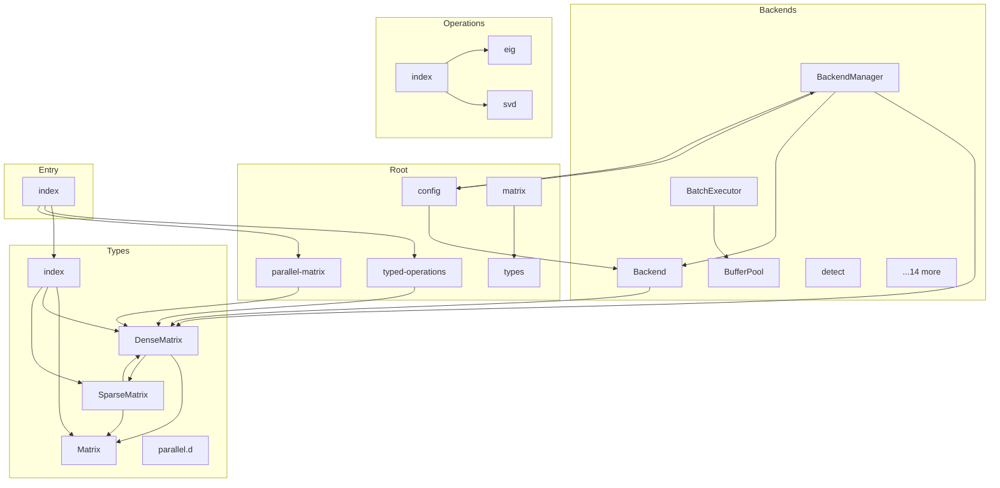

# @mathts/matrix - Dependency Graph

**Version**: 0.1.0 | **Last Updated**: 2026-02-06

This document provides a comprehensive dependency graph of all files, components, imports, functions, and variables in the codebase.

---

## Table of Contents

1. [Overview](#overview)
2. [Backends Dependencies](#backends-dependencies)
3. [Root Dependencies](#root-dependencies)
4. [Entry Dependencies](#entry-dependencies)
5. [Operations Dependencies](#operations-dependencies)
6. [Types Dependencies](#types-dependencies)
7. [Dependency Matrix](#dependency-matrix)
8. [Circular Dependency Analysis](#circular-dependency-analysis)
9. [Visual Dependency Graph](#visual-dependency-graph)
10. [Summary Statistics](#summary-statistics)

---

## Overview

The codebase is organized into the following modules:

- **backends**: 19 files
- **root**: 5 files
- **entry**: 1 file
- **operations**: 3 files
- **types**: 5 files

---

## Backends Dependencies

### `src/backends/Backend.ts` - Matrix Backend Interface

**Internal Dependencies:**
| File | Imports | Type |
|------|---------|------|
| `../types/DenseMatrix.js` | `DenseMatrix` | Import |

**Exports:**
- Classes: `BackendRegistry`
- Interfaces: `BackendHints`, `MatrixBackend`
- Constants: `DEFAULT_BACKEND_HINTS`, `backendRegistry`

---

### `src/backends/BackendManager.ts` - Backend Manager

**Internal Dependencies:**
| File | Imports | Type |
|------|---------|------|
| `../types/DenseMatrix.js` | `DenseMatrix` | Import |
| `./Backend.js` | `MatrixBackend, BackendType, BackendHints` | Import (type-only) |
| `./Backend.js` | `backendRegistry, DEFAULT_BACKEND_HINTS` | Import |
| `./JSBackend.js` | `jsBackend` | Import |
| `../config.js` | `getConfig, onConfigChange, MatrixConfig` | Import |

**Exports:**
- Classes: `BackendManager`
- Interfaces: `ExtendedBackendHints`
- Functions: `createBackendManager`
- Constants: `DEFAULT_EXTENDED_HINTS`, `backendManager`

---

### `src/backends/gpu/BatchExecutor.ts` - GPU Batch Executor

**Internal Dependencies:**
| File | Imports | Type |
|------|---------|------|
| `./GPUContext.js` | `GPUContext` | Import (type-only) |
| `./ShaderManager.js` | `ShaderManager` | Import (type-only) |
| `./BufferPool.js` | `BufferPool` | Import (type-only) |

**Exports:**
- Classes: `BatchExecutor`
- Interfaces: `BatchOperation`, `BatchResult`, `BatchOptions`

---

### `src/backends/gpu/BufferPool.ts` - GPU Buffer Pool

**Internal Dependencies:**
| File | Imports | Type |
|------|---------|------|
| `./GPUContext.js` | `GPUContext` | Import |

**Exports:**
- Classes: `BufferPool`
- Interfaces: `BufferPoolOptions`

---

### `src/backends/gpu/detect.ts` - WebGPU Detection and Capability Checking

**Exports:**
- Interfaces: `GPUAdapterInfo`, `GPUCapabilities`
- Functions: `hasWebGPU`, `isBrowser`, `getGPUAdapter`, `detectGPUCapabilities`, `isGPUSuitableForMatrixOps`, `getRecommendedWorkgroupSize`, `getMaxMatrixSize`

---

### `src/backends/gpu/GPUContext.ts` - WebGPU Context Management

**Internal Dependencies:**
| File | Imports | Type |
|------|---------|------|
| `./detect.js` | `hasWebGPU, getGPUAdapter, detectGPUCapabilities, GPUCapabilities` | Import |

**Exports:**
- Classes: `GPUContext`
- Interfaces: `GPUContextOptions`, `DeviceLostEvent`
- Functions: `getGlobalGPUContext`, `initializeGlobalGPU`, `destroyGlobalGPU`

---

### `src/backends/gpu/index.ts` - GPU Backend Exports

**Internal Dependencies:**
| File | Imports | Type |
|------|---------|------|
| `./detect.js` | `hasWebGPU, isBrowser, getGPUAdapter, detectGPUCapabilities, isGPUSuitableForMatrixOps, getRecommendedWorkgroupSize, getMaxMatrixSize, type GPUAdapterInfo, type GPUCapabilities` | Re-export |
| `./GPUContext.js` | `GPUContext, getGlobalGPUContext, initializeGlobalGPU, destroyGlobalGPU, type GPUContextOptions, type GPUContextStatus, type DeviceLostEvent` | Re-export |
| `./BufferPool.js` | `BufferPool, type BufferPoolOptions` | Re-export |
| `./ShaderManager.js` | `ShaderManager, BUILTIN_SHADERS, type ShaderSource, type PipelineConfig` | Re-export |
| `./BatchExecutor.js` | `BatchExecutor, type BatchOperation, type BatchOperationType, type BatchResult, type BatchOptions` | Re-export |
| `./Sync.js` | `SyncManager, createSyncManager, type SyncStrategy, type TransferDirection, type TransferRequest, type TransferResult, type SyncConfig` | Re-export |

**Exports:**
- Re-exports: `hasWebGPU`, `isBrowser`, `getGPUAdapter`, `detectGPUCapabilities`, `isGPUSuitableForMatrixOps`, `getRecommendedWorkgroupSize`, `getMaxMatrixSize`, `type GPUAdapterInfo`, `type GPUCapabilities`, `GPUContext`, `getGlobalGPUContext`, `initializeGlobalGPU`, `destroyGlobalGPU`, `type GPUContextOptions`, `type GPUContextStatus`, `type DeviceLostEvent`, `BufferPool`, `type BufferPoolOptions`, `ShaderManager`, `BUILTIN_SHADERS`, `type ShaderSource`, `type PipelineConfig`, `BatchExecutor`, `type BatchOperation`, `type BatchOperationType`, `type BatchResult`, `type BatchOptions`, `SyncManager`, `createSyncManager`, `type SyncStrategy`, `type TransferDirection`, `type TransferRequest`, `type TransferResult`, `type SyncConfig`

---

### `src/backends/gpu/ShaderManager.ts` - GPU Shader Manager

**Internal Dependencies:**
| File | Imports | Type |
|------|---------|------|
| `./GPUContext.js` | `GPUContext` | Import |

**Exports:**
- Classes: `ShaderManager`
- Interfaces: `ShaderSource`, `PipelineConfig`
- Constants: `BUILTIN_SHADERS`

---

### `src/backends/gpu/Sync.ts` - GPU-CPU Synchronization Strategy

**Internal Dependencies:**
| File | Imports | Type |
|------|---------|------|
| `./GPUContext.js` | `GPUContext` | Import (type-only) |
| `./BufferPool.js` | `BufferPool` | Import (type-only) |

**Exports:**
- Classes: `SyncManager`
- Interfaces: `TransferRequest`, `TransferResult`, `SyncConfig`
- Functions: `createSyncManager`

---

### `src/backends/GPUBackend.ts` - GPU Backend for Matrix Operations

**Internal Dependencies:**
| File | Imports | Type |
|------|---------|------|
| `./gpu/index.js` | `GPUContext, GPUContextOptions, getGlobalGPUContext, BufferPool, ShaderManager, hasWebGPU, detectGPUCapabilities, getRecommendedWorkgroupSize, GPUCapabilities` | Import |

**Exports:**
- Classes: `GPUBackend`
- Interfaces: `GPUBackendOptions`
- Functions: `getGlobalGPUBackend`, `initializeGlobalGPUBackend`, `destroyGlobalGPUBackend`

---

### `src/backends/GPUMatrixBackend.ts` - GPU Matrix Backend Adapter

**Internal Dependencies:**
| File | Imports | Type |
|------|---------|------|
| `./Backend.js` | `MatrixBackend, BackendType` | Import (type-only) |
| `../types/DenseMatrix.js` | `DenseMatrix` | Import |
| `./JSBackend.js` | `jsBackend` | Import |
| `./GPUBackend.js` | `GPUBackend, getGlobalGPUBackend, initializeGlobalGPUBackend, GPUBackendOptions` | Import |
| `./gpu/index.js` | `hasWebGPU, detectGPUCapabilities, GPUCapabilities` | Import |

**Exports:**
- Classes: `GPUMatrixBackend`
- Interfaces: `GPUMatrixBackendConfig`
- Functions: `createGPUMatrixBackend`
- Constants: `gpuMatrixBackend`

---

### `src/backends/index.ts` - Matrix Backend Exports

**Internal Dependencies:**
| File | Imports | Type |
|------|---------|------|
| `./Backend.js` | `backendRegistry` | Import |
| `./JSBackend.js` | `jsBackend` | Import |
| `./Backend.js` | `BackendRegistry, backendRegistry, DEFAULT_BACKEND_HINTS` | Re-export |
| `./JSBackend.js` | `JSBackend, jsBackend` | Re-export |
| `./ParallelBackend.js` | `ParallelBackend, parallelBackend, createParallelBackend, type ParallelBackendConfig` | Re-export |
| `./WASMBackend.js` | `WASMBackend, wasmBackend, createWASMBackend, type WASMBackendConfig` | Re-export |
| `./GPUMatrixBackend.js` | `GPUMatrixBackend, gpuMatrixBackend, createGPUMatrixBackend, type GPUMatrixBackendConfig` | Re-export |
| `./GPUBackend.js` | `GPUBackend, getGlobalGPUBackend, initializeGlobalGPUBackend, destroyGlobalGPUBackend, type GPUBackendOptions, type GPUBackendStatus` | Re-export |
| `./BackendManager.js` | `BackendManager, backendManager, createBackendManager, DEFAULT_EXTENDED_HINTS, type ExtendedBackendHints, type OperationType` | Re-export |
| `./wasm/index.js` | `detectWasmFeatures, isWasmAvailable, isSharedMemoryAvailable, isAtomicsAvailable, clearFeatureCache, getCachedFeatures` | Re-export |
| `./gpu/index.js` | `hasWebGPU, detectGPUCapabilities, getRecommendedWorkgroupSize, GPUContext, getGlobalGPUContext, destroyGlobalGPU, BufferPool, ShaderManager, BUILTIN_SHADERS, BatchExecutor, SyncManager, createSyncManager` | Re-export |

**Exports:**
- Re-exports: `BackendRegistry`, `backendRegistry`, `DEFAULT_BACKEND_HINTS`, `JSBackend`, `jsBackend`, `ParallelBackend`, `parallelBackend`, `createParallelBackend`, `type ParallelBackendConfig`, `WASMBackend`, `wasmBackend`, `createWASMBackend`, `type WASMBackendConfig`, `GPUMatrixBackend`, `gpuMatrixBackend`, `createGPUMatrixBackend`, `type GPUMatrixBackendConfig`, `GPUBackend`, `getGlobalGPUBackend`, `initializeGlobalGPUBackend`, `destroyGlobalGPUBackend`, `type GPUBackendOptions`, `type GPUBackendStatus`, `BackendManager`, `backendManager`, `createBackendManager`, `DEFAULT_EXTENDED_HINTS`, `type ExtendedBackendHints`, `type OperationType`, `detectWasmFeatures`, `isWasmAvailable`, `isSharedMemoryAvailable`, `isAtomicsAvailable`, `clearFeatureCache`, `getCachedFeatures`, `hasWebGPU`, `detectGPUCapabilities`, `getRecommendedWorkgroupSize`, `GPUContext`, `getGlobalGPUContext`, `destroyGlobalGPU`, `BufferPool`, `ShaderManager`, `BUILTIN_SHADERS`, `BatchExecutor`, `SyncManager`, `createSyncManager`

---

### `src/backends/JSBackend.ts` - Pure TypeScript Matrix Backend

**Internal Dependencies:**
| File | Imports | Type |
|------|---------|------|
| `../types/DenseMatrix.js` | `DenseMatrix` | Import |
| `./Backend.js` | `MatrixBackend, BackendType` | Import (type-only) |

**Exports:**
- Classes: `JSBackend`
- Constants: `jsBackend`

---

### `src/backends/MatrixWasmBridge.ts` - Matrix WASM Bridge - Integrates WASM operations with mathjs Matrix types

**External Dependencies:**
| Package | Import |
|---------|--------|
| `@mathts/parallel` | `ParallelMatrix` |

**Internal Dependencies:**
| File | Imports | Type |
|------|---------|------|
| `./WasmLoader.js` | `wasmLoader, WasmModule` | Import |

**Exports:**
- Classes: `MatrixWasmBridge`
- Interfaces: `MatrixOptions`

---

### `src/backends/ParallelBackend.ts` - Parallel Matrix Backend

**External Dependencies:**
| Package | Import |
|---------|--------|
| `@mathts/parallel` | `computePool, ComputePool, ComputePoolConfig` |

**Internal Dependencies:**
| File | Imports | Type |
|------|---------|------|
| `../types/DenseMatrix.js` | `DenseMatrix` | Import |
| `./Backend.js` | `BackendType` | Import (type-only) |

**Exports:**
- Classes: `ParallelBackend`
- Interfaces: `ParallelBackendConfig`
- Functions: `createParallelBackend`
- Constants: `parallelBackend`

---

### `src/backends/wasm/detect.ts` - WASM Feature Detection

**Exports:**
- Interfaces: `WasmFeatures`
- Functions: `detectWasmFeatures`, `isWasmAvailable`, `isSharedMemoryAvailable`, `isAtomicsAvailable`, `clearFeatureCache`, `getCachedFeatures`

---

### `src/backends/wasm/index.ts` - WASM Utilities Index

**Internal Dependencies:**
| File | Imports | Type |
|------|---------|------|
| `./detect.js` | `detectWasmFeatures, isWasmAvailable, isSharedMemoryAvailable, isAtomicsAvailable, clearFeatureCache, getCachedFeatures` | Re-export |

**Exports:**
- Re-exports: `detectWasmFeatures`, `isWasmAvailable`, `isSharedMemoryAvailable`, `isAtomicsAvailable`, `clearFeatureCache`, `getCachedFeatures`

---

### `src/backends/WASMBackend.ts` - WASM Matrix Backend

**Internal Dependencies:**
| File | Imports | Type |
|------|---------|------|
| `./Backend.js` | `MatrixBackend, BackendType` | Import (type-only) |
| `../types/DenseMatrix.js` | `DenseMatrix` | Import |
| `./JSBackend.js` | `jsBackend` | Import |
| `./WasmLoader.js` | `wasmLoader, WasmModule` | Import |
| `./wasm/detect.js` | `detectWasmFeatures, WasmFeatures` | Import |

**Exports:**
- Classes: `WASMBackend`
- Interfaces: `WASMBackendConfig`
- Functions: `createWASMBackend`
- Constants: `wasmBackend`

---

### `src/backends/WasmLoader.ts` - WASM Loader - Loads and manages WebAssembly modules

**Exports:**
- Classes: `WasmLoader`
- Interfaces: `WasmModule`
- Functions: `initWasm`
- Constants: `wasmLoader`

---

## Root Dependencies

### `src/config.ts` - MathTS Matrix Configuration

**Internal Dependencies:**
| File | Imports | Type |
|------|---------|------|
| `./backends/Backend.js` | `BackendType` | Import (type-only) |
| `./backends/BackendManager.js` | `OperationType` | Import (type-only) |

**Exports:**
- Interfaces: `BackendConfig`, `AdaptiveTuningConfig`, `ProfilingConfig`, `MatrixConfig`
- Functions: `getConfig`, `setConfig`, `resetConfig`, `onConfigChange`, `setBackendPreference`, `setBackendThreshold`, `setBackendEnabled`, `getRecommendedBackend`, `forceBackend`, `enableProfiling`, `disableProfiling`, `enableAdaptiveTuning`, `disableAdaptiveTuning`, `configureAdaptiveTuning`
- Constants: `DEFAULT_CONFIG`

---

### `src/matrix.ts` - Base Matrix class

**Internal Dependencies:**
| File | Imports | Type |
|------|---------|------|
| `./types` | `MatrixLike, MatrixOptions` | Import (type-only) |

---

### `src/parallel-matrix.ts` - Parallel-First Matrix Operations

**External Dependencies:**
| Package | Import |
|---------|--------|
| `@mathts/core` | `mathTyped` |
| `@mathts/parallel` | `computePool, ParallelResult` |
| `@mathts/core` | `SignatureFunction` |

**Internal Dependencies:**
| File | Imports | Type |
|------|---------|------|
| `./types/DenseMatrix.js` | `DenseMatrix` | Import |

**Exports:**
- Functions: `initializeParallelMatrix`, `terminateParallelMatrix`
- Constants: `parallelMatrix`, `parallelIdentity`, `parallelZeros`, `parallelOnes`, `parallelDiag`, `parallelRandom`, `parallelMatrixAdd`, `parallelMatrixSubtract`, `parallelMatrixMultiply`, `parallelDotMultiply`, `parallelMatrixDivide`, `parallelUnaryMinus`, `parallelMatrixTranspose`, `parallelMatrixSum`, `parallelMatrixMean`, `parallelMatrixMin`, `parallelMatrixMax`, `parallelMatrixVariance`, `parallelMatrixStd`, `parallelMatrixNorm`, `parallelMatrixDot`, `parallelMatrixTrace`, `parallelMatrixDistance`, `parallelMatrixAbs`, `parallelMatrixSqrt`, `parallelMatrixSquare`, `parallelMatrixExp`, `parallelMatrixLog`, `parallelMatrixSin`, `parallelMatrixCos`, `parallelMatrixTan`, `parallelMatrixSize`, `parallelMatrixSubset`, `parallelMatrixRow`, `parallelMatrixColumn`, `parallelMatrixDiagonal`, `parallelMatrixMatvec`, `parallelMatrixOuter`, `parallelMatrixHistogram`, `parallelMatrixOperations`

---

### `src/typed-operations.ts` - Typed Matrix Operations

**External Dependencies:**
| Package | Import |
|---------|--------|
| `@mathts/core` | `mathTyped` |
| `@mathts/core` | `SignatureFunction` |

**Internal Dependencies:**
| File | Imports | Type |
|------|---------|------|
| `./types/DenseMatrix.js` | `DenseMatrix` | Import |

**Exports:**
- Constants: `matrix`, `identity`, `zeros`, `ones`, `diag`, `random`, `add`, `subtract`, `multiply`, `dotMultiply`, `divide`, `unaryMinus`, `transpose`, `sum`, `mean`, `min`, `max`, `norm`, `trace`, `abs`, `sqrt`, `square`, `exp`, `log`, `pow`, `size`, `subset`, `row`, `column`, `diagonal`, `typedMatrixOperations`

---

### `src/types.ts` - Matrix type definitions

**External Dependencies:**
| Package | Import |
|---------|--------|
| `@mathts/core` | `BackendType` |

---

## Entry Dependencies

### `src/index.ts` - Matrix operations for MathTS with pluggable backends

**Internal Dependencies:**
| File | Imports | Type |
|------|---------|------|
| `./types/index.js` | `*` | Re-export |
| `./backends/index.js` | `*` | Re-export |
| `./typed-operations.js` | `*` | Re-export |
| `./parallel-matrix.js` | `*` | Re-export |

**Exports:**
- Re-exports: `* from ./types/index.js`, `* from ./backends/index.js`, `* from ./typed-operations.js`, `* from ./parallel-matrix.js`

---

## Operations Dependencies

### `src/operations/eig.ts` - Eigenvalue and Eigenvector Decomposition

**Exports:**
- Interfaces: `EigResult`, `EigOptions`
- Functions: `eig`, `eigvals`, `powerIteration`

---

### `src/operations/index.ts` - Matrix Operations

**Internal Dependencies:**
| File | Imports | Type |
|------|---------|------|
| `./eig.js` | `eig, eigvals, powerIteration, type EigResult, type EigOptions` | Re-export |
| `./svd.js` | `svd, singularValues, pinv, lowRankApprox, cond, norm2, normFro, type SVDResult, type SVDOptions` | Re-export |

**Exports:**
- Re-exports: `eig`, `eigvals`, `powerIteration`, `type EigResult`, `type EigOptions`, `svd`, `singularValues`, `pinv`, `lowRankApprox`, `cond`, `norm2`, `normFro`, `type SVDResult`, `type SVDOptions`

---

### `src/operations/svd.ts` - Singular Value Decomposition (SVD)

**Exports:**
- Interfaces: `SVDResult`, `SVDOptions`
- Functions: `svd`, `singularValues`, `pinv`, `lowRankApprox`, `cond`, `norm2`, `normFro`

---

## Types Dependencies

### `src/types/DenseMatrix.ts` - Dense Matrix Implementation

**Internal Dependencies:**
| File | Imports | Type |
|------|---------|------|
| `./Matrix.js` | `Matrix, MatrixEntry, SliceSpec` | Import |
| `./SparseMatrix.js` | `SparseMatrix` | Import (type-only) |

**Exports:**
- Classes: `DenseMatrix`
- Functions: `isDenseMatrix`

---

### `src/types/index.ts` - Matrix Type Exports

**Internal Dependencies:**
| File | Imports | Type |
|------|---------|------|
| `./Matrix.js` | `Matrix, isMatrix` | Re-export |
| `./DenseMatrix.js` | `DenseMatrix, isDenseMatrix` | Re-export |
| `./SparseMatrix.js` | `SparseMatrix, isSparseMatrix` | Re-export |

**Exports:**
- Re-exports: `Matrix`, `isMatrix`, `DenseMatrix`, `isDenseMatrix`, `SparseMatrix`, `isSparseMatrix`

---

### `src/types/Matrix.ts` - Matrix Base Class

**Exports:**
- Interfaces: `MatrixDimensions`, `MatrixIndex`, `SliceSpec`, `MatrixEntry`
- Functions: `isMatrix`

---

### `src/types/parallel.d.ts` - Type declarations for @mathts/parallel package

**Exports:**
- Classes: `ComputePool`
- Interfaces: `ComputePoolConfig`, `ParallelResult`, `PoolStats`
- Constants: `computePool`

---

### `src/types/SparseMatrix.ts` - Sparse Matrix Implementation (CSR Format)

**Internal Dependencies:**
| File | Imports | Type |
|------|---------|------|
| `./Matrix.js` | `Matrix, MatrixEntry, SliceSpec` | Import |
| `./DenseMatrix.js` | `DenseMatrix` | Import |

**Exports:**
- Classes: `SparseMatrix`
- Functions: `isSparseMatrix`

---

## Dependency Matrix

### File Import/Export Matrix

| File | Imports From | Exports To |
|------|--------------|------------|
| `Backend` | 1 files | 7 files |
| `BackendManager` | 4 files | 2 files |
| `BatchExecutor` | 3 files | 1 files |
| `BufferPool` | 1 files | 3 files |
| `detect` | 0 files | 2 files |
| `GPUContext` | 1 files | 5 files |
| `index` | 6 files | 3 files |
| `ShaderManager` | 1 files | 2 files |
| `Sync` | 2 files | 1 files |
| `GPUBackend` | 1 files | 2 files |
| `GPUMatrixBackend` | 5 files | 1 files |
| `index` | 9 files | 1 files |
| `JSBackend` | 2 files | 4 files |
| `MatrixWasmBridge` | 1 files | 0 files |
| `ParallelBackend` | 2 files | 1 files |
| `detect` | 0 files | 2 files |
| `index` | 1 files | 1 files |
| `WASMBackend` | 5 files | 1 files |
| `WasmLoader` | 0 files | 2 files |
| `config` | 2 files | 1 files |
| `index` | 4 files | 0 files |
| `matrix` | 1 files | 0 files |
| `eig` | 0 files | 1 files |
| `index` | 2 files | 0 files |
| `svd` | 0 files | 1 files |
| `parallel-matrix` | 1 files | 1 files |
| `typed-operations` | 1 files | 1 files |
| `DenseMatrix` | 2 files | 10 files |
| `index` | 3 files | 1 files |
| `Matrix` | 0 files | 3 files |

---

## Circular Dependency Analysis

**2 circular dependencies detected:**

- **Runtime cycles**: 0 (require attention)
- **Type-only cycles**: 2 (safe, no runtime impact)

### Type-Only Circular Dependencies

These cycles only involve type imports and are safe (erased at runtime):

- src/types/DenseMatrix.ts -> src/types/SparseMatrix.ts -> src/types/DenseMatrix.ts
- src/backends/BackendManager.ts -> src/config.ts -> src/backends/BackendManager.ts

---

## Visual Dependency Graph

---

## Summary Statistics

| Category | Count |
|----------|-------|
| Total TypeScript Files | 33 |
| Total Modules | 5 |
| Total Lines of Code | 12031 |
| Total Exports | 261 |
| Total Re-exports | 111 |
| Total Classes | 17 |
| Total Interfaces | 39 |
| Total Functions | 54 |
| Total Type Guards | 8 |
| Total Enums | 0 |
| Type-only Imports | 14 |
| Runtime Circular Deps | 0 |
| Type-only Circular Deps | 2 |

---

*Last Updated*: 2026-02-06
*Version*: 0.1.0
