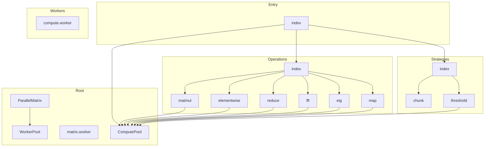

# @danielsimonjr/mathts-parallel - Dependency Graph

**Version**: 0.1.2 | **Last Updated**: 2026-04-10

This document provides a comprehensive dependency graph of all files, components, imports, functions, and variables in the codebase.

---

## Table of Contents

1. [Overview](#overview)
2. [Package Dependencies](#package-dependencies)
3. [Root Dependencies](#root-dependencies)
4. [Entry Dependencies](#entry-dependencies)
5. [Operations Dependencies](#operations-dependencies)
6. [Strategies Dependencies](#strategies-dependencies)
7. [Workers Dependencies](#workers-dependencies)
8. [Dependency Matrix](#dependency-matrix)
9. [Circular Dependency Analysis](#circular-dependency-analysis)
10. [Visual Dependency Graph](#visual-dependency-graph)
11. [Summary Statistics](#summary-statistics)

---

## Overview

The codebase is organized into the following modules:

- **root**: 4 files
- **entry**: 1 file
- **operations**: 7 files
- **strategies**: 3 files
- **workers**: 1 file

---

## Root Dependencies

### `src/ComputePool.ts` - MathTS Compute Pool

**External Dependencies:**
| Package | Import |
|---------|--------|
| `@danielsimonjr/mathts-workerpool` | `MathWorkerPool, Transfer, WorkerPoolConfig, ParallelResult, TaskOptions, PoolStats` |

**Exports:**
- Classes: `ComputePool`
- Interfaces: `ComputePoolConfig`, `ParallelResult`
- Constants: `DEFAULT_POOL_CONFIG`, `computePool`

---

### `src/matrix.worker.ts` - Matrix Worker for parallel computation

---

### `src/ParallelMatrix.ts` - ParallelMatrix provides parallel/multicore operations for matrix computations

**Internal Dependencies:**
| File | Imports | Type |
|------|---------|------|
| `./WorkerPool.js` | `WorkerPool` | Import |

**Exports:**
- Classes: `ParallelMatrix`
- Interfaces: `MatrixData`, `ParallelConfig`

---

### `src/WorkerPool.ts` - WorkerPool manages a pool of Web Workers for parallel computation

**Exports:**
- Classes: `WorkerPool`

---

## Entry Dependencies

### `src/index.ts` - WebWorker parallelization for MathTS computations.

**Internal Dependencies:**
| File | Imports | Type |
|------|---------|------|
| `./ComputePool.js` | `ComputePool, computePool, Transfer, DEFAULT_POOL_CONFIG` | Re-export |
| `./operations/index.js` | `parallelMatmul, parallelMatvec, parallelTranspose, parallelOuter, parallelDot, parallelAdd, parallelSubtract, parallelMultiply, parallelDivide, parallelScale, parallelAbs, parallelNegate, parallelSquare, parallelSqrt, parallelExp, parallelLog, parallelSin, parallelCos, parallelTan, parallelElementwise, parallelUnary, parallelSum, parallelMean, parallelMin, parallelMax, parallelMinMax, parallelVariance, parallelStd, parallelNorm, parallelDistance, parallelHistogram, parallelReduce, parallelMap, parallelFilter, parallelFind, parallelSort, parallelForEach, parallelSome, parallelEvery, parallelCount` | Re-export |
| `./strategies/index.js` | `calculateOptimalChunks, chunkFloat64Array, chunkArray, mergeFloat64Chunks, mergeArrayChunks, shouldChunkParallelize, partitionRange, partition2D, ThresholdDispatcher, thresholdDispatcher, shouldParallelize, dispatch, calculateChunks, DEFAULT_THRESHOLDS` | Re-export |

**Exports:**
- Interfaces: `PoolOptions`, `ExecOptions`, `PoolStats`
- Re-exports: `ComputePool`, `computePool`, `Transfer`, `DEFAULT_POOL_CONFIG`, `parallelMatmul`, `parallelMatvec`, `parallelTranspose`, `parallelOuter`, `parallelDot`, `parallelAdd`, `parallelSubtract`, `parallelMultiply`, `parallelDivide`, `parallelScale`, `parallelAbs`, `parallelNegate`, `parallelSquare`, `parallelSqrt`, `parallelExp`, `parallelLog`, `parallelSin`, `parallelCos`, `parallelTan`, `parallelElementwise`, `parallelUnary`, `parallelSum`, `parallelMean`, `parallelMin`, `parallelMax`, `parallelMinMax`, `parallelVariance`, `parallelStd`, `parallelNorm`, `parallelDistance`, `parallelHistogram`, `parallelReduce`, `parallelMap`, `parallelFilter`, `parallelFind`, `parallelSort`, `parallelForEach`, `parallelSome`, `parallelEvery`, `parallelCount`, `calculateOptimalChunks`, `chunkFloat64Array`, `chunkArray`, `mergeFloat64Chunks`, `mergeArrayChunks`, `shouldChunkParallelize`, `partitionRange`, `partition2D`, `ThresholdDispatcher`, `thresholdDispatcher`, `shouldParallelize`, `dispatch`, `calculateChunks`, `DEFAULT_THRESHOLDS`

---

## Operations Dependencies

### `src/operations/eig.ts` - Parallel Eigendecomposition

**Internal Dependencies:**
| File | Imports | Type |
|------|---------|------|
| `../ComputePool.js` | `computePool, ComputePool` | Import |
| `../ComputePool.js` | `ParallelResult` | Import (type-only) |

**Exports:**
- Interfaces: `EigResult`, `ParallelEigOptions`
- Functions: `parallelEig`, `parallelEigvals`

---

### `src/operations/elementwise.ts` - Parallel Element-wise Operations

**Internal Dependencies:**
| File | Imports | Type |
|------|---------|------|
| `../ComputePool.js` | `computePool, ComputePool` | Import |
| `../ComputePool.js` | `ParallelResult` | Import (type-only) |

**Exports:**
- Interfaces: `ElementwiseOptions`
- Functions: `parallelAdd`, `parallelSubtract`, `parallelMultiply`, `parallelDivide`, `parallelScale`, `parallelAbs`, `parallelNegate`, `parallelSquare`, `parallelSqrt`, `parallelExp`, `parallelLog`, `parallelSin`, `parallelCos`, `parallelTan`, `parallelElementwise`, `parallelUnary`

---

### `src/operations/fft.ts` - Parallel FFT Operations

**Internal Dependencies:**
| File | Imports | Type |
|------|---------|------|
| `../ComputePool.js` | `computePool, ComputePool` | Import |
| `../ComputePool.js` | `ParallelResult` | Import (type-only) |

**Exports:**
- Interfaces: `FFTResult`, `ParallelFFTOptions`
- Functions: `parallelFFT`, `parallelIFFT`, `parallelFFTAuto`, `parallelConvolve`

---

### `src/operations/index.ts` - Parallel Operations

**Internal Dependencies:**
| File | Imports | Type |
|------|---------|------|
| `./matmul.js` | `parallelMatmul, parallelMatvec, parallelTranspose, parallelOuter, parallelDot, MatmulOptions` | Re-export |
| `./elementwise.js` | `parallelAdd, parallelSubtract, parallelMultiply, parallelDivide, parallelScale, parallelAbs, parallelNegate, parallelSquare, parallelSqrt, parallelExp, parallelLog, parallelSin, parallelCos, parallelTan, parallelElementwise, parallelUnary, ElementwiseOptions` | Re-export |
| `./reduce.js` | `parallelSum, parallelMean, parallelMin, parallelMax, parallelMinMax, parallelVariance, parallelStd, parallelNorm, parallelDistance, parallelHistogram, parallelReduce, ReduceOptions` | Re-export |
| `./fft.js` | `parallelFFT, parallelIFFT, parallelFFTAuto, parallelConvolve, ParallelFFTOptions, FFTResult` | Re-export |
| `./eig.js` | `parallelEig, parallelEigvals, EigResult, ParallelEigOptions` | Re-export |
| `./map.js` | `parallelMap, parallelFilter, parallelFind, parallelSort, parallelForEach, parallelSome, parallelEvery, parallelCount, MapOptions` | Re-export |

**Exports:**
- Re-exports: `parallelMatmul`, `parallelMatvec`, `parallelTranspose`, `parallelOuter`, `parallelDot`, `MatmulOptions`, `parallelAdd`, `parallelSubtract`, `parallelMultiply`, `parallelDivide`, `parallelScale`, `parallelAbs`, `parallelNegate`, `parallelSquare`, `parallelSqrt`, `parallelExp`, `parallelLog`, `parallelSin`, `parallelCos`, `parallelTan`, `parallelElementwise`, `parallelUnary`, `ElementwiseOptions`, `parallelSum`, `parallelMean`, `parallelMin`, `parallelMax`, `parallelMinMax`, `parallelVariance`, `parallelStd`, `parallelNorm`, `parallelDistance`, `parallelHistogram`, `parallelReduce`, `ReduceOptions`, `parallelFFT`, `parallelIFFT`, `parallelFFTAuto`, `parallelConvolve`, `ParallelFFTOptions`, `FFTResult`, `parallelEig`, `parallelEigvals`, `EigResult`, `ParallelEigOptions`, `parallelMap`, `parallelFilter`, `parallelFind`, `parallelSort`, `parallelForEach`, `parallelSome`, `parallelEvery`, `parallelCount`, `MapOptions`

---

### `src/operations/map.ts` - Parallel Map and Transform Operations

**Internal Dependencies:**
| File | Imports | Type |
|------|---------|------|
| `../ComputePool.js` | `computePool, ComputePool` | Import |
| `../ComputePool.js` | `ParallelResult` | Import (type-only) |

**Exports:**
- Interfaces: `MapOptions`
- Functions: `parallelMap`, `parallelFilter`, `parallelFind`, `parallelSort`, `parallelForEach`, `parallelSome`, `parallelEvery`, `parallelCount`

---

### `src/operations/matmul.ts` - Parallel Matrix Multiplication

**Internal Dependencies:**
| File | Imports | Type |
|------|---------|------|
| `../ComputePool.js` | `computePool, ComputePool` | Import |
| `../ComputePool.js` | `ParallelResult` | Import (type-only) |

**Exports:**
- Interfaces: `MatmulOptions`
- Functions: `parallelMatmul`, `parallelMatvec`, `parallelTranspose`, `parallelOuter`, `parallelDot`

---

### `src/operations/reduce.ts` - Parallel Reduction Operations

**Internal Dependencies:**
| File | Imports | Type |
|------|---------|------|
| `../ComputePool.js` | `computePool, ComputePool` | Import |
| `../ComputePool.js` | `ParallelResult` | Import (type-only) |

**Exports:**
- Interfaces: `ReduceOptions`
- Functions: `parallelSum`, `parallelMean`, `parallelMin`, `parallelMax`, `parallelMinMax`, `parallelVariance`, `parallelStd`, `parallelNorm`, `parallelDistance`, `parallelHistogram`, `parallelReduce`

---

## Strategies Dependencies

### `src/strategies/chunk.ts` - Chunking Strategies for Parallel Operations

**Exports:**
- Interfaces: `ChunkResult`, `ChunkInfo`, `ChunkOptions`
- Functions: `calculateOptimalChunks`, `chunkFloat64Array`, `chunkArray`, `mergeFloat64Chunks`, `mergeArrayChunks`, `shouldParallelize`, `memorySizeBytes`, `partitionRange`, `partition2D`

---

### `src/strategies/index.ts` - Parallel Strategies

**Internal Dependencies:**
| File | Imports | Type |
|------|---------|------|
| `./chunk.js` | `calculateOptimalChunks, chunkFloat64Array, chunkArray, mergeFloat64Chunks, mergeArrayChunks, shouldParallelize, partitionRange, partition2D, ChunkOptions, ChunkResult, ChunkInfo` | Re-export |
| `./threshold.js` | `ThresholdDispatcher, thresholdDispatcher, shouldParallelize, dispatch, calculateChunks, DEFAULT_THRESHOLDS, ThresholdConfig, OperationCategory, ExecutionMode, DispatchResult` | Re-export |

**Exports:**
- Re-exports: `calculateOptimalChunks`, `chunkFloat64Array`, `chunkArray`, `mergeFloat64Chunks`, `mergeArrayChunks`, `shouldParallelize`, `partitionRange`, `partition2D`, `ChunkOptions`, `ChunkResult`, `ChunkInfo`, `ThresholdDispatcher`, `thresholdDispatcher`, `dispatch`, `calculateChunks`, `DEFAULT_THRESHOLDS`, `ThresholdConfig`, `OperationCategory`, `ExecutionMode`, `DispatchResult`

---

### `src/strategies/threshold.ts` - Threshold-based Dispatch Strategy

**Internal Dependencies:**
| File | Imports | Type |
|------|---------|------|
| `../ComputePool.js` | `computePool, ComputePool` | Import |

**Exports:**
- Classes: `ThresholdDispatcher`
- Interfaces: `ThresholdConfig`, `DispatchResult`
- Types: `OperationCategory`, `ExecutionMode`
- Functions: `shouldParallelize`, `dispatch`, `calculateChunks`
- Constants: `DEFAULT_THRESHOLDS`, `thresholdDispatcher`

---

## Workers Dependencies

### `src/workers/compute.worker.ts` - MathTS Compute Worker

**External Dependencies:**
| Package | Import |
|---------|--------|
| `workerpool` | `worker` |

---

## Dependency Matrix

### File Import/Export Matrix

| File | Imports From | Exports To |
|------|--------------|------------|
| `src/ComputePool` | 0 files | 8 files |
| `src/operations/index` | 6 files | 1 file |
| `src/index` | 3 files | 0 files |
| `src/strategies/index` | 2 files | 1 file |
| `src/operations/eig` | 1 file | 1 file |
| `src/operations/elementwise` | 1 file | 1 file |
| `src/operations/fft` | 1 file | 1 file |
| `src/operations/map` | 1 file | 1 file |
| `src/operations/matmul` | 1 file | 1 file |
| `src/operations/reduce` | 1 file | 1 file |
| `src/strategies/threshold` | 1 file | 1 file |
| `src/ParallelMatrix` | 1 file | 0 files |
| `src/strategies/chunk` | 0 files | 1 file |
| `src/WorkerPool` | 0 files | 1 file |
| `src/matrix.worker` | 0 files | 0 files |
| `src/workers/compute.worker` | 0 files | 0 files |

---

## Circular Dependency Analysis

**No circular dependencies detected.**
---

## Visual Dependency Graph

---

## Summary Statistics

| Category | Count |
|----------|-------|
| Total TypeScript Files | 16 |
| Total Modules | 5 |
| Total Lines of Code | 4156 |
| Total Exports | 199 |
| Total Re-exports | 132 |
| Total Classes | 4 |
| Total Interfaces | 20 |
| Total Functions | 58 |
| Total Type Guards | 0 |
| Total Enums | 0 |
| Type-only Imports | 6 |
| Runtime Circular Deps | 0 |
| Type-only Circular Deps | 0 |

---

*Last Updated*: 2026-04-10
*Version*: 0.1.2
