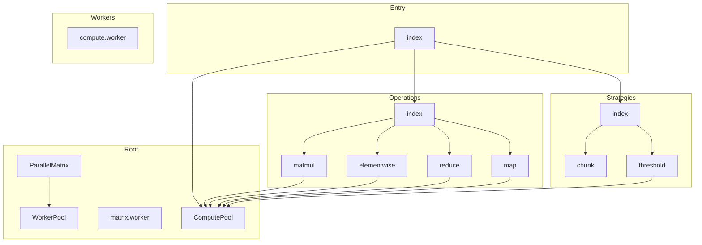

# @mathts/parallel - Dependency Graph

**Version**: 0.1.0 | **Last Updated**: 2026-02-06

This document provides a comprehensive dependency graph of all files, components, imports, functions, and variables in the codebase.

---

## Table of Contents

1. [Overview](#overview)
2. [Root Dependencies](#root-dependencies)
3. [Entry Dependencies](#entry-dependencies)
4. [Operations Dependencies](#operations-dependencies)
5. [Strategies Dependencies](#strategies-dependencies)
6. [Workers Dependencies](#workers-dependencies)
7. [Dependency Matrix](#dependency-matrix)
8. [Circular Dependency Analysis](#circular-dependency-analysis)
9. [Visual Dependency Graph](#visual-dependency-graph)
10. [Summary Statistics](#summary-statistics)

---

## Overview

The codebase is organized into the following modules:

- **root**: 4 files
- **entry**: 1 file
- **operations**: 5 files
- **strategies**: 3 files
- **workers**: 1 file

---

## Root Dependencies

### `src/ComputePool.ts` - MathTS Compute Pool

**External Dependencies:**
| Package | Import |
|---------|--------|
| `@mathts/workerpool` | `MathWorkerPool, Transfer, WorkerPoolConfig, ParallelResult, TaskOptions, PoolStats` |
| `@mathts/parallel` | `ComputePool` |

**Exports:**
- Classes: `ComputePool`
- Interfaces: `ComputePoolConfig`, `ParallelResult`
- Constants: `DEFAULT_POOL_CONFIG`, `computePool`

---

### `src/matrix.worker.ts` - Matrix Worker for parallel computation

---

### `src/ParallelMatrix.ts` - ParallelMatrix provides parallel/multicore operations for matrix computations

**Internal Dependencies:**
| File | Imports | Type |
|------|---------|------|
| `./WorkerPool.js` | `WorkerPool` | Import |

**Exports:**
- Classes: `ParallelMatrix`
- Interfaces: `MatrixData`, `ParallelConfig`

---

### `src/WorkerPool.ts` - WorkerPool manages a pool of Web Workers for parallel computation

**Exports:**
- Classes: `WorkerPool`

---

## Entry Dependencies

### `src/index.ts` - WebWorker parallelization for MathTS computations.

**Internal Dependencies:**
| File | Imports | Type |
|------|---------|------|
| `./ComputePool.js` | `ComputePool, computePool, Transfer, DEFAULT_POOL_CONFIG` | Re-export |
| `./operations/index.js` | `// Matrix operations
  parallelMatmul, parallelMatvec, parallelTranspose, parallelOuter, parallelDot, // Element-wise operations
  parallelAdd, parallelSubtract, parallelMultiply, parallelDivide, parallelScale, parallelAbs, parallelNegate, parallelSquare, parallelSqrt, parallelExp, parallelLog, parallelSin, parallelCos, parallelTan, parallelElementwise, parallelUnary, // Reduction operations
  parallelSum, parallelMean, parallelMin, parallelMax, parallelMinMax, parallelVariance, parallelStd, parallelNorm, parallelDistance, parallelHistogram, parallelReduce, // Map and transform operations
  parallelMap, parallelFilter, parallelFind, parallelSort, parallelForEach, parallelSome, parallelEvery, parallelCount` | Re-export |
| `./strategies/index.js` | `// Chunking strategies
  calculateOptimalChunks, chunkFloat64Array, chunkArray, mergeFloat64Chunks, mergeArrayChunks, shouldChunkParallelize, partitionRange, partition2D, // Threshold-based dispatch
  ThresholdDispatcher, thresholdDispatcher, shouldParallelize, dispatch, calculateChunks, DEFAULT_THRESHOLDS` | Re-export |

**Exports:**
- Interfaces: `PoolOptions`, `ExecOptions`, `PoolStats`
- Re-exports: `ComputePool`, `computePool`, `Transfer`, `DEFAULT_POOL_CONFIG`, `// Matrix operations
  parallelMatmul`, `parallelMatvec`, `parallelTranspose`, `parallelOuter`, `parallelDot`, `// Element-wise operations
  parallelAdd`, `parallelSubtract`, `parallelMultiply`, `parallelDivide`, `parallelScale`, `parallelAbs`, `parallelNegate`, `parallelSquare`, `parallelSqrt`, `parallelExp`, `parallelLog`, `parallelSin`, `parallelCos`, `parallelTan`, `parallelElementwise`, `parallelUnary`, `// Reduction operations
  parallelSum`, `parallelMean`, `parallelMin`, `parallelMax`, `parallelMinMax`, `parallelVariance`, `parallelStd`, `parallelNorm`, `parallelDistance`, `parallelHistogram`, `parallelReduce`, `// Map and transform operations
  parallelMap`, `parallelFilter`, `parallelFind`, `parallelSort`, `parallelForEach`, `parallelSome`, `parallelEvery`, `parallelCount`, `// Chunking strategies
  calculateOptimalChunks`, `chunkFloat64Array`, `chunkArray`, `mergeFloat64Chunks`, `mergeArrayChunks`, `shouldChunkParallelize`, `partitionRange`, `partition2D`, `// Threshold-based dispatch
  ThresholdDispatcher`, `thresholdDispatcher`, `shouldParallelize`, `dispatch`, `calculateChunks`, `DEFAULT_THRESHOLDS`

---

## Operations Dependencies

### `src/operations/elementwise.ts` - Parallel Element-wise Operations

**Internal Dependencies:**
| File | Imports | Type |
|------|---------|------|
| `../ComputePool.js` | `computePool, ComputePool` | Import |
| `../ComputePool.js` | `ParallelResult` | Import (type-only) |

**Exports:**
- Interfaces: `ElementwiseOptions`
- Functions: `parallelAdd`, `parallelSubtract`, `parallelMultiply`, `parallelDivide`, `parallelScale`, `parallelAbs`, `parallelNegate`, `parallelSquare`, `parallelSqrt`, `parallelExp`, `parallelLog`, `parallelSin`, `parallelCos`, `parallelTan`, `parallelElementwise`, `parallelUnary`

---

### `src/operations/index.ts` - Parallel Operations

**Internal Dependencies:**
| File | Imports | Type |
|------|---------|------|
| `./matmul.js` | `parallelMatmul, parallelMatvec, parallelTranspose, parallelOuter, parallelDot, type MatmulOptions` | Re-export |
| `./elementwise.js` | `parallelAdd, parallelSubtract, parallelMultiply, parallelDivide, parallelScale, parallelAbs, parallelNegate, parallelSquare, parallelSqrt, parallelExp, parallelLog, parallelSin, parallelCos, parallelTan, parallelElementwise, parallelUnary, type ElementwiseOptions` | Re-export |
| `./reduce.js` | `parallelSum, parallelMean, parallelMin, parallelMax, parallelMinMax, parallelVariance, parallelStd, parallelNorm, parallelDistance, parallelHistogram, parallelReduce, type ReduceOptions` | Re-export |
| `./map.js` | `parallelMap, parallelFilter, parallelFind, parallelSort, parallelForEach, parallelSome, parallelEvery, parallelCount, type MapOptions` | Re-export |

**Exports:**
- Re-exports: `parallelMatmul`, `parallelMatvec`, `parallelTranspose`, `parallelOuter`, `parallelDot`, `type MatmulOptions`, `parallelAdd`, `parallelSubtract`, `parallelMultiply`, `parallelDivide`, `parallelScale`, `parallelAbs`, `parallelNegate`, `parallelSquare`, `parallelSqrt`, `parallelExp`, `parallelLog`, `parallelSin`, `parallelCos`, `parallelTan`, `parallelElementwise`, `parallelUnary`, `type ElementwiseOptions`, `parallelSum`, `parallelMean`, `parallelMin`, `parallelMax`, `parallelMinMax`, `parallelVariance`, `parallelStd`, `parallelNorm`, `parallelDistance`, `parallelHistogram`, `parallelReduce`, `type ReduceOptions`, `parallelMap`, `parallelFilter`, `parallelFind`, `parallelSort`, `parallelForEach`, `parallelSome`, `parallelEvery`, `parallelCount`, `type MapOptions`

---

### `src/operations/map.ts` - Parallel Map and Transform Operations

**Internal Dependencies:**
| File | Imports | Type |
|------|---------|------|
| `../ComputePool.js` | `computePool, ComputePool` | Import |
| `../ComputePool.js` | `ParallelResult` | Import (type-only) |

**Exports:**
- Interfaces: `MapOptions`
- Functions: `parallelMap`, `parallelFilter`, `parallelFind`, `parallelSort`, `parallelForEach`, `parallelSome`, `parallelEvery`, `parallelCount`

---

### `src/operations/matmul.ts` - Parallel Matrix Multiplication

**Internal Dependencies:**
| File | Imports | Type |
|------|---------|------|
| `../ComputePool.js` | `computePool, ComputePool` | Import |
| `../ComputePool.js` | `ParallelResult` | Import (type-only) |

**Exports:**
- Interfaces: `MatmulOptions`
- Functions: `parallelMatmul`, `parallelMatvec`, `parallelTranspose`, `parallelOuter`, `parallelDot`

---

### `src/operations/reduce.ts` - Parallel Reduction Operations

**Internal Dependencies:**
| File | Imports | Type |
|------|---------|------|
| `../ComputePool.js` | `computePool, ComputePool` | Import |
| `../ComputePool.js` | `ParallelResult` | Import (type-only) |

**Exports:**
- Interfaces: `ReduceOptions`
- Functions: `parallelSum`, `parallelMean`, `parallelMin`, `parallelMax`, `parallelMinMax`, `parallelVariance`, `parallelStd`, `parallelNorm`, `parallelDistance`, `parallelHistogram`, `parallelReduce`

---

## Strategies Dependencies

### `src/strategies/chunk.ts` - Chunking Strategies for Parallel Operations

**Exports:**
- Interfaces: `ChunkResult`, `ChunkInfo`, `ChunkOptions`
- Functions: `calculateOptimalChunks`, `chunkFloat64Array`, `chunkArray`, `mergeFloat64Chunks`, `mergeArrayChunks`, `shouldParallelize`, `memorySizeBytes`, `partitionRange`, `partition2D`

---

### `src/strategies/index.ts` - Parallel Strategies

**Internal Dependencies:**
| File | Imports | Type |
|------|---------|------|
| `./chunk.js` | `calculateOptimalChunks, chunkFloat64Array, chunkArray, mergeFloat64Chunks, mergeArrayChunks, shouldParallelize, partitionRange, partition2D, type ChunkOptions, type ChunkResult, type ChunkInfo` | Re-export |
| `./threshold.js` | `ThresholdDispatcher, thresholdDispatcher, shouldParallelize, dispatch, calculateChunks, DEFAULT_THRESHOLDS, type ThresholdConfig, type OperationCategory, type ExecutionMode, type DispatchResult` | Re-export |

**Exports:**
- Re-exports: `calculateOptimalChunks`, `chunkFloat64Array`, `chunkArray`, `mergeFloat64Chunks`, `mergeArrayChunks`, `shouldParallelize`, `partitionRange`, `partition2D`, `type ChunkOptions`, `type ChunkResult`, `type ChunkInfo`, `ThresholdDispatcher`, `thresholdDispatcher`, `dispatch`, `calculateChunks`, `DEFAULT_THRESHOLDS`, `type ThresholdConfig`, `type OperationCategory`, `type ExecutionMode`, `type DispatchResult`

---

### `src/strategies/threshold.ts` - Threshold-based Dispatch Strategy

**Internal Dependencies:**
| File | Imports | Type |
|------|---------|------|
| `../ComputePool.js` | `computePool, ComputePool` | Import |

**Exports:**
- Classes: `ThresholdDispatcher`
- Interfaces: `ThresholdConfig`, `DispatchResult`
- Functions: `shouldParallelize`, `dispatch`, `calculateChunks`
- Constants: `DEFAULT_THRESHOLDS`, `thresholdDispatcher`

---

## Workers Dependencies

### `src/workers/compute.worker.ts` - MathTS Compute Worker

**External Dependencies:**
| Package | Import |
|---------|--------|
| `workerpool` | `worker` |

---

## Dependency Matrix

### File Import/Export Matrix

| File | Imports From | Exports To |
|------|--------------|------------|
| `ComputePool` | 0 files | 6 files |
| `index` | 3 files | 0 files |
| `matrix.worker` | 0 files | 0 files |
| `elementwise` | 1 files | 1 files |
| `index` | 4 files | 1 files |
| `map` | 1 files | 1 files |
| `matmul` | 1 files | 1 files |
| `reduce` | 1 files | 1 files |
| `ParallelMatrix` | 1 files | 0 files |
| `chunk` | 0 files | 1 files |
| `index` | 2 files | 1 files |
| `threshold` | 1 files | 1 files |
| `WorkerPool` | 0 files | 1 files |
| `compute.worker` | 0 files | 0 files |

---

## Circular Dependency Analysis

**No circular dependencies detected.**
---

## Visual Dependency Graph

---

## Summary Statistics

| Category | Count |
|----------|-------|
| Total TypeScript Files | 14 |
| Total Modules | 5 |
| Total Lines of Code | 3115 |
| Total Exports | 183 |
| Total Re-exports | 122 |
| Total Classes | 4 |
| Total Interfaces | 16 |
| Total Functions | 52 |
| Total Type Guards | 0 |
| Total Enums | 0 |
| Type-only Imports | 4 |
| Runtime Circular Deps | 0 |
| Type-only Circular Deps | 0 |

---

*Last Updated*: 2026-02-06
*Version*: 0.1.0
