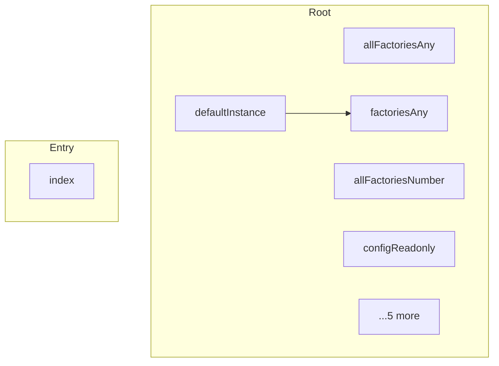

# mathts - Dependency Graph

**Version**: 0.1.0 | **Last Updated**: 2026-02-06

This document provides a comprehensive dependency graph of all files, components, imports, functions, and variables in the codebase.

---

## Table of Contents

1. [Overview](#overview)
2. [Root Dependencies](#root-dependencies)
3. [Entry Dependencies](#entry-dependencies)
4. [Dependency Matrix](#dependency-matrix)
5. [Circular Dependency Analysis](#circular-dependency-analysis)
6. [Visual Dependency Graph](#visual-dependency-graph)
7. [Summary Statistics](#summary-statistics)

---

## Overview

The codebase is organized into the following modules:

- **root**: 10 files
- **entry**: 1 file

---

## Root Dependencies

### `src/allFactoriesAny.ts` - creating all factories here in a separate file is needed to get tree-shaking working

**Internal Dependencies:**
| File | Imports | Type |
|------|---------|------|
| `../factoriesAny.js` | `* as allFactories` | Import |

**Exports:**
- Constants: `all`

---

### `src/allFactoriesNumber.ts` - creating all factories here in a separate file is needed to get tree-shaking working

**Internal Dependencies:**
| File | Imports | Type |
|------|---------|------|
| `../factoriesNumber.js` | `* as allFactories` | Import |

**Exports:**
- Constants: `all`

---

### `src/configReadonly.ts` - create a read-only version of config

**Internal Dependencies:**
| File | Imports | Type |
|------|---------|------|
| `../core/config.js` | `DEFAULT_CONFIG` | Import |
| `../core/function/config.js` | `MATRIX_OPTIONS, NUMBER_OPTIONS` | Import |

**Exports:**
- Constants: `config`

---

### `src/defaultInstance.ts` - defaultInstance module

**Internal Dependencies:**
| File | Imports | Type |
|------|---------|------|
| `./factoriesAny.js` | `* as all` | Import |
| `./core/create.js` | `create` | Import |

**Exports:**
- Default: `create`

---

### `src/factoriesAny.ts` - factoriesAny module

**Internal Dependencies:**
| File | Imports | Type |
|------|---------|------|
| `./core/function/typed.js` | `createTyped` | Re-export |
| `./type/resultset/ResultSet.js` | `createResultSet` | Re-export |
| `./type/bignumber/BigNumber.js` | `createBigNumberClass` | Re-export |
| `./type/complex/Complex.js` | `createComplexClass` | Re-export |
| `./type/fraction/Fraction.js` | `createFractionClass` | Re-export |
| `./type/matrix/Range.js` | `createRangeClass` | Re-export |
| `./type/matrix/Matrix.js` | `createMatrixClass` | Re-export |
| `./type/matrix/DenseMatrix.js` | `createDenseMatrixClass` | Re-export |
| `./function/utils/clone.js` | `createClone` | Re-export |
| `./function/utils/isInteger.js` | `createIsInteger` | Re-export |
| `./function/utils/isNegative.js` | `createIsNegative` | Re-export |
| `./function/utils/isNumeric.js` | `createIsNumeric` | Re-export |
| `./function/utils/hasNumericValue.js` | `createHasNumericValue` | Re-export |
| `./function/utils/isPositive.js` | `createIsPositive` | Re-export |
| `./function/utils/isZero.js` | `createIsZero` | Re-export |
| `./function/utils/isNaN.js` | `createIsNaN` | Re-export |
| `./function/utils/isBounded.js` | `createIsBounded` | Re-export |
| `./function/utils/isFinite.js` | `createIsFinite` | Re-export |
| `./function/utils/typeOf.js` | `createTypeOf` | Re-export |
| `./function/relational/equalScalar.js` | `createEqualScalar` | Re-export |
| `./type/matrix/SparseMatrix.js` | `createSparseMatrixClass` | Re-export |
| `./type/number.js` | `createNumber` | Re-export |
| `./type/bigint.js` | `createBigint` | Re-export |
| `./type/string.js` | `createString` | Re-export |
| `./type/boolean.js` | `createBoolean` | Re-export |
| `./type/bignumber/function/bignumber.js` | `createBignumber` | Re-export |
| `./type/complex/function/complex.js` | `createComplex` | Re-export |
| `./type/fraction/function/fraction.js` | `createFraction` | Re-export |
| `./type/matrix/function/matrix.js` | `createMatrix` | Re-export |
| `./function/matrix/matrixFromFunction.js` | `createMatrixFromFunction` | Re-export |
| `./function/matrix/matrixFromRows.js` | `createMatrixFromRows` | Re-export |
| `./function/matrix/matrixFromColumns.js` | `createMatrixFromColumns` | Re-export |
| `./type/unit/function/splitUnit.js` | `createSplitUnit` | Re-export |
| `./function/arithmetic/unaryMinus.js` | `createUnaryMinus` | Re-export |
| `./function/arithmetic/unaryPlus.js` | `createUnaryPlus` | Re-export |
| `./function/arithmetic/abs.js` | `createAbs` | Re-export |
| `./function/matrix/mapSlices.js` | `createMapSlices` | Re-export |
| `./function/arithmetic/addScalar.js` | `createAddScalar` | Re-export |
| `./function/arithmetic/subtractScalar.js` | `createSubtractScalar` | Re-export |
| `./function/arithmetic/cbrt.js` | `createCbrt` | Re-export |
| `./function/arithmetic/ceil.js` | `createCeil` | Re-export |
| `./function/arithmetic/cube.js` | `createCube` | Re-export |
| `./function/arithmetic/exp.js` | `createExp` | Re-export |
| `./function/arithmetic/expm1.js` | `createExpm1` | Re-export |
| `./function/arithmetic/fix.js` | `createFix` | Re-export |
| `./function/arithmetic/floor.js` | `createFloor` | Re-export |
| `./function/arithmetic/gcd.js` | `createGcd` | Re-export |
| `./function/arithmetic/lcm.js` | `createLcm` | Re-export |
| `./function/arithmetic/log10.js` | `createLog10` | Re-export |
| `./function/arithmetic/log2.js` | `createLog2` | Re-export |
| `./function/arithmetic/mod.js` | `createMod` | Re-export |
| `./function/arithmetic/multiplyScalar.js` | `createMultiplyScalar` | Re-export |
| `./function/arithmetic/multiply.js` | `createMultiply` | Re-export |
| `./function/arithmetic/nthRoot.js` | `createNthRoot` | Re-export |
| `./function/arithmetic/sign.js` | `createSign` | Re-export |
| `./function/arithmetic/sqrt.js` | `createSqrt` | Re-export |
| `./function/arithmetic/square.js` | `createSquare` | Re-export |
| `./function/arithmetic/subtract.js` | `createSubtract` | Re-export |
| `./function/arithmetic/xgcd.js` | `createXgcd` | Re-export |
| `./function/arithmetic/invmod.js` | `createInvmod` | Re-export |
| `./function/arithmetic/dotMultiply.js` | `createDotMultiply` | Re-export |
| `./function/bitwise/bitAnd.js` | `createBitAnd` | Re-export |
| `./function/bitwise/bitNot.js` | `createBitNot` | Re-export |
| `./function/bitwise/bitOr.js` | `createBitOr` | Re-export |
| `./function/bitwise/bitXor.js` | `createBitXor` | Re-export |
| `./function/complex/arg.js` | `createArg` | Re-export |
| `./function/complex/conj.js` | `createConj` | Re-export |
| `./function/complex/im.js` | `createIm` | Re-export |
| `./function/complex/re.js` | `createRe` | Re-export |
| `./function/logical/not.js` | `createNot` | Re-export |
| `./function/logical/nullish.js` | `createNullish` | Re-export |
| `./function/logical/or.js` | `createOr` | Re-export |
| `./function/logical/xor.js` | `createXor` | Re-export |
| `./function/matrix/concat.js` | `createConcat` | Re-export |
| `./function/matrix/column.js` | `createColumn` | Re-export |
| `./function/matrix/count.js` | `createCount` | Re-export |
| `./function/matrix/cross.js` | `createCross` | Re-export |
| `./function/matrix/diag.js` | `createDiag` | Re-export |
| `./function/matrix/filter.js` | `createFilter` | Re-export |
| `./function/matrix/flatten.js` | `createFlatten` | Re-export |
| `./function/matrix/forEach.js` | `createForEach` | Re-export |
| `./function/matrix/getMatrixDataType.js` | `createGetMatrixDataType` | Re-export |
| `./function/matrix/identity.js` | `createIdentity` | Re-export |
| `./function/matrix/kron.js` | `createKron` | Re-export |
| `./function/matrix/map.js` | `createMap` | Re-export |
| `./function/matrix/diff.js` | `createDiff` | Re-export |
| `./function/matrix/ones.js` | `createOnes` | Re-export |
| `./function/matrix/range.js` | `createRange` | Re-export |
| `./function/matrix/reshape.js` | `createReshape` | Re-export |
| `./function/matrix/resize.js` | `createResize` | Re-export |
| `./function/matrix/rotate.js` | `createRotate` | Re-export |
| `./function/matrix/rotationMatrix.js` | `createRotationMatrix` | Re-export |
| `./function/matrix/row.js` | `createRow` | Re-export |
| `./function/matrix/size.js` | `createSize` | Re-export |
| `./function/matrix/squeeze.js` | `createSqueeze` | Re-export |
| `./function/matrix/subset.js` | `createSubset` | Re-export |
| `./function/matrix/transpose.js` | `createTranspose` | Re-export |
| `./function/matrix/ctranspose.js` | `createCtranspose` | Re-export |
| `./function/matrix/zeros.js` | `createZeros` | Re-export |
| `./function/matrix/fft.js` | `createFft` | Re-export |
| `./function/matrix/ifft.js` | `createIfft` | Re-export |
| `./function/numeric/solveODE.js` | `createSolveODE` | Re-export |
| `./function/special/erf.js` | `createErf` | Re-export |
| `./function/special/zeta.js` | `createZeta` | Re-export |
| `./function/statistics/mode.js` | `createMode` | Re-export |
| `./function/statistics/prod.js` | `createProd` | Re-export |
| `./function/string/format.js` | `createFormat` | Re-export |
| `./function/string/bin.js` | `createBin` | Re-export |
| `./function/string/oct.js` | `createOct` | Re-export |
| `./function/string/hex.js` | `createHex` | Re-export |
| `./function/string/print.js` | `createPrint` | Re-export |
| `./function/unit/to.js` | `createTo` | Re-export |
| `./function/unit/toBest.js` | `createToBest` | Re-export |
| `./function/utils/isPrime.js` | `createIsPrime` | Re-export |
| `./function/utils/numeric.js` | `createNumeric` | Re-export |
| `./function/arithmetic/divideScalar.js` | `createDivideScalar` | Re-export |
| `./function/arithmetic/pow.js` | `createPow` | Re-export |
| `./function/arithmetic/round.js` | `createRound` | Re-export |
| `./function/arithmetic/log.js` | `createLog` | Re-export |
| `./function/arithmetic/log1p.js` | `createLog1p` | Re-export |
| `./function/arithmetic/nthRoots.js` | `createNthRoots` | Re-export |
| `./function/arithmetic/dotPow.js` | `createDotPow` | Re-export |
| `./function/arithmetic/dotDivide.js` | `createDotDivide` | Re-export |
| `./function/algebra/solver/lsolve.js` | `createLsolve` | Re-export |
| `./function/algebra/solver/usolve.js` | `createUsolve` | Re-export |
| `./function/algebra/solver/lsolveAll.js` | `createLsolveAll` | Re-export |
| `./function/algebra/solver/usolveAll.js` | `createUsolveAll` | Re-export |
| `./function/bitwise/leftShift.js` | `createLeftShift` | Re-export |
| `./function/bitwise/rightArithShift.js` | `createRightArithShift` | Re-export |
| `./function/bitwise/rightLogShift.js` | `createRightLogShift` | Re-export |
| `./function/logical/and.js` | `createAnd` | Re-export |
| `./function/relational/compare.js` | `createCompare` | Re-export |
| `./function/relational/compareNatural.js` | `createCompareNatural` | Re-export |
| `./function/relational/compareText.js` | `createCompareText` | Re-export |
| `./function/relational/equal.js` | `createEqual` | Re-export |
| `./function/relational/equalText.js` | `createEqualText` | Re-export |
| `./function/relational/smaller.js` | `createSmaller` | Re-export |
| `./function/relational/smallerEq.js` | `createSmallerEq` | Re-export |
| `./function/relational/larger.js` | `createLarger` | Re-export |
| `./function/relational/largerEq.js` | `createLargerEq` | Re-export |
| `./function/relational/deepEqual.js` | `createDeepEqual` | Re-export |
| `./function/relational/unequal.js` | `createUnequal` | Re-export |
| `./function/matrix/partitionSelect.js` | `createPartitionSelect` | Re-export |
| `./function/matrix/sort.js` | `createSort` | Re-export |
| `./function/statistics/max.js` | `createMax` | Re-export |
| `./function/statistics/min.js` | `createMin` | Re-export |
| `./type/matrix/ImmutableDenseMatrix.js` | `createImmutableDenseMatrixClass` | Re-export |
| `./type/matrix/MatrixIndex.js` | `createIndexClass` | Re-export |
| `./type/matrix/FibonacciHeap.js` | `createFibonacciHeapClass` | Re-export |
| `./type/matrix/Spa.js` | `createSpaClass` | Re-export |
| `./type/unit/Unit.js` | `createUnitClass` | Re-export |
| `./type/unit/function/unit.js` | `createUnitFunction` | Re-export |
| `./type/matrix/function/sparse.js` | `createSparse` | Re-export |
| `./type/unit/function/createUnit.js` | `createCreateUnit` | Re-export |
| `./function/trigonometry/acos.js` | `createAcos` | Re-export |
| `./function/trigonometry/acosh.js` | `createAcosh` | Re-export |
| `./function/trigonometry/acot.js` | `createAcot` | Re-export |
| `./function/trigonometry/acoth.js` | `createAcoth` | Re-export |
| `./function/trigonometry/acsc.js` | `createAcsc` | Re-export |
| `./function/trigonometry/acsch.js` | `createAcsch` | Re-export |
| `./function/trigonometry/asec.js` | `createAsec` | Re-export |
| `./function/trigonometry/asech.js` | `createAsech` | Re-export |
| `./function/trigonometry/asin.js` | `createAsin` | Re-export |
| `./function/trigonometry/asinh.js` | `createAsinh` | Re-export |
| `./function/trigonometry/atan.js` | `createAtan` | Re-export |
| `./function/trigonometry/atan2.js` | `createAtan2` | Re-export |
| `./function/trigonometry/atanh.js` | `createAtanh` | Re-export |
| `./function/trigonometry/cos.js` | `createCos` | Re-export |
| `./function/trigonometry/cosh.js` | `createCosh` | Re-export |
| `./function/trigonometry/cot.js` | `createCot` | Re-export |
| `./function/trigonometry/coth.js` | `createCoth` | Re-export |
| `./function/trigonometry/csc.js` | `createCsc` | Re-export |
| `./function/trigonometry/csch.js` | `createCsch` | Re-export |
| `./function/trigonometry/sec.js` | `createSec` | Re-export |
| `./function/trigonometry/sech.js` | `createSech` | Re-export |
| `./function/trigonometry/sin.js` | `createSin` | Re-export |
| `./function/trigonometry/sinh.js` | `createSinh` | Re-export |
| `./function/trigonometry/tan.js` | `createTan` | Re-export |
| `./function/trigonometry/tanh.js` | `createTanh` | Re-export |
| `./function/set/setCartesian.js` | `createSetCartesian` | Re-export |
| `./function/set/setDifference.js` | `createSetDifference` | Re-export |
| `./function/set/setDistinct.js` | `createSetDistinct` | Re-export |
| `./function/set/setIntersect.js` | `createSetIntersect` | Re-export |
| `./function/set/setIsSubset.js` | `createSetIsSubset` | Re-export |
| `./function/set/setMultiplicity.js` | `createSetMultiplicity` | Re-export |
| `./function/set/setPowerset.js` | `createSetPowerset` | Re-export |
| `./function/set/setSize.js` | `createSetSize` | Re-export |
| `./function/set/setSymDifference.js` | `createSetSymDifference` | Re-export |
| `./function/set/setUnion.js` | `createSetUnion` | Re-export |
| `./function/arithmetic/add.js` | `createAdd` | Re-export |
| `./function/arithmetic/hypot.js` | `createHypot` | Re-export |
| `./function/arithmetic/norm.js` | `createNorm` | Re-export |
| `./function/matrix/dot.js` | `createDot` | Re-export |
| `./function/matrix/trace.js` | `createTrace` | Re-export |
| `./type/matrix/function/index.js` | `createIndex` | Re-export |
| `./expression/node/Node.js` | `createNode` | Re-export |
| `./expression/node/AccessorNode.js` | `createAccessorNode` | Re-export |
| `./expression/node/ArrayNode.js` | `createArrayNode` | Re-export |
| `./expression/node/AssignmentNode.js` | `createAssignmentNode` | Re-export |
| `./expression/node/BlockNode.js` | `createBlockNode` | Re-export |
| `./expression/node/ConditionalNode.js` | `createConditionalNode` | Re-export |
| `./expression/node/ConstantNode.js` | `createConstantNode` | Re-export |
| `./expression/node/FunctionAssignmentNode.js` | `createFunctionAssignmentNode` | Re-export |
| `./expression/node/IndexNode.js` | `createIndexNode` | Re-export |
| `./expression/node/ObjectNode.js` | `createObjectNode` | Re-export |
| `./expression/node/OperatorNode.js` | `createOperatorNode` | Re-export |
| `./expression/node/ParenthesisNode.js` | `createParenthesisNode` | Re-export |
| `./expression/node/RangeNode.js` | `createRangeNode` | Re-export |
| `./expression/node/RelationalNode.js` | `createRelationalNode` | Re-export |
| `./expression/node/SymbolNode.js` | `createSymbolNode` | Re-export |
| `./expression/node/FunctionNode.js` | `createFunctionNode` | Re-export |
| `./expression/parse.js` | `createParse` | Re-export |
| `./expression/function/compile.js` | `createCompile` | Re-export |
| `./expression/function/evaluate.js` | `createEvaluate` | Re-export |
| `./expression/Parser.js` | `createParserClass` | Re-export |
| `./expression/function/parser.js` | `createParser` | Re-export |
| `./function/algebra/decomposition/lup.js` | `createLup` | Re-export |
| `./function/algebra/decomposition/qr.js` | `createQr` | Re-export |
| `./function/algebra/decomposition/slu.js` | `createSlu` | Re-export |
| `./function/algebra/solver/lusolve.js` | `createLusolve` | Re-export |
| `./function/algebra/polynomialRoot.js` | `createPolynomialRoot` | Re-export |
| `./expression/Help.js` | `createHelpClass` | Re-export |
| `./type/chain/Chain.js` | `createChainClass` | Re-export |
| `./expression/function/help.js` | `createHelp` | Re-export |
| `./type/chain/function/chain.js` | `createChain` | Re-export |
| `./function/matrix/det.js` | `createDet` | Re-export |
| `./function/matrix/inv.js` | `createInv` | Re-export |
| `./function/matrix/pinv.js` | `createPinv` | Re-export |
| `./function/matrix/eigs.js` | `createEigs` | Re-export |
| `./function/matrix/expm.js` | `createExpm` | Re-export |
| `./function/matrix/sqrtm.js` | `createSqrtm` | Re-export |
| `./function/algebra/sylvester.js` | `createSylvester` | Re-export |
| `./function/algebra/decomposition/schur.js` | `createSchur` | Re-export |
| `./function/algebra/lyap.js` | `createLyap` | Re-export |
| `./function/arithmetic/divide.js` | `createDivide` | Re-export |
| `./function/geometry/distance.js` | `createDistance` | Re-export |
| `./function/geometry/intersect.js` | `createIntersect` | Re-export |
| `./function/statistics/sum.js` | `createSum` | Re-export |
| `./function/statistics/cumsum.js` | `createCumSum` | Re-export |
| `./function/statistics/mean.js` | `createMean` | Re-export |
| `./function/statistics/median.js` | `createMedian` | Re-export |
| `./function/statistics/mad.js` | `createMad` | Re-export |
| `./function/statistics/variance.js` | `createVariance` | Re-export |
| `./function/statistics/quantileSeq.js` | `createQuantileSeq` | Re-export |
| `./function/statistics/std.js` | `createStd` | Re-export |
| `./function/statistics/corr.js` | `createCorr` | Re-export |
| `./function/probability/bernoulli.js` | `createBernoulli` | Re-export |
| `./function/probability/combinations.js` | `createCombinations` | Re-export |
| `./function/probability/combinationsWithRep.js` | `createCombinationsWithRep` | Re-export |
| `./function/probability/gamma.js` | `createGamma` | Re-export |
| `./function/probability/lgamma.js` | `createLgamma` | Re-export |
| `./function/probability/factorial.js` | `createFactorial` | Re-export |
| `./function/probability/kldivergence.js` | `createKldivergence` | Re-export |
| `./function/probability/multinomial.js` | `createMultinomial` | Re-export |
| `./function/probability/permutations.js` | `createPermutations` | Re-export |
| `./function/probability/pickRandom.js` | `createPickRandom` | Re-export |
| `./function/probability/random.js` | `createRandom` | Re-export |
| `./function/probability/randomInt.js` | `createRandomInt` | Re-export |
| `./function/combinatorics/stirlingS2.js` | `createStirlingS2` | Re-export |
| `./function/combinatorics/bellNumbers.js` | `createBellNumbers` | Re-export |
| `./function/combinatorics/catalan.js` | `createCatalan` | Re-export |
| `./function/combinatorics/composition.js` | `createComposition` | Re-export |
| `./function/algebra/leafCount.js` | `createLeafCount` | Re-export |
| `./function/algebra/simplify.js` | `createSimplify` | Re-export |
| `./function/algebra/simplifyConstant.js` | `createSimplifyConstant` | Re-export |
| `./function/algebra/simplifyCore.js` | `createSimplifyCore` | Re-export |
| `./function/algebra/resolve.js` | `createResolve` | Re-export |
| `./function/algebra/symbolicEqual.js` | `createSymbolicEqual` | Re-export |
| `./function/algebra/derivative.js` | `createDerivative` | Re-export |
| `./function/algebra/rationalize.js` | `createRationalize` | Re-export |
| `./function/signal/zpk2tf.js` | `createZpk2tf` | Re-export |
| `./function/signal/freqz.js` | `createFreqz` | Re-export |
| `./json/reviver.js` | `createReviver` | Re-export |
| `./json/replacer.js` | `createReplacer` | Re-export |
| `./constants.js` | `createE, createUppercaseE, createFalse, createI, createInfinity, createLN10, createLN2, createLOG10E, createLOG2E, createNaN, createNull, createPhi, createPi, createUppercasePi, createSQRT1_2, // eslint-disable-line camelcase
  createSQRT2, createTau, createTrue, createVersion` | Re-export |
| `./type/unit/physicalConstants.js` | `createAtomicMass, createAvogadro, createBohrMagneton, createBohrRadius, createBoltzmann, createClassicalElectronRadius, createConductanceQuantum, createCoulomb, createCoulombConstant, createDeuteronMass, createEfimovFactor, createElectricConstant, createElectronMass, createElementaryCharge, createFaraday, createFermiCoupling, createFineStructure, createFirstRadiation, createGasConstant, createGravitationConstant, createGravity, createHartreeEnergy, createInverseConductanceQuantum, createKlitzing, createLoschmidt, createMagneticConstant, createMagneticFluxQuantum, createMolarMass, createMolarMassC12, createMolarPlanckConstant, createMolarVolume, createNeutronMass, createNuclearMagneton, createPlanckCharge, createPlanckConstant, createPlanckLength, createPlanckMass, createPlanckTemperature, createPlanckTime, createProtonMass, createQuantumOfCirculation, createReducedPlanckConstant, createRydberg, createSackurTetrode, createSecondRadiation, createSpeedOfLight, createStefanBoltzmann, createThomsonCrossSection, createVacuumImpedance, createWeakMixingAngle, createWienDisplacement` | Re-export |
| `./expression/transform/mapSlices.transform.js` | `createMapSlicesTransform` | Re-export |
| `./expression/transform/column.transform.js` | `createColumnTransform` | Re-export |
| `./expression/transform/filter.transform.js` | `createFilterTransform` | Re-export |
| `./expression/transform/forEach.transform.js` | `createForEachTransform` | Re-export |
| `./expression/transform/index.transform.js` | `createIndexTransform` | Re-export |
| `./expression/transform/map.transform.js` | `createMapTransform` | Re-export |
| `./expression/transform/max.transform.js` | `createMaxTransform` | Re-export |
| `./expression/transform/mean.transform.js` | `createMeanTransform` | Re-export |
| `./expression/transform/min.transform.js` | `createMinTransform` | Re-export |
| `./expression/transform/range.transform.js` | `createRangeTransform` | Re-export |
| `./expression/transform/row.transform.js` | `createRowTransform` | Re-export |
| `./expression/transform/subset.transform.js` | `createSubsetTransform` | Re-export |
| `./expression/transform/concat.transform.js` | `createConcatTransform` | Re-export |
| `./expression/transform/diff.transform.js` | `createDiffTransform` | Re-export |
| `./expression/transform/std.transform.js` | `createStdTransform` | Re-export |
| `./expression/transform/sum.transform.js` | `createSumTransform` | Re-export |
| `./expression/transform/quantileSeq.transform.js` | `createQuantileSeqTransform` | Re-export |
| `./expression/transform/cumsum.transform.js` | `createCumSumTransform` | Re-export |
| `./expression/transform/variance.transform.js` | `createVarianceTransform` | Re-export |
| `./expression/transform/print.transform.js` | `createPrintTransform` | Re-export |
| `./expression/transform/and.transform.js` | `createAndTransform` | Re-export |
| `./expression/transform/or.transform.js` | `createOrTransform` | Re-export |
| `./expression/transform/nullish.transform.js` | `createNullishTransform` | Re-export |
| `./expression/transform/bitAnd.transform.js` | `createBitAndTransform` | Re-export |
| `./expression/transform/bitOr.transform.js` | `createBitOrTransform` | Re-export |

**Exports:**
- Re-exports: `createTyped`, `createResultSet`, `createBigNumberClass`, `createComplexClass`, `createFractionClass`, `createRangeClass`, `createMatrixClass`, `createDenseMatrixClass`, `createClone`, `createIsInteger`, `createIsNegative`, `createIsNumeric`, `createHasNumericValue`, `createIsPositive`, `createIsZero`, `createIsNaN`, `createIsBounded`, `createIsFinite`, `createTypeOf`, `createEqualScalar`, `createSparseMatrixClass`, `createNumber`, `createBigint`, `createString`, `createBoolean`, `createBignumber`, `createComplex`, `createFraction`, `createMatrix`, `createMatrixFromFunction`, `createMatrixFromRows`, `createMatrixFromColumns`, `createSplitUnit`, `createUnaryMinus`, `createUnaryPlus`, `createAbs`, `createMapSlices`, `createAddScalar`, `createSubtractScalar`, `createCbrt`, `createCeil`, `createCube`, `createExp`, `createExpm1`, `createFix`, `createFloor`, `createGcd`, `createLcm`, `createLog10`, `createLog2`, `createMod`, `createMultiplyScalar`, `createMultiply`, `createNthRoot`, `createSign`, `createSqrt`, `createSquare`, `createSubtract`, `createXgcd`, `createInvmod`, `createDotMultiply`, `createBitAnd`, `createBitNot`, `createBitOr`, `createBitXor`, `createArg`, `createConj`, `createIm`, `createRe`, `createNot`, `createNullish`, `createOr`, `createXor`, `createConcat`, `createColumn`, `createCount`, `createCross`, `createDiag`, `createFilter`, `createFlatten`, `createForEach`, `createGetMatrixDataType`, `createIdentity`, `createKron`, `createMap`, `createDiff`, `createOnes`, `createRange`, `createReshape`, `createResize`, `createRotate`, `createRotationMatrix`, `createRow`, `createSize`, `createSqueeze`, `createSubset`, `createTranspose`, `createCtranspose`, `createZeros`, `createFft`, `createIfft`, `createSolveODE`, `createErf`, `createZeta`, `createMode`, `createProd`, `createFormat`, `createBin`, `createOct`, `createHex`, `createPrint`, `createTo`, `createToBest`, `createIsPrime`, `createNumeric`, `createDivideScalar`, `createPow`, `createRound`, `createLog`, `createLog1p`, `createNthRoots`, `createDotPow`, `createDotDivide`, `createLsolve`, `createUsolve`, `createLsolveAll`, `createUsolveAll`, `createLeftShift`, `createRightArithShift`, `createRightLogShift`, `createAnd`, `createCompare`, `createCompareNatural`, `createCompareText`, `createEqual`, `createEqualText`, `createSmaller`, `createSmallerEq`, `createLarger`, `createLargerEq`, `createDeepEqual`, `createUnequal`, `createPartitionSelect`, `createSort`, `createMax`, `createMin`, `createImmutableDenseMatrixClass`, `createIndexClass`, `createFibonacciHeapClass`, `createSpaClass`, `createUnitClass`, `createUnitFunction`, `createSparse`, `createCreateUnit`, `createAcos`, `createAcosh`, `createAcot`, `createAcoth`, `createAcsc`, `createAcsch`, `createAsec`, `createAsech`, `createAsin`, `createAsinh`, `createAtan`, `createAtan2`, `createAtanh`, `createCos`, `createCosh`, `createCot`, `createCoth`, `createCsc`, `createCsch`, `createSec`, `createSech`, `createSin`, `createSinh`, `createTan`, `createTanh`, `createSetCartesian`, `createSetDifference`, `createSetDistinct`, `createSetIntersect`, `createSetIsSubset`, `createSetMultiplicity`, `createSetPowerset`, `createSetSize`, `createSetSymDifference`, `createSetUnion`, `createAdd`, `createHypot`, `createNorm`, `createDot`, `createTrace`, `createIndex`, `createNode`, `createAccessorNode`, `createArrayNode`, `createAssignmentNode`, `createBlockNode`, `createConditionalNode`, `createConstantNode`, `createFunctionAssignmentNode`, `createIndexNode`, `createObjectNode`, `createOperatorNode`, `createParenthesisNode`, `createRangeNode`, `createRelationalNode`, `createSymbolNode`, `createFunctionNode`, `createParse`, `createCompile`, `createEvaluate`, `createParserClass`, `createParser`, `createLup`, `createQr`, `createSlu`, `createLusolve`, `createPolynomialRoot`, `createHelpClass`, `createChainClass`, `createHelp`, `createChain`, `createDet`, `createInv`, `createPinv`, `createEigs`, `createExpm`, `createSqrtm`, `createSylvester`, `createSchur`, `createLyap`, `createDivide`, `createDistance`, `createIntersect`, `createSum`, `createCumSum`, `createMean`, `createMedian`, `createMad`, `createVariance`, `createQuantileSeq`, `createStd`, `createCorr`, `createBernoulli`, `createCombinations`, `createCombinationsWithRep`, `createGamma`, `createLgamma`, `createFactorial`, `createKldivergence`, `createMultinomial`, `createPermutations`, `createPickRandom`, `createRandom`, `createRandomInt`, `createStirlingS2`, `createBellNumbers`, `createCatalan`, `createComposition`, `createLeafCount`, `createSimplify`, `createSimplifyConstant`, `createSimplifyCore`, `createResolve`, `createSymbolicEqual`, `createDerivative`, `createRationalize`, `createZpk2tf`, `createFreqz`, `createReviver`, `createReplacer`, `createE`, `createUppercaseE`, `createFalse`, `createI`, `createInfinity`, `createLN10`, `createLN2`, `createLOG10E`, `createLOG2E`, `createNaN`, `createNull`, `createPhi`, `createPi`, `createUppercasePi`, `createSQRT1_2`, `// eslint-disable-line camelcase
  createSQRT2`, `createTau`, `createTrue`, `createVersion`, `createAtomicMass`, `createAvogadro`, `createBohrMagneton`, `createBohrRadius`, `createBoltzmann`, `createClassicalElectronRadius`, `createConductanceQuantum`, `createCoulomb`, `createCoulombConstant`, `createDeuteronMass`, `createEfimovFactor`, `createElectricConstant`, `createElectronMass`, `createElementaryCharge`, `createFaraday`, `createFermiCoupling`, `createFineStructure`, `createFirstRadiation`, `createGasConstant`, `createGravitationConstant`, `createGravity`, `createHartreeEnergy`, `createInverseConductanceQuantum`, `createKlitzing`, `createLoschmidt`, `createMagneticConstant`, `createMagneticFluxQuantum`, `createMolarMass`, `createMolarMassC12`, `createMolarPlanckConstant`, `createMolarVolume`, `createNeutronMass`, `createNuclearMagneton`, `createPlanckCharge`, `createPlanckConstant`, `createPlanckLength`, `createPlanckMass`, `createPlanckTemperature`, `createPlanckTime`, `createProtonMass`, `createQuantumOfCirculation`, `createReducedPlanckConstant`, `createRydberg`, `createSackurTetrode`, `createSecondRadiation`, `createSpeedOfLight`, `createStefanBoltzmann`, `createThomsonCrossSection`, `createVacuumImpedance`, `createWeakMixingAngle`, `createWienDisplacement`, `createMapSlicesTransform`, `createColumnTransform`, `createFilterTransform`, `createForEachTransform`, `createIndexTransform`, `createMapTransform`, `createMaxTransform`, `createMeanTransform`, `createMinTransform`, `createRangeTransform`, `createRowTransform`, `createSubsetTransform`, `createConcatTransform`, `createDiffTransform`, `createStdTransform`, `createSumTransform`, `createQuantileSeqTransform`, `createCumSumTransform`, `createVarianceTransform`, `createPrintTransform`, `createAndTransform`, `createOrTransform`, `createNullishTransform`, `createBitAndTransform`, `createBitOrTransform`

---

### `src/factoriesNumber.ts` - ----------------------------------------------------------------------------

**Internal Dependencies:**
| File | Imports | Type |
|------|---------|------|
| `./plain/number/index.js` | `absNumber, acoshNumber, acosNumber, acothNumber, acotNumber, acschNumber, acscNumber, addNumber, andNumber, asechNumber, asecNumber, asinhNumber, asinNumber, atan2Number, atanhNumber, atanNumber, bitAndNumber, bitNotNumber, bitOrNumber, bitXorNumber, cbrtNumber, combinationsNumber, coshNumber, cosNumber, cothNumber, cotNumber, cschNumber, cscNumber, cubeNumber, divideNumber, expm1Number, expNumber, gammaNumber, gcdNumber, isIntegerNumber, isNaNNumber, isNegativeNumber, isPositiveNumber, isZeroNumber, lcmNumber, leftShiftNumber, lgammaNumber, log10Number, log1pNumber, log2Number, logNumber, modNumber, multiplyNumber, normNumber, notNumber, nthRootNumber, orNumber, powNumber, rightArithShiftNumber, rightLogShiftNumber, roundNumber, sechNumber, secNumber, signNumber, sinhNumber, sinNumber, sqrtNumber, squareNumber, subtractNumber, tanhNumber, tanNumber, unaryMinusNumber, unaryPlusNumber, xgcdNumber, xorNumber` | Import |
| `./utils/factory.js` | `factory` | Import |
| `./utils/noop.js` | `noIndex, noMatrix, noSubset` | Import |
| `./types.js` | `TypedFunction` | Import |
| `./core/function/typed.js` | `createTyped` | Re-export |
| `./type/resultset/ResultSet.js` | `createResultSet` | Re-export |
| `./type/matrix/Range.js` | `createRangeClass` | Re-export |
| `./expression/Help.js` | `createHelpClass` | Re-export |
| `./type/chain/Chain.js` | `createChainClass` | Re-export |
| `./expression/function/help.js` | `createHelp` | Re-export |
| `./type/chain/function/chain.js` | `createChain` | Re-export |
| `./function/algebra/resolve.js` | `createResolve` | Re-export |
| `./function/algebra/simplify.js` | `createSimplify` | Re-export |
| `./function/algebra/simplifyConstant.js` | `createSimplifyConstant` | Re-export |
| `./function/algebra/simplifyCore.js` | `createSimplifyCore` | Re-export |
| `./function/algebra/derivative.js` | `createDerivative` | Re-export |
| `./function/algebra/rationalize.js` | `createRationalize` | Re-export |
| `./function/arithmetic/ceil.js` | `createCeilNumber` | Re-export |
| `./function/arithmetic/fix.js` | `createFixNumber` | Re-export |
| `./function/arithmetic/floor.js` | `createFloorNumber` | Re-export |
| `./function/arithmetic/hypot.js` | `createHypot` | Re-export |
| `./function/combinatorics/stirlingS2.js` | `createStirlingS2` | Re-export |
| `./function/combinatorics/bellNumbers.js` | `createBellNumbers` | Re-export |
| `./function/combinatorics/catalan.js` | `createCatalan` | Re-export |
| `./function/combinatorics/composition.js` | `createComposition` | Re-export |
| `./constants.js` | `createE, createUppercaseE, createFalse, // createI, createInfinity, createLN10, createLN2, createLOG10E, createLOG2E, createNaN, createNull, createPhi, createPi, createUppercasePi, createSQRT1_2, // eslint-disable-line camelcase
  createSQRT2, createTau, createTrue, createVersion` | Re-export |
| `./type/number.js` | `createNumber` | Re-export |
| `./type/bigint.js` | `createBigint` | Re-export |
| `./type/string.js` | `createString` | Re-export |
| `./type/boolean.js` | `createBoolean` | Re-export |
| `./expression/function/parser.js` | `createParser` | Re-export |
| `./expression/node/Node.js` | `createNode` | Re-export |
| `./expression/node/AccessorNode.js` | `createAccessorNode` | Re-export |
| `./expression/node/ArrayNode.js` | `createArrayNode` | Re-export |
| `./expression/node/AssignmentNode.js` | `createAssignmentNode` | Re-export |
| `./expression/node/BlockNode.js` | `createBlockNode` | Re-export |
| `./expression/node/ConditionalNode.js` | `createConditionalNode` | Re-export |
| `./expression/node/ConstantNode.js` | `createConstantNode` | Re-export |
| `./expression/node/FunctionAssignmentNode.js` | `createFunctionAssignmentNode` | Re-export |
| `./expression/node/IndexNode.js` | `createIndexNode` | Re-export |
| `./expression/node/ObjectNode.js` | `createObjectNode` | Re-export |
| `./expression/node/OperatorNode.js` | `createOperatorNode` | Re-export |
| `./expression/node/ParenthesisNode.js` | `createParenthesisNode` | Re-export |
| `./expression/node/RangeNode.js` | `createRangeNode` | Re-export |
| `./expression/node/RelationalNode.js` | `createRelationalNode` | Re-export |
| `./expression/node/SymbolNode.js` | `createSymbolNode` | Re-export |
| `./expression/node/FunctionNode.js` | `createFunctionNode` | Re-export |
| `./expression/parse.js` | `createParse` | Re-export |
| `./expression/function/compile.js` | `createCompile` | Re-export |
| `./expression/function/evaluate.js` | `createEvaluate` | Re-export |
| `./expression/Parser.js` | `createParserClass` | Re-export |
| `./function/matrix/mapSlices.js` | `createMapSlices` | Re-export |
| `./function/matrix/filter.js` | `createFilter` | Re-export |
| `./function/matrix/forEach.js` | `createForEach` | Re-export |
| `./function/matrix/map.js` | `createMap` | Re-export |
| `./function/matrix/range.js` | `createRange` | Re-export |
| `./function/matrix/size.js` | `createSize` | Re-export |
| `./function/matrix/partitionSelect.js` | `createPartitionSelect` | Re-export |
| `./function/probability/bernoulli.js` | `createBernoulli` | Re-export |
| `./function/probability/combinationsWithRep.js` | `createCombinationsWithRep` | Re-export |
| `./function/probability/factorial.js` | `createFactorial` | Re-export |
| `./function/probability/multinomial.js` | `createMultinomial` | Re-export |
| `./function/probability/permutations.js` | `createPermutations` | Re-export |
| `./function/probability/pickRandom.js` | `createPickRandom` | Re-export |
| `./function/probability/random.js` | `createRandomNumber` | Re-export |
| `./function/probability/randomInt.js` | `createRandomInt` | Re-export |
| `./function/relational/equalScalar.js` | `createEqualScalarNumber` | Re-export |
| `./function/relational/compare.js` | `createCompareNumber` | Re-export |
| `./function/relational/compareNatural.js` | `createCompareNatural` | Re-export |
| `./function/relational/compareText.js` | `createCompareTextNumber` | Re-export |
| `./function/relational/equal.js` | `createEqualNumber` | Re-export |
| `./function/relational/equalText.js` | `createEqualText` | Re-export |
| `./function/relational/smaller.js` | `createSmallerNumber` | Re-export |
| `./function/relational/smallerEq.js` | `createSmallerEqNumber` | Re-export |
| `./function/relational/larger.js` | `createLargerNumber` | Re-export |
| `./function/relational/largerEq.js` | `createLargerEqNumber` | Re-export |
| `./function/relational/deepEqual.js` | `createDeepEqual` | Re-export |
| `./function/relational/unequal.js` | `createUnequalNumber` | Re-export |
| `./function/special/erf.js` | `createErf` | Re-export |
| `./function/special/zeta.js` | `createZeta` | Re-export |
| `./function/statistics/mode.js` | `createMode` | Re-export |
| `./function/statistics/prod.js` | `createProd` | Re-export |
| `./function/statistics/max.js` | `createMax` | Re-export |
| `./function/statistics/min.js` | `createMin` | Re-export |
| `./function/statistics/sum.js` | `createSum` | Re-export |
| `./function/statistics/cumsum.js` | `createCumSum` | Re-export |
| `./function/statistics/mean.js` | `createMean` | Re-export |
| `./function/statistics/median.js` | `createMedian` | Re-export |
| `./function/statistics/mad.js` | `createMad` | Re-export |
| `./function/statistics/variance.js` | `createVariance` | Re-export |
| `./function/statistics/quantileSeq.js` | `createQuantileSeq` | Re-export |
| `./function/statistics/std.js` | `createStd` | Re-export |
| `./function/statistics/corr.js` | `createCorr` | Re-export |
| `./function/string/format.js` | `createFormat` | Re-export |
| `./function/string/print.js` | `createPrint` | Re-export |
| `./expression/transform/mapSlices.transform.js` | `createMapSlicesTransform` | Re-export |
| `./expression/transform/filter.transform.js` | `createFilterTransform` | Re-export |
| `./expression/transform/forEach.transform.js` | `createForEachTransform` | Re-export |
| `./expression/transform/map.transform.js` | `createMapTransform` | Re-export |
| `./expression/transform/max.transform.js` | `createMaxTransform` | Re-export |
| `./expression/transform/mean.transform.js` | `createMeanTransform` | Re-export |
| `./expression/transform/min.transform.js` | `createMinTransform` | Re-export |
| `./expression/transform/range.transform.js` | `createRangeTransform` | Re-export |
| `./expression/transform/std.transform.js` | `createStdTransform` | Re-export |
| `./expression/transform/sum.transform.js` | `createSumTransform` | Re-export |
| `./expression/transform/cumsum.transform.js` | `createCumSumTransform` | Re-export |
| `./expression/transform/variance.transform.js` | `createVarianceTransform` | Re-export |
| `./function/utils/clone.js` | `createClone` | Re-export |
| `./function/utils/isNumeric.js` | `createIsNumeric` | Re-export |
| `./function/utils/hasNumericValue.js` | `createHasNumericValue` | Re-export |
| `./function/utils/isBounded.js` | `createIsBounded` | Re-export |
| `./function/utils/isFinite.js` | `createIsFinite` | Re-export |
| `./function/utils/typeOf.js` | `createTypeOf` | Re-export |
| `./function/utils/isPrime.js` | `createIsPrime` | Re-export |
| `./function/utils/numeric.js` | `createNumeric` | Re-export |
| `./json/reviver.js` | `createReviver` | Re-export |
| `./json/replacer.js` | `createReplacer` | Re-export |

**Exports:**
- Constants: `createUnaryMinus`, `createUnaryPlus`, `createAbs`, `createAddScalar`, `createSubtractScalar`, `createCbrt`, `createCube`, `createExp`, `createExpm1`, `createGcd`, `createLcm`, `createLog10`, `createLog2`, `createMod`, `createMultiplyScalar`, `createMultiply`, `createNthRoot`, `createSign`, `createSqrt`, `createSquare`, `createSubtract`, `createXgcd`, `createDivideScalar`, `createPow`, `createRound`, `createLog`, `createLog1p`, `createAdd`, `createNorm`, `createDivide`, `createBitAnd`, `createBitNot`, `createBitOr`, `createBitXor`, `createLeftShift`, `createRightArithShift`, `createRightLogShift`, `createAnd`, `createNot`, `createOr`, `createXor`, `createIndex`, `createMatrix`, `createSubset`, `createCombinations`, `createGamma`, `createLgamma`, `createAcos`, `createAcosh`, `createAcot`, `createAcoth`, `createAcsc`, `createAcsch`, `createAsec`, `createAsech`, `createAsin`, `createAsinh`, `createAtan`, `createAtan2`, `createAtanh`, `createCos`, `createCosh`, `createCot`, `createCoth`, `createCsc`, `createCsch`, `createSec`, `createSech`, `createSin`, `createSinh`, `createTan`, `createTanh`, `createSubsetTransform`, `createIsInteger`, `createIsNegative`, `createIsPositive`, `createIsZero`, `createIsNaN`
- Re-exports: `createTyped`, `createResultSet`, `createRangeClass`, `createHelpClass`, `createChainClass`, `createHelp`, `createChain`, `createResolve`, `createSimplify`, `createSimplifyConstant`, `createSimplifyCore`, `createDerivative`, `createRationalize`, `createCeilNumber`, `createFixNumber`, `createFloorNumber`, `createHypot`, `createStirlingS2`, `createBellNumbers`, `createCatalan`, `createComposition`, `createE`, `createUppercaseE`, `createFalse`, `// createI`, `createInfinity`, `createLN10`, `createLN2`, `createLOG10E`, `createLOG2E`, `createNaN`, `createNull`, `createPhi`, `createPi`, `createUppercasePi`, `createSQRT1_2`, `// eslint-disable-line camelcase
  createSQRT2`, `createTau`, `createTrue`, `createVersion`, `createNumber`, `createBigint`, `createString`, `createBoolean`, `createParser`, `createNode`, `createAccessorNode`, `createArrayNode`, `createAssignmentNode`, `createBlockNode`, `createConditionalNode`, `createConstantNode`, `createFunctionAssignmentNode`, `createIndexNode`, `createObjectNode`, `createOperatorNode`, `createParenthesisNode`, `createRangeNode`, `createRelationalNode`, `createSymbolNode`, `createFunctionNode`, `createParse`, `createCompile`, `createEvaluate`, `createParserClass`, `createMapSlices`, `createFilter`, `createForEach`, `createMap`, `createRange`, `createSize`, `createPartitionSelect`, `createBernoulli`, `createCombinationsWithRep`, `createFactorial`, `createMultinomial`, `createPermutations`, `createPickRandom`, `createRandomNumber`, `createRandomInt`, `createEqualScalarNumber`, `createCompareNumber`, `createCompareNatural`, `createCompareTextNumber`, `createEqualNumber`, `createEqualText`, `createSmallerNumber`, `createSmallerEqNumber`, `createLargerNumber`, `createLargerEqNumber`, `createDeepEqual`, `createUnequalNumber`, `createErf`, `createZeta`, `createMode`, `createProd`, `createMax`, `createMin`, `createSum`, `createCumSum`, `createMean`, `createMedian`, `createMad`, `createVariance`, `createQuantileSeq`, `createStd`, `createCorr`, `createFormat`, `createPrint`, `createMapSlicesTransform`, `createFilterTransform`, `createForEachTransform`, `createMapTransform`, `createMaxTransform`, `createMeanTransform`, `createMinTransform`, `createRangeTransform`, `createStdTransform`, `createSumTransform`, `createCumSumTransform`, `createVarianceTransform`, `createClone`, `createIsNumeric`, `createHasNumericValue`, `createIsBounded`, `createIsFinite`, `createTypeOf`, `createIsPrime`, `createNumeric`, `createReviver`, `createReplacer`

---

### `src/mainAny.ts` - configuration

**Internal Dependencies:**
| File | Imports | Type |
|------|---------|------|
| `./pureFunctionsAny.generated.js` | `*` | Re-export |
| `./impureFunctionsAny.generated.js` | `*` | Re-export |
| `./typeChecks.js` | `*` | Re-export |
| `./dependenciesAny.generated.js` | `*` | Re-export |
| `../factoriesAny.js` | `*` | Re-export |
| `./configReadonly.js` | `config` | Re-export |
| `../error/IndexError.js` | `IndexError` | Re-export |
| `../error/DimensionError.js` | `DimensionError` | Re-export |
| `../error/ArgumentsError.js` | `ArgumentsError` | Re-export |
| `../core/create.js` | `create` | Re-export |
| `../utils/factory.js` | `factory` | Re-export |

**Exports:**
- Re-exports: `* from ./pureFunctionsAny.generated.js`, `* from ./impureFunctionsAny.generated.js`, `* from ./typeChecks.js`, `* from ./dependenciesAny.generated.js`, `* from ../factoriesAny.js`, `config`, `IndexError`, `DimensionError`, `ArgumentsError`, `create`, `factory`

---

### `src/mainNumber.ts` - configuration

**Internal Dependencies:**
| File | Imports | Type |
|------|---------|------|
| `./pureFunctionsNumber.generated.js` | `*` | Re-export |
| `./impureFunctionsNumber.generated.js` | `*` | Re-export |
| `./typeChecks.js` | `*` | Re-export |
| `./dependenciesNumber.generated.js` | `*` | Re-export |
| `../factoriesNumber.js` | `*` | Re-export |
| `./configReadonly.js` | `config` | Re-export |
| `../error/IndexError.js` | `IndexError` | Re-export |
| `../error/DimensionError.js` | `DimensionError` | Re-export |
| `../error/ArgumentsError.js` | `ArgumentsError` | Re-export |
| `../core/create.js` | `create` | Re-export |
| `../utils/factory.js` | `factory` | Re-export |

**Exports:**
- Re-exports: `* from ./pureFunctionsNumber.generated.js`, `* from ./impureFunctionsNumber.generated.js`, `* from ./typeChecks.js`, `* from ./dependenciesNumber.generated.js`, `* from ../factoriesNumber.js`, `config`, `IndexError`, `DimensionError`, `ArgumentsError`, `create`, `factory`

---

### `src/number.ts` - number module

**Internal Dependencies:**
| File | Imports | Type |
|------|---------|------|
| `./entry/mainNumber.js` | `*` | Re-export |

**Exports:**
- Re-exports: `* from ./entry/mainNumber.js`

---

### `src/typeChecks.ts` - util functions

**Internal Dependencies:**
| File | Imports | Type |
|------|---------|------|
| `../utils/is.js` | `isAccessorNode, isArray, isArrayNode, isAssignmentNode, isBigNumber, isBigInt, isBlockNode, isBoolean, isChain, isCollection, isComplex, isConditionalNode, isConstantNode, isDate, isDenseMatrix, isFraction, isFunction, isFunctionAssignmentNode, isFunctionNode, isHelp, isIndex, isIndexNode, isMatrix, isNode, isNull, isNumber, isString, isUndefined, isObject, isMap, isPartitionedMap, isObjectWrappingMap, isObjectNode, isOperatorNode, isParenthesisNode, isRange, isRangeNode, isRelationalNode, isRegExp, isResultSet, isSparseMatrix, isSymbolNode, isUnit` | Re-export |

**Exports:**
- Re-exports: `isAccessorNode`, `isArray`, `isArrayNode`, `isAssignmentNode`, `isBigNumber`, `isBigInt`, `isBlockNode`, `isBoolean`, `isChain`, `isCollection`, `isComplex`, `isConditionalNode`, `isConstantNode`, `isDate`, `isDenseMatrix`, `isFraction`, `isFunction`, `isFunctionAssignmentNode`, `isFunctionNode`, `isHelp`, `isIndex`, `isIndexNode`, `isMatrix`, `isNode`, `isNull`, `isNumber`, `isString`, `isUndefined`, `isObject`, `isMap`, `isPartitionedMap`, `isObjectWrappingMap`, `isObjectNode`, `isOperatorNode`, `isParenthesisNode`, `isRange`, `isRangeNode`, `isRelationalNode`, `isRegExp`, `isResultSet`, `isSparseMatrix`, `isSymbolNode`, `isUnit`

---

## Entry Dependencies

### `src/index.ts` - index module

**Internal Dependencies:**
| File | Imports | Type |
|------|---------|------|
| `./entry/mainAny.js` | `*` | Re-export |

**Exports:**
- Re-exports: `* from ./entry/mainAny.js`

---

## Dependency Matrix

### File Import/Export Matrix

| File | Imports From | Exports To |
|------|--------------|------------|
| `allFactoriesAny` | 1 files | 0 files |
| `allFactoriesNumber` | 1 files | 0 files |
| `configReadonly` | 2 files | 2 files |
| `defaultInstance` | 2 files | 0 files |
| `factoriesAny` | 301 files | 1 files |
| `factoriesNumber` | 117 files | 0 files |
| `index` | 1 files | 0 files |
| `mainAny` | 11 files | 0 files |
| `mainNumber` | 11 files | 0 files |
| `number` | 1 files | 0 files |
| `typeChecks` | 1 files | 2 files |

---

## Circular Dependency Analysis

**No circular dependencies detected.**
---

## Visual Dependency Graph

---

## Summary Statistics

| Category | Count |
|----------|-------|
| Total TypeScript Files | 11 |
| Total Modules | 2 |
| Total Lines of Code | 857 |
| Total Exports | 636 |
| Total Re-exports | 567 |
| Total Classes | 0 |
| Total Interfaces | 0 |
| Total Functions | 0 |
| Total Type Guards | 0 |
| Total Enums | 0 |
| Type-only Imports | 0 |
| Runtime Circular Deps | 0 |
| Type-only Circular Deps | 0 |

---

*Last Updated*: 2026-02-06
*Version*: 0.1.0
