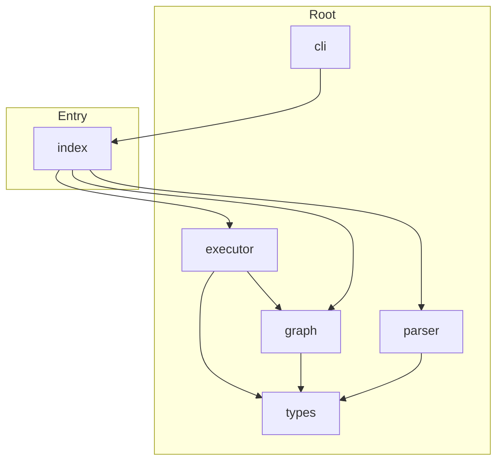

# @mathts/workbook - Dependency Graph

**Version**: 0.1.0 | **Last Updated**: 2026-04-04

This document provides a comprehensive dependency graph of all files, components, imports, functions, and variables in the codebase.

---

## Table of Contents

1. [Overview](#overview)
2. [Package Dependencies](#package-dependencies)
3. [Root Dependencies](#root-dependencies)
4. [Entry Dependencies](#entry-dependencies)
5. [Dependency Matrix](#dependency-matrix)
6. [Circular Dependency Analysis](#circular-dependency-analysis)
7. [Visual Dependency Graph](#visual-dependency-graph)
8. [Summary Statistics](#summary-statistics)

---

## Overview

The codebase is organized into the following modules:

- **root**: 5 files
- **entry**: 1 file

---

## Root Dependencies

### `src/cli.ts` - MathTS Workbook CLI

**Internal Dependencies:**
| File | Imports | Type |
|------|---------|------|
| `./index` | `parseWorkbook, createExecutor` | Import |

---

### `src/executor.ts` - Workbook executor

**Internal Dependencies:**
| File | Imports | Type |
|------|---------|------|
| `./types` | `Workbook, Cell, WorkbookEvent, DependencyGraph` | Import (type-only) |
| `./graph` | `buildDependencyGraph, getDependents` | Import |

**Exports:**
- Classes: `WorkbookExecutor`
- Functions: `createExecutor`

---

### `src/graph.ts` - Dependency graph management

**Internal Dependencies:**
| File | Imports | Type |
|------|---------|------|
| `./types` | `Cell, DependencyGraph, DependencyNode` | Import (type-only) |

**Exports:**
- Functions: `buildDependencyGraph`, `topologicalSort`, `getDependents`, `detectCycles`

---

### `src/parser.ts` - Workbook YAML parser

**Internal Dependencies:**
| File | Imports | Type |
|------|---------|------|
| `./types` | `Workbook, ParseResult, CellType` | Import (type-only) |

**Exports:**
- Functions: `parseWorkbook`, `serializeWorkbook`, `stripOutputs`

---

### `src/types.ts` - Workbook type definitions

**Exports:**
- Interfaces: `WorkbookMetadata`, `RuntimeConfig`, `Cell`, `Workbook`, `ParseResult`, `WorkbookEvent`, `DependencyNode`, `DependencyGraph`
- Types: `CellType`, `ExecutionMode`

---

## Entry Dependencies

### `src/index.ts` - Scientific workbook runtime

**Internal Dependencies:**
| File | Imports | Type |
|------|---------|------|
| `./parser` | `parseWorkbook, serializeWorkbook, stripOutputs` | Re-export |
| `./graph` | `buildDependencyGraph, topologicalSort, getDependents` | Re-export |
| `./executor` | `WorkbookExecutor, createExecutor` | Re-export |

**Exports:**
- Constants: `VERSION`
- Re-exports: `parseWorkbook`, `serializeWorkbook`, `stripOutputs`, `buildDependencyGraph`, `topologicalSort`, `getDependents`, `WorkbookExecutor`, `createExecutor`

---

## Dependency Matrix

### File Import/Export Matrix

| File | Imports From | Exports To |
|------|--------------|------------|
| `src/index` | 3 files | 1 file |
| `src/executor` | 2 files | 1 file |
| `src/graph` | 1 file | 2 files |
| `src/types` | 0 files | 3 files |
| `src/parser` | 1 file | 1 file |
| `src/cli` | 1 file | 0 files |

---

## Circular Dependency Analysis

**No circular dependencies detected.**
---

## Visual Dependency Graph

---

## Summary Statistics

| Category | Count |
|----------|-------|
| Total TypeScript Files | 6 |
| Total Modules | 2 |
| Total Lines of Code | 690 |
| Total Exports | 19 |
| Total Re-exports | 8 |
| Total Classes | 1 |
| Total Interfaces | 8 |
| Total Functions | 8 |
| Total Type Guards | 0 |
| Total Enums | 0 |
| Type-only Imports | 3 |
| Runtime Circular Deps | 0 |
| Type-only Circular Deps | 0 |

---

*Last Updated*: 2026-04-04
*Version*: 0.1.0
